# 01. Product & Functional Overview

> **What this document covers:** what HireBuddha actually does — every user-facing capability, who is allowed to use it, and how the pieces fit together — derived from the code, not from a pitch deck.
> **Who should read it:** every new developer, on day one, before anything else.
> **Prerequisites:** none. Read [02 — System architecture](02-system-architecture.md) next for *how* it is wired.

---

## Table of contents

1. [The 60-second version](#1-the-60-second-version)
2. [What HireBuddha is](#2-what-hirebuddha-is)
3. [The four-tier entity hierarchy](#3-the-four-tier-entity-hierarchy)
4. [The company hierarchy: APP, PARTNER, TENANT](#4-the-company-hierarchy-app-partner-tenant)
5. [The six roles and what each can do](#5-the-six-roles-and-what-each-can-do)
6. [Capability areas](#6-capability-areas)
   - [6.1 No-code entity builder](#61-no-code-entity-builder)
   - [6.2 Running executions and live traces](#62-running-executions-and-live-traces)
   - [6.3 Human-in-the-loop approvals](#63-human-in-the-loop-approvals)
   - [6.4 Template marketplace](#64-template-marketplace)
   - [6.5 Knowledge base and RAG](#65-knowledge-base-and-rag)
   - [6.6 CORTEX memory explorer](#66-cortex-memory-explorer)
   - [6.7 Voice campaigns and the auto-dialer](#67-voice-campaigns-and-the-auto-dialer)
   - [6.8 WhatsApp and messaging](#68-whatsapp-and-messaging)
   - [6.9 Phone number pool](#69-phone-number-pool)
   - [6.10 Integrations and the credentials registry](#610-integrations-and-the-credentials-registry)
   - [6.11 Social connections](#611-social-connections)
   - [6.12 Billing, wallet, credits and top-ups](#612-billing-wallet-credits-and-top-ups)
   - [6.13 Reports and dashboards per role](#613-reports-and-dashboards-per-role)
   - [6.14 Artifacts](#614-artifacts)
   - [6.15 Admin surfaces](#615-admin-surfaces)
   - [6.16 Onboarding wizard](#616-onboarding-wizard)
   - [6.17 Tool management](#617-tool-management)
7. [A day in the life](#7-a-day-in-the-life)
8. [Capability matrix: feature by role](#8-capability-matrix-feature-by-role)
9. [What the platform is NOT](#9-what-the-platform-is-not)
10. [Key files reference](#key-files-reference)
11. [Gotchas and things that surprise newcomers](#gotchas-and-things-that-surprise-newcomers)
12. [Where to go next](#where-to-go-next)

---

## 1. The 60-second version

HireBuddha is a **multi-tenant platform where a non-programmer builds an AI agent
in a web form, runs it, watches it think, approves the risky bits, and gets a
bill for exactly what it cost**.

Four things make it more than a chat wrapper:

1. **Agents are data, not code.** Every agent lives as one row in
   `hierarchical_entities` with nine JSON columns holding its prompt, plan,
   tools, memory policy and guardrails
   ([orm/entity.py:21](../../backend/src/ai/orm/entity.py:21)). A tenant admin
   fills in six tabs in the browser and a working agent exists. No deploy.
2. **Agents compose.** An `ACTION` does one thing. A `SKILL` chains actions.
   An `AGENT` orchestrates skills. A `PROCESS` orchestrates agents
   ([schemas/enums.py:27](../../backend/src/ai/schemas/enums.py:27)). The same
   execution engine runs all four.
3. **It is a reseller platform, not a single-tenant SaaS.** `companies` is a
   tree: one `APP` company at the root, `PARTNER` companies who resell, and
   `TENANT` companies who are the end customers
   ([auth/models.py:9](../../backend/src/auth/models.py:9)).
4. **Everything is metered.** Every LLM call, tool call and phone minute writes
   an attributed row, and credits are deducted from a wallet with a defined
   bucket order ([credit_service.py](../../backend/src/billing/credit_service.py)).

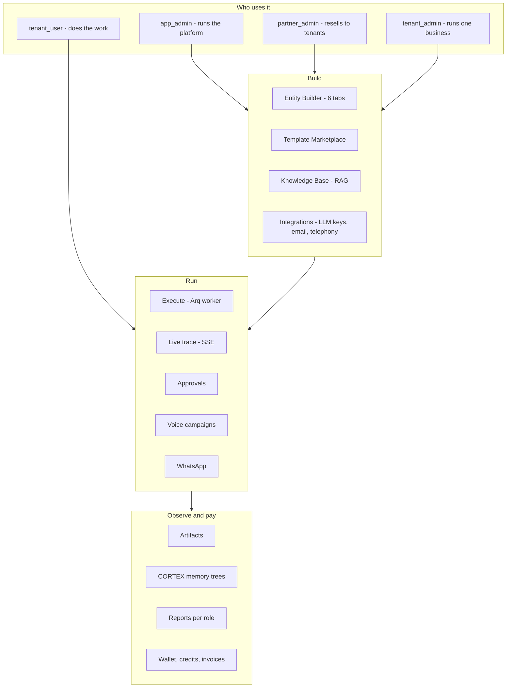

---

## 2. What HireBuddha is

**One paragraph.** HireBuddha is a multi-tenant platform for
building and running autonomous AI agents without writing code. A business user
signs up, connects an LLM provider key, and then either clones a ready-made
template or assembles an agent through a six-tab form: who it is, what it can
do, how it plans, which tools it may call, and where a human must sign off. The
platform runs that agent on a background worker under a real control loop with
critics, memory and budget caps, streams the reasoning to the browser as it
happens, and stores every produced file as an artifact. The same agent
definition can be driven by a web trigger, an inbound phone call, a WhatsApp
message, or a bulk outbound calling campaign. Every token, tool call and phone
minute is costed, marked up by a configurable billing formula, and deducted from
a credit wallet.

**The value proposition, stated only in terms of things that exist in the code:**

| Claim | Where it is real in the code |
|-------|------------------------------|
| Build an agent without code | [`EntityConfigurationTabs.tsx`](../../frontend/src/pages/ai/EntityConfigurationTabs.tsx) — 1780 lines of form that produce one JSON payload |
| Agents compose into bigger agents | `StepType.CHILD_ENTITY_INVOCATION` ([enums.py](../../backend/src/ai/schemas/enums.py)) plus `parent_run_id` on `execution_runs` |
| Watch it reason live | SSE endpoint [`router.py:324`](../../backend/src/ai/router.py:324) + [`useExecutionEvents.ts`](../../frontend/src/hooks/useExecutionEvents.ts) |
| Stop it before it does something dumb | `HumanApproval` table + five HITL trigger types ([governance.py](../../backend/src/ai/schemas/governance.py)) |
| Reach customers on the phone | `CampaignExecutor` auto-dialer over Twilio / Tata Tele ([campaign_executor.py](../../backend/src/ai/campaign_executor.py)) |
| Remember across runs | CORTEX cognitive trees, browsable in the UI ([`CortexExplorer.tsx`](../../frontend/src/pages/ai/CortexExplorer.tsx)) |
| Resell it under your own brand | `companies.type = PARTNER` + `logo_url` + partner analytics ([partner_router.py](../../backend/src/auth/partner_router.py)) |
| Know exactly what it cost | `usage_logs` with an `attribution` column, surfaced at [`CostAttributionDashboard.tsx`](../../frontend/src/pages/admin/CostAttributionDashboard.tsx) |

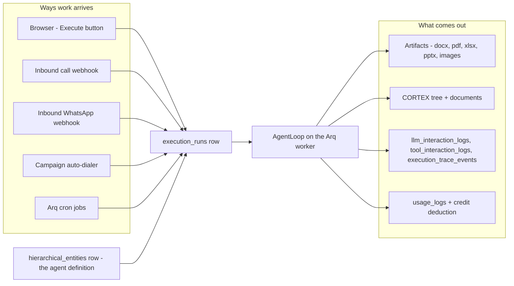

---

## 3. The four-tier entity hierarchy

Everything the platform executes is a **hierarchical entity**. There is exactly
one table and one enum:

```python
# backend/src/ai/schemas/enums.py
class EntityType(str, Enum):
    ACTION = "ACTION"
    SKILL = "SKILL"
    AGENT = "AGENT"
    PROCESS = "PROCESS"
```

The four levels are a **granularity ladder**, not four different engines. They
all live in `hierarchical_entities` and are all run by the same `AgentLoop`.
The seed author's own words describe the intent best:

| Level | Type | What it means functionally | Analogy from [DESIGN.md](../../backend/scripts/seeds/deep_research/DeepResearchSetup/DESIGN.md) |
|-------|------|----------------------------|--------------------------------------------------------------|
| 1 | `ACTION` | Atomic. `hierarchy.is_atomic = true`, no children. Usually exactly one plan step that calls one tool. | "A single neuron firing" |
| 2 | `SKILL` | 2–5 ACTIONs chained in a static plan. A coherent capability. | "A reflex arc" |
| 3 | `AGENT` | Autonomous. Has tools, planning, reasoning, memory and a review mechanism. Composes SKILLs. | "A specialist worker" |
| 4 | `PROCESS` | Top-level orchestrator. Composes AGENTs, owns the governance budget. | "The executive brain" |

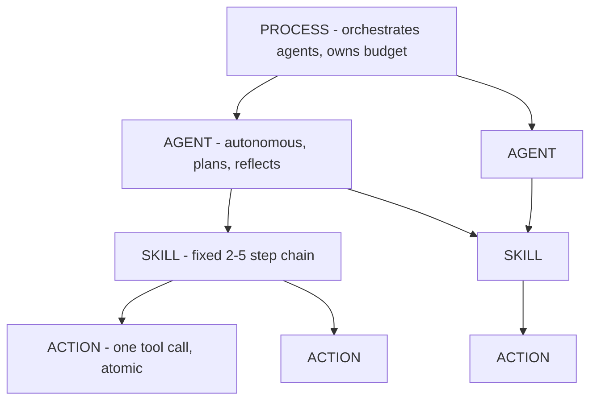

### 3.1 How a level is expressed on the row

An entity's whole behaviour lives in nine JSON columns
([orm/entity.py:42](../../backend/src/ai/orm/entity.py:42)):

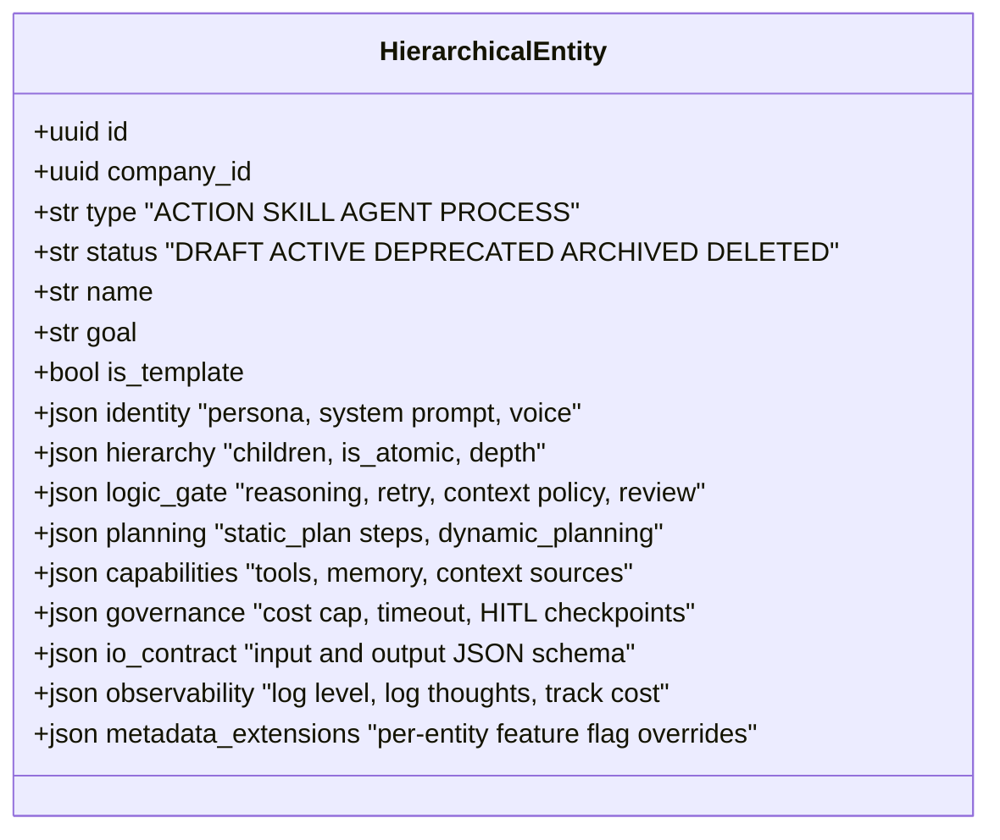

The **only structural difference between an ACTION and a PROCESS is the
content of those columns.** An ACTION sets
`hierarchy.is_atomic = true, composition_depth = 0`. A PROCESS sets
`composition_depth = 3` and lists AGENT children.

Here is a real ACTION, trimmed, from the Autonomous BI seed
([actions.py](../../backend/scripts/seeds/default_entities/SeedAutonomousBI/actions.py)):

```python
# backend/scripts/seeds/default_entities/SeedAutonomousBI/actions.py
{
    "name": "bi-fetch-data",
    "display_name": "BI Data Fetcher",
    "goal": "Retrieve raw business data from configured data sources. ...",
    "type": "ACTION", "version": "1.0.0", "status": "ACTIVE",
    "hierarchy": {"is_atomic": True, "composition_depth": 0, "children": []},
    "logic_gate": {
        "reasoning_config": {"task_type": "text_generation", "temperature": 0.2,
                             "reasoning_mode": "REACT"},
        "retry_policy": {"max_retries": 2, "backoff_strategy": "EXPONENTIAL",
                         "retry_on": ["TOOL_FAILURE", "TIMEOUT"]},
        "context_policy": {"type": "EXPLICIT", "explicit_keys": ["input", "data_source", "query"]}
    },
    "planning": {"static_plan": {"enabled": True, "steps": [{
        "step_id": "step_1", "order": 1, "name": "Fetch Raw Data",
        "type": "TOOL_CALL",
        "target": {"tool_id": "terminal_tool", "prompt_template": "{{input}}"},
        "required": True}]}},
    "capabilities": {"tools": [{"tool_id": "terminal_tool"}],
                     "memory": {"enabled": True, "mode": "CORTEX"}},
    "governance": {"timeout_ms": 60000, "max_cost_usd": 0.10}
}
```

Note the shape: **one step, one tool, a 10-cent cap**. That is what "atomic"
means in practice.

A SKILL looks the same but its steps are `CHILD_ENTITY_INVOCATION` and it wires
outputs forward with `{{step_1}}` template references
([skills.py](../../backend/scripts/seeds/default_entities/SeedAutonomousBI/skills.py)):

```python
# backend/scripts/seeds/default_entities/SeedAutonomousBI/skills.py
"planning": {"static_plan": {"enabled": True, "steps": [
    {"step_id": "step_1", "order": 1, "name": "Fetch Raw Data",
     "type": "CHILD_ENTITY_INVOCATION",
     "target": {"entity_id": "__PLACEHOLDER_fetch_data__", "prompt_template": "{{input}}"},
     "required": True},
    {"step_id": "step_2", "order": 2, "name": "Clean and Transform",
     "type": "CHILD_ENTITY_INVOCATION",
     "target": {"entity_id": "__PLACEHOLDER_clean_transform__",
                "prompt_template": "Clean and transform this raw data for analysis:\n\n{{step_1}}",
                "input_dependencies": ["step_1"]},
     "required": True}
]}}
```

The `__PLACEHOLDER_*__` strings are rewritten with real UUIDs by
[`create_bi_entities.py`](../../backend/scripts/seeds/default_entities/SeedAutonomousBI/create_bi_entities.py)
after the children are created — a useful hint that **child references are
UUIDs, so hierarchies must be created bottom-up**.

### 3.2 Worked example: SeedAutonomousBI — 23 entities

[`SeedAutonomousBI/DESIGN.md`](../../backend/scripts/seeds/default_entities/SeedAutonomousBI/DESIGN.md)
builds a business-intelligence pipeline: 11 ACTIONs, 8 SKILLs, 3 AGENTs, 1 PROCESS.

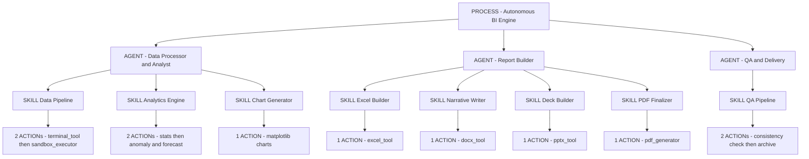

Two details worth internalising, both visible in
[`create_bi_entities.py`](../../backend/scripts/seeds/default_entities/SeedAutonomousBI/create_bi_entities.py):

- **A PROCESS can have plain `ACTION`-typed steps too.** Step 2 of the BI
  PROCESS is a "Analytics Quality Gate" whose `type` is `ACTION` with only a
  `prompt_template` — no tool, no child. That is an LLM reasoning step used as
  a gate: `"Output: PASS or NEEDS_MORE_PROCESSING with specific gaps."`
- **Governance budgets grow up the tree.** The ACTION caps at `$0.10`, the
  SKILL at `$0.50`, the AGENT at `$5.00` with `timeout_ms: 900000` and
  `max_recursion_depth: 4`.

### 3.3 Worked example: Deep Research — the same shape, a different domain

[`deep_research/DeepResearchSetup`](../../backend/scripts/seeds/deep_research/DeepResearchSetup/)
has two generations in the tree, and the difference between them is the single
most instructive thing in the seeds folder.

| | v1 ([`create_entities.py`](../../backend/scripts/seeds/deep_research/DeepResearchSetup/create_entities.py)) | v2 ([`create_v2.py`](../../backend/scripts/seeds/deep_research/DeepResearchSetup/create_v2.py)) |
|---|---|---|
| Entities | 15 | 5 |
| Depth | PROCESS → 2 AGENTs → 5 SKILLs → 7 ACTIONs | PROCESS → 1 AGENT → 3 SKILLs |
| Idea | Model every research sub-step as its own entity | One autonomous director that invokes three fat skills |

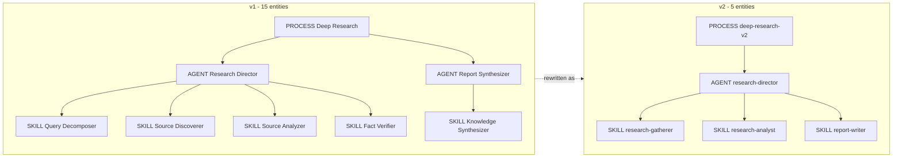

### 3.4 The anti-pattern: DocumentFactory vs DocFactoryLite

[`SeedDocumentFactory/DESIGN.md`](../../backend/scripts/seeds/default_entities/SeedDocumentFactory/DESIGN.md)
declares roughly **50 entities** across 4 levels — a DOCX agent, a PPTX agent, an
XLSX agent, a PDF agent, each with creator/editor/reader/validator skills, each
skill wrapping 1–4 actions.

[`SeedDocFactoryLite/create_lite.py`](../../backend/scripts/seeds/default_entities/SeedDocFactoryLite/create_lite.py)
replaces the whole thing with **one flat AGENT**, and the docstring says exactly
why:

```python
# backend/scripts/seeds/default_entities/SeedDocFactoryLite/create_lite.py
"""
doc-factory-lite — lean single-agent replacement for doc-factory-process.

... the 50-entity, 4-level doc-factory hierarchy multiplies LLM calls on top of
the Phase-11 loop; this collapses it to ONE flat AGENT with a deterministic
``outline → generate → validate → finalize`` plan (one lightweight planning
step, then build), in-sandbox validation (no whole-file context bloat), an
enforced cost cap, and exactly ONE registered artifact.
"""
```

**Lesson for a new developer:** the four-tier hierarchy is a *capability*, not a
style guide. Every extra level costs LLM calls, because each entity in the chain
gets its own perceive-strategize-act-critique cycle. Deep hierarchies pay for
themselves only when the sub-parts are genuinely reusable or genuinely need
independent budgets.

The same file also documents four real schema traps that a seed author hit:

| Trap | Reality |
|------|---------|
| Entity create is a **closed** Pydantic model | Unknown keys are silently dropped — a typo'd config key just vanishes |
| System prompt goes under `identity` | Not under `prompts` |
| `review_mechanism.critic_model_override` | Read by the kernel, **not** a declared schema field, so it cannot be set from a seed payload |
| `context_policy.type` | Must be one of `FULL`, `LAST_N`, `SLIDING_WINDOW`, `EXPLICIT` |

---

## 4. The company hierarchy: APP, PARTNER, TENANT

`companies.type` is a plain string column with three values, and `parent_id`
makes it a tree ([auth/models.py:9](../../backend/src/auth/models.py:9)):

```python
# backend/src/auth/models.py
class Company(Base):
    __tablename__ = "companies"
    id = Column(UUID(as_uuid=True), primary_key=True, default=uuid.uuid4)
    name = Column(String, nullable=False)
    type = Column(String, nullable=False)  # APP, PARTNER, TENANT
    parent_id = Column(UUID(as_uuid=True), ForeignKey("companies.id"), nullable=True)
    logo_url = Column(String, nullable=True)
    status = Column(String, default="active")  # active, suspended
    onboarding_status = Column(String, default="pending")
    onboarding_metadata = Column(JSONB, nullable=True)
    default_daily_credits = Column(String, nullable=True)
```

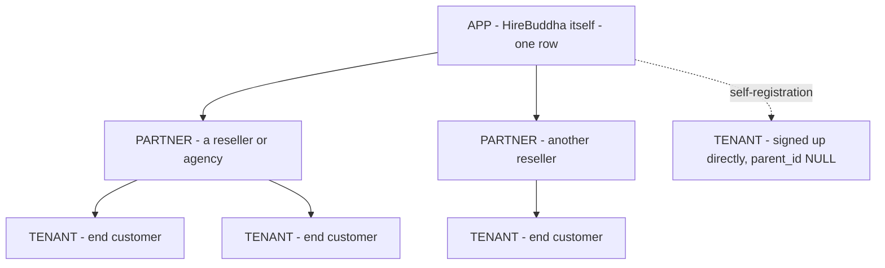

| Type | Who they are | What they own |
|------|--------------|---------------|
| `APP` | The platform operator | The global `BillingConfig`, the template library, the phone-number inventory, the tool registry, AI task defaults |
| `PARTNER` | A reseller, agency or channel | A portfolio of TENANT children; sees their health, cost and wallet balances; can create tenants and their users; can build entities *on behalf of* a child tenant |
| `TENANT` | An end-customer business | Its own entities, executions, documents, artifacts, credentials, phone numbers and credit wallet |

**Why this exists — white-labelling and reselling.** The partner tier is the
whole reason for the tree. Concretely, in
[`partner_router.py`](../../backend/src/auth/partner_router.py):

- `GET /partner/tenants` lists every tenant whose `parent_id` is the partner's
  company, each with a **health score out of 100** built from four signals.
- `GET /partner/tenants/{id}/details` drills into one tenant's integrations,
  entities, recent runs and users.
- `GET /partner/analytics/summary` aggregates entity count, execution count,
  total cost and total wallet balance across the whole portfolio.

The health score is worth quoting because it tells you what the product
considers a "healthy" customer:

```python
# backend/src/auth/partner_router.py
# 1. Wallet balance (0-30 pts)   — full points if balance > $10
# 2. Active integrations (0-20)  — 2+ integrations = full score
# 3. Active agents (0-25)        — 5+ entities = full score
# 4. Recent executions 7d (0-25) — 10+ executions = full score
summary["health_level"] = ("green" if health_score >= 70 else
                           "amber" if health_score >= 40 else "red")
```

**Self-registration always creates a TENANT.** `POST /auth/register` builds a
company named `"{full_name}'s Workspace"` with `type="TENANT"`, no parent, and
makes the registrant a `tenant_admin`
([auth/service.py:97](../../backend/src/auth/service.py:97)). A wallet is
provisioned in the same transaction, seeded from the global
`BillingConfig.default_daily_credits`.

---

## 5. The six roles and what each can do

`users.role` is a plain string with six values
([auth/models.py](../../backend/src/auth/models.py)); the frontend mirrors them
in `UserRole` ([types/index.ts:24](../../frontend/src/types/index.ts:24)).
Authorisation is a **flat allow-list check** — there is no inheritance:

```python
# backend/src/auth/dependencies.py
class RoleChecker:
    def __init__(self, allowed_roles: list[str]):
        self.allowed_roles = allowed_roles

    def __call__(self, user: User = Depends(get_current_user)):
        if user.role not in self.allowed_roles:
            raise HTTPException(status_code=403, detail="Operation not permitted")
        return user
```

| Role | Tier | Practical scope |
|------|------|-----------------|
| `app_admin` | APP | Sees and edits everything, every company. The only role that can publish templates, manage the tool registry, set AI task defaults, add phone numbers, and edit billing config |
| `app_user` | APP | Platform operations without admin powers. Gets the "Ops and Incidents" reports (incidents, provider health, latency, rate limits, data growth, HITL SLA). Cannot reach Platform Hub |
| `partner_admin` | PARTNER | Creates TENANT companies and their users; sees portfolio analytics; can create entities for child tenants |
| `partner_user` | PARTNER | Read-oriented partner support: tenant health scorecards, onboarding tracker, config errors, credit alerts. Can also create entities for child tenants |
| `tenant_admin` | TENANT | Full control of one tenant: users, entities, integrations, phone claims, wallet |
| `tenant_user` | TENANT | Day-to-day operator: build and run entities, respond to approvals, see own task history |

### 5.1 Who can create whom

From [`auth/service.py:52`](../../backend/src/auth/service.py:52):

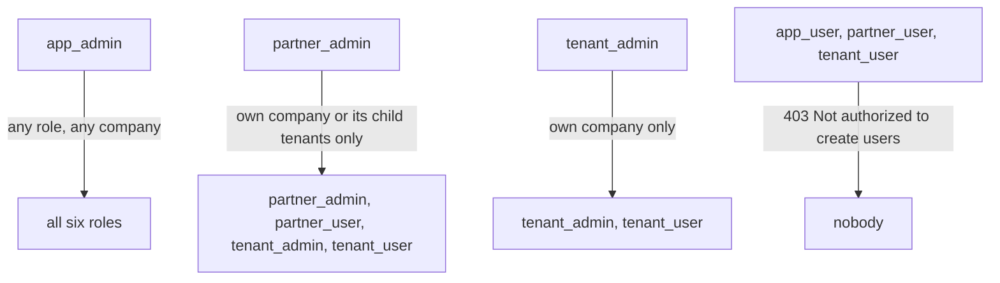

Company creation is narrower still
([company_router.py](../../backend/src/auth/company_router.py)): only
`app_admin` and `partner_admin` may `POST /companies`, and a `partner_admin` is
forced into `type == "TENANT"` with `parent_id` overwritten to their own company.

### 5.2 Role-specific landing pages

`/dashboard` is a switch, not a page
([Dashboard.tsx](../../frontend/src/pages/Dashboard.tsx)):

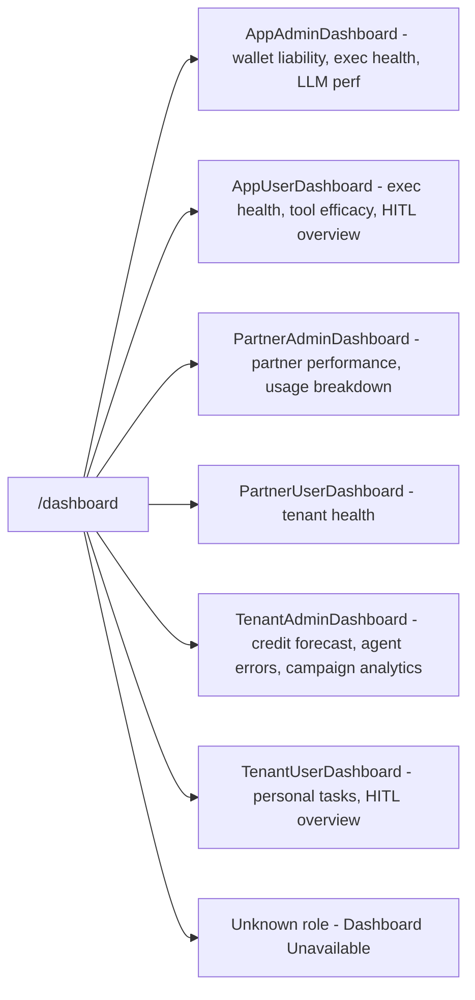

---

## 6. Capability areas

### 6.1 No-code entity builder

**Routes:** `/ai/entities` (library) → `/ai/entities/create` and
`/ai/entities/edit/:id` ([router/index.tsx:177](../../frontend/src/router/index.tsx:177)).

[`EntityBuilder.tsx`](../../frontend/src/pages/ai/EntityBuilder.tsx) is a thin
shell — 118 lines that fetch the entity, render
[`EntityConfigurationTabs`](../../frontend/src/pages/ai/EntityConfigurationTabs.tsx),
and `POST /ai/entities` or `PUT /ai/entities/{id}` on save. All the product is
in the tabs:

```python
# frontend/src/pages/ai/EntityConfigurationTabs.tsx  (line 693)
const tabs = [
    { id: 'basics',       label: 'Basics',       icon: Info },
    { id: 'hierarchy',    label: 'Hierarchy',    icon: GitBranch },
    { id: 'brain',        label: 'Brain',        icon: Brain },
    { id: 'planning',     label: 'Planning',     icon: Route },
    { id: 'capabilities', label: 'Capabilities', icon: Wrench },
    { id: 'safeguards',   label: 'Safeguards',   icon: Shield },
];
```

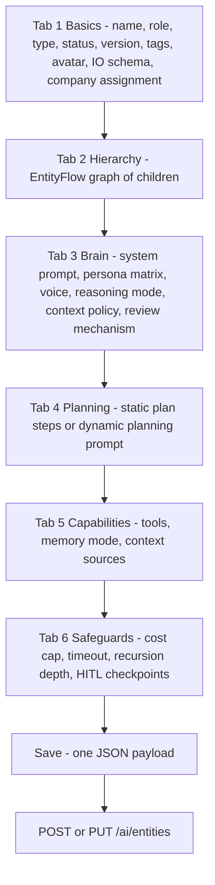

The **Hierarchy** tab is a real graph editor.
[`EntityFlow.tsx`](../../frontend/src/pages/ai/EntityFlow.tsx) wraps ReactFlow
with a `dagre` auto-layout and a small validation engine that runs on every
change:

```typescript
// frontend/src/pages/ai/EntityFlow.tsx
const validateGraph = (nodes: Node[], edges: Edge[]): ValidationIssue[] => {
    ...
    if (n.data.stepType === 'CHILD_ENTITY_INVOCATION' && !n.data.entityRef) {
        issues.push({ nodeId: n.id, severity: 'error',
                      message: 'Sub-agent step must be linked to an entity' });
    }
    if (n.data.stepType === 'TOOL_CALL' && !n.data.toolRef) {
        issues.push({ nodeId: n.id, severity: 'error',
                      message: 'Tool call step must be linked to a tool' });
    }
    ...
};
```

Edges carry the relationship type (`SEQUENTIAL`, `PARALLEL`, `CONDITIONAL`) and
the graph is serialised back into `hierarchy.children` on save.

**Journey — a tenant admin builds a research agent:**

1. Sidebar → *AI Workspace* → *Entity Library* → **New**.
2. **Basics**: name `Ravi`, role `Market Research Expert`. The display name
   auto-generates as `Ravi - Market Research Expert`. Type `AGENT`, status `DRAFT`.
3. **Brain**: paste a system prompt, pick `REACT`, set temperature.
4. **Planning**: three static steps, using `{{topic}}` in step 1 and
   `{{step_1}}` in step 2.
5. **Capabilities**: tick `search`, `scraper`, `pdf_generator`; memory mode
   `CORTEX`; attach two knowledge-base documents as context sources.
6. **Safeguards**: `max_cost_usd = 2.00`, one `AFTER_STEP` HITL checkpoint on
   step 2.
7. Save → back to the library. Flip status to `ACTIVE` when ready.

An `app_admin`, `partner_admin` or `partner_user` additionally gets a **Company
Assignment** dropdown on the Basics tab; it sends `?target_company_id=` and the
backend re-checks that the target is a child tenant
([router.py:19](../../backend/src/ai/router.py:19)).

### 6.2 Running executions and live traces

**Routes:** `/ai/execute/:id` → `/ai/executions/:id`; history at `/ai/executions`.

[`ExecutionPage.tsx`](../../frontend/src/pages/ai/ExecutionPage.tsx) works out
what to ask the user for by unioning two sources: the entity's
`io_contract.input_schema.properties`, and every `{{var}}` found in the plan's
prompt templates **minus** anything that looks like an internal step reference:

```typescript
// frontend/src/pages/ai/ExecutionPage.tsx
const stepRefPattern = /^step_\d+/;
const planStepIds = new Set(steps.map(s => s.step_id).filter(Boolean));
...
if (!stepRefPattern.test(match[1]) && !planStepIds.has(match[1])) {
    allVars.add(match[1]);
}
```

Submitting posts to `/ai/execute`, which creates a `PENDING` run and enqueues
`run_execution_recursive` on Arq ([service.py:278](../../backend/src/ai/service.py:278)):

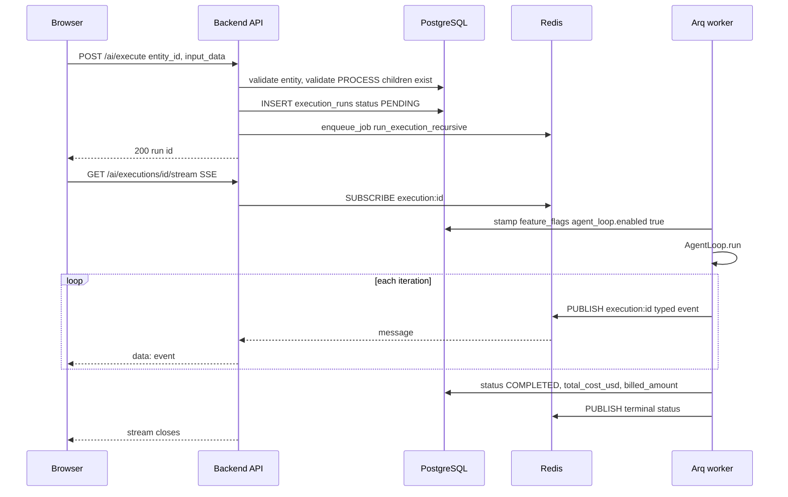

The run status machine is declared once and validated on every transition
([enums.py](../../backend/src/ai/schemas/enums.py)):

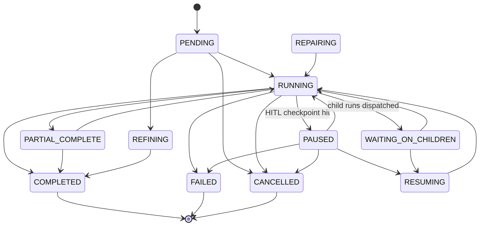

[`ExecutionDetail.tsx`](../../frontend/src/pages/ai/ExecutionDetail.tsx) has two
layouts. The legacy one shows a step timeline plus an invocation tree of child
runs. The newer one — `AgentLoopExecutionDetail` — renders the typed event
stream, and is selected when the run carries `agent_loop.enabled` in its
`input_data.feature_flags`. The Arq dispatcher stamps that flag onto every run
it starts ([arq_jobs.py:109](../../backend/src/ai/core/arq_jobs.py:109)), so in
practice **every new run gets the agent-loop view**.

[`useExecutionEvents.ts`](../../frontend/src/hooks/useExecutionEvents.ts) is a
reducer that turns the raw SSE stream into per-iteration slices. The event types
it understands are the best available list of what the kernel emits:

| Event | What it adds to the UI |
|-------|------------------------|
| `iteration_start` / `iteration_end` | executor name, budget pressure, open subgoals, outcome, decision, iteration cost |
| `critic_pre` / `critic_post` | verdict, concern count, failure tags, critic cost |
| `critic_align` / `critic_super` | goal-drift number, supervisor recommendation + confidence |
| `retry_picked` / `retry_dequeued` | corrective retry strategy |
| `bandit_arm_updated` | which reasoning arm won, its new score |
| `replan_triggered` | who replanned and how many subgoals were proposed |
| `span_open` / `span_close` | the trace tree — duration, cost, tokens, child run id, error |
| `task_class_classified` | detected task class |
| `cost_charged` | running cost per attribution bucket |

Beyond the stream there are three read endpoints on a run:
`GET /ai/executions/{id}/agent_state` (the snapshot),
`GET /ai/executions/{id}/trace` (every `execution_trace_events` span ordered by
`seq`, optionally filtered to one iteration), and the child-run tree embedded in
`GET /ai/executions/{id}`.

Four actions are available on a finished or in-flight run:

| Action | Endpoint | When |
|--------|----------|------|
| Cancel | `POST /ai/executions/{id}/cancel` | in-flight; the loop re-reads status each iteration and aborts |
| Retry | `POST /ai/executions/{id}/retry` | `FAILED`; resumes from `context_state`, reuses the CORTEX tree, skips completed steps |
| Refine | `POST /ai/executions/{id}/refine` | `COMPLETED`; an LLM decides which steps your feedback affects and re-runs only those |
| CSAT | `POST /ai/executions/{id}/csat` | any time; `+1` / `-1` plus a comment, stored on the run |

### 6.3 Human-in-the-loop approvals

**Route:** `/ai/approvals` — labelled "Guardian Oversight" in the sidebar.

A checkpoint is configured on the entity's **Safeguards** tab and stored in
`governance.hitl_checkpoints`
([schemas/governance.py](../../backend/src/ai/schemas/governance.py)):

```python
# backend/src/ai/schemas/governance.py
class HITLCheckpoint(BaseModel):
    trigger_type: HITLTriggerType
    step_ref: Optional[str] = None      # BEFORE_STEP / AFTER_STEP: step name or id
    tool_ref: Optional[str] = None      # TOOL_CALL: tool_id to gate
    threshold: Optional[float] = None   # COST_THRESHOLD: USD amount
    expression: Optional[str] = None    # CUSTOM: boolean expression
    timeout_ms: int = 300000            # default 5 minutes
    notification_channels: List[str] = []
    message: Optional[str] = None
    auto_approve_on_timeout: bool = False
```

| Trigger | Fires when |
|---------|-----------|
| `BEFORE_STEP` | just before a named step runs |
| `AFTER_STEP` | just after a named step completes |
| `COST_THRESHOLD` | accumulated run cost crosses the threshold |
| `TOOL_CALL` | before a specific tool is invoked |
| `CUSTOM` | a boolean expression evaluates true |

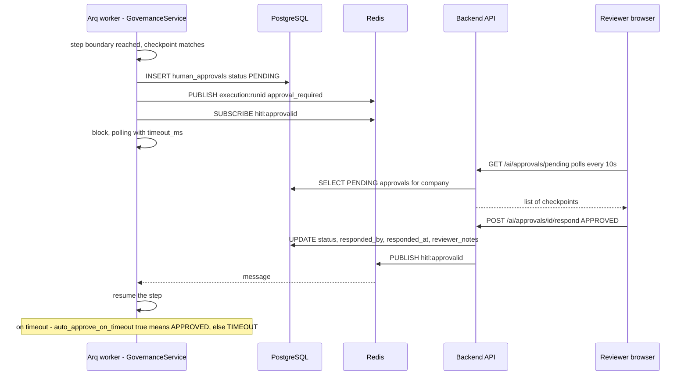

The approval row itself
([orm/execution.py:121](../../backend/src/ai/orm/execution.py:121)) keeps a
`context_snapshot`, the `checkpoint_trigger` description, `notification_channels`
and the reviewer's notes, so the decision is auditable after the fact.

[`HITLPanel.tsx`](../../frontend/src/pages/ai/HITLPanel.tsx) is deliberately
minimal — a card per pending checkpoint with **Authorize** and **Block Cycle**,
polling `GET /ai/approvals/pending` on a 10-second interval. It shows the
trigger string, the run id prefix and the request time. **It does not render
`context_snapshot`**, so a reviewer currently approves without seeing what the
agent was about to do; the snapshot exists in the database but is not exposed on
this page.

### 6.4 Template marketplace

**Route:** `/ai/templates`.

A template is an ordinary `hierarchical_entities` row with `is_template = true`
and — importantly — **`company_id = NULL`**, which is how templates become
visible to everyone ([service.py:32](../../backend/src/ai/service.py:32)):

```python
# backend/src/ai/service.py
effective_company_id = None if entity_data.get("is_template") else company_id
```

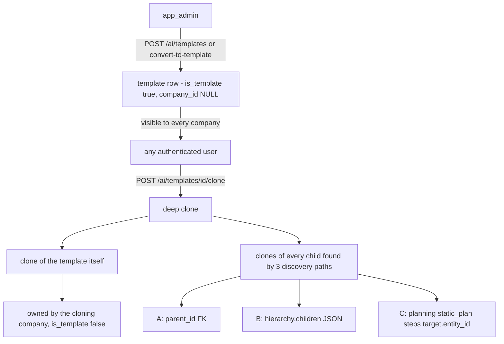

Only `app_admin` can create, update or delete a template — the router pins those
three endpoints to `app_admin_only`
([router.py:697](../../backend/src/ai/router.py:697)). Everyone can list, get and
clone.

The clone is a **deep clone**. `clone_template`
([service.py:1118](../../backend/src/ai/service.py:1118)) walks children through
three independent discovery paths — the `parent_id` foreign key, the
`hierarchy.children` JSON list, and every `CHILD_ENTITY_INVOCATION` target in the
static plan — because different seeds wire children differently. It then rewrites
all the internal UUID references so the clone is self-contained.

**Journey:** a tenant user opens the marketplace, filters to `PROCESS`, finds
"Deep Research", clicks **Clone**. A toast confirms `"cloned successfully as
process! All child entities included."` and after 1.2s the browser lands on the
new entity's edit page, where they change the system prompt and run it.

### 6.5 Knowledge base and RAG

**Route:** `/knowledge`.

[`KnowledgeBase.tsx`](../../frontend/src/pages/KnowledgeBase.tsx) is a
three-function page: upload, list, semantic search.

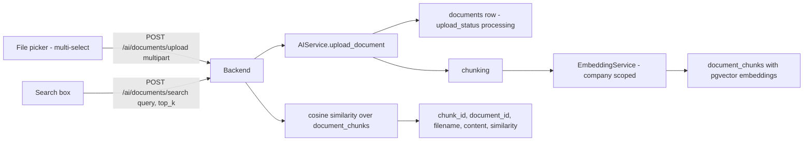

Documents feed agents in two ways:

1. **Ad-hoc search** — a tool or step calls the search path at runtime.
2. **Design-time attachment** — the builder's *Capabilities* tab lets you pin
   specific documents as `ContextSource`s. Four source types exist
   ([enums.py](../../backend/src/ai/schemas/enums.py)):
   `DOCUMENT`, `KNOWLEDGE_BASE`, `CORTEX_TREE`, `DB_RECORDS`. The first three
   are wired; `DB_RECORDS` is rendered in the UI as a disabled panel with a
   **"Coming Soon"** badge
   ([EntityConfigurationTabs.tsx:1526](../../frontend/src/pages/ai/EntityConfigurationTabs.tsx:1526)).

> **Known gap.** The page's delete button calls
> `DELETE /ai/documents/{id}`, but no such route exists anywhere in the backend
> — `grep -n "documents" backend/src/ai/router.py` returns only `upload`, `list`
> and `search`. Deleting a knowledge-base document from the UI fails.

### 6.6 CORTEX memory explorer

**Routes:** `/cortex` and `/cortex/trees/:treeId`.

CORTEX is the long-term memory system: a persistent tree of nodes that an agent
navigates, reads and writes as it works, so it can survive a context-window
limit and resume after an interruption. The UI lets a human walk the same tree
the agent walks.

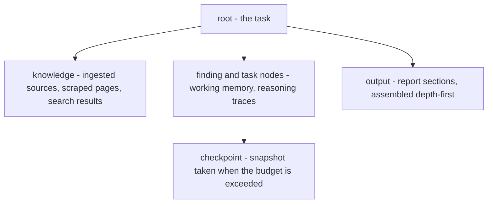

Tree lifecycle is a four-state machine (`CortexTreeStatus`), and the explorer
exposes the two operator transitions:

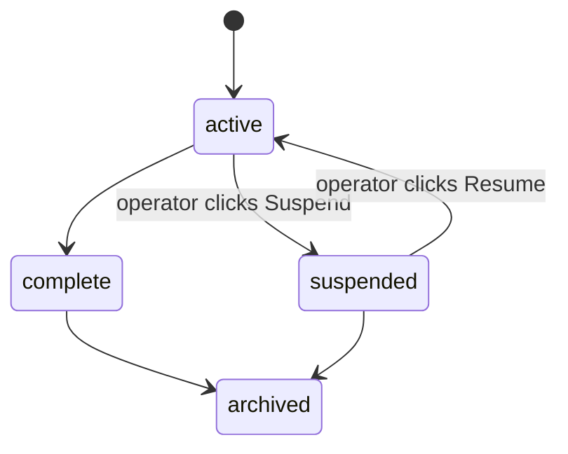

[`CortexTreeDetail.tsx`](../../frontend/src/pages/ai/CortexTreeDetail.tsx) is
built around **viewport navigation** — the same primitive the agent uses. You
land on the tree's `resume_cursor_id` (or its root), call
`POST /cortex/trees/{id}/navigate/{node_id}` to move, and
`GET /cortex/trees/{id}/nodes/{node_id}` to page in node content. Node types are
`root`, `knowledge`, `finding`, `task`, `output`, `checkpoint`; node statuses are
`pending`, `active`, `complete`, `summarised`.

The full CORTEX API surface is 13 endpoints on
[`cortex_router.py`](../../backend/src/ai/memory/cortex_router.py), including
`/checkpoint`, `/recurse`, `/ingest` and `/output` — the operations named in the
Deep Research design doc.

### 6.7 Voice campaigns and the auto-dialer

**Routes:** `/streaming/campaigns`, `/streaming/campaigns/:id`,
`/streaming/calls/:sessionId`, `/streaming/sessions`.

A campaign points a voice-capable `AGENT` at a list of contacts and dials them.

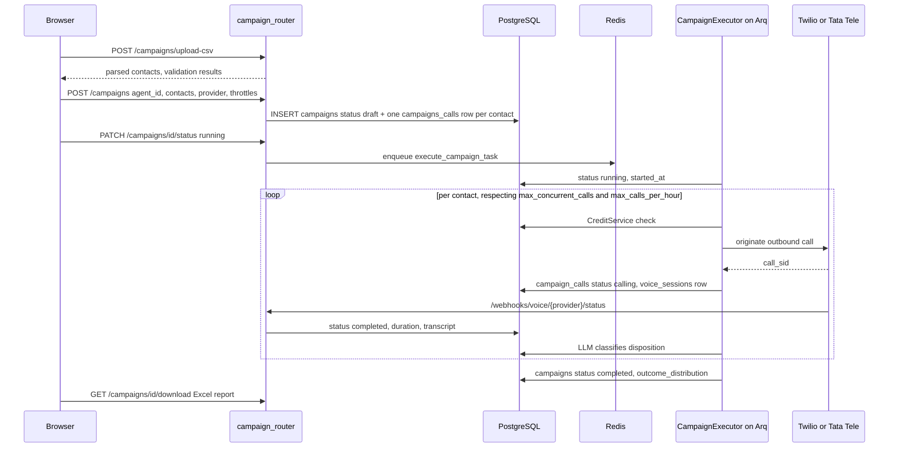

Campaign state:

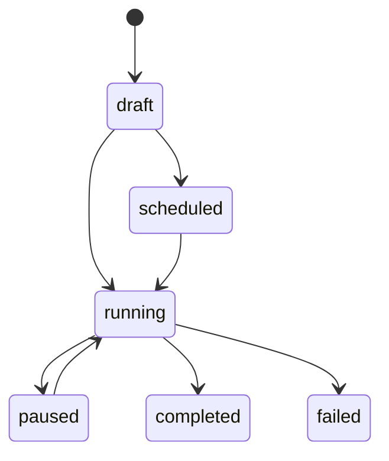

Per-call state and dispositions
([campaign_models.py](../../backend/src/ai/campaign_models.py)):

| Field | Values |
|-------|--------|
| `CampaignCall.status` | `pending`, `calling`, `completed`, `completed-voicemail`, `failed`, `skipped` |
| `CampaignCall.disposition` | `interested`, `not_interested`, `voicemail`, `rejected`, `busy`, `no_answer`, `failed` |
| `Campaign.provider` | `twilio`, `tata_tele` |

Dispositions are **ranked**, and the same ranking drives both the detail API and
the Excel export, so the most useful outcomes float to the top:

```python
# backend/src/ai/campaign_models.py
DISPOSITION_PRIORITY = {
    "interested": 0, "not_interested": 1, "voicemail": 3,
    "rejected": 4, "busy": 5, "no_answer": 6, "failed": 7,
}
```

Operator conveniences that exist as real endpoints:
`GET /campaigns/interested/download` (export only the interested leads),
`POST /campaigns/retry-failed`, `GET /campaigns/{id}/active-calls`, and a
5-second frontend poll that only fires while a campaign is `running`
([CampaignsPage.tsx](../../frontend/src/pages/streaming/CampaignsPage.tsx)).

`max_concurrent_calls` defaults to 5 and `max_calls_per_hour` is optional
throttling; both are set at creation time.

### 6.8 WhatsApp and messaging

WhatsApp is a **conversational channel bound to an agent**, not a separate
product. Two providers are supported, Twilio and Tata Tele, and the same
`hierarchical_entities` row that answers a phone call answers a WhatsApp thread.

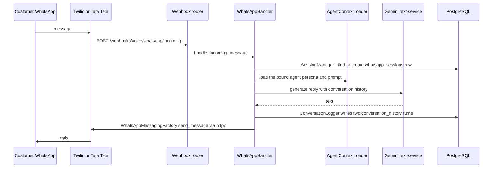

Tables ([voice/models.py](../../backend/src/voice/models.py)):

| Table | Purpose |
|-------|---------|
| `whatsapp_sessions` | one thread; tracks `session_window_expires` for WhatsApp's 24-hour rule, `message_count`, `total_cost_usd` |
| `conversation_history` | one row per turn, `channel` is `voice` or `whatsapp`, `speaker` is `customer` or `agent` |

Outbound messaging has its own API prefix,
`/api/v1/messaging` ([messaging_router.py](../../backend/src/voice/messaging_router.py)):
`POST /send` for free-form text or media, `POST /send-template` for
pre-approved WhatsApp templates.

> **Two things to know.** The real provider calls live in
> [`whatsapp_messaging.py`](../../backend/src/voice/whatsapp_messaging.py) and are
> genuine `httpx` calls to the Twilio and Tata APIs. But there is also a
> module-level `send_whatsapp_message()` in
> [`whatsapp_handler.py:261`](../../backend/src/voice/whatsapp_handler.py:261)
> whose body is `logger.info(f"[MOCK] WhatsApp message to {to}: ...")` with the
> real Twilio SDK call commented out. Nothing imports it — the handler class uses
> the factory — so it is dead code, but it is easy to grab by mistake. Separately,
> `POST /messaging/send` carries a `TODO` noting that the sender number is not
> looked up from the database; you must pass `from_number` or rely on env vars.

### 6.9 Phone number pool

**Route:** `/phone-numbers` (the sidebar calls it *Phone Numbers*; `/phone-pool`
redirects here).

The platform operator buys numbers once, into a shared inventory, and tenants
claim from it. One table, `phone_numbers`
([phone_pool_models.py:21](../../backend/src/voice/phone_pool_models.py:21)),
replaced two older ones.

```mermaid
stateDiagram-v2
    [*] --> available : app_admin adds or syncs from provider
    available --> claimed : tenant_admin, partner_admin or app_admin claims
    claimed --> assigned : an agent is bound to the number
    assigned --> claimed : agent unbound
    claimed --> available : release
    assigned --> available : release - clears company, agent, customer
    available --> [*] : app_admin deletes
    note right of available : retired is also a declared status
```

| Endpoint | Who |
|----------|-----|
| `POST /api/v1/phone-numbers` and `/bulk` | `app_admin` |
| `POST /api/v1/phone-numbers/sync` | `app_admin` — pulls the live inventory from the Twilio / Tata credentials in the integration registry |
| `GET /api/v1/phone-numbers` | everyone, role-aware: a tenant sees available numbers plus its own |
| `POST /{id}/claim` | `tenant_admin`, `partner_admin`, `app_admin`. `app_admin` may pass `target_company_id` to claim on someone's behalf |
| `POST /{id}/release` | the owning company, or `app_admin` |
| `POST /{id}/assign` | binds an `agent_id` (and optional customer metadata) to a claimed number |
| `DELETE /{id}` | `app_admin` |

Each row carries `provider` (`twilio` / `tata_tele`), `country_code` (default
`+91`), `capabilities` JSON such as `{"voice": true, "sms": false}`,
`monthly_cost_usd`, and a free-text `label`.

> **Dead file.** [`phone_pool_router.py`](../../backend/src/voice/phone_pool_router.py)
> still exists and still declares a full `/phone-pool` API in its docstring, but
> it is **not mounted** in [`main.py`](../../backend/src/main.py) — the comment
> there says "Phone Number Pool is now unified into phone_number_router". The
> only surviving reference to it is a sentence in the replacement's docstring.

### 6.10 Integrations and the credentials registry

**Route:** `/integrations`.

`integration_registry` is the single place every third-party credential and
every per-unit cost lives ([config/models.py:26](../../backend/src/config/models.py:26)).
One row is "we have a key for provider X, model Y, and it costs Z per unit".

```mermaid
flowchart TD
    UI["IntegrationsPage"]
    UI -->|"CreateIntegrationModal"| POST["POST /config/integrations"]
    POST --> GATE{"role check"}
    GATE -->|"app_admin"| ANY["any company, any service_category"]
    GATE -->|"partner_admin"| OWN["own company only"]
    GATE -->|"tenant_admin"| LIM["own company AND category in EMAIL, SOCIAL_MEDIA, API_TOOL, OTHER"]
    GATE -->|"other roles"| NO["403 Not authorized"]
    ANY --> ROW["integration_registry row - encrypted_api_key, internal_cost, cost_unit, service_metadata"]
    OWN --> ROW
    LIM --> ROW
    ROW --> USE1["LLM router picks a model"]
    ROW --> USE2["ToolCostResolver prices a tool call"]
    ROW --> USE3["Telephony and Razorpay credentials"]
```

Key columns:

| Column | Meaning |
|--------|---------|
| `provider_name` | `google`, `anthropic`, `azure_openai`, `twilio`, … |
| `model_name` | `gemini-2.0-flash`, `claude-3-5-sonnet`, … |
| `service_sku` | unique per company — the pricing key, e.g. `gemini-2.0-flash-in` |
| `service_category` | `LLM`, `LLM_LIVE`, `IMAGE_GEN`, `AUDIO_GEN`, `VIDEO_GEN`, `3D_GEN`, `API_TOOL`, `COMMUNICATION` |
| `component_type` | `input_token`, `output_token`, `analysis`, `minute`, `character`, `flat_fee`, `image`, `video_second` |
| `encrypted_api_key` | encrypted at rest |
| `internal_cost` / `cost_unit` | what the platform pays — the `c` in the billing formula |
| `service_metadata` | provider-specific: Vertex `project_id`/`region`, Azure endpoint + deployment, or `{"use_ai_studio": true}` |

The **tenant restriction is the important product rule**: a tenant admin can
connect their own Gmail or a social account, but cannot add an LLM key or a
telephony account. The error message says so explicitly:

```python
# backend/src/config/router.py
TENANT_ALLOWED_CATEGORIES = {"EMAIL", "SOCIAL_MEDIA", "API_TOOL", "OTHER"}
...
detail=f"Tenant users can only add integrations for: {', '.join(sorted(TENANT_ALLOWED_CATEGORIES))}. "
       f"Contact your platform administrator for AI model or telephony integrations."
```

The same page also hosts **email connections** via
[`EmailConnectionWizard`](../../frontend/src/components/EmailConnectionWizard.tsx),
backed by `/email/connections` with an IMAP/SMTP `validate` endpoint
([email_router.py](../../backend/src/ai/email_router.py)).

A sibling page, `/ai-config`
([`AIModelConfigPage.tsx`](../../frontend/src/pages/ai-config/AIModelConfigPage.tsx)),
maps the twelve `TASK_TYPES` (`text_generation`, `thinking`, `text_to_image`,
`text_to_speech`, `speech_to_speech`, `text_to_video`, `text_to_3d`, …) onto
specific registry rows, with a `routing_mode` of `single` or `router`.

> **Route/API drift.** The `/ai-config` React route allows `app_admin` **and**
> `tenant_admin` ([router/index.tsx:321](../../frontend/src/router/index.tsx:321)),
> but every `/config/task-defaults` endpoint is guarded by `_require_app_admin`
> ([config/router.py](../../backend/src/config/router.py)). A tenant admin can
> open the page and will get `403 Only App Administrators can configure AI task
> defaults` when they save.

### 6.11 Social connections

This is the area where **the marketing number and the working number differ the
most**, so here are all three real counts.

| Count | What it is | Source |
|-------|-----------|--------|
| **16** | platform modules under `tools/social/` | `facebook, google_ads, instagram, linkedin, linkedin_ads, linkedin_sales_nav, meta_ads, pinterest, quora, reddit, snapchat_ads, tiktok, twitter, x_ads, youtube, youtube_ads` |
| **64** | tool classes registered — exactly 4 per module | `grep -c "^ToolRegistry.register(" backend/src/ai/tools/__init__.py` → 98 total, 34 non-social |
| **9** | platforms you can actually store a connection for | `VALID_PLATFORMS` in [social_router.py:65](../../backend/src/ai/social_router.py:65) |
| **8** | platforms whose OAuth tokens can be auto-refreshed | `PLATFORM_REFRESH_CONFIG` in [social_connection_service.py:23](../../backend/src/ai/social_connection_service.py:23) — Quora is missing |

```python
# backend/src/ai/social_router.py
VALID_PLATFORMS = {"linkedin", "twitter", "facebook", "instagram", "google_ads",
                   "youtube", "tiktok", "reddit", "quora"}
```

```mermaid
flowchart TD
    M16["16 platform modules - 64 tool classes"]
    EXP["All inherit SocialMediaTool with status EXPERIMENTAL"]
    FLAG{"company sets tools.experimental.{tool_id} true"}
    VIS["tool visible to that company's agents"]
    HID["tool hidden - get_visible_tools_for_company filters it out"]

    CONN["social_connections table"]
    V9["9 platforms accepted by POST /api/social-connections"]
    R8["8 platforms with an OAuth refresh config"]
    NOREF["quora - stored but never auto-refreshed"]

    M16 --> EXP --> FLAG
    FLAG -->|"yes"| VIS
    FLAG -->|"no - the default"| HID
    CONN --> V9 --> R8
    V9 --> NOREF
```

The gating is one line on the base class
([social/base.py:48](../../backend/src/ai/tools/social/base.py:48)):

```python
# backend/src/ai/tools/social/base.py
status: ToolStatus = ToolStatus.EXPERIMENTAL
```

`ToolRegistry.get_visible_tools_for_company` drops `EXPERIMENTAL` and `DRAFT`
tools unless the company has flipped `tools.experimental.{tool_id}`
([tools/base.py:211](../../backend/src/ai/tools/base.py:211)). And the tools
README is blunt about why:

> The 15 `social/` platform integrations … are **not yet wired to any production
> entity** and several are unfinished.
> — [`tools/README.md`](../../backend/src/ai/tools/README.md)

(That README says 15; the directory has 16 modules. LinkedIn Sales Navigator is
the one it forgets to list.)

Connection management itself is four endpoints under
`/api/social-connections`: create (tokens encrypted at rest), list, delete, and
`POST /{id}/refresh`.

### 6.12 Billing, wallet, credits and top-ups

**Routes:** `/wallet` (everyone), `/settings/billing` (`app_admin`),
`/reports/costing`.

There are two distinct numbers for every run:

- **`total_cost_usd`** — what the platform actually paid providers.
- **`billed_amount`** — what the customer is charged, after the billing formula.

```python
# backend/src/billing/billing_service.py
# TB = (c × mf) + (c × mf × pf) + (c × mf × spf) - (c × mf × d)
multiplied     = c * mf
platform_fee   = multiplied * pf
partner_fee    = multiplied * spf
discount       = multiplied * d
total          = multiplied + platform_fee + partner_fee - discount
```

| Symbol | Column on `billing_config` | Meaning |
|--------|---------------------------|---------|
| `c` | — | raw internal cost of the run |
| `mf` | `multiplier_factor` | markup multiplier |
| `pf` | `platform_fee_pct` | platform's cut |
| `spf` | `sales_partner_fee_pct` | the partner's cut — this is how resellers earn |
| `d` | `discount_pct` | negotiated discount |

`billing_config.company_id = NULL` is the **global default**; a per-company row
overrides it. If no config exists at all, the code falls back to the identity
formula (`mf=1, pf=spf=d=0`), so `billed_amount == total_cost_usd`.

A wallet has **three credit buckets**, drained in a fixed order
([credit_service.py](../../backend/src/billing/credit_service.py)):

```mermaid
flowchart TD
    COST["amount to charge"]
    D["1. daily_credits - reset by a cron flush, from BillingConfig.default_daily_credits"]
    MODEL{"account_model"}
    W["2a. wallet_balance - pay_as_you_go"]
    S["2b. subscription_credits then subscription_bonus_credits"]
    ERR["InsufficientCreditsError"]

    COST --> D
    D -->|"still owing"| MODEL
    MODEL -->|"pay_as_you_go"| W
    MODEL -->|"subscription"| S
    W -->|"still owing"| ERR
    S -->|"still owing"| ERR
```

Credits are enforced at **four** points in a run, all in
[`governance_service.py`](../../backend/src/ai/governance/governance_service.py):

| Gate | Method | Behaviour |
|------|--------|-----------|
| Before the run starts | `check_credit_gate` | refuses to start on an empty wallet |
| After each step | `consume_step_cost` | incremental deduction |
| After each step | `check_credit_circuit_breaker` | stops the run mid-flight: *"Partial results saved. Please top up credits and retry."* |
| Before spawning a child | `check_child_credit_gate` | stops recursive fan-out from over-spending |
| At the end, top-level runs only | `settle_billing` | computes TB, deducts the remainder, records a `BillingEvent` |

Top-ups go through **Razorpay**
([credits_router.py](../../backend/src/billing/credits_router.py)):

```mermaid
sequenceDiagram
    participant U as WalletPage
    participant API as credits_router
    participant RZ as Razorpay
    participant DB as PostgreSQL

    U->>API: POST /api/v1/credits/topup amount
    API->>DB: read razorpay_keys from integration_registry
    alt keys missing
        API-->>U: 503 Payment gateway not configured
    end
    API->>RZ: order.create amount in cents, currency USD
    API->>DB: INSERT payment_transactions status pending
    API-->>U: order_id + key_id
    U->>RZ: Razorpay.js checkout
    RZ-->>U: payment_id + signature
    U->>API: POST /api/v1/credits/topup/verify
    API->>API: verify signature
    API->>DB: transaction success, wallet_balance += credits_awarded
    API-->>U: new balance
```

Subscriptions are the other path: three tiers with a bonus percentage
(`SubscriptionTier`), a Razorpay subscription id on the `Subscription` row, and
`POST /subscriptions/verify` to activate. The frontend ships hard-coded fallback
plans — Starter $29/20%, Growth $79/30%, Scale $199/40% — used only when the
tiers table is empty ([WalletPage.tsx](../../frontend/src/pages/billing/WalletPage.tsx)).

### 6.13 Reports and dashboards per role

Fifteen analytics endpoints live on
[`reports_router.py`](../../backend/src/ai/reports_router.py) under
`/api/v1/reports/analytics`. Six React pages consume them, one per role, each
route-gated so that higher tiers can also open the lower tiers' views.

```mermaid
flowchart TD
    subgraph EP["Analytics endpoints"]
        E1["execution-health"]
        E2["llm-performance"]
        E3["tool-efficacy"]
        E4["hitl-overview"]
        E5["wallet-liability - app_admin only"]
        E6["usage-breakdown"]
        E7["tenant-health - partner roles"]
        E8["campaign-analytics"]
        E9["personal-tasks"]
        E10["agent-errors"]
        E11["credit-forecast"]
        E12["subscription-mrr"]
        E13["partner-performance"]
        E14["data-growth"]
    end

    R1["AppAdminReports - 8 tabs"]
    R2["AppUserReports - 6 tabs"]
    R3["PartnerAdminReports - 6 tabs"]
    R4["PartnerUserReports - 4 tabs"]
    R5["TenantAdminReports - 6 tabs"]
    R6["TenantUserReports - 5 tabs"]

    E1 --> R1
    E2 --> R1
    E3 --> R1
    E5 --> R1
    E12 --> R1
    E13 --> R1
    E1 --> R2
    E14 --> R2
    E7 --> R3
    E7 --> R4
    E6 --> R5
    E8 --> R5
    E10 --> R5
    E11 --> R5
    E9 --> R6
    E4 --> R6
```

| Page | Route | Allowed roles | Tabs |
|------|-------|---------------|------|
| App Admin | `/reports/analytics/app-admin` | `app_admin` | Revenue and Margin, Subscription and MRR, Execution Health, LLM Performance, Tool Efficacy, Wallet Liability, Partner Performance, Global HITL |
| App User | `/reports/analytics/app-user` | `app_admin`, `app_user` | Incidents and Traceability, Provider Health, Execution Latency, Rate Limits and Quotas, Data Growth, HITL SLA |
| Partner Admin | `/reports/analytics/partner-admin` | + `partner_admin` | Portfolio Financials, Tenant Health, At-Risk Alerts, Top Performers, Subscription Matrix, Upsell Opportunities |
| Partner User | `/reports/analytics/partner-user` | + `partner_user` | Health Scorecard, Onboarding Tracker, Config Error Logs, Credit Alerts |
| Tenant Admin | `/reports/analytics/tenant-admin` | + `tenant_admin` | Billing Breakdown, Credit Forecast, Campaign Analytics, Agent Performance, Automation vs HITL, Channel Efficacy |
| Tenant User | `/reports/analytics/tenant-user` | everyone | My Task History, Execution Trace, Pending Approvals, Time Saved, My Usage |

Most endpoints accept `global_view=true`, which widens the query from
`current_user.company_id` to all companies — but **only for `app_admin`**:

```python
# backend/src/ai/reports_router.py
company_id = None if (global_view and current_user.role == "app_admin") else current_user.company_id
```

### 6.14 Artifacts

**Route:** `/artifacts` (`/assets` redirects here).

Every file the platform touches is registered in one `artifacts` table
([artifact_models.py:25](../../backend/src/ai/artifact_models.py:25)) and stored
under `backend/artifact/` in one of two directories created at boot
([main.py:64](../../backend/src/main.py:64)):

```mermaid
flowchart LR
    U["Human upload"] -->|"POST /api/v1/artifacts/upload"| UU["backend/artifact/user-uploads/"]
    T["Tool output - pdf_generator, docx_tool, image_generation, call recording"] --> SG["backend/artifact/system-generated/"]
    UU --> ROW["artifacts row"]
    SG --> ROW
    ROW -->|"origin, file_category, run_id, agent_id, generated_by"| BROWSE["Artifacts page - filter by type and source"]
    BROWSE --> DL["GET /{id}/download - streams the file"]
    BROWSE --> PV["Inline preview - audio player, image zoom, video"]
```

| Column | Values |
|--------|--------|
| `origin` | `user-uploads`, `system-generated` |
| `file_category` | `recordings`, `images`, `videos`, `documents`, `text` |
| `generated_by` | the tool or agent name, e.g. `image_generation`, `pdf_generator` |
| `run_id` / `agent_id` / `campaign_id` | provenance back to the execution that made it |

The page renders category-appropriate previews — a custom audio player for call
recordings, a zoomable image viewer, a video player — and shows size and
duration.

> **Dead file.** [`assets/AssetLibrary.tsx`](../../frontend/src/pages/assets/AssetLibrary.tsx)
> (314 lines) is the predecessor. It is not routed and not imported by anything
> except its own CSS. `/assets` redirects to `/artifacts`, and the backend keeps
> `/api/v1/assets*` → `/api/v1/artifacts*` redirects for old clients.

### 6.15 Admin surfaces

Five pages under `/admin/agent-kernel/*`, grouped as **Agent Kernel** in the
sidebar. All five are route-gated to `app_admin`, `partner_admin`,
`tenant_admin`, which matches the backend's `_require_admin`
([api/admin.py:88](../../backend/src/ai/api/admin.py:88)).

```mermaid
flowchart TD
    subgraph Admin["/admin/agent-kernel"]
        KPI["kpi - KPIDashboard"]
        MI["meta-intelligence - MetaIntelligencePage"]
        CO["cost - CostAttributionDashboard"]
        FF["feature-flags - FeatureFlagsPage"]
        RI["risks - RiskAndExitPage"]
    end

    KPI --> K1["/ai/admin/kpi/runs, /cost, /critic, /meta_agent"]
    MI --> M1["anti_patterns"]
    MI --> M2["skill_candidates - read plus promote"]
    MI --> M3["prompt_candidates - HITL approve queue"]
    CO --> C1["/ai/admin/companies/{id}/cost_attribution grouped by usage_logs.attribution"]
    FF --> F1["/feature_flags/me - effective"]
    FF --> F2["/feature_flags/admin - every row plus toggle and delete"]
    FF --> F3["numeric knobs"]
    RI --> R1["/ai/admin/risks - indicators with ok warn breach"]
    RI --> R2["/ai/admin/exit_checklist"]
    RI --> R3["/ai/admin/decisions - append-only log"]
```

**Feature flags** resolve through five tiers, first hit wins
([feature_flags.py](../../backend/src/ai/core/feature_flags.py)):

```
1. per-entity  entity.metadata_extensions.feature_flags
2. per-company row in feature_flags
3. global row  company_id IS NULL
4. env var     AI_FLAG_<KEY>
5. hard-coded  DEFAULTS
```

The `DEFAULTS` dict is a readable inventory of what the kernel can be told to do
— critic pipeline v2, bandit arm selection, meta-agent board routing, container
sandbox, persistent browser, memory canonicalisation, planner v2. Two are
deliberately off and worth knowing about:

| Flag | Default | Why |
|------|---------|-----|
| `meta_agent.tool_synthesis_enabled` | `False` | "the marquee/most-dangerous capability" — even when on, tool synthesis stays Meta-Agent-only, container-exec-only, DRAFT-register-only |
| `sandbox.persistent_browser_enabled` | `False` | per-tenant persistent browser profiles are a canary |

**Cost attribution** breaks a company's spend into named buckets. The colour map
in the dashboard is the canonical list: `planner`, `actor_step`, `critic_pre`,
`critic_post`, `critic_align`, `critic_super`, `reformat_retry`, `meta_review`,
`dreaming`, `tool`, `child_run`, `embedding`, `meta_spec_critic`, `test_driver`.

**Risk and Exit** polls every 60 seconds and shows programme-level risk
indicators with `ok` / `warn` / `breach` pills, a programmatic exit checklist,
and an append-only decision log you can add to from the page.

### 6.16 Onboarding wizard

**Route:** `/onboarding` — deliberately rendered **without** `MainLayout`, so
there is no sidebar to escape through
([router/index.tsx:129](../../frontend/src/router/index.tsx:129)).

Five steps, defined identically on both sides
([onboarding_router.py:29](../../backend/src/auth/onboarding_router.py:29) and
[OnboardingWizard.tsx:7](../../frontend/src/pages/OnboardingWizard.tsx:7)):

```mermaid
stateDiagram-v2
    [*] --> pending
    pending --> in_progress : first POST /onboarding/step/{name}
    state in_progress {
        [*] --> company_profile
        company_profile --> integrations
        integrations --> first_agent
        first_agent --> phone_setup
        phone_setup --> billing
    }
    in_progress --> completed : POST /onboarding/complete
    pending --> completed : POST /onboarding/skip
    in_progress --> completed : POST /onboarding/skip
    completed --> [*]
```

| Step | What it asks for | Skippable |
|------|-----------------|-----------|
| `company_profile` | workspace name, industry — writes straight to `companies.name` | no |
| `integrations` | connect Gemini/Vertex, OpenAI, email, or WhatsApp | no |
| `first_agent` | clone a template or build from scratch | no |
| `phone_setup` | claim a number from the pool | **yes** |
| `billing` | review the provisioned daily credits | no |

Progress lives in `companies.onboarding_metadata.completed_steps` (a JSONB
array) and the wizard resumes at the first incomplete step. `POST
/onboarding/skip` sets `onboarding_status = "completed"` and stamps
`metadata.skipped = true`.

> The docstring on `onboarding_router.py` says "the ProtectedRoute guard
> redirects users with `onboarding_status != completed` to `/onboarding`". The
> `ProtectedRoute` component in
> [router/index.tsx:78](../../frontend/src/router/index.tsx:78) only checks
> authentication and role — **it does not check onboarding status**. The wizard
> is reachable but nothing forces a new user into it.

### 6.17 Tool management

**Route:** `/ai/tool-registry` — `app_admin` only, enforced on both sides.

```mermaid
flowchart TD
    IMP["Import time - tools/__init__.py runs 98 ToolRegistry.register calls"]
    IMP --> MEM["In-process ToolRegistry"]
    SYNC["POST /api/v1/ai/tool-registry/sync-built-in"]
    MEM --> SYNC
    SYNC --> TBL["tool_registry table - tool_type BUILT_IN"]
    ADMIN["app_admin defines a custom tool - name, category, function_schema JSON, configuration"]
    ADMIN --> TBL2["tool_registry row - tool_type CUSTOM"]
    TBL --> VIS{"ToolRegistry.get_visible_tools_for_company"}
    TBL2 --> VIS
    VIS -->|"ACTIVE"| SHOW["offered to agents"]
    VIS -->|"EXPERIMENTAL or DRAFT without opt-in flag"| HIDE["hidden"]
    VIS -->|"DEPRECATED"| HIDE
```

`ToolStatus` has four values
([tools/base.py:22](../../backend/src/ai/tools/base.py:22)):

| Status | Visibility |
|--------|-----------|
| `ACTIVE` | offered to every company |
| `EXPERIMENTAL` | needs `tools.experimental.{tool_id}` per company |
| `DRAFT` | same opt-in, **and** never registered globally — tenant-scoped only, `trust=low` until a human promotes it. Used for LLM-synthesized tools |
| `DEPRECATED` | filtered out unless `include_deprecated` |

The 98 registered tools break down as **34 non-social + 64 social**. The
non-social set is the one that actually gets used by production entities:

| Group | Tools |
|-------|-------|
| `core/` | `calculator`, `search`, `batch_search`, `scraper`, `file_writer` |
| `documents/` | `pdf_generator`, `docx_tool`, `pptx_tool`, `excel`, `document_save` |
| `media/` | `image_generation`, `video_generate`, `video_edit`, `video_add_sound`, plus a `DEPRECATED` `video_generation` mega-tool shim |
| `sandbox/` | `sandbox_executor`, `terminal_tool`, `browser_tool` |
| `email/` | `email_ingest`, `email_classify`, `email_draft`, `email_send` |
| `crm/` | `get_current_datetime`, `whatsapp_send_tenant`, `google_calendar_create_event`, `crm_update_lead` |
| `meta/` | `platform_introspect`, `registry_search`, `schema_validator`, `entity_creator`, `entity_executor`, `agent_introspect`, `agent_reflect`, `tool_synthesis` |

The UI filters by ten categories (`browser`, `document`, `email`, `execution`,
`media`, `search`, `social`, `utility`, `custom`, `general`) and by
`BUILT_IN` / `CUSTOM`, with counters for total, built-in, custom and enabled
([ToolManagement.tsx](../../frontend/src/pages/ai/ToolManagement.tsx)).

---

## 7. A day in the life

One end-to-end story: a tenant admin signs up, onboards, connects Gemini, builds
an agent, runs it, approves a checkpoint, and sees the bill.

```mermaid
sequenceDiagram
    autonumber
    actor TA as Priya - tenant_admin
    participant FE as React SPA
    participant API as Backend API :8000
    participant DB as PostgreSQL
    participant R as Redis
    participant W as Arq worker
    participant LLM as Gemini via Vertex

    Note over TA,DB: 1. Sign up
    TA->>FE: /register  name, email, password
    FE->>API: POST /api/v1/auth/register
    API->>DB: INSERT companies type TENANT name "Priya's Workspace"
    API->>DB: read global BillingConfig.default_daily_credits
    API->>DB: INSERT users role tenant_admin
    API->>DB: INSERT credit_wallets daily_credits seeded
    API-->>FE: access token plus refresh token

    Note over TA,DB: 2. Onboard
    TA->>FE: /onboarding
    FE->>API: GET /onboarding/status  pending, 0 of 5
    TA->>FE: workspace name and industry
    FE->>API: POST /onboarding/step/company_profile
    API->>DB: companies.name updated, onboarding_status in_progress

    Note over TA,DB: 3. Connect an LLM
    TA->>FE: /integrations  Add Integration
    FE->>API: POST /config/integrations provider google, model gemini-2.0-flash
    API->>API: role check - tenant_admin plus category LLM
    API-->>FE: 403 - LLM is not in TENANT_ALLOWED_CATEGORIES
    Note right of API: Priya asks the app_admin, who adds the key for her company
    API->>DB: integration_registry row with encrypted_api_key and internal_cost
    FE->>API: POST /onboarding/step/integrations

    Note over TA,DB: 4. Build an agent
    TA->>FE: /ai/entities/create
    TA->>FE: Basics, Brain, Planning, Capabilities, Safeguards
    Note right of TA: Safeguards - max_cost_usd 2.00 and one AFTER_STEP checkpoint on step_2
    FE->>API: POST /ai/entities  full nine-column JSON
    API->>DB: INSERT hierarchical_entities type AGENT status DRAFT
    TA->>FE: flip status to ACTIVE
    FE->>API: PUT /ai/entities/id
    FE->>API: POST /onboarding/step/first_agent

    Note over TA,DB: 5. Run it
    TA->>FE: /ai/execute/id  fills in topic
    FE->>API: POST /ai/execute
    API->>DB: INSERT execution_runs status PENDING trace_id
    API->>R: enqueue run_execution_recursive
    API-->>FE: run id
    FE->>API: GET /ai/executions/id/stream  SSE
    W->>DB: check_credit_gate - wallet has credits
    W->>DB: status RUNNING, stamp agent_loop.enabled
    loop iterations
        W->>LLM: perceive, strategize, act
        LLM-->>W: tokens
        W->>DB: llm_interaction_logs plus usage_logs attribution actor_step
        W->>R: PUBLISH execution:runid  iteration_start, span_open, critic_post, cost_charged
        R-->>FE: live trace renders
    end

    Note over TA,DB: 6. Approve a checkpoint
    W->>W: step_2 completes, AFTER_STEP checkpoint matches
    W->>DB: INSERT human_approvals status PENDING plus context_snapshot
    W->>R: SUBSCRIBE hitl:approvalid  then block up to timeout_ms
    TA->>FE: /ai/approvals  card appears within 10s poll
    TA->>FE: clicks Authorize
    FE->>API: POST /ai/approvals/id/respond APPROVED
    API->>DB: status APPROVED, responded_by, responded_at
    API->>R: PUBLISH hitl:approvalid
    R-->>W: unblock
    W->>W: continue from step_3

    Note over TA,DB: 7. Finish and settle
    W->>DB: result_data, status COMPLETED, total_cost_usd
    W->>DB: artifacts row for the produced PDF
    W->>W: settle_billing - TB equals c times mf plus fees minus discount
    W->>DB: billed_amount on the run, BillingEvent for the month
    W->>DB: CreditService deducts daily then wallet then subscription
    W->>R: PUBLISH terminal status  SSE closes

    Note over TA,DB: 8. See the bill
    TA->>FE: /wallet
    FE->>API: GET /api/v1/credits/balance
    API-->>FE: daily, wallet and subscription buckets with expiries
    TA->>FE: /reports/analytics/tenant-admin  Billing Breakdown
    FE->>API: GET /reports/analytics/usage-breakdown days 30
    API-->>FE: cost by channel plus daily trend
    TA->>FE: /artifacts  downloads the PDF
```

Two things in that flow trip people up on their first read:

- **Step 3 genuinely 403s.** A `tenant_admin` cannot add an LLM key. That is the
  intended product boundary — LLM and telephony credentials are the platform
  operator's business.
- **Billing happens twice.** Credits are consumed incrementally after every step
  (so a runaway agent gets cut off), and then `settle_billing` runs once at the
  end for the top-level run only — child runs never settle
  (`if run.parent_run_id: return Decimal("0")`).

---

## 8. Capability matrix: feature by role

Legend: **Y** = full access · **S** = scoped (own company or own child tenants) ·
**R** = read-only in practice · **—** = blocked (403 or hidden).

| Feature | Surface | app_admin | app_user | partner_admin | partner_user | tenant_admin | tenant_user |
|---------|---------|:---------:|:--------:|:-------------:|:------------:|:------------:|:-----------:|
| Role-specific dashboard | `/dashboard` | Y | Y | Y | Y | Y | Y |
| Platform Hub — companies and users | `/platform-management` | Y | — | S | — | S | — |
| Create a PARTNER company | `POST /companies` | Y | — | — | — | — | — |
| Create a TENANT company | `POST /companies` | Y | — | S | — | — | — |
| Create users | `POST /users` | Y | — | S | — | S | — |
| Partner portfolio view | `/partner` | Y | — | Y | — | — | — |
| Browse entity library | `/ai/entities` | Y all companies | S | S incl. child tenants | S incl. child tenants | S | S |
| Build / edit an entity | `/ai/entities/create` | Y | Y | Y | Y | Y | Y |
| Assign an entity to another company | `?target_company_id=` | Y any | — | S children | S children | — | — |
| Run an entity | `POST /ai/execute` | Y | Y | Y | Y | Y | Y |
| View live trace and history | `/ai/executions` | Y all | S | S | S | S | S |
| Cancel / retry / refine / CSAT | run actions | Y | Y | Y | Y | Y | Y |
| Respond to HITL approvals | `/ai/approvals` | S company | S | S | S | S | S |
| Browse and clone templates | `/ai/templates` | Y | Y | Y | Y | Y | Y |
| Create / edit / delete templates | `POST /ai/templates` | Y | — | — | — | — | — |
| Knowledge base upload and search | `/knowledge` | S | S | S | S | S | S |
| CORTEX explorer | `/cortex` | S | S | S | S | S | S |
| Tool registry management | `/ai/tool-registry` | Y | — | — | — | — | — |
| Add LLM / telephony integrations | `POST /config/integrations` | Y | — | S | — | — | — |
| Add email / social / API integrations | `POST /config/integrations` | Y | — | S | — | S | — |
| Set AI task defaults | `/ai-config` | Y | — | — | — | see note | — |
| Add / sync / delete phone numbers | `/phone-numbers` | Y | — | — | — | — | — |
| Claim / release a phone number | `/phone-numbers` | Y | — | Y | — | Y | — |
| Voice campaigns | `/streaming/campaigns` | Y | Y | Y | Y | Y | Y |
| Streaming sessions and call detail | `/streaming/sessions` | Y | Y | Y | Y | Y | Y |
| Artifacts library | `/artifacts` | S | S | S | S | S | S |
| Wallet and top-up | `/wallet` | S | S | S | S | S | S |
| Billing config | `/settings/billing` | Y | — | — | — | — | — |
| Costing report | `/reports/costing` | Y | see note | see note | see note | see note | see note |
| Platform analytics | `/reports/analytics/app-admin` | Y | — | — | — | — | — |
| Ops and incidents | `.../app-user` | Y | Y | — | — | — | — |
| Portfolio analytics | `.../partner-admin` | Y | — | Y | — | — | — |
| Tenant support | `.../partner-user` | Y | — | Y | Y | — | — |
| Operations analytics | `.../tenant-admin` | Y | — | Y | — | Y | — |
| My analytics | `.../tenant-user` | Y | Y | Y | Y | Y | Y |
| Wallet liability across all tenants | `.../wallet-liability` | Y | — | — | — | — | — |
| Tenant health scorecards | `.../tenant-health` | Y | — | Y | Y | — | — |
| Agent Kernel admin pages | `/admin/agent-kernel/*` | Y | — | Y | — | Y | — |
| Toggle feature flags | `PUT /feature_flags/{key}` | Y | — | see note | — | see note | — |
| Onboarding wizard | `/onboarding` | Y | Y | Y | Y | Y | Y |

Notes on the three ambiguous rows:

- **`/ai-config`** — the React route lets `tenant_admin` in, but every
  `/config/task-defaults` endpoint requires `app_admin`. Tenant admins see the
  page and get a 403 on save.
- **`/reports/costing`** — the React route has **no** `allowedRoles`, and
  `GET /reports/costing` has **no** role check either; it only scopes to
  `current_user.company_id`. Any authenticated user who types the URL sees their
  own company's costing rows. The sidebar link is `app_admin`-only, which is the
  only thing hiding it.
- **Feature flags** — the page is open to all three admin roles, but the
  create/toggle controls check `isAppAdmin` in the component
  ([FeatureFlagsPage.tsx:28](../../frontend/src/pages/admin/FeatureFlagsPage.tsx:28)).

---

## 9. What the platform is NOT

Honest boundaries, all verifiable by grep.

**Not finished:**

| Thing | Evidence |
|-------|----------|
| Social media publishing is not production | Every `SocialMediaTool` subclass inherits `status = ToolStatus.EXPERIMENTAL` ([social/base.py:48](../../backend/src/ai/tools/social/base.py:48)). The README states they are "not yet wired to any production entity and several are unfinished" |
| Database records as an agent context source | `ContextSourceType.DB_RECORDS` exists in the enum, and the UI panel is disabled with a **Coming Soon** badge |
| Deleting a knowledge-base document | The frontend calls `DELETE /ai/documents/{id}`; the route does not exist |
| Inbound webhook signature verification | Three `TODO`s in [webhook_inbound.py](../../backend/src/gateway/webhook_inbound.py) — LinkedIn client secret, GitHub HMAC-SHA256, Facebook app secret are all unvalidated |
| WhatsApp default sender lookup | `POST /messaging/send` has `# Use company's default number for provider (TODO: lookup from DB)` — you must supply `from_number` |
| Voice service metrics | `backend/src/voice/main.py:105` — `# TODO: Implement actual metrics collection` |

**Dead or superseded code still in the tree:**

| File | Status |
|------|--------|
| [`voice/phone_pool_router.py`](../../backend/src/voice/phone_pool_router.py) | not mounted; replaced by `phone_number_router.py` |
| [`pages/assets/AssetLibrary.tsx`](../../frontend/src/pages/assets/AssetLibrary.tsx) | not routed, not imported; replaced by `Artifacts.tsx` |
| `send_whatsapp_message()` in [`whatsapp_handler.py:261`](../../backend/src/voice/whatsapp_handler.py:261) | `[MOCK]` log line with the real SDK call commented out; nothing imports it |
| `VideoGenerationTool` | registered but `status = ToolStatus.DEPRECATED` — "remove after seeds migrate" |
| `ReasoningMode.REFLECTION` and `TREE_OF_THOUGHTS` | in `DEPRECATED_REASONING_MODES`; still accepted, emit a deprecation warning |
| `SeedDocumentFactory` (~50 entities) | superseded by `SeedDocFactoryLite` (1 entity) for cost reasons |
| `approval:{id}` Redis publish in [`service.py:854`](../../backend/src/ai/service.py:854) | nothing subscribes; the live channel is `hitl:{id}`, published by the router |
| `/admin/phase11/*` routes and `/api/v1/ai/phase11/*` | 307 redirects to `/admin/agent-kernel/*`; both marked "Remove after 2026-09-01" |

**Off by default and gated:**

| Capability | Gate |
|-----------|------|
| LLM-authored tools (`tool_synthesis`) | `meta_agent.tool_synthesis_enabled = False`, plus Meta-Agent-only, container-exec-only, DRAFT-register-only |
| Per-tenant persistent browser profiles | `sandbox.persistent_browser_enabled = False` |
| Learned source trust scores | `memory.trust_score_learning = False` |
| IntelligenceTree rule lifecycle | off by default |
| Third-model spec-critic tiebreak | `meta_agent.spec_critic_tiebreak = False` |

**Structural limits, not bugs:**

- **Tenant isolation is enforced by hand.** There is no row-level security and
  no isolating middleware. Every service method adds
  `WHERE company_id = ...` itself. See
  [04 — Auth, RBAC and tenancy §15](04-auth-rbac-tenancy.md) for the places where
  the filter is currently missing.
- **Entity create is a closed Pydantic model.** Unknown keys are silently
  dropped, so a mistyped config key produces no error and no effect.
- **Templates have `company_id = NULL`.** That is what makes them global — which
  also means a template is outside the normal tenant scoping.
- **`/onboarding` is not enforced.** Nothing redirects an un-onboarded user into
  the wizard, despite the router docstring claiming otherwise.
- **Payments are Razorpay-only**, priced in USD cents, and top-up returns
  `503 Payment gateway not configured` unless an `app_admin` has stored a
  `razorpay_keys` row in the integration registry.

---

## Key files reference

| File | Lines | What it does |
|------|-------|--------------|
| [`backend/src/auth/models.py`](../../backend/src/auth/models.py) | 55 | `Company`, `User`, `RefreshToken`. The whole tenancy model |
| [`backend/src/auth/dependencies.py`](../../backend/src/auth/dependencies.py) | 85 | `get_current_user`, `RoleChecker`. Every guard in the product |
| [`backend/src/auth/partner_router.py`](../../backend/src/auth/partner_router.py) | 354 | Partner portfolio API and the tenant health score |
| [`backend/src/auth/onboarding_router.py`](../../backend/src/auth/onboarding_router.py) | 171 | The five onboarding steps |
| [`backend/src/ai/orm/entity.py`](../../backend/src/ai/orm/entity.py) | 70 | `HierarchicalEntity` — nine JSON columns |
| [`backend/src/ai/orm/execution.py`](../../backend/src/ai/orm/execution.py) | 139 | `ExecutionRun`, LLM/tool logs, `HumanApproval` |
| [`backend/src/ai/schemas/enums.py`](../../backend/src/ai/schemas/enums.py) | ~180 | `EntityType`, `RunStatus`, `VALID_TRANSITIONS`, `HITLTriggerType`, `StepType` |
| [`backend/src/ai/router.py`](../../backend/src/ai/router.py) | ~760 | Entities, executions, SSE, approvals, documents, templates |
| [`backend/src/ai/service.py`](../../backend/src/ai/service.py) | ~1400 | `AIService` — the CRUD + trigger + clone logic |
| [`backend/src/ai/api/admin.py`](../../backend/src/ai/api/admin.py) | ~1450 | 26 kernel-admin endpoints: KPI, risks, cost, feature flags, meta-intelligence |
| [`backend/src/ai/tools/__init__.py`](../../backend/src/ai/tools/__init__.py) | 269 | 98 `ToolRegistry.register(...)` calls |
| [`backend/src/ai/campaign_executor.py`](../../backend/src/ai/campaign_executor.py) | 800 | The auto-dialer |
| [`backend/src/ai/governance/governance_service.py`](../../backend/src/ai/governance/governance_service.py) | ~430 | Credit gates, HITL wait loop, final settlement |
| [`backend/src/billing/credit_service.py`](../../backend/src/billing/credit_service.py) | ~390 | Three-bucket credit deduction |
| [`backend/src/billing/billing_service.py`](../../backend/src/billing/billing_service.py) | ~260 | The `TB` formula |
| [`backend/src/config/models.py`](../../backend/src/config/models.py) | 82 | `IntegrationRegistry`, `ModelTaskDefault`, `TASK_TYPES` |
| [`backend/src/voice/phone_number_router.py`](../../backend/src/voice/phone_number_router.py) | ~800 | Unified phone inventory API |
| [`frontend/src/router/index.tsx`](../../frontend/src/router/index.tsx) | 602 | Every route and its role gate |
| [`frontend/src/components/layout/MainLayout.tsx`](../../frontend/src/components/layout/MainLayout.tsx) | ~300 | The role-aware sidebar — the fastest map of the product |
| [`frontend/src/pages/ai/EntityConfigurationTabs.tsx`](../../frontend/src/pages/ai/EntityConfigurationTabs.tsx) | 1780 | The no-code builder |
| [`frontend/src/pages/ai/ExecutionDetail.tsx`](../../frontend/src/pages/ai/ExecutionDetail.tsx) | 1111 | Trace viewer, retry, refine, CSAT |
| [`frontend/src/hooks/useExecutionEvents.ts`](../../frontend/src/hooks/useExecutionEvents.ts) | ~290 | Typed SSE reducer — the definitive event list |
| [`backend/scripts/seeds/`](../../backend/scripts/seeds/) | — | Four worked hierarchies. Read these before designing your own |

---

## Gotchas and things that surprise newcomers

- **"Agent" is overloaded.** `AGENT` is one of four entity *types*, but people
  also say "agent" for any entity. When it matters, say ACTION / SKILL / AGENT /
  PROCESS.
- **All four types run on the same engine.** There is no separate ACTION runner.
  `AgentLoop.run(run_id)` is the only entry point.
- **Child entity references are UUIDs, so hierarchies build bottom-up.** Every
  seed script creates ACTIONs first and patches `__PLACEHOLDER_*__` strings
  afterwards.
- **A "template" is just `is_template = true` and `company_id = NULL`.** That is
  the entire mechanism, and it is why templates are globally visible.
- **Deeper hierarchies cost more, not less.** Each level adds a full
  perceive-strategize-act-critique cycle. `SeedDocFactoryLite` exists purely to
  undo a 50-entity hierarchy that was multiplying LLM calls.
- **The Company Assignment dropdown only appears for admin and partner roles**,
  and the backend re-validates that the target is a child tenant — the dropdown
  is not the security boundary.
- **`GET /ai/entities` quietly fans out for partners.** For `partner_admin` and
  `partner_user` the handler runs a second query per child tenant and merges the
  results, deduplicating by id.
- **The SSE stream authenticates from a query parameter**, not a header —
  `get_current_user_from_query` — because `EventSource` cannot set headers.
- **The stream closes itself** when it sees `COMPLETED`, `FAILED` or `CANCELLED`
  in the payload string. It does a substring match on the raw JSON.
- **HITL blocks a worker.** The governance service subscribes to
  `hitl:{approval_id}` and polls with a timeout while holding the run. Long
  `timeout_ms` values tie up worker capacity.
- **The approvals page never shows `context_snapshot`.** Reviewers approve
  blind today, even though the data is stored.
- **Credits drain daily-first, always.** Then wallet (pay-as-you-go) or
  subscription+bonus. There is no way to make a run spend from a specific bucket.
- **Only top-level runs settle billing.** `if run.parent_run_id: return
  Decimal("0")` — child runs contribute cost but never charge.
- **`total_cost_usd` and `billed_amount` are different numbers** and both live on
  `execution_runs`. Reporting on the wrong one silently misstates revenue.
- **Most routers are mounted inside `try/except ImportError`** in
  [`main.py`](../../backend/src/main.py) with only a `logger.warning` on failure.
  A broken import makes a whole feature area 404 rather than crashing the app —
  check the startup log before debugging a "missing" endpoint.
- **Frontend route gates and backend guards do not always agree.** `/ai-config`
  and `/reports/costing` are the two live examples; assume the backend is the
  real boundary.
- **Two Redis channels look like the HITL channel.** `hitl:{id}` is real;
  `approval:{id}` is published but never consumed.

---

## Where to go next

| Question | Document |
|----------|----------|
| Which processes run, on which ports, and how requests reach them | [02 — System architecture](02-system-architecture.md) |
| What every table and column means | [03 — Data model](03-data-model.md) |
| How a request proves who it is, and where isolation actually holds | [04 — Auth, RBAC and multi-tenancy](04-auth-rbac-tenancy.md) |
| How the control loop thinks, iterates and terminates | [05 — The agent kernel](05-agent-kernel.md) |
| How an entity turns into a run and steps get executed | [06 — Entities and the execution pipeline](06-execution-pipeline.md) |
| How plans are made and critiqued | [07 — Planning, critics and self-correction](07-planning-and-critics.md) |
| CORTEX internals and the RAG pipeline | [08 — Memory, CORTEX and RAG](08-memory-and-cortex.md) |
| Every tool and how the registry resolves them | [09 — Tools and the tool registry](09-tools.md) |
| Provider adapters and model routing | [10 — LLM providers, routing and integrations](10-llm-providers.md) |
| The Meta-Agent board and self-improvement | [11 — Meta-intelligence](11-meta-intelligence.md) |
| Voice, telephony and messaging internals | [12 — Voice, telephony and messaging](12-voice-and-telephony.md) |
| The gateway, webhooks and real-time transport | [13 — Gateway and real-time](13-gateway-and-realtime.md) |
| Costing, the TB formula and credit accounting | [14 — Billing and credits](14-billing-and-credits.md) |
| HITL, feature flags and governance in depth | [15 — Governance, HITL and feature flags](15-governance-and-hitl.md) |
| Frontend structure, state and design system | [16 — Frontend architecture](16-frontend.md) |
| Every endpoint with its schema | [17 — API reference](17-api-reference.md) |
| Getting it running locally and in production | [18 — Infrastructure and deployment](18-infrastructure-and-deployment.md) |
| Test layout and quality gates | [19 — Testing](19-testing.md) |
| First-week checklist and the glossary | [20 — Developer onboarding and glossary](20-onboarding-and-glossary.md) |
