# 04. Authentication, RBAC & Multi-Tenancy

> **What this document covers:** how a request proves who it is, what role it carries, which company it belongs to, and where the platform stops one tenant from seeing another's data.
> **Who should read it:** every backend or frontend developer touching an endpoint, a query, or a route guard.
> **Prerequisites:** [02 — System architecture](02-system-architecture.md) for the service topology, [03 — Data model](03-data-model.md) for the wider table set.

---

## Table of contents

1. [The 60-second version](#1-the-60-second-version)
2. [The identity tables](#2-the-identity-tables)
3. [Passwords: Argon2, hashing, and the reset gap](#3-passwords-argon2-hashing-and-the-reset-gap)
4. [Access tokens: minting, claims, validation](#4-access-tokens-minting-claims-validation)
5. [Refresh tokens: storage, rotation, revocation](#5-refresh-tokens-storage-rotation-revocation)
6. [The FastAPI dependency chain](#6-the-fastapi-dependency-chain)
7. [The RBAC model](#7-the-rbac-model)
8. [The company hierarchy: APP, PARTNER, TENANT](#8-the-company-hierarchy-app-partner-tenant)
9. [Tenant isolation: how queries get scoped](#9-tenant-isolation-how-queries-get-scoped)
10. [Company suspension](#10-company-suspension)
11. [Internal service-to-service auth](#11-internal-service-to-service-auth)
12. [OAuth: login, social connections, email connections](#12-oauth-login-social-connections-email-connections)
13. [Onboarding and the company state machine](#13-onboarding-and-the-company-state-machine)
14. [Frontend route protection and token storage](#14-frontend-route-protection-and-token-storage)
15. [Security checklist and known gaps](#15-security-checklist-and-known-gaps)

---

## 1. The 60-second version

HireBuddha is a **three-level multi-tenant platform**. Everything hangs off one table, `companies`, whose `type` column is one of `APP`, `PARTNER`, or `TENANT`, and whose `parent_id` points at the company above it. Every user belongs to exactly one company. Every business row in the database carries a `company_id`.

Authentication is deliberately simple:

- Passwords are hashed with **Argon2** via `passlib`.
- Login returns a **stateless HS256 JWT access token** (default 30-minute life) plus an **opaque random refresh token** stored as a row in `refresh_tokens`.
- The access token carries only three claims: `sub` (the email), `company_id`, and `exp`. **The role is not in the token.** Every protected request re-reads the `users` row from the database, so role and company changes take effect immediately.
- Authorisation is a flat list check: `RoleChecker(["app_admin", "partner_admin"])`. There is no inheritance — each guard must name every role it allows.
- Tenant isolation is **not** enforced by the database or by any middleware. It is enforced by hand, one query at a time, by adding `WHERE company_id = current_user.company_id`. That makes it fast, but it also means a missing filter is a silent data leak. Section 15 lists the places where the filter is actually missing today.

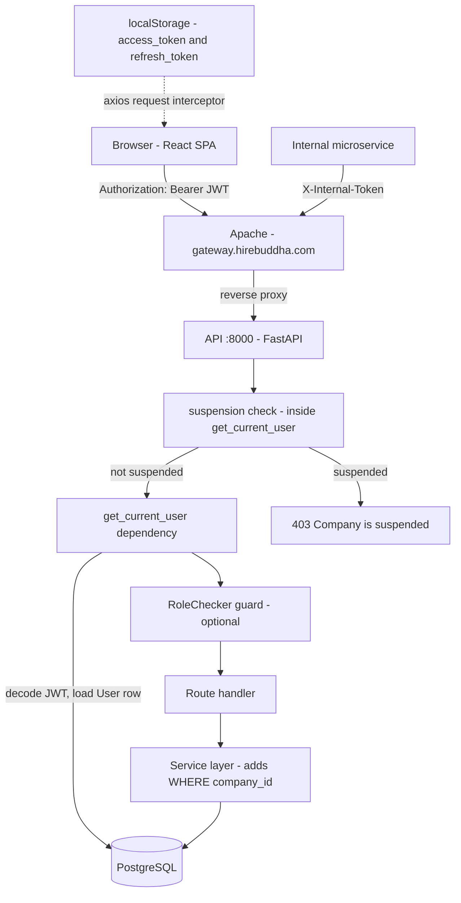
```mermaid
flowchart TD
    Browser["Browser - React SPA"]
    LS["localStorage - access_token and refresh_token"]
    GW["Apache - gateway.hirebuddha.com"]
    BE["API :8000 - FastAPI"]
    SUSP["suspension check - inside get_current_user"]
    DEP["get_current_user dependency"]
    ROLE["RoleChecker guard - optional"]
    HANDLER["Route handler"]
    SVC["Service layer - adds WHERE company_id"]
    DB[("PostgreSQL")]

    Browser -->|"Authorization: Bearer JWT"| GW
    LS -.->|"axios request interceptor"| Browser
    GW -->|"reverse proxy"| BE
    BE --> SUSP
    SUSP -->|"not suspended"| DEP
    SUSP -->|"suspended"| Blocked403["403 Company is suspended"]
    DEP -->|"decode JWT, load User row"| DB
    DEP --> ROLE
    ROLE --> HANDLER
    HANDLER --> SVC
    SVC --> DB

    INT["Internal microservice"]
    INT -->|"X-Internal-Token"| GW
```

Read the rest of this document if you are about to add an endpoint, change a role check, or debug "why can this user see that row".

---

## 2. The identity tables

Three tables in [models.py](../../backend/src/auth/models.py) carry all identity state. There is no separate `roles`, `permissions`, or `sessions` table — role is a plain string column on `users`.

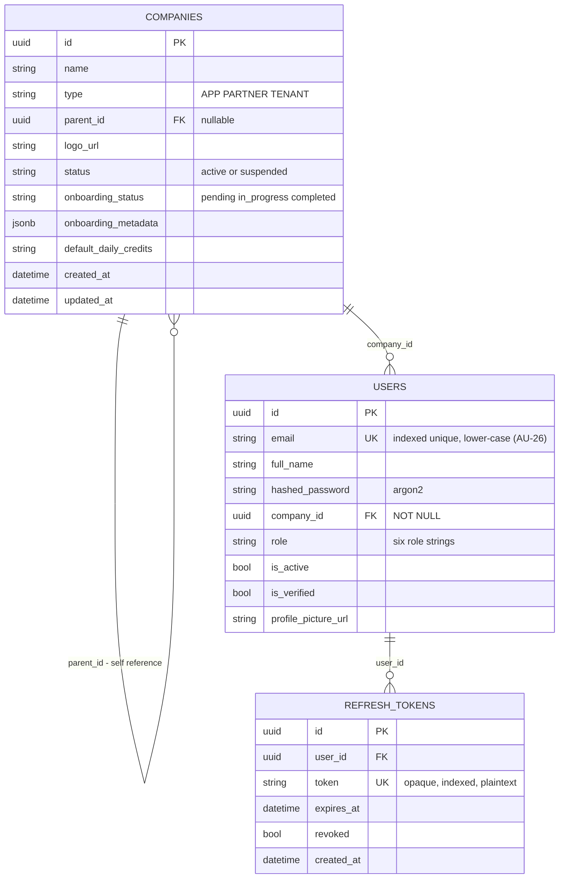
```mermaid
erDiagram
    COMPANIES ||--o{ COMPANIES : "parent_id - self reference"
    COMPANIES ||--o{ USERS : "company_id"
    USERS ||--o{ REFRESH_TOKENS : "user_id"

    COMPANIES {
        uuid id PK
        string name
        string type "APP PARTNER TENANT"
        uuid parent_id FK "nullable"
        string logo_url
        string status "active or suspended"
        string onboarding_status "pending in_progress completed"
        jsonb onboarding_metadata
        string default_daily_credits
        datetime created_at
        datetime updated_at
    }
    USERS {
        uuid id PK
        string email UK "indexed unique, lower-case (AU-26)"
        string full_name
        string hashed_password "argon2"
        uuid company_id FK "NOT NULL"
        string role "six role strings"
        bool is_active
        bool is_verified
        string profile_picture_url
    }
    REFRESH_TOKENS {
        uuid id PK
        uuid user_id FK
        string token UK "opaque, indexed, plaintext"
        datetime expires_at
        bool revoked
        datetime created_at
    }
```

Things worth noticing right away:

| Observation | Why it matters |
|---|---|
| `users.company_id` is `nullable=False` | Every user always has a company. There are no "floating" users. |
| `users.role` is a free-text `String` in the database | The API validates it: request schemas type roles as `Role` ([roles.py](../../backend/src/auth/roles.py)), so an unknown role is a 422 (AU-01, AU-21). There is no database constraint. |
| `companies.parent_id` is a self-FK | The whole hierarchy is one adjacency-list column. Only **one** level of nesting is ever queried (`parent_id == my_company_id`); nobody walks the tree recursively. |
| `refresh_tokens.token_hash` stores a SHA-256, not the token | Since AU-10 a database read yields no working sessions. See section 5. |
| `users.is_active`, `is_verified`, `token_version` | All checked on every request since 2026-09-30 (AU-04, AU-08, AU-05). |

---

## 3. Passwords: Argon2, hashing, and the reset gap

### 3.1 Where hashing happens

All password work funnels through two functions in [common/security.py](../../backend/src/common/security.py):

```python
# backend/src/common/security.py
pwd_context = CryptContext(schemes=["argon2"], deprecated="auto")

def verify_password(plain_password, hashed_password):
    return pwd_context.verify(plain_password, hashed_password)

def get_password_hash(password):
    return pwd_context.hash(password)
```

`CryptContext(schemes=["argon2"])` means passlib uses **Argon2** (the `argon2-cffi` backend) with passlib's default parameters — no custom time/memory cost is configured anywhere in the repo. `deprecated="auto"` would let passlib migrate older hashes, but since `argon2` is the only scheme, there is nothing to migrate from.

Every call site:

| Call site | Purpose |
|---|---|
| [service.py:83](../../backend/src/auth/service.py:83) `create_user_as_admin` | Admin-created user |
| [service.py:133](../../backend/src/auth/service.py:133) `create_user` | Self-registration |
| [service.py:257](../../backend/src/auth/service.py:257) `get_or_create_oauth_user` | OAuth user — hashes a throwaway `secrets.token_urlsafe(16)` |
| [service.py:162](../../backend/src/auth/service.py:162) `authenticate_user` | The only `verify_password` call |

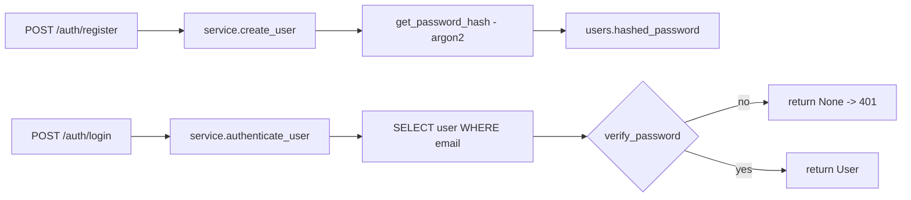
```mermaid
flowchart LR
    A["POST /auth/register"] --> B["service.create_user"]
    B --> C["get_password_hash - argon2"]
    C --> D["users.hashed_password"]

    E["POST /auth/login"] --> F["service.authenticate_user"]
    F --> G["SELECT user WHERE email"]
    G --> H{"verify_password"}
    H -->|"no"| I["return None -> 401"]
    H -->|"yes"| J["return User"]
```

### 3.2 Password policy and sign-in throttling (AU-07)

`service.check_password_policy(password, email)` runs wherever a password is **chosen** —
registration, admin creation, reset — and answers 422 with a plain-string `detail` unless
the password is 12–128 characters and is not the account's email address. Existing
passwords are not re-checked at login. The frontend pages ask for the same 12 characters.
Until 2026-09-30 `password: str` had no constraint at all and a one-character password was
accepted.

Sign-in is throttled per **account**, not per address (`auth/throttle.py`): ten wrong
passwords for one email in 15 minutes and that account's sign-in answers 429 (with
`Retry-After`) until the window ends — even with the right password — however many client
addresses the attempts come from. Unknown emails are counted the same way, so the limit
reveals nothing. A correct password clears the count. The counters live in Redis under a
SHA-256 of the email; if Redis is unreachable the check is skipped (logged), because an
outage must not lock everyone out. The API-wide 200 requests/minute per IP still applies
on top. The same module limits account emails (verification, reset) to five an hour per
address.

### 3.3 Password reset and email verification (AU-06, AU-08)

Both flows were half-built until 2026-09-30: the reset pages called endpoints that did not
exist, and nothing ever sent a verification email (the one sender had no caller), so
`is_verified` was `false` for every self-registered user and gated nothing. They now work
end to end, in [account_emails.py](../../backend/src/auth/account_emails.py) (tokens, links,
emails) and the auth router.

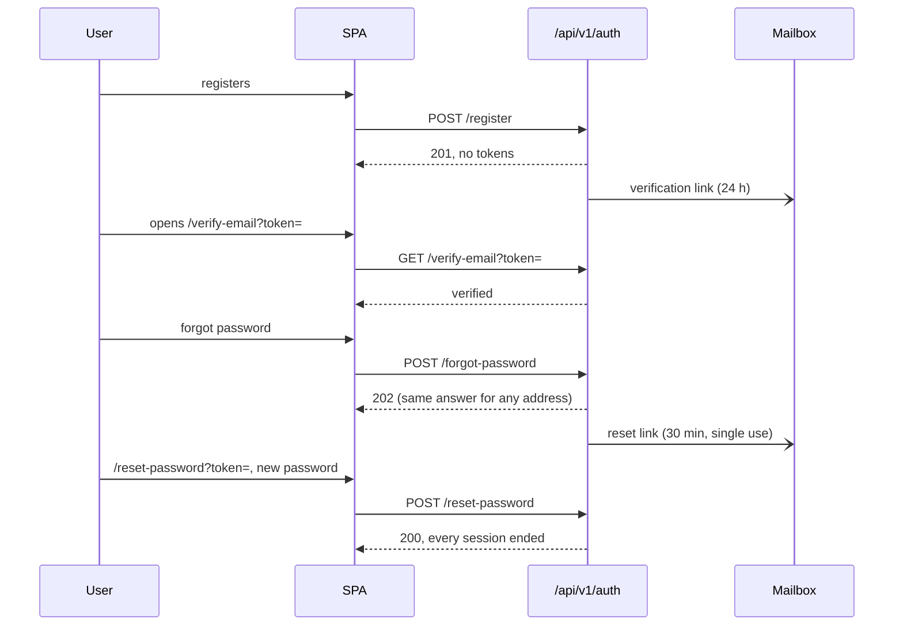
```mermaid
sequenceDiagram
    participant U as User
    participant FE as SPA
    participant API as /api/v1/auth
    participant M as Mailbox

    U->>FE: registers
    FE->>API: POST /register
    API-->>FE: 201, no tokens
    API-)M: verification link (24 h)
    U->>FE: opens /verify-email?token=
    FE->>API: GET /verify-email?token=
    API-->>FE: verified
    U->>FE: forgot password
    FE->>API: POST /forgot-password
    API-->>FE: 202 (same answer for any address)
    API-)M: reset link (30 min, single use)
    U->>FE: /reset-password?token=, new password
    FE->>API: POST /reset-password
    API-->>FE: 200, every session ended
```

| Endpoint | Does |
|---|---|
| `POST /auth/register` | Creates the workspace and its **unverified** `tenant_admin`; emails a verification link; returns `201 {email, message}` — **no tokens**. Every address is lower-cased on the way in, so one account per address in any case (AU-26) |
| `GET /auth/verify-email?token=` | Verifies the address (unchanged) |
| `POST /auth/resend-verification {email}` | `202`, the same answer whether or not the address has an unverified account |
| `POST /auth/forgot-password {email}` | `202`, the same answer for any address; emails a reset link to an active account |
| `POST /auth/reset-password {token, new_password}` | Checks the policy, sets the password, marks the address verified, ends every session (`revoke_all_sessions`), clears the sign-in throttle |

Tokens are JWTs signed with `SECRET_KEY`, told apart from login tokens by `type`:

| Token | `type` | Lifetime | Single use |
|---|---|---|---|
| Verification | `email_verification` | 24 hours | no (verifying twice is harmless) |
| Password reset | `password_reset` | 30 minutes | yes — carries `pwh`, a fingerprint of the password hash it was issued against; setting a password changes the hash |

**An unverified account cannot sign in** (product decision, 2026-09-30): the right password
answers 403 *Please verify your email address before signing in* (the login page then offers
"Send the verification link again"), and an unverified user's refresh token and access
token are refused (401). Admin-created and OAuth users are created verified. Migration
`au08_verify_existing_users` marked every account that existed before the rule verified —
none had ever been sent a link.

Emails go out after the response (FastAPI background tasks) through the `smtp-system`
integration; the resend and forgot-password endpoints are the retry. Links point at
`settings.FRONTEND_URL` (default `http://localhost:3000`; set the public SPA origin in
production). With no SMTP integration the email is not sent and an error is logged; in local
development `EMAIL_LINKS_IN_LOG=true` also writes the link to the API log. Never set it in
production — the links are credentials.

Note that `create_access_token` is reused to mint the verification token, and the `type` claim is the only thing distinguishing it from a login token. Both directions are checked: a login token fails `verify_email_token`'s `type` check, and since 2026-09-30 (AU-14) `_authenticate_user` accepts only `type == "access"`, so a verification token no longer signs anyone in.

The `/verify-email` page ([VerifyEmail.tsx](../../frontend/src/pages/auth/VerifyEmail.tsx)) verifies a `?token=`, or, after registering, says where the link went and offers to send it again. Until 2026-09-30 the route did not exist and the email's link fell through to `/dashboard`.

---

## 4. Access tokens: minting, claims, validation

### 4.1 Minting

One function does all minting — [security.py:18](../../backend/src/common/security.py:18):

```python
# backend/src/common/security.py
def create_access_token(data: dict, expires_delta: Optional[timedelta] = None):
    to_encode = data.copy()
    if expires_delta:
        expire = datetime.utcnow() + expires_delta
    else:
        expire = datetime.utcnow() + timedelta(minutes=settings.ACCESS_TOKEN_EXPIRE_MINUTES)
    to_encode.update({"exp": expire})
    encoded_jwt = jwt.encode(to_encode, settings.SECRET_KEY, algorithm=settings.ALGORITHM)
    return encoded_jwt
```

Every login-style call site (register, login, `/token`, refresh, OAuth) goes through one
helper, which stamps the token's `type` (AU-14, 2026-09-30):

```python
# backend/src/auth/service.py
def issue_access_token(user: User) -> str:
    return create_access_token(
        data={"sub": user.email, "company_id": str(user.company_id), "type": ACCESS_TOKEN_TYPE}
    )
```

### 4.2 The complete claim set

| Claim | Type | Source | Notes |
|---|---|---|---|
| `sub` | string | `user.email` | Identifies the user. Not the user UUID — the email. |
| `company_id` | string | `str(user.company_id)` | **Ignored** by `get_current_user`, which loads the user's current company. (It was read by the deleted `CompanySuspensionMiddleware`.) |
| `exp` | int | `utcnow() + ACCESS_TOKEN_EXPIRE_MINUTES` | Added by `create_access_token`. Verified by `jose`. |
| `type` | string | `"access"` on login tokens, `"email_verification"` on verification tokens | `_authenticate_user` accepts only `"access"`; `verify_email_token` accepts only `"email_verification"` (AU-14). Before 2026-09-30 login tokens carried no `type` and the validator did not read it, so a verification token signed in. |
| `tv` | int | `user.token_version` | Must equal the user's current `token_version` (AU-05). Bumping it — logout everywhere, refresh-token reuse, password reset — refuses every access token issued before |

There is **no** `iat`, `nbf`, `iss`, `aud`, `jti`, `role`, or `user_id` claim. That has two consequences worth internalising:

1. **Role changes take effect instantly** — because the role is fetched from the DB on every request, not read from the token. Good.
2. **Access tokens are revoked per user, not per token** — there is no `jti` or denylist, but `service.revoke_all_sessions(user)` bumps `users.token_version` and every earlier access token fails its `tv` check on its next request (AU-05, 2026-09-30). Until then a stolen access token was valid until `exp`.

### 4.3 Signing configuration

| Setting | Default | Where | Real `.env` value |
|---|---|---|---|
| `SECRET_KEY` | *required, no default* | [config.py:6](../../backend/src/common/config.py:6) | `dev_secret_key_change_in_production` |
| `ALGORITHM` | `HS256` | [config.py:7](../../backend/src/common/config.py:7) | `HS256` |
| `ACCESS_TOKEN_EXPIRE_MINUTES` | `30` | [config.py:8](../../backend/src/common/config.py:8) | `30` |

`SECRET_KEY` is a symmetric HMAC secret — anyone who has it can mint tokens for any user.
(The gateway on port 8001 used to decode tokens with its own `JWT_SECRET`, for
logging only; it was merged into the API on 2026-09-30 and that setting is gone.)


### 4.4 Validation

```python
# backend/src/auth/dependencies.py
payload = jwt.decode(token, settings.SECRET_KEY, algorithms=[settings.ALGORITHM])
email = payload.get("sub")
if email is None or payload.get("type") != ACCESS_TOKEN_TYPE:
    raise credentials_exception                      # 401
...
result = await db.execute(
    select(User).options(selectinload(User.company)).filter(User.email == token_data.email)
)
if not user.is_active:
    raise HTTPException(401, "This account has been deactivated")
if user.company and user.company.status == "suspended":
    raise HTTPException(403, "Company account is suspended. ...")
```

`jose.jwt.decode` verifies the signature and `exp` automatically. The token must be a
login token (AU-14). Everything else — the user still existing and still active (AU-04),
the company not being suspended — is a fresh DB read on **every single request**, with the
company eager-loaded via `selectinload` so the suspension check does not fire a second
query. A deactivated user's request is a 401, so the frontend tries a refresh, which is
refused too, and lands on the login page; logging in with the right password then answers
403 *This account has been deactivated* (a wrong password stays a plain 401).

---

## 5. Refresh tokens: storage, rotation, revocation

Refresh tokens are **not** JWTs. They are 32 bytes of `secrets.token_urlsafe`; the row
keeps only their SHA-256 (AU-10, 2026-09-30).

```python
# backend/src/auth/service.py
async def create_refresh_token(db: AsyncSession, user_id: uuid.UUID) -> str:
    token = secrets.token_urlsafe(32)
    expires_at = datetime.utcnow() + timedelta(days=7)
    refresh_token = RefreshToken(user_id=user_id, token_hash=hash_refresh_token(token), expires_at=expires_at)
    db.add(refresh_token)
    await db.commit()
    return token          # the only copy of the token leaves in the response
```

Lookups hash the presented token and match `token_hash`. The token is high-entropy, so an
unsalted fast hash is enough — there is nothing to brute-force.

| Property | Value |
|---|---|
| Format | Opaque URL-safe random string, 32 bytes of entropy |
| Lifetime | 7 days, hard-coded at [service.py:168](../../backend/src/auth/service.py:168) |
| Storage | `refresh_tokens.token_hash` — hex SHA-256, unique. Plaintext until 2026-09-30 (AU-10); migration `au10_refresh_token_hash` hashed the existing rows in place, so sessions survived |
| Rotation | Yes — every `/auth/refresh` revokes the old row and inserts a new one |
| Reuse detection | A **rotated** (revoked) token presented again ends every session of the user — see §5.4 (AU-09) |
| Revocation on logout | `POST /auth/logout {refresh_token, all_sessions?}` deletes the token's row; `all_sessions` also ends every other session (AU-12) |

### 5.1 The rotation path

`POST /auth/refresh` at [router.py:80](../../backend/src/auth/router.py:80) does two DB round trips where one would do:

```python
# backend/src/auth/router.py
new_refresh_token = await service.rotate_refresh_token(db, request.refresh_token)
user = await service.verify_refresh_token(db, new_refresh_token)
access_token = create_access_token(data={"sub": user.email, "company_id": str(user.company_id)})
```

`rotate_refresh_token` ([service.py:202](../../backend/src/auth/service.py:202)) sets `revoked = True` on the old row, calls `create_refresh_token`, and commits. `verify_refresh_token` then re-reads the brand-new row purely to get the `User`.

### 5.2 Full lifecycle sequence

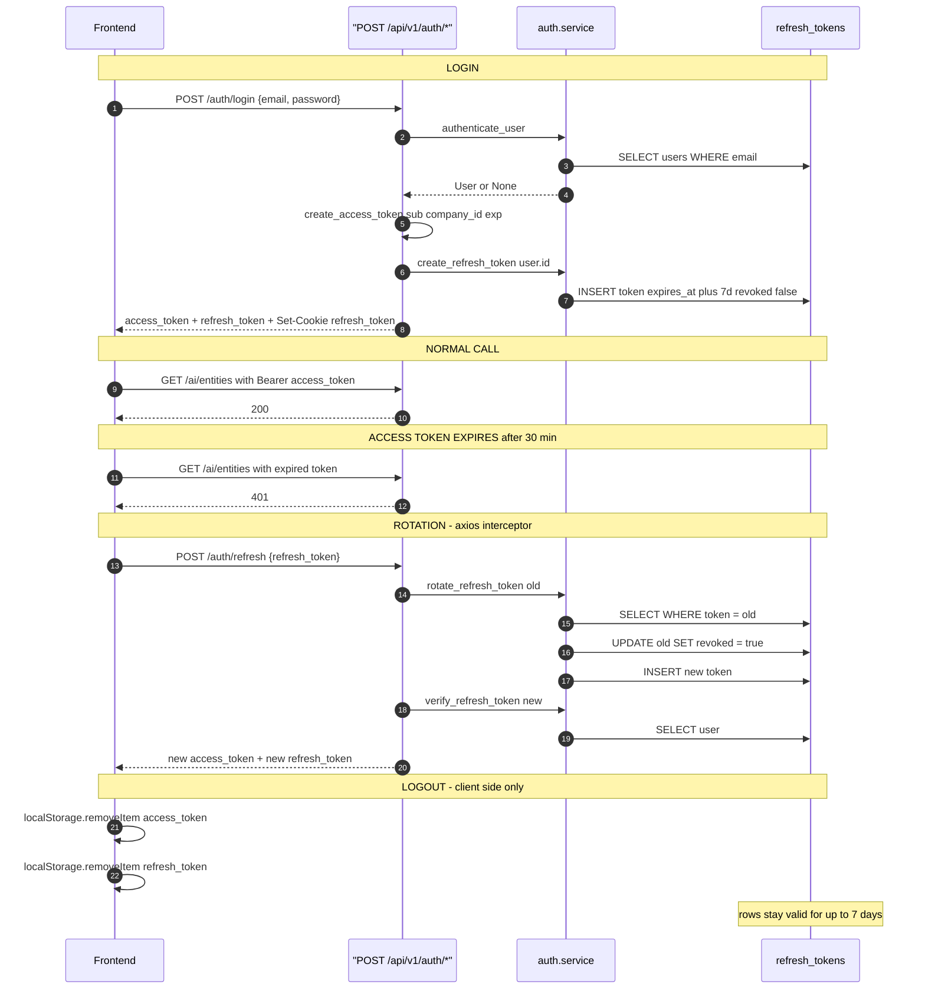
```mermaid
sequenceDiagram
    autonumber
    participant FE as Frontend
    participant API as "POST /api/v1/auth/*"
    participant SVC as auth.service
    participant DB as refresh_tokens

    Note over FE,DB: LOGIN
    FE->>API: POST /auth/login {email, password}
    API->>SVC: authenticate_user
    SVC->>DB: SELECT users WHERE email
    SVC-->>API: User or None
    API->>API: create_access_token sub company_id exp
    API->>SVC: create_refresh_token user.id
    SVC->>DB: INSERT token expires_at plus 7d revoked false
    API-->>FE: access_token + refresh_token + Set-Cookie refresh_token

    Note over FE,DB: NORMAL CALL
    FE->>API: GET /ai/entities with Bearer access_token
    API-->>FE: 200

    Note over FE,DB: ACCESS TOKEN EXPIRES after 30 min
    FE->>API: GET /ai/entities with expired token
    API-->>FE: 401

    Note over FE,DB: ROTATION - axios interceptor
    FE->>API: POST /auth/refresh {refresh_token}
    API->>SVC: rotate_refresh_token old
    SVC->>DB: SELECT WHERE token = old
    SVC->>DB: UPDATE old SET revoked = true
    SVC->>DB: INSERT new token
    API->>SVC: verify_refresh_token new
    SVC->>DB: SELECT user
    API-->>FE: new access_token + new refresh_token

    Note over FE,DB: LOGOUT - client side only
    FE->>FE: localStorage.removeItem access_token
    FE->>FE: localStorage.removeItem refresh_token
    Note over DB: rows stay valid for up to 7 days
```

### 5.3 The refresh-token state machine

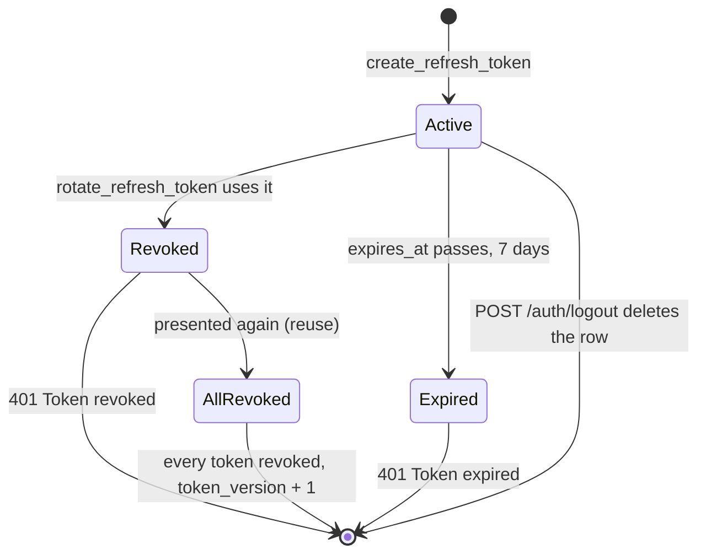
```mermaid
stateDiagram-v2
    [*] --> Active: create_refresh_token
    Active --> Revoked: rotate_refresh_token uses it
    Active --> Expired: expires_at passes, 7 days
    Revoked --> [*]: 401 Token revoked
    Expired --> [*]: 401 Token expired
    Active --> [*]: POST /auth/logout deletes the row
    Revoked --> AllRevoked: presented again (reuse)
    AllRevoked --> [*]: every token revoked, token_version + 1
```

Logout **deletes** the row rather than flagging it `revoked`: a flagged token presented
again is taken as theft (§5.4), and a token its own user logged out with is not.

### 5.4 Reuse detection

A rotated token is kept, flagged `revoked`. Presenting it again is the classic sign that it
was copied — whoever rotated it first holds the live one — so `_refresh_token_user` ends
every session of the user (AU-09, 2026-09-30):

```python
# backend/src/auth/service.py
if refresh_token.revoked:
    await revoke_all_sessions(db, refresh_token.user_id)   # all refresh tokens + token_version
    await db.commit()
    raise HTTPException(status_code=401, detail="Token revoked")
```

Until 2026-09-30 only the request was refused and a comment described the right response;
the attacker's freshly rotated token stayed live for 7 days. A side effect worth knowing:
two browser tabs that refresh at the same moment both present the same token, and the
second counts as reuse. The frontend refreshes through one shared request for that reason
(`api.client.ts`).

### 5.5 The refresh cookie nobody reads

`/auth/register`, `/auth/login`, `/auth/refresh`, and `/auth/oauth/{provider}` all set an `HttpOnly; Secure; SameSite=lax` cookie named `refresh_token`. Nothing ever reads it. `POST /auth/refresh` takes the token from the JSON body (`RefreshTokenRequest`), and the frontend reads it from `localStorage`. The cookie is dead weight — but harmless, and it is the right foundation if the team later moves refresh out of `localStorage`.

---

## 6. The FastAPI dependency chain

Everything lives in [dependencies.py](../../backend/src/auth/dependencies.py) — 85 lines, four public entry points.

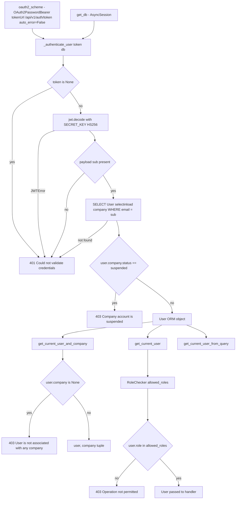
```mermaid
flowchart TD
    SCHEME["oauth2_scheme - OAuth2PasswordBearer tokenUrl /api/v1/auth/token auto_error=False"]
    DB["get_db - AsyncSession"]

    SCHEME --> AUTH["_authenticate_user token db"]
    DB --> AUTH

    AUTH --> C1{"token is None"}
    C1 -->|"yes"| E401["401 Could not validate credentials"]
    C1 -->|"no"| C2["jwt.decode with SECRET_KEY HS256"]
    C2 -->|"JWTError"| E401
    C2 --> C3{"payload sub present"}
    C3 -->|"no"| E401
    C3 -->|"yes"| C4["SELECT User selectinload company WHERE email = sub"]
    C4 -->|"not found"| E401
    C4 --> C5{"user.company.status == suspended"}
    C5 -->|"yes"| E403["403 Company account is suspended"]
    C5 -->|"no"| USER["User ORM object"]

    USER --> GCU["get_current_user"]
    USER --> GCUC["get_current_user_and_company"]
    USER --> GCFQ["get_current_user_from_query"]
    GCU --> RC["RoleChecker allowed_roles"]

    GCUC --> C6{"user.company is None"}
    C6 -->|"yes"| E403b["403 User is not associated with any company"]
    C6 -->|"no"| TUP["user, company tuple"]

    RC --> C7{"user.role in allowed_roles"}
    C7 -->|"no"| E403c["403 Operation not permitted"]
    C7 -->|"yes"| OK["User passed to handler"]
```

### 6.1 The four entry points

| Dependency | Returns | Used by |
|---|---|---|
| `get_current_user` | `User` | The overwhelming default — nearly every protected route |
| `get_current_user_and_company` | `(User, Company)` tuple | [social_router.py](../../backend/src/ai/social_router.py) — the only consumer |
| `get_current_user_from_query` | `User` | [ai/router.py:328](../../backend/src/ai/router.py:328) — the SSE `/executions/{id}/stream` endpoint, because `EventSource` cannot send headers |
| `RoleChecker(["..."])` | `User` | 11 call sites, listed in section 7 |

Note `auto_error=False` on `oauth2_scheme`. FastAPI will not raise on a missing header; instead `token` arrives as `None` and `_authenticate_user` raises its own 401. This is why the file has `print("Auth Debug: ...")` statements — leftover debugging that still ships. Those prints go to stdout, not the logger, and they include the user's email.

### 6.2 How `company_id` is derived and injected

There is no `company_id` dependency. **The handler reads it off the user object.** The canonical pattern is:

```python
# backend/src/ai/router.py
@router.get("/executions")
async def get_executions(
    db: AsyncSession = Depends(get_db),
    current_user: User = Depends(get_current_user)
):
    service = AIService(db)
    return await service.get_executions(current_user.company_id, current_user.role)
```

Both `company_id` **and** `role` are passed down into the service layer, and the service builds the `WHERE` clause. The `company_id` claim inside the JWT is *not* the source of truth for handlers — the DB row is.

Two escape hatches exist for cross-tenant work, both opt-in query params:

```python
# backend/src/ai/router.py — list_entities
effective_company_id = current_user.company_id
if company_id and current_user.role == "app_admin":
    effective_company_id = company_id
```

```python
# backend/src/ai/router.py — create_entity
if target_company_id:
    if current_user.role == "app_admin":
        effective_company_id = target_company_id
    elif current_user.role in ("partner_admin", "partner_user"):
        result = await db.execute(select(Company).where(
            Company.id == target_company_id,
            Company.parent_id == current_user.company_id,
        ))
        if result.scalar_one_or_none():
            effective_company_id = target_company_id
        else:
            raise HTTPException(status_code=403, detail="Not authorized to create entities for this company")
    else:
        raise HTTPException(status_code=403, detail="Cannot create entities for another company")
```

That second block is the reference implementation for "let a partner act on one of its tenants" — it re-verifies `parent_id` against the DB rather than trusting anything from the client.

### 6.3 Protecting a new endpoint — worked example

```python
# backend/src/ai/my_router.py
from fastapi import APIRouter, Depends, HTTPException
from sqlalchemy.ext.asyncio import AsyncSession
from sqlalchemy.future import select

from src.common.database import get_db
from src.auth.models import User
from src.auth.dependencies import get_current_user, RoleChecker
from src.ai.models import Widget

router = APIRouter(prefix="/widgets", tags=["Widgets"])

# 1. Plain authentication — any logged-in user, scoped to their own company.
@router.get("/{widget_id}")
async def get_widget(
    widget_id: UUID,
    db: AsyncSession = Depends(get_db),
    current_user: User = Depends(get_current_user),
):
    result = await db.execute(
        select(Widget).where(
            Widget.id == widget_id,
            # ALWAYS include this. There is no automatic scoping.
            Widget.company_id == current_user.company_id,
        )
    )
    widget = result.scalar_one_or_none()
    if not widget:
        # 404 not 403 — do not confirm the row exists in another tenant.
        raise HTTPException(status_code=404, detail="Widget not found")
    return widget


# 2. Role-gated — RoleChecker returns the User, so you still get company_id.
@router.delete("/{widget_id}", status_code=204)
async def delete_widget(
    widget_id: UUID,
    db: AsyncSession = Depends(get_db),
    current_user: User = Depends(RoleChecker(["app_admin", "tenant_admin"])),
):
    ...
```

Three rules for a new endpoint:

1. **Always** take `current_user: User = Depends(get_current_user)` — even on a "harmless" read.
2. **Always** add `WHERE company_id == current_user.company_id` unless you have explicitly written the `app_admin` / partner branch.
3. Return **404**, not 403, when a row exists but belongs to another tenant. The codebase mostly does this ([service.py:119](../../backend/src/ai/service.py:119) raises `404 Entity not found` when the company filter excludes a real row) and it avoids leaking existence.

---

## 7. The RBAC model

### 7.1 The six role strings

Defined as the Python `Role` enum ([auth/roles.py](../../backend/src/auth/roles.py), a `StrEnum`, so its members compare and hash as the stored strings) and as a TypeScript enum on the frontend at [types/index.ts:24](../../frontend/src/types/index.ts:24). Until 2026-09-30 the backend had only a comment on `users.role` (AU-21).

| Role string | Company type it belongs to | Typical holder |
|---|---|---|
| `app_admin` | `APP` | HireBuddha platform staff, superuser |
| `app_user` | `APP` | Platform ops: the platform reports only; no cross-tenant access (see §7.6 item 1) |
| `partner_admin` | `PARTNER` | Reseller or agency owner managing tenants |
| `partner_user` | `PARTNER` | Reseller staff |
| `tenant_admin` | `TENANT` | Customer's own admin — **the default for self-registration** |
| `tenant_user` | `TENANT` | Customer's ordinary user — the DB column default |

Two defaults that disagree:

- `users.role` column default is `"tenant_user"` ([models.py:35](../../backend/src/auth/models.py:35)).
- `service.create_user` explicitly sets `role="tenant_admin"` for self-registration ([service.py:139](../../backend/src/auth/service.py:139)), because a self-registering user is the first person in a brand-new workspace and must be able to invite others.

### 7.2 One guard, and `app_admin` always passes it

`RoleChecker` is the only role guard (AU-17, 2026-09-30):

```python
# backend/src/auth/dependencies.py
class RoleChecker:
    def __init__(self, allowed_roles: Iterable[str]):
        self.allowed_roles = frozenset(Role(r) for r in allowed_roles) | {Role.APP_ADMIN}

    def __call__(self, user: User = Depends(get_current_user)):
        if user.role not in self.allowed_roles:
            raise HTTPException(status_code=403, detail="Operation not permitted")
        return user
```

- **`app_admin` is always allowed** (AU-18). Before, it passed only a guard whose list spelt
  it out; every list did, but one forgotten entry would have locked the platform
  administrator out.
- **Role names are checked when the guard is built** (AU-21): `RoleChecker(["tenant-admin"])`
  raises `ValueError` when the route module is imported, instead of making a guard that
  silently allows nobody.
- `tests/unit/test_role_guards.py` walks the real app's route table and checks every guard
  admits `app_admin` and holds only real roles, and pins the roles of the routes converted
  from the old helpers.

There is still no inheritance beyond `app_admin`: a guard lists the other roles it allows.

The *conceptual* hierarchy — which the guard lists approximate — looks like this:

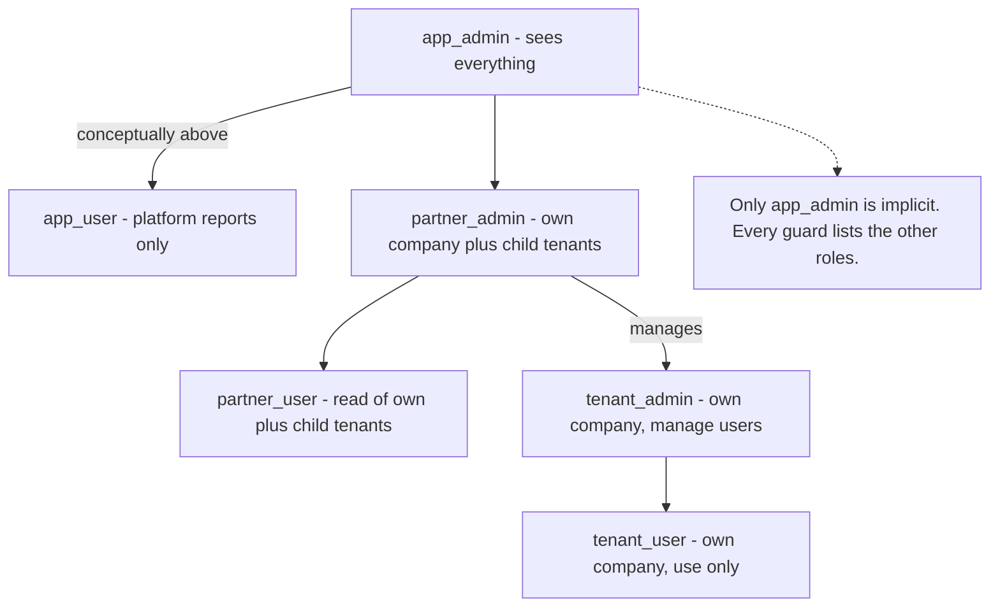
```mermaid
flowchart TD
    AA["app_admin - sees everything"]
    AU["app_user - platform reports only"]
    PA["partner_admin - own company plus child tenants"]
    PU["partner_user - read of own plus child tenants"]
    TA["tenant_admin - own company, manage users"]
    TU["tenant_user - own company, use only"]

    AA -->|"conceptually above"| AU
    AA --> PA
    PA --> PU
    PA -->|"manages"| TA
    TA --> TU

    NOTE["Only app_admin is implicit. Every guard lists the other roles."]
    AA -.-> NOTE
```

### 7.3 Every `RoleChecker` guard in the codebase

| File | Endpoint | Allowed roles |
|---|---|---|
| [router.py:76](../../backend/src/auth/router.py:76) | `GET /auth/admin-only` | `app_admin` |
| [company_router.py:41](../../backend/src/auth/company_router.py:41) | `GET /companies/partners` | `app_admin` |
| [company_router.py:49](../../backend/src/auth/company_router.py:49) | `GET /companies/tenants` | `app_admin`, `partner_admin` |
| [company_router.py:65](../../backend/src/auth/company_router.py:65) | `POST /companies` | `app_admin`, `partner_admin` |
| [user_router.py:44](../../backend/src/auth/user_router.py:44) | `POST /users` | `app_admin`, `partner_admin`, `tenant_admin` |
| [partner_router.py:27](../../backend/src/auth/partner_router.py:27) | all `/partner/*` | `partner_admin`, `app_admin` |
| [ai/router.py](../../backend/src/ai/router.py) | template admin routes | `app_admin` |
| [voice/phone_number_router.py](../../backend/src/voice/phone_number_router.py) | number admin | `app_admin` |
| [ai/tool_management_router.py](../../backend/src/ai/tool_management_router.py) | tool registry | `app_admin` |

### 7.4 The hand-rolled guards are gone

Until 2026-09-30 four hand-rolled helpers sat beside `RoleChecker`, two of them named
`_require_admin` and disagreeing about what "admin" meant (AU-17). All thirty call sites
are now `RoleChecker` dependencies in the route signature:

| Was | File | Now |
|---|---|---|
| `_require_admin` (20 routes) | [ai/api/admin.py](../../backend/src/ai/api/admin.py) | `RoleChecker(ADMIN_ROLES)` — `app_admin`, `partner_admin`, `tenant_admin` |
| `_require_admin` (2) | [billing/cron_router.py](../../backend/src/billing/cron_router.py) | `RoleChecker([Role.APP_ADMIN])` |
| `_require_app_admin` (3) | [config/router.py](../../backend/src/config/router.py) | `RoleChecker([Role.APP_ADMIN])` |
| `_require_roles(user, …)` (5) | [ai/reports_router.py](../../backend/src/ai/reports_router.py) | `RoleChecker([...])` with the same roles |

The kernel admin endpoints (`/api/v1/ai/admin/*`, the Meta-Intelligence Board and KPI
dashboards) stay open to every tenant admin, scoped to their own `company_id` in the handler
— [router/index.tsx:545](../../frontend/src/router/index.tsx:545) mirrors that. `ADMIN_ROLES`
in `roles.py` names that set once. Their 403 message is now *Operation not permitted*
everywhere (it was four different strings).

### 7.5 The permission matrix

Derived from the actual guard code, not from intent. Legend: **Y** = allowed, **own** = allowed but restricted to own company, **own+children** = own company plus tenants whose `parent_id` matches, **—** = 403.

| Capability | Source | `app_admin` | `app_user` | `partner_admin` | `partner_user` | `tenant_admin` | `tenant_user` |
|---|---|---|---|---|---|---|---|
| List companies | [company_router.py:13](../../backend/src/auth/company_router.py:13) | all | own | own+children | own+children | own | own |
| List partner companies | [company_router.py:38](../../backend/src/auth/company_router.py:38) | Y | — | — | — | — | — |
| List tenant companies | [company_router.py:46](../../backend/src/auth/company_router.py:46) | all | — | own children | — | — | — |
| Create company | [company_router.py:61](../../backend/src/auth/company_router.py:61) | any type | — | `TENANT` only, forced `parent_id` | — | — | — |
| Rename company (AU-03, AU-15) | [company_router.py](../../backend/src/auth/company_router.py) `update_company` | any | — | own+children | — | own | — |
| Suspend / reactivate company (AU-03, AU-15) | same | any but own | — | children only | — | — | — |
| List users | [user_router.py:14](../../backend/src/auth/user_router.py:14) | all | — | own+children | — | own | — |
| Create user | [service.py:52](../../backend/src/auth/service.py:52) | any role, any company | — | 4 non-app roles, own+children | — | `tenant_*` in own company | — |
| Update user (`service.update_user_as_admin`, AU-01) | [service.py](../../backend/src/auth/service.py) | any role but own | own name only | own+children, 4 non-app roles, not own role | own name only | own company, `tenant_*`, not own role | own name only |
| Partner dashboard `/partner/*` | [partner_router.py:27](../../backend/src/auth/partner_router.py:27) | all tenants | — | own children | — | — | — |
| Upload own avatar | [profile_router.py:26](../../backend/src/auth/profile_router.py:26) | Y | Y | Y | Y | Y | Y |
| Upload company logo | [profile_router.py:66](../../backend/src/auth/profile_router.py:66) | Y | — | Y | — | Y | — |
| Onboarding step / complete / skip | [onboarding_router.py](../../backend/src/auth/onboarding_router.py) | Y | Y | Y | Y | Y | Y |
| Create AI entity | [ai/router.py:19](../../backend/src/ai/router.py:19) | any company | own | own+children | own+children | own | own |
| Read AI entity | [ai/service.py:78](../../backend/src/ai/service.py:78) | all | own | own+children+templates | own+children+templates | own+templates | own+templates |
| Kernel admin `/ai/admin/*` | [ai/api/admin.py:91](../../backend/src/ai/api/admin.py:91) | own scope | — | own scope | — | own scope | — |
| Manage AI task defaults | [config/router.py:156](../../backend/src/config/router.py:156) | Y | — | — | — | — | — |
| Create integration | [config/router.py:64](../../backend/src/config/router.py:64) | any category | — | any category, own | — | 4 categories only, own | — |
| Trigger daily-credit cron | [billing/cron_router.py:16](../../backend/src/billing/cron_router.py:16) | Y | — | — | — | — | — |
| Platform analytics reports | [ai/reports_router.py:205](../../backend/src/ai/reports_router.py:205) | Y | Y | — | — | — | — |
| Portfolio analytics reports | [ai/reports_router.py:116](../../backend/src/ai/reports_router.py:116) | Y | — | Y | Y | — | — |
| Tool registry management | `tool_management_router.py` | Y | — | — | — | — | — |

### 7.6 Where enforcement is missing or inconsistent

Being blunt about the weak spots:

1. **`app_user` is a narrow role, on purpose.** It appears only in `reports_router.py`'s guards. It is refused `/companies/partners`, `/companies/tenants`, `POST /companies`, `POST /users`, user and company edits (since AU-01/AU-03) and the whole `/partner/*` tree; `GET /companies` returns its own company only, as for a tenant user. So in practice `app_user` is **a user of the APP company with the platform ops reports** (`/reports/analytics/data-growth`, the Ops & Incidents page) and nothing cross-tenant. Product decision (2026-09-30, AU-19): keep it that way; cross-tenant read access for support staff would be a separate feature.

2. ~~**`tenant_user` can suspend its own company.**~~ **Fixed 2026-09-30 (AU-03).** `update_company` guarded only on company match, so any user could `PATCH /companies/{their_own_id}` with `{"status": "suspended"}` and lock out the whole company. It now separates renaming (`app_admin` any; `partner_admin` its own company and tenants; `tenant_admin` its own company) from status changes (`app_admin` any company but its own; `partner_admin` its own tenants). `CompanyUpdate.status` is `Literal["active", "suspended"]`.

3. ~~**Partner admins cannot update their own tenants.**~~ **Fixed 2026-09-30 (AU-15).** A `partner_admin` can rename, suspend and reactivate the tenants whose `parent_id` is its company — the Tenants tab's toggle in Platform Management, which used to fail with 403. The `/partner/*` router itself is still read-only.

4. ~~**`update_user` lets any admin change any role in their company.**~~ **Fixed 2026-09-30 (AU-01).** The handler applied every field of `UserUpdate` once the caller was an admin of the same company — *or the row's owner* — and `role` was an unchecked string, so any user could PATCH `{"role": "app_admin"}` onto their own row. `PATCH /users/{id}` now goes through `service.update_user_as_admin`: anyone may change their own `full_name`; everything else needs a user admin of the target's company (partner admins: their own company and its tenants), the target's current role and any new role must both be ones the caller could assign (`roles.assignable_roles`, the same table `create_user_as_admin` uses), and nobody changes their own role or active status. `role` is typed `Role`, so an unknown string is a 422.

5. ~~**`is_active` is never checked.**~~ **Fixed 2026-09-30 (AU-04).** `_authenticate_user` refuses a deactivated user's token (401), `authenticate_user` refuses the right password (403), and the refresh path and OAuth login refuse them too. Deactivating a user now locks them out on their next request.

6. ~~**`is_verified` is never checked either.**~~ **Fixed 2026-09-30 (AU-08).** Registration returns no tokens and sends a verification link; an unverified account cannot sign in, refresh or call the API. See §3.3.

---

## 8. The company hierarchy: APP, PARTNER, TENANT

### 8.1 How rows relate

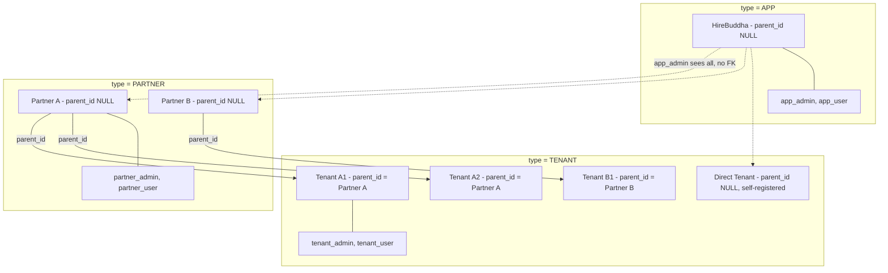
```mermaid
flowchart TD
    subgraph APP_LEVEL["type = APP"]
        APP["HireBuddha - parent_id NULL"]
        AAU["app_admin, app_user"]
    end
    subgraph PARTNER_LEVEL["type = PARTNER"]
        P1["Partner A - parent_id NULL"]
        P2["Partner B - parent_id NULL"]
        PAU["partner_admin, partner_user"]
    end
    subgraph TENANT_LEVEL["type = TENANT"]
        T1["Tenant A1 - parent_id = Partner A"]
        T2["Tenant A2 - parent_id = Partner A"]
        T3["Tenant B1 - parent_id = Partner B"]
        T4["Direct Tenant - parent_id NULL, self-registered"]
        TAU["tenant_admin, tenant_user"]
    end

    APP -.->|"app_admin sees all, no FK"| P1
    APP -.-> P2
    APP -.-> T4
    P1 -->|"parent_id"| T1
    P1 -->|"parent_id"| T2
    P2 -->|"parent_id"| T3

    APP --- AAU
    P1 --- PAU
    T1 --- TAU
```

Key structural facts:

- **The APP company is not a parent of anything.** `app_admin` visibility comes from `if role == "app_admin": no filter`, not from a `parent_id` chain. There is no code that creates or looks up "the APP company".
- **Partners have `parent_id = NULL`.** Only tenants ever carry a non-null `parent_id`, and only when created by a partner or by an app admin who supplied one.
- **Self-registered tenants are orphans.** [service.py:105](../../backend/src/auth/service.py:105) creates a `TENANT` company with no `parent_id`. It belongs to no partner and shows up only for `app_admin`.
- **The tree is one level deep in practice.** Every partner query is `Company.parent_id == current_user.company_id` — a single hop. A tenant of a tenant would be invisible to the grandparent.

### 8.2 How a partner creates a tenant

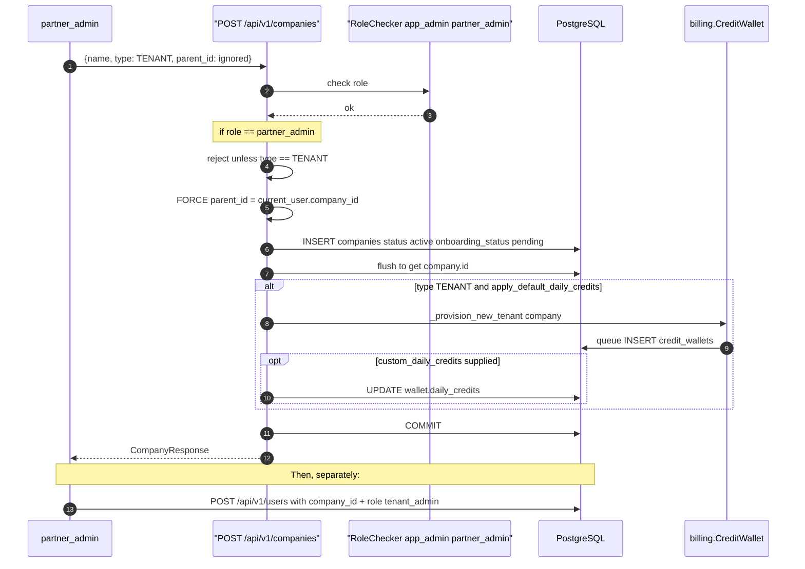
```mermaid
sequenceDiagram
    autonumber
    participant PA as partner_admin
    participant CR as "POST /api/v1/companies"
    participant RC as "RoleChecker app_admin partner_admin"
    participant DB as PostgreSQL
    participant BILL as billing.CreditWallet

    PA->>CR: {name, type: TENANT, parent_id: ignored}
    CR->>RC: check role
    RC-->>CR: ok
    Note over CR: if role == partner_admin
    CR->>CR: reject unless type == TENANT
    CR->>CR: FORCE parent_id = current_user.company_id
    CR->>DB: INSERT companies status active onboarding_status pending
    CR->>DB: flush to get company.id
    alt type TENANT and apply_default_daily_credits
        CR->>BILL: _provision_new_tenant company
        BILL->>DB: queue INSERT credit_wallets
        opt custom_daily_credits supplied
            CR->>DB: UPDATE wallet.daily_credits
        end
    end
    CR->>DB: COMMIT
    CR-->>PA: CompanyResponse

    Note over PA,DB: Then, separately:
    PA->>DB: POST /api/v1/users with company_id + role tenant_admin
```

The `parent_id` a partner sends is discarded and overwritten — [company_router.py:68-71](../../backend/src/auth/company_router.py:68):

```python
# backend/src/auth/company_router.py
if current_user.role == "partner_admin":
    if company.type != "TENANT":
        raise HTTPException(status_code=403, detail="Partner admins can only create Tenants")
    company.parent_id = current_user.company_id
```

That is the correct pattern — never trust a client-supplied parent.

Creating the tenant's first user is a **separate** call to `POST /api/v1/users`, validated by `create_user_as_admin` ([service.py:60-72](../../backend/src/auth/service.py:60)), which re-loads the target company and confirms `target_company.parent_id == creator.company_id`.

### 8.3 How visibility cascades

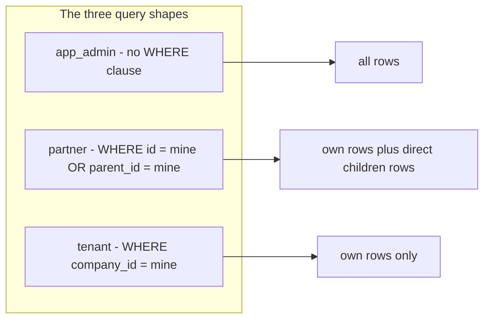
```mermaid
flowchart LR
    subgraph Q["The three query shapes"]
        A["app_admin - no WHERE clause"]
        B["partner - WHERE id = mine OR parent_id = mine"]
        C["tenant - WHERE company_id = mine"]
    end
    A --> R1["all rows"]
    B --> R2["own rows plus direct children rows"]
    C --> R3["own rows only"]
```

The rule lives in one place, [auth/visibility.py](../../backend/src/auth/visibility.py)
(AU-20, 2026-09-30):

```python
# backend/src/auth/visibility.py
async def company_scope(db, company_id, role) -> frozenset[UUID] | None:
    if role == Role.APP_ADMIN:
        return None                                   # every company
    if role in PARTNER_ROLES:                         # partner_admin, partner_user
        children = (await db.execute(select(Company.id).where(Company.parent_id == company_id))).scalars().all()
        return frozenset({company_id, *children})
    return frozenset({company_id})

async def visible_company_ids(db, user): ...          # company_scope for a signed-in user
```

A scoped query adds `WHERE company_id IN (scope)` unless the scope is `None`. Users, companies,
entity create/list/read and phone-number agent assignment all use it; before, each wrote the
rule out itself, and the entity list ran one query per child tenant (now one `IN` query).

Visibility is not permission. A `partner_user` *sees* its tenants' companies and entities,
but listing users is still a user-admin action, so `GET /users` refuses it — that is the
route's role check, not a different visibility rule.

---

## 9. Tenant isolation: how queries get scoped

### 9.1 The layers, and which one actually enforces

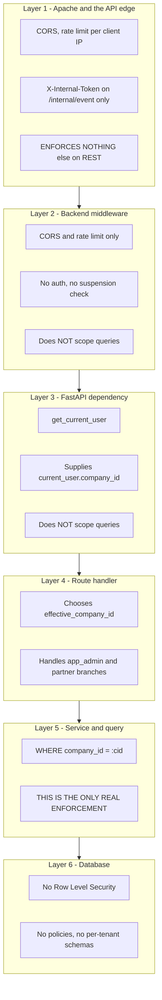
```mermaid
graph TB
    subgraph L1["Layer 1 - Apache and the API edge"]
        G1["CORS, rate limit per client IP"]
        G2["X-Internal-Token on /internal/event only"]
        G3["ENFORCES NOTHING else on REST"]
    end
    subgraph L2["Layer 2 - Backend middleware"]
        M1["CORS and rate limit only"]
        M2["No auth, no suspension check"]
        M3["Does NOT scope queries"]
    end
    subgraph L3["Layer 3 - FastAPI dependency"]
        D1["get_current_user"]
        D2["Supplies current_user.company_id"]
        D3["Does NOT scope queries"]
    end
    subgraph L4["Layer 4 - Route handler"]
        H1["Chooses effective_company_id"]
        H2["Handles app_admin and partner branches"]
    end
    subgraph L5["Layer 5 - Service and query"]
        S1["WHERE company_id = :cid"]
        S2["THIS IS THE ONLY REAL ENFORCEMENT"]
    end
    subgraph L6["Layer 6 - Database"]
        DB1["No Row Level Security"]
        DB2["No policies, no per-tenant schemas"]
    end

    L1 --> L2 --> L3 --> L4 --> L5 --> L6
```

**All isolation lives in layer 5, written by hand.** PostgreSQL Row Level Security is not enabled anywhere; there is no shared query mixin, no SQLAlchemy event listener injecting a tenant filter, and no per-tenant schema or database. A forgotten `WHERE` is a live cross-tenant read.

### 9.2 Concrete scoping code

The good examples — copy these:

```python
# backend/src/ai/service.py — get_entity, the fullest three-way branch
if user_role == "app_admin":
    pass  # No company filter
elif user_role in ("partner_admin", "partner_user"):
    child_result = await self.db.execute(
        select(Company.id).where(Company.parent_id == company_id)
    )
    child_ids = [row[0] for row in child_result.fetchall()]
    allowed_ids = [company_id] + child_ids
    query = query.where(or_(
        HierarchicalEntity.company_id.in_(allowed_ids),
        HierarchicalEntity.is_template == True,
    ))
else:
    query = query.where(or_(
        HierarchicalEntity.company_id == company_id,
        HierarchicalEntity.is_template == True,
    ))
```

```python
# backend/src/ai/api/admin.py — check-then-return-company_id pattern for a single row
async def _execution_company_check(db, run_id, user) -> UUID:
    row = (await db.execute(
        select(ExecutionRun.company_id, ExecutionRun.entity_id).where(ExecutionRun.id == run_id)
    )).first()
    if row is None:
        raise HTTPException(status_code=404, detail="execution not found")
    company_id, _entity_id = row
    if user.role != "app_admin" and company_id != user.company_id:
        raise HTTPException(status_code=403, detail="not authorised for this run")
    return company_id
```

```python
# backend/src/voice/sessions_router.py — the simple, most common shape
select(VoiceSession).where(VoiceSession.company_id == current_user.company_id)
```

```python
# backend/src/billing/credits_router.py — never accepts a company_id from the client
wallet = await credit_svc.get_or_create_wallet(current_user.company_id)
```

```python
# backend/src/ai/social_router.py — uses the (user, company) tuple dependency
user, company = auth
select(SocialConnection).where(
    SocialConnection.id == connection_id,
    SocialConnection.company_id == company.id,
)
```

### 9.3 Where the leakage risk sits

| Risk | Location | Detail |
|---|---|---|
| ~~**Email connections have no auth at all**~~ **Fixed 2026-09-30 (AU-02)** | [ai/email_router.py](../../backend/src/ai/email_router.py) | Every route now depends on `get_current_user_and_company`; list and create use the caller's company (a `company_id` in the query string is ignored), and delete/validate look a connection up by id **and** company, 404 otherwise. Before, all five routes were anonymous and delete/validate looked up by id alone — `validate` decrypted another tenant's app password and logged into the mailbox. |
| Templates are global | [ai/service.py:57](../../backend/src/ai/service.py:57) | `is_template == True` rows have `company_id = NULL` and are visible to everyone by design. Anything put in a template is public to all tenants. |
| `app_admin` short-circuits | throughout | `if user_role != "app_admin"` skips the filter entirely. Correct, but it means a role-escalation bug (7.6 item 4) becomes a full-database read. |
| ~~Copy-pasted cascade logic~~ **Fixed (AU-20)** | [auth/visibility.py](../../backend/src/auth/visibility.py) | The five copies of "own + children" are one helper, `visible_company_ids(user)`. |
| Webhooks derive tenancy from provider data | [voice/webhook_router.py](../../backend/src/voice/webhook_router.py) | `company_id` comes from the phone-number assignment row, not from a token. Correct approach, but the trust boundary is the telephony provider's signature, not a HireBuddha credential. |

Until 2026-09-30 the email router was the standout: its create route took `company_id` from the query string with a comment saying *"current_user will be injected by auth middleware in production"* — there was no such middleware, so the client picked its own tenant. It now follows `social_router.py`: `get_current_user_and_company` on every route, and the frontend no longer sends a company id (AU-02).

---

## 10. Company suspension

Checked in one place: `_authenticate_user`, which every `get_current_user*`
dependency (header, query-string and the mobile push socket) goes through.

```python
# backend/src/auth/dependencies.py — inside _authenticate_user
if user.company and user.company.status == "suspended":
    raise HTTPException(
        status_code=status.HTTP_403_FORBIDDEN,
        detail="Company account is suspended. Please contact support."
    )
```

It uses the eager-loaded `user.company`, so it is correct even after a company
move, and it costs no extra query. A database error fails the request rather
than skipping the check.

Until 2026-09-30 (SA-18) a `CompanySuspensionMiddleware` ran the same check first, on
every request with a bearer token outside `/api/v1/auth*`: it decoded the token
itself, opened its **own** `AsyncSessionLocal`, loaded the company named by the
token's `company_id` **claim** (stale after a company move), swallowed every
exception (failing open), and did all this even for a request that would 404. It
was deleted; one authenticated request went from 4 SQL statements to 3.

### 10.3 How a company gets suspended

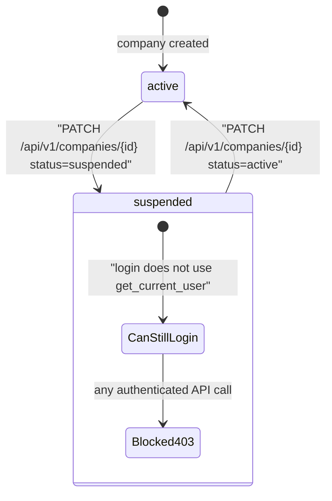
```mermaid
stateDiagram-v2
    [*] --> active: company created
    active --> suspended: "PATCH /api/v1/companies/{id} status=suspended"
    suspended --> active: "PATCH /api/v1/companies/{id} status=active"

    state suspended {
        [*] --> CanStillLogin: "login does not use get_current_user"
        CanStillLogin --> Blocked403: any authenticated API call
    }
```

The only writer is `PATCH /api/v1/companies/{company_id}` ([company_router.py:110](../../backend/src/auth/company_router.py:110)) with `CompanyUpdate.status`. In the UI it is a toggle in Platform Management:

```tsx
// frontend/src/pages/PlatformManagement.tsx
const newStatus = company.status === 'active' ? 'suspended' : 'active';
await companyService.updateCompany(company.id, { status: newStatus });
```

Nothing else — no billing job, no dunning process, no cron — ever sets `status = "suspended"`. Suspension is entirely a manual admin action today. Since 2026-09-30 (AU-03, AU-15) only an `app_admin` (any other company) or a `partner_admin` (its own tenants) may change `status`, never on the caller's own company; `status` must be `active` or `suspended`. Before, any user could suspend their own company.

---

## 11. Internal service-to-service auth

### 11.1 The `INTERNAL_TOKEN` shared secret

| Property | Value |
|---|---|
| Setting | `INTERNAL_TOKEN` on [config.py](../../backend/src/common/config.py) |
| Default | `""` — empty or a placeholder (`change-me-in-production`, …) **disables** the endpoint: 503 for every caller (SA-20, 2026-09-30). Before, the default was `change-me-in-production`, and `backend/.env` still holds it — so locally the endpoint is off until a real token is set |
| Header | `X-Internal-Token` |
| Comparison | `hmac.compare_digest` — constant time |
| Scope | `POST /internal/event` only |

```python
# backend/src/gateway/internal_event.py
def require_internal(x_internal_token: str = Header(default="")) -> None:
    if not hmac.compare_digest(x_internal_token.encode(), settings.INTERNAL_TOKEN.encode()):
        raise HTTPException(status_code=401, detail="Invalid or missing X-Internal-Token")

async def unified_internal_event(
    event: InternalEvent,
    background_tasks: BackgroundTasks,
    _: None = Depends(require_internal),
):
```

Until 2026-09-30 the check lived in the gateway's `GatewayAuthMiddleware`, with a
plain `!=` comparison, and `require_internal` only re-read a flag the middleware
had set. The gateway was merged into the API and the middleware deleted; the
dependency is now the gate, and FastAPI runs it before validating the body.

### 11.2 What the internal channel can do

`POST /internal/event` accepts an `InternalEvent` whose `client_id` field is a **caller-supplied tenant UUID** ([internal_event.py:48](../../backend/src/gateway/internal_event.py:48)). The event is wrapped in an `EventEnvelope` and published to the event bus, which routes it to that tenant's agents.

That is the trust model: **the internal token is a tenant-impersonation credential.** Anyone holding it can inject an event into any tenant. That is intentional for cron jobs and the vector indexer, but it means the secret must be treated as root.

`emit_internal_event` at [internal_event.py:157](../../backend/src/gateway/internal_event.py:157) is the in-process shortcut for platform code — it skips HTTP and the token entirely and publishes straight to the bus.

### 11.3 Trust zones

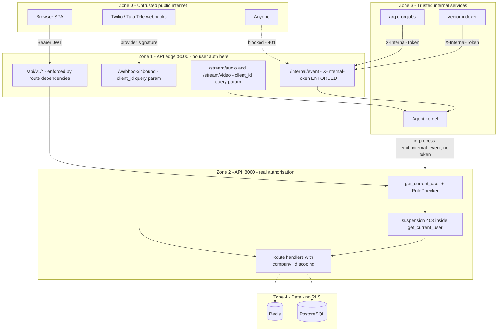
```mermaid
graph TB
    subgraph UNTRUSTED["Zone 0 - Untrusted public internet"]
        BROWSER["Browser SPA"]
        TELCO["Twilio / Tata Tele webhooks"]
        ATTACKER["Anyone"]
    end

    subgraph EDGE["Zone 1 - API edge :8000 - no user auth here"]
        RESTP["/api/v1/* - enforced by route dependencies"]
        WH["/webhook/inbound - client_id query param"]
        STREAM["/stream/audio and /stream/video - client_id query param"]
        INTEP["/internal/event - X-Internal-Token ENFORCED"]
    end

    subgraph APP["Zone 2 - API :8000 - real authorisation"]
        DEPS["get_current_user + RoleChecker"]
        SUSPM["suspension 403 inside get_current_user"]
        HANDLERS["Route handlers with company_id scoping"]
    end

    subgraph INTERNAL["Zone 3 - Trusted internal services"]
        CRON["arq cron jobs"]
        VDB["Vector indexer"]
        AGENTS["Agent kernel"]
    end

    subgraph DATA["Zone 4 - Data - no RLS"]
        PG[("PostgreSQL")]
        REDIS[("Redis")]
    end

    BROWSER -->|"Bearer JWT"| RESTP
    TELCO -->|"provider signature"| WH
    ATTACKER -.->|"blocked - 401"| INTEP
    CRON -->|"X-Internal-Token"| INTEP
    VDB -->|"X-Internal-Token"| INTEP
    AGENTS -->|"in-process emit_internal_event, no token"| APP

    RESTP --> DEPS --> SUSPM --> HANDLERS --> PG
    INTEP --> AGENTS
    WH --> HANDLERS
    STREAM --> AGENTS
    HANDLERS --> REDIS
```

Boundary notes:

- **Zone 1 does not authorise REST.** Zones 1 and 2 are one process since the gateway merge; nothing in front of the routes checks a user. That was true of the gateway too (its middleware *"NOT blocked here for REST / Webhook paths"*) — the edge was never a security control.
- **`/webhook/inbound` and `/stream/*` take `client_id` straight from the request** (a query parameter, or the WebSocket handshake) with no verification at all ([webhook_inbound.py](../../backend/src/gateway/webhook_inbound.py), [audio_gateway.py](../../backend/src/gateway/audio_gateway.py)). Webhook signature validation is best-effort and never blocks.
- **There is no mTLS, no service mesh, no network policy in this code.** The only thing separating zone 3 from zone 0 is the shared secret and whatever the deployment's firewall does.

---

## 12. OAuth: login, social connections, email connections

Three distinct OAuth-ish flows exist and they share almost nothing.

### 12.1 Flow A — social login (Google / Microsoft) for platform sign-in

Backend: `POST /api/v1/auth/oauth/{provider}` at [router.py:102](../../backend/src/auth/router.py:102). Frontend: [oauth.service.ts](../../frontend/src/services/oauth.service.ts) plus [OAuthCallback.tsx](../../frontend/src/pages/auth/OAuthCallback.tsx).

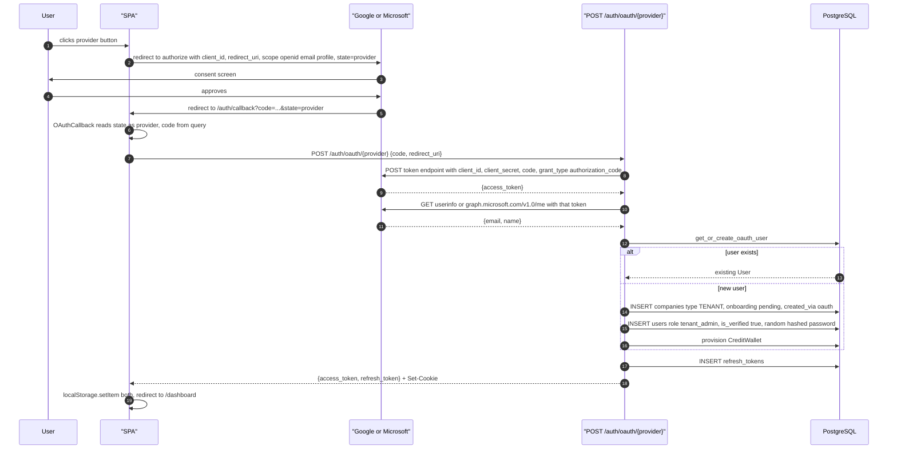
```mermaid
sequenceDiagram
    autonumber
    participant U as User
    participant FE as "SPA"
    participant P as "Google or Microsoft"
    participant BE as "POST /auth/oauth/{provider}"
    participant DB as PostgreSQL

    U->>FE: clicks provider button
    FE->>P: redirect to authorize with client_id, redirect_uri, scope openid email profile, state=provider
    P->>U: consent screen
    U->>P: approves
    P->>FE: redirect to /auth/callback?code=...&state=provider
    FE->>FE: OAuthCallback reads state as provider, code from query
    FE->>BE: POST /auth/oauth/{provider} {code, redirect_uri}
    BE->>P: POST token endpoint with client_id, client_secret, code, grant_type authorization_code
    P-->>BE: {access_token}
    BE->>P: GET userinfo or graph.microsoft.com/v1.0/me with that token
    P-->>BE: {email, name}
    BE->>DB: get_or_create_oauth_user
    alt user exists
        DB-->>BE: existing User
    else new user
        BE->>DB: INSERT companies type TENANT, onboarding pending, created_via oauth
        BE->>DB: INSERT users role tenant_admin, is_verified true, random hashed password
        BE->>DB: provision CreditWallet
    end
    BE->>DB: INSERT refresh_tokens
    BE-->>FE: {access_token, refresh_token} + Set-Cookie
    FE->>FE: localStorage.setItem both, redirect to /dashboard
```

Provider configuration comes from raw `os.getenv` inside the handler, not from `settings`:

| Env var | Used at |
|---|---|
| `GOOGLE_CLIENT_ID` / `GOOGLE_CLIENT_SECRET` | [router.py:112-113](../../backend/src/auth/router.py:112) |
| `MICROSOFT_CLIENT_ID` / `MICROSOFT_CLIENT_SECRET` | [router.py:135-136](../../backend/src/auth/router.py:135) |
| `VITE_GOOGLE_CLIENT_ID` / `VITE_MICROSOFT_CLIENT_ID` | [oauth.service.ts:3-4](../../frontend/src/services/oauth.service.ts:3) |

Three problems with this flow, all visible in the code. The third is fixed (AU-23,
2026-10-01); the first two are open in the frontend:

1. **The login-page buttons are not wired.** [LoginPage.tsx:76-85](../../frontend/src/pages/auth/LoginPage.tsx:76) renders "Google" and "Microsoft" buttons with **no `onClick` handler**, and does not import `oauthService`. `oauthService` is referenced only by `OAuthCallback.tsx`. The flow is unreachable from the UI as written.
2. **There is no `state` at all.** `oauth.service.ts` sends none, so nothing protects the callback from a forged redirect (login CSRF). `OAuthCallback.tsx` reads `state` as the provider name, so even a genuine callback fails with "Invalid OAuth state". It needs a random `state`, kept in `sessionStorage` and compared on return, plus PKCE (FE-11). The backend accepts `{code, redirect_uri, code_verifier?}` and forwards the verifier to the provider's token endpoint.
3. ~~**Account linking is by email with no verification of provider trust.**~~ **Fixed (AU-23).** The login signs into the existing account with the provider's email, so the email must be one the provider vouches for. `_verified_email` ([router.py](../../backend/src/auth/router.py)) takes Google's `email` only when `email_verified` is true. For Microsoft it takes `userPrincipalName`, whose domain the tenant must have verified, and never `mail`. Any Entra tenant admin can set `mail` to anyone's address, and `mail` used to come first. The lookup is case-insensitive. An existing unverified account that signs in this way is marked verified.

### 12.2 Flow B — social connections (agent posting credentials)

This is *not* login. It stores third-party OAuth tokens so agents can act on a tenant's social accounts. Router: [social_router.py](../../backend/src/ai/social_router.py). Service: [social_connection_service.py](../../backend/src/ai/social_connection_service.py).

Critically, **the backend does not run the OAuth handshake for these.** `POST /api/social-connections` accepts an already-obtained `access_token` and `refresh_token` in the request body. The handshake happens somewhere outside this codebase (or by hand).

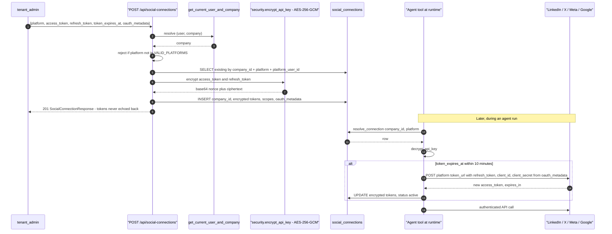
```mermaid
sequenceDiagram
    autonumber
    participant TA as tenant_admin
    participant SR as "POST /api/social-connections"
    participant DEP as get_current_user_and_company
    participant SEC as "security.encrypt_api_key - AES-256-GCM"
    participant DB as social_connections
    participant AG as "Agent tool at runtime"
    participant PLAT as "LinkedIn / X / Meta / Google"

    TA->>SR: {platform, access_token, refresh_token, token_expires_at, oauth_metadata}
    SR->>DEP: resolve (user, company)
    DEP-->>SR: company
    SR->>SR: reject if platform not in VALID_PLATFORMS
    SR->>DB: SELECT existing by company_id + platform + platform_user_id
    SR->>SEC: encrypt access_token and refresh_token
    SEC-->>SR: base64 nonce plus ciphertext
    SR->>DB: INSERT company_id, encrypted tokens, scopes, oauth_metadata
    SR-->>TA: 201 SocialConnectionResponse - tokens never echoed back

    Note over AG,PLAT: Later, during an agent run
    AG->>DB: resolve_connection company_id, platform
    DB-->>AG: row
    AG->>AG: decrypt_api_key
    alt token_expires_at within 10 minutes
        AG->>PLAT: POST platform token_url with refresh_token, client_id, client_secret from oauth_metadata
        PLAT-->>AG: new access_token, expires_in
        AG->>DB: UPDATE encrypted tokens, status active
    end
    AG->>PLAT: authenticated API call
```

Storage details:

| Aspect | Detail |
|---|---|
| Encryption | AES-256-GCM via [security.py:36](../../backend/src/common/security.py:36) `encrypt_api_key` |
| Key | `settings.ENCRYPTION_MASTER_KEY`, truncated or `\0`-padded to 32 bytes |
| Format | `base64(12-byte nonce ‖ ciphertext ‖ GCM tag)` |
| Refresh threshold | `TOKEN_REFRESH_THRESHOLD_MINUTES = 10` ([social_connection_service.py:68](../../backend/src/ai/social_connection_service.py:68)) |
| Platforms with refresh config | `linkedin`, `twitter`, `facebook`, `instagram`, `google_ads`, `youtube`, `tiktok`, `reddit` |
| `VALID_PLATFORMS` (create allow-list) | the same eight ([social_router.py](../../backend/src/ai/social_router.py)); `quora` left with its tools on 2026-10-01 (TL-23) |

Note that `client_secret` for each platform is stored **inside `oauth_metadata`**, a plain JSONB column — unlike the tokens, it is **not encrypted**.

### 12.3 Flow C — email connections (app passwords, not OAuth)

Despite living next to the OAuth code, email connections use **IMAP/SMTP app passwords**, not OAuth.

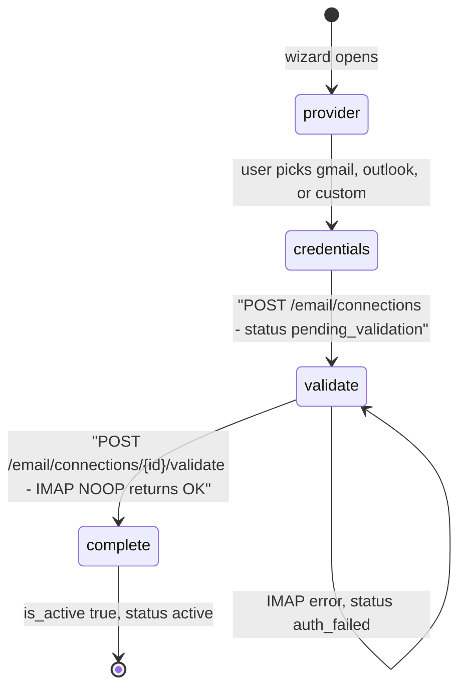
```mermaid
stateDiagram-v2
    [*] --> provider: wizard opens
    provider --> credentials: user picks gmail, outlook, or custom
    credentials --> validate: "POST /email/connections - status pending_validation"
    validate --> complete: "POST /email/connections/{id}/validate - IMAP NOOP returns OK"
    validate --> validate: IMAP error, status auth_failed
    complete --> [*]: is_active true, status active
```

The app password is encrypted with the same `encrypt_api_key` and validated by a real `imaplib.IMAP4_SSL` login plus `NOOP` ([email_router.py:231-233](../../backend/src/ai/email_router.py:231)). The wizard is [EmailConnectionWizard.tsx](../../frontend/src/components/EmailConnectionWizard.tsx).

Every one of these endpoints requires a signed-in user and works only on the caller's company's connections (AU-02, fixed 2026-09-30; see section 9.3).

---

## 13. Onboarding and the company state machine

Onboarding state lives on the `companies` row, not on the user. Two columns carry it: `onboarding_status` (a string) and `onboarding_metadata` (JSONB).

### 13.1 The five steps

```python
# backend/src/auth/onboarding_router.py
ONBOARDING_STEPS = [
    "company_profile",
    "integrations",
    "first_agent",
    "phone_setup",
    "billing",
]
```

| Step | What the wizard shows | Does the backend do anything? |
|---|---|---|
| `company_profile` | Workspace name + industry dropdown | **Yes** — writes `company.name` and `company.logo_url` from `step_data` |
| `integrations` | Informational cards about Gemini / OpenAI / Email / WhatsApp | No — records completion only |
| `first_agent` | Informational cards about agent templates | No |
| `phone_setup` | Informational cards, marked `skippable` | No |
| `billing` | Informational cards about daily credits | No |

Only the first step has server-side behaviour ([onboarding_router.py:96-101](../../backend/src/auth/onboarding_router.py:96)). The other four are progress tracking — the actual integration/agent/phone/billing setup happens on their own pages later.

### 13.2 The endpoints

| Method | Path | Effect on `onboarding_status` |
|---|---|---|
| `GET` | `/api/v1/onboarding/status` | none — returns status, `completed_steps`, `current_step`, `completion_pct` |
| `POST` | `/api/v1/onboarding/step/{step_name}` | sets `in_progress`, appends to `metadata.completed_steps` |
| `POST` | `/api/v1/onboarding/complete` | sets `completed`, writes `metadata.completed_at` |
| `POST` | `/api/v1/onboarding/skip` | sets `completed`, writes `metadata.skipped = true` |

All four use plain `get_current_user` — **any role, any user in the company** can advance or skip onboarding for the whole company.

### 13.3 The state machine

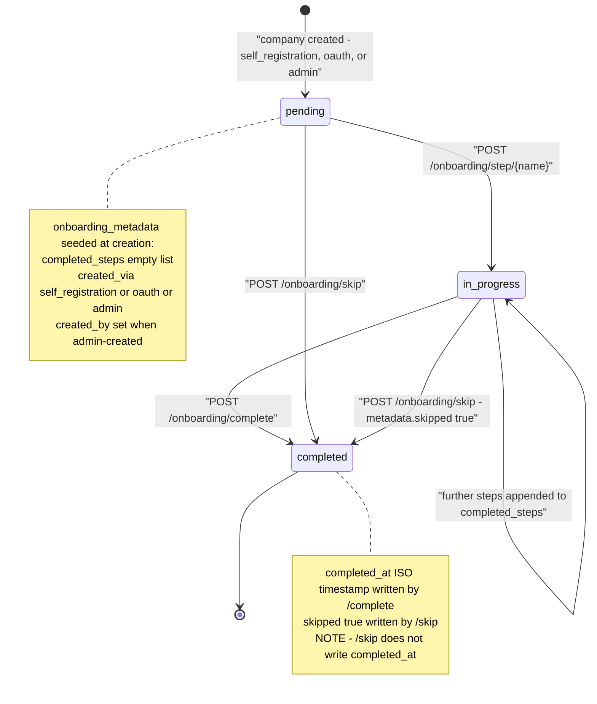
```mermaid
stateDiagram-v2
    [*] --> pending: "company created - self_registration, oauth, or admin"

    pending --> in_progress: "POST /onboarding/step/{name}"
    in_progress --> in_progress: "further steps appended to completed_steps"

    in_progress --> completed: "POST /onboarding/complete"
    pending --> completed: "POST /onboarding/skip"
    in_progress --> completed: "POST /onboarding/skip - metadata.skipped true"

    completed --> [*]

    note right of pending
        onboarding_metadata seeded at creation:
        completed_steps empty list
        created_via self_registration or oauth or admin
        created_by set when admin-created
    end note

    note right of completed
        completed_at ISO timestamp written by /complete
        skipped true written by /skip
        NOTE - /skip does not write completed_at
    end note
```

### 13.4 `onboarding_metadata` shape

| Key | Written by | Value |
|---|---|---|
| `completed_steps` | `/step/{name}` | list of step names, append-only, de-duplicated |
| `created_via` | company creation | `"self_registration"` \| `"oauth"` \| `"admin"` |
| `created_by` | [company_router.py:82](../../backend/src/auth/company_router.py:82) | creating user's UUID, admin path only |
| `step_data` | `/step/{name}` | `{ step_name: {...arbitrary} }` — e.g. `company_profile: {name, industry}` |
| `completed_at` | `/complete` | ISO-8601 UTC timestamp |
| `skipped` | `/skip` | `true` |

### 13.5 The redirect logic, and where it disagrees with itself

The `onboarding_router` docstring claims *"the ProtectedRoute guard redirects users with onboarding_status != 'completed' to /onboarding"*. **`ProtectedRoute` does no such thing** — read [router/index.tsx:78-94](../../frontend/src/router/index.tsx:78); it only checks authentication and `allowedRoles`.

The real redirect lives in the login handler:

```tsx
// frontend/src/hooks/useAuth.tsx
if (currentUser.role === 'tenant_admin' || currentUser.role === 'tenant_user') {
    const { onboardingService } = await import('@/services/platform.service');
    const status = await onboardingService.getStatus();
    if (status.status !== 'completed') {
        window.location.href = '/onboarding';
        return;
    }
}
```

So onboarding is enforced **only at login**, **only for tenant roles**, and a failed status call falls through to the dashboard. `register()` sends everyone to `/onboarding` unconditionally. Navigating directly to `/dashboard` with `onboarding_status = "pending"` works fine.

---

## 14. Frontend route protection and token storage

### 14.1 Token storage and attachment

Tokens live in **`localStorage`**, set in three places: [auth.service.ts:9-10](../../frontend/src/services/auth.service.ts:9) (login), `:20-21` (register), and [oauth.service.ts:72-73](../../frontend/src/services/oauth.service.ts:72) (OAuth callback).

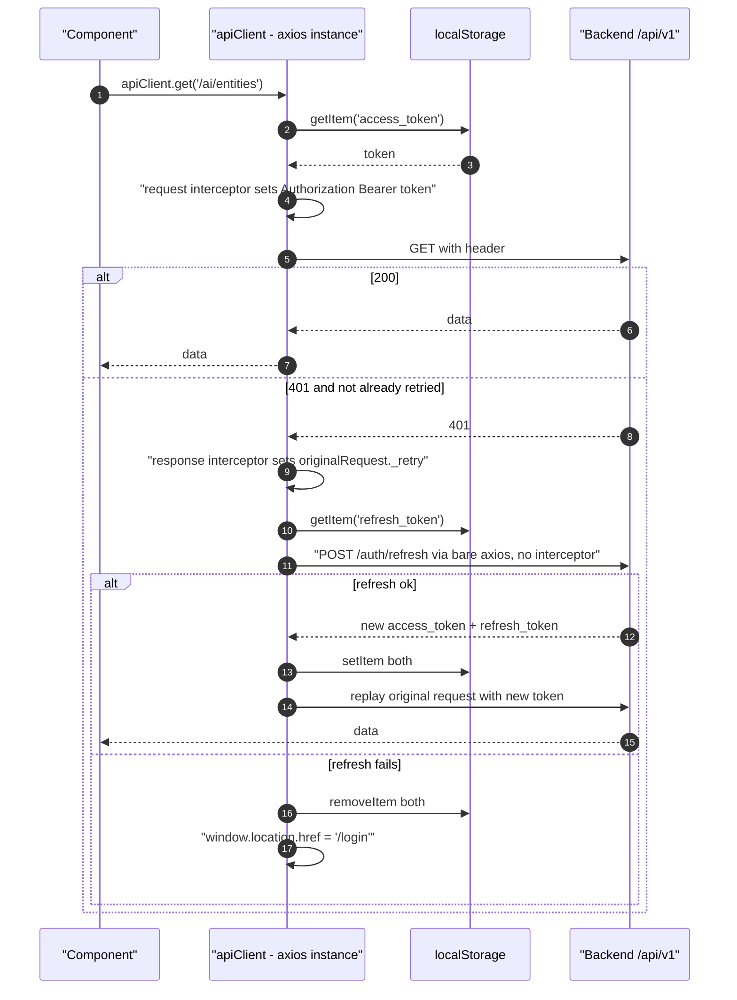
```mermaid
sequenceDiagram
    autonumber
    participant C as "Component"
    participant AX as "apiClient - axios instance"
    participant LS as localStorage
    participant API as "Backend /api/v1"

    C->>AX: apiClient.get('/ai/entities')
    AX->>LS: getItem('access_token')
    LS-->>AX: token
    AX->>AX: "request interceptor sets Authorization Bearer token"
    AX->>API: GET with header
    alt 200
        API-->>AX: data
        AX-->>C: data
    else 401 and not already retried
        API-->>AX: 401
        AX->>AX: "response interceptor sets originalRequest._retry"
        AX->>LS: getItem('refresh_token')
        AX->>API: "POST /auth/refresh via bare axios, no interceptor"
        alt refresh ok
            API-->>AX: new access_token + refresh_token
            AX->>LS: setItem both
            AX->>API: replay original request with new token
            API-->>C: data
        else refresh fails
            AX->>LS: removeItem both
            AX->>AX: "window.location.href = '/login'"
        end
    end
```

The interceptor pair is at [api.client.ts:17](../../frontend/src/services/api.client.ts:17) (request) and `:29` (response). Base URL defaults to `https://gateway.hirebuddha.com/api/v1`, overridable with `VITE_API_BASE_URL`.

Two things to know:

- **`localStorage` is readable by any JavaScript on the page.** An XSS bug hands over both tokens. The `HttpOnly` refresh cookie the backend already sets would be the safer store, but nothing reads it (section 5.5).
- **The `_retry` flag is per-request, not global.** Several parallel 401s each fire their own `/auth/refresh`. Because refresh **rotates**, the second one presents a token the first already revoked and gets a 401, which sends the user to `/login`. Expect intermittent unexpected logouts on pages that fan out many requests at mount.

### 14.2 Route gating

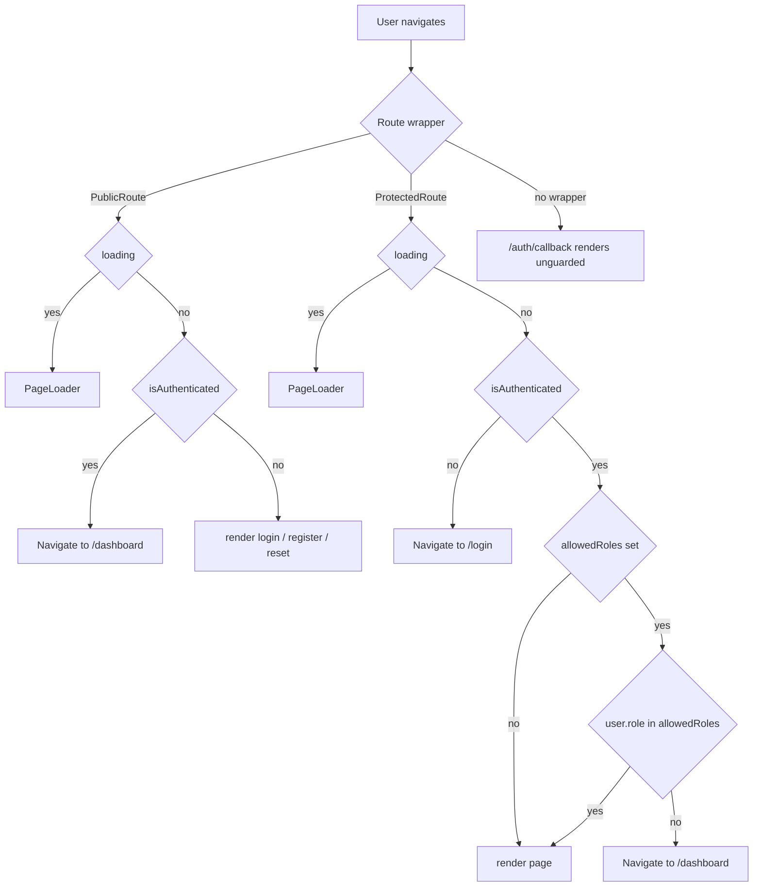
```mermaid
flowchart TD
    NAV["User navigates"] --> KIND{"Route wrapper"}

    KIND -->|"PublicRoute"| PUB{"loading"}
    PUB -->|"yes"| PL1["PageLoader"]
    PUB -->|"no"| PUB2{"isAuthenticated"}
    PUB2 -->|"yes"| RD["Navigate to /dashboard"]
    PUB2 -->|"no"| SHOWPUB["render login / register / reset"]

    KIND -->|"ProtectedRoute"| PR{"loading"}
    PR -->|"yes"| PL2["PageLoader"]
    PR -->|"no"| PR2{"isAuthenticated"}
    PR2 -->|"no"| RL["Navigate to /login"]
    PR2 -->|"yes"| PR3{"allowedRoles set"}
    PR3 -->|"no"| SHOW["render page"]
    PR3 -->|"yes"| PR4{"user.role in allowedRoles"}
    PR4 -->|"no"| RD2["Navigate to /dashboard"]
    PR4 -->|"yes"| SHOW

    KIND -->|"no wrapper"| RAW["/auth/callback renders unguarded"]
```

`isAuthenticated` is `!!user`, **not** `!!token` ([useAuth.tsx:108](../../frontend/src/hooks/useAuth.tsx:108)). The user object only appears after `GET /auth/me` succeeds during `initAuth`, so a valid token with a failed `/auth/me` behaves as logged out. That is the safe default.

### 14.3 Role-gated routes

| Path | `allowedRoles` |
|---|---|
| `/ai/tool-registry` | `APP_ADMIN` |
| `/settings/billing` | `APP_ADMIN` |
| `/reports/analytics/app-admin` | `APP_ADMIN` |
| `/ai-config` | `APP_ADMIN` |
| `/reports/costing` | `APP_ADMIN` |
| `/reports/analytics/app-user` | `APP_ADMIN`, `APP_USER` |
| `/reports/analytics/partner-admin` | `APP_ADMIN`, `PARTNER_ADMIN` |
| `/platform-management` | `APP_ADMIN`, `PARTNER_ADMIN`, `TENANT_ADMIN` |
| `/reports/analytics/tenant-admin` | `APP_ADMIN`, `PARTNER_ADMIN`, `TENANT_ADMIN` |
| `/admin/agent-kernel/*` (5 routes) | `APP_ADMIN`, `PARTNER_ADMIN`, `TENANT_ADMIN` |
| `/reports/analytics/partner-user` | `APP_ADMIN`, `PARTNER_ADMIN`, `PARTNER_USER` |
| everything else (~24 routes) | authentication only |

`MainLayout` separately hides nav items by role ([MainLayout.tsx:68-133](../../frontend/src/components/layout/MainLayout.tsx:68)). Note `/partner` — the partner dashboard — is `<ProtectedRoute>` with **no** `allowedRoles`, so any authenticated user can open it; it will simply get 403s from `/partner/*`. Frontend gating is cosmetic; the backend is the real boundary.

---

## 15. Security checklist and known gaps

Ordered roughly by severity. Everything here is observable in the code, not speculation.

### Critical

| # | Gap | Evidence |
|---|---|---|
| 1 | ~~**`/api/v1/email/*` has no authentication whatsoever.**~~ **Fixed (AU-02):** every route requires a user and is confined to that user's company. | [email_router.py](../../backend/src/ai/email_router.py) |
| 2 | ~~**Privilege escalation via `PATCH /users/{id}`.**~~ **Fixed (AU-01):** role changes are checked against the caller's assignable roles and refused on the caller's own row; see §7.6 item 4. | [service.py](../../backend/src/auth/service.py) `update_user_as_admin` |
| 3 | **Production secrets are the committed defaults.** `SECRET_KEY=dev_secret_key_change_in_production` in `backend/.env`; anyone with it mints tokens for any user. (`INTERNAL_TOKEN=change-me-in-production` no longer opens `/internal/event` — a placeholder disables it, SA-20.) | `backend/.env`, [config.py](../../backend/src/common/config.py) |
| 4 | ~~**Any authenticated user can suspend their own company**~~ **Fixed (AU-03):** status is `app_admin` (other companies) or `partner_admin` (its tenants) only, never the caller's own company. | [company_router.py](../../backend/src/auth/company_router.py) `update_company` |

### High

| # | Gap | Evidence |
|---|---|---|
| 5 | ~~No logout endpoint.~~ **Fixed (AU-12):** `POST /auth/logout`, which the frontend calls on sign-out. | [router.py](../../backend/src/auth/router.py) |
| 6 | ~~Refresh tokens stored in **plaintext**.~~ **Fixed (AU-10):** only a SHA-256 is stored. | [models.py](../../backend/src/auth/models.py) |
| 7 | ~~Refresh-token reuse detected but not acted on.~~ **Fixed (AU-09):** reuse ends every session. | [service.py](../../backend/src/auth/service.py) |
| 8 | ~~Access tokens cannot be revoked.~~ **Fixed (AU-05):** per user, through `token_version`. | [dependencies.py](../../backend/src/auth/dependencies.py) |
| 9 | ~~Password reset is frontend-only.~~ **Fixed (AU-06):** both endpoints exist; see §3.3. | [router.py](../../backend/src/auth/router.py) |
| 10 | ~~No password policy server-side.~~ **Fixed (AU-07):** 12–128 characters, not the email. | [service.py](../../backend/src/auth/service.py) `check_password_policy` |
| 11 | ~~No per-account rate limit on `/auth/login`.~~ **Fixed (AU-07):** 10 failures per account per 15 minutes → 429. | [throttle.py](../../backend/src/auth/throttle.py) |
| 12 | ~~`is_verified` is never enforced at login.~~ **Fixed (AU-08):** unverified accounts cannot sign in. | [service.py](../../backend/src/auth/service.py) `require_verified` |
| 13 | OAuth `state` is the provider name, not a CSRF nonce; account linking is by unverified email. | [oauth.service.ts:17](../../frontend/src/services/oauth.service.ts:17), [service.py:221](../../backend/src/auth/service.py:221) |

### Medium

| # | Gap | Evidence |
|---|---|---|
| 14 | ~~`INTERNAL_TOKEN` compared with `!=`, not a constant-time compare.~~ Fixed 2026-09-30: `hmac.compare_digest` in `require_internal`. | [internal_event.py](../../backend/src/gateway/internal_event.py) |
| 15 | `social_connections.oauth_metadata` holds each platform's `client_secret` **unencrypted** in JSONB, while the tokens beside it are AES-GCM encrypted. | [social_connection_service.py:174](../../backend/src/ai/social_connection_service.py:174) |
| 16 | `ENCRYPTION_MASTER_KEY` has a hard-coded 37-char default that is silently truncated to 32 bytes. | [config.py:9](../../backend/src/common/config.py:9), [security.py:40-44](../../backend/src/common/security.py:40) |
| 17 | ~~`CompanySuspensionMiddleware` swallows all exceptions — fails open on a DB error.~~ Gone 2026-09-30: the middleware is deleted (SA-18); the dependency's check fails closed. | [dependencies.py](../../backend/src/auth/dependencies.py) |
| 18 | SSE stream takes the JWT as a **query parameter**, so it lands in access logs and browser history. | [ai/router.py:328](../../backend/src/ai/router.py:328), [dependencies.py:72](../../backend/src/auth/dependencies.py:72) |
| 19 | ~~`print()` debug statements in the auth path leak user emails to stdout.~~ Gone 2026-09-30: `_authenticate_user` logs at `debug`, without the email. | [dependencies.py](../../backend/src/auth/dependencies.py) |
| 20 | ~~Gateway `JWT_SECRET` ≠ backend `SECRET_KEY`, so gateway JWT decode always fails silently.~~ Gone 2026-09-30 with the gateway and its `JWT_SECRET`. | — |
| 21 | Tokens in `localStorage` — XSS-exposed. The `HttpOnly` refresh cookie already exists but is unused. | [api.client.ts:19](../../frontend/src/services/api.client.ts:19) |
| 22 | Concurrent 401s each trigger their own refresh; rotation makes all but the first fail and force a logout. | [api.client.ts:35](../../frontend/src/services/api.client.ts:35) |
| 23 | `/webhook/inbound` and `/stream/*` take `client_id` from an unverified query param or handshake field; webhook signature validation never blocks. | [webhook_inbound.py](../../backend/src/gateway/webhook_inbound.py) |

### Low / hygiene

- No CSRF token anywhere, mitigated by the fact that auth is a header, not a cookie.
- `users.role` has no database constraint (the API validates it against `Role`).
- `GET /auth/admin-only` ([router.py:76](../../backend/src/auth/router.py:76)) is a leftover smoke-test endpoint that ships in production.
- `test_register_new_user` in [test_01_auth.py:15](../../backend/tests/e2e/test_01_auth.py:15) asserts `data["email"]` — true again since AU-08, when `/auth/register` stopped returning a `Token` and returns `{email, message}`.

---

## Key files reference

| File | Lines | What it does |
|---|---|---|
| [backend/src/auth/models.py](../../backend/src/auth/models.py) | 55 | `Company`, `User`, `RefreshToken` ORM models — the whole identity schema |
| [backend/src/auth/schemas.py](../../backend/src/auth/schemas.py) | 85 | Pydantic request/response shapes for auth, companies, users, onboarding |
| [backend/src/auth/dependencies.py](../../backend/src/auth/dependencies.py) | 85 | `_authenticate_user`, `get_current_user`, `get_current_user_and_company`, `get_current_user_from_query`, `RoleChecker` |
| [backend/src/auth/service.py](../../backend/src/auth/service.py) | 307 | User creation, password check, refresh-token create/verify/rotate, OAuth upsert, email verification |
| [backend/src/auth/router.py](../../backend/src/auth/router.py) | 182 | `/auth/register`, `/login`, `/token`, `/me`, `/refresh`, `/oauth/{provider}`, `/verify-email`, `/admin-only` |
| [backend/src/auth/company_router.py](../../backend/src/auth/company_router.py) | 134 | Company CRUD, partner/tenant listing, suspension via PATCH |
| [backend/src/auth/user_router.py](../../backend/src/auth/user_router.py) | 76 | User listing, admin creation, update |
| [backend/src/auth/profile_router.py](../../backend/src/auth/profile_router.py) | 99 | Avatar and company-logo upload into the artifact store |
| [backend/src/auth/partner_router.py](../../backend/src/auth/partner_router.py) | 354 | Read-only partner console — tenant health scores and portfolio analytics |
| [backend/src/auth/onboarding_router.py](../../backend/src/auth/onboarding_router.py) | 171 | The 5-step wizard state machine on `companies.onboarding_*` |
| [backend/src/common/security.py](../../backend/src/common/security.py) | 66 | Argon2 hashing, JWT mint/decode, AES-256-GCM key encryption |
| [backend/src/common/config.py](../../backend/src/common/config.py) | 180 | `Settings` — `SECRET_KEY`, `ALGORITHM`, `ACCESS_TOKEN_EXPIRE_MINUTES`, `ENCRYPTION_MASTER_KEY`, `INTERNAL_TOKEN`, `CORS_ORIGINS`, `RATE_LIMIT` |
| [backend/src/gateway/internal_event.py](../../backend/src/gateway/internal_event.py) | 200 | `POST /internal/event`, `require_internal`, and the in-process `emit_internal_event` helper |
| [backend/src/common/rate_limit.py](../../backend/src/common/rate_limit.py) | 22 | The API-wide per-IP rate limit |
| [backend/src/main.py](../../backend/src/main.py) | 141 | Router mounting and middleware registration order |
| [frontend/src/hooks/useAuth.tsx](../../frontend/src/hooks/useAuth.tsx) | 123 | `AuthProvider` — session bootstrap, login, register, logout, onboarding redirect |
| [frontend/src/services/api.client.ts](../../frontend/src/services/api.client.ts) | 71 | Axios instance with the bearer-token and 401-refresh interceptors |
| [frontend/src/services/auth.service.ts](../../frontend/src/services/auth.service.ts) | 49 | Thin wrappers over the auth endpoints; owns `localStorage` |
| [frontend/src/services/oauth.service.ts](../../frontend/src/services/oauth.service.ts) | 78 | Google/Microsoft authorize redirect + callback exchange |
| [frontend/src/router/index.tsx](../../frontend/src/router/index.tsx) | 603 | `ProtectedRoute`, `PublicRoute`, and every route's `allowedRoles` |
| [frontend/src/pages/auth/PasswordReset.tsx](../../frontend/src/pages/auth/PasswordReset.tsx) | 212 | Forgot/reset pages calling endpoints that do not exist |
| [frontend/src/pages/OnboardingWizard.tsx](../../frontend/src/pages/OnboardingWizard.tsx) | 267 | The 5-step wizard UI |
| [backend/tests/e2e/test_01_auth.py](../../backend/tests/e2e/test_01_auth.py) | — | E2E coverage for register, login, refresh, me, invalid tokens |
| [backend/tests/e2e/test_02_rbac_companies.py](../../backend/tests/e2e/test_02_rbac_companies.py) | — | E2E coverage for role fencing and suspension |

---

## Gotchas and things that surprise newcomers

- **The role is not in the JWT.** Every request re-reads the user row. Role changes apply instantly, but there is one guaranteed `SELECT users` per authenticated request, plus another from `CompanySuspensionMiddleware`.
- **`sub` is the email, not the user UUID.** Change a user's email and every outstanding token for them becomes invalid.
- **`RoleChecker` has no hierarchy.** `app_admin` is locked out of any endpoint whose list forgets to name it. Always include it explicitly.
- **`app_admin` bypasses the tenant filter by *skipping* the `WHERE`, not by widening it.** Read `if user_role != "app_admin"` as "this is the isolation boundary".
- **Nothing scopes queries for you.** No RLS, no ORM mixin, no middleware. A missing `WHERE company_id` is a cross-tenant leak that no test will catch.
- **Templates have `company_id = NULL` and are visible to every tenant.** Do not put customer data in a template.
- **Self-registration makes you `tenant_admin`, but the DB column default is `tenant_user`.** The two disagree; the service wins.
- **The refresh cookie is set but never read.** Refresh always comes from the JSON body and `localStorage`.
- **There is no logout endpoint.** Signing out only clears `localStorage`.
- **Two `_require_admin` functions exist with different meanings.** `ai/api/admin.py` counts `tenant_admin` as admin; `billing/cron_router.py` does not.
- **The OAuth buttons on the login page have no `onClick`.** The backend flow works; the UI never triggers it.
- **`/api/v1/email/*` was completely unauthenticated until 2026-09-30 (AU-02).** It now matches `social_router.py`; either is a fair template for a company-scoped credentials API.
- **The gateway is not a security boundary for REST.** Its own docstring says the backend enforces auth. Only `/internal/event` is blocked at the gateway.
- **Onboarding is enforced only at login, only for tenant roles.** Deep-linking to `/dashboard` skips it.

---

## Where to go next

- [03 — Data model](03-data-model.md) — the full table set, including everything that carries a `company_id`.
- [13 — Gateway and real-time](13-gateway-and-realtime.md) — the five gateway interfaces and how webhooks and WebSockets derive tenancy.
- [14 — Billing and credits](14-billing-and-credits.md) — `CreditWallet` provisioning at company creation, and how suspension interacts with balance.
- [15 — Governance and HITL](15-governance-and-hitl.md) — approval gates layered on top of RBAC.
- [16 — Frontend architecture](16-frontend.md) — the wider routing, layout, and service-layer picture.
- [17 — API reference](17-api-reference.md) — the complete endpoint list with its guards.
- [19 — Testing](19-testing.md) — where the `test_01_auth` / `test_02_rbac_companies` E2E suites fit.
