# 05. The Agent Kernel — Control Loop

> **What this document covers:** the autonomous control loop in `backend/src/ai/core/` that drives every AI execution on HireBuddha — its state envelope, its budget, its nine per-iteration phases, its executors, and every way a run can end.
> **Who should read it:** anyone touching backend AI behaviour. This is the single most load-bearing subsystem in the product.
> **Prerequisites:** [02 — System architecture](02-system-architecture.md) for where the worker sits, and [03 — Data model](03-data-model.md) for `ExecutionRun` / `HierarchicalEntity`. You do not need them to follow this doc, but they help.

---

## Table of contents

1. [The 60-second version](#1-the-60-second-version)
2. [How a run reaches the loop](#2-how-a-run-reaches-the-loop)
3. [`AgentState` — the typed envelope](#3-agentstate--the-typed-envelope)
4. [`Budget` — four axes and pressure](#4-budget--four-axes-and-pressure)
5. [One iteration, in code order](#5-one-iteration-in-code-order)
6. [The Perceiver](#6-the-perceiver)
7. [The Strategist](#7-the-strategist)
8. [The critic gates](#8-the-critic-gates)
9. [Executors](#9-executors)
10. [Reasoning strategies](#10-reasoning-strategies)
11. [The Observer and the Reflector](#11-the-observer-and-the-reflector)
12. [Termination and run status](#12-termination-and-run-status)
13. [The `context_state` legacy bridge](#13-the-context_state-legacy-bridge)
14. [Feature flags that change loop behaviour](#14-feature-flags-that-change-loop-behaviour)
15. [Events, SSE and tracing](#15-events-sse-and-tracing)
16. [A worked example](#16-a-worked-example)
17. [Key files reference](#17-key-files-reference)
18. [Gotchas and things that surprise newcomers](#18-gotchas-and-things-that-surprise-newcomers)
19. [Where to go next](#19-where-to-go-next)

---

## 1. The 60-second version

Every AI execution on HireBuddha — a one-shot ACTION, a multi-step PROCESS, a
goal-only AGENT — is driven by **one** class: `AgentLoop` in
[agent_loop.py](../../backend/src/ai/core/agent_loop.py). There is no second
engine. `AgentLoop.run(run_id)` is the sole entry point.

The loop is a classic sense-think-act cycle with critics bolted on. Each turn
around the loop is called an **iteration**, and each iteration walks nine
phases in a fixed order:

```
perceive → strategize → pre-critic → act → observe →
post-critic → alignment → supervisor → reflect → decide
```

Why a loop at all, rather than "run the plan top to bottom"? Three reasons,
all visible in the code:

1. **Self-correction.** A critic can look at what just happened and queue a
   corrective retry ([agent_loop.py:635](../../backend/src/ai/core/agent_loop.py:635)).
   A plan-walker cannot.
2. **Cost control.** Budget is a first-class object consulted every iteration,
   so the loop can wind a run down before it burns money
   ([budget.py](../../backend/src/ai/core/budget.py)).
3. **Suspend/resume.** When a step needs a whole child agent to run, the loop
   snapshots itself, releases the worker, and resumes later
   ([agent_loop.py:252](../../backend/src/ai/core/agent_loop.py:252)).

Everything the loop touches lives on one typed object, `AgentState`. Every
phase is a small, separately-testable class. The orchestration in
`agent_loop.py` is deliberately boring glue.

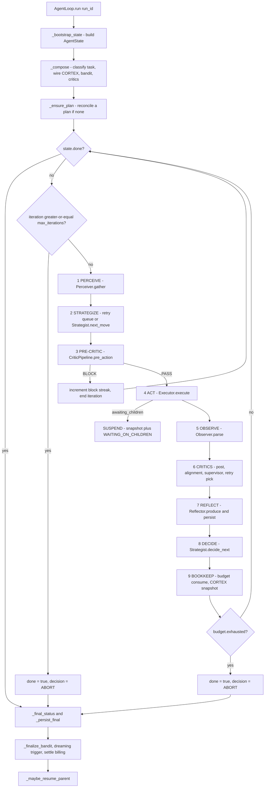

The kernel package is layered like this:

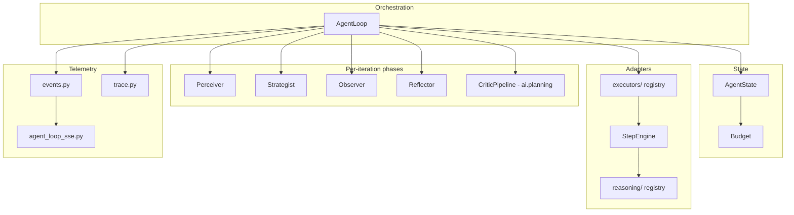

---

## 2. How a run reaches the loop

A user clicks "Run" in the SPA. Five hops later the loop starts.

| Hop | Where | What happens |
|-----|-------|--------------|
| 1 | `POST /api/v1/ai/execute` | [router.py:164](../../backend/src/ai/router.py:164) — auth, then `AIService.trigger_execution` |
| 2 | `AIService.trigger_execution` | [service.py:278](../../backend/src/ai/service.py:278) — validates the entity, inserts an `ExecutionRun` row with `status="PENDING"` |
| 3 | Arq enqueue | [service.py:317](../../backend/src/ai/service.py:317) — `redis.enqueue_job('run_execution_recursive', str(execution.id))` |
| 4 | Arq worker | [worker.py:70](../../backend/src/ai/worker.py:70) — `WorkerSettings.functions` includes `run_execution_recursive`; `job_timeout = 7200` |
| 5 | Job body | [arq_jobs.py:24](../../backend/src/ai/core/arq_jobs.py:24) — guards, then `AgentLoop(db, redis_pool, ...).run(run_id)` |

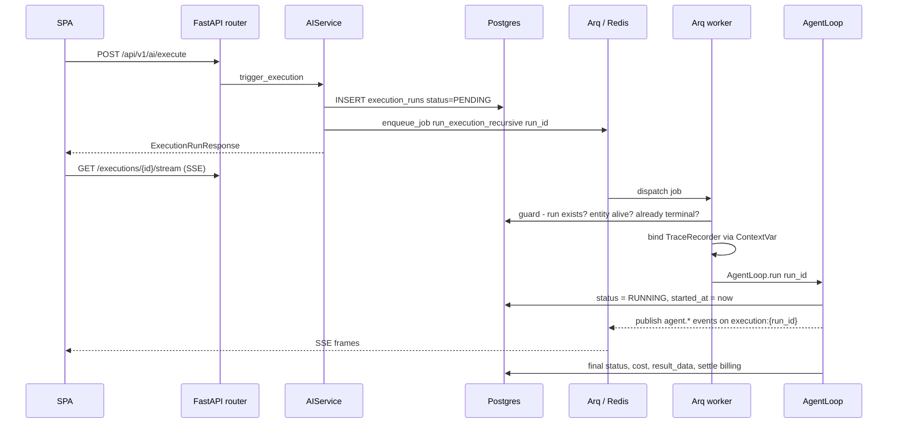

### The three guards in `run_execution_recursive`

Before the loop is ever constructed, the job runs three cheap checks
([arq_jobs.py:50-100](../../backend/src/ai/core/arq_jobs.py:50)):

1. **Ghost run** — the run row was deleted after enqueue. Return cleanly so
   arq stops retrying.
2. **Ghost entity** — `run.entity is None` or `entity.status == "DELETED"`.
   Same treatment. Driving the engine anyway would write child rows with
   dangling foreign keys and poison the session.
3. **Already terminal** — the run is already `COMPLETED` / `FAILED` /
   `PARTIAL_COMPLETE` / `CANCELLED`. Re-driving it would re-run and **re-bill**
   a run that already paid. Retry and refine create *new* run rows, so they are
   unaffected.

### There is no legacy engine any more

Older docs and even the in-repo
[core/README.md](../../backend/src/ai/core/README.md) still mention
`ExecutionEngine.execute_run` and an `agent_loop.enabled` master switch. **Both
are gone.** `backend/src/ai/core/execution_engine.py` does not exist; neither
does `recursive_engine.py`. The flag `agent_loop.enabled` is not in `DEFAULTS`
([feature_flags.py:36](../../backend/src/ai/core/feature_flags.py:36)); the job
only stamps it onto `run.input_data["feature_flags"]` so the SPA renders the
loop timeline:

```python
# backend/src/ai/core/arq_jobs.py
# The AgentLoop is the sole run engine (C4). ``agent_loop.enabled`` no
# longer gates engine choice; it is stamped onto the run below only so
# the SPA's ExecutionDetail page renders the loop timeline.
...
ff["agent_loop.enabled"] = True
```

What *was* `ExecutionEngine` is now split in two: the per-step surface lives in
[step_engine.py](../../backend/src/ai/core/step_engine.py) as `StepEngine`
(DAG runner, per-step wrapper with timeout + HITL + cost cap + GoalGuard), and
run-level orchestration is the loop's job.

### Other entry points

| Job | File | Purpose |
|-----|------|---------|
| `run_execution_recursive` | [arq_jobs.py:24](../../backend/src/ai/core/arq_jobs.py:24) | Fresh run. Also used for **child** runs — a child is just another top-level dispatch. |
| `resume_parent_run` | [arq_jobs.py:701](../../backend/src/ai/core/arq_jobs.py:701) | Calls `AgentLoop.resume(parent_run_id)` after a child finishes. |
| `resume_execution` | [arq_jobs.py:685](../../backend/src/ai/core/arq_jobs.py:685) | Legacy checkpoint resume; calls `AgentLoop.run` again. |
| `cortex_resume_scheduled` | [arq_jobs.py:735](../../backend/src/ai/core/arq_jobs.py:735) | Cron; wakes suspended CORTEX trees by creating new runs. |
| Gateway / campaigns | [service.py:927](../../backend/src/ai/service.py:927), [cortex_bridge.py:357](../../backend/src/ai/memory/cortex_bridge.py:357) | Also enqueue `run_execution_recursive`. |

---

## 3. `AgentState` — the typed envelope

`AgentState` ([agent_state.py:174](../../backend/src/ai/core/agent_state.py:174))
is the single mutable object every phase reads and writes. It is a plain
`@dataclass`, JSON-snapshottable, and it survives suspend/resume.

### The vocabulary types

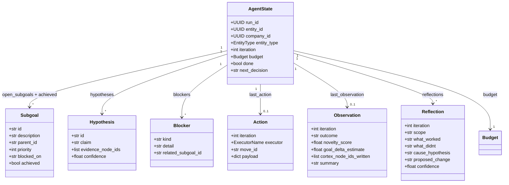

| Type | Meaning | Who creates it |
|------|---------|----------------|
| `Subgoal` | A unit of intent. `blocked_on` is a free-text note; `priority` sorts them (higher first by convention, though nothing sorts automatically). | `AgentState.add_subgoal` at bootstrap from `entity.goal`; `SupervisorVerdict.proposed_subgoals` on REPLAN. |
| `Hypothesis` | A claim with CORTEX evidence node ids and a confidence. **Declared but never written by any production code path** — reserved. |
| `Blocker` | Why the agent is stuck. `kind` is one of `missing_tool`, `missing_data`, `awaiting_hitl`, `budget`, `error`. | Only `AgentState.apply_observation` when `outcome == "blocked"` — see the gotcha in §18. |
| `Action` | What the loop just dispatched. Written every iteration at [agent_loop.py:569](../../backend/src/ai/core/agent_loop.py:569). |
| `Observation` | The typed reading of an `ActionResult`. `outcome` is `success` / `partial` / `fail` / `blocked`; `novelty_score` 0..1; `goal_delta_estimate` -1..1. | `Observer.parse`. |
| `Reflection` | A per-iteration lesson. `scope` is `run` / `entity` / `task_class`. | `Reflector.produce`. |

### The verdict dataclasses

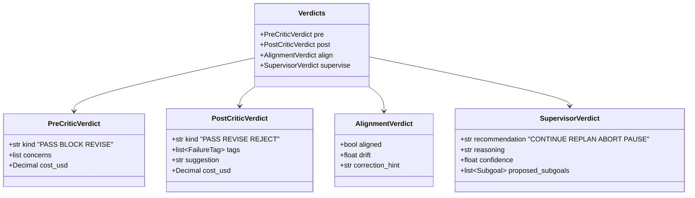

`Verdicts` is a per-iteration bundle. It is **not** stored on `AgentState`; it
is built locally in `_iteration` and handed to the `Reflector`
([agent_loop.py:587](../../backend/src/ai/core/agent_loop.py:587)).

### Every `AgentState` field

| Field | Type | Written by | Read by | Snapshotted |
|-------|------|-----------|---------|-------------|
| `run_id` | `UUID` | `_bootstrap_state` | everything | yes |
| `entity_id` | `UUID` | `_bootstrap_state` | Perceiver, Reflector, bandit | yes |
| `company_id` | `UUID?` | `_bootstrap_state` | flags, CORTEX, LLM router | yes |
| `entity_type` | `EntityType` | `_bootstrap_state` | Strategist case B | yes |
| `iteration` | `int` | `_iteration` (`+= 1`) | everyone | yes |
| `budget` | `Budget` | `_bootstrap_state`, `consume` calls | Strategist, critics, step prompts | yes |
| `open_subgoals` | `list[Subgoal]` | `add_subgoal`, supervisor REPLAN | Strategist, Perceiver, critics | yes |
| `achieved` | `list[Subgoal]` | `achieve_subgoal` | `_final_status` indirectly | yes |
| `blockers` | `list[Blocker]` | `apply_observation` | SupervisorCritic prompt | yes |
| `hypotheses` | `list[Hypothesis]` | *nothing* | *nothing* | yes |
| `last_action` | `Action?` | `_iteration` step 4 | Perceiver summary | yes |
| `last_observation` | `Observation?` | `apply_observation` | Perceiver, `_final_output`, replan | yes |
| `reflections` | `list[Reflection]` | `_iteration` step 7 | Perceiver (last 3) | yes, last 20 |
| `cortex_cursor` | `UUID?` | *nothing in the loop* | `Perceiver._gather_viewport` | yes |
| `cortex_tree_id` | `UUID?` | *nothing in the loop* | legacy readers | yes |
| `cortex_working_root_id` | `UUID?` | `_setup_cortex` | `_snapshot`, critic record persist | yes |
| `chosen_executor` | `ExecutorName?` | `_iteration` step 2 | Reflector text | yes |
| `plan_steps` | `list[dict]` | `_extract_plan_steps`, `_ensure_plan`, RecursiveExecutor, `_handle_replan` | Strategist, `step_results` | yes |
| `completed_step_ids` | `set[str]` | `mark_step_complete` | `plan_ready_steps`, `_final_status` | yes, as sorted list |
| `step_results` | `list[dict]` | `record_step_result` / `record_child_step_result` | `_persist_final` → `result_data["steps"]` | yes |
| `awaiting_children` | `list[dict]` | executor `awaiting_children` | `resume`, `_fold_children` | yes |
| `suspend_requested` | `bool` | `_iteration` on async dispatch | `_loop`, `_drive` | **no** — recomputed |
| `context_state` | `dict` | bootstrap seed, `absorb_context_dict` | every adapter executor | yes |
| `redis_client` | `Any` | `run` / `resume` | `_resolve_redis` in executors | **no** — not JSON-safe |
| `done` | `bool` | `apply_decision`, cap/budget/cancel | `_loop` | yes |
| `next_decision` | literal | `apply_decision` | `_final_status` | yes |
| `consecutive_pre_critic_blocks` | `int` | pre-critic branch | circuit breaker | yes |
| `corrective_retries_used` | `int` | retry enqueue | `Strategist.decide_next` cap | yes |
| `external_status` | `str?` | `_check_cancelled` | `_final_status` | **no** |
| `health_records` | `list[StepHealthRecord]` | `CriticPipeline.finalize_iteration` | `RetryExecutor.is_exhausted`, SupervisorCritic | **no** |
| `retry_queue` | `list[dict]` | retry pick | drained at top of next iteration | yes |
| `task_class` | `str` | `_classify_task` | bandit, SupervisorCritic | yes |
| `chosen_arms_by_iteration` | `list[str]` | `Strategist._record_arm` | `_finalize_bandit` | yes |
| `perception` | `Perception?` | `_iteration` step 1 | *nothing* | **no** |

### Helper methods worth knowing

```python
# backend/src/ai/core/agent_state.py
def plan_ready_steps(self) -> list[dict[str, Any]]:
    """Steps not yet completed and with all dependencies satisfied."""
    ready: list[dict[str, Any]] = []
    for step in self.plan_steps:
        sid = str(step.get("step_id") or step.get("id") or "")
        if not sid or sid in self.completed_step_ids:
            continue
        deps = []
        target = step.get("target") or {}
        if isinstance(target, dict):
            deps = list(target.get("input_dependencies") or [])
        if all(d in self.completed_step_ids for d in deps):
            ready.append(step)
    return ready
```

`plan_ready_steps` is the heart of plan progress: it is what the Strategist
calls to decide "is there anything I can dispatch right now?". Note it reads
dependencies **only** from `step["target"]["input_dependencies"]` — the
implicit `{{step_N}}` dependency scanning that `StepEngine._execute_steps_dag`
does ([step_engine.py:93](../../backend/src/ai/core/step_engine.py:93)) is *not*
mirrored here.

### Snapshot and restore

`snapshot()` → a JSON-safe dict. `snapshot_json()` → the same, serialised.
`AgentState.restore(snapshot)` → a fresh `AgentState`. Two places use it:

- **Every iteration**, `_snapshot` writes `snapshot_json()` into a CORTEX node
  of type `snapshot` ([agent_loop.py:1028](../../backend/src/ai/core/agent_loop.py:1028)).
  The SPA reads the newest one from
  `GET /api/v1/ai/executions/{id}/agent_state`.
- **On suspend**, `_persist_suspended` stores `snapshot()` under
  `run.context_state["__agent_state_snapshot__"]`
  ([agent_loop.py:1182](../../backend/src/ai/core/agent_loop.py:1182)), which
  `resume` reads back.

---

## 4. `Budget` — four axes and pressure

[budget.py](../../backend/src/ai/core/budget.py) defines a dataclass with four
**independent** axes. Any one hitting 100% exhausts the whole budget.

| Axis | Cap field | Used field | Default cap | Source of the cap |
|------|-----------|-----------|-------------|-------------------|
| tokens | `tokens_max` | `tokens_used` | `2_000_000` | hard-coded in `from_governance` |
| USD | `usd_max` | `usd_used` | `Decimal("100")` | `entity.governance.max_cost_usd` |
| wall clock | `wall_max_s` | `wall_used_s` | `7200` | `entity.governance.timeout_ms // 1000` |
| iterations | `iters_max` | `iters` | `50` | `AgentLoop.max_iterations` |

A cap of `0` means the axis is disabled.

```python
# backend/src/ai/core/budget.py
@property
def pressure(self) -> float:
    """Max usage fraction across all enabled axes (0..1+)."""
    axes = self._axis_pressure()
    if not axes:
        return 0.0
    return max(axes.values())

def which_exhausted(self) -> Optional[BudgetAxis]:
    """Return the first axis at or above 100% (deterministic order)."""
    order: tuple[BudgetAxis, ...] = ("usd", "tokens", "wall_s", "iters")
    ...
```

`pressure` is the **max** across axes, not the mean — the tightest constraint
wins. `which_exhausted()` scans in a fixed order so error messages are stable.

`consume(...)` mutates in place and is allowed to overshoot; `exhausted()` then
returns `True`. There is no clamping.

### Pressure bands — what actually changes as pressure rises

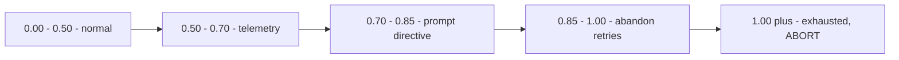

| Band | Threshold | Behaviour change | Code |
|------|-----------|------------------|------|
| `> 0.5` | hard-coded | Emits `agent.loop.budget_pressure` every iteration so the SPA can show a warning | [agent_loop.py:412](../../backend/src/ai/core/agent_loop.py:412) |
| `>= 0.70` | `agent_loop.budget_pressure_threshold` | Budget-aware REACT injects a `Budget directive` line into the step's execution-constraints block: *"finish the task NOW with the cheapest sufficient action"* | [budget.py:22](../../backend/src/ai/core/budget.py:22), [step_executor.py:697](../../backend/src/ai/step_executor.py:697) |
| `> 0.85` | hard-coded | `pick_retry` returns `ABANDON` regardless of failure tags — no more corrective retries | [retry_strategies.py:74](../../backend/src/ai/planning/retry_strategies.py:74) |
| `< 0.5` | hard-coded | `INCOMPLETE` failures are eligible for `RETRY_AS_IS` (they are not above 0.5) | [retry_strategies.py:107](../../backend/src/ai/planning/retry_strategies.py:107) |
| `>= 1.0` | — | `exhausted()` is true. `Strategist.decide_next` returns `ABORT`; `_loop` also breaks directly | [strategist.py:206](../../backend/src/ai/core/strategist.py:206), [agent_loop.py:383](../../backend/src/ai/core/agent_loop.py:383) |

The pressure value reaches the *step prompt* through the legacy context bridge:
`materialise_context_dict` writes `__agent_state__.budget_pressure`, and
`step_executor` reads it back
([agent_state.py:368](../../backend/src/ai/core/agent_state.py:368),
[step_executor.py:690](../../backend/src/ai/step_executor.py:690)).

### Cost reconciliation — why the budget lies unless you sync it

Most spend does **not** flow back through `ActionResult.cost_usd`. The nested
step path bills by mutating `run.total_cost_usd` on its own session, and the
critic pipeline writes `usage_logs` rows without touching the run's cost
column. So the loop does three things at the end of every iteration
([agent_loop.py:670-688](../../backend/src/ai/core/agent_loop.py:670)):

```python
# backend/src/ai/core/agent_loop.py
state.budget.consume(
    usd=action_result.cost_usd,
    wall_s=max(action_result.latency_ms // 1000, 0),
)
await self._sync_budget_cost(state)      # pull run.total_cost_usd UP via max()
if iter_critic_cost > 0:
    state.budget.consume(usd=iter_critic_cost)   # add critic spend on top
```

Order matters: `_sync_budget_cost` uses `max()`, so adding critic cost *before*
it would be clobbered. Token totals are rolled up separately with a recursive
CTE over the run subtree in `_sync_budget_tokens`
([agent_loop.py:838](../../backend/src/ai/core/agent_loop.py:838)) so a
delegating parent does not report zero tokens.

> `Budget.can_afford(...)` exists and is fully implemented, but **nothing in
> `src/` calls it**. The `budget.py` module docstring also claims "the Critic
> skips itself when pressure is high" — it does not. The critic degrades on a
> *cost-share* rule (`critic_cost / run_cost > 0.20`), not on pressure
> ([critic_pipeline.py:545](../../backend/src/ai/planning/critic_pipeline.py:545)).

---

## 5. One iteration, in code order

`AgentLoop._iteration` ([agent_loop.py:394](../../backend/src/ai/core/agent_loop.py:394))
is ~300 lines. Here is every phase, in the order the code runs them.

```mermaid
sequenceDiagram
    autonumber
    participant L as AgentLoop
    participant PG as Postgres
    participant P as Perceiver
    participant S as Strategist
    participant C as CriticPipeline
    participant E as Executor
    participant O as Observer
    participant R as Reflector
    participant X as CORTEX

    L->>PG: _check_cancelled - SELECT status
    alt status != RUNNING
        L->>L: external_status set, done=true, ABORT
    end
    L->>L: iteration += 1, budget.consume iter_step
    L->>P: gather state
    P->>X: navigate cortex_cursor  (skipped when cursor is None)
    P->>PG: SELECT pending HumanApproval
    P-->>L: Perception
    alt retry_queue non-empty
        L->>L: _move_from_retry - pop queued dict into a Move
    else
        L->>S: next_move state, perception
        S-->>L: Move
    end
    L->>C: pre_action move, state   (skipped when move.plan_fragment set)
    C-->>L: PreCriticVerdict
    alt kind == BLOCK
        L->>L: block streak += 1; abort at 3; return
    end
    L->>E: execute move, state, db
    E-->>L: ActionResult
    alt ActionResult.awaiting_children
        L->>L: suspend_requested = true; return
    end
    L->>O: parse action_result, state
    O-->>L: Observation
    L->>C: post_action, alignment, supervisor
    C-->>L: PostCriticVerdict, AlignmentVerdict, SupervisorVerdict
    L->>C: finalize_iteration
    C-->>L: StepHealthRecord
    L->>L: pick_retry and enqueue if actionable
    L->>R: produce state, observation, verdicts
    R->>PG: persist candidate Intelligence rule (entity scope only)
    L->>S: decide_next state, supervisor
    S-->>L: Decision
    L->>L: budget bookkeeping and _sync_budget_cost
    L->>X: write AgentState snapshot node
```

### Phase 0 — cooperative cancellation

`_check_cancelled` ([agent_loop.py:1230](../../backend/src/ai/core/agent_loop.py:1230))
does a **fresh scalar SELECT** of `ExecutionRun.status`. If it is no longer
`RUNNING`, an operator hit `POST /executions/{id}/cancel`, so the loop sets
`external_status`, `done=True`, `next_decision="ABORT"`, emits
`agent.loop.cancelled`, and returns *before* incrementing the iteration or
spending anything.

Why a fresh SELECT and not `run.status`? The per-iteration `commit()` expires
ORM attributes; reading one would trigger a synchronous lazy-load on an async
session and raise `MissingGreenlet`. This pattern repeats all over
`agent_loop.py` — when you see `select(ExecutionRun.<col>)` instead of
attribute access, that is why.

**What can go wrong:** the DB lookup itself throws → swallowed, returns `False`,
run continues. Cancellation is best-effort by design.

### Phase 1 — Perceive

```python
perception = await self.perceiver.gather(state)
state.perception = perception
```

Input: `AgentState`. Output: a `Perception`. Never raises — every sub-gatherer
has its own try/except. See §6.

### Phase 2 — Strategize

The retry queue is drained **first**:

```python
queued = state.retry_queue.pop(0) if state.retry_queue else None
if queued is not None:
    move = self._move_from_retry(queued, state)
    await event_async("agent.retry.dequeued", ...)
else:
    move = await self.strategist.next_move(state, perception)
state.chosen_executor = move.executor
```

`_move_from_retry` ([agent_loop.py:1464](../../backend/src/ai/core/agent_loop.py:1464))
rehydrates the JSON-serialisable retry dict back into a `Move`. This is why the
queue stores dicts and not `Move` objects — it has to survive `snapshot()`.

**What can go wrong:** `next_move` is `async` but does no I/O except the bandit
call, which is wrapped in try/except.

### Phase 3 — Pre-critic

```python
# backend/src/ai/core/agent_loop.py
if move.plan_fragment:
    pre_verdict = PreCriticVerdict(kind="PASS")
else:
    pre_verdict = await self.critic_pipeline.pre_action(move, state)
```

**Plan-driven moves skip the pre-critic entirely.** This is deliberate and
scarred-in: the deterministic Strategist re-proposes the *identical* move every
iteration, so one `BLOCK` becomes three consecutive blocks, trips the circuit
breaker, and aborts the run with zero work done. The pre-critic still guards
open-ended moves (recursive goal expansion, `SingleStep` with no fragment)
where blocking is actionable.

On `BLOCK`:

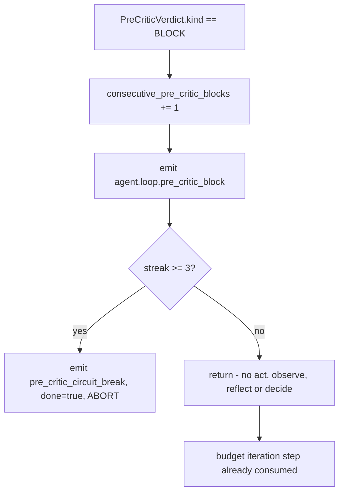

A move that clears the pre-critic resets the streak to `0`
([agent_loop.py:492](../../backend/src/ai/core/agent_loop.py:492)). The
threshold is `_MAX_CONSECUTIVE_PRE_CRITIC_BLOCKS = 3`, overridable via the
constructor's `max_consecutive_pre_critic_blocks`.

### Phase 4 — Act

```python
try:
    executor = get_executor(move.executor)
except LookupError as exc:
    logger.error("AgentLoop missing executor: %s", exc)
    return                      # iteration ends, loop continues
```

Then the call is wrapped in a `trace.span("executor", ...)` and a broad
try/except that converts *any* exception into a failed `ActionResult`:

| Failure | Result |
|---------|--------|
| `NotImplementedError` (a stub executor) | `ActionResult(success=False, error="stub: ...")`, logged at WARNING |
| any other exception | `ActionResult(success=False, error="Type: msg", latency_ms=...)` |
| executor name not registered | iteration returns early; nothing recorded |

If `ActionResult.awaiting_children` is non-empty the loop records the children,
sets `suspend_requested`, writes a `last_action`, emits
`agent.loop.suspended_on_children`, and **returns** — no observe, no critics,
no reflect. See §9.

Otherwise every id in `action_result.completed_step_ids` is marked complete and
recorded into `state.step_results`
([step_results.py:39](../../backend/src/ai/core/step_results.py:39)).

### Phase 5 — Observe

`Observer.parse` is pure and synchronous. See §11.

### Phase 6 — Critics, then retry selection

Four calls in fixed order, each emitting an SSE-visible event:

```python
post      = await self.critic_pipeline.post_action(state, observation)
align     = await self.critic_pipeline.alignment(state, observation)
supervise = await self.critic_pipeline.supervisor(state)
verdicts  = Verdicts(pre=pre_verdict, post=post, align=align, supervise=supervise)
```

Then `finalize_iteration` returns the iteration's `StepHealthRecord`, whose
four cost fields are summed by `_critic_cost_from_record`
([agent_loop.py:790](../../backend/src/ai/core/agent_loop.py:790)) and folded
into the budget in phase 9.

Retry selection runs only when **all** of these hold:

1. `record.is_actionable_failure()`
2. `move.executor != "ChildEntity"` — never auto-retry a whole sub-agent; that
   re-runs a `$10+` multi-minute child and rarely changes the verdict
3. `not RetryExecutor.is_exhausted(state, step_id)`
4. `pick_retry(...)` returns something other than `NONE` / `ABANDON`

`pick_retry` ([retry_strategies.py:62](../../backend/src/ai/planning/retry_strategies.py:62))
is a pure function mapping failure tags to a strategy:

| Condition (in precedence order) | Strategy |
|---|---|
| post verdict is `PASS` or `None` | `NONE` |
| `pressure > 0.85` | `ABANDON` |
| `POLICY_VIOLATION` | `ABANDON` |
| `NEEDS_CLARIFICATION` | `ASK_USER` |
| `TOOL_FAILURE` | `RETRY_DIFFERENT_TOOL` |
| `WRONG_FORMAT` | `RETRY_DIFFERENT_PROMPT` |
| `OFF_TOPIC` or `HALLUCINATION` | `RETRY_DIFFERENT_MODEL` |
| `CONTRADICTION` | `RETRY_DIFFERENT_MODEL` |
| `UNVERIFIABLE` | `RETRY_DIFFERENT_PROMPT` |
| `INCOMPLETE` and `pressure < 0.5` | `RETRY_AS_IS` |
| anything else | `ABANDON` |

### Phase 7 — Reflect

```python
reflection = self.reflector.produce(state, observation, verdicts)
await self.reflector.persist(reflection, state)
state.reflections.append(reflection)
```

`produce` is pure; `persist` is a no-op for `scope="run"`. See §11.

### Phase 8 — Decide (and maybe replan)

```python
decision = self.strategist.decide_next(state, supervise)
state.apply_decision(decision)
if (decision.next_state_patch or {}).get("replan_requested"):
    await self._handle_replan(state, supervise)
```

`_handle_replan` ([agent_loop.py:1360](../../backend/src/ai/core/agent_loop.py:1360))
calls `PlannerService.adapt_plan` and **replaces** `plan_steps` while resetting
`completed_step_ids` to an empty set. It refuses to do this for static-plan
entities (`static_plan.enabled and not dynamic_planning.enabled`) — otherwise a
supervisor that recommends REPLAN every iteration wipes all progress forever.
That guard exists because of a real incident ("the doc-factory-lite
infinite-planning-loop").

### Phase 9 — Bookkeeping

Budget consume → `_sync_budget_cost` → add critic cost → `_snapshot` (a CORTEX
node with the full state JSON) → emit `agent.loop.iteration_end` carrying a
human-readable `narrative` and `reflection` for the SPA timeline.

### After the loop body

Back in `_loop` ([agent_loop.py:364](../../backend/src/ai/core/agent_loop.py:364)):

```python
if state.suspend_requested:
    break
if state.budget.exhausted():
    await event_async("agent.loop.budget_exhausted", dim=state.budget.which_exhausted() or "unknown")
    state.done = True
    state.next_decision = "ABORT"
    break
```

---

## 6. The Perceiver

[perceiver.py](../../backend/src/ai/core/perceiver.py). Its contract: *the only
place that reads CORTEX / memory / HITL on behalf of the loop*. It is stateless
and every gatherer degrades to an empty value if its dependency is missing.

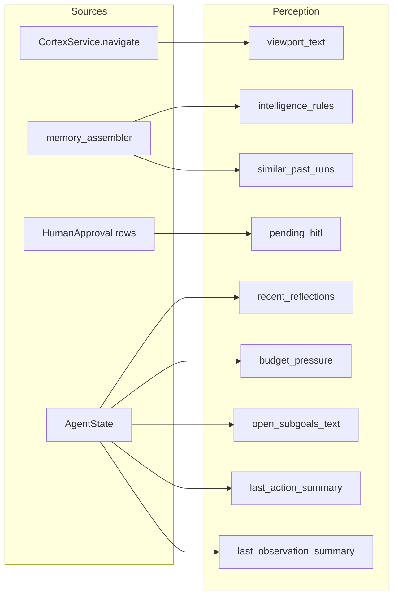

| Field | Where it comes from | Guard |
|-------|---------------------|-------|
| `viewport_text` | `cortex.navigate(state.cortex_cursor)`, rendered via `to_prompt_text()`, truncated to `max_viewport_chars = 4000` | `""` if `cortex is None` **or** `cortex_cursor is None` |
| `intelligence_rules` | duck-typed `memory.intelligence_rules(entity_id, top_k=5)` or `get_intelligence_rules`, then `rule_lifecycle.filter_for_prompt` | `[]` if `memory_assembler is None` |
| `similar_past_runs` | duck-typed `memory.recent_similar_runs` or `similar_runs`, `top_k=3` | `[]` if `memory_assembler is None` |
| `pending_hitl` | `SELECT HumanApproval WHERE run_id = ? AND status = 'PENDING'` → `{id, trigger}` | `[]` if `db is None` or SQL fails |
| `recent_reflections` | `state.reflections[-3:]` | always available |
| `budget_pressure` | `state.budget.pressure` | always |
| `open_subgoals_text` | rendered `"  - [priority] description"` lines, or `"(none)"` | always |
| `last_action_summary` | `"iter N via Executor (move_id=abcdef12)"` | `""` if no action yet |
| `last_observation_summary` | `"outcome=... novelty=... Δgoal=... — summary"` | `""` if no observation yet |

`Perception.to_prompt_block()` renders all of the above as a markdown block for
LLM injection.

> **Two things to know before you trust this.** The loop constructs the
> Perceiver with `memory_assembler=None`
> ([agent_loop.py:766](../../backend/src/ai/core/agent_loop.py:766)), and
> nothing ever assigns `state.cortex_cursor`. In production today that means
> `viewport_text`, `intelligence_rules` and `similar_past_runs` are always
> empty, and a `Perception` carries only subgoals, budget pressure, pending
> HITL and the last action/observation summaries. On top of that,
> `state.perception` is written but **never read** — the deterministic
> Strategist takes `perception` and ignores it
> (`async def next_move(self, state, perception)  # noqa: ARG002`). `Perception`
> is a fully-built surface waiting for the LLM-driven Strategist.

---

## 7. The Strategist

[strategist.py](../../backend/src/ai/core/strategist.py). Two questions, two
methods, both deterministic.

### `Move` and `Decision`

| `Move` field | Type | Notes |
|---|---|---|
| `move_id` | `str` | fresh `uuid4()` per move |
| `goal_id` | `str?` | `state.current_goal_id()` — the first open subgoal |
| `executor` | `ExecutorName` | one of the eight registry names |
| `plan_fragment` | `list[dict]?` | the concrete step(s) to run. `None` means "open-ended" |
| `rationale` | `str` | human-readable; ends up in the executor trace span |
| `expected_value` | `"low"/"med"/"high"` | always `"med"` today |
| `expected_cost_usd` | `Decimal` | always `Decimal("0")` today |
| `alternatives` | `list[Move]` | never populated today |
| `reasoning_hint` | `str?` | per-step reasoning override; `None` means "use entity default" |

| `Decision` field | Type | Notes |
|---|---|---|
| `next` | `CONTINUE` / `DONE` / `PAUSE_HITL` / `ABORT` | |
| `reason` | `str` | |
| `next_state_patch` | `dict` | only key used: `{"replan_requested": True}` |

### `next_move` — the decision table

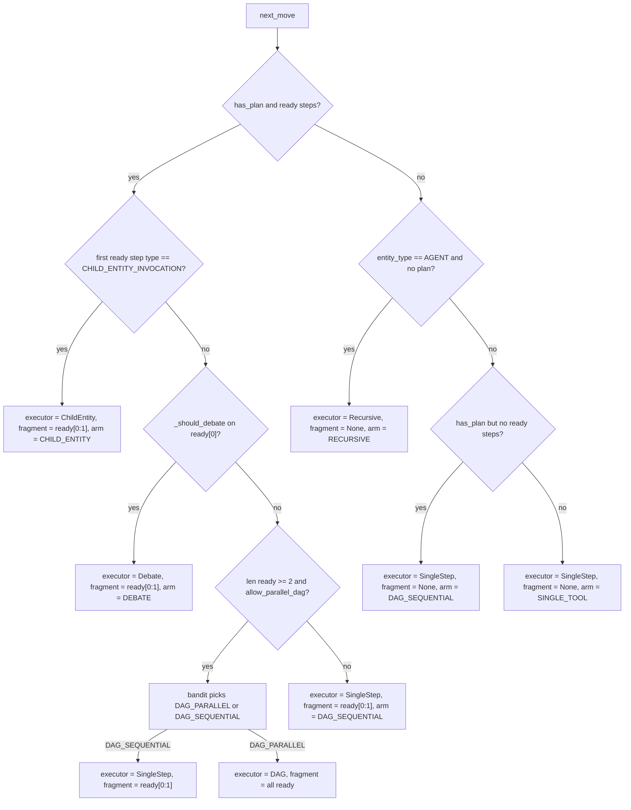

| Case | Condition | Executor | Fragment | Bandit arm recorded |
|------|-----------|----------|----------|---------------------|
| A1 | ready step 0 is `CHILD_ENTITY_INVOCATION` | `ChildEntity` | `ready[:1]` | `CHILD_ENTITY` |
| A2 | `_should_debate(state, ready[0])` | `Debate` | `ready[:1]` | `DEBATE` |
| A3-par | `len(ready) >= 2`, bandit picks parallel | `DAG` | all ready | `DAG_PARALLEL` |
| A3-seq | `len(ready) >= 2`, bandit picks sequential | `SingleStep` | `ready[:1]` | `DAG_SEQUENTIAL` |
| A4 | exactly one ready step | `SingleStep` | `ready[:1]` | `DAG_SEQUENTIAL` |
| B | `EntityType.AGENT` and no plan | `Recursive` | `None` | `RECURSIVE` |
| C | plan exists but nothing unblocked | `SingleStep` | `None` | `DAG_SEQUENTIAL` |
| D | fallback | `SingleStep` | `None` | `SINGLE_TOOL` |

Two important properties:

- **Child dispatch dominates parallel DAG.** A `CHILD_ENTITY_INVOCATION` is
  never batched into a DAG, because a child run needs its own scoped CORTEX
  subtree.
- **Debate is opt-in only.** `_should_debate`
  ([strategist.py:302](../../backend/src/ai/core/strategist.py:302)) returns
  `True` only when a step carries a `reasoning_hint` / `reasoning_mode` of
  `DEBATE` or `TREE_OF_THOUGHTS`, or a governance flag
  (`step["governance"]["high_stakes"]`, `["debate"]`, or top-level
  `step["high_stakes"]`). It *also* checks `registered_executor_names()` so it
  never proposes a move for an unregistered executor — the same defensive
  precedent used for stubs.

### The `PlanStyleBandit`

The bandit is only consulted at **one** decision point: parallel vs sequential
DAG, with candidates `["DAG_PARALLEL", "DAG_SEQUENTIAL"]`. Every other branch
just *records* the arm it took.

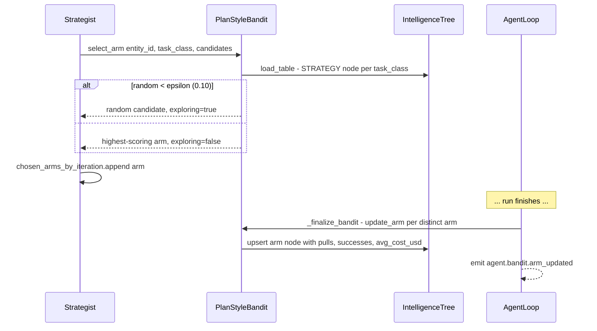

Arms: `DAG_PARALLEL`, `DAG_SEQUENTIAL`, `RECURSIVE`, `SINGLE_TOOL`, `DIALOG`,
`CHILD_ENTITY` ([plan_style_bandit.py:11](../../backend/src/ai/planning/plan_style_bandit.py:11)).
Note `DEBATE` and `SINGLE_TOOL` are recorded by the Strategist even though
`DEBATE` is not in that documented arm list — arms are seeded on demand by
`get_or_seed`, so this works but is undocumented drift.

`_finalize_bandit` ([agent_loop.py:1430](../../backend/src/ai/core/agent_loop.py:1430))
de-duplicates repeated pulls of the same arm so a long single-arm run does not
dominate the statistics, and splits the run's total cost evenly across the
distinct arms. Success is simply `status == COMPLETED`.

Epsilon comes from `NUMERIC_DEFAULTS["bandit.epsilon"] = 0.10`. The bandit is
disabled when `bandit.enabled` is off or `company_id is None`.

### `decide_next` — the termination table

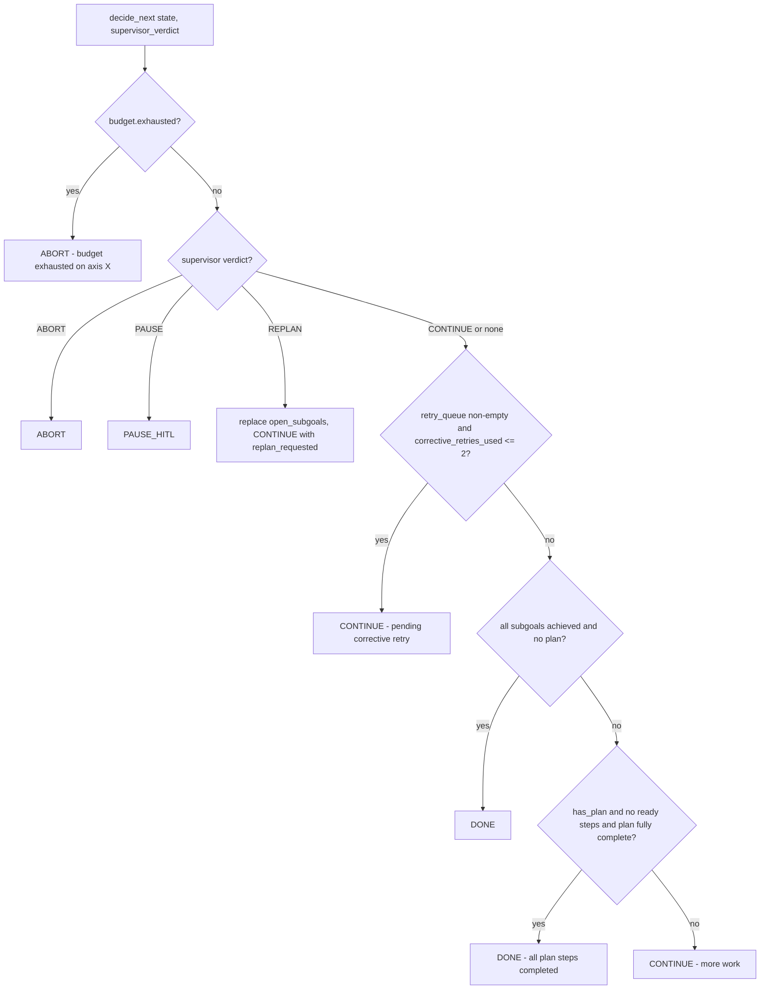

The retry-queue guard exists so a queued corrective retry cannot be silently
dropped when the plan looks finished. But it is capped at
`MAX_CORRECTIVE_RETRIES_PER_RUN = 2`: `RetryExecutor.is_exhausted` counts per
`step_id`, and a `CHILD_ENTITY` invocation has no stable `step_id`, so without
the global cap a perpetually-`REVISE` critic would re-spawn an expensive child
every iteration until the budget blew.

---

## 8. The critic gates

The critics live outside `core/` in
[ai/planning/critic_pipeline.py](../../backend/src/ai/planning/critic_pipeline.py),
but the loop owns their cadence. Full treatment is in
[07 — Planning and critics](07-planning-and-critics.md); here is what the
kernel needs you to know.


| Stage | Verdict | Cadence | Skipped when |
|-------|---------|---------|--------------|
| `pre_action` | `PreCriticVerdict` | every iteration | `move.plan_fragment` is set (loop-side), pipeline is DEGRADED, or `critic_pipeline.pre_critic_enabled` off |
| `post_action` | `PostCriticVerdict` | every iteration | pipeline DEGRADED |
| `alignment` | `AlignmentVerdict` | `iteration % goal_validation_interval == 0`, default interval **2** | DEGRADED, or no observation summary / entity goal |
| `supervisor` | `SupervisorVerdict` | `iteration % meta_review_interval == 0`, default interval **3**, never at iteration 0 | — |

`AgentLoop._compose` builds a `RealCriticPipeline` only when
`critic_pipeline.v2_enabled` is on (default `True`) **and** `state.company_id`
is set; otherwise it stays a `NoOpCriticPipeline` that PASSes everything
([agent_loop.py:768-788](../../backend/src/ai/core/agent_loop.py:768)). An
explicit `critic_pipeline=` constructor argument always wins — that is how the
unit tests drive verdicts.

DEGRADED mode is a cost-share rule, not a pressure rule:

```python
# backend/src/ai/planning/critic_pipeline.py
def _budget_mode(self, state: AgentState) -> CriticMode:
    run_cost = float(state.budget.usd_used)
    critic_cost = float(self._cumulative_critic_cost)
    if run_cost <= 0:
        return CriticMode.FULL
    if critic_cost / run_cost > self.config.critic_cost_share_pct:
        return CriticMode.DEGRADED
    return CriticMode.FULL
```

`critic_cost_share_pct` defaults to `0.20` and is read from
`entity.governance.critic_cost_share_pct`.

`ai/core/meta_review.py` is a **deprecated shim**. `MetaReviewer.review_execution`
builds a throwaway `AgentState` and delegates to `SupervisorCritic.assess`. Its
only remaining caller is the `supervisor_v2_enabled=False` fallback path inside
the critic pipeline. It logs a one-shot deprecation notice per process.

---

## 9. Executors

An **Executor** is a thin adapter: it takes a `Move` plus `AgentState`, does the
work, and returns an `ActionResult`. The registry is module-global so the loop
can find executors without dependency injection
([executors/base.py:71](../../backend/src/ai/core/executors/base.py:71)).

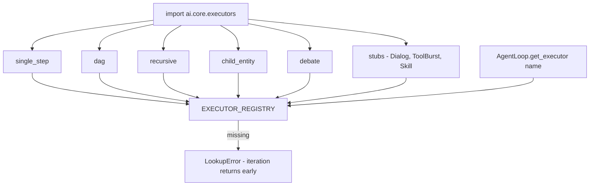

`register_executor` is idempotent and last-write-wins, which is exactly how the
tests swap in fakes. Real executors are imported before stubs so a stub can
never shadow a working adapter.

### The registry

| Name | Class | File | What it does | Status |
|------|-------|------|--------------|--------|
| `SingleStep` | `SingleStepExecutor` | [single_step.py](../../backend/src/ai/core/executors/single_step.py) | Runs each step of `plan_fragment` sequentially through `StepEngine._execute_step_wrapper`, **on its own `AsyncSessionLocal`**. No fragment → zero-cost no-op. | implemented |
| `DAG` | `DAGExecutor` | [dag.py](../../backend/src/ai/core/executors/dag.py) | Hands the whole fragment to `StepEngine._execute_steps_dag`, which builds a dependency graph and parallelises independent steps. | implemented |
| `Recursive` | `RecursiveExecutor` | [recursive.py](../../backend/src/ai/core/executors/recursive.py) | For a goal-only AGENT: calls `PlannerService.reconcile` to turn the goal into a plan, writes `run.dynamic_plan`, and lets the next iteration dispatch it. If no plan results, achieves all subgoals and stamps `result_data = {"output": "Success", "steps": []}`. | implemented |
| `ChildEntity` | `ChildEntityExecutor` | [child_entity.py](../../backend/src/ai/core/executors/child_entity.py) | Creates a child `ExecutionRun`, enqueues `run_execution_recursive` for it, returns `awaiting_children` so the parent suspends. | implemented |
| `Debate` | `DebateExecutor` | [debate.py](../../backend/src/ai/core/executors/debate.py) | Generates N persona/temperature-varied candidate answers in parallel, an independent LLM judge picks the winner, writes a `debate` subtree to CORTEX. Defaults: 3 candidates, min 2, max 5. | implemented |
| `Dialog` | `DialogExecutor` | [stubs.py](../../backend/src/ai/core/executors/stubs.py) | Reserved for the Meta-Agent multi-role chat. `execute` raises `NotImplementedError`. | **stub** |
| `ToolBurst` | `ToolBurstExecutor` | [stubs.py](../../backend/src/ai/core/executors/stubs.py) | Reserved for planner-driven tool bursts. Raises. | **stub** |
| `Skill` | `SkillExecutor` | [stubs.py](../../backend/src/ai/core/executors/stubs.py) | Reserved for SkillLibrary playback. Raises. | **stub** |

`ExecutorName` also declares these eight names as a `Literal` in
[agent_state.py:45](../../backend/src/ai/core/agent_state.py:45). Stubs raise
loudly rather than silently mis-billing; the loop converts the
`NotImplementedError` into a failed `ActionResult` and carries on.

### `ActionResult`

| Field | Type | Meaning |
|---|---|---|
| `output` | `str` | Rendered output propagated into context |
| `tools_used` | `list[str]` | Feeds the observation summary |
| `children_run_ids` | `list[UUID]` | Child runs spawned |
| `cost_usd` | `Decimal` | Often `0` — see the cost reconciliation note in §4 |
| `latency_ms` | `int` | Also folded into the budget's wall axis |
| `cortex_nodes_written` | `list[UUID]` | Drives `Observer._novelty` |
| `success` / `error` | `bool` / `str` | Drives `Observer._outcome` |
| `completed_step_ids` | `list[str]` | Marked complete by the loop |
| `context_state_delta` | `dict` | Declared; executors mutate `context_state` directly instead |
| `awaiting_children` | `list[dict]` | Non-empty triggers SUSPEND |

### Why `SingleStep` opens its own session

```python
# backend/src/ai/core/executors/single_step.py
# Run the legacy step engine on its OWN session. ``_execute_step_wrapper``
# ... performs its own commits/status writes. Doing that on the AgentLoop's
# shared session corrupts it — the next loop DB access then raises
# PendingRollbackError / "greenlet_spawn has not been called".
async with AsyncSessionLocal() as inner_db:
    engine = StepEngine(inner_db, _resolve_redis(state), state.company_id)
```

It also snapshots `run.total_cost_usd` before and after the fragment, because
the step path bills in place and the step result dicts almost always report
`cost_usd == 0.0`. The larger of "sum of reported costs" and "engine delta"
becomes `ActionResult.cost_usd`.

### `SingleStep` with no fragment is a deliberate no-op

The old code handed the whole run to `ExecutionEngine.execute_run` here. That
terminalised the run mid-iteration, made the next `_check_cancelled` emit a
spurious `agent.loop.cancelled` (frozen UI), and double-billed. Now it returns
a zero-cost success and lets the loop's own termination machinery wind down.
There is a regression test:
`test_single_step_no_fragment_is_noop_not_full_run`
([tests/unit/test_agent_loop_billing_and_fallback.py:180](../../backend/tests/unit/test_agent_loop_billing_and_fallback.py:180)).

### ChildEntity, recursion, and the async suspend/resume mechanism

This is the most intricate part of the kernel. A `PROCESS` entity with
`CHILD_ENTITY_INVOCATION` steps delegates each step to a whole sub-agent. The
sub-agent is **not** run inline — it becomes its own `ExecutionRun` with its own
session, budget, CORTEX tree, and `AgentLoop`. The parent suspends.

Why: running a child inline meant a nested full run on the parent's session,
which amplified cost by roughly `$11` per child. The inline path is retired;
there is no fallback.

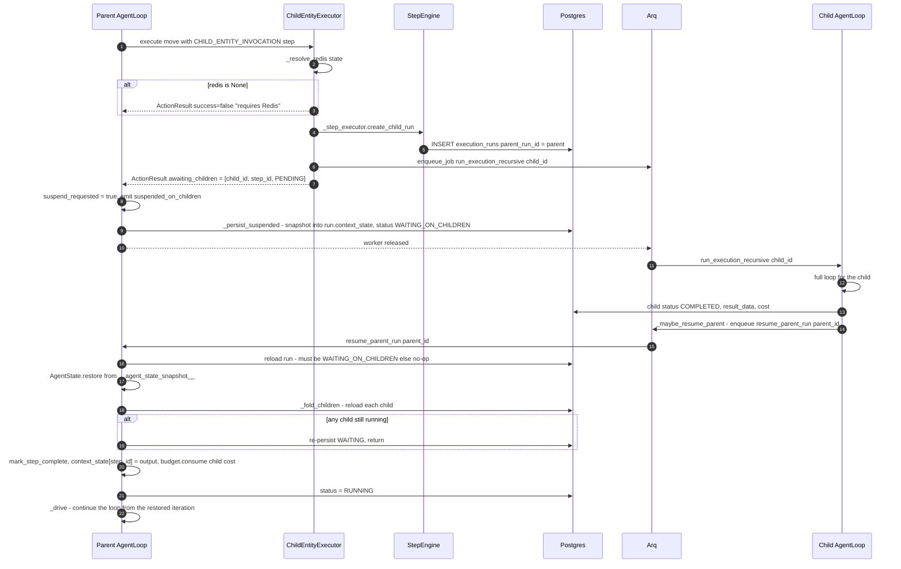

Key details:

- **The suspend snapshot lives in `run.context_state["__agent_state_snapshot__"]`**,
  not in CORTEX. `resume` fails the run outright if it is missing.
- **`resume` is idempotent.** If the run is not `WAITING_ON_CHILDREN` it returns
  `{"resumed": False}` and does nothing. Duplicate `resume_parent_run` jobs and
  legacy inline children are therefore harmless.
- **Child cost is folded into the parent budget** in `_fold_children` via
  `state.budget.consume(usd=child.total_cost_usd, tokens=child.total_tokens)`,
  even though the child billed onto its own row. Only top-level runs call
  `settle_billing` (`_settle_billing` returns immediately when `parent_run_id`
  is set).
- **A failed or cancelled child fails the parent.** `_fold_children` returns
  `any_failed=True`, and `resume` sets `done=True, next_decision="ABORT"`.
- **The concurrency cap is advisory.** `DEFAULT_MAX_CONCURRENT_CHILDREN = 8`,
  overridable via `governance.max_concurrent_children`. When exceeded the
  executor logs and **dispatches anyway** — the inline backpressure path that
  used to enforce it was retired
  ([child_entity.py:108](../../backend/src/ai/core/executors/child_entity.py:108)).
- **One child per iteration.** The Strategist only ever puts `ready[:1]` into a
  `ChildEntity` move, so a fan-out PROCESS suspends and resumes once per child.

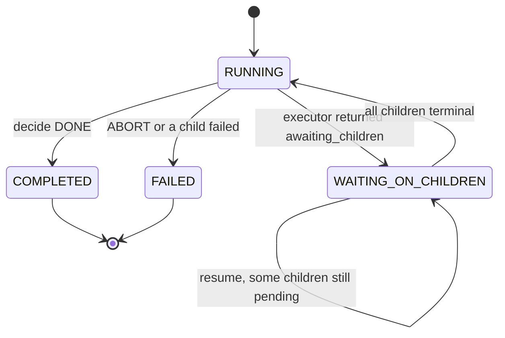

---

## 10. Reasoning strategies

[reasoning/](../../backend/src/ai/core/reasoning/) is a second small registry,
keyed by `ReasoningMode`. A reasoning strategy changes **how a single step's
LLM call is made**, not how the loop iterates.

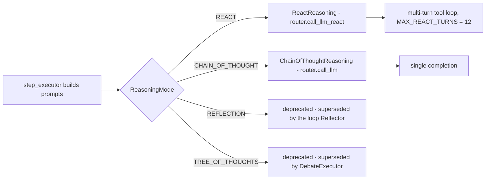

| Mode | Registered? | What it changes | Example prompt shape |
|------|-------------|-----------------|----------------------|
| `REACT` | yes — [react.py](../../backend/src/ai/core/reasoning/react.py) | Multi-turn: the model may call tools, see results, and continue. Delegates to `llm_router.call_llm_react` with `tool_schemas` and an `execute_tool_fn` callback. Capped at `MAX_REACT_TURNS = 12` ([constants.py:63](../../backend/src/ai/constants.py:63)). | System: sandwich prompt including `## Available Tools` and `## Execution Constraints` (with the budget lines). User: task + prior step context. Model replies with a tool call; the runner executes it, appends the result, and re-prompts. |
| `CHAIN_OF_THOUGHT` | yes — [chain_of_thought.py](../../backend/src/ai/core/reasoning/chain_of_thought.py) | One completion, no tools. `tool_schemas` and `execute_tool_fn` are accepted and ignored (`# noqa: ARG002`). | System: sandwich prompt, no tools layer. User: task. One response; `text = resp.output or resp.content`. |
| `REFLECTION` | **no** | Deprecated by decision D-3. The loop's `Reflector` plus post-critic and corrective retry cover in-loop self-correction; a separate per-step reflection mode double-bills. Entities still set to it keep working with a deprecation warning. | *n/a — no adapter registered* |
| `TREE_OF_THOUGHTS` | **no** | Deprecated as a *per-entity* mode. Its multi-candidate value was reframed as the Strategist-selected, per-step `DebateExecutor`. | Under Debate: N system prompts of the form `"{base}\n\nYou are debating as {persona}. Produce your single best answer to the task."` at temperatures `base + 0.1*i`, then a judge prompt that picks a winner index. |

The `core/reasoning/__init__.py` docstring is explicit:

```python
# backend/src/ai/core/reasoning/__init__.py
"""
Importing this package registers the two surviving per-step reasoning
modes (REACT, CHAIN_OF_THOUGHT). Per decision D-3 the former REFLECTION
and TREE_OF_THOUGHTS per-entity modes are retired ...
"""
```

`ReasoningMode` in [schemas/enums.py:90](../../backend/src/ai/schemas/enums.py:90)
still declares all four values plus a `DEPRECATED_REASONING_MODES` frozenset, so
old entity rows keep validating. `get_reasoning(ReasoningMode.REFLECTION)` will
raise `LookupError`.

The Strategist can override reasoning **per step** via `Move.reasoning_hint`,
read from the plan step's `reasoning_hint` or legacy `reasoning_mode` key
([strategist.py:288](../../backend/src/ai/core/strategist.py:288)). The point:
a cheap `TOOL_CALL` step should never pay for heavy reasoning just because the
entity's default says so.

---

## 11. The Observer and the Reflector

### Observer

[observer.py](../../backend/src/ai/core/observer.py) — deterministic, no
dependencies, ~70 lines. It turns an `ActionResult` into an `Observation`:

| Output field | Rule |
|---|---|
| `outcome` | `ar.error` → `"fail"`; `not ar.success` → `"partial"`; else `"success"` |
| `novelty_score` | CORTEX nodes written → `1.0`; output longer than 200 chars → `0.6`; else `0.5` |
| `goal_delta_estimate` | `success` → `+0.1`; `fail` → `-0.1`; else `0.0` |
| `cortex_node_ids_written` | stringified `ar.cortex_nodes_written` |
| `summary` | `"[outcome] error[:200]"` on error, else `"[outcome] tools=a,b output[:160]"` |

Note it can never emit `"blocked"`, which is why `state.blockers` stays empty
in practice (see §18).

### Reflector

[reflector.py](../../backend/src/ai/core/reflector.py) has two methods.

`produce(state, observation, verdicts)` always returns a `Reflection` — never
`None`, so the loop log stays dense:

| Observation outcome | `what_worked` | `what_didnt` | `cause_hypothesis` | `proposed_change` | confidence |
|---|---|---|---|---|---|
| `success` | `"executor=X produced output (novelty=N)"` | — | — | — | `0.65` |
| `fail` | — | `"fail: summary"` | `"step raised or returned error"` | `"consider retry with a different model/tool"` | `0.6` |
| `partial` | — | `"partial: summary"` | `"step returned success=False without explicit error"` | — | `0.4` |
| `blocked` | — | `"blocked: summary"` | `"blocker reported by observer"` | — | `0.5` |

Then two enrichments:

- Post-critic tags are appended to `what_didnt`, and
  `verdicts.post.suggestion` overwrites `proposed_change`.
- A failed alignment appends `"drift=0.42"` to `cause_hypothesis` and appends
  `correction_hint` to `proposed_change`.

### Scope escalation — from `run` to `entity`

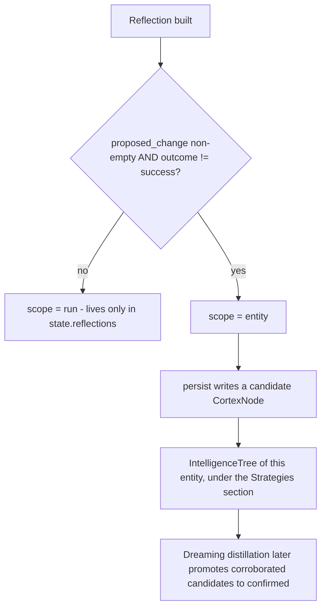

"Escalating scope from run to entity" means: *this lesson is not just about
this run — it is a candidate rule about how this entity should behave in
future.* Concretely:

```python
# backend/src/ai/core/reflector.py
scope: str = "run"
if proposed and observation.outcome != "success":
    scope = "entity"
```

`persist` ([reflector.py:105](../../backend/src/ai/core/reflector.py:105)) is a
no-op for `scope="run"`. Otherwise it:

1. gets or creates the entity's IntelligenceTree via `IntelligenceTreeService`,
2. finds the `STRATEGIES_TITLE` section node under the tree root,
3. writes a `CortexNode` of type `STRATEGY`, titled `"Candidate: <proposed_change[:80]>"`,
   with `source_ref = {"status": "candidate", "kind": "reflection_candidate", "scope", "run_id", "task_class"}`
   and `metadata_extra` carrying confidence, iteration, task_class and a timestamp,
4. increments `tree.total_nodes` and `flush()`es — it does not commit; the
   loop's own per-iteration commit lands it.

Every failure is swallowed: *memory failures must never break the loop.*

Promotion from candidate → confirmed → retired is the Dreaming Engine's job.
The `memory.rule_lifecycle_confirmed_only` flag controls whether only confirmed
rules reach prompts. See [08 — Memory and CORTEX](08-memory-and-cortex.md) for
the tree structure and [11 — Meta-intelligence](11-meta-intelligence.md) for
the distillation loop.

The third scope value, `"task_class"`, is declared in the `Reflection` literal
and handled by `persist`, but nothing in the loop ever produces it today.

---

## 12. Termination and run status

Every path out of the loop, and what status it produces.

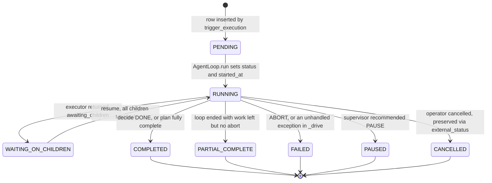

`_final_status` is the whole mapping, and it is short:

```python
# backend/src/ai/core/agent_loop.py
@staticmethod
def _final_status(state: AgentState) -> str:
    if state.external_status:
        return state.external_status
    if state.next_decision == "ABORT":
        return RunStatus.FAILED.value
    if state.next_decision == "PAUSE_HITL":
        return RunStatus.PAUSED.value
    if state.all_subgoals_achieved() or (
        state.has_plan() and not state.plan_ready_steps()
    ):
        return RunStatus.COMPLETED.value
    return RunStatus.PARTIAL_COMPLETE.value
```

| Termination cause | Where | `next_decision` | Final status |
|---|---|---|---|
| All subgoals achieved, no plan | `decide_next` | `DONE` | `COMPLETED` |
| Plan fully complete | `decide_next` | `DONE` | `COMPLETED` |
| Budget exhausted (any axis) | `decide_next` **and** `_loop` | `ABORT` | `FAILED` |
| Hard iteration cap (`max_iterations`, default 50) | `_loop` top | `ABORT` | `FAILED` |
| Pre-critic circuit breaker (3 consecutive `BLOCK`) | `_iteration` phase 3 | `ABORT` | `FAILED` |
| Supervisor `ABORT` | `decide_next` | `ABORT` | `FAILED` |
| Supervisor `PAUSE` | `decide_next` | `PAUSE_HITL` | `PAUSED` |
| Operator cancel | `_check_cancelled` | `ABORT` | `external_status`, i.e. `CANCELLED` |
| A child run failed | `resume` after `_fold_children` | `ABORT` | `FAILED` |
| Unhandled exception anywhere in `_loop` | `_drive` except block | — | `FAILED`, with `error_message` |
| Loop ended with ready steps remaining and no abort | fallthrough | `CONTINUE` | `PARTIAL_COMPLETE` |
| Suspended on children | `_drive` early return | unchanged | `WAITING_ON_CHILDREN` (not terminal) |

Two things about the suspend path: it returns **before** `_finalize_bandit`,
the dreaming trigger, `_persist_final` and billing settlement. Those only run
once the run truly ends.

### What `_persist_final` writes

1. `commit()` first — flushing pending planner/critic writes. A blind
   `rollback()` here used to discard real spend, leaving `$0` runs with no
   `llm_interaction_logs` and a NULL `billed_amount`.
2. Reload a fresh `ExecutionRun` (the passed-in one has expired attributes).
3. `status`, `completed_at`.
4. `total_cost_usd = max(budget.usd_used, existing)` — never clobber the
   engine-billed cost downward.
5. `total_tokens = max(budget tokens, subtree rollup, existing)`.
6. `error_message[:1000]` if any.
7. `result_data = {"output": output[:8000], "steps": step_results}` — **only if
   `result_data` is currently empty**, so a nested engine's own result is not
   clobbered. The refine flow in `service.py` reads `result_data["steps"]` back.
8. `_settle_billing(fresh)` — `GovernanceService.settle_billing`, skipped for
   child runs and swallowed on failure.

---

## 13. The `context_state` legacy bridge

`AgentLoop` reasons over a typed `AgentState`. But the per-step executors, the
tool executor, the memory assembler and the context-source ingestor all still
pass a plain `context_state: dict` around. The bridge is two methods on
`AgentState`:

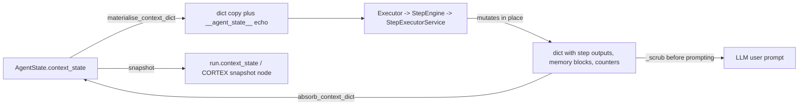

```python
# backend/src/ai/core/agent_state.py
async def materialise_context_dict(self) -> dict[str, Any]:
    ctx = dict(self.context_state)
    ctx.setdefault("__agent_state__", {
        "iteration": self.iteration,
        "budget_pressure": self.budget.pressure,
        "open_subgoals": [sg.description for sg in self.open_subgoals],
    })
    return ctx

async def absorb_context_dict(self, ctx: dict[str, Any]) -> None:
    for k, v in ctx.items():
        if k == "__agent_state__":
            continue          # we own that key; don't accumulate echoes
        self.context_state[k] = v
```

### Why it exists

Rewriting every step type, tool, and memory reader to take a typed state at
once was not feasible. The bridge lets the new loop drive the old per-step code
unchanged. It is explicitly transitional: the `agent_state.py` module docstring
says the dict "survives only for prompt-variable substitution" and that "new
code reads `state.perception` instead".

### `INTERNAL_CONTEXT_KEYS` — the scrubbing rule

Some keys in that dict are intra-loop plumbing. They must **never** reach an
LLM as user input, and must not be persisted back as if they were task data.
The canonical set is
[constants.py:31](../../backend/src/ai/constants.py:31), and the documented
inventory is [core/INTERNAL_KEYS.md](../../backend/src/ai/core/INTERNAL_KEYS.md).

| Key | Written by | Read by | Lifetime |
|-----|-----------|---------|----------|
| `input` | the caller that triggered the run | every step type | run |
| `cortex_tree_id` | `_bootstrap_state` / ingestor | step executor, `CortexService` | run |
| `subtree_root_id` | parent run when spawning a child | `CortexService` scoping | child run |
| `__memory__` | `MemoryAssemblyService` | `prompt_utils.build_sandwich_prompt` | per iteration |
| `__cortex_viewport__` | `CortexService.get_viewport` | `prompt_utils` | per CORTEX op |
| `__cortex_tree_id__` | `CortexService.create_tree` | CORTEX ops | run |
| `__cortex_cursor__` | `CortexService.navigate` | CORTEX ops | per iteration |
| `__cortex_knowledge__` | `cortex_bridge.ingest_tool_result` | CORTEX ops | run |
| `__context_sources__` | design-time upload | `MemoryAssemblyService` | run |
| `__episodic_memory__` | episodic readers | `prompt_utils` | per iteration |
| `__semantic_context__` | knowledge semantic search | `prompt_utils` | per iteration |
| `__memory_context__` | unified memory rollup, v2 | `prompt_utils` | per iteration |
| `__completed_steps__` | `step_executor.store_step_output` | planner adapt | run |
| `tool_call_counts` | `ToolExecutor` | `ToolExecutor` | run |
| `company_id` | router / arq job | every layer | run |
| `user_id` | router / arq job | every layer | run |
| `__intelligence__` | `IntelligenceTreeService` | `prompt_utils` | per iteration |
| `__experience__` | `ExperienceTreeService` | `prompt_utils` | per iteration |
| `__episodic__` | `EpisodicTreeService`, v2 path | `prompt_utils` | per iteration |
| `__knowledge_refs__` | `KnowledgeTreeService.search` | `prompt_utils` | per iteration |
| `__execution_metadata__` | `_bootstrap_state` | meta-cognition prompts | run |
| `__intelligence_rules__` | `MemoryAssemblyService` | `prompt_utils` | per iteration |
| `__alignment_correction__` | GoalGuard | the retried step | iteration N+1 |
| `__goal_check_counter__` | GoalGuard | GoalGuard | run |

**The scrubbing rule:** before a context dict is concatenated into an LLM's
user-facing input, every member of `INTERNAL_CONTEXT_KEYS` is filtered out.
Today that happens in two places inside `step_executor.py`, not in
`prompt_utils` as `INTERNAL_KEYS.md` claims:

```python
# backend/src/ai/step_executor.py
_INTERNAL_KEYS = INTERNAL_CONTEXT_KEYS
step_outputs = {
    k: v for k, v in filtered_context.items()
    if k not in _INTERNAL_KEYS and v  # skip empty/None
}
```

- [step_executor.py:267](../../backend/src/ai/step_executor.py:267) — tool
  input resolution.
- [step_executor.py:821](../../backend/src/ai/step_executor.py:821) — the
  "Available Context from Previous Steps" prompt block.

There is a second, orthogonal filter for **persistence**:
`context_utils.sanitize_context_for_persistence`
([context_utils.py:50](../../backend/src/ai/core/context_utils.py:50)) drops any
key whose lowercase form contains `api_key`, `secret`, `token`, `password`,
`auth`, `credential`, `__model_override`, or `__redis__`.

### Invariants, enforced by tests

1. Adding a key requires updating **both** `constants.py` and
   `INTERNAL_KEYS.md`. Enforced by
   `tests/unit/test_phase11_documentation.py` in both directions — an
   undocumented key fails, and a documented-but-removed key fails too.
2. Removing a key requires a deprecation cycle.
3. Readers must tolerate absence and use defaults, never `KeyError`.

### Migration path to typed `AgentState`

```mermaid
flowchart TD
    T1["Today - loop owns AgentState; executors marshal to dict and back"]
    T2["Next - Perception replaces ad-hoc memory keys in prompts"]
    T3["Then - step executors take AgentState directly"]
    T4["End state - context_state holds only user-facing step outputs for template substitution"]
    T1 --> T2 --> T3 --> T4
```

The intermediate state is already visible: the loop keeps the live Redis handle
on a *transient attribute* `state.redis_client` rather than in `context_state`,
precisely because `context_state` gets JSON-serialised into `input_data`,
snapshots, and `run.context_state` — a raw Redis object there raises
`Object of type Redis is not JSON serializable` and poisons the session
([agent_state.py:228](../../backend/src/ai/core/agent_state.py:228)).
`_resolve_redis` still falls back to a legacy `__redis__` key for old snapshots.

---

## 14. Feature flags that change loop behaviour

[feature_flags.py](../../backend/src/ai/core/feature_flags.py). Resolution order,
first hit wins:

```mermaid
flowchart TD
    Q["FeatureFlags.is_on key"] --> E1{"entity.metadata_extensions.feature_flags"}
    E1 -- hit --> R1["source = entity"]
    E1 -- miss --> C1{"per-entity row in feature_flags table"}
    C1 -- hit --> R2["source = entity_row"]
    C1 -- miss --> C2{"per-company row, entity_id IS NULL"}
    C2 -- hit --> R3["source = company"]
    C2 -- miss --> C3{"global row, both NULL"}
    C3 -- hit --> R4["source = global"]
    C3 -- miss --> EN{"env var AI_FLAG_KEY"}
    EN -- hit --> R5["source = env"]
    EN -- miss --> D["DEFAULTS dict - source = default"]
```

Env var naming: `AI_FLAG_` + key uppercased with `.` → `_`. So
`agent_loop.budget_aware_react` becomes `AI_FLAG_AGENT_LOOP_BUDGET_AWARE_REACT`.
Truthy values are `1`, `true`, `yes`, `on`.

DB rows are cached per process for 60 seconds
(`_PROCESS_CACHE_TTL_SECONDS`), invalidated by `set()` / `delete()` and by a
Redis pubsub message on `feature_flag_invalidations`. The table is **optional** —
if the migration has not run, lookups fail silently and the resolver falls
through to env + defaults, so deploy order does not matter.

### `DEFAULTS` (boolean flags)

| Flag | Default | What it does |
|------|---------|--------------|
| `agent_loop.perception_bounded_viewport` | `True` | Intended to bound the CORTEX viewport. **Not referenced in code** — the Perceiver's `max_viewport_chars=4000` is unconditional. |
| `agent_loop.snapshot_every_iteration` | `True` | Intended to gate `_snapshot`. **Not referenced in code** — snapshots are unconditional when CORTEX is wired. |
| `agent_loop.executor_dialog_enabled` | `False` | Reserved gate for the `Dialog` stub. Not read today. |
| `agent_loop.executor_skill_enabled` | `False` | Reserved gate for the `Skill` stub. Not read today. |
| `agent_loop.executor_tool_burst_enabled` | `False` | Reserved gate for the `ToolBurst` stub. Not read today. |
| `agent_loop.budget_aware_react` | `True` | **Live.** Injects budget-pressure lines into the step's execution-constraints prompt block. |
| `meta_agent.board_routing` | `True` | Meta-Agent board is the default routing path. |
| `critic_pipeline.v2_enabled` | `True` | **Live.** Off → the loop keeps `NoOpCriticPipeline`; every verdict PASSes. |
| `critic_pipeline.different_model_critic` | `True` | **Live.** Passed as `enable_different_model` into the pipeline config. |
| `critic_pipeline.pre_critic_enabled` | `True` | **Live.** Off → `pre_action` returns PASS without an LLM call. |
| `critic_pipeline.calibration_enabled` | `True` | Weekly critic calibration cron. |
| `critic_pipeline.enabled` | `False` | Legacy alias kept for pre-Track-3 callers. |
| `meta_review.v2_enabled` | `True` | SupervisorCritic v2 instead of the `MetaReviewer` shim. |
| `meta_review.fast_path_enabled` | `True` | Supervisor cheap heuristic before the LLM call. |
| `bandit.enabled` | `True` | **Live.** Off → `_build_bandit` returns `None` and the Strategist always takes the first candidate. |
| `task_classifier.v2_enabled` | `False` | **Live.** Passed to `TaskClassifier`; changes how `state.task_class` is derived. |
| `meta_agent.spec_critic_required` | `True` | Meta-Agent board gates. |
| `meta_agent.draft_lifecycle` | `True` | Meta-Agent board gates. |
| `meta_agent.testdriver_suite_enabled` | `True` | Meta-Agent board gates. |
| `meta_agent.skill_promotion_cron` | `True` | Weekly skill candidate scan. |
| `meta_agent.prompt_evolution_cron` | `True` | Prompt evolution cron. |
| `meta_agent.curator_consolidation_enabled` | `False` | Curator consolidation. |
| `meta_agent.spec_critic_tiebreak` | `False` | Third-model tiebreak for high-stakes disagreements. |
| `meta_agent.tool_synthesis_enabled` | `False` | Kill switch for LLM-authored tools. Even ON it stays Meta-Agent-only, container-exec-only, DRAFT-register-only. |
| `tools.cost_resolver_v2_enabled` | `True` | Tool cost resolution. |
| `tools.resilience_v2_enabled` | `True` | Tool retry/fallback. |
| `tools.cost_attribution_required` | `True` | Every cost surface must write an attributed `usage_logs` row; enforced by a CI guard. |
| `planner.v2_enabled` | `True` | Planner v2. |
| `planner.invariants_enforced` | `True` | Plan invariant checks. |
| `planner.judge_enabled` | `True` | Plan judge. |
| `planner.priors_enabled` | `True` | Plan priors from memory. |
| `sandbox.container_runtime_enabled` | `True` | Per-tenant container sandbox. |
| `sandbox.persistent_browser_enabled` | `False` | Per-tenant persistent browser profile. |
| `memory.v2_canonical` | `True` | Memory v2 canonicalisation. |
| `memory.viewport_compact` | `True` | Compact CORTEX viewport rendering. |
| `memory.scope_policy_enforced` | `True` | Memory scope policy. |
| `memory.dreaming_outcome_trigger` | `True` | **Live.** `_enqueue_dreaming_trigger` fires `dreaming_outcome_trigger` after every run with reason `success` or `failure`. |
| `memory.embedding_resolver_v2` | `True` | Embedding resolution. |
| `memory.trust_score_learning` | `False` | Learned per-source trust scores. |
| `memory.rule_lifecycle_confirmed_only` | `False` | **Live in the Perceiver.** ON → only `confirmed` Intelligence rules reach prompts. |
| `memory_v2.canonical` | `True` | Legacy alias for pre-Track-6 code. |

### `NUMERIC_DEFAULTS`

Read with `FeatureFlags.get_float(...)`, which checks `value_json` rows first.

| Flag | Default | What it does |
|------|---------|--------------|
| `bandit.epsilon` | `0.10` | Exploration rate for `PlanStyleBandit.select_arm`. |
| `agent_loop.budget_pressure_threshold` | `0.70` | Pressure past which the "finish, don't expand" directive is injected. |
| `critic_pipeline.budget_share_cap` | `0.20` | Documented critic cost share cap. Note the pipeline actually reads `entity.governance.critic_cost_share_pct` (also defaulting to `0.20`), not this flag. |
| `meta_agent.testdriver_budget_usd` | `3.00` | Test-driver suite budget. |
| `planner.n_candidates` | `3` | Planner candidate count. |

Flag scope tiers are enforced by partial unique indexes, and `set()` has three
separate `ON CONFLICT` clauses to match them exactly
([feature_flags.py:296](../../backend/src/ai/core/feature_flags.py:296)).

---

## 15. Events, SSE and tracing

There are **two** independent telemetry channels. Do not confuse them.

```mermaid
flowchart TD
    subgraph LOOP["AgentLoop"]
        EA["event_async name, **payload"]
        SP["async with span kind, name"]
    end
    EA --> EV["events.event - structured log plus optional OTel exporter"]
    EA --> MAP{"name in _SSE_EVENT_TYPES?"}
    MAP -- yes --> PUB1["redis.publish execution:run_id with a short type"]
    MAP -- no --> DROP["log only"]
    SP --> REC{"TraceRecorder bound to ContextVar?"}
    REC -- no --> NOOP["null span - setters still work"]
    REC -- yes --> PUB2["redis.publish span_open / span_close"]
    REC -- yes --> ROW["INSERT execution_trace_events on its own session"]
    PUB1 --> SSE["GET /executions/id/stream"]
    PUB2 --> SSE
    SSE --> FE["useExecutionEvents reducer"]
    ROW --> API2["GET /executions/id/trace"]
```

### Channel 1 — loop events

[events.py](../../backend/src/ai/core/events.py) defines the envelope. Naming
convention: `agent.<layer>.<verb>[_<qualifier>]`. Reserved structured keys
(`company_id`, `user_id`, `run_id`, `entity_id`, `iteration`, `severity`) are
split out of kwargs; everything else is sanitised into `payload`.

| Function | Use |
|---|---|
| `event(name, **kw)` | sync fire-and-forget; also feeds `capture_test_events()` |
| `aevent(name, **kw)` | async; additionally publishes to the global `agent.events` Redis channel |
| `emit(name, ...)` | explicit form returning the full `TelemetryEvent` |
| `capture_test_events()` | context manager used all over the unit tests to assert on emitted events |
| `set_otel_exporter(fn)` | plug in an OpenTelemetry exporter |

The loop does **not** call `aevent` directly. It calls `event_async` from
[agent_loop_sse.py](../../backend/src/ai/core/agent_loop_sse.py), which calls
`event(...)` and then republishes to the **per-run** channel
`execution:{run_id}` with a short `type` discriminator the frontend reducer
switches on.

Every event the loop emits:

| Event | Emitted from | SSE `type` |
|-------|-------------|------------|
| `agent.loop.run_start` | `run` | — |
| `agent.loop.plan_reconciled` | `_ensure_plan` | — |
| `agent.task_class.classified` | `_classify_task` | — |
| `agent.loop.budget_pressure` | pressure > 0.5 | — |
| `agent.retry.dequeued` | retry queue drain | `retry_dequeued` |
| `agent.loop.iteration_start` | phase 2 | `iteration_start` |
| `agent.loop.pre_critic_block` | pre-critic BLOCK | — |
| `agent.loop.pre_critic_circuit_break` | 3rd consecutive BLOCK | — |
| `agent.executor.invoked` | phase 4 | — |
| `agent.executor.completed` | phase 4 | — |
| `agent.loop.suspended_on_children` | async dispatch | — |
| `agent.critic.pre_verdict` | phase 6 | `critic_pre` |
| `agent.critic.post_verdict` | phase 6 | `critic_post` |
| `agent.critic.alignment` | phase 6 | `critic_align` |
| `agent.critic.supervisor` | phase 6 | `critic_super` |
| `agent.retry.picked` | retry enqueued | `retry_picked` |
| `agent.retry.exhausted` | per-step retry cap hit | — |
| `agent.replan.triggered` | `_handle_replan` | — (see below) |
| `agent.replan.skipped_static` | static plan guard | — |
| `agent.loop.iteration_end` | phase 9 | `iteration_end` |
| `agent.loop.budget_exhausted` | `_loop` | — |
| `agent.loop.cancelled` | `_check_cancelled` | `cancelled` |
| `agent.loop.suspended` | `_persist_suspended` | — |
| `agent.loop.resumed` | `resume` | — (see below) |
| `agent.bandit.arm_updated` | `_finalize_bandit` | — |
| `agent.dreaming.triggered` | `_enqueue_dreaming_trigger` | — |
| `agent.loop.billing_settled` | `_settle_billing` | — |
| `agent.loop.run_end` | `_drive` finally | `run_end` |

> **Two dead SSE mappings.** `_SSE_EVENT_TYPES` maps `agent.loop.resume` and
> `agent.loop.replan`, but the loop emits `agent.loop.resumed` and
> `agent.replan.triggered`. Those two entries never match, so the frontend's
> `resume` and `replan_triggered` reducer cases never fire from the loop
> ([agent_loop_sse.py:29](../../backend/src/ai/core/agent_loop_sse.py:29) vs
> [agent_loop.py:308](../../backend/src/ai/core/agent_loop.py:308) and
> [agent_loop.py:1413](../../backend/src/ai/core/agent_loop.py:1413)). Same for
> `bandit_arm_updated` and `task_class_classified`, which the reducer handles
> but the mapping table omits.

The `run_end` frame also stamps `status` so the SSE generator can close the
stream — [router.py:346](../../backend/src/ai/router.py:346) breaks out of the
pubsub loop when it sees `COMPLETED`, `FAILED` or `CANCELLED`.

### Channel 2 — trace spans

[trace.py](../../backend/src/ai/core/trace.py) is how you answer "what actually
happened inside iteration 3?". A `TraceRecorder` is bound to a `ContextVar` for
the whole run in `run_execution_recursive`, so *any* code in the call stack —
including `@staticmethod` tool executors and the LLM router, which receive no
run context — can open a span:

```python
# usage pattern from backend/src/ai/core/trace.py
async with span("tool", tool_id, input=raw_input) as sp:
    result = await ToolExecutor.execute_tools(...)
    sp.set_output(result)
```

Parent linkage uses a second `ContextVar` (`_CURRENT_SPAN`), which asyncio
copies per task — so concurrent DAG branches nest correctly without a shared
mutable stack.

```mermaid
flowchart TD
    EXS["span kind=executor name=SingleStep"] --> STS["span kind=step name=research"]
    STS --> TLS["span kind=tool name=web_search"]
    STS --> LLS["span kind=llm name=model call"]
    EXS --> DBS["span kind=debate"]
    DBS --> CAND["candidate spans"]
```

Each span has two sinks: a live `span_open` / `span_close` publish to the same
`execution:{run_id}` channel, and one `execution_trace_events` row on close,
written on a **dedicated short-lived session** so a trace write can never
corrupt the run's session. Payload fields are capped at
`TRACE_MAX_FIELD_BYTES` (default 1 MB) and dropped entirely when the entity's
`observability.log_thoughts` is false. When no recorder is bound (unit tests),
`span()` yields a detached handle and does nothing.

### What the frontend does with it

| Endpoint | Purpose |
|---|---|
| `GET /api/v1/ai/executions/{id}/stream` | SSE relay of the `execution:{id}` Redis channel ([router.py:324](../../backend/src/ai/router.py:324)) |
| `GET /api/v1/ai/executions/{id}/trace` | Historical spans ordered by `seq`, optionally filtered by `iteration` ([router.py:265](../../backend/src/ai/router.py:265)) |
| `GET /api/v1/ai/executions/{id}/agent_state` | Newest `snapshot` CORTEX node for the run ([router.py:215](../../backend/src/ai/router.py:215)) |

`frontend/src/hooks/useExecutionEvents.ts` runs a reducer over the SSE frames
and produces a per-iteration slice carrying executor, budget pressure, outcome,
decision, cost, and each critic verdict — that is the iteration timeline on the
ExecutionDetail page. See [16 — Frontend](16-frontend.md).

---

## 16. A worked example

An `ACTION` entity named "Summarise a URL" with a one-step static plan and
`governance = {"max_cost_usd": 2.0, "timeout_ms": 60000}`. The user submits
`{"input": "https://example.com/post"}`.

```mermaid
sequenceDiagram
    autonumber
    participant U as User
    participant API as router
    participant RQ as Arq
    participant L as AgentLoop
    participant S as Strategist
    participant E as SingleStepExecutor
    participant SE as StepEngine
    participant O as Observer
    participant R as Reflector

    U->>API: POST /execute entity_id, input
    API->>RQ: enqueue run_execution_recursive
    RQ->>L: run(run_id)
    L->>L: bootstrap - plan_steps has 1 step, budget usd_max=2.0 wall_max_s=60
    L->>L: _compose - task_class, CORTEX tree, bandit, RealCriticPipeline
    L->>L: _ensure_plan - no-op, plan already present
    L->>S: next_move - one ready step
    S-->>L: Move SingleStep fragment=[step_1]
    L->>L: pre-critic SKIPPED (plan_fragment set) -> PASS
    L->>E: execute
    E->>SE: _execute_step_wrapper on its own session
    SE-->>E: {"output": "The post argues ...", "cost_usd": 0.0}
    E-->>L: ActionResult success=true output=... cost_usd=0.0143 completed=[step_1]
    L->>O: parse
    O-->>L: Observation success novelty=0.6 delta=+0.1
    L->>L: post_action PASS, alignment skipped (iter 1 % 2 != 0), supervisor skipped (iter 1 % 3 != 0)
    L->>R: produce -> scope=run, what_worked set
    L->>S: decide_next -> DONE
    L->>L: budget consume, snapshot, iteration_end
    L->>L: _final_status -> COMPLETED, persist, settle billing
```

Concrete values you would expect after iteration 1:

| Thing | Value |
|---|---|
| `state.iteration` | `1` |
| `state.budget` | `usd_max=2.0`, `usd_used≈0.0143`, `wall_max_s=60`, `wall_used_s=3`, `iters_max=50`, `iters=1`, `tokens_max=2000000` |
| `state.budget.pressure` | `max(0.0143/2, 3/60, 1/50, tokens/2e6) = 0.05` — the wall axis dominates |
| `move` | `Move(move_id="a1b2...", goal_id=None, executor="SingleStep", plan_fragment=[step_1], rationale="one ready plan step; sequential")` |
| `state.chosen_arms_by_iteration` | `["DAG_SEQUENTIAL"]` |
| pre-critic | `PreCriticVerdict(kind="PASS")` — synthesised, **no LLM call**, because `move.plan_fragment` is truthy |
| `action_result` | `ActionResult(output="The post argues ...", success=True, cost_usd=Decimal("0.0143"), latency_ms=3120, completed_step_ids=["step_1"])` |
| `observation` | `Observation(iteration=1, outcome="success", novelty_score=0.6, goal_delta_estimate=0.1, summary="[success] The post argues ...")` |
| `state.completed_step_ids` | `{"step_1"}` |
| `state.step_results` | `[{"step": "summarise", "step_id": "step_1", "type": "THOUGHT", "output": "The post argues ..."}]` |
| alignment | skipped — `1 % 2 != 0`, returns `AlignmentVerdict(aligned=True, drift=0.0)` |
| supervisor | skipped — `1 % 3 != 0`, returns `SupervisorVerdict(recommendation="CONTINUE")` |
| `reflection` | `Reflection(iteration=1, scope="run", what_worked="executor=SingleStep produced output (novelty=0.60)", confidence=0.65)` — **not persisted**, scope is `run` |
| `decision` | `Decision(next="DONE", reason="all plan steps completed")` |
| `state.done` | `True` |
| final status | `COMPLETED` (`has_plan()` true, `plan_ready_steps()` empty) |
| `run.result_data` | `{"output": "The post argues ...", "steps": [ ... ]}` |
| SSE frames seen by the browser | `iteration_start`, `critic_pre`, `critic_post`, `critic_align`, `critic_super`, `iteration_end`, `run_end` — plus `span_open`/`span_close` pairs for the executor, step, tool and LLM spans |

Events emitted, in order: `agent.loop.run_start`,
`agent.task_class.classified`, `agent.loop.iteration_start`,
`agent.executor.invoked`, `agent.executor.completed`,
`agent.critic.pre_verdict`, `agent.critic.post_verdict`,
`agent.critic.alignment`, `agent.critic.supervisor`,
`agent.loop.iteration_end`, `agent.loop.run_end`,
`agent.bandit.arm_updated`, `agent.dreaming.triggered`,
`agent.loop.billing_settled`.

### The same run, but the step fails

`ActionResult(success=False, error="Timeout after 60000ms")` →
`Observation(outcome="fail", goal_delta_estimate=-0.1)`. The post-critic returns
`REVISE` with `tags=[TOOL_FAILURE]`. `pick_retry` maps that to
`RETRY_DIFFERENT_TOOL`, `RetryExecutor.build` produces a scaffold with
`use_fallback_tool: True`, and it lands in `state.retry_queue`.
`decide_next` sees a non-empty queue and returns `CONTINUE`. Iteration 2 drains
the queue via `_move_from_retry` and re-runs the same fragment with the
fallback hint. `state.corrective_retries_used` is now `1`; the third such retry
would be refused by the `MAX_CORRECTIVE_RETRIES_PER_RUN = 2` cap.

---

## 17. Key files reference

| File | Lines | What it does |
|------|-------|--------------|
| [core/agent_loop.py](../../backend/src/ai/core/agent_loop.py) | 1500 | The control loop. `run`, `resume`, `_drive`, `_loop`, `_iteration`, plus bootstrap, snapshot, persistence, bandit finalize, replan. |
| [core/agent_state.py](../../backend/src/ai/core/agent_state.py) | 469 | `AgentState` + the vocabulary and verdict dataclasses + snapshot/restore + the legacy context bridge. |
| [core/budget.py](../../backend/src/ai/core/budget.py) | 200 | Four-axis `Budget`, `pressure`, `consume`, `exhausted`, `budget_prompt_lines`. |
| [core/perceiver.py](../../backend/src/ai/core/perceiver.py) | 252 | `Perception` dataclass + the gatherers. |
| [core/strategist.py](../../backend/src/ai/core/strategist.py) | 347 | `Move`, `Decision`, `next_move`, `decide_next`, bandit consultation, debate gating. |
| [core/observer.py](../../backend/src/ai/core/observer.py) | 72 | `ActionResult` → `Observation`. |
| [core/reflector.py](../../backend/src/ai/core/reflector.py) | 170 | `Reflection` production and candidate-rule persistence. |
| [core/step_engine.py](../../backend/src/ai/core/step_engine.py) | 481 | Per-step surface: DAG runner, timeout, HITL checkpoints, cost cap, GoalGuard. No full-run entry point. |
| [core/step_results.py](../../backend/src/ai/core/step_results.py) | 68 | Builds the `result_data["steps"]` entries. |
| [core/events.py](../../backend/src/ai/core/events.py) | 297 | Telemetry envelope, log/OTel/Redis sinks, `capture_test_events`. |
| [core/agent_loop_sse.py](../../backend/src/ai/core/agent_loop_sse.py) | 79 | `event_async` and the internal-name → frontend-`type` map. |
| [core/trace.py](../../backend/src/ai/core/trace.py) | 373 | `TraceRecorder`, `SpanHandle`, the ambient `span()` context manager. |
| [core/feature_flags.py](../../backend/src/ai/core/feature_flags.py) | 617 | Flag resolution, `DEFAULTS`, `NUMERIC_DEFAULTS`, upsert/delete, cache invalidation. |
| [core/arq_jobs.py](../../backend/src/ai/core/arq_jobs.py) | 1126 | Every Arq job, including `run_execution_recursive` and `resume_parent_run`. |
| [core/context_utils.py](../../backend/src/ai/core/context_utils.py) | 64 | `store_step_output`, `sanitize_context_for_persistence`. |
| [core/prompt_utils.py](../../backend/src/ai/core/prompt_utils.py) | 237 | `parse_variables`, `build_sandwich_prompt` (10 layers), `filter_context_for_step`. |
| [core/exceptions.py](../../backend/src/ai/core/exceptions.py) | 106 | `AgentError` hierarchy: `UncertaintySignal`, `BudgetExhaustedError`, `StepTimeoutError`, etc. |
| [core/meta_review.py](../../backend/src/ai/core/meta_review.py) | 101 | Deprecated `MetaReviewer` shim over `SupervisorCritic`. |
| [core/executors/base.py](../../backend/src/ai/core/executors/base.py) | 91 | `ActionResult`, `Executor` protocol, the global registry. |
| [core/executors/single_step.py](../../backend/src/ai/core/executors/single_step.py) | 210 | Sequential step dispatch on an isolated session. |
| [core/executors/dag.py](../../backend/src/ai/core/executors/dag.py) | 122 | Parallel DAG dispatch. |
| [core/executors/recursive.py](../../backend/src/ai/core/executors/recursive.py) | 95 | Goal → plan for goal-only AGENTs. |
| [core/executors/child_entity.py](../../backend/src/ai/core/executors/child_entity.py) | 191 | Async child dispatch. |
| [core/executors/debate.py](../../backend/src/ai/core/executors/debate.py) | 368 | N-candidate debate plus an LLM judge. |
| [core/executors/stubs.py](../../backend/src/ai/core/executors/stubs.py) | 57 | `Dialog` / `ToolBurst` / `Skill` — all raise. |
| [core/reasoning/](../../backend/src/ai/core/reasoning/) | 169 total | `Reasoning` protocol + `REACT` and `CHAIN_OF_THOUGHT` adapters. |
| [constants.py](../../backend/src/ai/constants.py) | 88 | `INTERNAL_CONTEXT_KEYS`, `MAX_REACT_TURNS`, context thresholds. |
| [core/INTERNAL_KEYS.md](../../backend/src/ai/core/INTERNAL_KEYS.md) | — | Doc-enforced inventory of the internal context keys. |

### Tests that pin behaviour

| Test file | What it locks down |
|---|---|
| [test_agent_loop_integration.py](../../backend/tests/unit/test_agent_loop_integration.py) | Happy path, iteration cap, missing entity → `LookupError`, executor exception does not crash the loop. |
| [test_agent_loop_robustness.py](../../backend/tests/unit/test_agent_loop_robustness.py) | Pre-critic circuit breaker, block-streak reset, mid-flight cancellation, dispatch idempotency. |
| [test_agent_loop_billing_and_fallback.py](../../backend/tests/unit/test_agent_loop_billing_and_fallback.py) | No-fragment no-op, dynamic plan reconciliation without `execute_run`, billing settled exactly once, child runs do not settle, pre-critic skipped for plan-driven moves. |
| [test_async_child_dispatch.py](../../backend/tests/unit/test_async_child_dispatch.py) | The child job is enqueued as `run_execution_recursive`. |
| [test_budget.py](../../backend/tests/unit/test_budget.py), [test_strategist.py](../../backend/tests/unit/test_strategist.py), [test_observer_reflector.py](../../backend/tests/unit/test_observer_reflector.py), [test_executor_registry.py](../../backend/tests/unit/test_executor_registry.py) | Per-component behaviour. |
| [test_phase11_documentation.py](../../backend/tests/unit/test_phase11_documentation.py) | `INTERNAL_CONTEXT_KEYS` ↔ `INTERNAL_KEYS.md` must agree in both directions. |

---

## 18. Gotchas and things that surprise newcomers

- **`core/README.md` is stale.** It lists `execution_engine.py` as "still
  reachable when `agent_loop.enabled=false`" and `recursive_engine.py` as a
  supporting service. Neither file exists. The flag does not exist either.
  Trust `agent_loop.py`'s own module docstring, which says the plan-walker
  "has been deleted (C4); there is no longer an engine switch".
- **`Perception` is currently write-only.** `state.perception` is assigned every
  iteration and read by nothing. The deterministic `Strategist.next_move`
  accepts `perception` and ignores it. `Perception.to_prompt_block()` has no
  production caller.
- **The Perceiver's richest fields are always empty in production.** The loop
  passes `memory_assembler=None`, and nothing ever sets `state.cortex_cursor`,
  so `viewport_text`, `intelligence_rules` and `similar_past_runs` are `""` /
  `[]` / `[]` on every real run.
- **`state.blockers` is effectively dead.** It is only appended by
  `apply_observation` when `observation.outcome == "blocked"`, and
  `Observer._outcome` can only return `success`, `partial` or `fail`. The
  SupervisorCritic renders blockers into its prompt, so it always sees none.
- **`state.hypotheses` is never written by anything.**
- **The pre-critic almost never runs.** Any move with a `plan_fragment` gets a
  synthetic `PASS`. In practice that is every plan-driven iteration — so the
  pre-critic only sees `Recursive` moves and no-fragment `SingleStep` moves.
- **A pre-critic BLOCK still costs you an iteration.** `budget.consume(iter_step=True)`
  happens before the pre-critic, so three blocks burn three iterations *and*
  three critic LLM calls before the breaker trips.
- **`ChildEntity` moves are never auto-retried.** Deliberate: re-running a whole
  sub-agent on a `REVISE` verdict is expensive and rarely changes the verdict.
- **The child concurrency cap does not cap anything.** `within_child_dispatch_cap`
  is computed, logged, and then ignored — the executor dispatches anyway.
- **Suspension skips finalization entirely.** No bandit update, no dreaming
  trigger, no billing settlement. Those only happen on the resumed run's real
  termination.
- **`_handle_replan` wipes `completed_step_ids`.** Guarded for static-plan
  entities only. A dynamic-plan entity whose supervisor keeps recommending
  REPLAN will keep losing progress.
- **Executors that use the loop's shared session can corrupt it.**
  `SingleStepExecutor` opens its own `AsyncSessionLocal` for exactly this
  reason; `DAGExecutor` and `ChildEntityExecutor` still use the passed-in `db`.
- **Two SSE event-name mappings are broken** (`agent.loop.resume` vs
  `agent.loop.resumed`, `agent.loop.replan` vs `agent.replan.triggered`), so the
  frontend never receives `resume` or `replan_triggered` frames from the loop.
- **`Budget.can_afford` is unused**, and the `budget.py` docstring's claim that
  the critic self-skips on pressure is wrong — it degrades on cost share.
- **`agent_loop.snapshot_every_iteration`, `agent_loop.perception_bounded_viewport`
  and the three `agent_loop.executor_*_enabled` flags are declared in `DEFAULTS`
  but read nowhere.** Flipping them does nothing today.
- **`RunStatus.WAITING_ON_CHILDREN` is not terminal**, but the arq idempotency
  guard's `_TERMINAL` set correctly excludes it, so a resume dispatch still
  works.
- **`_final_status` can report `COMPLETED` for a run where every step failed** —
  it only checks that no *ready* steps remain, not that they succeeded. Step
  failures show up in `result_data["steps"]` and the health records, not in the
  run status.

---

## 19. Where to go next

- [06 — Entities and the execution pipeline](06-execution-pipeline.md) — what a
  plan step actually is, and what `StepEngine` does with it.
- [07 — Planning, critics and self-correction](07-planning-and-critics.md) — the
  four critic stages in full, `StepHealthRecord`, failure tags, and the planner.
- [08 — Memory, CORTEX and RAG](08-memory-and-cortex.md) — the trees the
  Perceiver and Reflector read and write.
- [09 — Tools and the tool registry](09-tools.md) — what a `TOOL_CALL` step runs.
- [10 — LLM providers and routing](10-llm-providers.md) — `LLMRouter`,
  `call_llm_react`, and model selection.
- [11 — Meta-intelligence and the Meta-Agent Board](11-meta-intelligence.md) —
  the bandit, dreaming, and how candidate rules get promoted.
- [13 — Gateway and real-time transport](13-gateway-and-realtime.md) — the SSE
  plumbing on the transport side.
- [14 — Billing, costing and credits](14-billing-and-credits.md) — what
  `settle_billing` does with `total_cost_usd`.
- [15 — Governance, HITL and feature flags](15-governance-and-hitl.md) —
  checkpoints, approvals, and the admin surface for the flags in §14.
- [19 — Testing and quality gates](19-testing.md) — how to run the loop tests
  and the parity suites in `backend/tests/parity/`.
