# 06. Entities & the Execution Pipeline

> **What this document covers:** everything *around* the agent control loop — how an AI capability is defined as a `HierarchicalEntity`, how a click on "Run" becomes an `ExecutionRun` row on a queue, how individual steps and tools actually execute, and how results, artifacts, traces and SSE frames come back out.
> **Who should read it:** anyone adding an entity, debugging "why did my run do that", wiring a new step type, or building UI on top of runs.
> **Prerequisites:** [05 — Agent kernel](05-agent-kernel.md) covers the *inside* of the loop (iterations, critics, budget, `AgentState`). This document deliberately does not repeat it. [03 — Data model](03-data-model.md) has the full table catalogue; [04 — Auth, RBAC & tenancy](04-auth-rbac-tenancy.md) has the access rules referenced here.

---

## Table of contents

1. [The 60-second version](#1-the-60-second-version)
2. [`HierarchicalEntity` — the configuration model](#2-hierarchicalentity--the-configuration-model)
3. [The four entity types](#3-the-four-entity-types)
4. [Entity lifecycle, versioning, templates and cloning](#4-entity-lifecycle-versioning-templates-and-cloning)
5. [Creating an execution](#5-creating-an-execution)
6. [Step execution](#6-step-execution)
7. [Tool invocation plumbing](#7-tool-invocation-plumbing)
8. [Parent and child runs](#8-parent-and-child-runs)
9. [Results and artifacts](#9-results-and-artifacts)
10. [Observing a run](#10-observing-a-run)
11. [The `/api/v1/ai/*` route table](#11-the-apiv1ai-route-table)
12. [A fully worked example](#12-a-fully-worked-example)

---

## 1. The 60-second version

HireBuddha has **one** unit of AI capability: a row in `hierarchical_entities`.
An entity is not code. It is nine JSON blocks describing *who the agent is*,
*what it may do*, *what plan it should follow*, and *what it costs*. The engine
that runs it is generic — swapping behaviour means editing JSON, not Python.

Running an entity produces a row in `execution_runs`. That row is the unit of
work, the unit of billing, and the unit of observability. A run is dispatched
onto a Redis/arq queue, picked up by a worker, and driven by the `AgentLoop`
described in [05 — Agent kernel](05-agent-kernel.md). Everything the loop
*delegates into* — resolving a step's inputs, calling a tool, spawning a child
run, saving a PDF — is what this document covers.

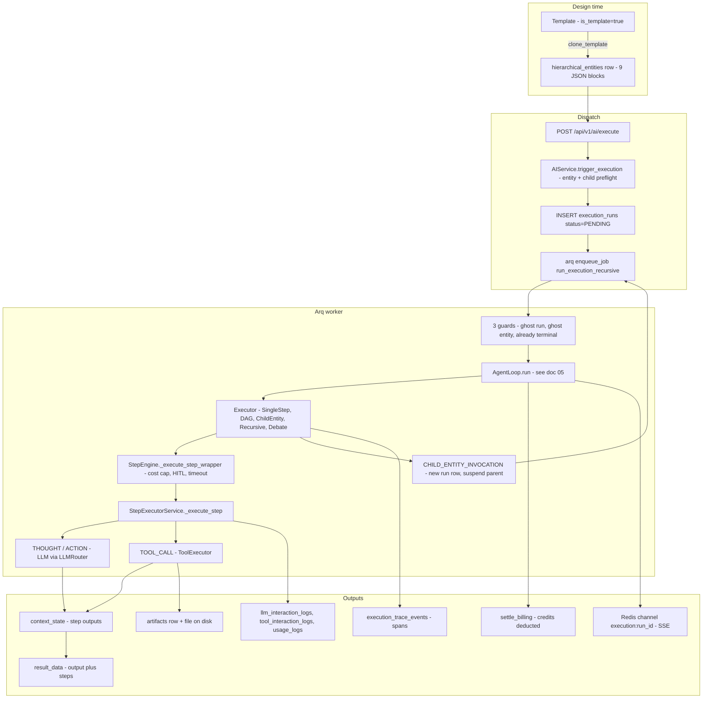
```mermaid
flowchart TD
    subgraph DESIGN["Design time"]
        E["hierarchical_entities row - 9 JSON blocks"]
        T["Template - is_template=true"] -->|clone_template| E
    end
    subgraph DISPATCH["Dispatch"]
        API["POST /api/v1/ai/execute"] --> VAL["AIService.trigger_execution - entity + child preflight"]
        VAL --> ROW["INSERT execution_runs status=PENDING"]
        ROW --> Q["arq enqueue_job run_execution_recursive"]
    end
    subgraph WORKER["Arq worker"]
        Q --> GUARD["3 guards - ghost run, ghost entity, already terminal"]
        GUARD --> LOOP["AgentLoop.run - see doc 05"]
        LOOP --> EXEC["Executor - SingleStep, DAG, ChildEntity, Recursive, Debate"]
        EXEC --> SE["StepEngine._execute_step_wrapper - cost cap, HITL, timeout"]
        SE --> SX["StepExecutorService._execute_step"]
        SX --> THOUGHT["THOUGHT / ACTION - LLM via LLMRouter"]
        SX --> TOOLC["TOOL_CALL - ToolExecutor"]
        EXEC --> CHILD["CHILD_ENTITY_INVOCATION - new run row, suspend parent"]
    end
    subgraph OUT["Outputs"]
        THOUGHT --> CTX["context_state - step outputs"]
        TOOLC --> CTX
        TOOLC --> ART["artifacts row + file on disk"]
        CTX --> RES["result_data - output plus steps"]
        LOOP --> BILL["settle_billing - credits deducted"]
        LOOP --> SSE["Redis channel execution:run_id - SSE"]
        SX --> LOGS["llm_interaction_logs, tool_interaction_logs, usage_logs"]
        EXEC --> TRACE["execution_trace_events - spans"]
    end
    E --> API
    CHILD --> Q
```

E is for entity, R is for run. The whole pipeline in one sentence: **an entity
is a template for behaviour; a run is one execution of it; a step is one unit
of work inside a run; a tool is one side-effect inside a step; an artifact is
one file that fell out.**

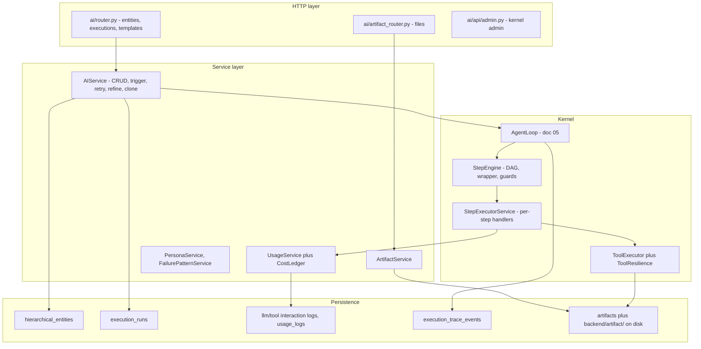
```mermaid
graph TB
    subgraph API_LAYER["HTTP layer"]
        R1["ai/router.py - entities, executions, templates"]
        R2["ai/artifact_router.py - files"]
        R3["ai/api/admin.py - kernel admin"]
    end
    subgraph SVC["Service layer"]
        S1["AIService - CRUD, trigger, retry, refine, clone"]
        S2["ArtifactService"]
        S3["UsageService plus CostLedger"]
        S4["PersonaService, FailurePatternService"]
    end
    subgraph KERNEL["Kernel"]
        K1["AgentLoop - doc 05"]
        K2["StepEngine - DAG, wrapper, guards"]
        K3["StepExecutorService - per-step handlers"]
        K4["ToolExecutor plus ToolResilience"]
    end
    subgraph STORE["Persistence"]
        D1["hierarchical_entities"]
        D2["execution_runs"]
        D3["llm/tool interaction logs, usage_logs"]
        D4["execution_trace_events"]
        D5["artifacts plus backend/artifact/ on disk"]
    end
    R1 --> S1 --> D1 & D2
    R2 --> S2 --> D5
    S1 --> K1
    K1 --> K2 --> K3 --> K4
    K3 --> S3 --> D3
    K4 --> D5
    K1 --> D4
```

---

## 2. `HierarchicalEntity` — the configuration model

The ORM is deliberately thin: [orm/entity.py:21](../../backend/src/ai/orm/entity.py:21)
declares scalar identity columns plus **nine `JSON` columns**. There is no
per-block table — the whole configuration surface is JSON, validated on write
by Pydantic and read defensively (`.get(...)` with defaults) at runtime.

```python
# backend/src/ai/orm/entity.py
    # Unified structure fields
    identity: Mapped[Any] = mapped_column(JSON, nullable=True)
    hierarchy: Mapped[Any] = mapped_column(JSON, nullable=True)
    logic_gate: Mapped[Any] = mapped_column(JSON, nullable=True)
    planning: Mapped[Any] = mapped_column(JSON, nullable=True)
    capabilities: Mapped[Any] = mapped_column(JSON, nullable=True)
    governance: Mapped[Any] = mapped_column(JSON, nullable=True)
    io_contract: Mapped[Any] = mapped_column(JSON, nullable=True)
    observability: Mapped[Any] = mapped_column(JSON, nullable=True)
    metadata_extensions: Mapped[Any] = mapped_column(JSON, nullable=True)
```

### Scalar columns

| Column | Type | Meaning |
|--------|------|---------|
| `id` | UUID PK | Entity identity. Referenced by `execution_runs.entity_id`, plan `target.entity_id`, `hierarchy.children[].child_id`. |
| `company_id` | UUID FK, **nullable** | Owning tenant. **NULL for templates** — templates are public ([service.py:32](../../backend/src/ai/service.py:32)). |
| `parent_id` | UUID FK self | Structural parent. One of *three* ways children are discovered (see §4). |
| `version` | str, default `"1.0.0"` | Free-text. **Not enforced, not compared, never auto-incremented.** |
| `type` | str | `ACTION` / `SKILL` / `AGENT` / `PROCESS` — [EntityType](../../backend/src/ai/schemas/enums.py:27). |
| `status` | str, default `"ACTIVE"` | `DRAFT` / `ACTIVE` / `DEPRECATED` / `ARCHIVED` / `DELETED`. |
| `name` | str | Machine-ish name (`bi-fetch-data`). Used by child-resolver Strategy 4. |
| `display_name` | str? | UI label. |
| `description` | text? | Used as the fallback prompt for auto-generated steps. |
| `goal` | text? | Injected as prompt Layer 2 and used by GoalGuard / alignment critic. |
| `tags` | JSON list | Feeds the bandit task classifier's tag mapping. |
| `is_template` | bool | Blueprint, not executable. |
| `template_source_id` | UUID FK self | Provenance link back to the template it was cloned from. |
| `created_by` | UUID FK users | Author. |
| `created_at` / `updated_at` / `deleted_at` | datetime | `deleted_at` is stamped on soft delete. |

### The nine blocks at a glance

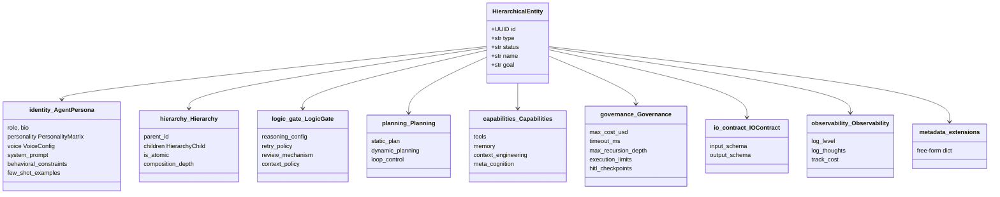
```mermaid
classDiagram
    class HierarchicalEntity {
        +UUID id
        +str type
        +str status
        +str name
        +str goal
    }
    class identity_AgentPersona {
        role, bio
        personality PersonalityMatrix
        voice VoiceConfig
        system_prompt
        behavioral_constraints
        few_shot_examples
    }
    class hierarchy_Hierarchy {
        parent_id
        children HierarchyChild
        is_atomic
        composition_depth
    }
    class logic_gate_LogicGate {
        reasoning_config
        retry_policy
        review_mechanism
        context_policy
    }
    class planning_Planning {
        static_plan
        dynamic_planning
        loop_control
    }
    class capabilities_Capabilities {
        tools
        memory
        context_engineering
        meta_cognition
    }
    class governance_Governance {
        max_cost_usd
        timeout_ms
        max_recursion_depth
        execution_limits
        hitl_checkpoints
    }
    class io_contract_IOContract {
        input_schema
        output_schema
    }
    class observability_Observability {
        log_level
        log_thoughts
        track_cost
    }
    class metadata_extensions {
        free-form dict
    }
    HierarchicalEntity --> identity_AgentPersona
    HierarchicalEntity --> hierarchy_Hierarchy
    HierarchicalEntity --> logic_gate_LogicGate
    HierarchicalEntity --> planning_Planning
    HierarchicalEntity --> capabilities_Capabilities
    HierarchicalEntity --> governance_Governance
    HierarchicalEntity --> io_contract_IOContract
    HierarchicalEntity --> observability_Observability
    HierarchicalEntity --> metadata_extensions
```

> **The single most important schema fact.** `HierarchicalEntityCreate` /
> `HierarchicalEntityUpdate` ([schemas/entity.py:73](../../backend/src/ai/schemas/entity.py:73))
> are **closed** Pydantic models — no `extra = "allow"`. **Any key you invent is
> silently dropped on create.** The seed authors learned this the hard way and
> wrote it down in
> [SeedDocFactoryLite/create_lite.py:21](../../backend/scripts/seeds/default_entities/SeedDocFactoryLite/create_lite.py:21)
> and [phase11.py:8](../../backend/scripts/seeds/default_entities/SeedDocumentFactory/phase11.py:8).
> Worse: several keys the *runtime* reads are not declared on the schema
> (`governance.critic_cost_share_pct`, `governance.max_concurrent_children`,
> `review_mechanism.critic_model_override`, `capabilities.tools[].usage`), so
> they cannot be set through the API at all. They only exist if written
> directly to the JSON column.

---

### 2.1 `identity` — who the agent is

**Declared type:** `Optional[Any]` on the DTO (deliberately loose — three
historical formats are accepted). The canonical shape is `AgentPersona`
([schemas/persona.py:72](../../backend/src/ai/schemas/persona.py:72)).

| Field | Type | Default | Notes |
|-------|------|---------|-------|
| `role` | str | `"AI Assistant"` | Prefixed into the system prompt when not the default ([step_executor.py:649](../../backend/src/ai/step_executor.py:649)). |
| `bio` | str? | — | Appended as "Agent Bio & Behavioral Guidelines" by `PersonaService`. |
| `profile_image_url` / `profile_image_thumbnail_url` | str? | — | UI only. Uploaded via `POST /ai/avatar/upload`. |
| `personality` | `PersonalityMatrix` | see below | Behavioural fingerprint. |
| `voice` | `VoiceConfig` | see below | Only used on the voice/telephony path ([12 — Voice](12-voice-and-telephony.md)). |
| `system_prompt` | str | `""` | Prompt Layer 1. |
| `behavioral_constraints` | list[str] | `[]` | Rendered as a bullet list. |
| `few_shot_examples` | list[`PersonaExample`] | `[]` | Prompt Layer 4. `{scenario, ideal_response}`; legacy `{input, output}` is auto-mapped. |
| `greeting_template` / `escalation_message` / `closing_message` | str? | — | Voice/chat hooks. |

`PersonalityMatrix`: `tone` (`professional`), `verbosity`
(`concise|moderate|verbose`), `empathy_level` (0.7), `humor_level` (0.2),
`formality` (`semi-formal`), `decision_confidence` (0.8).
`VoiceConfig`: `voice_name` (`Aoede`), `language_code` (`en-US`),
`speaking_rate` (1.0), `pitch` (0.0), `custom_voice_id`.

**Three accepted formats**, normalised by
[`PersonaService._parse_persona`](../../backend/src/ai/persona_service.py:131):

| Format | Shape | Detected by |
|--------|-------|-------------|
| New | `{"role":…, "personality":{…}, "voice":{…}, "system_prompt":…}` | has `name`, `personality` or `voice` |
| Legacy 2 | `{"persona": {"system_prompt": …}}` | has `persona` |
| Legacy 1 | `{"system_prompt": …, "behavioral_constraints": […]}` | has `system_prompt` |

```json
{
  "identity": {
    "system_prompt": "You are a data ingestion specialist. Your job is to fetch raw business data using terminal commands...",
    "behavioral_constraints": [
      "Always validate that fetched data is non-empty before returning",
      "Never expose credentials in output — redact any API keys or passwords"
    ]
  }
}
```
*(real, from [SeedAutonomousBI/actions.py:13](../../backend/scripts/seeds/default_entities/SeedAutonomousBI/actions.py:13))*

**Read by:** [step_executor.py:643-657](../../backend/src/ai/step_executor.py:643)
(system prompt + role + few-shots for every THOUGHT/ACTION step),
[persona_service.py:32](../../backend/src/ai/persona_service.py:32)
(voice/streaming path), [router.py:98](../../backend/src/ai/router.py:98)
(`_has_voice_config` for the `voice_enabled` filter),
`HierarchicalEntityResponse.parse_identity` which unwraps `{"persona": …}` on
read ([schemas/entity.py:111](../../backend/src/ai/schemas/entity.py:111)).

> **Gotcha:** `AgentPersona` has **no `name` field** (the comment at
> [persona.py:77](../../backend/src/ai/schemas/persona.py:77) says "use
> top-level entity.name"), yet `_parse_persona` and
> `build_system_prompt_from_persona` both reference `persona.name`
> ([persona_service.py:49](../../backend/src/ai/persona_service.py:49),
> [:152](../../backend/src/ai/persona_service.py:152)). Those paths raise and
> are swallowed by the `except Exception` at
> [persona_service.py:167](../../backend/src/ai/persona_service.py:167), which
> returns `None` — i.e. legacy-format personas silently fall back to
> "You are a helpful AI assistant." on the `PersonaService` path. The step
> executor does **not** use `PersonaService`; it reads `identity` directly, so
> normal text runs are unaffected.

---

### 2.2 `hierarchy` — structural composition

**Type:** [`Hierarchy`](../../backend/src/ai/schemas/entity.py:41).

| Field | Type | Default | Meaning |
|-------|------|---------|---------|
| `parent_id` | UUID? | `None` | Mirrors the `parent_id` column. |
| `children` | list[`HierarchyChild`] | `[]` | Ordered child references. |
| `is_atomic` | bool | `True` | Documentation only — no code branches on it. |
| `composition_depth` | int | `0` | Documentation only — no code branches on it. |

`HierarchyChild` = `{child_id: str?, child_type: str?, relationship: str?,
condition: HierarchyChildCondition?}`. `relationship` is meant to be
`SEQUENTIAL` / `PARALLEL` / `CONDITIONAL` ([RelationshipType](../../backend/src/ai/schemas/enums.py:84))
but the field is typed `Optional[str]` and **nothing reads it**.
`condition` = `{enabled, expression, description}` — also unread.

```json
{
  "hierarchy": {
    "is_atomic": false,
    "composition_depth": 3,
    "children": [
      {"child_id": "…dp-uuid…", "child_type": "AGENT", "relationship": "SEQUENTIAL"},
      {"child_id": "…rb-uuid…", "child_type": "AGENT", "relationship": "SEQUENTIAL"},
      {"child_id": "…qa-uuid…", "child_type": "AGENT", "relationship": "SEQUENTIAL"}
    ]
  }
}
```
*(from [create_bi_entities.py:160](../../backend/scripts/seeds/default_entities/SeedAutonomousBI/create_bi_entities.py:160))*

**Read by:**

| Consumer | What it does |
|----------|--------------|
| [`load_entity_children`](../../backend/src/ai/meta/platform_schema_compiler.py:718) | Loads live child ORM rows from `children[].child_id`, **company-scoped**. |
| [`describe_entity_children`](../../backend/src/ai/meta/platform_schema_compiler.py:760) | Renders a markdown block of children with their exact UUIDs for the dynamic planner. |
| [`resolve_child_entity_id`](../../backend/src/ai/planning/child_resolver.py:57) Strategy 3 | Positional index match: the *N*th `CHILD_ENTITY_INVOCATION` step maps to `children[N]`. |
| [`AIService._validate_process_children`](../../backend/src/ai/service.py:357) | Pre-flight existence check before a PROCESS run. |
| [`AIService.delete_entity`](../../backend/src/ai/service.py:183) / `clone_template` / `convert_to_template` | Tree walking. |
| [`remap_entity_refs`](../../backend/src/ai/entity_clone_helpers.py:83) | Rewrites `child_id` after a clone. |

---

### 2.3 `logic_gate` — how the LLM thinks

**Type:** [`LogicGate`](../../backend/src/ai/schemas/reasoning.py:75). Four sub-blocks.

#### `reasoning_config` (required sub-block)

| Field | Type | Default | Read by |
|-------|------|---------|---------|
| `task_type` | str | `"text_generation"` | [step_executor.py:634](../../backend/src/ai/step_executor.py:634) — routes model selection in `LLMRouter`. |
| `model_provider` / `model_version` | str? | `None` | **No runtime reader found.** |
| `model_name` | str? | `None` | [step_executor.py:636](../../backend/src/ai/step_executor.py:636) — per-entity model override. |
| `temperature` | float | `0.7` | [step_executor.py:1009](../../backend/src/ai/step_executor.py:1009). |
| `top_p` | float | `1.0` | **No runtime reader found.** |
| `max_tokens` | int? | `None` | [step_executor.py:1010](../../backend/src/ai/step_executor.py:1010). |
| `reasoning_mode` | `ReasoningMode` | `REACT` | **Deprecated as a per-step selector** (D-3). Read by [`resolve_meta_cognition`](../../backend/src/ai/meta/platform_schema_compiler.py:859) for Tier-1 auto-enable. Per-step mode now comes from `PlanStep.reasoning_hint`. |
| `execution_mode` | str | `"STANDARD"` | `STANDARD` \| `AUTONOMOUS`. No runtime branch in the loop path. |
| `goal_validation_interval` | int | `2` | [step_engine.py:353](../../backend/src/ai/core/step_engine.py:353) — GoalGuard cadence; `0` disables. |
| `confidence_threshold` | float | `0.85` | Planning/critic surface. |
| `max_replanning_attempts` | int | `3` | Planning surface. |
| `self_reflection_enabled` | bool | `False` | CORTEX query-before-act. |

`ReasoningMode` values: `REACT`, `CHAIN_OF_THOUGHT` (supported);
`REFLECTION`, `TREE_OF_THOUGHTS` (**deprecated** —
[`DEPRECATED_REASONING_MODES`](../../backend/src/ai/schemas/enums.py:115); a step
hinting one of these logs a warning and runs REACT,
[step_executor.py:988](../../backend/src/ai/step_executor.py:988)).

#### `retry_policy`

`{max_retries: 3, backoff_strategy: LINEAR|EXPONENTIAL|NONE, backoff_multiplier: 2.0, retry_on: ["TOOL_FAILURE","LLM_ERROR","TIMEOUT"]}`.

> **Dead config.** A repo-wide grep for `retry_policy`, `backoff_strategy` and
> `backoff_multiplier` outside `schemas/` returns **nothing**. Retries are
> actually governed by `MAX_RETRIES_PER_STEP = 2` in
> [retry_strategies.py:37](../../backend/src/ai/planning/retry_strategies.py:37)
> plus the tool-level reformat/fallback ladder in §7. Seeds still set it
> (e.g. `create_lite.py` `{"max_retries": 1}`) believing it binds.

#### `review_mechanism`

| Field | Default | Read by |
|-------|---------|---------|
| `enabled` | `False` | [step_executor.py:664](../../backend/src/ai/step_executor.py:664) — gates whether `success_criteria` enter the prompt. |
| `review_prompt` / `review_system_prompt` | `DEFAULT_REVIEW_SYSTEM_PROMPT` | Critic pipeline surface. |
| `success_criteria` | `[]` | `{criterion, validation_type: REGEX|SCHEMA|LLM_JUDGE|FUNCTION, validator}` → prompt Layer 5. |
| `on_failure` | `"RETRY"` | `RETRY` \| `ESCALATE` \| `ABORT`. |
| `critic_model_override` | — | Read by [agent_loop.py:916](../../backend/src/ai/core/agent_loop.py:916) but **not a schema field** — unsettable via the API. |

The legacy per-step self-critique was deleted (C1); the loop's
`RealCriticPipeline` is the review path now — see
[07 — Planning & critics](07-planning-and-critics.md).

#### `context_policy`

Controls how much prior context a step sees
([prompt_utils.py:177](../../backend/src/ai/core/prompt_utils.py:177)).

| `type` | Behaviour |
|--------|-----------|
| `FULL` (default) | Pass everything. |
| `LAST_N` | `input` plus the last `n` context keys (default 3). |
| `SLIDING_WINDOW` | Most-recent-first until `max_chars` (default 4000) is hit. |
| `EXPLICIT` | Only `explicit_keys`. |

Plus `summarize_threshold` (default `8000` in the schema, but
`_maybe_summarize_context` falls back to `20000` when unset —
[step_executor.py:1155](../../backend/src/ai/step_executor.py:1155)) and
`preserve_keys`, which are never trimmed
([step_executor.py:1164](../../backend/src/ai/step_executor.py:1164)).

> **Precedence trap:** `filter_context_for_step` short-circuits. If the step's
> `target.input_dependencies` is non-empty, **only** `input` + those deps are
> passed and `context_policy` is ignored entirely
> ([prompt_utils.py:197-204](../../backend/src/ai/core/prompt_utils.py:197)).
> And if `context_policy` is absent altogether, the function returns the full
> context unfiltered.

```json
{
  "logic_gate": {
    "reasoning_config": {"task_type": "text_generation", "temperature": 0.2, "reasoning_mode": "REACT"},
    "retry_policy": {"max_retries": 2, "backoff_strategy": "EXPONENTIAL", "retry_on": ["TOOL_FAILURE", "TIMEOUT"]},
    "context_policy": {"type": "EXPLICIT", "explicit_keys": ["input", "data_source", "query"]}
  }
}
```

---

### 2.4 `planning` — the plan

**Type:** [`Planning`](../../backend/src/ai/schemas/planning.py:174) — three sub-blocks.

#### `static_plan`

| Field | Type | Default | Meaning |
|-------|------|---------|---------|
| `enabled` | bool | `True` | — |
| `steps` | list[`PlanStep`] | `[]` | The authored plan. |
| `fallback_behavior` | str | `"ADAPTIVE"` | How the dynamic planner treats authored steps. |

`fallback_behavior` values ([planning.py:132-142](../../backend/src/ai/schemas/planning.py:132)):

| Value | Meaning |
|-------|---------|
| `ADAPTIVE` | The authored plan competes as one candidate; the judge may pick, augment, or replace it. |
| `STRICT` | Binding — the chosen plan must cover every authored step, else the authored plan is used verbatim. |
| `DYNAMIC_ONLY` | Ignore the static plan entirely. |

#### `PlanStep` ([planning.py:80](../../backend/src/ai/schemas/planning.py:80))

| Field | Type | Default | Notes |
|-------|------|---------|-------|
| `step_id` | str? | `None` | The key everything else references. Convention: `step_1`, `outline`, … |
| `order` | int | `0` | Authoring hint. Real ordering comes from dependencies. |
| `name` | str | `""` | Also used as a context key (see §6). |
| `description` | str? | — | Prepended as "Current Task" to the user prompt. |
| `type` | `StepType` | `ACTION` | Case-insensitive coercion; unknown values raise. |
| `target` | `PlanStepTarget`? | `None` | Where the work goes. |
| `required` | bool | `True` | Authoring hint. |
| `exit_conditions` | list[`ExitCondition`] | `[]` | Only consumed by the vestigial `_should_exit` ([step_executor.py:1203](../../backend/src/ai/step_executor.py:1203)), which no caller invokes. |
| `reasoning_hint` | str? | `None` | **The live per-step reasoning selector.** Supersedes `reasoning_config.reasoning_mode`. A legacy per-step `reasoning_mode` is auto-mapped onto it ([planning.py:97](../../backend/src/ai/schemas/planning.py:97)). |

`StepType` ([enums.py:143](../../backend/src/ai/schemas/enums.py:143)):

| Value | Handler | Notes |
|-------|---------|-------|
| `THOUGHT` | `_execute_thought` | LLM reasoning. |
| `ACTION` | `_execute_thought` | Identical code path to THOUGHT. |
| `TOOL_CALL` | `_execute_tool_call` | Deterministic single tool invocation. |
| `CHILD_ENTITY_INVOCATION` | `ChildEntityExecutor` | Never reaches the inline path — see §8. |
| `NAVIGATE` / `READ` / `WRITE` / `RECURSE` / `AWAIT_CHILDREN` | `CortexBridge.execute_cortex_step` | CORTEX-native, see [08 — Memory & CORTEX](08-memory-and-cortex.md). |

`PlanStepTarget` ([planning.py:38](../../backend/src/ai/schemas/planning.py:38)):

| Field | Notes |
|-------|-------|
| `entity_id` | UUID of the child. A **non-UUID string is auto-moved to `entity_name_hint`** by a `mode="before"` validator, so bad planner output degrades gracefully instead of exploding. |
| `tool_id` | Tool to call. **Only honoured for `TOOL_CALL` steps** — `_execute_thought` ignores it. |
| `prompt_template` | `{{var}}` template. A dict/list is auto-JSON-stringified. |
| `input_dependencies` | Explicit upstream `step_id`s. Drives the DAG *and* context filtering *and* `plan_ready_steps`. |
| `entity_name_hint` | Populated by the validator above; used by child-resolver Strategy 4. |

#### `dynamic_planning`

`{enabled: false, planning_prompt: null, planning_system_prompt: DEFAULT_PLANNING_SYSTEM_PROMPT, constraints: [], reconciliation_strategy: "HYBRID", allowed_deviations: {...}}`.
`allowed_deviations` = `{can_add_steps: true, can_skip_optional_steps: true,
can_reorder_steps: false, can_change_tools: false}` → rendered as prompt
Layer 6 ([prompt_utils.py:139](../../backend/src/ai/core/prompt_utils.py:139)).
`enabled` also auto-enables Tier-1 platform awareness. Full planner behaviour
is in [07 — Planning & critics](07-planning-and-critics.md).

#### `loop_control`

`{max_iterations: 1, convergence_criteria: [], iteration_context_mode:
"FULL_HISTORY", summary_every_n_iterations: null}`.
> **Dead config.** `loop_control` has zero readers outside `schemas/planning.py`.
> Loop iteration limits come from the kernel's own caps
> ([05 §12](05-agent-kernel.md#12-termination-and-run-status)).

```json
{
  "planning": {
    "static_plan": {
      "enabled": true,
      "fallback_behavior": "STRICT",
      "steps": [
        {"step_id": "outline",  "order": 1, "name": "Analyze & outline", "type": "THOUGHT", "required": true,
         "target": {"prompt_template": "PLAN FIRST — do NOT write code... Request:\n\n{{input}}"}},
        {"step_id": "generate", "order": 2, "name": "Generate document", "type": "ACTION", "required": true,
         "target": {"tool_id": "sandbox_code",
                    "prompt_template": "Following this OUTLINE...\n\nOUTLINE:\n{{outline}}\n\nOriginal request:\n{{input}}",
                    "input_dependencies": ["outline"]}}
      ]
    },
    "dynamic_planning": {"enabled": false}
  }
}
```
*(from [create_lite.py:127](../../backend/scripts/seeds/default_entities/SeedDocFactoryLite/create_lite.py:127))*

---

### 2.5 `capabilities` — what the agent may do

**Type:** [`Capabilities`](../../backend/src/ai/schemas/capabilities.py:125) — four sub-blocks.

#### `tools`

Declared as `List[ToolReference]` — i.e. **`{"tool_id": "..."}` and nothing
else**. There is a richer `ToolDefinition`
([capabilities.py:33](../../backend/src/ai/schemas/capabilities.py:33)) with
`authentication`, `function_schema`, `access_level`, `permissions`,
`sandbox_mode`, `max_execution_seconds`, `rate_limit_per_run` — but
`Capabilities.tools` does **not** use it, so none of those fields survive an
API create. The step executor additionally reads a `usage` key that appears in
neither schema:

```python
# backend/src/ai/step_executor.py
            all_tools = entity.capabilities.get("tools", [])
            autonomous_tools = [
                t for t in all_tools
                if t.get("usage", "AUTONOMOUS") in ("AUTONOMOUS", "BOTH")
            ]
            tool_ids = [t.get("tool_id") for t in autonomous_tools]
```

So in practice: every declared tool is exposed to the LLM's REACT loop unless
someone writes `usage: "PLANNED"` straight into the JSON column.

#### `memory` (`MemoryConfig`)

| Field | Default | Meaning |
|-------|---------|---------|
| `enabled` | `False` | Master switch. |
| `mode` | `"STANDARD"` | `STANDARD` (episodic + pgvector) \| `CORTEX` (cognitive tree). |
| `memory_scope` | `"FULL"` | `FULL` \| `RUN_SCOPED` \| `INTELLIGENCE_ONLY` \| `NONE`. |
| `episodic_memory_count` | `10` | Past episodes injected. |
| `semantic_search_enabled` | `True` | pgvector document search. |
| `semantic_top_k` | `5` | — |
| `cortex_config` | `None` | `{max_children: 12, page_size_tokens: 8000, context_budget_pct: 40, auto_checkpoint: true, resume_enabled: true}`. |

#### `context_engineering` (`ContextEngineering`)

`{context_sources: [], inject_episodic_memory: true, inject_semantic_context:
true, inject_cortex_viewport: true, no_truncation: true}`.
`ContextSource` = `{source_type: DOCUMENT|KNOWLEDGE_BASE|CORTEX_TREE|DB_RECORDS,
reference_id, query, description, file_name, file_type, file_size, tree_status,
tree_node_count}`. Written by
[`POST /ai/context-sources/upload`](../../backend/src/ai/router.py:484), which
saves an artifact and appends the source entry to the entity's `capabilities`
in place.

#### `meta_cognition` (`MetaCognitionConfig`)

Three tiers, resolved at runtime by
[`resolve_meta_cognition`](../../backend/src/ai/meta/platform_schema_compiler.py:805):

| Flag | Schema default | Effective default | Effect |
|------|----------------|-------------------|--------|
| `platform_awareness` | `True` | `dynamic_planning.enabled or reasoning_mode == "REACT"` | Injects the ~2–4K-token platform manifest as prompt Layer 3.5 (Redis-cached 5 min per tenant, [platform_schema_compiler.py:679](../../backend/src/ai/meta/platform_schema_compiler.py:679)). |
| `registry_search` | `False` | `False` unless `metadata_extensions.is_meta_agent` | Auto-injects `meta_registry_search`. |
| `self_modification` | `False` | `False` unless `is_meta_agent` | Auto-injects `meta_entity_creator` + `meta_entity_executor`. |
| `self_introspection` | not in schema | `type in (SKILL, AGENT, PROCESS)` | Auto-injects `agent_introspect`. |
| `reflection` | not in schema | `type in (AGENT, PROCESS)` | Auto-injects `agent_reflect`. |
| `max_runtime_creations` | `3` | — | Tier-3 cap. |
| `max_registry_searches` | `5` | — | Tier-2 cap. |

The docstring on `MetaCognitionConfig` still claims Tiers 2/3 are "auto-enabled
for AGENT and PROCESS". **That is stale** — Phase 11 Track 5 flipped both to
opt-in ([platform_schema_compiler.py:808-822](../../backend/src/ai/meta/platform_schema_compiler.py:808)).

```json
{
  "capabilities": {
    "tools": [{"tool_id": "sandbox_code"}, {"tool_id": "document_save"}],
    "memory": {
      "enabled": true, "mode": "CORTEX", "memory_scope": "INTELLIGENCE_ONLY",
      "cortex_config": {"auto_checkpoint": true, "context_budget_pct": 25}
    }
  }
}
```

---

### 2.6 `governance` — limits and human gates

**Type:** [`Governance`](../../backend/src/ai/schemas/governance.py:35).

| Field | Type | Default | Actually enforced? |
|-------|------|---------|--------------------|
| `max_cost_usd` | float? | `None` | **Yes, hard.** [`StepEngine._enforce_cost_cap`](../../backend/src/ai/core/step_engine.py:237) re-reads `run.total_cost_usd` before each step and raises `BudgetExhaustedError`. Also seeds `Budget.usd_max` ([budget.py:94](../../backend/src/ai/core/budget.py:94), default `$100`). |
| `timeout_ms` | int | `60000` | **Yes, per step.** `asyncio.wait_for` at [step_engine.py:315](../../backend/src/ai/core/step_engine.py:315). Also seeds `Budget.wall_max_s` (default 7200 s). |
| `max_recursion_depth` | int | `5` | **No.** Only surfaced as a prompt line ([step_executor.py:681](../../backend/src/ai/step_executor.py:681)) and warned about by the meta schema validator. See §8. |
| `execution_limits.max_tool_calls` | int? | `None` | **Prompt-only.** Rendered as "Tool calls remaining: N of M" ([step_executor.py:673-676](../../backend/src/ai/step_executor.py:673)); no hard block. |
| `execution_limits.max_recursion_depth` | int | `5` | Duplicate of the above; unread. |
| `hitl_checkpoints` | list[`HITLCheckpoint`] | `[]` | **Yes.** [`GovernanceService.evaluate_hitl`](../../backend/src/ai/governance/governance_service.py:246). |

`HITLCheckpoint` = `{trigger_type, step_ref, tool_ref, threshold, expression,
timeout_ms: 300000, notification_channels: [], message, auto_approve_on_timeout: false}`.

| `trigger_type` | Phase | Fires when |
|----------------|-------|------------|
| `BEFORE_STEP` | BEFORE | `step_ref` matches step `name` or `step_id`. |
| `AFTER_STEP` | AFTER | same match. |
| `COST_THRESHOLD` | BEFORE | `run.total_cost_usd >= threshold`. |
| `TOOL_CALL` | BEFORE | step is `TOOL_CALL` and `target.tool_id == tool_ref`. |
| `CUSTOM` | BEFORE | `_safe_eval_expression(expression, run, context_state)` is truthy. |

Firing writes a `human_approvals` row, publishes `HITL_PENDING` on
`execution:{run_id}`, and blocks on `hitl:{approval_id}` until
`POST /ai/approvals/{id}/respond` or `timeout_ms`. Detail in
[15 — Governance & HITL](15-governance-and-hitl.md).

**Undeclared governance keys read at runtime** (settable only by direct JSON
write): `critic_cost_share_pct` (0.20), `goal_validation_interval` (2),
`meta_review_interval` (3) — all at
[agent_loop.py:915-921](../../backend/src/ai/core/agent_loop.py:915) — and
`max_concurrent_children` (8) at
[child_entity.py:51](../../backend/src/ai/core/executors/child_entity.py:51).

---

### 2.7 `io_contract` — the input/output shape

**Type:** [`IOContract`](../../backend/src/ai/schemas/io_contract.py:14) —
just `{input_schema, output_schema}`, both JSON-Schema-shaped dicts defaulting
to `{"type":"object","properties":{}}`.

| Field | Who reads it |
|-------|--------------|
| `input_schema` | The SPA's run form. Auto-populated on clone by [`_auto_generate_input_schema`](../../backend/src/ai/service.py:1292), which scrapes `{{var}}` names out of every `prompt_template` and the `goal`, skipping `step_N` refs and `__internal__` names. |
| `output_schema` | [step_executor.py:662](../../backend/src/ai/step_executor.py:662) → prompt Layer 7 ("Your response MUST conform to this JSON schema"). |

> **Both are advisory.** `input_data` is **never validated** against
> `input_schema` anywhere in the request path — grep confirms the only
> `input_schema` readers are the auto-generator and the frontend. The platform
> manifest claims "The execution engine validates input_data against
> input_schema before execution"
> ([platform_schema_compiler.py:471](../../backend/src/ai/meta/platform_schema_compiler.py:471));
> that is aspirational. `output_schema` is a prompt instruction, not a parser.

---

### 2.8 `observability` — logging knobs

**Type:** [`Observability`](../../backend/src/ai/schemas/io_contract.py:19).

| Field | Default | Read by |
|-------|---------|---------|
| `log_level` | `"INFO"` | **No runtime reader.** |
| `log_thoughts` | `True` | [arq_jobs.py:122](../../backend/src/ai/core/arq_jobs.py:122) — sets `TraceRecorder.capture_payloads`, i.e. whether trace spans store prompts/outputs at all. Also gates a log line at [step_engine.py:292](../../backend/src/ai/core/step_engine.py:292). |
| `track_cost` | `True` | **No runtime reader** — cost is always tracked. |

Setting `log_thoughts: false` is the privacy switch: spans are still written,
but with empty payloads.

---

### 2.9 `metadata_extensions` — the escape hatch

**Type:** `Optional[Dict[str, Any]]` — genuinely free-form, and therefore the
*only* way to set per-entity config the closed schemas do not model.

| Key | Read by | Meaning |
|-----|---------|---------|
| `feature_flags` | [feature_flags.py:528](../../backend/src/ai/core/feature_flags.py:528) | Highest-precedence flag tier. Flat (`"planner.v2_enabled": true`) or namespaced. |
| `task_class` | [task_classifier.py:144](../../backend/src/ai/memory/task_classifier.py:144) | Explicit bandit task-class override. |
| `is_meta_agent` | [platform_schema_compiler.py:881](../../backend/src/ai/meta/platform_schema_compiler.py:881) | Forces meta-cognition Tiers 2+3 on. |
| `telephony_provider` | [arq_jobs.py:365](../../backend/src/ai/core/arq_jobs.py:365) | `twilio` \| `tata_tele`. |
| `greeting_audio_url`, `greeting_text` | [voice/webhook_router.py:112](../../backend/src/voice/webhook_router.py:112) | Call greeting. |
| `max_call_duration_seconds` | [voice/agent_loader.py:248](../../backend/src/voice/agent_loader.py:248) | Voice cap. |
| `golden_outcomes`, `architect_revisions` | Meta-Agent Board ([11](11-meta-intelligence.md)) | Eval fixtures / revision log. |

Also stamped at dispatch: the worker writes
`run.input_data["feature_flags"]["agent_loop.enabled"] = True` onto the **run**
(not the entity) purely so the SPA renders the loop timeline
([arq_jobs.py:107-111](../../backend/src/ai/core/arq_jobs.py:107)).

---

## 3. The four entity types

`type` is a plain string column. Nothing about it is polymorphic — the same
`AgentLoop`, the same `StepEngine`, the same `StepExecutorService` run all four.
What differs is a handful of **explicit branches**:

| Branch | ACTION | SKILL | AGENT | PROCESS |
|--------|:------:|:-----:|:-----:|:-------:|
| Virtual 1-step plan injected on GET (UI) — [service.py:123](../../backend/src/ai/service.py:123) | ✅ | ✅ | — | — |
| Real `auto_generated` step injected when `static_plan.steps` is empty — [planner_service.py:53](../../backend/src/ai/planning/planner_service.py:53) | ✅ | ✅ | — | — |
| Child pre-flight validation before dispatch — [service.py:285](../../backend/src/ai/service.py:285) | — | — | — | ✅ |
| Strategist picks `Recursive` when there is no plan — [strategist.py:145](../../backend/src/ai/core/strategist.py:145) | — | — | ✅ | — |
| Router enforcement (force `CHILD_ENTITY_INVOCATION` steps) — [planner_service.py:330-351](../../backend/src/ai/planning/planner_service.py:330) | — | — | ✅ only if it binds no tools | ✅ always, if it has children |
| `self_introspection` auto-on | — | ✅ | ✅ | ✅ |
| `reflection` auto-on | — | — | ✅ | ✅ |
| `can_have_children` in the platform manifest | ❌ | ❌ | ❌ | ✅ |

Everything else — `hierarchy.children`, `CHILD_ENTITY_INVOCATION` steps, tools,
CORTEX — is available to **any** type. The BI seed proves it: its SKILLs each
invoke child ACTIONs, and its AGENTs each invoke child SKILLs, even though the
manifest says only PROCESS `can_have_children`.

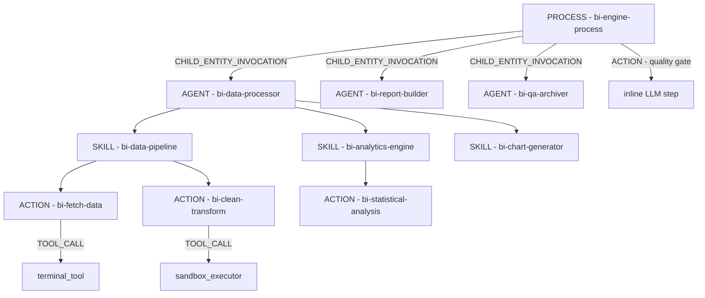
```mermaid
flowchart TD
    P["PROCESS - bi-engine-process"]
    A1["AGENT - bi-data-processor"]
    A2["AGENT - bi-report-builder"]
    A3["AGENT - bi-qa-archiver"]
    S1["SKILL - bi-data-pipeline"]
    S2["SKILL - bi-analytics-engine"]
    S3["SKILL - bi-chart-generator"]
    C1["ACTION - bi-fetch-data"]
    C2["ACTION - bi-clean-transform"]
    C3["ACTION - bi-statistical-analysis"]
    P -->|CHILD_ENTITY_INVOCATION| A1
    P -->|ACTION - quality gate| QG["inline LLM step"]
    P -->|CHILD_ENTITY_INVOCATION| A2
    P -->|CHILD_ENTITY_INVOCATION| A3
    A1 --> S1 & S2 & S3
    S1 --> C1 & C2
    S2 --> C3
    C1 -->|TOOL_CALL| T1["terminal_tool"]
    C2 -->|TOOL_CALL| T2["sandbox_executor"]
```

The intended semantics, from the platform manifest
([platform_schema_compiler.py:198](../../backend/src/ai/meta/platform_schema_compiler.py:198)):

| Type | Intent | Typical steps |
|------|--------|---------------|
| `ACTION` | Atomic unit of work — one LLM step or one tool call. | 1 |
| `SKILL` | Reusable multi-step capability. | 2–5 |
| `AGENT` | Autonomous reasoning entity with tools + memory; supports goal-driven expansion. | 3–10 |
| `PROCESS` | Orchestrator that coordinates children via `CHILD_ENTITY_INVOCATION`. | 2–20 |

And the composition rules the manifest hands to the Meta-Agent
([platform_schema_compiler.py:430](../../backend/src/ai/meta/platform_schema_compiler.py:430)):
children live in `hierarchy.children[].child_id`; invocation targets must be
same-company; children share the parent CORTEX tree via `__cortex_tree_id__`;
independent steps run in parallel; step outputs are referenced as `{{step_id}}`;
depth is capped by `governance.max_recursion_depth` (which, as noted, is not
actually enforced).

---

## 4. Entity lifecycle, versioning, templates and cloning

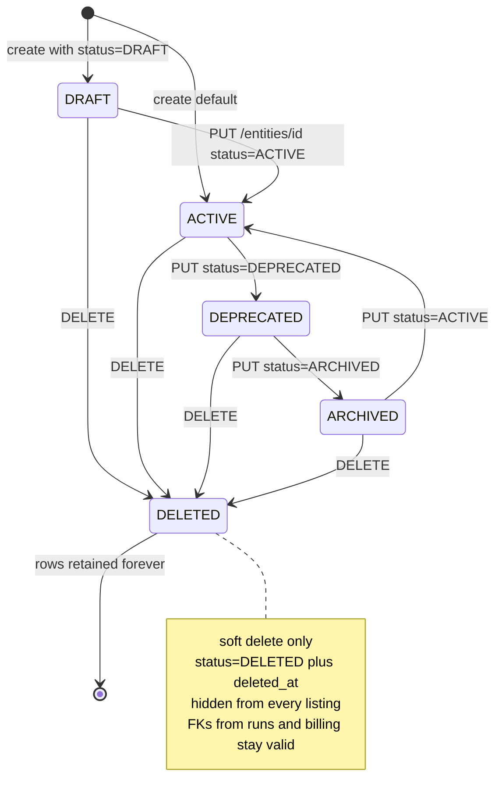
```mermaid
stateDiagram-v2
    [*] --> DRAFT: create with status=DRAFT
    [*] --> ACTIVE: create default
    DRAFT --> ACTIVE: PUT /entities/id status=ACTIVE
    ACTIVE --> DEPRECATED: PUT status=DEPRECATED
    DEPRECATED --> ARCHIVED: PUT status=ARCHIVED
    ARCHIVED --> ACTIVE: PUT status=ACTIVE
    DRAFT --> DELETED: DELETE
    ACTIVE --> DELETED: DELETE
    DEPRECATED --> DELETED: DELETE
    ARCHIVED --> DELETED: DELETE
    DELETED --> [*]: rows retained forever
    note right of DELETED
        soft delete only
        status=DELETED plus deleted_at
        hidden from every listing
        FKs from runs and billing stay valid
    end note
```

**There is no state machine.** Unlike `RunStatus`, `EntityStatus` has no
`VALID_TRANSITIONS` map and no validator — `update_entity`
([service.py:145](../../backend/src/ai/service.py:145)) does a blind
`setattr` loop over `model_dump(exclude_unset=True)`. Any status can become any
other status. `DRAFT` / `DEPRECATED` / `ARCHIVED` are **filter labels only**:
nothing prevents executing a `DRAFT` or `ARCHIVED` entity. The only status the
engine cares about is `DELETED`.

### `DELETED` — the one status with teeth

| Where | Behaviour |
|-------|-----------|
| [service.py:55](../../backend/src/ai/service.py:55) / [:83](../../backend/src/ai/service.py:83) | Excluded from `get_entities` and `get_entity`. |
| [arq_jobs.py:72](../../backend/src/ai/core/arq_jobs.py:72) | A queued run whose entity is DELETED is abandoned as a "ghost job" — returns cleanly so arq stops retrying. |
| [step_executor.py:150](../../backend/src/ai/step_executor.py:150) | `create_child_run` refuses to spawn a child on a DELETED entity. |
| [child_resolver.py:123](../../backend/src/ai/planning/child_resolver.py:123) | Name-based resolution skips DELETED. |

`delete_entity` ([service.py:157](../../backend/src/ai/service.py:157)) is a
**cascading soft delete**:

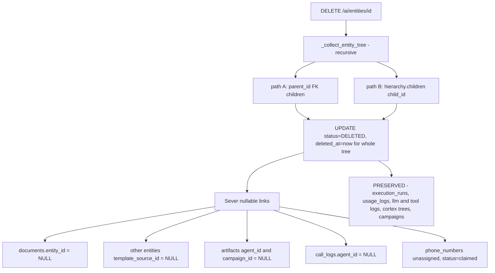
```mermaid
flowchart TD
    D["DELETE /ai/entities/id"] --> COL["_collect_entity_tree - recursive"]
    COL --> P1["path A: parent_id FK children"]
    COL --> P2["path B: hierarchy.children child_id"]
    P1 & P2 --> SET["UPDATE status=DELETED, deleted_at=now for whole tree"]
    SET --> SEV["Sever nullable links"]
    SEV --> L1["documents.entity_id = NULL"]
    SEV --> L2["other entities template_source_id = NULL"]
    SEV --> L3["artifacts agent_id and campaign_id = NULL"]
    SEV --> L4["call_logs.agent_id = NULL"]
    SEV --> L5["phone_numbers unassigned, status=claimed"]
    SET --> KEEP["PRESERVED - execution_runs, usage_logs, llm and tool logs, cortex trees, campaigns"]
```

Billing-critical rows keep valid FKs — that is the whole reason for soft
delete ([service.py:268](../../backend/src/ai/service.py:268)).
Note the asymmetry: `delete_entity` walks `parent_id` + `hierarchy.children`
but **not** `planning.static_plan.steps[].target.entity_id`, so an entity
referenced only from a plan step survives its parent's deletion.

### Versioning

`version` is a `String` with default `"1.0.0"`. It is copied verbatim by
`clone_entity_fields`, exposed on every response DTO, and **never read by any
runtime code path**. There is no version resolution, no "latest active version"
lookup, no pinning of a run to a version. A run points at an entity `id`, and
if you edit that entity mid-flight the loop's next `_reload_run(...).entity`
sees the new config.

### Templates and cloning

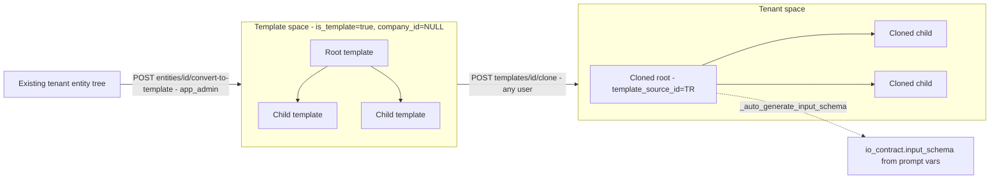
```mermaid
flowchart LR
    subgraph T["Template space - is_template=true, company_id=NULL"]
        TR["Root template"]
        TC1["Child template"]
        TC2["Child template"]
        TR --> TC1 & TC2
    end
    subgraph U["Tenant space"]
        CR["Cloned root - template_source_id=TR"]
        CC1["Cloned child"]
        CC2["Cloned child"]
        CR --> CC1 & CC2
    end
    E["Existing tenant entity tree"] -->|"POST entities/id/convert-to-template - app_admin"| T
    T -->|"POST templates/id/clone - any user"| U
    CR -.->|_auto_generate_input_schema| SCHEMA["io_contract.input_schema from prompt vars"]
```

[`clone_template`](../../backend/src/ai/service.py:1118) is the interesting one.
It discovers children through **three** paths:

| Path | Source | Code |
|------|--------|------|
| A | `parent_id` FK, filtered `is_template == True` | [service.py:1164](../../backend/src/ai/service.py:1164) |
| B | `hierarchy.children[].child_id` | [service.py:1176](../../backend/src/ai/service.py:1176) |
| C | `planning.static_plan.steps[].target.entity_id` on `CHILD_ENTITY_INVOCATION` steps | [service.py:1188](../../backend/src/ai/service.py:1188) |

Then it clones root-first (so `parent_id` can be remapped), builds an
`old_to_new_id` map, and calls
[`remap_entity_refs`](../../backend/src/ai/entity_clone_helpers.py:44) on every
clone to rewrite both `planning…target.entity_id` and
`hierarchy.children[].child_id`. `flag_modified` is required because
SQLAlchemy will not notice in-place JSON mutation
([service.py:1273](../../backend/src/ai/service.py:1273)).

```python
# backend/src/ai/entity_clone_helpers.py
def clone_entity_fields(src: HierarchicalEntity) -> dict:
    """...JSON/dict fields are deep-copied to prevent shared
    references between template and clone. SQLAlchemy returns the
    same dict object for JSON columns, so without deep-copy, the
    remap step would mutate template data."""
```

`convert_to_template` ([service.py:991](../../backend/src/ai/service.py:991)) is
the mirror image (app_admin only) but uses only paths A and B — a template made
this way from a plan-only hierarchy will be missing children, which is exactly
the failure `_validate_process_children` reports as *"Please clone the complete
template first."*

---

## 5. Creating an execution

### The request

```http
POST /api/v1/ai/execute
Authorization: Bearer <jwt>
Content-Type: application/json

{"entity_id": "0f0e…-…", "input_data": {"input": "Generate a weekly BI report…"}}
```

`ExecutionRunCreate` ([schemas/execution.py:25](../../backend/src/ai/schemas/execution.py:25))
is just `{entity_id: UUID, input_data: Dict[str, Any]}`. `input_data` is
completely free-form; by convention the user prompt lives under the key
`"input"`, which is what `{{input}}` resolves to and what
`INTERNAL_CONTEXT_KEYS` treats as the user-facing prompt.

### Validation, in order

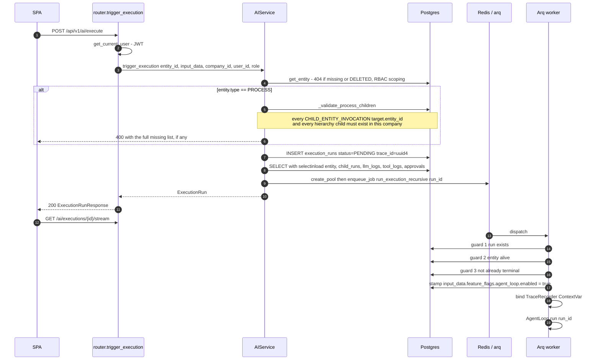
```mermaid
sequenceDiagram
    autonumber
    participant UI as SPA
    participant API as router.trigger_execution
    participant SVC as AIService
    participant PG as Postgres
    participant RQ as Redis / arq
    participant W as Arq worker

    UI->>API: POST /api/v1/ai/execute
    API->>API: get_current_user - JWT
    API->>SVC: trigger_execution entity_id, input_data, company_id, user_id, role
    SVC->>PG: get_entity - 404 if missing or DELETED, RBAC scoping
    alt entity.type == PROCESS
        SVC->>PG: _validate_process_children
        Note over SVC,PG: every CHILD_ENTITY_INVOCATION target.entity_id<br/>and every hierarchy child must exist in this company
        SVC-->>UI: 400 with the full missing list, if any
    end
    SVC->>PG: INSERT execution_runs status=PENDING trace_id=uuid4
    SVC->>PG: SELECT with selectinload entity, child_runs, llm_logs, tool_logs, approvals
    SVC->>RQ: create_pool then enqueue_job run_execution_recursive run_id
    SVC-->>API: ExecutionRun
    API-->>UI: 200 ExecutionRunResponse
    UI->>API: GET /ai/executions/{id}/stream
    RQ->>W: dispatch
    W->>PG: guard 1 run exists
    W->>PG: guard 2 entity alive
    W->>PG: guard 3 not already terminal
    W->>PG: stamp input_data.feature_flags.agent_loop.enabled = true
    W->>W: bind TraceRecorder ContextVar
    W->>W: AgentLoop.run run_id
```

Note what is **not** validated: `input_data` against `io_contract.input_schema`;
entity `status` (a `DRAFT` or `ARCHIVED` entity runs happily); credit balance
(that is checked later, per step and before each child spawn).

### The `ExecutionRun` row

[orm/execution.py:37](../../backend/src/ai/orm/execution.py:37).

| Column | Set when | Meaning |
|--------|----------|---------|
| `id` | insert | Run identity; the SSE channel is `execution:{id}`. |
| `entity_id` | insert | What is being run. |
| `parent_run_id` | insert (children, retries, refines) | Tree edge. |
| `company_id` / `user_id` | insert | Tenant + actor. |
| `status` | insert `PENDING`, then by the loop | See the state machine below. |
| `input_data` | insert | The request payload, plus `feature_flags` stamped by the worker, plus `__reuse_outputs__` / `__skip_steps__` / `__refinement_feedback__` on a refine. |
| `dynamic_plan` | planner | The reconciled plan. |
| `result_data` | `_persist_final` | `{"output": str[:8000], "steps": [...]}`. |
| `context_state` | loop | Sanitized step outputs; also holds `__agent_state_snapshot__` while suspended. |
| `error_message` | `_persist_final` | Truncated to 1000 chars. |
| `total_cost_usd` | `_bump_run_cost`, `_persist_final` | Internal cost, `Numeric(10,4)`. |
| `billed_amount` | `settle_billing` | Customer-facing charge, `Numeric(14,6)`. |
| `total_tokens` | `_bump_run_cost`, `_persist_final` | Rolled up over the subtree. |
| `execution_time_ms` | — | **Never written by the loop path.** Compute from `completed_at - started_at`. |
| `trace_id` | insert (`uuid4()`); children inherit the parent's | Groups a whole run tree. |
| `span_id` | — | **Never written.** Spans live in `execution_trace_events`. |
| `idempotency_key` | — | **Dead column.** Indexed, commented "Step-level dedup", zero readers or writers repo-wide. Same for `ToolInteractionLog.idempotency_key`. |
| `started_at` / `completed_at` / `created_at` | loop / insert | — |
| `csat_score` / `csat_comment` | `POST /executions/{id}/csat` | ±1 thumbs, feeds critic calibration. |

**Idempotency in practice** is not the column — it is the third dispatch guard:

```python
# backend/src/ai/core/arq_jobs.py
        if str(guard_run.status) in _TERMINAL:
            logger.warning(
                "[dispatch] run %s already terminal (status=%s) — skipping "
                "re-dispatch to avoid re-billing an already-settled run",
                run_id, guard_run.status,
            )
            await redis_pool.close()
            return
```

arq retries a failed job up to 5 times; without this guard a retry would
re-run and **re-bill** a settled run. Retry and refine sidestep it by creating
*new* run rows.

### Run status machine

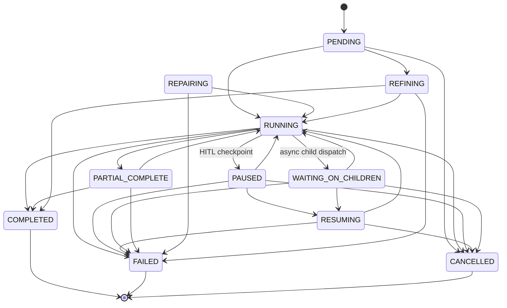
```mermaid
stateDiagram-v2
    [*] --> PENDING
    PENDING --> RUNNING
    PENDING --> REFINING
    PENDING --> CANCELLED
    RUNNING --> PAUSED: HITL checkpoint
    RUNNING --> WAITING_ON_CHILDREN: async child dispatch
    RUNNING --> COMPLETED
    RUNNING --> FAILED
    RUNNING --> PARTIAL_COMPLETE
    RUNNING --> CANCELLED
    PAUSED --> RUNNING
    PAUSED --> RESUMING
    PAUSED --> FAILED
    PAUSED --> CANCELLED
    RESUMING --> RUNNING
    RESUMING --> FAILED
    RESUMING --> CANCELLED
    WAITING_ON_CHILDREN --> RESUMING
    WAITING_ON_CHILDREN --> RUNNING
    WAITING_ON_CHILDREN --> FAILED
    WAITING_ON_CHILDREN --> CANCELLED
    PARTIAL_COMPLETE --> RUNNING
    PARTIAL_COMPLETE --> COMPLETED
    PARTIAL_COMPLETE --> FAILED
    REPAIRING --> RUNNING
    REPAIRING --> FAILED
    REFINING --> RUNNING
    REFINING --> COMPLETED
    REFINING --> FAILED
    COMPLETED --> [*]
    FAILED --> [*]
    CANCELLED --> [*]
```

Defined as `VALID_TRANSITIONS` at
[enums.py:49](../../backend/src/ai/schemas/enums.py:49).
[`validate_transition`](../../backend/src/ai/schemas/enums.py:64) is **lenient**
— an illegal transition logs a warning and returns `False`; it does not block.

### Retry, refine, cancel

| Operation | Creates a new run? | Key mechanism |
|-----------|:------------------:|---------------|
| `POST /executions/{id}/retry` | ✅ `parent_run_id = old.id` | Copies `input_data` + `context_state` forward so completed step keys are skipped; carries `__cortex_tree_id__` so the CORTEX tree is resumed, not recreated. Requires `FAILED` or `COMPLETED` ([service.py:549](../../backend/src/ai/service.py:549)). |
| `POST /executions/{id}/refine` | ✅ `parent_run_id = old.id` | An LLM reads the user feedback plus the step list and returns which `step_id`s must re-run; downstream dependents cascade in; the rest are passed as `__skip_steps__` + `__reuse_outputs__`. Requires `COMPLETED` ([service.py:617](../../backend/src/ai/service.py:617)). |
| `POST /executions/{id}/cancel` | ❌ | Flips status to `CANCELLED`, publishes `{"type":"cancelled","status":"CANCELLED"}` so the SSE stream closes. The loop re-reads status at the top of each iteration and aborts. No-op on an already-terminal run ([service.py:492](../../backend/src/ai/service.py:492)). |

> Retry/refine set `parent_run_id` to the *previous run of the same entity*,
> not to a structural parent. So `parent_run_id` overloads two meanings, and a
> retry chain shows up in `GET /executions/{id}` as nested `child_runs`.

---

## 6. Step execution

Two files share the work:

| File | Responsibility |
|------|----------------|
| [`core/step_engine.py`](../../backend/src/ai/core/step_engine.py) | The **wrapper**: DAG scheduling, cost cap, HITL gates, timeout, GoalGuard re-execution, writing the output into context. |
| [`step_executor.py`](../../backend/src/ai/step_executor.py) | The **body**: per-step-type handlers, prompt assembly, LLM dispatch, tool healing, cost logging. |

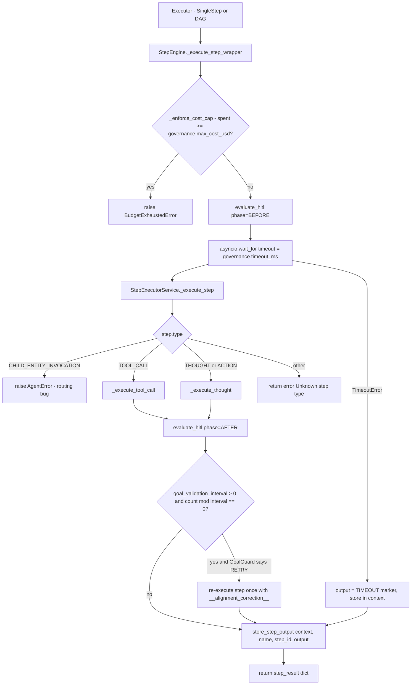
```mermaid
flowchart TD
    START["Executor - SingleStep or DAG"] --> WRAP["StepEngine._execute_step_wrapper"]
    WRAP --> CAP{"_enforce_cost_cap - spent >= governance.max_cost_usd?"}
    CAP -- yes --> RAISE["raise BudgetExhaustedError"]
    CAP -- no --> HITLB["evaluate_hitl phase=BEFORE"]
    HITLB --> TO["asyncio.wait_for timeout = governance.timeout_ms"]
    TO --> DISPATCH["StepExecutorService._execute_step"]
    DISPATCH --> T1{"step.type"}
    T1 -- CHILD_ENTITY_INVOCATION --> ERR["raise AgentError - routing bug"]
    T1 -- TOOL_CALL --> TC["_execute_tool_call"]
    T1 -- THOUGHT or ACTION --> TH["_execute_thought"]
    T1 -- other --> UNK["return error Unknown step type"]
    TO -- TimeoutError --> TOUT["output = TIMEOUT marker, store in context"]
    TC & TH --> HITLA["evaluate_hitl phase=AFTER"]
    HITLA --> GG{"goal_validation_interval > 0 and count mod interval == 0?"}
    GG -- yes and GoalGuard says RETRY --> RE["re-execute step once with __alignment_correction__"]
    GG -- no --> STORE
    RE --> STORE["store_step_output context, name, step_id, output"]
    TOUT --> STORE
    STORE --> RET["return step_result dict"]
```

### The DAG scheduler

[`_execute_steps_dag`](../../backend/src/ai/core/step_engine.py:76) builds a
dependency graph from **two** sources:

1. explicit `target.input_dependencies`;
2. **implicit** `{{step_id}}` references scraped out of `prompt_template`
   ([step_engine.py:103-107](../../backend/src/ai/core/step_engine.py:103)) —
   any `{{x}}` where `x` (before the first `.`) is another step's id becomes an
   edge.

Steps already present in `context_state` start out `completed` (that is how
retry skips work). Then it loops: collect `ready` steps whose deps are all
satisfied; if exactly one, run it inline; if several, run them **concurrently,
each in its own `AsyncSessionLocal` with a deep-copied context**. If nothing is
ready and steps remain, it logs a circular-dependency warning and finishes the
remainder sequentially.

Two hard-won details are worth reading in the source:

- **Cost accounting under parallelism.** Each isolated session folds its spend
  into the run row with an atomic `SET total_cost_usd = total_cost_usd + :delta`
  ([`_bump_run_cost`](../../backend/src/ai/step_executor.py:65)). An in-place
  ORM `+=` would flush an absolute full-row UPDATE and the last writer would
  wipe every other branch's cost — the Phase-11 leak where a ~$6 run settled at
  ~$0.88.
- **Dependency-failure short-circuit.** Before running a single-ready step, the
  engine checks whether any `{{step_N}}` it needs resolved to a `[FAILED]` /
  `[TOOL_EMPTY]` marker and, if so, skips the step with a
  `[DEPENDENCY_FAILED]` output "to prevent hallucination"
  ([step_engine.py:152-166](../../backend/src/ai/core/step_engine.py:152)).

### How inputs resolve from prior outputs

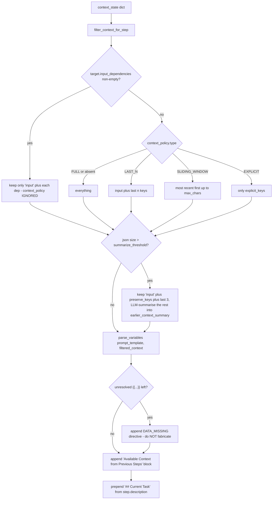
```mermaid
flowchart TD
    CTX["context_state dict"] --> FILT["filter_context_for_step"]
    FILT --> D{"target.input_dependencies non-empty?"}
    D -- yes --> ONLY["keep only 'input' plus each dep - context_policy IGNORED"]
    D -- no --> POL{"context_policy.type"}
    POL -- FULL or absent --> ALL["everything"]
    POL -- LAST_N --> LASTN["input plus last n keys"]
    POL -- SLIDING_WINDOW --> SW["most recent first up to max_chars"]
    POL -- EXPLICIT --> EXP["only explicit_keys"]
    ONLY & ALL & LASTN & SW & EXP --> SUM{"json size > summarize_threshold?"}
    SUM -- yes --> TRIM["keep 'input' plus preserve_keys plus last 3, LLM-summarise the rest into earlier_context_summary"]
    SUM -- no --> PV
    TRIM --> PV["parse_variables prompt_template, filtered_context"]
    PV --> UNRES{"unresolved {{...}} left?"}
    UNRES -- yes --> WARN["append DATA_MISSING directive - do NOT fabricate"]
    UNRES -- no --> ENRICH
    WARN --> ENRICH["append 'Available Context from Previous Steps' block"]
    ENRICH --> TASK["prepend '## Current Task' from step.description"]
```

[`parse_variables`](../../backend/src/ai/core/prompt_utils.py:15) does two
passes: `{{var}}` first, then bare `{var}` (skipping anything that looks like
JSON). It supports dotted paths, and has a special case: `{{step_1.output}}`
resolves to the plain string stored at `step_1`, because context stores the
output *directly*, not wrapped in `{"output": …}`.

### Output storage — every output is written under **two** keys

```python
# backend/src/ai/core/context_utils.py
def store_step_output(context_state, step_name, step_id, output, cortex_bridge=None):
    value = output
    old_value = context_state.get(step_name, "")
    context_state[step_name] = value
    ...
    if step_id and step_id != step_name:
        old_id_value = context_state.get(step_id, "")
        context_state[step_id] = value
```

So a step named `"Fetch Raw Data"` with `step_id="step_1"` writes **both**
`context["Fetch Raw Data"]` and `context["step_1"]`. That is why plan templates
can write `{{step_1}}` or `{{Research Phase}}` interchangeably. It also means
context keys collide across steps with the same name, and the size doubles.

Before persistence,
[`sanitize_context_for_persistence`](../../backend/src/ai/core/context_utils.py:50)
drops any key whose lowercase name contains `api_key`, `secret`, `token`,
`password`, `auth`, `credential`, `__model_override`, or `__redis__`.

### `__completed_steps__` and how step completion is really tracked

`__completed_steps__` is a member of
[`INTERNAL_CONTEXT_KEYS`](../../backend/src/ai/constants.py:44) and is
documented in [core/INTERNAL_KEYS.md:33](../../backend/src/ai/core/INTERNAL_KEYS.md:33)
as *"written by `step_executor.store_step_output`, consumed by
`PlannerService.adapt_plan`"*.

> **That is stale.** Grep the repo: the only two live references to
> `__completed_steps__` are the constants set itself and the line in
> `create_child_run` that **strips** it from a child's context
> ([step_executor.py:219](../../backend/src/ai/step_executor.py:219)). Nothing
> writes it any more.

The real mechanism is `AgentState.completed_step_ids: set[str]`
([agent_state.py:205](../../backend/src/ai/core/agent_state.py:205)):

| Step | Code |
|------|------|
| Executor reports which step ids finished | `ActionResult.completed_step_ids` ([executors/base.py:48](../../backend/src/ai/core/executors/base.py:48)) |
| Loop folds them in | `state.mark_step_complete(sid)` + `record_step_result(...)` ([agent_loop.py:574](../../backend/src/ai/core/agent_loop.py:574)) |
| Strategist reads them | `plan_ready_steps()` — a step is ready when its id is not completed **and** every `input_dependencies` entry is ([agent_state.py:314](../../backend/src/ai/core/agent_state.py:314)) |
| Survives suspend/resume | Serialized in `AgentState.snapshot()` ([agent_state.py:412](../../backend/src/ai/core/agent_state.py:412)) |

> **Observed gap:** `DAGExecutor` builds `completed_step_ids` from
> `r.get("step_id")` on each step result
> ([executors/dag.py:79](../../backend/src/ai/core/executors/dag.py:79)), but
> the happy-path step handlers return `{"step": name, "output": ...}` with **no
> `step_id`** ([step_executor.py:524](../../backend/src/ai/step_executor.py:524),
> [:1059](../../backend/src/ai/step_executor.py:1059)). Only the timeout branch
> includes one. So a parallel DAG batch appears to report zero completed steps
> to the loop. `SingleStepExecutor` does not have this problem — it derives the
> id from the step object itself
> ([single_step.py:113](../../backend/src/ai/core/executors/single_step.py:113)).

### Error handling and retries at the step level

| Failure | Where caught | Result written into context |
|---------|--------------|-----------------------------|
| Step exceeds `governance.timeout_ms` | [step_engine.py:319](../../backend/src/ai/core/step_engine.py:319) | `[TIMEOUT] Step 'x' exceeded Nms` and `[ERROR] Timeout after Nms` |
| Cost cap reached before the step | [step_engine.py:269](../../backend/src/ai/core/step_engine.py:269) | `BudgetExhaustedError` propagates; run aborts |
| LLM signals uncertainty | `UncertaintySignal` at [step_engine.py:329](../../backend/src/ai/core/step_engine.py:329) | `[Clarification needed] …`, `needs_clarification=True` |
| Any exception inside `_execute_tool_call` | [step_executor.py:525](../../backend/src/ai/step_executor.py:525) | `{"error": str(e), "success": false}` |
| Upstream dependency failed | [step_engine.py:157](../../backend/src/ai/core/step_engine.py:157) | `[DEPENDENCY_FAILED] …` and the step is skipped |
| Parallel batch member raised | [step_engine.py:220](../../backend/src/ai/core/step_engine.py:220) | `[FAILED] <exc>`; **all** results are recorded first, then the first exception is re-raised |
| Tool returned nothing after all healing | [step_executor.py:420](../../backend/src/ai/step_executor.py:420) | `[TOOL_EMPTY] …` |

These bracket markers are a real interface: they are matched by the
dependency check, by
[`FailurePatternService`](../../backend/src/ai/failure_pattern_service.py:31),
and by the prompt enricher, which renders failed context entries with a
distinct heading so the LLM sees the difference
([step_executor.py:831-834](../../backend/src/ai/step_executor.py:831)).

`FailurePatternService.get_failure_patterns(entity_id)` scans the last 20
`FAILED`/`PARTIAL_COMPLETE` runs of an entity in a 30-day window and classifies
them into: `TOOL_EMPTY`, `TIMEOUT`, `FORMAT_ERROR`, `API_ERROR`,
`SCRAPER_BLOCKED`, `DEPENDENCY_FAILED`, `DATA_MISSING` — each with a fixed
remediation suggestion, returned as prompt-injectable warnings.

### Step-level retries

There is no per-step retry loop in `step_executor`. Retries come from three
distinct mechanisms:

| Mechanism | Scope | Bound |
|-----------|-------|-------|
| Tool reformat + fallback chain (§7) | Inside one `TOOL_CALL` | 1 reformat, then 1 fallback tool |
| GoalGuard re-execution | One step, once, guarded by `__retry_{step_id}__` | 1 ([step_engine.py:374](../../backend/src/ai/core/step_engine.py:374)) |
| Loop corrective retry queue | One step across iterations | `MAX_RETRIES_PER_STEP = 2`; **never** applied to a `ChildEntity` move ([agent_loop.py:645](../../backend/src/ai/core/agent_loop.py:645)) |

---

## 7. Tool invocation plumbing

[`ToolExecutor`](../../backend/src/ai/tool_executor.py:62) is a **stateless
static class**. It has two entry points, both returning `List[ToolResult]`.

| Entry point | Called from | Input shape |
|-------------|-------------|-------------|
| [`execute_tools`](../../backend/src/ai/tool_executor.py:217) | `_execute_tool_call` (deterministic `TOOL_CALL` steps) | `[{"tool": id, "input": str}]` |
| [`execute_from_function_calls`](../../backend/src/ai/tool_executor.py:66) | the REACT loop's `_execute_tools` closure | `[{"name": id, "args": {...}}]` |

`ToolResult` ([tool_executor.py:39](../../backend/src/ai/tool_executor.py:39)):
`{tool, args, output, success, latency_ms, error, skipped, skip_reason, timestamp}`.

### Dispatch and argument handling

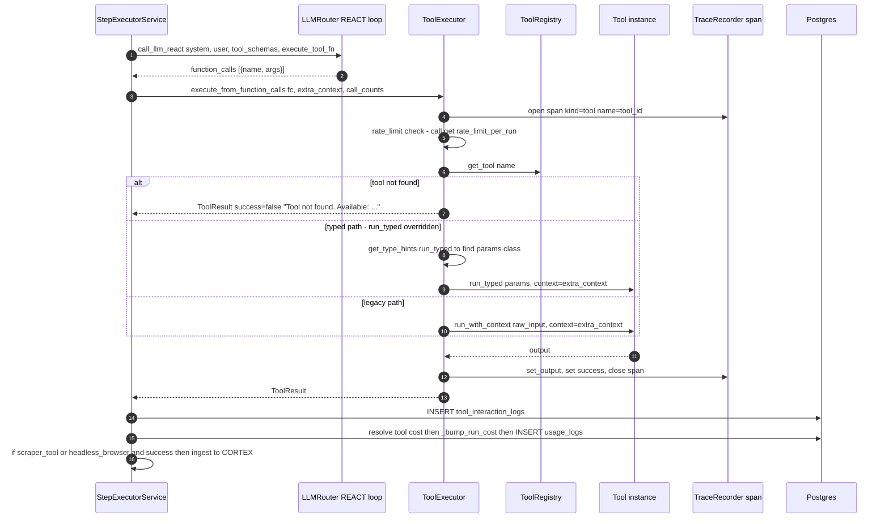
```mermaid
sequenceDiagram
    autonumber
    participant SE as StepExecutorService
    participant LR as LLMRouter REACT loop
    participant TX as ToolExecutor
    participant TR as ToolRegistry
    participant TL as Tool instance
    participant SP as TraceRecorder span
    participant DB as Postgres

    SE->>LR: call_llm_react system, user, tool_schemas, execute_tool_fn
    LR-->>SE: function_calls [{name, args}]
    SE->>TX: execute_from_function_calls fc, extra_context, call_counts
    TX->>SP: open span kind=tool name=tool_id
    TX->>TX: rate_limit check - call.get rate_limit_per_run
    TX->>TR: get_tool name
    alt tool not found
        TX-->>SE: ToolResult success=false "Tool not found. Available: ..."
    else typed path - run_typed overridden
        TX->>TX: get_type_hints run_typed to find params class
        TX->>TL: run_typed params, context=extra_context
    else legacy path
        TX->>TL: run_with_context raw_input, context=extra_context
    end
    TL-->>TX: output
    TX->>SP: set_output, set success, close span
    TX-->>SE: ToolResult
    SE->>DB: INSERT tool_interaction_logs
    SE->>DB: resolve tool cost then _bump_run_cost then INSERT usage_logs
    SE->>SE: if scraper_tool or headless_browser and success then ingest to CORTEX
```

Argument marshalling has two lanes:

1. **Typed lane** — if the tool overrode `run_typed`, `ToolExecutor`
   introspects the method's type hints to find the params dataclass, strips
   `company_id`/`user_id` from the args, constructs it, and — if `run_typed`
   accepts a `context` parameter — forwards `extra_context`. Critical for tools
   like `web_search` that resolve API keys per tenant
   ([tool_executor.py:136-143](../../backend/src/ai/tool_executor.py:136)).
2. **Legacy lane** — a single raw string: `args["input"]` if present, else the
   args JSON-dumped, passed to `run_with_context`. Any failure in the typed
   lane silently falls through here
   ([tool_executor.py:154](../../backend/src/ai/tool_executor.py:154)).

`extra_context` always carries `{company_id, user_id, run_id, agent_id}`
([step_executor.py:300](../../backend/src/ai/step_executor.py:300),
[:852](../../backend/src/ai/step_executor.py:852)) — this is how a tool learns
which run it belongs to, and it is why `document_save` can attach its artifact
to the run.

### Per-run tool budgets — the honest version

`call_counts` is a mutable `Dict[str, int]` the caller threads through so a
tool's usage can be capped:

```python
# backend/src/ai/tool_executor.py
            rate_limit = call.get("rate_limit_per_run")
            # P3.3 — Enforce per-run rate limit
            if rate_limit is not None:
                current_count = call_counts.get(tool_name, 0)
                if current_count >= rate_limit:
                    return ToolResult(..., skipped=True, skip_reason=...)
```

Three things break this in the current code:

1. `rate_limit_per_run` must arrive **inside the function-call dict**. The only
   producer of those dicts is the LLM adapter, which emits `{"name", "args"}`.
   No call site injects `rate_limit_per_run`. So the branch never fires.
2. `rate_limit_per_run` lives on `ToolDefinition`, but `Capabilities.tools` is
   typed `List[ToolReference]` — the field cannot even be authored via the API.
3. The counter is wiped at the start of **every** step:
   `context['tool_call_counts'] = {}` — "Always reset per step to prevent stale
   counts on retry/resume" ([step_executor.py:859](../../backend/src/ai/step_executor.py:859)).
   So even if 1 and 2 were fixed, the budget would be per-step, not per-run.

`governance.execution_limits.max_tool_calls` reads that same dict to render a
"Tool calls remaining" prompt line — it is a **nudge**, not a limit. The real
ceilings are `MAX_REACT_TURNS = 12`
([constants.py:63](../../backend/src/ai/constants.py:63)), the per-step
`timeout_ms`, and `governance.max_cost_usd`.

### Timeouts

There is no per-tool timeout. `ToolDefinition.max_execution_seconds` (30) is
unreachable config. What bounds a tool call is the enclosing step's
`asyncio.wait_for(..., timeout_ms/1000)` and whatever internal timeout the tool
itself implements.

### Failure classification and self-healing

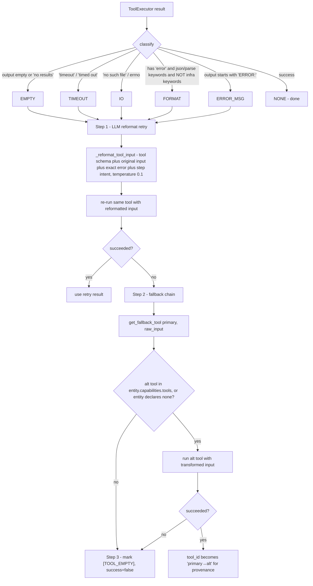
```mermaid
flowchart TD
    RUN["ToolExecutor result"] --> CLS{"classify"}
    CLS -- output empty or 'no results' --> EMPTY["EMPTY"]
    CLS -- 'timeout' / 'timed out' --> TMO["TIMEOUT"]
    CLS -- 'no such file' / errno --> IOK["IO"]
    CLS -- has 'error' and json/parse keywords and NOT infra keywords --> FMT["FORMAT"]
    CLS -- output starts with 'ERROR:' --> EMSG["ERROR_MSG"]
    CLS -- success --> OK["NONE - done"]
    EMPTY & TMO & IOK & FMT & EMSG --> S1["Step 1 - LLM reformat retry"]
    S1 --> RF["_reformat_tool_input - tool schema plus original input plus exact error plus step intent, temperature 0.1"]
    RF --> RETRY["re-run same tool with reformatted input"]
    RETRY --> OK2{"succeeded?"}
    OK2 -- yes --> DONE["use retry result"]
    OK2 -- no --> S2["Step 2 - fallback chain"]
    S2 --> FB["get_fallback_tool primary, raw_input"]
    FB --> GATE{"alt tool in entity.capabilities.tools, or entity declares none?"}
    GATE -- no --> S3
    GATE -- yes --> ALT["run alt tool with transformed input"]
    ALT --> OK3{"succeeded?"}
    OK3 -- yes --> PROV["tool_id becomes 'primary→alt' for provenance"]
    OK3 -- no --> S3["Step 3 - mark [TOOL_EMPTY], success=false"]
```

The `_INFRA_KEYWORDS` exclusion matters: `api key`, `not configured`,
`timeout`, `connection`, `unauthorized`, `403`, `401`, `rate limit` are
explicitly **not** treated as format errors, because reformatting cannot fix
them ([step_executor.py:534](../../backend/src/ai/step_executor.py:534)).

The reformat call is billed: it writes an `LLMInteractionLog` with
`reasoning_mode="REFORMAT"` and logs usage
([step_executor.py:597-610](../../backend/src/ai/step_executor.py:597)).

#### Fallback chains ([tool_fallback.py:26](../../backend/src/ai/tool_fallback.py:26))

| Primary | Alternative | Input transform |
|---------|-------------|-----------------|
| `web_search` | `headless_browser` | query → `{"url": "https://www.google.com/search?q=…", "action": "extract_text", "wait_for": "body"}` |
| `batch_web_search` | `web_search` | first query of the batch |
| `scraper_tool` | `headless_browser` | url → browser navigation payload |
| `headless_browser` | `scraper_tool` | extract the bare url |

`get_fallback_tool` returns the **first** alternative only; there is no chain
walk beyond one hop.

#### Two implementations of the same ladder

The logic above exists twice:

| Path | Implementation | Enabled by |
|------|----------------|------------|
| Direct `TOOL_CALL` steps | Inline in [`_execute_tool_call`](../../backend/src/ai/step_executor.py:310) | always |
| REACT / AFC tool calls | [`ToolResilience`](../../backend/src/ai/tools/resilience.py:124) | feature flag `tools.resilience_v2_enabled` ([step_executor.py:870](../../backend/src/ai/step_executor.py:870)) |

`ToolResilience` is the extracted, testable version
([`classify_tool_failure`](../../backend/src/ai/tools/resilience.py:62) returns
a `FailureKind` enum). With the flag off, REACT tool calls get **no** healing —
they go straight to `ToolExecutor.execute_from_function_calls`.

> **Tenant scoping gap:** `ToolExecutor.get_tool_schemas` calls
> `ToolRegistry.get_all_schemas()` and `execute_from_function_calls` calls
> `ToolRegistry.get_tool(name)` — both **without** `company_id`, even though
> both registry methods accept one
> ([tools/base.py:176](../../backend/src/ai/tools/base.py:176),
> [:243](../../backend/src/ai/tools/base.py:243)). Tenant-registered tools are
> therefore invisible to entity execution. See [09 — Tools](09-tools.md).

---

## 8. Parent and child runs

A `CHILD_ENTITY_INVOCATION` step does **not** run inline. It creates a whole new
`ExecutionRun` and dispatches it as its own arq job; the parent suspends.

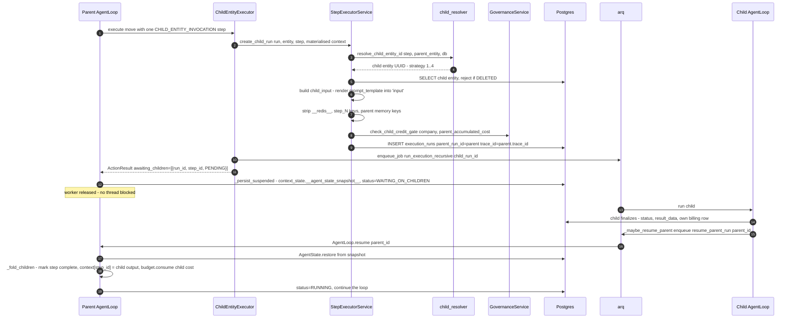
```mermaid
sequenceDiagram
    autonumber
    participant PL as Parent AgentLoop
    participant CE as ChildEntityExecutor
    participant SX as StepExecutorService
    participant CR as child_resolver
    participant GOV as GovernanceService
    participant PG as Postgres
    participant RQ as arq
    participant CL as Child AgentLoop

    PL->>CE: execute move with one CHILD_ENTITY_INVOCATION step
    CE->>SX: create_child_run run, entity, step, materialised context
    SX->>CR: resolve_child_entity_id step, parent_entity, db
    CR-->>SX: child entity UUID - strategy 1..4
    SX->>PG: SELECT child entity, reject if DELETED
    SX->>SX: build child_input - render prompt_template into 'input'
    SX->>SX: strip __redis__, step_N keys, parent memory keys
    SX->>GOV: check_child_credit_gate company, parent_accumulated_cost
    SX->>PG: INSERT execution_runs parent_run_id=parent trace_id=parent.trace_id
    CE->>RQ: enqueue_job run_execution_recursive child_run_id
    CE-->>PL: ActionResult awaiting_children=[{run_id, step_id, PENDING}]
    PL->>PG: _persist_suspended - context_state.__agent_state_snapshot__, status=WAITING_ON_CHILDREN
    Note over PL: worker released - no thread blocked
    RQ->>CL: run child
    CL->>PG: child finalizes - status, result_data, own billing row
    CL->>RQ: _maybe_resume_parent enqueue resume_parent_run parent_id
    RQ->>PL: AgentLoop.resume parent_id
    PL->>PG: AgentState.restore from snapshot
    PL->>PL: _fold_children - mark step complete, context[step_id] = child output, budget.consume child cost
    PL->>PG: status=RUNNING, continue the loop
```

### What the child inherits and what is stripped

`create_child_run` ([step_executor.py:124](../../backend/src/ai/step_executor.py:124))
starts from a copy of the parent context and then edits it hard:

| Action | Keys | Why |
|--------|------|-----|
| Drop | `__redis__` | Live client, not JSON-serializable — would poison the INSERT. |
| Propagate | `cortex_tree_id` from `__cortex_tree_id__` | Parent and children share one CORTEX tree. |
| Override | `input` | Set to the **rendered** `prompt_template`, so the child's `{{input}}` is the real upstream data, not the original topic string. |
| Strip | every `step_N` key (regex `^step_\d+$`) | Otherwise the child's own `step_1` looks already-completed and gets skipped. |
| Strip | `__memory__`, `__episodic_memory__`, `__semantic_context__`, `__memory_context__`, `__context_sources__`, `__completed_steps__`, `__goal_check_counter__` | Parent episodic history made child agents replay past actions instead of doing the current task. |

Inherited on the row: `company_id`, `user_id`, `parent_run_id`,
**`trace_id` (the parent's)**. Not inherited: budget — the child gets its own
from its own entity's governance.

### Resolving `entity_id` — four strategies

[`resolve_child_entity_id`](../../backend/src/ai/planning/child_resolver.py:57),
in order, emitting `agent.child_resolver.fallback` with the strategy index:

| # | Strategy | Source |
|---|----------|--------|
| 1 | UUID passthrough | `step.target.entity_id` parses as a UUID |
| 2 | Static-plan name match | a `CHILD_ENTITY_INVOCATION` step in the parent's `static_plan` whose `name` matches (exact, then substring) |
| 3 | Hierarchy index match | the *N*th invocation step ↔ `hierarchy.children[N].child_id` |
| 4 | `entity_name_hint` DB lookup | `SELECT … WHERE name = hint AND status != 'DELETED'` |

A total miss raises `EntityNotFoundError`, which `create_child_run` converts to
`AgentError("Child invocation missing entity_id for step …")`.

> **Security note:** Strategy 4 does **not** filter by `company_id`
> ([child_resolver.py:120-125](../../backend/src/ai/planning/child_resolver.py:120)).
> A planner-emitted name that matches another tenant's entity would resolve
> cross-tenant. Every other path is company-scoped.

### Recursion depth

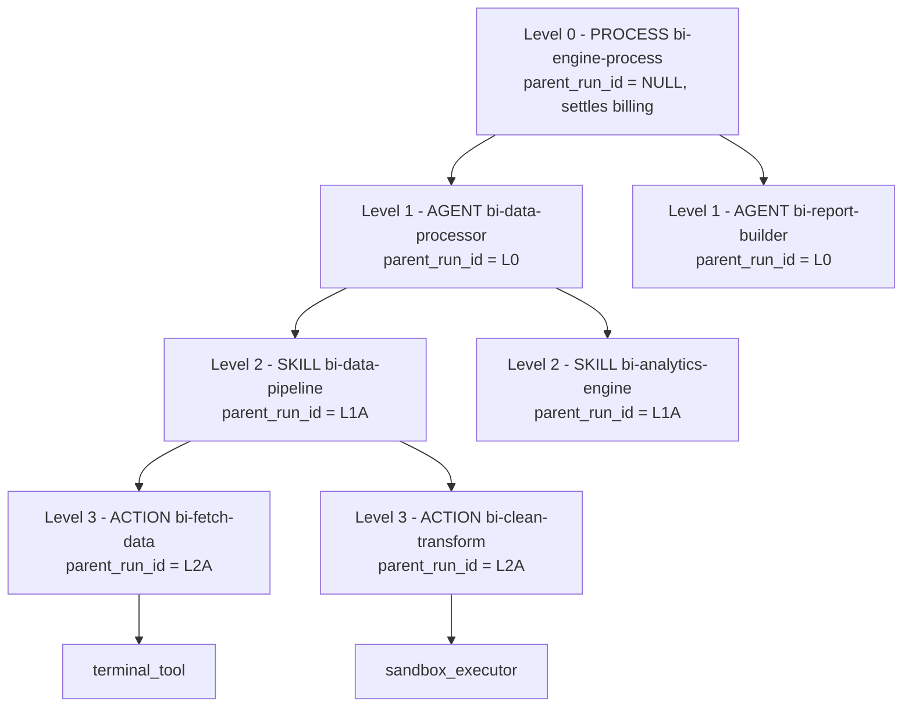
```mermaid
flowchart TD
    L0["Level 0 - PROCESS bi-engine-process<br/>parent_run_id = NULL, settles billing"] --> L1A["Level 1 - AGENT bi-data-processor<br/>parent_run_id = L0"]
    L0 --> L1B["Level 1 - AGENT bi-report-builder<br/>parent_run_id = L0"]
    L1A --> L2A["Level 2 - SKILL bi-data-pipeline<br/>parent_run_id = L1A"]
    L1A --> L2B["Level 2 - SKILL bi-analytics-engine<br/>parent_run_id = L1A"]
    L2A --> L3A["Level 3 - ACTION bi-fetch-data<br/>parent_run_id = L2A"]
    L2A --> L3B["Level 3 - ACTION bi-clean-transform<br/>parent_run_id = L2A"]
    L3A --> TOOL["terminal_tool"]
    L3B --> SBX["sandbox_executor"]
```

All eight runs share one `trace_id`. Each has its own `total_cost_usd` and its
own `AgentLoop`. Only L0 calls `settle_billing` — `_settle_billing` returns
early when `parent_run_id` is set
([agent_loop.py:1144](../../backend/src/ai/core/agent_loop.py:1144)).

**Depth is not enforced.** `governance.max_recursion_depth` has no runtime
reader (grep: only `step_executor.py:681` for the prompt line and the meta
schema validator). What actually bounds recursion:

| Guard | Value | Where |
|-------|-------|-------|
| Credit gate before each child spawn | wallet balance minus parent accumulated cost | [governance_service.py:120](../../backend/src/ai/governance/governance_service.py:120) |
| Cost cap per run | `governance.max_cost_usd` | [step_engine.py:237](../../backend/src/ai/core/step_engine.py:237) |
| Loop hard iteration cap | `max_iterations`, default 50 | [agent_loop.py:366](../../backend/src/ai/core/agent_loop.py:366) |
| Concurrent-children cap | `max_concurrent_children`, default 8 | [child_entity.py:48](../../backend/src/ai/core/executors/child_entity.py:48) — **advisory only**; the code logs and dispatches anyway ([child_entity.py:108-114](../../backend/src/ai/core/executors/child_entity.py:108)) |
| Depth | *nothing* | — |

A self-referential entity (a PROCESS whose plan invokes itself) will recurse
until credits or the cost cap stop it.

### Result flow-back

[`_fold_children`](../../backend/src/ai/core/agent_loop.py:312) on resume:

```python
# backend/src/ai/core/agent_loop.py
            output = ""
            if child_run.result_data:
                output = str(child_run.result_data.get("output", "") or child_run.result_data)
            if step_id:
                state.mark_step_complete(step_id)
                state.context_state[step_id] = output
                record_child_step_result(state, step_id, output, child.get("run_id"))
            # Fold child cost into the parent budget (child billed its own row).
            state.budget.consume(usd=Decimal(str(child_run.total_cost_usd or 0)),
                                 tokens=int(child_run.total_tokens or 0))
```

If **any** child is `FAILED` or `CANCELLED`, the parent sets `done = True` and
`next_decision = "ABORT"` ([agent_loop.py:302](../../backend/src/ai/core/agent_loop.py:302)).
`resume_parent_run` is idempotent — it no-ops when the parent is not
`WAITING_ON_CHILDREN`, so duplicate enqueues are harmless
([arq_jobs.py:701](../../backend/src/ai/core/arq_jobs.py:701)).

> Note `_fold_children` writes only `context_state[step_id]`, not
> `context_state[step_name]` — unlike `store_step_output`. A template that
> refers to a child step by *name* rather than id will not resolve after a
> resume.

---

## 9. Results and artifacts

### `result_data`

Written once, at `_persist_final`
([agent_loop.py:1118](../../backend/src/ai/core/agent_loop.py:1118)):

```json
{
  "output": "<final output string, truncated to 8000 chars>",
  "steps": [
    {"step": "Analyze & outline", "step_id": "outline", "type": "THOUGHT", "output": "…"},
    {"step": "Data Processing Phase", "step_id": "step_1", "type": "CHILD_ENTITY_INVOCATION",
     "output": "…", "child_run_id": "…uuid…"}
  ]
}
```

The `steps` shape is produced by
[step_results.py](../../backend/src/ai/core/step_results.py) and is a
**contract**: `AIService.refine_execution` reads `result_data["steps"]` to
decide which outputs can be reused. `_persist_final` will not overwrite a
`result_data` that is already set.

### Artifacts

Every file the platform touches becomes a row in `artifacts`
([artifact_models.py:25](../../backend/src/ai/artifact_models.py:25)) plus a
file on disk under `backend/artifact/`.

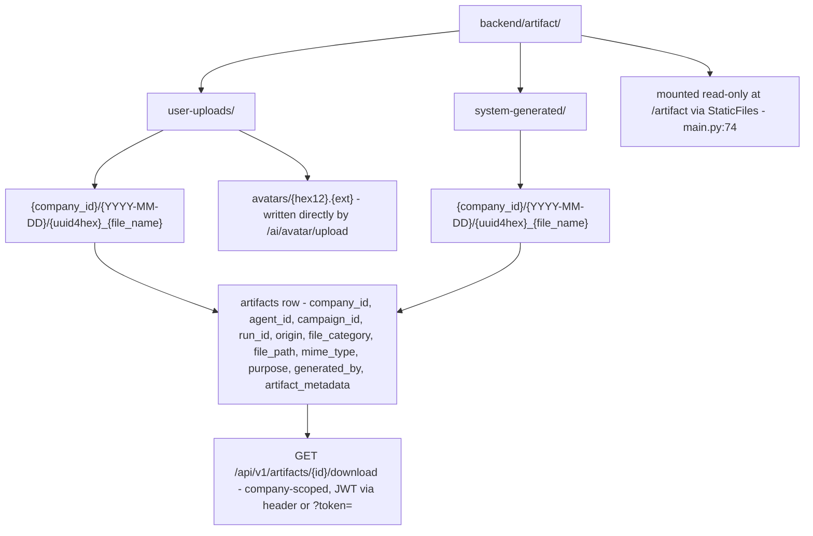
```mermaid
flowchart TD
    ROOT["backend/artifact/"] --> UU["user-uploads/"]
    ROOT --> SG["system-generated/"]
    UU --> UD["{company_id}/{YYYY-MM-DD}/{uuid4hex}_{file_name}"]
    UU --> AV["avatars/{hex12}.{ext} - written directly by /ai/avatar/upload"]
    SG --> SD["{company_id}/{YYYY-MM-DD}/{uuid4hex}_{file_name}"]
    UD & SD --> DB["artifacts row - company_id, agent_id, campaign_id, run_id, origin, file_category, file_path, mime_type, purpose, generated_by, artifact_metadata"]
    ROOT --> MOUNT["mounted read-only at /artifact via StaticFiles - main.py:74"]
    DB --> API["GET /api/v1/artifacts/{id}/download - company-scoped, JWT via header or ?token="]
```

| Concept | Value |
|---------|-------|
| `origin` | `user-uploads` \| `system-generated` ([artifact_service.py:29](../../backend/src/ai/artifact_service.py:29)) |
| `file_category` | `recordings` \| `images` \| `videos` \| `documents` \| `text` (validated only on `POST /artifacts/upload`) |
| Path convention | `artifact/{origin}/{company_id}/{YYYY-MM-DD}/{uuid4hex}_{name}` ([artifact_service.py:33](../../backend/src/ai/artifact_service.py:33)) |
| `run_id` | Nullable FK to `execution_runs` — the link the Execution Detail page *should* use |
| `file_path` | Absolute disk path **or** an `http(s)` URL (provider-hosted call recordings) |

`ArtifactService.save_artifact` writes the bytes and the row in one call
([artifact_service.py:49](../../backend/src/ai/artifact_service.py:49)).
`delete_artifact` unlinks the file and deletes the row.

### How a generated file reaches the user

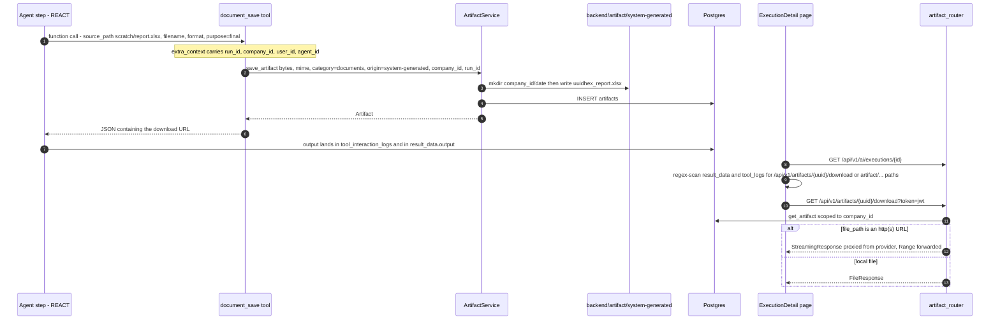
```mermaid
sequenceDiagram
    autonumber
    participant AG as Agent step - REACT
    participant TL as document_save tool
    participant AS as ArtifactService
    participant FS as backend/artifact/system-generated
    participant PG as Postgres
    participant UI as ExecutionDetail page
    participant AR as artifact_router

    AG->>TL: function call - source_path scratch/report.xlsx, filename, format, purpose=final
    Note over TL: extra_context carries run_id, company_id, user_id, agent_id
    TL->>AS: save_artifact bytes, mime, category=documents, origin=system-generated, company_id, run_id
    AS->>FS: mkdir company_id/date then write uuidhex_report.xlsx
    AS->>PG: INSERT artifacts
    AS-->>TL: Artifact
    TL-->>AG: JSON containing the download URL
    AG->>PG: output lands in tool_interaction_logs and in result_data.output
    UI->>AR: GET /api/v1/ai/executions/{id}
    UI->>UI: regex-scan result_data and tool_logs for /api/v1/artifacts/{uuid}/download or artifact/... paths
    UI->>AR: GET /api/v1/artifacts/{uuid}/download?token=jwt
    AR->>PG: get_artifact scoped to company_id
    alt file_path is an http(s) URL
        AR-->>UI: StreamingResponse proxied from provider, Range forwarded
    else local file
        AR-->>UI: FileResponse
    end
```

Two things to know:

1. **The frontend does not query artifacts by `run_id`.** `ExecutionDetail.tsx`
   *regex-scrapes* `result_data` and `tool_logs` for
   `/api/v1/artifacts/{uuid}/download` URLs and bare `artifact/…` paths
   ([ExecutionDetail.tsx:251-275](../../frontend/src/pages/ai/ExecutionDetail.tsx:251)).
   If a tool does not print its path into its output, the file is invisible on
   the run page even though the row exists.
2. **Tools are inconsistent about `run_id`.** `document_save` deliberately
   forwards it — *"so the artifact shows on the Execution Detail page instead of
   being orphaned (run_id=None)"*
   ([document_save.py:102](../../backend/src/ai/tools/documents/document_save.py:102)).
   `pdf_generator` does **not**
   ([pdf_generator.py:313](../../backend/src/ai/tools/documents/pdf_generator.py:313)),
   so generated PDFs land with `run_id = NULL`. `pdf_generator` also writes the
   file twice: once itself into `BASE_ARTIFACT_DIR`, then again through
   `save_artifact` under a fresh unique name.

### Uploads on the way in

| Endpoint | What it does |
|----------|--------------|
| `POST /ai/context-sources/upload` | 500 MB cap; saves an artifact (`user-uploads`); for text-ish extensions also creates a `Document` for RAG; then **auto-appends** a `ContextSource` entry to `entity.capabilities.context_engineering.context_sources` ([router.py:484](../../backend/src/ai/router.py:484)). |
| `POST /ai/documents/upload` | `Document` row + `process_document` arq job (chunk + embed). |
| `POST /ai/avatar/upload` | Bypasses `ArtifactService` entirely — writes straight to `artifact/user-uploads/avatars/`, 5 MB cap, extension allow-list. |
| `POST /api/v1/artifacts/upload` | Generic artifact upload with `file_category` validation. |

Binary text extraction is centralised in
[`extract_text_from_file`](../../backend/src/ai/text_extractor.py:14): `.docx`
via `python-docx`, `.pdf` via `PyPDF2`, `.xlsx`/`.xls` via `openpyxl`
(first 500 rows per sheet), `.pptx` via `python-pptx`, everything else read as
text — with a plain-text fallback on any exception and a mandatory
`\x00` strip, because PostgreSQL rejects null bytes in UTF-8 text.

---

## 10. Observing a run

Five surfaces, written by four different subsystems.

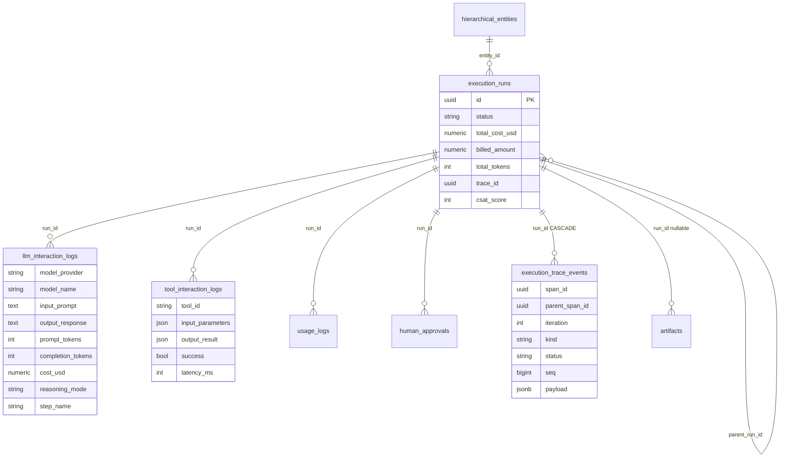
```mermaid
erDiagram
    execution_runs ||--o{ llm_interaction_logs : "run_id"
    execution_runs ||--o{ tool_interaction_logs : "run_id"
    execution_runs ||--o{ usage_logs : "run_id"
    execution_runs ||--o{ human_approvals : "run_id"
    execution_runs ||--o{ execution_trace_events : "run_id CASCADE"
    execution_runs ||--o{ execution_runs : "parent_run_id"
    execution_runs ||--o{ artifacts : "run_id nullable"
    hierarchical_entities ||--o{ execution_runs : "entity_id"
    execution_runs {
        uuid id PK
        string status
        numeric total_cost_usd
        numeric billed_amount
        int total_tokens
        uuid trace_id
        int csat_score
    }
    llm_interaction_logs {
        string model_provider
        string model_name
        text input_prompt
        text output_response
        int prompt_tokens
        int completion_tokens
        numeric cost_usd
        string reasoning_mode
        string step_name
    }
    tool_interaction_logs {
        string tool_id
        json input_parameters
        json output_result
        bool success
        int latency_ms
    }
    execution_trace_events {
        uuid span_id
        uuid parent_span_id
        int iteration
        string kind
        string status
        bigint seq
        jsonb payload
    }
```

### Run-level metrics

| Field | Written by |
|-------|------------|
| `total_cost_usd` | `_bump_run_cost` per LLM call and per tool call (atomic increment); reconciled at `_persist_final` as `max(budget.usd_used, row value)`. |
| `total_tokens` | Same increment path; rolled up across the run subtree at finalize. |
| `billed_amount` | `GovernanceService.settle_billing`, top-level runs only. |
| `completed_at` | `_persist_final`. |
| `csat_score` / `csat_comment` | `POST /executions/{id}/csat`; only on a finished run, `±1` only. |

### `LLMInteractionLog`

One row per LLM call inside a step. `input_prompt` is a **truncated** synthetic
string, not the real payload:
`f"System: {full_system_prompt[:2000]}\nUser: {user_prompt[:2000]}"`
([step_executor.py:1047](../../backend/src/ai/step_executor.py:1047)). Use
trace spans if you need the true prompt. `reasoning_mode` doubles as a call-kind
discriminator — `REACT`, `CHAIN_OF_THOUGHT`, or `REFORMAT` for the healing call.

### `ToolInteractionLog`

One row per tool invocation. `output_result` is a JSON column but is written as
`str(tool_result.output)` — a string, not structured JSON
([step_executor.py:436](../../backend/src/ai/step_executor.py:436)). `provider`
and `log_metadata` are never populated on the step path.

### Cost attribution

`usage_logs` rows carry an `attribution` tag from a closed enum
([cost_attribution.py:29](../../backend/src/ai/services/cost_attribution.py:29)):
`planner`, `actor_step`, `critic_pre`, `critic_post`, `critic_align`,
`critic_super`, `reformat_retry`, `meta_review`, `dreaming`, `tool`,
`child_run`, `embedding`, `meta_spec_critic`, `test_driver`, `sandbox`, `mcp`.
An unknown tag falls back to `"tool"` with a warning rather than dropping the
charge ([usage_service.py:110](../../backend/src/ai/usage_service.py:110)).
`CostLedger.add` skips the SQL insert when it has no `sku_id` (the column is
NOT NULL) and emits an `agent.cost.charged` telemetry event instead.

`UsageService.log_usage` resolves cost from `IntegrationRegistry`: company-scoped
SKU first, then a platform-level (`Company.type == "APP"`) fallback, dividing by
1 000 000 / 1 000 depending on `cost_unit`
([usage_service.py:30](../../backend/src/ai/usage_service.py:30)). Details in
[14 — Billing & credits](14-billing-and-credits.md).

### Trace spans

`execution_trace_events` ([orm/trace.py:50](../../backend/src/ai/orm/trace.py:50))
is an append-only span tree modelling
`run → iteration → executor → step → {tool, llm, child}`.

| Column | Meaning |
|--------|---------|
| `span_id` / `parent_span_id` | Tree edges; `parent_span_id` NULL at the iteration root. |
| `kind` | One of `iteration`, `executor`, `step`, `child`, `tool`, `llm`, `critic`. |
| `status` | `running` \| `success` \| `error`. |
| `seq` | In-process monotonic ordering within a run. |
| `payload` | JSONB — full inputs/outputs/prompts, per-field capped at `TRACE_MAX_FIELD_BYTES` (1 MB default). Empty when `observability.log_thoughts` is false. |
| `child_run_id` | Links a `child` span to the sub-run whose own trace continues the tree. |

The recorder is bound to a `ContextVar` for the whole run
([arq_jobs.py:128](../../backend/src/ai/core/arq_jobs.py:128)), which is how the
`@staticmethod` `ToolExecutor` and the LLM router can record spans without run
context in their signatures. Each span is persisted on its **own** short-lived
session so a trace write can never corrupt the run's session
([trace.py:254](../../backend/src/ai/core/trace.py:254)).

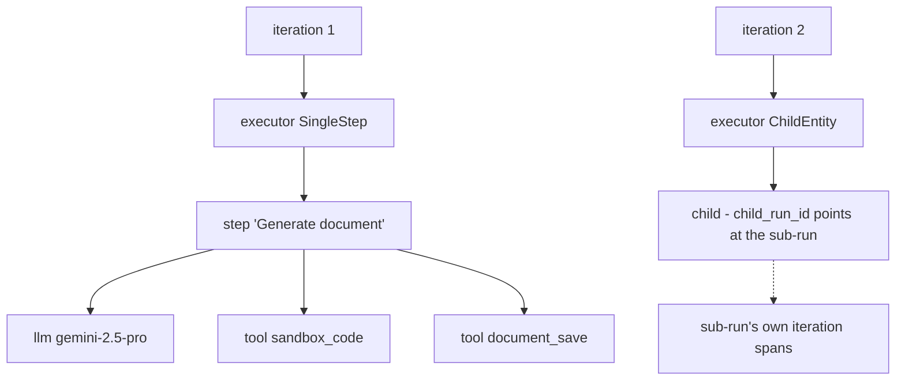
```mermaid
flowchart TD
    IT["iteration 1"] --> EX["executor SingleStep"]
    EX --> ST["step 'Generate document'"]
    ST --> LLM["llm gemini-2.5-pro"]
    ST --> TO1["tool sandbox_code"]
    ST --> TO2["tool document_save"]
    IT2["iteration 2"] --> EX2["executor ChildEntity"]
    EX2 --> CH["child - child_run_id points at the sub-run"]
    CH -.-> IT3["sub-run's own iteration spans"]
```

Read it with `GET /ai/executions/{id}/trace[?iteration=N]`, ordered by `seq`;
the SPA assembles the tree from `span_id` / `parent_span_id`.

### The SSE stream

`GET /ai/executions/{id}/stream` subscribes to the Redis channel
`execution:{run_id}` and relays every message verbatim as an SSE `data:` frame.
It closes when a frame contains `"status": "COMPLETED"`, `"FAILED"`, or
`"CANCELLED"` ([router.py:353](../../backend/src/ai/router.py:353)).
**Auth is via `?token=` query param** (`get_current_user_from_query`) because
`EventSource` cannot set headers.

Three producers publish to that one channel:

| Producer | Frames |
|----------|--------|
| [`agent_loop_sse.event_async`](../../backend/src/ai/core/agent_loop_sse.py:57) | Loop lifecycle, remapped to short `type` discriminators |
| [`TraceRecorder._publish`](../../backend/src/ai/core/trace.py:246) | `span_open` / `span_close` |
| `GovernanceService.evaluate_hitl`, `AIService.cancel_execution` | `HITL_PENDING`, `cancelled` |

| SSE `type` | Internal event | Payload keys (besides `type`) |
|------------|----------------|-------------------------------|
| *(none)* | initial frame | `{"status": "connected"}` |
| `iteration_start` | `agent.loop.iteration_start` | `iteration`, `executor`, `budget_pressure`, `open_subgoals` |
| `iteration_end` | `agent.loop.iteration_end` | `iteration`, `outcome`, `decision`, `cost_iter_usd`, `narrative`, `reflection` |
| `critic_pre` | `agent.critic.pre_verdict` | `iteration`, `verdict`, `concerns_count`, `cost_usd` |
| `critic_post` | `agent.critic.post_verdict` | `iteration`, `verdict`, `tags`, `cost_usd` |
| `critic_align` | `agent.critic.alignment` | `iteration`, `aligned`, `drift` |
| `critic_super` | `agent.critic.supervisor` | `iteration`, `recommendation`, `confidence` |
| `retry_picked` | `agent.retry.picked` | `iteration`, `strategy`, `tags` |
| `retry_dequeued` | `agent.retry.dequeued` | `iteration`, `strategy` |
| `replan_triggered` | `agent.loop.replan` | `iteration`, … |
| `resume` | `agent.loop.resume` | — |
| `cancelled` | `agent.loop.cancelled` | `iteration`, `status` |
| `run_end` | `agent.loop.run_end` | `outcome`, `iters`, `total_cost_usd`, plus `status` mirrored from `outcome` so the stream closes |
| `span_open` | trace | `span_id`, `parent_span_id`, `kind`, `name`, `iteration`, `seq`, `status`, `payload` |
| `span_close` | trace | same plus `duration_ms`, `cost_usd`, `tokens_in`, `tokens_out`, `child_run_id`, `error` |
| *(none)* | HITL | `{"status": "HITL_PENDING", "approval_id", "trigger"}` |

> **Mapping drift:** `_SSE_EVENT_TYPES` maps `"agent.loop.resume"`, but the loop
> actually emits `"agent.loop.resumed"`
> ([agent_loop.py:308](../../backend/src/ai/core/agent_loop.py:308)) — that
> frame never reaches the browser. Likewise unmapped and therefore
> SSE-invisible: `agent.executor.completed`, `agent.retry.exhausted`,
> `agent.loop.suspended`, `agent.loop.suspended_on_children`,
> `agent.loop.billing_settled`, `agent.cost.charged`. They still reach the
> structured-log / OTel sink.

---

## 11. The `/api/v1/ai/*` route table

All routes below are mounted under `/api/v1` from
[main.py:78](../../backend/src/main.py:78). Unless noted, auth is
`Depends(get_current_user)` (any authenticated user, company-scoped).

### Entities — [router.py](../../backend/src/ai/router.py)

| Method | Path | Auth | Purpose |
|--------|------|------|---------|
| POST | `/ai/entities` | user; `target_company_id` needs `app_admin` or a partner owning the tenant | Create an entity. |
| GET | `/ai/entities` | user | List non-template, non-DELETED entities. Filters: `type`, `company_id` (app_admin), `voice_enabled`, `status`. Partners also see child-tenant entities. |
| GET | `/ai/entities/{id}` | user | Fetch one. Injects a virtual 1-step plan for ACTION/SKILL with no steps. |
| PUT | `/ai/entities/{id}` | user | Blind field update. |
| DELETE | `/ai/entities/{id}` | user | Cascading **soft** delete. |
| POST | `/ai/entities/{id}/convert-to-template` | **`app_admin`** | Deep-clone the tree into template space. |

### Executions

| Method | Path | Auth | Purpose |
|--------|------|------|---------|
| POST | `/ai/execute` | user | Create + enqueue an `ExecutionRun`. |
| GET | `/ai/executions` | user | Root runs only (`parent_run_id IS NULL`), newest first. `app_admin` sees all companies. |
| GET | `/ai/executions/{id}` | user | Full run with logs, approvals, and child runs eager-loaded **5 levels deep**. |
| POST | `/ai/executions/{id}/csat` | user | Record ±1 CSAT. 409 if the run is not finished. |
| GET | `/ai/executions/{id}/agent_state` | user | Debug: newest CORTEX `snapshot` node for the run. 404 if none. |
| GET | `/ai/executions/{id}/trace` | user | All trace spans ordered by `seq`; optional `?iteration=N`. |
| GET | `/ai/executions/{id}/stream` | **`get_current_user_from_query`** (`?token=`) | SSE relay of `execution:{id}`. |
| POST | `/ai/executions/{id}/cancel` | user | Cooperative cancel. |
| POST | `/ai/executions/{id}/retry` | user | New run resuming from `context_state`. |
| POST | `/ai/executions/{id}/refine` | user | New run with LLM-selected step re-execution. |

### HITL, tools, dashboard

| Method | Path | Auth | Purpose |
|--------|------|------|---------|
| GET | `/ai/approvals/pending` | user | Pending `human_approvals` for the company. |
| POST | `/ai/approvals/{id}/respond` | user | `?status=APPROVED|REJECTED&notes=…`; publishes on `hitl:{id}` **and** `approval:{id}`. |
| GET | `/ai/tools` | user | Enriched tool list; falls back to the bare `ToolRegistry` list if the DB is down. |
| GET | `/ai/stats` | user | `{entities_total, executions_today, documents_total}`. |

### Documents and context sources

| Method | Path | Auth | Purpose |
|--------|------|------|---------|
| POST | `/ai/context-sources/upload` | user | ≤500 MB; artifact + optional `Document` + auto-append to the entity's context sources. |
| POST | `/ai/documents/upload` | user | Document row + `process_document` job. |
| GET | `/ai/documents` | user | List, optional `entity_id`. |
| POST | `/ai/documents/search` | user | pgvector cosine search, `?query=&entity_id=&top_k=`. |
| POST | `/ai/avatar/upload` | user | ≤5 MB image → `/artifact/user-uploads/avatars/…`. |

### Templates

| Method | Path | Auth | Purpose |
|--------|------|------|---------|
| GET | `/ai/templates` | user | Public templates, optional `type`. |
| GET | `/ai/templates/{id}` | user | One template. |
| POST | `/ai/templates` | **`app_admin`** | Create (forces `is_template=True`). |
| PUT | `/ai/templates/{id}` | **`app_admin`** | Update. |
| DELETE | `/ai/templates/{id}` | **`app_admin`** | Soft delete. |
| POST | `/ai/templates/{id}/clone` | user | Deep-clone into the caller's company. |

### Related routers (not in `ai/router.py`)

| Prefix | File | Notes |
|--------|------|-------|
| `/api/v1/ai/admin/*` | [api/admin.py](../../backend/src/ai/api/admin.py) | Kernel admin: per-run `health_records`, `plan_candidates`, `cost_attribution`; entity `bandit_state`; Meta-Agent Board; `/admin/kpi/*`; `/admin/risks`. Guarded by `_require_admin` (`app_admin`, `partner_admin`, `tenant_admin`) plus a per-run company check. |
| `/api/v1/artifacts/*` | [artifact_router.py](../../backend/src/ai/artifact_router.py) | List / upload / get / download / delete. |

Full request and response schemas live in [17 — API reference](17-api-reference.md).

---

## 12. A fully worked example

The cleanest real seed is **`doc-factory-lite`** — one flat `AGENT` with a
four-step deterministic plan, created by
[SeedDocFactoryLite/create_lite.py](../../backend/scripts/seeds/default_entities/SeedDocFactoryLite/create_lite.py).
It exists because the 50-entity, 4-level `doc-factory-process` multiplied LLM
calls on top of the loop and cost $15+ a run.

### The entity, trimmed to the load-bearing parts

```json
{
  "name": "doc-factory-lite",
  "type": "AGENT",
  "identity": {
    "system_prompt": "You are a single-pass document generator... 1. OUTLINE ... 2. GENERATE ... 3. VALIDATE ... 4. FINALIZE ...",
    "behavioral_constraints": [
      "Plan/outline before writing any code",
      "Write working files only under scratch/",
      "Validate in-sandbox; never echo file contents into context",
      "Call document_save exactly once, only in the finalize step"
    ]
  },
  "planning": {
    "static_plan": {
      "enabled": true, "fallback_behavior": "STRICT",
      "steps": [
        {"step_id": "outline",  "order": 1, "name": "Analyze & outline",   "type": "THOUGHT",
         "target": {"prompt_template": "PLAN FIRST — do NOT write code... Request:\n\n{{input}}"}},
        {"step_id": "generate", "order": 2, "name": "Generate document",   "type": "ACTION",
         "target": {"tool_id": "sandbox_code",
                    "prompt_template": "Following this OUTLINE...\n\nOUTLINE:\n{{outline}}\n\nOriginal request:\n{{input}}",
                    "input_dependencies": ["outline"]}},
        {"step_id": "validate", "order": 3, "name": "Validate in-sandbox", "type": "ACTION",
         "target": {"tool_id": "sandbox_code",
                    "prompt_template": "Load the scratch/ output and assert zero structural/formula errors...",
                    "input_dependencies": ["generate"]}},
        {"step_id": "finalize", "order": 4, "name": "Save final artifact", "type": "ACTION",
         "target": {"tool_id": "document_save",
                    "prompt_template": "Call document_save EXACTLY ONCE: source_path = the scratch file...",
                    "input_dependencies": ["validate"]}}
      ]
    },
    "dynamic_planning": {"enabled": false}
  },
  "capabilities": {
    "tools": [{"tool_id": "sandbox_code"}, {"tool_id": "document_save"}],
    "memory": {"enabled": true, "mode": "CORTEX", "memory_scope": "INTELLIGENCE_ONLY",
               "cortex_config": {"auto_checkpoint": true, "context_budget_pct": 25}}
  },
  "logic_gate": {
    "reasoning_config": {"reasoning_mode": "REACT", "goal_validation_interval": 0},
    "retry_policy": {"max_retries": 1},
    "review_mechanism": {"enabled": false},
    "context_policy": {"type": "FULL", "summarize_threshold": 8000,
                       "preserve_keys": ["request_type", "final_artifact"]}
  },
  "governance": {
    "timeout_ms": 300000, "max_cost_usd": 2.00, "max_recursion_depth": 1,
    "execution_limits": {"max_recursion_depth": 1, "max_tool_calls": 10}
  },
  "observability": {"log_thoughts": true},
  "metadata_extensions": {
    "task_class": "document_authoring",
    "feature_flags": {
      "critic_pipeline.v2_enabled": false,
      "critic_pipeline.pre_critic_enabled": false,
      "critic_pipeline.different_model_critic": false,
      "meta_review.v2_enabled": false
    }
  }
}
```

Three design decisions worth copying:

- **`goal_validation_interval: 0`** disables GoalGuard, because on a multi-step
  deterministic plan the early steps legitimately are not the final document, so
  the guard just churned.
- **`review_mechanism.enabled: false`** plus the critic flags off: the
  in-sandbox `validate` step *is* the quality gate. The LLM critic flagged every
  pre-document iteration `INCOMPLETE`/`WRONG_FORMAT` and corrective-retried the
  planning step ~10×.
- **`max_cost_usd: 2.00`** is a real ceiling (`_enforce_cost_cap`), not
  decoration.

### What happens on `POST /ai/execute`

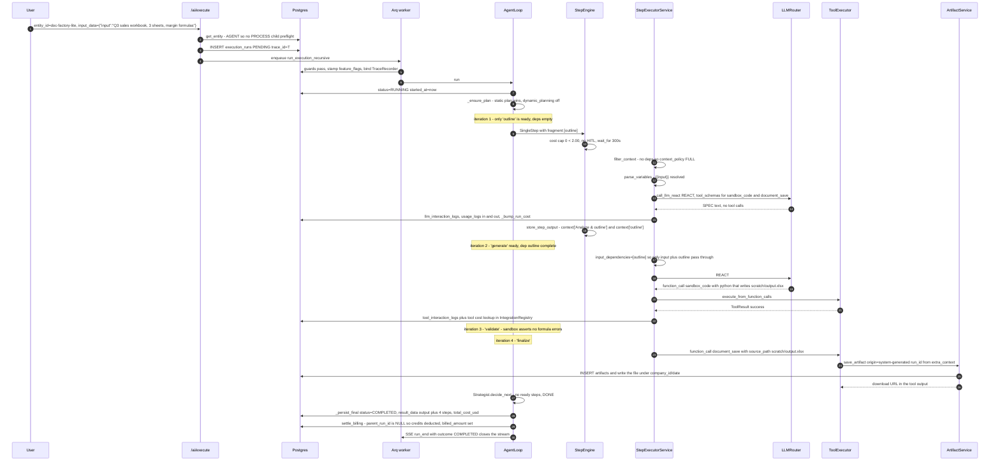
```mermaid
sequenceDiagram
    autonumber
    participant U as User
    participant API as /ai/execute
    participant PG as Postgres
    participant W as Arq worker
    participant AL as AgentLoop
    participant SE as StepEngine
    participant SX as StepExecutorService
    participant LLM as LLMRouter
    participant TX as ToolExecutor
    participant AS as ArtifactService

    U->>API: entity_id=doc-factory-lite, input_data={"input":"Q3 sales workbook, 3 sheets, margin formulas"}
    API->>PG: get_entity - AGENT so no PROCESS child preflight
    API->>PG: INSERT execution_runs PENDING trace_id=T
    API->>W: enqueue run_execution_recursive
    W->>PG: guards pass, stamp feature_flags, bind TraceRecorder
    W->>AL: run
    AL->>PG: status=RUNNING started_at=now
    AL->>AL: _ensure_plan - static plan wins, dynamic_planning off
    Note over AL: iteration 1 - only 'outline' is ready, deps empty
    AL->>SE: SingleStep with fragment [outline]
    SE->>SE: cost cap 0 < 2.00, no HITL, wait_for 300s
    SX->>SX: filter_context - no deps so context_policy FULL
    SX->>SX: parse_variables - {{input}} resolved
    SX->>LLM: call_llm_react REACT, tool_schemas for sandbox_code and document_save
    LLM-->>SX: SPEC text, no tool calls
    SX->>PG: llm_interaction_logs, usage_logs in and out, _bump_run_cost
    SE->>SE: store_step_output - context['Analyze & outline'] and context['outline']
    Note over AL: iteration 2 - 'generate' ready, dep outline complete
    SX->>SX: input_dependencies=[outline] so only input plus outline pass through
    SX->>LLM: REACT
    LLM-->>SX: function_call sandbox_code with python that writes scratch/output.xlsx
    SX->>TX: execute_from_function_calls
    TX-->>SX: ToolResult success
    SX->>PG: tool_interaction_logs plus tool cost lookup in IntegrationRegistry
    Note over AL: iteration 3 - 'validate' - sandbox asserts no formula errors
    Note over AL: iteration 4 - 'finalize'
    SX->>TX: function_call document_save with source_path scratch/output.xlsx
    TX->>AS: save_artifact origin=system-generated run_id from extra_context
    AS->>PG: INSERT artifacts and write the file under company_id/date
    AS-->>TX: download URL in the tool output
    AL->>AL: Strategist.decide_next - no ready steps, DONE
    AL->>PG: _persist_final status=COMPLETED, result_data output plus 4 steps, total_cost_usd
    AL->>PG: settle_billing - parent_run_id is NULL so credits deducted, billed_amount set
    AL->>W: SSE run_end with outcome COMPLETED closes the stream
```

### What you can inspect afterwards

| Question | Where to look |
|----------|---------------|
| What did each step produce? | `result_data["steps"]` — four entries with `step_id` `outline`/`generate`/`validate`/`finalize`. |
| What exactly was sent to the model? | `GET /ai/executions/{id}/trace` → `kind="llm"` spans (`payload` populated because `log_thoughts: true`). The `llm_interaction_logs.input_prompt` is truncated at 2000+2000 chars. |
| Which tools ran and how long? | `tool_logs` on `GET /ai/executions/{id}`, or `kind="tool"` spans. |
| Where is the file? | `artifacts` row with `run_id = {id}`, `origin = system-generated`, `file_path = backend/artifact/system-generated/{company}/{date}/{hex}_output.xlsx`; download via `/api/v1/artifacts/{artifact_id}/download`. |
| What did it cost, and to whom? | `total_cost_usd` on the run; `usage_logs` broken down by `attribution` via `GET /ai/admin/executions/{id}/cost_attribution`. |
| Did it drift off-goal? | Critic verdict spans and the `critic_*` SSE frames — but this entity has the critic stack turned off. |

---

## Key files reference

| File | Lines | What it does |
|------|------:|--------------|
| [ai/service.py](../../backend/src/ai/service.py) | 1353 | `AIService`: entity CRUD + RBAC scoping, soft delete, `trigger_execution`, retry, refine, cancel, CSAT, templates, clone, `_auto_generate_input_schema`. |
| [ai/router.py](../../backend/src/ai/router.py) | 755 | Every `/api/v1/ai/*` route: entities, executions, SSE, trace, HITL, docs, templates. |
| [ai/step_executor.py](../../backend/src/ai/step_executor.py) | 1211 | `StepExecutorService`: `_execute_step` dispatch, `_execute_tool_call` with healing, `_execute_thought` with prompt assembly, `create_child_run`, cost logging, context summarisation. |
| [ai/core/step_engine.py](../../backend/src/ai/core/step_engine.py) | 481 | DAG scheduler, `_execute_step_wrapper` (cost cap, HITL, timeout, GoalGuard), CORTEX delegators. |
| [ai/tool_executor.py](../../backend/src/ai/tool_executor.py) | 346 | `ToolResult`, typed/legacy tool dispatch, schema lookup, result formatting, trace spans. |
| [ai/tool_fallback.py](../../backend/src/ai/tool_fallback.py) | 166 | Four fallback chains plus input transforms. |
| [ai/tools/resilience.py](../../backend/src/ai/tools/resilience.py) | 403 | `ToolResilience` — the flag-gated, extracted version of the healing ladder. |
| [ai/orm/entity.py](../../backend/src/ai/orm/entity.py) | 69 | `HierarchicalEntity` — scalars plus nine JSON columns. |
| [ai/orm/execution.py](../../backend/src/ai/orm/execution.py) | 138 | `ExecutionRun`, `LLMInteractionLog`, `ToolInteractionLog`, `HumanApproval`. |
| [ai/orm/trace.py](../../backend/src/ai/orm/trace.py) | 102 | `ExecutionTraceEvent` span table. |
| [ai/schemas/](../../backend/src/ai/schemas/) | 1291 | The nine-block Pydantic surface: `entity`, `enums`, `persona`, `reasoning`, `planning`, `capabilities`, `governance`, `io_contract`, `execution`, `tools`. |
| [ai/entity_clone_helpers.py](../../backend/src/ai/entity_clone_helpers.py) | 99 | `clone_entity_fields` (deep-copy) and `remap_entity_refs`. |
| [ai/persona_service.py](../../backend/src/ai/persona_service.py) | 204 | Persona format normalisation and system-prompt assembly for the voice path. |
| [ai/failure_pattern_service.py](../../backend/src/ai/failure_pattern_service.py) | 189 | Classifies recent failures into seven actionable patterns. |
| [ai/artifact_service.py](../../backend/src/ai/artifact_service.py) | 186 | Disk layout plus `artifacts` rows. |
| [ai/artifact_router.py](../../backend/src/ai/artifact_router.py) | 263 | `/api/v1/artifacts/*`, including remote-URL proxy streaming with Range support. |
| [ai/artifact_models.py](../../backend/src/ai/artifact_models.py) | 117 | `Artifact`, `CallLog`, `CallContent`. |
| [ai/text_extractor.py](../../backend/src/ai/text_extractor.py) | 87 | DOCX/PDF/XLSX/PPTX → text, null-byte safe. |
| [ai/usage_service.py](../../backend/src/ai/usage_service.py) | 132 | SKU-based cost calculation with platform-level fallback. |
| [ai/services/cost_attribution.py](../../backend/src/ai/services/cost_attribution.py) | 153 | `CostAttribution` enum and `CostLedger`. |
| [ai/services/attributed_usage.py](../../backend/src/ai/services/attributed_usage.py) | 58 | One helper every non-tool LLM call site uses to write attributed usage. |
| [ai/core/arq_jobs.py](../../backend/src/ai/core/arq_jobs.py) | 1126 | `run_execution_recursive` (guards, trace binding), `resume_parent_run`, gateway/document/CORTEX jobs. |
| [ai/core/executors/](../../backend/src/ai/core/executors/) | ~1040 | `ActionResult` + registry, `SingleStep`, `DAG`, `ChildEntity`, `Recursive`, `Debate`, stubs. |
| [ai/planning/child_resolver.py](../../backend/src/ai/planning/child_resolver.py) | ~200 | Four-strategy `entity_id` resolution. |
| [ai/meta/platform_schema_compiler.py](../../backend/src/ai/meta/platform_schema_compiler.py) | 898 | Compiles the capability manifest; `get_platform_summary`, `load_entity_children`, `resolve_meta_cognition`. |
| [scripts/seeds/default_entities/](../../backend/scripts/seeds/default_entities/) | — | `SeedAutonomousBI` (4-level PROCESS tree), `SeedDocumentFactory`, `SeedDocFactoryLite` (flat AGENT). |

---

## Gotchas and things that surprise newcomers

- **The create/update schema is closed.** Unknown keys are dropped without an
  error. If your config "does nothing", first check that the key is a declared
  Pydantic field. Several keys the runtime *reads* are not declarable
  (`governance.critic_cost_share_pct`, `max_concurrent_children`,
  `review_mechanism.critic_model_override`, `capabilities.tools[].usage`).
- **`logic_gate.retry_policy` and `planning.loop_control` are dead config.** No
  runtime readers. Real retry bounds are `MAX_RETRIES_PER_STEP = 2` plus the
  tool healing ladder.
- **`governance.max_recursion_depth` is not enforced.** It only appears as a
  prompt line. Depth is bounded in practice by credits and cost caps.
- **`execution_limits.max_tool_calls` is a prompt hint, not a limit**, and
  `tool_call_counts` is reset at the start of every step.
- **`rate_limit_per_run` cannot fire.** No caller injects it into the
  function-call dict, and the field is not on `ToolReference`.
- **`io_contract.input_schema` is never validated.** Any `input_data` is
  accepted. `output_schema` is a prompt instruction only.
- **`ExecutionRun.idempotency_key` and `span_id` are dead columns**, as is
  `ToolInteractionLog.idempotency_key`. `execution_time_ms` is never written by
  the loop path — derive it from `completed_at - started_at`.
- **Every step output is stored under two keys** (`name` and `step_id`).
  Duplicate step names silently overwrite each other, and context size doubles.
- **`__completed_steps__` is documented but unwritten.** The live mechanism is
  `AgentState.completed_step_ids`. `INTERNAL_KEYS.md` is stale here.
- **`input_dependencies` silently disables `context_policy`.** If a step
  declares deps, only `input` plus those deps reach it, whatever the policy says.
- **`entity.status` is not a state machine.** No transition validation, and a
  `DRAFT` or `ARCHIVED` entity executes perfectly happily. Only `DELETED` is
  enforced.
- **`version` is decorative.** Nothing resolves, compares, pins, or increments it.
  Editing an entity changes behaviour for runs already in flight.
- **Templates have `company_id = NULL`** — they are global. Only `app_admin` can
  create or edit them, but any user can clone them.
- **`convert_to_template` misses plan-only children.** It walks `parent_id` and
  `hierarchy.children` but not `static_plan.steps[].target.entity_id`, unlike
  `clone_template`, which walks all three.
- **`parent_run_id` means two different things**: a structural child run, *or*
  the previous run in a retry/refine chain.
- **Child-resolver Strategy 4 is not company-scoped** — a name-based lookup can
  cross tenants.
- **The Execution Detail page finds files by regex, not by `run_id`.** A tool
  that does not print its artifact URL into its output produces an invisible
  file. `pdf_generator` also leaves `run_id = NULL` and writes the file twice.
- **The SSE stream authenticates via `?token=`**, not the `Authorization`
  header, because `EventSource` cannot set headers.
- **`agent.loop.resumed` never reaches the browser** — the SSE map has
  `agent.loop.resume`. Several other loop events are similarly unmapped.
- **Parallel DAG steps run in isolated sessions.** Never mutate a shared ORM
  object from a step; fold cost with the atomic `_bump_run_cost` increment or
  you will silently drop charges.
- **`ToolExecutor` never passes `company_id` to the registry**, so tenant-scoped
  tools are invisible to entity execution.

---

## Where to go next

- [05 — Agent kernel](05-agent-kernel.md) — the loop itself: iterations, phases,
  `AgentState`, `Budget`, executors, termination.
- [07 — Planning & critics](07-planning-and-critics.md) — how `static_plan` and
  `dynamic_planning` become the plan the Strategist walks, and what the critic
  gates do with each step's output.
- [08 — Memory & CORTEX](08-memory-and-cortex.md) — `capabilities.memory`,
  the CORTEX step types, and context-source ingestion.
- [09 — Tools](09-tools.md) — the tool registry, tool contracts, tenant tools,
  and the individual tool catalogue.
- [10 — LLM providers](10-llm-providers.md) — `LLMRouter`, `task_type` routing,
  and `call_llm_react`.
- [14 — Billing & credits](14-billing-and-credits.md) — `usage_logs`,
  `IntegrationRegistry` SKUs, and `settle_billing`.
- [15 — Governance & HITL](15-governance-and-hitl.md) — checkpoints, approvals,
  and feature flags.
- [17 — API reference](17-api-reference.md) — full request/response schemas for
  every route listed in §11.
