# 07. Planning, Critics & Self-Correction

> **What this document covers:** how HireBuddha turns an entity's goal into a concrete plan, how four critic gates inspect every loop iteration, and how the agent retries, re-plans or gives up when something goes wrong.
> **Who should read it:** anyone touching `backend/src/ai/planning/`, debugging a run that loops forever, or tuning cost/quality knobs for a tenant.
> **Prerequisites:** [05 — The agent kernel](05-agent-kernel.md) (the loop itself, `AgentState`, `Budget`, executors). Helpful but not required: [02 — System architecture](02-system-architecture.md), [03 — Data model](03-data-model.md).

---

## Table of contents

1. [The 60-second version](#1-the-60-second-version)
2. [Where the code lives](#2-where-the-code-lives)
3. [Plan generation](#3-plan-generation)
4. [The plan data structure](#4-the-plan-data-structure)
5. [Plan styles and the PlanStyleBandit](#5-plan-styles-and-the-planstylebandit)
6. [Plan invariants](#6-plan-invariants)
7. [Plan adaptation and re-planning](#7-plan-adaptation-and-re-planning)
8. [The critic pipeline](#8-the-critic-pipeline)
9. [Stage 1 — the pre-action critic](#9-stage-1--the-pre-action-critic)
10. [Stage 2 — the post-action critic](#10-stage-2--the-post-action-critic)
11. [Stage 3 — alignment and GoalGuard](#11-stage-3--alignment-and-goalguard)
12. [Stage 4 — the supervisor](#12-stage-4--the-supervisor)
13. [Verdict types](#13-verdict-types)
14. [Retry and self-correction mechanics](#14-retry-and-self-correction-mechanics)
15. [Failure patterns](#15-failure-patterns)
16. [Trust scores](#16-trust-scores)
17. [The cost of criticism](#17-the-cost-of-criticism)
18. [Tuning guide — every knob](#18-tuning-guide--every-knob)
19. [Key files reference](#19-key-files-reference)
20. [Gotchas and things that surprise newcomers](#20-gotchas-and-things-that-surprise-newcomers)
21. [Where to go next](#21-where-to-go-next)

---

## 1. The 60-second version

An **entity** (see [06 — Execution pipeline](06-execution-pipeline.md)) has a
goal and, optionally, an author-written **static plan**. Before the agent loop
does any work it needs an ordered list of **steps**. That list comes from one of
two places:

* the **static plan** the tenant authored in the builder, or
* the **`PlanGenerator`** — which asks an LLM for *three* candidate plans at
  three different temperatures, runs eight deterministic **invariant** checks on
  each, throws away the ones that fail, and picks a winner with an LLM
  **judge**.

Once there is a plan, the loop runs one step per iteration. Around each
iteration sit four **critic gates**, all implemented in one class,
[`RealCriticPipeline`](../../backend/src/ai/planning/critic_pipeline.py:228):

| Gate | Question it answers | When |
|------|--------------------|------|
| **pre_action** | "Is this move obviously stupid?" | before the executor runs |
| **post_action** | "Is this output actually good?" | after the executor runs |
| **alignment** | "Are we still working on the right goal?" | every 2nd iteration |
| **supervisor** | "Keep going, re-plan, pause, or abort?" | every 3rd iteration |

Every gate writes into one shared
[`StepHealthRecord`](../../backend/src/ai/planning/step_health_record.py:23),
which is persisted as a CORTEX node and later mined for statistics. When the
post-action critic returns anything other than `PASS`, a **pure function**
([`pick_retry`](../../backend/src/ai/planning/retry_strategies.py:62)) maps the
critic's structured failure tags onto one of seven retry strategies, and the
loop queues a corrective move for the next iteration.

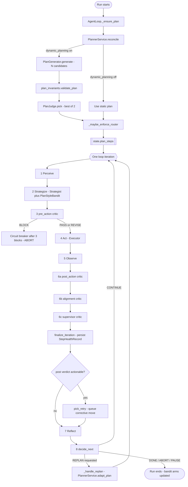

Two things to hold onto:

1. **Planning is best-of-N with a deterministic filter.** The LLM is creative;
   the invariants are not. Nothing that violates an invariant reaches the
   executor unless *every* candidate fails, in which case the cheapest violator
   is used as a last resort rather than crashing the run.
2. **Criticism is budgeted.** If critic LLM spend exceeds 20 % of the run's
   spend, the pipeline auto-degrades to PASS-only for the pre and alignment
   stages. Quality control is never allowed to eat the run.

---

## 2. Where the code lives

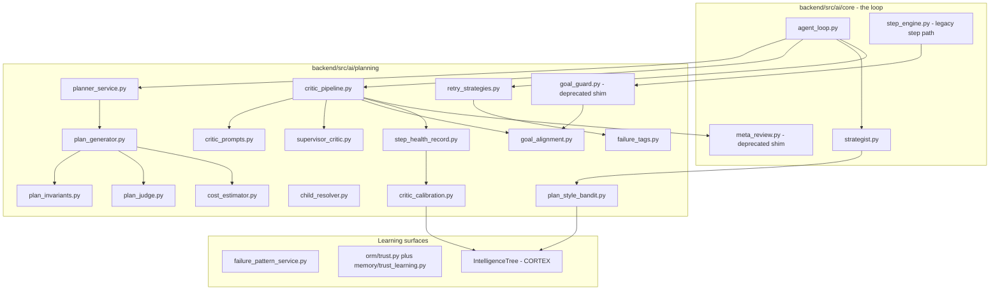

The package has its own README at
[planning/README.md](../../backend/src/ai/planning/README.md) — it is accurate
and worth reading alongside this document.

---

## 3. Plan generation

### 3.1 Who asks for a plan

Only two production call sites reconcile a plan:

| Caller | File | When |
|--------|------|------|
| `AgentLoop._ensure_plan` | [agent_loop.py:951](../../backend/src/ai/core/agent_loop.py:951) | once, at loop bootstrap, when `state.plan_steps` is empty and the entity has *some* planning config |
| `RecursiveExecutor` | [executors/recursive.py:49](../../backend/src/ai/core/executors/recursive.py:49) | when a goal-only AGENT expands its goal into a sub-plan |

Both call `PlannerService.reconcile(run, entity, input_data)`.

### 3.2 `PlannerService.reconcile`

```python
# backend/src/ai/planning/planner_service.py
planning = entity.planning or {}
static_plan = copy.deepcopy(planning.get("static_plan", {})) or {}
if "steps" not in static_plan:
    static_plan["steps"] = []

# Fallback: If no steps and it is a leaf action/skill, add a default step
if not static_plan["steps"] and entity.type in [EntityType.ACTION, EntityType.SKILL]:
    static_plan["steps"] = [{
        "step_id": "auto_generated", "order": 1, "name": "Execute", ...
    }]

dynamic_config = planning.get("dynamic_planning", {}) or {}
if not dynamic_config.get("enabled"):
    return await self._maybe_enforce_router(run, entity, input_data, static_plan)
```

So the decision tree is:

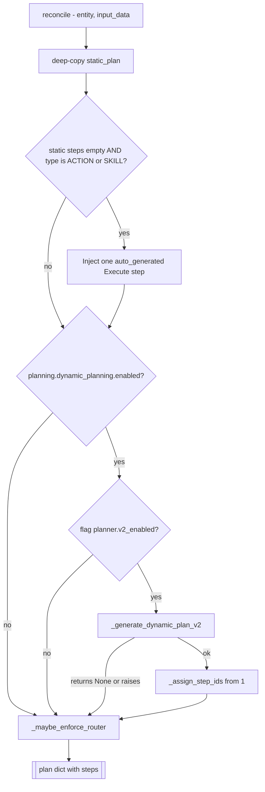

Two notes a newcomer will trip on:

* The **legacy v1 single-shot planner was deleted** in the "cut-C5"
  consolidation. If `planner.v2_enabled` is off, or v2 errors, the *static plan*
  is the only fallback — there is no other dynamic path.
* `_assign_step_ids` **rewrites every `step_id`** to
  `step_{n}_{8-hex}` and re-numbers `order`. Any `step_id` the LLM invented is
  discarded at this point, which is why `{{step_1}}`-style references inside
  generated prompt templates are fragile.

### 3.3 Router enforcement

`_maybe_enforce_router`
([planner_service.py:305](../../backend/src/ai/planning/planner_service.py:305))
runs on **every** plan, static or dynamic. It exists because the `PlanGenerator`
prompt contains no routing directive, so a PROCESS with children can come back
with flat `THOUGHT`/`ACTION` steps that print code as text and produce no
artifact.

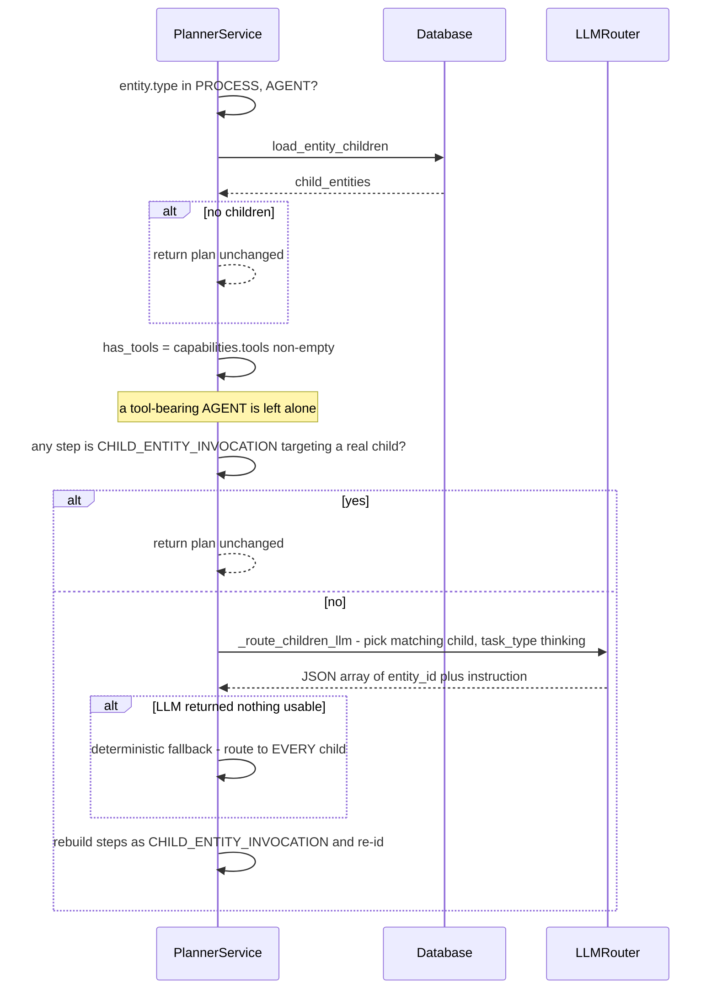

The routing LLM call is logged as an `LLMInteractionLog` with
`reasoning_mode="PLANNER"` and `step_name="__router__"`, and billed under the
`planner` attribution.

### 3.4 `PlanGenerator.generate` — the multi-candidate path

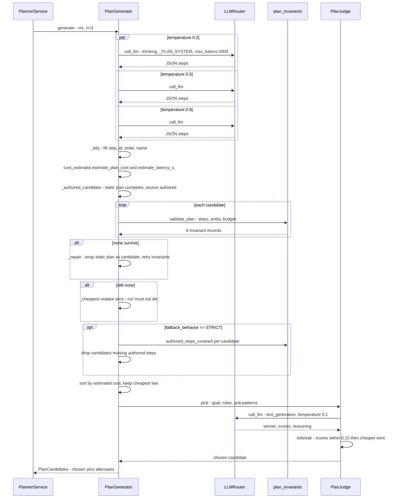

Key constants, all class attributes on
[`PlanGenerator`](../../backend/src/ai/planning/plan_generator.py:148):

| Constant | Value | Meaning |
|----------|-------|---------|
| `DEFAULT_N` | `3` | candidates when the caller passes no `n` |
| `TEMPERATURES` | `(0.2, 0.5, 0.8)` | one candidate per temperature; `n` is clamped to `len(TEMPERATURES)` |
| `REPAIR_ATTEMPTS` | `1` | one repair pass, and the "repair" is simply re-offering the static plan |

`n` is clamped: `n = max(1, min(int(n or DEFAULT_N), len(TEMPERATURES)))`. Asking
for 10 candidates gets you 3.

### 3.5 The planner LLM prompt

The system prompt is a module constant:

```python
# backend/src/ai/planning/plan_generator.py
_PLAN_SYSTEM = (
    "You design a plan for an autonomous AI agent. Output JSON only:\n"
    '{"steps": [ {"step_id":"s1","name":"...","type":"TOOL_CALL|THOUGHT|'
    'CHILD_ENTITY_INVOCATION|ACTION","target": {...}, '
    '"input_dependencies": ["..."]} ]}\n'
    "Keep the plan tight — no extraneous steps. Reference upstream outputs "
    "via {{step_id}} placeholders. Prefer reusing existing tools and entities.\n"
    "For CHILD_ENTITY_INVOCATION steps, target.entity_id is REQUIRED and must "
    "be the EXACT child UUID from the provided child roster — never null, never "
    "the child's name."
)
```

The user prompt is assembled section-by-section by `_build_prompt`:

| Section | Present when | Content |
|---------|-------------|---------|
| `## Goal` | always | `ctx.goal`, else `entity.goal` |
| `## Proposed subgoals (replan)` | supervisor proposed subgoals | one bullet per subgoal description |
| `## Previous attempt` | `ctx.failed_step` set | failed step name + first 200 chars of the error |
| `## Intelligence rules` | `ctx.intelligence_rules` non-empty | top 5, rendered to 200 chars each |
| `## Anti-patterns to avoid` | `ctx.anti_patterns` non-empty | top 5 |
| `## Static plan (reference; you may adapt)` | static plan has steps | pretty JSON truncated to 3000 chars |
| `## Variation cue` | always | `Generate at temperature=X.X. Vary structure: prefer parallel DAG when steps are independent.` |

> **Drift alert.** `intelligence_rules` and `anti_patterns` are *never populated
> in production*. Both `PlanContext` constructions in
> [planner_service.py:121](../../backend/src/ai/planning/planner_service.py:121)
> and [planner_service.py:277](../../backend/src/ai/planning/planner_service.py:277)
> leave them at their empty defaults, and
> [`PlanGenerator._ctx_from_state`](../../backend/src/ai/planning/plan_generator.py:491)
> hard-codes `intelligence_rules=[]` / `anti_patterns=[]`. The "planner priors"
> half of Phase 11 Track 7 is plumbed but not wired. Same for
> `PlanContext.task_class`, which stays `"general"` on the reconcile path.

### 3.6 Parsing the response

`_parse_plan` is tolerant of two shapes:

1. object shape — `{"steps": [...]}`
2. bare array shape — `[step, step, ...]` (what the retired v1 `adapt_plan`
   emitted)

Anything else returns `[]`, and the candidate silently falls back to
`ctx.static_plan["steps"]`. Both parsers come from
`src.ai.shared.json_utils` and tolerate markdown fences.

`_tidy` then guarantees three fields on every step: a unique `step_id`
(generated as `step_{i}_{6-hex}` if missing, suffixed `_dup_{i}` on collision),
an `order`, and a `name`.

---

## 4. The plan data structure

A plan is a `dict` with a `steps` list. Each step is a plain `dict` at runtime,
but it is validated against the Pydantic
[`PlanStep`](../../backend/src/ai/schemas/planning.py:80) model whenever it
crosses the legacy step executor.

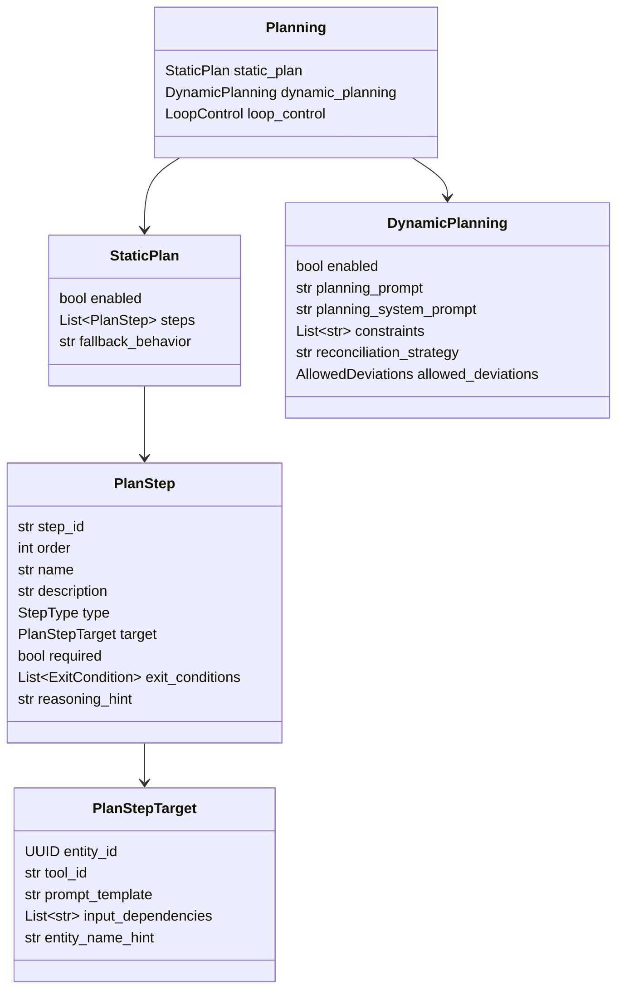

### 4.1 Every field

**`PlanStep`** — [schemas/planning.py:80](../../backend/src/ai/schemas/planning.py:80)

| Field | Type | Default | Meaning |
|-------|------|---------|---------|
| `step_id` | `str?` | `None` | Stable id. Rewritten by `_assign_step_ids` on the dynamic path. Referenced by `{{step_id}}` placeholders and `input_dependencies`. |
| `order` | `int` | `0` | Display / execution order. |
| `name` | `str` | `""` | Human label; also the key under which the step's output is stored in `context_state`. |
| `description` | `str?` | `None` | What the step should accomplish. Fed to the LLM for `ACTION` steps. |
| `type` | `StepType` | `ACTION` | See table below. Coerced case-insensitively; an unknown value raises `ValueError`. |
| `target` | `PlanStepTarget?` | `None` | Where the work goes. |
| `required` | `bool` | `True` | Whether a failure is fatal to the plan. |
| `exit_conditions` | `list[ExitCondition]` | `[]` | `{condition, next_step}` where `next_step` is an int, `"END"` or `"ESCALATE"`. |
| `reasoning_hint` | `str?` | `None` | Per-step reasoning selection (D-3). `"DEBATE"` / `"TREE_OF_THOUGHTS"` opts the step into the multi-agent Debate executor. A legacy `reasoning_mode` key is auto-mapped onto it by a `model_validator`. |

**`PlanStepTarget`** — [schemas/planning.py:38](../../backend/src/ai/schemas/planning.py:38)

| Field | Type | Meaning |
|-------|------|---------|
| `entity_id` | `UUID?` | Child entity for `CHILD_ENTITY_INVOCATION`. |
| `tool_id` | `str?` | Tool for `TOOL_CALL`. |
| `prompt_template` | `str?` | Instruction text. A `field_validator` JSON-dumps a dict/list into a string, because LLM planners routinely emit objects here. |
| `input_dependencies` | `list[str]` | Explicit upstream `step_id`s. |
| `entity_name_hint` | `str?` | Auto-populated by a `model_validator` when `entity_id` is a *name* rather than a UUID; `child_resolver` Strategy 4 uses it for a DB lookup. |

**`StepType`** — [schemas/enums.py:143](../../backend/src/ai/schemas/enums.py:143)

| Value | Meaning |
|-------|---------|
| `THOUGHT` | Pure reasoning; the planner prompt discourages it. |
| `ACTION` | LLM transforms data (extract/summarise/format). Default. |
| `TOOL_CALL` | Invoke a registered tool by `target.tool_id`. |
| `CHILD_ENTITY_INVOCATION` | Delegate to a child entity — spawns a nested run. |
| `NAVIGATE` / `READ` / `WRITE` | CORTEX memory operations. |
| `RECURSE` | Recursive goal expansion. |
| `AWAIT_CHILDREN` | Join point for async child dispatch. |

**`StaticPlan.fallback_behavior`** decides how the authored plan competes with
generated ones:

| Value | Behaviour |
|-------|-----------|
| `ADAPTIVE` *(default)* | The static plan is added as a candidate with `source="authored"` and competes normally. |
| `STRICT` | Binding. `authored_steps_covered` drops any candidate that does not cover every authored step; if that empties the pool, the authored plan is used verbatim and an `agent.plan.binding_fallback` event fires. |
| `DYNAMIC_ONLY` | The static plan is not seeded as a candidate at all. |

### 4.2 A real plan JSON

This is the shape produced by `_generate_dynamic_plan_v2` and stored on
`ExecutionRun.dynamic_plan`:

```json
{
  "steps": [
    {
      "step_id": "step_1_4f2a91bc",
      "order": 1,
      "name": "Search for source material",
      "description": "Find recent public sources on the requested topic",
      "type": "TOOL_CALL",
      "target": {
        "tool_id": "web_search",
        "prompt_template": "{{input}}",
        "input_dependencies": []
      },
      "required": true
    },
    {
      "step_id": "step_2_9c01de77",
      "order": 2,
      "name": "Synthesise findings",
      "description": "Condense the search results into a structured brief",
      "type": "ACTION",
      "target": {
        "prompt_template": "Summarise these findings into 5 bullets:\n{{step_1_4f2a91bc}}",
        "input_dependencies": ["step_1_4f2a91bc"]
      },
      "required": true
    },
    {
      "step_id": "step_3_1b7ee420",
      "order": 3,
      "name": "Delegate to Report Writer",
      "description": "Hand the brief to the child entity that owns document generation",
      "type": "CHILD_ENTITY_INVOCATION",
      "target": {
        "entity_id": "6f1c0f0e-1d3a-4b1e-9a2c-7e5b0d9f4a11",
        "prompt_template": "{{step_2_9c01de77}}",
        "input_dependencies": ["step_2_9c01de77"]
      },
      "required": true
    }
  ],
  "_plan_meta": {
    "style": "CHILD_ENTITY",
    "estimated_cost_usd": "0.110",
    "alternates": [
      {"style": "DAG_SEQUENTIAL", "estimated_cost_usd": "0.015", "judge_score": 0.62}
    ],
    "judge_reasoning": "Candidate 1 delegates document generation to the specialist child rather than printing markup as text."
  }
}
```

`_plan_meta` is not executed — it exists purely so the SPA can render a
plan-comparison modal. It is served by
`GET /executions/{run_id}/plan_candidates`
([api/admin.py:165](../../backend/src/ai/api/admin.py:165)).

### 4.3 Cost and latency estimation

`_plan_meta.estimated_cost_usd` comes from the pure functions in
[cost_estimator.py](../../backend/src/ai/planning/cost_estimator.py). These are
static seed tables, **not** live prices — the nightly refresh cron named in the
Track 7 plan was never built.

| Step type | Cost rule |
|-----------|-----------|
| `TOOL_CALL` | `TOOL_BASELINE_COST[tool_id]`, default `$0.01`. Range: `calculator` `$0.001` → `video_generation` `$0.10`. |
| `CHILD_ENTITY_INVOCATION` | flat `$0.10` |
| `THOUGHT` / `ACTION` / `RECURSE` | `$0.005 × MODEL_PRICE_FACTOR[model]`. Factors run `gemini-2.5-flash-lite` `0.5` → `claude-opus-4-1` `8.0`. |
| `READ` / `NAVIGATE` / `WRITE` | `$0.001` |
| anything else | `$0.01` |

Latency (`estimate_latency_s`) assumes strictly sequential execution:
`web_search` 3 s, `headless_browser` 10 s, `video_generation` 60 s, thinking
steps 6 s, child invocation 30 s, everything else 1 s.

---

## 5. Plan styles and the `PlanStyleBandit`

### 5.1 What a style is

A **plan style** is the *shape* of execution, not the content — "run these steps
in parallel" vs "one at a time" vs "hand the whole thing to a child". It is used
in two independent places:

* `classify_plan_style(steps)` labels a generated candidate so the label can be
  stored in `_plan_meta`;
* the `Strategist` asks the bandit to *choose* a style when more than one fits.

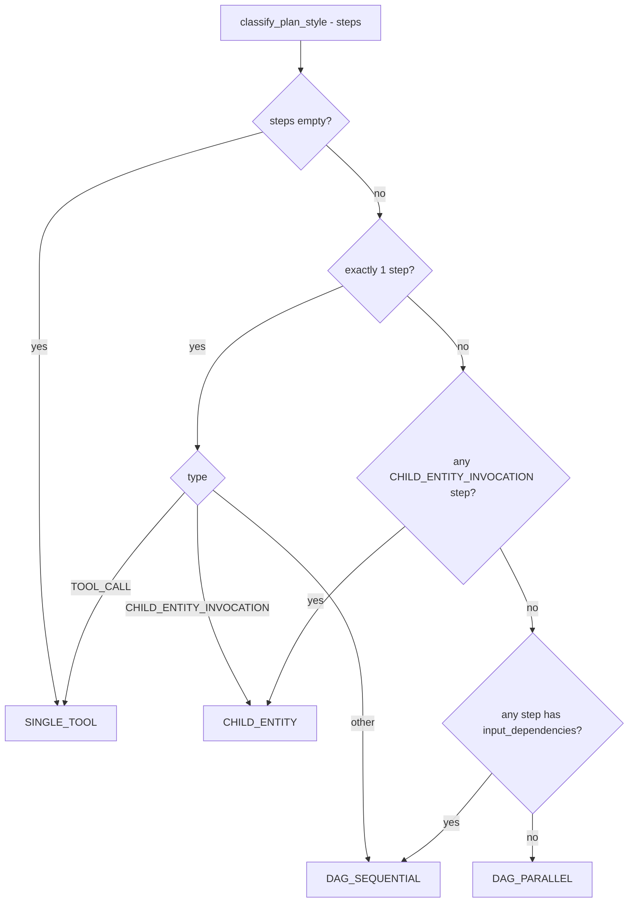

### 5.2 The arms

[`PlanStyleArm`](../../backend/src/ai/planning/plan_style_bandit.py:59):

| Arm | Meaning | Reachable today? |
|-----|---------|------------------|
| `DAG_PARALLEL` | multi-step DAG executor | yes — Strategist branch with ≥2 ready steps |
| `DAG_SEQUENTIAL` | one step at a time via `SingleStep` | yes — the common case |
| `RECURSIVE` | recursive goal expansion | yes — AGENT with no plan |
| `SINGLE_TOOL` | one `TOOL_CALL` step | yes — the default fallback branch |
| `DIALOG` | Dialog executor | no — the Dialog executor is flag-gated off (`agent_loop.executor_dialog_enabled: False`) |
| `CHILD_ENTITY` | ChildEntity executor | yes |

The Strategist also records a `"DEBATE"` arm string
([strategist.py:110](../../backend/src/ai/core/strategist.py:110)) that is not a
member of `PlanStyleArm`. The bandit's table is a plain string-keyed dict, so
this works — it simply creates an extra arm row.

### 5.3 The algorithm: ε-greedy (not UCB, not Thompson)

Read the code before you believe any doc, including this one:

```python
# backend/src/ai/planning/plan_style_bandit.py
if self.rng.random() < self.epsilon:
    return self.rng.choice(candidates), True
scored = sorted(
    candidates,
    key=lambda c: self.score(table.arms[c]),
    reverse=True,
)
return scored[0], False
```

That is textbook **ε-greedy**: with probability ε pick uniformly at random
(explore), otherwise pick the highest-scoring arm (exploit). There is no
confidence bound and no posterior sampling anywhere in the file.

ε defaults to `0.10`, read from
`NUMERIC_DEFAULTS["bandit.epsilon"]` in
[agent_loop.py:1314](../../backend/src/ai/core/agent_loop.py:1314).

**Short-circuit:** `select_arm` de-duplicates `candidates` and returns
immediately with `exploring=False` when only one candidate remains — no
randomness, no table load.

### 5.4 The reward formula

```python
# backend/src/ai/planning/plan_style_bandit.py
@staticmethod
def score(st: ArmState) -> float:
    """Higher is better. Win-rate-per-dollar with Laplace smoothing."""
    win_rate = (st.successes + 1) / (st.pulls + 2)
    return win_rate / max(st.avg_cost_usd, 0.01)
```

In words:

```
              successes + 1
            -----------------
               pulls + 2
score  =  ---------------------------
           max(avg_cost_usd, 0.01)
```

* The `+1 / +2` is **Laplace (add-one) smoothing** — a fresh arm scores
  `0.5 / 0.05 = 10.0` rather than dividing by zero, so unexplored arms are
  optimistically viable.
* Dividing by average cost makes this a **reward-per-dollar** score, so a
  cheaper arm with the same win rate always wins.
* `avg_cost_usd` is floored at `$0.01` so a near-free arm cannot produce an
  infinite score.

`avg_cost_usd` itself is an **exponential moving average** with `ema_alpha = 0.2`:

```python
if st.pulls == 1:
    st.avg_cost_usd = float(cost_usd)
else:
    st.avg_cost_usd = (1 - alpha) * st.avg_cost_usd + alpha * float(cost_usd)
```

### 5.5 Lifecycle: who selects, who rewards, where it is stored

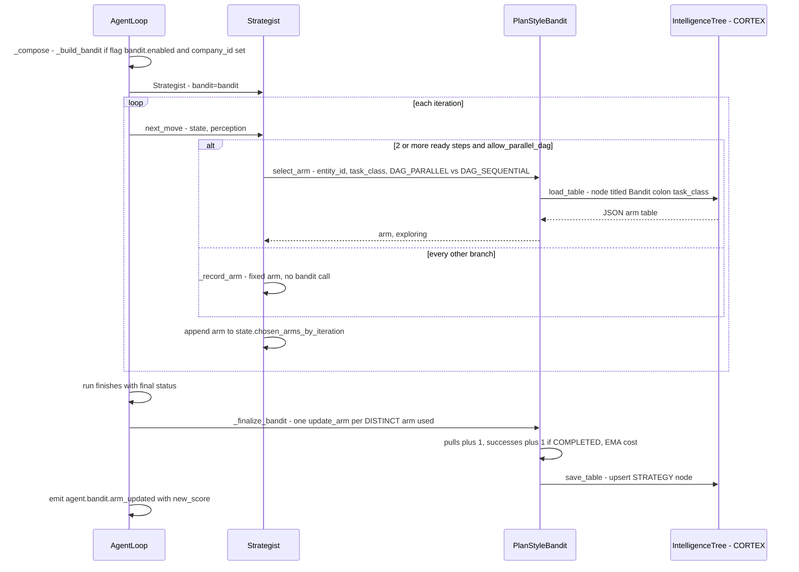

**The bandit is only consulted once**, in the `len(ready) >= 2 and
allow_parallel_dag` branch. Every other Strategist branch calls `_record_arm`,
which appends the arm name to `state.chosen_arms_by_iteration` *without*
consulting the bandit. So the bandit learns statistics for all arms but only
ever *decides* between `DAG_PARALLEL` and `DAG_SEQUENTIAL`.

**Reward computation at run end**
([agent_loop.py:1430](../../backend/src/ai/core/agent_loop.py:1430)):

```python
success = status == RunStatus.COMPLETED.value
per_arm_cost = float(state.budget.usd_used) / max(len(arms), 1)
seen: dict[str, int] = {}
for arm in arms:
    seen[arm] = seen.get(arm, 0) + 1
for arm, _pulls in seen.items():
    st = await self.bandit.update_arm(
        entity_id=..., task_class=..., arm=arm,
        success=success, cost_usd=per_arm_cost,
    )
```

Three consequences worth internalising:

1. **Reward is run-level, not step-level.** Every arm used in a run gets the
   *same* success flag — the run's final status. An arm that behaved perfectly
   in a run that later failed is penalised.
2. **Cost is the run's total divided evenly** by the number of iterations, not
   the arm's actual spend.
3. **De-duplication:** an arm pulled 10 times in one run is credited once
   (`for arm, _pulls in seen.items()` ignores `_pulls`), so a long run dominated
   by one arm does not swamp the table.

### 5.6 Persistence

Arm state lives in the entity's **IntelligenceTree** under the
`🎯 Strategies` section as a `STRATEGY`-type `CortexNode` titled
`Bandit: {task_class}`. The `content` column holds the JSON table:

```json
{
  "DAG_PARALLEL":   {"pulls": 14, "successes": 9,  "avg_cost_usd": 0.084, "last_pull_at": "2026-08-01T09:12:03"},
  "DAG_SEQUENTIAL": {"pulls": 31, "successes": 27, "avg_cost_usd": 0.031, "last_pull_at": "2026-08-12T17:44:51"}
}
```

`summary` is a human-readable one-liner (`DAG_PARALLEL: pulls=14 wins=9 wr=0.64
cost=$0.0840 | ...`). Persistence is **best-effort**: if `db`, `entity_id` or
`company_id` is `None`, or the `🎯 Strategies` section does not exist yet, the
bandit silently falls back to a per-process in-memory dict
(`self._memory_tables`), which is exactly what the unit tests exercise.

---

## 6. Plan invariants

[plan_invariants.py](../../backend/src/ai/planning/plan_invariants.py) is the
deterministic half of planning: eight pure functions, no DB, no LLM, each
returning an `Invariant(name, passed, detail)`.

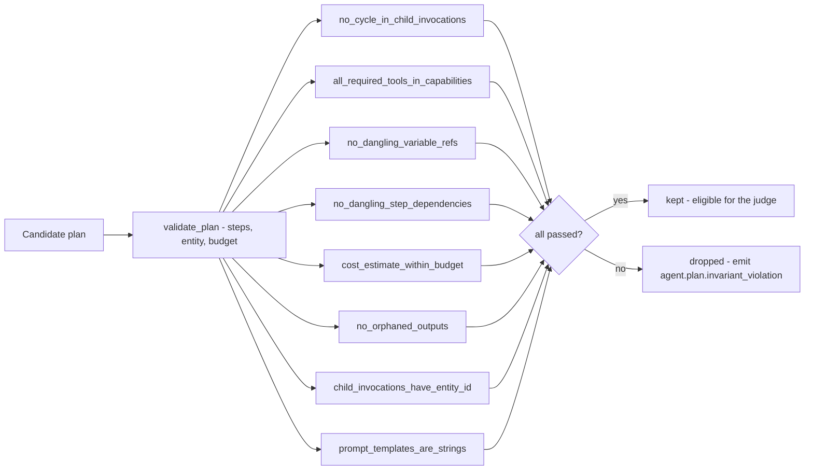

### 6.1 The eight invariants

| # | Name | What it checks | Consequence of violating |
|---|------|----------------|--------------------------|
| 1 | `no_cycle_in_child_invocations` | No `CHILD_ENTITY_INVOCATION` step targets the parent entity's own id. Passes trivially when `entity.id` is unknown. | Candidate dropped. Without it a parent would spawn itself forever. |
| 2 | `all_required_tools_in_capabilities` | Every `TOOL_CALL` step's `target.tool_id` appears in `entity.capabilities["tools"]`. | Candidate dropped. Prevents planning a tool the entity is not allowed to use. **See the bug note below.** |
| 3 | `no_dangling_variable_refs` | Every `{{var}}` and `{var}` in a `prompt_template` resolves to a whitelisted name or an *earlier* step's id. Whitelist: `input, goal, context, __memory__, __intelligence_rules__, __episodic_memory__, step_id, iteration, user_id`. | Candidate dropped. Catches `{{step_7}}` in step 2. |
| 4 | `no_dangling_step_dependencies` | Every `target.input_dependencies` entry matches a step's `step_id`, `id` or `name` anywhere in the plan. | Candidate dropped. Note this one is **order-insensitive**, unlike #3. |
| 5 | `cost_estimate_within_budget` | `estimate_plan_cost(plan)` ≤ cap. Cap resolution: `budget.usd_max` first, then `entity.governance["max_cost_usd"]`. A `None` or non-positive cap passes automatically. | Candidate dropped. An estimator exception also fails the invariant. |
| 6 | `no_orphaned_outputs` | Any non-final step declaring an `output_slot` must have that slot (or the step's id) referenced downstream. | Candidate dropped. Pure heuristic; the final step is exempt and a missing `output_slot` is fine. |
| 7 | `child_invocations_have_entity_id` | Every `CHILD_ENTITY_INVOCATION` has `target.entity_id` **or** `target.entity_name_hint`. | Candidate dropped. `child_resolver` can rescue a name hint; it cannot rescue nothing. |
| 8 | `prompt_templates_are_strings` | `target.prompt_template` is `None` or a `str`. | Candidate dropped. Backstop for LLMs emitting objects, even though `PlanStepTarget` coerces them. |

Plus one invariant that is **not** in the default suite:

| Name | When it runs | Effect |
|------|-------------|--------|
| `authored_steps_covered` | only from `PlanGenerator._enforce_binding`, and only when `static_plan.fallback_behavior == "STRICT"` | Candidate must contain every authored step, matched by `step_id` first then case-insensitively by `name`. Failures are appended to `cand.invariant_violations` and emit `agent.plan.binding_violation`. |

It is excluded from `validate_plan` because that helper takes no static-plan
argument.

### 6.2 What happens when everything fails

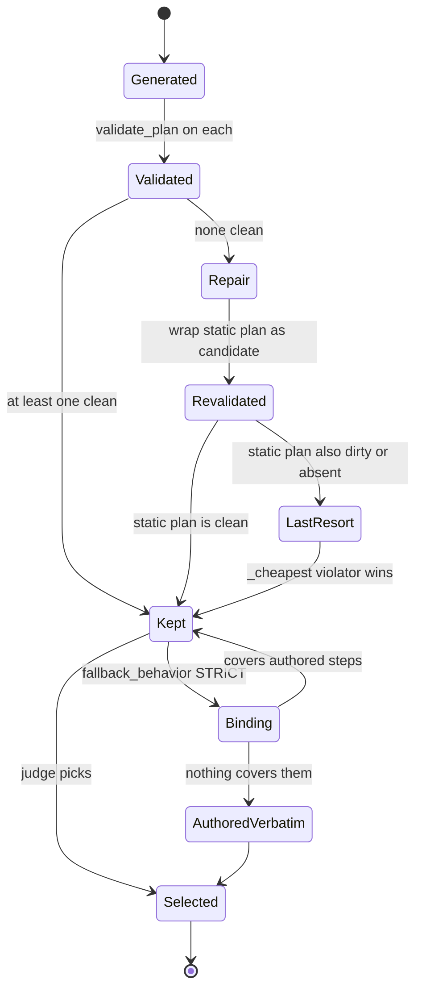

**The run is never allowed to die from a failed invariant.** Worst case the
cheapest invariant-violating candidate is executed, and its violations are
recorded on `cand.invariant_violations`.

> **Bug worth knowing about (invariant #2).** Entity capabilities are stored as
> a list of `ToolReference` objects — `[{"tool_id": "web_search"}]` — but the
> invariant does `declared = {str(t) for t in (caps.get("tools") or [])}`, which
> stringifies each dict to `"{'tool_id': 'web_search'}"`. A `TOOL_CALL` step with
> `target.tool_id == "web_search"` therefore never matches, and the invariant
> fails for every real tool-bearing entity. The unit test at
> [test_plan_invariants.py:63](../../backend/tests/unit/test_plan_invariants.py:63)
> passes plain strings (`tools=["web_search"]`), so it does not catch this.
> Practical effect: candidates with `TOOL_CALL` steps are dropped more often
> than intended, and the planner leans on the repair/cheapest fallbacks.
> `ai/meta/board/validator.py:111` has the same expression.

---

## 7. Plan adaptation and re-planning

### 7.1 The trigger

There is exactly one production re-plan trigger: the **supervisor critic
returns `REPLAN`**.

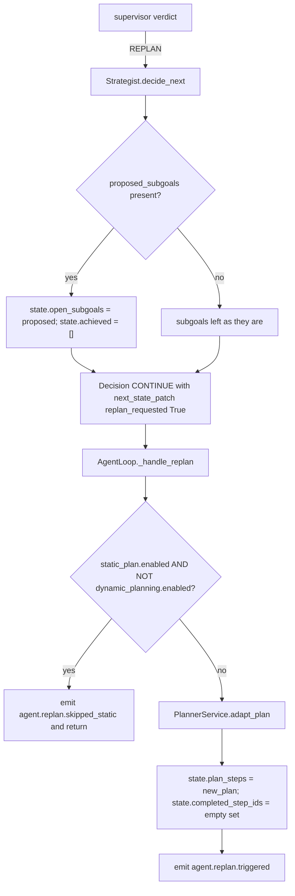

The **static-plan guard** exists because of a real incident: a supervisor that
recommends `REPLAN` every third iteration would otherwise regenerate the plan
*and* wipe `completed_step_ids`, so the run re-ran step 1 forever. See the
docstring at
[agent_loop.py:1363](../../backend/src/ai/core/agent_loop.py:1363).

### 7.2 `PlannerService.adapt_plan`

```python
# backend/src/ai/planning/planner_service.py
completed_ids = {s.get("step_id") for s in completed_steps if s.get("step_id")}
remaining = [s for s in original_plan if s.get("step_id") not in completed_ids]
...
if v2:
    ctx = PlanContext(
        entity=None,
        static_plan={"steps": list(original_plan or [])},
        goal=goal or "",
        failed_step=failed_step or {},
    )
    gen = PlanGenerator(llm_router=self.llm, db=self.db)
    result = await gen.generate(ctx, n=2)
    return self._assign_step_ids(
        list(result.chosen.steps), start_from=len(completed_steps) + 1,
    )
return remaining
```

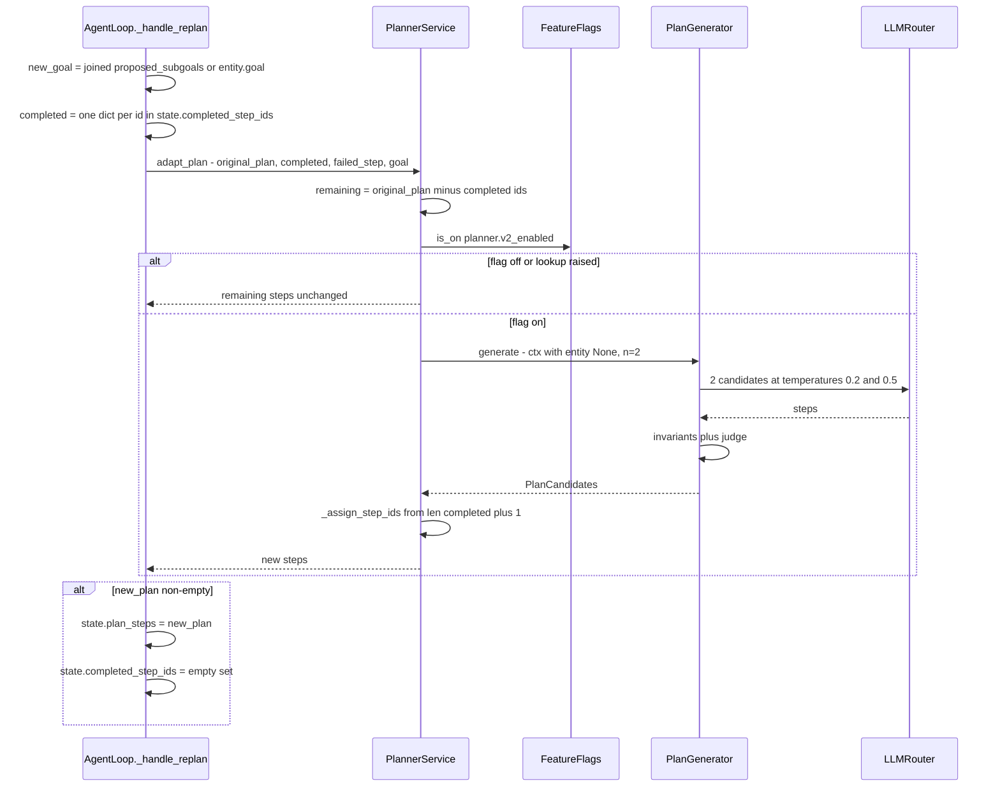

Three sharp edges in this path:

* **`entity=None`.** The replan `PlanContext` passes no entity, no budget and no
  `company_id`. So invariants 1, 2 and 5 degrade to automatic passes (no parent
  id, no declared tools, no cost cap), and `_log_attributed_usage` short-circuits
  on `company_id is None` — the replan's planner tokens are **not billed**.
* **`completed_step_ids` is cleared** even though the new plan is id-renumbered
  starting after the completed count. Any step whose work was already done is
  re-run if the new plan re-describes it.
* **`_handle_replan` synthesises `completed_steps` from ids only** —
  `{"step_id": sid, "name": sid, "output": ""}`. The planner therefore never
  sees what the completed steps actually produced.

### 7.3 What about `__completed_steps__`?

`__completed_steps__` is a member of
[`INTERNAL_CONTEXT_KEYS`](../../backend/src/ai/constants.py:44) and
[INTERNAL_KEYS.md](../../backend/src/ai/core/INTERNAL_KEYS.md) documents it as
*"Ordered list of completed-step dicts; consumed by `PlannerService.adapt_plan`"*.

**That is stale.** Grep the backend and the key appears in exactly three
places:

| Location | Role |
|----------|------|
| `constants.py:44` | declared in the scrub list |
| `step_executor.py:219` | stripped from child-entity input as a parent-scoped key |
| `INTERNAL_KEYS.md:33` | the stale documentation row |

Nothing writes it (`store_step_output` in
[context_utils.py:22](../../backend/src/ai/core/context_utils.py:22) stores
outputs under the step *name* and *id*, not under `__completed_steps__`), and
`adapt_plan` never reads `context_state` at all — it takes `completed_steps` as
an explicit argument. Treat the key as a documented no-op: it is still scrubbed
from prompts and stripped from child input, so leaving it alone is harmless, but
do not build on it.

### 7.4 `PlanGenerator.replan` is dead code

[`PlanGenerator.replan`](../../backend/src/ai/planning/plan_generator.py:234)
builds a `PlanContext` straight from `AgentState` — which is exactly what
`adapt_plan` should be doing — but **nothing calls it**. `grep -rn "\.replan("
src/` returns no production hits. The module docstring claiming it is
"invoked by AgentLoop's supervisor-triggered REPLAN path" is wrong; that path
goes through `PlannerService.adapt_plan`.

Related: `PlanGenerator` is always constructed as
`PlanGenerator(llm_router=..., db=...)` with no `emit_event`, so **none of the
`agent.plan.*` telemetry events** (`generation_start`, `candidate_generated`,
`invariant_violation`, `judge_decision`, `chosen`, `replan`,
`binding_violation`, `binding_fallback`) are ever emitted in production.

---

## 8. The critic pipeline

### 8.1 The contract

```python
# backend/src/ai/planning/critic_pipeline.py
@runtime_checkable
class CriticPipeline(Protocol):
    async def pre_action(self, move: Any, state: AgentState) -> PreCriticVerdict: ...
    async def post_action(self, state, observation) -> PostCriticVerdict: ...
    async def alignment(self, state, observation) -> AlignmentVerdict: ...
    async def supervisor(self, state: AgentState) -> SupervisorVerdict: ...
    async def finalize_iteration(self, state) -> Optional["StepHealthRecord"]: ...
```

Two implementations ship:

| Class | Behaviour |
|-------|-----------|
| [`NoOpCriticPipeline`](../../backend/src/ai/planning/critic_pipeline.py:111) | Everything PASSes. `finalize_iteration` returns `None`. Used when `critic_pipeline.v2_enabled` is off, when `state.company_id` is `None`, or when construction throws. |
| [`RealCriticPipeline`](../../backend/src/ai/planning/critic_pipeline.py:228) | The four real stages. |

Construction happens in `AgentLoop._compose`
([agent_loop.py:768](../../backend/src/ai/core/agent_loop.py:768)); an explicit
`critic_pipeline=` constructor argument always wins, which is how the tests
inject deterministic verdicts.

### 8.2 The combined sequence

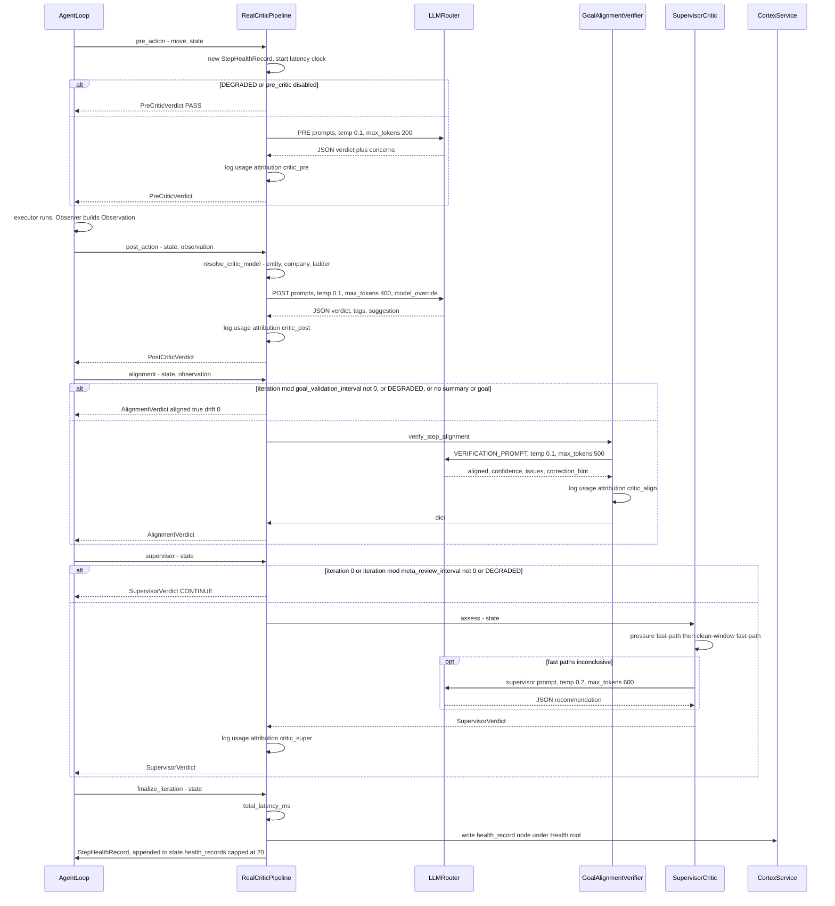

### 8.3 The `CriticMode` budget guard

```python
# backend/src/ai/planning/critic_pipeline.py
def _budget_mode(self, state: AgentState) -> CriticMode:
    run_cost = float(state.budget.usd_used)
    critic_cost = float(self._cumulative_critic_cost)
    if run_cost <= 0:
        return CriticMode.FULL
    if critic_cost / run_cost > self.config.critic_cost_share_pct:
        return CriticMode.DEGRADED
    return CriticMode.FULL
```

| Mode | pre_action | post_action | alignment | supervisor |
|------|-----------|-------------|-----------|------------|
| `FULL` | LLM call | LLM call | LLM call on cadence | LLM call on cadence |
| `DEGRADED` | forced PASS | **still runs** | forced aligned | forced CONTINUE |

Note the asymmetry: DEGRADED skips three of four stages but **post_action always
runs**, contradicting the module docstring's "minimal post". The post critic is
the one that produces failure tags, so it is treated as non-negotiable.

### 8.4 Choosing a different critic model

```python
# backend/src/ai/planning/critic_pipeline.py
_CRITIC_LADDER: list[tuple[str, str]] = [
    ("flash", "gemini-2.5-pro"),
    ("haiku", "claude-sonnet-4-5"),
    ("mini",  "gpt-4o"),
    ("nano",  "gpt-4o"),
    ("sonnet","claude-opus-4-1"),
    ("opus",  "gpt-5"),
    ("gpt-4o","claude-sonnet-4-5"),
    ("gpt-5", "claude-opus-4-1"),
    ("gemini-2.5-pro", "claude-sonnet-4-5"),
]
```

`resolve_critic_model` tries, in order: entity-level
`logic_gate.review_mechanism.critic_model_override` → company override →
first substring match in the ladder → `None`, meaning "use the same model as the
actor with a hostile prompt". Only `post_action` uses it; the pre, alignment and
supervisor stages use whatever the router picks by default (except the
supervisor, which honours `critic_model_override` directly).

> The company override is hardcoded to `None` in
> [agent_loop.py:912](../../backend/src/ai/core/agent_loop.py:912) —
> `"company_critic_override": None, # Track 8 wires IntegrationRegistry lookup.`
> That lookup was never built.

### 8.5 The shared `StepHealthRecord`

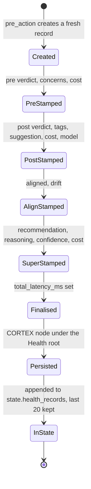

If `pre_action` was skipped (the loop bypasses it for plan-driven moves — see
§9), `_ensure_record` lazily creates a record so the later stages still have
somewhere to write.

Persistence writes a CORTEX node with `node_type="health_record"`, title
`🩺 step={step_id} iter={n}`, and the full record JSON as content, under a lazily
created `🩺 Health` root. It is read back by
`GET /executions/{run_id}/health_records`
([api/admin.py:118](../../backend/src/ai/api/admin.py:118)) and mined by the
weekly [`CriticCalibrator`](../../backend/src/ai/planning/critic_calibration.py:73).

---

## 9. Stage 1 — the pre-action critic

**When:** before the executor runs, every iteration — but the loop skips it
entirely for plan-driven moves.

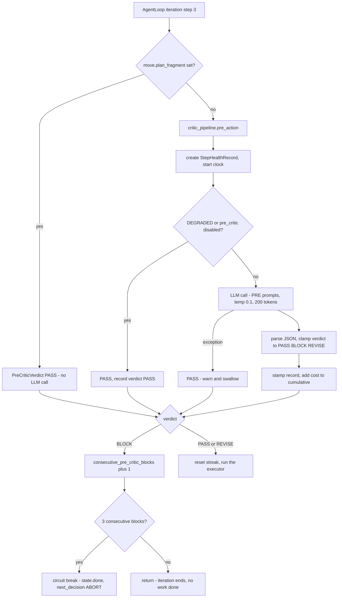

**Why the plan-fragment bypass exists.** The Strategist is deterministic: given
the same state it proposes the *identical* move every iteration. One pre-critic
`BLOCK` therefore becomes three consecutive blocks and trips the circuit breaker
with zero work done and $0 billed. The comment at
[agent_loop.py:448](../../backend/src/ai/core/agent_loop.py:448) documents this
as "Phase 11 AgentLoop incident #2". The net effect: **on the common
plan-driven path the pre-critic never runs at all.** It only guards open-ended
moves — recursive goal expansion, or `SingleStep` with no fragment.

**Inputs** (`PRE_PROMPT_USER` in
[critic_prompts.py:24](../../backend/src/ai/planning/critic_prompts.py:24)):

| Placeholder | Source |
|-------------|--------|
| `goal` | `config.entity_goal` or `"(unknown)"` |
| `subgoals` | first 5 `state.open_subgoals` descriptions, comma-joined |
| `executor` | `move.executor` |
| `rationale` | `move.rationale`, first 200 chars |
| `plan_size` | `len(move.plan_fragment or [])` |
| `pressure` | `state.budget.pressure`, 2 dp |

```
You are a strict pre-action critic for an autonomous AI agent. Your job is to
detect obviously bad moves BEFORE they execute. Reply in JSON only.
```

Expected response: `{"verdict": "PASS|BLOCK|REVISE", "concerns": ["..."]}`.
Anything not in `{PASS, BLOCK, REVISE}` is coerced to `PASS`.

| Verdict | What the loop does |
|---------|-------------------|
| `PASS` | Reset `consecutive_pre_critic_blocks` to 0, run the executor. |
| `REVISE` | **Identical to `PASS`.** The loop only branches on `BLOCK`; the concerns are recorded on the health record but nothing acts on them. |
| `BLOCK` | Increment the streak, emit `agent.loop.pre_critic_block`, `return` from the iteration without acting. At 3 consecutive blocks (`_MAX_CONSECUTIVE_PRE_CRITIC_BLOCKS`) emit `agent.loop.pre_critic_circuit_break`, set `state.done = True` and `next_decision = "ABORT"`. |

---

## 10. Stage 2 — the post-action critic

**When:** after every executor invocation. No cadence throttle, no DEGRADED
skip. This is the workhorse.

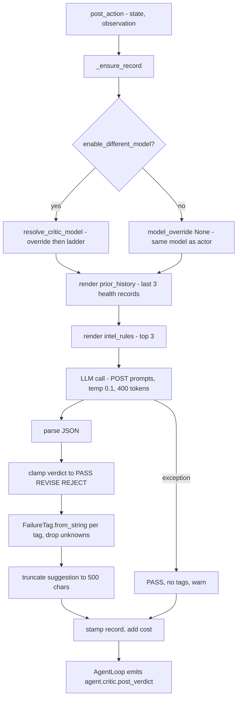

**Inputs** (`POST_PROMPT_USER`):

| Placeholder | Source |
|-------------|--------|
| `goal` | `config.entity_goal` |
| `task` | `config.task_description` — in practice the **entity's `name`**, set in `_build_real_critic_pipeline` |
| `step_desc` | `"executor={x} move={y}"` from `state.last_action`, or `"(initial step)"` |
| `outcome` | `observation.outcome` — one of `success`, `partial`, `fail`, `blocked` |
| `output` | `observation.summary`, truncated to 2000 chars |
| `prior_history` | last 3 `StepHealthRecord`s rendered as `iter=N post=X tags=[...] align=Y` |
| `intel_rules` | top 3 intelligence rules — **always `"(none)"`**, because `intelligence_reader` is passed as `None` at [agent_loop.py:930](../../backend/src/ai/core/agent_loop.py:930) |

The prompt lists the closed tag set inline and demands
`{"verdict": "PASS|REVISE|REJECT", "tags": [...], "suggestion": "..."}`.

### 10.1 `FailureTag` — the closed enum

[failure_tags.py](../../backend/src/ai/planning/failure_tags.py). `severity` is
declared 0–3 but **nothing reads it** — `pick_retry` branches on tag identity,
not severity.

| Tag | Severity | Typical meaning |
|-----|----------|-----------------|
| `OFF_TOPIC` | 2 | Output is about the wrong subject. |
| `HALLUCINATION` | 3 | Invented facts. |
| `INCOMPLETE` | 1 | Right direction, not finished. |
| `WRONG_FORMAT` | 1 | Correct content, wrong shape. |
| `TOOL_FAILURE` | 2 | The tool itself errored or returned nothing. |
| `CONTRADICTION` | 2 | Conflicts with earlier output. |
| `UNVERIFIABLE` | 2 | No sources / cannot be checked. |
| `POLICY_VIOLATION` | 3 | Breaks a governance rule. |
| `UNDER_BUDGET` | 0 | Informational. |
| `OVER_BUDGET` | 2 | Cost overrun. |
| `BLOCKED_DEPENDENCY` | 1 | Upstream step did not deliver. |
| `NEEDS_CLARIFICATION` | 1 | Needs a human answer. |

`FailureTag.from_string` is deliberately tolerant: it upper-cases and converts
spaces/hyphens to underscores, returning `None` for anything unrecognised (which
is then dropped).

| Verdict | What the loop does |
|---------|-------------------|
| `PASS` | Nothing. `record.is_actionable_failure()` is `False`. |
| `REVISE` | Actionable. Goes through the retry machinery in §14. |
| `REJECT` | Actionable. Same machinery — the two are not distinguished downstream. |

---

## 11. Stage 3 — alignment and GoalGuard

### 11.1 The modern path — `CriticPipeline.alignment`

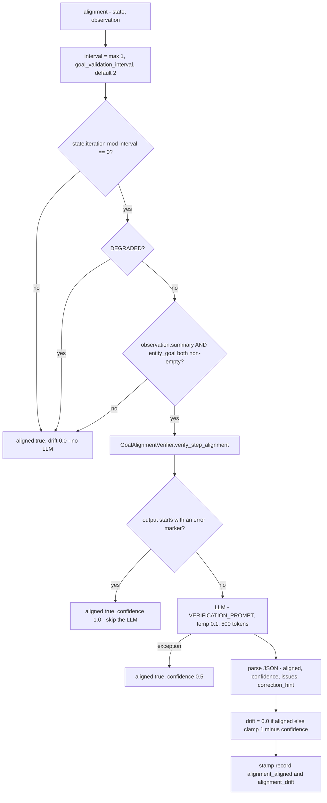

Error markers that short-circuit verification, from
[goal_alignment.py:89](../../backend/src/ai/planning/goal_alignment.py:89):
`[tool_empty]`, `[failed]`, `[timeout]`, `[error]`, `[dependency_failed]`,
`[data_missing]`. Those failures are already handled elsewhere; running an
alignment check on them would just waste a call.

The verifier's prompt asks four explicit questions — topic correctness, data
relevance, drift/hallucination signals, and substantiveness — and demands:

```json
{"aligned": true, "confidence": 0.0, "issues": [], "correction_hint": ""}
```

If JSON parsing fails, it falls back to a substring scan for
`"aligned": false` and, if found, returns `aligned=False` with
`confidence=0.7` and the raw output's first 200 chars as the correction hint.

**What the loop does with the verdict:** it emits an `agent.critic.alignment`
event, folds `aligned`/`drift` into the `StepHealthRecord`, and passes the
`Verdicts` bundle to the `Reflector`. **Nothing else.** In the AgentLoop path a
misaligned step does **not** trigger a retry, a correction hint, or a re-run.
The `AlignmentVerdict.correction_hint` field is populated but never consumed.

### 11.2 Cadence throttling: `__goal_check_counter__`

The counter belongs to the **legacy step-engine path**, not the AgentLoop. In
[step_engine.py:351](../../backend/src/ai/core/step_engine.py:351):

```python
reasoning_cfg = (entity.logic_gate or {}).get("reasoning_config", {})
goal_interval = reasoning_cfg.get("goal_validation_interval", 0)
if goal_interval > 0 and entity.goal and isinstance(step_result, dict) and step_result.get("output"):
    step_count = context_state.get("__goal_check_counter__", 0) + 1
    context_state["__goal_check_counter__"] = step_count
    if step_count % goal_interval == 0:
        ...GoalGuard...
```

So there are **two independent cadences with the same name**:

| Path | Config location | Default | Counter |
|------|----------------|---------|---------|
| AgentLoop / `CriticPipeline.alignment` | `entity.governance["goal_validation_interval"]` | `2` | `state.iteration` |
| Legacy step engine / GoalGuard | `entity.logic_gate.reasoning_config.goal_validation_interval` | `0` — meaning **off** | `context_state["__goal_check_counter__"]` |

Only the second one is declared in the Pydantic schema
([reasoning.py:36](../../backend/src/ai/schemas/reasoning.py:36), default `2`).
The governance key the AgentLoop reads is an undeclared extra. Setting
`reasoning_config.goal_validation_interval` does **not** change AgentLoop
alignment cadence.

### 11.3 The correction hint: `__alignment_correction__`

Also legacy-path only:

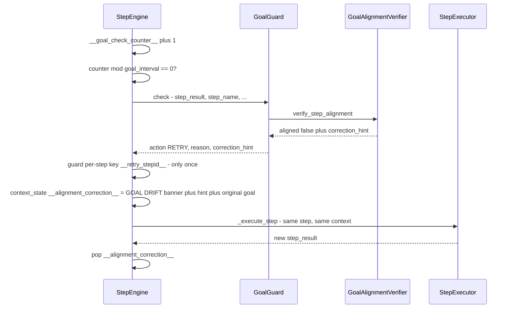

The banner written into context is literally:

```
⚠️ GOAL DRIFT: {reason}. Correction: {hint}. Focus STRICTLY on the original goal: {entity.goal}
```

Because it is set on `context_state` immediately before the re-execution and
popped immediately after, it only ever affects the *one* re-run — not
"iteration N+1" as INTERNAL_KEYS.md suggests. The `__retry_{step_id}__` guard
caps it at one correction per step per run.

### 11.4 GoalGuard's four actions

[`GoalGuard.check`](../../backend/src/ai/planning/goal_guard.py:74) returns one
of four actions. It is a **deprecated shim** that logs a one-shot process-level
deprecation notice on construction.

| Action | Condition | Legacy caller behaviour |
|--------|-----------|------------------------|
| `CONTINUE` | default | Proceed. |
| `RETRY` | alignment verifier says `aligned: false` | Re-execute the step once with the correction banner. |
| `EARLY_EXIT` | autonomous mode, `step_idx % goal_interval == 0`, planner progress `score > confidence_threshold * 100` (default `0.85 * 100 = 85`) | Stop — goal achieved. |
| `REPLAN` | autonomous mode, `score < 30` and past the plan midpoint | Re-plan. |

The progress score comes from
[`PlannerService.validate_goal_progress`](../../backend/src/ai/planning/planner_service.py:199),
a `goal_validation` task-type LLM call returning
`{"score": 0-100, "reasoning": "...", "goal_achieved": bool}`, defaulting to
`{"score": 50}` on any failure.

`step_engine.py` only ever calls `guard.check(...)` with `is_autonomous`
defaulting to `False`, so **`EARLY_EXIT` and `REPLAN` are unreachable from the
one live caller** — only the `RETRY` branch matters in practice.

`goal_guard.py` also exports `AlignmentCritic`, a thin named wrapper over
`GoalAlignmentVerifier`, which nothing imports.

---

## 12. Stage 4 — the supervisor

**When:** `state.iteration != 0 and state.iteration % meta_review_interval == 0`
— default interval **3**, so iterations 3, 6, 9, …

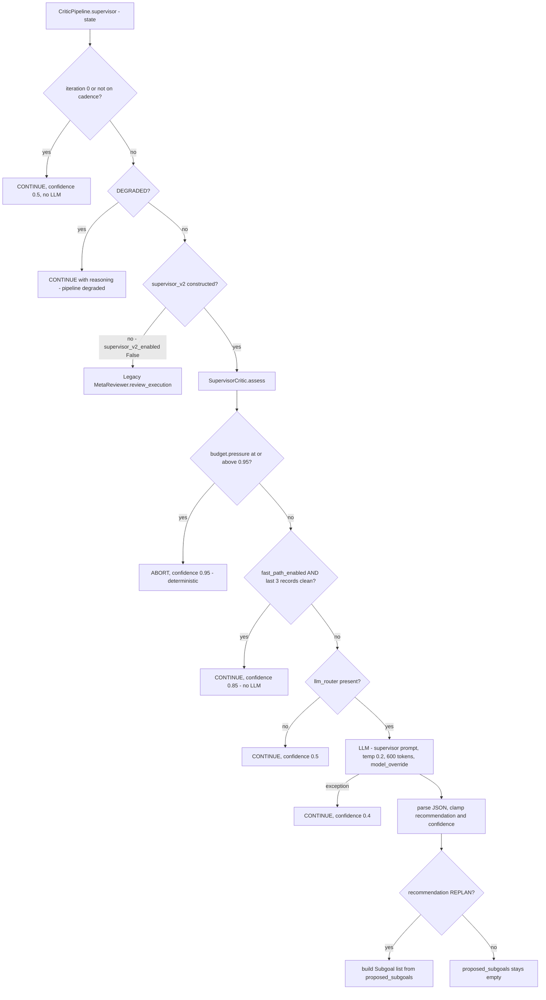

### 12.1 `SupervisorCritic.assess` in detail

```python
# backend/src/ai/planning/supervisor_critic.py
# 1. Budget-pressure short-circuit.
if state.budget.pressure >= self.config.abort_pressure_threshold:
    return SupervisorVerdict(recommendation="ABORT", confidence=0.95, ...)

# 2. Fast path — N consecutive clean health records.
if self.config.fast_path_enabled and self._fast_path_continue(state):
    return SupervisorVerdict(recommendation="CONTINUE", confidence=0.85, ...)
```

"Clean" means, for each of the last `fast_path_window` (default 3) records:
`post_critic_verdict == "PASS"` **and** `alignment_aligned is not False`. Fewer
than `window` records means not clean → no fast path.

`SupervisorCriticConfig` defaults:

| Field | Default | Effect |
|-------|---------|--------|
| `fast_path_enabled` | `True` | Enables the clean-window skip. |
| `fast_path_window` | `3` | How many consecutive clean records are needed. |
| `abort_pressure_threshold` | `0.95` | Deterministic ABORT at or above this budget pressure. |
| `max_tokens` | `600` | Supervisor LLM cap. |
| `temperature` | `0.2` | Supervisor LLM temperature. |
| `critic_model_override` | `None` | Passed straight to `call_llm(model_override=...)`. |
| `entity_goal` | `""` | Rendered into the prompt as `## Goal`. |

### 12.2 The supervisor prompt

`_build_prompt` renders a compact state dump:

```
## Iteration: 6 / 50
## Budget: USD $0.41 / $2.00, tokens 18422/200000, wall 73s/600s, pressure=0.21
## Goal: <entity goal>
## Task class: general
## Open subgoals (2):
  - Produce the comparison table
  - Draft the executive summary (blocked: awaiting_hitl)
## Blockers (1):
  - missing_data: upstream scrape returned 0 rows
## Recent reflections (last 3):
  - worked=search returned sources | didnt=∅
## Recent step health (last 5):
  - step=step_2_9c01de77 post=REVISE tags=[INCOMPLETE]
## Intelligence rules (top 3):
  - <rule text>

Respond with JSON only:
{"recommendation":"CONTINUE|REPLAN|ABORT|PAUSE","confidence":0.0-1.0,"reasoning":"...","proposed_subgoals":[{"description":"...","priority":1}]}
```

The system prompt tells it to *"Be conservative: recommend ABORT only on clear
failure or budget risk; recommend PAUSE only when human input is essential."*

Intelligence rules here come from `state.perception.intelligence_rules`, which
*is* populated by the Perceiver — unlike the post-critic's `intel_rules`.

### 12.3 What the loop does per recommendation

Handled by
[`Strategist.decide_next`](../../backend/src/ai/core/strategist.py:201):

| Recommendation | `Decision.next` | Side effects |
|----------------|-----------------|--------------|
| `CONTINUE` | falls through to the normal termination checks | none |
| `REPLAN` | `CONTINUE` | If `proposed_subgoals` is non-empty: `state.open_subgoals = proposed`, `state.achieved = []`. Sets `next_state_patch={"replan_requested": True}` → `AgentLoop._handle_replan`. |
| `ABORT` | `ABORT` | Run finishes with `RunStatus.FAILED`. |
| `PAUSE` | `PAUSE_HITL` | Run finishes with `RunStatus.PAUSED`. |

Budget exhaustion is checked **before** the supervisor verdict, so an exhausted
budget always aborts regardless of what the supervisor said.

### 12.4 The deprecated `MetaReviewer` shim

[`ai/core/meta_review.py`](../../backend/src/ai/core/meta_review.py) keeps the
Phase 10D class name and `review_execution(entity_goal, completed_steps,
remaining_steps, total_cost_usd, context_summary)` signature. Internally it:

1. builds a throwaway `AgentState` with a synthetic `run_id`/`entity_id`,
   `iteration = max(1, len(completed_steps))`, and a `Budget` whose
   `max_cost_usd` is `max(total_cost_usd * 2, 0.10)`;
2. constructs a `SupervisorCritic` with `fast_path_enabled=False`;
3. calls `assess(state)` and flattens the verdict to
   `{"recommendation", "confidence", "reasoning", "adjustments": []}`.


**This path is unreachable in production.** `_PipelineConfig.supervisor_v2_enabled`
defaults to `True` and `_build_real_critic_pipeline` never puts
`supervisor_v2_enabled` in the config dict it passes, so `_supervisor_v2` is
always constructed. The flags `meta_review.v2_enabled` and
`meta_review.fast_path_enabled` exist in `DEFAULTS` but are read by **no code**.
Only a test that constructs `RealCriticPipeline` with an explicit
`{"supervisor_v2_enabled": False}` config reaches the shim.

---

## 13. Verdict types

All five live in
[core/agent_state.py:127-165](../../backend/src/ai/core/agent_state.py:127) —
deliberately in the kernel, so `planning/` depends on `core/` and not the other
way round.

```mermaid
classDiagram
    class Verdicts {
        PreCriticVerdict pre
        PostCriticVerdict post
        AlignmentVerdict align
        SupervisorVerdict supervise
    }
    class PreCriticVerdict {
        Literal kind
        list~str~ concerns
        Decimal cost_usd
    }
    class PostCriticVerdict {
        Literal kind
        list~FailureTag~ tags
        str suggestion
        Decimal cost_usd
    }
    class AlignmentVerdict {
        bool aligned
        float drift
        str correction_hint
    }
    class SupervisorVerdict {
        Literal recommendation
        str reasoning
        float confidence
        list~Subgoal~ proposed_subgoals
    }
    class StepHealthRecord {
        str record_id
        str step_id
        int iteration
        str move_id
        str pre_critic_verdict
        list~str~ pre_critic_concerns
        Decimal pre_critic_cost_usd
        str post_critic_verdict
        list~FailureTag~ post_critic_tags
        str post_critic_suggestion
        Decimal post_critic_cost_usd
        str post_critic_model
        bool alignment_aligned
        float alignment_drift
        Decimal alignment_cost_usd
        str supervisor_recommendation
        str supervisor_reasoning
        float supervisor_confidence
        Decimal supervisor_cost_usd
        int total_latency_ms
        to_json()
        from_json()
        is_actionable_failure()
    }
    Verdicts --> PreCriticVerdict
    Verdicts --> PostCriticVerdict
    Verdicts --> AlignmentVerdict
    Verdicts --> SupervisorVerdict
    PostCriticVerdict --> StepHealthRecord : stamped onto
    SupervisorVerdict --> Subgoal
```

### 13.1 Field tables

**`PreCriticVerdict`**

| Field | Type | Values / default | Notes |
|-------|------|------------------|-------|
| `kind` | `Literal["PASS","BLOCK","REVISE"]` | `"PASS"` | Unknown strings coerced to `PASS`. |
| `concerns` | `list[str]` | `[]` | Free-text; surfaced in the `agent.loop.pre_critic_block` event and in `ASK_USER` retry payloads. |
| `cost_usd` | `Decimal` | `0` | Extracted from the LLM response's `cost_usd` / `estimated_cost_usd` / `cost` attribute, first hit wins. |

**`PostCriticVerdict`**

| Field | Type | Values / default | Notes |
|-------|------|------------------|-------|
| `kind` | `Literal["PASS","REVISE","REJECT"]` | `"PASS"` | Both non-PASS values are equally "actionable". |
| `tags` | `list[FailureTag]` | `[]` | Unrecognised strings are dropped, not errored. |
| `suggestion` | `str` | `""` | Truncated to 500 chars. Becomes `prompt_rewrite_hint` on a `RETRY_DIFFERENT_PROMPT`. |
| `cost_usd` | `Decimal` | `0` | |

**`AlignmentVerdict`**

| Field | Type | Values / default | Notes |
|-------|------|------------------|-------|
| `aligned` | `bool` | `True` | Fail-open — every error path returns `True`. |
| `drift` | `float` | `0.0` | `0.0` when aligned, else `clamp(1 - confidence, 0, 1)`. |
| `correction_hint` | `str` | `""` | Populated but **never read** on the AgentLoop path. |

No `cost_usd` field — which is why `StepHealthRecord.alignment_cost_usd` stays
`0` and alignment spend is missing from the loop's critic-cost rollup (§17).

**`SupervisorVerdict`**

| Field | Type | Values / default | Notes |
|-------|------|------------------|-------|
| `recommendation` | `Literal["CONTINUE","REPLAN","ABORT","PAUSE"]` | `"CONTINUE"` | Clamped in `_build_verdict`. |
| `reasoning` | `str` | `""` | Truncated to 1000 chars; surfaces as the run's abort/pause reason. |
| `confidence` | `float` | `0.5` | Clamped to `[0, 1]`. |
| `proposed_subgoals` | `list[Subgoal]` | `[]` | Only populated when `recommendation == "REPLAN"`. Each gets a fresh `uuid4` id and a 200-char description. |

**`Verdicts`** is just the per-iteration bundle handed to the `Reflector`; all
four fields are `Optional` and default to `None`.

---

## 14. Retry and self-correction mechanics

### 14.1 The state machine

```mermaid
stateDiagram-v2
    [*] --> Executed
    Executed --> Recorded : finalize_iteration returns a StepHealthRecord
    Recorded --> Clean : post verdict PASS or None
    Clean --> [*]
    Recorded --> Actionable : post verdict REVISE or REJECT

    Actionable --> Skipped : move.executor == ChildEntity
    Skipped --> [*] : never re-run a whole sub-agent

    Actionable --> Exhausted : RetryExecutor.is_exhausted step_id
    Exhausted --> [*] : emit agent.retry.exhausted

    Actionable --> Picking : retries remain
    Picking --> Abandoned : pick_retry returns NONE or ABANDON
    Abandoned --> [*]
    Picking --> AskUser : ASK_USER
    Picking --> Queued : RETRY_AS_IS, DIFFERENT_MODEL, DIFFERENT_PROMPT, DIFFERENT_TOOL

    AskUser --> Queued
    Queued --> Capped : corrective_retries_used > 2 per run
    Capped --> [*] : strategist stops honouring the queue
    Queued --> Dequeued : next iteration pops retry_queue
    Dequeued --> Executed : _move_from_retry rebuilds a Move
```

### 14.2 `pick_retry` — a pure function

[retry_strategies.py:62](../../backend/src/ai/planning/retry_strategies.py:62).
No LLM, no DB, fully deterministic. The order of the branches **is** the
precedence:

| # | Condition | Strategy | Reason string |
|---|-----------|----------|---------------|
| 0 | `post_critic_verdict` in `(None, "PASS")` | `NONE` | post verdict was PASS |
| 1 | `budget.pressure > 0.85` | `ABANDON` | budget pressure |
| 2 | `POLICY_VIOLATION` in tags | `ABANDON` | policy violation tag |
| 3 | `NEEDS_CLARIFICATION` | `ASK_USER` | needs clarification |
| 4 | `TOOL_FAILURE` | `RETRY_DIFFERENT_TOOL` | tool failure tag |
| 5 | `WRONG_FORMAT` | `RETRY_DIFFERENT_PROMPT` | wrong format tag |
| 6 | `OFF_TOPIC` or `HALLUCINATION` | `RETRY_DIFFERENT_MODEL` | escalate model |
| 7 | `CONTRADICTION` | `RETRY_DIFFERENT_MODEL` | contradiction |
| 8 | `UNVERIFIABLE` | `RETRY_DIFFERENT_PROMPT` | require sources in prompt |
| 9 | `INCOMPLETE` **and** `pressure < 0.5` | `RETRY_AS_IS` | incomplete and budget available |
| 10 | anything else | `ABANDON` | no actionable tag found; failing forward |

Tags not listed — `UNDER_BUDGET`, `OVER_BUDGET`, `BLOCKED_DEPENDENCY` — fall
through to `ABANDON`.

### 14.3 What changes between attempts

`RetryExecutor.build` produces a JSON-serialisable dict (so it survives
`AgentState` snapshot/restore) that the loop rehydrates into a `Move`:

| Strategy | Extra key on the scaffold | What actually differs |
|----------|--------------------------|----------------------|
| `RETRY_AS_IS` | — | Nothing but the `rationale`. The same plan fragment re-runs; only non-determinism in the model changes the result. |
| `RETRY_DIFFERENT_MODEL` | `force_model_escalation: True` | Signals the executor to escalate. |
| `RETRY_DIFFERENT_PROMPT` | `prompt_rewrite_hint: <post_critic_suggestion>` | The critic's suggestion is carried forward. |
| `RETRY_DIFFERENT_TOOL` | `use_fallback_tool: True` | Signals a fallback tool. |
| `ASK_USER` | `ask_user: True`, `concerns`, `suggestion` | No plan fragment at all. |
| `NONE` / `ABANDON` | — | `build` returns `None`; nothing is queued. |

> **Important:** `_move_from_retry`
> ([agent_loop.py:1464](../../backend/src/ai/core/agent_loop.py:1464)) copies
> only `retry_move_id`/`original_move_id`, `executor`, `plan_fragment` and
> `rationale` into the rebuilt `Move`. The `force_model_escalation`,
> `prompt_rewrite_hint`, `use_fallback_tool` and `ask_user` keys are **dropped**.
> As of this code, every retry strategy is effectively `RETRY_AS_IS` from the
> executor's point of view. The strategy name survives only in the
> `agent.retry.picked` event and the move's rationale text.

### 14.4 Backoff

**There is none.** No `sleep`, no delay, no jitter anywhere in the retry path. A
queued retry is popped at the very top of the next iteration
([agent_loop.py:425](../../backend/src/ai/core/agent_loop.py:425)), before the
Strategist is consulted at all.

`LogicGate.retry_policy` — `max_retries: 3`, `backoff_strategy: EXPONENTIAL`,
`backoff_multiplier: 2.0`, `retry_on: ["TOOL_FAILURE","LLM_ERROR","TIMEOUT"]`
([reasoning.py:41](../../backend/src/ai/schemas/reasoning.py:41)) — is **not
read by the agent loop**. Grep it: outside the schema module the only
`max_retries` hits are in the web-search tool's own 429 handling. Tool-level
resilience lives in `ai/tools/resilience.py` and is a separate mechanism.

### 14.5 The three caps

| Cap | Constant | Value | Scope | Enforced in |
|-----|----------|-------|-------|-------------|
| Per-step retries | `MAX_RETRIES_PER_STEP` | `2` | one `step_id` in one run | `RetryExecutor.is_exhausted` — counts `REVISE`/`REJECT` records for that `step_id` in `state.health_records` and returns `count > 2` |
| Per-run corrective retries | `MAX_CORRECTIVE_RETRIES_PER_RUN` | `2` | whole run | `Strategist.decide_next` stops honouring `state.retry_queue` past the cap |
| Consecutive pre-critic blocks | `_MAX_CONSECUTIVE_PRE_CRITIC_BLOCKS` | `3` | whole run | `AgentLoop._run_iteration` circuit breaker |

The per-run cap exists because `is_exhausted` keys on `step_id`, and a
`CHILD_ENTITY` move has no stable `step_id` — so a perpetually-`REVISE` critic
would re-queue forever, re-running an expensive child every iteration. That is
the "doc-factory runaway" the comment at
[strategist.py:236](../../backend/src/ai/core/strategist.py:236) refers to.

A related guard sits in the loop: **`ChildEntity` moves are never retried at
all** ([agent_loop.py:634](../../backend/src/ai/core/agent_loop.py:634)),
because re-running a whole sub-agent costs minutes and dollars and rarely
changes the verdict.

Also note `state.health_records` is truncated to the **last 20** entries in
`finalize_iteration`, so on a very long run `is_exhausted` can under-count.

---

## 15. Failure patterns

[failure_pattern_service.py](../../backend/src/ai/failure_pattern_service.py) is
a *cross-run* learning surface, separate from the per-iteration critics: it
mines an entity's recent failed runs for recurring error shapes and turns them
into prompt-injectable warnings.

```mermaid
flowchart TD
    A["get_failure_patterns - entity_id, limit 5, lookback 30 days"] --> B["SELECT last 20 ExecutionRuns with status FAILED or PARTIAL_COMPLETE"]
    B --> C{"any rows?"}
    C -->|no| E1["return empty list"]
    C -->|yes| D["per run - concatenate error_message plus every string value in context_state, lowercased"]
    D --> E["match against 7 keyword classifiers"]
    E --> F["Counter per error type"]
    F --> G["most_common - limit"]
    G --> H[["list of type, description, suggestion, frequency"]]
```

### 15.1 The classifiers

| Type | Keyword triggers | Canned suggestion |
|------|-----------------|-------------------|
| `TOOL_EMPTY` | `[tool_empty]`, `returned no results`, `empty output` | Simplify search queries or use alternative tools, e.g. `headless_browser` instead of `web_search`. |
| `TIMEOUT` | `[timeout]`, `timed out`, `deadline exceeded` | Reduce input complexity or raise the governance timeout. |
| `FORMAT_ERROR` | `invalid json`, `parse error`, `format error`, `decode error` | Ensure tool inputs are properly formatted JSON. |
| `API_ERROR` | `api key`, `unauthorized`, `403`, `401`, `not configured` | Check Service Integrations configuration. |
| `SCRAPER_BLOCKED` | `access denied`, `cloudflare`, `captcha`, `bot detection`, `403 forbidden` | Use `headless_browser` instead of `scraper_tool`. |
| `DEPENDENCY_FAILED` | `[dependency_failed]`, `required data from` | Ensure upstream steps complete before dependants. |
| `DATA_MISSING` | `[data_missing]`, `could not be resolved` | Check `{{step_N}}` references point at valid upstream ids. |

The suggestions are **hard-coded strings**, not learned. Everything is
best-effort: any exception returns `[]`.

A second method, `get_tool_failure_stats(entity_id, lookback_days)`, joins the
last 100 `ToolInteractionLog` rows for the entity and returns
`{tool_id: {"total": n, "failed": n, "empty": n}}`. `empty` counts blank outputs
or outputs containing `[tool_empty]`.

**Storage and reuse:** there is none of either inside this service — it computes
on read, every time, and returns plain dicts. The docstring says "Usage (from
`worker.py`)", but `worker.py` no longer exists in this layout; grep shows no
production caller for either method today. Treat this module as *available but
currently unwired*. The equivalent live mechanism is the
[`CriticCalibrator`](../../backend/src/ai/planning/critic_calibration.py:73),
which does persist to the IntelligenceTree.

### 15.2 What *is* wired: `CriticCalibrator`

```mermaid
flowchart LR
    A["CriticCalibrator.run - weekly"] --> B["SELECT CortexNodes node_type health_record in last 7 days"]
    B --> C["join ExecutionRun by execution_run_id, filter to this company"]
    C --> D["bucket by entity_id plus task_class"]
    D --> E["per bucket - count PASS vs REVISE or REJECT"]
    E --> F["false_pass_rate = PASS whose run FAILED or was user-flagged, over PASS count"]
    E --> G["false_fail_rate = REVISE or REJECT whose run COMPLETED, over that count"]
    F --> H{"samples at least 30?"}
    G --> H
    H -->|yes| I["IntelligenceTreeService.upsert_calibration_rule or record_rule"]
    H -->|no| J["log only"]
```

Window 7 days, `_MIN_SAMPLES = 30`, `_MAX_SAMPLES = 200`. `task_class` here is
derived as `entity_type:{type}` or `run:{execution_mode}` — **not** the
`state.task_class` the bandit keys on, so the two grouping keys do not line up.
The write is duck-typed: it looks for `upsert_calibration_rule` then
`record_rule` on `IntelligenceTreeService` and logs-and-returns if neither
exists.

---

## 16. Trust scores

[`SourceTrustScore`](../../backend/src/ai/orm/trust.py:27) records a **learned,
per-tenant trust value per knowledge source** — how often material from that
source survived review and contributed to a successful run.

```mermaid
erDiagram
    companies ||--o{ source_trust_scores : owns
    source_trust_scores {
        uuid id PK
        uuid company_id FK
        string source_key "tool:web_search or external_link:example.com"
        int observations
        float successes "fractional, weighted"
        float prior "static per-source-type prior at first observation"
        float learned_trust "smoothed posterior"
        datetime updated_at
    }
```

Unique on `(company_id, source_key)`, indexed on `company_id`. Migration:
`migrations/versions/p12_source_trust_scores.py`.

### 16.1 How it moves

[`memory/trust_learning.py`](../../backend/src/ai/memory/trust_learning.py)
implements a **Beta-posterior mean** with a pseudo-count prior:

```python
_PRIOR_STRENGTH = 8.0

def _posterior(prior: float, successes: float, observations: int) -> float:
    learned = (prior * _PRIOR_STRENGTH + successes) / (_PRIOR_STRENGTH + observations)
    return max(0.0, min(1.0, learned))
```

```
                 prior × 8 + successes
learned_trust = ------------------------      clamped to [0, 1]
                    8 + observations
```

It starts exactly at the static prior and converges to the observed success rate
as evidence accumulates — no cliff at a fixed threshold. Roughly 8 observations
are needed before the value is about half data-driven.

`source_key` normalises identity: `tool:web_search`,
`external_link:example.com` (URL reduced to host so per-page noise does not
fragment the score), or bare `user_upload`. `prior_for(source_type)` reads
`DEFAULT_TRUST_BY_SOURCE` from the `cortex_memory` package, defaulting to `0.5`.

```mermaid
sequenceDiagram
    participant Caller as NoProductionCallerToday
    participant TL as TrustLearner
    participant DB as source_trust_scores

    Caller->>TL: record_outcome - company, source_type, positive, weight
    TL->>DB: SELECT by company_id plus source_key
    alt row missing
        TL->>DB: INSERT with observations 0, successes 0, prior, learned_trust = prior
    end
    TL->>TL: observations plus 1; successes plus weight if positive
    TL->>TL: learned_trust = posterior
    TL->>DB: commit
    TL-->>Caller: new learned_trust
```

### 16.2 What consumes it

**Nothing, yet.** The feature flag `memory.trust_score_learning` defaults to
`False`, and grepping the backend finds `TrustLearner` referenced only from
`tests/unit/test_trust_learning.py`. No planner, critic or memory path calls
`record_outcome` or `effective_trust`. The table, the migration and the maths
are shipped; the call sites are not. If you are looking for the trust value that
*is* live, it is the static `Provenance.trust_score` inside the CORTEX package
(see [08 — Memory and CORTEX](08-memory-and-cortex.md)).

---

## 17. The cost of criticism

### 17.1 LLM calls per iteration

```mermaid
flowchart LR
    subgraph Iter["One iteration, FULL mode"]
        A["pre_action - 1 call, 200 tokens out"]
        B["executor - N calls, the real work"]
        C["post_action - 1 call, 400 tokens out"]
        D["alignment - 1 call every 2nd iteration, 500 tokens out"]
        E["supervisor - up to 1 call every 3rd iteration, 600 tokens out"]
    end
    A --> B --> C --> D --> E
```

| Stage | Calls per iteration | `max_tokens` | Temperature | Task type | Usage attribution |
|-------|--------------------|--------------|-------------|-----------|-------------------|
| pre_action | 0 or 1 — **0 whenever the move carries a plan fragment** | 200 | 0.1 | `text_generation` | `critic_pre` |
| post_action | 1, always | 400 | 0.1 | `text_generation` | `critic_post` |
| alignment | 1 every `goal_validation_interval` iterations | 500 | 0.1 | `text_generation` | `critic_align` |
| supervisor | ≤1 every `meta_review_interval` iterations; 0 on either fast path | 600 | 0.2 | `text_generation` | `critic_super` |

Planning adds its own calls, all attributed `planner`:

| Call | Count | `max_tokens` |
|------|-------|--------------|
| `PlanGenerator` candidates | `n` (default 3) in parallel | 2000 each |
| `PlanJudge.pick` | 1, only when ≥2 candidates survive | 400 |
| `_route_children_llm` | 0 or 1, only when router enforcement fires | 500 |
| `adapt_plan` on REPLAN | 2 candidates + 1 judge call | as above |

A realistic steady-state overhead on the common plan-driven path is therefore
**1 post-critic call every iteration, plus roughly 0.5 alignment calls and up to
0.33 supervisor calls per iteration** — the pre-critic contributes nothing.

### 17.2 How critic spend is accounted

Every critic call writes attributed `usage_logs` rows via
[`log_llm_response_usage`](../../backend/src/ai/services/attributed_usage.py:22).
Separately, the loop sums the record's four cost fields and folds them into the
budget:

```python
# backend/src/ai/core/agent_loop.py
iter_critic_cost = self._critic_cost_from_record(record)
...
if iter_critic_cost > 0:
    state.budget.consume(usd=iter_critic_cost)
```

The order matters: `_sync_budget_cost` pulls the run's real cost up via `max()`,
so the critic cost must be added **after** that sync or it gets clobbered.

**Known gap:** `alignment_cost_usd` is declared on `StepHealthRecord` but never
written — `AlignmentVerdict` has no cost field and
`GoalAlignmentVerifier` logs its own usage rows without returning a cost. So
alignment spend appears in `usage_logs` under `critic_align` but is **missing
from `run.total_cost_usd`** and from `budget.usd_used`, which also means it does
not count toward the DEGRADED cost-share calculation.

### 17.3 Turning stages off

| What you want | How | Effect |
|---------------|-----|--------|
| No critics at all | `critic_pipeline.v2_enabled = False` | `NoOpCriticPipeline` — everything PASSes, `finalize_iteration` returns `None`, no health records, no retries. |
| No pre-critic | `critic_pipeline.pre_critic_enabled = False` | `pre_action` returns PASS without an LLM call. (Largely moot — the loop already bypasses it for plan-driven moves.) |
| Same model for the post critic | `critic_pipeline.different_model_critic = False` | `model_override=None`; the actor's own model reviews its work. |
| Less frequent alignment | raise `entity.governance.goal_validation_interval` | `0` and negatives are floored to `1` by `max(1, ...)` — you cannot disable it this way, only slow it down. |
| Less frequent supervisor | raise `entity.governance.meta_review_interval` | Same flooring. |
| Cap critic spend harder | lower `entity.governance.critic_cost_share_pct` | Trips DEGRADED sooner. |
| No bandit | `bandit.enabled = False` | Strategist always takes the first candidate (`DAG_PARALLEL`), no arm updates. |
| Static plans only | `planner.v2_enabled = False` | `reconcile` and `adapt_plan` both fall back to the static / remaining steps. |

---

## 18. Tuning guide — every knob

### 18.1 Boolean feature flags

Resolved by [`FeatureFlags.is_on`](../../backend/src/ai/core/feature_flags.py:209)
with precedence entity → company → global → env (`AI_FLAG_<UPPER_SNAKE>`) →
code default.

| Flag | Default | Read by | Effect |
|------|---------|---------|--------|
| `critic_pipeline.v2_enabled` | `True` | `AgentLoop._compose` | Build `RealCriticPipeline` vs `NoOpCriticPipeline`. |
| `critic_pipeline.pre_critic_enabled` | `True` | `_build_real_critic_pipeline` → `enable_pre_critic` | Whether `pre_action` makes an LLM call. |
| `critic_pipeline.different_model_critic` | `True` | `_build_real_critic_pipeline` → `enable_different_model` | Whether the post critic uses the ladder. |
| `bandit.enabled` | `True` | `AgentLoop._build_bandit` | Construct a `PlanStyleBandit` at all. |
| `planner.v2_enabled` | `True` | `PlannerService.reconcile` and `.adapt_plan` | Use `PlanGenerator` vs static/remaining fallback. |
| `agent_loop.executor_dialog_enabled` | `False` | executor registry | Makes the `DIALOG` bandit arm unreachable. |
| `memory.trust_score_learning` | `False` | *nothing* | Intended gate for `TrustLearner`; unwired. |
| `critic_pipeline.calibration_enabled` | `True` | *nothing* | Declared but never read. |
| `critic_pipeline.enabled` | `False` | *nothing* | Legacy alias, dead. |
| `planner.invariants_enforced` | `True` | *nothing* | Invariants always run; not gateable. |
| `planner.judge_enabled` | `True` | *nothing* | Judge always runs when ≥2 candidates survive. |
| `planner.priors_enabled` | `True` | *nothing* | Priors are never populated anyway. |
| `meta_review.v2_enabled` | `True` | *nothing* | Supervisor v2 is hardwired on. |
| `meta_review.fast_path_enabled` | `True` | *nothing* | Fast path is on via `SupervisorCriticConfig` default. |

### 18.2 Numeric defaults

From `NUMERIC_DEFAULTS`
([feature_flags.py:133](../../backend/src/ai/core/feature_flags.py:133)):

| Key | Default | Read by | Effect |
|-----|---------|---------|--------|
| `bandit.epsilon` | `0.10` | `AgentLoop._build_bandit` | Exploration probability. |
| `planner.n_candidates` | `3` | `PlannerService._generate_dynamic_plan_v2` | Candidates on the reconcile path. Clamped to 3 by `TEMPERATURES`. |
| `critic_pipeline.budget_share_cap` | `0.20` | *nothing* | The pipeline reads `entity.governance.critic_cost_share_pct` instead. |

### 18.3 Entity configuration

Read directly off the entity's JSON columns in
[`_build_real_critic_pipeline`](../../backend/src/ai/core/agent_loop.py:898).
The ones marked **undeclared** have no field in the Pydantic schema — they work
because the columns are free-form JSON, but no validation or builder UI backs
them.

| Path | Default | Declared? | Effect |
|------|---------|-----------|--------|
| `governance.critic_cost_share_pct` | `0.20` | **undeclared** | Critic spend ratio above which the pipeline goes DEGRADED. |
| `governance.goal_validation_interval` | `2` | **undeclared** | Alignment cadence in the AgentLoop. Floored to 1. |
| `governance.meta_review_interval` | `3` | **undeclared** | Supervisor cadence. Floored to 1. |
| `governance.max_cost_usd` | `None` | yes | Feeds `Budget.usd_max` and the `cost_estimate_within_budget` invariant cap. |
| `logic_gate.review_mechanism.critic_model_override` | `None` | **undeclared** | Forces a specific critic model for post_action and supervisor. |
| `prompts.model_override` | `None` | — | The `actor_model_hint` used to walk the critic ladder. |
| `logic_gate.reasoning_config.goal_validation_interval` | `2` | yes | **Legacy step-engine only.** Does not affect the AgentLoop. |
| `logic_gate.reasoning_config.confidence_threshold` | `0.85` | yes | GoalGuard `EARLY_EXIT` threshold (legacy path, unreachable in practice). |
| `logic_gate.reasoning_config.max_replanning_attempts` | `3` | yes | **Not read by anything.** |
| `logic_gate.retry_policy.*` | see §14.4 | yes | **Not read by the agent loop.** |
| `planning.dynamic_planning.enabled` | `False` | yes | Gates the whole `PlanGenerator` path. |
| `planning.dynamic_planning.planning_system_prompt` | long default | yes | **Not read** — `PlanGenerator` uses its own `_PLAN_SYSTEM`. |
| `planning.dynamic_planning.planning_prompt` | `None` | yes | **Not read.** |
| `planning.dynamic_planning.reconciliation_strategy` | `"HYBRID"` | yes | **Not read.** |
| `planning.static_plan.enabled` | `True` | yes | Combined with `dynamic_planning.enabled` to gate `_handle_replan`. |
| `planning.static_plan.fallback_behavior` | `"ADAPTIVE"` | yes | `ADAPTIVE` / `STRICT` / `DYNAMIC_ONLY` — see §4.1. |
| `capabilities.tools` | `[]` | yes | Feeds the `all_required_tools_in_capabilities` invariant (see the bug note in §6.1). |

### 18.4 Hard-coded constants

| Constant | Value | File |
|----------|-------|------|
| `PlanGenerator.DEFAULT_N` | `3` | plan_generator.py:151 |
| `PlanGenerator.TEMPERATURES` | `(0.2, 0.5, 0.8)` | plan_generator.py:153 |
| `PlanGenerator.REPAIR_ATTEMPTS` | `1` | plan_generator.py:152 |
| `PlanJudge` tiebreak window | `0.10` | plan_judge.py:190 |
| Judge candidate cap | cheapest `2` | plan_generator.py:467 |
| `PlanStyleBandit` `ema_alpha` | `0.2` | plan_style_bandit.py:134 |
| `ArmState.avg_cost_usd` seed | `0.05` | plan_style_bandit.py:71 |
| Score cost floor | `$0.01` | plan_style_bandit.py:212 |
| `MAX_RETRIES_PER_STEP` | `2` | retry_strategies.py:37 |
| `MAX_CORRECTIVE_RETRIES_PER_RUN` | `2` | strategist.py:38 |
| `_MAX_CONSECUTIVE_PRE_CRITIC_BLOCKS` | `3` | agent_loop.py:75 |
| `_HARD_MAX_ITERATIONS` | `50` | agent_loop.py:67 |
| `health_records` window | last `20` | critic_pipeline.py:529 |
| Supervisor `abort_pressure_threshold` | `0.95` | supervisor_critic.py:58 |
| Supervisor `fast_path_window` | `3` | supervisor_critic.py:57 |
| `pick_retry` abandon pressure | `> 0.85` | retry_strategies.py:74 |
| `pick_retry` RETRY_AS_IS pressure ceiling | `< 0.5` | retry_strategies.py:109 |
| Calibration window / min samples | `7 days` / `30` | critic_calibration.py:44 |
| Trust `_PRIOR_STRENGTH` | `8.0` | trust_learning.py:28 |

---

## 19. Key files reference

| File | Lines | What it does |
|------|-------|--------------|
| [planning/critic_pipeline.py](../../backend/src/ai/planning/critic_pipeline.py) | 690 | The four-stage `RealCriticPipeline`, `NoOpCriticPipeline`, `CriticMode`, `resolve_critic_model`, CORTEX persistence of health records. |
| [planning/planner_service.py](../../backend/src/ai/planning/planner_service.py) | 571 | `reconcile`, `adapt_plan`, `validate_goal_progress`, router enforcement, step-id assignment, planner usage logging. |
| [planning/plan_generator.py](../../backend/src/ai/planning/plan_generator.py) | 555 | Multi-candidate generation, `PlanContext`/`PlanCandidate`/`PlanCandidates`, invariant filter, repair, binding enforcement, judge selection, `classify_plan_style`. |
| [planning/plan_style_bandit.py](../../backend/src/ai/planning/plan_style_bandit.py) | 351 | ε-greedy bandit, `PlanStyleArm`, `ArmState`, `BanditTable`, IntelligenceTree persistence. |
| [planning/plan_invariants.py](../../backend/src/ai/planning/plan_invariants.py) | 338 | Eight pure invariants + `authored_steps_covered` + `validate_plan`. |
| [planning/supervisor_critic.py](../../backend/src/ai/planning/supervisor_critic.py) | 310 | `SupervisorCritic.assess`, fast paths, prompt builder, verdict parser. |
| [planning/critic_calibration.py](../../backend/src/ai/planning/critic_calibration.py) | 248 | Weekly false-pass / false-fail rate job writing IntelligenceTree rules. |
| [planning/child_resolver.py](../../backend/src/ai/planning/child_resolver.py) | 218 | Four-strategy `CHILD_ENTITY_INVOCATION.entity_id` resolution. |
| [planning/plan_judge.py](../../backend/src/ai/planning/plan_judge.py) | 194 | Best-of-N LLM judge with 0.10 score-window cost tiebreak. |
| [planning/retry_strategies.py](../../backend/src/ai/planning/retry_strategies.py) | 192 | `RetryStrategy`, `pick_retry`, `RetryExecutor`, `MAX_RETRIES_PER_STEP`. |
| [planning/cost_estimator.py](../../backend/src/ai/planning/cost_estimator.py) | 186 | `TOOL_BASELINE_COST`, `MODEL_PRICE_FACTOR`, `estimate_step_cost` / `estimate_plan_cost` / `estimate_latency_s`. |
| [planning/goal_guard.py](../../backend/src/ai/planning/goal_guard.py) | 181 | Deprecated GoalGuard shim + `AlignmentCritic`. |
| [planning/goal_alignment.py](../../backend/src/ai/planning/goal_alignment.py) | 177 | `GoalAlignmentVerifier` + `VERIFICATION_PROMPT`. |
| [planning/step_health_record.py](../../backend/src/ai/planning/step_health_record.py) | 84 | The `StepHealthRecord` dataclass, JSON round-trip, `is_actionable_failure`. |
| [planning/critic_prompts.py](../../backend/src/ai/planning/critic_prompts.py) | 59 | Pre/post critic prompt templates. |
| [planning/failure_tags.py](../../backend/src/ai/planning/failure_tags.py) | 58 | The `FailureTag` closed enum + severity table. |
| [core/strategist.py](../../backend/src/ai/core/strategist.py) | 347 | `Move`, `Decision`, `Strategist.next_move` / `decide_next`, bandit consultation. |
| [core/meta_review.py](../../backend/src/ai/core/meta_review.py) | 101 | Deprecated `MetaReviewer` shim over `SupervisorCritic`. |
| [failure_pattern_service.py](../../backend/src/ai/failure_pattern_service.py) | 189 | Cross-run error classification and per-tool failure stats. Currently unwired. |
| [memory/trust_learning.py](../../backend/src/ai/memory/trust_learning.py) | 125 | Beta-posterior source trust learner. Currently unwired. |
| [orm/trust.py](../../backend/src/ai/orm/trust.py) | 52 | `SourceTrustScore` table. |

### 19.1 Tests

| File | Covers |
|------|--------|
| `backend/tests/unit/test_critic_pipeline.py` | All four stages, DEGRADED mode, model resolution, record persistence. |
| `backend/tests/unit/test_plan_generator.py` | Candidate generation, invariant filtering, repair, binding, selection. |
| `backend/tests/unit/test_plan_invariants.py` | Each invariant, pass and fail. |
| `backend/tests/unit/test_plan_style_bandit.py` | Score ordering, Laplace smoothing, ε rate within 3σ over 1000 pulls, EMA cost. |
| `backend/tests/unit/test_plan_judge.py` | Winner parsing, tiebreak, LLM-failure fallback. |
| `backend/tests/unit/test_planner_service.py` | Reconcile, router enforcement, `adapt_plan`, `has_parallel_steps`. |
| `backend/tests/unit/test_retry_strategies.py` | Every `pick_retry` branch, `is_exhausted`. |
| `backend/tests/unit/test_supervisor_critic.py` | Pressure short-circuit, fast path, prompt, parsing. |
| `backend/tests/unit/test_strategist.py`, `test_strategist_track4.py` | Move selection and bandit consultation. |
| `backend/tests/unit/test_critic_calibration.py` | False-pass / false-fail computation. |
| `backend/tests/ai/planning/test_goal_guard.py` | GoalGuard init and the CONTINUE paths only. |

---

## 20. Gotchas and things that surprise newcomers

* **The pre-critic almost never runs.** Any move carrying a `plan_fragment`
  bypasses it entirely at [agent_loop.py:457](../../backend/src/ai/core/agent_loop.py:457).
  On a normal plan-driven run that is every single iteration.
* **`REVISE` from the pre-critic does nothing.** The loop only branches on
  `BLOCK`.
* **A misaligned step does nothing either** on the AgentLoop path.
  `AlignmentVerdict.correction_hint` is populated and dropped. Only the legacy
  step engine acts on drift, and only via `__alignment_correction__`.
* **Retry strategies are indistinguishable at execution time.**
  `_move_from_retry` drops `force_model_escalation`, `prompt_rewrite_hint`,
  `use_fallback_tool` and `ask_user`, so every queued retry behaves like
  `RETRY_AS_IS`.
* **There is no retry backoff.** `LogicGate.retry_policy` is schema-only.
* **Two different `goal_validation_interval`s** exist, in `governance` (AgentLoop,
  default 2) and in `logic_gate.reasoning_config` (legacy engine, default 2 in the
  schema but read as 0/off from the raw dict). Only the governance one affects
  the loop.
* **Every critic knob in `governance` is undeclared** — `critic_cost_share_pct`,
  `goal_validation_interval`, `meta_review_interval` and
  `review_mechanism.critic_model_override` have no Pydantic field. Typos fail
  silently to the default.
* **DEGRADED mode still runs the post critic**, despite the module docstring
  saying "minimal post".
* **Alignment cost never reaches `run.total_cost_usd`** — `AlignmentVerdict` has
  no cost field.
* **The post critic never sees intelligence rules.** `intelligence_reader` is
  hard-coded to `None` in `_build_real_critic_pipeline`, so `intel_rules`
  is always `"(none)"`.
* **`_assign_step_ids` rewrites every generated `step_id`**, which is why
  `{{step_1}}` placeholders authored by the LLM stop resolving on the dynamic
  path.
* **`all_required_tools_in_capabilities` stringifies tool dicts** and therefore
  fails for real tool-bearing entities (§6.1).
* **`PlanGenerator` never emits its telemetry.** It is always constructed
  without `emit_event`, so no `agent.plan.*` event ever fires.
* **`PlanGenerator.replan` has no caller.** Re-planning goes through
  `PlannerService.adapt_plan`, which passes `entity=None` and therefore disables
  three of the eight invariants and skips billing the replan tokens.
* **REPLAN clears `completed_step_ids`.** Guarded for static-plan entities only;
  a dynamic entity really does restart its plan from scratch.
* **`__completed_steps__` is documented but dead** — nothing writes or reads it
  (§7.3).
* **The bandit only ever decides `DAG_PARALLEL` vs `DAG_SEQUENTIAL`.** Every
  other arm is recorded, never chosen.
* **Bandit reward is run-level.** All arms used in a failed run are penalised
  equally, and per-arm cost is the run total divided by the iteration count.
* **`FailureTag.severity` is dead code.** `pick_retry` branches on tag identity.
* **`MetaReviewer`, `GoalGuard` and `AlignmentCritic` are all shims.** Only
  GoalGuard has a live caller, and only its `RETRY` branch is reachable.
* **`TrustLearner` and `FailurePatternService` are unwired.** Table, migration,
  maths and tests all exist; production call sites do not.

---

## 21. Where to go next

* [05 — The agent kernel](05-agent-kernel.md) — the loop, `AgentState`,
  `Budget`, executors, and the iteration order these gates plug into.
* [06 — Entities and the execution pipeline](06-execution-pipeline.md) — where
  `entity.planning`, `governance` and `logic_gate` come from.
* [08 — Memory, CORTEX and RAG](08-memory-and-cortex.md) — the IntelligenceTree
  that stores bandit arms and calibration rules, and the `🩺 Health` subtree.
* [09 — Tools and the tool registry](09-tools.md) — what `TOOL_CALL` steps
  actually invoke, and tool-level resilience (which is *not* the retry
  machinery described here).
* [10 — LLM providers and routing](10-llm-providers.md) — how `call_llm`,
  `model_override` and cost extraction work.
* [11 — Meta-intelligence](11-meta-intelligence.md) — the Meta-Agent Board's own
  Validator and spec critic, which reuse `plan_invariants`.
* [14 — Billing and credits](14-billing-and-credits.md) — how the `critic_pre`,
  `critic_post`, `critic_align`, `critic_super` and `planner` attributions become
  charges.
* [15 — Governance and HITL](15-governance-and-hitl.md) — feature-flag
  resolution and the HITL checkpoints that interact with `PAUSE`.
