# 08. Memory, CORTEX & Retrieval

> **What this document covers:** everything the platform remembers — the CORTEX tree substrate, the four typed memory domains, embeddings and vector search, document ingestion (RAG), the Dreaming consolidation pipeline, and how all of it is squeezed back into a prompt.
> **Who should read it:** anyone changing what an agent knows, why it repeats a mistake, or why a prompt is too long.
> **Prerequisites:** [05 — Agent kernel](05-agent-kernel.md) for where memory is injected into a run, and [03 — Data model](03-data-model.md) for the tables.

---

## Table of contents

1. [The 60-second version](#1-the-60-second-version)
2. [Why a tree and not a context window](#2-why-a-tree-and-not-a-context-window)
3. [The CORTEX data model](#3-the-cortex-data-model)
4. [The seven CORTEX operations](#4-the-seven-cortex-operations)
5. [The Viewport — bounded context](#5-the-viewport--bounded-context)
6. [ScopePolicy — keeping child runs in their lane](#6-scopepolicy--keeping-child-runs-in-their-lane)
7. [The four memory domains](#7-the-four-memory-domains)
8. [Retrieval — weights, signals and the semantic graph](#8-retrieval--weights-signals-and-the-semantic-graph)
9. [Embeddings](#9-embeddings)
10. [Document ingestion and RAG](#10-document-ingestion-and-rag)
11. [Memory assembly — building the `__memory__` block](#11-memory-assembly--building-the-__memory__-block)
12. [The prompt sandwich](#12-the-prompt-sandwich)
13. [Dreaming — offline consolidation](#13-dreaming--offline-consolidation)
14. [The Intelligence rule lifecycle](#14-the-intelligence-rule-lifecycle)
15. [Task classification](#15-task-classification)
16. [The CORTEX HTTP API](#16-the-cortex-http-api)
17. [Multi-tenancy and memory isolation](#17-multi-tenancy-and-memory-isolation)
18. [Cost, performance and tuning](#18-cost-performance-and-tuning)
19. [Key files reference](#19-key-files-reference)
20. [Gotchas](#20-gotchas)

---

## 1. The 60-second version

An LLM has no memory. Every call starts from nothing. This platform gives its
agents memory by keeping a **persistent tree** of everything an agent has
thought, read, or concluded — and showing the agent only a small **viewport**
onto that tree at any moment.

Three ideas carry the whole subsystem:

1. **The tree is the memory; the context window is a viewport.** An agent never
   receives raw history. It receives a rendered slice bounded by a character
   budget. This is why a run can go on for hours without overflowing a context
   window.
2. **Memory is typed into four domains.** Knowledge (what I've read),
   Episodic (what happened), Experience (patterns I've noticed), Intelligence
   (rules I've distilled). Each domain retrieves differently.
3. **Learning happens offline.** A background job called **Dreaming** reads
   finished episodes, spots patterns, and distils them into rules that get
   injected into future prompts.

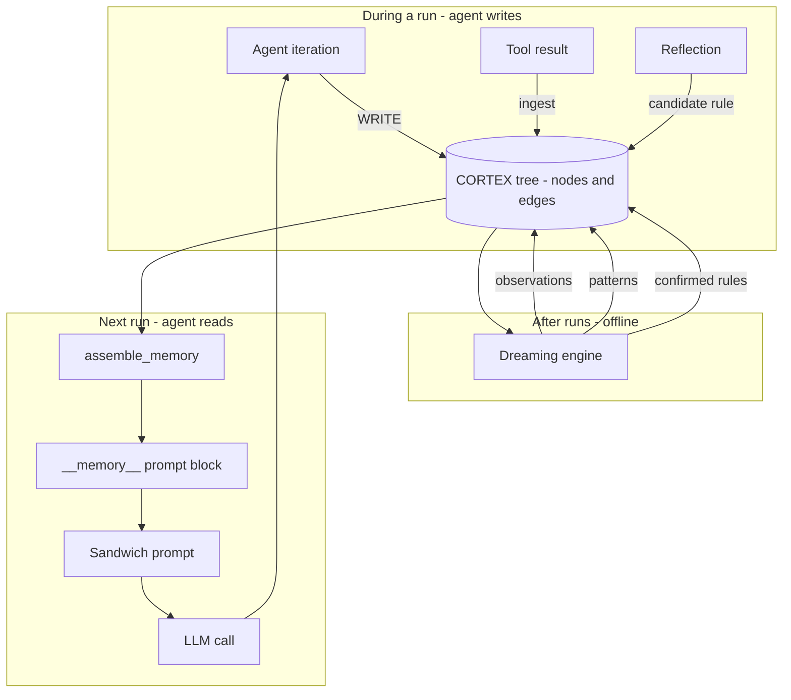

The single entry point from the worker is
[`assemble_memory(...)`](../../backend/src/ai/memory/assembler.py:22). The only
legal write path is
[`CortexService`](../../backend/src/ai/memory/cortex_service.py:63).

> ⚠️ **Important structural fact.** The CORTEX engine has been **extracted into
> a separate Python package**, `hb-cortex-memory` (pinned at `0.1.0` in
> [pyproject.toml](../../backend/pyproject.toml:52)). Everything under
> `backend/src/ai/memory/` that looks like an implementation is now mostly a
> **re-export shim** that auto-injects host adapters. The real source lives in
> [`backend/cortex_memory_moved_to_pypi_repo/`](../../backend/cortex_memory_moved_to_pypi_repo/)
> — that directory is the package's own repo, kept in-tree for reference. When
> you need the actual logic, read there. See [§19](#19-key-files-reference) for
> the shim-to-source map.

---

## 2. Why a tree and not a context window

The naive approach to agent memory is "append everything to a list of messages".
That breaks in three ways, and CORTEX is the answer to each.

| Problem with a flat transcript | What CORTEX does instead |
|---|---|
| Context window fills up and the run dies | The agent sees a `Viewport` bounded by `max_chars`; the rest stays on disk |
| Old detail crowds out new detail | Nodes carry a `summary`; the viewport shows summaries, and the agent explicitly `READ`s a node when it wants the full text |
| No structure — the agent cannot find anything | Nodes form a parent/child tree with a `breadcrumb`, plus a weighted `CortexEdge` graph for semantic jumps |

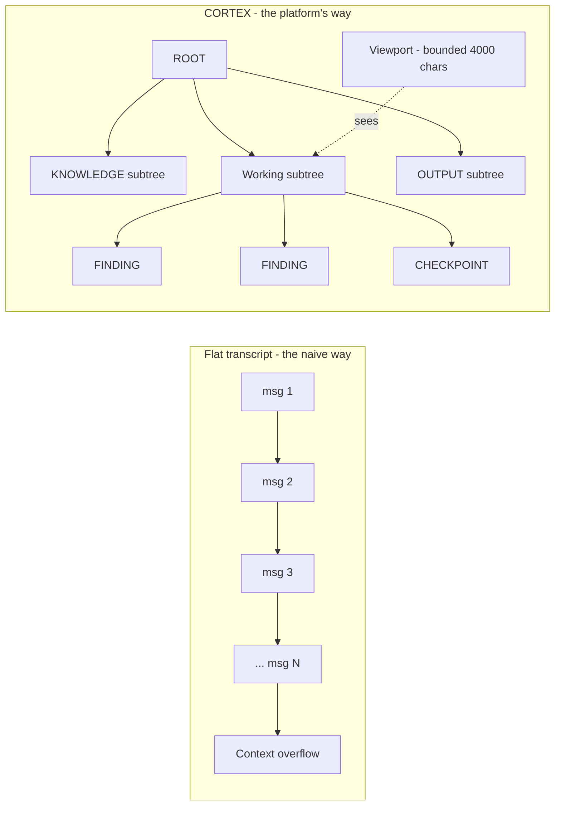

The docstring in
[models.py](../../backend/cortex_memory_moved_to_pypi_repo/models.py:47) states
the design intent directly:

```python
# backend/cortex_memory_moved_to_pypi_repo/models.py
class CortexTree(Base):
    """A persistent cognitive tree owned by an entity (agent) for a task.

    The tree IS the agent's complete cognitive state; the context window is a
    viewport onto it. ``resume_cursor_id`` always points at the last node worked
    on, enabling deterministic resumption.
    """
```

That last sentence matters operationally: because `resume_cursor_id` is
persisted, a run can be **suspended and resumed days later** and pick up exactly
where it stopped. This is what makes the async suspend/resume of child entities
(see [05 — Agent kernel](05-agent-kernel.md)) possible.

---

## 3. The CORTEX data model

Three tables, all owned by the `cortex_memory` package rather than the host.

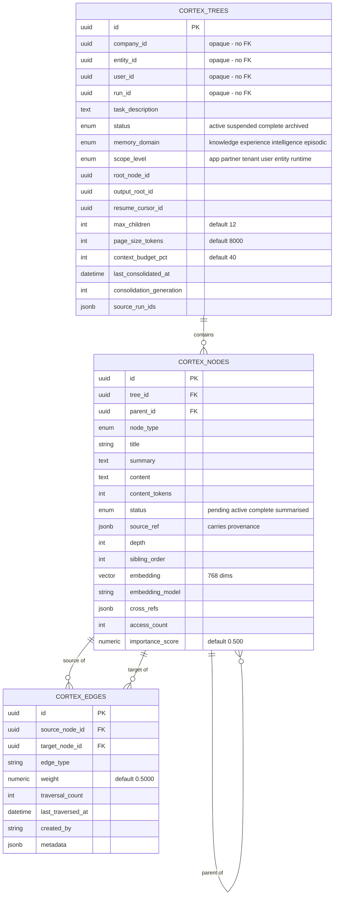

### 3.1 A deliberate design choice: no foreign keys to host tables

`company_id`, `entity_id`, `user_id`, `run_id` on `cortex_trees` are **plain
nullable UUID columns with no `ForeignKey`**. The
[module docstring](../../backend/cortex_memory_moved_to_pypi_repo/models.py:1)
explains why:

```python
# backend/cortex_memory_moved_to_pypi_repo/models.py
"""
Owned by the package on its own ``Base`` (``cortex_memory.db``). External
references (company/user/entity/run) are **opaque nullable UUID columns** — no
``ForeignKey`` to host tables and no cross-package relationships — so the schema
is self-contained (plan `04` K5). Column names/types/indexes/enum type names are
byte-for-byte the host's, so the models map onto an existing host DB unchanged.
"""
```

**Consequence for you:** deleting a company or entity will **not** cascade to
its CORTEX trees. There is no database-level referential integrity between
`cortex_trees.company_id` and `companies.id`. Cleanup must be done in
application code.

The host's Alembic `target_metadata` includes `cortex_memory.metadata`, so the
package's tables are still migrated by the host — see
[03 — Data model](03-data-model.md).

### 3.2 Node types

Every piece of information is a `CortexNode` with a `node_type`. From
[enums.py](../../backend/cortex_memory_moved_to_pypi_repo/enums.py:18):

| Generation | `node_type` | Meaning |
|---|---|---|
| v1 | `root` | Tree root |
| v1 | `knowledge` | Ingested from a document |
| v1 | `finding` | Written by the agent during execution |
| v1 | `task` | A sub-task to be executed |
| v1 | `output` | A section of the output document |
| v1 | `checkpoint` | A compacted state snapshot |
| v2 | `group` | Re-clustering group container |
| v2 | `document` | An ingested document |
| v2 | `section` | A section/chapter within a document |
| v2 | `chunk` | Leaf-level text chunk **with an embedding** |
| v2 | `observation` | Experience: a specific observation |
| v2 | `pattern` | Experience: a recurring pattern |
| v2 | `suggestion` | Experience: a suggested approach |
| v2 | `instruction` | Intelligence: a distilled actionable rule |
| v2 | `strategy` | Intelligence: a high-level strategic approach |
| v2 | `preference` | Intelligence: a user/entity preference |
| v2 | `episode` | Episodic: a single execution episode |
| v2 | `episode_group` | Episodic: grouped episodes |
| loop | `snapshot` | `AgentState` snapshot per loop iteration |
| loop | `health_record` | Critic `StepHealthRecord` |
| loop | `health_root` | Container for a run's health records |

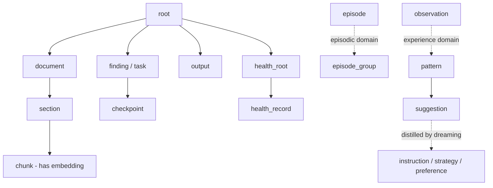

### 3.3 Other enums

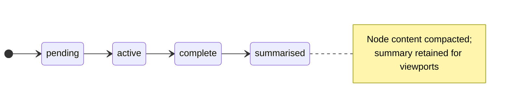

| Enum | Values |
|---|---|
| `CortexTreeStatus` | `active`, `suspended`, `complete`, `archived` |
| `CortexNodeStatus` | `pending`, `active`, `complete`, `summarised` |
| `MemoryDomain` | `knowledge`, `experience`, `intelligence`, `episodic` |
| `ScopeLevel` | `app` (L0), `partner` (L1), `tenant` (L2), `user` (L3), `entity` (L4), `runtime` (L5) |

`ScopeLevel` is the memory-inheritance ladder. A runtime tree belongs to one
run; an `app`-level tree is visible platform-wide. Retrieval queries filter on
`scope_level IN ('app', 'tenant')` **or** an exact `entity_id` match — see
[§8](#8-retrieval--weights-signals-and-the-semantic-graph).

---

## 4. The seven CORTEX operations

The agent manipulates its own memory through a small fixed vocabulary. This is
the exact text injected into the agent's system prompt, from
[prompts.py](../../backend/cortex_memory_moved_to_pypi_repo/prompts.py:11):

```python
# backend/cortex_memory_moved_to_pypi_repo/prompts.py
CORTEX_OPS_HELP = (
    "## Available CORTEX Operations\n"
    "You can perform the following operations on the cognitive tree:\n"
    "  NAVIGATE(node_id) — Move your viewport to a node; see its title, summary, and children\n"
    "  READ(node_id, page=0) — Read the full content of a node (paged if large)\n"
    "  WRITE(parent_id, node_type, title, content, summary) — Create a new child node\n"
    "  RECURSE(node_id, task, result_slot) — Spawn a child execution scoped to a subtree\n"
    "  AWAIT_CHILDREN() — Wait for all child executions to complete and collect results\n"
    "  CHECKPOINT(progress_summary, key_facts, next_steps) — Save progress and compress context"
)
```

Six named ops, plus `check_and_compact` which the runtime calls automatically.

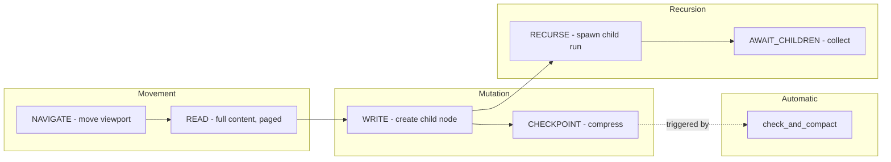

### 4.1 The full service API

From
[`CortexService`](../../backend/cortex_memory_moved_to_pypi_repo/service.py:191):

| Method | Line | What it does | Side effects |
|---|---|---|---|
| `create_tree(...)` | [242](../../backend/cortex_memory_moved_to_pypi_repo/service.py:242) | Creates a tree plus its root, knowledge and output roots | Inserts tree + seed nodes |
| `resume_tree(tree_id)` | [338](../../backend/cortex_memory_moved_to_pypi_repo/service.py:338) | Returns `(tree, viewport, last_checkpoint)` at `resume_cursor_id` | Sets status `active` |
| `suspend_tree(tree_id)` | [360](../../backend/cortex_memory_moved_to_pypi_repo/service.py:360) | Parks a tree | Sets status `suspended` |
| `navigate(node_id)` | [384](../../backend/cortex_memory_moved_to_pypi_repo/service.py:384) | Moves the viewport | Updates `resume_cursor_id`, `access_count` |
| `read(node_id, page=0)` | [435](../../backend/cortex_memory_moved_to_pypi_repo/service.py:435) | Full node content, paginated | Updates access tracking |
| `write(parent_id, ...)` | [470](../../backend/cortex_memory_moved_to_pypi_repo/service.py:470) | Creates a child node | Inserts node; may trigger re-clustering |
| `recurse(node_id, task, result_slot)` | [573](../../backend/cortex_memory_moved_to_pypi_repo/service.py:573) | Creates a task node + child `ExecutionRun` | Returns `(task_node_id, child_run_id)` |
| `await_children()` | [633](../../backend/cortex_memory_moved_to_pypi_repo/service.py:633) | Collects child results | — |
| `checkpoint(...)` | [663](../../backend/cortex_memory_moved_to_pypi_repo/service.py:663) | Writes a compacted snapshot | Inserts `checkpoint` node |
| `check_and_compact(...)` | [711](../../backend/cortex_memory_moved_to_pypi_repo/service.py:711) | Auto-checkpoints when over budget | Conditional checkpoint |
| `assemble_output(tree_id)` | [744](../../backend/cortex_memory_moved_to_pypi_repo/service.py:744) | DFS-collects the output subtree into a document | Optional LLM coherence pass |
| `get_tree_status`, `list_trees`, `get_node_details`, `get_working_root`, `get_knowledge_root` | [781](../../backend/cortex_memory_moved_to_pypi_repo/service.py:781)+ | Read-only accessors | — |

### 4.2 WRITE and its invariants

`write` is the most rule-bound operation. It enforces tree invariants:

```python
# backend/cortex_memory_moved_to_pypi_repo/service.py
# ── Invariant 1: Summary Always Exists ────────────────────────
# Every node must have a summary before it can be a parent.
if not parent.summary:
    raise ValueError(
        f"Cannot write child under node {parent_id}: parent has no summary. "
        f"Invariant 1 requires a summary before a node can have children."
    )
```

| Invariant | Rule | Enforced where | Failure mode |
|---|---|---|---|
| 1 | A parent must have a `summary` before it can have children | `write()` | `ValueError` |
| 2 | `max_children` (default **12**) per parent | `write()` | Triggers async re-clustering into `group` nodes |
| 4 | Content is write-once | Data model level | — |

Invariant 1 is the load-bearing one: it guarantees that **every interior node
can be rendered into a viewport as a one-line summary**, which is what keeps the
viewport bounded regardless of tree size.

Invariant 2 keeps the fan-out low so a viewport's child list stays readable.
When a parent exceeds 12 children,
[`_schedule_reclustering`](../../backend/cortex_memory_moved_to_pypi_repo/service.py:1095)
groups them under `group` nodes.

> There is no "Invariant 3" in the code comments. The numbering is inherited
> from the design document; do not read anything into the gap.

### 4.3 RECURSE — spawning a scoped child run

```mermaid
sequenceDiagram
    participant AG as Agent iteration
    participant CS as CortexService
    participant DB as PostgreSQL
    participant ARQ as Arq queue
    participant CHILD as Child AgentLoop

    AG->>CS: recurse(node_id, task, result_slot)
    CS->>CS: write(parent=node_id, type="task")
    CS->>DB: INSERT cortex_nodes (task node)
    CS->>DB: INSERT execution_runs (child, parent_run_id=parent)
    Note over DB: input_data carries cortex_tree_id,<br/>subtree_root_id, task, result_slot
    CS-->>AG: (task_node_id, child_run_id)
    AG->>ARQ: enqueue child run
    Note over CS,ARQ: the service does NOT enqueue;<br/>the caller is responsible
    ARQ->>CHILD: run
    CHILD->>CS: CortexService(scoped_subtree_root_id=subtree_root_id)
    Note over CHILD: child can read up, cannot write up
    CHILD->>DB: writes confined to the subtree
    AG->>CS: await_children()
    CS-->>AG: collected results
```

The child-run row is built by
[`_host_child_run_factory`](../../backend/src/ai/memory/cortex_service.py:26) —
this is one of the two host adapters the shim injects:

```python
# backend/src/ai/memory/cortex_service.py
child_run = ExecutionRun(
    entity_id=tree.entity_id,
    company_id=company_id,
    parent_run_id=execution_run_id,
    user_id=tree.user_id,
    input_data={
        "cortex_tree_id": str(tree.id),
        "subtree_root_id": str(node_id),
        "task": task,
        "task_node_id": str(task_node_id),
        "result_slot": result_slot,
    },
    status="PENDING",
)
```

Note the comment in `recurse`: *"The caller (worker.py) is responsible for
actually enqueuing the child run to Arq."* Calling `recurse` alone creates rows
but does not start work.

### 4.4 CHECKPOINT and auto-compaction

`check_and_compact` is the safety valve against context overflow:

```python
# backend/cortex_memory_moved_to_pypi_repo/service.py
budget_tokens = int(model_context_window * tree.context_budget_pct / 100)

if current_token_count >= budget_tokens:
    checkpoint_id = await self.checkpoint(
        tree_id=tree_id,
        progress_summary=f"Auto-compaction at {current_token_count} tokens (budget: {budget_tokens})",
        key_facts=[],
        next_steps=["Continue from viewport after context reset"],
    )
    return checkpoint_id
return None
```

With defaults (`context_budget_pct = 40`, `model_context_window = 200000`) the
compaction threshold is **80,000 tokens**.

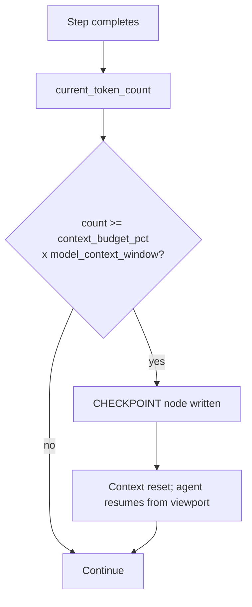

A `CheckpointData` payload carries `progress_summary`, `key_facts`,
`next_steps`, `nodes_written` and `time_elapsed_hours`.

---

## 5. The Viewport — bounded context

The `Viewport` is the single most important type for understanding token cost.

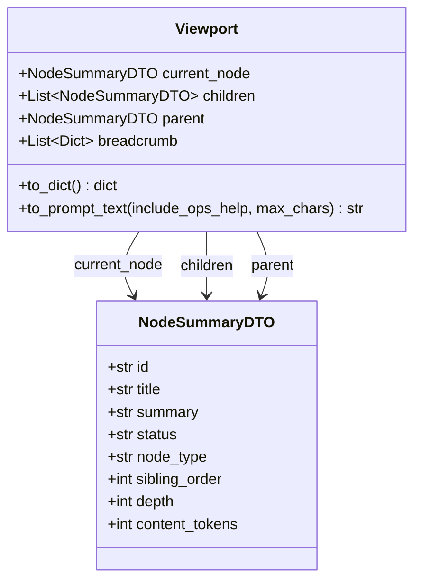

`to_prompt_text` renders it, and the rendering is **priority-ordered with a hard
character budget** ([service.py:87](../../backend/cortex_memory_moved_to_pypi_repo/service.py:87)):

| Priority | Section | Behaviour when the budget is tight |
|---|---|---|
| 1 | Current node (title, type, status, depth, summary) | **Always included** — appended before any budget check |
| 2 | Breadcrumb (`root → … → current`) | Dropped if it does not fit |
| 3 | Children, one line each | Truncated with `…(N more children)` |
| 4 | Ops-help block | Only if `include_ops_help=True` **and** it fits |

```python
# backend/cortex_memory_moved_to_pypi_repo/service.py
budget = max(256, int(max_chars))
parts: list[str] = []

def _fits(s: str) -> bool:
    return sum(len(p) for p in parts) + len(s) + 2 * len(parts) <= budget
```

Two behaviours worth knowing:

- **`max_chars` defaults to 4000** and has a floor of 256. Even a pathological
  caller cannot render a zero-width viewport.
- **The current node bypasses the budget check.** A node with a 50KB summary
  will blow past `max_chars` on its own. The budget bounds the *surroundings*,
  not the focus.
- **`include_ops_help` defaults to `False`.** Track 6 moved the ops-help block
  into the system prompt (injected once by `build_sandwich_prompt`) rather than
  re-shipping ~450 characters on every single viewport render. If you set it
  back to `True`, you pay that cost per iteration.

Rendered output looks like this:

```text
## Current Node: Q3 Revenue Analysis
Type: finding | Status: complete | Depth: 2
Summary: Revenue grew 12% QoQ driven by enterprise renewals.

## Navigation Path
Research Root → Financial Analysis → Q3 Revenue Analysis

## Children
  [1] Enterprise segment breakdown (finding, complete) — 38 accounts, 9.1M ARR
  [2] SMB segment breakdown (finding, complete) — 412 accounts, 2.3M ARR
  …(4 more children)
```

---

## 6. ScopePolicy — keeping child runs in their lane

When a parent run spawns a child via `RECURSE`, the child gets a
`CortexService` constructed with `scoped_subtree_root_id`. Every operation must
then stay inside that root's descendant set.

```python
# backend/cortex_memory_moved_to_pypi_repo/scope_policy.py
@dataclass
class ScopePolicy:
    can_read_outside: bool = False
    can_write_outside: bool = False
    can_navigate_to_siblings: bool = False
    error_on_violation: bool = True

    @classmethod
    def child_recursion_default(cls) -> "ScopePolicy":
        """Default for child recursive runs: read parent, never write up."""
        return cls(
            can_read_outside=True,
            can_write_outside=False,
            can_navigate_to_siblings=False,
            error_on_violation=True,
        )
```

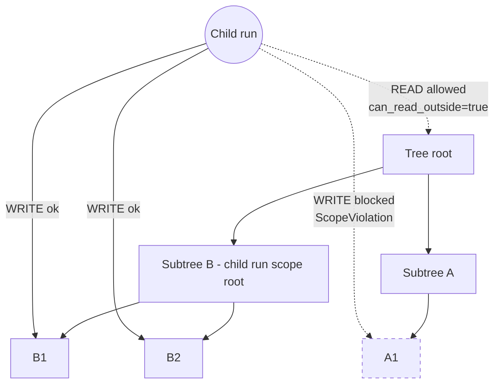

**Defaults are strict.** A bare `ScopePolicy()` blocks reads *and* writes
outside the subtree. The recursion path deliberately relaxes reads only — a
child may consult shared parent context but can never write upward and corrupt
a sibling's work.

Violations raise `ScopeViolation`, which carries `operation`, `target_id` and
`scope_root_id` so the failure is diagnosable from the message alone. Write
enforcement is in
[`_enforce_scope_write`](../../backend/cortex_memory_moved_to_pypi_repo/service.py:973).

---

## 7. The four memory domains

Each domain is a **typed view over the same CORTEX substrate** — same tables,
different `memory_domain` value on the tree, different retrieval weights, and a
dedicated service class.

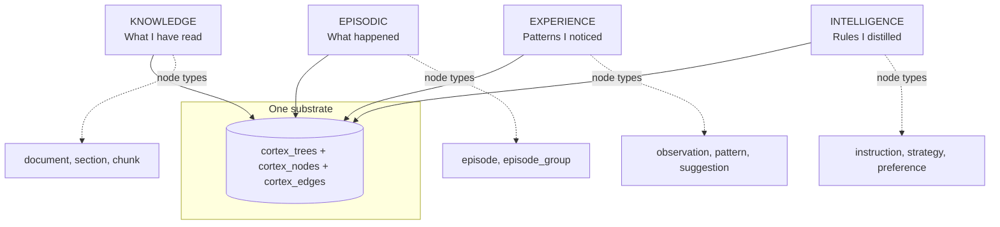

| Domain | Service | Package source | Stores | Written by | Prompt key |
|---|---|---|---|---|---|
| Knowledge | `KnowledgeTreeService` | [knowledge_tree.py](../../backend/cortex_memory_moved_to_pypi_repo/knowledge_tree.py) (483 lines) | Ingested documents as `document → section → chunk` | Document upload, tool-result ingestion | `__knowledge_refs__` |
| Episodic | `EpisodicTreeService` | [episodic_tree.py](../../backend/cortex_memory_moved_to_pypi_repo/episodic_tree.py) (466 lines) | One `episode` node per completed run | Run finalisation | `__episodic__` / `__episodic_memory__` |
| Experience | `ExperienceTreeService` | [experience_tree.py](../../backend/cortex_memory_moved_to_pypi_repo/experience_tree.py) (230 lines) | `observation` → `pattern` → `suggestion` | Dreaming engine | `__experience__` |
| Intelligence | `IntelligenceTreeService` | [intelligence_tree.py](../../backend/cortex_memory_moved_to_pypi_repo/intelligence_tree.py) (275 lines) | `instruction` / `strategy` / `preference` rules | Dreaming engine, Reflector | `__intelligence__` / `__intelligence_rules__` |

The host files
([knowledge_tree_service.py](../../backend/src/ai/memory/knowledge_tree_service.py),
[episodic_tree_service.py](../../backend/src/ai/memory/episodic_tree_service.py),
[experience_tree_service.py](../../backend/src/ai/memory/experience_tree_service.py),
[intelligence_tree_service.py](../../backend/src/ai/memory/intelligence_tree_service.py))
are 11–38 line re-export shims.

### 7.1 The information flow between domains

Domains are not independent — they form a refinement pipeline.

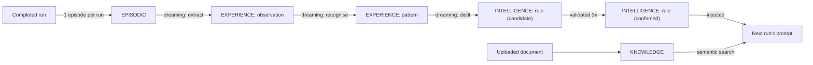

Read that left to right: **raw history becomes rules**. Knowledge is the one
domain fed from outside rather than from the platform's own experience.

### 7.2 The legacy episodic table

There are **two** episodic stores, and this trips people up.

| Store | Table | Status |
|---|---|---|
| v2 Episodic Tree | `cortex_trees` / `cortex_nodes` with `memory_domain='episodic'` | Current |
| v1 flat table | [`episodic_memories`](../../backend/src/ai/orm/memory.py:18) | Legacy, read-only |

[`LegacyEpisodicReader`](../../backend/src/ai/memory/legacy_episodic_reader.py)
is a read-only adapter over the flat table. `assemble_memory` uses it as a
**first-run top-up** so a freshly-migrated entity is not amnesiac:

```python
# backend/src/ai/memory/assembler.py
if memory_scope in ("FULL", "RUN_SCOPED") and not result.get("__episodic_memory__"):
    try:
        from src.ai.memory.legacy_episodic_reader import LegacyEpisodicReader
        legacy = await LegacyEpisodicReader(db).read(
            entity_id=entity_id, user_id=user_id, limit=5,
        )
        if legacy:
            result["__episodic_memory__"] = legacy
    except Exception as exc:
        logger.debug(f"Legacy episodic top-up skipped: {exc}")
```

It is a pure read with no write-backs, capped at 5 rows, and only fires when the
v2 pipeline returned nothing.

---

## 8. Retrieval — weights, signals and the semantic graph

### 8.1 The signal vector

Every domain ranks candidates against the same four signals, then applies its
own weights. From
[domains.py](../../backend/cortex_memory_moved_to_pypi_repo/domains.py:34):

```python
# backend/cortex_memory_moved_to_pypi_repo/domains.py
KnowledgeWeights: dict[str, float] = {
    "semantic": 1.0, "recency": 0.4, "user_match": 0.0, "success": 0.0,
}
ExperienceWeights: dict[str, float] = {
    "semantic": 0.7, "recency": 0.5, "user_match": 0.2, "success": 0.6,
}
IntelligenceWeights: dict[str, float] = {
    "semantic": 0.6, "recency": 0.3, "user_match": 0.0, "success": 0.0,
}
EpisodicWeights: dict[str, float] = {
    "semantic": 0.5, "recency": 0.7, "user_match": 0.6, "success": 0.5,
}
```

| Signal | Meaning |
|---|---|
| `semantic` | Cosine similarity between the query embedding and the node embedding |
| `recency` | How recently the node was created or touched |
| `user_match` | Whether the node came from the same end-user |
| `success` | Whether the run that produced it succeeded |

The weights encode real editorial judgement:

- **Knowledge** cares almost only about semantic match (1.0) — a fact does not
  become less true with age. Recency at 0.4 is a mild freshness tiebreak.
- **Episodic** leads on recency (0.7) and `user_match` (0.6) — "what did *this
  user* ask me *lately*" matters more than topical similarity.
- **Experience** is the only domain weighting `success` heavily (0.6) — a
  pattern from a failed run is worth less.
- **Intelligence** ignores `user_match` and `success` entirely. A distilled rule
  is meant to be universal; those signals are already baked in during
  distillation.

### 8.2 The scoring function

```python
# backend/cortex_memory_moved_to_pypi_repo/domains.py
def score_signals(weights, signals) -> float:
    total_weight = sum(max(0.0, w) for w in weights.values())
    if total_weight <= 0:
        return 0.0
    accum = 0.0
    for key in _REQUIRED_SIGNALS:
        w = max(0.0, float(weights.get(key, 0.0)))
        s = max(0.0, float(signals.get(key, 0.0)))
        accum += w * s
    return accum / total_weight
```

The subtle part is the denominator: it uses **declared weights, not present
signals**. So a domain that declares it wants recency but receives no recency
signal takes a partial-credit penalty rather than silently renormalising. This
prevents a node with one strong signal from scoring 1.0 just because the other
signals were absent.

### 8.3 Hybrid search: semantic seed plus graph expansion

The primary search interface is
[`SemanticGraphService.semantic_graph_search`](../../backend/cortex_memory_moved_to_pypi_repo/graph.py:183).

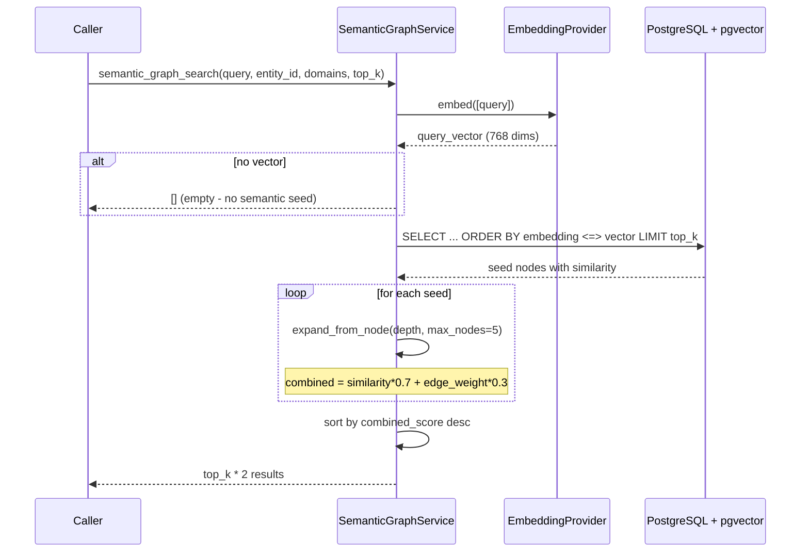

The seed query, verbatim:

```sql
-- backend/cortex_memory_moved_to_pypi_repo/graph.py
SELECT cn.id, cn.title, cn.summary, cn.node_type, cn.tree_id,
       ct.memory_domain,
       1 - (cn.embedding <=> CAST(:vec AS vector)) AS similarity
FROM cortex_nodes cn
JOIN cortex_trees ct ON ct.id = cn.tree_id
WHERE cn.embedding IS NOT NULL
  AND ct.company_id = :company_id
  AND (ct.entity_id = :entity_id OR ct.scope_level IN ('app', 'tenant'))
  {domain_filter}
ORDER BY cn.embedding <=> CAST(:vec AS vector)
LIMIT :top_k
```

Things to notice:

- `<=>` is pgvector's **cosine distance** operator; `1 - distance` gives
  similarity.
- The tenancy guard `ct.company_id = :company_id` is in the SQL itself.
- The visibility rule `entity_id = :entity_id OR scope_level IN ('app','tenant')`
  is how an entity sees both its own memory and shared company/platform memory.
- Graph-expanded results are scored `similarity * 0.7 + edge_weight * 0.3`, so a
  node reached by traversal can never outrank a direct semantic hit of equal
  strength.
- The function returns `top_k * 2` — expansion doubles the candidate pool.

> ⚠️ `domain_filter` is built by f-string interpolation of the `domains` list
> into the SQL. The values are supplied by internal callers (fixed domain names),
> not user input, but it is string interpolation into SQL nonetheless. Do not
> extend this function to accept caller-supplied domain strings without
> parameterising it.

### 8.4 The edge graph

`CortexEdge` gives the tree a second, non-hierarchical access path.

| Method | Purpose |
|---|---|
| `create_edge(...)` | Manual typed edge |
| `create_similarity_edges(node_id)` | After embedding a node, auto-link similar nodes with `semantic_similar` edges |
| `expand_from_node(...)` | Weighted BFS traversal, `max_depth`/`max_nodes` bounded |
| `track_co_access(...)` | Strengthens edges between nodes read together |
| `decay_weights(days_inactive=30)` | Weakens stale edges |
| `prune_weak_edges()` | Deletes edges below threshold |
| `get_graph_stats()` | Diagnostics |

`decay_weights` and `prune_weak_edges` implement a use-it-or-lose-it policy:
associations that stop being traversed fade and are eventually removed. The
unique constraint `uq_cortex_edges_src_tgt_type` prevents duplicate edges of the
same type between the same pair.

---

## 9. Embeddings

[`EmbeddingService`](../../backend/src/ai/memory/embedding_service.py:79) is the
one chokepoint for turning text into vectors.

### 9.1 Model resolution

The embedding model is **admin-configurable per company**, resolved in priority
order:

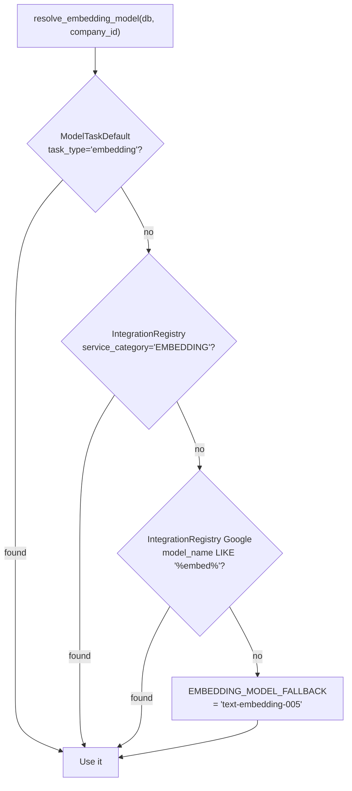

The fallback constant lives in
[constants.py:19](../../backend/src/ai/constants.py:19):

```python
# backend/src/ai/constants.py
EMBEDDING_MODEL_FALLBACK = "text-embedding-005"

# Backward compat alias — existing code references EMBEDDING_MODEL directly
EMBEDDING_MODEL = EMBEDDING_MODEL_FALLBACK
```

The comment above it records a real bug this consolidation fixed: the codebase
previously had `"text-embedding-004"` in `memory_service.py` and
`"gemini-embedding-004"` in `worker.py`/`service.py` — two different models
writing into the same vector column.

> ⚠️ **Vector dimension is hard-coded to 768** in both
> [`DocumentChunk.embedding`](../../backend/src/ai/orm/document.py:48) and
> [`CortexNode.embedding`](../../backend/cortex_memory_moved_to_pypi_repo/models.py:170)
> (`pgvector.sqlalchemy.Vector(768)`). Configuring an embedding model with a
> different output dimension will fail on insert. Changing the dimension
> requires a migration and a full re-embed.

Each node also stores `embedding_model`, so you can tell which model produced a
given vector — essential when migrating models.

### 9.2 Batching and cost attribution

`embed_batch` is the single chokepoint every caller funnels through, which is
why the billing write lives there. From the module docstring:

```python
# backend/src/ai/memory/embedding_service.py
"""
Cost attribution
----------------
Every Vertex embedding call is metered to ``usage_logs`` with an
``"embedding"`` attribution (see ``services/cost_attribution.py``).
``embed_batch`` is the single chokepoint every caller funnels through,
so the billing write lives there — one row per batch, keyed on the
Vertex-reported ``billable_character_count`` (the unit these models
bill on). The write is best-effort: it runs on its own short-lived
session so it can never commit the caller's in-flight transaction, and
any failure is swallowed so a billing hiccup never breaks retrieval.
"""
```

Two design decisions worth copying elsewhere:

1. **Billing writes use a separate short-lived session** so they cannot
   accidentally commit the caller's in-flight transaction.
2. **Billing failures are swallowed.** Retrieval never breaks because metering
   hiccupped.

Embeddings are billed on `billable_character_count`, not tokens. The
`embedding_phase` metadata field distinguishes `"ingestion"` from `"retrieval"`
so the cost dashboard can split them — see
[14 — Billing and credits](14-billing-and-credits.md).

| Method | Purpose |
|---|---|
| `embed_text(...)` | Single string |
| `embed_query(query)` | Convenience wrapper for search |
| `embed_batch(...)` | **The metered chokepoint** |
| `embed_node(node)` | Embeds and stamps `embedding_model` |
| `embed_nodes_batch(nodes)` | Bulk node embedding |
| `embed_node_with_edges(node)` | Embeds, then auto-creates similarity edges |
| `get_model_name()` | Currently resolved model |

---

## 10. Document ingestion and RAG

Two ingestion paths exist, and they write to different places.

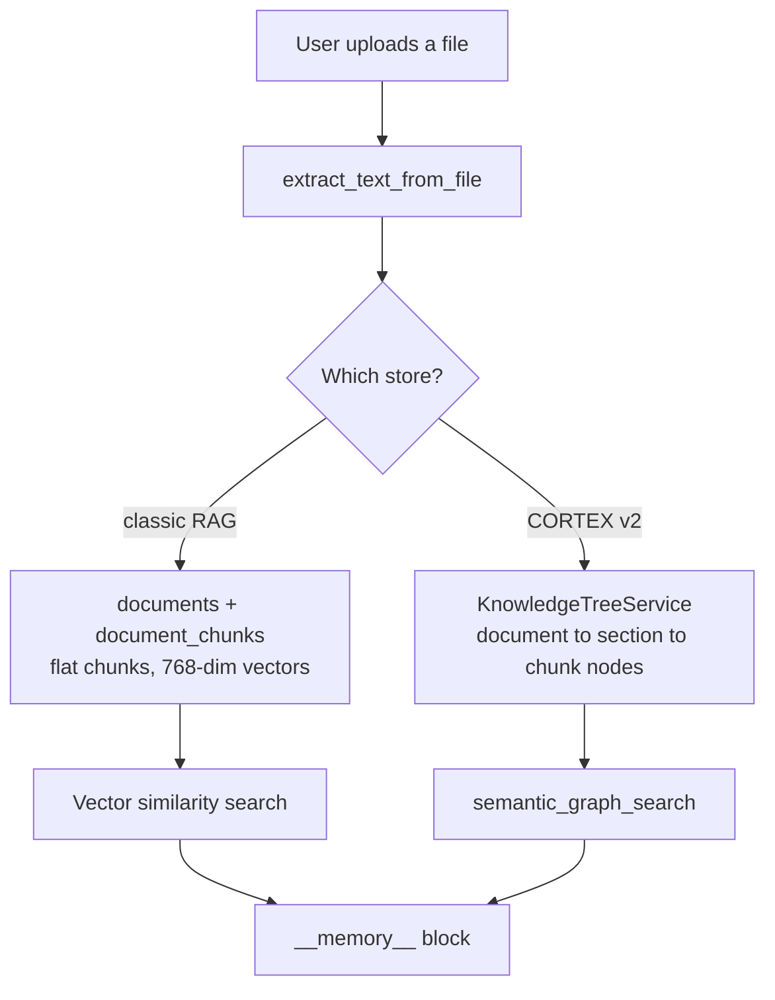

### 10.1 Text extraction

[`extract_text_from_file`](../../backend/src/ai/text_extractor.py:14) dispatches
on file extension:

| Extension | Library / approach |
|---|---|
| `.docx` | `python-docx` |
| `.pdf` | PDF reader |
| `.xlsx`, `.xls` | `openpyxl` |
| `.csv`, `.tsv` | CSV parsing |
| everything else | Read as plain text (`txt`, `md`, `json`, `xml`, `html`, …) |

### 10.2 Chunking

Two different chunkers exist, with **different sizes**:

| Chunker | Size | Overlap | Source |
|---|---|---|---|
| `KnowledgeTreeService` | **500 chars** | **50 chars** | [knowledge_tree.py:52](../../backend/cortex_memory_moved_to_pypi_repo/knowledge_tree.py:52) |
| `CortexIngestionPipeline` | **2000 chars** | none | [ingestion.py:214](../../backend/cortex_memory_moved_to_pypi_repo/ingestion.py:214) |

```python
# backend/cortex_memory_moved_to_pypi_repo/knowledge_tree.py
CHUNK_SIZE = 500          # Characters per chunk
CHUNK_OVERLAP = 50        # Overlap between chunks for context continuity
```

The `KnowledgeTreeService` path is structure-aware: it tries to detect sections
and builds `document → section → chunk`; if no structure is detected it chunks
the whole document directly under the document node.

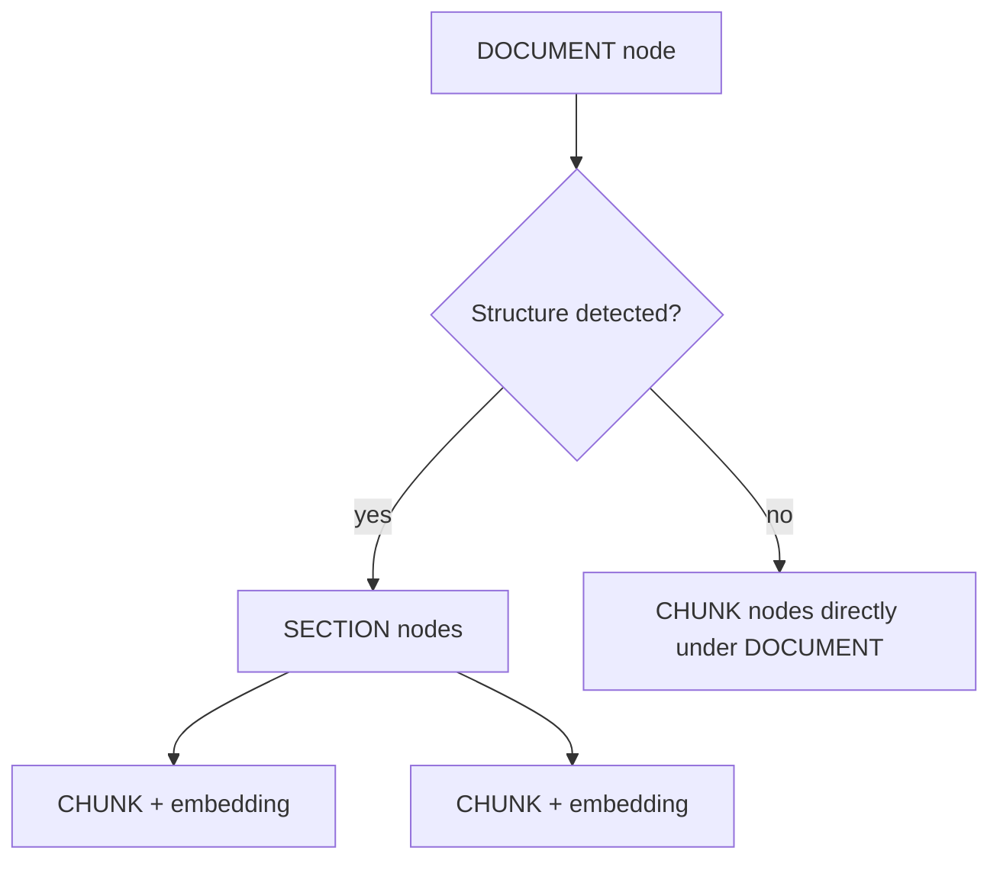

Only **`chunk` nodes carry embeddings**. Search targets them specifically:

```sql
-- backend/cortex_memory_moved_to_pypi_repo/knowledge_tree.py
AND cn.node_type = 'chunk'
```

Results are returned as chunks ranked by cosine similarity, with parent context
attached — so the agent sees which document and section a hit came from.

### 10.3 The classic RAG tables

[`Document`](../../backend/src/ai/orm/document.py:23) and
[`DocumentChunk`](../../backend/src/ai/orm/document.py:41) are the simpler,
older path — a flat list of chunks per document with a `Vector(768)` column and
`cascade="all, delete-orphan"` so deleting a document removes its chunks.

`Document.upload_status` moves `processing → completed | failed`.

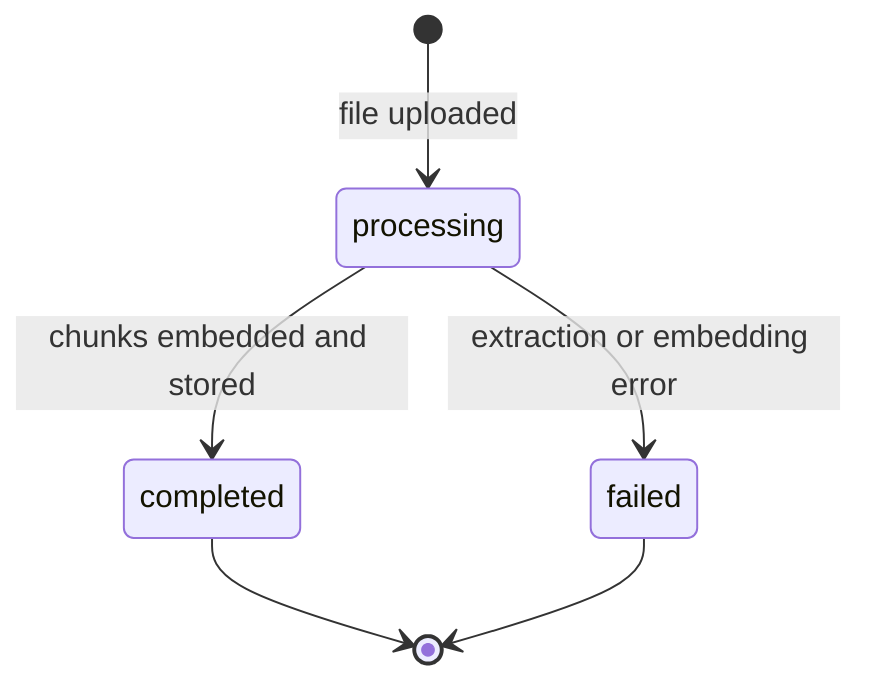

---

## 11. Memory assembly — building the `__memory__` block

[`assemble_memory`](../../backend/src/ai/memory/assembler.py:22) is the **single
entry point** from the worker and the loop.

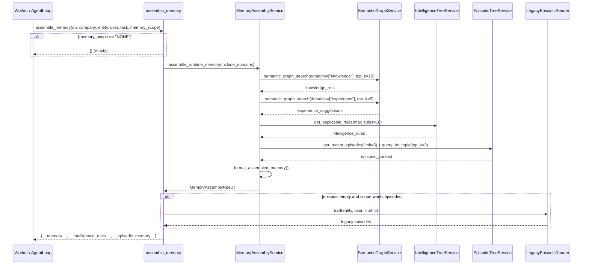

### 11.1 Memory scopes

`memory_scope` controls which domains are consulted:

| `memory_scope` | Domains included |
|---|---|
| `FULL` | knowledge, experience, intelligence, episodic |
| `RUN_SCOPED` | knowledge, experience, intelligence, episodic |
| `INTELLIGENCE_ONLY` | intelligence |
| `KNOWLEDGE_ONLY` | knowledge, intelligence |
| `NONE` | *(returns `{}` immediately — no DB work at all)* |

> `FULL` and `RUN_SCOPED` currently map to **identical** domain sets in
> [`_assemble_v2`](../../backend/src/ai/memory/assembler.py:78). The distinction
> exists in the API but has no effect on domain selection today.

### 11.2 The v1 pipeline is gone

```python
# backend/src/ai/memory/assembler.py
async def assemble_memory(
    ...
    memory_pipeline: str = "v2",                            # retained for compat
    ...
):
    """
    Args:
        memory_pipeline: retained for call-site compatibility; ignored (always
            v2).
    """
```

The `memory_pipeline` argument is **accepted and ignored**. Passing `"v1"` does
nothing. [`memory_service.py`](../../backend/src/ai/memory/memory_service.py)
(`MemoryRouter`) is deprecated; its `retrieve` path was removed.

### 11.3 Retrieval limits

| Domain | Query | Limit |
|---|---|---|
| Knowledge | `semantic_graph_search(domains=["knowledge"], graph_expansion_depth=1)` | `top_k=10`, first 5 written as runtime refs |
| Experience | `semantic_graph_search(domains=["experience"])` | `top_k=5`, filtered to `suggestion`/`pattern`/`observation` |
| Intelligence | `get_applicable_rules(...)` | `max_rules=10` |
| Episodic | `get_recent_episodes(limit=5)` + `query_by_topic(top_k=3)`, deduped | capped at **10** |

Every domain assembler is wrapped in `try/except` that logs at `debug` and
returns `[]`:

```python
# backend/cortex_memory_moved_to_pypi_repo/assembly.py
except Exception as e:
    logger.debug(f"Knowledge assembly failed: {e}")
    return []
```

**This is a real operational trap.** If retrieval is silently broken — bad
credentials, a missing pgvector index, a dimension mismatch — the agent simply
runs with no memory and nobody gets an error. The only signal is a `debug`-level
log line. When debugging "the agent forgot everything", turn on debug logging
for `cortex_memory.assembly` first.

### 11.4 The rendered block

`_format_assembled_memory` emits sections in a fixed priority order:

| Order | Section | Cap | Prefix |
|---|---|---|---|
| 1 | `## Learned Intelligence` | all 10 rules | `📏` instruction / `🎯` strategy / `❤️` preference / `💡` other, with `[confidence%]` |
| 2 | `## Relevant Knowledge` | first **5** | `📎 [score]` |
| 3 | `## Experience Suggestions` | all | `💡 [confidence]`, truncated to 200 chars |
| 4 | `## Recent Execution History` | first **5** | `[timestamp] 'input' → 'output'`, each truncated to 150 chars |

Intelligence goes first deliberately — it is the highest-value, most-distilled
content, and if the prompt is later truncated, rules survive.

A rendered block:

```text
## Learned Intelligence
The following rules have been learned from past experience:
  📏 [85%] Always verify revenue figures against the source system before reporting
  🎯 [72%] For quarterly analyses, fetch data before attempting any summarisation
  ❤️ [90%] This user prefers bullet points over prose

## Relevant Knowledge
  📎 [0.91] Q3 Financial Report: Consolidated revenue of 11.4M across all segments...
  📎 [0.84] Revenue Recognition Policy: ASC 606 compliance requires...

## Experience Suggestions
  💡 [0.78] Fetching all segments in one query is faster than per-segment calls

## Recent Execution History
  [2026-08-11T09:14:02] 'Analyse Q2 revenue' → 'Q2 revenue grew 8% QoQ...'
```

---

## 12. The prompt sandwich

[`build_sandwich_prompt`](../../backend/src/ai/core/prompt_utils.py:66) assembles
the final system prompt in ten fixed layers.

```mermaid
flowchart TB
    L1["1. Identity and Role"] --> L2["2. Goal and Objective"]
    L2 --> L3["3. Available Tools"]
    L3 --> L35["3.5 Platform Awareness"]
    L35 --> L37["3.7 CORTEX Ops Help - if cortex_enabled"]
    L37 --> L4["4. Examples of Expected Behavior"]
    L4 --> L5["5. Success Criteria"]
    L5 --> L6["6. Planning Permissions"]
    L6 --> L7["7. Required Output Format"]
    L7 --> L8["8. Execution Constraints"]
    L8 --> L9["9. Context and History - the __memory__ block"]
    L9 --> L10["10. Current Task"]

    style L9 fill:#2d4a2d,stroke:#5a9
    style L37 fill:#3a3a5a,stroke:#77a
```

| Layer | Heading | Source |
|---|---|---|
| 1 | `## Identity & Role` | entity `identity` block |
| 2 | `## Goal & Objective` | entity `goal` |
| 3 | `## Available Tools` | resolved tool list |
| 3.5 | `## Platform Awareness` | meta-cognition — see [11 — Meta-intelligence](11-meta-intelligence.md) |
| 3.7 | `## Available CORTEX Operations` | `CORTEX_OPS_HELP`, **only when `cortex_enabled=True`** |
| 4 | `## Examples of Expected Behavior` | few-shot examples |
| 5 | `## Success Criteria` | entity success criteria + validation type |
| 6 | `## Planning Permissions` | `allowed_deviations` |
| 7 | `## Required Output Format` | JSON output schema |
| 8 | `## Execution Constraints` | cost/tool limits |
| 9 | `## Context/History` | **the assembled `__memory__` block** |
| 10 | Current task | the user's actual request |

Layer 6 is rendered from booleans into readable permissions:

```python
# backend/src/ai/core/prompt_utils.py
if allowed_deviations.get("can_add_steps"):
    perm_lines.append("- You MAY add additional steps if needed")
if allowed_deviations.get("can_skip_optional_steps"):
    perm_lines.append("- You MAY skip optional steps")
if allowed_deviations.get("can_reorder_steps"):
    perm_lines.append("- You MAY reorder steps for efficiency")
if allowed_deviations.get("can_change_tools"):
    perm_lines.append("- You MAY choose different tools than specified")
```

### 12.1 Internal key scrubbing

Memory arrives through the legacy `context_state` dict, whose plumbing keys must
never reach an LLM or a billing log.
[`INTERNAL_CONTEXT_KEYS`](../../backend/src/ai/constants.py:31) is the canonical
set, and `prompt_utils._scrub_internal_keys` strips every member before
concatenating user-facing fields.

```python
# backend/src/ai/constants.py
INTERNAL_CONTEXT_KEYS: FrozenSet[str] = frozenset({
    "input", "cortex_tree_id", "subtree_root_id",
    "__memory__", "__cortex_viewport__", "__cortex_tree_id__",
    "__cortex_cursor__", "__cortex_knowledge__", "__context_sources__",
    "__episodic_memory__", "__semantic_context__", "__memory_context__",
    "__completed_steps__", "tool_call_counts", "company_id", "user_id",
    # --- v2.0: Unified memory domain keys ---
    "__intelligence__", "__experience__", ...
})
```

The comment records why this exists: the set was previously duplicated in two
places in `worker.py` **with different members** — a latent context-leakage bug.
Every key is documented in
[core/INTERNAL_KEYS.md](../../backend/src/ai/core/INTERNAL_KEYS.md), and a unit
test (`test_internal_keys_documented`) enforces that the constant and the doc
table stay in sync.

**If you add a memory key, you must update `constants.py` AND
`INTERNAL_KEYS.md`, or CI fails.**

---

## 13. Dreaming — offline consolidation

"Dreaming" is the background job that turns raw history into rules. It runs
outside any user request.


### 13.1 Thresholds

From
[`DreamingEngine`](../../backend/cortex_memory_moved_to_pypi_repo/dreaming.py:73):

```python
# backend/cortex_memory_moved_to_pypi_repo/dreaming.py
MIN_EPISODES_FOR_DREAMING = 5
MIN_OBSERVATIONS_FOR_PATTERNS = 3
MIN_PATTERNS_FOR_DISTILLATION = 2
BATCH_SIZE = 20
CONSOLIDATION_INTERVAL_HOURS = 24
OBSERVATION_CONFIDENCE_THRESHOLD = 0.5
PATTERN_STRENGTH_THRESHOLD = 0.7
```

| Constant | Value | Effect |
|---|---|---|
| `MIN_EPISODES_FOR_DREAMING` | 5 | An entity needs 5 completed runs before dreaming does anything |
| `MIN_OBSERVATIONS_FOR_PATTERNS` | 3 | 3 observations before pattern recognition runs |
| `MIN_PATTERNS_FOR_DISTILLATION` | 2 | 2 patterns before rule distillation runs |
| `BATCH_SIZE` | 20 | Episodes processed per pass |
| `CONSOLIDATION_INTERVAL_HOURS` | 24 | Minimum gap between runs for one entity |
| `OBSERVATION_CONFIDENCE_THRESHOLD` | 0.5 | Below this, an observation is discarded |
| `PATTERN_STRENGTH_THRESHOLD` | 0.7 | Below this, a pattern is not distilled |

The practical consequence: **a brand-new entity learns nothing for its first
five runs**, and thereafter at most once per 24 hours.

### 13.2 The gate

```python
# backend/cortex_memory_moved_to_pypi_repo/dreaming.py
async def _should_run(self, entity_id: UUID) -> bool:
    """Check if enough time has passed since the last consolidation."""
    try:
        tree = await experience_svc.get_or_create_experience_tree(entity_id)
    except Exception:
        return True  # No tree yet — first run
    if not tree.last_consolidated_at:
        return True
    hours_since = (datetime.utcnow() - tree.last_consolidated_at).total_seconds() / 3600
    return hours_since >= self.CONSOLIDATION_INTERVAL_HOURS
```

`dream(entity_id, force=True)` bypasses the gate — that is what the admin
trigger uses.

After a successful pass, `last_consolidated_at` is stamped and
`consolidation_generation` increments, giving you an audit trail of how many
times an entity has consolidated.

### 13.3 Triggers

Dreaming has **two** trigger paths, registered in
[worker.py](../../backend/src/ai/worker.py):

```python
# backend/src/ai/worker.py
WorkerSettings.cron_jobs = [
    cron(cortex_resume_scheduled, minute={0, 5, 10, 15, 20, 25, 30, 35, 40, 45, 50, 55}),
    # C: Auto-schedule dreaming every 6 hours
    cron(dreaming_cron_trigger, hour={0, 6, 12, 18}, minute={15}),
    cron(critic_calibration_job, weekday=6, hour=3, minute=15),
    cron(skill_promotion_scan, weekday=6, hour=4, minute=30),
    cron(meta_agent_prompt_evolution, weekday=0, hour=5, minute=0),
    cron(kpi_rollup_refresh, minute={7}),
    cron(cost_estimator_refresh, hour=2, minute=30),
]
```

| Trigger | Job | Schedule |
|---|---|---|
| Cron | `dreaming_cron_trigger` | 00:15, 06:15, 12:15, 18:15 daily |
| Outcome | `dreaming_outcome_trigger` | Fired from `AgentLoop._finalize` when a run completes |
| Worker | `dreaming_worker` | The job that actually runs `dream()` |

```mermaid
sequenceDiagram
    participant LOOP as AgentLoop._finalize
    participant CRON as arq cron
    participant Q as Arq queue
    participant DW as dreaming_worker
    participant DE as DreamingEngine

    par Outcome-triggered
        LOOP->>Q: dreaming_outcome_trigger(entity_id)
    and Scheduled
        CRON->>Q: dreaming_cron_trigger (00/06/12/18 :15)
    end
    Q->>DW: dispatch
    DW->>DE: dream(entity_id)
    DE->>DE: _should_run? (24h gate)
    alt gate closed
        DE-->>DW: {0, 0, 0}
    else gate open
        DE->>DE: _extract_observations
        DE->>DE: _recognize_patterns
        DE->>DE: _distill_intelligence
        DE->>DE: stamp last_consolidated_at
        DE-->>DW: {observations_created, patterns_created, rules_created}
    end
```

The other crons in that list belong to neighbouring subsystems — see
[07 — Planning and critics](07-planning-and-critics.md) for
`critic_calibration_job`, and [11 — Meta-intelligence](11-meta-intelligence.md)
for `skill_promotion_scan` and `meta_agent_prompt_evolution`.

`cortex_resume_scheduled` runs every 5 minutes and wakes trees whose
`next_resume_at` has passed — the mechanism behind `resume_schedule` on
`CortexTree`.

---

## 14. The Intelligence rule lifecycle

A rule distilled by Dreaming is not trusted immediately. It earns its way into
prompts.

```mermaid
stateDiagram-v2
    [*] --> candidate: distilled by dreaming / reflector
    candidate --> confirmed: net validations >= 3
    candidate --> candidate: not enough evidence
    confirmed --> retired: net contradictions >= 3
    confirmed --> confirmed: still predicting
    retired --> [*]: never prompt-eligible again

    note right of candidate
        Injected into prompts ONLY if
        memory.rule_lifecycle_confirmed_only is OFF
    end note
```

The policy is pure and host-side, in
[rule_lifecycle.py](../../backend/src/ai/memory/rule_lifecycle.py):

```python
# backend/src/ai/memory/rule_lifecycle.py
PROMOTE_AFTER = 3
RETIRE_AFTER = 3

def next_state(current, *, validations=0, contradictions=0) -> RuleLifecycle:
    net = validations - contradictions
    if state is RuleLifecycle.RETIRED:
        return RuleLifecycle.RETIRED
    if state is RuleLifecycle.CANDIDATE:
        if net >= PROMOTE_AFTER:
            return RuleLifecycle.CONFIRMED
        return RuleLifecycle.CANDIDATE
    # CONFIRMED
    if contradictions - validations >= RETIRE_AFTER:
        return RuleLifecycle.RETIRED
    return RuleLifecycle.CONFIRMED
```

**`retired` is terminal.** Once retired, a rule can never return.

### 14.1 Prompt eligibility

```python
# backend/src/ai/memory/rule_lifecycle.py
def is_prompt_eligible(rule, *, confirmed_only: bool) -> bool:
    lifecycle = _lifecycle_of(rule)
    if lifecycle == RuleLifecycle.RETIRED.value:
        return False
    if confirmed_only:
        # Drop only rules with an explicit non-confirmed lifecycle; keep legacy
        # rules (no lifecycle field) so enabling the gate never blanks prompts.
        if lifecycle and lifecycle != RuleLifecycle.CONFIRMED.value:
            return False
    return True
```

| `confirmed_only` | `candidate` | `confirmed` | `retired` | legacy (no field) |
|---|---|---|---|---|
| `False` | ✅ injected | ✅ injected | ❌ blocked | ✅ injected |
| `True` | ❌ blocked | ✅ injected | ❌ blocked | ✅ injected |

The flag is `memory.rule_lifecycle_confirmed_only` — see
[15 — Governance and feature flags](15-governance-and-hitl.md).

The "keep legacy rules" carve-out is deliberate: rules written before the
lifecycle field existed have no `lifecycle` value, and dropping them would blank
out prompts the moment an operator enabled the gate.

**Division of labour:** the `cortex_memory` package *stamps* the `lifecycle`
field; the host *enforces* it. This keeps policy changes from destabilising the
published package.

---

## 15. Task classification

[`TaskClassifier`](../../backend/src/ai/memory/task_classifier.py:78) maps a run
to a stable short string used to group statistics across runs.

Three consumers depend on it:

| Consumer | Uses `task_class` for |
|---|---|
| `PlanStyleBandit` | Keys arm state per `(entity_id, task_class)` |
| `CriticCalibrator` | Groups false-pass / false-fail metrics |
| `SupervisorCritic` | Filters intelligence rules tagged for the class |

```mermaid
flowchart TD
    IN["task_description + entity"] --> EXP{"Explicit class<br/>on entity?"}
    EXP -->|yes| OUT["task_class"]
    EXP -->|no| TAG{"Entity tag in<br/>TAG_TO_CLASS?"}
    TAG -->|yes| OUT
    TAG -->|no| KW{"Keyword match in<br/>KEYWORD_TO_CLASS?"}
    KW -->|yes| OUT
    KW -->|no| V2{"task_classifier.v2_enabled?"}
    V2 -->|yes| NN["Embedding nearest-neighbour"]
    NN --> OUT
    V2 -->|no| DEF["DEFAULT_CLASS = 'general'"]
    DEF --> OUT
```

The canonical classes, from `TAG_TO_CLASS` and `KEYWORD_TO_CLASS`:

`research_topic`, `extract_from_url`, `draft_email`, `post_social_content`,
`generate_report`, `summarise_content`, `run_campaign`, `draft_outreach`,
`score_lead`, `answer_question`, `general`.

Keyword matching is **substring, case-insensitive, and order-sensitive** —
earlier rules win:

```python
# backend/src/ai/memory/task_classifier.py
KEYWORD_TO_CLASS: list[tuple[str, str]] = [
    ("draft email", "draft_email"),
    ("email draft", "draft_email"),
    ("social post", "post_social_content"),
    ("write a post", "post_social_content"),
    ("research", "research_topic"),
    ...
]
```

Note `("summari", "summarise_content")` — a deliberate prefix that catches both
"summarise" and "summarize".

The v2 embedding nearest-neighbour classifier exists
([`_embedding_nn`](../../backend/src/ai/memory/task_classifier.py:170)) but is
gated behind `task_classifier.v2_enabled`, **default OFF**. The classifier
always returns a string, never `None`.

> Keep this class list small and revision-controlled — the docstring says so
> explicitly. Adding classes fragments the bandit's arm statistics and the
> calibrator's sample sizes.

---

## 16. The CORTEX HTTP API

From [cortex_router.py](../../backend/src/ai/memory/cortex_router.py), mounted
at `/api/v1/cortex` (registered without an extra prefix in
[main.py:87](../../backend/src/main.py:87)).

| Method | Path | Purpose |
|---|---|---|
| `POST` | `/api/v1/cortex/trees` | Create a tree (201) |
| `GET` | `/api/v1/cortex/trees` | List trees |
| `GET` | `/api/v1/cortex/trees/{tree_id}` | Tree status |
| `POST` | `/api/v1/cortex/trees/{tree_id}/resume` | Resume — returns viewport + last checkpoint |
| `POST` | `/api/v1/cortex/trees/{tree_id}/suspend` | Suspend |
| `POST` | `/api/v1/cortex/trees/{tree_id}/navigate/{node_id}` | Move viewport |
| `GET` | `/api/v1/cortex/trees/{tree_id}/nodes/{node_id}` | Read node content |
| `GET` | `/api/v1/cortex/trees/{tree_id}/nodes/{node_id}/detail` | Node metadata |
| `POST` | `/api/v1/cortex/trees/{tree_id}/nodes` | Write a node (201) |
| `POST` | `/api/v1/cortex/trees/{tree_id}/checkpoint` | Write a checkpoint (201) |
| `GET` | `/api/v1/cortex/trees/{tree_id}/output` | Assemble the output document |
| `POST` | `/api/v1/cortex/trees/{tree_id}/recurse` | Spawn a scoped child run (201) |
| `POST` | `/api/v1/cortex/trees/{tree_id}/ingest` | Ingest a document (201) |

This API backs the **CORTEX Explorer** UI
([CortexExplorer.tsx](../../frontend/src/pages/ai/CortexExplorer.tsx),
[CortexTreeDetail.tsx](../../frontend/src/pages/ai/CortexTreeDetail.tsx)) — a
tree browser that lets an operator walk an agent's memory node by node. Helper
logic for rendering lives in
[cortex-helpers.ts](../../frontend/src/components/agent/cortex-helpers.ts), which
has its own unit tests.

See [17 — API reference](17-api-reference.md) for request/response schemas.

---

## 17. Multi-tenancy and memory isolation

Memory is the most sensitive data in the platform — it contains verbatim
customer content. Isolation rests on three layers.

```mermaid
flowchart TB
    subgraph L1["Layer 1 - service construction"]
        SVC["CortexService(db, company_id)"]
        NOTE1["company_id is a constructor arg,<br/>not a per-call parameter"]
    end
    subgraph L2["Layer 2 - SQL predicate"]
        SQL["WHERE ct.company_id = :company_id<br/>AND (ct.entity_id = :entity_id<br/>OR ct.scope_level IN ('app','tenant'))"]
    end
    subgraph L3["Layer 3 - ScopePolicy"]
        SP["Child runs confined to<br/>scoped_subtree_root_id"]
    end

    L1 --> L2 --> L3
```

| Layer | Mechanism | Where |
|---|---|---|
| Service | `company_id` is bound at construction, so no call site can forget it | `CortexService.__init__` |
| Query | `ct.company_id = :company_id` in the seed SQL | `semantic_graph_search` |
| Subtree | `ScopePolicy` + `_enforce_scope_write` | `write`, `navigate` |

The visibility rule deserves care:

```sql
AND (ct.entity_id = :entity_id OR ct.scope_level IN ('app', 'tenant'))
```

An entity sees its own trees **plus** any tree at `app` or `tenant` scope within
the same company. So an `app`-scoped tree is shared across every entity of that
company — but still filtered by `company_id`, so it never crosses a tenant
boundary.

> ⚠️ Because CORTEX tables carry **no foreign keys** to `companies`, a bug that
> writes a wrong `company_id` produces no database error. The `company_id`
> binding at construction time is the only real guard. Never construct a
> `CortexService` with a `company_id` derived from anything other than the
> authenticated request context — see
> [04 — Auth, RBAC and tenancy](04-auth-rbac-tenancy.md).

---

## 18. Cost, performance and tuning

### 18.1 What memory costs per iteration

| Cost | Driver | Typical control |
|---|---|---|
| Embedding call | 1 per `semantic_graph_search` (the query vector) | Cache; reduce domains queried |
| Vector scans | 1 seed query per domain searched | `top_k`, pgvector index |
| Graph expansion | Up to 5 nodes per seed | `graph_expansion_depth`, `max_nodes` |
| Prompt tokens | The rendered `__memory__` block | Section caps, `max_chars` |
| Dreaming LLM calls | 3 phases per entity per pass | `CONSOLIDATION_INTERVAL_HOURS` |

### 18.2 The knobs

| Knob | Default | Where | Effect |
|---|---|---|---|
| `Viewport.max_chars` | 4000 | `to_prompt_text` | Hard cap on rendered viewport |
| `include_ops_help` | `False` | `to_prompt_text` | Adds ~450 chars per render if `True` |
| `CortexTree.max_children` | 12 | tree column | Fan-out before re-clustering |
| `CortexTree.page_size_tokens` | 8000 | tree column | `READ` pagination size |
| `CortexTree.context_budget_pct` | 40 | tree column | Auto-compaction threshold |
| `CHUNK_SIZE` / `CHUNK_OVERLAP` | 500 / 50 | `KnowledgeTreeService` | Retrieval granularity |
| Knowledge `top_k` | 10 (5 rendered) | `_assemble_knowledge` | Breadth vs tokens |
| Experience `top_k` | 5 | `_retrieve_experience` | — |
| Intelligence `max_rules` | 10 | `_retrieve_intelligence` | — |
| Episodic | 5 recent + 3 topical, capped 10 | `_retrieve_episodic` | — |
| `memory_scope` | `FULL` | per-entity | Whole domains on/off |
| `CONSOLIDATION_INTERVAL_HOURS` | 24 | `DreamingEngine` | Learning cadence |
| `memory.rule_lifecycle_confirmed_only` | see [15](15-governance-and-hitl.md) | feature flag | Candidate rules in prompts |
| `task_classifier.v2_enabled` | OFF | feature flag | Embedding-based classification |

**The cheapest big win** when prompts are too long: set `memory_scope` to
`INTELLIGENCE_ONLY` for entities that do not need history. It skips all four
retrieval paths except rules — no embedding call, no vector scan.

**The cheapest big win** when retrieval is slow: confirm the pgvector index on
`cortex_nodes.embedding` exists. The seed query does `ORDER BY embedding <=>
vector` over every embedded node in the company; without an index that is a
sequential scan. Note the declared indexes in
[models.py](../../backend/cortex_memory_moved_to_pypi_repo/models.py:187) cover
`tree_id`, `parent_id`, `node_type` and `status` — **the vector index is not
declared in the model** and must come from a migration. Verify it in your
environment.

---

## 19. Key files reference

### Host shims and their real sources

| Host shim | Lines | Real implementation |
|---|---|---|
| [memory/cortex_service.py](../../backend/src/ai/memory/cortex_service.py) | 100 | [cortex_memory/service.py](../../backend/cortex_memory_moved_to_pypi_repo/service.py) (1196) |
| [memory/cortex_models.py](../../backend/src/ai/memory/cortex_models.py) | 34 | [cortex_memory/models.py](../../backend/cortex_memory_moved_to_pypi_repo/models.py) (240) |
| [memory/scope_policy.py](../../backend/src/ai/memory/scope_policy.py) | 13 | [cortex_memory/scope_policy.py](../../backend/cortex_memory_moved_to_pypi_repo/scope_policy.py) (53) |
| [memory/memory_assembly_service.py](../../backend/src/ai/memory/memory_assembly_service.py) | 51 | [cortex_memory/assembly.py](../../backend/cortex_memory_moved_to_pypi_repo/assembly.py) (335) |
| [memory/dreaming_engine.py](../../backend/src/ai/memory/dreaming_engine.py) | 40 | [cortex_memory/dreaming.py](../../backend/cortex_memory_moved_to_pypi_repo/dreaming.py) (568) |
| [memory/domains/base.py](../../backend/src/ai/memory/domains/base.py) | 30 | [cortex_memory/domains.py](../../backend/cortex_memory_moved_to_pypi_repo/domains.py) (158) |
| [memory/knowledge_tree_service.py](../../backend/src/ai/memory/knowledge_tree_service.py) | 26 | [cortex_memory/knowledge_tree.py](../../backend/cortex_memory_moved_to_pypi_repo/knowledge_tree.py) (483) |
| [memory/episodic_tree_service.py](../../backend/src/ai/memory/episodic_tree_service.py) | 26 | [cortex_memory/episodic_tree.py](../../backend/cortex_memory_moved_to_pypi_repo/episodic_tree.py) (466) |
| [memory/experience_tree_service.py](../../backend/src/ai/memory/experience_tree_service.py) | 11 | [cortex_memory/experience_tree.py](../../backend/cortex_memory_moved_to_pypi_repo/experience_tree.py) (230) |
| [memory/intelligence_tree_service.py](../../backend/src/ai/memory/intelligence_tree_service.py) | 38 | [cortex_memory/intelligence_tree.py](../../backend/cortex_memory_moved_to_pypi_repo/intelligence_tree.py) (275) |
| [memory/graph_service.py](../../backend/src/ai/memory/graph_service.py) | 27 | [cortex_memory/graph.py](../../backend/cortex_memory_moved_to_pypi_repo/graph.py) (409) |
| [memory/cortex_ingestion.py](../../backend/src/ai/memory/cortex_ingestion.py) | 38 | [cortex_memory/ingestion.py](../../backend/cortex_memory_moved_to_pypi_repo/ingestion.py) (224) |

### Real host-side logic

| File | Lines | What it does |
|---|---|---|
| [memory/cortex_bridge.py](../../backend/src/ai/memory/cortex_bridge.py) | 646 | Glue between the execution engine and CORTEX: `write_step`, `ingest_tool_result`, `execute_cortex_step`, `refresh_viewport`, node buffering |
| [memory/embedding_service.py](../../backend/src/ai/memory/embedding_service.py) | 450 | Per-company embedding resolution, batching, metered cost attribution |
| [memory/cortex_router.py](../../backend/src/ai/memory/cortex_router.py) | 313 | The `/api/v1/cortex` HTTP API |
| [memory/task_classifier.py](../../backend/src/ai/memory/task_classifier.py) | 201 | Stable `task_class` strings |
| [memory/cortex_providers.py](../../backend/src/ai/memory/cortex_providers.py) | 197 | `HostLLMProvider`, `HostEmbeddingProvider` — the injected adapters |
| [memory/trust_learning.py](../../backend/src/ai/memory/trust_learning.py) | 125 | Trust-score learning |
| [memory/assembler.py](../../backend/src/ai/memory/assembler.py) | 114 | `assemble_memory` — **the single entry point** |
| [memory/rule_lifecycle.py](../../backend/src/ai/memory/rule_lifecycle.py) | 90 | candidate → confirmed → retired policy |
| [memory/legacy_episodic_reader.py](../../backend/src/ai/memory/legacy_episodic_reader.py) | 81 | Read-only v1 top-up |
| [memory/memory_service.py](../../backend/src/ai/memory/memory_service.py) | 274 | ⚠️ Deprecated v1 `MemoryRouter` |
| [orm/document.py](../../backend/src/ai/orm/document.py) | 50 | `Document`, `DocumentChunk` |
| [orm/memory.py](../../backend/src/ai/orm/memory.py) | 41 | ⚠️ Legacy `EpisodicMemory` flat table |
| [core/prompt_utils.py](../../backend/src/ai/core/prompt_utils.py) | — | `build_sandwich_prompt`, internal-key scrubbing |
| [ai/constants.py](../../backend/src/ai/constants.py) | — | `EMBEDDING_MODEL_FALLBACK`, `INTERNAL_CONTEXT_KEYS` |
| [ai/text_extractor.py](../../backend/src/ai/text_extractor.py) | — | File → text |

---

## 20. Gotchas

1. **Most of `src/ai/memory/` is shims.** If a file is under ~100 lines and its
   docstring says "host re-export shim", the logic is in
   `backend/cortex_memory_moved_to_pypi_repo/`. Read there.

2. **Retrieval failures are silent.** Every domain assembler catches broad
   `Exception`, logs at `debug`, and returns `[]`. An agent with broken memory
   looks exactly like an agent with empty memory. Enable debug logging on
   `cortex_memory.assembly` before assuming "it just hasn't learned yet".

3. **`memory_pipeline="v1"` does nothing.** The argument is accepted and
   ignored; v2 is unconditional.

4. **`FULL` and `RUN_SCOPED` are currently identical.** Both map to all four
   domains.

5. **No foreign keys from CORTEX tables to host tables.** Deleting a company
   leaves orphaned trees. Referential integrity is application-level only.

6. **Vector dimension 768 is hard-coded** in two places. Switching embedding
   models to one with a different dimension breaks inserts.

7. **The viewport's current node ignores `max_chars`.** A node with a huge
   summary blows the budget by itself.

8. **Invariant 1 bites during development.** `write()` raises `ValueError` if
   the parent has no `summary`. Always set a summary on any node you intend to
   give children.

9. **Two chunkers, two sizes.** `KnowledgeTreeService` uses 500/50;
   `CortexIngestionPipeline` uses 2000/none. Which one runs depends on the
   ingestion path.

10. **A new entity learns nothing for 5 runs**, then at most once per 24 hours.
    Use `dream(entity_id, force=True)` when testing learning behaviour.

11. **`retired` rules never come back.** The lifecycle transition is one-way.

12. **Adding an internal context key requires two edits** — `constants.py` and
    `INTERNAL_KEYS.md` — or the `test_internal_keys_documented` unit test fails.

13. **`recurse()` does not enqueue.** It creates the node and the run row; the
    caller must push the job to Arq.

14. **The pgvector index is not in the model definition.** Confirm it exists via
    migration, or every semantic search is a sequential scan.

---

## Where to go next

- [05 — Agent kernel](05-agent-kernel.md) — where `assemble_memory` is called in
  the loop, and how reflections become candidate rules.
- [07 — Planning and critics](07-planning-and-critics.md) — how `task_class`
  drives the plan-style bandit and critic calibration.
- [11 — Meta-intelligence](11-meta-intelligence.md) — the platform-wide
  knowledge graph, and how it differs from per-entity CORTEX memory.
- [10 — LLM providers](10-llm-providers.md) — how the embedding model resolves
  through the Integration Registry.
- [14 — Billing and credits](14-billing-and-credits.md) — how embedding calls
  become `usage_logs` rows.
- [03 — Data model](03-data-model.md) — the CORTEX tables in the wider schema.
