# 10. LLM Providers, Routing & the Integration Registry

> **What this document covers:** everything between "some code wants a completion" and "a model replied and the tokens were billed" — the Integration Registry that stores provider credentials, how those credentials are encrypted and resolved, how a logical task like `thinking` becomes a concrete model, the three provider adapters, tool-call translation, token accounting, and the admin UI that drives it all.
> **Who should read it:** anyone adding a provider, debugging "no model configured", rotating an API key, or chasing a wrong dollar figure on a run.
> **Prerequisites:** [03 — Data model](03-data-model.md) for `ExecutionRun` and company types, [04 — Auth, RBAC & tenancy](04-auth-rbac-tenancy.md) for the APP-company concept. Helpful: [05 — Agent kernel](05-agent-kernel.md) and [09 — Tools](09-tools.md) for who calls the router.

---

## Table of contents

1. [The 60-second version](#1-the-60-second-version)
2. [The Integration Registry](#2-the-integration-registry)
3. [Credential encryption at rest](#3-credential-encryption-at-rest)
4. [Credential resolution and the APP-company fallback](#4-credential-resolution-and-the-app-company-fallback)
5. [The API-key TTL cache](#5-the-api-key-ttl-cache)
6. [Task defaults and model routing](#6-task-defaults-and-model-routing)
7. [The adapter contract and the LLM router](#7-the-adapter-contract-and-the-llm-router)
8. [Google Gemini via Vertex AI](#8-google-gemini-via-vertex-ai)
9. [Azure OpenAI](#9-azure-openai)
10. [Anthropic Claude via Vertex AI — real or aspirational](#10-anthropic-claude-via-vertex-ai--real-or-aspirational)
11. [Function and tool calling, provider by provider](#11-function-and-tool-calling-provider-by-provider)
12. [Token accounting and cost](#12-token-accounting-and-cost)
13. [Embeddings](#13-embeddings)
14. [Realtime and streaming models for voice](#14-realtime-and-streaming-models-for-voice)
15. [Prompt assembly before dispatch](#15-prompt-assembly-before-dispatch)
16. [Admin UI walkthrough](#16-admin-ui-walkthrough)
17. [Operational runbook](#17-operational-runbook)
18. [Key files reference](#18-key-files-reference)
19. [Gotchas and things that surprise newcomers](#19-gotchas-and-things-that-surprise-newcomers)
20. [Where to go next](#20-where-to-go-next)

---

## 1. The 60-second version

HireBuddha never hardcodes a model name and never reads an LLM API key from an
environment variable. Every model, every credential and every price lives in
**one database table**, `integration_registry`, and a second table,
`model_task_defaults`, says which registry row handles which *kind* of work.

Caller code asks for a **task type**, not a model:

```python
# backend/src/ai/shared/text_utils.py
llm = LLMRouter(db=db, company_id=company_id)
response = await llm.call_llm(
    task_type="text_generation",
    system_prompt="Summarize the following text concisely.",
    user_prompt=text[:4000],
    max_tokens=max_tokens,
    temperature=0.1,
)
```

`LLMRouter` looks up the company's default integration for that task type,
decrypts the API key, builds the right provider adapter, dispatches, and hands
back a single provider-agnostic `LLMResponse`. Token counts come back on the
response; the *caller* is responsible for turning them into billing rows.

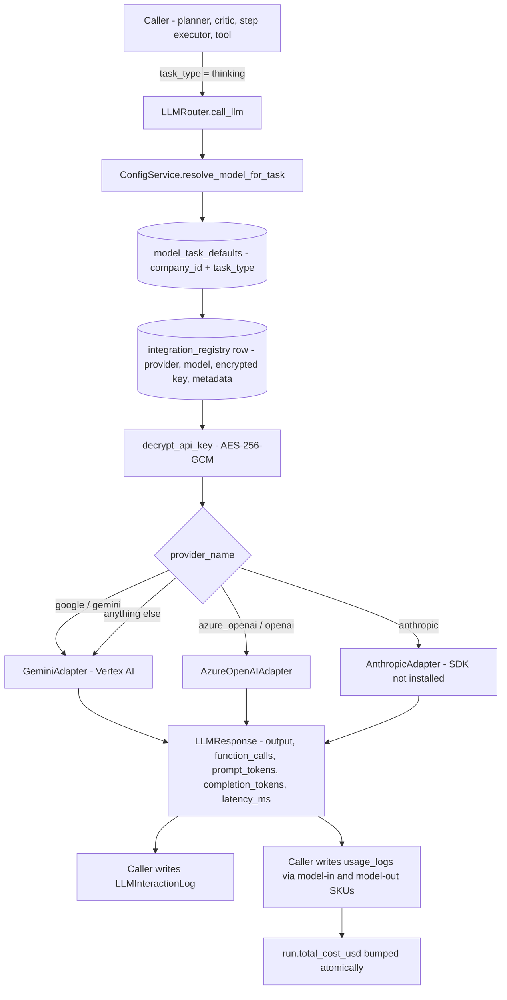

Four ideas carry the whole chapter:

| Idea | Meaning |
|---|---|
| **Integration Registry** | One row per *billable component* of a service. A single model normally needs two rows: `gemini-2.5-flash-in` and `gemini-2.5-flash-out`. |
| **APP-company fallback** | Every lookup tries the caller's company first, then the platform-level company (`companies.type = 'APP'`). Tenants inherit the platform's models for free. |
| **Task defaults** | `model_task_defaults` maps a logical task (`text_generation`, `thinking`, `speech_to_speech`, …) to an integration row. Change the row, every agent switches model. |
| **Adapter** | A thin per-provider class implementing two methods. It translates HireBuddha's internal message and tool-schema format into the provider's, and normalises the reply. |

---

## 2. The Integration Registry

Two tables, both defined in [config/models.py](../../backend/src/config/models.py).

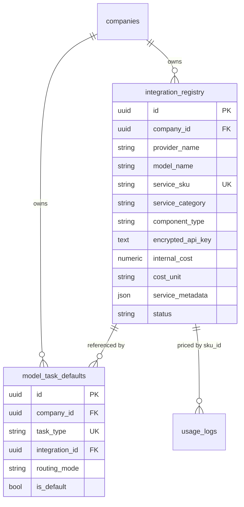

### 2.1 What an integration row holds

| Column | Type | Meaning | Example |
|---|---|---|---|
| `company_id` | UUID FK | Owner. Unique together with `service_sku`. | APP company UUID |
| `provider_name` | str | Drives adapter selection. Case-insensitive in the router. | `google`, `azure_openai`, `anthropic`, `twilio`, `firecrawl` |
| `model_name` | str, nullable | The model id sent to the provider. | `gemini-2.5-flash` |
| `service_sku` | str | **Billing key.** Unique per company. Usage rows join on this. | `gemini-2.5-flash-in` |
| `service_category` | str | Coarse grouping. Free-text, see §2.3. | `LLM`, `LLM_LIVE`, `EMBEDDING` |
| `component_type` | str | What the `internal_cost` is *per*. | `input_token`, `output_token`, `minute`, `image` |
| `encrypted_api_key` | text | AES-256-GCM ciphertext, base64. Never returned by the API. | `q0Z...` |
| `internal_cost` | numeric(18,6) | Platform's raw cost per `cost_unit`. | `0.30` |
| `cost_unit` | str | Divisor selector. **String matching — see the trap in §12.3.** | `1M Tokens` |
| `service_metadata` | JSON | Everything provider-specific that is not secret. | `{"project_id": "...", "region": "us-central1"}` |
| `status` | str | Only `active` rows are ever selected. | `active` |

The unique constraint is what makes SKUs the stable handle:

```python
# backend/src/config/models.py
class IntegrationRegistry(Base):
    __tablename__ = "integration_registry"
    __table_args__ = (
        UniqueConstraint('company_id', 'service_sku', name='uq_integration_company_sku'),
    )
```

### 2.2 `service_metadata` by provider

This is the only place non-secret provider configuration lives. Getting it wrong
is the single most common cause of a broken integration.

| Provider | Required keys | Optional keys | Read by |
|---|---|---|---|
| `google` / `gemini` (Vertex AI) | `project_id` | `region` (default `us-central1`) | [genai_factory.py:59](../../backend/src/common/genai_factory.py:59) |
| `google` / `gemini` (AI Studio, Live models only) | — | `use_ai_studio: true` | [live_client_factory.py:120](../../backend/src/voice/live_client_factory.py:120) |
| `anthropic` | `project_id` | `region` (default `us-east5`) | [anthropic_adapter.py:34](../../backend/src/ai/llm/anthropic_adapter.py:34) |
| `azure_openai` | `azure_endpoint` | `api_version` (default `2025-01-01-preview`), `deployment_name` | [azure_adapter.py:54](../../backend/src/ai/llm/azure_adapter.py:54) |

Note the drift: the LLM adapter defaults `api_version` to `2025-01-01-preview`
([azure_adapter.py:55](../../backend/src/ai/llm/azure_adapter.py:55)) while the
voice Realtime path defaults it to `2025-04-01-preview`
([live_client_factory.py:170](../../backend/src/voice/live_client_factory.py:170)).
Always set it explicitly.

### 2.3 `service_category` is not an enum

The column comment in `models.py` lists `LLM, LLM_LIVE, IMAGE_GEN, AUDIO_GEN,
VIDEO_GEN, 3D_GEN, API_TOOL, COMMUNICATION`. The code actually queries for a
*different* set, and the frontend offers a third. There is no validation
anywhere — it is a free-text string.

| Value | Written by | Read by |
|---|---|---|
| `LLM` | UI default, all guides | [config/router.py:41](../../backend/src/config/router.py:41) model list, [step_executor.py:480](../../backend/src/ai/step_executor.py:480) cost exclusion |
| `LLM_LIVE` | Credentials guide | [config/router.py:41](../../backend/src/config/router.py:41), [platform_schema_compiler.py:392](../../backend/src/ai/meta/platform_schema_compiler.py:392) |
| `EMBEDDING` | manual | [embedding_service.py:159](../../backend/src/ai/memory/embedding_service.py:159) |
| `IMAGE_GENERATION` | UI, guide | [image_generation.py:103](../../backend/src/ai/tools/media/image_generation.py:103) |
| `VIDEO_GENERATION` | UI, guide | [video_generate.py:263](../../backend/src/ai/tools/media/video/video_generate.py:263) |
| `CUSTOM_API` | manual | [tool_cost_resolver.py:174](../../backend/src/ai/governance/tool_cost_resolver.py:174) |
| `EMAIL`, `SOCIAL_MEDIA`, `API_TOOL`, `OTHER` | UI | tenant-permission check only |

The comment's `IMAGE_GEN` / `VIDEO_GEN` values are **not** what the code looks
for. Use `IMAGE_GENERATION` and `VIDEO_GENERATION`.

### 2.4 The registry is not only for LLMs

Twilio, Tata Tele, Razorpay, Firecrawl, SerpAPI, Google CSE and system SMTP all
store their credentials here too — same encryption, same fallback rules. See
[12 — Voice & telephony](12-voice-and-telephony.md) and
[09 — Tools](09-tools.md). This document only covers the LLM path.

---

## 3. Credential encryption at rest

The `api_key` you POST is never stored in plaintext. It is encrypted at the
service boundary in [config/service.py](../../backend/src/config/service.py) and
decrypted only inside the resolver functions.

```python
# backend/src/common/security.py
def encrypt_api_key(api_key: str) -> str:
    """Encrypt API key using AES-256-GCM."""
    if not api_key:
        return None
    key = settings.ENCRYPTION_MASTER_KEY.encode()
    if len(key) > 32:
        key = key[:32]
    elif len(key) < 32:
        key = key.ljust(32, b'\0')

    aesgcm = AESGCM(key)
    nonce = os.urandom(12)
    ciphertext = aesgcm.encrypt(nonce, api_key.encode(), None)
    return base64.b64encode(nonce + ciphertext).decode('utf-8')
```

| Property | Value |
|---|---|
| Algorithm | AES-256-GCM (`cryptography.hazmat.primitives.ciphers.aead.AESGCM`) |
| Key source | `settings.ENCRYPTION_MASTER_KEY` — env var, single global key for the whole platform |
| Key derivation | **None.** The raw UTF-8 bytes are truncated to 32 or right-padded with `\0`. No KDF, no salt. |
| Nonce | 12 random bytes from `os.urandom`, fresh per encryption |
| AAD | `None` — the ciphertext is not bound to the row, company or SKU |
| Storage format | `base64(nonce ‖ ciphertext ‖ tag)` in `integration_registry.encrypted_api_key` |
| Default value | `"your-default-dev-key-must-be-32-bytes"` in [common/config.py:9](../../backend/src/common/config.py:9) |

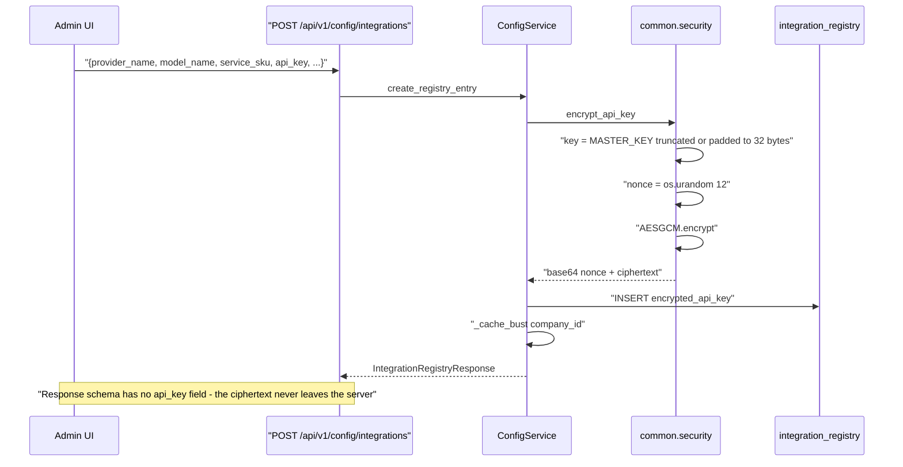

### Security notes a new dev should internalise

- `IntegrationRegistryResponse` in [schemas.py:55](../../backend/src/config/schemas.py:55)
  deliberately inherits from `IntegrationRegistryBase`, which has **no**
  `api_key` and no `encrypted_api_key`. Keys are write-only over the API.
- There is **one master key for the entire platform**. Rotating it invalidates
  every stored credential simultaneously — there is no key-version column and no
  re-encryption job. Plan a rotation as a full re-entry of all secrets.
- Because AAD is `None`, a ciphertext copied from one row into another decrypts
  fine. Row-level integrity is not cryptographically enforced.
- The padding scheme means `ENCRYPTION_MASTER_KEY="abc"` silently becomes
  `abc` + 29 NUL bytes. Weak keys do not error; they just work badly. Use a real
  32-byte secret.
- For **Vertex AI providers the stored key is a placeholder**. Google auth uses
  Application Default Credentials from `GOOGLE_APPLICATION_CREDENTIALS`, not the
  registry key. The resolver still *requires* a non-null key or it raises, so
  convention is to store the literal string `vertex-ai-service-account`.

---

## 4. Credential resolution and the APP-company fallback

There are two distinct resolution paths and it matters which one you are in.

### 4.1 Path A — `resolve_model_for_task` (what `LLMRouter` uses)

This is the *narrow* path: it goes through the task default and reads the key
off exactly that integration row. **There is no SKU waterfall here.**

```python
# backend/src/config/service.py
async def resolve_model_for_task(
    self, company_id: UUID, task_type: str
) -> Tuple[Optional[IntegrationRegistry], Optional[str]]:
    task_default = await self.get_task_default(company_id, task_type)
    if not task_default:
        return None, None
    result = await self.db.execute(
        select(IntegrationRegistry).where(
            IntegrationRegistry.id == task_default.integration_id,
            IntegrationRegistry.status == "active"
        )
    )
    integration = result.scalar_one_or_none()
    if not integration:
        return None, None
    api_key = None
    if integration.encrypted_api_key:
        api_key = decrypt_api_key(integration.encrypted_api_key)
    return integration, api_key
```

The APP-company fallback happens one level up, inside `get_task_default`:

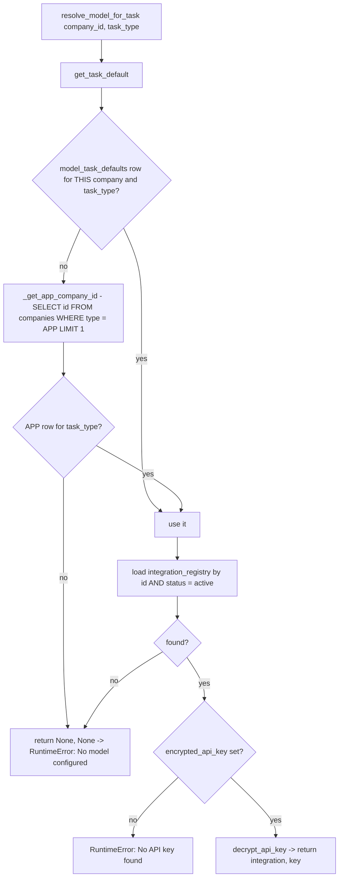

Two things to notice:

1. The **integration row is loaded by primary key**, so a tenant's task default
   may legitimately point at an APP-owned integration and vice versa. Ownership
   of the *default* and ownership of the *integration* are independent.
2. `_get_app_company_id` does `SELECT id FROM companies WHERE type = 'APP' LIMIT 1`
   with no ordering. If two APP companies exist the winner is arbitrary.

### 4.2 Path B — `resolve_api_key` (the six-step waterfall)

Used by non-LLM-router callers that know a provider and maybe a model but have
no task default. Each individual step does its *own* company-then-APP fallback,
so this is effectively a 12-query worst case — which is exactly why the cache in
§5 exists.

```python
# backend/src/config/service.py
async def resolve_api_key(self, company_id, provider, model_name=None) -> Optional[str]:
    """
    Resolution order (first match wins):
      1. Exact SKU match (model_name)
      2. SKU match for "{model_name}-in"
      3. Model-name field match
      4. Provider generic key "{provider}-api-key"
      5. Any active key for provider
      6. Case-insensitive provider alias (google ↔ Gemini)
    """
```

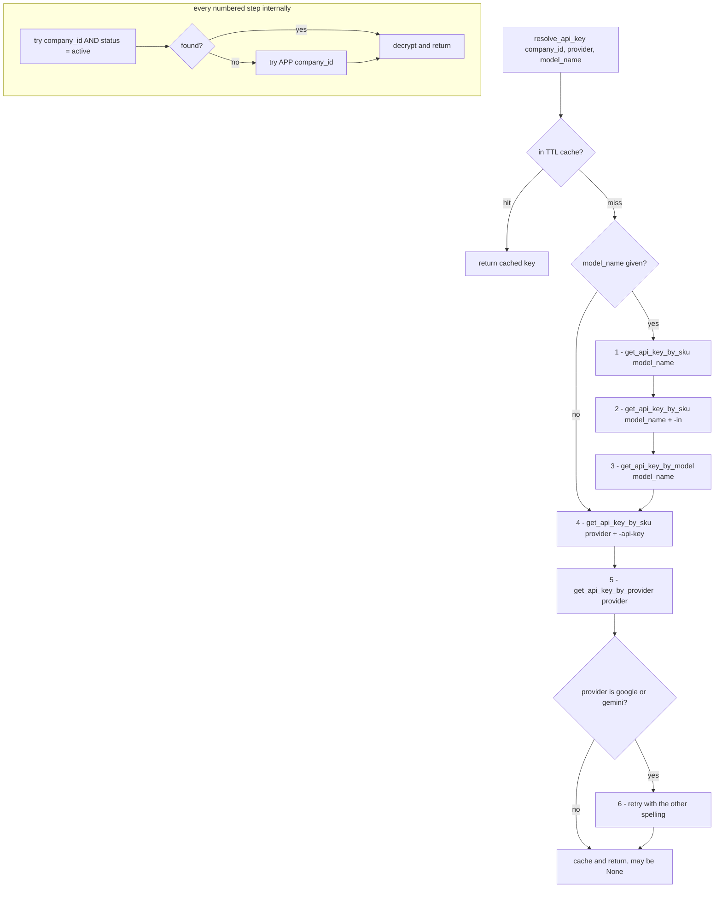

The three primitives that implement the inner fallback are
[`get_api_key_by_sku`](../../backend/src/config/service.py:156),
[`get_api_key_by_model`](../../backend/src/config/service.py:184) and
[`get_api_key_by_provider`](../../backend/src/config/service.py:219). Their
whole-row twins, `get_integration_by_sku` and `get_integration_by_provider`,
follow the same pattern and are what `genai_factory` uses to find a Vertex
project id.

> Watch out: `get_integration_by_provider` matches with
> `provider_name.ilike("%name%")` — a *substring* match. Searching for `"google"`
> will also match a hypothetical `"google_ads"` row.

---

## 5. The API-key TTL cache

Declared in `pyproject.toml` as `cachetools = "^5.3.0"  # P0.2: TTL cache for
API key resolution`. It lives at module scope in
[config/service.py](../../backend/src/config/service.py), so it is **per Python
process**, not shared across workers.

```python
# backend/src/config/service.py
try:
    from cachetools import TTLCache
    _API_KEY_CACHE: TTLCache = TTLCache(maxsize=512, ttl=60)
    _CACHE_AVAILABLE = True
except ImportError:
    _API_KEY_CACHE = {}  # type: ignore[assignment]
    _CACHE_AVAILABLE = False


def _cache_bust(company_id: UUID, provider: Optional[str] = None):
    """Remove all cached entries for a company (called on create/update/delete)."""
    if not _CACHE_AVAILABLE:
        return
    prefix = str(company_id)
    stale = [k for k in list(_API_KEY_CACHE.keys()) if k.startswith(prefix)]
    for k in stale:
        _API_KEY_CACHE.pop(k, None)
```

| Property | Value |
|---|---|
| Implementation | `cachetools.TTLCache` |
| Max size | 512 entries (LRU eviction beyond that) |
| TTL | **60 seconds** |
| Key format | `f"{company_id}:{provider}:{model_name or ''}"` |
| Value | the **decrypted plaintext** API key |
| Scope | one in-process dict per uvicorn/arq worker |
| Invalidation | `_cache_bust(company_id)` on create, update and delete of any integration row |
| Degradation | if `cachetools` is missing, `_CACHE_AVAILABLE = False` and every lookup hits the DB. Nothing breaks. |

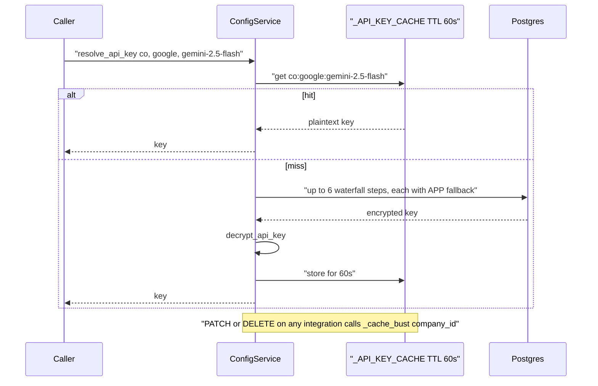

Two consequences to keep in mind:

- **`resolve_model_for_task` does not use this cache.** The LLM router path
  decrypts on every miss of its own adapter cache. Only the waterfall path is
  cached.
- **Only successful lookups are cached.** A `None` result is re-queried every
  time, so a misconfigured company pays the full 12-query cost on every call.
- Because the cache is per-process and busting is local, rotating a key on one
  API worker leaves other workers serving the old key for up to 60 seconds.

### 5.1 The second cache: per-router adapter memoisation

`LLMRouter` keeps its own dict for the lifetime of the instance (usually one
run, or one step):

```python
# backend/src/ai/llm/router.py
cache_key = f"{self.company_id}:{task_type}:{model_override or ''}"
if cache_key in self._adapter_cache:
    return self._adapter_cache[cache_key]
```

This is labelled `Phase 4 (PERF-4)`. It caches the *adapter object* (which holds
the plaintext key), so a long-lived `LLMRouter` will not observe a key rotation
at all. Routers are constructed per run, so in practice the staleness window is
one run.

---

## 6. Task defaults and model routing

### 6.1 The canonical task list

`TASK_TYPES` in [config/models.py:11](../../backend/src/config/models.py:11) is
the validation list for `POST /api/v1/config/task-defaults`. Descriptions come
from `GET /api/v1/config/task-types`.

| `task_type` | Description (from the API) | Used by |
|---|---|---|
| `text_generation` | Generate text, chat, Q&A, summarization | Default for almost everything — step executor, critics, planner, summariser, meta-tools |
| `thinking` | Complex reasoning, planning, analysis | Plan generation, plan judge, deeper reasoning steps |
| `text_to_image` | Generate images from text prompts | [image_generation.py:137](../../backend/src/ai/tools/media/image_generation.py:137) |
| `image_to_image` | Transform or edit existing images | declared, no caller found |
| `text_to_speech` | Convert text to audio speech | declared, no caller found |
| `text_to_music` | Generate music or audio from text | declared, no caller found |
| `text_to_video` | Generate video from text description | video tools |
| `text_to_3d` | Generate 3D models from text | declared, no caller found |
| `image_to_video` | Animate or transform images into video | declared, no caller found |
| `audio_to_video` | Generate video synchronized with audio | declared, no caller found |
| `speech_to_speech` | Real-time bidirectional voice conversation | [live_client_factory.py:59](../../backend/src/voice/live_client_factory.py:59), [azure_realtime.py:338](../../backend/src/voice/azure_realtime.py:338) |

**There is no shipped default.** `model_task_defaults` starts empty; nothing
seeds it. Until an app admin configures at least `text_generation`, every agent
run fails with `RuntimeError: No model configured for task type
'text_generation'`.

### 6.2 Three task types the code uses but the API rejects

This is the most important drift in this document.

| Task type used in code | Where | In `TASK_TYPES`? | Consequence |
|---|---|---|---|
| `embedding` | [embedding_service.py:133](../../backend/src/ai/memory/embedding_service.py:133) reads it; the admin UI offers it | ❌ No | `POST /config/task-defaults` returns **422**. The UI card renders but cannot be saved. Only a direct DB insert works. |
| `vision` | [video_gateway.py:312](../../backend/src/gateway/video_gateway.py:312) | ❌ No | Always raises `No model configured for task type 'vision'`, swallowed by the surrounding `except`. Video-call frame analysis is effectively dead. |
| `goal_validation` | [planner_service.py:231](../../backend/src/ai/planning/planner_service.py:231) | ❌ No | Same. The caller catches it and returns a hardcoded `{"score": 50, ...}`. |

`get_task_default` queries by raw string, so a manually inserted row *does*
work — the 422 lives only in the write endpoint
([config/router.py:211](../../backend/src/config/router.py:211)).

### 6.3 The routing decision, end to end

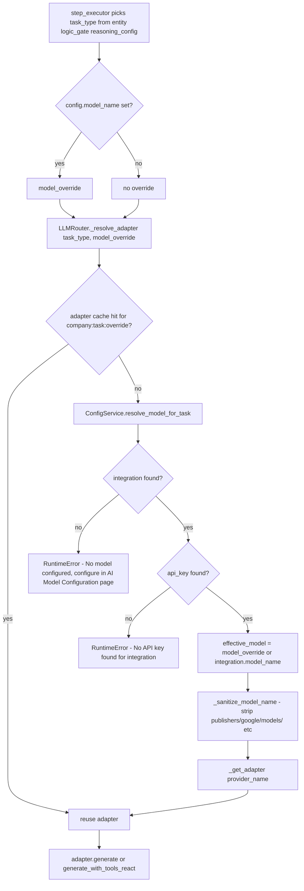

The entity-level override is read straight out of the entity JSON:

```python
# backend/src/ai/step_executor.py
task_type = config.get("task_type", "text_generation")
# Allow entity-level model override (e.g. Pro for synthesizer).
model_override = config.get("model_name")
```

Precedence is therefore: **entity `reasoning_config.model_name` > company task
default > APP task default > error**. Note the override changes only the *model
id string* — the provider, credentials and `service_metadata` still come from
the task default's integration row. Overriding a Gemini default with
`"gpt-4o"` will send `gpt-4o` to Vertex AI and 404.

### 6.4 `routing_mode` is dead

`model_task_defaults.routing_mode` accepts `"single"` or `"router"` and the
docstring promises "use LLM router logic". Grep the backend: the column is
written, read back in API responses, and **never consulted by any dispatch
code**. The UI reflects this honestly:

```tsx
// frontend/src/pages/ai-config/AIModelConfigPage.tsx
<button
    className={currentMode === 'router' ? 'active' : ''}
    onClick={() => handleTaskChange(task.id, 'routing_mode', 'router')}
    disabled // Disabled temporarily for beta until full router capability is exposed to UI
>
    Fallback Router
</button>
```

There is no multi-provider fallback anywhere in the LLM layer. Treat
`routing_mode` as reserved-for-future-use.

### 6.5 The one place a *different* model is deliberately chosen

The critic pipeline picks a critic model different from the actor's, so that a
model does not grade its own homework. This is a routing decision, but it is
implemented as a `model_override` string, not as a task default.

```python
# backend/src/ai/planning/critic_pipeline.py
_CRITIC_LADDER: list[tuple[str, str]] = [
    ("flash", "gemini-2.5-pro"),
    ("haiku", "claude-sonnet-4-5"),
    ("mini",  "gpt-4o"),
    ("nano",  "gpt-4o"),
    ("sonnet","claude-opus-4-1"),
    ("opus",  "gpt-5"),
    ("gpt-4o","claude-sonnet-4-5"),
    ("gpt-5", "claude-opus-4-1"),
    ("gemini-2.5-pro", "claude-sonnet-4-5"),
]
```

Priority is entity override → company override → ladder → `None` (same model
with a hostile prompt). Because the override only swaps the model *name* and
keeps the task default's provider, half of this ladder cannot work in practice:
mapping a Gemini actor to `claude-sonnet-4-5` sends a Claude model id to Vertex
AI Gemini. See [07 — Planning & critics](07-planning-and-critics.md).

---

## 7. The adapter contract and the LLM router

### 7.1 The class model

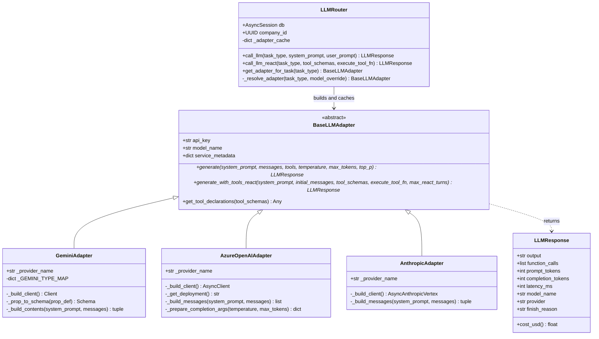

The base class is deliberately tiny — 61 lines:

```python
# backend/src/ai/llm/base.py
class BaseLLMAdapter(ABC):
    """Base class for all LLM provider adapters."""

    def __init__(self, api_key: str, model_name: str, service_metadata: Dict[str, Any]):
        self.api_key = api_key
        self.model_name = model_name
        self.service_metadata = service_metadata or {}

    @abstractmethod
    async def generate(...) -> LLMResponse: ...

    @abstractmethod
    async def generate_with_tools_react(...) -> LLMResponse: ...

    def get_tool_declarations(self, tool_schemas: List[Dict]) -> Any:
        """Convert generic JSON Schema tool defs to provider-specific format."""
        return tool_schemas  # Default: pass through as-is
```

### 7.2 The internal message format

Every adapter receives the same shape, which is Gemini-flavoured:

```python
{"role": "user" | "model" | "system", "parts": [{"text": "..."}]}
```

`LLMRouter.call_llm` builds it by appending the current turn to history:

```python
messages = list(history or [])
messages.append({"role": "user", "parts": [{"text": user_prompt}]})
```

Azure and Anthropic adapters translate `model` → `assistant` and flatten `parts`
into a single string. **Only `{"text": ...}` parts are handled** — there is no
image, audio or file part in any adapter. Anything multimodal must be smuggled
in as text, which is exactly what the video gateway tries to do and why it does
not work.

### 7.3 The provider factory

```python
# backend/src/ai/llm/router.py
def _get_adapter(provider_name, api_key, model_name, service_metadata) -> BaseLLMAdapter:
    model_name = _sanitize_model_name(model_name)
    pn = (provider_name or "").lower()
    if pn in ("google", "gemini", "google_vertex"):
        return GeminiAdapter(...)
    elif pn in ("anthropic", "anthropic_vertex"):
        return AnthropicAdapter(...)
    elif pn in ("azure_openai", "azure", "openai"):
        return AzureOpenAIAdapter(...)
    else:
        logger.warning(f"Unknown provider '{provider_name}', defaulting to GeminiAdapter")
        return GeminiAdapter(...)
```

| `provider_name` (lower-cased) | Adapter |
|---|---|
| `google`, `gemini`, `google_vertex` | `GeminiAdapter` |
| `anthropic`, `anthropic_vertex` | `AnthropicAdapter` |
| `azure_openai`, `azure`, `openai` | `AzureOpenAIAdapter` |
| anything else | `GeminiAdapter` + a warning log |

Note `openai` maps to the **Azure** adapter, which requires
`service_metadata.azure_endpoint`. There is no plain OpenAI-platform path.

`_sanitize_model_name` strips Vertex resource prefixes so a stored
`publishers/google/models/gemini-2.5-flash` still works:

```python
_PREFIXES = (
    "publishers/google/models/",
    "publishers/anthropic/models/",
    "models/",
)
```

### 7.4 Fallback, retry and timeouts — there are none

This is worth stating plainly because the naming ("Router", "Fallback Router")
suggests otherwise.

| Concern | Status in [ai/llm/](../../backend/src/ai/llm/) |
|---|---|
| Provider fallback | **Not implemented.** One task type → one integration → one provider. |
| Retry on 429/5xx | **Not implemented.** No `tenacity`, no backoff loop. Exceptions propagate to the caller. |
| Request timeout | **Not set.** Each SDK's own default applies (`google-genai` and `openai` both default to their library timeouts). |
| Circuit breaking | **Not implemented.** |
| Streaming | **Not implemented** for text. No `generate_content_stream`, no `stream=True`. Streaming exists only in the voice/Live path (§14) and in the gateway's HTTP proxy. |

The only error handling in the whole layer is a Gemini SDK-version workaround:

```python
# backend/src/ai/llm/gemini_adapter.py
except Exception as e:
    if "ValidationError" in type(e).__name__ and "finish_reason" in str(e):
        logger.warning(f"SDK finish_reason validation error (non-fatal), retrying with raw HTTP: {e}")
        raise RuntimeError(
            f"Gemini SDK validation error for model {self.model_name}. "
            f"Consider upgrading google-genai (current: 0.4.0). Error: {e}"
        ) from e
    raise
```

The log line says "retrying with raw HTTP" but the code immediately re-raises.
There is no raw-HTTP retry. In the ReAct loop the same condition is treated as
end-of-turn (`break`) instead, which silently truncates the loop.

Resilience is therefore a *caller* responsibility. Retry lives in the agent
kernel and the tool layer, not here — see
[05 — Agent kernel](05-agent-kernel.md) and
[09 — Tools](09-tools.md).

### 7.5 Tracing

Both entry points wrap the call in a trace span from
[ai/core/trace.py](../../backend/src/ai/core/trace.py):

```python
async with _trace_span(
    "llm", model_override or task_type,
    task_type=task_type, system_prompt=system_prompt,
    user_prompt=user_prompt, history=history,
) as _sp:
    resp = await adapter.generate(...)
    _record_llm_span(_sp, resp)
    return resp
```

`_record_llm_span` stamps output, tokens, model, provider, finish reason,
function calls and cost onto the span — wrapped in bare `except: pass` so
tracing can never break a run. The ReAct variant names its span
`"<task> (react)"` so tool spans nest visibly underneath it.

---

## 8. Google Gemini via Vertex AI

[gemini_adapter.py](../../backend/src/ai/llm/gemini_adapter.py) — 333 lines.
This is the default and by far the most-used adapter.

### 8.1 Authentication

**Vertex AI only.** The adapter never uses the registry's API key for auth; it
delegates client construction to the shared factory, which uses Application
Default Credentials.

```python
# backend/src/ai/llm/gemini_adapter.py
def _build_client(self):
    from src.common.genai_factory import build_vertex_genai_client_sync
    return build_vertex_genai_client_sync(self.service_metadata)
```

```python
# backend/src/common/genai_factory.py
kwargs: Dict[str, Any] = {
    "vertexai": True,
    "project": project_id,
    "location": region,
}
```

| Aspect | Value |
|---|---|
| Auth mechanism | GCP ADC — `GOOGLE_APPLICATION_CREDENTIALS` JSON key, or an attached service account on GCE/GKE/Cloud Run |
| Required IAM | `roles/aiplatform.user` |
| `project_id` | from `service_metadata`, **required** — raises `ValueError` otherwise |
| `region` | from `service_metadata`, defaults to `us-central1` |
| Registry `api_key` | stored, decrypted, handed to the adapter, and **never used** — but must be non-null or the router raises |

There is a second factory, `build_ai_studio_genai_client_sync`, that does use an
API key — but it is only wired into the voice Live path, not the text adapter.

### 8.2 Request and response

```mermaid
sequenceDiagram
    participant R as LLMRouter
    participant A as GeminiAdapter
    participant F as genai_factory
    participant V as "Vertex AI generateContent"

    R->>A: "generate(system_prompt, messages, tools, temperature, max_tokens, top_p)"
    A->>F: build_vertex_genai_client_sync(service_metadata)
    F->>F: "require project_id, default region us-central1"
    F-->>A: "genai.Client(vertexai=True)"
    A->>A: "_build_contents - skip role=system, map parts to types.Part.from_text"
    A->>A: "GenerateContentConfig(system_instruction, temperature, top_p)"
    opt tools present
        A->>A: "get_tool_declarations -> types.Tool(function_declarations=[...])"
    end
    A->>V: "client.aio.models.generate_content(model, contents, config)"
    V-->>A: GenerateContentResponse
    A->>A: "walk candidates[0].content.parts"
    A->>A: "function_call parts -> {name, args}; text parts -> output"
    A->>A: "usage_metadata.prompt_token_count / candidates_token_count"
    A-->>R: "LLMResponse(output, function_calls, tokens, latency_ms, finish_reason)"
```

The parsing loop is the part worth reading closely:

```python
# backend/src/ai/llm/gemini_adapter.py
output = ""
function_calls = []
if response.candidates and response.candidates[0].content.parts:
    for part in response.candidates[0].content.parts:
        if hasattr(part, "function_call") and part.function_call:
            function_calls.append({
                "name": part.function_call.name,
                "args": dict(part.function_call.args) if part.function_call.args else {},
            })
        elif hasattr(part, "text") and part.text:
            output += part.text
if not output and response.text:
    output = response.text
```

### 8.3 Feature support matrix

| Feature | Supported | Notes |
|---|---|---|
| System instruction | ✅ | `GenerateContentConfig.system_instruction`; `role="system"` messages are dropped from `contents` |
| `temperature` | ✅ | both paths |
| `top_p` | ⚠️ | passed in `generate()`, **omitted** in the ReAct path |
| `max_tokens` | ✅ | mapped to `max_output_tokens` |
| Function calling | ✅ | full JSON-Schema → `types.Schema` conversion, recursive |
| Multi-turn ReAct | ✅ | native `Part.from_function_response` protocol |
| Streaming | ❌ | no `generate_content_stream` anywhere in the text path |
| Thinking / reasoning config | ❌ | no `ThinkingConfig`, no `thinking_budget`. The `thinking` *task type* just routes to a different model; the `CHAIN_OF_THOUGHT` mode is prompt scaffolding in [step_executor.py:1068](../../backend/src/ai/step_executor.py:1068) |
| Safety settings | ❌ | never set — Vertex defaults apply. A `SAFETY` finish reason surfaces as empty output |
| Response MIME type / JSON mode | ❌ | JSON is requested in the prompt and parsed defensively |
| Grounding / Google Search tool | ❌ | not wired |
| Multimodal input | ❌ | only `Part.from_text` |
| Cached content | ❌ | not used |

### 8.4 The FinishReason monkey-patch

`google-genai` is pinned at `^0.4.0`, whose Pydantic model rejects
`finish_reason` values newer than the SDK. Rather than upgrade, the codebase
patches the SDK at import time:

```python
# backend/src/ai/llm/types.py
if hasattr(candidate_cls, 'model_fields') and 'finish_reason' in candidate_cls.model_fields:
    field_info = candidate_cls.model_fields['finish_reason']
    permissive_type = typing.Optional[str]
    field_info.annotation = permissive_type
    candidate_cls.__annotations__['finish_reason'] = permissive_type
    candidate_cls.model_rebuild(force=True)
```

It runs unconditionally when `src.ai.llm.types` is imported and swallows every
failure. If you upgrade `google-genai`, delete this and re-test — a silently
half-applied patch is worse than none.

### 8.5 Token accounting

| Field | Source |
|---|---|
| `prompt_tokens` | `usage_metadata.prompt_token_count` |
| `completion_tokens` | `usage_metadata.candidates_token_count` |
| thinking tokens | **not captured** — `thoughts_token_count` is ignored |

For reasoning-heavy Gemini models this under-reports output tokens and therefore
under-bills. In the ReAct path the counts are summed across all turns, so a
5-turn loop reports one aggregate number with a single `latency_ms` total.

---

## 9. Azure OpenAI

[azure_adapter.py](../../backend/src/ai/llm/azure_adapter.py) — 328 lines. The
interesting complexity is entirely in client construction.

### 9.1 Three endpoint shapes

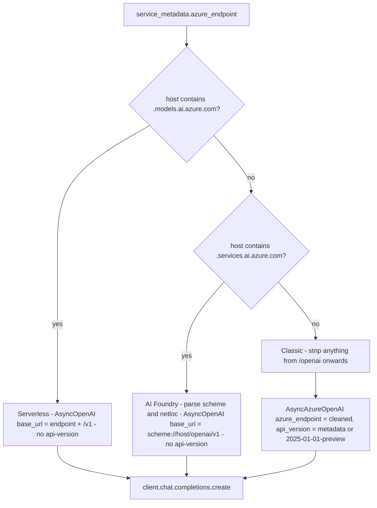

The classic branch defends against a very common paste error:

```python
# backend/src/ai/llm/azure_adapter.py
cleaned = azure_endpoint.rstrip("/")
idx = cleaned.lower().find("/openai")
if idx != -1:
    cleaned = cleaned[:idx]
    logger.info("Azure adapter: cleaned classic endpoint %s → %s", azure_endpoint, cleaned)
```

| Endpoint pattern | SDK class | `api-version` | URL the SDK builds |
|---|---|---|---|
| `*.openai.azure.com` | `AsyncAzureOpenAI` | yes | `{endpoint}/openai/deployments/{deployment}/chat/completions?api-version=...` |
| `*.services.ai.azure.com` | `AsyncOpenAI` | **no** — the endpoint rejects it | `https://{host}/openai/v1/chat/completions` |
| `*.models.ai.azure.com` | `AsyncOpenAI` | no | `{endpoint}/v1/chat/completions` |

### 9.2 Deployment names

Azure addresses a *deployment*, not a model. The adapter resolves it with a
one-line fallback:

```python
def _get_deployment(self) -> str:
    """Get deployment name from metadata or fall back to model_name."""
    return self.service_metadata.get("deployment_name", self.model_name)
```

So `model_name` is used for two different things: the value sent as `model=`
(when no `deployment_name` is set) and the value recorded on `LLMResponse` for
billing SKUs. If your Azure deployment is named `prod-gpt4o` but your SKUs are
`gpt-4o-in` / `gpt-4o-out`, set `model_name: "gpt-4o"` and
`deployment_name: "prod-gpt4o"`. Getting this backwards produces correct
completions and zero billing rows.

### 9.3 Reasoning-model parameter juggling

```python
# backend/src/ai/llm/azure_adapter.py
model_lower = (self.model_name or "").lower()
use_max_completion_tokens = any(x in model_lower for x in ["gpt-5", "gpt-5.5", "o1", "o3"])

if max_tokens is not None:
    if use_max_completion_tokens:
        args["max_completion_tokens"] = max_tokens
    else:
        args["max_tokens"] = max_tokens

is_reasoning_model = use_max_completion_tokens  # same set of models
if is_reasoning_model:
    args["temperature"] = 1.0
else:
    args["temperature"] = temperature
```

Substring matching on the model name is fragile — `"o1"` matches
`"gpt-4o-1120"`. And note `top_p` is still passed unconditionally in
`generate()`, which some reasoning deployments reject.

### 9.4 Sequence

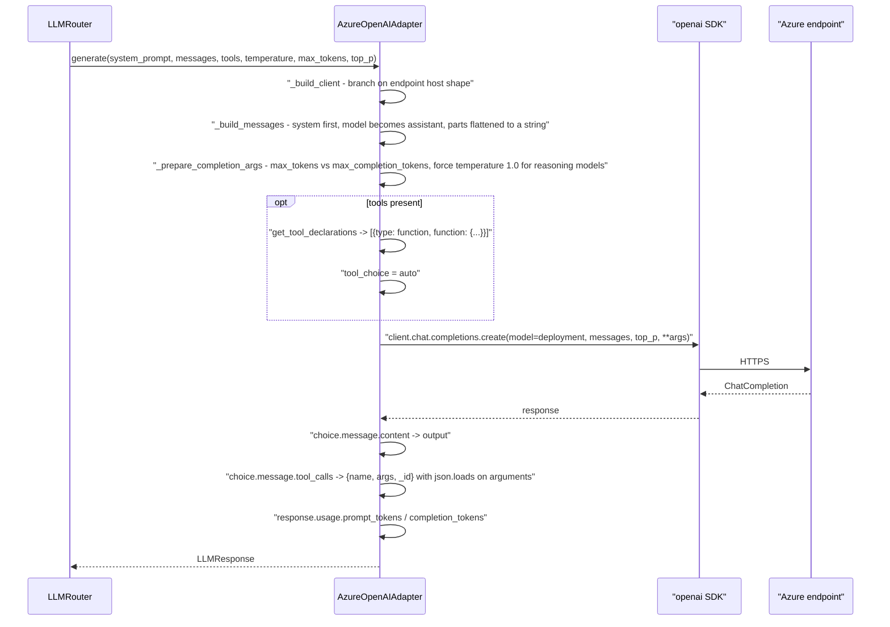

### 9.5 Feature support matrix

| Feature | Supported | Notes |
|---|---|---|
| System prompt | ✅ | prepended as a `system` message |
| `temperature` | ✅ | forced to `1.0` for `gpt-5`/`o1`/`o3` |
| `top_p` | ⚠️ | passed in `generate()`, **omitted** in the ReAct path |
| `max_tokens` | ✅ | auto-mapped to `max_completion_tokens` for reasoning models |
| Function calling | ✅ | native OpenAI `tools` array with `tool_call_id` round-tripping |
| Multi-turn ReAct | ✅ | `tool_calls` + `role: "tool"` messages |
| Malformed tool args | ✅ | `json.loads` failure falls back to `{"raw": "..."}` |
| Streaming | ❌ | never `stream=True` |
| JSON mode / structured outputs | ❌ | `response_format` never set |
| Vision | ❌ | text parts only |
| Managed identity auth | ❌ | API key only, from the registry |

### 9.6 Error mapping

There is none. `openai.APIError`, `RateLimitError`, `AuthenticationError` and
friends propagate raw to whichever caller invoked the router. Compare Gemini,
which at least intercepts one specific `ValidationError`.

---

## 10. Anthropic Claude via Vertex AI — real or aspirational

**Short answer: the adapter is real, complete and unreachable. Claude support is
aspirational as the app is currently packaged.**

Here is the evidence, in order.

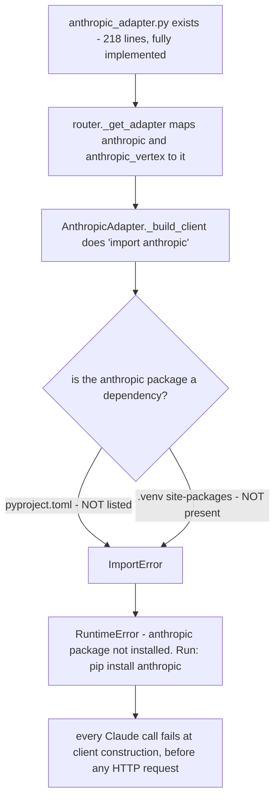

| Check | Result |
|---|---|
| Adapter file exists and is complete | ✅ [anthropic_adapter.py](../../backend/src/ai/llm/anthropic_adapter.py), 218 lines, both abstract methods implemented, tool translation and a full `tool_use`/`tool_result` ReAct loop |
| Wired into the factory | ✅ `("anthropic", "anthropic_vertex")` in [router.py:85](../../backend/src/ai/llm/router.py:85) |
| Model-name sanitiser knows Claude | ✅ `publishers/anthropic/models/` prefix is stripped |
| Cost estimator knows Claude prices | ✅ `claude-haiku`, `claude-sonnet-4-5`, `claude-opus-4-1` in `MODEL_PRICE_FACTOR` |
| Critic ladder recommends Claude | ✅ five of nine ladder entries point at Claude models |
| `anthropic` in `pyproject.toml` | ❌ **not present** — only `google-genai` and `openai` are declared |
| `anthropic` installed in `backend/.venv` | ❌ **not present** |
| Documented in the credentials guide | ✅ [AI_MODEL_CREDENTIALS_GUIDE.md §4.2](../../docs/how-to/AI_MODEL_CREDENTIALS_GUIDE.md) gives full setup curl commands |

So: an admin can follow the guide, register an `anthropic` integration, point
`thinking` at it, and every call will die with
`RuntimeError: anthropic package not installed. Run: pip install anthropic`
before a single byte reaches Vertex AI.

**To make it real:** add `anthropic = "^0.40"` (or current) to
`pyproject.toml`, reinstall, enable Claude in the Vertex AI Model Garden for
your project, and set `service_metadata = {"project_id": ..., "region":
"us-east5"}`. The adapter code itself should then work.

### 10.1 What the adapter does, for when it is enabled

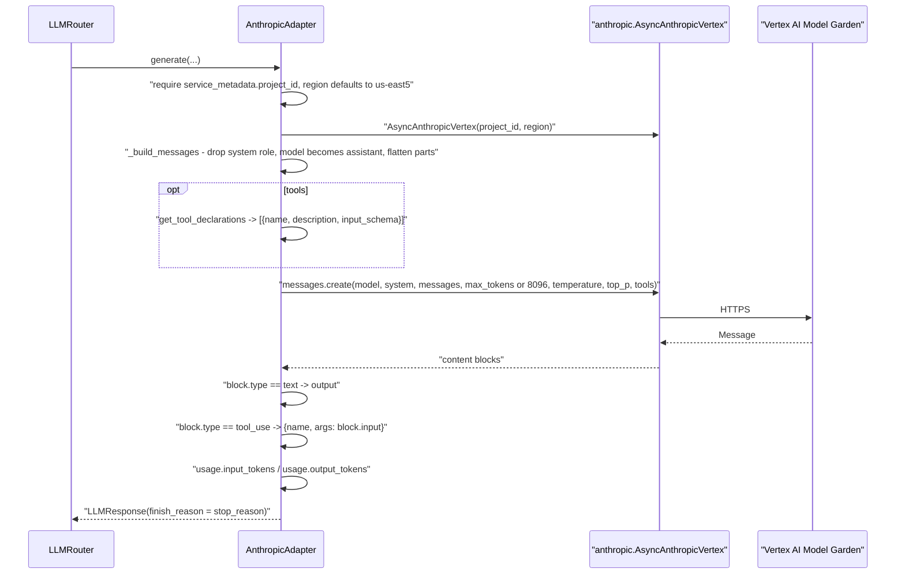

| Aspect | Value |
|---|---|
| Auth | ADC via `AsyncAnthropicVertex(project_id, region)` — same GCP service account as Gemini, plus Model Garden enablement |
| Default `max_tokens` | `8096` (Anthropic requires it; note the odd non-power-of-two) |
| Token fields | `usage.input_tokens` / `usage.output_tokens` |
| `finish_reason` | `response.stop_reason` |
| Streaming | ❌ |
| Extended thinking | ❌ no `thinking` parameter |
| Prompt caching | ❌ no `cache_control` blocks |
| Direct Anthropic API | ❌ Vertex only — there is no `AsyncAnthropic` path |

One latent bug for whoever enables it: the ReAct loop matches tool results back
to `tool_use` blocks **by tool name**, not by id.

```python
# backend/src/ai/llm/anthropic_adapter.py
matching_block = next(
    (b for b in assistant_content if getattr(b, "type", "") == "tool_use" and b.name == tr["tool"]),
    None
)
tool_use_id = getattr(matching_block, "id", tr["tool"]) if matching_block else tr["tool"]
```

If Claude emits two parallel calls to the same tool, both results are stamped
with the first block's id and the API will reject the turn. Gemini has the same
name-based coupling; only Azure carries a real `_id`.

---

## 11. Function and tool calling, provider by provider

HireBuddha's tool registry ([09 — Tools](09-tools.md)) hands the router a plain
JSON-Schema list:

```python
{
  "name": "web_search",
  "description": "Search the web ...",
  "parameters": {
    "type": "object",
    "properties": {"query": {"type": "string", "description": "..."}},
    "required": ["query"]
  }
}
```

Each adapter's `get_tool_declarations` translates it. The translations are **not
equivalent**.

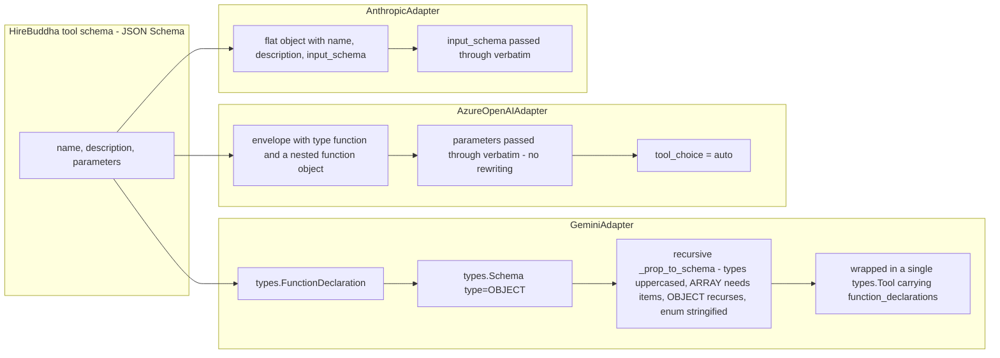

### 11.1 The Gemini translation is the only lossy one

Gemini needs typed `Schema` objects, so the adapter rebuilds the schema by hand:

```python
# backend/src/ai/llm/gemini_adapter.py
_GEMINI_TYPE_MAP = {
    "string": "STRING", "integer": "INTEGER", "number": "NUMBER",
    "boolean": "BOOLEAN", "array": "ARRAY", "object": "OBJECT",
}

def _prop_to_schema(self, prop_def: Dict) -> Any:
    prop_type = self._GEMINI_TYPE_MAP.get(prop_def.get("type", "string"), "STRING")
    kwargs = {"type": prop_type, "description": prop_def.get("description", "")}
    if "enum" in prop_def:
        kwargs["enum"] = [str(v) for v in prop_def["enum"]]
    if prop_type == "ARRAY":
        items_def = prop_def.get("items")
        kwargs["items"] = self._prop_to_schema(items_def) if isinstance(items_def, dict) \
                          else types.Schema(type="STRING")
    if prop_type == "OBJECT":
        ...recurse into properties, copy nested required...
    return types.Schema(**kwargs)
```

What survives and what does not:

| JSON-Schema construct | Gemini | Azure | Anthropic |
|---|---|---|---|
| `type` (6 primitives) | ✅ mapped to uppercase | ✅ verbatim | ✅ verbatim |
| unknown `type` | ⚠️ silently becomes `STRING` | ✅ verbatim | ✅ verbatim |
| `description` | ✅ | ✅ | ✅ |
| `enum` | ✅ **coerced to strings** — integer enums become `["1","2"]` | ✅ | ✅ |
| nested `object` | ✅ recursive | ✅ | ✅ |
| `array` without `items` | ⚠️ invented as `items: STRING` | ✅ | ✅ |
| `required` | ✅ top level and nested | ✅ | ✅ |
| `default`, `format`, `pattern`, `minimum`, `oneOf`, `$ref` | ❌ **dropped** | ✅ | ✅ |
| malformed property | ⚠️ replaced with a bare `STRING`, warning logged, tool survives | n/a | n/a |

So a tool whose schema relies on `oneOf` or `pattern` behaves differently on
Gemini than on Azure. When a tool misbehaves on one provider only, this table is
the first place to look.

### 11.2 The three ReAct protocols

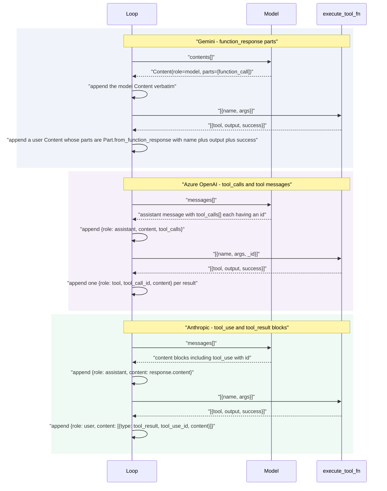

Loop-control differences that matter:

| Behaviour | Gemini | Azure | Anthropic |
|---|---|---|---|
| Turn cap | `max_react_turns`, default 10 from the base signature; step executor passes `MAX_REACT_TURNS = 12` | same | same |
| Result → call pairing | by **name** | by **`_id`** (correct) | by **name** |
| Success flag reaches the model | ✅ `{"output": ..., "success": ...}` | ❌ only `str(output)` | ❌ only `str(output)` |
| Unknown `finish_reason` | breaks the loop and returns what it has | n/a | n/a |
| Tokens | summed across turns | summed across turns | summed across turns |
| Loop exhaustion | falls out of the `for` with whatever text accumulated — **no error, no flag** | same | same |

The last row is a real trap: if the model keeps calling tools for all 12 turns,
you get a normal-looking `LLMResponse` whose `output` may be empty. The step
executor compensates by appending a formatted tool-result summary when the text
is blank:

```python
# backend/src/ai/step_executor.py
if all_tool_results:
    tool_summary = ToolExecutor.format_tool_results(all_tool_results)
    if not output.strip():
        output = tool_summary
    else:
        output = output + "\n\n=== Tool Execution Results ===\n" + tool_summary
```

---

## 12. Token accounting and cost

### 12.1 Where the numbers come from

| Provider | `prompt_tokens` | `completion_tokens` |
|---|---|---|
| Gemini | `usage_metadata.prompt_token_count` | `usage_metadata.candidates_token_count` |
| Azure OpenAI | `response.usage.prompt_tokens` | `response.usage.completion_tokens` |
| Anthropic | `response.usage.input_tokens` | `response.usage.output_tokens` |

All three default to `0` when usage is missing. `LLMResponse.cost_usd` is a
**hardcoded `0.0` placeholder** — never use it for money:

```python
# backend/src/ai/llm/types.py
@property
def cost_usd(self) -> float:
    """Estimated cost — placeholder for future per-model pricing."""
    return 0.0
```

### 12.2 The two-SKU model

Every LLM registers **two** registry rows. Callers derive the SKU names from
`LLMResponse.model_name` by string concatenation:

```python
# backend/src/ai/step_executor.py
input_sku = f"{model_name}-in" if model_name else "unknown-in"
output_sku = f"{model_name}-out" if model_name else "unknown-out"
```

| SKU | `component_type` | Priced against |
|---|---|---|
| `{model_name}-in` | `input_token` | `prompt_tokens` |
| `{model_name}-out` | `output_token` | `completion_tokens` |

Because the SKU is built from the model name the adapter reports, and the
adapter reports `self.model_name` (the *registry* value, or the entity's
`model_override`), an entity-level override silently changes which SKU is
billed. If `gemini-3.1-pro-preview-in` is not registered, the run produces
`No registry entry for SKU 'gemini-3.1-pro-preview-in' — input cost not tracked`
and bills nothing.

### 12.3 The cost formula — and the `cost_unit` trap

```python
# backend/src/ai/usage_service.py
divisor = Decimal("1.0")
if registry_entry.cost_unit:
    unit_lower = registry_entry.cost_unit.lower()
    if "1m token" in unit_lower or "per_million" in unit_lower or "million" in unit_lower:
        divisor = Decimal("1000000.0")
    elif "1k token" in unit_lower:
        divisor = Decimal("1000.0")
    elif "1000 char" in unit_lower:
        divisor = Decimal("1000.0")

calculated_cost = (registry_entry.internal_cost * Decimal(str(raw_quantity))) / divisor
```

```
calculated_cost = internal_cost * token_count / divisor
```

| `cost_unit` value | Matches? | Divisor |
|---|---|---|
| `1M Tokens` (frontend default) | `"1m token"` ✅ | 1,000,000 |
| `per_million_tokens` | `"per_million"` ✅ | 1,000,000 |
| `1K Tokens` | `"1k token"` ✅ | 1,000 |
| `1000 chars` | `"1000 char"` ✅ | 1,000 |
| **`per_1k_tokens`** | ❌ underscore, not a space | **1.0** |
| `per_minute`, `per_image`, `per_page` | ❌ | 1.0 |

> ⚠️ **`per_1k_tokens` does not match anything.** The substring test is
> `"1k token" in "per_1k_tokens"` — space versus underscore — so it falls
> through to `divisor = 1.0` and over-charges by **1000×**. Every curl example
> in
> [AI_MODEL_CREDENTIALS_GUIDE.md](../../docs/how-to/AI_MODEL_CREDENTIALS_GUIDE.md)
> uses `per_1k_tokens`. Anyone who copy-pasted the guide has 1000×-inflated LLM
> costs. Use `1M Tokens` (the value the UI defaults to) or `1K Tokens`.

### 12.4 Where the rows are written

Two call sites, two shapes.

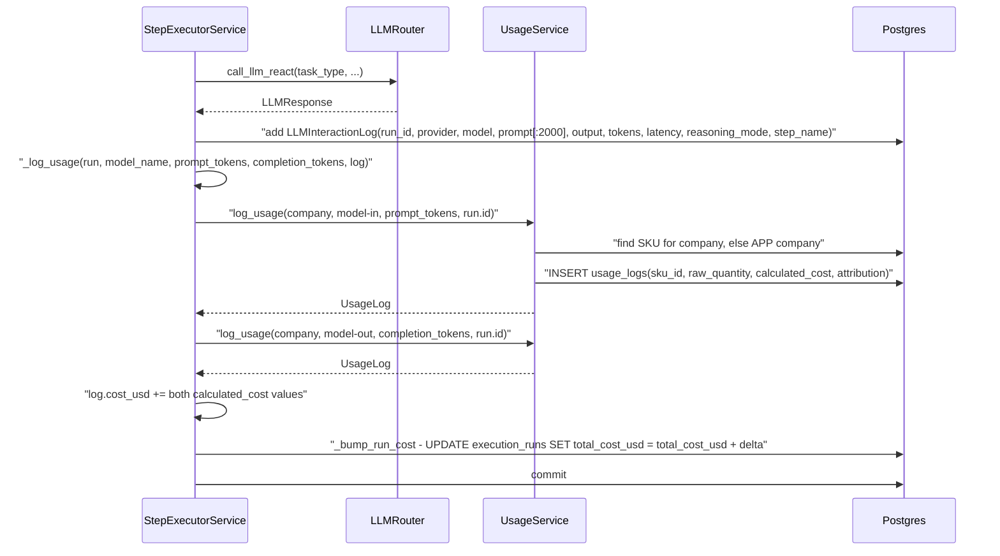

| Writer | Writes `LLMInteractionLog`? | Writes `usage_logs`? | Attribution |
|---|---|---|---|
| [step_executor.py:1043](../../backend/src/ai/step_executor.py:1043) — THOUGHT/ACTION steps | ✅ | ✅ via `_log_usage` | default `tool` |
| [step_executor.py:597](../../backend/src/ai/step_executor.py:597) — tool-input reformat retries | ✅ | ✅ via `_log_usage` | default `tool` |
| [critic_pipeline.py:568](../../backend/src/ai/planning/critic_pipeline.py:568) | ❌ | ✅ via `log_llm_response_usage` | `critic` |
| [plan_generator.py:551](../../backend/src/ai/planning/plan_generator.py:551) | ❌ | ✅ | `planner` |
| [plan_judge.py:179](../../backend/src/ai/planning/plan_judge.py:179) | ❌ | ✅ | `plan_judge` |
| everything else (summariser, meta-tools, goal alignment, cortex providers, video gateway) | ❌ | mostly ❌ | — |

**Only the step executor writes `LLMInteractionLog`.** Planner and critic spend
appears in `usage_logs` and in `run.total_cost_usd`, but there is no
per-interaction log row for it. If you are debugging "the run cost $6 but I only
see three LLM logs", that is why.

`LLMInteractionLog` columns
([orm/execution.py:80](../../backend/src/ai/orm/execution.py:80)):

| Column | Note |
|---|---|
| `run_id` | FK to `execution_runs` |
| `model_provider`, `model_name` | copied from `LLMResponse` |
| `input_prompt` | `f"System: {system[:2000]}\nUser: {user[:2000]}"` — **truncated** |
| `output_response` | full text |
| `prompt_tokens`, `completion_tokens`, `latency_ms` | from `LLMResponse` |
| `cost_usd` | `Numeric(10,6)`, accumulated from both usage rows |
| `reasoning_mode` | `REACT` / `CHAIN_OF_THOUGHT` |
| `step_name` | ties the row to a plan step |
| `log_metadata` | free-form JSON |

The shared helper used by every non-step caller never raises:

```python
# backend/src/ai/services/attributed_usage.py
async def log_llm_response_usage(*, db, response, attribution, company_id, run_id=None) -> None:
    """Write input+output usage rows for one LLM call. Never raises."""
    ...
    if not model_name or (prompt_tokens + completion_tokens) == 0:
        return
```

Note the early return: a call that reports zero tokens is billed nothing, no
warning. See [14 — Billing & credits](14-billing-and-credits.md) for what
happens to `usage_logs` downstream.

### 12.5 Estimation versus actuals

Before a run, the planner estimates cost from a static table
([cost_estimator.py:50](../../backend/src/ai/planning/cost_estimator.py:50)):
`MODEL_PRICE_FACTOR` × `_BASE_THINKING_COST` (`$0.005`). That table hardcodes
model names and is completely independent of `internal_cost` in the registry —
so an estimate and an actual can disagree wildly if registry prices drift.

---

## 13. Embeddings

Embeddings deliberately bypass `LLMRouter`. They go straight to Vertex AI
through the same `genai_factory`, because the response shape has nothing in
common with a chat completion.

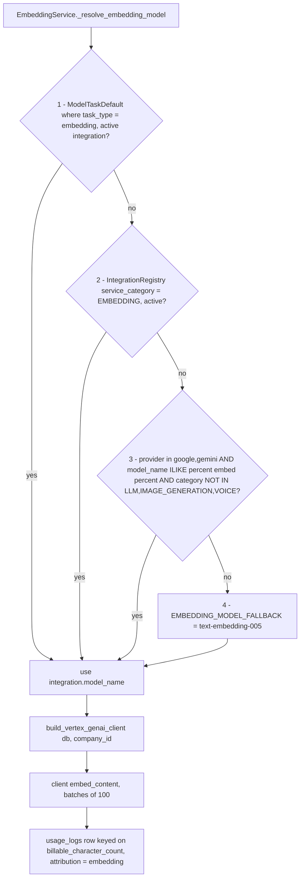

| Fact | Value |
|---|---|
| Fallback model | `EMBEDDING_MODEL_FALLBACK = "text-embedding-005"` in [constants.py:19](../../backend/src/ai/constants.py:19) |
| Alias | `EMBEDDING_MODEL` is the same constant, kept for backward compatibility |
| Batch size | `BATCH_SIZE = 100` (Vertex limit) |
| Billing unit | Vertex-reported `billable_character_count`, one `usage_logs` row per `embed_batch` |
| Attribution | `"embedding"`, with an `embedding_phase` of `ingestion` or `retrieval` |
| Client | `build_vertex_genai_client(db, company_id)` — looks up a `google` then `gemini` integration for `project_id` |

Step 1 of the resolver is the one an admin cannot reach: as covered in §6.2,
`embedding` is not in `TASK_TYPES`, so the write endpoint rejects it. In
practice everyone lands on step 2, 3 or 4.

Also note step 1 queries `ModelTaskDefault` **without** the APP-company fallback
— it filters on `_MTD.company_id == self.company_id` directly. Tenants do not
inherit a platform embedding default the way they inherit everything else.

Full detail on how embeddings are consumed lives in
[08 — Memory & CORTEX](08-memory-and-cortex.md).

---

## 14. Realtime and streaming models for voice

Real-time voice does not use `LLMRouter` or `BaseLLMAdapter` at all. It uses the
same registry and the same `speech_to_speech` task default, then branches to a
WebSocket client.

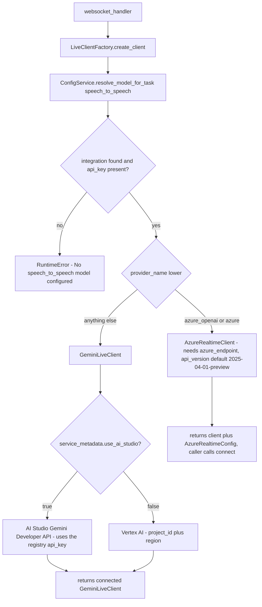

The Gemini Live client carries its own model capability table:

```python
# backend/src/voice/gemini_live.py
MODEL_CAPABILITIES = {
    "gemini-2.0-flash-exp": {"native_audio": False, "supports_thinking": False},
    "gemini-2.5-flash-preview-native-audio-01": {
        "native_audio": True,
        "supports_thinking": False,  # DO NOT set thinking_config — causes 60-90s silence
    },
    "gemini-2.5-flash-live-001": {"native_audio": True, "supports_thinking": False},
    # AI Studio-only models (not available on Vertex AI)
    "gemini-3.1-flash-live-preview": {"native_audio": True, "supports_thinking": True},
    "gemini-2.5-flash-native-audio-preview-12-2025": {"native_audio": True, "supports_thinking": True},
}
```

| Config that lives in *this* document's territory | Where |
|---|---|
| `speech_to_speech` task default | `model_task_defaults` |
| Provider selection (`google` vs `azure_openai`) | `integration_registry.provider_name` |
| `use_ai_studio` toggle for AI-Studio-only Live models | `service_metadata` |
| Azure Realtime endpoint and `api_version` | `service_metadata` |
| `LLM_LIVE` category and per-minute `internal_cost` | `integration_registry` |
| Everything about audio framing, barge-in, VAD, telephony | [12 — Voice & telephony](12-voice-and-telephony.md) |

Live usage bills per **minute**, not per token, through
[voice/usage_logger.py](../../backend/src/voice/usage_logger.py) — a completely
separate code path from `_log_usage`.

---

## 15. Prompt assembly before dispatch

By the time `LLMRouter.call_llm` is invoked, the system prompt has already been
assembled by `build_sandwich_prompt` in
[prompt_utils.py:66](../../backend/src/ai/core/prompt_utils.py:66). The router
does no prompt construction of its own — it only appends the current user turn.

```mermaid
flowchart TD
    subgraph SP ["system_prompt - build_sandwich_prompt, 10 ordered layers"]
      L1["1 Identity and Role"] --> L2["2 Goal and Objective"]
      L2 --> L3["3 Available Tools - name plus description only"]
      L3 --> L35["3.5 Platform Awareness"]
      L35 --> L37["3.7 CORTEX Ops Help - only when cortex_enabled"]
      L37 --> L4["4 Examples of Expected Behavior"]
      L4 --> L5["5 Success Criteria"]
      L5 --> L6["6 Planning Permissions"]
      L6 --> L7["7 Required Output Format - JSON schema"]
      L7 --> L8["8 Execution Constraints"]
      L8 --> L9["9 Previous Context"]
      L9 --> L10["10 Current Task - empty at this call site"]
    end

    subgraph UP ["user_prompt - built in step_executor"]
      U1["parse_variables on prompt_template"] --> U2["DATA_MISSING warning for unresolved braces"]
      U2 --> U3["Available Context from Previous Steps - internal keys stripped"]
      U3 --> U4["Current Task prefix from step.description"]
    end

    SP --> D["adapter.generate / generate_with_tools_react"]
    UP --> D
```

### 15.1 Variable substitution

`parse_variables` resolves `{{a.b.c}}` first, then bare `{a.b}`, with dotted-path
lookup into the context dict. Single-brace substitution deliberately skips
anything that looks like JSON:

```python
# backend/src/ai/core/prompt_utils.py
def replace_single(match):
    key = match.group(1).strip()
    # Skip patterns that look like JSON or contain spaces/special chars
    if not key or ' ' in key or ':' in key or ',' in key or '"' in key:
        return match.group(0)
    return _resolve(key, match.group(0))
```

Unresolved `{{...}}` placeholders survive into the prompt and trigger an
explicit anti-hallucination instruction appended by the step executor:

```
⚠️ DATA_MISSING: The following data references could not be resolved: ...
If you cannot complete this task without this data, respond with:
[DATA_MISSING] and explain what information is needed.
Do NOT fabricate or hallucinate data to fill these gaps.
```

### 15.2 Internal-key scrubbing

`INTERNAL_CONTEXT_KEYS` in [constants.py:31](../../backend/src/ai/constants.py:31)
is a 24-member frozenset of engine plumbing keys — `__memory__`,
`__cortex_viewport__`, `company_id`, `tool_call_counts`, `__completed_steps__`
and friends. The contract is documented in
[INTERNAL_KEYS.md](../../backend/src/ai/core/INTERNAL_KEYS.md): these must be
stripped before a payload is used as LLM *user input* or persisted.

Two enforcement points exist, both in the step executor:

```python
# backend/src/ai/step_executor.py
_INTERNAL_KEYS = INTERNAL_CONTEXT_KEYS
step_outputs = {
    k: v for k, v in filtered_context.items()
    if k not in _INTERNAL_KEYS and v  # skip empty/None
}
```

- [step_executor.py:821](../../backend/src/ai/step_executor.py:821) — before
  appending the "Available Context from Previous Steps" block.
- [step_executor.py:267](../../backend/src/ai/step_executor.py:267) — before
  building tool input.

> `INTERNAL_KEYS.md` states the invariant is enforced by
> `prompt_utils._scrub_internal_keys`. **That function does not exist.** The
> filtering is inline in the step executor. Any *other* code path that builds a
> user prompt from `context_state` — and there are several — has no scrubbing at
> all. Treat the doc as intent, not fact.

### 15.3 Truncation rules

| Rule | Value | Where |
|---|---|---|
| Per-context-value cap in the prompt | 30,000 chars, then `... (truncated)` | [step_executor.py:838](../../backend/src/ai/step_executor.py:838) |
| Failed / errored step values | 500 chars | same block |
| Context summarisation threshold | 20,000 chars of serialised context triggers `_maybe_summarize_context` | [step_executor.py:1155](../../backend/src/ai/step_executor.py:1155) |
| Smart-trim retention | `input` + explicit `preserve_keys` + last 3 step keys | [step_executor.py:1163](../../backend/src/ai/step_executor.py:1163) |
| Summariser input cap | `text[:4000]` | [text_utils.py:55](../../backend/src/ai/shared/text_utils.py:55) |
| `LLMInteractionLog.input_prompt` | system `[:2000]` + user `[:2000]` | [step_executor.py:1047](../../backend/src/ai/step_executor.py:1047) |
| `SLIDING_WINDOW` context policy | `max_chars` default 4,000 | [prompt_utils.py:219](../../backend/src/ai/core/prompt_utils.py:219) |
| `LAST_N` context policy | `n` default 3 | [prompt_utils.py:210](../../backend/src/ai/core/prompt_utils.py:210) |

There is **no token-aware truncation** anywhere. Everything is character counts,
and nothing checks the target model's context window. A 30,000-character context
value plus a large tool catalogue can overflow a small model with no warning
other than the provider's own error.

The memory block itself (`__memory__` and the CORTEX viewport) is assembled
elsewhere — see [08 — Memory & CORTEX](08-memory-and-cortex.md).

---

## 16. Admin UI walkthrough

Two pages, both app-admin territory.

| Page | File | Talks to |
|---|---|---|
| **Service Integrations** — credentials and prices | [IntegrationsPage.tsx](../../frontend/src/pages/IntegrationsPage.tsx) + [CreateIntegrationModal.tsx](../../frontend/src/components/CreateIntegrationModal.tsx) | `/config/integrations`, `/config/models` |
| **AI Routing & Task Defaults** — which model does what | [AIModelConfigPage.tsx](../../frontend/src/pages/ai-config/AIModelConfigPage.tsx) | `/config/task-defaults` |

The frontend base URL is `.../api/v1`
([api.client.ts:3](../../frontend/src/services/api.client.ts:3)) and the router
is mounted at `prefix="/api/v1"` in [main.py:77](../../backend/src/main.py:77),
so the real paths are `/api/v1/config/...`.

> The credentials guide writes `POST /api/config/integrations` throughout.
> That path does not exist — add the `/v1`.

### 16.1 Adding a provider credential

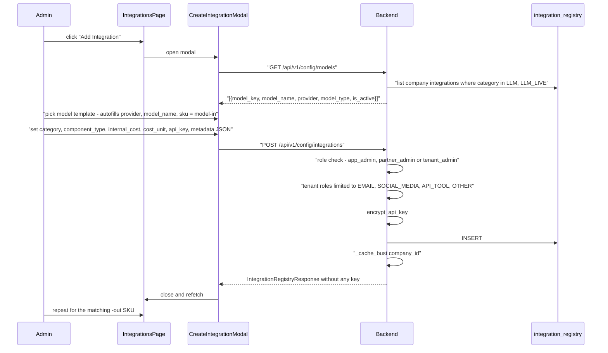

The model-template shortcut builds the SKU for you:

```tsx
// frontend/src/components/CreateIntegrationModal.tsx
service_sku: `${model.model_key}-${formData.component_type === 'input_token' ? 'in' : 'out'}`
```

Note the chicken-and-egg: `GET /config/models` only lists models that are
*already* in the registry. The first integration for a provider must be entered
by hand.

Editing keeps an existing key when the field is left blank:

```tsx
if (editingIntegration && !formData.api_key) {
    delete (payload as any).api_key;
}
```

### 16.2 Setting model routing

```mermaid
sequenceDiagram
    participant Admin
    participant P as AIModelConfigPage
    participant API as Backend

    P->>API: "GET /api/v1/config/task-defaults"
    Note right of API: "_require_app_admin - 403 for anyone else"
    API-->>P: "own defaults merged with inherited APP defaults"
    P->>API: "GET /api/v1/config/integrations"
    API-->>P: "integration list for the dropdowns"
    Admin->>P: "pick an integration for Thinking"
    P->>P: "mark pendingChanges - shows Unsaved Changes"
    Admin->>P: click Save
    P->>API: "POST /api/v1/config/task-defaults {task_type, integration_id, routing_mode}"
    API->>API: "validate task_type against TASK_TYPES - else 422"
    API->>API: "set_task_default - upsert on company_id plus task_type"
    API-->>P: "ModelTaskDefaultResponse with the joined integration"
    Admin->>P: "click the trash icon to clear"
    P->>API: "DELETE /api/v1/config/task-defaults/{task_type}"
```

### 16.3 Endpoint reference

| Method | Path | Auth | Notes |
|---|---|---|---|
| `GET` | `/api/v1/config/models` | any authenticated user | de-duplicated `LLM` + `LLM_LIVE` models for this company |
| `GET` | `/api/v1/config/integrations` | any authenticated user | `app_admin` sees **all companies**; everyone else sees their own |
| `POST` | `/api/v1/config/integrations` | `app_admin`, `partner_admin`, `tenant_admin` | tenants restricted to `EMAIL`, `SOCIAL_MEDIA`, `API_TOOL`, `OTHER` |
| `GET` | `/api/v1/config/integrations/{id}` | owner or `app_admin` | |
| `PATCH` | `/api/v1/config/integrations/{id}` | owner or `app_admin` | omit `api_key` to keep the existing one |
| `DELETE` | `/api/v1/config/integrations/{id}` | owner or `app_admin` | 204 |
| `GET` | `/api/v1/config/task-defaults` | **`app_admin` only** | own + inherited APP defaults |
| `POST` | `/api/v1/config/task-defaults` | **`app_admin` only** | 422 if `task_type` not in `TASK_TYPES` |
| `DELETE` | `/api/v1/config/task-defaults/{task_type}` | **`app_admin` only** | 404 if not configured |
| `GET` | `/api/v1/config/task-types` | any authenticated user | the list plus human descriptions |

Two RBAC quirks worth knowing:

- **`GET /config/task-defaults` is app-admin-only**, so a tenant admin opening
  the AI Config page gets a 403 and an error banner even though the read is
  harmless.
- **`GET /config/integrations` as `app_admin` returns every company's rows**
  with no filter or pagination. Only the ciphertext is withheld.

Full API surface in [17 — API reference](17-api-reference.md).

---

## 17. Operational runbook

### 17.1 Diagnosing "No model configured"

The exact message is raised in
[router.py:138](../../backend/src/ai/llm/router.py:138):

```
RuntimeError: No model configured for task type 'text_generation'
(company_id=<uuid>). Please configure a default in the AI Model Configuration page.
```

```mermaid
flowchart TD
    A["No model configured for task type X"] --> B{"Is X in TASK_TYPES?"}
    B -->|"no - vision, goal_validation, embedding"| B1["Expected. The API cannot create this default. Insert a model_task_defaults row directly, or accept the caller's fallback."]
    B -->|yes| C["SELECT * FROM model_task_defaults WHERE company_id = :co AND task_type = :X"]
    C --> D{"row?"}
    D -->|no| E["SELECT id FROM companies WHERE type = 'APP'"]
    E --> F{"exactly one APP company?"}
    F -->|none| F1["Create the APP company. Every fallback depends on it."]
    F -->|"more than one"| F2["LIMIT 1 picks arbitrarily. Deduplicate."]
    F -->|one| G["SELECT * FROM model_task_defaults WHERE company_id = :app AND task_type = :X"]
    G --> H{"row?"}
    H -->|no| H1["Set the default in AI Routing and Task Defaults as app_admin."]
    H -->|yes| I
    D -->|yes| I["SELECT * FROM integration_registry WHERE id = :integration_id"]
    I --> J{"exists and status = active?"}
    J -->|no| J1["Row deleted or deactivated. Re-point the default."]
    J -->|yes| K{"encrypted_api_key IS NOT NULL?"}
    K -->|no| K1["No API key found for integration. Even Vertex needs a placeholder - PATCH with api_key = vertex-ai-service-account"]
    K -->|yes| L["Config is fine - the failure is downstream. Check ADC, project_id, azure_endpoint."]
```

Other messages and what they mean:

| Error | Raised by | Fix |
|---|---|---|
| `No API key found for integration '<provider>/<model>'` | [router.py:145](../../backend/src/ai/llm/router.py:145) | `encrypted_api_key` is NULL. PATCH with any non-empty `api_key` |
| `service_metadata.project_id is required for Vertex AI` | [genai_factory.py:64](../../backend/src/common/genai_factory.py:64) | add `project_id` to `service_metadata` |
| `service_metadata.azure_endpoint is required for azure_openai provider` | [azure_adapter.py:57](../../backend/src/ai/llm/azure_adapter.py:57) | add `azure_endpoint` |
| `anthropic package not installed` | [anthropic_adapter.py:32](../../backend/src/ai/llm/anthropic_adapter.py:32) | see §10 — the SDK is not a dependency |
| `google-genai package not installed` | [genai_factory.py:55](../../backend/src/common/genai_factory.py:55) | broken environment |
| `Gemini SDK validation error for model ...` | [gemini_adapter.py:192](../../backend/src/ai/llm/gemini_adapter.py:192) | the model returned a `finish_reason` newer than SDK 0.4.0 |
| `No registry entry for SKU 'X-in'` (warning, not an error) | [step_executor.py:1137](../../backend/src/ai/step_executor.py:1137) | the `-in`/`-out` SKU pair is missing. Cost silently untracked |
| `Unknown provider 'X', defaulting to GeminiAdapter` (warning) | [router.py:91](../../backend/src/ai/llm/router.py:91) | typo in `provider_name` |

### 17.2 Rotating an API key

```mermaid
sequenceDiagram
    participant Admin
    participant API as "PATCH /api/v1/config/integrations/{id}"
    participant SVC as ConfigService
    participant CACHE as "_API_KEY_CACHE this process"
    participant OTHER as "other worker processes"

    Admin->>API: "{ api_key: NEW_KEY }"
    API->>SVC: update_registry_entry
    SVC->>SVC: "encrypt_api_key NEW_KEY"
    SVC->>SVC: "UPDATE encrypted_api_key"
    SVC->>CACHE: "_cache_bust company_id"
    Note over OTHER: "still serving the OLD key for up to 60s TTL"
    Note over OTHER: "long-lived LLMRouter instances hold an adapter with the old key until the run ends"
```

Procedure:

1. Create the new key at the provider. **Keep the old one live.**
2. `PATCH /api/v1/config/integrations/{id}` with only `{"api_key": "..."}`.
   Other fields are untouched (`exclude_unset=True`).
3. Wait **at least 60 seconds** — the TTL cache in other worker processes is not
   busted remotely — plus the duration of the longest in-flight run, because
   `LLMRouter._adapter_cache` holds the old key for the life of the router.
4. Verify: trigger a small entity chat and check the run succeeds.
5. Revoke the old key at the provider.

For **Vertex AI providers there is no key to rotate** — rotate the GCP service
account key on disk and restart the process. The registry value is a placeholder.

If you must rotate `ENCRYPTION_MASTER_KEY` itself: there is no migration path.
Every `encrypted_api_key` becomes undecryptable. You must re-enter every secret
across `integration_registry`, `email_connections` and `social_connections`.

### 17.3 Adding a brand-new provider

Files to touch, in order:

| # | File | Change |
|---|---|---|
| 1 | `backend/pyproject.toml` | add the provider SDK dependency, then reinstall |
| 2 | `backend/src/ai/llm/<name>_adapter.py` | **new** — subclass `BaseLLMAdapter`; implement `_build_client`, `_build_messages`, `get_tool_declarations`, `generate`, `generate_with_tools_react`, and a `_provider_name` property |
| 3 | [`backend/src/ai/llm/router.py:72`](../../backend/src/ai/llm/router.py:72) | add a branch to `_get_adapter` with all the aliases you want to accept |
| 4 | [`backend/src/ai/llm/router.py:60`](../../backend/src/ai/llm/router.py:60) | add any resource-path prefix to `_sanitize_model_name._PREFIXES` |
| 5 | [`backend/src/config/models.py:44`](../../backend/src/config/models.py:44) | document the `service_metadata` contract in the column comment |
| 6 | [`backend/src/ai/planning/cost_estimator.py:50`](../../backend/src/ai/planning/cost_estimator.py:50) | add `MODEL_PRICE_FACTOR` entries so pre-run estimates are sane |
| 7 | [`backend/src/ai/planning/critic_pipeline.py:150`](../../backend/src/ai/planning/critic_pipeline.py:150) | optionally add `_CRITIC_LADDER` entries |
| 8 | [`backend/src/voice/live_client_factory.py:80`](../../backend/src/voice/live_client_factory.py:80) | only if the provider has a realtime/voice API |
| 9 | [`frontend/src/components/CreateIntegrationModal.tsx:29`](../../frontend/src/components/CreateIntegrationModal.tsx:29) | add a `SERVICE_CATEGORIES` entry if you need a new category |
| 10 | `docs/how-to/AI_MODEL_CREDENTIALS_GUIDE.md` | add a setup section |
| 11 | Registry rows | insert `{model}-in` and `{model}-out` with `cost_unit: "1M Tokens"` |
| 12 | Task defaults | point at least one task type at the new integration |

You do **not** need a migration — there is no Alembic directory in this repo;
tables come from SQLAlchemy metadata.

Checklist for the adapter itself, learned from the three that exist:

- Return `LLMResponse` with `model_name = self.model_name` (billing SKUs derive
  from it) and `provider = self._provider_name`.
- Populate `prompt_tokens` and `completion_tokens` or nothing is billed.
- Carry a per-call id on tool calls (like Azure's `_id`) so ReAct results pair
  correctly.
- Sum tokens and latency across turns in the ReAct loop.
- Accept and ignore `**kwargs` — callers pass extras.

---

## 18. Key files reference

| File | Lines | What it does |
|---|---|---|
| [backend/src/ai/llm/router.py](../../backend/src/ai/llm/router.py) | 252 | `LLMRouter`, `_get_adapter` provider factory, `_sanitize_model_name`, trace spans |
| [backend/src/ai/llm/base.py](../../backend/src/ai/llm/base.py) | 61 | `BaseLLMAdapter` abstract contract |
| [backend/src/ai/llm/types.py](../../backend/src/ai/llm/types.py) | 79 | `LLMResponse` dataclass, google-genai FinishReason monkey-patch |
| [backend/src/ai/llm/gemini_adapter.py](../../backend/src/ai/llm/gemini_adapter.py) | 333 | Gemini via Vertex AI, recursive JSON-Schema → `types.Schema`, function_response ReAct |
| [backend/src/ai/llm/azure_adapter.py](../../backend/src/ai/llm/azure_adapter.py) | 328 | Azure OpenAI, three endpoint shapes, reasoning-model parameter mapping, tool_calls ReAct |
| [backend/src/ai/llm/anthropic_adapter.py](../../backend/src/ai/llm/anthropic_adapter.py) | 218 | Claude via Vertex AI — complete but the SDK is not installed |
| [backend/src/config/models.py](../../backend/src/config/models.py) | 83 | `IntegrationRegistry`, `ModelTaskDefault`, `TASK_TYPES` |
| [backend/src/config/service.py](../../backend/src/config/service.py) | 466 | CRUD, encryption boundary, TTL cache, the six-step waterfall, APP fallback, `resolve_model_for_task` |
| [backend/src/config/router.py](../../backend/src/config/router.py) | 281 | `/config/*` endpoints and their RBAC |
| [backend/src/config/schemas.py](../../backend/src/config/schemas.py) | 99 | Pydantic shapes; response models deliberately omit the key |
| [backend/src/common/security.py](../../backend/src/common/security.py) | 67 | `encrypt_api_key` / `decrypt_api_key`, AES-256-GCM |
| [backend/src/common/genai_factory.py](../../backend/src/common/genai_factory.py) | 177 | Vertex AI and AI Studio `genai.Client` builders |
| [backend/src/ai/usage_service.py](../../backend/src/ai/usage_service.py) | 133 | SKU lookup with APP fallback, divisor selection, `usage_logs` write |
| [backend/src/ai/services/attributed_usage.py](../../backend/src/ai/services/attributed_usage.py) | 59 | never-raises helper for planner/critic usage rows |
| [backend/src/ai/orm/execution.py](../../backend/src/ai/orm/execution.py) | — | `LLMInteractionLog` at line 80 |
| [backend/src/ai/core/prompt_utils.py](../../backend/src/ai/core/prompt_utils.py) | 238 | `parse_variables`, `build_sandwich_prompt`, `filter_context_for_step` |
| [backend/src/ai/constants.py](../../backend/src/ai/constants.py) | — | `EMBEDDING_MODEL_FALLBACK`, `INTERNAL_CONTEXT_KEYS`, `MAX_REACT_TURNS = 12` |
| [backend/src/ai/memory/embedding_service.py](../../backend/src/ai/memory/embedding_service.py) | — | four-step embedding model resolution |
| [backend/src/voice/live_client_factory.py](../../backend/src/voice/live_client_factory.py) | — | `speech_to_speech` provider branch |
| [frontend/src/pages/ai-config/AIModelConfigPage.tsx](../../frontend/src/pages/ai-config/AIModelConfigPage.tsx) | 298 | task-default editor |
| [frontend/src/pages/IntegrationsPage.tsx](../../frontend/src/pages/IntegrationsPage.tsx) | 339 | integration list |
| [frontend/src/components/CreateIntegrationModal.tsx](../../frontend/src/components/CreateIntegrationModal.tsx) | 333 | create/edit form |
| [docs/how-to/AI_MODEL_CREDENTIALS_GUIDE.md](../../docs/how-to/AI_MODEL_CREDENTIALS_GUIDE.md) | 1334 | operator setup guide — accurate on GCP/Azure setup, wrong on `cost_unit` and API paths |

---

## 19. Gotchas and things that surprise newcomers

1. **`cost_unit: "per_1k_tokens"` over-bills by 1000×.** The divisor matcher
   looks for `"1k token"` with a space. Every example in the credentials guide
   uses the underscore form. Use `1M Tokens`.
2. **`routing_mode` does nothing.** No code reads it. There is no fallback
   router; the UI button is disabled for a reason.
3. **There is no retry, no timeout, no provider fallback in the LLM layer.** A
   429 from Azure propagates straight up.
4. **Anthropic is unreachable.** The adapter is complete, the factory wires it,
   the docs explain how to configure it — and the `anthropic` package is not a
   dependency. First call raises `RuntimeError`.
5. **`embedding`, `vision` and `goal_validation` are used as task types but are
   not in `TASK_TYPES`.** The write endpoint 422s. The AI Config page renders an
   `Embedding` card that can never be saved.
6. **Nothing is seeded.** `model_task_defaults` starts empty. A fresh install
   cannot run a single agent until an app admin configures `text_generation`.
7. **`GET /config/task-defaults` is `app_admin` only,** so tenant admins see a
   403 error banner on the AI Config page.
8. **`GET /config/integrations` as `app_admin` returns every company's rows**
   with no pagination.
9. **Vertex AI ignores the stored API key but still requires one to be
   non-null.** Store `vertex-ai-service-account` as a placeholder.
10. **An entity `model_override` changes the model id but not the provider.**
    Overriding a Gemini default with `gpt-4o` sends `gpt-4o` to Vertex AI.
11. **The `-in`/`-out` SKUs are string-concatenated from whatever model name the
    adapter reports.** An override with no matching SKUs bills zero and only
    logs a warning.
12. **Only the step executor writes `LLMInteractionLog`.** Planner and critic
    spend appears in `usage_logs` and `run.total_cost_usd` with no interaction
    row.
13. **Gemini thinking tokens are not counted.** `thoughts_token_count` is
    ignored, so reasoning models under-report and under-bill.
14. **`top_p` is silently dropped in every ReAct path.** Only the single-turn
    `generate()` honours it.
15. **Gemini's tool-schema translation is lossy.** `oneOf`, `pattern`,
    `default`, `format` and numeric bounds are discarded; integer `enum` values
    become strings.
16. **Tool results are paired to calls by tool *name* on Gemini and Anthropic.**
    Two parallel calls to the same tool mis-pair. Only Azure uses a real id.
17. **A ReAct loop that exhausts `MAX_REACT_TURNS = 12` returns normally** with
    possibly-empty output and no flag.
18. **The FinishReason monkey-patch runs at import of `src.ai.llm.types`** and
    mutates the installed SDK. Remember it exists before upgrading
    `google-genai`.
19. **`_get_app_company_id` does `LIMIT 1` with no ordering.** Two APP companies
    means non-deterministic fallback.
20. **`get_integration_by_provider` uses `ILIKE '%name%'`** — a substring match
    that can pick up unrelated providers.
21. **The TTL cache is per process and only busted locally.** After a key
    rotation, other workers serve the old key for up to 60 seconds.
22. **`LLMResponse.cost_usd` is hardcoded `0.0`.** Never bill from it.
23. **`service_category` is free text** and the values in the model's own column
    comment (`IMAGE_GEN`, `VIDEO_GEN`) are not the values the code queries for.
24. **`prompt_utils._scrub_internal_keys` does not exist** despite what
    `INTERNAL_KEYS.md` says. Scrubbing is inline in the step executor only.
25. **`src/ai/core/reasoning/` registers REACT and CHAIN_OF_THOUGHT strategies
    that nothing ever retrieves.** `get_reasoning` has no callers; the step
    executor branches on the mode string directly. It is dead code, and the
    adapters pass a `config=` kwarg the router silently swallows.
26. **The credentials guide's API paths lack `/v1`.** The real prefix is
    `/api/v1/config/...`.
27. **Multimodal input does not work.** Adapters only build text parts. The
    video gateway base64-encodes a JPEG into the *user prompt string* and asks
    for `task_type="vision"`, which is not a valid task type anyway.

---

## 20. Where to go next

- [05 — Agent kernel](05-agent-kernel.md) — who calls `LLMRouter` and when.
- [06 — Execution pipeline](06-execution-pipeline.md) — the step executor that
  builds prompts and writes `LLMInteractionLog`.
- [07 — Planning & critics](07-planning-and-critics.md) — the critic ladder and
  `resolve_critic_model`.
- [08 — Memory & CORTEX](08-memory-and-cortex.md) — the memory block that lands
  in the prompt, and the embedding pipeline this document only summarises.
- [09 — Tools](09-tools.md) — where tool JSON schemas come from before the
  adapters translate them.
- [12 — Voice & telephony](12-voice-and-telephony.md) — Gemini Live and GPT-4o
  Realtime end to end.
- [14 — Billing & credits](14-billing-and-credits.md) — what happens to
  `usage_logs` after this layer writes them.
- [17 — API reference](17-api-reference.md) — the full `/config/*` surface.
- [docs/how-to/AI_MODEL_CREDENTIALS_GUIDE.md](../../docs/how-to/AI_MODEL_CREDENTIALS_GUIDE.md)
  — operator-facing GCP and Azure setup. Accurate on cloud setup; correct the
  `cost_unit` and `/api/v1` issues noted above as you follow it.
