# 11. Meta-Intelligence & the Meta-Agent Board

> **What this document covers:** the layer that reasons about the platform itself — the seven-role Meta-Agent Board that turns a user request into a tested, promoted entity; the platform schema compiler that gives agents self-knowledge; anti-sprawl and consolidation; the skill library; and the tool-synthesis pipeline.
> **Who should read it:** anyone working on agent-generated entities, self-improvement, or the admin surfaces that expose them.
> **Prerequisites:** [06 — Execution pipeline](06-execution-pipeline.md) for what a `HierarchicalEntity` is, and [08 — Memory and CORTEX](08-memory-and-cortex.md) for the tree substrate this layer reuses.

---

## Table of contents

1. [The 60-second version](#1-the-60-second-version)
2. [The Meta-Agent is just an agent](#2-the-meta-agent-is-just-an-agent)
3. [The Architecture Board — seven roles](#3-the-architecture-board--seven-roles)
4. [Role 1 — RequirementChat](#4-role-1--requirementchat)
5. [Role 2 — Curator](#5-role-2--curator)
6. [Role 3 — Architect](#6-role-3--architect)
7. [Role 4 — BoardCritic](#7-role-4--boardcritic)
8. [Role 5 — Validator](#8-role-5--validator)
9. [Role 6 — TestDriver](#9-role-6--testdriver)
10. [Role 7 — Promoter](#10-role-7--promoter)
11. [RegistrySearch — the reuse decision engine](#11-registrysearch--the-reuse-decision-engine)
12. [Anti-sprawl and consolidation](#12-anti-sprawl-and-consolidation)
13. [The MetaIntelligenceTree](#13-the-metaintelligencetree)
14. [The platform schema compiler](#14-the-platform-schema-compiler)
15. [The skill library](#15-the-skill-library)
16. [Tool synthesis — agents writing tools](#16-tool-synthesis--agents-writing-tools)
17. [Prompt evolution — the agent editing itself](#17-prompt-evolution--the-agent-editing-itself)
18. [Scheduled jobs](#18-scheduled-jobs)
19. [Safety summary](#19-safety-summary)
20. [Key files reference](#20-key-files-reference)
21. [Gotchas](#21-gotchas)

---

## 1. The 60-second version

Ordinary agents do work. The **meta layer** builds and governs the agents
themselves.

A user says *"I need something that reads our support tickets and drafts
replies."* Rather than a human opening the entity builder, the **Meta-Agent**
takes that sentence through a seven-role **Architecture Board**: clarify it,
search for something that already does the job, draft it, critique it, validate
it, test it, and only then promote it to `ACTIVE`.

```mermaid
flowchart LR
    USER["User request<br/>free text"] --> R1["1 RequirementChat<br/>to typed Spec"]
    R1 --> R2["2 Curator<br/>REUSE / ADAPT / COMPOSE / CREATE"]
    R2 --> R3["3 Architect<br/>draft entity payload"]
    R3 --> R4["4 BoardCritic<br/>max 2 revise rounds"]
    R4 --> R5["5 Validator<br/>8 deterministic checks"]
    R5 --> R6["6 TestDriver<br/>5-case budgeted suite"]
    R6 --> R7["7 Promoter<br/>6 gates"]
    R7 --> OUT{"Outcome"}
    OUT -->|all gates pass| ACTIVE["Entity to ACTIVE"]
    OUT -->|hitl_required| HITL["PENDING_HITL"]
    OUT -->|any gate fails| REJ["REJECT + failed_gates"]

    style R2 fill:#3a3a5a,stroke:#77a
    style R7 fill:#2d4a2d,stroke:#5a9
```

Four ideas hold the layer together:

1. **Reuse before creation.** The Curator's whole job is to avoid building a
   ninth near-identical "draft an email" agent.
2. **Nothing self-promotes.** Every path that changes the platform ends at either
   a gate or a human.
3. **The platform describes itself.** `PlatformSchemaCompiler` compiles the
   live capability surface into JSON that gets injected into agent prompts, so
   an agent knows what step types, tools and limits exist.
4. **Cross-run learning is company-scoped.** A `MetaIntelligenceTree` per company
   accumulates anti-patterns, curator decisions and test failures.

---

## 2. The Meta-Agent is just an agent

The most important structural fact, from
[meta/README.md](../../backend/src/ai/meta/README.md):

> The Meta-Agent is just another agent that runs through the same `AgentLoop`.
> It happens to have a multi-role internal **Board** that turns user requests
> into validated, tested, promoted HierarchicalEntities.

There is no separate meta-runtime. The Meta-Agent is a seeded
`HierarchicalEntity` ([meta_agent_template.py](../../backend/src/ai/meta/meta_agent_template.py),
410 lines; seeded by [seed_meta_agent.py](../../backend/src/ai/meta/seed_meta_agent.py))
that executes through the normal loop described in
[05 — Agent kernel](05-agent-kernel.md).

The Board roles are **not** seven separate LLM agents. From
[board/__init__.py](../../backend/src/ai/meta/board/__init__.py:1):

```python
# backend/src/ai/meta/board/__init__.py
"""
Each role is a small service class with one public coroutine. They are
called sequentially from the Meta-Agent's static plan (no separate
LLM agent per role; the deterministic ones — Validator, Promoter,
Curator-glue — run as pure code, while the Architect+Critic loops
share the existing LLM router).
"""
```

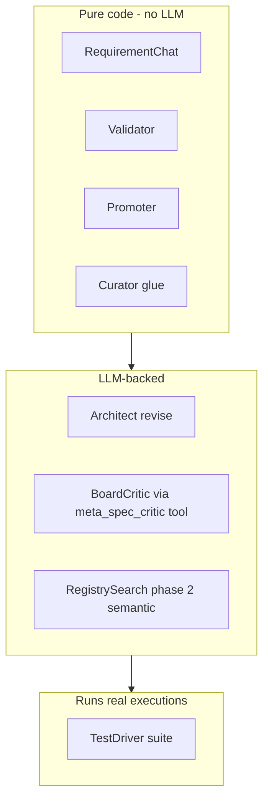

This split matters for cost and for testing: five of the seven roles cost
nothing in tokens and are unit-testable as pure functions.

---

## 3. The Architecture Board — seven roles

| # | Role | Class | File | Lines | LLM? | Output type |
|---|---|---|---|---|---|---|
| 1 | RequirementChat | `RequirementChat` | [requirement_chat.py](../../backend/src/ai/meta/board/requirement_chat.py) | 62 | No | `Spec` |
| 2 | Curator | `Curator` | [curator.py](../../backend/src/ai/meta/board/curator.py) | 145 | Indirect | `CuratorDecision` |
| 3 | Architect | `Architect` | [architect.py](../../backend/src/ai/meta/board/architect.py) | 60 | Overridable | `ArchitectDraft` |
| 4 | Critic | `BoardCritic` | [critic.py](../../backend/src/ai/meta/board/critic.py) | 118 | Yes | `CriticReport` |
| 5 | Validator | `ValidatorRole` | [validator.py](../../backend/src/ai/meta/board/validator.py) | 197 | No | `ValidatorReport` |
| 6 | TestDriver | `TestDriver` | [test_driver.py](../../backend/src/ai/meta/board/test_driver.py) | 219 | Executes | `SuiteResult` |
| 7 | Promoter | `Promoter` | [promoter.py](../../backend/src/ai/meta/board/promoter.py) | 170 | No | `PromotionDecision` |

Supporting: [golden_outcomes.py](../../backend/src/ai/meta/board/golden_outcomes.py) (81),
[tool_smith.py](../../backend/src/ai/meta/board/tool_smith.py) (125).

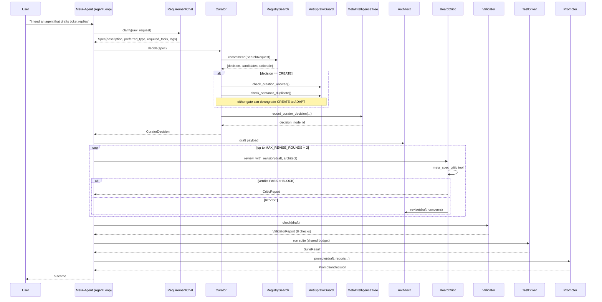

---

## 4. Role 1 — RequirementChat

The simplest role. It **does not call an LLM** — the Meta-Agent's own REACT loop
already did the clarifying conversation. This class just normalises whatever
came out into a stable contract.

```python
# backend/src/ai/meta/board/requirement_chat.py
@dataclass
class Spec:
    """Canonical request envelope passed between Board roles."""
    description: str
    preferred_type: Optional[str] = None      # ACTION / SKILL / AGENT / PROCESS
    required_tools: list[str] = field(default_factory=list)
    tags: list[str] = field(default_factory=list)
    extra: dict[str, Any] = field(default_factory=dict)
```

`clarify()` accepts a `str`, a `dict`, or anything else and always returns a
`Spec`. It reads `description` **or** `intent`, and `preferred_type` **or**
`type`, so both naming conventions work. Any unrecognised keys are swept into
`extra` rather than dropped.

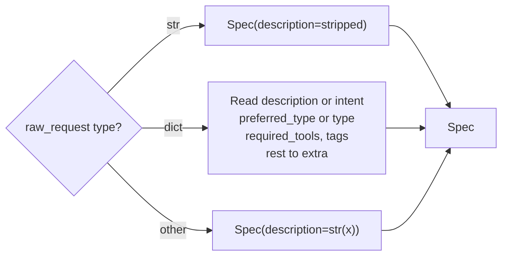

---

## 5. Role 2 — Curator

The Curator answers one question: **should we build this at all?**

```python
# backend/src/ai/meta/board/curator.py
@dataclass
class CuratorDecision:
    decision: str                                  # REUSE / ADAPT / COMPOSE / CREATE
    rationale: str = ""
    candidates: list[dict[str, Any]] = field(default_factory=list)
    top_candidate_id: Optional[str] = None
    decision_node_id: Optional[str] = None         # MetaIntelligenceTree audit row
```

It glues three services together:

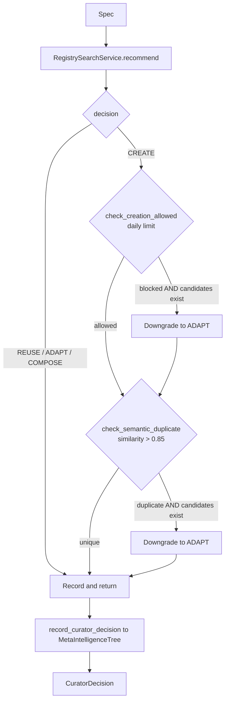

Three behaviours worth knowing:

**1. RegistrySearch failure defaults to CREATE.**

```python
# backend/src/ai/meta/board/curator.py
except Exception as exc:
    logger.warning("RegistrySearch failed; defaulting to CREATE: %s", exc)
    rec = {"decision": "CREATE", "candidates": [], "rationale": str(exc)}
```

If search is broken, the system builds rather than blocks. Fail-open on
availability, and the anti-sprawl gates still run afterwards.

**2. Anti-sprawl gates only apply to `CREATE`.** They are skipped entirely for
REUSE / ADAPT / COMPOSE — those decisions are already reuse.

**3. A downgrade needs a candidate.** Both gates only downgrade to `ADAPT`
`if candidates`. If the daily limit is hit and there is nothing to adapt, the
decision stays `CREATE` and the actual block happens later, in
`MetaEntityCreatorTool`. The Curator's downgrade is an optimisation, not the
enforcement point.

> ⚠️ Both anti-sprawl calls are wrapped in bare `except Exception: pass`. A
> failing gate silently allows the original decision through. The hard
> enforcement lives in the tool ([§12](#12-anti-sprawl-and-consolidation)).

The audit write to `MetaIntelligenceTree` records the decision with
`outcome=None`; the Promoter later annotates it with what actually happened.
That closed loop is what makes curator decisions learnable.

---

## 6. Role 3 — Architect

In the current code the Architect is deliberately thin:

```python
# backend/src/ai/meta/board/architect.py
"""
In Track 5 the Architect is **not** a new LLM agent — the existing
Meta-Agent runtime entity already produces draft specs. This module
just defines the typed envelope and a tiny *revise* helper the
Critic loop drives.
"""
```

`revise()` does not rewrite the draft. It **records the Critic's concerns** into
`metadata_extensions.architect_revisions` so a later layer — a human or an
LLM-backed subclass — can act on them:

```python
# backend/src/ai/meta/board/architect.py
new_payload = dict(draft.payload)
meta = dict(new_payload.get("metadata_extensions") or {})
revs = list(meta.get("architect_revisions") or [])
revs.extend(concerns)
meta["architect_revisions"] = revs
new_payload["metadata_extensions"] = meta
```

> ⚠️ **This is a real limitation, not a subtlety.** The base `Architect.revise`
> is an annotation step, not a rewrite. In the two-round Critic loop, round 2
> re-critiques a draft whose *content is unchanged* — only its metadata grew.
> Unless a subclass overrides `revise` with a genuine LLM rewrite, a `REVISE`
> verdict will usually recur and the loop will end in `BLOCK` with
> `"max revise rounds reached"`. The docstring calls this out: *"A subclass may
> plug in a real LLM revision."*

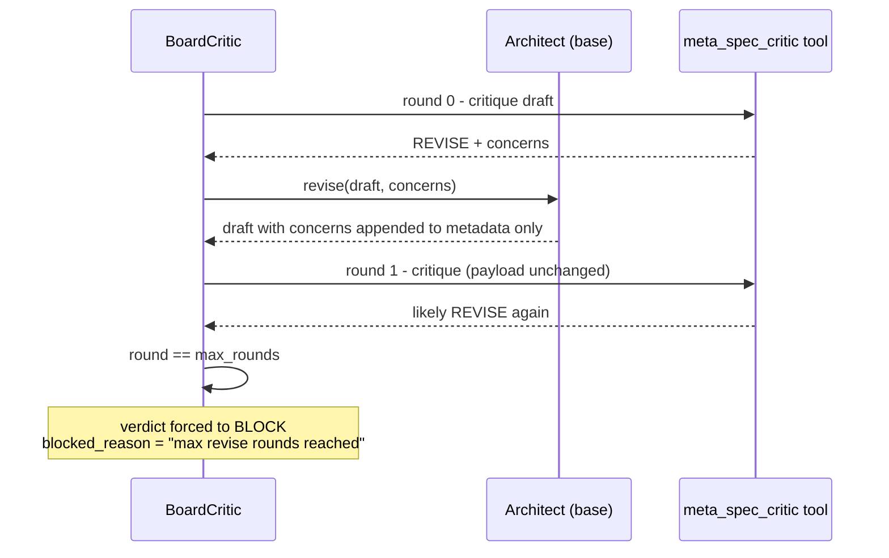

---

## 7. Role 4 — BoardCritic

Drives the `meta_spec_critic` tool with a bounded revise loop.

```python
# backend/src/ai/meta/board/critic.py
MAX_REVISE_ROUNDS: int = 2

@dataclass
class CriticReport:
    verdict: str = "REVISE"                     # PASS / REVISE / BLOCK
    concerns: list[dict[str, Any]] = field(default_factory=list)
    rules_referenced: list[str] = field(default_factory=list)
    rounds: int = 0
    blocked_reason: str = ""
```

| Verdict | Meaning | Loop behaviour |
|---|---|---|
| `PASS` | Spec is acceptable | Return immediately |
| `REVISE` | Fixable concerns | Call `architect.revise`, re-critique |
| `BLOCK` | Fundamental problem | Return immediately; Promoter G1 fails |

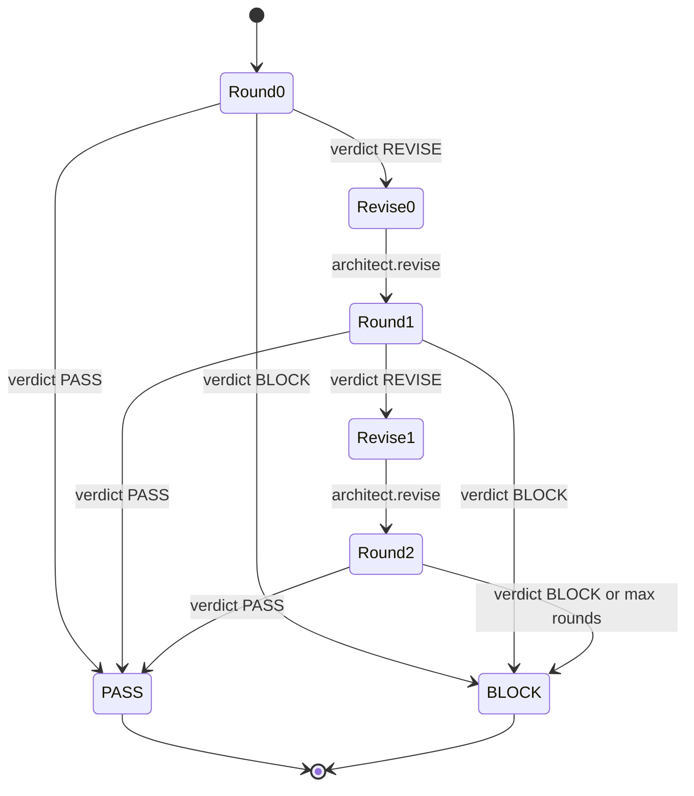

The loop runs `range(self.max_rounds + 1)` — so with the default it critiques up
to **three** times (rounds 0, 1, 2) with **two** revisions between them.

**Two defensive behaviours.** Unparseable tool output degrades to `REVISE`
rather than crashing:

```python
# backend/src/ai/meta/board/critic.py
try:
    parsed = json.loads(raw)
except Exception:
    logger.warning("BoardCritic could not parse tool output; defaulting to REVISE")
    return CriticReport(verdict="REVISE")
```

And a tool error becomes a non-blocking `med`-severity concern, so a transient
critic failure cannot permanently block promotion.

`CriticReport` also exposes `has_blocking_concern` (any concern with
`blocks_promotion`) and `passed`. `rules_referenced` links back to the
`MetaIntelligenceTree` anti-patterns the critic consulted — see
[§13](#13-the-metaintelligencetree).

---

## 8. Role 5 — Validator

Eight deterministic checks, no LLM, cheap. It exists to catch structural
defects **before the TestDriver burns budget**.

```python
# backend/src/ai/meta/board/validator.py
@dataclass
class ValidatorReport:
    checks: list[CheckResult] = field(default_factory=list)

    @property
    def passed(self) -> bool:
        return all(c.passed for c in self.checks)
```

| # | Check | What it asserts | Failure reason |
|---|---|---|---|
| 1 | `json_shape_ok` | `name`, `type`, `goal` all present | `missing fields: …` |
| 2 | `entity_type_valid` | `type` ∈ {ACTION, SKILL, AGENT, PROCESS} | `unknown entity type: X` |
| 3 | `no_cycle_in_children` | No child references the parent's own id | `child references parent id` |
| 4 | `all_tools_listed_in_capabilities` | Every `TOOL_CALL` step's `tool_id` appears in `capabilities.tools` | `tools used but not declared: …` |
| 5 | `plan_step_ids_unique` | No duplicate `step_id` | `duplicate step_ids: …` |
| 6 | `governance_caps_set` | `max_cost_usd > 0` **and** `timeout_ms > 0` | `governance.max_cost_usd / timeout_ms must be > 0` |
| 7 | `cost_estimate_under_cap` | Heuristic estimate ≤ `max_cost_usd` | `estimate X > cap Y` |
| 8 | `review_mechanism_consistent` | If review enabled, a review prompt exists | `review enabled but no review_prompt set` |

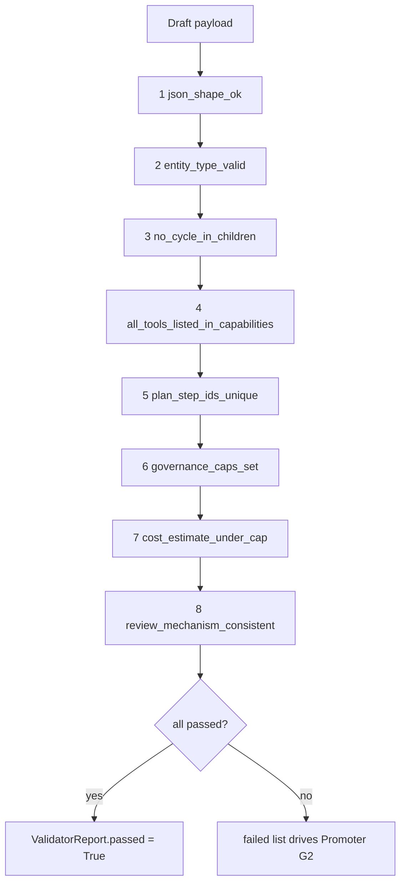

All eight checks always run — there is no short-circuit, so you get the complete
failure list in one pass.

The cost heuristic in check 7 is intentionally crude:

```python
# backend/src/ai/meta/board/validator.py
# Cheap heuristic: 0.01 USD per planning step + 0.05 base.
est = 0.05 + 0.01 * len(steps)
```

A 10-step plan estimates at $0.15. This is a sanity check against absurdly low
caps, not a real forecast. Note check 7 deliberately passes when `cap <= 0` so
it does not double-fail alongside check 6.

Check 4 handles both plan shapes — `planning.static_plan.steps` and
`planning.steps` — and reads the tool id from either `target.tool_id` or a
top-level `tool_id`.

---

## 9. Role 6 — TestDriver

The only role that spends real money. It runs a **budget-bounded suite of five
case types in a fixed order**.

```python
# backend/src/ai/meta/board/test_driver.py
"""
  1. ``smoke``       — minimum-input sanity check
  2. ``regression``  — (ADAPT only) parity-check vs the source entity
  3. ``boundary``    — empty / oversize / unicode-edge inputs
  4. ``hostile``     — adversarial / malformed inputs
  5. ``comparative`` — only when a strong reuse candidate exists
"""
DEFAULT_SUITE_BUDGET_USD: Decimal = Decimal("3.00")
```

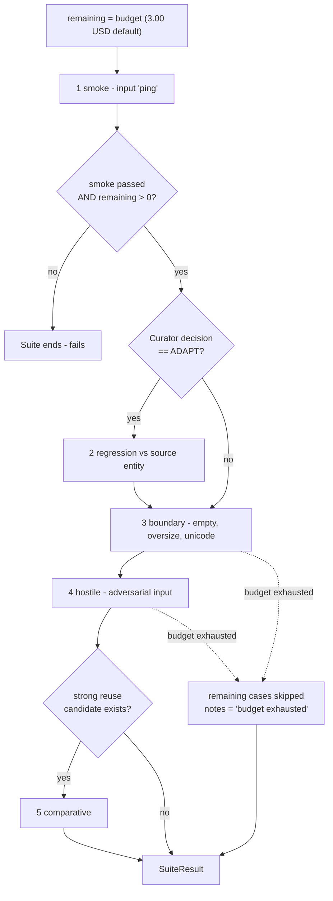

### 9.1 Pass semantics

```python
# backend/src/ai/meta/board/test_driver.py
@property
def passed(self) -> bool:
    # Suite passes when no non-skipped case failed AND smoke ran + passed.
    if not self.cases:
        return False
    smoke = next((c for c in self.cases if c.name == "smoke"), None)
    if not smoke or not smoke.passed:
        return False
    return all(c.passed for c in self.cases if not c.skipped)
```

| Situation | `passed` |
|---|---|
| No cases ran | `False` |
| Smoke missing or failed | `False` |
| Smoke passed, later cases skipped for budget | **`True`** |
| Smoke passed, a non-skipped case failed | `False` |

**Skipped is not failed.** A suite that exhausts its budget after smoke can
still report `passed=True` — which is why the Promoter has a *separate* gate
(G4) for budget exhaustion. Without G4, budget starvation would be a silent
route to promotion.

### 9.2 Budget

The shared budget comes from `meta_agent.testdriver_budget_usd` in
`FeatureFlags.NUMERIC_DEFAULTS` (default `Decimal("3.00")`) — see
[15 — Governance and feature flags](15-governance-and-hitl.md). Each case
deducts its `cost_usd` from the remaining pool.

The per-case runner is **injectable** (`TestRunner` type alias), so the suite
logic is unit-testable without live LLM calls; production wires in
`meta_entity_executor`.

`SuiteResult.to_dict()` truncates each case's `output` to 240 characters for
the audit record.

---

## 10. Role 7 — Promoter

Six gates. All must pass.

```python
# backend/src/ai/meta/board/promoter.py
"""
  G1 — Critic verdict is PASS (no unresolved BLOCK)
  G2 — Validator report passed all deterministic checks
  G3 — TestDriver suite passed (smoke + every non-skipped case)
  G4 — TestDriver did not blow its budget
  G5 — Curator decision is recorded (any decision is allowed; missing → fail)
  G6 — Runtime cost cap is set (governance.max_cost_usd > 0)
"""
```

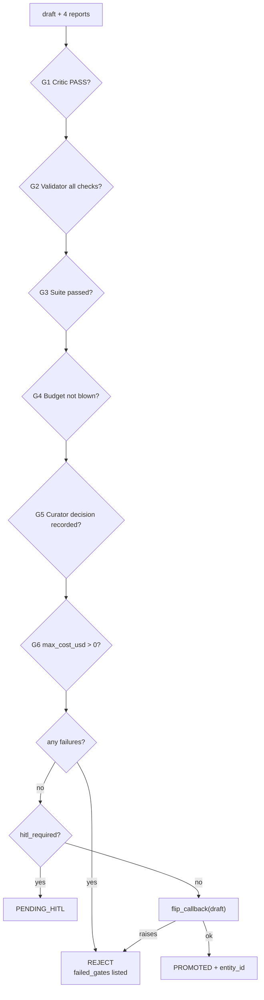

All six gates are evaluated **before** any failure check, so a rejection lists
every failed gate at once rather than the first one.

```python
# backend/src/ai/meta/board/promoter.py
gates = [
    self._g1(critic_report), self._g2(validator_report),
    self._g3(suite_result), self._g4(suite_result),
    self._g5(curator_decision), self._g6(draft),
]
failures = [g for g in gates if not g.passed]
if failures:
    return PromotionDecision(
        outcome="REJECT",
        failed_gates=[g.name for g in failures],
        reason="; ".join(g.reason for g in failures if g.reason),
    )
```

| Outcome | When |
|---|---|
| `REJECT` | Any gate failed, **or** `flip_callback` raised |
| `PENDING_HITL` | All gates passed but `hitl_required=True` |
| `PROMOTED` | All gates passed, flip succeeded; carries `entity_id` |

G5 is deliberately permissive — *any* curator decision passes; only a **missing**
decision fails. It enforces that the reuse question was asked, not which answer
was given.

`flip_callback` is injectable so tests need no live DB. It performs the
`DRAFT → ACTIVE` lifecycle flip described in
[06 — Execution pipeline](06-execution-pipeline.md).

---

## 11. RegistrySearch — the reuse decision engine

[registry_search_service.py](../../backend/src/ai/meta/registry_search_service.py)
(655 lines) is a **four-phase** scorer.

```python
# backend/src/ai/meta/registry_search_service.py
"""
Phase 1:   Structural contract matching (deterministic, fast)
Phase 1.5: IO Contract compatibility
Phase 2:   Semantic intent matching (LLM-powered)
Phase 2.5: Execution trace analysis
"""
```

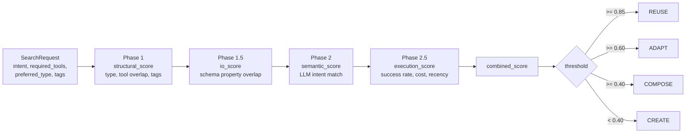

### 11.1 Weights and thresholds

```python
# backend/src/ai/meta/registry_search_service.py
REUSE_THRESHOLD = 0.85
ADAPT_THRESHOLD = 0.60
COMPOSE_THRESHOLD = 0.40

STRUCTURAL_WEIGHT = 0.25
IO_CONTRACT_WEIGHT = 0.15
SEMANTIC_WEIGHT = 0.35
EXECUTION_WEIGHT = 0.25
```

```python
c.combined_score = (
    c.structural_score * self.STRUCTURAL_WEIGHT +
    c.io_score * self.IO_CONTRACT_WEIGHT +
    ...
)
```

| Component | Weight | Signal |
|---|---|---|
| Semantic | **0.35** | LLM judgement of intent and behavioural alignment |
| Structural | 0.25 | Entity type, tool overlap, tag overlap, complexity |
| Execution | 0.25 | Historical success rate, cost efficiency, recency |
| IO contract | 0.15 | Input/output schema property overlap |

Semantic dominates, but it can never decide alone: a perfect 1.0 semantic score
contributes only 0.35, well under the 0.60 `ADAPT` threshold. An entity must
match on *behaviour and shape and track record* to be reused.

### 11.2 The result type

```python
# backend/src/ai/meta/registry_search_service.py
@dataclass
class MatchCandidate:
    entity_id: UUID
    entity_name: str
    entity_type: str
    match_type: MatchType
    structural_score: float  # 0.0 - 1.0 (Phase 1)
    io_score: float          # 0.0 - 1.0 (Phase 1.5)
    semantic_score: float    # 0.0 - 1.0 (Phase 2)
    execution_score: float   # 0.0 - 1.0 (Phase 2.5)
    combined_score: float    # Weighted combination
    tool_overlap: List[str] = field(default_factory=list)
    missing_tools: List[str] = field(default_factory=list)
    rationale: str = ""
    diff_spec: Optional[Dict[str, Any]] = None  # For ADAPT: what to change
```

`diff_spec` is what makes `ADAPT` actionable — it tells the Architect precisely
what to change rather than leaving it to infer the delta. `missing_tools` is the
usual driver of an ADAPT rather than a REUSE.

Sub-scores are preserved on the candidate, so an operator can see *why*
something scored as it did rather than only the final number.

---

## 12. Anti-sprawl and consolidation

### 12.1 The three hard gates

[anti_sprawl.py](../../backend/src/ai/meta/anti_sprawl.py):

```python
# backend/src/ai/meta/anti_sprawl.py
DEFAULT_DAILY_CREATION_LIMIT = 10
DEFAULT_ADAPTATION_THRESHOLD = 3
SEMANTIC_DUPLICATE_THRESHOLD = 0.85
```

| Gate | Method | Rule | On trip |
|---|---|---|---|
| Daily limit | `check_creation_allowed` | ≤ 10 entities created per company per 24h | Block creation |
| Adaptation chain | `check_consolidation_needed` | ≥ 3 entities sharing one `template_source_id` | Suggest using an existing version |
| Semantic duplicate | `check_semantic_duplicate` | `combined_score > 0.85` against the top candidate | Block; require VERSION mode |

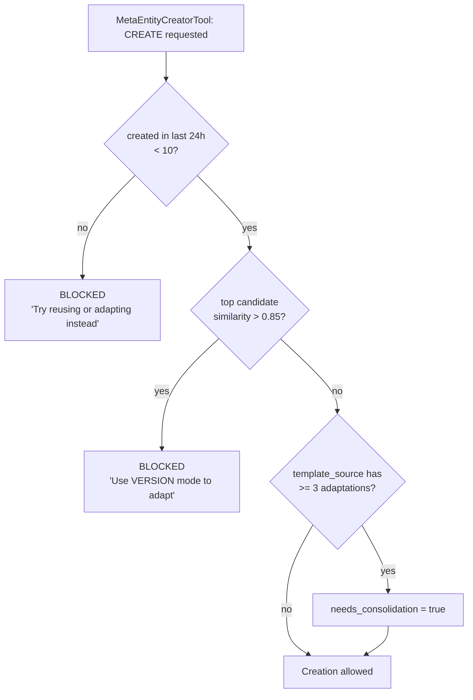

The daily-limit query counts rows where `created_at >= now() - 24h` and
`status != "DELETED"`, scoped to the company and optionally filtered to the
Meta-Agent's user id — so human-created entities can be excluded from the AI's
budget.

The docstrings are explicit about enforcement:

```python
# backend/src/ai/meta/anti_sprawl.py
"""Check if creation is allowed (daily limit not exceeded).

This is a HARD GATE — if this returns allowed=False, the
MetaEntityCreatorTool must block entity creation.
"""
```

Note **"must block"** — `AntiSprawlGuard` *reports*; the caller enforces. The
Curator uses these advisorily; `MetaEntityCreatorTool` is the enforcement point.

> ⚠️ `check_semantic_duplicate` **fails open**: `except Exception` logs a warning
> and returns `is_duplicate: False` with *"Allowing creation."* A broken registry
> search disables duplicate protection silently.

There is also a small **key mismatch** between producer and consumer. The guard
returns `existing_entity_id`:

```python
# backend/src/ai/meta/anti_sprawl.py
return {
    "is_duplicate": True,
    "existing_entity_id": str(best.entity_id),
    "existing_entity_name": best.entity_name,
    ...
}
```

but the Curator reads `similar_id`:

```python
# backend/src/ai/meta/board/curator.py
rationale = (
    f"Semantic duplicate found: {dup.get('similar_id','?')}; "
    f"adapting."
)
```

So the Curator's rationale string always renders `?` instead of the duplicate's
id. Cosmetic — the decision downgrade still works — but the audit trail loses
the pointer.

### 12.2 Consolidation — from blocking to merging

[consolidation.py](../../backend/src/ai/meta/consolidation.py) extends
anti-sprawl from *refuse* to *repair*:

```python
# backend/src/ai/meta/consolidation.py
"""Anti-sprawl was *block-only*: it refused near-duplicate creation. This turns it
into *consolidate* — when a cluster of ≥N near-duplicate entities (pairwise
similarity > threshold) already exists, the Curator proposes a **merge plan**:
pick a winner, list the losers, re-point references, archive the losers, and fork
their intelligence rules into the winner.
"""
DEFAULT_MIN_CLUSTER = 5
```

```mermaid
flowchart LR
    CLUSTER["Cluster of >= 5<br/>near-duplicate entities"] --> WIN["select_winner"]
    WIN --> PLAN["build_merge_plan"]
    PLAN --> P1["Re-point references"]
    PLAN --> P2["Archive losers"]
    PLAN --> P3["Fork intelligence rules into winner"]
    PLAN --> HUMAN{"Human approval"}
    HUMAN -->|approved| EXEC["Execute merge"]
    HUMAN -->|rejected| NOOP["Nothing changes"]

    style HUMAN fill:#4a3a2d,stroke:#a85
```

**A merge is never executed automatically.** `propose_plans` emits proposals and
an audit row only. `select_winner` and `build_merge_plan` are pure functions, so
the selection policy is unit-testable.

---

## 13. The MetaIntelligenceTree

One tree per company, holding what the platform has learned **about building
agents** — as distinct from what an agent learned about its own task
([08 — Memory and CORTEX](08-memory-and-cortex.md)).

```python
# backend/src/ai/meta/meta_intelligence_tree.py
"""
One tree per company. Reuses the existing CORTEX schema; the only
distinguishing feature is ``scope_level=TENANT`` and the absence of an
owning ``entity_id`` — the tree belongs to the Meta-Agent role across
the whole tenant.
"""
```

That is the crucial distinction: **no `entity_id`, `scope_level=TENANT`**. It is
the same `cortex_trees` / `cortex_nodes` tables, just unowned by any single
entity.

### 13.1 The seven sections

```python
# backend/src/ai/meta/meta_intelligence_tree.py
SECTIONS: dict[str, str] = {
    "anti_patterns":   "📏 Architecture Anti-Patterns",
    "spec_patterns":   "🎯 Spec Patterns",
    "test_failures":   "🚨 Test Failure Tags",
    "curator_dec":     "🧠 Curator Decisions",
    "tool_reliab":     "🔧 Tool Reliability",
    "prompt_cand":     "📝 Prompt-Update Candidates",
    "composition":     "🔗 Composition Graph",
}
MAX_ROWS_PER_SECTION: int = 200
```

> The README documents six sections; the code has **seven** — `composition`
> (`🔗 Composition Graph`) was added later. Trust the code.

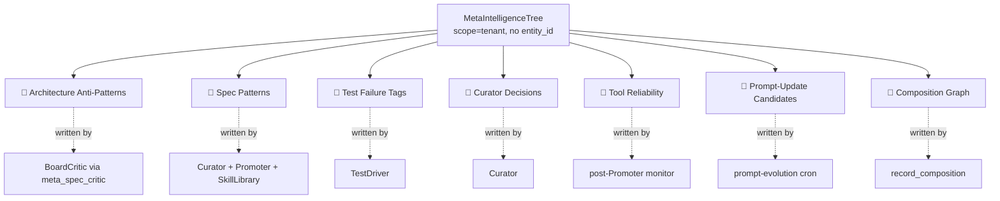

### 13.2 Row typing without new enum values

```python
# backend/src/ai/meta/meta_intelligence_tree.py
"""
Nodes inside each section are typed by ``metadata_extra["kind"]``
(e.g. ``"anti_pattern"``, ``"skill_candidate"``,
``"prompt_update_candidate"``). This avoids requiring a new
``CortexNodeType`` enum value per row variety while still letting
queries filter cleanly.
"""
```

A neat trick: rather than growing the `CortexNodeType` enum (which lives in the
shared `cortex_memory` package) every time the meta layer needs a new row type,
variety is expressed in JSONB metadata. Adding a row kind requires no migration.

### 13.3 API surface

| Method | Section | Purpose |
|---|---|---|
| `add_anti_pattern`, `query_anti_patterns` | anti_patterns | Critic writes; critic prompt reads top-k |
| `record_curator_decision` | curator_dec | Audit row, later annotated with outcome |
| `add_test_failure` | test_failures | TestDriver failure tags |
| `add_tool_reliability_sample` | tool_reliab | Post-promotion monitoring |
| `record_composition`, `query_compositions` | composition | Which entities compose with which |
| `add_skill_candidate`, `list_skill_candidates`, `get_skill_candidate`, `mark_skill_candidate_promoted` | spec_patterns | Skill library HITL flow |
| `add_prompt_update_candidate`, `list_prompt_candidates`, `approve_prompt_candidate` | prompt_cand | Prompt evolution HITL flow |

### 13.4 Pruning

Each section is capped at **200 rows**, pruned LRU on `last_seen`:

```python
# backend/src/ai/meta/meta_intelligence_tree.py
# Cap on how many anti-pattern nodes we keep per section. The Critic
# prompt only reads top_k anyway; older rows are pruned via LRU on
# ``last_seen``.
MAX_ROWS_PER_SECTION: int = 200
```

`_maybe_prune_section` enforces this. The tree is created with
`max_children=200` to match. Sections missing on an older tree are created
lazily by `section_node`, so adding a new `SECTIONS` entry is backward
compatible with existing trees.

`AntiPatternRow` carries `evidence_count`, so a repeated anti-pattern increments
rather than duplicating — which is also what keeps it fresh under LRU.

---

## 14. The platform schema compiler

[platform_schema_compiler.py](../../backend/src/ai/meta/platform_schema_compiler.py)
(898 lines) compiles the platform's own capability surface into JSON. The
docstring calls it the Meta-Agent's **"firmware"**.

```python
# backend/src/ai/meta/platform_schema_compiler.py
"""
Two modes of operation:
  1. compile()       — Build-time / deploy-time full compilation
  2. refresh()       — Runtime incremental refresh (tenant-scoped tools, models)

The compiled schema is injected into the Meta-Agent's system prompt context
via the platform_introspect meta-tool.
"""
```

### 14.1 What it compiles

```python
# backend/src/ai/meta/platform_schema_compiler.py
schema: Dict[str, Any] = {
    "compiled_at": datetime.now(timezone.utc).isoformat(),
    "entity_types": self._compile_entity_types(),
    "step_types": self._compile_step_types(),
    "reasoning_modes": self._compile_reasoning_modes(),
    "execution_modes": self._compile_execution_modes(),
    "tools": self._compile_tools(include_tenant=include_tenant_tools),
    "model_endpoints": await self._compile_model_endpoints(),
    "constraints": self._compile_constraints(),
    "composition_rules": self._compile_composition_rules(),
    "memory_modes": self._compile_memory_modes(),
    "hitl_triggers": self._compile_hitl_triggers(),
    "io_contract_spec": self._compile_io_contract_spec(),
    "behavioral_annotations": self._compile_behavioral_annotations(),
}
```

```mermaid
flowchart LR
    subgraph Sources
        ET["Entity type definitions"]
        ST["Step types"]
        RM["Reasoning modes"]
        TL["Tool registry - tenant scoped"]
        ME["Model endpoints - Integration Registry"]
        CN["Constraints and governance"]
        CR["Composition rules"]
        MM["Memory modes"]
        HT["HITL triggers"]
        IO["IO contract spec"]
        BA["Behavioral annotations"]
    end
    Sources --> COMP["PlatformSchemaCompiler.compile"]
    COMP --> HASH["sha256 first 16 chars<br/>= schema_version"]
    HASH --> CACHE["_cached_schema"]
    CACHE --> TOOL["platform_introspect meta-tool"]
    TOOL --> PROMPT["Layer 3.5 Platform Awareness<br/>in the sandwich prompt"]
```

### 14.2 Drift detection

```python
# backend/src/ai/meta/platform_schema_compiler.py
schema_str = json.dumps(schema, sort_keys=True, default=str)
schema["schema_version"] = hashlib.sha256(schema_str.encode()).hexdigest()[:16]
```

A stable 16-hex-char fingerprint of the whole capability surface. `sort_keys=True`
makes it deterministic. If a tool is added, a model is configured, or a
constraint changes, the version changes — which is how the platform detects that
an agent's cached self-knowledge is stale.

### 14.3 The compact summary

`compile_summary()` produces a **~2–4K token** digest for prompt injection:

```python
# backend/src/ai/meta/platform_schema_compiler.py
"""Compile a compact platform summary (~2-4K tokens) for prompt injection.

This is the Tier 1 meta-cognition payload. It gives any agent enough
knowledge to make intelligent dynamic planning and tool selection
decisions without the full schema overhead.

Sections:
  1. Available tools (name + 1-line description + category)
  2. Step type definitions (when to use each)
  3. Entity type hierarchy (composition rules)
  4. Execution modes and reasoning strategies
  5. Key behavioral rules (top 8 most critical)
"""
```

This is what lands in **Layer 3.5 (`## Platform Awareness`)** of the sandwich
prompt — see [08 §12](08-memory-and-cortex.md#12-the-prompt-sandwich). Every
agent, not just the Meta-Agent, can be given this payload.

### 14.4 Meta-cognition defaults

`resolve_meta_cognition` in the same file hosts the Track 5 opt-in flip for
`registry_search` and `self_modification` capabilities.
[meta_cognition_migration.py](../../backend/src/ai/meta/meta_cognition_migration.py)
(92 lines) is the pre-deploy backfill that preserves explicit settings for
AGENT/PROCESS entities which relied on the old auto-on default — so the
default change does not silently strip capabilities from existing entities.

---

## 15. The skill library

Detects **repeated successful tool chains** and proposes turning them into a
reusable SKILL entity.

```python
# backend/src/ai/meta/skill_library.py
MIN_REPEATS: int = 5
LOOKBACK_RUNS: int = 50
MIN_CHAIN_LEN: int = 2
MAX_CHAIN_LEN: int = 6
```

```mermaid
flowchart LR
    RUNS["Last 50 ExecutionRuns<br/>for an entity"] --> EX["_extract_chains<br/>consecutive successful tool calls"]
    EX --> FILT["Keep chains of length 2-6"]
    FILT --> CNT["Counter over chains"]
    CNT --> TH{"frequency >= 5?"}
    TH -->|no| DROP["Discard"]
    TH -->|yes| CAND["ChainCandidate"]
    CAND --> WRITE["skill_candidate node<br/>in 🎯 Spec Patterns"]
    WRITE --> HITL{"Human approves<br/>via admin API"}
    HITL -->|yes| SKILL["New SKILL entity"]
    HITL -->|no| PARK["Stays a candidate"]

    style HITL fill:#4a3a2d,stroke:#a85
```

The docstring is unambiguous about autonomy:

```python
# backend/src/ai/meta/skill_library.py
"""Candidates are written into the company's
:class:`MetaIntelligenceTree` under the ``🎯 Spec Patterns`` section
as ``skill_candidate`` nodes. They never auto-promote — a human must
explicitly approve them via the admin API.
"""
```

`ChainCandidate` records `chain` (a tuple of tool ids), `frequency`, and
`sample_run_ids` so a reviewer can inspect the evidence before approving.

The scan runs weekly via the `skill_promotion_scan` cron ([§18](#18-scheduled-jobs)).

---

## 16. Tool synthesis — agents writing tools

The most powerful and most dangerous capability in the layer: an LLM writes new
tool source code.
[tool_synthesis_pipeline.py](../../backend/src/ai/meta/tool_synthesis_pipeline.py):

```python
# backend/src/ai/meta/tool_synthesis_pipeline.py
"""
    ToolSpec ─▶ ToolSmith (LLM writes source)
             ─▶ ToolValidator (AST static gate)
             ─▶ ToolSandboxTester (replay examples in the container, `02`)
             ─▶ ToolRedTeam (adversarial LLM review)
             ─▶ register DRAFT (ToolRegistryEntry, status=DRAFT, trust=low)
"""
```

```mermaid
flowchart TD
    SPEC["ToolSpec"] --> TS["ToolSmith<br/>LLM writes Python source"]
    TS --> TV["ToolValidator<br/>AST static analysis gate"]
    TV -->|fail| STOP1["Short-circuit + audit"]
    TV -->|pass| SB["ToolSandboxTester<br/>replay examples in container"]
    SB -->|fail| STOP2["Short-circuit + audit"]
    SB -->|pass| RT["ToolRedTeam<br/>adversarial LLM review"]
    RT -->|fail| STOP3["Short-circuit + audit"]
    RT -->|pass| REG["Register ToolRegistryEntry<br/>status=DRAFT, trust=low"]

    STOP1 --> REP["SynthesisReport - full audit trail"]
    STOP2 --> REP
    STOP3 --> REP
    REG --> REP

    style REG fill:#4a3a2d,stroke:#a85
```

| Stage | File | Lines | Gate type |
|---|---|---|---|
| ToolSmith | [board/tool_smith.py](../../backend/src/ai/meta/board/tool_smith.py) | 125 | LLM generation |
| ToolValidator | [tool_validator.py](../../backend/src/ai/meta/tool_validator.py) | 236 | Static AST analysis |
| ToolSandboxTester | [tool_sandbox_tester.py](../../backend/src/ai/meta/tool_sandbox_tester.py) | 215 | Container execution |
| ToolRedTeam | [tool_red_team.py](../../backend/src/ai/meta/tool_red_team.py) | 127 | Adversarial LLM review |

Four safeguards:

1. **Every stage can short-circuit.** A failure stops the pipeline.
2. **`SynthesisReport` records every verdict** — a complete audit trail.
3. **Registration is gated**: it happens only when *all* gates pass.
4. **A synthesised tool lands as `status=DRAFT`, `trust=low`** — never
   immediately usable. Promotion is a separate decision.

Sandbox execution uses the container isolation described in
[09 — Tools](09-tools.md); collaborators are injected so the pipeline is
unit-testable without live LLM or Docker.

---

## 17. Prompt evolution — the agent editing itself

[prompt_evolution.py](../../backend/src/ai/meta/prompt_evolution.py) (123 lines)
is a *critic-of-critic*: an LLM reviews what the **Meta-Agent's own board
process** did wrong and proposes a bounded prompt diff.

```python
# backend/src/ai/meta/prompt_evolution.py
"""Safety: this is the "agent edits itself" capability, so it is deliberately
non-autonomous — the output is only ever a *candidate* requiring HITL approval
(``MetaIntelligenceTree.approve_prompt_candidate``). The LLM is injected so the
generator is unit-testable without live credentials.
"""
```

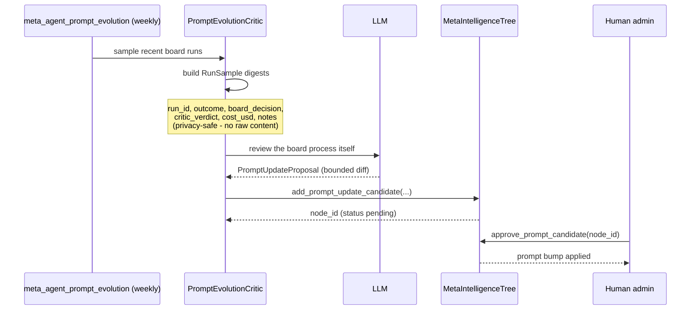

`RunSample` is deliberately a **compact, privacy-safe digest** — run id, outcome,
board decision, critic verdict, cost and notes. No customer content reaches the
self-review LLM.

Note the scope: the critic reviews *the board process*, **not the agents it
built**. Those are critiqued by the ordinary pipeline in
[07 — Planning and critics](07-planning-and-critics.md).

---

## 18. Scheduled jobs

Registered in [worker.py](../../backend/src/ai/worker.py); implementations in
`core/arq_jobs.py`.

| Cron | Schedule | Purpose |
|---|---|---|
| `skill_promotion_scan` | `weekday=6, hour=4, minute=30` — Sundays 04:30 | Scan for repeated tool chains, write skill candidates |
| `meta_agent_prompt_evolution` | `weekday=0, hour=5, minute=0` — Mondays 05:00 | Sample board runs, propose a prompt candidate |

```mermaid
gantt
    title Meta-layer weekly cadence (UTC)
    dateFormat HH:mm
    axisFormat %H:%M
    section Sunday
    skill_promotion_scan :done, 04:30, 30m
    section Monday
    meta_agent_prompt_evolution :done, 05:00, 30m
```

Both produce **candidates only**. Neither changes the platform without human
approval. For the neighbouring crons (`critic_calibration_job`,
`dreaming_cron_trigger`, `cortex_resume_scheduled`) see
[07 — Planning and critics](07-planning-and-critics.md) and
[08 — Memory and CORTEX](08-memory-and-cortex.md).

---

## 19. Safety summary

Everything in this layer that could change the platform ends at a gate or a
human. Worth internalising as a table:

| Capability | Autonomous? | Guard |
|---|---|---|
| Create an entity | Gated | Daily limit 10/company/24h; semantic duplicate > 0.85 blocks |
| Promote an entity to ACTIVE | Gated | 6 Promoter gates; optional `hitl_required` |
| Merge duplicate entities | **No** | `propose_plans` emits proposals; human approves |
| Promote a skill candidate | **No** | Human approves via admin API |
| Synthesise a new tool | Gated | 4 stages, then `DRAFT` + `trust=low` |
| Edit the Meta-Agent's own prompt | **No** | Candidate + `approve_prompt_candidate` |
| Spend on tests | Gated | Shared `$3.00` budget; Promoter G4 rejects on exhaustion |

```mermaid
flowchart LR
    subgraph Auto["Fully automatic"]
        A1["Score reuse candidates"]
        A2["Record audit rows"]
        A3["Detect chains and patterns"]
    end
    subgraph Gated["Automatic behind gates"]
        G1["Create entity"]
        G2["Promote to ACTIVE"]
        G3["Register DRAFT tool"]
    end
    subgraph Human["Requires a human"]
        H1["Merge entities"]
        H2["Promote skill candidate"]
        H3["Approve prompt change"]
        H4["Promote DRAFT tool"]
    end
    Auto --> Gated --> Human
```

### 19.1 Where the safety model is thin

Stated plainly, since a new developer should know:

- **Several gates fail open.** `check_semantic_duplicate` returns
  `is_duplicate: False` on any exception. The Curator wraps both anti-sprawl
  calls in `except Exception: pass`. If the registry search breaks, duplicate
  protection quietly disappears.
- **`AntiSprawlGuard` only advises.** Enforcement depends on
  `MetaEntityCreatorTool` honouring the result. Any other creation path bypasses
  it entirely.
- **The daily limit is per company, not per user or per minute.** Ten entities
  can be created in ten seconds.
- **The base Architect cannot actually revise** ([§6](#6-role-3--architect)), so
  the two-round critic loop rarely converges to `PASS` on its own.

---

## 20. Key files reference

| File | Lines | What it does |
|---|---|---|
| [platform_schema_compiler.py](../../backend/src/ai/meta/platform_schema_compiler.py) | 898 | Compiles the platform capability surface into JSON "firmware"; hash-based drift detection; `compile_summary` for prompt injection |
| [meta_intelligence_tree.py](../../backend/src/ai/meta/meta_intelligence_tree.py) | 697 | Per-company tenant-scoped tree, 7 sections, LRU-pruned at 200 rows |
| [registry_search_service.py](../../backend/src/ai/meta/registry_search_service.py) | 655 | Four-phase REUSE/ADAPT/COMPOSE/CREATE scorer |
| [meta_agent_template.py](../../backend/src/ai/meta/meta_agent_template.py) | 410 | The Meta-Agent runtime entity template |
| [tool_validator.py](../../backend/src/ai/meta/tool_validator.py) | 236 | AST static gate for synthesised tools |
| [board/test_driver.py](../../backend/src/ai/meta/board/test_driver.py) | 219 | Budget-bounded 5-case suite |
| [tool_sandbox_tester.py](../../backend/src/ai/meta/tool_sandbox_tester.py) | 215 | Container replay of tool examples |
| [seed_meta_agent.py](../../backend/src/ai/meta/seed_meta_agent.py) | 198 | One-shot seeder |
| [board/validator.py](../../backend/src/ai/meta/board/validator.py) | 197 | 8 deterministic spec checks |
| [skill_library.py](../../backend/src/ai/meta/skill_library.py) | 188 | Repeated tool-chain detection |
| [tool_synthesis_pipeline.py](../../backend/src/ai/meta/tool_synthesis_pipeline.py) | 183 | 4-stage tool synthesis orchestrator |
| [consolidation.py](../../backend/src/ai/meta/consolidation.py) | 181 | Merge-plan proposals for duplicate clusters |
| [board/promoter.py](../../backend/src/ai/meta/board/promoter.py) | 170 | 6 promotion gates |
| [anti_sprawl.py](../../backend/src/ai/meta/anti_sprawl.py) | 162 | Daily limit, adaptation chain, semantic duplicate |
| [board/curator.py](../../backend/src/ai/meta/board/curator.py) | 145 | REUSE/ADAPT/COMPOSE/CREATE glue + audit |
| [reseed_meta_agent.py](../../backend/src/ai/meta/reseed_meta_agent.py) | 130 | Re-seed helper |
| [tool_red_team.py](../../backend/src/ai/meta/tool_red_team.py) | 127 | Adversarial review of synthesised tools |
| [board/tool_smith.py](../../backend/src/ai/meta/board/tool_smith.py) | 125 | LLM tool-source generation |
| [prompt_evolution.py](../../backend/src/ai/meta/prompt_evolution.py) | 123 | Self-prompt-edit candidate generator |
| [board/critic.py](../../backend/src/ai/meta/board/critic.py) | 118 | `meta_spec_critic` loop, max 2 revise rounds |
| [spec_tiebreak.py](../../backend/src/ai/meta/spec_tiebreak.py) | 107 | Tie-breaking between equally-scored specs |
| [meta_cognition_migration.py](../../backend/src/ai/meta/meta_cognition_migration.py) | 92 | Pre-deploy backfill for the defaults flip |
| [board/golden_outcomes.py](../../backend/src/ai/meta/board/golden_outcomes.py) | 81 | Golden-outcome fixtures |
| [board/requirement_chat.py](../../backend/src/ai/meta/board/requirement_chat.py) | 62 | Raw request → `Spec` |
| [board/architect.py](../../backend/src/ai/meta/board/architect.py) | 60 | Draft envelope + revise stub |

Related: [tools/meta/entity_creator.py](../../backend/src/ai/tools/meta/entity_creator.py)
(the enforcement point for anti-sprawl),
[api/admin.py](../../backend/src/ai/api/admin.py) (admin endpoints),
[MetaIntelligencePage.tsx](../../frontend/src/pages/admin/MetaIntelligencePage.tsx),
[TemplateMarketplace.tsx](../../frontend/src/pages/ai/TemplateMarketplace.tsx).

---

## 21. Gotchas

1. **The Meta-Agent is not special infrastructure.** It is a seeded
   `HierarchicalEntity` running the ordinary `AgentLoop`.

2. **Five of seven Board roles never call an LLM.** Only the Critic and
   (potentially) the Architect do; the TestDriver spends by executing.

3. **The base `Architect.revise` does not rewrite anything.** It appends
   concerns to metadata. Expect `BLOCK` with *"max revise rounds reached"*
   unless a subclass supplies a real LLM rewrite.

4. **`MAX_REVISE_ROUNDS = 2` means three critiques.** The loop is
   `range(max_rounds + 1)`.

5. **A skipped test case is not a failed one.** A budget-starved suite can
   report `passed=True`; Promoter gate G4 is what catches it.

6. **Promoter G5 accepts any curator decision.** Only a missing one fails.

7. **Anti-sprawl gates fail open.** Exceptions are swallowed and creation
   proceeds.

8. **`AntiSprawlGuard` does not block — callers must.** Only
   `MetaEntityCreatorTool` enforces.

9. **Curator ↔ AntiSprawl key mismatch.** The guard returns
   `existing_entity_id`; the Curator reads `similar_id`, so its rationale always
   shows `?`.

10. **The README says six MetaIntelligenceTree sections; there are seven.**
    `composition` is missing from the README table.

11. **The MetaIntelligenceTree has no `entity_id`.** Queries filtering on
    `entity_id` will never find it — filter on `scope_level=TENANT`.

12. **Sections cap at 200 rows, LRU on `last_seen`.** Old anti-patterns silently
    disappear.

13. **Synthesised tools land as `DRAFT` with `trust=low`** and are not usable
    until separately promoted.

14. **Semantic score alone cannot trigger reuse.** At weight 0.35, a perfect
    semantic match still falls short of the 0.60 ADAPT threshold.

15. **The daily creation limit is company-wide over a rolling 24 hours**, not
    per user and not rate-limited within the window.

---

## Where to go next

- [06 — Execution pipeline](06-execution-pipeline.md) — the `HierarchicalEntity`
  shape the Board produces, and the DRAFT → ACTIVE lifecycle.
- [09 — Tools](09-tools.md) — the tool registry that synthesis writes into, and
  the sandbox the tester uses.
- [08 — Memory and CORTEX](08-memory-and-cortex.md) — the tree substrate
  `MetaIntelligenceTree` reuses, and per-entity memory by contrast.
- [07 — Planning and critics](07-planning-and-critics.md) — the runtime critics,
  as distinct from the Board's spec critic.
- [15 — Governance and HITL](15-governance-and-hitl.md) — the HITL machinery all
  the approval flows here depend on, and `meta_agent.testdriver_budget_usd`.
