# 12. Voice, Telephony & Messaging

> **What this document covers:** how a real phone call reaches a HireBuddha AI agent, how audio bytes flow to and from a speech-to-speech model, and everything around it — telephony providers, phone numbers, sessions, guardrails, transcripts, metering, the auto-dialer and WhatsApp.
> **Who should read it:** any developer touching `backend/src/voice/`, the campaign dialer, or debugging "why did the agent go silent on that call".
> **Prerequisites:** [02 — System architecture](02-system-architecture.md) for the process/port layout, [05 — Agent kernel](05-agent-kernel.md) to understand what a *text* agent run looks like (voice does **not** use it — see [§15](#15-voice-agents-vs-text-agents)), and [09 — Tools](09-tools.md) for the tool registry that voice function calls execute against.

---

## Table of contents

1. [The 60-second version](#1-the-60-second-version)
2. [Where the code actually runs](#2-where-the-code-actually-runs)
3. [The real-time audio pipeline](#3-the-real-time-audio-pipeline)
4. [Barge-in, silence and end-of-turn](#4-barge-in-silence-and-end-of-turn)
5. [The live-client abstraction](#5-the-live-client-abstraction)
6. [Speech-to-speech providers](#6-speech-to-speech-providers)
7. [Telephony provider: Twilio](#7-telephony-provider-twilio)
8. [Telephony provider: Tata Tele / Smartflo](#8-telephony-provider-tata-tele--smartflo)
9. [The webhook route table](#9-the-webhook-route-table)
10. [Phone numbers and the pool](#10-phone-numbers-and-the-pool)
11. [Sessions](#11-sessions)
12. [In-call guardrails](#12-in-call-guardrails)
13. [Transcripts, recordings and summaries](#13-transcripts-recordings-and-summaries)
14. [Voice usage and billing](#14-voice-usage-and-billing)
15. [Voice agents vs text agents](#15-voice-agents-vs-text-agents)
16. [Campaigns and the auto-dialer](#16-campaigns-and-the-auto-dialer)
17. [The CRM lead queue](#17-the-crm-lead-queue)
18. [WhatsApp](#18-whatsapp)
19. [Frontend surfaces](#19-frontend-surfaces)
20. [Operational runbook](#20-operational-runbook)

---

## 1. The 60-second version

A phone call is a **bidirectional audio proxy with an LLM in the middle**.

1. A telephony provider (Twilio internationally, Tata Tele/Smartflo in India) has a phone call in progress.
2. The provider hits an **HTTP webhook** on our backend. We look up which tenant and which AI agent owns that phone number, create a `voice_sessions` row, and reply with a **WebSocket URL**.
3. The provider opens that WebSocket and starts pushing **base64-encoded 8 kHz mu-law** audio frames as JSON events.
4. [`BaseStreamHandler`](../../backend/src/voice/websocket_handler.py:63) decodes them, resamples to **16 kHz PCM16**, and streams them into a **speech-to-speech model** (Gemini Live by default). The model returns **24 kHz PCM16** audio, which we downsample back to 8 kHz mu-law and push to the provider.
5. The model can call **tools** mid-call. Transcripts, a recording, an AI summary, usage rows and a credit deduction are all written when the call ends.

There is no ASR → LLM → TTS chain. The model hears and speaks directly.

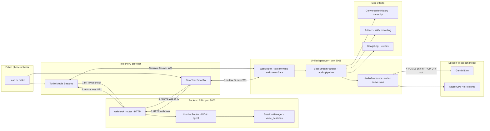
```mermaid
flowchart LR
    subgraph PSTN["Public phone network"]
        L["Lead or caller"]
    end
    subgraph Prov["Telephony provider"]
        TW["Twilio Media Streams"]
        TT["Tata Tele Smartflo"]
    end
    subgraph BE["Backend API - port 8000"]
        WH["webhook_router - HTTP"]
        NR["NumberRouter - DID to agent"]
        SM["SessionManager - voice_sessions"]
    end
    subgraph GW["Unified gateway - port 8001"]
        WS["WebSocket - stream/twilio and stream/tata"]
        BSH["BaseStreamHandler - audio pipeline"]
        AP["AudioProcessor - codec conversion"]
    end
    subgraph AI["Speech-to-speech model"]
        GL["Gemini Live"]
        AZ["Azure GPT-4o Realtime"]
    end
    subgraph Side["Side effects"]
        TR["ConversationHistory - transcript"]
        REC["Artifact - WAV recording"]
        US["UsageLog + credits"]
    end

    L --> TW
    L --> TT
    TW -->|"1 HTTP webhook"| WH
    TT -->|"1 HTTP webhook"| WH
    WH --> NR --> SM
    WH -->|"2 returns wss URL"| TW
    WH -->|"2 returns wss URL"| TT
    TW <-->|"3 mulaw 8k over WS"| WS
    TT <-->|"3 mulaw 8k over WS"| WS
    WS --> BSH --> AP
    AP <-->|"4 PCM16 16k in - PCM 24k out"| GL
    AP <--> AZ
    BSH --> TR
    BSH --> REC
    BSH --> US
```

---

## 2. Where the code actually runs

This trips up newcomers immediately. There are **two FastAPI apps** that both contain voice code, and one of them is dead.

| App | Port | Started by | Voice responsibility |
|-----|------|-----------|----------------------|
| `src.main:app` — backend API | 8000 | [`start_services.sh:92`](../../start_services.sh:92) | All voice **HTTP** routes: `webhook_router`, `phone_number_router`, `sessions_router`, `messaging_router` ([`main.py:161-178`](../../backend/src/main.py:161)) |
| `src.gateway.app:app` — unified gateway | 8001 | [`start_services.sh:108`](../../start_services.sh:108) | All voice **WebSocket** endpoints, plus a catch-all HTTP proxy to :8000 |
| `src.voice.main:app` — standalone streaming service | 8002 | **nothing** | Retired. Duplicates the gateway's WS endpoints. |

[`gateway/app.py:136`](../../backend/src/gateway/app.py:136) states this explicitly:

```python
# backend/src/gateway/app.py
# NOTE: The standalone streaming service (port 8002) has been retired.
# All audio/video streaming is served natively by this gateway via:
#   /stream/audio   — unified audio WebSocket (twilio, tata_tele, exotel, web)
#   /stream/video   — unified video WebSocket (WebRTC)
# Voice HTTP webhooks (/webhooks/voice/*) are served by the main backend (port 8000).
```

`backend/.env` sets `STREAMING_HOST=localhost:8001`, so every WebSocket URL we hand to a provider points at the gateway. The gateway's catch-all `@app.api_route("/{path:path}")` ([`app.py:336`](../../backend/src/gateway/app.py:336)) forwards `/webhooks/voice/*` HTTP requests through to the backend, so a provider only ever needs one hostname.

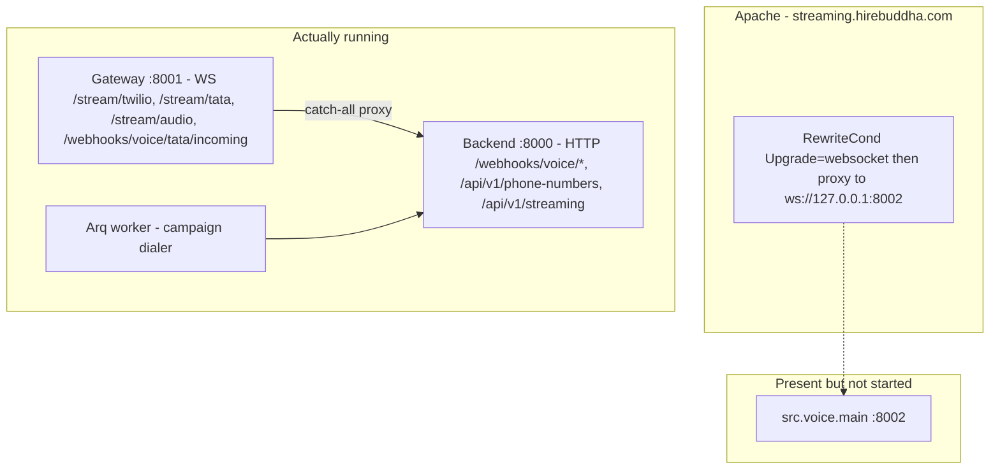
```mermaid
graph TB
    subgraph Edge["Apache - streaming.hirebuddha.com"]
        RW["RewriteCond Upgrade=websocket then proxy to ws://127.0.0.1:8002"]
    end
    subgraph Live["Actually running"]
        G["Gateway :8001 - WS /stream/twilio, /stream/tata, /stream/audio, /webhooks/voice/tata/incoming"]
        B["Backend :8000 - HTTP /webhooks/voice/*, /api/v1/phone-numbers, /api/v1/streaming"]
        W["Arq worker - campaign dialer"]
    end
    subgraph Dead["Present but not started"]
        V["src.voice.main :8002"]
    end

    RW -.-> V
    G -->|"catch-all proxy"| B
    W --> B
```

> **Gotcha:** [`deploy/apache/streaming.hirebuddha.com-le-ssl.conf`](../../deploy/apache/streaming.hirebuddha.com-le-ssl.conf) still rewrites WebSocket upgrades to `ws://127.0.0.1:8002` — the retired port. On that vhost, media streams will fail until the config points at 8001. The `/api/v1`-facing hosts are unaffected.

---

## 3. The real-time audio pipeline

Everything below lives in [`websocket_handler.py`](../../backend/src/voice/websocket_handler.py), a 1,986-line file with a three-class shape:

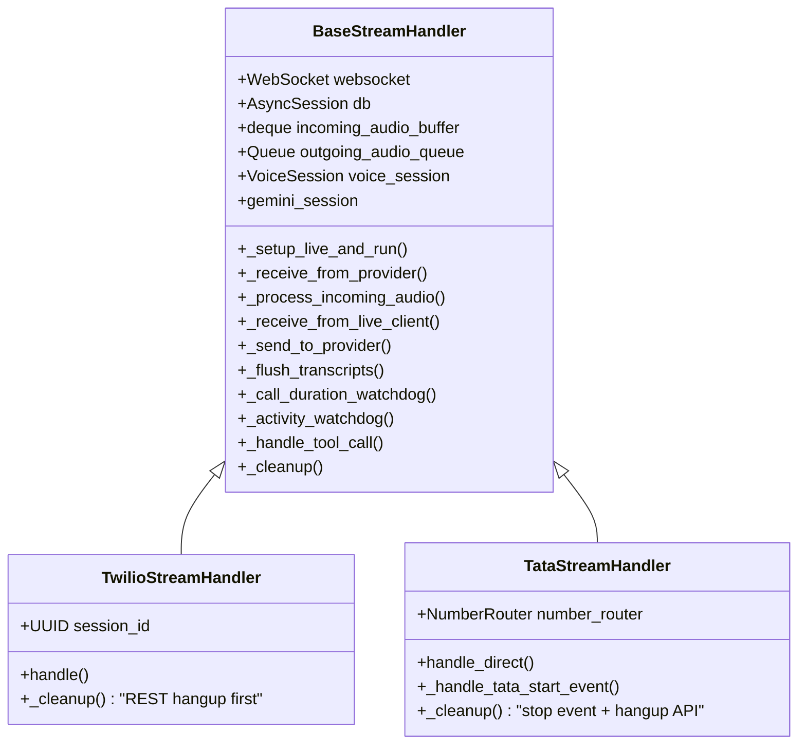
```mermaid
classDiagram
    class BaseStreamHandler {
        +WebSocket websocket
        +AsyncSession db
        +deque incoming_audio_buffer
        +Queue outgoing_audio_queue
        +VoiceSession voice_session
        +gemini_session
        +_setup_live_and_run()
        +_receive_from_provider()
        +_process_incoming_audio()
        +_receive_from_live_client()
        +_send_to_provider()
        +_flush_transcripts()
        +_call_duration_watchdog()
        +_activity_watchdog()
        +_handle_tool_call()
        +_cleanup()
    }
    class TwilioStreamHandler {
        +UUID session_id
        +handle()
        +_cleanup() "REST hangup first"
    }
    class TataStreamHandler {
        +NumberRouter number_router
        +handle_direct()
        +_handle_tata_start_event()
        +_cleanup() "stop event + hangup API"
    }
    BaseStreamHandler <|-- TwilioStreamHandler
    BaseStreamHandler <|-- TataStreamHandler
```

`TwilioStreamHandler` gets its `VoiceSession` from the URL path (`/stream/twilio/{session_id}`). `TataStreamHandler` (used only on the direct `/webhooks/voice/tata/incoming` WebSocket) has to discover the session from the provider's `start` event.

### 3.1 Handshake

Both providers speak the **same wire protocol** (Tata deliberately copied Twilio's Media Streams format). Four event types arrive as JSON text frames:

| Event | Payload | Handler |
|-------|---------|---------|
| `connected` | protocol metadata | logged only |
| `start` | `start.streamSid`, `start.callSid`, and for Tata also `start.from`, `start.to`, `start.customParameters.custom_identifier` | [`_handle_start_event`](../../backend/src/voice/websocket_handler.py:414) / [`_handle_tata_start_event`](../../backend/src/voice/websocket_handler.py:1805) |
| `media` | `media.payload` = base64 mu-law | [`_handle_media_event`](../../backend/src/voice/websocket_handler.py:427) |
| `stop` | — | sets `_provider_stopped = True`, ends the loop |

We send back only two event types: `media` (with a monotonically increasing `chunk` counter, required by the Tata spec) and `clear` (flush the provider's playback buffer). `TataStreamHandler._cleanup` additionally sends `stop`.

### 3.2 Codecs and sample rates — exact numbers

[`audio_processor.py`](../../backend/src/voice/audio_processor.py) is the only place format knowledge lives:

| Direction | Format | Rate | Width | Conversion |
|-----------|--------|------|-------|-----------|
| Provider → us | mu-law, mono | **8 kHz** | 1 byte/sample | — |
| Us → model | linear PCM16, mono | **16 kHz** | 2 bytes/sample | [`mulaw_to_pcm16`](../../backend/src/voice/audio_processor.py:26) — `audioop.ulaw2lin` then `audioop.ratecv` 8k→16k |
| Model → us | linear PCM16, mono | **24 kHz** | 2 bytes/sample | — |
| Us → provider | mu-law, mono | **8 kHz** | 1 byte/sample | [`pcm24_to_mulaw`](../../backend/src/voice/audio_processor.py:59) — `ratecv` 24k→8k then `lin2ulaw` |

The MIME type we declare to the model is literally `audio/pcm;rate=16000`. Outbound audio is **frame-aligned to 160 bytes** (20 ms at 8 kHz mu-law) and padded with `0xFF` (mu-law zero level) — misaligned chunks caused audible clicks.

One byte of mu-law becomes **four** bytes of 16 kHz PCM16 (2× the rate, 2× the width). That ratio shows up in the echo gate below.


```mermaid
flowchart LR
    A["Provider media event - base64 string"] -->|"b64decode"| B["mulaw bytes - 8kHz 1B/sample"]
    B --> C["deque incoming_audio_buffer - maxlen 100"]
    C -->|"popleft"| D["audioop.ulaw2lin - linear 8kHz PCM16"]
    D --> E["RMS energy VAD + echo gate + recording mix"]
    E -->|"forward"| F["audioop.ratecv 8k to 16k"]
    E -->|"gated"| G["zeros - len x 4 bytes of silence"]
    F --> H["send_realtime_input audio/pcm;rate=16000"]
    G --> H
    H --> I["Gemini Live"]
    I -->|"response.data - PCM16 24kHz"| J["audioop.ratecv 24k to 8k"]
    J --> K["audioop.lin2ulaw"]
    K --> L["pad to multiple of 160 bytes with 0xFF"]
    L --> M["asyncio.Queue outgoing_audio_queue - maxsize 500"]
    M --> N["b64encode - media event with chunk counter"]
    N --> O["Provider WebSocket"]
```

### 3.3 Buffering and backpressure

```python
# backend/src/voice/websocket_handler.py
# Audio — P1.6: cap incoming buffer to prevent unbounded growth
# 100 packets ≈ 500ms at 8kHz / 20ms packets — favors responsiveness
self.incoming_audio_buffer: deque = deque(maxlen=100)
self.outgoing_audio_queue: asyncio.Queue = asyncio.Queue(maxsize=500)  # ~2.5s at 20ms/frame
```

A bounded `deque` means that if the model-send task falls behind, the *oldest* frames are silently dropped rather than the process ballooning. `_process_incoming_audio` spins with `await asyncio.sleep(0.005)` when the buffer is empty; `_send_to_provider` blocks on `queue.get()` (an earlier version busy-looped on a 10 ms timeout).

> **Doc drift inside one file:** the module docstring says `incoming_audio_buffer capped at maxlen=200 (~1 sec)`. The code says `maxlen=100`. Trust the code.

### 3.4 The seven concurrent tasks

Once the live session is connected, [`_setup_live_and_run`](../../backend/src/voice/websocket_handler.py:225) launches seven tasks and waits for the **first** one to finish:

```python
# backend/src/voice/websocket_handler.py
tasks = [
    asyncio.create_task(self._receive_from_provider()),
    asyncio.create_task(self._process_incoming_audio()),
    asyncio.create_task(self._receive_from_live_client()),
    asyncio.create_task(self._send_to_provider()),
    asyncio.create_task(self._flush_transcripts()),
    asyncio.create_task(self._call_duration_watchdog()),
    asyncio.create_task(self._activity_watchdog()),
]
done, pending = await asyncio.wait(tasks, return_when=asyncio.FIRST_COMPLETED)
```

Any task exiting tears the whole call down — that is the deliberate mechanism by which `_terminate_call()` (which just flips `is_running = False`) unwinds into `_cleanup()`.

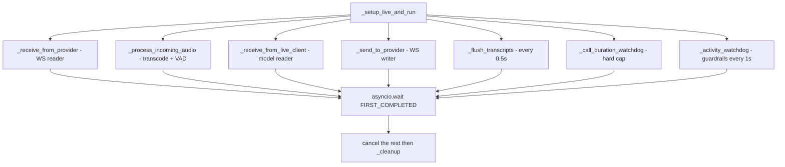
```mermaid
flowchart TD
    S["_setup_live_and_run"] --> T1["_receive_from_provider - WS reader"]
    S --> T2["_process_incoming_audio - transcode + VAD"]
    S --> T3["_receive_from_live_client - model reader"]
    S --> T4["_send_to_provider - WS writer"]
    S --> T5["_flush_transcripts - every 0.5s"]
    S --> T6["_call_duration_watchdog - hard cap"]
    S --> T7["_activity_watchdog - guardrails every 1s"]
    T1 --> W["asyncio.wait FIRST_COMPLETED"]
    T2 --> W
    T3 --> W
    T4 --> W
    T5 --> W
    T6 --> W
    T7 --> W
    W --> C["cancel the rest then _cleanup"]
```

### 3.5 Call setup and the ringback trick

Setup latency (agent load + credit check + live-session connect) was measured at **5–27 seconds** under concurrent dialing. Dead air makes leads hang up, so the handler synthesises a **North American ringback tone** — 440 Hz + 480 Hz, 2 s on / 4 s off — as 8 kHz mu-law and loops it, paced at real time (`asyncio.sleep(0.02)` per 20 ms frame), until the model's first audio byte arrives ([`generate_ringback_tone`](../../backend/src/voice/audio_processor.py:197), [`_play_ringback_until_first_audio`](../../backend/src/voice/websocket_handler.py:448)).

Pacing matters: if we blasted 4 s of ringback in one burst it would sit in the provider's buffer and keep playing after the agent starts talking. On first model audio we cancel the task, drain `outgoing_audio_queue`, and send a `clear` event.

### 3.6 One conversational turn, end to end

```mermaid
sequenceDiagram
    autonumber
    participant L as Lead
    participant P as Twilio / Tata
    participant H as BaseStreamHandler
    participant AP as AudioProcessor
    participant M as Gemini Live
    participant DB as PostgreSQL

    L->>P: speaks
    loop every 20 ms
        P->>H: {"event":"media","media":{"payload":"<b64 mulaw>"}}
        H->>H: b64decode, append to deque
    end
    H->>AP: mulaw_to_pcm16 per frame
    H->>H: audioop.rms - update last_lead_speech_at
    H->>M: send_realtime_input audio=Blob(pcm16, audio/pcm;rate=16000)
    Note over M: server VAD - silence_duration_ms 1000 ends the turn
    M-->>H: server_content.input_transcription "I want a 2BHK"
    H->>H: buffer customer transcript, set user_speech_end_time
    M-->>H: response.data - PCM 24kHz chunks
    H->>AP: pcm24_to_mulaw + 160-byte frame align
    H->>H: enqueue, log TTFB, extend _agent_playback_until
    H->>P: {"event":"media","media":{"payload":"...","chunk":N}}
    P->>L: agent speech
    M-->>H: server_content.output_transcription "Sure, which area?"
    H->>H: buffer agent transcript
    Note over H: 1 s of transcript silence
    H->>DB: ConversationHistory rows for both speakers
```

Note the ordering quirk: transcripts and audio arrive on the **same** `receive()` stream, interleaved. Both speakers' text is accumulated into string buffers and only written to the DB by [`_flush_transcripts`](../../backend/src/voice/websocket_handler.py:1095) after 1 second of quiet, which is why the turn numbering in `conversation_history` is per-flush rather than per-utterance.

---

## 4. Barge-in, silence and end-of-turn

**End-of-turn is not ours.** We never decide when the caller has finished speaking — Gemini's server-side VAD does, configured in [`gemini_live.py`](../../backend/src/voice/gemini_live.py:154):

```python
# backend/src/voice/gemini_live.py
"realtime_input_config": {
    "automatic_activity_detection": {
        "disabled": False,
        "start_of_speech_sensitivity": "START_SENSITIVITY_HIGH",
        "end_of_speech_sensitivity": "END_SENSITIVITY_LOW",
        "prefix_padding_ms": 100,
        "silence_duration_ms": 1000,
    }
},
```

High start sensitivity = fast barge-in detection. Low end sensitivity + 1000 ms silence = the model does not cut the caller off mid-pause.

**Barge-in is a two-key operation.** Gemini sets `server_content.interrupted = True` when it thinks the user spoke over it — but PSTN line echo and noise also trip that. Acting on every one of them wiped the agent's buffered sentence at the provider and sounded like the agent stopping mid-word. So we require corroboration from our own RMS meter:

```python
# backend/src/voice/websocket_handler.py
if getattr(sc, 'interrupted', False):
    now = time.time()
    strong_speech_recent = (
        self._last_strong_speech_at is not None
        and now - self._last_strong_speech_at < 1.5
    )
    if strong_speech_recent:
        await self._handle_interruption()
    else:
        logger.info("[INTERRUPT] Ignoring uncorroborated interruption ...")
```

`_last_strong_speech_at` is set whenever an inbound frame's RMS exceeds `VOICE_BARGE_IN_RMS_THRESHOLD` (default **1000**). A separate, lower threshold `VOICE_VAD_RMS_THRESHOLD` (default **300**) drives `_last_lead_speech_at`, which the guardrails use as "the lead is alive".

`_handle_interruption()` does four things: drain `outgoing_audio_queue`, send `{"event":"clear","streamSid":…}`, clear the outbound recording mix buffer, and set `_agent_playback_until = now` (the agent is instantly inaudible).

**The echo gate.** While the agent is audibly playing, the phone line feeds an attenuated copy of the agent's own voice back to us. Forwarding it made Gemini hallucinate "lead" transcripts. The gate is deliberately narrow — a flat threshold once muted a real lead speaking at RMS ~400 for 26 seconds:

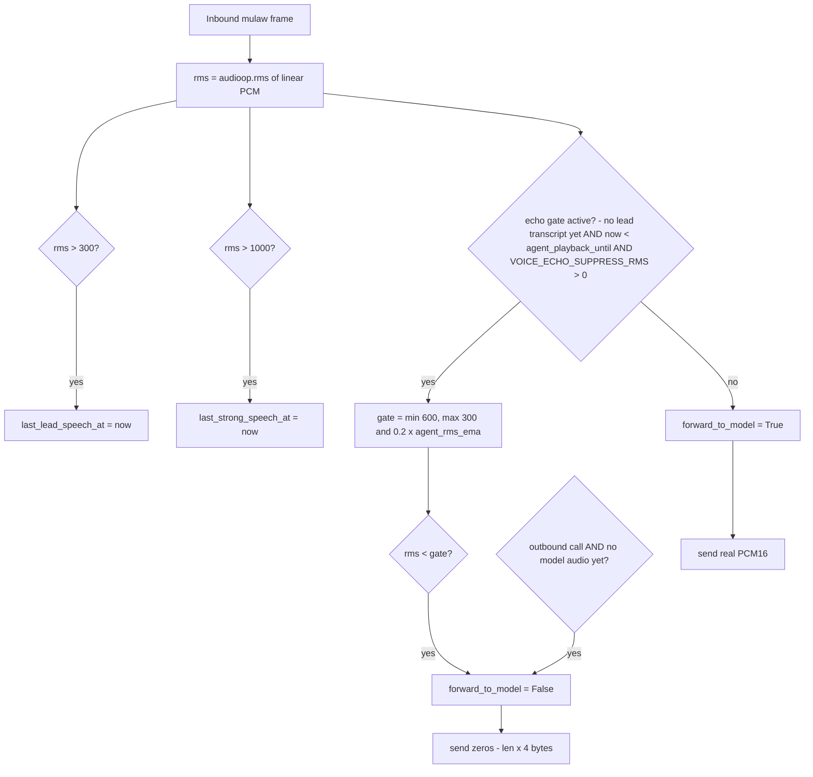
```mermaid
flowchart TD
    A["Inbound mulaw frame"] --> B["rms = audioop.rms of linear PCM"]
    B --> C{"rms > 300?"}
    C -->|yes| D["last_lead_speech_at = now"]
    B --> E{"rms > 1000?"}
    E -->|yes| F["last_strong_speech_at = now"]
    B --> G{"echo gate active? - no lead transcript yet AND now < agent_playback_until AND VOICE_ECHO_SUPPRESS_RMS > 0"}
    G -->|yes| H["gate = min 600, max 300 and 0.2 x agent_rms_ema"]
    H --> I{"rms < gate?"}
    I -->|yes| J["forward_to_model = False"]
    G -->|no| K["forward_to_model = True"]
    L{"outbound call AND no model audio yet?"} -->|yes| J
    J --> M["send zeros - len x 4 bytes"]
    K --> N["send real PCM16"]
```

Two subtleties worth memorising:

- **Gated frames become silence, not gaps.** Dropping frames entirely fed Gemini choppy speech and its VAD never saw a clean end-of-turn (symptom: one giant delayed transcript). We substitute `b"\x00" * (len(mulaw_chunk) * 4)`.
- **Outbound greeting protection.** On an outbound call, the lead's pickup "Hello?" used to barge in and cancel the greeting before a single word played, leaving the session mute. Inbound audio is therefore withheld entirely until the model has produced its first audio byte.

**The playback horizon.** The model generates far faster than real time — a 30 s reply reaches the provider in a ~2 s burst. Measuring silence from "when we last sent a chunk" would be badly wrong. `_agent_playback_until` accumulates `len(mulaw_chunk) / 8000.0` seconds per chunk, and [`effective_agent_audio_at`](../../backend/src/voice/call_guards.py:75) translates that into "when the lead last *heard* the agent".

---

## 5. The live-client abstraction

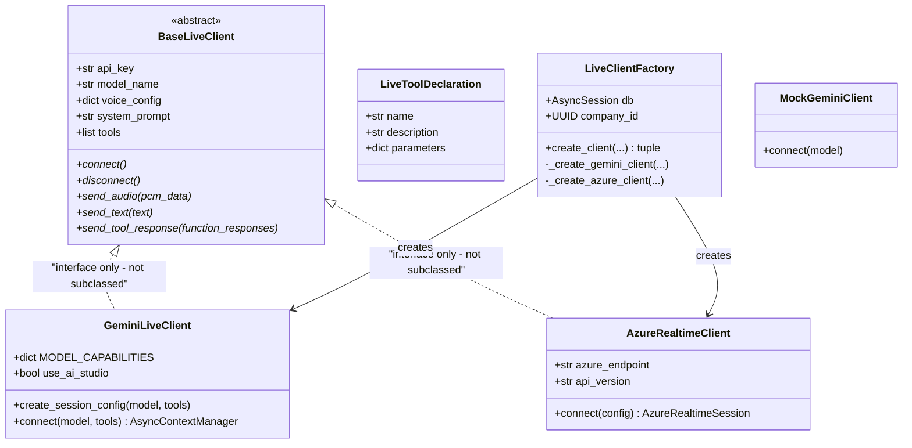
```mermaid
classDiagram
    class BaseLiveClient {
        <<abstract>>
        +str api_key
        +str model_name
        +dict voice_config
        +str system_prompt
        +list tools
        +connect()*
        +disconnect()*
        +send_audio(pcm_data)*
        +send_text(text)*
        +send_tool_response(function_responses)*
    }
    class LiveToolDeclaration {
        +str name
        +str description
        +dict parameters
    }
    class LiveClientFactory {
        +AsyncSession db
        +UUID company_id
        +create_client(...) tuple
        -_create_gemini_client(...)
        -_create_azure_client(...)
    }
    class GeminiLiveClient {
        +dict MODEL_CAPABILITIES
        +bool use_ai_studio
        +create_session_config(model, tools)
        +connect(model, tools) AsyncContextManager
    }
    class AzureRealtimeClient {
        +str azure_endpoint
        +str api_version
        +connect(config) AzureRealtimeSession
    }
    class MockGeminiClient {
        +connect(model)
    }
    BaseLiveClient <|.. GeminiLiveClient : "interface only - not subclassed"
    BaseLiveClient <|.. AzureRealtimeClient : "interface only - not subclassed"
    LiveClientFactory --> GeminiLiveClient : creates
    LiveClientFactory --> AzureRealtimeClient : creates
```

> **The abstraction is aspirational.** [`live_client_base.py`](../../backend/src/voice/live_client_base.py) defines `BaseLiveClient` as an ABC with a callback-oriented API (`on_audio_out`, `on_tool_call`, …), but **neither** `GeminiLiveClient` nor `AzureRealtimeClient` inherits from it, and nothing in the repo imports it except itself. The real polymorphism boundary is [`LiveClientFactory.create_client()`](../../backend/src/voice/live_client_factory.py:35), which returns a `(client_or_tuple, provider_name)` pair and lets the caller branch on the string.

The factory resolves the model from **task defaults** rather than hard-coding it:

```python
# backend/src/voice/live_client_factory.py
integration, api_key = await config_svc.resolve_model_for_task(
    company_id=self.company_id,
    task_type=SPEECH_TO_SPEECH_TASK,     # "speech_to_speech"
)
...
if provider in ("azure_openai", "azure"):
    return await self._create_azure_client(...), "azure_openai"
else:
    return await self._create_gemini_client(...), "gemini"
```

So the speech-to-speech model is per-tenant configuration (see [10 — LLM providers](10-llm-providers.md)), not a constant. If no default is set the call dies immediately with `RuntimeError: No speech_to_speech model configured`.

---

## 6. Speech-to-speech providers

### 6.1 Gemini Live

[`gemini_live.py`](../../backend/src/voice/gemini_live.py) wraps `google.genai`. Two backends are supported, chosen by `service_metadata.use_ai_studio`:

| Backend | Client builder | Why |
|---------|---------------|-----|
| Vertex AI (default) | `build_vertex_genai_client_sync(service_metadata)` | standard models, project/region auth |
| AI Studio | `build_ai_studio_genai_client_sync(api_key=…)` | Live / native-audio models not yet on Vertex |

Model capability registry ([`gemini_live.py:40`](../../backend/src/voice/gemini_live.py:40)):

| Model | native_audio | supports_thinking | Notes |
|-------|--------------|-------------------|-------|
| `gemini-2.0-flash-exp` | false | false | standard config path |
| `gemini-2.5-flash-preview-native-audio-01` | true | false | comment: setting `thinking_config` causes 60–90 s silence |
| `gemini-2.5-flash-live-001` | true | false | |
| `gemini-3.1-flash-live-preview` | true | true | AI Studio only |
| `gemini-2.5-flash-native-audio-preview-12-2025` | true | true | AI Studio only |

`create_session_config()` picks `_create_native_audio_config` or `_create_standard_config` based on that table — but as of today **both functions return identical dictionaries**. Keys sent:

| Key | Value |
|-----|-------|
| `response_modalities` | `["AUDIO"]` |
| `speech_config.voice_config.prebuilt_voice_config.voice_name` | from the agent's `VoiceConfig` (default `Aoede`) |
| `realtime_input_config.automatic_activity_detection` | see §4 |
| `output_audio_transcription` | `{}` (enable) |
| `input_audio_transcription` | `{}` (enable) |
| `system_instruction` | agent prompt (+ voicemail suffix) |
| `tools` | `[{"function_declarations": [...]}]` when tools exist |

Messages we **send**: `send_realtime_input(text=…)` for the greeting trigger and system nudges, `send_realtime_input(audio=Blob(...))` for audio, `send_tool_response(function_responses=[...])` for tool results.

Fields we **read** off each `receive()` response: `response.data` (raw PCM24 audio), `response.text`, `response.server_content.interrupted`, `.input_transcription.text`, `.output_transcription.text`, and `response.tool_call.function_calls`.

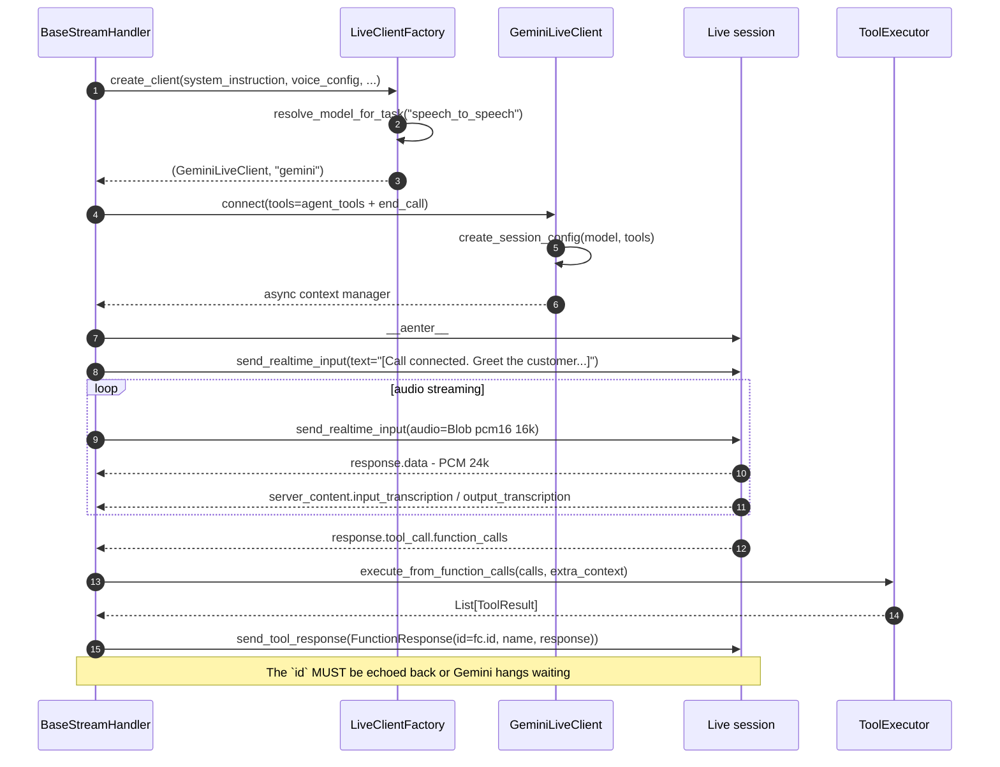
```mermaid
sequenceDiagram
    autonumber
    participant H as BaseStreamHandler
    participant F as LiveClientFactory
    participant C as GeminiLiveClient
    participant S as Live session
    participant TE as ToolExecutor

    H->>F: create_client(system_instruction, voice_config, ...)
    F->>F: resolve_model_for_task("speech_to_speech")
    F-->>H: (GeminiLiveClient, "gemini")
    H->>C: connect(tools=agent_tools + end_call)
    C->>C: create_session_config(model, tools)
    C-->>H: async context manager
    H->>S: __aenter__
    H->>S: send_realtime_input(text="[Call connected. Greet the customer...]")
    loop audio streaming
        H->>S: send_realtime_input(audio=Blob pcm16 16k)
        S-->>H: response.data - PCM 24k
        S-->>H: server_content.input_transcription / output_transcription
    end
    S-->>H: response.tool_call.function_calls
    H->>TE: execute_from_function_calls(calls, extra_context)
    TE-->>H: List[ToolResult]
    H->>S: send_tool_response(FunctionResponse(id=fc.id, name, response))
    Note over H,S: The `id` MUST be echoed back or Gemini hangs waiting
```

**Function calling during a call.** [`_handle_tool_call`](../../backend/src/voice/websocket_handler.py:883) is fired as a fire-and-forget `asyncio.create_task` so audio keeps flowing. Two behaviours are voice-specific:

- `email_address` is stripped from `email_send` / `email_draft` args, because the model invents fake sender addresses like `customer.email@example.com` and the connection lookup then fails. The tool falls back to the company default.
- The synthetic `end_call` tool is intercepted before it reaches the registry (see §12).

**Reconnect:** there is none. A failure inside `_receive_from_live_client` logs and sets `is_running = False`, which ends the call. There is no retry, no session resumption.

### 6.2 Azure OpenAI Realtime

[`azure_realtime.py`](../../backend/src/voice/azure_realtime.py) is a hand-rolled `websockets` client for the Azure GPT-4o Realtime API.

| Aspect | Value |
|--------|-------|
| URL | `wss://<endpoint>/openai/realtime?api-version=<v>&deployment=<name>` |
| Default api-version | `2025-04-01-preview` |
| Auth | `api-key` header |
| Audio format | `pcm16` in and out, **24 kHz** (`DEFAULT_SAMPLE_RATE = 24000`) |
| Turn detection | `server_vad`, threshold 0.5, `prefix_padding_ms` 300, `silence_duration_ms` 500 |
| Voice | mapped from the Gemini voice name by [`_map_voice_to_azure`](../../backend/src/voice/live_client_factory.py:179) — `Aoede→nova`, `Puck→alloy`, `Charon→echo`, … default `alloy` |

Client→server message types: `session.update`, `input_audio_buffer.append`, `input_audio_buffer.commit`, `conversation.item.create` (both `message` and `function_call_output` items), `response.create`.

Server→client event types the wrapper classifies ([`AzureRealtimeEvent`](../../backend/src/voice/azure_realtime.py:82)):

| Property | Event type(s) |
|----------|---------------|
| `is_audio_delta` | `response.audio.delta` |
| `is_text_delta` | `response.text.delta`, `response.audio_transcript.delta` |
| `is_function_call` | `response.function_call_arguments.done`, `response.output_item.done` with `item.type == "function_call"` |
| `is_turn_done` | `response.done` |
| `is_error` | `error` |

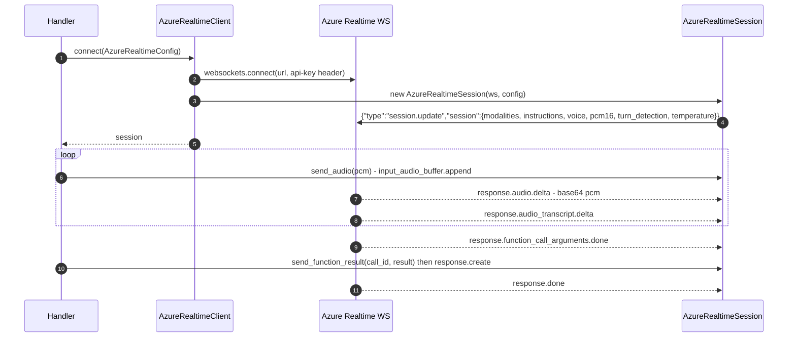
```mermaid
sequenceDiagram
    autonumber
    participant H as Handler
    participant C as AzureRealtimeClient
    participant WS as Azure Realtime WS
    participant S as AzureRealtimeSession

    H->>C: connect(AzureRealtimeConfig)
    C->>WS: websockets.connect(url, api-key header)
    C->>S: new AzureRealtimeSession(ws, config)
    S->>WS: {"type":"session.update","session":{modalities, instructions, voice, pcm16, turn_detection, temperature}}
    C-->>H: session
    loop
        H->>S: send_audio(pcm) - input_audio_buffer.append
        WS-->>S: response.audio.delta - base64 pcm
        WS-->>S: response.audio_transcript.delta
    end
    WS-->>S: response.function_call_arguments.done
    H->>S: send_function_result(call_id, result) then response.create
    WS-->>S: response.done
```

> **The Azure path is broken in the stream handler.** [`websocket_handler.py:304`](../../backend/src/voice/websocket_handler.py:304) does:
>
> ```python
> azure_client, azure_config = live_client_or_tuple
> await azure_client.connect(azure_config)
> self.gemini_session = azure_client        # <-- the CLIENT, not the returned session
> ```
>
> `connect()`'s return value — the `AzureRealtimeSession` that actually has `send_audio`/`receive` — is discarded. `AzureRealtimeClient` has no `send_realtime_input`, no `receive`, no `send_tool_response`, so the greeting fails ("non-fatal" warning) and `_receive_from_live_client` raises `AttributeError` and kills the call. The same bug exists in [`web_audio_adapter.py:101`](../../backend/src/gateway/web_audio_adapter.py:101). Treat Gemini Live as the only working speech-to-speech provider today.

### 6.3 The mock client

[`gemini_mock.py`](../../backend/src/voice/gemini_mock.py) mirrors the `client.aio.live.connect(...)` shape with `MockGeminiClient → MockAsyncClient → MockLiveAPI → MockGeminiLiveSession`, yielding `MockResponse.server_content.model_turn.parts[0]` objects. It picks randomly from six canned strings and emits the **text encoded as UTF-8 bytes repeated ten times** as fake "audio".

Two caveats: nothing in the runtime ever instantiates it (`grep MockGeminiClient` finds only the module itself), and its response shape (`server_content.model_turn.parts`) does not match what `_receive_from_live_client` reads (`response.data`, `server_content.output_transcription`). It is useful as a reference for the SDK surface, not as a drop-in test double.

---

## 7. Telephony provider: Twilio

Used for international numbers. `NumberRouter._detect_provider` routes anything **not** starting with `+91` to Twilio.

### 7.1 Inbound

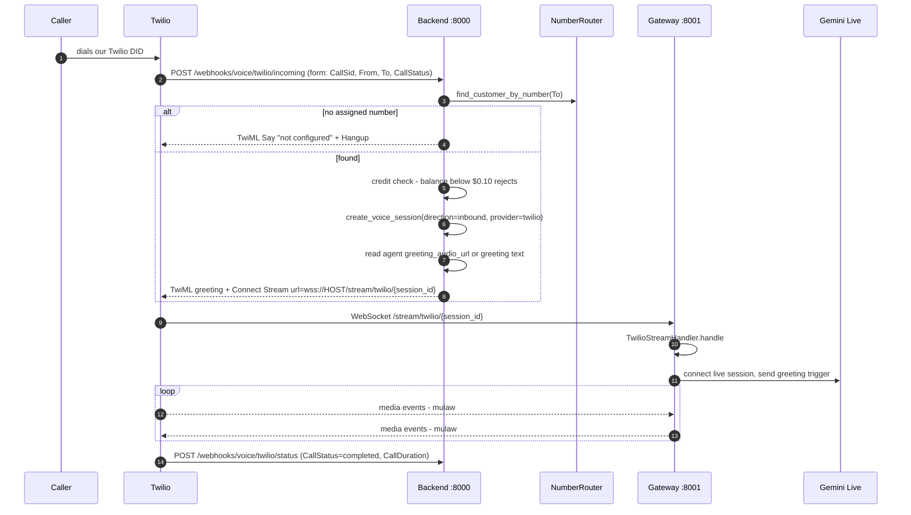
```mermaid
sequenceDiagram
    autonumber
    participant C as Caller
    participant TW as Twilio
    participant BE as Backend :8000
    participant NR as NumberRouter
    participant GW as Gateway :8001
    participant M as Gemini Live

    C->>TW: dials our Twilio DID
    TW->>BE: POST /webhooks/voice/twilio/incoming (form: CallSid, From, To, CallStatus)
    BE->>NR: find_customer_by_number(To)
    alt no assigned number
        BE-->>TW: TwiML Say "not configured" + Hangup
    else found
        BE->>BE: credit check - balance below $0.10 rejects
        BE->>BE: create_voice_session(direction=inbound, provider=twilio)
        BE->>BE: read agent greeting_audio_url or greeting text
        BE-->>TW: TwiML greeting + Connect Stream url=wss://HOST/stream/twilio/{session_id}
    end
    TW->>GW: WebSocket /stream/twilio/{session_id}
    GW->>GW: TwilioStreamHandler.handle
    GW->>M: connect live session, send greeting trigger
    loop
        TW-->>GW: media events - mulaw
        GW-->>TW: media events - mulaw
    end
    TW->>BE: POST /webhooks/voice/twilio/status (CallStatus=completed, CallDuration)
```

The TwiML returned is exactly:

```xml
<?xml version="1.0" encoding="UTF-8"?>
<Response>
    <Say voice="alice">Please wait while we connect you.</Say>
    <Connect>
        <Stream url="wss://streaming.example.com/stream/twilio/<session-uuid>" />
    </Connect>
</Response>
```

The greeting element is replaced by `<Play>{greeting_audio_url}</Play>` if the agent has `metadata_extensions.greeting_audio_url`, or `<Say>` with `identity.greeting` / `metadata_extensions.greeting_text`.

### 7.2 Outbound

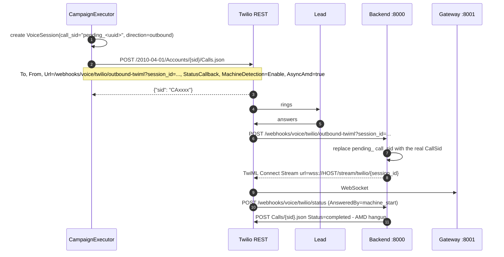
```mermaid
sequenceDiagram
    autonumber
    participant EX as CampaignExecutor
    participant TW as Twilio REST
    participant L as Lead
    participant BE as Backend :8000
    participant GW as Gateway :8001

    EX->>EX: create VoiceSession(call_sid="pending_<uuid>", direction=outbound)
    EX->>TW: POST /2010-04-01/Accounts/{sid}/Calls.json
    Note over EX,TW: To, From, Url=/webhooks/voice/twilio/outbound-twiml?session_id=..., StatusCallback, MachineDetection=Enable, AsyncAmd=true
    TW-->>EX: {"sid": "CAxxxx"}
    TW->>L: rings
    L->>TW: answers
    TW->>BE: POST /webhooks/voice/twilio/outbound-twiml?session_id=...
    BE->>BE: replace pending_ call_sid with the real CallSid
    BE-->>TW: TwiML Connect Stream url=wss://HOST/stream/twilio/{session_id}
    TW->>GW: WebSocket
    TW->>BE: POST /webhooks/voice/twilio/status (AnsweredBy=machine_start)
    BE->>TW: POST Calls/{sid}.json Status=completed - AMD hangup
```

**Answering machine detection.** The outbound payload enables Twilio AMD asynchronously. The result arrives on the *status* webhook as `AnsweredBy`. [`is_twilio_machine`](../../backend/src/voice/call_guards.py:99) treats `machine_start`, `machine_end_beep`, `machine_end_silence`, `machine_end_other`, `fax` as a machine; the handler marks the `CampaignCall` as `completed-voicemail` and force-hangs-up via REST.

**Hanging up.** Closing the media WebSocket does *not* end the PSTN leg. [`hangup_twilio_call`](../../backend/src/voice/twilio_api.py:47) POSTs `Status=completed` to the Calls resource using credentials from `IntegrationRegistry` (`account_sid` in `service_metadata`, auth token in the encrypted API key column). `TwilioStreamHandler._cleanup` calls it unless the provider already sent `stop`.

**DTMF:** not implemented. There is no `dtmf` event handler, no `<Gather>`, and no digit collection anywhere in `backend/src/voice/`.

---

## 8. Telephony provider: Tata Tele / Smartflo

Used for Indian numbers (`+91`). Wire protocol on the WebSocket is identical to Twilio's; everything else differs.

### 8.1 Outbound — click-to-call

Smartflo's Click-to-Call Support API works **in reverse**: it rings the *customer* first, then bridges.

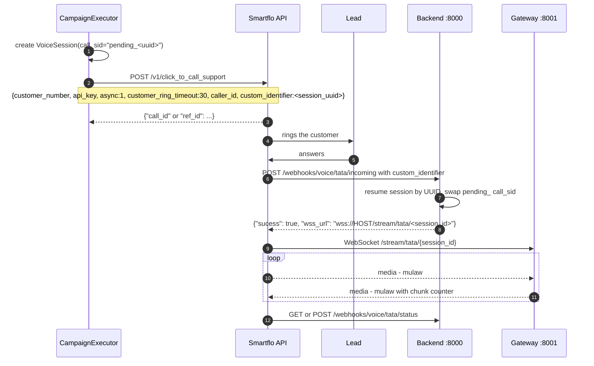
```mermaid
sequenceDiagram
    autonumber
    participant EX as CampaignExecutor
    participant SF as Smartflo API
    participant L as Lead
    participant BE as Backend :8000
    participant GW as Gateway :8001

    EX->>EX: create VoiceSession(call_sid="pending_<uuid>")
    EX->>SF: POST /v1/click_to_call_support
    Note over EX,SF: {customer_number, api_key, async:1, customer_ring_timeout:30, caller_id, custom_identifier:<session_uuid>}
    SF-->>EX: {"call_id" or "ref_id": ...}
    SF->>L: rings the customer
    L->>SF: answers
    SF->>BE: POST /webhooks/voice/tata/incoming with custom_identifier
    BE->>BE: resume session by UUID, swap pending_ call_sid
    BE-->>SF: {"sucess": true, "wss_url": "wss://HOST/stream/tata/<session_id>"}
    SF->>GW: WebSocket /stream/tata/{session_id}
    loop
        SF-->>GW: media - mulaw
        GW-->>SF: media - mulaw with chunk counter
    end
    SF->>BE: GET or POST /webhooks/voice/tata/status
```

The API key is deliberately read from `service_metadata["api_key"]` **first**, falling back to the encrypted column — users editing the integration to add a hangup token had been overwriting the encrypted key, breaking every placement with HTTP 422 ([`campaign_executor.py:646`](../../backend/src/ai/campaign_executor.py:646)).

### 8.2 Inbound

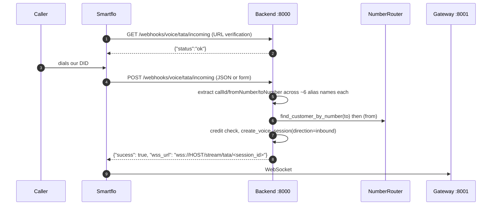
```mermaid
sequenceDiagram
    autonumber
    participant C as Caller
    participant SF as Smartflo
    participant BE as Backend :8000
    participant NR as NumberRouter
    participant GW as Gateway :8001

    SF->>BE: GET /webhooks/voice/tata/incoming (URL verification)
    BE-->>SF: {"status":"ok"}
    C->>SF: dials our DID
    SF->>BE: POST /webhooks/voice/tata/incoming (JSON or form)
    BE->>BE: extract callId/fromNumber/toNumber across ~6 alias names each
    BE->>NR: find_customer_by_number(to) then (from)
    BE->>BE: credit check, create_voice_session(direction=inbound)
    BE-->>SF: {"sucess": true, "wss_url": "wss://HOST/stream/tata/<session_id>"}
    SF->>GW: WebSocket
```

Alternatively Tata can be pointed straight at the **WebSocket** `wss://HOST/webhooks/voice/tata/incoming` with no HTTP step at all. That is what `TataStreamHandler.handle_direct()` serves: it blocks reading events until a `start` arrives, then resolves the session with a three-strategy cascade.

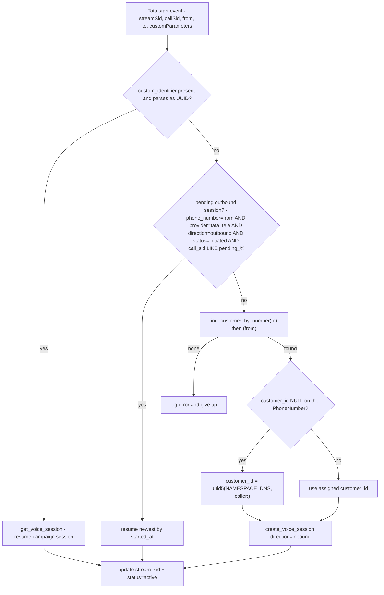
```mermaid
flowchart TD
    S["Tata start event - streamSid, callSid, from, to, customParameters"] --> A{"custom_identifier present and parses as UUID?"}
    A -->|yes| B["get_voice_session - resume campaign session"]
    A -->|no| C{"pending outbound session? - phone_number=from AND provider=tata_tele AND direction=outbound AND status=initiated AND call_sid LIKE pending_%"}
    C -->|yes| D["resume newest by started_at"]
    C -->|no| E["find_customer_by_number(to) then (from)"]
    E -->|none| F["log error and give up"]
    E -->|found| G{"customer_id NULL on the PhoneNumber?"}
    G -->|yes| H["customer_id = uuid5(NAMESPACE_DNS, caller:<from>)"]
    G -->|no| I["use assigned customer_id"]
    H --> J["create_voice_session direction=inbound"]
    I --> J
    B --> K["update stream_sid + status=active"]
    D --> K
    J --> K
```

The deterministic `uuid5` fallback exists because `voice_sessions.customer_id` is `NOT NULL` but a DID can be assigned to an agent without a specific customer.

### 8.3 Smartflo auth — two different credentials

This is the single most confusing part of the Tata integration, and [`tata_auth.py`](../../backend/src/voice/tata_auth.py) documents it well:

| Purpose | Credential | Where it goes |
|---------|-----------|---------------|
| Click-to-call placement | `service_metadata["api_key"]` | inside the **JSON body** as `api_key` |
| Account APIs, e.g. `/v1/call/hangup` | Smartflo login **JWT** | the `Authorization` **header** |

Sending the click-to-call key in the Authorization header yields `{"success": false, "message": "Deleted or blacklisted token provided"}` — this failed all 42 hangup attempts in one production run.

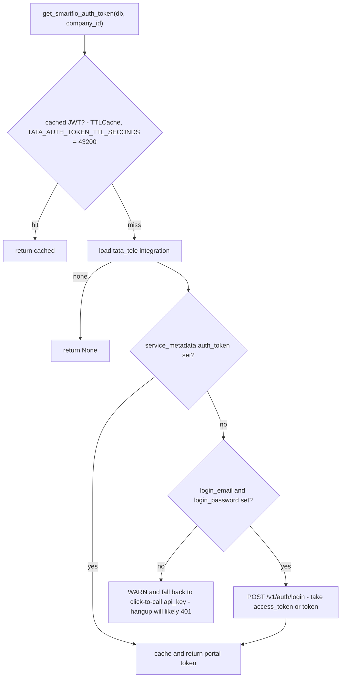
```mermaid
flowchart TD
    A["get_smartflo_auth_token(db, company_id)"] --> B{"cached JWT? - TTLCache, TATA_AUTH_TOKEN_TTL_SECONDS = 43200"}
    B -->|hit| C["return cached"]
    B -->|miss| D["load tata_tele integration"]
    D -->|none| E["return None"]
    D --> F{"service_metadata.auth_token set?"}
    F -->|yes| G["cache and return portal token"]
    F -->|no| H{"login_email and login_password set?"}
    H -->|yes| I["POST /v1/auth/login - take access_token or token"]
    I --> G
    H -->|no| J["WARN and fall back to click-to-call api_key - hangup will likely 401"]
```

`TataStreamHandler._cleanup` retries the hangup once with a force-refreshed token when the first attempt returns 401/403 or the body contains "blacklisted".

**DTMF:** not implemented for Tata either.

---

## 9. The webhook route table

All HTTP webhooks live on the backend (:8000) under [`webhook_router.py`](../../backend/src/voice/webhook_router.py), prefix `/webhooks/voice`. The gateway proxies them transparently.

| Method | Path | Provider | Request payload | Response |
|--------|------|----------|-----------------|----------|
| POST | `/webhooks/voice/twilio/incoming` | Twilio voice | form: `CallSid`, `From`, `To`, `CallStatus` | `application/xml` TwiML: greeting + `<Connect><Stream url="wss://.../stream/twilio/{id}"/>`, or `<Say>`+`<Hangup/>` on unknown number / low credits |
| POST | `/webhooks/voice/twilio/status` | Twilio voice | form: `CallSid`, `CallStatus`, `CallDuration`, `RecordingUrl`, `AnsweredBy` | JSON `{"status":"ok","session_id":…,"outcome":…}` |
| POST | `/webhooks/voice/twilio/outbound-twiml?session_id=<uuid>` | Twilio voice | query `session_id` + form `CallSid`, `From`, `To` | TwiML `<Connect><Stream/>` |
| GET | `/webhooks/voice/tata/incoming` | Tata | — (URL verification probe) | `{"status":"ok","message":"Tata Tele webhook endpoint active"}` |
| POST | `/webhooks/voice/tata/incoming` | Tata | JSON **or** form **or** urlencoded body; keys tried: `callId`/`call_id`/`callSid`/`id`, `fromNumber`/`from`/`caller_id_number`/`source`, `toNumber`/`to`/`destination`/`did_number`, `custom_identifier` | `{"sucess": true, "wss_url": "..."}` or `{"sucess": false, "error": "..."}` |
| WS | `/webhooks/voice/tata/incoming` | Tata | Media Streams events | bidirectional audio (served by the **gateway**, [`app.py:200`](../../backend/src/gateway/app.py:200)) |
| GET | `/webhooks/voice/tata/status` | Tata | query params | JSON |
| POST | `/webhooks/voice/tata/status` | Tata | JSON/form; keys tried: `custom_identifier`/`ref_id`/`$ref_id`, `call_id`/`$call_id`, `uuid`, `call_status`, `hangup_cause_key`/`hangup_cause`, `duration`, `billsec`, `call_connected`, `recording_url` | JSON `{"status":"ok","session_id":…,"outcome":…}` |
| POST | `/webhooks/voice/whatsapp/incoming` | Twilio WhatsApp | form: `From`, `To`, `Body`, `MediaUrl0`, `MediaContentType0`, `MessageSid` | `application/xml` TwiML `MessagingResponse` |
| POST | `/webhooks/voice/tata/whatsapp/incoming` | Tata WhatsApp | Meta Cloud API JSON: `entry[0].changes[0].value.messages[0]` | `{"status":"ok"}` (always 200, even on error) |

Two things a newcomer will hit:

- **`"sucess"` is misspelled** in both Tata voice responses. It is on the wire contract now; do not "fix" it without checking what Smartflo parses.
- **Tata field names are unstable.** The handlers try five or six aliases per field, including `$`-prefixed variants that appear in GET query strings. That defensiveness is intentional.

### 9.1 Status callback → outcome mapping

Twilio ([`webhook_router.py:265`](../../backend/src/voice/webhook_router.py:265)):

| `CallStatus` | duration | outcome | detail | disposition written |
|---|---|---|---|---|
| completed | > 0 | completed | answered | left NULL for the LLM |
| completed | 0 | failed | no_answer | no_answer |
| busy | — | failed | busy | busy |
| no-answer | — | failed | no_answer | no_answer |
| canceled | — | failed | rejected | rejected |
| failed | — | failed | failed | failed |
| initiated / ringing / in-progress | — | *(no CampaignCall update)* | | |

Tata ([`_process_tata_status`](../../backend/src/voice/webhook_router.py:707)) maps SIP-ish `hangup_cause` strings: `user_busy`→busy, `no_user_response`/`recovery_on_timer_expire`/`originator_cancel`→no_answer, `call_rejected`/`call_declined`→rejected, `subscriber_absent`/`destination_out_of_order`/`network_out_of_order`/`temporary_failure`→unreachable, `unallocated`/`invalid`/`unassigned`→invalid_number, `normal_clearing` with duration>0→completed else no_answer.

Both handlers refuse to overwrite a record already at `completed-voicemail` — in-call detection wins over the webhook, which only ever sees "the call completed".

---

## 10. Phone numbers and the pool

One table, `phone_numbers`, replaced the older `phone_number_pool` and `customer_phone_numbers`.

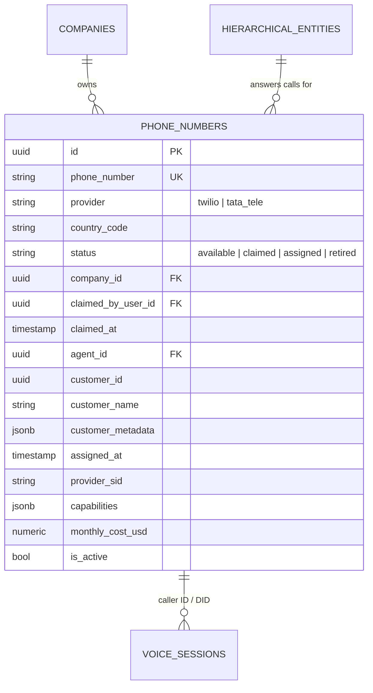
```mermaid
erDiagram
    PHONE_NUMBERS {
        uuid id PK
        string phone_number UK
        string provider "twilio | tata_tele"
        string country_code
        string status "available | claimed | assigned | retired"
        uuid company_id FK
        uuid claimed_by_user_id FK
        timestamp claimed_at
        uuid agent_id FK
        uuid customer_id
        string customer_name
        jsonb customer_metadata
        timestamp assigned_at
        string provider_sid
        jsonb capabilities
        numeric monthly_cost_usd
        bool is_active
    }
    COMPANIES ||--o{ PHONE_NUMBERS : owns
    HIERARCHICAL_ENTITIES ||--o{ PHONE_NUMBERS : "answers calls for"
    PHONE_NUMBERS ||--o{ VOICE_SESSIONS : "caller ID / DID"
```

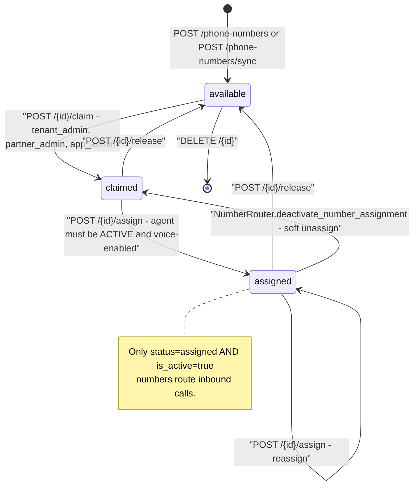
```mermaid
stateDiagram-v2
    [*] --> available : POST /phone-numbers or POST /phone-numbers/sync
    available --> claimed : "POST /{id}/claim - tenant_admin, partner_admin, app_admin"
    claimed --> assigned : "POST /{id}/assign - agent must be ACTIVE and voice-enabled"
    assigned --> assigned : "POST /{id}/assign - reassign"
    claimed --> available : "POST /{id}/release"
    assigned --> available : "POST /{id}/release"
    assigned --> claimed : "NumberRouter.deactivate_number_assignment - soft unassign"
    available --> [*] : "DELETE /{id}"
    note right of assigned
        Only status=assigned AND is_active=true
        numbers route inbound calls.
    end note
```

> `retired` appears in the model docstring but **no code ever sets it**. Treat the real lifecycle as available → claimed → assigned.

### 10.1 Number → agent resolution

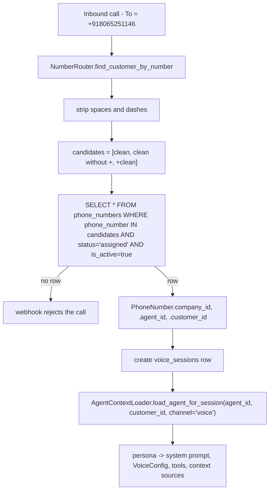
```mermaid
flowchart TD
    A["Inbound call - To = +918065251146"] --> B["NumberRouter.find_customer_by_number"]
    B --> C["strip spaces and dashes"]
    C --> D["candidates = [clean, clean without +, +clean]"]
    D --> E["SELECT * FROM phone_numbers WHERE phone_number IN candidates AND status='assigned' AND is_active=true"]
    E -->|no row| F["webhook rejects the call"]
    E -->|row| G["PhoneNumber.company_id, .agent_id, .customer_id"]
    G --> H["create voice_sessions row"]
    H --> I["AgentContextLoader.load_agent_for_session(agent_id, customer_id, channel='voice')"]
    I --> J["persona -> system prompt, VoiceConfig, tools, context sources"]
```

The candidate list exists because Tata sends `+918065251146` while the DB may hold `918065251146` (the sync routines `lstrip("+")` before insert).

**Outbound caller ID** uses [`get_company_number`](../../backend/src/voice/number_router.py:225): first a number assigned to the *specific* campaign agent, then any active assigned company number for that provider. Getting this wrong shows the lead the wrong caller ID.

### 10.2 The API

`/api/v1/phone-numbers` ([`phone_number_router.py`](../../backend/src/voice/phone_number_router.py)):

| Method | Path | Role | Purpose |
|--------|------|------|---------|
| POST | `""` | app_admin | Add one number; optional agent/customer fields make it `assigned` immediately |
| POST | `/bulk` | app_admin | Add many |
| POST | `/sync` | app_admin | Pull inventory from Twilio `IncomingPhoneNumbers.json` and Smartflo `my_numbers` |
| GET | `""` | any | app_admin sees all; others see `available` + their own |
| GET | `/{id}` | any | single number |
| PATCH | `/{id}` | any | edit label/agent/company/is_active/… |
| POST | `/{id}/claim` | tenant/partner/app admin | `available → claimed`; app_admin may pass `target_company_id` |
| POST | `/{id}/release` | owner or app_admin | back to `available`, wipes all ownership fields |
| POST | `/{id}/assign` | owner or app_admin | `claimed → assigned` after validating the agent |
| DELETE | `/{id}` | owner or app_admin | hard delete |

`assign` enforces three rules: the agent must exist, `status == "ACTIVE"`, and must be **voice-enabled** — i.e. `identity.voice` or `identity.persona.voice` must be truthy. Partner admins may assign agents from their own company or a child tenant.

The Tata sync is heroically defensive: it tries four endpoint paths (`/v1/number/my_numbers`, `/v1/my_number/my_numbers`, `/v1/numbers`, `/v1/did/list`) × two auth header shapes (`Bearer <key>` and raw), and accepts a list, or a dict keyed `numbers`/`data`/`did_numbers`/`results`/`items`.

> **Dead file:** [`phone_pool_router.py`](../../backend/src/voice/phone_pool_router.py) (701 lines, prefix `/api/v1/phone-pool`) is the predecessor. Nothing imports it — `phone_number_router.py`'s docstring says it "replaces both the old phone_pool_router.py and phone_number_router.py". The frontend `/phone-pool` route redirects to `/phone-numbers`.

---

## 11. Sessions

`voice_sessions` ([`models.py:16`](../../backend/src/voice/models.py:16)) is the spine every other voice record hangs off.

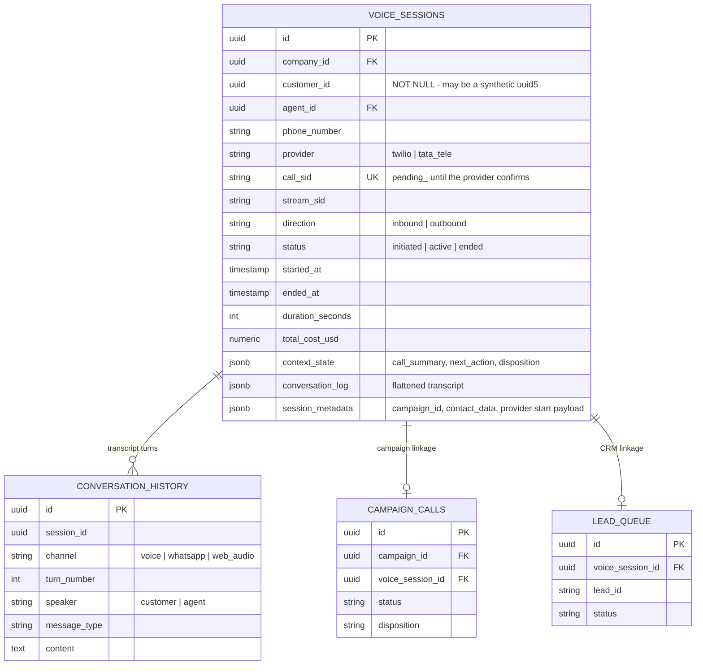
```mermaid
erDiagram
    VOICE_SESSIONS {
        uuid id PK
        uuid company_id FK
        uuid customer_id "NOT NULL - may be a synthetic uuid5"
        uuid agent_id FK
        string phone_number
        string provider "twilio | tata_tele"
        string call_sid UK "pending_<uuid> until the provider confirms"
        string stream_sid
        string direction "inbound | outbound"
        string status "initiated | active | ended"
        timestamp started_at
        timestamp ended_at
        int duration_seconds
        numeric total_cost_usd
        jsonb context_state "call_summary, next_action, disposition"
        jsonb conversation_log "flattened transcript"
        jsonb session_metadata "campaign_id, contact_data, provider start payload"
    }
    CONVERSATION_HISTORY {
        uuid id PK
        uuid session_id
        string channel "voice | whatsapp | web_audio"
        int turn_number
        string speaker "customer | agent"
        string message_type
        text content
    }
    CAMPAIGN_CALLS {
        uuid id PK
        uuid campaign_id FK
        uuid voice_session_id FK
        string status
        string disposition
    }
    LEAD_QUEUE {
        uuid id PK
        uuid voice_session_id FK
        string lead_id
        string status
    }
    VOICE_SESSIONS ||--o{ CONVERSATION_HISTORY : "transcript turns"
    VOICE_SESSIONS ||--o| CAMPAIGN_CALLS : "campaign linkage"
    VOICE_SESSIONS ||--o| LEAD_QUEUE : "CRM linkage"
```

```mermaid
stateDiagram-v2
    [*] --> initiated : "outbound - CampaignExecutor creates with call_sid=pending_<uuid>"
    [*] --> active : "inbound - create_voice_session defaults status=active"
    initiated --> active : "provider start event or outbound-twiml webhook - real call_sid + stream_sid written"
    active --> ended : "_cleanup - end_voice_session sets duration + conversation_log"
    active --> ended : "status webhook - completed/busy/failed/no-answer/canceled"
    initiated --> ended : "call never connected"
    ended --> [*]

    note right of active
        _cleanup also writes:
        recording artifact, AI summary,
        UsageLog rows, credit deduction,
        CampaignCall / LeadQueue updates.
    end note
```

[`SessionManager`](../../backend/src/voice/session_manager.py) is PostgreSQL-first with an **optional** Redis read-through cache (5 min TTL for voice, 24 h for WhatsApp). Nothing in the runtime currently passes a `redis_client`, so every lookup goes to Postgres; the caching branches are inert. `get_voice_session()` even has a vestigial cache-hit branch that falls through to the DB anyway:

```python
# backend/src/voice/session_manager.py
cached = await self._cache_get(_voice_key(session_id))
if cached:
    logger.debug(f"Voice session {session_id} served from Redis cache")
    ...
    pass  # fall through if ORM object is needed
```

`get_voice_session_by_call_sid_any_status` exists specifically for status webhooks that fire *after* `_cleanup` has already flipped the session to `ended`.

### 11.1 Sessions API

`/api/v1/streaming` ([`sessions_router.py`](../../backend/src/voice/sessions_router.py)), all company-scoped by `current_user.company_id`:

| Method | Path | Returns |
|--------|------|---------|
| GET | `/voice-sessions?status&provider&limit&offset` | list with `total_cost_usd` and TB-formula `billed_amount` |
| GET | `/voice-sessions/{id}` | full detail: transcript, summary, recording URL, derived `from_number`/`to_number` |
| PATCH | `/voice-sessions/{id}/next-action` | writes `context_state.next_action` |
| GET | `/whatsapp-sessions` | list |
| GET | `/whatsapp-sessions/{id}` | detail |
| GET | `/conversation-history?customer_id&agent_id&channel` | raw turns |
| GET | `/stats?days=7` | per-channel counts, minutes, raw + billed cost, per-provider split |

`/api/v1/calls` ([`transcript_api.py`](../../backend/src/voice/transcript_api.py)) — `/{call_id}/transcript`, `/transcript/text`, `/summary`, `/export` — is only mounted on the retired `voice/main.py`, so it is **not reachable in production**.

---

## 12. In-call guardrails

[`call_guards.py`](../../backend/src/voice/call_guards.py) is pure decision logic — no I/O, fully unit-tested in [`test_call_guards.py`](../../backend/tests/unit/test_call_guards.py). The handler owns timestamps and side effects; `evaluate_activity(state, cfg)` returns one of seven strings, once per second.

```mermaid
flowchart TD
    T["Tick every 1s - build ActivityState"] --> A{"greeting sent but no model audio yet?"}
    A -->|"and elapsed > VOICE_PIPELINE_STALL_SECONDS = 10"| A1["pipeline_stall -> terminate as failed"]
    A -->|"still within window"| Z["None - nothing else applies before first audio"]
    A -->|"first audio received"| B{"outbound AND agent has spoken AND lead produced NO transcript AND NO speech energy for > VOICEMAIL_NO_SPEECH_SECONDS = 25"}
    B -->|yes| B1["voicemail_no_speech -> terminate, disposition=voicemail"]
    B -->|no| C{"past VOICE_SILENCE_GRACE_SECONDS = 20 since pipeline start?"}
    C -->|no| E
    C -->|yes| D{"wind-down already sent?"}
    D -->|no| D1{"idle > VOICE_SILENCE_DISCONNECT_SECONDS = 15 on both sides?"}
    D1 -->|yes| D2["silence_winddown -> inject SYSTEM say goodbye"]
    D -->|yes| D3{"still silent 10s later?"}
    D3 -->|yes| D4["silence_disconnect -> drain playback then terminate"]
    E{"lead spoke and agent audio older than that"} --> E1{"stall > VOICE_AGENT_STALL_SECONDS = 10 and no nudge yet?"}
    E1 -->|yes| E2["agent_stall_nudge -> inject SYSTEM reply now"]
    E1 -->|"nudged and stall > 2x and VOICE_AGENT_STALL_DISCONNECT"| E3["agent_stall_disconnect"]
    E --> F{"lead still talking within 5s but agent silent > 10s?"}
    F -->|yes| E2
```

Every threshold is a setting in [`config.py:45-91`](../../backend/src/common/config.py:45):

| Setting | Default | Meaning |
|---------|---------|---------|
| `VOICEMAIL_DETECTION_ENABLED` | `True` | master switch for the `end_call` tool + phrase scan + no-speech heuristic |
| `VOICEMAIL_NO_SPEECH_SECONDS` | 25 | outbound, no lead signal at all after first agent audio → voicemail |
| `VOICEMAIL_PHRASE_WINDOW_SECONDS` | 30 | only scan for greeting phrases this early in the call |
| `VOICE_PIPELINE_STALL_SECONDS` | 10 | greeting sent, no model audio → tear down |
| `VOICE_SILENCE_DISCONNECT_SECONDS` | 15 | both sides idle → wind-down |
| `VOICE_SILENCE_GRACE_SECONDS` | 20 | no silence enforcement before this |
| `VOICE_AGENT_STALL_SECONDS` | 10 | agent hasn't answered the lead → nudge |
| `VOICE_AGENT_STALL_DISCONNECT` | `False` | whether a stalled agent hangs up at 2× (off: tool calls legitimately take longer) |
| `VOICE_VAD_RMS_THRESHOLD` | 300 | "lead is speaking" |
| `VOICE_ECHO_SUPPRESS_RMS` | 600 | echo-gate ceiling; 0 disables |
| `VOICE_BARGE_IN_RMS_THRESHOLD` | 1000 | required to honour an interruption |
| `VOICE_AGENT_CACHE_TTL_SECONDS` | 300 | agent-context TTL cache |
| `TATA_AUTH_TOKEN_TTL_SECONDS` | 43200 | Smartflo JWT cache |
| `DEFAULT_PHONE_COUNTRY_CODE` | `"91"` | prepended to 10-digit campaign numbers |

### 12.1 Voicemail detection — three independent signals

1. **Phrase match.** 17 lowercased fragments in `VOICEMAIL_PHRASES` ("leave a message", "after the beep", "not available to take your call", "is busy on another call", …) scanned over a rolling 300-char window of *inbound* transcript, only within the first 30 s.
2. **No-speech heuristic.** Outbound call, the agent has been talking, and the line produced **neither** a transcript **nor** any RMS energy for 25 s. Requiring both to be absent avoids cutting off a human politely listening to the pitch.
3. **The model says so.** When `VOICEMAIL_DETECTION_ENABLED`, an `end_call` function declaration is appended to the tool list and a paragraph is appended to the system prompt.

```python
# backend/src/voice/call_guards.py
END_CALL_TOOL = {
    "name": "end_call",
    "description": (
        "Ends the phone call immediately. Call this when you realize you have "
        "reached voicemail or an answering machine (reason='voicemail'), or "
        "when the conversation is finished and goodbyes have been said "
        "(reason='conversation_complete')."
    ),
    "parameters": {"type": "object",
        "properties": {"reason": {"type": "string",
            "enum": ["voicemail", "conversation_complete"]}},
        "required": ["reason"]},
}
```

`end_call` never reaches the tool registry. The handler intercepts it, and for `reason="voicemail"` applies a **corroboration gate**: if the lead has already produced a transcript and no greeting phrase matched, the first claim is rejected with a `FunctionResponse` telling the model a live person is on the line. Only a repeat claim is honoured. Then it waits 1.5 s plus the playback drain so the goodbye actually reaches the lead before hanging up.

### 12.2 Post-call disposition

[`parse_disposition`](../../backend/src/voice/call_guards.py:104) and [`parse_not_interested_reason`](../../backend/src/voice/call_guards.py:134) scrape the LLM summary. The summary prompt asks for exactly one word from `interested | not_interested | voicemail | neutral` (neutral maps to `None`), plus, when not interested, one of `budget_low | not_suitable | not_investing | already_bought | other`. Both parsers only accept a token within 40 characters of the header — a cheap guard against the model rambling.

---

## 13. Transcripts, recordings and summaries

```mermaid
flowchart LR
    subgraph Live["During the call"]
        A["Gemini input_transcription"] --> B["_customer_transcript_buffer"]
        C["Gemini output_transcription"] --> D["_agent_transcript_buffer"]
        B --> E["_flush_transcripts - 0.5s tick, 1s quiet"]
        D --> E
        E -->|"own AsyncSessionLocal per turn"| F["conversation_history rows"]
        G["inbound mulaw + outbound mulaw"] --> H["audioop.add mix"]
        H --> I["temp .pcm file on disk"]
    end
    subgraph Cleanup["_cleanup"]
        F --> J["export_transcript_json"]
        J --> K["voice_sessions.conversation_log"]
        I --> L["wave 1ch 2B 8000Hz -> .wav"]
        L --> M["ArtifactService.save_artifact - file_category=recordings"]
        J --> N["_generate_call_summary"]
        N --> O["context_state.call_summary + next_action + disposition"]
    end
    subgraph Read["Reading it back"]
        F --> P["GET /api/v1/streaming/voice-sessions/{id}"]
        M --> P
        O --> P
        P --> Q["CallDetailPage.tsx"]
    end
```

**Why turns are logged in isolated sessions.** `_log_conversation_turn` opens its own `AsyncSessionLocal()`. Sharing `self.db` across concurrent asyncio tasks produced `PendingRollbackError`. The same pattern is used for cleanup.

**Recording.** Written to a temp file, not memory — a 10-minute 8 kHz PCM call is ~9.6 MB and holding it in a `bytearray` was an OOM risk (fix "P0.4"). Inbound and outbound linear PCM are summed with `audioop.add` into a mono mix. Note the mix consumes from `_outbound_recording_buffer`, which `_handle_interruption` clears — so barge-ins slightly desynchronise the two legs.

Providers may also supply their own recording URL (`RecordingUrl` on Twilio status, `recording_url` on Tata status). Those become `Artifact` rows with `file_path` set to the remote URL rather than a local file.

**Summary.** [`_generate_call_summary`](../../backend/src/voice/websocket_handler.py:1172) sends up to 8,000 characters of transcript and asks for four sections: SUMMARY, NEXT ACTIONS, DISPOSITION, REASON. It tries Vertex AI first, then AI Studio with a resolved API key, and within each tries `gemini-2.5-flash` → `gemini-2.0-flash-001` → `gemini-2.0-flash`. If the whole thing fails, `GET /voice-sessions/{id}` regenerates it on demand and persists the result — so the first person to open a call detail page pays the latency.

**Reading a recording.** The session detail endpoint hunts for the artifact three ways: `artifact_metadata.session_id`, then `artifact_metadata.call_sid`, then *any* `recordings` artifact for the company created between `started_at - 1min` and `ended_at + 5min`. Strategy 3 is a heuristic and can attach the wrong recording under concurrent calls.

**`CallDetailPage.tsx`** ([frontend](../../frontend/src/pages/streaming/CallDetailPage.tsx)) renders it: header with direction/duration/cost, an `<audio>` element pointed at `/api/v1/artifacts/{id}/download?token=<jwt>`, the AI summary, a bubble transcript keyed on `speaker`, and an editable "Next Action" box that PATCHes back to `/streaming/voice-sessions/{id}/next-action`.

---

## 14. Voice usage and billing

[`VoiceUsageLogger`](../../backend/src/voice/usage_logger.py) writes **three** `usage_logs` rows per call.

| Row | SKU name | Quantity |
|-----|----------|----------|
| Telephony | `tata-tele-voice-in-out` or `in-out` (from `TELEPHONY_SKU_MAP`) | `ceil(duration_seconds / 60)` minutes |
| LLM audio in | `gemini-3.1-flash-live-preview-in` | full call duration |
| LLM audio out | `gemini-3.1-flash-live-preview-out` | full call duration |

Both LLM rows default to the **entire** call duration, because in a speech-to-speech session both directions are open the whole time.

LLM SKUs bill in one of two modes depending on the SKU's `cost_unit`:

```python
# backend/src/voice/usage_logger.py
if "per_minute" in cost_unit or "per minute" in cost_unit:
    duration_minutes = Decimal(str(math.ceil(audio_seconds / 60.0)))
    calculated_cost = registry_entry.internal_cost * duration_minutes
else:
    tokens_per_second = Decimal("167")
    estimated_tokens = tokens_per_second * Decimal(str(audio_seconds))
    cost_divisor = Decimal("1000000")
    if "1k" in cost_unit:
        cost_divisor = Decimal("1000")
    calculated_cost = (registry_entry.internal_cost * estimated_tokens) / cost_divisor
```

The **167 tokens/second** constant is the audio-to-token estimate. There is no real token accounting for voice.

```mermaid
flowchart TD
    A["_cleanup - duration_seconds"] --> B["VoiceUsageLogger.log_voice_session_usage"]
    B --> C["_get_sku - company SKU by service_sku, then by model_name, then APP-company fallback"]
    C --> D["3 x UsageLog rows"]
    D --> E["voice_sessions.total_cost_usd = raw sum"]
    E --> F["BillingService.get_billing_config"]
    F --> G["calculate_tb(raw, multiplier_factor, platform_fee_pct, sales_partner_fee_pct, discount_pct)"]
    G --> H["CreditService.consume(billed_amount)"]
    G --> I["BillingService.record_billing_event(event_category='telephony', telephony_in_minutes / telephony_out_minutes)"]
```

Credit gating happens at three points:

| Point | Behaviour |
|-------|-----------|
| Inbound webhook, before creating the session | balance `< $0.10` → TwiML `<Say>` + `<Hangup/>` (Twilio) or `{"sucess": false}` (Tata) |
| `_setup_live_and_run`, concurrently with agent load | **outbound** blocked, WebSocket closed with code `4002`; **inbound** allowed through with a warning so nobody misses an important call |
| `CampaignExecutor`, per campaign and per call | campaign marked `failed`, remaining calls marked `insufficient_credits` |

See [14 — Billing & credits](14-billing-and-credits.md) for the TB formula and the ledger.

> **Live bug:** both pre-call credit checks in `webhook_router.py` reference a bare `db` that is not a parameter of those endpoint functions ([`webhook_router.py:74`](../../backend/src/voice/webhook_router.py:74) and [`:615`](../../backend/src/voice/webhook_router.py:615)). The resulting `NameError` is swallowed by `except Exception ... (allowing call)`, so **the inbound credit gate never actually fires**. Use `session_manager.db` when fixing.

---

## 15. Voice agents vs text agents

**A voice call does not run through `AgentLoop`.** This is the single most important architectural fact in this document.

```mermaid
flowchart TB
    subgraph Text["Text / async agent run - see 05 and 06"]
        T1["ExecutionRun created"] --> T2["AgentLoop"]
        T2 --> T3["Planner"]
        T3 --> T4["REACT turns - LLM decides next tool"]
        T4 --> T5["ToolExecutor"]
        T5 --> T4
        T4 --> T6["Critics + self-correction"]
        T6 --> T7["Memory / CORTEX writes"]
        T7 --> T8["Artifacts + usage per turn"]
    end
    subgraph Voice["Voice call"]
        V1["VoiceSession created"] --> V2["AgentContextLoader - persona, tools, context sources"]
        V2 --> V3["LiveClientFactory -> Gemini Live session"]
        V3 --> V4["Model holds the whole conversation itself"]
        V4 --> V5["ToolExecutor.execute_from_function_calls"]
        V5 --> V4
        V4 --> V6["Post-call: one summary LLM call"]
        V6 --> V7["Transcript + recording + usage at cleanup"]
    end
    Shared["Shared: HierarchicalEntity, AgentPersona, ToolRegistry / ToolExecutor, IntegrationRegistry, UsageLog, CreditService"]
    Text -.-> Shared
    Voice -.-> Shared
```

What voice **shares** with the kernel: the same `HierarchicalEntity` agent row, the same `AgentPersona` → system prompt builder ([`build_system_prompt_from_persona`](../../backend/src/ai/persona_service.py)), the same `ToolExecutor` and tool schemas, the same billing primitives.

What voice **does not have**:

| Kernel feature | In a voice call? |
|---|---|
| `ExecutionRun` / `ExecutionStep` records | No — the record is a `VoiceSession` |
| Planner, plan revision | No |
| Critics, self-correction, retries | No |
| REACT loop with an explicit "next action" decision | No — the live model drives itself |
| Memory / CORTEX write-back | No — only a `context_state.call_summary` |
| Per-turn token accounting | No — duration × a 167 tok/s estimate |
| Governance / HITL approval gates | No |

What it does have that text agents don't: real-time barge-in, an activity watchdog, voicemail detection, a hard duration cap, and per-minute telephony metering.

`AgentContextLoader` is the bridge. It TTL-caches the expensive, customer-independent part (persona, tools, context-source file extraction, API key) for `VOICE_AGENT_CACHE_TTL_SECONDS` because a cold load took **4.5–5 seconds** on the call-setup hot path and every call in a campaign shares one agent. Per-call parts — the last 10 conversation turns and campaign contact-data injection — are applied to a copy.

Contact injection does two things ([`_inject_contact_data`](../../backend/src/voice/agent_loader.py:522)): substitutes `{{column}}` placeholders case-insensitively from the CSV row, and appends a `## Call Context (Lead Information)` section listing every field except `phone`.

---

## 16. Campaigns and the auto-dialer

```mermaid
erDiagram
    CAMPAIGNS {
        uuid id PK
        uuid company_id FK
        uuid created_by FK
        uuid agent_id FK
        string name
        int total_contacts
        jsonb contact_list
        string provider
        timestamp scheduled_start
        int max_concurrent_calls "default 5"
        int max_calls_per_hour "stored, never enforced"
        string status
        int calls_initiated
        int calls_completed
        int calls_failed
    }
    CAMPAIGN_CALLS {
        uuid id PK
        uuid campaign_id FK
        uuid voice_session_id FK
        jsonb contact_data
        string status
        string call_sid
        string outcome
        string disposition
        string disposition_reason
        timestamp called_at
        timestamp completed_at
        int duration_seconds
        int retry_count
        int max_retries "default 2 - never read"
    }
    CAMPAIGNS ||--o{ CAMPAIGN_CALLS : contains
    CAMPAIGN_CALLS ||--o| VOICE_SESSIONS : "one call = one session"
```

### 16.1 From CSV to dialing

```mermaid
sequenceDiagram
    autonumber
    participant U as User
    participant FE as CampaignCreateModal
    participant API as Backend :8000
    participant R as Redis / Arq
    participant W as Arq worker
    participant EX as CampaignExecutor

    U->>FE: pick CSV
    FE->>API: POST /api/v1/campaigns/upload-csv
    API->>API: parse_csv - utf-8-sig, Sniffer delimiter, strip keys/values
    API->>API: validate_contacts - require 'phone' case-insensitively, prepend + if 10+ digits
    API-->>FE: {total, valid, invalid, errors, contacts preview, all_contacts}
    U->>FE: pick agent, provider, max_concurrent_calls
    FE->>API: POST /api/v1/campaigns
    API->>API: resolve company_id from the AGENT, not the user
    API->>API: Campaign(status=draft) + one CampaignCall per contact (status=pending)
    U->>FE: Start
    FE->>API: PATCH /api/v1/campaigns/{id}/status?status=running
    API->>R: enqueue_job('execute_campaign_task', campaign_id)
    R->>W: dispatch
    W->>EX: start_campaign_standalone(campaign_id)
```

The company resolution detail matters in multi-tenant setups: an app or partner admin creating a campaign on behalf of a tenant must bind it to the **tenant's** company so the tenant's phone number is used as caller ID.

### 16.2 The dialer control loop

```mermaid
flowchart TD
    A["start_campaign_standalone"] --> B["load campaign + pending calls, extract to plain dicts"]
    B --> C["set status=running"]
    C --> D["pre-campaign credit gate"]
    D -->|insufficient| D1["campaign=failed, all pending calls -> insufficient_credits"]
    D --> E["warm AgentContextLoader cache with a throwaway customer_id"]
    E --> F{"for each pending call"}
    F --> G["_get_campaign_status - fresh DB read"]
    G -->|"not running"| H{"paused?"}
    H -->|paused| H1["leave pending calls for resume"]
    H -->|"stopped/completed/failed"| H2["remaining pending -> skipped"]
    G -->|running| I["_wait_for_concurrency_slot"]
    I --> J["_place_call_safe - own AsyncSessionLocal"]
    J --> K["asyncio.sleep(2)"]
    K --> F
    F -->|"list exhausted"| L["campaign status = completed"]
```

Three things make this loop safe:

- **Status is re-read from the DB every iteration.** The `PATCH /status` endpoint only writes a row; without this re-read the loop happily dialed the entire list after a pause.
- **Concurrency is enforced by counting rows.** [`_wait_for_concurrency_slot`](../../backend/src/ai/campaign_executor.py:294) polls `SELECT count(*) FROM campaign_calls WHERE campaign_id=? AND status='calling'` every 3 s until it drops below `max_concurrent_calls`, with a **180-second cap** so calls stuck in `calling` (a missed webhook) can't deadlock the dialer.
- **Every DB operation uses a fresh `AsyncSessionLocal`, and only primitives cross session boundaries.** ORM objects reused across sessions produced `IllegalStateChangeError` in the Arq worker.

Pacing is a flat `await asyncio.sleep(2)` between placements. `max_calls_per_hour` is stored on the campaign and surfaced by the API but **never read by the executor** — there is no hourly rate limiter.

Phone normalisation before dialing ([`normalize_phone`](../../backend/src/ai/campaign_executor.py:262)) strips non-digits, drops a leading trunk `0` from 11-digit numbers, and prepends `DEFAULT_PHONE_COUNTRY_CODE` to 10-digit numbers. A campaign once failed every placement with Tata HTTP 422 because contacts looked like `+8149603309` — a `+` with no country code.

### 16.3 Campaign lifecycle

```mermaid
stateDiagram-v2
    [*] --> draft : "POST /campaigns"
    draft --> running : "PATCH ?status=running - enqueues execute_campaign_task"
    scheduled --> running
    paused --> running : "resume - re-enqueue"
    running --> paused : "PATCH ?status=paused - loop halts, pending calls preserved"
    running --> completed : "list exhausted, or PATCH ?status=completed"
    running --> failed : "unhandled error, or zero credits"
    completed --> running : "retry-failed resets failed calls and re-enqueues"
    failed --> running : "retry-failed"
    completed --> [*]
    failed --> [*]

    note right of completed
        GET /campaigns/{id} reports an EFFECTIVE status:
        a campaign marked completed while pending calls
        remain is displayed as running.
    end note
```

```mermaid
stateDiagram-v2
    [*] --> pending : "created with the campaign"
    pending --> calling : "_place_call_safe"
    pending --> skipped : "campaign stopped before reaching it"
    pending --> failed : "insufficient credits"
    calling --> completed : "status webhook answered, or cleanup with duration > 0"
    calling --> "completed-voicemail" : "in-call voicemail detection or Twilio AMD"
    calling --> failed : "busy / no_answer / rejected / unreachable / invalid_number / placement_error"
    failed --> pending : "POST /campaigns/retry-failed - retry_count + 1"
    completed --> [*]
    "completed-voicemail" --> [*]
    skipped --> [*]
```

Two writers race to finalise a `CampaignCall`: the provider **status webhook** and the WebSocket **cleanup**. Cleanup uses a conditional `UPDATE ... WHERE status = 'calling'` so a webhook that already landed wins, except for voicemail, which cleanup always applies because the webhook only ever sees "completed".

`disposition` is written by whichever source knows best: telephony failures get `busy`/`no_answer`/`rejected`/`failed` from the webhook; answered calls stay `NULL` until the post-call LLM classification fills in `interested`/`not_interested`/`voicemail`. `DISPOSITION_PRIORITY` in [`campaign_models.py:17`](../../backend/src/ai/campaign_models.py:17) drives report ordering — interested first, failed last — via a SQL `CASE` expression.

### 16.4 Campaign API and monitoring

| Method | Path | Purpose |
|--------|------|---------|
| POST | `/api/v1/campaigns` | create; company resolved from the agent |
| POST | `/api/v1/campaigns/upload-csv` | parse + validate, returns preview and `all_contacts` |
| GET | `/api/v1/campaigns` | list |
| GET | `/api/v1/campaigns/{id}` | detail + live status counts + every call row, disposition-sorted |
| GET | `/api/v1/campaigns/{id}/status` | counters only |
| GET | `/api/v1/campaigns/{id}/active-calls` | rows currently `calling`, with elapsed seconds |
| PATCH | `/api/v1/campaigns/{id}/status?status=` | start / pause / stop; `running` enqueues the Arq job |
| GET | `/api/v1/campaigns/{id}/download` | Excel workbook — Summary sheet + Call Details sheet with transcript and billed amounts |
| GET | `/api/v1/campaigns/interested/download` | cross-campaign export of `disposition = interested` |
| POST | `/api/v1/campaigns/retry-failed` | reset all failed calls company-wide to `pending` and re-enqueue; campaigns already `running` are skipped to avoid double-dialing |

Real-time monitoring is **polling, not push**: `CampaignsPage` and `CampaignDetailPage` each `setInterval(…, 5000)` and only re-fetch while a campaign is `running` or has calls in flight.

---

## 17. The CRM lead queue

A second, simpler dialer path for leads arriving from a CRM webhook.

```mermaid
stateDiagram-v2
    [*] --> pending : "enqueue_lead - INSERT ON CONFLICT DO NOTHING on (company_id, lead_id)"
    pending --> queued : "pick_next_lead - UPDATE ... FOR UPDATE SKIP LOCKED, attempt_count + 1"
    queued --> calling : "mark_calling - links voice_session_id"
    calling --> completed : "mark_completed from _update_lead_queue_post_call"
    calling --> pending : "mark_failed with attempts remaining"
    calling --> failed : "mark_failed with attempt_count >= max_attempts (3)"
    completed --> [*]
    failed --> [*]
```

`pick_next_lead` is the interesting bit — a single atomic statement so multiple workers can't grab the same lead:

```sql
-- backend/src/ai/lead_queue_service.py
UPDATE lead_queue
SET status = 'queued', updated_at = NOW(), attempt_count = attempt_count + 1
WHERE id = (
    SELECT id FROM lead_queue
    WHERE status = 'pending'
    ORDER BY priority ASC, created_at ASC
    LIMIT 1
    FOR UPDATE SKIP LOCKED
)
RETURNING id
```

Ordering is `priority ASC` (1 = highest, default 5) then FIFO. Retries are bounded by `max_attempts` (default 3).

> **This subsystem is not wired up and is broken.** `run_lead_queue_loop` / `poll_lead_queue_task` are referenced nowhere outside `lead_queue_worker.py` — no Arq registration, no startup task. And [`process_lead`](../../backend/src/ai/lead_queue_worker.py:85) calls `campaign_exec._place_tata_call(company_id=…, phone_number=…, agent_id=…, session_id=…, contact_name=…)`, but the underlying `_place_tata_call_static` signature is `(db, to, from_, voice_session_id, agent_id, company_id)` — every keyword is wrong, so it would `TypeError` straight into `mark_failed`. The **read** side does work: `_update_lead_queue_post_call` in the stream handler looks the entry up by `voice_session_id` and marks it completed, so a lead queue populated by other means still gets its outcome. (That path has its own bug: it calls `self.conversation_logger.get_transcript_text()`, a method `ConversationLogger` does not define.)

---

## 18. WhatsApp

Two providers, two very different inbound shapes, one handler.

```mermaid
sequenceDiagram
    autonumber
    participant C as Customer
    participant TW as Twilio WhatsApp
    participant BE as Backend :8000
    participant H as WhatsAppHandler
    participant NR as NumberRouter
    participant G as GeminiTextService

    C->>TW: WhatsApp message
    TW->>BE: POST /webhooks/voice/whatsapp/incoming (form From, To, Body, MediaUrl0)
    BE->>H: handle_incoming_message(provider="twilio")
    H->>H: strip "whatsapp:" prefix and leading +
    H->>NR: find_customer_by_number(business_phone)
    NR-->>H: PhoneNumber with company_id, customer_id, agent_id
    H->>H: get_or_create_whatsapp_session - conversation_id = "twilio:<customer_phone>"
    H->>H: log customer turn
    H->>G: generate_response(message, history)
    G-->>H: reply text
    H->>H: log agent turn, bump last_message_at
    H-->>BE: reply text
    BE-->>TW: TwiML MessagingResponse with the reply
    TW->>C: delivers
```

```mermaid
sequenceDiagram
    autonumber
    participant C as Customer
    participant TT as Tata WhatsApp
    participant BE as Backend :8000
    participant H as WhatsAppHandler
    participant MS as WhatsAppMessagingService

    C->>TT: WhatsApp message
    TT->>BE: POST /webhooks/voice/tata/whatsapp/incoming (Meta Cloud API JSON)
    BE->>BE: entry[0].changes[0].value.messages[0]
    BE->>BE: to_number = value.metadata.display_phone_number
    BE->>H: handle_incoming_message(provider="tata_tele")
    H->>H: same session + logging path
    H->>MS: send_message(to, reply, from_number) - async, not a webhook reply
    MS->>TT: POST /v1/messages with Basic auth
    TT->>C: delivers
    BE-->>TT: {"status":"ok"} - always 200 so Meta stops retrying
```

The difference is **who sends the reply**: Twilio gets it synchronously in the TwiML response body; Tata is fire-and-forget through the messaging service.

**Session binding.** `conversation_id` is `f"{provider}:{customer_phone}"`, unique per row. The 24-hour WhatsApp session window is tracked in `session_window_expires` — an in-window message extends it by another 24 h, an expired session is marked `expired` and a new one created.

**Outbound and templates.** [`WhatsAppMessagingService`](../../backend/src/voice/whatsapp_messaging.py) is a two-provider adapter:

| Capability | Twilio | Tata Tele |
|---|---|---|
| Endpoint | `POST {base}/Messages.json` | `POST {base}/v1/messages` |
| Auth | HTTP Basic `(account_sid, auth_token)` | `Authorization: Basic base64(api_key:api_secret)` |
| Text | form `To`/`From`/`Body`, `whatsapp:` prefixes added | Meta Cloud API JSON `{"messaging_product":"whatsapp","type":"text","text":{...}}` |
| Media | form `MediaUrl` | typed payload `{"type":"image","image":{"link":…,"caption":…}}` for image/document/audio/video |
| Template | `ContentSid` + `ContentVariables` as a JSON map of `"1"`, `"2"`, … | `{"type":"template","template":{"name":…,"language":{"code":…},"components":[{"type":"body","parameters":[…]}]}}` |

Templates (HSM) are the only way to open a conversation **outside** the 24-hour window.

API surface: `POST /api/v1/messaging/send` and `POST /api/v1/messaging/send-template` ([`messaging_router.py`](../../backend/src/voice/messaging_router.py)), both authenticated.

> **WhatsApp AI replies are broken today.** [`whatsapp_handler.py:210`](../../backend/src/voice/whatsapp_handler.py:210) calls `GeminiTextServiceFactory.get_service(api_key=…, system_instruction=…, model=…)`, but [`get_service`](../../backend/src/voice/gemini_text.py:170) requires `service_metadata` and takes no `api_key`. The `TypeError` is caught and the customer receives *"I'm currently unable to process your request. Please try again later."* Use `GeminiTextServiceFactory.from_company(db, company_id, …)` instead. Also, `WhatsAppMessagingFactory.get_service(provider)` is normally called with **no credentials**, so `account_sid`/`api_key` are `None` and outbound sends fail — credentials are never loaded from `IntegrationRegistry` on this path.

---

## 19. Frontend surfaces

| Route | Component | Talks to |
|-------|-----------|----------|
| `/streaming/sessions` | [`StreamingSessionsPage.tsx`](../../frontend/src/pages/streaming/StreamingSessionsPage.tsx) | `/streaming/voice-sessions`, `/streaming/whatsapp-sessions`, `/streaming/stats?days=7` |
| `/streaming/calls/:sessionId` | [`CallDetailPage.tsx`](../../frontend/src/pages/streaming/CallDetailPage.tsx) | `/streaming/voice-sessions/{id}`, PATCH `/next-action`, artifact download |
| `/streaming/campaigns` | [`CampaignsPage.tsx`](../../frontend/src/pages/streaming/CampaignsPage.tsx) | `/campaigns`, `/campaigns/interested/download`, `/campaigns/retry-failed`, PATCH status |
| `/streaming/campaigns/:campaignId` | [`CampaignDetailPage.tsx`](../../frontend/src/pages/streaming/CampaignDetailPage.tsx) | `/campaigns/{id}`, `/campaigns/{id}/download` |
| — (modal) | [`CampaignCreateModal.tsx`](../../frontend/src/pages/streaming/CampaignCreateModal.tsx) | `/campaigns/upload-csv`, `/campaigns` |
| `/phone-numbers` | [`PhonePool.tsx`](../../frontend/src/pages/PhonePool.tsx) | `phonePoolService` → `/phone-numbers*`, plus `/companies/tenants` and `/companies/partners` |
| `/phone-pool` | — | redirects to `/phone-numbers` |

> [`PhoneNumbersPage.tsx`](../../frontend/src/pages/streaming/PhoneNumbersPage.tsx) is exported from `pages/streaming/index.ts` but **no route renders it** — `PhonePool.tsx` won. Another dead surface.

---

## 20. Operational runbook

### 20.1 Test a call locally

```bash
# 1. Bring the stack up (Postgres, Redis, backend :8000, gateway :8001, worker, frontend :3000)
./start_services.sh

# 2. Confirm the gateway is serving the audio endpoints
curl -s localhost:8001/health | jq .interfaces      # expects [..., "audio", "video"]

# 3. Expose the gateway so a provider can reach it
ngrok http 8001
# then set in backend/.env and restart:
#   STREAMING_HOST=<subdomain>.ngrok-free.app
#   STREAMING_PROTOCOL=wss
```

Then in the app: register a `twilio` or `tata_tele` integration under Service Integrations, set the **speech_to_speech** task default to a Gemini Live model, add a number under `/phone-numbers`, claim it, assign it to an ACTIVE voice-enabled agent, and point the provider's inbound webhook at `https://<host>/webhooks/voice/twilio/incoming`.

To simulate the media stream without a real phone, connect a WebSocket client to `ws://localhost:8001/stream/twilio/<session_uuid>` and send Twilio-shaped events:

```json
{"event":"connected"}
{"event":"start","start":{"streamSid":"MZ...","callSid":"CA..."}}
{"event":"media","media":{"payload":"<base64 8kHz mulaw>"}}
{"event":"stop"}
```

Unit-test the guardrail logic without any of that:

```bash
cd backend && .venv/bin/pytest tests/unit/test_call_guards.py -v
```

### 20.2 The mock client

`gemini_mock.py` is **not** wired into the factory. To use it you would have to make `LiveClientFactory._create_gemini_client` return a `MockGeminiClient`, and adapt `_receive_from_live_client` (the mock yields `server_content.model_turn.parts[…]`, the handler reads `response.data` and `server_content.output_transcription`). Today the mock is documentation, not a test harness.

### 20.3 Failure modes and their log signatures

| Symptom | Log line | Cause / fix |
|---------|----------|-------------|
| Provider gets HTTP 426 instead of a WebSocket | `"WebSocket Upgrade Required"` from [`voice/main.py:118`](../../backend/src/voice/main.py:118) | Reverse proxy is not forwarding `Upgrade`. Enable `mod_proxy_wstunnel`. (Twilio reports this as error 31920.) |
| Lead hears ringback then silence, call dies at ~10 s | `[GUARD] Activity watchdog action: pipeline_stall` | Model never produced audio — bad speech_to_speech task default, missing API key, or the Azure bug in §6.2 |
| Call connects but the agent never speaks | `Greeting trigger failed (non-fatal)` then `Error receiving from Live client` | Live session object is wrong type. Almost always the Azure path. |
| Agent talks over itself / restarts mid-sentence | `[INTERRUPT] Gemini signaled interruption` firing repeatedly | Echo tripping barge-in. Raise `VOICE_BARGE_IN_RMS_THRESHOLD` or `VOICE_ECHO_SUPPRESS_RMS`. |
| Real caller is ignored during the greeting | `[INTERRUPT] Ignoring uncorroborated interruption` | Their voice is below RMS 1000. Lower `VOICE_BARGE_IN_RMS_THRESHOLD`. |
| Live call cut off as voicemail | `[GUARD] Terminating call ...: voicemail_no_speech` or `voicemail_phrase:<phrase>` | Raise `VOICEMAIL_NO_SPEECH_SECONDS`, or set `VOICEMAIL_DETECTION_ENABLED=false` |
| Model claims voicemail on a live person | `[GUARD] Rejecting uncorroborated voicemail end_call` | Working as designed — the corroboration gate pushed back |
| Agent goes mute mid-call | `[GUARD] Activity watchdog action: agent_stall_nudge` | Wedged live session; the nudge usually recovers it |
| Every Tata placement fails HTTP 422 | `Tata Tele API response: 422` | Non-E.164 number, or `service_metadata.api_key` was overwritten with the hangup token |
| Tata hangups all fail | `Deleted or blacklisted token provided` | No `auth_token` / `login_email`+`login_password` in `service_metadata` — see §8.3 |
| Call ends but the phone stays connected | `Error during Twilio hangup execution` / `Cannot hang up Twilio call ...: no credentials` | Missing `account_sid` in the integration's `service_metadata` |
| Campaign dials the whole list after Pause | — | Fixed: the loop re-reads status each iteration. If you see it again, check `_get_campaign_status` isn't failing open. |
| Campaign stops dialing with pending calls | `concurrency wait capped at 180s` | Calls stuck in `calling` because status webhooks never arrived |
| Voice cost is `$0` | `No active SKU found: <sku> for company <id>` | Seed the telephony / Gemini SKUs in `IntegrationRegistry` (APP-company SKUs are used as a fallback) |
| Agent edits don't take effect on new calls | — | `VOICE_AGENT_CACHE_TTL_SECONDS` (300 s). Call `bust_agent_cache(agent_id)` or wait. |

Useful greps while a call is live: `[GUARD]` (guardrails), `[INTERRUPT]` (barge-in), `[PERF]` (TTFB and interrupt latency), `[TOOL]` (function calls), `[Campaign]` / `[LeadQueue]` (post-call bookkeeping), `[LiveClientFactory]` (which model was chosen).

---

## Key files reference

| File | Lines | What it does |
|------|-------|--------------|
| [`voice/websocket_handler.py`](../../backend/src/voice/websocket_handler.py) | 1986 | The audio pipeline. `BaseStreamHandler` + Twilio/Tata subclasses, guardrail wiring, tool calls, cleanup, billing. |
| [`voice/webhook_router.py`](../../backend/src/voice/webhook_router.py) | 1122 | All provider HTTP webhooks: inbound TwiML, status callbacks, WhatsApp inbound. |
| [`voice/phone_number_router.py`](../../backend/src/voice/phone_number_router.py) | 823 | `/api/v1/phone-numbers` — inventory, claim, assign, provider sync. |
| [`voice/sessions_router.py`](../../backend/src/voice/sessions_router.py) | 707 | `/api/v1/streaming` — session lists, detail with transcript + summary, stats. |
| [`voice/phone_pool_router.py`](../../backend/src/voice/phone_pool_router.py) | 701 | **Dead.** Superseded by `phone_number_router.py`. |
| [`voice/whatsapp_messaging.py`](../../backend/src/voice/whatsapp_messaging.py) | 608 | Outbound WhatsApp for Twilio + Tata, text/media/template. |
| [`voice/agent_loader.py`](../../backend/src/voice/agent_loader.py) | 574 | Persona → system prompt, tools, context-source extraction, contact injection, TTL cache. |
| [`voice/session_manager.py`](../../backend/src/voice/session_manager.py) | 415 | CRUD for `voice_sessions` and `whatsapp_sessions`; optional (unused) Redis cache. |
| [`voice/azure_realtime.py`](../../backend/src/voice/azure_realtime.py) | 360 | Azure GPT-4o Realtime WebSocket client. Not correctly used by the handler. |
| [`voice/gemini_live.py`](../../backend/src/voice/gemini_live.py) | 348 | Gemini Live client, model capability registry, session config. |
| [`voice/usage_logger.py`](../../backend/src/voice/usage_logger.py) | 334 | Three `UsageLog` rows per call; per-minute or 167-tok/s billing. |
| [`voice/gemini_mock.py`](../../backend/src/voice/gemini_mock.py) | 314 | Mock Live session. Not wired in. |
| [`voice/number_router.py`](../../backend/src/voice/number_router.py) | 302 | DID → company/agent/customer resolution; outbound caller-ID selection. |
| [`voice/main.py`](../../backend/src/voice/main.py) | 278 | **Retired** standalone :8002 service. |
| [`voice/whatsapp_handler.py`](../../backend/src/voice/whatsapp_handler.py) | 276 | Inbound WhatsApp → session → Gemini text → reply. |
| [`voice/call_guards.py`](../../backend/src/voice/call_guards.py) | 275 | Pure guardrail decisions: voicemail phrases, AMD mapping, `evaluate_activity`, disposition parsing. |
| [`voice/conversation_logger.py`](../../backend/src/voice/conversation_logger.py) | 266 | `conversation_history` writes and transcript export. |
| [`voice/gemini_text.py`](../../backend/src/voice/gemini_text.py) | 228 | Vertex-only text generation for WhatsApp. |
| [`voice/audio_processor.py`](../../backend/src/voice/audio_processor.py) | 226 | mu-law ↔ PCM conversion, chunking, ringback tone. |
| [`voice/live_client_factory.py`](../../backend/src/voice/live_client_factory.py) | 200 | Resolves the speech_to_speech provider from task defaults. |
| [`voice/transcript_api.py`](../../backend/src/voice/transcript_api.py) | 158 | `/api/v1/calls/*`. Only mounted on the retired service. |
| [`voice/messaging_router.py`](../../backend/src/voice/messaging_router.py) | 135 | `/api/v1/messaging/send` and `/send-template`. |
| [`voice/tata_auth.py`](../../backend/src/voice/tata_auth.py) | 120 | Smartflo JWT resolution + cache for account APIs. |
| [`voice/models.py`](../../backend/src/voice/models.py) | 119 | `VoiceSession`, `WhatsAppSession`, `ConversationHistory`. |
| [`voice/twilio_api.py`](../../backend/src/voice/twilio_api.py) | 77 | Credential lookup + REST hangup. |
| [`voice/phone_pool_models.py`](../../backend/src/voice/phone_pool_models.py) | 75 | The unified `phone_numbers` table. |
| [`voice/live_client_base.py`](../../backend/src/voice/live_client_base.py) | 73 | Aspirational ABC. Nothing implements it. |
| [`ai/campaign_router.py`](../../backend/src/ai/campaign_router.py) | 933 | Campaign API incl. CSV upload and Excel export. |
| [`ai/campaign_executor.py`](../../backend/src/ai/campaign_executor.py) | 800 | The auto-dialer control loop and provider call placement. |
| [`ai/campaign_service.py`](../../backend/src/ai/campaign_service.py) | 370 | Campaign CRUD, CSV parsing/validation, status metrics. |
| [`ai/lead_queue_service.py`](../../backend/src/ai/lead_queue_service.py) | 210 | Atomic queue ops with `FOR UPDATE SKIP LOCKED`. |
| [`ai/lead_queue_worker.py`](../../backend/src/ai/lead_queue_worker.py) | 153 | Poller. Not registered; call signature is wrong. |
| [`ai/campaign_models.py`](../../backend/src/ai/campaign_models.py) | 147 | `Campaign`, `CampaignCall`, disposition ordering. |
| [`ai/campaign_worker.py`](../../backend/src/ai/campaign_worker.py) | 81 | Arq task wrappers. |
| [`ai/lead_queue_model.py`](../../backend/src/ai/lead_queue_model.py) | 81 | `lead_queue` table. |
| [`gateway/audio_gateway.py`](../../backend/src/gateway/audio_gateway.py) | 244 | Unified `WS /stream/audio` with a `connect` handshake; delegates to the same handlers. |
| [`gateway/web_audio_adapter.py`](../../backend/src/gateway/web_audio_adapter.py) | 255 | Browser PCM16 adapter for `provider: "web"`. |

---

## Gotchas and things that surprise newcomers

- **Port 8002 is a ghost.** `voice/main.py` looks like the streaming service and even has a helpful 426 diagnostic endpoint, but nothing starts it. The gateway on 8001 serves the real WebSockets. The Apache SSL vhost for `streaming.hirebuddha.com` still rewrites to 8002.
- **The inbound credit gate never fires.** Both `CreditService(db)` calls in `webhook_router.py` reference an undefined `db`; the `NameError` is swallowed by a broad `except`.
- **Azure Realtime does not work.** The handler stores the *client* where the *session* belongs. Same in `web_audio_adapter.py`, which additionally calls a nonexistent `AudioProcessor.pcm24_to_pcm16`.
- **WhatsApp AI replies always fail.** `GeminiTextServiceFactory.get_service` is called with the wrong keyword arguments; every customer gets the fallback apology string.
- **The lead queue worker is unreachable and its call signature is wrong.**
- **`"sucess"` is a real key on the wire** in both Tata voice webhook responses.
- **`speaking_rate` and `pitch` are read but never sent.** `GeminiLiveClient` parses them off `VoiceConfig` and then builds a `speech_config` containing only `voice_name`.
- **`_create_native_audio_config` and `_create_standard_config` return the same dict.** The capability registry currently changes nothing.
- **`max_calls_per_hour` and `CampaignCall.max_retries` are stored and displayed but never enforced.** The only real throttles are `max_concurrent_calls` and the flat 2-second inter-call sleep.
- **A campaign's company comes from the agent, not the logged-in user.** Otherwise an app admin's campaign would dial from the wrong tenant's caller ID.
- **Silence is measured against the playback horizon, not send time.** The model emits a 30-second reply in a 2-second burst; naive timing would declare silence while the lead is still listening.
- **Muted audio is sent as zeros, never dropped.** Gaps break Gemini's end-of-turn detection.
- **Recording-artifact lookup has a time-proximity fallback** that can attach the wrong WAV when several calls end together.
- **Agent edits take up to 5 minutes to reach new calls** because of the agent-context TTL cache.
- **`ensure_chunk_size` pads with `0x00`**, which is *maximum negative* in mu-law, not silence (`0xFF` is). It happens to be harmless today because the only caller passes exactly 32,000 bytes, a clean multiple of 160.
- **DTMF is completely unimplemented** on both providers. There is no digit collection anywhere in the voice package.

---

## Where to go next

- [13 — The unified gateway & real-time transport](13-gateway-and-realtime.md) — the `WS /stream/audio` handshake, the dispatcher, and the event bus that hosts these handlers.
- [14 — Billing, costing & credits](14-billing-and-credits.md) — the TB formula, SKUs and the credit ledger that §14 feeds.
- [05 — The agent kernel](05-agent-kernel.md) — what a *text* agent run does instead, and why voice bypasses it.
- [09 — Tools & the tool registry](09-tools.md) — the `ToolExecutor` that in-call function calls dispatch to.
- [03 — Database & data model](03-data-model.md) — full column-level reference for `voice_sessions`, `phone_numbers`, `campaigns`, `campaign_calls`, `lead_queue`.
- [17 — API reference](17-api-reference.md) — the complete route list including every endpoint tabulated here.
- [18 — Infrastructure & deployment](18-infrastructure-and-deployment.md) — Apache vhosts, WebSocket proxying and the `mod_proxy_wstunnel` requirement.
