# 14. Billing, Costing & Credits

> **What this document covers:** every step between "an agent spent a token" and "a tenant's wallet went down by $0.0091" — metering, SKUs, the TB pricing formula, credit wallets, gating, Razorpay payments, cron jobs, partner economics, and the reports built on top.
> **Who should read it:** anyone touching pricing, anyone adding a new billable capability, and anyone answering "why was I charged this?".
> **Prerequisites:** [03 — Data model](03-data-model.md) for the table conventions, [04 — Auth, RBAC & tenancy](04-auth-rbac-tenancy.md) for the `APP / PARTNER / TENANT` company hierarchy, and [06 — Execution pipeline](06-execution-pipeline.md) for what an `ExecutionRun` is.

---

## Table of contents

1. [The 60-second version](#1-the-60-second-version)
2. [The billing data model](#2-the-billing-data-model)
3. [SKUs and rate resolution](#3-skus-and-rate-resolution)
4. [The TB formula, with worked examples](#4-the-tb-formula-with-worked-examples)
5. [Cost attribution](#5-cost-attribution)
6. [Per-primitive billing](#6-per-primitive-billing)
7. [The credit system](#7-the-credit-system)
8. [Pre-execution cost gating](#8-pre-execution-cost-gating)
9. [Payments — Razorpay](#9-payments--razorpay)
10. [Cron jobs](#10-cron-jobs)
11. [Partner economics](#11-partner-economics)
12. [Reports](#12-reports)
13. [Full billing API route table](#13-full-billing-api-route-table)
14. [Operational runbook](#14-operational-runbook)
15. [Key files reference](#15-key-files-reference)
16. [Gotchas and things that surprise newcomers](#16-gotchas-and-things-that-surprise-newcomers)
17. [Where to go next](#17-where-to-go-next)

---

## 1. The 60-second version

There are **two numbers** for every unit of work, and confusing them is the single most common mistake in this subsystem.

| Number | Name in code | Meaning | Who sees it |
|---|---|---|---|
| **`c`** | `calculated_cost`, `run.total_cost_usd`, `base_cost` | What the platform *paid* the upstream provider (Google, Twilio, SerpAPI…). | Internal — the Costing Report |
| **`TB`** | `billed_amount`, `total_billing` | What the tenant is *charged*, after markup, fees and discount. | The tenant — the Billing Report, and the wallet |

The pipeline that turns the first into the second:

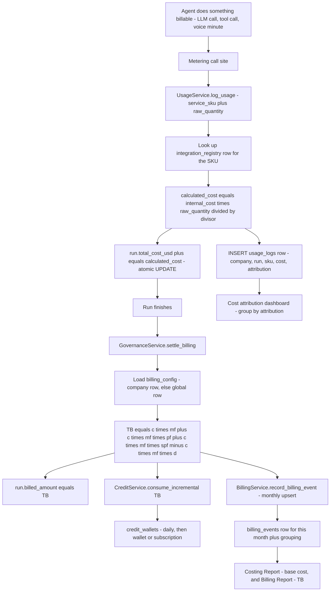

Read that diagram once more with the file names attached:

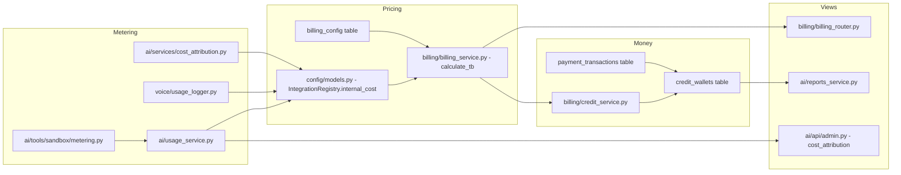

Three sentences you can hold in your head:

1. **Price lives in one table.** `integration_registry.internal_cost` + `cost_unit`, looked up by `service_sku`, per company with a fallback to the platform (`APP`) company.
2. **Cost accrues on the run, billing happens once at the end.** Every metered event bumps `execution_runs.total_cost_usd`; the TB formula and the credit deduction fire once, in `settle_billing`.
3. **Credits are a prepaid balance, not an invoice.** There is no invoice table in the live schema — `billing_events` is the closest thing, and it is a *monthly aggregate*, not a statement.

---

## 2. The billing data model

Five tables in `backend/src/billing/billing_models.py`, plus `usage_logs` (owned by the AI layer) and `integration_registry` (owned by the config layer). Together they are the whole ledger.

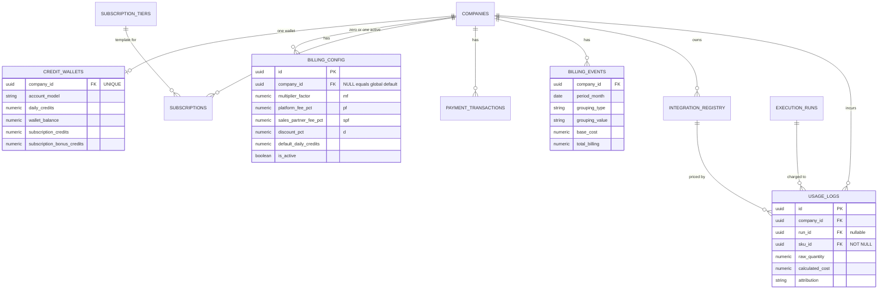

### 2.1 `billing_config`

Configurable pricing knobs. `company_id IS NULL` is the **global default row**; a company-specific row overrides it wholesale. Defined at [billing_models.py:15](../../backend/src/billing/billing_models.py:15).

| Column | Type | Nullable | Default | Meaning |
|---|---|---|---|---|
| `id` | UUID | no | `uuid4` | PK |
| `company_id` | UUID FK→companies | **yes** | — | `NULL` = the global default row |
| `config_name` | String(100) | no | `"default"` | Label only, never read by code |
| `multiplier_factor` | Numeric(10,4) | no | `1.0` | `mf` — markup multiplier on raw cost |
| `platform_fee_pct` | Numeric(10,4) | no | `0.0` | `pf` — fraction, `0.15` means 15% |
| `sales_partner_fee_pct` | Numeric(10,4) | no | `0.0` | `spf` — the partner's cut |
| `discount_pct` | Numeric(10,4) | no | `0.0` | `d` — fraction subtracted |
| `default_daily_credits` | Numeric(10,4) | no | `5.0` (server default) | Free credits injected daily |
| `base_cost_telephony` | Numeric(14,6) | yes | `NULL` | Per-minute override, telephony events only |
| `base_cost_llm` | Numeric(14,6) | yes | `NULL` | ⚠️ Read but **never applied** — see §16 |
| `base_cost_image_gen` | Numeric(14,6) | yes | `NULL` | Per-image override |
| `is_active` | Boolean | no | `true` | Inactive rows are invisible to the lookup |
| `created_at` / `updated_at` | DateTime | no | utcnow | |

The migration that created the table also **seeds the global default** with real numbers, and this is the single most important fact in this document — [g1h2i3j4k5l6:124](../../backend/migrations/versions/g1h2i3j4k5l6_add_assets_billing_credits.py:124):

```sql
-- backend/migrations/versions/g1h2i3j4k5l6_add_assets_billing_credits.py
INSERT INTO billing_config (
  id, company_id, config_name, multiplier_factor,
  platform_fee_pct, sales_partner_fee_pct, discount_pct,
  is_active, created_at, updated_at)
VALUES (gen_random_uuid(), NULL, 'global_default', 1.3, 0.15, 0.10, 0.0, true, now(), now())
```

So out of the box **every tenant pays `1.3 × 1.25 = 1.625×` the raw provider cost.** Work that number through §4 before you believe any pricing spreadsheet.

### 2.2 `credit_wallets`

One row per company, unique on `company_id`. Four money buckets with independent expiry. [billing_models.py:46](../../backend/src/billing/billing_models.py:46).

| Column | Type | Default | Meaning |
|---|---|---|---|
| `company_id` | UUID FK, **unique** | — | The tenant |
| `account_model` | String(30) | `"pay_as_you_go"` | `pay_as_you_go` \| `subscription` |
| `daily_credits` | Numeric(10,4) | `5.0` | Free daily allowance, always consumed first |
| `daily_expires_at` | DateTime | `NULL` | Midnight UTC of the next day |
| `wallet_balance` | Numeric(12,4) | `0.0` | PAYG top-ups |
| `wallet_expires_at` | DateTime | `NULL` | 365 days from the last top-up |
| `subscription_credits` | Numeric(12,4) | `0.0` | Monthly allocation, no carry-forward |
| `subscription_bonus_credits` | Numeric(12,4) | `0.0` | Tier bonus, no carry-forward |
| `sub_credits_expire_at` | DateTime | `NULL` | Last second of the current month |
| `updated_at` | DateTime | now | |

### 2.3 `subscription_tiers`

Global master data (no `company_id`) — the plans an app admin publishes. [billing_models.py:81](../../backend/src/billing/billing_models.py:81).

| Column | Type | Notes |
|---|---|---|
| `id` | UUID | PK |
| `name` | String(50) | e.g. "Growth" |
| `tier_level` | Integer | **Unique** — this, not `id`, is the business key |
| `monthly_fee` | Numeric(10,2) | USD/month |
| `bonus_pct` | Numeric(5,2) | Percent bonus credits, e.g. `30.0` |
| `is_active` | Boolean | Hidden from `GET /credits/subscription-tiers` when false |

⚠️ **This table has no Alembic migration.** Grep the whole `backend/migrations/` tree: nothing creates `subscription_tiers`. It is referenced by the ORM, the router, and [`clean_db.sql`](../../backend/db-scripts/clean_db.sql), but a freshly migrated database will not have it, and `GET /credits/subscription-tiers` will 500. The frontend papers over this with a hard-coded `FALLBACK_PLANS` array — [WalletPage.tsx:43](../../frontend/src/pages/billing/WalletPage.tsx:43).

### 2.4 `subscriptions`

| Column | Type | Default | Notes |
|---|---|---|---|
| `company_id` | UUID FK | — | |
| `plan_tier` | Integer | `1` | Copied from `subscription_tiers.tier_level` |
| `monthly_fee` | Numeric(10,2) | — | Snapshotted at purchase, not re-read from the tier |
| `bonus_pct` | Numeric(5,2) | `20.0` | Snapshotted too |
| `status` | String(20) | `"active"` | See the state diagram below |
| `razorpay_subscription_id` | String(200) | `NULL` | ⚠️ Never populated — see §9 |
| `razorpay_plan_id` | String(200) | `NULL` | ⚠️ Never populated |
| `next_billing_date` | DateTime | `NULL` | Set by the monthly cron |
| `cancelled_at` | DateTime | `NULL` | |

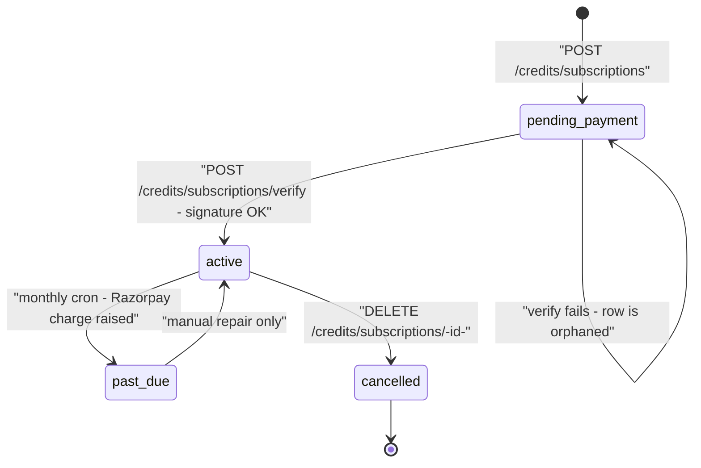

Note that the model docstring lists `active | cancelled | past_due`, but the router writes a fourth value, `pending_payment` — [credits_router.py:373](../../backend/src/billing/credits_router.py:373). The column is a plain `String(20)`, so nothing enforces the enum.

### 2.5 `payment_transactions`

Every Razorpay interaction, successful or not. [billing_models.py:123](../../backend/src/billing/billing_models.py:123).

| Column | Type | Notes |
|---|---|---|
| `company_id` | UUID FK | |
| `razorpay_order_id` | String(200) | Indexed (`idx_payment_transactions_razorpay_order`) — **not unique** |
| `razorpay_payment_id` | String(200) | Filled on verify |
| `razorpay_signature` | String(500) | Filled on verify, stored verbatim |
| `amount` | Numeric(10,2) | USD |
| `currency` | String(10) | Always `"USD"` in code |
| `transaction_type` | String(30) | `topup` \| `subscription_charge` |
| `status` | String(20) | `pending` \| `success` \| `failed` |
| `credits_awarded` | Numeric(12,4) | Set on a successful top-up |
| `transaction_metadata` | JSON | Subscription cron writes `{subscription_id, tier}` |

### 2.6 `billing_events`

The **monthly aggregate**, upserted on every settlement. This is what both money reports read. [billing_models.py:153](../../backend/src/billing/billing_models.py:153).

| Column | Type | Meaning |
|---|---|---|
| `company_id` | UUID FK | |
| `period_month` | Date | Always the 1st of the month |
| `grouping_type` | String(30) | `partner` \| `tenant` \| `user` \| `process` \| `agent` \| `tool` |
| `grouping_value` | String(500) | Free text — entity name, agent UUID, or tool id |
| `base_cost` | Numeric(14,6) | `c`, accumulated |
| `multiplied_cost` | Numeric(14,6) | `c × mf` |
| `platform_fee_amount` | Numeric(14,6) | `c × mf × pf` |
| `partner_fee_amount` | Numeric(14,6) | `c × mf × spf` |
| `discount_amount` | Numeric(14,6) | `c × mf × d` |
| `total_billing` | Numeric(14,6) | TB |
| `telephony_charge` … `api_charge` | Numeric(14,6) ×5 | TB split into the category named by `event_category` |
| `telephony_in_minutes` / `telephony_out_minutes` | Numeric(10,2) | Usage counters |
| `image_gen_count` / `video_gen_count` | Integer | Usage counters |
| `other_ai_cost` | Numeric(14,6) | Free-form accumulator |

The upsert key is the tuple `(company_id, period_month, grouping_type, grouping_value)`. There is **no unique constraint** enforcing it — the code does a `SELECT` then either accumulates or inserts, so two concurrent settlements for the same key can create duplicate rows.

### 2.7 `usage_logs` — the row-level ledger

Defined separately, in [ai/orm/usage.py](../../backend/src/ai/orm/usage.py). This is the only place a *per-event* record exists.

| Column | Type | Nullable | Notes |
|---|---|---|---|
| `id` | UUID | no | |
| `timestamp` | DateTime | yes | Python-side `utcnow` default |
| `company_id` | UUID FK→companies | no | Who pays |
| `run_id` | UUID FK→execution_runs | **yes** | `NULL` for voice sessions and background jobs |
| `sku_id` | UUID FK→integration_registry | **no** | The hard constraint that drops fixed-cost charges (§16) |
| `raw_quantity` | Numeric(18,6) | no | Tokens, characters, minutes, seconds, or `1` |
| `calculated_cost` | Numeric(18,6) | no | Raw cost `c` — never TB |
| `log_metadata` | JSON | yes | Free-form; the debugging goldmine |
| `attribution` | String(40) | no | Server default `"tool"`, indexed |

### 2.8 Which write happens when

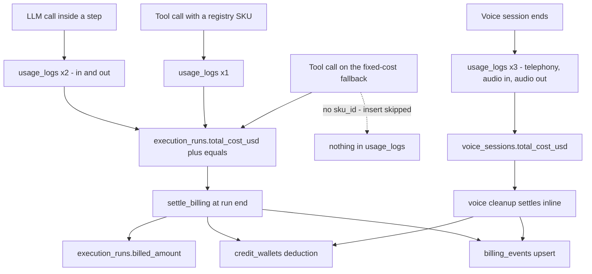

---

## 3. SKUs and rate resolution

### 3.1 What a SKU is

A **SKU** is a row in `integration_registry`. It bundles a price, a unit, and (usually) an encrypted API key for one purchasable thing. [config/models.py:26](../../backend/src/config/models.py:26):

```python
# backend/src/config/models.py
class IntegrationRegistry(Base):
    __tablename__ = "integration_registry"
    __table_args__ = (
        UniqueConstraint('company_id', 'service_sku', name='uq_integration_company_sku'),
    )
    company_id     = Column(UUID(as_uuid=True), ForeignKey("companies.id"), nullable=False)
    provider_name  = Column(String, nullable=False)   # google, anthropic, twilio, serpapi...
    model_name     = Column(String, nullable=True)    # gemini-2.5-flash
    service_sku    = Column(String, nullable=False)   # gemini-2.5-flash-in
    service_category = Column(String, nullable=False, default="LLM")
    component_type = Column(String, nullable=False)   # input_token, minute, image...
    internal_cost  = Column(Numeric(18, 6), nullable=False)
    cost_unit      = Column(String, nullable=False)   # "1M Tokens", "per_minute", "second"...
```

The uniqueness key is `(company_id, service_sku)`, so the same SKU name can exist once per company — that is what makes per-tenant pricing possible.

### 3.2 SKU naming conventions

| Pattern | Used for | Example | Where it is built |
|---|---|---|---|
| `{model_name}-in` | LLM prompt tokens | `gemini-2.5-flash-in` | [step_executor.py:1104](../../backend/src/ai/step_executor.py:1104) |
| `{model_name}-out` | LLM completion tokens | `gemini-2.5-flash-out` | [step_executor.py:1105](../../backend/src/ai/step_executor.py:1105) |
| `{embedding_model}-in` | Embeddings (input only) | `gemini-embedding-001-in` | [embedding_service.py:356](../../backend/src/ai/memory/embedding_service.py:356) |
| `unknown-in` / `unknown-out` | LLM response with no `model_name` | — | [step_executor.py:1104](../../backend/src/ai/step_executor.py:1104) |
| Literal name | Everything else | `serp-api-key`, `sandbox-runtime`, `razorpay_keys` | Hard-coded maps |

The `-in` / `-out` convention means **one model needs two registry rows**. If you register only `gemini-2.5-flash-in`, output tokens are silently free and you get a `No registry entry for SKU 'gemini-2.5-flash-out'` warning in the log.

### 3.3 The lookup: company first, platform second

Cost-bearing services live on the `APP` company. Every tenant falls back to them. [usage_service.py:30](../../backend/src/ai/usage_service.py:30):

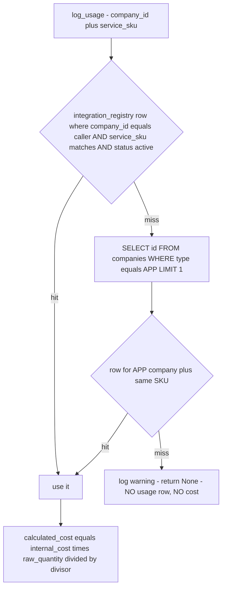

The voice logger has a **longer** chain because some voice SKUs are keyed by `model_name` rather than `service_sku` — [voice/usage_logger.py:258](../../backend/src/voice/usage_logger.py:258):

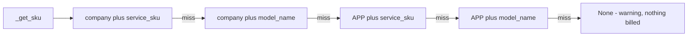

The tool path is different again: `ToolCostResolver` and the inline copies in `step_executor` query **only the caller's company**, with no APP fallback, and additionally accept any row whose `service_category == "CUSTOM_API"` — [tool_cost_resolver.py:170](../../backend/src/ai/governance/tool_cost_resolver.py:170).

### 3.4 Cost units and divisors

`UsageService` normalises `raw_quantity` by inspecting `cost_unit` as a **lower-cased substring match** — [usage_service.py:89](../../backend/src/ai/usage_service.py:89):

```python
# backend/src/ai/usage_service.py
divisor = Decimal("1.0")
if registry_entry.cost_unit:
    unit_lower = registry_entry.cost_unit.lower()
    if "1m token" in unit_lower or "per_million" in unit_lower or "million" in unit_lower:
        divisor = Decimal("1000000.0")
    elif "1k token" in unit_lower:
        divisor = Decimal("1000.0")
    elif "1000 char" in unit_lower:
        divisor = Decimal("1000.0")

calculated_cost = (registry_entry.internal_cost * Decimal(str(raw_quantity))) / divisor
```

| `cost_unit` string (case-insensitive substring) | Divisor | `raw_quantity` is | Typical SKU |
|---|---|---|---|
| `1M Tokens`, `per_million`, anything containing `million` | 1,000,000 | tokens or characters | `{model}-in`, `{model}-out` |
| `1K Tokens` | 1,000 | tokens | small-volume models |
| `1000 chars` | 1,000 | characters | character-priced TTS |
| `second` | 1 | seconds | `sandbox-runtime` |
| `per_minute`, `per minute` | 1 | minutes (already ceilinged) | telephony |
| `per_call`, `flat_fee`, or anything unmatched | 1 | `1.0` | `serp-api-key`, `firecrawl-api` |

⚠️ Two traps. First, **`per_minute` is not special-cased in `UsageService`** — it only works because the caller (`VoiceUsageLogger`) has already converted seconds to whole minutes and looks at `cost_unit` itself. Second, the divisor logic is not reused by the tool path: `ToolCostResolver` and `step_executor` take `internal_cost` **as-is** and ignore `cost_unit` entirely, so a tool SKU priced "per 1M calls" would be charged a million times over.

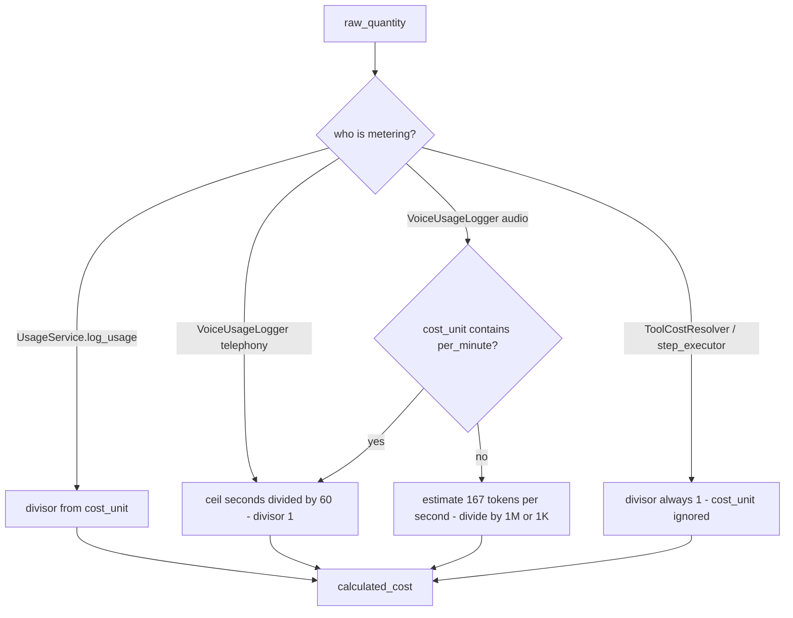

---

## 4. The TB formula, with worked examples

### 4.1 The formula as implemented

```
TB = (c × mf) + (c × mf × pf) + (c × mf × spf) − (c × mf × d)
```

| Symbol | Column | Meaning |
|---|---|---|
| `c` | the raw cost — `run.total_cost_usd` or a per-event `calculated_cost` | What the platform paid the provider |
| `mf` | `billing_config.multiplier_factor` | Markup multiplier. `1.0` = at cost |
| `pf` | `billing_config.platform_fee_pct` | Platform fee as a **fraction** of the marked-up cost |
| `spf` | `billing_config.sales_partner_fee_pct` | Partner fee, same basis |
| `d` | `billing_config.discount_pct` | Discount, same basis |

Note carefully: `pf`, `spf` and `d` are all applied to `c × mf`, **not** to `c`. Algebraically the whole thing collapses to a single factor:

```
TB = c × mf × (1 + pf + spf − d)
```

The implementation, verbatim — [billing_service.py:24](../../backend/src/billing/billing_service.py:24):

```python
# backend/src/billing/billing_service.py
def calculate_tb(c: Decimal, mf: Decimal, pf: Decimal, spf: Decimal, d: Decimal) -> dict:
    multiplied   = c * mf
    platform_fee = multiplied * pf
    partner_fee  = multiplied * spf
    discount     = multiplied * d
    total        = multiplied + platform_fee + partner_fee - discount
    return {
        "base_cost": c,
        "multiplied_cost": multiplied,
        "platform_fee_amount": platform_fee,
        "partner_fee_amount": partner_fee,
        "discount_amount": discount,
        "total_billing": total,
    }
```

Config resolution is company-first, global-fallback, **no-config-means-identity** — [billing_service.py:73](../../backend/src/billing/billing_service.py:73):

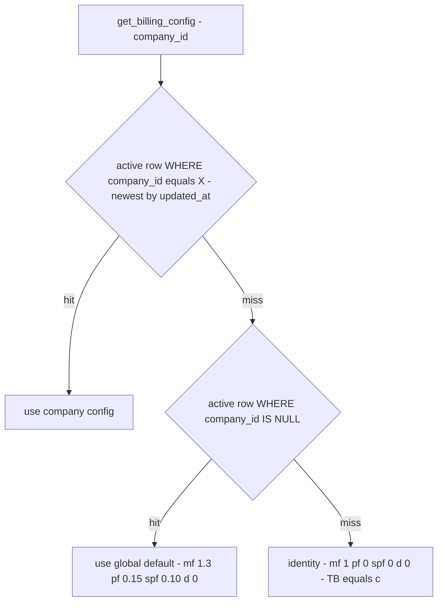

With the seeded global default the effective factor is:

```
mf × (1 + pf + spf − d) = 1.3 × (1 + 0.15 + 0.10 − 0) = 1.3 × 1.25 = 1.625
```

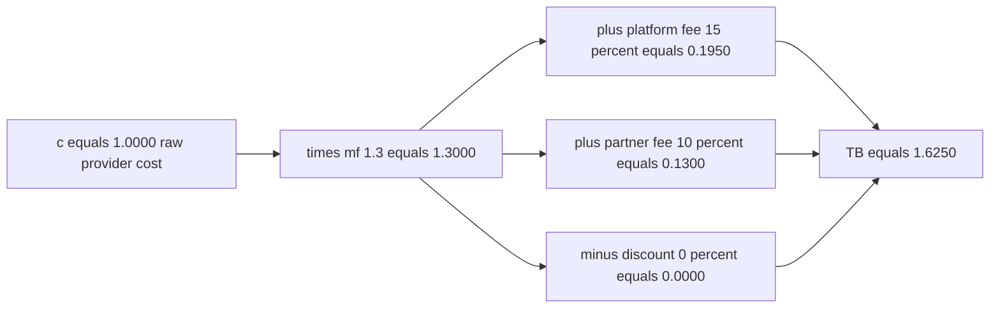

### 4.2 Worked example 1 — one LLM step

**Setup.** A tenant with no company-specific `billing_config` (so the global default applies). Registry rows on the `APP` company:

| `service_sku` | `internal_cost` | `cost_unit` |
|---|---|---|
| `gemini-2.5-flash-in` | `0.300000` | `1M Tokens` |
| `gemini-2.5-flash-out` | `2.500000` | `1M Tokens` |

*(Prices are illustrative — the repo ships no seed data for LLM SKUs. Substitute your own `internal_cost` values.)*

**A step runs** and the `LLMResponse` reports `prompt_tokens = 12_000`, `completion_tokens = 800`.

`StepExecutorService._log_usage` builds two SKUs and calls `UsageService.log_usage` twice — [step_executor.py:1103](../../backend/src/ai/step_executor.py:1103):

| Step | Computation | Result |
|---|---|---|
| Input row | `0.300000 × 12000 / 1_000_000` | `calculated_cost = 0.003600` |
| Output row | `2.500000 × 800 / 1_000_000` | `calculated_cost = 0.002000` |
| `run.total_cost_usd` | `+= 0.003600 + 0.002000` | **`c = 0.005600`** |

**At the end of the run**, `settle_billing` fires:

| Term | Computation | Value |
|---|---|---|
| `multiplied_cost` | `0.005600 × 1.3` | `0.00728000` |
| `platform_fee_amount` | `0.00728 × 0.15` | `0.00109200` |
| `partner_fee_amount` | `0.00728 × 0.10` | `0.00072800` |
| `discount_amount` | `0.00728 × 0.0` | `0.00000000` |
| **`total_billing` (TB)** | sum | **`0.00910000`** |

`run.billed_amount = 0.00910`. `consume_incremental(0.00910)` takes it from `daily_credits`, leaving `5.0000 − 0.0091 = 4.9909`. A `billing_events` row for this month, `grouping_type="process"`, accumulates `base_cost += 0.0056`, `total_billing += 0.0091`, `api_charge += 0.0091` (see §16 — LLM spend lands in the **API** column, not the LLM column).

### 4.3 Worked example 2 — a voice minute

**Setup.** A 125-second outbound Tata Tele call. Registry rows (again illustrative):

| `service_sku` | `internal_cost` | `cost_unit` |
|---|---|---|
| `tata-tele-voice-in-out` | `0.008000` | `per_minute` |
| `gemini-3.1-flash-live-preview-in` | `3.000000` | `1M Tokens` |
| `gemini-3.1-flash-live-preview-out` | `12.000000` | `1M Tokens` |

`VoiceUsageLogger.log_voice_session_usage` defaults both audio directions to the full call duration — [usage_logger.py:80](../../backend/src/voice/usage_logger.py:80) — then logs three rows:

| Component | Computation | Cost |
|---|---|---|
| Telephony | `ceil(125/60) = 3` min × `0.008` | `0.024000` |
| Audio in | `167 tok/s × 125 s = 20,875` tokens; `3.0 × 20875 / 1e6` | `0.062625` |
| Audio out | same 20,875 tokens; `12.0 × 20875 / 1e6` | `0.250500` |
| **`voice_sessions.total_cost_usd`** | | **`c = 0.337125`** |

The 167 tokens-per-second constant is hard-coded — [usage_logger.py:226](../../backend/src/voice/usage_logger.py:226).

**Settlement happens inline in the WebSocket cleanup**, not through `GovernanceService` — [voice/websocket_handler.py:1428](../../backend/src/voice/websocket_handler.py:1428):

| Term | Computation | Value |
|---|---|---|
| `multiplied_cost` | `0.337125 × 1.3` | `0.43826250` |
| `platform_fee_amount` | `× 0.15` | `0.06573938` |
| `partner_fee_amount` | `× 0.10` | `0.04382625` |
| **TB** | sum | **`0.54782813`** |

Then `CreditService.consume(0.54782813)` — note this is `consume`, which **raises** `InsufficientCreditsError` when the balance is short, unlike a run's `consume_incremental`, which drains the wallet to zero and reports a shortfall.

Finally a billing event with `event_category="telephony"` and `telephony_out_minutes = 125/60 = 2.0833`. ⚠️ Two inconsistencies fall out of this: the billing event records **2.08 minutes** while the usage log billed **3 minutes**, and if `base_cost_telephony` is configured the event's `base_cost` is *replaced* by `base_cost_telephony × 2.0833`, throwing away the `0.313` of LLM audio cost — [billing_service.py:124](../../backend/src/billing/billing_service.py:124).

### 4.4 Worked example 3 — a document generation

**Setup.** An agent step calls the `pdf_generator` tool. Resolution walks `TOOL_SKU_MAP["pdf_generator"] = ["pdf-generator"]` — [tool_cost_resolver.py:40](../../backend/src/ai/governance/tool_cost_resolver.py:40).

**Case A — the SKU exists** with `internal_cost = 0.010000`, `cost_unit = per_call`:

| Term | Computation | Value |
|---|---|---|
| `c` | `internal_cost` taken as-is (`cost_unit` ignored on this path) | `0.010000` |
| `run.total_cost_usd` | `+= 0.010000` | |
| `usage_logs` row | `raw_quantity = 1`, `calculated_cost = 0.010000` | written |
| TB at settlement | `0.010000 × 1.625` | **`0.01625000`** |

**Case B — the SKU does not exist.** `pdf_generator` is *not* in `TOOL_FIXED_COST`, so:

```
logger.warning("No cost entry found for tool 'pdf_generator' — cost not tracked")
```

`c = 0`, TB = 0, nothing is charged and nothing is logged. Document generation is **free until you seed the SKU**. The `$0.01` figure in the old rates document is a *planner estimate* (`TOOL_BASELINE_COST`), not a charge.

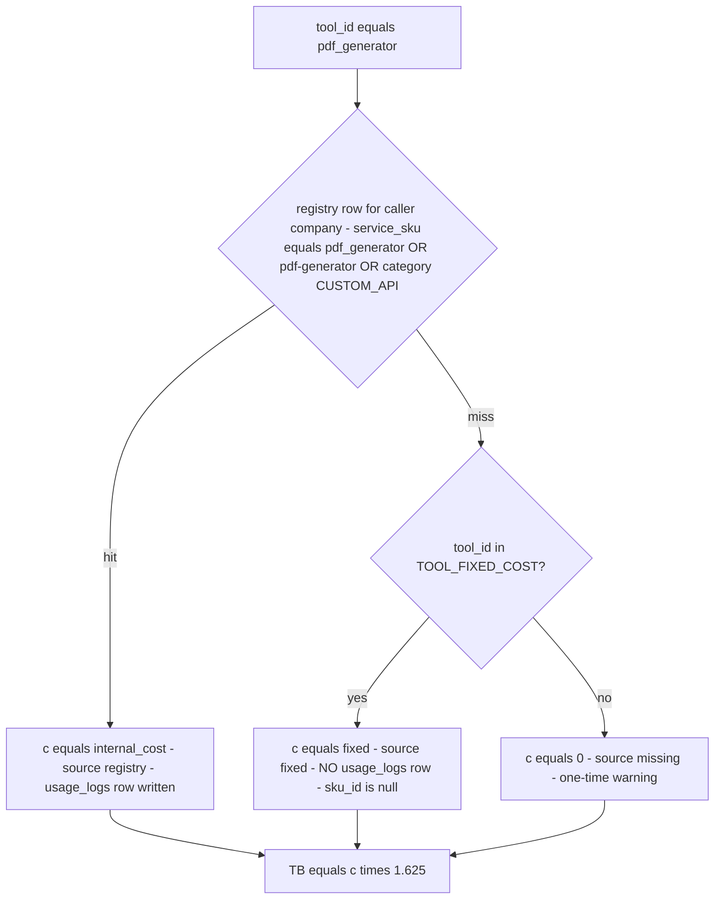

---

## 5. Cost attribution

### 5.1 The tag

Every `usage_logs` row carries an `attribution` string so the dashboard can answer "how much of this run was the critic pipeline?". The whitelist is a closed enum — [cost_attribution.py:29](../../backend/src/ai/services/cost_attribution.py:29):

| Tag | Meaning | Emitted in production? | Where |
|---|---|---|---|
| `planner` | Plan generation and plan judging | ✅ | [plan_generator.py:270](../../backend/src/ai/planning/plan_generator.py:270), [plan_judge.py:109](../../backend/src/ai/planning/plan_judge.py:109), [planner_service.py:553](../../backend/src/ai/planning/planner_service.py:553) |
| `critic_pre` | Pre-execution critic | ✅ | [critic_pipeline.py:316](../../backend/src/ai/planning/critic_pipeline.py:316) |
| `critic_post` | Post-execution critic | ✅ | [critic_pipeline.py:382](../../backend/src/ai/planning/critic_pipeline.py:382) |
| `critic_super` | Supervisor critic | ✅ | [critic_pipeline.py:483](../../backend/src/ai/planning/critic_pipeline.py:483) |
| `critic_align` | Goal-alignment critic | ✅ | [goal_alignment.py:124](../../backend/src/ai/planning/goal_alignment.py:124) |
| `meta_spec_critic` | Meta spec critic tool | ✅ | [spec_critic.py:240](../../backend/src/ai/tools/meta/spec_critic.py:240) |
| `embedding` | Embedding generation | ✅ | [embedding_service.py:368](../../backend/src/ai/memory/embedding_service.py:368) |
| `sandbox` | Sandbox runtime seconds | ✅ | [metering.py:62](../../backend/src/ai/tools/sandbox/metering.py:62) |
| `mcp` | MCP tool calls | ✅ | [mcp/adapter.py:132](../../backend/src/ai/tools/mcp/adapter.py:132) |
| `tool` | Everything else — the **server default** | ✅ | default column value |
| `actor_step` | Intended for step LLM calls | ❌ never written | — |
| `reformat_retry` | Intended for the reformat path | ❌ never written | — |
| `meta_review` | | ❌ never written | — |
| `dreaming` | | ❌ never written | — |
| `child_run` | | ❌ never written | — |
| `test_driver` | | ❌ never written | — |

Six of the sixteen tags are dead. In particular `actor_step` is never used, because `StepExecutorService._log_usage` calls `log_usage` **without** an `attribution` argument, so all step LLM spend — the bulk of most runs — is recorded as `tool`.

### 5.2 The two write paths

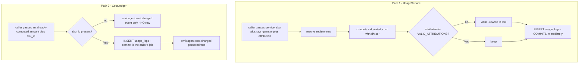

`CostLedger.add` refuses to insert without a `sku_id`, because the column is `NOT NULL`. It emits a telemetry event instead and returns `None` — [cost_attribution.py:101](../../backend/src/ai/services/cost_attribution.py:101):

```python
# backend/src/ai/services/cost_attribution.py
if sku_id is None:
    logger.info(
        "CostLedger.add: skipping SQL insert (no sku_id) for "
        "attribution=%s amount=%s", attribution, amount,
    )
    ...
    return None
```

The shared helper every non-tool LLM call site uses is `log_llm_response_usage` — it swallows all errors so a billing hiccup never breaks the pipeline — [attributed_usage.py:22](../../backend/src/ai/services/attributed_usage.py:22).

### 5.3 What the dashboard does with it

Two endpoints, one SQL shape. Per run — [admin.py:193](../../backend/src/ai/api/admin.py:193):

```sql
-- backend/src/ai/api/admin.py
SELECT attribution,
       COALESCE(SUM(calculated_cost), 0) AS cost_usd,
       COUNT(*) AS charges
FROM usage_logs
WHERE run_id = :run_id
GROUP BY attribution
ORDER BY cost_usd DESC
```

Per company over a window — [admin.py:526](../../backend/src/ai/api/admin.py:526) — same query with `WHERE company_id = :company_id AND timestamp >= :since`, where `since` is a `7d` / `24h` / `2w` string parsed by `_parse_since`.

The UI is a horizontal bar chart with a fixed colour per tag and a 24h/7d/30d window toggle — [CostAttributionDashboard.tsx](../../frontend/src/pages/admin/CostAttributionDashboard.tsx). It sums `cost_usd` client-side to compute the percentage split.

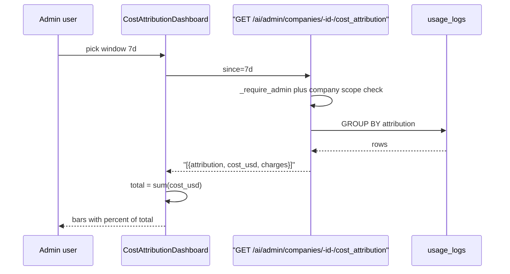

⚠️ The dashboard shows **raw cost `c`**, not TB. It will never reconcile with the wallet.

---

## 6. Per-primitive billing

One row per billable thing. "Metered" means a `usage_logs` row and/or a `run.total_cost_usd` bump actually happens in code today.

| Primitive | SKU | Unit | Metered where | Status |
|---|---|---|---|---|
| LLM input tokens | `{model}-in` | per 1M tokens | [step_executor.py:1110](../../backend/src/ai/step_executor.py:1110) | ✅ full |
| LLM output tokens | `{model}-out` | per 1M tokens | [step_executor.py:1117](../../backend/src/ai/step_executor.py:1117) | ✅ full |
| Thinking / reasoning tokens | same `-in`/`-out` | per 1M tokens | same | ✅ no separate SKU |
| Planner / critic LLM | `{model}-in` / `-out` | per 1M tokens | [attributed_usage.py:42](../../backend/src/ai/services/attributed_usage.py:42) | ✅ attributed |
| Debate executor LLM | `{model}-in` / `-out` | per 1M tokens | [debate.py:262](../../backend/src/ai/core/executors/debate.py:262) | ✅ unattributed → `tool` |
| CORTEX summarisation LLM | `{model}-in` / `-out` | per 1M tokens | [cortex_bridge.py:241](../../backend/src/ai/memory/cortex_bridge.py:241) | ✅ unattributed → `tool` |
| Embeddings | `{embedding_model}-in` | per 1M **characters** | [embedding_service.py:353](../../backend/src/ai/memory/embedding_service.py:353) | ✅ `embedding` tag |
| Image generation | `imagen-4.0-generate-001`, else fixed `$0.04` | per image | [tool_cost_resolver.py:52](../../backend/src/ai/governance/tool_cost_resolver.py:52) + [image_generation.py:372](../../backend/src/ai/tools/media/image_generation.py:372) | ⚠️ double-charged, see below |
| Video generation | fixed `$0.05` (`video_generate`, `video_generation`) | per call | [tool_cost_resolver.py:52](../../backend/src/ai/governance/tool_cost_resolver.py:52) | ⚠️ no `usage_logs` row |
| Video edit / add sound | none | — | bills through the sandbox SKU | ✅ indirect |
| Telephony minutes | `tata-tele-voice-in-out`, `in-out` | per minute, ceilinged | [usage_logger.py:148](../../backend/src/voice/usage_logger.py:148) | ✅ full |
| Voice LLM audio | `gemini-3.1-flash-live-preview-in` / `-out` | per 1M tokens @ 167 tok/s, or per minute | [usage_logger.py:191](../../backend/src/voice/usage_logger.py:191) | ✅ full |
| Web search | `serp-api-key` | per call | tool cost lookup | ⚠️ registry-only |
| Batch web search | `serp-api-key` | per call | tool cost lookup | ⚠️ registry-only |
| Web scraping | `firecrawl-api` / `firecrawl` | per call | tool cost lookup | ⚠️ registry-only |
| Headless browser | `headless-browser` | per call | tool cost lookup + sandbox seconds | ⚠️ registry-only |
| Sandbox execution | `sandbox-runtime` (`SANDBOX_COST_SKU`) | per second | [metering.py:52](../../backend/src/ai/tools/sandbox/metering.py:52) | ✅ `sandbox` tag |
| Document generation — PDF | `pdf-generator` | per call | tool cost lookup | ⚠️ registry-only |
| Document generation — DOCX / PPTX / XLSX | **none** | — | — | ❌ **not metered** |
| Email ingest / classify / draft | **none** | — | — | ❌ **not metered** |
| MCP tool calls | binding's `cost_per_call_usd` | per call | [mcp/adapter.py:113](../../backend/src/ai/tools/mcp/adapter.py:113) | ✅ `mcp` tag |
| Payments (Razorpay) | `razorpay_keys` | — | credentials only | ❌ not a cost SKU |

"⚠️ registry-only" means: the tool is charged **only** if you seed a matching `integration_registry` row for that specific company. There is no APP-company fallback on the tool path and no fixed-cost default, so an unseeded tenant runs these tools for free.

### 6.1 Drift versus `billing_rates_by_primitive.md`

The older document lists prices for things that are not actually metered. Concretely:

| Claim in the old doc | Reality |
|---|---|
| `docx_tool` $0.01, `pptx_tool` $0.01, `excel` $0.005, `xlsx_engine` $0.01 | These are `TOOL_BASELINE_COST` **planner estimates**, not charges. No SKU, no `TOOL_FIXED_COST` entry, no `usage_logs` row. |
| `email_ingest` $0.001, `email_classify` $0.002, `email_draft` $0.01 | Same — estimator baselines only. Email is never billed. |
| `calculator` $0.001, `file_writer` $0.001 | Same. |
| "Unknown / unregistered tool $0.01 fallback" | The `$0.01` is `_DEFAULT_TOOL_COST` in the **estimator**. The *charging* fallback is `$0.00` with a warning. |
| CORTEX `READ`/`NAVIGATE`/`WRITE` $0.001 | Estimator only. |
| `smtp-system` listed as a SKU | Credentials only; nothing bills against it. |
| Model price factors (Flash 1.0×, Opus 8.0× …) | Real, but they live in [cost_estimator.py:51](../../backend/src/ai/planning/cost_estimator.py:51) and drive *plan budgeting*, never a charge. |

The estimator table is genuinely useful, but it belongs to planning, not billing — see [07 — Planning & critics](07-planning-and-critics.md). It is used to answer "will this plan fit in the budget?" before the plan runs.

### 6.2 Image generation is charged twice

`image_generation` has two independent charge paths that both fire:

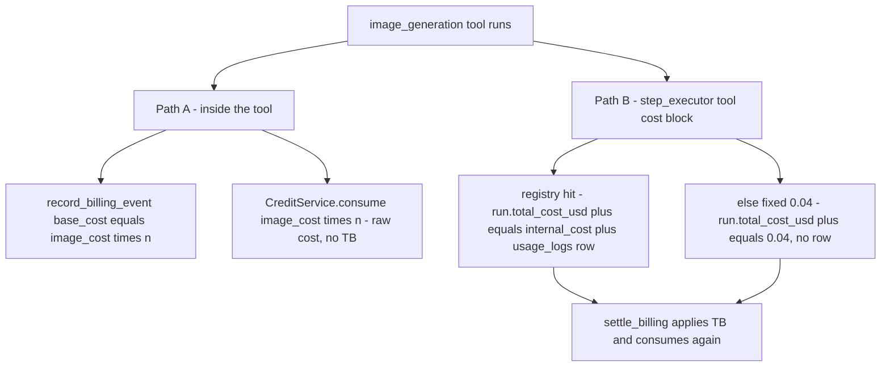

Path A is in the tool itself — [image_generation.py:372](../../backend/src/ai/tools/media/image_generation.py:372) — and calls `CreditService.consume` with the **raw** cost, bypassing TB. Path B is the generic tool-cost block in the step executor, which feeds the normal end-of-run settlement. A tenant generating one image is therefore debited roughly `c + 1.625c`.

---

## 7. The credit system

### 7.1 Buckets and priority

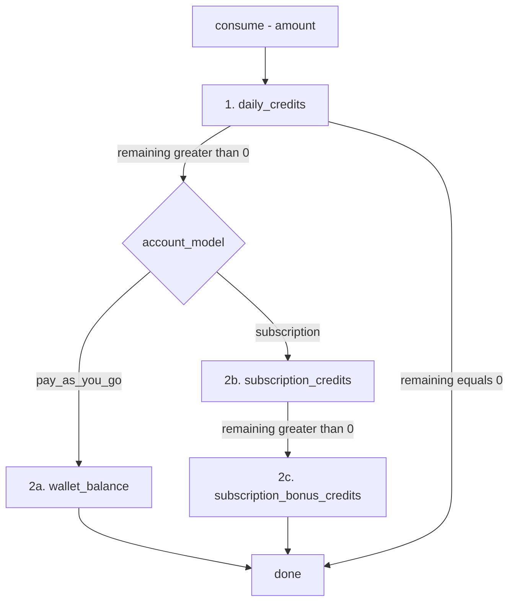

| Priority | Bucket | Source | Expiry | Carry forward |
|---|---|---|---|---|
| 1 | `daily_credits` | `billing_config.default_daily_credits` (default `5.0`) | midnight UTC next day | never |
| 2a | `wallet_balance` | Razorpay top-up | 365 days from the last top-up | yes, within validity |
| 2b | `subscription_credits` | monthly cron = the tier's `monthly_fee` | last second of the month | never |
| 2c | `subscription_bonus_credits` | `monthly_fee × bonus_pct / 100` | last second of the month | never |

Crucially, **`account_model` decides which of 2a/2b is even considered** — the branch is `if` / `elif`, so a subscription account cannot spend its `wallet_balance` at all, and a PAYG account cannot spend leftover subscription credits — [credit_service.py:161](../../backend/src/billing/credit_service.py:161).

### 7.2 Balance computation and self-healing

`get_balance` is not a plain read — it repairs the wallet as a side effect — [credit_service.py:78](../../backend/src/billing/credit_service.py:78):

```python
# backend/src/billing/credit_service.py
wallet = await self.get_or_create_wallet(company_id)
now = datetime.utcnow()

# Auto-renew expired daily credits in place (no cron needed).
if wallet.daily_expires_at is None or wallet.daily_expires_at < now:
    wallet = await self.flush_and_inject_daily_credits(company_id)

daily = Decimal(str(wallet.daily_credits))

wallet_bal = Decimal(str(wallet.wallet_balance))
if wallet.wallet_expires_at and wallet.wallet_expires_at < now:
    wallet_bal = Decimal("0")
```

Two consequences worth knowing:

- The **daily cron is an optimisation, not a requirement.** Any balance read refreshes stale daily credits. If the cron never runs, credits still appear the first time someone looks.
- Expired `wallet_balance` and subscription credits are **zeroed in the returned dict but not in the row** by `get_balance`. `consume` and `consume_incremental` do zero the row.

### 7.3 `consume` vs `consume_incremental`

| | `consume` | `consume_incremental` |
|---|---|---|
| Behaviour when short | raises `InsufficientCreditsError`, **deducts nothing** | deducts everything available, wallet lands at `$0` |
| Return value | `{daily, wallet, subscription}` | same, plus `shortfall` and `exhausted` |
| Used by | voice settlement, image generation | run settlement (`settle_billing`), per-step deduction |
| Defined at | [credit_service.py:119](../../backend/src/billing/credit_service.py:119) | [credit_service.py:304](../../backend/src/billing/credit_service.py:304) |

The rationale in the docstring: *"this does NOT raise when the amount exceeds the balance — it deducts as much as possible, so the wallet goes to $0 rather than allowing the balance to stay untouched while costs pile up."*

### 7.4 There are no holds or reservations

Despite the phrasing in older design documents: **the code has no reservation, hold, escrow, or two-phase-commit mechanism.** Nothing is locked before a run. The three approximations are:

1. `check_sufficient_for_execution` — a *threshold* check, not a hold (§8).
2. `get_effective_balance(company_id, accumulated_cost)` — `total_available − accumulated_cost`, computed on the fly, persisted nowhere.
3. The in-memory `Budget` object on the agent loop, which caps a run but never touches the wallet — [ai/core/budget.py](../../backend/src/ai/core/budget.py).

A tenant can therefore overspend within a single run: cost accrues on `run.total_cost_usd` and the wallet is only debited at the end.

### 7.5 A credit transaction, end to end

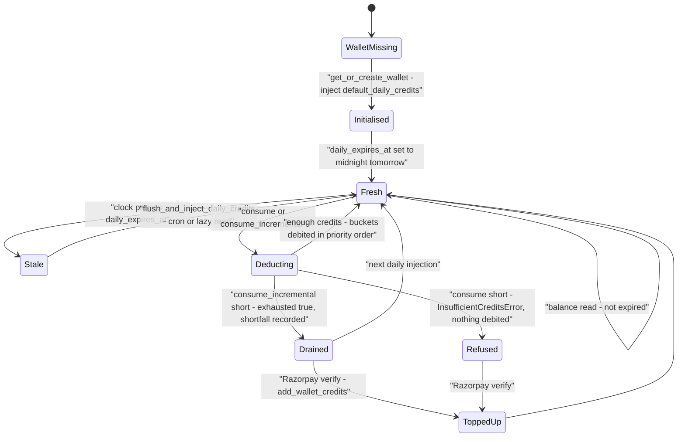

### 7.6 Top-up mechanics

`add_wallet_credits` credits `wallet_balance` and **resets** the expiry to 365 days from now — [credit_service.py:189](../../backend/src/billing/credit_service.py:189). Every top-up therefore extends the validity of the *whole* balance, not just the new money.

`inject_subscription_credits` **replaces** rather than adds — [credit_service.py:204](../../backend/src/billing/credit_service.py:204):

```python
# backend/src/billing/credit_service.py
bonus = base_amount * (bonus_pct / Decimal("100"))
# Flush old credits — strict no carry-forward
wallet.subscription_credits = base_amount
wallet.subscription_bonus_credits = bonus
wallet.account_model = "subscription"
last_day = calendar.monthrange(now.year, now.month)[1]
wallet.sub_credits_expire_at = datetime(now.year, now.month, last_day, 23, 59, 59)
```

Note the credit grant equals the **monthly fee in dollars**, one-for-one, plus the bonus percentage. A $79 Tier-2 plan grants `79 + 23.70 = $102.70` of credits.

---

## 8. Pre-execution cost gating

### 8.1 The threshold table

Execution is refused outright when the balance is below a per-entity-type floor — [credit_service.py:26](../../backend/src/billing/credit_service.py:26):

```python
# backend/src/billing/credit_service.py
MINIMUM_EXECUTION_THRESHOLDS = {
    "PROCESS": Decimal("0.50"),   # Deep Research etc. — typically costs $0.50–$2.00
    "AGENT":   Decimal("0.05"),   # Single-agent runs
    "SKILL":   Decimal("0.02"),   # Lightweight skill invocations
    "ACTION":  Decimal("0.01"),   # Atomic actions
}
DEFAULT_MINIMUM_THRESHOLD = Decimal("0.05")
```

This is a **floor test, not an estimate test.** It does not consult the planner's `estimate_plan_cost`. A tenant with `$0.06` may start an `AGENT` run that will cost `$4`.

### 8.2 Where the gate actually fires

| Call site | Entity type | Behaviour on failure |
|---|---|---|
| Voice call setup — [websocket_handler.py:238](../../backend/src/voice/websocket_handler.py:238) | `AGENT` | Outbound calls blocked; **inbound calls proceed** with a warning so users do not miss calls |
| Campaign start — [campaign_executor.py:139](../../backend/src/ai/campaign_executor.py:139) | `AGENT` | Campaign → `failed`, all pending calls → `failed` / `insufficient_credits` |
| Per campaign call — [campaign_executor.py:378](../../backend/src/ai/campaign_executor.py:378) | `AGENT` | That one call → `failed` / `insufficient_credits`, campaign continues |
| Child entity spawn — [step_executor.py:236](../../backend/src/ai/step_executor.py:236) | via `check_child_credit_gate` | Raises, aborting the spawn |

⚠️ **`GovernanceService.check_credit_gate` has no production caller.** Grep it: the only references are its own definition and `tests/unit/test_governance_service.py`. The same is true of `consume_step_cost`, `check_credit_circuit_breaker`, and `CreditService.require_credits`. There is consequently **no pre-execution credit gate on a normal agent run started through the API** — only voice, campaigns and child spawns are gated.

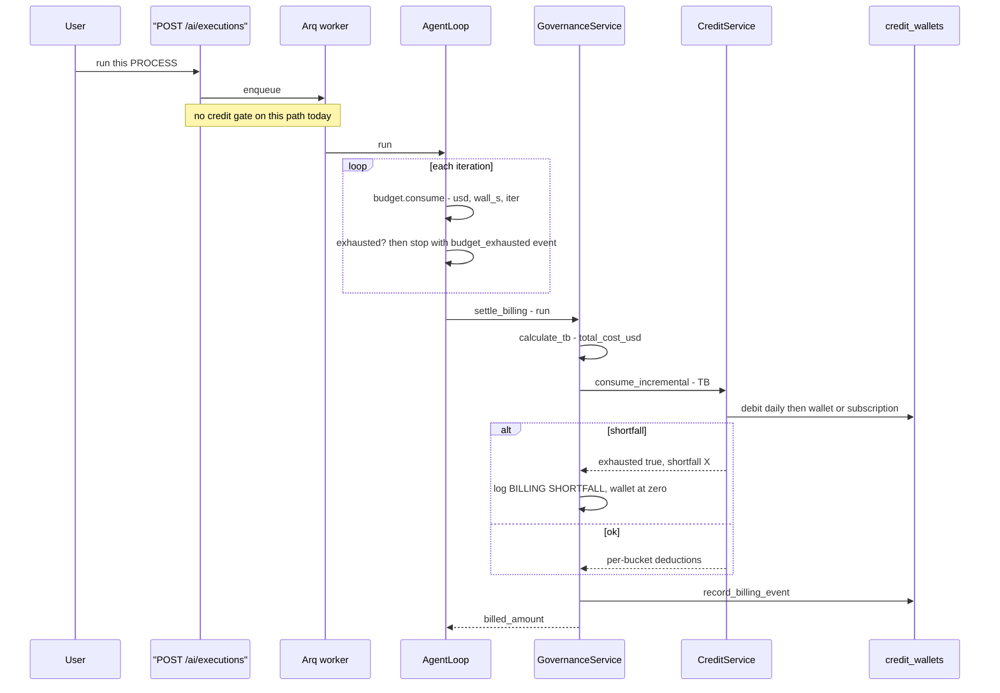

### 8.3 The in-run guardrail that does work: `Budget`

The agent loop's real spend control is the typed `Budget`, not the wallet — [ai/core/budget.py:56](../../backend/src/ai/core/budget.py:56). Four independent axes; any one hitting 100% ends the run.

| Axis | Default when governance is silent | Source |
|---|---|---|
| `usd_max` | `100` | `entity.governance.max_cost_usd` |
| `tokens_max` | `2_000_000` | fixed |
| `wall_max_s` | `7200` | `governance.timeout_ms / 1000` |
| `iters_max` | `100` | `max_iters` |

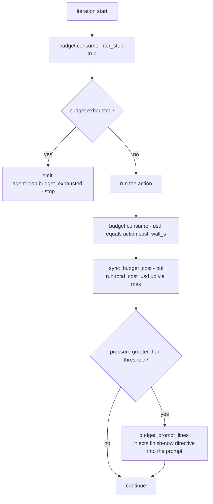

Because `Budget.usd_max` defaults to `$100` and the credit floor for a `PROCESS` is `$0.50`, a misconfigured entity can burn far more than the tenant's balance before settlement notices. The shortfall is then logged and the wallet is zeroed:

```python
# backend/src/ai/governance/governance_service.py
if settlement["exhausted"]:
    logger.warning(
        f"BILLING SHORTFALL for run {run.id}: "
        f"billed=${billed_amount}, shortfall=${settlement['shortfall']:.4f}. "
        f"Wallet drained to $0. Deducted: {settlement}"
    )
```

### 8.4 What the user sees

| Situation | Surface | Message |
|---|---|---|
| Balance below threshold, voice outbound | call setup aborts | `Cannot start execution: credit balance $X is below the minimum $Y required for entity type 'AGENT'. Please top up your wallet or wait for daily credit refresh.` |
| Balance below threshold, campaign | `campaign_calls.outcome = "insufficient_credits"` | the same string in `outcome_notes` |
| Child spawn refused | run fails | `Cannot spawn child entity {id}: parent run has accumulated $X cost with no remaining credits.` |
| `require_credits` HTTP helper (unused) | would be HTTP `402` | `Insufficient credits. Required: $X, Available: $Y.` |
| Wallet page | `WalletPage.tsx` bucket bars | each bucket's dollar amount, percentage bar capped at `$50`, and expiry date |

---

## 9. Payments — Razorpay

### 9.1 Credentials

Razorpay keys are **not** environment variables. They live in `integration_registry` under `service_sku = 'razorpay_keys'`, in the `service_metadata` JSON as `{"key_id": ..., "key_secret": ...}` — [credits_router.py:29](../../backend/src/billing/credits_router.py:29). Missing keys produce a `503` with a message telling you exactly what to add.

### 9.2 Top-up flow

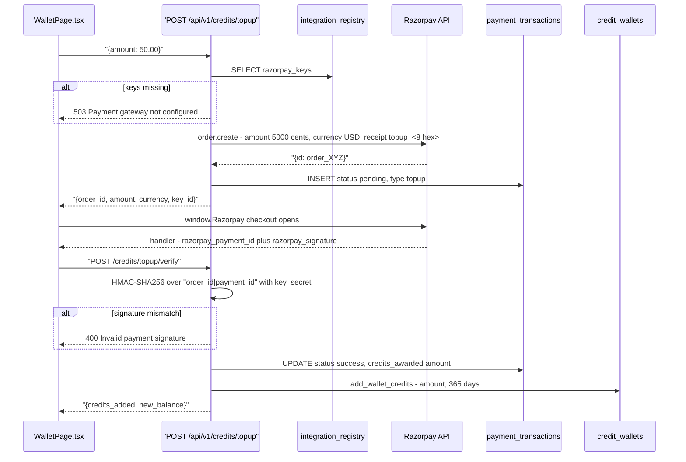

The signature check is a textbook constant-time comparison — [credits_router.py:157](../../backend/src/billing/credits_router.py:157):

```python
# backend/src/billing/credits_router.py
body = f"{payload.razorpay_order_id}|{payload.razorpay_payment_id}"
expected_sig = hmac.new(
    creds["key_secret"].encode("utf-8"),
    body.encode("utf-8"),
    hashlib.sha256,
).hexdigest()

if not hmac.compare_digest(expected_sig, payload.razorpay_signature):
    raise HTTPException(status_code=400, detail="Invalid payment signature")
```

### 9.3 Subscription flow

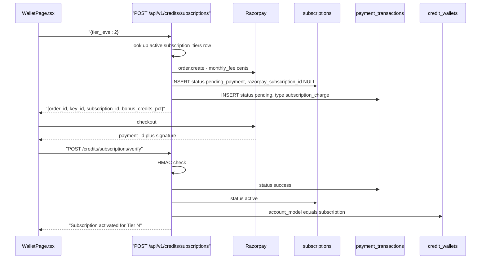

⚠️ Notice what is **missing**: `verify_subscription` flips `account_model` to `subscription` but **never calls `inject_subscription_credits`**. The tenant pays and gets zero credits until the monthly cron runs. Worse, flipping `account_model` immediately makes their existing `wallet_balance` unspendable (§7.1). A first-month subscriber is effectively locked out of their own money.

### 9.4 Idempotency and failure handling — the honest assessment

| Property | Status |
|---|---|
| Webhook endpoint | ❌ **None exists.** Verification is a client-initiated callback from the browser, not a server-to-server webhook. `/webhooks/*` in `main.py` are voice webhooks only. |
| Replay protection | ❌ `POST /credits/topup/verify` can be called repeatedly with the same valid `(order_id, payment_id, signature)`. Each call runs `add_wallet_credits` again. |
| Amount validation | ❌ The client sends `amount` in the verify payload; the server credits **that** number, never re-reading `payment_transactions.amount` or asking Razorpay. A client can verify a $1 payment and claim $1000. |
| Unique constraint on `razorpay_order_id` | ❌ Indexed but not unique |
| Abandoned checkout | Row stays `pending` forever; nothing reaps it |
| Orphaned subscription | A `pending_payment` row with no matching payment stays forever |
| Failed payment | Not recorded — the `failed` status is only ever written by the monthly cron |

These are real gaps, not documentation shortcuts. Treat the payment path as prototype-grade.

### 9.5 Is Stripe wired up?

**No.** `stripe = "^7.0.0"` appears in [pyproject.toml:32](../../backend/pyproject.toml:32), but:

- No `import stripe` anywhere under `backend/src/`.
- The only `stripe_*` columns are in migration [6fdc110c5698](../../backend/migrations/versions/6fdc110c5698_add_model_name_to_ai_models.py:61), which created a `tenants`-based schema (`invoices`, `payment_methods`, `subscriptions`, `ledger_entries`).
- Migration [a804c0db1551](../../backend/migrations/versions/a804c0db1551_refactor_costing_system.py:57) **drops** all of them and replaces the model with `integration_registry` + `usage_logs`.

So `invoices` and `ledger_entries` do not exist in the live schema. Anyone looking for an invoice table will not find one — `billing_events` is the closest artefact, and it is a monthly aggregate. The Stripe dependency is dead weight and should be removed.

---

## 10. Cron jobs

Two jobs, both in [cron_service.py](../../backend/src/billing/cron_service.py).

| Job | Method | Intended schedule | What it does | Trigger |
|---|---|---|---|---|
| Daily credit refresh | `run_daily_credit_job` | `00:00:00` UTC daily | For every `Company` with `status='active'`, calls `flush_and_inject_daily_credits` | `POST /api/v1/cron/daily-credits` |
| Monthly subscription billing | `run_monthly_subscription_job` | 1st of the month | For every `status='active'` subscription: record a `payment_transactions` row, inject tier credits, advance `next_billing_date` | `POST /api/v1/cron/monthly-billing` |

Both return `{"processed": N, "errors": M, "timestamp": ...}` and both are `app_admin`-only.

```mermaid
flowchart LR
    T0["00:00 UTC every day"] --> D["run_daily_credit_job"]
    D --> D1["for each active company"]
    D1 --> D2["daily_credits equals config.default_daily_credits"]
    D2 --> D3["daily_expires_at equals midnight tomorrow"]

    T1["1st of month"] --> M["run_monthly_subscription_job"]
    M --> M1["for each active subscription"]
    M1 --> M2["INSERT payment_transactions - subscription_charge"]
    M2 --> M3["inject_subscription_credits - fee plus bonus, replaces"]
    M3 --> M4["next_billing_date equals 1st of next month"]

    ANY["any balance read"] -.->|"lazy self-heal"| D2
```

⚠️ **Nothing schedules these.** There is no APScheduler, no Arq cron entry, no systemd timer, and no crontab in the repo. The docstring says they "can be triggered by an external cron scheduler … or APScheduler (can be added to main.py startup)" — neither has been. Today, daily credits work only through the lazy self-heal in `get_balance`, and **monthly subscription credits are never injected unless an admin clicks the endpoint.**

The monthly job also does not actually charge anyone. Read it closely — [cron_service.py:87](../../backend/src/billing/cron_service.py:87):

```python
# backend/src/billing/cron_service.py
if razorpay_client and sub.razorpay_subscription_id:
    try:
        # Razorpay handles auto-debit for subscriptions automatically
        # We just record the expected charge
        logger.info(f"Razorpay subscription {sub.razorpay_subscription_id} auto-debits monthly")
    except Exception as rp_err:
        sub.status = "past_due"
```

The `try` block contains only a log line, so the `except` is unreachable and `past_due` is never set. And since `razorpay_subscription_id` is never populated anywhere in the codebase, the condition is always false. The net effect: the job records a `success` transaction and grants credits **regardless of whether money moved**.

---

## 11. Partner economics

### 11.1 The hierarchy

Companies form a two-level tree: `APP` → `PARTNER` → `TENANT`, via `companies.parent_id` and `companies.type` — see [04 — Auth, RBAC & tenancy](04-auth-rbac-tenancy.md).

```mermaid
flowchart TD
    subgraph Providers["Upstream providers"]
        G["Google, Anthropic, Azure"]
        T["Twilio, Tata Tele"]
        S["SerpAPI, Firecrawl"]
    end
    APP["APP company - owns the cost SKUs"]
    P["PARTNER company"]
    TEN["TENANT company"]
    U["End user runs an agent"]

    G -->|"provider invoices - the real c"| APP
    T --> APP
    S --> APP
    U -->|"consumes"| TEN
    TEN -->|"TB debited from credit_wallets"| APP
    APP -->|"partner_fee_amount equals c times mf times spf"| P

    APP -.->|"internal_cost via APP-company SKU fallback"| TEN
    P -.->|"can set a company-specific billing_config"| TEN
```

### 11.2 Where the partner's money comes from

The partner's revenue share is the `spf` term. Every `billing_events` row breaks it out into `partner_fee_amount = c × mf × spf`. With the seeded default (`mf=1.3`, `spf=0.10`), the partner earns `0.13 × c` per unit of raw cost.

Three things to understand:

1. **`spf` is a property of the tenant's billing config, not of the partner.** There is no `partners.commission_pct` column. To give a partner a different rate you write a `billing_config` row for each of their tenants.
2. **No money actually moves.** `partner_fee_amount` is a reporting number. There is no payout table, no partner wallet, no settlement job. It exists only so the app admin can compute what to pay out manually.
3. **`partner_admin` can edit billing config.** `PUT /api/v1/billing/config` accepts `app_admin` *or* `partner_admin`, and the payload includes an arbitrary `company_id` — including `None`, which edits the **global default**. A partner admin can therefore change platform-wide pricing. See [billing_router.py:127](../../backend/src/billing/billing_router.py:127).

### 11.3 Partner-level reporting

`get_partner_performance` is app-admin-only and aggregates `billing_events.total_billing` across each partner's tenants — [reports_service.py:774](../../backend/src/ai/reports_service.py:774):

```mermaid
flowchart LR
    A["SELECT companies WHERE type equals PARTNER"] --> B["SELECT tenants WHERE parent_id in partners"]
    B --> C["SUM billing_events.total_billing GROUP BY company_id"]
    C --> D["fold tenant totals into their partner"]
    D --> E["sort by total_revenue_usd desc"]
```

Note it sums `total_billing` (the tenant's full charge), **not** `partner_fee_amount`. The column is labelled `total_revenue_usd`, which reads as the partner's revenue but is actually gross tenant spend under that partner.

`get_tenant_health_scores` gives a partner a per-tenant scorecard: 30-day run counts by status plus wallet totals, with a 20-point health penalty when the wallet is under `$1.00` — [reports_service.py:393](../../backend/src/ai/reports_service.py:393).

---

## 12. Reports

```mermaid
graph TB
    subgraph Sources["Data sources"]
        UL["usage_logs - raw c per event"]
        BE["billing_events - monthly aggregate, c and TB"]
        CW["credit_wallets - balances"]
        SUB["subscriptions"]
        LLM["llm_interaction_logs - cost_usd per call"]
    end
    subgraph Money["Money reports"]
        CR["Costing Report"]
        BR["Billing Report"]
    end
    subgraph Analytics["Analytics reports"]
        WL["wallet-liability"]
        UB["usage-breakdown"]
        CF["credit-forecast"]
        MRR["subscription-mrr"]
        PP["partner-performance"]
        LP["llm-performance"]
    end
    subgraph Kernel["Kernel admin"]
        CA["cost_attribution per run and per company"]
        KC["admin/kpi/cost"]
    end

    BE --> CR
    BE --> BR
    BE --> PP
    CW --> WL
    CW --> CF
    UL --> UB
    UL --> CF
    UL --> CA
    UL --> KC
    SUB --> MRR
    LLM --> LP
```

| Report | Endpoint | Who can see it | Source | What it answers |
|---|---|---|---|---|
| **Costing Report** | `GET /api/v1/reports/costing` | any authenticated user, own company | `billing_events` | Internal operational expense — `base_cost` and usage counters |
| **Billing Report** | `GET /api/v1/reports/billing` | any authenticated user, own company | `billing_events` (**same query**) | Client-facing revenue — `total_billing`, fees, discounts |
| Wallet liability | `GET /reports/analytics/wallet-liability` | `app_admin` | `credit_wallets ⋈ companies` | Total unspent credit the platform owes, ascending by balance |
| Usage breakdown | `GET /reports/analytics/usage-breakdown` | own company | `usage_logs ⋈ integration_registry` | Cost by `model_name` + `service_category`, plus a daily trend |
| Credit forecast | `GET /reports/analytics/credit-forecast` | own company | `credit_wallets` + `usage_logs` | 7-day average burn, 30-day projection, depletion date |
| Subscription MRR | `GET /reports/analytics/subscription-mrr` | `app_admin` | `subscriptions ⋈ companies` | MRR, tier distribution, churn rate |
| Partner performance | `GET /reports/analytics/partner-performance` | `app_admin` | `billing_events` + `companies` | Revenue and tenant count per partner |
| LLM performance | `GET /reports/analytics/llm-performance` | own company, `global_view` for `app_admin` | `llm_interaction_logs ⋈ execution_runs` | Cost and latency percentiles by model |
| Tenant health | `GET /reports/analytics/tenant-health` | `app_admin`, `partner_admin`, `partner_user` | runs + wallets | Per-tenant scorecard |
| Data growth | `GET /reports/analytics/data-growth` | `app_admin`, `app_user` | row counts incl. `usage_logs` | Archival readiness |
| Cost by attribution (run) | `GET /ai/admin/executions/{run_id}/cost_attribution` | admin roles, run's company | `usage_logs` | Where one run's cost went |
| Cost by attribution (company) | `GET /ai/admin/companies/{company_id}/cost_attribution` | admin roles, own company unless `app_admin` | `usage_logs` | Where a company's cost goes |
| KPI cost | `GET /ai/admin/admin/kpi/cost` | admin roles | `usage_logs` | Same shape, optionally cross-company |

⚠️ **Costing and Billing are the same query.** Both call `BillingService.get_costing_report` with identical arguments; only the `totals` dict differs — [billing_router.py:188](../../backend/src/billing/billing_router.py:188). The comment in the code admits it: *"For now billing and costing use the same data source."*

⚠️ **Neither money report is role-gated.** Any authenticated user can `GET /api/v1/reports/costing` and see their company's internal cost basis, including `base_cost` — i.e. what the platform actually pays providers, and by division, the markup.

The frontend renders both from the same `BillingEvent` type with different column sets and a CSV export — [CostingReport.tsx](../../frontend/src/pages/reports/CostingReport.tsx) and [BillingReport.tsx](../../frontend/src/pages/reports/BillingReport.tsx). Both offer the grouping dropdown `partner | tenant | user | process | agent`, though only `process`, `agent` and `tool` are ever written.

The queries behind the two most-used analytics reports:

```sql
-- usage-breakdown, backend/src/ai/reports_service.py:339
SELECT ir.model_name, ir.service_category,
       COUNT(ul.id)            AS calls,
       SUM(ul.raw_quantity)    AS total_qty,
       SUM(ul.calculated_cost) AS total_cost
FROM usage_logs ul
JOIN integration_registry ir ON ul.sku_id = ir.id
WHERE ul.company_id = :cid AND ul.timestamp >= :since
GROUP BY ir.model_name, ir.service_category
ORDER BY total_cost DESC
```

```sql
-- credit-forecast burn rate, backend/src/ai/reports_service.py:664
SELECT date_trunc('day', timestamp) AS day,
       SUM(calculated_cost)         AS daily_cost
FROM usage_logs
WHERE company_id = :cid AND timestamp >= now() - interval '7 days'
GROUP BY 1 ORDER BY 1
```

The forecast divides the current balance by the average daily burn and projects 30 days forward, capping `days_remaining` at `999` when burn is zero.

---

## 13. Full billing API route table

### 13.1 Billing config and money reports — [billing_router.py](../../backend/src/billing/billing_router.py)

Prefix `/api/v1`, tag `Billing & Reports`.

| Method | Path | Auth | Body / query | Returns |
|---|---|---|---|---|
| `GET` | `/billing/config` | any user | — | `{config}` for the caller's company, falling back to global |
| `PUT` | `/billing/config` | `app_admin`, `partner_admin` | `BillingConfigUpdate` incl. optional `company_id` (`None` = global) | `{config}` |
| `GET` | `/reports/costing` | any user | `period_month`, `grouping_type` | `{events, totals, count}` |
| `GET` | `/reports/billing` | any user | `period_month`, `grouping_type` | `{events, totals, count}` |

### 13.2 Credits, subscriptions and payments — [credits_router.py](../../backend/src/billing/credits_router.py)

Prefix `/api/v1/credits`, tag `Credits & Payments`.

| Method | Path | Auth | Body | Returns |
|---|---|---|---|---|
| `GET` | `/balance` | any user | — | full bucket breakdown + `total_available` |
| `POST` | `/topup` | any user | `{amount}` | `{order_id, amount, currency, key_id}` |
| `POST` | `/topup/verify` | any user | `{razorpay_order_id, razorpay_payment_id, razorpay_signature, amount}` | `{credits_added, new_balance}` |
| `GET` | `/subscription-tiers` | **no auth dependency** | — | list of active tiers |
| `POST` | `/subscription-tiers` | `app_admin`, `partner_admin` | `SubscriptionTierCreate` | `{id, message}` |
| `PUT` | `/subscription-tiers/{tier_id}` | `app_admin`, `partner_admin` | `SubscriptionTierUpdate` | `{id, message}` |
| `DELETE` | `/subscription-tiers/{tier_id}` | `app_admin` only | — | `{message}` |
| `GET` | `/subscriptions` | any user | — | active subscription or `{subscription: null, account_model: "pay_as_you_go"}` |
| `POST` | `/subscriptions` | any user | `{tier_level}` | `{order_id, key_id, subscription_id, bonus_credits_pct, …}` |
| `POST` | `/subscriptions/verify` | any user | `{razorpay_*, subscription_id}` | `{message, plan_tier, monthly_fee, bonus_credits_pct}` |
| `DELETE` | `/subscriptions/{subscription_id}` | any user, own company | — | `{message}` |

`GET /subscription-tiers` has no `Depends(get_current_user)` — it is publicly readable.

### 13.3 Cron — [cron_router.py](../../backend/src/billing/cron_router.py)

| Method | Path | Auth | Returns |
|---|---|---|---|
| `POST` | `/api/v1/cron/daily-credits` | `app_admin` | `{processed, errors, timestamp}` |
| `POST` | `/api/v1/cron/monthly-billing` | `app_admin` | `{processed, errors, timestamp}` |

### 13.4 Billing-relevant analytics and admin routes

| Method | Path | Auth |
|---|---|---|
| `GET` | `/api/v1/reports/analytics/wallet-liability` | `app_admin` |
| `GET` | `/api/v1/reports/analytics/usage-breakdown?days=30` | any user |
| `GET` | `/api/v1/reports/analytics/credit-forecast` | any user |
| `GET` | `/api/v1/reports/analytics/subscription-mrr` | `app_admin` |
| `GET` | `/api/v1/reports/analytics/partner-performance` | `app_admin` |
| `GET` | `/api/v1/reports/analytics/llm-performance?days=30&global_view=` | any user; `global_view` honoured only for `app_admin` |
| `GET` | `/api/v1/reports/analytics/tenant-health` | `app_admin`, `partner_admin`, `partner_user` |
| `GET` | `/api/v1/ai/admin/executions/{run_id}/cost_attribution` | admin roles, run's company |
| `GET` | `/api/v1/ai/admin/companies/{company_id}/cost_attribution?since=7d` | admin roles |
| `GET` | `/api/v1/ai/admin/admin/kpi/cost?since=7d&company_id=` | admin roles |

The double `admin/admin` in the KPI paths is real: the router prefix is `/ai/admin` and the route is declared as `/admin/kpi/cost`.

---

## 14. Operational runbook

### 14.1 Check a tenant's balance

```bash
# As the tenant (uses their JWT):
curl -H "Authorization: Bearer $TOKEN" https://app.hirebuddha.com/api/v1/credits/balance
```

```sql
-- Directly, as an operator:
SELECT c.name, w.account_model,
       w.daily_credits, w.daily_expires_at,
       w.wallet_balance, w.wallet_expires_at,
       w.subscription_credits, w.subscription_bonus_credits, w.sub_credits_expire_at,
       (w.daily_credits + w.wallet_balance
        + w.subscription_credits + w.subscription_bonus_credits) AS total_available
FROM credit_wallets w
JOIN companies c ON c.id = w.company_id
WHERE c.name = 'Acme Corp';
```

Remember: the SQL total ignores expiry, while `GET /credits/balance` zeroes expired buckets and lazily re-injects daily credits. If they disagree, the API is right.

### 14.2 Grant credits manually

There is no admin "grant credits" endpoint. Two options.

**Preferred — through the service**, so expiry is set correctly:

```python
# backend, python -m asyncio or a scratch script
from decimal import Decimal
from uuid import UUID
from src.common.database import AsyncSessionLocal
from src.billing.credit_service import CreditService

async with AsyncSessionLocal() as db:
    await CreditService(db).add_wallet_credits(
        company_id=UUID("..."), amount=Decimal("100.00"), validity_days=365,
    )
```

**Direct SQL** if you must — set the expiry yourself or the grant is invisible:

```sql
UPDATE credit_wallets
SET wallet_balance    = wallet_balance + 100.00,
    wallet_expires_at = now() + interval '365 days',
    updated_at        = now()
WHERE company_id = '<uuid>';
```

To change the daily allowance for one tenant, write them a `billing_config` row instead of touching the wallet:

```sql
INSERT INTO billing_config (id, company_id, config_name, multiplier_factor,
  platform_fee_pct, sales_partner_fee_pct, discount_pct, default_daily_credits,
  is_active, created_at, updated_at)
VALUES (gen_random_uuid(), '<company uuid>', 'vip', 1.3, 0.15, 0.10, 0.0, 25.0,
        true, now(), now());
```

Then force the injection: `POST /api/v1/cron/daily-credits`, or just have them load the wallet page.

### 14.3 Re-run a failed billing job

Both cron jobs are safe to re-run:

```bash
curl -X POST -H "Authorization: Bearer $APP_ADMIN_TOKEN" \
  https://app.hirebuddha.com/api/v1/cron/daily-credits
# → {"processed": 42, "errors": 0, "timestamp": "..."}

curl -X POST -H "Authorization: Bearer $APP_ADMIN_TOKEN" \
  https://app.hirebuddha.com/api/v1/cron/monthly-billing
```

Caveats:

- The daily job **overwrites** `daily_credits` rather than adding. Re-running it mid-day resets a partially spent daily allowance back to full. That is a give-away, not a charge, so it is safe but not free.
- The monthly job **inserts a new `payment_transactions` row every time**. Running it twice in one month produces two `subscription_charge` records and re-grants the month's credits (again, replace-not-add, so the balance is not doubled — but the transaction log is).
- Per-company failures are caught, logged, counted in `errors`, and the loop continues. Check the log for `Daily credit job failed for company <uuid>` to find them.

### 14.4 Debug "why was I charged $X?"

```mermaid
flowchart TD
    A["Tenant disputes a charge"] --> B["Find the run - execution_runs by user, time, entity"]
    B --> C["Read run.total_cost_usd equals c and run.billed_amount equals TB"]
    C --> D{"billed_amount divided by total_cost_usd equals expected factor?"}
    D -->|"no - e.g. 1.625 vs something else"| E["Check billing_config - company row overrides global"]
    D -->|yes| F["Break c down - SELECT from usage_logs WHERE run_id"]
    F --> G{"usage_logs sum equals total_cost_usd?"}
    G -->|"sum is smaller"| H["Fixed-cost tool charges - image or video - bumped the run but wrote no row"]
    G -->|equal| I["Group by attribution to see planner vs critics vs tools"]
    I --> J["Inspect log_metadata for tool name, model, tokens, latency"]
    E --> K["Recompute TB by hand - c times mf times 1 plus pf plus spf minus d"]
    H --> K
    J --> K
```

The queries, in order:

```sql
-- 1. The run and its two numbers
SELECT id, entity_id, status, created_at,
       total_cost_usd AS raw_cost_c,
       billed_amount  AS tb,
       ROUND(billed_amount / NULLIF(total_cost_usd, 0), 4) AS effective_factor
FROM execution_runs
WHERE id = '<run uuid>';

-- 2. Which config produced that factor
SELECT company_id, multiplier_factor, platform_fee_pct,
       sales_partner_fee_pct, discount_pct, is_active, updated_at
FROM billing_config
WHERE (company_id = '<company uuid>' OR company_id IS NULL) AND is_active
ORDER BY company_id NULLS LAST, updated_at DESC;

-- 3. Line items
SELECT ul.timestamp, ir.service_sku, ir.cost_unit,
       ul.raw_quantity, ul.calculated_cost, ul.attribution,
       ul.log_metadata
FROM usage_logs ul
JOIN integration_registry ir ON ir.id = ul.sku_id
WHERE ul.run_id = '<run uuid>'
ORDER BY ul.timestamp;

-- 4. Where the money went, by category
SELECT attribution, SUM(calculated_cost) AS cost, COUNT(*) AS charges
FROM usage_logs WHERE run_id = '<run uuid>'
GROUP BY attribution ORDER BY cost DESC;

-- 5. The gap, if any (fixed-cost tool charges leave no row)
SELECT r.total_cost_usd - COALESCE(SUM(u.calculated_cost), 0) AS unlogged_cost
FROM execution_runs r LEFT JOIN usage_logs u ON u.run_id = r.id
WHERE r.id = '<run uuid>' GROUP BY r.total_cost_usd;
```

For a **voice** charge, the run is a `voice_sessions` row instead, and `usage_logs.run_id` is `NULL` — join through `log_metadata->>'session_id'`:

```sql
SELECT ir.service_sku, ul.raw_quantity, ul.calculated_cost, ul.log_metadata
FROM usage_logs ul JOIN integration_registry ir ON ir.id = ul.sku_id
WHERE ul.log_metadata->>'session_id' = '<voice session uuid>';
```

### 14.5 Seed a missing cost SKU

Sandbox has a dedicated idempotent seeder — [scripts/seed_sandbox_sku.py](../../backend/scripts/seed_sandbox_sku.py):

```bash
cd backend
.venv/bin/python -m scripts.seed_sandbox_sku
SANDBOX_SKU_COST_PER_SECOND=0.00005 .venv/bin/python -m scripts.seed_sandbox_sku
```

Everything else is created through the Integrations UI or `POST /api/v1/config/integrations`, always on the **APP** company for platform-wide pricing. Symptom of a missing SKU: `No active registry entry found for SKU 'X'` (LLM / voice / sandbox path) or `No cost entry found for tool 'X' — cost not tracked` (tool path).

### 14.6 Change platform pricing

```bash
curl -X PUT -H "Authorization: Bearer $APP_ADMIN_TOKEN" -H 'Content-Type: application/json' \
  -d '{"multiplier_factor": 1.5, "platform_fee_pct": 0.12, "sales_partner_fee_pct": 0.10, "company_id": null}' \
  https://app.hirebuddha.com/api/v1/billing/config
```

`company_id: null` edits the **global default** row. Omit it and it is still `None` — the Pydantic default — so there is no way to accidentally *not* target the global row when you meant to. To target one tenant you must pass their UUID explicitly. Changes take effect on the next settlement; already-settled runs are not repriced.

---

## 15. Key files reference

| File | Lines | What it does |
|---|---|---|
| [billing/billing_models.py](../../backend/src/billing/billing_models.py) | 193 | The five billing tables: config, wallet, tier, subscription, transaction, event |
| [billing/billing_service.py](../../backend/src/billing/billing_service.py) | 264 | `calculate_tb`, config resolution, `record_billing_event` monthly upsert |
| [billing/billing_router.py](../../backend/src/billing/billing_router.py) | 208 | Config CRUD and the two money reports |
| [billing/credit_service.py](../../backend/src/billing/credit_service.py) | 392 | Wallet buckets, priority consumption, thresholds, daily injection |
| [billing/credits_router.py](../../backend/src/billing/credits_router.py) | 505 | Balance, Razorpay top-up and subscription flows, tier CRUD |
| [billing/cron_service.py](../../backend/src/billing/cron_service.py) | 168 | Daily credit and monthly subscription jobs |
| [billing/cron_router.py](../../backend/src/billing/cron_router.py) | 40 | Admin triggers for both jobs |
| [ai/usage_service.py](../../backend/src/ai/usage_service.py) | 133 | The main metering entry point: SKU lookup, divisor, `usage_logs` insert |
| [ai/orm/usage.py](../../backend/src/ai/orm/usage.py) | 44 | The `UsageLog` model — the row-level ledger |
| [ai/services/cost_attribution.py](../../backend/src/ai/services/cost_attribution.py) | 154 | `CostAttribution` enum and `CostLedger` |
| [ai/services/attributed_usage.py](../../backend/src/ai/services/attributed_usage.py) | 59 | `log_llm_response_usage` — shared helper for non-tool LLM calls |
| [ai/governance/governance_service.py](../../backend/src/ai/governance/governance_service.py) | 437 | `settle_billing`, credit gates, HITL cost thresholds |
| [ai/governance/tool_cost_resolver.py](../../backend/src/ai/governance/tool_cost_resolver.py) | 207 | Tool SKU map, fixed-cost fallbacks — ⚠️ no production caller |
| [ai/planning/cost_estimator.py](../../backend/src/ai/planning/cost_estimator.py) | 187 | Planning-time cost baselines — **not** charges |
| [ai/core/budget.py](../../backend/src/ai/core/budget.py) | 201 | The four-axis in-run `Budget` |
| [ai/tools/sandbox/metering.py](../../backend/src/ai/tools/sandbox/metering.py) | 65 | Sandbox per-second metering |
| [voice/usage_logger.py](../../backend/src/voice/usage_logger.py) | 335 | Telephony minutes and voice LLM audio metering |
| [ai/reports_service.py](../../backend/src/ai/reports_service.py) | 870 | All 13 analytics reports, incl. wallet liability, MRR, forecast |
| [ai/reports_router.py](../../backend/src/ai/reports_router.py) | 207 | Their HTTP wrappers and role checks |
| [ai/api/admin.py](../../backend/src/ai/api/admin.py) | ~700 | Cost-attribution and KPI-cost endpoints |
| [config/models.py](../../backend/src/config/models.py) | 83 | `IntegrationRegistry` — where `internal_cost` and `cost_unit` live |
| [frontend WalletPage.tsx](../../frontend/src/pages/billing/WalletPage.tsx) | 323 | Buckets, top-up, plan selection, Razorpay checkout |
| [frontend BillingSettings.tsx](../../frontend/src/pages/billing/BillingSettings.tsx) | 319 | TB parameter form and tier admin |
| [frontend CostingReport.tsx](../../frontend/src/pages/reports/CostingReport.tsx) | 198 | Internal cost view + CSV |
| [frontend BillingReport.tsx](../../frontend/src/pages/reports/BillingReport.tsx) | 171 | Revenue view + CSV |
| [frontend CostAttributionDashboard.tsx](../../frontend/src/pages/admin/CostAttributionDashboard.tsx) | 122 | Attribution bar chart |

---

## 16. Gotchas and things that surprise newcomers

**Pricing and the formula**

- ⚠️ The seeded global default is **not** at-cost. `mf=1.3`, `pf=0.15`, `spf=0.10` means every tenant pays `1.625×` raw cost by default. Any pricing analysis that assumes `mf=1.0` is wrong.
- ⚠️ `pf`, `spf` and `d` are fractions (`0.15`), but `SubscriptionTier.bonus_pct` is a percentage (`30.0`). The BillingSettings UI labels the first group "%" anyway. Entering `15` instead of `0.15` gives a 1500% platform fee.
- ⚠️ `base_cost_llm` is read in `record_billing_event` and then **does nothing** — the branch body is `pass` with the comment "Assuming base cost provided is directly overridden" — [billing_service.py:126](../../backend/src/billing/billing_service.py:126). The UI still exposes the field.
- ⚠️ `base_cost_telephony` **replaces** the entire `base_cost`, discarding the voice LLM audio cost that was passed in.

**Metering**

- ⚠️ Fixed-cost tool charges (`image_generation` $0.04, `video_generate` $0.05) bump `run.total_cost_usd` but write **no** `usage_logs` row, because `sku_id` is `NOT NULL`. The attribution dashboard and the usage-breakdown report therefore under-report against the wallet.
- ⚠️ `ToolCostResolver` — the module whose docstring says it "collapses all three into one cached service" — has **no production caller**. `step_executor.py` still carries two verbatim inline copies of `TOOL_SKU_MAP` and `TOOL_FIXED_COST` at [line 452](../../backend/src/ai/step_executor.py:452) and [line 923](../../backend/src/ai/step_executor.py:923). Changing the resolver changes nothing at runtime.
- ⚠️ The tool cost path **ignores `cost_unit`** and never falls back to the APP company. An unseeded tenant's tools are free.
- ⚠️ Image generation is charged twice (§6.2): once inside the tool at raw cost, once via the normal run settlement at TB.
- ⚠️ `attribution="actor_step"` is never written. Step LLM spend — usually the majority — lands under `tool`.
- ⚠️ Telephony is ceiling-rounded to whole minutes for the *usage log* but recorded as a fractional minute count in the *billing event*. The two never agree.

**Credits**

- ⚠️ Switching to `subscription` makes any remaining `wallet_balance` unspendable, because bucket 2a and 2b are an `if`/`elif` on `account_model`.
- ⚠️ `verify_subscription` never grants credits. A new subscriber has `$0` (plus daily) until the monthly cron is manually triggered.
- ⚠️ There are no holds. Cost accrues on the run and the wallet is debited only at the end, so a single run can overdraw.
- ⚠️ Re-running the daily cron **resets** `daily_credits` to full rather than topping up.

**Gating**

- ⚠️ `GovernanceService.check_credit_gate`, `consume_step_cost`, `check_credit_circuit_breaker` and `CreditService.require_credits` are all **dead code** — defined, unit-tested, never called. A normal agent run has no pre-execution credit gate.
- ⚠️ `Budget.usd_max` defaults to `$100`, two orders of magnitude above the `$0.50` `PROCESS` credit floor.

**Payments**

- ⚠️ No webhook. Verification is browser-initiated and the **client supplies the amount to credit**. Replay is not prevented.
- ⚠️ `razorpay_subscription_id` is never populated, so the monthly job's "did Razorpay charge them?" branch is always skipped and everyone is granted credits regardless.
- ⚠️ Stripe is a dependency in `pyproject.toml` with zero code behind it. The Stripe-era tables (`invoices`, `ledger_entries`, `payment_methods`) were dropped by migration `a804c0db1551`.
- ⚠️ `verify_topup` returns a dict with the key `"message"` written twice — harmless, but a sign of how much of this file is unreviewed.

**Schema and access**

- ⚠️ `subscription_tiers` has no migration. Fresh databases lack the table.
- ⚠️ `billing_events` has no unique constraint on its logical upsert key; concurrent settlements can duplicate rows.
- ⚠️ `partner_admin` can `PUT /billing/config` with `company_id: null`, editing **platform-wide** pricing.
- ⚠️ `GET /reports/costing` has no role check — any user can read their company's raw provider cost and infer the markup.
- ⚠️ `GET /credits/subscription-tiers` has no auth dependency at all.

---

## 17. Where to go next

| Question | Document |
|---|---|
| What tables exist, and what do their columns mean? | [03 — Database & data model](03-data-model.md) |
| What is the `APP / PARTNER / TENANT` hierarchy and who may call what? | [04 — Auth, RBAC & multi-tenancy](04-auth-rbac-tenancy.md) |
| Where does `Budget` sit in the control loop? | [05 — The agent kernel](05-agent-kernel.md) |
| Who calls `settle_billing`, and when does a run finish? | [06 — Entities & the execution pipeline](06-execution-pipeline.md) |
| Where do the planner and critic cost tags come from? | [07 — Planning, critics & self-correction](07-planning-and-critics.md) |
| How are embedding characters counted? | [08 — Memory, CORTEX & retrieval](08-memory-and-cortex.md) |
| Which tools exist and how do I register a new one with a cost? | [09 — Tools & the tool registry](09-tools.md) |
| How is `integration_registry` used for model routing and API keys? | [10 — LLM providers, routing & integrations](10-llm-providers.md) |
| How does a voice session produce its `total_cost_usd`? | [12 — Voice, telephony & messaging](12-voice-and-telephony.md) |
| What else gates a run besides credits? | [15 — Governance, HITL & feature flags](15-governance-and-hitl.md) |
| Full endpoint catalogue | [17 — API reference](17-api-reference.md) |
| Per-primitive rate catalogue (older, cross-check against §6) | [billing_rates_by_primitive.md](billing_rates_by_primitive.md) |
