# 15. Governance, Human-in-the-Loop & Feature Flags

> **What this document covers:** every gate a request or a run must pass — company suspension, credit gates, cost circuit-breakers, HITL approval checkpoints, rate limits — plus the complete feature-flag catalogue that turns platform behaviour on and off.
> **Who should read it:** anyone debugging "why did my run stop?", anyone rolling out a risky change behind a flag, and anyone operating the platform.
> **Prerequisites:** [05 — Agent kernel](05-agent-kernel.md) for the loop these gates sit inside, and [14 — Billing and credits](14-billing-and-credits.md) for the wallet the credit gates read.

---

## Table of contents

1. [The 60-second version](#1-the-60-second-version)
2. [The gate stack](#2-the-gate-stack)
3. [Company suspension](#3-company-suspension)
4. [The GovernanceService](#4-the-governanceservice)
5. [Credit gates and the circuit breaker](#5-credit-gates-and-the-circuit-breaker)
6. [The entity governance block](#6-the-entity-governance-block)
7. [Human-in-the-loop checkpoints](#7-human-in-the-loop-checkpoints)
8. [The HITL wait mechanism](#8-the-hitl-wait-mechanism)
9. [Custom expression triggers](#9-custom-expression-triggers)
10. [Rate limiting](#10-rate-limiting)
11. [Tool cost resolution](#11-tool-cost-resolution)
12. [Feature flags — the system](#12-feature-flags--the-system)
13. [Feature flags — the complete catalogue](#13-feature-flags--the-complete-catalogue)
14. [Operational runbook](#14-operational-runbook)
15. [Key files reference](#15-key-files-reference)
16. [Gotchas](#16-gotchas)

---

## 1. The 60-second version

Governance is the layer that answers **"is this allowed to happen, and can they
afford it?"** It is deliberately thin — from
[governance/README.md](../../backend/src/ai/governance/README.md):

> The thin "is the agent allowed to spend this?" layer between the loop and the
> LLM / tool providers.

Three separate concerns get lumped under "governance":

1. **Money gates** — can this company afford to start, continue, or spawn?
2. **Human gates** — should a person approve this before it proceeds?
3. **Feature flags** — is this code path even switched on for this tenant?

```mermaid
flowchart TD
    REQ["HTTP request"] --> SUSP{"Company suspended?"}
    SUSP -->|yes| B403["403 Forbidden"]
    SUSP -->|no| AUTH["Auth + RBAC"]
    AUTH --> CG{"check_credit_gate<br/>can they afford to start?"}
    CG -->|no| BINS["InsufficientCreditsError"]
    CG -->|yes| LOOP["AgentLoop starts"]

    LOOP --> STEP["Per step"]
    STEP --> HB{"HITL BEFORE checkpoints"}
    HB -->|rejected / timeout| BSTOP["Run fails"]
    HB -->|approved / none| RL{"Rate limit"}
    RL -->|exceeded| BRL["Blocked"]
    RL -->|ok| EXEC["Execute step"]
    EXEC --> COST["consume_step_cost"]
    COST --> CB{"credit circuit breaker<br/>effective balance <= 0?"}
    CB -->|drained| BCB["InsufficientCreditsError<br/>partial results saved"]
    CB -->|ok| HA{"HITL AFTER checkpoints"}
    HA --> NEXT["Next step"]

    NEXT --> DONE["settle_billing"]

    style SUSP fill:#4a2d2d,stroke:#a55
    style CG fill:#4a2d2d,stroke:#a55
    style CB fill:#4a2d2d,stroke:#a55
    style HB fill:#4a3a2d,stroke:#a85
    style HA fill:#4a3a2d,stroke:#a85
```

A recurring theme worth internalising up front: **most of these gates fail
open.** Non-fatal errors are logged and swallowed so an infrastructure hiccup
does not block execution. That is a deliberate availability choice, and it means
a broken gate is invisible unless you read logs. Every instance is flagged in
[§16](#16-gotchas).

---

## 2. The gate stack

Ordered by when they fire in a request's life:

| # | Gate | Where enforced | Scope | Failure mode |
|---|---|---|---|---|
| 1 | Company suspension | `CompanySuspensionMiddleware` | Every HTTP request | 403 |
| 2 | Authentication + RBAC | Auth dependencies | Every protected route | 401 / 403 |
| 3 | Pre-execution credit gate | `GovernanceService.check_credit_gate` | Run start | `InsufficientCreditsError` |
| 4 | Feature flags | `FeatureFlags.is_on` | Code path | Path disabled |
| 5 | HITL `BEFORE` checkpoints | `GovernanceService.evaluate_hitl` | Per step | Exception, run fails |
| 6 | Rate limits | `RedisRateLimiter` | Per key/window | Caller raises |
| 7 | Budget pressure | `Budget` in the loop | Per iteration | Loop terminates |
| 8 | Credit circuit breaker | `check_credit_circuit_breaker` | After each step | `InsufficientCreditsError` |
| 9 | Child credit gate | `check_child_credit_gate` | Before spawning a child | `InsufficientCreditsError` |
| 10 | HITL `AFTER` checkpoints | `GovernanceService.evaluate_hitl` | Per step | Exception, run fails |
| 11 | Critic verdicts | `CriticPipeline` | Per iteration | See [07](07-planning-and-critics.md) |

Gates 3, 8 and 9 are all credit checks at different moments — start, mid-run,
and fan-out. They exist separately because a run that was affordable when it
started can drain the wallet halfway through.

---

## 3. Company suspension

The outermost gate, registered in
[main.py:27](../../backend/src/main.py:27) as the first middleware after CORS.

```python
# backend/src/common/middleware.py
class CompanySuspensionMiddleware(BaseHTTPMiddleware):
    async def dispatch(self, request: Request, call_next):
        # Skip for public endpoints or if no auth header
        if request.url.path.startswith("/api/v1/auth") or request.url.path == "/" \
           or request.url.path.startswith("/docs") \
           or request.url.path.startswith("/openapi.json"):
            return await call_next(request)
```

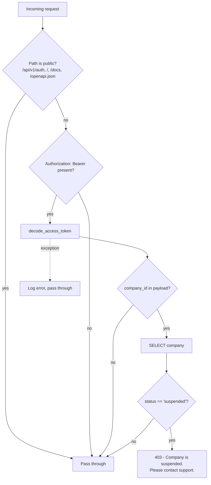

### 3.1 Why it is middleware, and why that is awkward

The source comments are unusually candid about the design tension:

```python
# backend/src/common/middleware.py
# We need to extract company_id from the token or request state
# Since the auth dependency runs *after* middleware in FastAPI, we have to
# manually check the token here
# ...
# A better approach for FastAPI is to use a dependency that checks this,
# but the requirement specifically asked for Middleware.
```

Because FastAPI middleware runs **before** dependencies, this middleware cannot
reuse `get_current_user`. It re-implements a simplified token decode and opens
**its own database session** on every non-public authenticated request.

Practical consequences:

- **One extra DB round-trip per request.** `AsyncSessionLocal()` plus a
  `SELECT` on `companies` for every authenticated call. This is a real
  per-request cost.
- **It fails open.** Any exception is logged and the request proceeds:
  ```python
  except Exception as e:
      logger.error(f"Middleware error checking tenant status: {e}")
      # Don't block request on error, let the actual auth dependency handle invalid tokens
      pass
  ```
  A database blip means suspended companies are served normally.
- **It only guards the backend API (port 8000).** The gateway and voice services
  do not mount this middleware — see
  [02 — System architecture](02-system-architecture.md).

Only `status == "suspended"` is checked. `Company.status` defaults to `"active"`
([auth/models.py:17](../../backend/src/auth/models.py:17)).

---

## 4. The GovernanceService

[governance_service.py](../../backend/src/ai/governance/governance_service.py)
(436 lines) is the single class the loop calls for money and human gates.

```python
# backend/src/ai/governance/governance_service.py
class GovernanceService:
    """Handles credit gates, HITL approvals, and billing settlement."""

    def __init__(self, db: Any, redis: Any) -> None:
```

It needs **both** a DB session and Redis — Redis because HITL waits on pub/sub.

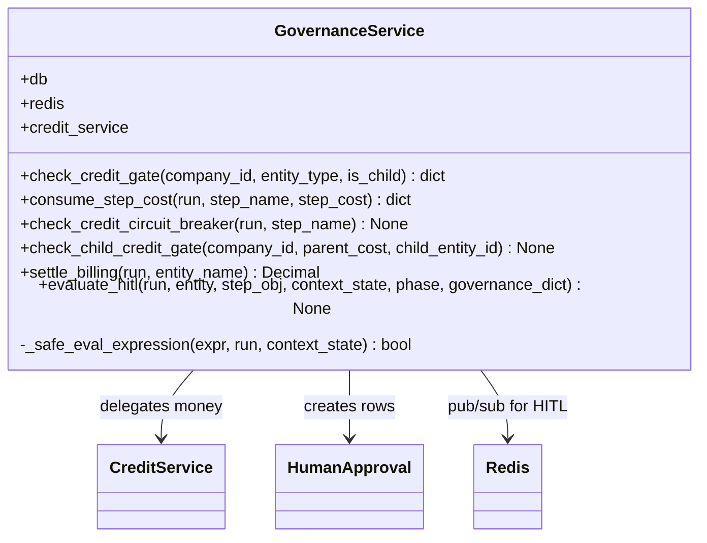

| Method | When | Raises |
|---|---|---|
| `check_credit_gate` | Before a run starts | `InsufficientCreditsError` |
| `consume_step_cost` | After each billable step | Never (logs) |
| `check_credit_circuit_breaker` | After each step | `InsufficientCreditsError` |
| `check_child_credit_gate` | Before spawning a child entity | `InsufficientCreditsError` |
| `settle_billing` | On run completion (top-level only) | — |
| `evaluate_hitl` | Before and after each step | `Exception` on reject/timeout |

---

## 5. Credit gates and the circuit breaker

Three checks at three moments.

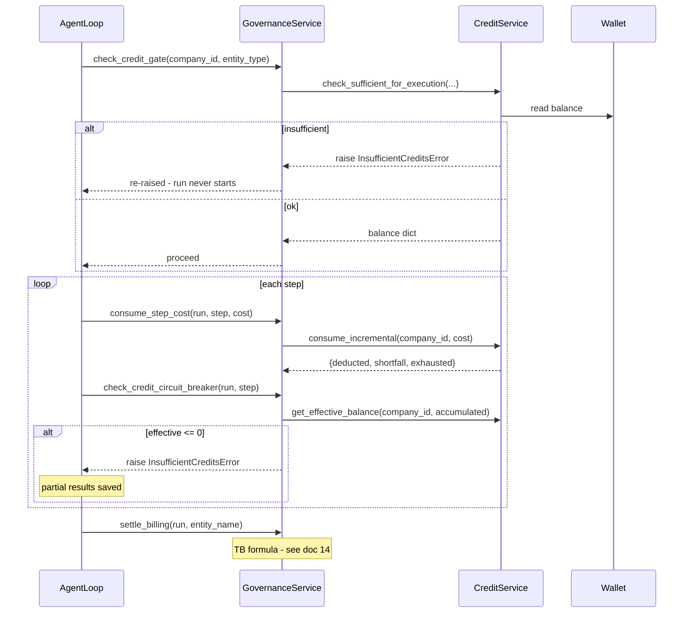

### 5.1 The pre-execution gate

```python
# backend/src/ai/governance/governance_service.py
try:
    balance = await self.credit_service.check_sufficient_for_execution(
        company_id, entity_type
    )
    return balance
except InsufficientCreditsError:
    raise  # Re-raise to be caught by the outer handler
except Exception as e:
    # Non-fatal: log and continue if balance check fails (e.g. DB issue)
    logger.warning(f"Pre-execution credit check failed: {e}")
    return {}
```

Note the two-tier `except`: a genuine credit shortfall propagates, but **any
other error returns `{}` and the run proceeds unbilled-checked**. Availability
over strictness.

The gate is `entity_type`-aware, so a `PROCESS` can require a different
threshold from an `ACTION`.

### 5.2 Incremental consumption

`consume_step_cost` deducts each step's cost immediately rather than settling
only at the end. This is what makes the circuit breaker meaningful — the wallet
reflects spend in near-real-time.

It short-circuits on non-positive cost and **never raises**:

```python
# backend/src/ai/governance/governance_service.py
if step_cost <= 0:
    return {"deducted": Decimal("0"), "shortfall": Decimal("0"), "exhausted": False}
...
except Exception as e:
    logger.warning(f"Incremental deduction failed for step '{step_name}': {e}")
    return {"deducted": Decimal("0"), "shortfall": step_cost, "exhausted": False}
```

A failed deduction returns the full cost as `shortfall` — the work happened but
was not billed.

### 5.3 The circuit breaker

```python
# backend/src/ai/governance/governance_service.py
accumulated = Decimal(str(run.total_cost_usd or 0))
effective = await self.credit_service.get_effective_balance(
    run.company_id, accumulated
)
if effective <= 0:
    raise InsufficientCreditsError(
        f"Execution stopped: credit balance exhausted after step '{step_name}'. "
        f"Accumulated cost: ${accumulated:.4f}. "
        f"Partial results saved. Please top up credits and retry."
    )
```

The error message is user-facing and deliberately reassuring: **partial results
are saved**. A drained run is not a lost run.

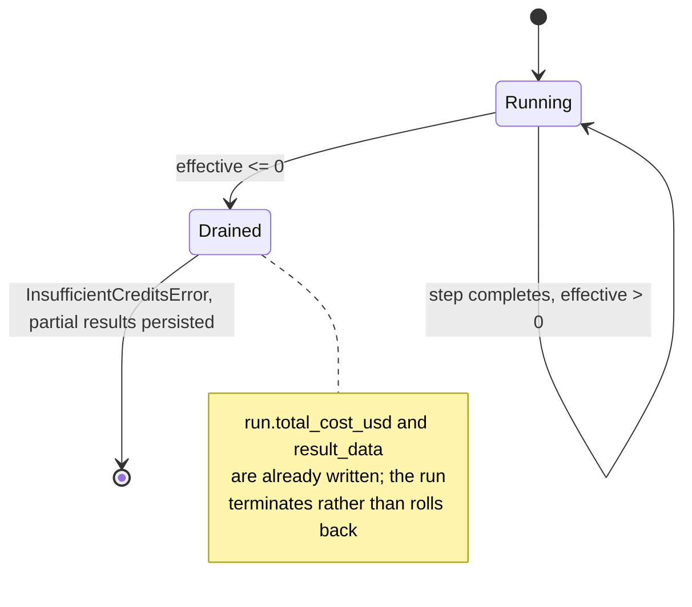

Like the others, it swallows non-credit exceptions (`except Exception: pass`).

### 5.4 The child gate

Before spawning a child entity, the parent's accumulated cost is checked against
the wallet:

```python
# backend/src/ai/governance/governance_service.py
raise InsufficientCreditsError(
    f"Cannot spawn child entity {child_entity_id}: parent run has accumulated "
    f"${parent_accumulated_cost:.4f} cost with no remaining credits. "
    f"Please top up credits and retry."
)
```

This exists because recursion is the platform's main runaway-cost risk: a
`PROCESS` fanning out to dozens of children could otherwise blow past the wallet
between circuit-breaker checks. See
[06 — Execution pipeline](06-execution-pipeline.md) for the recursion model.

---

## 6. The entity governance block

Every entity carries a `governance` JSON block. Its schema is in
[schemas/governance.py](../../backend/src/ai/schemas/governance.py):

```python
# backend/src/ai/schemas/governance.py
class Governance(BaseModel):
    max_cost_usd: Optional[float] = None
    timeout_ms: int = 60000
    max_recursion_depth: int = 5
    execution_limits: Optional[ExecutionLimits] = None
    hitl_checkpoints: List[HITLCheckpoint] = []
```

| Field | Default | Meaning |
|---|---|---|
| `max_cost_usd` | `None` | Hard USD cap for the run |
| `timeout_ms` | `60000` (60s) | Wall-clock limit |
| `max_recursion_depth` | `5` | How deep child entities may nest |
| `execution_limits` | `None` | Further per-entity limits |
| `hitl_checkpoints` | `[]` | Human approval checkpoints |

`max_cost_usd` and `timeout_ms` are also what the Meta-Agent's Validator gate 6
insists on being `> 0` before an entity can be promoted — see
[11 — Meta-intelligence](11-meta-intelligence.md).

These values become the loop's `Budget` (tokens / USD / wall-clock / iterations)
described in [05 — Agent kernel](05-agent-kernel.md).

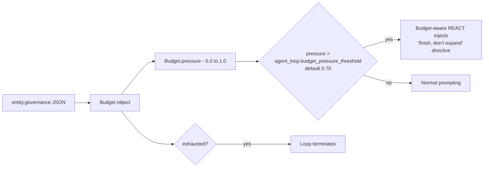

Note the two-level design: `budget_pressure_threshold` is a **soft** nudge to
the LLM ("wrap up"), while `Budget.exhausted` is the **hard** engine stop. The
flag comment makes this explicit:

```python
# backend/src/ai/core/feature_flags.py
# Budget-aware REACT (Phase 12 `07` §2): thread budget pressure into the
# step prompt as a soft constraint, with an explicit "finish, don't expand"
# directive past ``agent_loop.budget_pressure_threshold``. The hard engine
# cap still applies; this nudges the LLM to plan within budget. Default ON.
```

---

## 7. Human-in-the-loop checkpoints

### 7.1 The checkpoint definition

```python
# backend/src/ai/schemas/governance.py
class HITLCheckpoint(BaseModel):
    """A user-configured checkpoint that pauses execution for human approval."""
    trigger_type: HITLTriggerType
    step_ref: Optional[str] = None           # For BEFORE_STEP/AFTER_STEP: step name or step_id
    tool_ref: Optional[str] = None           # For TOOL_CALL: tool_id to gate
    threshold: Optional[float] = None        # For COST_THRESHOLD: USD amount that triggers pause
    expression: Optional[str] = None         # For CUSTOM: a Python-like boolean expression
    timeout_ms: int = 300000                 # How long to wait for approval (default 5 min)
    notification_channels: List[str] = []    # e.g. ["email", "slack", "dashboard"]
    message: Optional[str] = None            # Custom message shown to the reviewer
    auto_approve_on_timeout: bool = False    # If True, auto-approve when timeout expires
```

### 7.2 The five trigger types

```python
# backend/src/ai/schemas/enums.py
class HITLTriggerType(str, Enum):
    """Trigger types for Human-in-the-Loop checkpoints."""
    BEFORE_STEP = "BEFORE_STEP"          # Pause before a specific step executes
    AFTER_STEP = "AFTER_STEP"            # Pause after a specific step completes
    COST_THRESHOLD = "COST_THRESHOLD"    # Pause when execution cost exceeds threshold
    TOOL_CALL = "TOOL_CALL"              # Pause before a specific tool is called
    CUSTOM = "CUSTOM"                    # Custom expression-based trigger
```

| Trigger | Phase | Matched on | `trigger_desc` written to the approval row |
|---|---|---|---|
| `BEFORE_STEP` | `BEFORE` only | `step_ref` == step `name` **or** `step_id` | `BEFORE_STEP: {step.name}` |
| `AFTER_STEP` | `AFTER` only | `step_ref` == step `name` **or** `step_id` | `AFTER_STEP: {step.name}` |
| `COST_THRESHOLD` | `BEFORE` only | `run.total_cost_usd >= threshold` | `COST_THRESHOLD: $X >= $Y` |
| `TOOL_CALL` | `BEFORE` only | step is `TOOL_CALL` and `target.tool_id == tool_ref` | `TOOL_CALL: {tool_ref}` |
| `CUSTOM` | `BEFORE` only | `_safe_eval_expression` returns truthy | `CUSTOM: {expression}` |

> **Only `AFTER_STEP` fires in the `AFTER` phase.** Every other trigger is
> `BEFORE`-only. A `COST_THRESHOLD` checkpoint therefore fires before the
> *next* step, not immediately when the cost is crossed.

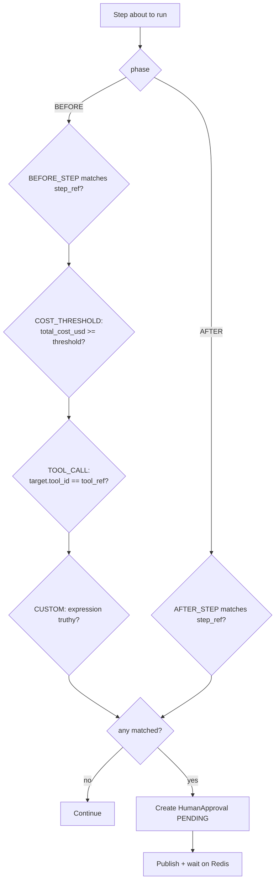

### 7.3 Checkpoints are evaluated in order, and each blocks

`evaluate_hitl` loops over `governance.hitl_checkpoints` and processes each
matching one **sequentially and synchronously**. Two checkpoints matching the
same step mean two consecutive waits.

Malformed checkpoint definitions are skipped silently:

```python
# backend/src/ai/governance/governance_service.py
try:
    cp = HITLCheckpoint(**cp_data) if isinstance(cp_data, dict) else cp_data
except Exception:
    continue
```

A typo in a checkpoint's JSON means it never fires and nothing warns you.

### 7.4 The approval row

```python
# backend/src/ai/governance/governance_service.py
approval = HumanApproval(
    run_id=run.id,
    checkpoint_trigger=trigger_desc,
    status="PENDING",
    context_snapshot={
        "step_name": step_obj.name,
        # SEC-3 fix: removed step_id to avoid exposing internal topology
        "message": cp.message or f"Approval required: {trigger_desc}",
    },
    notification_channels=cp.notification_channels,
    timeout_ms=cp.timeout_ms,
)
```

Note the `SEC-3` comment: `step_id` was deliberately removed from the snapshot
so an approval UI cannot leak the entity's internal plan topology to a reviewer.

The `HumanApproval` table is defined at
[orm/execution.py:121](../../backend/src/ai/orm/execution.py:121) — see
[03 — Data model](03-data-model.md).

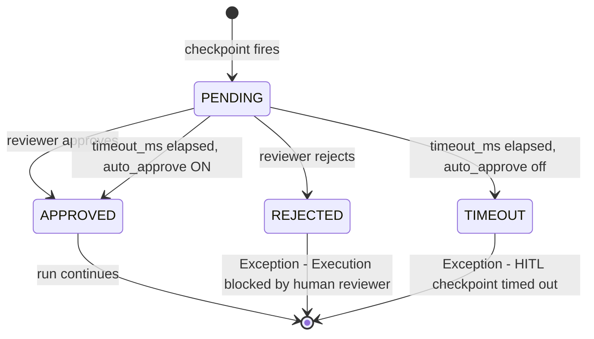

---

## 8. The HITL wait mechanism

This is the part that surprises people: **the worker blocks on Redis pub/sub**
while a human decides.

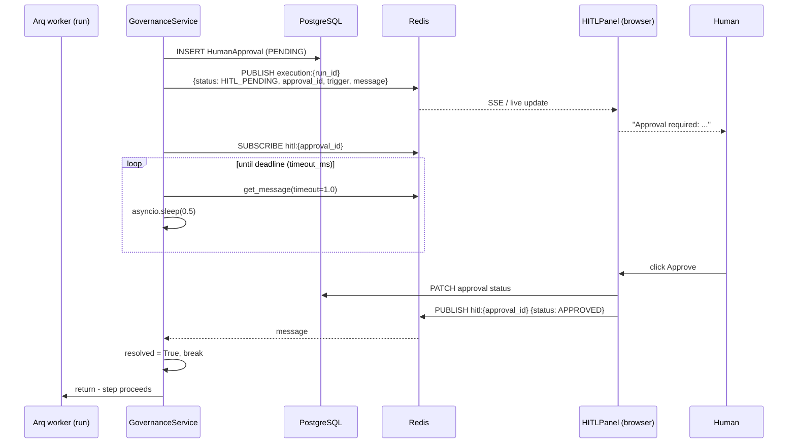

### 8.1 Two Redis channels

| Channel | Direction | Payload |
|---|---|---|
| `execution:{run_id}` | Worker → UI | `{status: "HITL_PENDING", approval_id, trigger, message}` |
| `hitl:{approval_id}` | UI → Worker | `{status: "APPROVED" \| "REJECTED"}` |

The first drives the live execution trace ([13 — Gateway and realtime](13-gateway-and-realtime.md));
the second is the reply path.

### 8.2 The wait loop

```python
# backend/src/ai/governance/governance_service.py
deadline = asyncio.get_running_loop().time() + timeout_sec
resolved = False

while asyncio.get_running_loop().time() < deadline:
    message = await pubsub.get_message(
        ignore_subscribe_messages=True, timeout=1.0
    )
    if message and message.get("type") == "message":
        data = json.loads(message["data"])
        status = data.get("status", "").upper()
        if status == "APPROVED":
            resolved = True
            break
        elif status == "REJECTED":
            approval.status = "REJECTED"
            await self.db.commit()
            raise Exception(
                f"Execution blocked by human reviewer: {trigger_desc}"
            )
    await asyncio.sleep(0.5)
```

Polling with a 1-second `get_message` timeout plus a 0.5-second sleep — so
approval is noticed within roughly 1.5 seconds.

### 8.3 Timeout behaviour

```python
# backend/src/ai/governance/governance_service.py
if not resolved:
    if cp.auto_approve_on_timeout:
        approval.status = "APPROVED"
        approval.reviewer_notes = "Auto-approved on timeout"
    else:
        approval.status = "TIMEOUT"
        await self.db.commit()
        raise Exception(
            f"HITL checkpoint timed out after {cp.timeout_ms}ms: {trigger_desc}"
        )
```

Default `timeout_ms` is **300000 (5 minutes)** and `auto_approve_on_timeout`
defaults to **`False`** — so the safe default is *fail closed on timeout*.

### 8.4 Pub/sub failure fails open

```python
# backend/src/ai/governance/governance_service.py
except Exception as hitl_err:
    if "Execution blocked" in str(hitl_err) or "timed out" in str(hitl_err):
        raise
    logger.warning(f"HITL pub/sub error: {hitl_err}")
    # Non-fatal: continue execution if pub/sub fails
```

⚠️ **If Redis is unavailable, the checkpoint is skipped and the step runs
unapproved.** The approval row stays `PENDING` forever. The two genuine
outcomes — rejected and timed out — are re-raised by matching on the exception
*message text*, which is fragile: reword either message and the corresponding
gate silently stops working.

### 8.5 Operational implications of a blocking wait

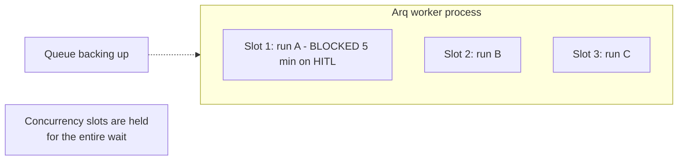

A run waiting on a human **occupies a worker concurrency slot** for up to
`timeout_ms`. Several long-timeout checkpoints firing at once can starve the
worker pool. Keep `timeout_ms` short, or scale worker concurrency to match
expected concurrent approvals. See
[02 — System architecture](02-system-architecture.md) for the worker topology.

---

## 9. Custom expression triggers

`CUSTOM` checkpoints evaluate a small expression through
`_safe_eval_expression`. It is **not** Python `eval` — it is a hand-rolled
parser supporting a tiny grammar:

```python
# backend/src/ai/governance/governance_service.py
threshold = float(val)
if op == ">" and step_count > threshold:
    ...
if op == ">=" and step_count >= threshold:
    ...
threshold = float(val)
if op == ">" and current_cost > threshold:
    ...
if op == ">=" and current_cost >= threshold:
```

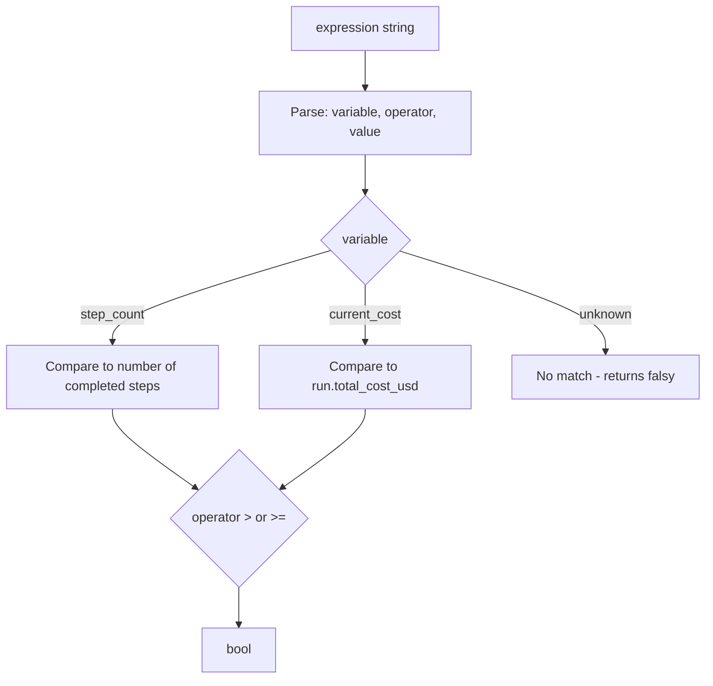

Two recognised variables — `step_count` and `current_cost` — and two operators,
`>` and `>=`. Anything else does not match, and an evaluation error is logged
and treated as "do not fire":

```python
# backend/src/ai/governance/governance_service.py
except Exception as e:
    logger.warning(f"HITL custom expression eval failed: {e}")
```

Refusing to use `eval()` on tenant-supplied strings is the right call — this is
a deliberately narrow, safe grammar. But it is much less expressive than
"a Python-like boolean expression" in the schema docstring suggests. Do not
promise users `<`, `==`, `and`, `or`, or any other variable.

---

## 10. Rate limiting

[rate_limiter.py](../../backend/src/ai/governance/rate_limiter.py) is a Redis
sorted-set sliding window.

```python
# backend/src/ai/governance/rate_limiter.py
limiter = RedisRateLimiter(redis)
allowed = await limiter.check_and_consume(
    key="tool:search:company_123",
    limit=10,
    window_seconds=60,
)
```

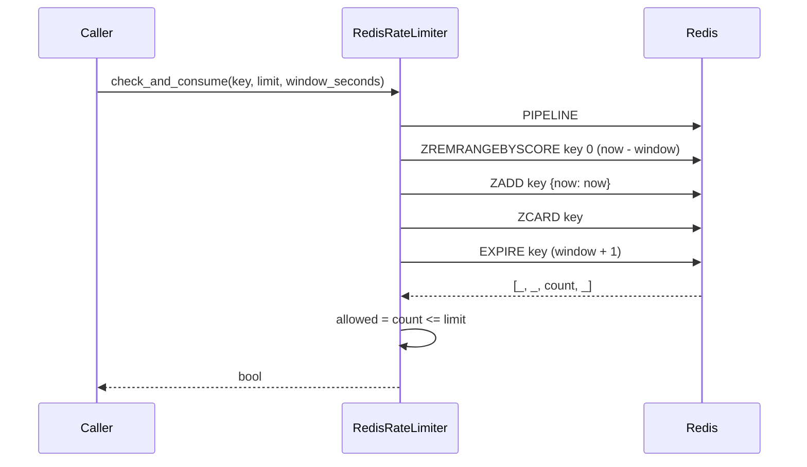

The four pipelined commands do prune, add, count and expire atomically:

| Command | Purpose |
|---|---|
| `ZREMRANGEBYSCORE key 0 window_start` | Drop entries older than the window |
| `ZADD key {now: now}` | Record this request |
| `ZCARD key` | Count entries in the window |
| `EXPIRE key window+1` | Auto-clean idle keys |

Also available: `get_remaining(key, limit, window)` and `reset(key)`.

### 10.1 Two fail-open paths

```python
# backend/src/ai/governance/rate_limiter.py
if not self.redis:
    return True  # No Redis = no limiting
...
except Exception as e:
    logger.warning(f"Rate limiter error for '{key}': {e}")
    return True  # Fail open — don't block on Redis errors
```

No Redis configured, or Redis erroring, means **no rate limiting at all**.

### 10.2 The counting is slightly off by design

The request is added to the set **before** the count, so `count` includes the
current request, and the comparison is `count <= limit`. A `limit=10` therefore
permits 10 requests per window, which is the intuitive reading — but note the
entry is added even when the call is ultimately rejected, so a rejected request
still consumes a slot for the remainder of the window. Under sustained overload
this makes the limiter slightly stricter than the nominal limit.

`RedisRateLimiter` is a **mechanism, not a policy** — it defines no limits of
its own. Callers pass `key`, `limit` and `window_seconds`. Per-run tool budgets
are tracked separately via `tool_call_counts` in `context_state`
([09 — Tools](09-tools.md)).

---

## 11. Tool cost resolution

[tool_cost_resolver.py](../../backend/src/ai/governance/tool_cost_resolver.py)
(206 lines) is the single source of truth for what a tool call costs.

```python
# backend/src/ai/governance/tool_cost_resolver.py
"""
Lookup priority (first hit wins):

  1. ``IntegrationRegistry.service_sku == tool_id``
  2. ``IntegrationRegistry.service_sku`` in :data:`TOOL_SKU_MAP[tool_id]`
  3. :data:`TOOL_FIXED_COST[tool_id]` (e.g. image_generation = $0.04)
  4. ``Decimal('0')`` (with a one-time warning per process)
"""
```

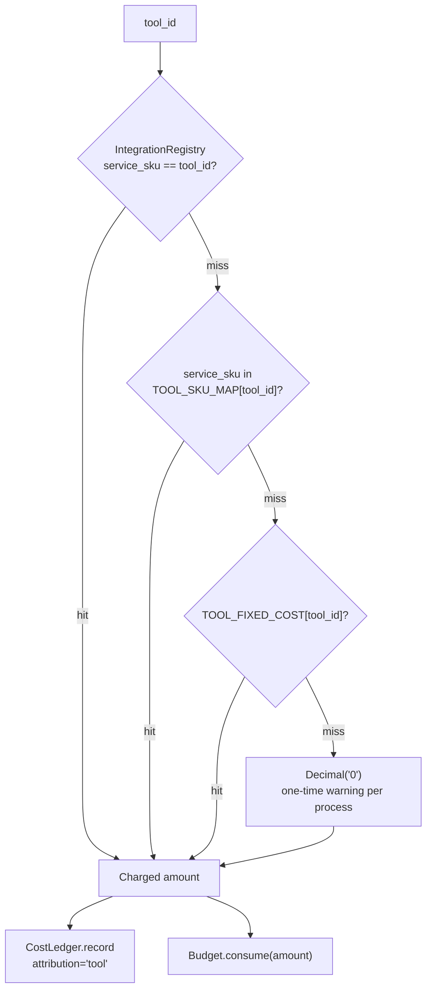

Two things make this important:

1. **It consolidated three duplicated lookups.** The docstring records that
   cost logic previously lived inline twice in `step_executor.py` (direct
   `TOOL_CALL` path and REACT AFC path) plus fixed-cost fallbacks.
2. **The returned amount feeds two consumers** — `run.total_cost_usd` and the
   loop's `Budget.consume(...)`. Same number, so billing and budget can never
   diverge.

> ⚠️ An unmapped tool resolves to **$0** and only warns once per process. A new
> tool without a SKU is silently free — it will not consume budget, will not
> deduct credits, and will not appear in cost reports. Always add a SKU entry
> when adding a tool.

Every charge is recorded through `CostLedger` in
[services/cost_attribution.py](../../backend/src/ai/services/cost_attribution.py)
with `attribution="tool"` — see [14 — Billing and credits](14-billing-and-credits.md).

The resolver is **cached per process**, so a rate change requires a worker
restart (or whatever invalidation the cache exposes) to take effect.

---

## 12. Feature flags — the system

[core/feature_flags.py](../../backend/src/ai/core/feature_flags.py) (617 lines).

### 12.1 Resolution order

```python
# backend/src/ai/core/feature_flags.py
"""
Resolution order (first hit wins):

  1. Per-entity override (``entity.metadata_extensions.feature_flags``).
  2. Per-company row in the ``feature_flags`` table.
  3. Global row (``company_id IS NULL``) in the ``feature_flags`` table.
  4. Environment variable: ``AI_FLAG_<KEY>`` (e.g.
     ``AI_FLAG_AGENT_LOOP_ENABLED=true``).
  5. Hard-coded default from ``DEFAULTS`` below.
"""
```

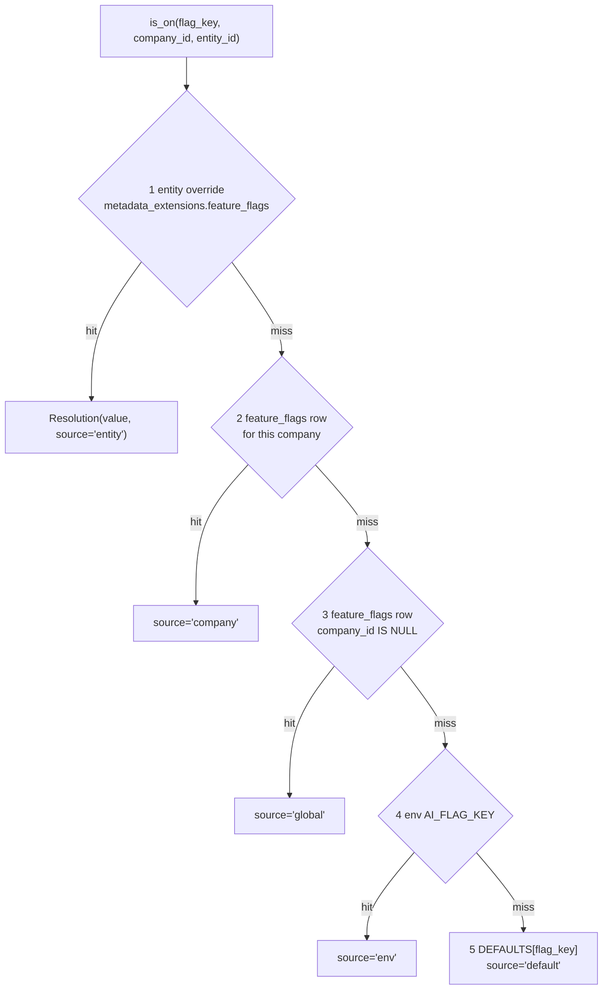

The env-var name is derived mechanically:

```python
# backend/src/ai/core/feature_flags.py
def _env_lookup(key: str) -> Optional[bool]:
    env_key = "AI_FLAG_" + key.upper().replace(".", "_")
    raw = os.environ.get(env_key)
    if raw is None:
        return None
    return raw.strip().lower() in {"1", "true", "yes", "on"}
```

So `bandit.enabled` → `AI_FLAG_BANDIT_ENABLED`, and truthy values are
`1`, `true`, `yes`, `on` (case-insensitive).

`resolve()` returns a `_Resolution` carrying `value`, `source`
(`"entity" | "company" | "global" | "env" | "default"`) and `flag_key` — use it
when you need to know *why* a flag has its value.

### 12.2 The DB table is optional

```python
# backend/src/ai/core/feature_flags.py
"""
The DB table is OPTIONAL — if Alembic hasn't run the migration yet,
flags fall through to env vars + defaults instead of raising. That
makes the system safe to deploy in any order.
"""
```

A genuinely nice property: you can deploy code that reads a new flag before the
migration lands.

Likewise `db` may be `None` — the service then resolves from env plus defaults
only. `FeatureFlags` is designed to be **short-lived**: construct one per Arq
job or per request.

### 12.3 Caching and invalidation

```python
# backend/src/ai/core/feature_flags.py
_REDIS_INVALIDATION_CHANNEL = "feature_flag_invalidations"
_PROCESS_CACHE_TTL_SECONDS = 60
```

Two cache layers:

| Layer | Scope | TTL | Invalidation |
|---|---|---|---|
| `_PROCESS_CACHE` | Module-global, keyed `(flag_key, company_id, entity_id)` | 60s | `invalidate_process_cache(flag_key=None)` |
| `self._cache` | Per-service-instance | Instance lifetime | Instance discarded |

`set()` publishes to the Redis `feature_flag_invalidations` channel so other
workers drop their caches.

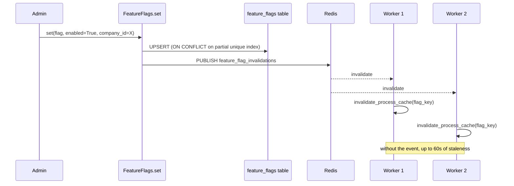

The upsert has a subtlety worth respecting, from the code comments:

```python
# backend/src/ai/core/feature_flags.py
# ON CONFLICT targets MUST match the partial-unique-index columns
# AND predicate exactly. See p11t02_feature_flags migration:
#   entity tier:  (flag_key, entity_id)        WHERE entity_id IS NOT NULL
```

Three tiers (entity / company / global) are enforced by **partial unique
indexes**, so each `ON CONFLICT` clause must reproduce the index predicate
exactly.

### 12.4 Boolean vs numeric flags

Two separate dictionaries and two separate accessors:

| | Boolean | Numeric |
|---|---|---|
| Dict | `DEFAULTS` | `NUMERIC_DEFAULTS` |
| Accessor | `is_on(...)` / `resolve(...)` | `get_float(...)` |
| DB column | `enabled` | `value_json` |

```python
# backend/src/ai/core/feature_flags.py
async def get_float(self, flag_key, *, company_id=None, entity_id=None, default=None) -> float:
    """Resolve a numeric flag (``bandit.epsilon``, ``planner.n_candidates``).

    Order: per-entity ``value_json`` → per-company ``value_json``
    → global ``value_json`` → ``NUMERIC_DEFAULTS[flag_key]`` →
    ``default`` (caller fallback, 0.0 if not given).
    """
```

> ⚠️ `get_float` has **no env-var tier**. Boolean flags can be overridden with
> `AI_FLAG_*`; numeric ones cannot. Numeric overrides require a DB row.

`set()` accepts `enabled`, `value_json`, or both, and raises if neither is
given. It also raises `RuntimeError` if `db is None`.

---

## 13. Feature flags — the complete catalogue

**42 boolean flags** and **5 numeric flags**, extracted from
[core/feature_flags.py](../../backend/src/ai/core/feature_flags.py).

### 13.1 Agent loop

| Flag | Default | Controls |
|---|---|---|
| `agent_loop.perception_bounded_viewport` | `True` | Bound the CORTEX viewport during perception |
| `agent_loop.snapshot_every_iteration` | `True` | Write an `AgentState` `snapshot` node each iteration |
| `agent_loop.executor_dialog_enabled` | `False` | Enable the Dialog executor (stub) |
| `agent_loop.executor_skill_enabled` | `False` | Enable the Skill executor (stub) |
| `agent_loop.executor_tool_burst_enabled` | `False` | Enable the ToolBurst executor (stub) |
| `agent_loop.budget_aware_react` | `True` | Thread budget pressure into the step prompt |

> There is **no `agent_loop.enabled` master switch.** The comment in the code is
> explicit: *"C4 deleted the legacy `ExecutionEngine.execute_run` path"*, so the
> AgentLoop is the sole run engine. Older docs referencing `agent_loop.enabled`
> are stale.

### 13.2 Critic pipeline

| Flag | Default | Controls |
|---|---|---|
| `critic_pipeline.v2_enabled` | `True` | The v2 critic pipeline |
| `critic_pipeline.different_model_critic` | `True` | Critique with a different model than the actor |
| `critic_pipeline.pre_critic_enabled` | `True` | Pre-action critic gate |
| `critic_pipeline.calibration_enabled` | `True` | False-pass/false-fail calibration |
| `critic_pipeline.enabled` | `False` | ⚠️ Legacy alias for pre-Track-3 callers |

`critic_pipeline.v1_compat` was retired (C1) — the v1 critic body is deleted.

### 13.3 Supervisor and bandit

| Flag | Default | Controls |
|---|---|---|
| `meta_review.v2_enabled` | `True` | SupervisorCritic v2 |
| `meta_review.fast_path_enabled` | `True` | Cheap fast path before full supervision |
| `bandit.enabled` | `True` | `PlanStyleBandit` arm selection |
| `task_classifier.v2_enabled` | `False` | Embedding-NN task classifier (v1 rule-based otherwise) |

### 13.4 Meta-Agent

| Flag | Default | Controls |
|---|---|---|
| `meta_agent.board_routing` | `True` | Board is the default Meta-Agent path |
| `meta_agent.spec_critic_required` | `True` | Spec critic must run |
| `meta_agent.draft_lifecycle` | `True` | DRAFT → ACTIVE lifecycle |
| `meta_agent.testdriver_suite_enabled` | `True` | Run the TestDriver suite |
| `meta_agent.skill_promotion_cron` | `True` | Weekly skill-candidate scan |
| `meta_agent.prompt_evolution_cron` | `True` | Weekly prompt-evolution proposal |
| `meta_agent.curator_consolidation_enabled` | `False` | Merge-plan proposals for duplicate clusters |
| `meta_agent.spec_critic_tiebreak` | `False` | Third-model tiebreak on high-stakes disagreement |
| `meta_agent.tool_synthesis_enabled` | **`False`** | ⚠️ Agents writing new tools |

`meta_agent.board_routing` appears **twice** in `DEFAULTS`, both `True` — a
harmless duplicate key (the second wins).

The tool-synthesis flag is described in code as the kill switch for *"the
marquee/most-dangerous capability"*:

```python
# backend/src/ai/core/feature_flags.py
# Tool synthesis kill switch (Phase 12 `06` §2.2 control 5). Default OFF;
# the marquee/most-dangerous capability. Even when ON, the tool_synthesis
# meta-tool stays Meta-Agent-only + container-only-exec + DRAFT-register-only.
"meta_agent.tool_synthesis_enabled": False,
```

### 13.5 Tools and cost

| Flag | Default | Controls |
|---|---|---|
| `tools.cost_resolver_v2_enabled` | `True` | The consolidated `ToolCostResolver` |
| `tools.resilience_v2_enabled` | `True` | v2 retry / circuit-breaker policies |
| `tools.cost_attribution_required` | `True` | Every cost surface must write an attributed `usage_logs` row |

`tools.cost_attribution_required` was the last canary of the cost-attribution
programme, flipped ON once embeddings became the final metered site. A CI guard
in `tests/integration/test_cost_attribution.py` enforces the invariant.

### 13.6 Planner

| Flag | Default | Controls |
|---|---|---|
| `planner.v2_enabled` | `True` | Planner v2 |
| `planner.invariants_enforced` | `True` | Enforce `plan_invariants` checks |
| `planner.judge_enabled` | `True` | LLM judge over plan candidates |
| `planner.priors_enabled` | `True` | Planner priors |

### 13.7 Sandbox

| Flag | Default | Controls |
|---|---|---|
| `sandbox.container_runtime_enabled` | `True` | Per-tenant container sandbox |
| `sandbox.persistent_browser_enabled` | `False` | Persistent browser profile (ephemeral otherwise) |

The persistent-browser flag has a **master switch above it** —
`settings.SANDBOX_PERSISTENT_BROWSER_ENABLED`. The flag resolves per company and
is threaded into the tool context as `persistent_browser`.

### 13.8 Memory

| Flag | Default | Controls |
|---|---|---|
| `memory.v2_canonical` | `True` | v2 four-domain memory is canonical |
| `memory.viewport_compact` | `True` | Compact viewport rendering |
| `memory.scope_policy_enforced` | `True` | `ScopePolicy` enforcement on CORTEX ops |
| `memory.dreaming_outcome_trigger` | `True` | Trigger dreaming on run completion |
| `memory.embedding_resolver_v2` | `True` | Per-company embedding model resolution |
| `memory.trust_score_learning` | `False` | Learned per-source trust scores |
| `memory.rule_lifecycle_confirmed_only` | `False` | Only `confirmed` rules enter prompts |
| `memory_v2.canonical` | `True` | ⚠️ Legacy alias of `memory.v2_canonical` |

See [08 — Memory and CORTEX](08-memory-and-cortex.md) for what each does.

### 13.9 Numeric flags

| Flag | Default | Meaning |
|---|---|---|
| `bandit.epsilon` | `0.10` | Exploration rate for the plan-style bandit |
| `agent_loop.budget_pressure_threshold` | `0.70` | Pressure past which "finish, don't expand" is injected |
| `critic_pipeline.budget_share_cap` | `0.20` | Max share of run budget the critics may consume |
| `meta_agent.testdriver_budget_usd` | `3.00` | Shared budget for the Board's test suite |
| `planner.n_candidates` | `3` | Plan candidates generated per planning call |

### 13.10 Flags that are OFF by default

Worth listing separately — these are the not-yet-rolled-out or deliberately
dangerous capabilities:

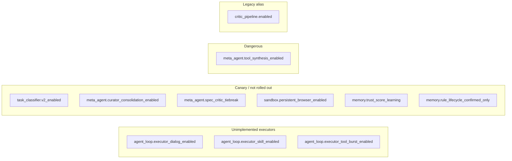

---

## 14. Operational runbook

### 14.1 Turn a flag on for one tenant

```bash
psql -h localhost -p 5433 -U postgres -d hirebuddha -c "INSERT INTO feature_flags (id, company_id, flag_key, enabled) VALUES (gen_random_uuid(), '<company-uuid>', 'memory.trust_score_learning', true) ON CONFLICT (flag_key, company_id) WHERE company_id IS NOT NULL DO UPDATE SET enabled = true;"
```

Prefer `FeatureFlags.set(...)` where you can — direct SQL does **not** publish
the Redis invalidation event, so workers keep the old value for up to 60
seconds.

### 14.2 Turn a flag on globally without touching the DB

```bash
AI_FLAG_MEMORY_TRUST_SCORE_LEARNING=true
```

Set it in the worker and API environment, then restart. Remember: env vars sit
*below* DB rows in precedence, so a company row will still win.

### 14.3 Find out why a flag has its value

```python
res = await FeatureFlags(db).resolve("bandit.enabled", company_id=cid, entity_id=eid)
print(res.value, res.source)   # e.g. True 'company'
```

### 14.4 Unstick a run waiting on HITL

Publish the approval directly:

```bash
redis-cli PUBLISH "hitl:<approval-uuid>" '{"status":"APPROVED"}'
```

Then reconcile the row:

```bash
psql -h localhost -p 5433 -U postgres -d hirebuddha -c "UPDATE human_approvals SET status='APPROVED', responded_at=now(), reviewer_notes='manually unblocked' WHERE id='<approval-uuid>';"
```

Order matters — the worker is listening on the channel, not polling the table.
If the worker already timed out, publishing does nothing and the run has failed.

### 14.5 List stuck approvals

```bash
psql -h localhost -p 5433 -U postgres -d hirebuddha -c "SELECT id, run_id, checkpoint_trigger, requested_at, timeout_ms FROM human_approvals WHERE status='PENDING' ORDER BY requested_at;"
```

Rows older than their `timeout_ms` that are still `PENDING` indicate the
pub/sub fail-open path fired ([§8.4](#84-pubsub-failure-fails-open)).

### 14.6 Suspend or restore a company

```bash
psql -h localhost -p 5433 -U postgres -d hirebuddha -c "UPDATE companies SET status='suspended' WHERE id='<company-uuid>';"
```

Takes effect on the next request — the middleware reads the row every time and
does not cache.

### 14.7 Raise a tenant's budget

Budget lives on the **entity**, not the company. Edit the entity's `governance`
block (`max_cost_usd`, `timeout_ms`, `max_recursion_depth`) via the entity API
or the builder UI — see [06 — Execution pipeline](06-execution-pipeline.md).
For wallet top-ups see [14 — Billing and credits](14-billing-and-credits.md).

### 14.8 Reset a rate limit

```bash
redis-cli DEL "tool:search:company_<uuid>"
```

---

## 15. Key files reference

| File | Lines | What it does |
|---|---|---|
| [core/feature_flags.py](../../backend/src/ai/core/feature_flags.py) | 617 | Flag resolution, 2-tier cache, Redis invalidation, `DEFAULTS` + `NUMERIC_DEFAULTS` |
| [governance/governance_service.py](../../backend/src/ai/governance/governance_service.py) | 436 | Credit gates, circuit breaker, HITL evaluation and wait, billing settlement |
| [governance/tool_cost_resolver.py](../../backend/src/ai/governance/tool_cost_resolver.py) | 206 | Single source of truth for tool cost; `TOOL_SKU_MAP`, `TOOL_FIXED_COST` |
| [governance/rate_limiter.py](../../backend/src/ai/governance/rate_limiter.py) | 111 | Redis sorted-set sliding window |
| [common/middleware.py](../../backend/src/common/middleware.py) | 57 | `CompanySuspensionMiddleware` |
| [schemas/governance.py](../../backend/src/ai/schemas/governance.py) | — | `Governance`, `HITLCheckpoint`, `ExecutionLimits` |
| [schemas/enums.py](../../backend/src/ai/schemas/enums.py) | — | `HITLTriggerType`, `StepType`, `ExecutionMode` |
| [orm/execution.py](../../backend/src/ai/orm/execution.py) | 138 | `HumanApproval` table |
| [core/budget.py](../../backend/src/ai/core/budget.py) | — | `Budget` — tokens / USD / wall-clock / iterations |
| [services/cost_attribution.py](../../backend/src/ai/services/cost_attribution.py) | — | `CostLedger`, `CostAttribution` |
| [api/admin.py](../../backend/src/ai/api/admin.py) | 1456 | Admin endpoints including flag management |
| [HITLPanel.tsx](../../frontend/src/pages/ai/HITLPanel.tsx) | — | Approval UI |
| [FeatureFlagsPage.tsx](../../frontend/src/pages/admin/FeatureFlagsPage.tsx) | 422 | Flag admin UI |
| [RiskAndExitPage.tsx](../../frontend/src/pages/admin/RiskAndExitPage.tsx) | 343 | Risk and offboarding surfaces |
| [useFeatureFlag.ts](../../frontend/src/hooks/useFeatureFlag.ts) | — | Client-side flag hook |

---

## 16. Gotchas

1. **Almost every gate fails open.** Credit checks, HITL pub/sub, rate limiting,
   suspension middleware, semantic duplicate checks — all swallow non-fatal
   errors and let the request through. A broken gate looks exactly like a
   passing gate.

2. **If Redis is down, HITL checkpoints are skipped entirely.** The step runs
   unapproved and the approval row stays `PENDING` forever.

3. **HITL reject/timeout detection matches on exception message text**
   (`"Execution blocked"`, `"timed out"`). Reword either message and the gate
   silently stops re-raising.

4. **A HITL wait blocks an Arq worker slot** for up to `timeout_ms` (default 5
   minutes). Concurrent approvals can starve the worker pool.

5. **Only `AFTER_STEP` fires in the `AFTER` phase.** `COST_THRESHOLD` is
   `BEFORE`-only, so it fires before the *next* step, not at the moment the
   threshold is crossed.

6. **Malformed HITL checkpoints are skipped silently** — a `continue` with no
   log line.

7. **`CUSTOM` expressions support only `step_count` and `current_cost` with
   `>` and `>=`.** Despite the "Python-like boolean expression" docstring.

8. **`get_float` has no env-var tier.** Numeric flags cannot be overridden with
   `AI_FLAG_*`; they need a DB row.

9. **Direct SQL flag writes do not invalidate caches.** Up to 60 seconds of
   staleness per worker. Use `FeatureFlags.set()`.

10. **There is no `agent_loop.enabled` flag any more.** The legacy engine was
    deleted; the loop is unconditional.

11. **`meta_agent.board_routing` is defined twice** in `DEFAULTS` (both `True`).

12. **`critic_pipeline.enabled` and `memory_v2.canonical` are legacy aliases**
    that do not control the modern paths. Use `critic_pipeline.v2_enabled` and
    `memory.v2_canonical`.

13. **An unmapped tool costs $0** and warns only once per process — it consumes
    no budget and appears in no cost report.

14. **`ToolCostResolver` is cached per process.** Rate changes need a restart.

15. **`CompanySuspensionMiddleware` opens its own DB session per request** — a
    real per-request cost, and it only protects the backend API on port 8000.

16. **Budget lives on the entity, not the company.** Raising "a tenant's budget"
    means editing entity `governance` blocks.

---

## Where to go next

- [05 — Agent kernel](05-agent-kernel.md) — the `Budget` type and where these
  gates are called inside the loop.
- [14 — Billing and credits](14-billing-and-credits.md) — `CreditService`, the
  wallet, and the TB settlement formula.
- [07 — Planning and critics](07-planning-and-critics.md) — the critic gates and
  `critic_pipeline.budget_share_cap`.
- [11 — Meta-intelligence](11-meta-intelligence.md) — the Board's own gates and
  `meta_agent.*` flags.
- [09 — Tools](09-tools.md) — tool SKUs, per-run tool budgets, and the sandbox
  flags.
- [04 — Auth, RBAC and tenancy](04-auth-rbac-tenancy.md) — the auth gate that
  runs before all of this.
