# 16. Frontend Architecture

> **What this document covers:** the whole React single-page app in `frontend/` — build tooling, bootstrapping, routing, auth, the API client layer, types, real-time streaming, the design system, and every page.
> **Who should read it:** any developer about to change, add or debug a screen in the HireBuddha web app.
> **Prerequisites:** [02 — System architecture](02-system-architecture.md) for the process topology, [04 — Auth, RBAC & tenancy](04-auth-rbac-tenancy.md) for the role model the UI gates on, and [13 — Gateway & real-time](13-gateway-and-realtime.md) for the SSE channel this app subscribes to.

---

## Table of contents

1. [The 60-second version](#1-the-60-second-version)
2. [Build and tooling](#2-build-and-tooling)
3. [Bootstrapping: main.tsx to the router](#3-bootstrapping-maintsx-to-the-router)
4. [Routing](#4-routing)
5. [Client-side auth](#5-client-side-auth)
6. [The API service layer](#6-the-api-service-layer)
7. [The type system](#7-the-type-system)
8. [Real-time in the browser](#8-real-time-in-the-browser)
9. [The design system](#9-the-design-system)
10. [Page-by-page catalogue](#10-page-by-page-catalogue)
11. [Deep dive: EntityConfigurationTabs](#11-deep-dive-entityconfigurationtabs)
12. [Deep dive: ExecutionDetail and the agent-kernel widgets](#12-deep-dive-executiondetail-and-the-agent-kernel-widgets)
13. [Deep dive: EntityBuilder and EntityFlow](#13-deep-dive-entitybuilder-and-entityflow)
14. [Deep dive: PhonePool and the streaming pages](#14-deep-dive-phonepool-and-the-streaming-pages)
15. [Dashboards and reports](#15-dashboards-and-reports)
16. [The animated Three.js background](#16-the-animated-threejs-background)
17. [Forms and validation](#17-forms-and-validation)
18. [Testing](#18-testing)
19. [Performance notes and real problems in the code](#19-performance-notes-and-real-problems-in-the-code)
20. [How to add a new page](#20-how-to-add-a-new-page)

---

## 1. The 60-second version

The frontend is a **plain React 18 single-page app built with Vite**. There is
no Redux, no React Query, no Next.js, no Tailwind build step. State is
`useState` inside components plus three React contexts (theme, auth, feature
flags). Data fetching is direct `axios` calls from a service module, awaited in
a `useEffect`. Styling is hand-written CSS with a CSS-custom-property design
system.

The numbers, as of this writing:

| Thing | Count |
|-------|-------|
| `.ts` / `.tsx` files under `src/` | 117 |
| Lines of TS/TSX | ~25,400 |
| `.css` files | 59 |
| Lines of CSS | ~14,500 |
| Page components (`src/pages/**/*.tsx`) | 57 |
| Service modules (`src/services/`) | 23 |
| Routes registered in the router | 66 |

Everything below hangs off one shell: a fixed WebGL background, a collapsible
sidebar, and a lazily-loaded page in the middle.

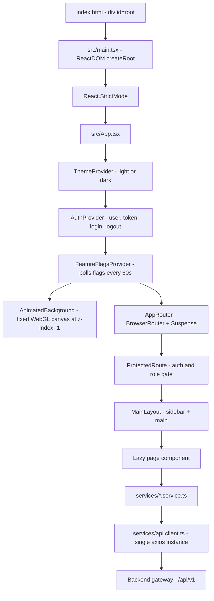
```mermaid
flowchart TD
    IDX["index.html - div id=root"] --> MAIN["src/main.tsx - ReactDOM.createRoot"]
    MAIN --> SM["React.StrictMode"]
    SM --> APP["src/App.tsx"]
    APP --> TP["ThemeProvider - light or dark"]
    TP --> AP["AuthProvider - user, token, login, logout"]
    AP --> FF["FeatureFlagsProvider - polls flags every 60s"]
    FF --> BG["AnimatedBackground - fixed WebGL canvas at z-index -1"]
    FF --> RT["AppRouter - BrowserRouter + Suspense"]
    RT --> PR["ProtectedRoute - auth and role gate"]
    PR --> ML["MainLayout - sidebar + main"]
    ML --> PAGE["Lazy page component"]
    PAGE --> SVC["services/*.service.ts"]
    SVC --> AX["services/api.client.ts - single axios instance"]
    AX --> GW["Backend gateway - /api/v1"]
```

The single most important file to read first is
[`src/router/index.tsx`](../../frontend/src/router/index.tsx) — 602 lines that
list every screen in the product.

---

## 2. Build and tooling

### 2.1 Scripts

From [`package.json`](../../frontend/package.json):

| Script | Command | What it does |
|--------|---------|--------------|
| `npm run dev` | `vite` | Dev server on port 3000, all interfaces |
| `npm run build` | `tsc && vite build` | Type-check first, then bundle to `dist/` |
| `npm run lint` | `eslint . --ext ts,tsx --report-unused-disable-directives --max-warnings 0` | **Broken — see below** |
| `npm run preview` | `vite preview` | Serve the built `dist/` locally |

> **`npm run lint` does not work.** There is no `.eslintrc*` or `eslint.config.js`
> anywhere in `frontend/`. The ESLint packages are in `devDependencies` but
> unconfigured, so the script fails on a missing config. Nothing in CI runs it.
> The only type/quality gate that actually runs is the `tsc` step inside
> `npm run build`.

### 2.2 Dependencies worth knowing

| Package | Version | Used for |
|---------|---------|----------|
| `react` / `react-dom` | ^18.2 | Core |
| `react-router-dom` | ^6.20 | Routing |
| `axios` | ^1.6 | All HTTP |
| `reactflow` + `dagre` | ^11.11 / ^0.8 | The entity graph canvas |
| `recharts` | ^2.15 | Every chart in dashboards and reports |
| `framer-motion` | ^10.16 | Only 3 files: `GlassCard`, `GlassInput`, `JellyButton` |
| `lucide-react` | ^0.294 | All icons |
| `three` | ^0.182 | `AnimatedBackground` |
| `date-fns` | ^3.0 | Declared; **not imported anywhere in `src/`** |
| `react-hook-form` + `zod` + `@hookform/resolvers` | | Declared; **not imported anywhere in `src/`** (see [§17](#17-forms-and-validation)) |
| `@react-three/fiber`, `@react-three/drei`, `@react-three/postprocessing` | | Declared; **not imported anywhere in `src/`** — the background uses raw `three` |

Roughly 6 declared dependencies are dead weight in the bundle graph. They are
not tree-shaken away by accident — they are simply never imported, so Vite
never pulls them in, but they do slow `npm install`.

### 2.3 Vite config

[`vite.config.ts`](../../frontend/vite.config.ts):

```ts
// frontend/vite.config.ts
server: {
    allowedHosts: ["dev.hirebuddha.com", "app.hirebuddha.com"],
    hmr: false, // Completely disable HMR for testing
    host: '0.0.0.0',
    port: 3000,
    proxy: {
        '/api':      { target: 'http://gateway.hirebuddha.com', changeOrigin: true, secure: false },
        '/reports':  { target: 'http://gateway.hirebuddha.com', changeOrigin: true },
        '/artifact': { target: 'http://gateway.hirebuddha.com', changeOrigin: true },
    },
},
```

Three things surprise newcomers here:

1. **Hot module replacement is switched off** (`hmr: false`, with a comment
   saying "for testing"). Every code change means a manual browser refresh.
2. **The dev proxy is rarely exercised.** The axios client uses an *absolute*
   base URL from `VITE_API_BASE_URL`, so requests go straight to the gateway
   host and never hit the Vite proxy. The proxy only matters for relative URLs
   — which happens in exactly one place: the artifact/report download links
   built in `ExecutionDetail` (`/api/v1/artifacts/...`, `/artifact/...`,
   `/reports/...`).
3. **Path aliases are declared twice** — once in `vite.config.ts` for the
   bundler and once in `tsconfig.json` for the type checker. If you add an
   alias you must add it in both files or one of the two will break.

### 2.4 Environment variables

Every `VITE_*` variable referenced anywhere in `src/`:

| Variable | Where it is read | Default if unset | Notes |
|----------|------------------|------------------|-------|
| `VITE_API_BASE_URL` | [`api.client.ts:3`](../../frontend/src/services/api.client.ts:3), [`ExecutionDetail.tsx:17`](../../frontend/src/pages/ai/ExecutionDetail.tsx:17), `oauth.service.ts:57`, and 20+ raw `fetch()` calls in `pages/streaming/` and `PhonePool.tsx` | `https://gateway.hirebuddha.com/api/v1` (only in `api.client.ts` and `ExecutionDetail.tsx`) | Must **include** the `/api/v1` suffix |
| `VITE_GOOGLE_CLIENT_ID` | [`oauth.service.ts:3`](../../frontend/src/services/oauth.service.ts:3) | none (`undefined`) | Google OAuth |
| `VITE_MICROSOFT_CLIENT_ID` | [`oauth.service.ts:4`](../../frontend/src/services/oauth.service.ts:4) | none | Microsoft OAuth |
| `VITE_API_URL` | [`artifact.service.ts:83`](../../frontend/src/services/artifact.service.ts:83), `asset.service.ts:77`, `Artifacts.tsx:193`, `AssetLibrary.tsx:147` | `''` | **A second, different base URL** — this one must *not* include `/api/v1` because the code appends it |

`.env.example` only documents three of the four:

```env
# frontend/.env.example
VITE_API_BASE_URL=http://localhost:8000/api/v1
VITE_GOOGLE_CLIENT_ID=your_google_client_id_here
VITE_MICROSOFT_CLIENT_ID=your_microsoft_client_id_here
```

> **Gotcha:** `VITE_API_URL` is undocumented and unset in practice, so
> `artifactService.getDownloadUrl()` returns a relative `/api/v1/artifacts/…`
> path. That path only resolves because Apache and the Vite proxy both forward
> `/api` to the gateway. There is also a `(window as any).__API_BASE__` escape
> hatch checked first — nothing in the repo ever sets it.

### 2.5 TypeScript config

[`tsconfig.json`](../../frontend/tsconfig.json) is strict: `strict: true`,
`noUnusedLocals`, `noUnusedParameters`, `noFallthroughCasesInSwitch`,
`noEmit`, `jsx: "react-jsx"`, `moduleResolution: "bundler"`.

The important line is the exclude:

```json
"exclude": ["src/**/*.test.ts", "src/**/*.test.tsx"]
```

Test files are **not type-checked** by the build. That matters — see
[§18](#18-testing).

### 2.6 Running it

```bash
cd frontend
cp .env.example .env       # then point VITE_API_BASE_URL at your backend
npm install
npm run dev                # http://localhost:3000
```

Production build:

```bash
npm run build              # tsc, then vite build -> frontend/dist/
npm run preview            # smoke-test the built bundle
```

### 2.7 How it is actually served

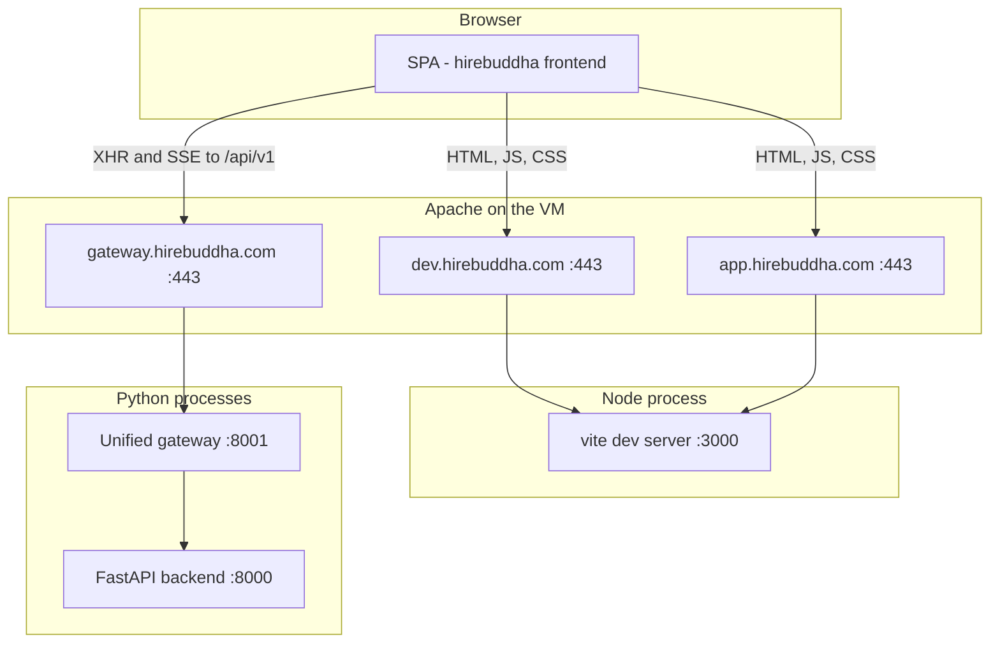
```mermaid
graph TB
    subgraph Browser["Browser"]
        B["SPA - hirebuddha frontend"]
    end
    subgraph Edge["Apache on the VM"]
        A1["dev.hirebuddha.com :443"]
        A2["app.hirebuddha.com :443"]
        A3["gateway.hirebuddha.com :443"]
    end
    subgraph Node["Node process"]
        V["vite dev server :3000"]
    end
    subgraph Api["Python processes"]
        G["Unified gateway :8001"]
        BE["FastAPI backend :8000"]
    end

    B -->|"HTML, JS, CSS"| A1
    B -->|"HTML, JS, CSS"| A2
    A1 --> V
    A2 --> V
    B -->|"XHR and SSE to /api/v1"| A3
    A3 --> G
    G --> BE
```

> **This is the real surprise of the deployment.** Both
> [`deploy/apache/app.hirebuddha.com.conf`](../../deploy/apache/app.hirebuddha.com.conf)
> and [`deploy/apache/dev.hirebuddha.com.conf`](../../deploy/apache/dev.hirebuddha.com.conf)
> `ProxyPass / http://localhost:3000/`, and
> [`start_services.sh:137`](../../start_services.sh:137) starts the frontend with
> `npm run dev -- --host 0.0.0.0`. **Production serves the Vite dev server**, not
> a static `dist/` build. Nothing in the repo builds or deploys `dist/`. See
> [18 — Infrastructure & deployment](18-infrastructure-and-deployment.md).

`index.html` also pulls two things from the public internet at page load, which
the CSP-conscious should know about:

```html
<!-- frontend/index.html -->
<link href="https://fonts.googleapis.com/css2?family=Inter:wght@300;400;500;600;700&display=swap" rel="stylesheet" />
<script src="https://checkout.razorpay.com/v1/checkout.js"></script>
```

The Razorpay script is loaded on **every** page even though only
[`WalletPage.tsx`](../../frontend/src/pages/billing/WalletPage.tsx) uses
`window.Razorpay`.

---

## 3. Bootstrapping: main.tsx to the router

[`main.tsx`](../../frontend/src/main.tsx) is nine lines:

```tsx
// frontend/src/main.tsx
ReactDOM.createRoot(document.getElementById('root')!).render(
    <React.StrictMode>
        <App />
    </React.StrictMode>
);
```

[`App.tsx`](../../frontend/src/App.tsx) is where the providers nest and where
the three global stylesheets get imported (import order matters — `tokens.css`
defines variables that `theme.css` and `global.css` consume).

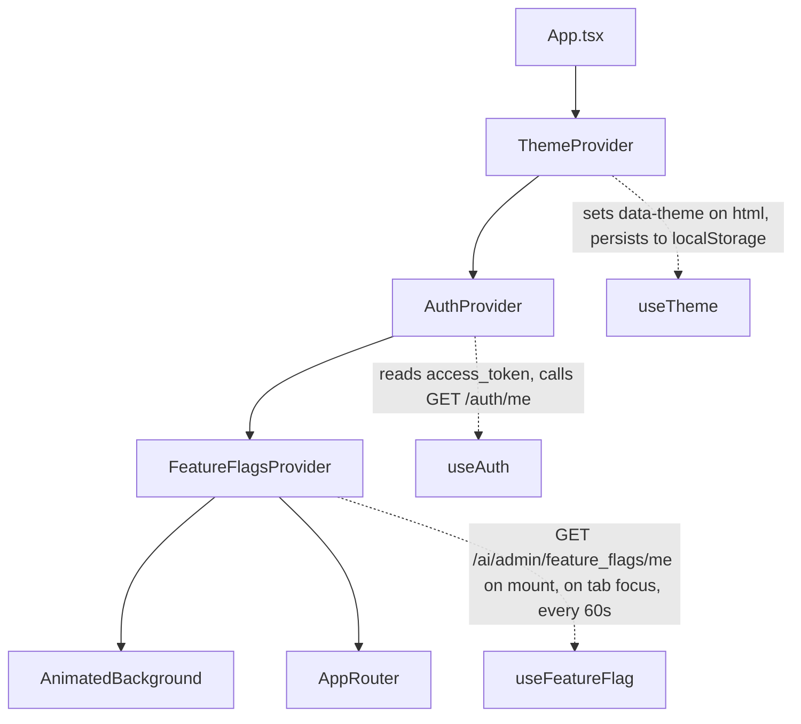
```mermaid
flowchart TD
    A["App.tsx"] --> T["ThemeProvider"]
    T --> AU["AuthProvider"]
    AU --> F["FeatureFlagsProvider"]
    F --> BG["AnimatedBackground"]
    F --> R["AppRouter"]

    T -.->|"sets data-theme on html, persists to localStorage"| T2["useTheme"]
    AU -.->|"reads access_token, calls GET /auth/me"| AU2["useAuth"]
    F -.->|"GET /ai/admin/feature_flags/me on mount, on tab focus, every 60s"| F2["useFeatureFlag"]
```

| Provider | File | What it holds | Storage | Notes |
|----------|------|---------------|---------|-------|
| `ThemeProvider` | [`hooks/useTheme.tsx`](../../frontend/src/hooks/useTheme.tsx) | `theme: 'light' \| 'dark'`, `toggleTheme()` | `localStorage['theme']`, default `'dark'` | Writes `data-theme` onto `<html>` in an effect; all CSS keys off that attribute |
| `AuthProvider` | [`hooks/useAuth.tsx`](../../frontend/src/hooks/useAuth.tsx) | `user`, `token`, `loading`, `login`, `register`, `logout`, `isAuthenticated` | `localStorage['access_token' \| 'refresh_token']` | On mount, if a token exists it calls `GET /auth/me`; on failure it logs out |
| `FeatureFlagsProvider` | [`hooks/useFeatureFlag.ts`](../../frontend/src/hooks/useFeatureFlag.ts) | The whole flag map from the backend | in-memory context only | Refetches on `visibilitychange` and on a 60-second interval (only while the tab is visible) |

Ordering is deliberate: `AuthProvider` must be inside `ThemeProvider` (theme
should apply to the login screen too), and `FeatureFlagsProvider` must be inside
`AuthProvider` because its fetch needs the bearer token that
`AuthProvider`/`api.client.ts` supplies.

`useFeatureFlag` resolves a flag through a five-level fallback chain, documented
in the file header and implemented at
[`useFeatureFlag.ts:108-133`](../../frontend/src/hooks/useFeatureFlag.ts:108):

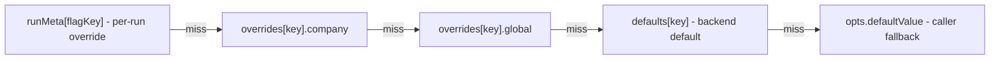
```mermaid
flowchart LR
    A["runMeta[flagKey] - per-run override"] -->|miss| B["overrides[key].company"]
    B -->|miss| C["overrides[key].global"]
    C -->|miss| D["defaults[key] - backend default"]
    D -->|miss| E["opts.defaultValue - caller fallback"]
```

There is also `useNumericFlag(key, fallback)` for numeric flags such as
`bandit.epsilon`. See [15 — Governance, HITL & feature flags](15-governance-and-hitl.md)
for the backend side.

---

## 4. Routing

[`src/router/index.tsx`](../../frontend/src/router/index.tsx) holds the entire
route map inside one `<BrowserRouter><Suspense><Routes>` block. **Every page is
lazily loaded** with `React.lazy`, so each route is its own chunk. The Suspense
fallback is the `PageLoader` (`"Initializing…"`).

### 4.1 Route tree by area

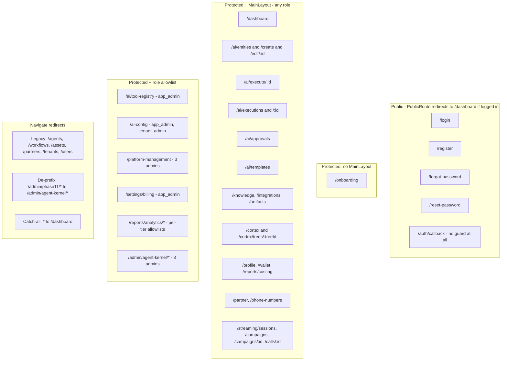
```mermaid
graph TB
    subgraph Public["Public - PublicRoute redirects to /dashboard if logged in"]
        P1["/login"]
        P2["/register"]
        P3["/forgot-password"]
        P4["/reset-password"]
        P5["/auth/callback - no guard at all"]
    end
    subgraph NoLayout["Protected, no MainLayout"]
        N1["/onboarding"]
    end
    subgraph Core["Protected + MainLayout - any role"]
        C1["/dashboard"]
        C2["/ai/entities and /create and /edit/:id"]
        C3["/ai/execute/:id"]
        C4["/ai/executions and /:id"]
        C5["/ai/approvals"]
        C6["/ai/templates"]
        C7["/knowledge, /integrations, /artifacts"]
        C8["/cortex and /cortex/trees/:treeId"]
        C9["/profile, /wallet, /reports/costing"]
        C10["/partner, /phone-numbers"]
        C11["/streaming/sessions, /campaigns, /campaigns/:id, /calls/:id"]
    end
    subgraph Gated["Protected + role allowlist"]
        G1["/ai/tool-registry - app_admin"]
        G2["/ai-config - app_admin, tenant_admin"]
        G3["/platform-management - 3 admins"]
        G4["/settings/billing - app_admin"]
        G5["/reports/analytics/* - per-tier allowlists"]
        G6["/admin/agent-kernel/* - 3 admins"]
    end
    subgraph Redirects["Navigate redirects"]
        R1["Legacy: /agents, /workflows, /assets, /partners, /tenants, /users"]
        R2["De-prefix: /admin/phase11/* to /admin/agent-kernel/*"]
        R3["Catch-all: * to /dashboard"]
    end
```

### 4.2 The complete route table

Layout column: `MainLayout` = wrapped in the sidebar shell, `none` = bare page.
All non-redirect components are lazy-loaded.

| Path | Component | Required role | Layout | Lazy |
|------|-----------|---------------|--------|------|
| `/login` | `LoginPage` | public (redirects if authed) | none | yes |
| `/register` | `RegisterPage` | public (redirects if authed) | none | yes |
| `/forgot-password` | `ForgotPasswordPage` | public (redirects if authed) | none | yes |
| `/reset-password` | `ResetPasswordPage` | public (redirects if authed) | none | yes |
| `/auth/callback` | `OAuthCallbackPage` | **no guard** | none | yes |
| `/` | → `/dashboard` | — | — | redirect |
| `/onboarding` | `OnboardingWizard` | any authed | none | yes |
| `/partner` | `PartnerDashboard` | any authed | MainLayout | yes |
| `/phone-numbers` | `PhonePool` | any authed | MainLayout | yes |
| `/phone-pool` | → `/phone-numbers` | — | — | redirect |
| `/dashboard` | `Dashboard` | any authed | MainLayout | yes |
| `/ai/entities` | `EntityLibrary` | any authed | MainLayout | yes |
| `/ai/entities/create` | `EntityBuilder` | any authed | MainLayout | yes |
| `/ai/entities/edit/:id` | `EntityBuilder` | any authed | MainLayout | yes |
| `/agents`, `/workflows` | → `/ai/entities` | — | — | redirect |
| `/agents/create`, `/workflows/create` | → `/ai/entities/create` | — | — | redirect |
| `/agents/:id`, `/workflows/:id` | → `/ai/entities/edit/:id` **(broken, see below)** | — | — | redirect |
| `/ai/execute/:id` | `ExecutionPage` | any authed | MainLayout | yes |
| `/execute/:type/:id` | → `/ai/execute/:id` **(broken)** | — | — | redirect |
| `/ai/executions` | `ExecutionHistory` | any authed | MainLayout | yes |
| `/ai/executions/:id` | `ExecutionDetail` | any authed | MainLayout | yes |
| `/executions` | → `/ai/executions` | — | — | redirect |
| `/executions/:id` | `ExecutionRedirect` → `/ai/executions/:id` | — | — | component |
| `/ai/approvals` | `HITLPanel` | any authed | MainLayout | yes |
| `/ai/tool-registry` | `ToolManagement` | `APP_ADMIN` | MainLayout | yes |
| `/ai/templates` | `TemplateMarketplace` | any authed | MainLayout | yes |
| `/knowledge` | `KnowledgeBase` | any authed | MainLayout | yes |
| `/integrations` | `IntegrationsPage` | any authed | MainLayout | yes |
| `/ai-config` | `AIModelConfigPage` | `APP_ADMIN`, `TENANT_ADMIN` | MainLayout | yes |
| `/profile` | `UserSettings` | any authed | MainLayout | yes |
| `/platform-management` | `PlatformManagement` | `APP_ADMIN`, `PARTNER_ADMIN`, `TENANT_ADMIN` | MainLayout | yes |
| `/streaming/phone-numbers` | → `/phone-numbers` | — | — | redirect |
| `/streaming/sessions` | `StreamingSessionsPage` | any authed | MainLayout | yes |
| `/streaming/campaigns` | `CampaignsPage` | any authed | MainLayout | yes |
| `/streaming/campaigns/:campaignId` | `CampaignDetailPage` | any authed | MainLayout | yes |
| `/streaming/calls/:sessionId` | `CallDetailPage` | any authed | MainLayout | yes |
| `/artifacts` | `Artifacts` | any authed | MainLayout | yes |
| `/assets` | → `/artifacts` | — | — | redirect |
| `/cortex` | `CortexExplorer` | any authed | MainLayout | yes |
| `/cortex/trees/:treeId` | `CortexTreeDetail` | any authed | MainLayout | yes |
| `/reports/costing` | `CostingReport` | any authed **(see note)** | MainLayout | yes |
| `/reports/analytics/app-admin` | `AppAdminReports` | `APP_ADMIN` | MainLayout | yes |
| `/reports/analytics/app-user` | `AppUserReports` | `APP_ADMIN`, `APP_USER` | MainLayout | yes |
| `/reports/analytics/partner-admin` | `PartnerAdminReports` | `APP_ADMIN`, `PARTNER_ADMIN` | MainLayout | yes |
| `/reports/analytics/partner-user` | `PartnerUserReports` | `APP_ADMIN`, `PARTNER_ADMIN`, `PARTNER_USER` | MainLayout | yes |
| `/reports/analytics/tenant-admin` | `TenantAdminReports` | `APP_ADMIN`, `PARTNER_ADMIN`, `TENANT_ADMIN` | MainLayout | yes |
| `/reports/analytics/tenant-user` | `TenantUserReports` | any authed | MainLayout | yes |
| `/wallet` | `WalletPage` | any authed | MainLayout | yes |
| `/settings/billing` | `BillingSettings` | `APP_ADMIN` | MainLayout | yes |
| `/admin/agent-kernel/kpi` | `KPIDashboard` | `APP_ADMIN`, `PARTNER_ADMIN`, `TENANT_ADMIN` | MainLayout | yes |
| `/admin/agent-kernel/meta-intelligence` | `MetaIntelligencePage` | 3 admins | MainLayout | yes |
| `/admin/agent-kernel/cost` | `CostAttributionDashboard` | 3 admins | MainLayout | yes |
| `/admin/agent-kernel/feature-flags` | `FeatureFlagsPage` | 3 admins | MainLayout | yes |
| `/admin/agent-kernel/risks` | `RiskAndExitPage` | 3 admins | MainLayout | yes |
| `/admin/phase11/{kpi,meta-intelligence,cost,feature-flags,risks}` | → `/admin/agent-kernel/…` | — | — | redirect (removal date noted as 2026-09-01) |
| `/partners`, `/tenants`, `/users` | → `/platform-management` | — | — | redirect |
| `*` | → `/dashboard` | — | — | catch-all |

Notes on the table:

- **`/reports/costing` is not role-gated in the router** even though the sidebar
  only shows it to `APP_ADMIN` ([`MainLayout.tsx:128`](../../frontend/src/components/layout/MainLayout.tsx:128)).
  Any authenticated user can type the URL. The backend endpoint is the real
  gate.
- **Three redirects are broken.** `<Navigate to="/ai/entities/edit/:id">` sends
  the user to the literal string `:id` — React Router's `Navigate` does not
  interpolate params. The same bug affects `/agents/:id`, `/workflows/:id` and
  `/execute/:type/:id`. The author clearly knew, because `/executions/:id` was
  fixed by writing a tiny component:

  ```tsx
  // frontend/src/router/index.tsx:108
  const ExecutionRedirect: React.FC = () => {
      const { id } = useParams();
      return <Navigate to={`/ai/executions/${id}`} replace />;
  };
  ```

  The same pattern needs applying to the other three.
- **`/auth/callback` has no guard**, which is intentional: the OAuth provider
  redirects an unauthenticated browser there.

### 4.3 The guards

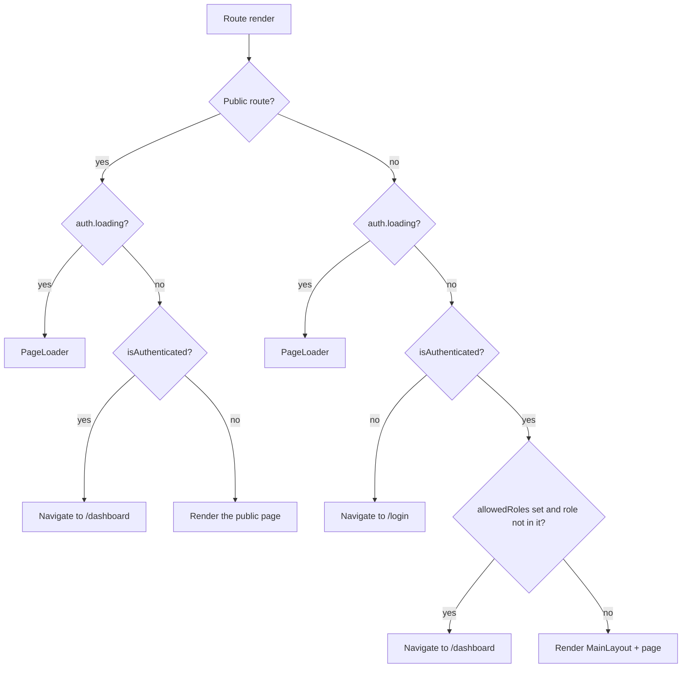
```mermaid
flowchart TD
    START["Route render"] --> ISP{"Public route?"}
    ISP -->|yes| PL{"auth.loading?"}
    PL -->|yes| LOAD1["PageLoader"]
    PL -->|no| PA{"isAuthenticated?"}
    PA -->|yes| RD1["Navigate to /dashboard"]
    PA -->|no| SHOWPUB["Render the public page"]

    ISP -->|no| L2{"auth.loading?"}
    L2 -->|yes| LOAD2["PageLoader"]
    L2 -->|no| A2{"isAuthenticated?"}
    A2 -->|no| RD2["Navigate to /login"]
    A2 -->|yes| RL{"allowedRoles set and role not in it?"}
    RL -->|yes| RD3["Navigate to /dashboard"]
    RL -->|no| SHOW["Render MainLayout + page"]
```

Both guards live at
[`router/index.tsx:78-105`](../../frontend/src/router/index.tsx:78). Note the
`loading` short-circuit — without it every protected route would flash a
redirect to `/login` on a hard refresh while `GET /auth/me` is still in flight.

`isAuthenticated` is derived as `!!user`, **not** `!!token`
([`useAuth.tsx:108`](../../frontend/src/hooks/useAuth.tsx:108)). So a stale
token that fails `/auth/me` correctly counts as logged out.

### 4.4 Sidebar navigation vs routes

The sidebar in [`MainLayout.tsx:61-144`](../../frontend/src/components/layout/MainLayout.tsx:61)
builds its menu with the *same* role predicates, but as a **separate hand-kept
list**. Adding a route does not add a nav item, and the two lists can drift
(they already have — `/reports/costing`). Menu groups:

| Group | Items | Visible to |
|-------|-------|-----------|
| (standalone) | Dashboard | everyone |
| (standalone) | Platform Hub | `APP_ADMIN`, `PARTNER_ADMIN`, `TENANT_ADMIN` |
| (standalone) | Partner Dashboard | `APP_ADMIN`, `PARTNER_ADMIN` |
| AI Workspace | Entity Library, Template Marketplace, Guardian Oversight, Executions, Memory Trees, Tool Registry (`APP_ADMIN` only) | everyone |
| Communications | Phone Numbers, Streaming Sessions, Campaigns | everyone |
| Assets & Connections | Knowledge Base, Integrations, AI Configuration (2 admins), Artifacts | everyone |
| Analytics & Reports | six per-tier report links, each with its own allowlist | everyone (contents vary) |
| Finance & Administration | Wallet & Credits; Costing Report and Billing Settings (`APP_ADMIN`) | everyone |
| Agent Kernel | KPI, Meta-Agent Intelligence, Cost Attribution, Feature Flags, Risk & Exit | 3 admins |

Active-state detection is `location.pathname.startsWith(path)`, which means
`/ai/entities` also highlights while you are on `/ai/entities/edit/:id`.

---

## 5. Client-side auth

### 5.1 Where tokens live

**`localStorage`**, two keys, written in three places:

| Key | Written by | Read by |
|-----|-----------|---------|
| `access_token` | `auth.service.ts` login/register/refresh, `api.client.ts` refresh interceptor, `oauth.service.ts` callback | `api.client.ts` request interceptor, `useSSE`, `services/events.ts`, `authService.isAuthenticated()` |
| `refresh_token` | same three | `api.client.ts` refresh interceptor |

Using `localStorage` rather than an httpOnly cookie means any XSS on the page
can exfiltrate a full session. That is a known trade-off of this design; it also
makes the `?token=` SSE and audio-download query params possible.

### 5.2 Login

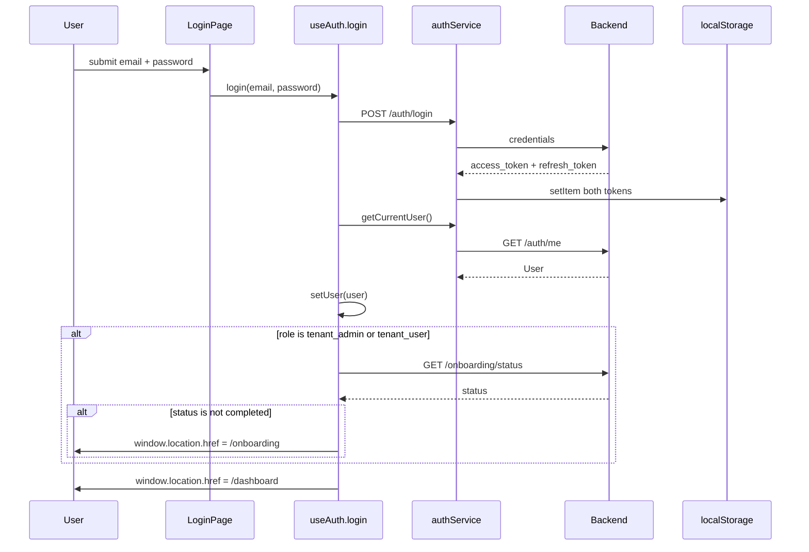
```mermaid
sequenceDiagram
    participant U as User
    participant LP as LoginPage
    participant AC as useAuth.login
    participant AS as authService
    participant API as Backend
    participant LS as localStorage

    U->>LP: submit email + password
    LP->>AC: login(email, password)
    AC->>AS: POST /auth/login
    AS->>API: credentials
    API-->>AS: access_token + refresh_token
    AS->>LS: setItem both tokens
    AC->>AS: getCurrentUser()
    AS->>API: GET /auth/me
    API-->>AS: User
    AC->>AC: setUser(user)
    alt role is tenant_admin or tenant_user
        AC->>API: GET /onboarding/status
        API-->>AC: status
        alt status is not completed
            AC->>U: window.location.href = /onboarding
        end
    end
    AC->>U: window.location.href = /dashboard
```

Two behaviours worth calling out from
[`useAuth.tsx:43-70`](../../frontend/src/hooks/useAuth.tsx:43):

- The redirect uses **`window.location.href`, not `navigate()`** — a full page
  reload. That is why `LoginPage`'s own `navigate('/dashboard')` after `await
  login(...)` is dead code: the browser has already started unloading.
- The onboarding check is wrapped in a `try {} catch {}` that swallows errors,
  so an onboarding-service outage silently lands the user on the dashboard.

`register()` always hard-redirects to `/onboarding`, regardless of role.

### 5.3 The axios interceptors and the 401 retry

[`api.client.ts`](../../frontend/src/services/api.client.ts) is 70 lines and is
the only place HTTP behaviour is configured.

```ts
// frontend/src/services/api.client.ts
this.client.interceptors.request.use((config) => {
    const token = localStorage.getItem('access_token');
    if (token && config.headers) {
        config.headers.Authorization = `Bearer ${token}`;
    }
    return config;
});
```

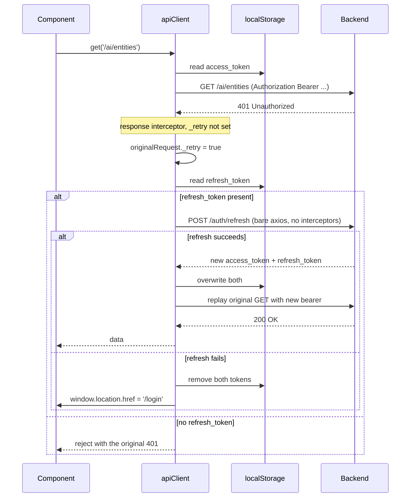
```mermaid
sequenceDiagram
    participant C as Component
    participant AX as apiClient
    participant LS as localStorage
    participant API as Backend

    C->>AX: get('/ai/entities')
    AX->>LS: read access_token
    AX->>API: GET /ai/entities  (Authorization Bearer ...)
    API-->>AX: 401 Unauthorized

    Note over AX: response interceptor, _retry not set
    AX->>AX: originalRequest._retry = true
    AX->>LS: read refresh_token
    alt refresh_token present
        AX->>API: POST /auth/refresh  (bare axios, no interceptors)
        alt refresh succeeds
            API-->>AX: new access_token + refresh_token
            AX->>LS: overwrite both
            AX->>API: replay original GET with new bearer
            API-->>AX: 200 OK
            AX-->>C: data
        else refresh fails
            AX->>LS: remove both tokens
            AX->>C: window.location.href = '/login'
        end
    else no refresh_token
        AX-->>C: reject with the original 401
    end
```

Three real limitations of this implementation:

1. **No request queue.** If ten calls 401 at once, ten refreshes fire in
   parallel and nine of them race to overwrite `localStorage`. With rotating
   refresh tokens this can log the user out.
2. **The `catch` only covers the refresh call.** If `refresh_token` is absent
   entirely, no redirect happens — the caller just receives the 401 and usually
   `console.error`s it.
3. **Only `apiClient` gets this.** Every raw `fetch()` in `pages/streaming/*`,
   `PhonePool.tsx` and `oauth.service.ts` bypasses the interceptors completely:
   they read the token from `useAuth()` and set the header by hand, and they get
   no refresh-and-retry on 401.

### 5.4 Logout

`logout()` calls `authService.logout()` (which removes both keys) and clears the
context. It does **not** call a backend revoke endpoint, and it does not
navigate — the next `ProtectedRoute` render sees `isAuthenticated === false` and
sends the user to `/login`.

### 5.5 OAuth

[`oauth.service.ts`](../../frontend/src/services/oauth.service.ts) implements a
full Google/Microsoft authorization-code flow and
[`OAuthCallback.tsx`](../../frontend/src/pages/auth/OAuthCallback.tsx) handles
the return leg. **But the Google and Microsoft buttons on `LoginPage` have no
`onClick`** ([`LoginPage.tsx:76-85`](../../frontend/src/pages/auth/LoginPage.tsx:76))
— they render and do nothing. The OAuth path is unreachable from the UI as
shipped.

---

## 6. The API service layer

### 6.1 Organisation

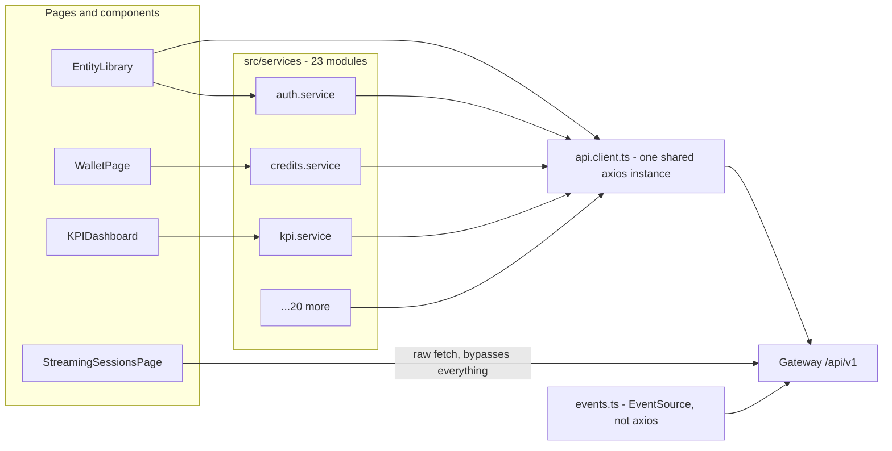
```mermaid
flowchart LR
    subgraph Pages["Pages and components"]
        P1["EntityLibrary"]
        P2["WalletPage"]
        P3["KPIDashboard"]
        P4["StreamingSessionsPage"]
    end
    subgraph Services["src/services - 23 modules"]
        S1["auth.service"]
        S2["credits.service"]
        S3["kpi.service"]
        S4["...20 more"]
    end
    AXI["api.client.ts - one shared axios instance"]
    EV["events.ts - EventSource, not axios"]
    GW["Gateway /api/v1"]

    P1 --> AXI
    P2 --> S2
    P3 --> S3
    P1 --> S1
    S1 --> AXI
    S2 --> AXI
    S3 --> AXI
    S4 --> AXI
    AXI --> GW
    P4 -->|"raw fetch, bypasses everything"| GW
    EV --> GW
```

There are three tiers, and all three are in active use:

| Tier | Example | When it is used |
|------|---------|-----------------|
| Service module | `creditsService.getBalance()` | Most pages. The intended pattern. |
| Direct `apiClient` from a page | `apiClient.get('/ai/entities')` in `EntityFlow` | Common for one-off endpoints nobody bothered to wrap. |
| Raw `fetch()` | all of `pages/streaming/*`, `PhonePool.tsx` line 112+ | Legacy. **Avoid.** No auth refresh, no shared base config. |

### 6.2 The base URL

One line, in one file:

```ts
// frontend/src/services/api.client.ts:3
const API_BASE_URL = import.meta.env.VITE_API_BASE_URL || 'https://gateway.hirebuddha.com/api/v1';
```

The fallback points at production. If you forget your `.env`, a local dev build
will silently talk to the live gateway.

### 6.3 Error handling — there isn't a normaliser

There is **no** central error-normalisation layer. Axios errors propagate raw,
and every call site invents its own shape-guessing. The most complete example is
in `EntityBuilder`, which handles the three ways FastAPI can return a `detail`:

```tsx
// frontend/src/pages/ai/EntityBuilder.tsx:52
} catch (err: any) {
    const detail = err.response?.data?.detail;
    // Handle Pydantic validation errors which are arrays of {type, loc, msg, input}
    if (Array.isArray(detail)) {
        const messages = detail.map((e: any) => {
            const location = e.loc?.join(' → ') || '';
            return location ? `${location}: ${e.msg}` : e.msg;
        });
        setError(messages.join('; '));
    } else if (typeof detail === 'string') {
        setError(detail);
    } else if (detail && typeof detail === 'object' && detail.msg) {
        setError(detail.msg);
    } else {
        setError('Failed to save entity');
    }
}
```

Most other pages do `err.response?.data?.detail || 'Something failed'` and lose
the Pydantic array case. **This is the single highest-value refactor available
in this codebase**: lift that block into `api.client.ts` as a response
interceptor that rejects with a normalised `{ message, fieldErrors }`.

The newer Phase-11 services instead defend against *shape* problems by always
returning a safe default:

```ts
// frontend/src/services/kpi.service.ts:28
async getRunHealth(opts: KPISince = {}): Promise<KPIRunRow[]> {
    const { data } = await apiClient.get('/ai/admin/admin/kpi/runs', {
        params: _params(opts),
    });
    return Array.isArray(data) ? data : [];
},
```

(Yes, the path really is `/ai/admin/admin/kpi/runs` — a doubled prefix from the
backend router mounting. See [17 — API reference](17-api-reference.md).)

### 6.4 A canonical service module, in full

[`tool.service.ts`](../../frontend/src/services/tool.service.ts) is the cleanest
example of the house style: exported interfaces for the entity, its create body
and its update body, then a frozen object of async methods that unwrap
`response.data`.

```ts
// frontend/src/services/tool.service.ts
import { apiClient } from './api.client';

export interface ToolRegistryEntry {
    id: string | null;
    name: string;
    display_name: string | null;
    description: string | null;
    category: string | null;
    tool_type: 'BUILT_IN' | 'CUSTOM';
    function_schema: Record<string, any> | null;
    is_enabled: boolean;
    configuration?: Record<string, any> | null;
    created_by?: string | null;
    created_at: string | null;
    updated_at: string | null;
}

export interface ToolRegistryEntryCreate {
    name: string;
    display_name?: string;
    description?: string;
    category?: string;
    function_schema?: Record<string, any>;
    is_enabled?: boolean;
    configuration?: Record<string, any>;
}

export interface ToolRegistryEntryUpdate {
    display_name?: string;
    description?: string;
    category?: string;
    function_schema?: Record<string, any>;
    is_enabled?: boolean;
    configuration?: Record<string, any>;
}

export const toolService = {
    listTools: async (): Promise<ToolRegistryEntry[]> => {
        const response = await apiClient.get<ToolRegistryEntry[]>('/ai/tool-registry');
        return response.data;
    },

    getTool: async (toolId: string): Promise<ToolRegistryEntry> => {
        const response = await apiClient.get<ToolRegistryEntry>(`/ai/tool-registry/${toolId}`);
        return response.data;
    },

    createTool: async (data: ToolRegistryEntryCreate): Promise<ToolRegistryEntry> => {
        const response = await apiClient.post<ToolRegistryEntry>('/ai/tool-registry', data);
        return response.data;
    },

    updateTool: async (toolId: string, data: ToolRegistryEntryUpdate): Promise<ToolRegistryEntry> => {
        const response = await apiClient.put<ToolRegistryEntry>(`/ai/tool-registry/${toolId}`, data);
        return response.data;
    },

    deleteTool: async (toolId: string): Promise<void> => {
        await apiClient.delete(`/ai/tool-registry/${toolId}`);
    },

    toggleTool: async (toolId: string): Promise<ToolRegistryEntry> => {
        const response = await apiClient.post<ToolRegistryEntry>(`/ai/tool-registry/${toolId}/toggle`);
        return response.data;
    },

    syncBuiltIn: async (): Promise<{ status: string; created: number }> => {
        const response = await apiClient.post<{ status: string; created: number }>('/ai/tool-registry/sync-built-in');
        return response.data;
    },
};
```

### 6.5 Adding a new endpoint call

1. Decide which service module owns the domain. If none does, create
   `src/services/<domain>.service.ts` and `import { apiClient } from './api.client';`.
2. Declare the response interface **next to the method**, exported. Do not put
   API DTOs in `src/types/index.ts` — that file is for shared domain types only.
3. Write the method as `async (args): Promise<T> => { const { data } = await apiClient.get<T>(path); return data; }`.
   Use the generic on `apiClient.get<T>` so `data` is typed.
4. For list endpoints, prefer the defensive `Array.isArray(data) ? data : []`
   return used by the Phase-11 services.
5. Query params: pass `{ params: {...} }` as the axios config, not string
   concatenation — several older services build `URLSearchParams` by hand and
   this is the inconsistency to stop propagating.
6. Never add a raw `fetch()`. You lose the 401-refresh retry.

### 6.6 Every service module

| Module | Base area | Notable methods |
|--------|-----------|-----------------|
| `api.client.ts` | — | the shared axios instance |
| `auth.service.ts` | `/auth` | `login`, `register`, `getCurrentUser`, `logout`, `refreshToken`, `isAuthenticated` |
| `oauth.service.ts` | Google/Microsoft | `loginWithGoogle`, `loginWithMicrosoft`, `handleCallback` (uses raw `fetch`) |
| `user.service.ts` | `/users` | `getUsers`, `createUser`, `updateUser` |
| `company.service.ts` | `/companies` | `getPartners`, `getTenants`, `createCompany`, `updateCompany` |
| `profile.service.ts` | `/profile` | `uploadAvatar`, `uploadLogo` (multipart) |
| `platform.service.ts` | `/onboarding`, `/partner`, `/phone-numbers` | three service objects: `onboardingService`, `partnerService`, `phonePoolService` |
| `integration.service.ts` | `/config/integrations`, `/config/models` | CRUD + `getModels` |
| `ai-config.service.ts` | `/config/task-defaults` | `getTaskDefaults`, `setTaskDefault`, `deleteTaskDefault` |
| `email.service.ts` | `/email` | provider defaults, connection CRUD, `validateConnection` |
| `tool.service.ts` | `/ai/tool-registry` | full CRUD + `toggleTool`, `syncBuiltIn` |
| `template.service.ts` | `/ai/templates` | CRUD + `cloneTemplate`, `convertToTemplate` |
| `agent.service.ts` | `/ai/executions/*`, `/ai/admin/*` | `getAgentState`, `getHealthRecords`, `getTrace`, `getPlanCandidates`, `getRunCostAttribution`, `getBanditState` |
| `cortex.service.ts` | `/cortex` | tree CRUD, `navigate`, `readNode`, `checkpoint`, `ingestDocument`, `assembleOutput` |
| `meta.service.ts` | `/ai/admin/meta` | skill/prompt candidates, anti-patterns, `promoteSkillCandidate`, `runSpecCritic` |
| `kpi.service.ts` | `/ai/admin/admin/*` | KPI rollups, risks, exit checklist, decision log |
| `feature_flags.service.ts` | `/ai/admin/feature_flags` | `fetchMine`, `listAdmin`, `set`, `remove` |
| `reports.service.ts` | `/reports/analytics` | 14 read-only report getters |
| `billing.service.ts` | `/billing`, `/reports`, `/credits` | config, costing/billing reports, subscription tiers |
| `credits.service.ts` | `/credits` | balance, Razorpay top-up + verify, subscriptions |
| `artifact.service.ts` | `/artifacts` | list/get/upload/delete/`getDownloadUrl` |
| `asset.service.ts` | `/assets` | same shape as artifacts — **superseded, see [§10](#10-page-by-page-catalogue)** |
| `events.ts` | SSE | `useAgentEvents` hook + `parseAgentEvent` |

---

## 7. The type system

Two files carry almost all the shared types.

### 7.1 `types/index.ts` — the product domain

432 lines mirroring the backend's `HierarchicalEntity` Pydantic schema. This is
the shape the entity builder edits and the execution pages render.

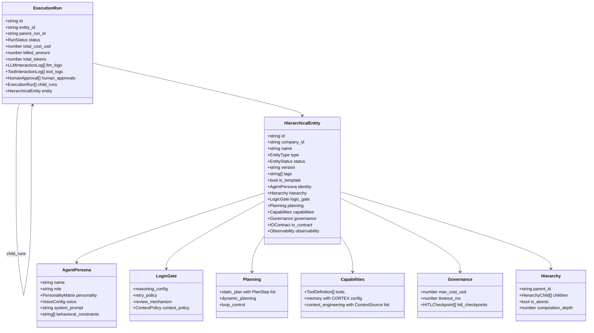
```mermaid
classDiagram
    class HierarchicalEntity {
        +string id
        +string company_id
        +string name
        +EntityType type
        +EntityStatus status
        +string version
        +string[] tags
        +bool is_template
        +AgentPersona identity
        +Hierarchy hierarchy
        +LogicGate logic_gate
        +Planning planning
        +Capabilities capabilities
        +Governance governance
        +IOContract io_contract
        +Observability observability
    }
    class AgentPersona {
        +string name
        +string role
        +PersonalityMatrix personality
        +VoiceConfig voice
        +string system_prompt
        +string[] behavioral_constraints
    }
    class LogicGate {
        +reasoning_config
        +retry_policy
        +review_mechanism
        +ContextPolicy context_policy
    }
    class Planning {
        +static_plan with PlanStep list
        +dynamic_planning
        +loop_control
    }
    class Capabilities {
        +ToolDefinition[] tools
        +memory with CORTEX config
        +context_engineering with ContextSource list
    }
    class Governance {
        +number max_cost_usd
        +number timeout_ms
        +HITLCheckpoint[] hitl_checkpoints
    }
    class Hierarchy {
        +string parent_id
        +HierarchyChild[] children
        +bool is_atomic
        +number composition_depth
    }
    HierarchicalEntity --> AgentPersona
    HierarchicalEntity --> LogicGate
    HierarchicalEntity --> Planning
    HierarchicalEntity --> Capabilities
    HierarchicalEntity --> Governance
    HierarchicalEntity --> Hierarchy

    class ExecutionRun {
        +string id
        +string entity_id
        +string parent_run_id
        +RunStatus status
        +number total_cost_usd
        +number billed_amount
        +number total_tokens
        +LLMInteractionLog[] llm_logs
        +ToolInteractionLog[] tool_logs
        +HumanApproval[] human_approvals
        +ExecutionRun[] child_runs
        +HierarchicalEntity entity
    }
    ExecutionRun --> ExecutionRun : child_runs
    ExecutionRun --> HierarchicalEntity
```

The enums (all string enums, values matching the backend exactly):

| Enum | Values |
|------|--------|
| `UserRole` | `app_admin`, `partner_admin`, `tenant_admin`, `app_user`, `partner_user`, `tenant_user` |
| `EntityType` | `ACTION`, `SKILL`, `AGENT`, `PROCESS` |
| `EntityStatus` | `DRAFT`, `ACTIVE`, `DEPRECATED`, `ARCHIVED` |
| `RunStatus` | `PENDING`, `RUNNING`, `COMPLETED`, `FAILED`, `REPAIRING`, `REFINING` |

> **`RunStatus` is already out of date.** `ExecutionDetail.tsx:557` polls on
> `'PAUSED'` and `'RESUMING'` by casting to `string` because those members are
> missing from the enum. First real symptom of FE/BE drift.

### 7.2 `types/agentKernel.ts` — the agent kernel wire contract

502 lines. The header states its provenance explicitly:

```ts
// frontend/src/types/agentKernel.ts:2
/**
 * types/agentKernel.ts — Typed agent kernel contracts.
 *
 * Mirrors the backend dataclasses in
 *   - backend/src/ai/core/agent_state.py
 *   - backend/src/ai/planning/step_health_record.py
 *   ...
 * Source of truth: backend; this file mirrors the wire shape.
 */
```

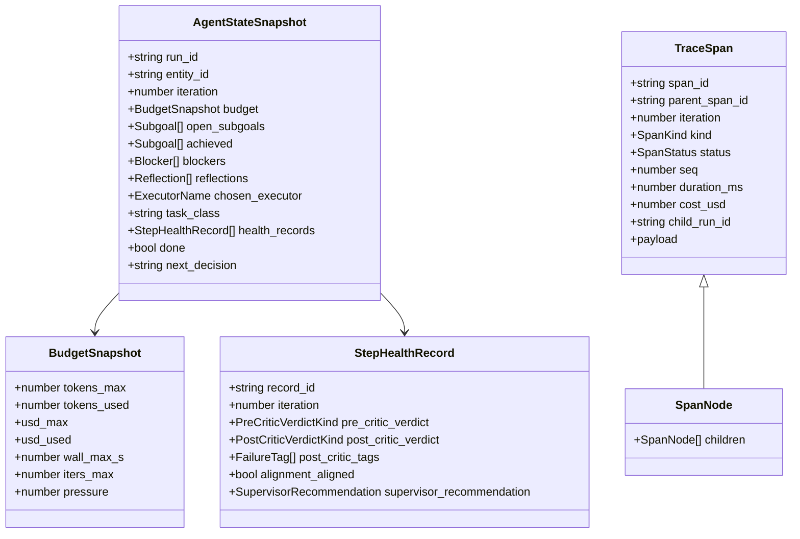
```mermaid
classDiagram
    class AgentStateSnapshot {
        +string run_id
        +string entity_id
        +number iteration
        +BudgetSnapshot budget
        +Subgoal[] open_subgoals
        +Subgoal[] achieved
        +Blocker[] blockers
        +Reflection[] reflections
        +ExecutorName chosen_executor
        +string task_class
        +StepHealthRecord[] health_records
        +bool done
        +string next_decision
    }
    class BudgetSnapshot {
        +number tokens_max
        +number tokens_used
        +usd_max
        +usd_used
        +number wall_max_s
        +number iters_max
        +number pressure
    }
    class StepHealthRecord {
        +string record_id
        +number iteration
        +PreCriticVerdictKind pre_critic_verdict
        +PostCriticVerdictKind post_critic_verdict
        +FailureTag[] post_critic_tags
        +bool alignment_aligned
        +SupervisorRecommendation supervisor_recommendation
    }
    class TraceSpan {
        +string span_id
        +string parent_span_id
        +number iteration
        +SpanKind kind
        +SpanStatus status
        +number seq
        +number duration_ms
        +number cost_usd
        +string child_run_id
        +payload
    }
    class SpanNode {
        +SpanNode[] children
    }
    AgentStateSnapshot --> BudgetSnapshot
    AgentStateSnapshot --> StepHealthRecord
    TraceSpan <|-- SpanNode
```

The union types that the UI branches on:

| Type | Members |
|------|---------|
| `ExecutorName` | `DAG`, `Recursive`, `SingleStep`, `ChildEntity`, `Dialog`, `ToolBurst`, `Skill` |
| `FailureTag` | 12 tags: `OFF_TOPIC`, `HALLUCINATION`, `INCOMPLETE`, `WRONG_FORMAT`, `TOOL_FAILURE`, `CONTRADICTION`, `UNVERIFIABLE`, `POLICY_VIOLATION`, `UNDER_BUDGET`, `OVER_BUDGET`, `BLOCKED_DEPENDENCY`, `NEEDS_CLARIFICATION` |
| `RetryStrategy` | `NONE`, `RETRY_AS_IS`, `RETRY_DIFFERENT_MODEL`, `RETRY_DIFFERENT_PROMPT`, `RETRY_DIFFERENT_TOOL`, `ASK_USER`, `ABANDON` |
| `PreCriticVerdictKind` | `PASS`, `BLOCK`, `REVISE` |
| `PostCriticVerdictKind` | `PASS`, `REVISE`, `REJECT` |
| `SupervisorRecommendation` | `CONTINUE`, `REPLAN`, `ABORT`, `PAUSE` |
| `CostAttribution` | 14 tags from `planner` through `test_driver` |
| `SpanKind` | `iteration`, `executor`, `step`, `child`, `tool`, `llm`, `critic` |
| `AgentEvent` | a 27-member discriminated union on `type` — see [§8](#8-real-time-in-the-browser) |

See [05 — The agent kernel](05-agent-kernel.md) and
[07 — Planning & critics](07-planning-and-critics.md) for what these mean.

### 7.3 Drift risk

These files are **hand-maintained copies** of Python dataclasses. Nothing
generates them, nothing validates them at runtime, and nothing tests them
against a live response. The known drift today:

| Drift | Impact |
|-------|--------|
| `RunStatus` missing `PAUSED` / `RESUMING` | worked around with `as string` casts |
| `parseAgentEvent` does no validation — it just checks `typeof obj.type === 'string'` and casts | a malformed event is silently treated as valid and can produce `undefined` fields deep in the reducer |
| `HierarchicalEntity.identity` is typed `AgentPersona \| Persona \| any` | the `any` defeats type safety across the whole entity builder |
| `IOContract.input_schema` / `output_schema` are `any` | JSON schema editing is untyped |
| `logic_gate.reasoning_config` in `EntityConfigurationTabs` reads `execution_mode`, `goal_validation_interval`, `confidence_threshold`, `max_replanning_attempts`, `self_reflection_enabled` — **none of which exist on the `LogicGate` interface** | only compiles because `entity?.identity` and friends flow through `any` |

The mitigation the codebase already uses is defensive reads
(`state.open_subgoals ?? []` at
[`AgentStatePanel.tsx:38`](../../frontend/src/components/agent/AgentStatePanel.tsx:38)).
Copy that habit.

---

## 8. Real-time in the browser

### 8.1 Two SSE hooks — one of them is dead

| Hook | File | Status |
|------|------|--------|
| `useSSE` | [`hooks/useSSE.ts`](../../frontend/src/hooks/useSSE.ts) | **Dead code.** Nothing imports it. 58 lines. |
| `useAgentEvents` | [`services/events.ts`](../../frontend/src/services/events.ts) | The live one. Used by `useExecutionEvents`. |

Both authenticate by appending `?token=<access_token>` to the URL, because the
browser `EventSource` API cannot set an `Authorization` header. The backend's
SSE middleware accepts either form.

```ts
// frontend/src/services/events.ts:55
useEffect(() => {
    if (!url) return;
    const token = localStorage.getItem('access_token');
    const sep = url.includes('?') ? '&' : '?';
    const source = new EventSource(`${url}${sep}token=${token ?? ''}`);

    source.onmessage = (msg) => {
        try {
            const raw = JSON.parse(msg.data);
            const parsed = parseAgentEvent(raw);
            if (parsed) eventRef.current(parsed);
            else if (onUnknown) onUnknown(raw);
        } catch {
            // Non-JSON payload — ignore
        }
    };
    source.onerror = (e) => onError?.(e);

    return () => { source.close(); };
}, [url]);
```

**Reconnection:** there is none written by hand. `EventSource` has built-in
automatic reconnection with an exponential-ish browser-managed backoff, and the
code does not `close()` on error, so the browser keeps retrying. The older dead
`useSSE` did the opposite — it called `eventSource.close()` inside `onerror`,
permanently killing the stream on the first blip.

**Cleanup** is a single `source.close()` in the effect teardown, keyed on `url`.
Passing `url = null` tears the connection down; that is the documented way to
pause.

**The `eventRef` trick** at `events.ts:52` matters: `onEvent` is stored in a ref
that is reassigned on every render, so the effect can depend only on `url` and
never re-open the socket when the parent re-renders with a new callback
identity. The `eslint-disable react-hooks/exhaustive-deps` on line 77 is
deliberate.

### 8.2 The reducer

[`useExecutionEvents.ts`](../../frontend/src/hooks/useExecutionEvents.ts) turns
the flat event stream into a renderable state object.

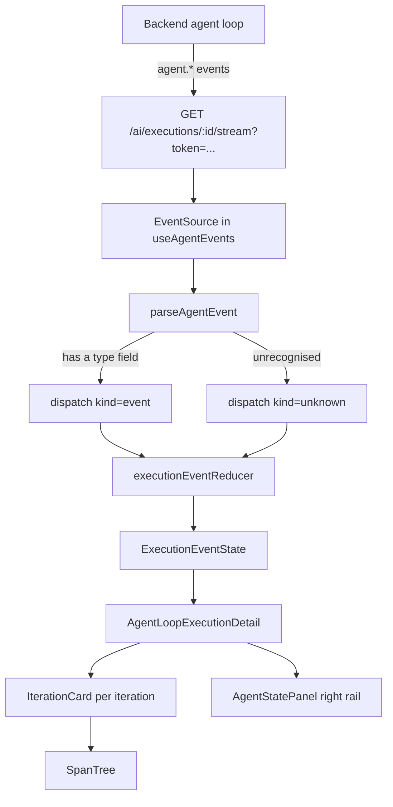
```mermaid
flowchart TD
    BE["Backend agent loop"] -->|"agent.* events"| SSE["GET /ai/executions/:id/stream?token=..."]
    SSE --> ES["EventSource in useAgentEvents"]
    ES --> PARSE["parseAgentEvent"]
    PARSE -->|"has a type field"| DISP["dispatch kind=event"]
    PARSE -->|"unrecognised"| UNK["dispatch kind=unknown"]
    DISP --> RED["executionEventReducer"]
    UNK --> RED
    RED --> ST["ExecutionEventState"]
    ST --> ALED["AgentLoopExecutionDetail"]
    ALED --> IC["IterationCard per iteration"]
    IC --> SPT["SpanTree"]
    ALED --> ASP["AgentStatePanel right rail"]
```

The derived state shape (`ExecutionEventState`):

| Field | Type | Fed by |
|-------|------|--------|
| `iterations` | `Record<number, IterationSlice>` | `iteration_start`, `iteration_end`, `critic_*`, `retry_*`, `resume` |
| `iterationOrder` | `number[]`, kept sorted | any slice write |
| `banditUpdates` | append-only array | `bandit_arm_updated` |
| `replans` | append-only array | `replan_triggered` |
| `taskClass` | `string` | `task_class_classified` |
| `costByAttribution` | `Partial<Record<CostAttribution, number>>`, summed | `cost_charged` |
| `spans` | flat `Record<span_id, TraceSpan>` | `span_open`, `span_close` |
| `unknownEvents` | `unknown[]` | anything unparseable, kept for debugging |

Spans are stored **flat**, keyed by `span_id`, and merged on `span_close` so a
close event enriches the already-open span with `duration_ms`, `cost_usd`,
tokens and `child_run_id`. Tree assembly happens in the component, not the
reducer — see [§12](#12-deep-dive-executiondetail-and-the-agent-kernel-widgets).

The reducer is a **pure function** exported separately from the hook, which is
exactly why it is the one piece of this frontend with real unit tests.

### 8.3 Belt and braces: SSE plus REST polling

`AgentLoopExecutionDetail` does not trust SSE alone.

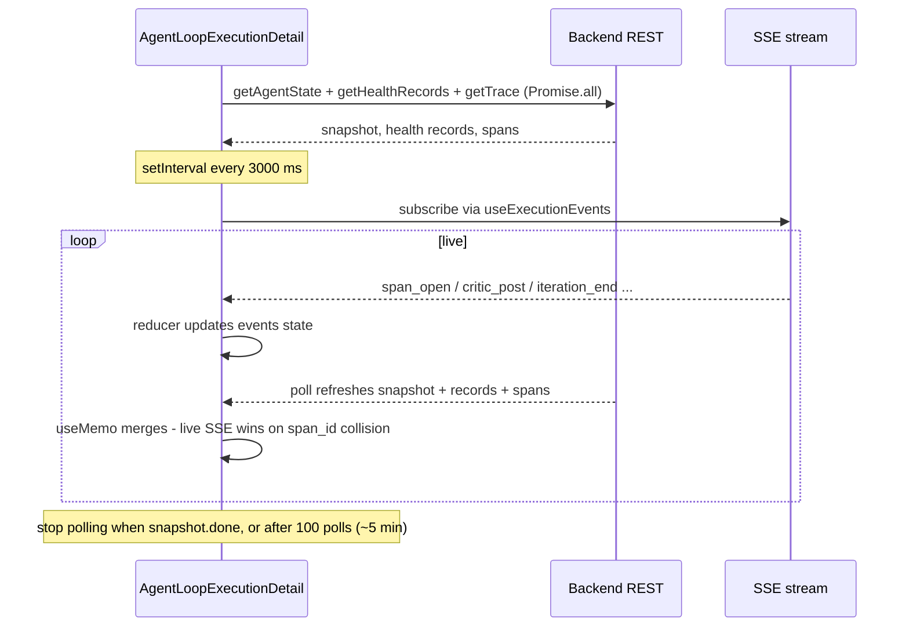
```mermaid
sequenceDiagram
    participant C as AgentLoopExecutionDetail
    participant API as Backend REST
    participant SSE as SSE stream

    C->>API: getAgentState + getHealthRecords + getTrace (Promise.all)
    API-->>C: snapshot, health records, spans
    Note over C: setInterval every 3000 ms
    C->>SSE: subscribe via useExecutionEvents

    loop live
        SSE-->>C: span_open / critic_post / iteration_end ...
        C->>C: reducer updates events state
        API-->>C: poll refreshes snapshot + records + spans
        C->>C: useMemo merges - live SSE wins on span_id collision
    end

    Note over C: stop polling when snapshot.done, or after 100 polls (~5 min)
```

The reason is in the code comment:

```tsx
// frontend/src/components/agent/AgentLoopExecutionDetail.tsx:43
// Poll the agent-state snapshot + health records over REST. This drives
// the AgentState rail and backfills the iteration timeline, and — unlike
// the SSE stream (which a buffering reverse proxy can block) — works
// everywhere.
```

Apache buffering can swallow SSE, so the REST poll is the guaranteed path and
SSE is the low-latency bonus. The merge is explicit: REST spans first, then live
spans overwrite by `span_id` (`AgentLoopExecutionDetail.tsx:124-147`).

### 8.4 Audio: there is no WebSocket in the browser

Despite the platform's live voice pipeline, **the frontend opens zero
WebSockets.** Grepping `src/` for `WebSocket`, `AudioContext`, `MediaRecorder`
or `getUserMedia` returns nothing but a comment. All the bidirectional audio
happens server-side between Twilio/Exotel and the voice service (see
[12 — Voice & telephony](12-voice-and-telephony.md)).

What the browser does is **play back finished recordings** with a plain
`<audio>` element:

```tsx
// frontend/src/pages/streaming/CallDetailPage.tsx:103
const getRecordingUrl = () => {
    if (!session?.recording_url) return null;
    const base = import.meta.env.VITE_API_BASE_URL?.replace('/api/v1', '') || '';
    const url = `${base}${session.recording_url}`;
    // Append JWT token for authentication (the download endpoint supports ?token=)
    return token ? `${url}${url.includes('?') ? '&' : '?'}token=${token}` : url;
};
```

`Artifacts.tsx` has its own inline `AudioPlayer` component with a scrub bar for
recording-category artifacts. Both put a JWT in a URL, which will show up in
proxy access logs — a known trade-off of `<audio src>` not supporting headers.

---

## 9. The design system

### 9.1 Three stylesheets, loaded in order

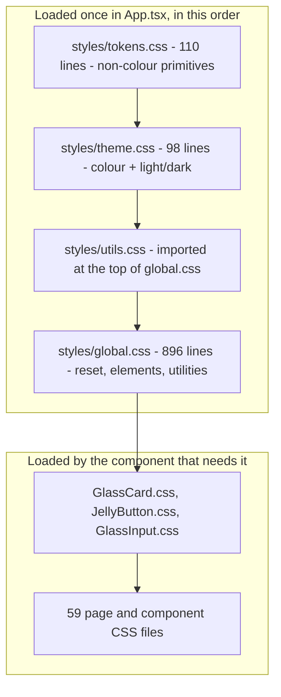
```mermaid
graph TB
    subgraph Global["Loaded once in App.tsx, in this order"]
        T["styles/tokens.css - 110 lines - non-colour primitives"]
        TH["styles/theme.css - 98 lines - colour + light/dark"]
        G["styles/global.css - 896 lines - reset, elements, utilities"]
        U["styles/utils.css - imported at the top of global.css"]
    end
    subgraph Component["Loaded by the component that needs it"]
        CC["GlassCard.css, JellyButton.css, GlassInput.css"]
        PC["59 page and component CSS files"]
    end
    T --> TH --> U --> G --> CC --> PC
```

There is **no CSS-in-JS and no Tailwind**. `global.css` hand-rolls a small set
of Tailwind-lookalike utility classes (`.flex`, `.gap-4`, `.mb-6`, `.w-full`,
`.text-sm`) so JSX reads like Tailwind without the toolchain. The set is
incomplete, so `MainLayout.tsx` uses classes such as `border-white/5` and
`space-y-2` that **do not exist** in any stylesheet and silently do nothing.

> Also note `global.css` defines `.gap-1` **three times** (lines 312, 480, 579),
> and the last definition sets it to `var(--spacing-4)` — so `gap-1` is
> effectively `gap-4`. Duplicated `.gap-2/3/4/6/8` blocks exist too.

### 9.2 Token reference

Non-colour tokens, from [`styles/tokens.css`](../../frontend/src/styles/tokens.css):

| Group | Tokens |
|-------|--------|
| Font family | `--font-family-primary` (Inter), `--font-family-mono` (JetBrains Mono) |
| Font size | `--font-size-xs` 12px, `-sm` 13px, `-base` 15px, `-md` 16px, `-lg` 18px, `-xl` 20px, `-2xl` 24px, `-3xl` 32px, `-4xl` 40px |
| Font weight | `--font-weight-light/normal/medium/semibold/bold` = 300/400/500/600/700 |
| Line height | `--line-height-tight` 1.2, `-snug` 1.4, `-normal` 1.6 |
| Spacing | `--spacing-0/1/2/3/4/6/8/10/12/16/20` on a 4px scale, plus aliases `--spacing-xs/sm/md/lg/xl` |
| Blur | `--blur-xs` 4px, `-sm` 8px, `-md` 16px, `-lg` 24px, `-xl` 40px |
| Shadow | `--shadow-sm/md/lg`, `--shadow-inner`, `--shadow-rose-glow` |
| Radius | `--radius-xs` 2px … `--radius-2xl` 32px, `--radius-full` 9999px |
| Transition | `--transition-fast` 150ms, `-base` 300ms, `-slow` 500ms, `-spring` cubic-bezier overshoot |
| Z-index | `--z-base` 1, `--z-nav` 100, `--z-sticky` 150, `--z-overlay` 200, `--z-modal` 500, `--z-tooltip` 1000 |

Colour tokens, from [`styles/theme.css`](../../frontend/src/styles/theme.css):

| Token | Dark (default) | Light (`[data-theme='light']`) |
|-------|----------------|-------------------------------|
| `--color-bg-primary` | `#050505` | `#fdfdfd` |
| `--color-bg-secondary` | `#0c0c0c` | `#ffffff` |
| `--color-bg-tertiary` | `#121212` | `#f8fafc` |
| `--color-bg-surface` | `#181818` | `#f1f5f9` |
| `--color-text-primary` | `#ffffff` | `#1e293b` |
| `--color-text-secondary` | `rgba(255,255,255,.75)` | `#475569` |
| `--color-text-tertiary` | `rgba(255,255,255,.5)` | `#64748b` |
| `--color-text-muted` | `rgba(255,255,255,.3)` | `#94a3b8` |
| `--color-glass-bg` | `rgba(20,20,20,.4)` | `rgba(255,255,255,.7)` |
| `--color-glass-stroke` | `rgba(255,255,255,.08)` | `rgba(0,0,0,.06)` |
| `--color-glass-stroke-bright` | `rgba(255,255,255,.15)` | `rgba(0,0,0,.12)` |
| `--color-glass-overlay` | `rgba(255,255,255,.03)` | `rgba(0,0,0,.02)` |
| `--liquid-bg-1/2/3` | rose-gold + white radial gradients | rose-gold + blue + purple radials |

Theme-independent colours (defined once on `:root`):

| Token | Value |
|-------|-------|
| `--color-accent-primary` | `#c58e7f` (rose gold) |
| `--color-accent-secondary` | `#e8c4b9` |
| `--color-accent-tertiary` | `#8e5a4f` |
| `--color-success` | `#52c41a` |
| `--color-error` | `#ff4d4f` |
| `--color-warning` | `#faad14` |
| `--color-info` | `#1890ff` |
| `--gradient-rose-gold` | `linear-gradient(135deg, #c58e7f, #e8c4b9 50%, #a46d5f)` |
| `--gradient-rose-gold-light` | `linear-gradient(135deg, #d4a397, #f2d7cf)` |
| `--gradient-rose-gold-text` | `linear-gradient(to right, #c58e7f, #f2d7cf, #a46d5f)` |
| `--gradient-gold` | alias of `--gradient-rose-gold` |

### 9.3 The "Liquid Glass" look

Three ingredients stacked in z-order:

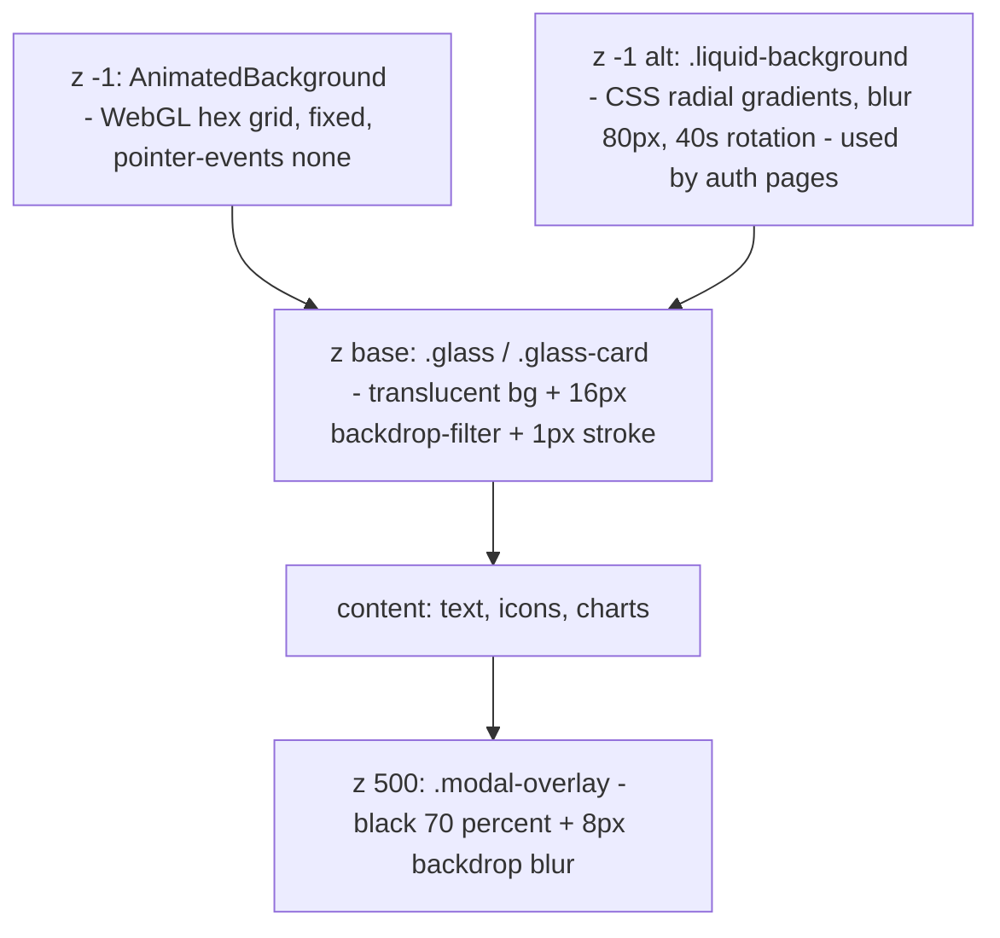
```mermaid
graph TB
    L1["z -1: AnimatedBackground - WebGL hex grid, fixed, pointer-events none"]
    L2["z -1 alt: .liquid-background - CSS radial gradients, blur 80px, 40s rotation - used by auth pages"]
    L3["z base: .glass / .glass-card - translucent bg + 16px backdrop-filter + 1px stroke"]
    L4["content: text, icons, charts"]
    L5["z 500: .modal-overlay - black 70 percent + 8px backdrop blur"]
    L1 --> L3
    L2 --> L3
    L3 --> L4
    L4 --> L5
```

The glass recipe is four CSS lines:

```css
/* frontend/src/styles/theme.css:81 */
.glass {
    background: var(--color-glass-bg);
    border: 1px solid var(--color-glass-stroke);
    backdrop-filter: blur(var(--blur-md));
    -webkit-backdrop-filter: blur(var(--blur-md));
}
```

Note that the CSS `.liquid-background` and the WebGL `AnimatedBackground` are
**two different backgrounds**. `App.tsx` always mounts the WebGL one; the auth
pages additionally render `<div className="liquid-background" />`, so on the
login screen both are painting.

### 9.4 The shared components

| Component | File | What it is |
|-----------|------|-----------|
| `GlassCard` | [`ui/GlassCard.tsx`](../../frontend/src/components/ui/GlassCard.tsx) | `motion.div` with `.glass-card`, an optional `hover` lift of `y: -4`, and a `.glass-card-shine` overlay |
| `JellyButton` | [`ui/JellyButton.tsx`](../../frontend/src/components/ui/JellyButton.tsx) | `motion.button`, variants `primary \| secondary \| ghost \| danger`, sizes `sm \| md \| lg`, plus a `roseGold` boolean. Hover `scale 1.02, y -2`; tap `scale 0.98`; spring `stiffness 400, damping 10` |
| `GlassInput` | [`ui/GlassInput.tsx`](../../frontend/src/components/ui/GlassInput.tsx) | Floating-label input. The label animates to `y: -28, scale: 0.85` on focus or when it has a value; an animated underline scales in on focus; errors fade in via `AnimatePresence` |
| `AccessibleChart` | [`ui/AccessibleChart.tsx`](../../frontend/src/components/ui/AccessibleChart.tsx) | `<figure role="figure" aria-label>` + `<figcaption>` + inner `role="img"` wrapper so Recharts SVGs get a screen-reader summary |

`ui/index.ts` re-exports the first three; `AccessibleChart` has to be imported
by path plus its CSS.

> **`GlassInput` only floats its label if you pass `value`.** `hasValue` is
> computed from `props.value`, so an uncontrolled input keeps the label sitting
> over the typed text.

> **`AccessibleChart` is used on exactly one page** —
> [`AppAdminDashboard.tsx`](../../frontend/src/pages/dashboards/AppAdminDashboard.tsx).
> The other 12 chart-bearing pages render bare Recharts with no accessible name.
> Its own docblock cites "R-FE-9 in the Phase 11 frontend risk register", so the
> intent was clearly wider adoption.

### 9.5 Dark mode

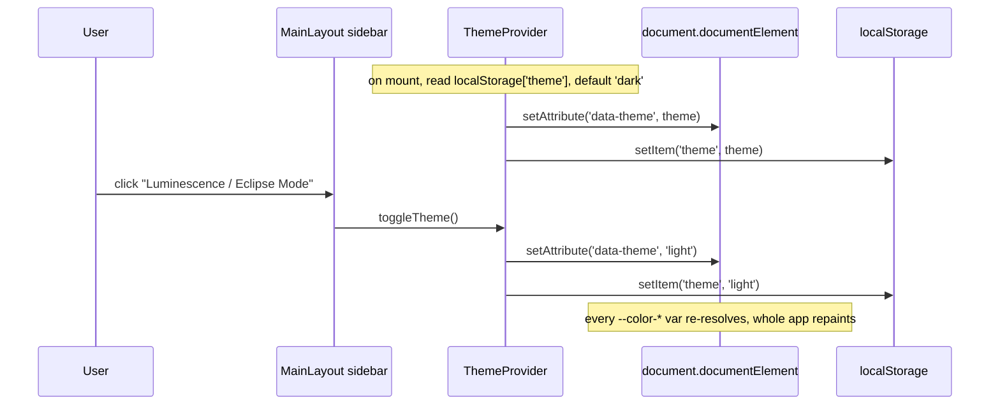
```mermaid
sequenceDiagram
    participant U as User
    participant SB as MainLayout sidebar
    participant TH as ThemeProvider
    participant HTML as document.documentElement
    participant LS as localStorage

    Note over TH: on mount, read localStorage['theme'], default 'dark'
    TH->>HTML: setAttribute('data-theme', theme)
    TH->>LS: setItem('theme', theme)
    U->>SB: click "Luminescence / Eclipse Mode"
    SB->>TH: toggleTheme()
    TH->>HTML: setAttribute('data-theme', 'light')
    TH->>LS: setItem('theme', 'light')
    Note over HTML: every --color-* var re-resolves, whole app repaints
```

The system never consults `prefers-color-scheme`. Light mode is also only
partially honoured: many component stylesheets hard-code `rgba(255,255,255,…)`
overlays that assume a dark ground, and the WebGL background is unconditionally
dark.

---

## 10. Page-by-page catalogue

Role column = what the **router** enforces. Where the sidebar is stricter, that
is noted.

### 10.1 Auth and onboarding

| File | Route | Purpose | Key API calls | Role |
|------|-------|---------|---------------|------|
| [`auth/LoginPage.tsx`](../../frontend/src/pages/auth/LoginPage.tsx) | `/login` | Email + password sign-in | via `useAuth.login` → `/auth/login`, `/auth/me` | public |
| [`auth/RegisterPage.tsx`](../../frontend/src/pages/auth/RegisterPage.tsx) | `/register` | Self-service signup | `useAuth.register` → `/auth/register` | public |
| [`auth/PasswordReset.tsx`](../../frontend/src/pages/auth/PasswordReset.tsx) | `/forgot-password`, `/reset-password` | Two components in one file | `POST /auth/forgot-password`, `POST /auth/reset-password` | public |
| [`auth/OAuthCallback.tsx`](../../frontend/src/pages/auth/OAuthCallback.tsx) | `/auth/callback` | Exchanges the OAuth code for tokens | `oauthService.handleCallback` | none |
| [`OnboardingWizard.tsx`](../../frontend/src/pages/OnboardingWizard.tsx) | `/onboarding` | 4-step first-run wizard: `company_profile` → `integrations` → `first_agent` → `phone_number` | `onboardingService.getStatus/completeStep/finalizeOnboarding/skipOnboarding` | any authed |

### 10.2 Dashboards

| File | Route | Purpose | Key API calls | Role |
|------|-------|---------|---------------|------|
| [`Dashboard.tsx`](../../frontend/src/pages/Dashboard.tsx) | `/dashboard` | Switchboard: renders one of six role dashboards | none directly | any authed |
| `dashboards/AppAdminDashboard.tsx` | (via `/dashboard`) | Global liability, run trends, model cost | `getWalletLiability`, `getExecutionHealth(30, true)`, `getLLMPerformance(30, true)` | `app_admin` |
| `dashboards/AppUserDashboard.tsx` | (via `/dashboard`) | Ops view: run health, tool efficacy, HITL queue | `getExecutionHealth`, `getToolEfficacy`, `getHitlOverview` | `app_user` |
| `dashboards/PartnerAdminDashboard.tsx` | (via `/dashboard`) | Portfolio revenue + usage | `getPartnerPerformance`, `getUsageBreakdown` | `partner_admin` |
| `dashboards/PartnerUserDashboard.tsx` | (via `/dashboard`) | Tenant health list | `getTenantHealth` | `partner_user` |
| `dashboards/TenantAdminDashboard.tsx` | (via `/dashboard`) | Agent errors, campaign analytics, credit forecast | `getAgentErrors`, `getCampaignAnalytics`, `getCreditForecast` | `tenant_admin` |
| `dashboards/TenantUserDashboard.tsx` | (via `/dashboard`) | My tasks + my approvals | `getPersonalTasks`, `getHitlOverview` | `tenant_user` |
| `dashboards/DashboardShared.tsx` | — | Not a page: exports `StatCard`, `SectionTitle`, `EmptyChart`, `CHART_COLORS`, `fmtUSD`, `fmtPct` | — | — |
| [`PartnerDashboard.tsx`](../../frontend/src/pages/PartnerDashboard.tsx) | `/partner` | Tenant roster with health scores and drill-down | `partnerService.getTenants/getTenantDetails/getAnalytics` | any authed (sidebar: 2 admins) |
| [`dashboards/KPIDashboard.tsx`](../../frontend/src/pages/dashboards/KPIDashboard.tsx) | `/admin/agent-kernel/kpi` | 6 tabs: runs, cost, critic, meta, memory, loop | `kpiService.getRunHealth/getCostBreakdown/getCriticHealth/getMetaAgentHealth` | 3 admins |

### 10.3 AI workspace

| File | Route | Purpose | Key API calls | Role |
|------|-------|---------|---------------|------|
| [`ai/EntityLibrary.tsx`](../../frontend/src/pages/ai/EntityLibrary.tsx) | `/ai/entities` | Grid of entities, filter by type, delete, convert-to-template, promote draft | `GET/DELETE /ai/entities`, `templateService.convertToTemplate`, `metaService.promoteDraftEntity` | any authed |
| [`ai/EntityBuilder.tsx`](../../frontend/src/pages/ai/EntityBuilder.tsx) | `/ai/entities/create`, `/edit/:id` | Thin shell: load, save, error banner | `GET/POST/PUT /ai/entities` | any authed |
| [`ai/EntityConfigurationTabs.tsx`](../../frontend/src/pages/ai/EntityConfigurationTabs.tsx) | (child of builder) | **1780 lines.** The whole entity editor | `/ai/tools`, `/companies`, `/artifacts`, `/ai/documents`, `/cortex/trees`, `/ai/avatar/upload`, `/ai/context-sources/upload` | — |
| [`ai/EntityFlow.tsx`](../../frontend/src/pages/ai/EntityFlow.tsx) | (child of Hierarchy tab) | ReactFlow canvas | `GET /ai/entities`, `GET /ai/tools` | — |
| [`ai/ExecutionPage.tsx`](../../frontend/src/pages/ai/ExecutionPage.tsx) | `/ai/execute/:id` | Fill input variables and launch a run | `GET /ai/entities/:id`, `POST /ai/execute` | any authed |
| [`ai/ExecutionHistory.tsx`](../../frontend/src/pages/ai/ExecutionHistory.tsx) | `/ai/executions` | Run list with status filter | `GET /ai/executions` | any authed |
| [`ai/ExecutionDetail.tsx`](../../frontend/src/pages/ai/ExecutionDetail.tsx) | `/ai/executions/:id` | **1111 lines.** Trace view, retry, refine, artifact download | `GET /ai/executions/:id`, `POST .../retry`, `POST .../refine` | any authed |
| [`ai/HITLPanel.tsx`](../../frontend/src/pages/ai/HITLPanel.tsx) | `/ai/approvals` | Approve/reject pending human checkpoints | `GET /ai/approvals/pending`, `POST /ai/approvals/:id/respond` | any authed |
| [`ai/TemplateMarketplace.tsx`](../../frontend/src/pages/ai/TemplateMarketplace.tsx) | `/ai/templates` | Browse and clone entity templates | `templateService.listTemplates/cloneTemplate/deleteTemplate` | any authed |
| [`ai/ToolManagement.tsx`](../../frontend/src/pages/ai/ToolManagement.tsx) | `/ai/tool-registry` | Tool registry CRUD, enable/disable, sync built-ins | `toolService.*` | `app_admin` |
| [`ai/CortexExplorer.tsx`](../../frontend/src/pages/ai/CortexExplorer.tsx) | `/cortex` | List memory trees, suspend/resume | `cortexService.listTrees/resumeTree/suspendTree` | any authed |
| [`ai/CortexTreeDetail.tsx`](../../frontend/src/pages/ai/CortexTreeDetail.tsx) | `/cortex/trees/:treeId` | Viewport navigation through a tree, paged node reads, assemble output | `cortexService.getTree/navigate/readNode/assembleOutput` | any authed |

### 10.4 Communications

| File | Route | Purpose | Key API calls | Role |
|------|-------|---------|---------------|------|
| [`PhonePool.tsx`](../../frontend/src/pages/PhonePool.tsx) | `/phone-numbers` | 759 lines. Number inventory: add, bulk, sync, claim, assign, release, delete | `phonePoolService.*` plus raw `fetch` to `/ai/entities`, `/companies` | any authed |
| [`streaming/StreamingSessionsPage.tsx`](../../frontend/src/pages/streaming/StreamingSessionsPage.tsx) | `/streaming/sessions` | Voice + WhatsApp session list with a detail drawer | raw `fetch`: `/streaming/voice-sessions`, `/streaming/whatsapp-sessions`, `/streaming/stats?days=7` | any authed |
| [`streaming/CampaignsPage.tsx`](../../frontend/src/pages/streaming/CampaignsPage.tsx) | `/streaming/campaigns` | Campaign list, status changes, retry-failed, CSV exports | raw `fetch`: `/campaigns`, `/campaigns/retry-failed`, `/campaigns/interested/download` | any authed |
| [`streaming/CampaignCreateModal.tsx`](../../frontend/src/pages/streaming/CampaignCreateModal.tsx) | (modal) | CSV upload then campaign create | `apiClient.get('/ai/entities')`, raw `fetch` `/campaigns/upload-csv`, `/campaigns` | — |
| [`streaming/CampaignDetailPage.tsx`](../../frontend/src/pages/streaming/CampaignDetailPage.tsx) | `/streaming/campaigns/:campaignId` | Per-campaign contacts and results | raw `fetch`: `/campaigns/:id`, `/campaigns/:id/download` | any authed |
| [`streaming/CallDetailPage.tsx`](../../frontend/src/pages/streaming/CallDetailPage.tsx) | `/streaming/calls/:sessionId` | Transcript, recording playback, AI summary, editable next-action | raw `fetch`: `/streaming/voice-sessions/:id`, `PATCH .../next-action` | any authed |

### 10.5 Assets, knowledge and integrations

| File | Route | Purpose | Key API calls | Role |
|------|-------|---------|---------------|------|
| [`KnowledgeBase.tsx`](../../frontend/src/pages/KnowledgeBase.tsx) | `/knowledge` | Document upload, list, delete, semantic search | `/ai/documents`, `/ai/documents/upload`, `/ai/documents/search` | any authed |
| [`artifacts/Artifacts.tsx`](../../frontend/src/pages/artifacts/Artifacts.tsx) | `/artifacts` | Unified artifact browser with inline audio/image preview | `artifactService.list/upload/delete`, `apiClient.get('/artifacts/:id/download')` | any authed |
| [`IntegrationsPage.tsx`](../../frontend/src/pages/IntegrationsPage.tsx) | `/integrations` | Provider credentials + email connections | `integrationService.*`, `emailService.*` | any authed |
| [`ai-config/AIModelConfigPage.tsx`](../../frontend/src/pages/ai-config/AIModelConfigPage.tsx) | `/ai-config` | Map task types to integrations, single vs router mode | `aiConfigService.*`, `integrationService.getIntegrations` | `app_admin`, `tenant_admin` |

### 10.6 Platform, billing, reports

| File | Route | Purpose | Key API calls | Role |
|------|-------|---------|---------------|------|
| [`PlatformManagement.tsx`](../../frontend/src/pages/PlatformManagement.tsx) | `/platform-management` | Partners, tenants and users in one tabbed console | `companyService.*`, `userService.*` | 3 admins |
| [`UserSettings.tsx`](../../frontend/src/pages/UserSettings.tsx) | `/profile` | Name, password, avatar, company logo | `PUT /auth/profile`, `PUT /auth/password`, `profileService.uploadAvatar/uploadLogo` | any authed |
| [`billing/WalletPage.tsx`](../../frontend/src/pages/billing/WalletPage.tsx) | `/wallet` | Balance, Razorpay top-up, subscription purchase/cancel | `creditsService.*` + `window.Razorpay` | any authed |
| [`billing/BillingSettings.tsx`](../../frontend/src/pages/billing/BillingSettings.tsx) | `/settings/billing` | Multiplier, fees, discount, subscription tiers | `billingService.getConfig/updateConfig/*SubscriptionTier` | `app_admin` |
| [`reports/CostingReport.tsx`](../../frontend/src/pages/reports/CostingReport.tsx) | `/reports/costing` | Monthly cost breakdown by grouping | `billingService.getCostingReport` | any authed (sidebar: `app_admin`) |
| `reports/AppAdminReports.tsx` | `/reports/analytics/app-admin` | 7-panel platform analytics | 7 `reportsService` calls | `app_admin` |
| `reports/AppUserReports.tsx` | `/reports/analytics/app-user` | Ops + incidents + data growth | 5 `reportsService` calls | `app_admin`, `app_user` |
| `reports/PartnerAdminReports.tsx` | `/reports/analytics/partner-admin` | Tenant health portfolio | `getTenantHealth` | `app_admin`, `partner_admin` |
| `reports/PartnerUserReports.tsx` | `/reports/analytics/partner-user` | Tenant support view | `getTenantHealth` | 3 roles |
| `reports/TenantAdminReports.tsx` | `/reports/analytics/tenant-admin` | 6-panel tenant operations | 6 `reportsService` calls | 3 admins |
| `reports/TenantUserReports.tsx` | `/reports/analytics/tenant-user` | My tasks, my approvals, credit forecast | 3 `reportsService` calls | any authed |

### 10.7 Agent-kernel admin

| File | Route | Purpose | Key API calls | Role |
|------|-------|---------|---------------|------|
| [`admin/MetaIntelligencePage.tsx`](../../frontend/src/pages/admin/MetaIntelligencePage.tsx) | `/admin/agent-kernel/meta-intelligence` | Skill candidates, anti-patterns, prompt candidates — with promote/approve | `metaService.*` | 3 admins |
| [`admin/CostAttributionDashboard.tsx`](../../frontend/src/pages/admin/CostAttributionDashboard.tsx) | `/admin/agent-kernel/cost` | Cost by the 14 attribution tags over 24h/7d/30d | `kpiService.getCostBreakdown` | 3 admins |
| [`admin/FeatureFlagsPage.tsx`](../../frontend/src/pages/admin/FeatureFlagsPage.tsx) | `/admin/agent-kernel/feature-flags` | View effective flags, set/remove global and company overrides | `featureFlagsService.*` | 3 admins |
| [`admin/RiskAndExitPage.tsx`](../../frontend/src/pages/admin/RiskAndExitPage.tsx) | `/admin/agent-kernel/risks` | Risk indicators, exit checklist, append-only decision log | `kpiService.getRiskIndicators/getExitChecklist/listDecisions/appendDecision` | 3 admins |

### 10.8 Dead code you can delete

These files compile and are never reached:

| File | Lines | Why it is dead |
|------|-------|----------------|
| [`pages/assets/AssetLibrary.tsx`](../../frontend/src/pages/assets/AssetLibrary.tsx) | 314 | Superseded by `Artifacts.tsx`; `/assets` redirects to `/artifacts`. Nothing imports it. |
| [`pages/reports/BillingReport.tsx`](../../frontend/src/pages/reports/BillingReport.tsx) | 171 | Never routed, never imported. |
| [`pages/streaming/PhoneNumbersPage.tsx`](../../frontend/src/pages/streaming/PhoneNumbersPage.tsx) | 516 | Superseded by `PhonePool.tsx`; `/streaming/phone-numbers` redirects away. Still exported from `streaming/index.ts`. |
| [`components/ToolSelectionPanel.tsx`](../../frontend/src/components/ToolSelectionPanel.tsx) | 107 | Its job was absorbed into the Capabilities tab. Nothing imports it. |
| [`components/agent/PlanCandidatesCompare.tsx`](../../frontend/src/components/agent/PlanCandidatesCompare.tsx) | 131 | Fully built modal; never mounted anywhere. |
| [`components/agent/SupervisorAndBandit.tsx`](../../frontend/src/components/agent/SupervisorAndBandit.tsx) | 201 | `SupervisorVerdictCard`, `CriticCostShareGauge`, `BanditArmsPanel` — all three unused. |
| `ProvenanceRibbon` in `components/agent/AgentKernel.tsx` | ~30 | Exported, never used. |
| `components/agent/cortex-helpers.ts` | 46 | Only its own test imports it. |
| [`hooks/useSSE.ts`](../../frontend/src/hooks/useSSE.ts) | 58 | Superseded by `useAgentEvents`. |
| `services/asset.service.ts` | 80 | Only `AssetLibrary` uses it. |

That is roughly **1,650 lines of unreferenced code**, plus their CSS. Worth
noting that `agent.service.getPlanCandidates` and `getBanditState` exist purely
to feed the two unmounted components.

---

## 11. Deep dive: EntityConfigurationTabs

[`pages/ai/EntityConfigurationTabs.tsx`](../../frontend/src/pages/ai/EntityConfigurationTabs.tsx)
is 1780 lines — the largest file in the frontend and the beating heart of the
product. It edits one `HierarchicalEntity` across six tabs.

### 11.1 Tabs and what each one writes

| Tab | Question it answers | Entity fields it produces |
|-----|---------------------|---------------------------|
| **Basics** | What is this entity? | `name`, `type`, `description`, `version`, `status`, `tags`, `io_contract.input_schema/output_schema`, plus a company picker for admins |
| **Hierarchy** | What does it compose? | Renders `<EntityFlow>`; produces `planning.static_plan.steps` and `hierarchy.children` |
| **Brain** | How does it think and speak? | `identity.*` — role, bio, avatar, `personality` matrix (tone/verbosity/empathy/humour/formality/decision confidence), `voice` (18 Gemini voices, language, rate, pitch), `system_prompt`, `behavioral_constraints`, `few_shot_examples`, greeting/escalation/closing templates, plus top-level `goal` |
| **Planning** | What is the strategy? | `logic_gate.reasoning_config` (task type, temperature, top-p, max tokens, reasoning mode, model, autonomous-mode knobs), `logic_gate.retry_policy`, `logic_gate.review_mechanism`, `planning.static_plan.enabled/fallback_behavior`, `planning.dynamic_planning.*`, `planning.loop_control` |
| **Capabilities** | What can it use? | `capabilities.tools` with per-tool `usage` (`AUTONOMOUS`/`PLANNED`/`BOTH`), `capabilities.memory` (STANDARD vs CORTEX + `cortex_config`), `capabilities.context_engineering.context_sources`, `logic_gate.context_policy` |
| **Safeguards** | What are the limits? | `governance.max_cost_usd/timeout_ms/execution_limits/checkpoint_every_n_steps`, `governance.hitl_checkpoints[]`, `observability.{log_level,log_thoughts,track_cost}` |

### 11.2 State management

There is no reducer and no form library. The component declares **roughly 70
individual `useState` hooks**, each initialised from a path on the `entity` prop
with a `||` or `??` default:

```tsx
// frontend/src/pages/ai/EntityConfigurationTabs.tsx:185
const [tone, setTone] = useState(entity?.identity?.personality?.tone || 'professional');
const [verbosity, setVerbosity] = useState(entity?.identity?.personality?.verbosity || 'concise');
const [empathyLevel, setEmpathyLevel] = useState<number>(entity?.identity?.personality?.empathy_level ?? 0.7);
```

> **The critical consequence:** `useState(initial)` only reads `initial` on the
> *first* render. `EntityBuilder` renders `<EntityConfigurationTabs entity={entity}>`
> before the `GET /ai/entities/:id` resolves, and `EntityBuilder` guards with
> `{loading && !entity ? <spinner/> : <EntityConfigurationTabs .../>}`
> ([`EntityBuilder.tsx:98`](../../frontend/src/pages/ai/EntityBuilder.tsx:98)),
> which happens to work because `loading` starts `false` only until the effect
> fires. It is fragile: any change that lets the component mount with
> `entity === undefined` and then hydrate will silently show an empty form. There
> is no `key={entity?.id}` remount guard.

### 11.3 Save: 70 state variables → one JSON body

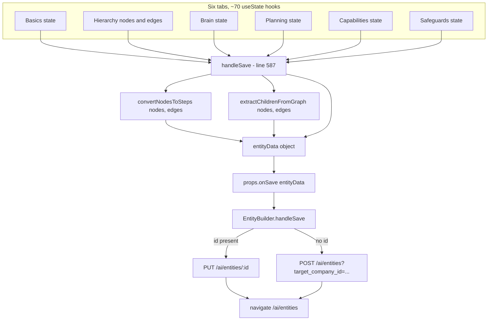
```mermaid
flowchart TD
    subgraph Tabs["Six tabs, ~70 useState hooks"]
        B1["Basics state"]
        B2["Hierarchy nodes and edges"]
        B3["Brain state"]
        B4["Planning state"]
        B5["Capabilities state"]
        B6["Safeguards state"]
    end
    HS["handleSave - line 587"]
    B1 --> HS
    B2 --> HS
    B3 --> HS
    B4 --> HS
    B5 --> HS
    B6 --> HS

    HS --> C1["convertNodesToSteps nodes, edges"]
    HS --> C2["extractChildrenFromGraph nodes, edges"]
    C1 --> BODY["entityData object"]
    C2 --> BODY
    HS --> BODY
    BODY --> CB["props.onSave entityData"]
    CB --> EB["EntityBuilder.handleSave"]
    EB -->|"id present"| PUT["PUT /ai/entities/:id"]
    EB -->|"no id"| POST["POST /ai/entities?target_company_id=..."]
    PUT --> NAV["navigate /ai/entities"]
    POST --> NAV
```

`handleSave` at line 587 is a single 100-line object literal. Two derivations
happen inside it:

```tsx
// frontend/src/pages/ai/EntityConfigurationTabs.tsx:567
const convertNodesToSteps = (nodes: Node[], edges: Edge[]) =>
    nodes.filter(n => n.id !== 'root').map((node, idx) => ({
        step_id: node.id, order: idx + 1, name: node.data.label,
        description: node.data.description || '',
        type: node.data.entityRef ? 'CHILD_ENTITY_INVOCATION'
            : node.data.toolRef ? 'TOOL_CALL'
            : (node.data.stepType || 'ACTION'),
        target: {
            entity_id: node.data.entityRef?.id, tool_id: node.data.toolRef?.tool_id,
            prompt_template: !node.data.entityRef && !node.data.toolRef ? node.data.description : undefined,
            input_dependencies: edges.filter(e => e.target === node.id).map(e => e.source),
        },
        required: node.data.required ?? true,
    }));
```

Note `order: idx + 1` uses **array order, not topological order** — the graph's
own execution order (computed in `EntityFlow`) is discarded on save. Dependencies
survive only through `input_dependencies`.

Other save-time behaviours:

- `display_name` is auto-derived: `personaRole ? `${name} - ${personaRole}` : name`.
- `identity.bio` falls back to `description`.
- The `voice` block and greeting/escalation/closing templates are **omitted
  entirely** unless the "voice agent" toggle is on.
- `cortex_config` is omitted unless `memoryMode === 'CORTEX'`.
- `io_contract` calls `JSON.parse(inputSchema)` **without a try/catch** — invalid
  JSON in either schema textarea throws inside the click handler and the save
  silently does nothing (React logs an uncaught error).
- `hierarchy.is_atomic` is `hierarchyNodes.length === 0`.

### 11.4 Context sources

The Capabilities tab has the most involved sub-UI: three panels (Documents,
Knowledge Base, CORTEX Trees) each feeding `contextSources[]`.

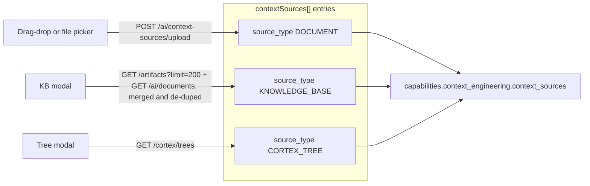
```mermaid
flowchart LR
    subgraph Sources["contextSources[] entries"]
        D["source_type DOCUMENT"]
        K["source_type KNOWLEDGE_BASE"]
        C["source_type CORTEX_TREE"]
    end
    UP["Drag-drop or file picker"] -->|"POST /ai/context-sources/upload"| D
    KB["KB modal"] -->|"GET /artifacts?limit=200 + GET /ai/documents, merged and de-duped"| K
    TR["Tree modal"] -->|"GET /cortex/trees"| C
    D --> SAVE["capabilities.context_engineering.context_sources"]
    K --> SAVE
    C --> SAVE
```

The KB modal merges two endpoints with `Promise.allSettled` and a `seenIds` set
so a document that is also registered as an artifact appears once
([`EntityConfigurationTabs.tsx:429-475`](../../frontend/src/pages/ai/EntityConfigurationTabs.tsx:429)).

---

## 12. Deep dive: ExecutionDetail and the agent-kernel widgets

[`pages/ai/ExecutionDetail.tsx`](../../frontend/src/pages/ai/ExecutionDetail.tsx)
is 1111 lines and contains **two entirely different UIs** behind one feature
flag.

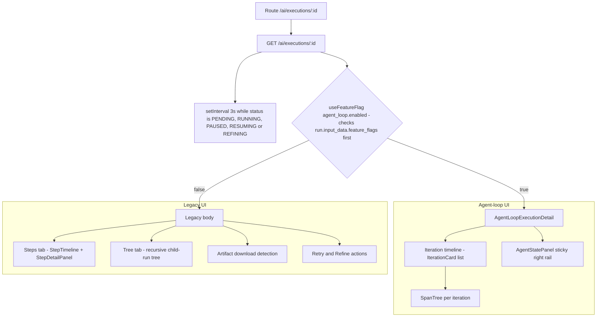
```mermaid
flowchart TD
    RT["Route /ai/executions/:id"] --> FETCH["GET /ai/executions/:id"]
    FETCH --> POLL["setInterval 3s while status is PENDING, RUNNING, PAUSED, RESUMING or REFINING"]
    FETCH --> FLAG{"useFeatureFlag agent_loop.enabled - checks run.input_data.feature_flags first"}
    FLAG -->|"true"| NEW["AgentLoopExecutionDetail"]
    FLAG -->|"false"| OLD["Legacy body"]

    subgraph NewUI["Agent-loop UI"]
        NEW --> TL["Iteration timeline - IterationCard list"]
        TL --> ST["SpanTree per iteration"]
        NEW --> RAIL["AgentStatePanel sticky right rail"]
    end

    subgraph OldUI["Legacy UI"]
        OLD --> TAB1["Steps tab - StepTimeline + StepDetailPanel"]
        OLD --> TAB2["Tree tab - recursive child-run tree"]
        OLD --> ART["Artifact download detection"]
        OLD --> ACT["Retry and Refine actions"]
    end
```

The flag is per-run, not just per-company:

```tsx
// frontend/src/pages/ai/ExecutionDetail.tsx:532
const agentLoopEnabled = useFeatureFlag('agent_loop.enabled', {
    defaultValue: false,
    runMeta: (run as any)?.input_data?.feature_flags as Record<string, boolean | undefined> | undefined,
});
```

### 12.1 The legacy body

- **Steps tab** — `StepTimeline` builds a vertical timeline from
  `run.result_data.steps`, and *flattens child-run steps into the same list*
  with `── AGENT: name ──` separator rows and `└ ` prefixes
  (`flattenChildSteps`). Clicking a step opens `StepDetailPanel` with the step
  output and its LLM interactions.
- **LLM log attribution** works by matching `LLMInteractionLog.step_name` to the
  step label. Tool logs have no `step_name`, so `getStepToolLogs` is a stub that
  literally `return false;` — tool calls are never attributed to a step in the
  legacy UI.
- **Artifact detection** (`getArtifactPath`) regex-scans `result_data`, every
  tool log output, and the final output for four different path patterns —
  `/api/v1/artifacts/{uuid}/download`, absolute `/artifact/...`, relative
  `artifact/...`, and legacy `/tmp/research_reports/*.pdf` — then recurses
  through `child_runs`. This is heuristic archaeology over unstructured strings
  and is the most brittle code in the frontend.
- **Retry** posts to `/ai/executions/:id/retry`; **Refine** posts free-text
  feedback to `/ai/executions/:id/refine`. Both navigate to the new run's page.

### 12.2 The agent-loop body

[`AgentLoopExecutionDetail.tsx`](../../frontend/src/components/agent/AgentLoopExecutionDetail.tsx)
is only 199 lines because all the merging is done in three `useMemo`s.

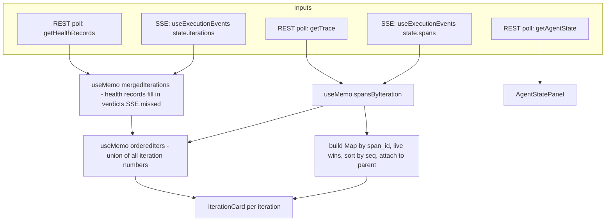
```mermaid
flowchart TD
    subgraph Inputs
        R1["REST poll: getAgentState"]
        R2["REST poll: getHealthRecords"]
        R3["REST poll: getTrace"]
        S1["SSE: useExecutionEvents state.iterations"]
        S2["SSE: useExecutionEvents state.spans"]
    end
    R2 --> M1["useMemo mergedIterations - health records fill in verdicts SSE missed"]
    S1 --> M1
    R3 --> M2["useMemo spansByIteration"]
    S2 --> M2
    M2 --> M2b["build Map by span_id, live wins, sort by seq, attach to parent"]
    M1 --> M3["useMemo orderedIters - union of all iteration numbers"]
    M2 --> M3
    M3 --> RENDER["IterationCard per iteration"]
    M2b --> RENDER
    R1 --> PANEL["AgentStatePanel"]
```

Why the merge exists: if you open the page mid-run, the SSE stream only carries
events from *now on*. The REST `health_records` and `trace` endpoints backfill
everything that already happened. On collision, live SSE data wins because it is
written into the map second.

### 12.3 The agent-kernel component family

| Component | File | Rendered by | Live? |
|-----------|------|-------------|-------|
| `BudgetBar` | `AgentKernel.tsx:45` | `AgentStatePanel` | yes |
| `ExecutorBadge` | `AgentKernel.tsx:95` | `AgentStatePanel`, `IterationCard` | yes |
| `ResumeIndicator` | `AgentKernel.tsx:111` | `IterationCard` | yes |
| `CriticVerdictChip` | `AgentKernel.tsx:155` | `IterationCard` | yes |
| `FailureTagChip` | `AgentKernel.tsx:199` | `IterationCard` | yes |
| `RetryStrategyBadge` | `AgentKernel.tsx:216` | `IterationCard` | yes |
| `ProvenanceRibbon` | `AgentKernel.tsx:241` | — | **no** |
| `AgentStatePanel` | `AgentStatePanel.tsx` | `AgentLoopExecutionDetail` | yes |
| `IterationCard` | `IterationCard.tsx` | `AgentLoopExecutionDetail` | yes |
| `SpanTree` / `SpanRow` | `SpanTree.tsx` | `IterationCard` | yes |
| `PlanCandidatesCompare` | `PlanCandidatesCompare.tsx` | — | **no** |
| `SupervisorVerdictCard`, `CriticCostShareGauge`, `BanditArmsPanel` | `SupervisorAndBandit.tsx` | — | **no** |

`SpanTree` recursively renders `SpanRow` with a `--depth` CSS variable for
indentation. Each row shows a kind icon (`🔄 ⚙️ ▸ 🧬 🔧 🧠 ⚖️`), status,
duration, cost and token counts; expanding reveals payload fields ordered by a
fixed preference list (`instruction`, `description`, `system_prompt`,
`user_prompt`, `args`, `input`, `response`, `output`, `skip_reason`) each with a
copy button. `child_run_id` becomes a `<Link>` to that sub-run's page.

`AgentStatePanel` renders budget, open subgoals, achieved subgoals, blockers,
last action/observation and the last five reflections — every array read guarded
with `?? []`.

---

## 13. Deep dive: EntityBuilder and EntityFlow

`EntityBuilder` is a 118-line shell. All the graph work is in
[`EntityFlow.tsx`](../../frontend/src/pages/ai/EntityFlow.tsx) (585 lines),
mounted inside the Hierarchy tab.

```mermaid
flowchart LR
    subgraph Left["Sidebar"]
        E["Entities tab - searchable, draggable"]
        CFG["Config tab - edit selected node"]
        ADD["Add Action Step button"]
    end
    subgraph Canvas["ReactFlow canvas"]
        N1["entityNode"]
        N2["toolNode"]
        ED["relationship edges - SEQUENTIAL, PARALLEL, CONDITIONAL"]
        BG2["Background + Controls + MiniMap"]
        P1["Panel top-right: layout direction, Auto-Layout, Save"]
        P2["Panel bottom-center: edge legend + validation counts"]
    end
    E -->|"HTML5 drag and drop"| N1
    CFG --> N1
    ADD --> N1
    N1 --- ED --- N2
```

### 13.1 Node and edge types

```ts
// frontend/src/pages/ai/EntityFlow.tsx:102
const nodeTypes = { entityNode: EntityNode, toolNode: ToolNode };
const edgeTypes = { relationship: RelationshipEdge };
```

| Type | File | Notes |
|------|------|-------|
| `entityNode` | [`builder-nodes/EntityNode.tsx`](../../frontend/src/pages/ai/builder-nodes/EntityNode.tsx) | `React.memo`'d. Shows execution-order badge, icon by `EntityType`, link status, validation error |
| `toolNode` | [`builder-nodes/ToolNode.tsx`](../../frontend/src/pages/ai/builder-nodes/ToolNode.tsx) | Same shape for tool steps |
| `relationship` | inline in `EntityFlow.tsx:76` | `getSmoothStepPath` + an `EdgeLabelRenderer` label you click to cycle `SEQUENTIAL → PARALLEL → CONDITIONAL`; `PARALLEL` edges animate |

`STEP_TYPE_COLORS` drives the minimap: `PROCESS` purple, `AGENT` blue, `SKILL`
green, `ACTION` amber, `TOOL_CALL` cyan, `THOUGHT` grey.

### 13.2 Dagre layout

```ts
// frontend/src/pages/ai/EntityFlow.tsx:20
const applyDagreLayout = (nodes, edges, direction: 'TB' | 'LR' = 'TB') => {
    const g = new dagre.graphlib.Graph();
    g.setDefaultEdgeLabel(() => ({}));
    g.setGraph({ rankdir: direction, nodesep: 60, ranksep: 80, marginx: 40, marginy: 40 });
    nodes.forEach(node => g.setNode(node.id, { width: 260, height: 120 }));
    edges.forEach(edge => g.setEdge(edge.source, edge.target));
    dagre.layout(g);
    // dagre reports centres; ReactFlow wants top-left
    const layoutedNodes = nodes.map(node => {
        const pos = g.node(node.id);
        return { ...node, position: { x: pos.x - 260 / 2, y: pos.y - 120 / 2 } };
    });
    return { nodes: layoutedNodes, edges };
};
```

It runs automatically once when initial nodes are hydrated from
`hierarchy.children`, and on demand via the Auto-Layout button (followed by a
`setTimeout(… fitView, 50)`).

### 13.3 Derived state

Three `useMemo`s recompute on every node/edge change:

| Memo | What it computes |
|------|------------------|
| `validationIssues` | orphan nodes (warning), `CHILD_ENTITY_INVOCATION` without `entityRef` (error), `TOOL_CALL` without `toolRef` (error), default names like "New Step" (warning) |
| `executionOrder` | Kahn topological sort; cycle survivors get appended numbers so the badge is never blank |
| `enrichedNodes` | injects `executionOrder` and a joined `validationError` string into each node's `data` |

### 13.4 Graph ↔ entity mapping

```mermaid
flowchart TD
    subgraph Load["Hydrate on open"]
        H1["entity.hierarchy.children"] --> H2["buildInitialGraph in EntityConfigurationTabs:142"]
        H2 --> H3["one entityNode per child, chained with linear edges labelled by child.relationship"]
        H4["entity.planning.static_plan.steps"] --> H5["second useEffect at line 322 builds nodes from steps"]
    end
    subgraph Save["On Save Hierarchy"]
        S1["nodes + edges"] --> S2["convertNodesToSteps -> planning.static_plan.steps"]
        S1 --> S3["extractChildrenFromGraph -> hierarchy.children"]
    end
    H3 --> CANVAS["EntityFlow canvas"]
    H5 --> CANVAS
    CANVAS --> S1
```

Two known asymmetries:

1. **Loading is lossy.** `buildInitialGraph` chains children in a straight line
   `child[0] → child[1] → child[2]`, because `hierarchy.children` records a
   `relationship` per child but not the actual edge topology. Save a fan-out
   graph, reload it, and it comes back linear.
2. **Two hydration paths race.** `buildInitialGraph()` runs during render from
   `hierarchy.children`, and a separate `useEffect` at line 322 rebuilds nodes
   from `planning.static_plan.steps`. Whichever wins depends on which field the
   entity has.

### 13.5 Planned tools sync

An effect at `EntityFlow.tsx:188` keeps the canvas in sync with the Capabilities
tab: tools marked `PLANNED` or `BOTH` are auto-added as `toolNode`s, and tool
nodes whose tool is no longer planned are removed along with their edges.

> That effect's dependency array is `[plannedTools, loadingLibraries, tools]`
> but its body reads `nodes` — a stale-closure read. It works in practice
> because `plannedTools` changes whenever the user edits assignments, but it is
> the kind of bug that bites during a refactor.

---

## 14. Deep dive: PhonePool and the streaming pages

### 14.1 PhonePool

[`PhonePool.tsx`](../../frontend/src/pages/PhonePool.tsx) — 759 lines, one
component, ~20 `useState` hooks, five modals inlined in the JSX.

```mermaid
stateDiagram-v2
    [*] --> available: addNumber or syncNumbers from provider
    available --> claimed: claimNumber - optionally to a target company
    claimed --> assigned: assignAgent - agent + customer
    assigned --> claimed: releaseNumber
    claimed --> available: releaseNumber
    assigned --> [*]: deleteNumber
    available --> [*]: deleteNumber
    claimed --> [*]: deleteNumber
```

| Action | Service call | UI |
|--------|--------------|-----|
| Add one | `phonePoolService.addNumber` | Add modal |
| Sync from provider | `syncNumbers(provider?)` | Toolbar button, shows a result summary |
| Claim | `claimNumber(id, targetCompanyId?)` | Claim modal with a company dropdown |
| Assign to agent | `assignAgent(id, {agent_id, customer_id, customer_name})` | Assign modal |
| Release | `releaseNumber(id)` | Confirm modal |
| Toggle active / edit | `updateNumber(id, patch)` | Edit modal |
| Delete | `deleteNumber(id)` | Confirm modal |

`phonePoolService` lives in
[`platform.service.ts:100`](../../frontend/src/services/platform.service.ts:100)
and does go through `apiClient`. But the page's *lookup* fetches do not:

```tsx
// frontend/src/pages/PhonePool.tsx:112
const res = await fetch(
    `${import.meta.env.VITE_API_BASE_URL}/ai/entities?type=AGENT&voice_enabled=true&status=ACTIVE`,
    { headers: { Authorization: `Bearer ${token}` } },
);
```

Four raw `fetch` calls (voice-enabled agents, tenants, partners, companies) fire
on mount alongside the number list — five requests, no 401 refresh on any of
them.

### 14.2 Streaming pages

All four streaming pages use raw `fetch` exclusively. None of them has a service
module.

| Page | Endpoints hit (all raw `fetch`) |
|------|----------------------------------|
| `StreamingSessionsPage` | `/streaming/voice-sessions`, `/streaming/whatsapp-sessions`, `/streaming/stats?days=7`, plus `/streaming/{endpoint}` for actions |
| `CampaignsPage` | `/campaigns`, `/campaigns/retry-failed`, `/campaigns/:id/status?status=`, `/campaigns/interested/download` |
| `CampaignCreateModal` | `/campaigns/upload-csv` (multipart), `/campaigns` — but uses `apiClient` for `/ai/entities` |
| `CampaignDetailPage` | `/campaigns/:id`, `/campaigns/:id/download` |
| `CallDetailPage` | `/streaming/voice-sessions/:id`, `PATCH /streaming/voice-sessions/:id/next-action` |

`CallDetailPage` is the richest: transcript turns with speaker attribution, an
`<audio>` player over the recording URL, an AI call summary, a heuristic
`extractNextActions()` that scrapes bullet lists out of the summary text, and an
editable persisted "next action" field.

Migrating these five files to `apiClient` is the single cheapest reliability win
available — it would give them all token refresh for free.

---

## 15. Dashboards and reports

Thirteen pages render Recharts. The pattern is identical everywhere:

```mermaid
flowchart TD
    ROLE["useAuth().user.role"] --> SW["Dashboard.tsx switch"]
    SW --> D1["AppAdminDashboard"]
    SW --> D2["AppUserDashboard"]
    SW --> D3["PartnerAdminDashboard"]
    SW --> D4["PartnerUserDashboard"]
    SW --> D5["TenantAdminDashboard"]
    SW --> D6["TenantUserDashboard"]
    D1 --> RS["reportsService - 14 typed getters"]
    D2 --> RS
    D3 --> RS
    D4 --> RS
    D5 --> RS
    D6 --> RS
    RS --> API["GET /reports/analytics/*"]
    D1 --> SH["DashboardShared: StatCard, SectionTitle, EmptyChart, CHART_COLORS, fmtUSD, fmtPct"]
    D1 --> RC["Recharts: ResponsiveContainer + Area/Bar/Pie/Line"]
```

The house pattern, from
[`AppAdminDashboard.tsx:17`](../../frontend/src/pages/dashboards/AppAdminDashboard.tsx:17):

```tsx
useEffect(() => {
    const fetchData = async () => {
        try {
            const [walletRes, execRes, llmRes] = await Promise.all([
                reportsService.getWalletLiability(),
                reportsService.getExecutionHealth(30, true),
                reportsService.getLLMPerformance(30, true),
            ]);
            setWalletData(walletRes); setExecData(execRes); setLlmData(llmRes);
        } catch (err) {
            console.error("Failed to load dashboard data", err);
        } finally { setLoading(false); }
    };
    fetchData();
}, []);
```

Good: parallel with `Promise.all`, one `loading` flag, a shared
`<EmptyChart />` when an array is empty. Bad: **`catch` only `console.error`s**
— a failed dashboard shows empty charts with no message to the user, on every
one of these pages.

`reports/*` pages are the multi-panel versions of the same data with `days`
selectors. `CostingReport` and the unrouted `BillingReport` use
`billingService` instead and render tables rather than charts.

Charts do not use the token system: `DashboardShared.CHART_COLORS` is a
hard-coded eight-colour array, and `CostAttributionDashboard` has its own
14-entry `_ATTRIBUTION_COLORS` map. Neither reacts to the theme.

---

## 16. The animated Three.js background

[`components/layout/AnimatedBackground.tsx`](../../frontend/src/components/layout/AnimatedBackground.tsx)
— 346 lines of **raw Three.js**, not React Three Fiber (despite `@react-three/*`
being installed). It mounts once in `App.tsx` and lives for the app's whole
lifetime.

```mermaid
flowchart TD
    M["useEffect on mount, empty deps"] --> SC["THREE.Scene with Fog 10 to 40"]
    SC --> CAM["PerspectiveCamera fov 50 at 0,9,7 looking at 0,-8,-6"]
    SC --> REN["WebGLRenderer antialias, high-performance, pixelRatio capped at 2"]
    REN --> COMP["EffectComposer"]
    COMP --> RP["RenderPass"]
    COMP --> BLOOM["UnrealBloomPass strength 0.8, radius 0.4, threshold 0.1"]
    SC --> FLOOR["Energy floor: 80x80 PlaneGeometry with a custom ShaderMaterial"]
    FLOOR --> SH["Fragment shader: 2 layers of simplex noise, smoothstep to cracks of light, orange base with blue pulses"]
    SC --> HEX["InstancedMesh: 60 rows x 105 cols = 6300 extruded hexagons"]
    SC --> L1["DirectionalLight 0.3"]
    SC --> L2["PointLight blue 0.4"]
    M --> LOOP["requestAnimationFrame loop"]
    LOOP --> U1["update shader iTime"]
    LOOP --> U2["raycast mouse onto y=0 plane"]
    LOOP --> U3["for all 6300 instances: sine breathe + mouse-proximity lift, setMatrixAt"]
    U3 --> U4["instanceMatrix.needsUpdate = true"]
    LOOP --> U5["composer.render"]
```

### 16.1 Performance cost — this is significant

| Cost | Detail |
|------|--------|
| **CPU per frame** | The animate loop runs a **6,300-iteration nested JS loop every single frame**, doing a `Math.sqrt` distance test and a `setMatrixAt` per hexagon. At 60fps that is 378,000 matrix writes per second on the main thread. |
| **GPU per frame** | Full-screen `UnrealBloomPass` (multi-pass downsample/blur/upsample) plus a full-screen fragment shader running two simplex-noise evaluations plus a third for the blue pulse. |
| **Never idles** | `requestAnimationFrame` is unconditional. There is no `IntersectionObserver`, no `document.hidden` check, no `prefers-reduced-motion` check. It burns GPU while the user reads a table. |
| **Geometry** | 6,300 bevelled extruded hexagons, uploaded once as an `InstancedMesh` (this part is done right). |
| **Layered under everything** | Meanwhile every `.glass` surface applies `backdrop-filter: blur(16px)`, which forces the compositor to re-blur the animating background behind every card on screen. |

Cleanup is partial:

```tsx
// frontend/src/components/layout/AnimatedBackground.tsx:323
return () => {
    window.removeEventListener('mousemove', onMouseMove);
    window.removeEventListener('resize', onResize);
    if (containerRef.current) containerRef.current.innerHTML = '';
    renderer.dispose();
};
```

The `requestAnimationFrame` handle is never captured, so **the animate loop is
never cancelled** — it keeps calling `composer.render()` on a disposed renderer.
Geometries, materials and the composer are also never disposed. In practice the
component never unmounts, so this leak is dormant; it would surface immediately
if anyone made the background conditional.

Low-risk improvements, in order of value: cancel the RAF in cleanup; skip the
loop when `document.hidden`; respect `prefers-reduced-motion`; move the tile
displacement into the vertex shader so the CPU loop disappears.

---

## 17. Forms and validation

> **There are no React Hook Form or Zod forms in this codebase.** `react-hook-form`,
> `zod` and `@hookform/resolvers` are all in `package.json`, and the frontend
> `README.md` advertises "Forms: React Hook Form + Zod" — but grepping `src/`
> for `react-hook-form`, `zodResolver` or `from 'zod'` returns **zero hits**.

Every form is hand-rolled: controlled `useState` per field, an `onSubmit` that
calls `e.preventDefault()`, a `loading` boolean, and an `error` string.

The canonical example is the login form:

```tsx
// frontend/src/pages/auth/LoginPage.tsx
const [email, setEmail] = useState('');
const [password, setPassword] = useState('');
const [error, setError] = useState('');
const [loading, setLoading] = useState(false);

const handleSubmit = async (e: React.FormEvent) => {
    e.preventDefault();
    setError('');
    setLoading(true);
    try {
        await login(email, password);
        navigate('/dashboard');
    } catch (err: any) {
        setError(err.response?.data?.detail || 'Login failed. Please try again.');
    } finally {
        setLoading(false);
    }
};

return (
    <form onSubmit={handleSubmit} className="auth-form">
        <GlassInput type="email" label="Email" value={email}
                    onChange={(e) => setEmail(e.target.value)} required />
        <GlassInput type="password" label="Password" value={password}
                    onChange={(e) => setPassword(e.target.value)} required />
        {error && <div className="error-message">{error}</div>}
        <JellyButton type="submit" roseGold disabled={loading} className="auth-submit">
            {loading ? 'Signing in...' : 'Sign In'}
        </JellyButton>
    </form>
);
```

Validation therefore comes from three places only:

1. **Native HTML attributes** — `required`, `type="email"`, `min`, `max`, `step`.
2. **Ad-hoc guards in handlers** — e.g. `EntityConfigurationTabs.addTag()`
   checks `tagInput.trim() && !tags.includes(...)`.
3. **The server.** FastAPI's Pydantic `422` is the real validator, and
   `EntityBuilder.handleSave`'s `detail`-array branch is what surfaces it.

If you introduce React Hook Form + Zod, do it on a **new** form first and keep
`GlassInput` compatible by forwarding refs — it currently spreads `...props`
onto the `<input>` but is not wrapped in `forwardRef`, so `register()` cannot
attach.

---

## 18. Testing

**There is no test runner configured.** `package.json` has no `test` script, and
neither `vitest` nor `jest` appears in `package.json` or `package-lock.json`.

Two test files exist and both import from `vitest`:

| File | Lines | What it tests |
|------|-------|---------------|
| [`hooks/useExecutionEvents.test.ts`](../../frontend/src/hooks/useExecutionEvents.test.ts) | 127 | 8 cases over the pure `executionEventReducer` — iteration slices, four critic verdicts, resume, bandit/replan accumulation, cost summing, task class, unknown events, reset |
| [`components/agent/cortex-helpers.test.ts`](../../frontend/src/components/agent/cortex-helpers.test.ts) | 63 | 8 cases over `extractProvenance` and `extractRuleStatus` |

The first file even documents the missing setup in its header:

```ts
// frontend/src/hooks/useExecutionEvents.test.ts:4
 * To run: install vitest (`npm install --save-dev vitest @testing-library/react
 * @testing-library/jest-dom jsdom`) then `npx vitest run`.
```

Two consequences worth knowing:

- `tsconfig.json` **excludes** `*.test.ts`, so these files are not type-checked
  by `npm run build`. `useExecutionEvents.test.ts`'s local `_INITIAL` object is
  already missing the `spans` field that was later added to
  `ExecutionEventState` — it would not compile if it were checked.
- `cortex-helpers.ts` is only imported by its own test. It is tested dead code.

To make the tests runnable: `npm i -D vitest jsdom`, add
`"test": "vitest run"` to scripts, and drop the `exclude` from `tsconfig.json`
(or add a `tsconfig.test.json`). See [19 — Testing & quality gates](19-testing.md)
for the backend picture, which is much better covered.

---

## 19. Performance notes and real problems in the code

### 19.1 Component size

| File | Lines | Issue |
|------|-------|-------|
| `EntityConfigurationTabs.tsx` | 1780 | ~70 `useState` in one component. Zero `useMemo`, two `useCallback`. Every keystroke in any field re-renders all six tabs' JSX (only the active one is mounted, but the whole component function re-executes, including all the `.filter()` calls for tools, KB items and trees). |
| `ExecutionDetail.tsx` | 1111 | Zero `useMemo`, zero `useCallback`, zero `React.memo`. `findArtifactInTree`, `flattenChildSteps` and `collectChildLLMLogs` all run **on every render**, recursing the entire child-run tree and regex-scanning every tool-log output string. With a 3-second poll driving re-renders, that is a full tree walk plus regex sweep every 3 seconds forever. |
| `PhonePool.tsx` | 759 | ~20 `useState`, five inline modals, all in one function. |
| `AppAdminReports.tsx` | 664 | Seven parallel report fetches in one page. |

`React.memo` appears exactly **twice** in the whole app — `EntityNode` and
`ToolNode`, where ReactFlow requires it.

### 19.2 Fetch patterns

| Pattern | Where | Effect |
|---------|-------|--------|
| Fixed-interval polling regardless of visibility | `ExecutionDetail` (3s), `AgentLoopExecutionDetail` (3s × 3 endpoints), `FeatureFlagsProvider` (60s, this one *does* check visibility) | A single open execution page issues ~1.3 requests/second indefinitely |
| Poll never stops in the legacy body | `ExecutionDetail.tsx:557` | The interval is created once with `[id]` deps and only *skips* work when the status is terminal — the timer keeps firing forever |
| Fan-out on mount | `PhonePool` (5 requests), `AppAdminReports` (7), `TenantAdminReports` (6) | Slow first paint; no request dedup or cache |
| Refetch-everything after a mutation | `PhonePool`, `PlatformManagement`, `ToolManagement` | Every create/update/delete re-lists the whole collection |
| No caching layer at all | everywhere | Navigating away and back refetches from scratch. A `@tanstack/react-query` adoption would remove most of the polling and all of the manual `loading` state. |
| N+1 on the entity canvas | `EntityFlow.fetchLibraries` pulls **all** entities and **all** tools every time the Hierarchy tab mounts | Fine at 50 entities, painful at 5,000 |

### 19.3 Bundle

`React.lazy` on every route is the one thing that is unambiguously right — each
page is its own chunk. But:

- `three` (~600 KB min) is imported by `AnimatedBackground`, which `App.tsx`
  imports **eagerly**. It is in the entry chunk, downloaded before the login
  form can render.
- `reactflow` + `dagre` are pulled into the `EntityBuilder` chunk (correct).
- `recharts` is duplicated across 13 lazy chunks unless Rollup hoists it into a
  shared chunk — there is no `manualChunks` config, so this is left to Rollup's
  defaults.
- `index.html` blocks on a Google Fonts stylesheet and the Razorpay script on
  every page load.

### 19.4 Correctness issues found while reading

| Issue | Location |
|-------|----------|
| Three `<Navigate>` redirects emit a literal `:id` | `router/index.tsx:213,214,227` |
| `JSON.parse` on the IO-contract textareas has no try/catch — bad JSON silently kills the save | `EntityConfigurationTabs.tsx:682` |
| `getStepToolLogs` is a stub returning `false` for everything | `ExecutionDetail.tsx:83` |
| `MainLayout`'s submenu-auto-open effect mutates a copy of `openSubmenus` but omits it from the dependency array | `MainLayout.tsx:152-166` |
| `EntityFlow`'s planned-tool sync effect reads `nodes` without depending on it | `EntityFlow.tsx:188-241` |
| The `response` variable from `authService.login/register` is assigned and never used (would fail `noUnusedLocals` if it were a `const` in a checked position) | `useAuth.tsx:44,74` |
| No error boundary anywhere — a render throw blanks the whole app | app-wide |
| No `<Suspense>` boundary below the router, so a slow chunk blanks the shell too | `router/index.tsx:116` |
| Google/Microsoft login buttons have no handler | `LoginPage.tsx:76-85` |
| `.gap-1` defined three times, last one wins with the wrong value | `global.css:312,480,579` |

---

## 20. How to add a new page

```mermaid
flowchart TD
    A["1. Create src/pages/area/MyPage.tsx exporting a named component"] --> B["2. Create MyPage.css next to it and import it"]
    B --> C["3. Add or extend a service module in src/services"]
    C --> D["4. Add the lazy import at the top of router/index.tsx"]
    D --> E["5. Add the Route with ProtectedRoute and MainLayout"]
    E --> F["6. Add the sidebar entry in MainLayout.tsx menuGroups"]
    F --> G["7. Match the router allowlist to the backend permission"]
    G --> H["8. npm run build to type-check"]
```

Concretely:

1. **The component.** `src/pages/<area>/MyPage.tsx`, exporting a **named**
   const (`export const MyPage: React.FC = () => …`). Wrap the body in
   `<div className="page-container">` with a `<header className="page-header">`
   so it matches every other screen.

2. **Styles.** `MyPage.css` in the same folder, imported at the top of the
   `.tsx`. Use `var(--…)` tokens only — never a raw hex.

3. **Data.** Add methods to the right `src/services/*.service.ts`, using
   `apiClient` (never raw `fetch`). Export the response interface. Follow the
   `Array.isArray(data) ? data : []` defensive pattern for lists.

4. **Lazy import.** Near the top of
   [`router/index.tsx`](../../frontend/src/router/index.tsx):

   ```tsx
   const MyPage = lazy(() => import('@/pages/area/MyPage').then(m => ({ default: m.MyPage })));
   ```

   (If your component is a default export, drop the `.then(...)`.)

5. **Route.** Add inside `<Routes>`, in the section for your area:

   ```tsx
   <Route
       path="/area/my-page"
       element={
           <ProtectedRoute allowedRoles={[UserRole.APP_ADMIN, UserRole.TENANT_ADMIN]}>
               <MainLayout>
                   <MyPage />
               </MainLayout>
           </ProtectedRoute>
       }
   />
   ```

   Put it **before** the `path="*"` catch-all. Omit `allowedRoles` for
   any-authenticated. Omit `<MainLayout>` only for full-bleed pages such as the
   onboarding wizard.

6. **Sidebar.** Add an item to the matching `menuGroups` entry in
   [`MainLayout.tsx:61`](../../frontend/src/components/layout/MainLayout.tsx:61),
   with a `lucide-react` icon and the same role predicate you used in step 5.
   The router and the sidebar are independent lists — forget this and the page
   exists but is unreachable by clicking.

7. **Match the backend.** The router allowlist is cosmetic; the backend endpoint
   is the real gate. Check the FastAPI dependency on your route and mirror it.
   See [04 — Auth, RBAC & tenancy](04-auth-rbac-tenancy.md).

8. **Feature flags.** If the page is behind a rollout, call
   `useFeatureFlag('my.flag', { defaultValue: false })` inside the component and
   render a fallback when off — do not gate the route itself, since the flag map
   loads asynchronously.

9. **Verify.** `npm run build` runs `tsc` in strict mode; `noUnusedLocals` will
   catch stray imports. Then `npm run dev` and remember **HMR is disabled** —
   refresh the browser manually.

---

## Key files reference

| File | Lines | What it does |
|------|-------|--------------|
| [`frontend/package.json`](../../frontend/package.json) | 49 | Scripts and dependencies |
| [`frontend/vite.config.ts`](../../frontend/vite.config.ts) | 47 | Dev server, aliases, backend proxy, HMR disabled |
| [`frontend/tsconfig.json`](../../frontend/tsconfig.json) | 64 | Strict TS, path aliases, excludes tests |
| [`frontend/index.html`](../../frontend/index.html) | 22 | Root div, Google Fonts, Razorpay checkout script |
| [`src/main.tsx`](../../frontend/src/main.tsx) | 9 | React root |
| [`src/App.tsx`](../../frontend/src/App.tsx) | 24 | Provider nesting + global CSS imports |
| [`src/router/index.tsx`](../../frontend/src/router/index.tsx) | 602 | All 66 routes, guards, lazy imports |
| [`src/hooks/useAuth.tsx`](../../frontend/src/hooks/useAuth.tsx) | 122 | Auth context, login/register/logout |
| [`src/hooks/useFeatureFlag.ts`](../../frontend/src/hooks/useFeatureFlag.ts) | 146 | Flag context, 5-level resolution, 60s polling |
| [`src/hooks/useExecutionEvents.ts`](../../frontend/src/hooks/useExecutionEvents.ts) | 288 | SSE reducer for the agent loop |
| [`src/hooks/useTheme.tsx`](../../frontend/src/hooks/useTheme.tsx) | 41 | Light/dark toggle |
| [`src/hooks/useSSE.ts`](../../frontend/src/hooks/useSSE.ts) | 58 | Dead — superseded by `useAgentEvents` |
| [`src/services/api.client.ts`](../../frontend/src/services/api.client.ts) | 70 | The axios instance + interceptors |
| [`src/services/events.ts`](../../frontend/src/services/events.ts) | 79 | `useAgentEvents` EventSource hook |
| [`src/types/index.ts`](../../frontend/src/types/index.ts) | 432 | Product domain types |
| [`src/types/agentKernel.ts`](../../frontend/src/types/agentKernel.ts) | 502 | Agent-kernel wire contract + `AgentEvent` union |
| [`src/components/layout/MainLayout.tsx`](../../frontend/src/components/layout/MainLayout.tsx) | 308 | Sidebar, menu groups, theme toggle, user menu |
| [`src/components/layout/AnimatedBackground.tsx`](../../frontend/src/components/layout/AnimatedBackground.tsx) | 346 | Raw Three.js hex-grid background |
| [`src/components/agent/AgentLoopExecutionDetail.tsx`](../../frontend/src/components/agent/AgentLoopExecutionDetail.tsx) | 199 | Merges REST polling with the SSE stream |
| [`src/components/agent/SpanTree.tsx`](../../frontend/src/components/agent/SpanTree.tsx) | 173 | Collapsible execution-trace tree |
| [`src/pages/ai/EntityConfigurationTabs.tsx`](../../frontend/src/pages/ai/EntityConfigurationTabs.tsx) | 1780 | The six-tab entity editor |
| [`src/pages/ai/ExecutionDetail.tsx`](../../frontend/src/pages/ai/ExecutionDetail.tsx) | 1111 | Legacy + agent-loop run views |
| [`src/pages/ai/EntityFlow.tsx`](../../frontend/src/pages/ai/EntityFlow.tsx) | 585 | ReactFlow canvas, dagre layout, validation |
| [`src/pages/PhonePool.tsx`](../../frontend/src/pages/PhonePool.tsx) | 759 | Phone-number inventory |
| [`src/styles/tokens.css`](../../frontend/src/styles/tokens.css) | 110 | Non-colour design tokens |
| [`src/styles/theme.css`](../../frontend/src/styles/theme.css) | 98 | Colour tokens, light/dark, `.glass` |
| [`src/styles/global.css`](../../frontend/src/styles/global.css) | 896 | Reset, element styles, utility classes |
| [`src/utils/datetime.ts`](../../frontend/src/utils/datetime.ts) | 72 | `parseServerDate` — treats naive backend timestamps as UTC |

---

## Gotchas and things that surprise newcomers

- **HMR is off.** `vite.config.ts` sets `hmr: false`. Refresh manually after
  every change.
- **Production runs `npm run dev`.** Apache proxies `app.hirebuddha.com` to the
  Vite dev server on port 3000. Nothing builds or serves `dist/`.
- **`npm run lint` fails** — there is no ESLint config file in the repo.
- **There is no test runner.** Two `.test.ts` files exist and import `vitest`,
  which is not installed. They are also excluded from `tsc`.
- **`react-hook-form` and `zod` are dependencies but unused.** So are `date-fns`
  and all three `@react-three/*` packages. The frontend README claims otherwise.
- **Two different API base env vars.** `VITE_API_BASE_URL` must include
  `/api/v1`; `VITE_API_URL` must not, because the code appends it. The second is
  undocumented in `.env.example`.
- **If you forget `.env`, dev talks to production.** The `api.client.ts` fallback
  is `https://gateway.hirebuddha.com/api/v1`.
- **`window.location.href` after login**, not `navigate()` — the app fully
  reloads, so any post-login `navigate()` you write is dead code.
- **Half the pages bypass `apiClient`.** Everything in `pages/streaming/` and
  the lookups in `PhonePool.tsx` use raw `fetch` and therefore get no
  401-refresh-retry.
- **Timestamps must go through `parseServerDate`.** The backend emits naive UTC
  ISO strings; `new Date(s)` parses them as browser-local and is wrong by your
  UTC offset. Import from `@/utils/datetime`.
- **Three legacy redirects are broken** — `<Navigate to="/…/:id">` does not
  interpolate. Copy the `ExecutionRedirect` component pattern if you need one.
- **The sidebar and the router are separate lists.** Adding a route does not add
  a nav item, and their role predicates can drift (`/reports/costing` already
  has).
- **`useState(entity?.x)` in `EntityConfigurationTabs` only reads the prop
  once.** Any change that lets that component mount before the entity loads will
  silently render an empty form.
- **Six agent-kernel components are fully built and never mounted** —
  `PlanCandidatesCompare`, the three `SupervisorAndBandit` widgets,
  `ProvenanceRibbon`, and the `cortex-helpers` module.
- **The WebGL background never sleeps.** 6,300 matrix writes per frame plus a
  full-screen bloom pass, with no visibility or reduced-motion check, and its
  `requestAnimationFrame` is never cancelled on unmount.
- **There is no error boundary.** One render throw anywhere blanks the page.

---

## Where to go next

- [17 — API reference](17-api-reference.md) — the endpoints every service module calls.
- [13 — Gateway & real-time](13-gateway-and-realtime.md) — the SSE channel behind `useAgentEvents`.
- [04 — Auth, RBAC & tenancy](04-auth-rbac-tenancy.md) — the roles the router gates on and the tokens it stores.
- [05 — The agent kernel](05-agent-kernel.md) and [07 — Planning & critics](07-planning-and-critics.md) — what the iteration timeline, critic chips and span tree are showing you.
- [06 — Entities & the execution pipeline](06-execution-pipeline.md) — the backend shape that `EntityConfigurationTabs` edits.
- [15 — Governance, HITL & feature flags](15-governance-and-hitl.md) — the flag backend behind `useFeatureFlag`.
- [18 — Infrastructure & deployment](18-infrastructure-and-deployment.md) — how Apache fronts the Vite process.
- [19 — Testing & quality gates](19-testing.md) — what is covered and what is not.
