# 17. API Reference

> **What this document covers:** every HTTP, WebSocket and SSE endpoint across all three server processes, with full paths, auth requirements, and worked `curl` recipes.
> **Who should read it:** anyone calling the platform from a client, writing a frontend screen, or integrating a webhook.
> **Prerequisites:** [04 — Auth, RBAC and tenancy](04-auth-rbac-tenancy.md) for how authentication works. [02 — System architecture](02-system-architecture.md) for why there are three surfaces.

---

## Table of contents

1. [The 60-second version](#1-the-60-second-version)
2. [Conventions](#2-conventions)
3. [Route index — the complete surface](#3-route-index--the-complete-surface)
4. [Authentication](#4-authentication)
5. [Companies, users and onboarding](#5-companies-users-and-onboarding)
6. [Entities](#6-entities)
7. [Executions](#7-executions)
8. [Approvals (HITL)](#8-approvals-hitl)
9. [Documents, artifacts and templates](#9-documents-artifacts-and-templates)
10. [CORTEX memory](#10-cortex-memory)
11. [Configuration and the Integration Registry](#11-configuration-and-the-integration-registry)
12. [Tool registry](#12-tool-registry)
13. [Billing, credits and reports](#13-billing-credits-and-reports)
14. [Voice, phone numbers and campaigns](#14-voice-phone-numbers-and-campaigns)
15. [Kernel admin](#15-kernel-admin)
16. [The gateway surface (port 8001)](#16-the-gateway-surface-port-8001)
17. [The voice surface (port 8002)](#17-the-voice-surface-port-8002)
18. [Webhooks](#18-webhooks)
19. [WebSocket endpoints](#19-websocket-endpoints)
20. [Server-Sent Events](#20-server-sent-events)
21. [End-to-end recipes](#21-end-to-end-recipes)
22. [Legacy and dead routes](#22-legacy-and-dead-routes)
23. [Gotchas](#23-gotchas)

---

## 1. The 60-second version

There are **225 route declarations** across three separately-running FastAPI
applications.

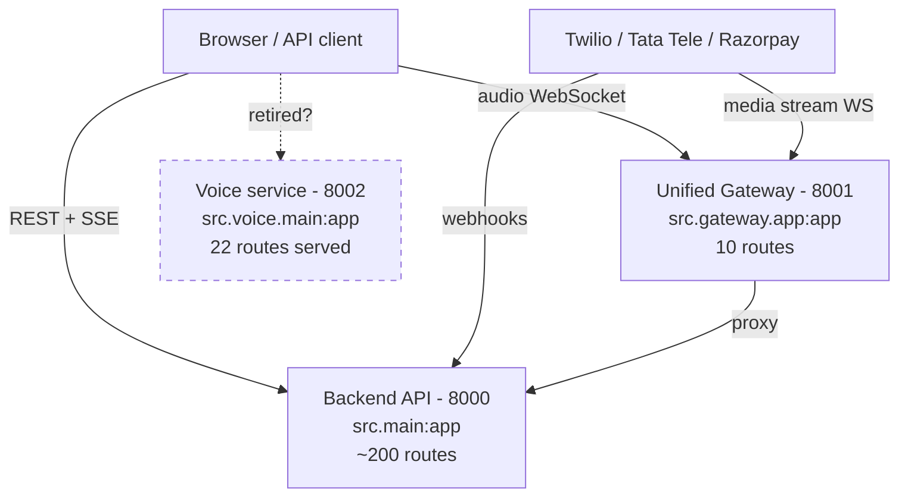

| Surface | Process | Port | Docs | What lives there |
|---|---|---|---|---|
| Backend API | `src.main:app` | 8000 | `/docs`, `/redoc` | Everything business-facing |
| Unified Gateway | `src.gateway.app:app` | 8001 | `/docs`, `/redoc` | Streaming, webhooks, internal events |
| Voice service | `src.voice.main:app` | 8002 | — | Telephony WebSockets, transcripts |

Behind Apache, **both `api.hirebuddha.com` and `gateway.hirebuddha.com` proxy to
8001** (the gateway); `streaming.hirebuddha.com` proxies to 8002. **No vhost
points at 8000** — the backend API is reachable only from inside the VM, via the
gateway's proxy. See
[18 §8](18-infrastructure-and-deployment.md#8-apache--reverse-proxy-and-tls).

> ⚠️ **The voice service may be retired.** A comment in
> [gateway/app.py:138](../../backend/src/gateway/app.py:138) states:
> *"The standalone streaming service (port 8002) has been retired. All
> audio/video streaming is served natively by this gateway."* But
> `src/voice/main.py` still exists — it declares 7 routes of its own and serves
> 22 in total once the routers it mounts are counted — and Apache still has a
> `streaming.hirebuddha.com` vhost pointing at 8002. `start_services.sh` does
> **not** start it. Treat port 8002 as deprecated and prefer the gateway.

The two applications duplicate three WebSocket paths
(`/webhooks/voice/tata/incoming`, `/stream/twilio/{session_id}`,
`/stream/tata/{session_id}`) — the same handlers exist on both.

---

## 2. Conventions

### 2.1 Path prefixes

Most backend routers are mounted with an extra `/api/v1` prefix in
[main.py](../../backend/src/main.py), so the **full path is the mount prefix
plus the router prefix plus the route path**.

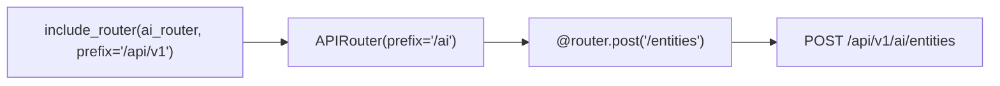

| Router | Mount prefix | Router prefix | Effective base |
|---|---|---|---|
| `auth/router.py` | `/api/v1` | `/auth` | `/api/v1/auth` |
| `auth/company_router.py` | `/api/v1` | `/companies` | `/api/v1/companies` |
| `auth/user_router.py` | `/api/v1` | `/users` | `/api/v1/users` |
| `auth/profile_router.py` | `/api/v1` | `/profile` | `/api/v1/profile` |
| `auth/onboarding_router.py` | `/api/v1` | `/onboarding` | `/api/v1/onboarding` |
| `auth/partner_router.py` | `/api/v1` | `/partner` | `/api/v1/partner` |
| `config/router.py` | `/api/v1` | `/config` | `/api/v1/config` |
| `ai/router.py` | `/api/v1` | `/ai` | `/api/v1/ai` |
| `ai/api/admin.py` | `/api/v1` | `/ai/admin` | `/api/v1/ai/admin` |
| `ai/campaign_router.py` | `/api/v1` | `/campaigns` | `/api/v1/campaigns` |
| `ai/email_router.py` | `/api/v1` | `/email` | `/api/v1/email` |
| `ai/memory/cortex_router.py` | *(none)* | `/api/v1/cortex` | `/api/v1/cortex` |
| `ai/artifact_router.py` | *(none)* | `/api/v1/artifacts` | `/api/v1/artifacts` |
| `ai/tool_management_router.py` | *(none)* | `/api/v1/ai/tool-registry` | `/api/v1/ai/tool-registry` |
| `ai/reports_router.py` | *(none)* | `/api/v1/reports/analytics` | `/api/v1/reports/analytics` |
| `ai/social_router.py` | *(none)* | `/api/social-connections` | `/api/social-connections` |
| `billing/billing_router.py` | *(none)* | `/api/v1` | `/api/v1` |
| `billing/credits_router.py` | *(none)* | `/api/v1/credits` | `/api/v1/credits` |
| `billing/cron_router.py` | *(none)* | `/api/v1/cron` | `/api/v1/cron` |
| `voice/webhook_router.py` | *(none)* | `/webhooks/voice` | `/webhooks/voice` |
| `voice/phone_number_router.py` | *(none)* | `/api/v1/phone-numbers` | `/api/v1/phone-numbers` |
| `voice/sessions_router.py` | *(none)* | `/api/v1/streaming` | `/api/v1/streaming` |
| `voice/messaging_router.py` | *(none)* | `/api/v1/messaging` | `/api/v1/messaging` |

> ⚠️ `/api/social-connections` is **missing the `/v1`** — it is the only
> business route that breaks the versioning convention.

### 2.2 Authentication

```bash
curl -H "Authorization: Bearer $TOKEN" https://api.hirebuddha.com/api/v1/ai/entities
```

Standard OAuth2 bearer. The dependency is
[`get_current_user`](../../backend/src/auth/dependencies.py:56); a variant
[`get_current_user_and_company`](../../backend/src/auth/dependencies.py:59)
also returns the company, and
[`get_current_user_from_query`](../../backend/src/auth/dependencies.py:72)
reads the token from a query parameter — used where headers are unavailable
(SSE and WebSocket).

### 2.3 Other conventions

| Concern | Convention |
|---|---|
| IDs | UUID v4 as strings |
| Timestamps | ISO 8601 UTC |
| Errors | FastAPI default — `{"detail": "..."}` |
| Content type | `application/json`, except uploads (`multipart/form-data`) |
| Created | `201` where declared; most POSTs return `200` |
| Suspension | `403 {"detail": "Company is suspended. Please contact support."}` |

There is **no platform-wide pagination convention**. List endpoints vary — some
take `limit`/`offset`, some return everything. Check each endpoint.

### 2.4 Interactive docs

With the backend running:

```bash
open http://localhost:8000/docs
```

Swagger UI at `/docs`, ReDoc at `/redoc`, OpenAPI JSON at `/openapi.json`. The
gateway exposes the same three on port 8001.

---

## 3. Route index — the complete surface

225 route declarations. Grouped by area; full paths as a client would call them.

### 3.1 Backend API (port 8000)

| Area | Routes | Base path |
|---|---|---|
| [Auth](#4-authentication) | 8 | `/api/v1/auth` |
| [Companies](#5-companies-users-and-onboarding) | 5 | `/api/v1/companies` |
| [Users](#5-companies-users-and-onboarding) | 3 | `/api/v1/users` |
| [Profile](#5-companies-users-and-onboarding) | 2 | `/api/v1/profile` |
| [Onboarding](#5-companies-users-and-onboarding) | 4 | `/api/v1/onboarding` |
| [Partner](#5-companies-users-and-onboarding) | 3 | `/api/v1/partner` |
| [AI entities / executions](#6-entities) | 31 | `/api/v1/ai` |
| [Kernel admin](#15-kernel-admin) | 25 | `/api/v1/ai/admin` |
| [Tool registry](#12-tool-registry) | 7 | `/api/v1/ai/tool-registry` |
| [CORTEX](#10-cortex-memory) | 13 | `/api/v1/cortex` |
| [Artifacts](#9-documents-artifacts-and-templates) | 5 | `/api/v1/artifacts` |
| [Config](#11-configuration-and-the-integration-registry) | 10 | `/api/v1/config` |
| [Email connections](#11-configuration-and-the-integration-registry) | 5 | `/api/v1/email` |
| [Social connections](#11-configuration-and-the-integration-registry) | 4 | `/api/social-connections` |
| [Billing](#13-billing-credits-and-reports) | 4 | `/api/v1` |
| [Credits](#13-billing-credits-and-reports) | 11 | `/api/v1/credits` |
| [Cron](#13-billing-credits-and-reports) | 2 | `/api/v1/cron` |
| [Analytics](#13-billing-credits-and-reports) | 14 | `/api/v1/reports/analytics` |
| [Campaigns](#14-voice-phone-numbers-and-campaigns) | 10 | `/api/v1/campaigns` |
| [Phone numbers](#14-voice-phone-numbers-and-campaigns) | 10 | `/api/v1/phone-numbers` |
| [Streaming sessions](#14-voice-phone-numbers-and-campaigns) | 7 | `/api/v1/streaming` |
| [Messaging](#14-voice-phone-numbers-and-campaigns) | 2 | `/api/v1/messaging` |
| [Voice webhooks](#18-webhooks) | 9 | `/webhooks/voice` |
| [Legacy shims](#22-legacy-and-dead-routes) | 3 | various |

### 3.2 The full table

**Auth** — [auth/router.py](../../backend/src/auth/router.py)

| Method | Path | Auth | Purpose |
|---|---|---|---|
| POST | `/api/v1/auth/register` | none | Register a user |
| POST | `/api/v1/auth/login` | none | Login → JWT |
| POST | `/api/v1/auth/token` | none | OAuth2 password-form login |
| GET | `/api/v1/auth/me` | Bearer | Current user |
| GET | `/api/v1/auth/admin-only` | Bearer + admin | Role-guard probe |
| POST | `/api/v1/auth/refresh` | none (refresh token in body) | Rotate tokens |
| POST | `/api/v1/auth/oauth/{provider}` | none | OAuth login |
| GET | `/api/v1/auth/verify-email` | none | Email verification |

**Companies / users / profile / onboarding / partner**

| Method | Path | Purpose |
|---|---|---|
| GET | `/api/v1/companies` | List companies |
| GET | `/api/v1/companies/partners` | Partner companies |
| GET | `/api/v1/companies/tenants` | Tenant companies |
| POST | `/api/v1/companies` | Create a company |
| PATCH | `/api/v1/companies/{company_id}` | Update a company |
| GET | `/api/v1/users` | List users |
| POST | `/api/v1/users` | Create a user |
| PATCH | `/api/v1/users/{user_id}` | Update a user |
| POST | `/api/v1/profile/avatar` | Upload avatar |
| POST | `/api/v1/profile/company-logo` | Upload company logo |
| GET | `/api/v1/onboarding/status` | Wizard progress |
| POST | `/api/v1/onboarding/step/{step_name}` | Complete a step |
| POST | `/api/v1/onboarding/complete` | Finalise |
| POST | `/api/v1/onboarding/skip` | Skip |
| GET | `/api/v1/partner/tenants` | Tenants + health |
| GET | `/api/v1/partner/tenants/{tenant_id}/details` | Tenant detail |
| GET | `/api/v1/partner/analytics/summary` | Partner analytics |

**AI entities and executions** — [ai/router.py](../../backend/src/ai/router.py)

| Method | Path | Purpose |
|---|---|---|
| POST | `/api/v1/ai/entities` | Create an entity |
| GET | `/api/v1/ai/entities` | List entities |
| GET | `/api/v1/ai/entities/{entity_id}` | Get an entity |
| PUT | `/api/v1/ai/entities/{entity_id}` | Update an entity |
| DELETE | `/api/v1/ai/entities/{entity_id}` | Soft-delete an entity |
| POST | `/api/v1/ai/entities/{entity_id}/convert-to-template` | Convert to template |
| GET | `/api/v1/ai/stats` | Dashboard stats |
| POST | `/api/v1/ai/execute` | **Trigger an execution** |
| GET | `/api/v1/ai/executions` | List runs |
| GET | `/api/v1/ai/executions/{execution_id}` | Run detail |
| POST | `/api/v1/ai/executions/{execution_id}/csat` | Thumbs up/down |
| GET | `/api/v1/ai/executions/{execution_id}/agent_state` | `AgentState` snapshot |
| GET | `/api/v1/ai/executions/{execution_id}/trace` | Full trace |
| GET | `/api/v1/ai/executions/{execution_id}/stream` | **SSE live trace** |
| POST | `/api/v1/ai/executions/{execution_id}/cancel` | Cancel |
| POST | `/api/v1/ai/executions/{execution_id}/retry` | Retry |
| POST | `/api/v1/ai/executions/{execution_id}/refine` | Refine |
| GET | `/api/v1/ai/approvals/pending` | Pending HITL approvals |
| POST | `/api/v1/ai/approvals/{approval_id}/respond` | Approve / reject |
| GET | `/api/v1/ai/tools` | Tools visible to this tenant |
| POST | `/api/v1/ai/context-sources/upload` | Upload a context source |
| POST | `/api/v1/ai/documents/upload` | Upload a RAG document |
| POST | `/api/v1/ai/avatar/upload` | Upload an avatar |
| GET | `/api/v1/ai/documents` | List documents |
| POST | `/api/v1/ai/documents/search` | Semantic search |
| GET | `/api/v1/ai/templates` | List templates |
| GET | `/api/v1/ai/templates/{template_id}` | Get a template |
| POST | `/api/v1/ai/templates` | Create a template |
| PUT | `/api/v1/ai/templates/{template_id}` | Update a template |
| DELETE | `/api/v1/ai/templates/{template_id}` | Delete a template |
| POST | `/api/v1/ai/templates/{template_id}/clone` | Clone into the tenant |

**CORTEX** — see [§10](#10-cortex-memory) · **Config** — see [§11](#11-configuration-and-the-integration-registry) ·
**Tool registry** — see [§12](#12-tool-registry) · **Billing** — see [§13](#13-billing-credits-and-reports) ·
**Voice** — see [§14](#14-voice-phone-numbers-and-campaigns) · **Admin** — see [§15](#15-kernel-admin)

---

## 4. Authentication

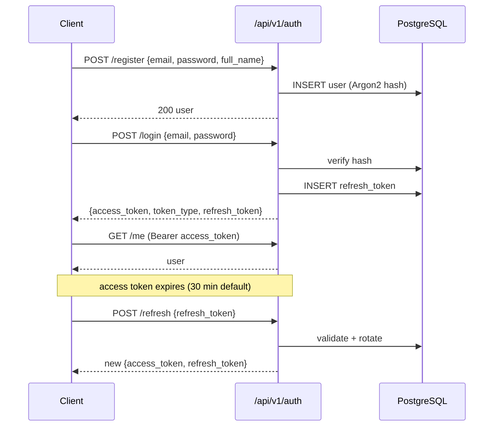

### `POST /api/v1/auth/register`

Request — `UserCreate`:

| Field | Type | Required |
|---|---|---|
| `email` | `EmailStr` | yes |
| `password` | `str` | yes |
| `full_name` | `str` | yes |

```bash
curl -X POST http://localhost:8000/api/v1/auth/register -H 'Content-Type: application/json' -d '{"email":"dev@example.com","password":"Passw0rd!","full_name":"Dev User"}'
```

### `POST /api/v1/auth/login`

Request — `UserLogin` (`email`, `password`). Response — `Token`:

| Field | Type |
|---|---|
| `access_token` | `str` |
| `token_type` | `str` |
| `refresh_token` | `str \| None` |

```bash
curl -X POST http://localhost:8000/api/v1/auth/login -H 'Content-Type: application/json' -d '{"email":"dev@example.com","password":"Passw0rd!"}'
```

### `POST /api/v1/auth/token`

The OAuth2 password-form variant, for Swagger's "Authorize" button. Takes
`application/x-www-form-urlencoded` with `username` and `password`.

### `POST /api/v1/auth/refresh`

Request — `RefreshTokenRequest` (`refresh_token`). Returns a fresh `Token`.

### `POST /api/v1/auth/oauth/{provider}`

Request — `OAuthRequest`:

| Field | Type |
|---|---|
| `code` | `str` |
| `redirect_uri` | `str` |

### `GET /api/v1/auth/me`

Returns `UserResponse` — `id`, `email`, `full_name`, `company_id`, `role`.

```bash
curl -H "Authorization: Bearer $TOKEN" http://localhost:8000/api/v1/auth/me
```

Full details in [04 — Auth, RBAC and tenancy](04-auth-rbac-tenancy.md).

---

## 5. Companies, users and onboarding

### `POST /api/v1/companies`

Request — `CompanyCreate`:

| Field | Type | Default | Notes |
|---|---|---|---|
| `name` | `str` | — | |
| `type` | `str` | — | `APP`, `PARTNER`, `TENANT` |
| `status` | `str` | `"active"` | |
| `parent_id` | `UUID \| None` | `None` | Parent in the hierarchy |
| `apply_default_daily_credits` | `bool` | `True` | Grant default daily credits |
| `custom_daily_credits` | `float \| None` | `None` | Override the default |

Response — `CompanyResponse` adds `id`, `logo_url`, `onboarding_status`.

```bash
curl -X POST http://localhost:8000/api/v1/companies -H "Authorization: Bearer $TOKEN" -H 'Content-Type: application/json' -d '{"name":"Acme Ltd","type":"TENANT","parent_id":"<partner-uuid>"}'
```

### `GET /api/v1/onboarding/status`

Response — `OnboardingStatusResponse`:

| Field | Type | Notes |
|---|---|---|
| `status` | `str` | `pending`, `in_progress`, `completed` |
| `completed_steps` | `List[str]` | |
| `total_steps` | `int` | default `5` |
| `current_step` | `str \| None` | |
| `completion_pct` | `float` | |
| `metadata` | `dict \| None` | |

### `POST /api/v1/onboarding/step/{step_name}`

Request — `OnboardingStepRequest` with `step_name` and optional `step_data`.
The five step names, from the schema comment:
`company_profile`, `integrations`, `first_agent`, `phone_setup`, `billing`.

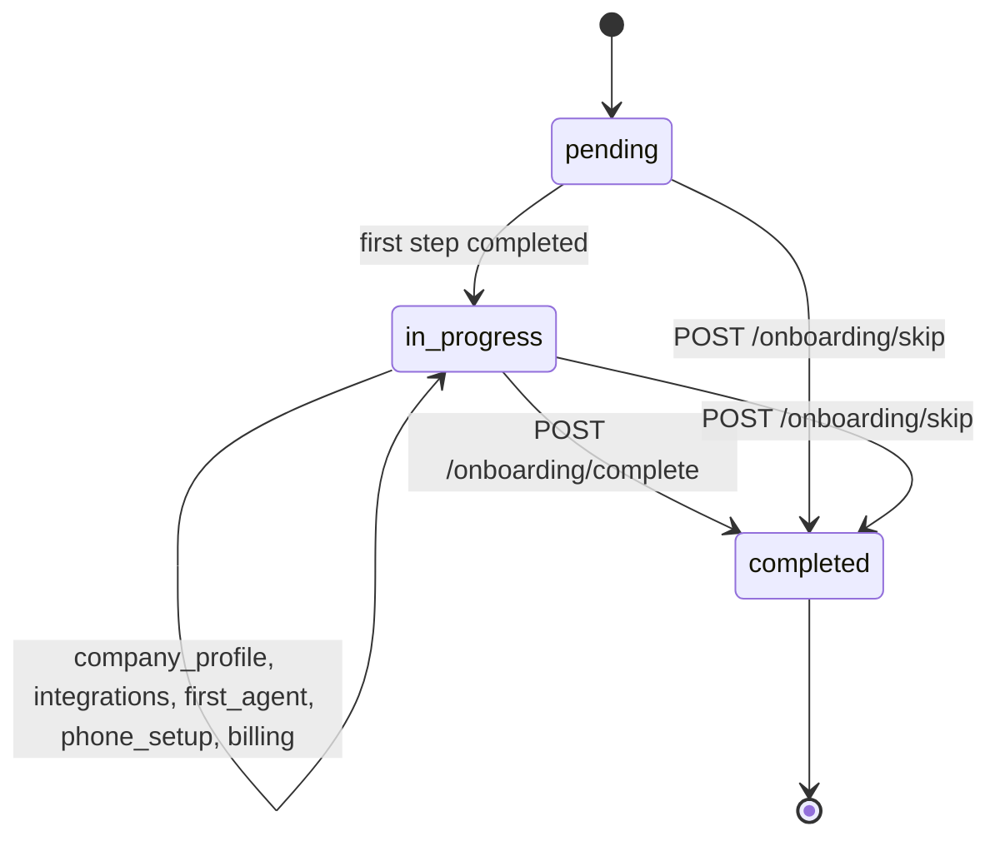

### `POST /api/v1/users`

Request — `UserCreateAdmin` = `UserCreate` plus `company_id` and `role`. This is
how an admin creates a user inside a specific company with a specific role.

---

## 6. Entities

The entity configuration model is documented in full in
[06 — Execution pipeline](06-execution-pipeline.md); this section covers the
HTTP surface only.

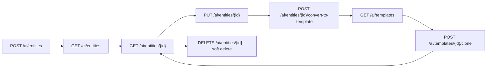

### `POST /api/v1/ai/entities`

Body is a `HierarchicalEntityCreate` — the nine JSON configuration blocks
(`identity`, `hierarchy`, `logic_gate`, `planning`, `capabilities`,
`governance`, `io_contract`, `observability`, `metadata_extensions`) plus
`name`, `type`, `goal`, `description`, `version`, `parent_id`, `tags`.

```bash
curl -X POST http://localhost:8000/api/v1/ai/entities -H "Authorization: Bearer $TOKEN" -H 'Content-Type: application/json' -d '{"name":"summariser","type":"SKILL","goal":"Summarise a document in under 200 words","capabilities":{"tools":["web_search"]},"governance":{"max_cost_usd":0.5,"timeout_ms":60000}}'
```

`governance.max_cost_usd` and `governance.timeout_ms` must both be `> 0` for the
entity to pass Meta-Agent validation — see
[11 §8](11-meta-intelligence.md#8-role-5--validator).

### `GET /api/v1/ai/entities`

Returns entities scoped to the caller's `company_id`, excluding soft-deleted
rows (`deleted_at IS NULL`).

### `DELETE /api/v1/ai/entities/{entity_id}`

**Soft delete** — sets `deleted_at`. The row remains for audit and for
historical runs that reference it.

### `GET /api/v1/ai/tools`

Tools visible to this tenant after feature-flag and status gating — see
[09 — Tools](09-tools.md).

---

## 7. Executions

### `POST /api/v1/ai/execute`

The single most important endpoint. Creates an `ExecutionRun` and enqueues it.

```bash
curl -X POST http://localhost:8000/api/v1/ai/execute -H "Authorization: Bearer $TOKEN" -H 'Content-Type: application/json' -d '{"entity_id":"<entity-uuid>","input_data":{"input":"Summarise the Q3 revenue report"}}'
```

Returns the created run, including its `id`. Everything after this is
asynchronous — see [06 — Execution pipeline](06-execution-pipeline.md).

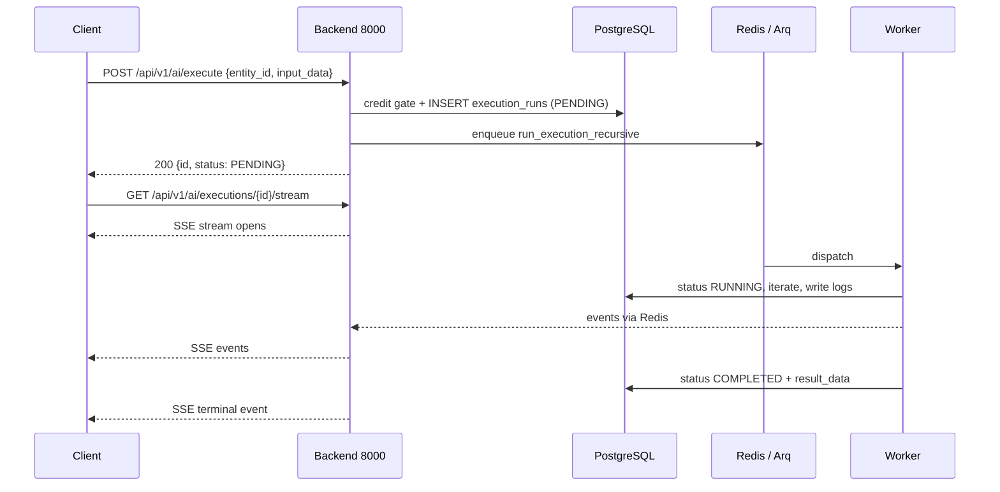

### Run inspection

| Endpoint | Returns |
|---|---|
| `GET /api/v1/ai/executions` | List of runs for the tenant |
| `GET /api/v1/ai/executions/{id}` | Run row — status, cost, tokens, `result_data` |
| `GET /api/v1/ai/executions/{id}/trace` | Full span tree |
| `GET /api/v1/ai/executions/{id}/agent_state` | The typed `AgentState` snapshot |
| `GET /api/v1/ai/executions/{id}/stream` | **SSE** live event stream |

### Run control

| Endpoint | Effect |
|---|---|
| `POST /api/v1/ai/executions/{id}/cancel` | Request cancellation |
| `POST /api/v1/ai/executions/{id}/retry` | Re-run with the same input |
| `POST /api/v1/ai/executions/{id}/refine` | Re-run with refinement instructions |
| `POST /api/v1/ai/executions/{id}/csat` | Record `+1` / `-1` and an optional comment |

The CSAT endpoint writes `ExecutionRun.csat_score` and `csat_comment`. The ORM
comment calls this *"the only ground-truth 'was this good?' signal — feeds
critic false-pass calibration"* — see
[07 — Planning and critics](07-planning-and-critics.md).

```bash
curl -X POST http://localhost:8000/api/v1/ai/executions/$RUN_ID/csat -H "Authorization: Bearer $TOKEN" -H 'Content-Type: application/json' -d '{"csat_score":1,"csat_comment":"accurate and concise"}'
```

---

## 8. Approvals (HITL)

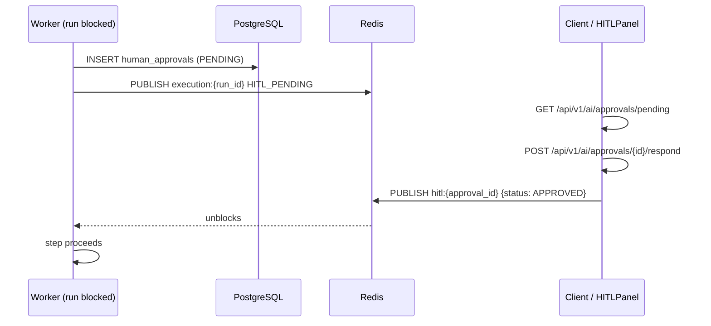

| Method | Path | Purpose |
|---|---|---|
| GET | `/api/v1/ai/approvals/pending` | List `PENDING` approvals for the tenant |
| POST | `/api/v1/ai/approvals/{approval_id}/respond` | Approve or reject, with reviewer notes |

```bash
curl -X POST http://localhost:8000/api/v1/ai/approvals/$APPROVAL_ID/respond -H "Authorization: Bearer $TOKEN" -H 'Content-Type: application/json' -d '{"status":"APPROVED","reviewer_notes":"looks correct"}'
```

The worker is **blocking on Redis pub/sub** while this sits pending, so respond
promptly — see [15 §8](15-governance-and-hitl.md#8-the-hitl-wait-mechanism).

---

## 9. Documents, artifacts and templates

### Documents (RAG)

| Method | Path | Purpose |
|---|---|---|
| POST | `/api/v1/ai/documents/upload` | Upload → extract → chunk → embed |
| GET | `/api/v1/ai/documents` | List documents |
| POST | `/api/v1/ai/documents/search` | Semantic search over chunks |
| POST | `/api/v1/ai/context-sources/upload` | Attach a design-time context source |

```bash
curl -X POST http://localhost:8000/api/v1/ai/documents/upload -H "Authorization: Bearer $TOKEN" -F 'file=@report.pdf'
```

Supported formats: `.pdf`, `.docx`, `.xlsx`/`.xls`, `.csv`/`.tsv`, plus anything
readable as plain text — see
[08 §10](08-memory-and-cortex.md#10-document-ingestion-and-rag).

### Artifacts

| Method | Path | Purpose |
|---|---|---|
| GET | `/api/v1/artifacts` | List artifacts |
| POST | `/api/v1/artifacts/upload` | Upload a user file |
| GET | `/api/v1/artifacts/{artifact_id}` | Metadata |
| GET | `/api/v1/artifacts/{artifact_id}/download` | Download bytes |
| DELETE | `/api/v1/artifacts/{artifact_id}` | Delete |

Artifacts split into `backend/artifact/user-uploads/` and
`backend/artifact/system-generated/`.

### Templates

| Method | Path | Purpose |
|---|---|---|
| GET | `/api/v1/ai/templates` | Marketplace listing |
| GET | `/api/v1/ai/templates/{template_id}` | Template detail |
| POST | `/api/v1/ai/templates` | Publish a template |
| PUT | `/api/v1/ai/templates/{template_id}` | Update |
| DELETE | `/api/v1/ai/templates/{template_id}` | Remove |
| POST | `/api/v1/ai/templates/{template_id}/clone` | Instantiate into the tenant |

---

## 10. CORTEX memory

Full semantics in [08 — Memory and CORTEX](08-memory-and-cortex.md).

| Method | Path | Status | Purpose |
|---|---|---|---|
| POST | `/api/v1/cortex/trees` | 201 | Create a tree |
| GET | `/api/v1/cortex/trees` | 200 | List trees |
| GET | `/api/v1/cortex/trees/{tree_id}` | 200 | Tree status |
| POST | `/api/v1/cortex/trees/{tree_id}/resume` | 200 | Resume → viewport + last checkpoint |
| POST | `/api/v1/cortex/trees/{tree_id}/suspend` | 200 | Suspend |
| POST | `/api/v1/cortex/trees/{tree_id}/navigate/{node_id}` | 200 | Move the viewport |
| GET | `/api/v1/cortex/trees/{tree_id}/nodes/{node_id}` | 200 | Read node content (paged) |
| GET | `/api/v1/cortex/trees/{tree_id}/nodes/{node_id}/detail` | 200 | Node metadata |
| POST | `/api/v1/cortex/trees/{tree_id}/nodes` | 201 | Write a node |
| POST | `/api/v1/cortex/trees/{tree_id}/checkpoint` | 201 | Write a checkpoint |
| GET | `/api/v1/cortex/trees/{tree_id}/output` | 200 | Assemble the output document |
| POST | `/api/v1/cortex/trees/{tree_id}/recurse` | 201 | Spawn a scoped child run |
| POST | `/api/v1/cortex/trees/{tree_id}/ingest` | 201 | Ingest a document into the tree |

```bash
curl -H "Authorization: Bearer $TOKEN" http://localhost:8000/api/v1/cortex/trees
```

---

## 11. Configuration and the Integration Registry

Full semantics in [10 — LLM providers](10-llm-providers.md).

| Method | Path | Purpose |
|---|---|---|
| GET | `/api/v1/config/models` | Available models |
| POST | `/api/v1/config/integrations` | Register credentials (encrypted at rest) |
| GET | `/api/v1/config/integrations` | List integrations |
| GET | `/api/v1/config/integrations/{entry_id}` | Get one |
| PATCH | `/api/v1/config/integrations/{entry_id}` | Update |
| DELETE | `/api/v1/config/integrations/{entry_id}` | Delete |
| GET | `/api/v1/config/task-defaults` | Model routing per task type |
| POST | `/api/v1/config/task-defaults` | Set routing for a task type |
| DELETE | `/api/v1/config/task-defaults/{task_type}` | Clear routing |
| GET | `/api/v1/config/task-types` | Valid task types |

> ⚠️ `AI_MODEL_CREDENTIALS_GUIDE.md` documents these as `/api/config/...`
> **without the `/v1`**. The router is mounted with `prefix="/api/v1"`, so the
> correct paths are `/api/v1/config/...`. The guide is wrong.

### Email and social connections

| Method | Path | Purpose |
|---|---|---|
| GET | `/api/v1/email/provider-defaults` | Known provider presets |
| POST | `/api/v1/email/connections` | Create a connection |
| GET | `/api/v1/email/connections` | List |
| DELETE | `/api/v1/email/connections/{connection_id}` | Delete |
| POST | `/api/v1/email/connections/{connection_id}/validate` | Test credentials |
| POST | `/api/social-connections` | Create a social connection |
| GET | `/api/social-connections` | List |
| DELETE | `/api/social-connections/{connection_id}` | Delete |
| POST | `/api/social-connections/{connection_id}/refresh` | Refresh OAuth token |

---

## 12. Tool registry

| Method | Path | Purpose |
|---|---|---|
| GET | `/api/v1/ai/tool-registry` | All registered tools |
| GET | `/api/v1/ai/tool-registry/{tool_id}` | One tool |
| POST | `/api/v1/ai/tool-registry` | Register a tool |
| PUT | `/api/v1/ai/tool-registry/{tool_id}` | Update |
| DELETE | `/api/v1/ai/tool-registry/{tool_id}` | Remove |
| POST | `/api/v1/ai/tool-registry/{tool_id}/toggle` | Enable / disable |
| POST | `/api/v1/ai/tool-registry/sync-built-in` | Sync code-defined tools into the DB |

`sync-built-in` is the one to run after adding a tool in code — it reconciles the
in-code registry with `tool_registry_entries`. See [09 — Tools](09-tools.md).

Note this is distinct from `GET /api/v1/ai/tools`, which returns the
**tenant-visible** subset for entity configuration.

---

## 13. Billing, credits and reports

Full semantics in [14 — Billing and credits](14-billing-and-credits.md).

### Billing config and reports

| Method | Path | Purpose |
|---|---|---|
| GET | `/api/v1/billing/config` | Fee and markup configuration |
| PUT | `/api/v1/billing/config` | Update it |
| GET | `/api/v1/reports/costing` | Costing report |
| GET | `/api/v1/reports/billing` | Billing report |

### Credits and subscriptions

| Method | Path | Purpose |
|---|---|---|
| GET | `/api/v1/credits/balance` | Wallet balance |
| POST | `/api/v1/credits/topup` | Create a Razorpay order |
| POST | `/api/v1/credits/topup/verify` | Verify payment, credit the wallet |
| GET | `/api/v1/credits/subscription-tiers` | List tiers |
| POST | `/api/v1/credits/subscription-tiers` | Create a tier |
| PUT | `/api/v1/credits/subscription-tiers/{tier_id}` | Update a tier |
| DELETE | `/api/v1/credits/subscription-tiers/{tier_id}` | Delete a tier |
| GET | `/api/v1/credits/subscriptions` | Current subscription |
| POST | `/api/v1/credits/subscriptions` | Subscribe |
| POST | `/api/v1/credits/subscriptions/verify` | Verify subscription payment |
| DELETE | `/api/v1/credits/subscriptions/{subscription_id}` | Cancel |

```bash
curl -H "Authorization: Bearer $TOKEN" http://localhost:8000/api/v1/credits/balance
```

### Cron triggers

| Method | Path | Purpose |
|---|---|---|
| POST | `/api/v1/cron/daily-credits` | Grant daily credits |
| POST | `/api/v1/cron/monthly-billing` | Run monthly billing |

> ⚠️ These are **manually triggerable HTTP endpoints** that move money. Confirm
> the role guard on them before exposing the backend publicly.

### Analytics

Fourteen read-only reports under `/api/v1/reports/analytics/`:

| Path suffix | Reports on |
|---|---|
| `execution-health` | Run success/failure rates |
| `llm-performance` | Model latency and cost |
| `tool-efficacy` | Tool success rates |
| `hitl-overview` | Approval volumes and latency |
| `wallet-liability` | Outstanding credit liability |
| `usage-breakdown` | Usage by primitive |
| `tenant-health` | Per-tenant health |
| `campaign-analytics` | Voice campaign outcomes |
| `personal-tasks` | Per-user task view |
| `agent-errors` | Error clustering |
| `credit-forecast` | Projected credit burn |
| `subscription-mrr` | Recurring revenue |
| `partner-performance` | Partner-level rollup |
| `data-growth` | Table growth |

---

## 14. Voice, phone numbers and campaigns

Full semantics in [12 — Voice and telephony](12-voice-and-telephony.md).

### Campaigns

| Method | Path | Purpose |
|---|---|---|
| POST | `/api/v1/campaigns` | Create a campaign |
| POST | `/api/v1/campaigns/upload-csv` | Bulk lead upload |
| GET | `/api/v1/campaigns` | List campaigns |
| GET | `/api/v1/campaigns/interested/download` | Export interested leads |
| POST | `/api/v1/campaigns/retry-failed` | Retry failed calls |
| GET | `/api/v1/campaigns/{campaign_id}` | Campaign detail |
| GET | `/api/v1/campaigns/{campaign_id}/status` | Live status |
| GET | `/api/v1/campaigns/{campaign_id}/active-calls` | In-flight calls |
| PATCH | `/api/v1/campaigns/{campaign_id}/status` | Start / pause / stop |
| GET | `/api/v1/campaigns/{campaign_id}/download` | Export report |

### Phone numbers

| Method | Path | Purpose |
|---|---|---|
| POST | `/api/v1/phone-numbers` | Add a number |
| POST | `/api/v1/phone-numbers/bulk` | Bulk add |
| POST | `/api/v1/phone-numbers/sync` | Sync from providers |
| GET | `/api/v1/phone-numbers` | List |
| GET | `/api/v1/phone-numbers/{number_id}` | Detail |
| PATCH | `/api/v1/phone-numbers/{number_id}` | Update |
| POST | `/api/v1/phone-numbers/{number_id}/claim` | Claim for a tenant |
| POST | `/api/v1/phone-numbers/{number_id}/release` | Release to the pool |
| POST | `/api/v1/phone-numbers/{number_id}/assign` | Bind to an agent |
| DELETE | `/api/v1/phone-numbers/{number_id}` | Delete |

### Streaming sessions and messaging

| Method | Path | Purpose |
|---|---|---|
| GET | `/api/v1/streaming/voice-sessions` | List voice sessions |
| GET | `/api/v1/streaming/voice-sessions/{session_id}` | Session detail |
| PATCH | `/api/v1/streaming/voice-sessions/{session_id}/next-action` | Set next action |
| GET | `/api/v1/streaming/whatsapp-sessions` | List WhatsApp sessions |
| GET | `/api/v1/streaming/whatsapp-sessions/{session_id}` | Session detail |
| GET | `/api/v1/streaming/conversation-history` | Conversation history |
| GET | `/api/v1/streaming/stats` | Streaming stats |
| POST | `/api/v1/messaging/send` | Send a WhatsApp message |
| POST | `/api/v1/messaging/send-template` | Send a template message |

---

## 15. Kernel admin

Twenty-five endpoints under `/api/v1/ai/admin` — the operator surface for the
agent kernel, meta-intelligence and feature flags.

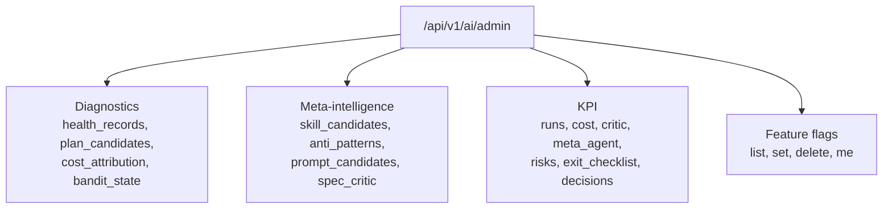

### Run diagnostics

| Method | Path |
|---|---|
| GET | `/api/v1/ai/admin/executions/{run_id}/health_records` |
| GET | `/api/v1/ai/admin/executions/{run_id}/plan_candidates` |
| GET | `/api/v1/ai/admin/executions/{run_id}/cost_attribution` |
| GET | `/api/v1/ai/admin/entities/{entity_id}/bandit_state` |
| GET | `/api/v1/ai/admin/companies/{company_id}/cost_attribution` |

### Meta-intelligence

| Method | Path |
|---|---|
| GET | `/api/v1/ai/admin/meta/skill_candidates` |
| POST | `/api/v1/ai/admin/meta/skill_candidates/{node_id}/promote` |
| GET | `/api/v1/ai/admin/meta/intelligence/anti_patterns` |
| GET | `/api/v1/ai/admin/meta/intelligence/prompt_candidates` |
| POST | `/api/v1/ai/admin/meta/intelligence/prompt_candidates/{node_id}/approve` |
| POST | `/api/v1/ai/admin/meta/entities/{entity_id}/promote` |
| POST | `/api/v1/ai/admin/meta/spec_critic` |

These are the HITL approval paths for the meta layer — see
[11 — Meta-intelligence](11-meta-intelligence.md).

### Feature flags

| Method | Path | Purpose |
|---|---|---|
| GET | `/api/v1/ai/admin/feature_flags/admin` | All flags with resolution source |
| PUT | `/api/v1/ai/admin/feature_flags/{flag_key}` | Set a flag |
| DELETE | `/api/v1/ai/admin/feature_flags/{flag_key}` | Clear an override |
| GET | `/api/v1/ai/admin/feature_flags/me` | Flags as resolved for the caller |

Prefer `PUT` over direct SQL — it publishes the Redis invalidation event. See
[15 §12.3](15-governance-and-hitl.md#123-caching-and-invalidation).

### KPI and programme tracking

| Method | Path |
|---|---|
| GET | `/api/v1/ai/admin/admin/kpi/runs` |
| GET | `/api/v1/ai/admin/admin/kpi/cost` |
| GET | `/api/v1/ai/admin/admin/kpi/critic` |
| GET | `/api/v1/ai/admin/admin/kpi/meta_agent` |
| GET | `/api/v1/ai/admin/admin/risks` |
| GET | `/api/v1/ai/admin/admin/exit_checklist` |
| GET | `/api/v1/ai/admin/admin/decisions` |
| POST | `/api/v1/ai/admin/admin/decisions` |
| POST | `/api/v1/ai/admin/admin/tools/{tool_id}/experimental` |

> ⚠️ **The doubled `admin/admin` is not a typo in this document.** The router
> carries `prefix="/ai/admin"` and these nine routes additionally declare paths
> beginning `/admin/...`, producing `/api/v1/ai/admin/admin/kpi/runs`. Call them
> exactly as written. The other sixteen admin routes do not have the doubling.

---

## 16. The gateway surface (port 8001)

Ten routes. Full semantics in
[13 — Gateway and realtime](13-gateway-and-realtime.md).

| Method | Path | Auth | Purpose |
|---|---|---|---|
| GET | `/` | none | Service banner |
| GET | `/health` | none | Health check |
| GET | `/metrics/gateway` | none | Gateway metrics |
| POST | `/webhook/inbound` | `?client_id=` | Unified inbound webhook |
| POST | `/internal/event` | `X-Internal-Token` | Internal event ingress |
| WS | `/stream/audio` | `?client_id=` | Browser + telephony audio |
| WS | `/stream/video` | `?client_id=` | WebRTC video |
| WS | `/webhooks/voice/tata/incoming` | — | Tata Tele media |
| WS | `/stream/twilio/{session_id}` | — | Twilio Media Streams |
| WS | `/stream/tata/{session_id}` | — | Tata Tele stream |

Plus a catch-all proxy in [gateway/main.py](../../backend/src/gateway/main.py):

| Method | Path | Purpose |
|---|---|---|
| ANY | `/{path:path}` | Proxy everything else to the backend |

### 16.1 Gateway auth rules

```python
# backend/src/gateway/auth_middleware.py
"""
    ① Internal paths (/internal/event):  verified via X-Internal-Token header
    ② Webhook paths (/webhook/inbound):  extracted from ?client_id= query param
    ③ Audio/Video WebSocket paths:       extracted from ?client_id= query param
    ④ REST API paths (/api/v1/*):        JWT bearer or X-API-Key (passed through
...
    Missing / invalid credentials are NOT blocked here for REST / Webhook paths —
"""
```

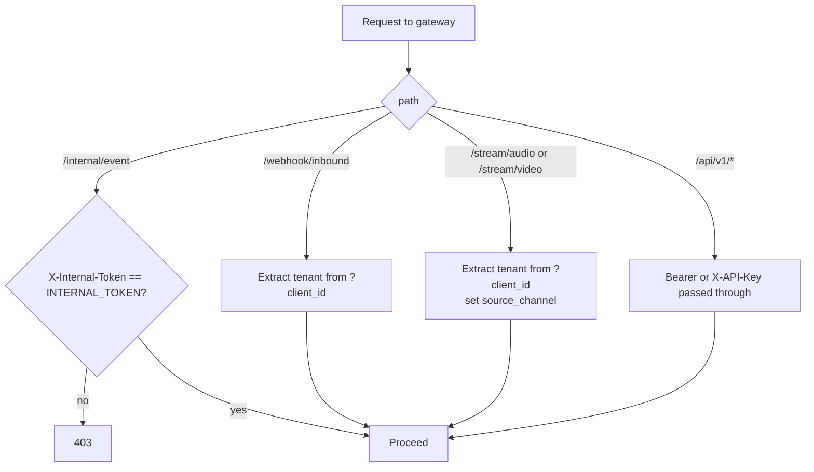

**Only `/internal/event` is hard-blocked at the gateway.** REST and webhook
paths pass through with credentials attached; the backend enforces. The gateway
also applies its own rate limiter (`RATE_LIMIT=200/minute` in compose) and CORS.

---

## 17. The voice surface (port 8002)

Seven routes declared in [voice/main.py](../../backend/src/voice/main.py)
itself, plus 15 more from the three routers it mounts — **22 routes served in
total**.

| Method | Path | Purpose |
|---|---|---|
| GET | `/` | Banner |
| GET | `/health` | Health |
| GET | `/metrics` | Metrics |
| GET | `/stream/twilio/{session_id}` | Diagnostic (HTTP) |
| WS | `/stream/twilio/{session_id}` | Twilio media stream |
| WS | `/stream/tata/{session_id}` | Tata media stream |
| WS | `/webhooks/voice/tata/incoming` | Tata inbound media |

It additionally mounts `webhook_router` (9 routes), `transcript_router` (4) and
`messaging_router` (2). All three are mounted conditionally inside `try/except`
blocks ([voice/main.py:44-62](../../backend/src/voice/main.py:44)), so an import
error degrades to a warning and the app still starts — with those routes
missing. Only `transcript_router` is unique to this process; the backend on 8000
mounts the other two as well.

### Transcripts — only on port 8002

[transcript_api.py](../../backend/src/voice/transcript_api.py) is mounted **only**
by the voice service, not the backend:

| Method | Path |
|---|---|
| GET | `/api/calls/{call_id}/transcript` |
| GET | `/api/calls/{call_id}/transcript/text` |
| GET | `/api/calls/{call_id}/summary` |
| GET | `/api/calls/{call_id}/export` |

> ⚠️ If the voice service is genuinely retired, **these four endpoints are
> unreachable**, and the call-detail UI that consumes them is broken. Verify
> before relying on them. Note also they use `/api/calls/...` with no `/v1`.

---

## 18. Webhooks

Nine inbound webhooks under `/webhooks/voice` on the **backend** (port 8000).

| Method | Path | Provider | Purpose |
|---|---|---|---|
| POST | `/webhooks/voice/twilio/incoming` | Twilio | Inbound call → TwiML |
| POST | `/webhooks/voice/twilio/status` | Twilio | Call status callback |
| POST | `/webhooks/voice/twilio/outbound-twiml` | Twilio | TwiML for outbound |
| GET | `/webhooks/voice/tata/incoming` | Tata Tele | Endpoint verification |
| POST | `/webhooks/voice/tata/incoming` | Tata Tele | Inbound call |
| GET | `/webhooks/voice/tata/status` | Tata Tele | Status (GET variant) |
| POST | `/webhooks/voice/tata/status` | Tata Tele | Status callback |
| POST | `/webhooks/voice/whatsapp/incoming` | Twilio | Inbound WhatsApp |
| POST | `/webhooks/voice/tata/whatsapp/incoming` | Tata Tele | Inbound WhatsApp |

Plus the generic gateway webhook:

| Method | Path | Purpose |
|---|---|---|
| POST | `/webhook/inbound` (port 8001) | Unified inbound, tenant from `?client_id=` |

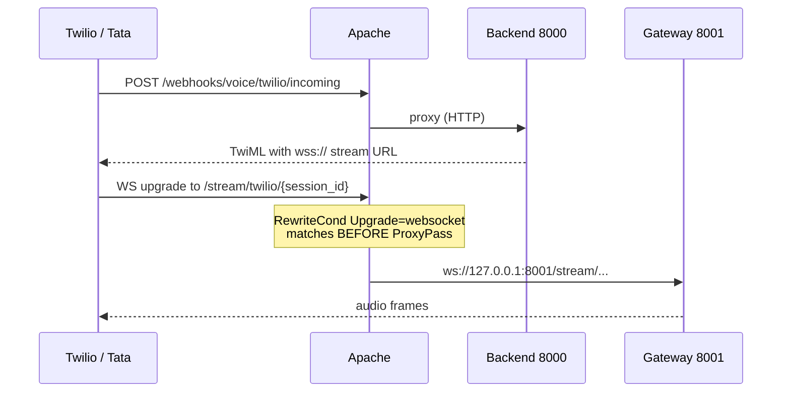

Note the split: **HTTP webhooks go to the backend, media WebSockets go to the
gateway.** The Apache rewrite rules are what route them apart — see
[18 §8.1](18-infrastructure-and-deployment.md#81-the-websocket-upgrade-pattern).

Tata Tele needs **both** GET and POST on `/tata/incoming` and `/tata/status` —
GET for endpoint verification at registration time, POST for real events.

---

## 19. WebSocket endpoints

| URL | Process | Auth | Carries |
|---|---|---|---|
| `wss://gateway.hirebuddha.com/stream/audio?client_id=<id>` | 8001 | `client_id` query | Browser mic + telephony audio |
| `wss://gateway.hirebuddha.com/stream/video?client_id=<id>` | 8001 | `client_id` query | WebRTC signalling |
| `wss://gateway.hirebuddha.com/stream/twilio/{session_id}` | 8001 | session id | Twilio Media Streams |
| `wss://gateway.hirebuddha.com/stream/tata/{session_id}` | 8001 | session id | Tata media |
| `wss://gateway.hirebuddha.com/webhooks/voice/tata/incoming` | 8001 | — | Tata inbound media |

Test locally:

```bash
websocat "ws://localhost:8001/stream/audio?client_id=test-tenant"
```

Apache proxies these via `RewriteCond %{HTTP:Upgrade} =websocket` with
`ProxyTimeout 86400`. Frame formats and message catalogues are in
[13 — Gateway and realtime](13-gateway-and-realtime.md) and
[12 — Voice and telephony](12-voice-and-telephony.md).

---

## 20. Server-Sent Events

One SSE endpoint:

```
GET /api/v1/ai/executions/{execution_id}/stream
```

```bash
curl -N -H "Authorization: Bearer $TOKEN" http://localhost:8000/api/v1/ai/executions/$RUN_ID/stream
```

`-N` disables curl's buffering — without it you see nothing until the stream
closes.

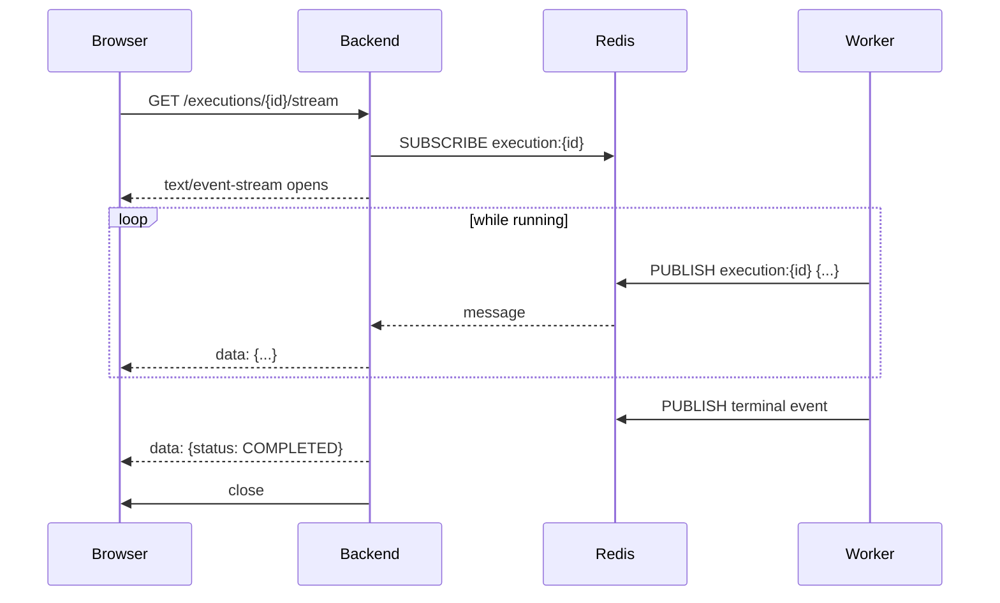

The Redis channel is `execution:{run_id}` — the same channel HITL publishes
`HITL_PENDING` on, so an approval request appears inline in the trace stream.
See [15 §8.1](15-governance-and-hitl.md#81-two-redis-channels).

The frontend consumer is
[useExecutionEvents.ts](../../frontend/src/hooks/useExecutionEvents.ts) — see
[16 — Frontend](16-frontend.md).

> ⚠️ SSE through a reverse proxy needs output buffering disabled, and the auth
> token cannot travel in a header from `EventSource` — hence
> `get_current_user_from_query`. Check how the frontend passes it.

---

## 21. End-to-end recipes

### 21.1 Register, log in, run an entity, watch it

```bash
BASE=http://localhost:8000 && TOKEN=$(curl -s -X POST $BASE/api/v1/auth/register -H 'Content-Type: application/json' -d '{"email":"demo@example.com","password":"Passw0rd!","full_name":"Demo"}' >/dev/null; curl -s -X POST $BASE/api/v1/auth/login -H 'Content-Type: application/json' -d '{"email":"demo@example.com","password":"Passw0rd!"}' | python3 -c 'import sys,json;print(json.load(sys.stdin)["access_token"])') && echo "token acquired"
```

```bash
ENTITY=$(curl -s -X POST $BASE/api/v1/ai/entities -H "Authorization: Bearer $TOKEN" -H 'Content-Type: application/json' -d '{"name":"demo-skill","type":"SKILL","goal":"Answer a question concisely","governance":{"max_cost_usd":0.5,"timeout_ms":60000}}' | python3 -c 'import sys,json;print(json.load(sys.stdin)["id"])') && echo "entity $ENTITY"
```

```bash
RUN=$(curl -s -X POST $BASE/api/v1/ai/execute -H "Authorization: Bearer $TOKEN" -H 'Content-Type: application/json' -d "{\"entity_id\":\"$ENTITY\",\"input_data\":{\"input\":\"What is pgvector?\"}}" | python3 -c 'import sys,json;print(json.load(sys.stdin)["id"])') && echo "run $RUN"
```

```bash
curl -N -H "Authorization: Bearer $TOKEN" $BASE/api/v1/ai/executions/$RUN/stream
```

```bash
curl -s -H "Authorization: Bearer $TOKEN" $BASE/api/v1/ai/executions/$RUN | python3 -m json.tool
```

### 21.2 Approve a HITL checkpoint

```bash
curl -s -H "Authorization: Bearer $TOKEN" $BASE/api/v1/ai/approvals/pending | python3 -m json.tool
```

```bash
curl -X POST $BASE/api/v1/ai/approvals/$APPROVAL_ID/respond -H "Authorization: Bearer $TOKEN" -H 'Content-Type: application/json' -d '{"status":"APPROVED","reviewer_notes":"ok"}'
```

### 21.3 Register an LLM provider and route a task to it

```bash
curl -X POST $BASE/api/v1/config/integrations -H "Authorization: Bearer $TOKEN" -H 'Content-Type: application/json' -d '{"provider":"google","service_category":"LLM","model_name":"gemini-2.0-flash","credentials":{"...":"..."},"internal_cost":0.10,"cost_unit":"1M Tokens"}'
```

```bash
curl -X POST $BASE/api/v1/config/task-defaults -H "Authorization: Bearer $TOKEN" -H 'Content-Type: application/json' -d '{"task_type":"text_generation","model_name":"gemini-2.0-flash"}'
```

> Use `"1M Tokens"` or `"1K Tokens"` — **not** `"per_1k_tokens"`. See
> [10 — LLM providers](10-llm-providers.md) for why the underscore form
> mis-bills.

### 21.4 Check the bill

```bash
curl -s -H "Authorization: Bearer $TOKEN" $BASE/api/v1/credits/balance | python3 -m json.tool
```

```bash
curl -s -H "Authorization: Bearer $TOKEN" "$BASE/api/v1/reports/costing" | python3 -m json.tool
```

```bash
curl -s -H "Authorization: Bearer $TOKEN" $BASE/api/v1/ai/admin/executions/$RUN/cost_attribution | python3 -m json.tool
```

---

## 22. Legacy and dead routes

### 22.1 Redirect shims in `main.py`

| Path | Redirects to | Notes |
|---|---|---|
| `GET /api/v1/assets` | `/api/v1/artifacts` | Legacy assets listing |
| `GET /api/v1/assets/{path:path}` | `/api/v1/artifacts/{path}` | Legacy assets path |
| `GET\|POST /api/v1/ai/phase11/{subpath}` | `/api/v1/ai/admin/{subpath}` | 307, preserves query |

The kernel-admin shim carries an explicit expiry:

```python
# backend/src/main.py
# Kernel admin de-prefix compat shim. The router moved from
# /api/v1/ai/phase11/* to /api/v1/ai/admin/*; this redirect keeps old
# bookmarks and the unmigrated frontend working. Remove after 2026-09-01.
```

Today is past that date's approach; check whether the frontend still depends on
it before removing.

### 22.2 Dead router — `phone_pool_router.py`

Seven routes under `/api/v1/phone-pool` are declared but the router is **never
mounted**. `main.py` says:

```python
# backend/src/main.py
# Phone Number Pool is now unified into phone_number_router (no separate router)
```

and `phone_number_router.py`'s docstring confirms:
*"Replaces both the old phone_pool_router.py and phone_number_router.py."*

| Dead path | Live replacement |
|---|---|
| `POST /api/v1/phone-pool` | `POST /api/v1/phone-numbers` |
| `POST /api/v1/phone-pool/bulk` | `POST /api/v1/phone-numbers/bulk` |
| `POST /api/v1/phone-pool/sync` | `POST /api/v1/phone-numbers/sync` |
| `GET /api/v1/phone-pool` | `GET /api/v1/phone-numbers` |
| `POST /api/v1/phone-pool/{id}/claim` | `POST /api/v1/phone-numbers/{id}/claim` |
| `POST /api/v1/phone-pool/{id}/release` | `POST /api/v1/phone-numbers/{id}/release` |
| `DELETE /api/v1/phone-pool/{id}` | `DELETE /api/v1/phone-numbers/{id}` |

**`backend/src/voice/phone_pool_router.py` (701 lines) is dead code** and a
candidate for deletion.

### 22.3 Debug route

`GET /api/v1/auth/admin-only` exists purely to probe the admin role guard.

---

## 23. Gotchas

1. **Full paths chain two prefixes.** `include_router(..., prefix="/api/v1")`
   plus `APIRouter(prefix="/ai")` plus `@router.post("/entities")` gives
   `/api/v1/ai/entities`. Reading only the decorator will mislead you.

2. **Nine admin routes have a doubled `admin/admin`** segment. Not a typo here —
   call them as written.

3. **`/api/social-connections` has no `/v1`.** The only business route breaking
   the convention.

4. **`AI_MODEL_CREDENTIALS_GUIDE.md` documents `/api/config/...`; the real path
   is `/api/v1/config/...`.**

5. **`/api/v1/phone-pool/*` does not exist at runtime** — the router is never
   mounted. Use `/api/v1/phone-numbers/*`.

6. **Transcript endpoints are only on port 8002**, which `start_services.sh`
   never starts and the gateway claims is retired.

7. **HTTP webhooks hit the backend; media WebSockets hit the gateway.** Apache
   rewrite rules split them.

8. **Tata Tele needs both GET and POST** on `/tata/incoming` and `/tata/status`.

9. **Only `/internal/event` is hard-blocked at the gateway.** Everything else
   passes through for the backend to enforce.

10. **SSE needs `curl -N`** and a query-parameter token — `EventSource` cannot
    set headers.

11. **`DELETE /api/v1/ai/entities/{id}` is a soft delete.** The row stays.

12. **Cron endpoints move money over HTTP.** `POST /api/v1/cron/daily-credits`
    and `/monthly-billing` are manually triggerable.

13. **No universal pagination.** Check each list endpoint.

14. **Company suspension returns 403 from middleware** before your handler runs —
    and it opens its own DB session to do so.

15. **`GET /api/v1/ai/tools` and `GET /api/v1/ai/tool-registry` are different
    things** — tenant-visible tools versus the full registry.

---

## Where to go next

- [04 — Auth, RBAC and tenancy](04-auth-rbac-tenancy.md) — token lifecycle and
  role guards.
- [06 — Execution pipeline](06-execution-pipeline.md) — the entity body schema
  for `POST /ai/entities`.
- [13 — Gateway and realtime](13-gateway-and-realtime.md) — WebSocket frame
  formats and the SSE envelope.
- [12 — Voice and telephony](12-voice-and-telephony.md) — webhook payload shapes
  per provider.
- [14 — Billing and credits](14-billing-and-credits.md) — what the credits and
  reports endpoints return.
- [18 — Infrastructure](18-infrastructure-and-deployment.md) — which process
  serves which subdomain.
