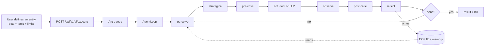
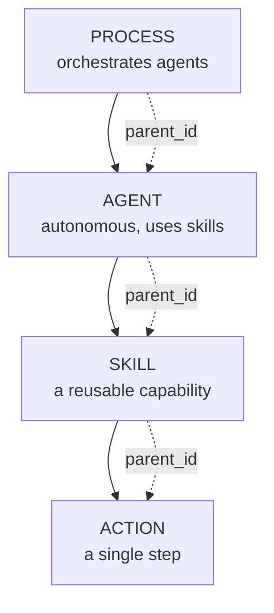
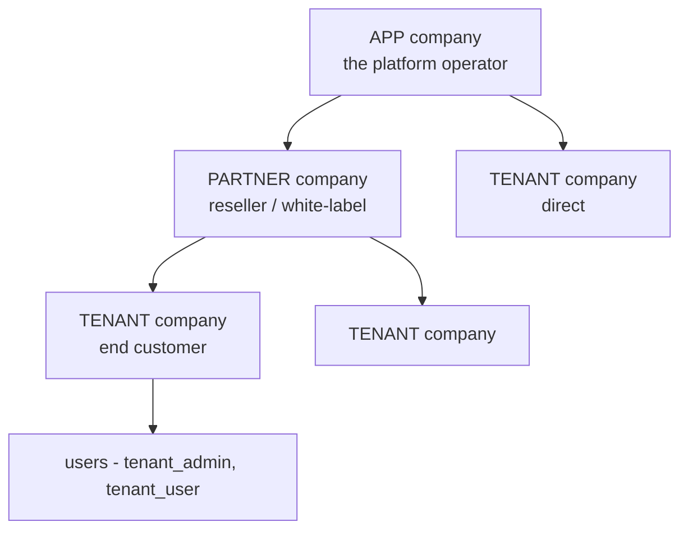
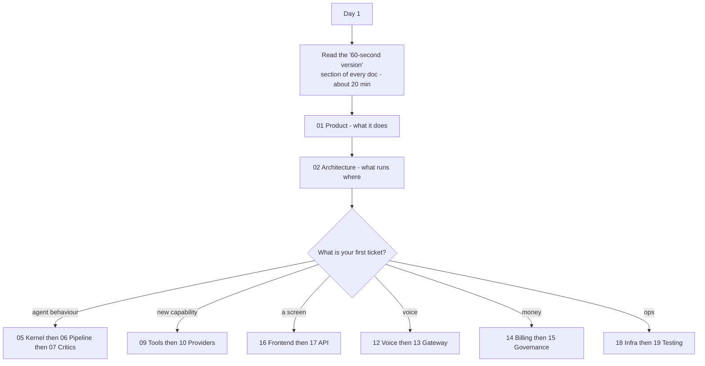
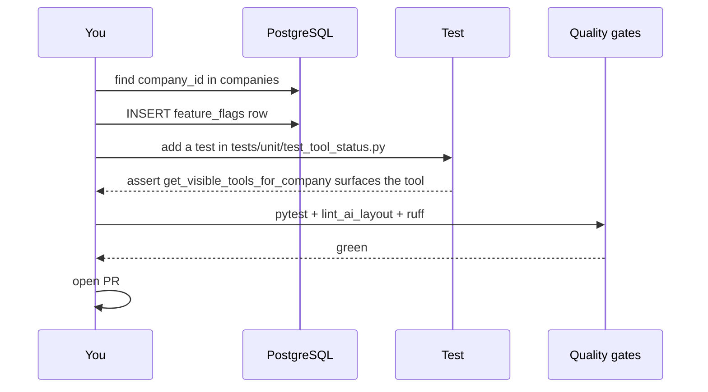
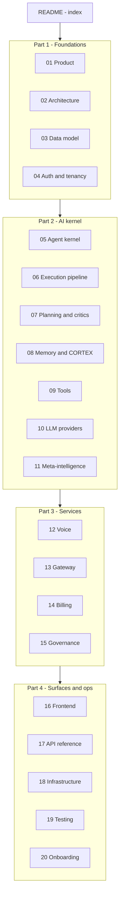

# 20. Developer Onboarding & Glossary

> **What this document covers:** your first day, your first change, the mental model you need before reading code, and a glossary of every term this codebase invents.
> **Who should read it:** you, if you just cloned this repository.
> **Prerequisites:** none. Start here.

---

## Table of contents

1. [The 60-second version](#1-the-60-second-version)
2. [Day one — get it running](#2-day-one--get-it-running)
3. [The mental model](#3-the-mental-model)
4. [The reading path](#4-the-reading-path)
5. [Your first change](#5-your-first-change)
6. [Common tasks and where they live](#6-common-tasks-and-where-they-live)
7. [How to find things](#7-how-to-find-things)
8. [Conventions you must follow](#8-conventions-you-must-follow)
9. [The ten things that surprise everyone](#9-the-ten-things-that-surprise-everyone)
10. [Glossary](#10-glossary)
11. [Document map](#11-document-map)

---

## 1. The 60-second version

HireBuddha is a **multi-tenant AI orchestration platform**. Customers compose AI
"entities" in a no-code builder, run them, and pay for what they consume.

The thing that makes it more than a prompt wrapper is the **agent kernel** — a
control loop that plans before acting, criticises its own work, remembers across
runs, and stops when it runs out of budget.



Five facts that orient everything else:

| Fact | Why it matters |
|---|---|
| ~75,000 lines of Python, ~25,000 lines of TypeScript | Large but navigable — see [§7](#7-how-to-find-things) |
| Five processes on one VM | Backend 8000, Gateway 8001, Voice 8002, Arq worker, Vite 3000 |
| Everything is tenant-scoped by `company_id` | Get this wrong and you leak customer data |
| Third-party credentials live **in the database**, not `.env` | Encrypted, per-company, no redeploy to change |
| The AI kernel is heavily feature-flagged | 42 boolean + 5 numeric flags change behaviour at runtime |

---

## 2. Day one — get it running

Full detail in [18 — Infrastructure](18-infrastructure-and-deployment.md); this
is the condensed path.

```mermaid
flowchart TD
    A["1. Clone"] --> B["2. cd backend && poetry install"]
    B --> C["3. cp .env.example .env"]
    C --> C2["4. EDIT .env - change 5432 to 5433"]
    C2 --> D["5. docker compose up -d db redis"]
    D --> E["6. alembic upgrade head"]
    E --> F["7. seed_admin_user.py"]
    F --> G["8. cd frontend && npm install --legacy-peer-deps"]
    G --> H["9. ./start_services.sh"]
    H --> I["10. open localhost:3000"]

    style C2 fill:#4a3a2d,stroke:#a85
```



```bash
cd backend && python3 -m venv .venv && poetry install --no-interaction
```

```bash
cp backend/.env.example backend/.env
```

**Now edit `backend/.env` and change `DATABASE_URL` from port 5432 to 5433.**
This is the single most common day-one failure — docker-compose maps Postgres to
host port **5433**, but the example file says 5432.

```bash
cd backend && docker compose up -d db redis
```

```bash
cd backend && .venv/bin/alembic upgrade head
```

```bash
cd backend && .venv/bin/python db-scripts/seed_admin_user.py
```

```bash
cd frontend && npm install --legacy-peer-deps
```

```bash
./start_services.sh
```

### 2.1 Verify

```bash
curl -s localhost:8000/ && echo && curl -s localhost:8001/health && echo && redis-cli ping
```

```bash
cd backend && .venv/bin/python -c "from src.ai.worker import WorkerSettings; print(len(WorkerSettings.functions), 'jobs;', len(WorkerSettings.cron_jobs), 'crons')"
```

That last command is the fastest check that the whole AI package imports
cleanly. If it fails, nothing else will work.

```bash
cd backend && .venv/bin/python -m pytest tests/unit/ -q
```

Then open `http://localhost:3000` and `http://localhost:8000/docs`.

### 2.2 If something is broken

| Symptom | Cause |
|---|---|
| Migrations hang | `DATABASE_URL` port is 5432, should be 5433 |
| `npm install` fails on peer deps | Missing `--legacy-peer-deps` |
| `start_services.sh` exits immediately | `backend/.env` does not exist |
| Port already in use | The script skips occupied ports — check `lsof -i :8000` |
| Agent runs but does nothing | No LLM credentials registered — see [10](10-llm-providers.md) |
| Docker permission denied | Log out and back in after `usermod -aG docker` |

---

## 3. The mental model

Four concepts carry the whole system. Learn these before reading any code.

### 3.1 The entity hierarchy



Everything a customer builds is a `HierarchicalEntity` row, typed `ACTION`,
`SKILL`, `AGENT` or `PROCESS`. They nest via `parent_id`. Configuration lives in
**nine JSON columns** (`identity`, `hierarchy`, `logic_gate`, `planning`,
`capabilities`, `governance`, `io_contract`, `observability`,
`metadata_extensions`).

→ [06 — Execution pipeline](06-execution-pipeline.md)

### 3.2 The agent loop

Every execution runs through one control loop with nine phases per iteration:
**perceive → strategize → pre-critic → act → observe → post-critic → reflect →
decide**. State lives in a typed `AgentState` envelope; spend is tracked by a
`Budget` (tokens / USD / wall-clock / iterations).

→ [05 — Agent kernel](05-agent-kernel.md)

### 3.3 Memory is a tree, not a transcript

The agent never sees raw history. It sees a **viewport** — a bounded slice of a
persistent CORTEX tree, capped at 4000 characters by default. Four typed memory
domains (Knowledge, Episodic, Experience, Intelligence) feed a `__memory__` block
that gets injected into the prompt.

→ [08 — Memory and CORTEX](08-memory-and-cortex.md)

### 3.4 Tenancy is everything



Three company types, six user roles. **Every query must be scoped by
`company_id`.** Credentials, costs, memory, entities and phone numbers are all
per-company, with APP-level fallback for shared configuration.

→ [04 — Auth, RBAC and tenancy](04-auth-rbac-tenancy.md)

---

## 4. The reading path

You do not need to read all twenty documents. Read the first sections.



**The 20-minute tour:** read only section 1 ("The 60-second version") of
documents 01 through 19. Each one has a summary diagram. That gives you the
whole system shape without the detail.

Then read [03 — Data model](03-data-model.md) properly. Almost every question
you will have in week one is answerable from the schema.

---

## 5. Your first change

The in-repo onboarding guide
([backend/src/ai/ONBOARDING.md](../../backend/src/ai/ONBOARDING.md)) proposes a
guided exercise: enable the `EXPERIMENTAL` `video_generation` tool for your dev
tenant.



**Step 1** — find your company id:

```bash
psql -h localhost -p 5433 -U postgres -d hirebuddha -c "SELECT id, name, type FROM companies;"
```

**Step 2** — enable the flag:

```bash
psql -h localhost -p 5433 -U postgres -d hirebuddha -c "INSERT INTO feature_flags (id, company_id, flag_key, enabled) VALUES (gen_random_uuid(), '<company-id>', 'tools.experimental.video_generation', true);"
```

**Step 3** — add a unit test in `backend/tests/unit/test_tool_status.py`
asserting `ToolRegistry.get_visible_tools_for_company(...)` surfaces
`video_generation` when the flag is on.

**Step 4** — run it:

```bash
cd backend && .venv/bin/python -m pytest tests/unit/test_tool_status.py -q
```

**Step 5** — run the gates before pushing:

```bash
cd backend && scripts/run_ci_matrix.sh fast
```

> ⚠️ The `ONBOARDING.md` version of this exercise says the unit suite should
> print *"~420 passed"*. That figure is from the Phase 11 baseline;
> `tests/unit/` now holds 745 test functions. Do not treat the number as a
> target. Also note there is **no CI wired to run any of this** — the gates are
> manual. See [19 §15.1](19-testing.md#151-the-ci-lanes).

---

## 6. Common tasks and where they live

| I want to… | Start here | Doc |
|---|---|---|
| Add an API endpoint | `backend/src/ai/router.py` or a sibling router | [17](17-api-reference.md) |
| Add a database table | `backend/src/ai/orm/` + `alembic revision --autogenerate` | [03](03-data-model.md) |
| Add a tool an agent can call | `backend/src/ai/tools/<category>/` | [09](09-tools.md) |
| Add an LLM provider | `backend/src/ai/llm/` + Integration Registry | [10](10-llm-providers.md) |
| Change how the loop decides | `backend/src/ai/core/strategist.py` | [05](05-agent-kernel.md) |
| Change planning or critics | `backend/src/ai/planning/` | [07](07-planning-and-critics.md) |
| Change what an agent remembers | `backend/src/ai/memory/` (mostly shims — see below) | [08](08-memory-and-cortex.md) |
| Add a feature flag | `backend/src/ai/core/feature_flags.py::DEFAULTS` | [15](15-governance-and-hitl.md) |
| Add a screen | `frontend/src/pages/` + `frontend/src/router/index.tsx` | [16](16-frontend.md) |
| Change pricing | Integration Registry `internal_cost` + `TOOL_SKU_MAP` | [14](14-billing-and-credits.md) |
| Add a HITL checkpoint type | `backend/src/ai/schemas/enums.py::HITLTriggerType` | [15](15-governance-and-hitl.md) |
| Debug a failed run | `GET /executions/{id}/trace`, then `logs/arq_worker.log` | [06](06-execution-pipeline.md) |
| Add a test | `backend/tests/unit/` by default | [19](19-testing.md) |
| Deploy | `./stop_services.sh && git pull && ... && ./start_services.sh` | [18](18-infrastructure-and-deployment.md) |

---

## 7. How to find things

### 7.1 The backend map

```
backend/src/
├── main.py           # Backend API app — read this first, it lists every router
├── ai/               # The AI kernel — the bulk of the codebase
│   ├── core/         # AgentLoop, AgentState, Budget, executors, reasoning
│   ├── planning/     # Plan generation, critics, bandit
│   ├── memory/       # CORTEX + four domains (mostly shims — see §7.3)
│   ├── meta/         # Meta-Agent Board, anti-sprawl, schema compiler
│   ├── governance/   # Credit gates, HITL, rate limits, tool costs
│   ├── llm/          # Provider adapters + router
│   ├── tools/        # Every tool, by category
│   ├── orm/          # SQLAlchemy models
│   ├── schemas/      # Pydantic schemas
│   └── worker.py     # Arq entry point — MUST stay minimal
├── auth/             # Auth, RBAC, companies, users, onboarding
├── billing/          # Rates, ledger, credits, subscriptions
├── voice/            # Telephony, speech-to-speech, WhatsApp
├── gateway/          # The unified gateway process
├── config/           # Integration Registry
└── common/           # Config, database, security, middleware, telemetry
```

### 7.2 Useful greps

```bash
grep -rn "__tablename__" backend/src backend/cortex_memory_moved_to_pypi_repo --include="*.py"
```

```bash
grep -rn "@router\.\(get\|post\|put\|patch\|delete\|websocket\)" backend/src --include="*.py"
```

```bash
grep -rn "class.*Tool" backend/src/ai/tools --include="*.py"
```

```bash
grep -rn "await flags.is_on\|FeatureFlags(" backend/src --include="*.py"
```

### 7.3 Where the code is *not*

Three traps:

| You would expect | It is actually |
|---|---|
| CORTEX logic in `src/ai/memory/` | Mostly re-export shims — real code in `backend/cortex_memory_moved_to_pypi_repo/` |
| ORM models in `src/ai/models.py` | A deprecated shim — real models in `src/ai/orm/` |
| Tests at repo root `tests/` | Empty scaffolding — real tests in `backend/tests/` |

### 7.4 In-repo docs worth reading

| File | Why |
|---|---|
| [backend/src/ai/README.md](../../backend/src/ai/README.md) | The AI package layout and its lint rules |
| [backend/src/ai/core/README.md](../../backend/src/ai/core/README.md) | The kernel, file by file |
| [backend/src/ai/core/INTERNAL_KEYS.md](../../backend/src/ai/core/INTERNAL_KEYS.md) | Every `context_state` key |
| [backend/src/ai/memory/README.md](../../backend/src/ai/memory/README.md) | The memory substrate |
| [backend/src/ai/meta/README.md](../../backend/src/ai/meta/README.md) | The Meta-Agent Board |
| [backend/src/ai/governance/README.md](../../backend/src/ai/governance/README.md) | The gate layer |
| [backend/tests/parity/README.md](../../backend/tests/parity/README.md) | The best-written doc in the repo |

`docs/phase9/` through `docs/phase12/` are historical **plans**. They describe
intent; the code is truth. Where they disagree, trust the code.

---

## 8. Conventions you must follow

### 8.1 Architecture rules (mechanically enforced)

[`lint_ai_layout.py`](../../backend/scripts/lint_ai_layout.py) will fail your
build for:

| Rule | Limit |
|---|---|
| `core/` file length | 1500 lines (**`agent_loop.py` is at 1480**) |
| `planning/` file length | 700 |
| `memory/` file length | 1200 |
| `meta/` file length | 900 |
| `governance/` file length | 600 |
| `tools/` file length | 1000 |
| `llm/` file length | 800 |
| `shared/` file length | 400 |
| New top-level file in `src/ai/` | Rejected unless allowlisted |
| `from src.ai.worker import ...` | Forbidden |
| `... as CortexService` alias | Forbidden |
| A tool file directly in `tools/` | Only `__init__.py`, `base.py`, `resilience.py`, `README.md` |

**`core/` has 20 lines of headroom.** If your change grows `agent_loop.py`,
extract instead.

### 8.2 Code style

| Tool | Setting |
|---|---|
| ruff | line-length 88, rules `E`, `F`, `I`, `B` |
| black | 88 columns |
| mypy | `--strict` on an allowlist via `typecheck_ai.py` |
| ESLint | `--max-warnings 0` — a warning fails |

### 8.3 Tenancy

Every query touching customer data must filter on `company_id`. Every service
that can write should take `company_id` at **construction**, not per call — that
is how `CortexService` and `EmbeddingService` do it, and it is why they are hard
to misuse.

### 8.4 Documentation tests

Two tests fail if docs and code drift:

- `test_internal_keys_documented` — `constants.py::INTERNAL_CONTEXT_KEYS` must
  match the table in `core/INTERNAL_KEYS.md`.
- `tests/integration/test_cost_attribution.py` — every cost surface must write
  an attributed `usage_logs` row.

### 8.5 Adding a feature flag

Add to `DEFAULTS` (boolean) or `NUMERIC_DEFAULTS` (numeric) in
[feature_flags.py](../../backend/src/ai/core/feature_flags.py), with a comment
explaining what it controls and why the default is what it is. Then document it
in [15 §13](15-governance-and-hitl.md#13-feature-flags--the-complete-catalogue).

---

## 9. The ten things that surprise everyone

1. **Postgres is on host port 5433**, and `.env.example` says 5432.

2. **Most gates fail open.** Credit checks, HITL pub/sub, rate limiting,
   suspension middleware and duplicate detection all swallow non-fatal errors
   and let the request through. A broken gate looks exactly like a passing gate.
   Read logs, not just outcomes.

3. **Memory retrieval fails silently.** Every domain assembler catches broad
   `Exception`, logs at `debug`, and returns `[]`. An agent with broken memory is
   indistinguishable from one that has not learned yet.

4. **Third-party credentials are in the database, not `.env`.** Encrypted,
   per-company, with APP-level fallback. Adding a provider needs no redeploy —
   and your database backup is now a secrets backup.

5. **Half of `src/ai/memory/` is re-export shims.** The real CORTEX engine was
   extracted to a package; its source sits in
   `backend/cortex_memory_moved_to_pypi_repo/`.

6. **A HITL checkpoint blocks an Arq worker slot** for up to `timeout_ms`
   (5 minutes by default) while a human decides.

7. **There is effectively no CI.** The one GitHub Actions workflow targets a
   directory that does not exist under that name. Run
   `scripts/run_ci_matrix.sh fast` yourself.

8. **The frontend has two test files and no test runner** configured to execute
   them.

9. **`start_services.sh` does not start the voice service**, and the gateway
   claims the voice service is retired — but Apache still routes to it and 11
   routes still exist there. Port 8002 is in an ambiguous state.

10. **Nine admin routes have a doubled path segment** — `/api/v1/ai/admin/admin/kpi/runs`
    is the real URL, not a typo.

---

## 10. Glossary

Terms this codebase invents or uses in a specific way.

### Core concepts

| Term | Meaning |
|---|---|
| **Entity** | A `HierarchicalEntity` row — the unit a customer builds. Typed ACTION / SKILL / AGENT / PROCESS. |
| **ACTION** | The smallest entity type — a single step. |
| **SKILL** | A reusable capability composed of actions. |
| **AGENT** | An autonomous entity that uses skills to pursue a goal. |
| **PROCESS** | Orchestrates agents; the top of the hierarchy. |
| **Run** / **Execution** | An `ExecutionRun` row — one invocation of an entity. |
| **Child run** | A run spawned by another run, linked by `parent_run_id`. |
| **AgentLoop** | The control loop that drives every run. |
| **AgentState** | The typed envelope every loop phase reads and writes. |
| **Budget** | First-class tracker of tokens, USD, wall-clock and iterations. |
| **Budget pressure** | A 0–1 measure of how much budget is consumed; past a threshold the prompt gets a "finish, don't expand" directive. |
| **Move** / **Decision** | What the Strategist returns — what to do next and whether to continue. |
| **Subgoal** | A decomposed piece of the entity's goal, tracked in `AgentState`. |
| **Reflection** | The Reflector's output after an iteration; can escalate scope from run to entity. |
| **Executor** | An adapter that performs one kind of action — DAG, Recursive, SingleStep, ChildEntity. |
| **Reasoning strategy** | REACT, CHAIN_OF_THOUGHT, REFLECTION, TREE_OF_THOUGHTS — how the LLM is prompted to think. |

### Memory

| Term | Meaning |
|---|---|
| **CORTEX** | The persistent cognitive tree that is an agent's memory. |
| **Viewport** | The bounded slice of the tree the agent actually sees — default 4000 chars. |
| **Node** | One piece of information in a CORTEX tree, typed (`finding`, `chunk`, `episode`, …). |
| **Checkpoint** | A compacted snapshot node written when context gets large. |
| **ScopePolicy** | Rules confining a child run's reads and writes to its subtree. |
| **Memory domain** | One of Knowledge, Episodic, Experience, Intelligence. |
| **Knowledge** | What the agent has read — ingested documents. |
| **Episodic** | What happened — one node per completed run. |
| **Experience** | Patterns noticed across episodes. |
| **Intelligence** | Distilled rules — the most refined memory. |
| **Dreaming** | The offline job that turns episodes into observations into patterns into rules. |
| **Rule lifecycle** | `candidate → confirmed → retired`. Promotion after 3 net validations. |
| **Prompt sandwich** | The 10-layer system prompt assembly. |
| **`__memory__`** | The assembled memory block injected at prompt layer 9. |
| **`context_state`** | The legacy dict bridge; its internal keys must be scrubbed before any prompt. |

### Planning and quality

| Term | Meaning |
|---|---|
| **Plan style** | A strategy for structuring a plan; selected by a bandit. |
| **PlanStyleBandit** | Multi-armed bandit choosing plan styles, keyed by `(entity_id, task_class)`. |
| **Task class** | A stable short string (`research_topic`, `draft_email`, …) grouping runs for statistics. |
| **Pre-critic** | Gate that reviews a proposed action before it runs. |
| **Post-critic** | Gate that reviews the result after. |
| **GoalGuard** / **alignment** | Periodic check that the run is still pursuing its goal. |
| **SupervisorCritic** | Higher-level assessment of the run as a whole. |
| **Verdict** | A critic's structured output — PASS / REVISE / BLOCK and variants. |
| **False pass** | Critic said "good" but the ground-truth check disagrees. Feeds calibration. |
| **CSAT** | Thumbs up/down on a finished run — the only ground-truth quality signal. |

### Meta layer

| Term | Meaning |
|---|---|
| **Meta-Agent** | An entity that builds other entities. Runs on the same AgentLoop. |
| **Architecture Board** | The seven roles the Meta-Agent runs in sequence. |
| **Curator** | Board role deciding REUSE / ADAPT / COMPOSE / CREATE. |
| **Anti-sprawl** | Guards preventing duplicate entity creation. |
| **Consolidation** | Proposing merges for clusters of near-duplicate entities. |
| **MetaIntelligenceTree** | A per-company tree of what the platform learned about *building* agents. |
| **Skill candidate** | A repeated tool chain proposed for promotion to a SKILL. |
| **Tool synthesis** | An LLM writing new tool source code. Off by default. |
| **Platform schema** | The compiled JSON description of the platform's own capabilities — the Meta-Agent's "firmware". |

### Money and governance

| Term | Meaning |
|---|---|
| **SKU** | A billable unit identifier, e.g. an LLM model's input or output token stream. |
| **TB formula** | Total Billing — how internal cost becomes the user-facing charge. |
| **`internal_cost`** | The raw per-unit cost stored on an Integration Registry row. |
| **Cost attribution** | Tagging a cost with run, entity, user, company, tool or model. |
| **Credit** | The wallet unit customers spend. |
| **Circuit breaker** | Mid-run check that stops execution when the wallet drains. |
| **HITL** | Human-in-the-loop — a checkpoint that pauses a run for approval. |
| **Checkpoint trigger** | What fires a HITL pause: BEFORE_STEP, AFTER_STEP, COST_THRESHOLD, TOOL_CALL, CUSTOM. |
| **Feature flag** | A runtime switch resolved entity → company → global → env → default. |

### Platform and infrastructure

| Term | Meaning |
|---|---|
| **APP / PARTNER / TENANT** | The three company types. |
| **Integration Registry** | The encrypted per-company credential and pricing store. |
| **Task default** | The mapping from a logical task type to a concrete model. |
| **Gateway** | The port-8001 process handling streaming, webhooks and internal events. |
| **Internal token** | Shared secret for service-to-service calls to `/internal/event`. |
| **Arq** | The Redis-backed async job queue. |
| **Artifact** | A file the platform stores — user-uploaded or system-generated. |
| **Sandbox** | The per-tenant container agent code executes in. |
| **Egress proxy** | The tinyproxy allowlist all sandbox traffic must traverse. |
| **Parity gate** | The test proving the new loop matches the deleted legacy engine. |
| **Golden** | A recorded snapshot the parity gate compares against. |
| **Hermetic** | Test mode with no network and no API keys — deterministic LLM stand-ins. |

---

## 11. Document map



| # | Document | Read it when |
|---|---|---|
| — | [README](README.md) | You need the index |
| 01 | [Product overview](01-product-overview.md) | You need to know what the product does |
| 02 | [System architecture](02-system-architecture.md) | Before your first change |
| 03 | [Data model](03-data-model.md) | "Where is X stored?" |
| 04 | [Auth, RBAC and tenancy](04-auth-rbac-tenancy.md) | Touching any endpoint or query |
| 05 | [Agent kernel](05-agent-kernel.md) | Changing agent behaviour |
| 06 | [Execution pipeline](06-execution-pipeline.md) | Working on entities or runs |
| 07 | [Planning and critics](07-planning-and-critics.md) | Output quality problems |
| 08 | [Memory and CORTEX](08-memory-and-cortex.md) | "Why did it forget?" |
| 09 | [Tools](09-tools.md) | Adding a capability |
| 10 | [LLM providers](10-llm-providers.md) | Model routing or credentials |
| 11 | [Meta-intelligence](11-meta-intelligence.md) | Agent-generated entities |
| 12 | [Voice and telephony](12-voice-and-telephony.md) | Calls, campaigns, WhatsApp |
| 13 | [Gateway and realtime](13-gateway-and-realtime.md) | Streaming transports |
| 14 | [Billing and credits](14-billing-and-credits.md) | "Why was I charged X?" |
| 15 | [Governance and HITL](15-governance-and-hitl.md) | "Why did my run stop?" |
| 16 | [Frontend](16-frontend.md) | Building a screen |
| 17 | [API reference](17-api-reference.md) | Calling the platform |
| 18 | [Infrastructure](18-infrastructure-and-deployment.md) | Running or deploying it |
| 19 | [Testing](19-testing.md) | Writing or running tests |
| 20 | This document | Day one |

---

## Where to go next

If you have read this far, go run the stack ([§2](#2-day-one--get-it-running)),
then read the 60-second sections of [01](01-product-overview.md),
[02](02-system-architecture.md) and [05](05-agent-kernel.md).

After that, pick up a ticket. The documents are reference material — you will
absorb more by tracing one real run through
[06 — Execution pipeline](06-execution-pipeline.md) with the code open beside it
than by reading everything front to back.
