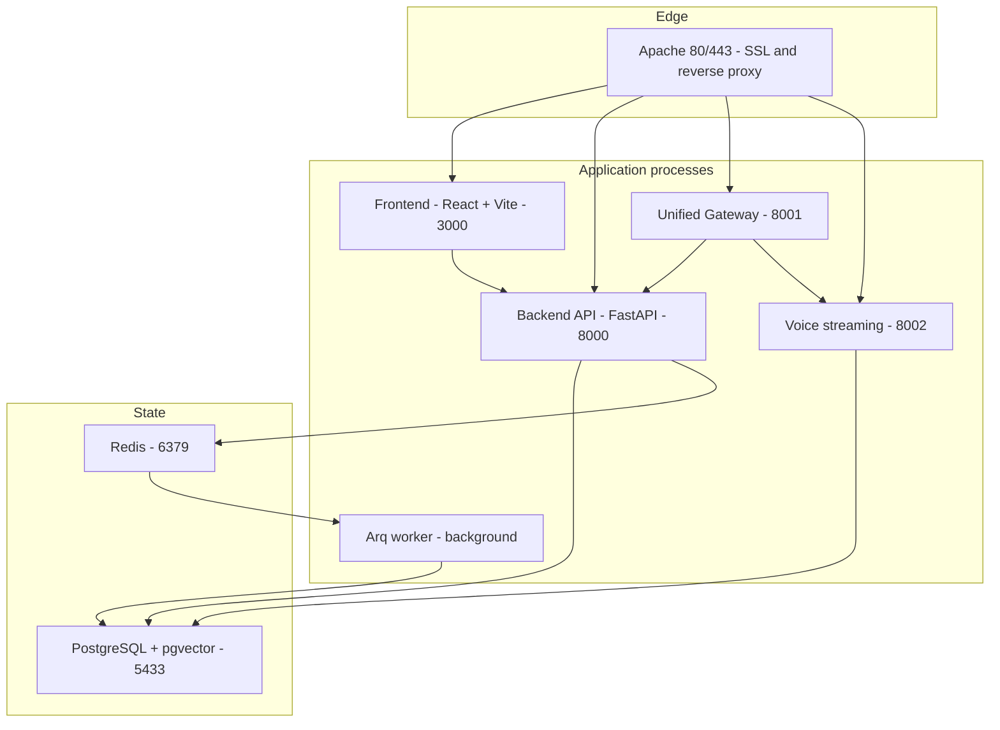
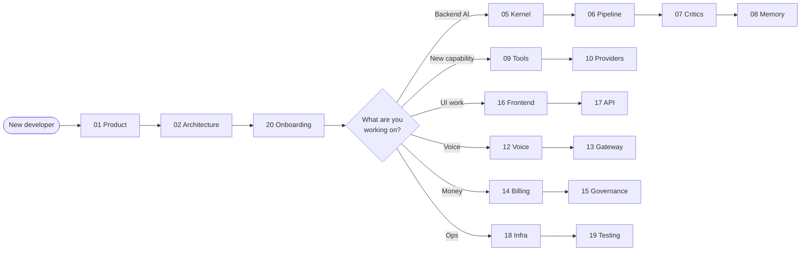

# HireBuddha — Engineering Documentation

> **Purpose:** get a developer who has never seen this codebase from zero to
> productive as fast as possible.
> **Scope:** the whole platform — backend, frontend, AI kernel, voice, billing,
> infrastructure.
> **Ground truth:** every document in this set is written against the code in
> this repository. Where an older design document disagrees with the code, the
> code wins and the drift is noted.

---

## Read this first

The platform is an **enterprise multi-tenant AI orchestration system**. Tenants
compose hierarchical AI entities (`ACTION → SKILL → AGENT → PROCESS`) in a
no-code builder, run them through an autonomous control loop that plans,
criticises and self-corrects, and pay for exactly the tokens, minutes and tool
calls they consume.

---

## The documentation set

Read them in order for a full tour, or jump straight to the area you are
touching.

### Part 1 — Foundations

| # | Document | What it answers |
|---|----------|-----------------|
| 01 | [Product & functional overview](01-product-overview.md) | What does this product actually do, and for whom? |
| 02 | [System architecture & topology](02-system-architecture.md) | Which processes run, on which ports, talking to what? |
| 03 | [Database & data model](03-data-model.md) | Where is X stored? Every table, column and migration. |
| 04 | [Authentication, RBAC & multi-tenancy](04-auth-rbac-tenancy.md) | Who is this request, what may it do, whose data may it see? |

### Part 2 — The AI kernel

| # | Document | What it answers |
|---|----------|-----------------|
| 05 | [The agent kernel — control loop](05-agent-kernel.md) | How does an autonomous run actually think, step by step? |
| 06 | [Entities & the execution pipeline](06-execution-pipeline.md) | How is an entity defined, dispatched, stepped and finished? |
| 07 | [Planning, critics & self-correction](07-planning-and-critics.md) | How does the platform plan, and how does it catch its own mistakes? |
| 08 | [Memory, CORTEX & retrieval](08-memory-and-cortex.md) | What does an agent remember, and how does it come back? |
| 09 | [Tools & the tool registry](09-tools.md) | What can an agent *do*, and how do I add a new capability? |
| 10 | [LLM providers, routing & integrations](10-llm-providers.md) | Which model runs, with whose credentials, at what cost? |
| 11 | [Meta-intelligence & the Meta-Agent Board](11-meta-intelligence.md) | How does the platform reason about and improve itself? |

### Part 3 — Platform services

| # | Document | What it answers |
|---|----------|-----------------|
| 12 | [Voice, telephony & messaging](12-voice-and-telephony.md) | How does a phone call become a conversation with an LLM? |
| 13 | [The unified gateway & real-time transport](13-gateway-and-realtime.md) | REST, SSE, WebSocket, WebRTC — what carries what? |
| 14 | [Billing, costing & credits](14-billing-and-credits.md) | How does consumption turn into a charge? |
| 15 | [Governance, HITL & feature flags](15-governance-and-hitl.md) | What gates a run, and how do humans intervene? |

### Part 4 — Surfaces and operations

| # | Document | What it answers |
|---|----------|-----------------|
| 16 | [Frontend architecture](16-frontend.md) | How is the React app structured, routed and styled? |
| 17 | [API reference](17-api-reference.md) | Every HTTP, WebSocket and SSE endpoint in the platform. |
| 18 | [Infrastructure, deployment & operations](18-infrastructure-and-deployment.md) | How do I run it locally, deploy it, and fix it at 3am? |
| 19 | [Testing & quality gates](19-testing.md) | What is tested, how do I run it, what must pass to merge? |
| 20 | [Developer onboarding & glossary](20-onboarding-and-glossary.md) | Day one: setup, first change, and what the jargon means. |

### Operational

| Document | What it answers |
|----------|-----------------|
| [Defect register](DEFECT-REGISTER.md) | What is known to be broken, how bad it is, and in what order to fix it. Compiled from the ⚠️ markers and **Gotchas** sections of the 20 documents above, then checked against the code. |

### Supplementary references (pre-existing)

These predate the guide series above and remain useful as focused references.
Verify against the numbered documents where they overlap.

| Document | Notes |
|----------|-------|
| [billing_rates_by_primitive.md](billing_rates_by_primitive.md) | Per-primitive SKU and rate catalogue. Cross-check with [14](14-billing-and-credits.md). |
| [architecture-diagrams.md](architecture-diagrams.md) | Earlier visual atlas. Superseded in parts by [02](02-system-architecture.md) and [05](05-agent-kernel.md). |
| [product_technical_documentation.md](product_technical_documentation.md) | Earlier systems manual. |
| [product_functional_documentation.md](product_functional_documentation.md) | Earlier product manual. |

---

## Suggested reading paths

| If you are… | Read, in order |
|-------------|----------------|
| Brand new, any role | 01 → 02 → 20 → 03 |
| Changing agent behaviour | 05 → 06 → 07 → 08 |
| Adding a tool or integration | 09 → 10 → 14 (costing) |
| Building a screen | 16 → 17 → 04 (route guards) |
| Touching voice or campaigns | 12 → 13 → 03 (voice tables) |
| Working on pricing or credits | 14 → 15 → 03 |
| Deploying or on call | 18 → 02 → 19 |
| Debugging a failed run | 05 → 06 → 15 → 19 |

---

## Conventions used across these documents

| Convention | Meaning |
|-----------|---------|
| `` `[file.py:42](../../backend/src/.../file.py:42)` `` | A clickable link to real code. The `../../` prefix escapes `docs/current/`. |
| **The 60-second version** | The first section of every document. Read only these to get the whole system in about 20 minutes. |
| **Gotchas** | Real traps found in the code, near the end of each document. |
| ⚠️ | Something that is stubbed, deprecated, or drifting from its design document. |

Every document ends with a **Key files reference** table and a **Where to go
next** section, so you can navigate without returning here.

---

## Keeping this current

These documents describe code, so they rot. When you change a subsystem:

1. Update the numbered document that owns it (the **Key files reference**
   table at the bottom of each document tells you which files it claims).
2. If you added a table, a route, a feature flag, or a tool, update the
   corresponding catalogue in [03](03-data-model.md), [17](17-api-reference.md),
   [15](15-governance-and-hitl.md), or [09](09-tools.md) — those four are meant
   to be exhaustive.
3. If you changed the process topology, update [02](02-system-architecture.md)
   and the diagram at the top of this file.
