# HireBuddha — Architecture Diagrams

> **Platform Version:** 2.0.0 (GA)  
> **Author:** Buddha Cognitive Lab  
> **Last Updated:** July 2026  
> **Status:** Architecture Reference — Visual Atlas

---

## Table of Contents

1. [High-Level System Topology](#1-high-level-system-topology)
2. [Agent Hierarchy — The Four Organizational Tiers](#2-agent-hierarchy--the-four-organizational-tiers)
3. [The Agentic Loop — Core Control Flow](#3-the-agentic-loop--core-control-flow)
4. [CORTEX Memory Architecture](#4-cortex-memory-architecture)
5. [Four-Domain Memory System](#5-four-domain-memory-system)
6. [Dreaming & Learning Pipeline](#6-dreaming--learning-pipeline)
7. [Meta Agent — Architecture Board](#7-meta-agent--architecture-board)
8. [Critic Pipeline — Four-Stage Quality Gates](#8-critic-pipeline--four-stage-quality-gates)
9. [Governance & Billing Engine](#9-governance--billing-engine)
10. [Async Suspend/Resume — Child Dispatch](#10-async-suspendresume--child-dispatch)
11. [Voice Subsystem — Real-Time Audio Pipeline](#11-voice-subsystem--real-time-audio-pipeline)
12. [Execution Reasoning Strategies](#12-execution-reasoning-strategies)
13. [Multi-Tenant Security Architecture](#13-multi-tenant-security-architecture)
14. [Intelligence Rule Lifecycle](#14-intelligence-rule-lifecycle)
15. [Meta Intelligence Tree — Platform Knowledge Graph](#15-meta-intelligence-tree--platform-knowledge-graph)

---

## 1. High-Level System Topology

The platform uses a multi-process, service-oriented architecture with Apache HTTP as the edge reverse proxy, SSL terminator, and WebSocket upgrader.

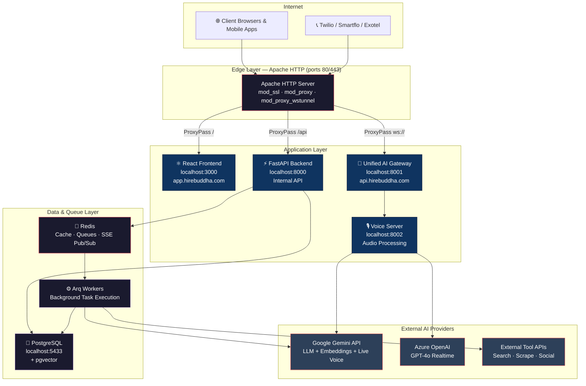

---

## 2. Agent Hierarchy — The Four Organizational Tiers

HireBuddha structures autonomous agents into an organizational hierarchy inspired by corporate structure. Each tier maps to a `HierarchicalEntity` type with distinct execution semantics.

```mermaid
graph TB
    subgraph Hierarchy["🏢 HierarchicalEntity Hierarchy"]
        PROCESS["🏛️ PROCESS<br/><i>C-Suite Orchestrator</i><br/>────────────────<br/>Executor: DAG / Parallel / Debate<br/>Example: 'Quarterly Lead Nurture Campaign'<br/>Coordinates multiple Agents"]
        AGENT["🧑‍💼 AGENT<br/><i>Manager / Department Head</i><br/>────────────────<br/>Executor: Dialog / SingleStep / Recursive<br/>Example: 'Sarah — Lead Qualification Rep'<br/>Manages channel & domain context"]
        SKILL["⚡ SKILL<br/><i>Specialist / Task Executor</i><br/>────────────────<br/>Executor: ToolBurst / SingleStep<br/>Example: 'Contract Generation & E-Sign'<br/>Single focused technical task"]
        ACTION["🔧 ACTION<br/><i>Individual Worker</i><br/>────────────────<br/>Executor: Built-in Tool Call<br/>Example: 'Query Salesforce for Company ID'<br/>Atomic tool-assisted execution"]
    end

    PROCESS -->|"spawns & coordinates"| AGENT
    AGENT -->|"delegates specialized work"| SKILL
    SKILL -->|"invokes atomic tools"| ACTION

    subgraph Execution["Execution Relationship"]
        direction LR
        P_RUN["Process Run<br/>parent_run_id = NULL"]
        A_RUN["Agent Run<br/>parent_run_id = Process"]
        S_RUN["Skill Run<br/>parent_run_id = Agent"]
        AC_RUN["Action Run<br/>parent_run_id = Skill"]
    end

    P_RUN -->|"child dispatch"| A_RUN
    A_RUN -->|"child dispatch"| S_RUN
    S_RUN -->|"child dispatch"| AC_RUN

    style PROCESS fill:#6c3483,stroke:#8e44ad,color:#fff
    style AGENT fill:#2874a6,stroke:#2e86c1,color:#fff
    style SKILL fill:#1e8449,stroke:#27ae60,color:#fff
    style ACTION fill:#b9770e,stroke:#d4ac0d,color:#fff
```

### Entity Configuration Schema

```mermaid
graph LR
    subgraph Entity["HierarchicalEntity JSON Columns"]
        IDENTITY["🎭 identity<br/>Tone · Empathy · Humor · Formality"]
        HIERARCHY["🔗 hierarchy<br/>Linked child entity IDs"]
        LOGIC["🧠 logic_gate<br/>Reasoning configuration<br/>ReAct · CoT · TreeOfThoughts"]
        PLANNING["📋 planning<br/>Custom prompt configurations"]
        CAPS["🛠️ capabilities<br/>Bound tools · Rate limits"]
        GOV["🛡️ governance<br/>Max cost · Timeout · HITL checkpoints"]
        IO["📊 io_contract<br/>Input/Output variable schemas"]
        OBS["👁️ observability<br/>Trace log settings"]
    end

    style IDENTITY fill:#2c3e50,stroke:#e74c3c,color:#fff
    style HIERARCHY fill:#2c3e50,stroke:#e74c3c,color:#fff
    style LOGIC fill:#2c3e50,stroke:#e74c3c,color:#fff
    style PLANNING fill:#2c3e50,stroke:#e74c3c,color:#fff
    style CAPS fill:#2c3e50,stroke:#e74c3c,color:#fff
    style GOV fill:#2c3e50,stroke:#e74c3c,color:#fff
    style IO fill:#2c3e50,stroke:#e74c3c,color:#fff
    style OBS fill:#2c3e50,stroke:#e74c3c,color:#fff
```

---

## 3. The Agentic Loop — Core Control Flow

The `AgentLoop` is the unified execution kernel for every entity type. It implements a **perceive → strategize → pre-critic → act → observe → post-critic → alignment → supervisor → reflect → decide** state machine.

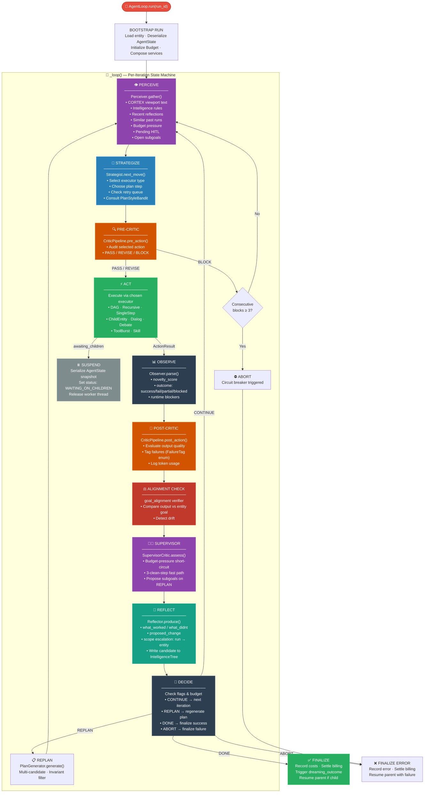

### Budget Tracking Per Iteration

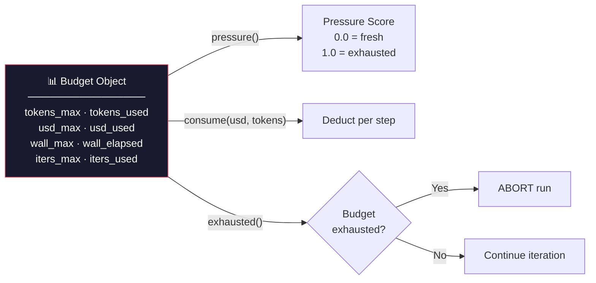

---

## 4. CORTEX Memory Architecture

CORTEX is a hierarchical tree memory structure that organizes all durable knowledge into typed nodes. Agents never get raw context — they receive a **viewport** over the tree.

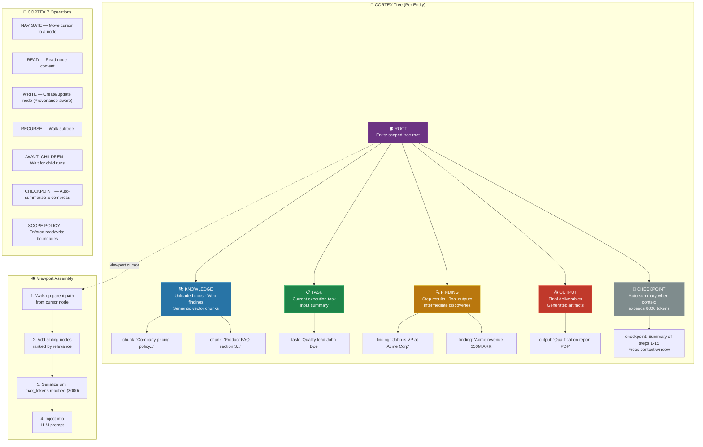

### Scope Policy Enforcement

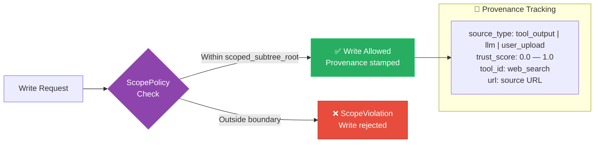

---

## 5. Four-Domain Memory System

Memory is organized into four typed domains, each with distinct retrieval weights. The `MemoryAssemblyService` orchestrates retrieval across all domains and injects the assembled result into the agent's context.

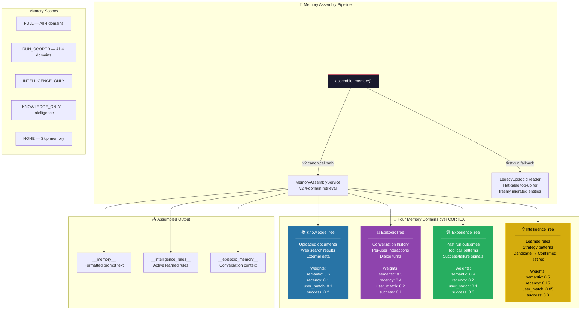

---

## 6. Dreaming & Learning Pipeline

The Dreaming Engine is the platform's **offline learning system**. It runs as a background pipeline triggered by run outcomes and scheduled crons, distilling raw execution experience into confirmed intelligence rules that improve future agent behavior.

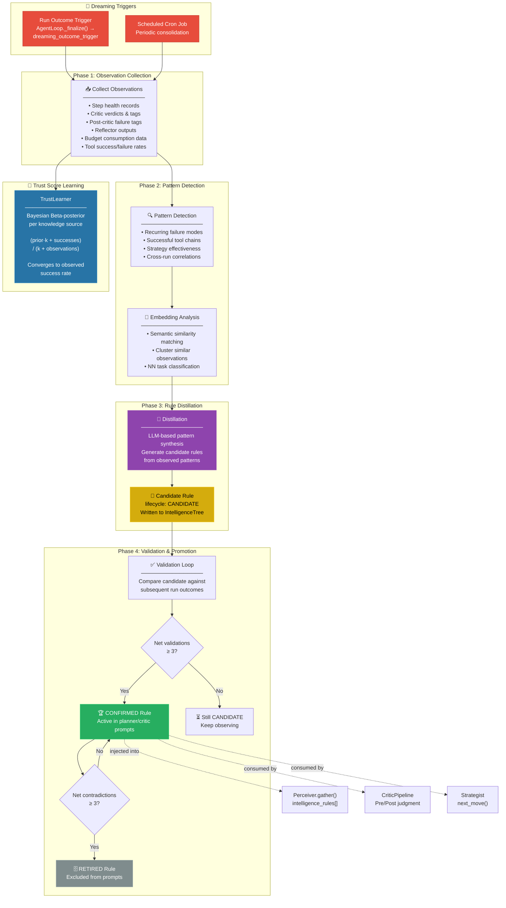

### Skill Library — Emergent Skill Detection

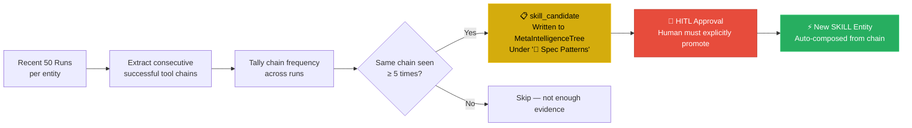

---

## 7. Meta Agent — Architecture Board

The Meta Agent is a special agent that **designs, validates, tests, and promotes other agents**. It runs through the same `AgentLoop` but has an internal multi-role **Architecture Board** that turns user requests into production-ready `HierarchicalEntity` definitions.

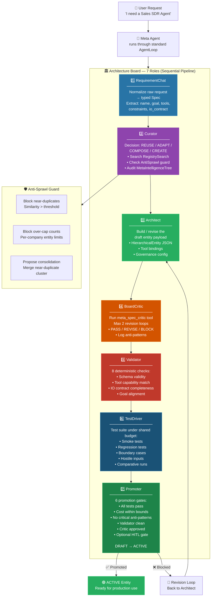

### Meta Agent Self-Improvement — Prompt Evolution

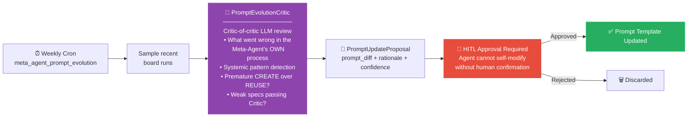

---

## 8. Critic Pipeline — Four-Stage Quality Gates

The `RealCriticPipeline` enforces quality at four checkpoints during each loop iteration.

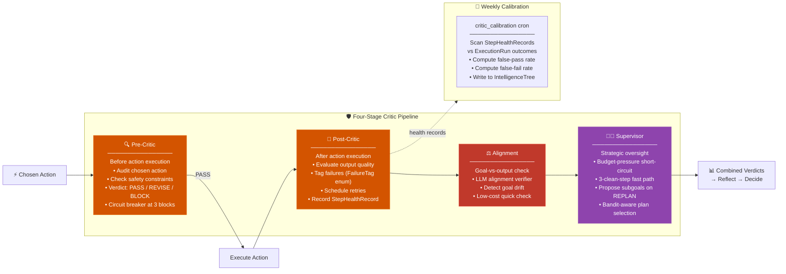

### Retry Strategy Selection

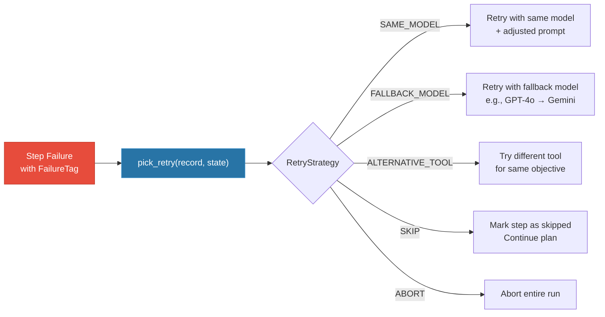

---

## 9. Governance & Billing Engine

The governance layer enforces cost controls, rate limits, and human-in-the-loop gates at every execution step.

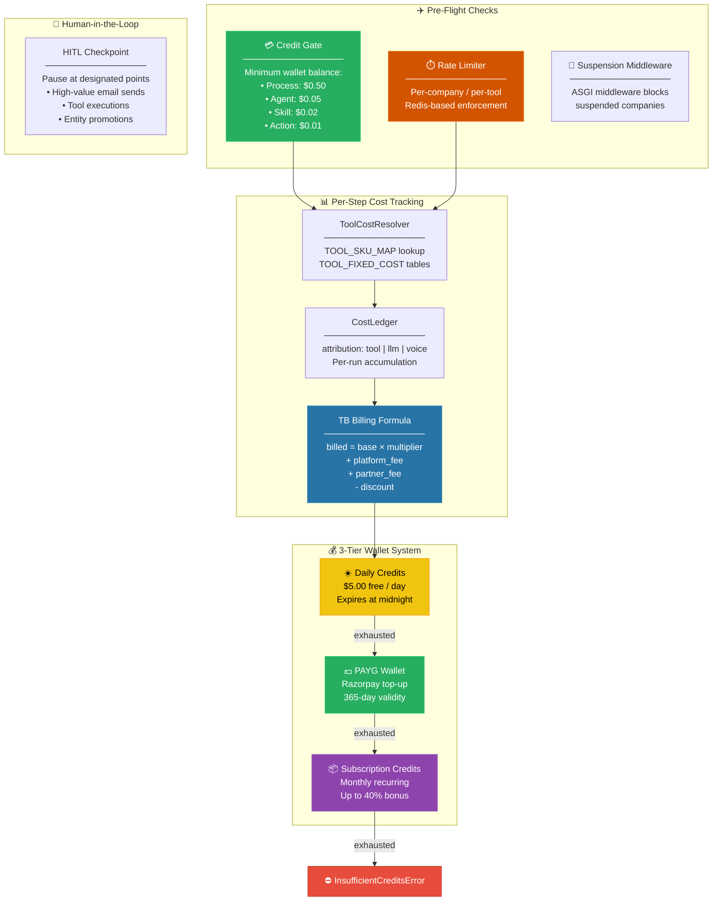

---

## 10. Async Suspend/Resume — Child Dispatch

When a parent entity dispatches a child execution, the system uses an async suspend/resume pattern to avoid blocking worker threads.

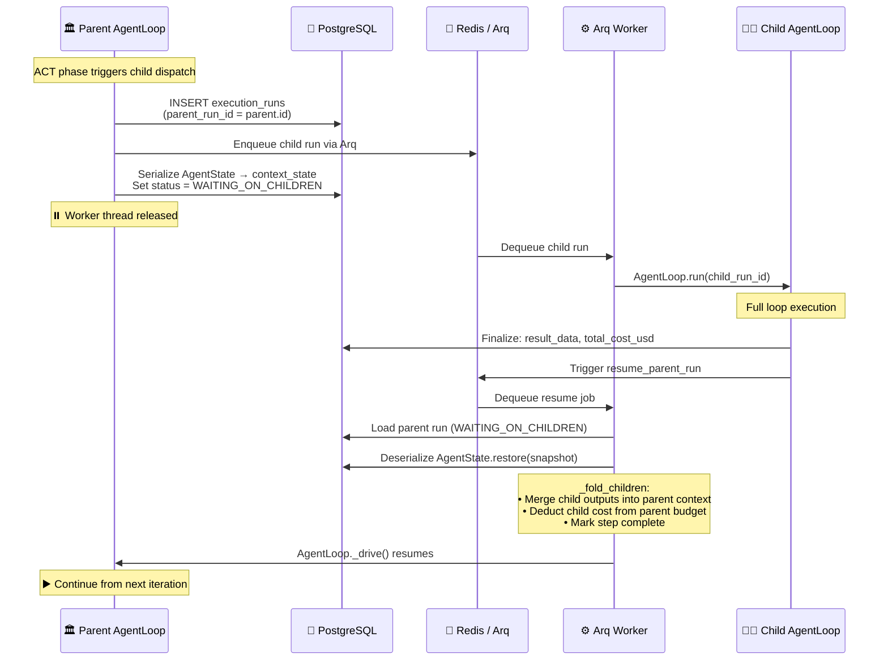

---

## 11. Voice Subsystem — Real-Time Audio Pipeline

The voice system enables bidirectional speech-to-speech communication through telephony providers, streaming PCM audio to AI voice engines.

```mermaid
flowchart LR
    subgraph Telephony["📞 Telephony"]
        CALLER["📱 Caller<br/>(Phone / SIP)"]
        TWILIO_SRV["Twilio / Smartflo<br/>Exotel"]
    end

    subgraph Platform["🔌 HireBuddha Platform"]
        GATEWAY_WS["Unified Gateway<br/>WebSocket Upgrade<br/>ws://api.hirebuddha.com<br/>/stream/audio"]
        WS_HANDLER["websocket_handler.py<br/>Bidirectional async handler"]
        AUDIO_PROC["Audio Processor<br/>μ-law ↔ PCM16<br/>Codec Conversion"]
    end

    subgraph AI_Voice["🧠 AI Voice Engines"]
        GEMINI_LIVE["Google Gemini Live<br/>LiveConnect Session<br/>18 voice presets"]
        AZURE_RT["Azure OpenAI Realtime<br/>GPT-4o Voice"]
    end

    CALLER <-->|"SIP / RTP"| TWILIO_SRV
    TWILIO_SRV <-->|"WebSocket<br/>μ-law encoded"| GATEWAY_WS
    GATEWAY_WS <--> WS_HANDLER

    WS_HANDLER -->|"Inbound: μ-law → PCM16<br/>20ms chunks"| AUDIO_PROC
    AUDIO_PROC -->|"PCM16 stream"| GEMINI_LIVE
    AUDIO_PROC -->|"PCM16 stream"| AZURE_RT

    GEMINI_LIVE -->|"PCM16 response"| AUDIO_PROC
    AZURE_RT -->|"PCM16 response"| AUDIO_PROC
    AUDIO_PROC -->|"Outbound: PCM16 → μ-law"| WS_HANDLER

    subgraph VAD["🎤 Voice Activity Detection"]
        VAD_START["Start-of-Speech: HIGH<br/>Fast barge-in detection"]
        VAD_END["End-of-Speech: LOW<br/>Prevents premature cutoff"]
        VAD_SILENCE["Silence Duration: 1000ms<br/>Response trigger threshold"]
    end

    style CALLER fill:#2874a6,stroke:#2e86c1,color:#fff
    style GATEWAY_WS fill:#1a1a2e,stroke:#e94560,color:#fff
    style GEMINI_LIVE fill:#27ae60,stroke:#2ecc71,color:#fff
    style AZURE_RT fill:#2874a6,stroke:#2e86c1,color:#fff
    style AUDIO_PROC fill:#d35400,stroke:#e67e22,color:#fff
```

---

## 12. Execution Reasoning Strategies

The agent loop supports pluggable reasoning strategies matched to step complexity.

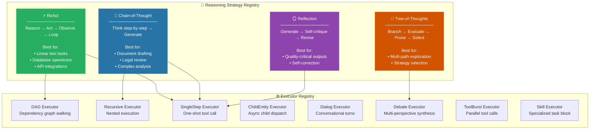

---

## 13. Multi-Tenant Security Architecture

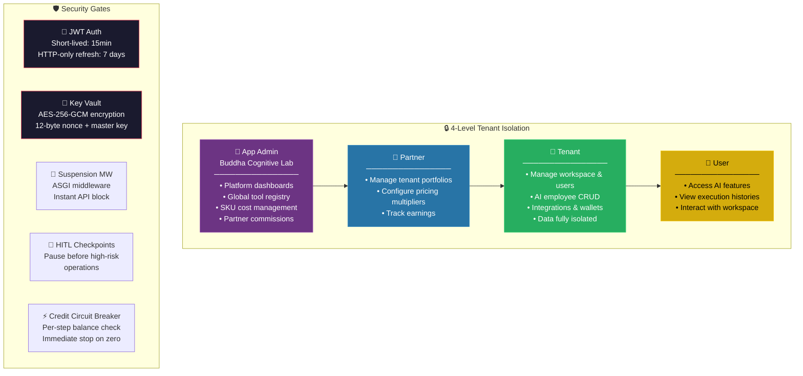

---

## 14. Intelligence Rule Lifecycle

Rules learned by the Dreaming Engine follow a strict lifecycle with evidence-based transitions.

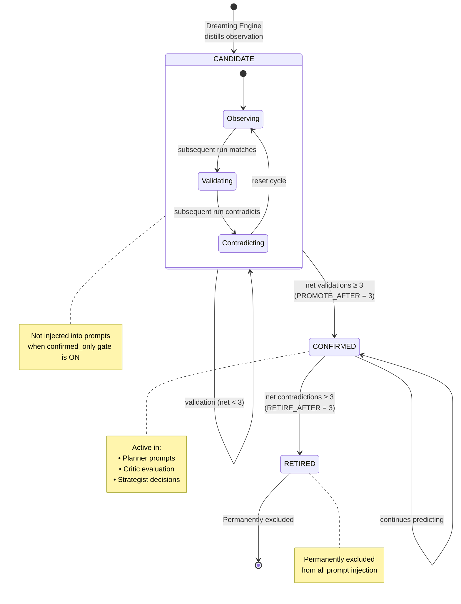

---

## 15. Meta Intelligence Tree — Platform Knowledge Graph

The `MetaIntelligenceTree` is a platform-scoped knowledge structure owned by the Meta Agent, tracking cross-entity patterns and learnings at the tenant level.

```mermaid
graph TB
    subgraph MIT["🧠 MetaIntelligenceTree (Per Company, scope=TENANT)"]
        ROOT_MIT["Meta-Agent Role Root"]

        ROOT_MIT --> AP["📏 Architecture Anti-Patterns<br/>────────────────<br/>Written by: BoardCritic<br/>Content: Detected design flaws<br/>LRU-pruned at 200 rows"]

        ROOT_MIT --> SP["🎯 Spec Patterns<br/>────────────────<br/>Written by: Curator + Promoter<br/>Content: Successful entity patterns<br/>+ Skill candidates"]

        ROOT_MIT --> TF["🚨 Test Failure Tags<br/>────────────────<br/>Written by: TestDriver<br/>Content: Categorized test failures<br/>across board runs"]

        ROOT_MIT --> CD["🧠 Curator Decisions<br/>────────────────<br/>Written by: Curator<br/>Content: REUSE/ADAPT/CREATE audit trail"]

        ROOT_MIT --> TR["🔧 Tool Reliability<br/>────────────────<br/>Written by: post-Promoter monitor<br/>Content: Tool success/failure rates"]

        ROOT_MIT --> PC["📝 Prompt-Update Candidates<br/>────────────────<br/>Written by: prompt-evo cron<br/>Content: HITL-gated prompt diffs"]

        ROOT_MIT --> CG["🔗 Composition Graph<br/>────────────────<br/>Entity dependency tracking<br/>Cross-entity relationships"]
    end

    subgraph Consumers["📤 Consumed By"]
        CURATOR_C["Curator — reads anti-patterns<br/>before REUSE/CREATE decision"]
        CRITIC_C["BoardCritic — reads patterns<br/>to validate new specs"]
        TEST_C["TestDriver — reads failure tags<br/>to design test suites"]
        PROMOTER_C["Promoter — reads reliability<br/>data for gate checks"]
    end

    AP --> CURATOR_C
    SP --> CRITIC_C
    TF --> TEST_C
    TR --> PROMOTER_C

    style ROOT_MIT fill:#6c3483,stroke:#8e44ad,color:#fff
    style AP fill:#e74c3c,stroke:#c0392b,color:#fff
    style SP fill:#27ae60,stroke:#2ecc71,color:#fff
    style TF fill:#d35400,stroke:#e67e22,color:#fff
    style CD fill:#2874a6,stroke:#2e86c1,color:#fff
    style TR fill:#7f8c8d,stroke:#95a5a6,color:#fff
    style PC fill:#d4ac0d,stroke:#f1c40f,color:#000
```

---

## Cross-Reference: Source File Mapping

| Diagram Section | Key Source Files |
|---|---|
| System Topology | [main.py](file:///home/rahul/workspace/hb-proto-3/backend/src/main.py), [start_services.sh](file:///home/rahul/workspace/hb-proto-3/start_services.sh) |
| Agent Hierarchy | [models.py](file:///home/rahul/workspace/hb-proto-3/backend/src/ai/orm/execution.py), [service.py](file:///home/rahul/workspace/hb-proto-3/backend/src/ai/service.py) |
| Agentic Loop | [agent_loop.py](file:///home/rahul/workspace/hb-proto-3/backend/src/ai/core/agent_loop.py), [agent_state.py](file:///home/rahul/workspace/hb-proto-3/backend/src/ai/core/agent_state.py) |
| CORTEX Memory | [cortex_service.py](file:///home/rahul/workspace/hb-proto-3/backend/src/ai/memory/cortex_service.py), [cortex_bridge.py](file:///home/rahul/workspace/hb-proto-3/backend/src/ai/memory/cortex_bridge.py) |
| Four Domains | [assembler.py](file:///home/rahul/workspace/hb-proto-3/backend/src/ai/memory/assembler.py), [domains/](file:///home/rahul/workspace/hb-proto-3/backend/src/ai/memory/domains/__init__.py) |
| Dreaming/Learning | [dreaming_engine.py](file:///home/rahul/workspace/hb-proto-3/backend/src/ai/memory/dreaming_engine.py), [trust_learning.py](file:///home/rahul/workspace/hb-proto-3/backend/src/ai/memory/trust_learning.py), [rule_lifecycle.py](file:///home/rahul/workspace/hb-proto-3/backend/src/ai/memory/rule_lifecycle.py) |
| Meta Agent | [meta_agent_template.py](file:///home/rahul/workspace/hb-proto-3/backend/src/ai/meta/meta_agent_template.py), [board/](file:///home/rahul/workspace/hb-proto-3/backend/src/ai/meta/board/__init__.py) |
| Critic Pipeline | [critic_pipeline.py](file:///home/rahul/workspace/hb-proto-3/backend/src/ai/planning/critic_pipeline.py), [supervisor_critic.py](file:///home/rahul/workspace/hb-proto-3/backend/src/ai/planning/supervisor_critic.py) |
| Governance | [governance_service.py](file:///home/rahul/workspace/hb-proto-3/backend/src/ai/governance/governance_service.py), [tool_cost_resolver.py](file:///home/rahul/workspace/hb-proto-3/backend/src/ai/governance/tool_cost_resolver.py) |
| Suspend/Resume | [arq_jobs.py](file:///home/rahul/workspace/hb-proto-3/backend/src/ai/core/arq_jobs.py), [child_entity.py](file:///home/rahul/workspace/hb-proto-3/backend/src/ai/core/executors/child_entity.py) |
| Voice | [websocket_handler.py](file:///home/rahul/workspace/hb-proto-3/backend/src/voice), [gemini_live.py](file:///home/rahul/workspace/hb-proto-3/backend/src/voice) |
| Reasoning | [reasoning/](file:///home/rahul/workspace/hb-proto-3/backend/src/ai/core/reasoning/__init__.py), [executors/](file:///home/rahul/workspace/hb-proto-3/backend/src/ai/core/executors/__init__.py) |
| Intelligence Rules | [rule_lifecycle.py](file:///home/rahul/workspace/hb-proto-3/backend/src/ai/memory/rule_lifecycle.py), [intelligence_tree_service.py](file:///home/rahul/workspace/hb-proto-3/backend/src/ai/memory/intelligence_tree_service.py) |
| Meta Intelligence | [meta_intelligence_tree.py](file:///home/rahul/workspace/hb-proto-3/backend/src/ai/meta/meta_intelligence_tree.py), [skill_library.py](file:///home/rahul/workspace/hb-proto-3/backend/src/ai/meta/skill_library.py), [prompt_evolution.py](file:///home/rahul/workspace/hb-proto-3/backend/src/ai/meta/prompt_evolution.py) |
