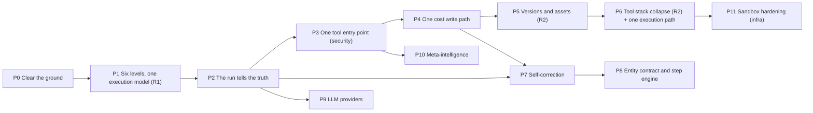

# Consolidated Register and Fix Plan — Kernel, Execution, Planning, Tools, LLM, Meta

> **What this document is:** one consolidated, deduplicated defect register for eight
> source registers that touch the same code paths, plus the two product requirements
> that change those paths, plus the phased plan that fixes them in an order where no fix
> undoes another.
> **Compiled:** 2026-10-01, on branch `roadmap-development-defect-fixes`, against the code
> as it stands after the 01/02/03/04/08/14/16 register work.
> **Why consolidate:** the agent kernel (05), the execution pipeline (06), planning and
> critics (07), tools (09, TOOL-LAYER, PO-06), LLM providers (10) and meta-intelligence (11)
> are one call graph. `agent_loop.py`, `strategist.py`, `planner_service.py`,
> `step_executor.py`, `tool_executor.py` and `tools/base.py` each carry defects from four
> or more registers. Fixing them register by register would edit the same functions
> repeatedly, in an order that breaks earlier fixes.

---

## Contents

1. [Summary](#1-summary)
2. [Sources and how the consolidation was done](#2-sources-and-how-the-consolidation-was-done)
3. [Requirement R1 — six-level hierarchy, one execution model](#3-requirement-r1--six-level-hierarchy-one-execution-model)
4. [Requirement R2 — the skill-first tool stack](#4-requirement-r2--the-skill-first-tool-stack)
5. [Root causes across the eight registers](#5-root-causes-across-the-eight-registers)
6. [The consolidated register](#6-the-consolidated-register)
7. [Merge map — one canonical id per defect](#7-merge-map--one-canonical-id-per-defect)
8. [The plan, phase by phase](#8-the-plan-phase-by-phase)
9. [Decisions taken in this plan](#9-decisions-taken-in-this-plan)
10. [Out of scope or infrastructure-dependent](#10-out-of-scope-or-infrastructure-dependent)
11. [How each fix is worked](#11-how-each-fix-is-worked)
12. [Progress log](#12-progress-log)

---

## 1. Summary

| | Count |
|---|---:|
| Source registers consolidated | 8 (05, 06, 07, 09, 10, 11, TOOL-LAYER, PO-06) |
| Defect entries in the sources | 189 |
| Improvement entries in the sources | 60 |
| Distinct defects after merging duplicates | **166** (23 merges), plus 5 new = **171** |
| Already fixed before this consolidation | 10 fully (AK-15, EP-11, PC-04, PC-16, PC-23, PC-24, LP-06, LP-25, TL-19, TL-06) and 2 in part (the queue half of AK-07, the `ToolCostResolver` half of TX-I1) |
| Found stale while re-verifying | 1 (AK-I7) |
| New defects found while re-verifying | **5** new entries (EP-26, EP-27, EP-28, EP-29, MI-20) and **5** existing entries found worse than recorded (LP-01, EP-03, EP-01, PC-18, AK-10) |
| Product requirements folded in | 2 (R1 six-level hierarchy, R2 skill-first tool stack) |
| Phases | 12 (P0 … P11) |

**Baseline on this machine** (Linux, Python 3.12, a fresh database built by
`alembic upgrade head` on Postgres 16 + pgvector, Redis 7), before any change:

| Gate | Result |
|---|---|
| Unit (`pytest tests --ignore=tests/integration --ignore=tests/e2e`) | **1319 passed, 2 failed, 5 skipped**. The 2 are the known `test_meta_review::test_graceful_fallback_on_error` and `chaos/test_feature_flags_table_unavailable::test_pool_exhaustion_falls_through_to_default`. The 5 Windows-only failures in the handoff pass on Linux |
| Integration (`pytest tests/integration`) | **183 passed, 9 skipped** |
| Strict type check (`tests/unit/test_typecheck.py`, packages `governance orm planning meta memory core`) | pass |
| Layout lint (`scripts/lint_ai_layout.py`) | pass |

The ten things to read first, in consequence order:

| # | Defect | Why |
|---|---|---|
| 1 | [TL-50](#ws-f--tools-one-resolution-point-and-security) — the model can call any registered tool, not just the entity's | Tool grants are advertisement, not access control |
| 2 | [EP-03](#ws-a--hierarchy-composition-and-run-structure-r1) — `parent_run_id` means two things | **New face:** a retry or refine run is treated as a child, so it gets no credit hold, no credit breaker and no settlement. Retries are free |
| 3 | [LP-01](#ws-c--cost-one-write-path) — `cost_unit` substring matching | **New face:** `per_1M_tokens` matches nothing either — a 1,000,000× over-charge, not only the 1000× `per_1k_tokens` case |
| 4 | [AK-01](#ws-b--the-run-tells-the-truth) — a run whose every step failed reports `COMPLETED` | Billed and counted as success |
| 5 | [EP-01](#ws-a--hierarchy-composition-and-run-structure-r1) — child resolution crosses tenants | **New face:** the runtime "child exists" check in `create_child_run` has no company filter either |
| 6 | [TL-53](#ws-f--tools-one-resolution-point-and-security) — run input is trusted as tool context | `container_runtime: false` in `input_data` forces host execution |
| 7 | [LP-03](#ws-b--the-run-tells-the-truth) — no retry, timeout or fallback in the LLM layer | One 429 fails a step |
| 8 | [PC-18](#ws-b--the-run-tells-the-truth) — `_assign_step_ids` rewrites ids but not references | **New face:** `input_dependencies` are not rewritten either, so a dependent step can never become ready and the plan "completes" without running it |
| 9 | [PC-06](#ws-g--self-correction-that-corrects) — every retry strategy executes identically | The remedy is chosen, logged and dropped |
| 10 | [EP-26](#ws-a--hierarchy-composition-and-run-structure-r1) (new) — behaviour forks on entity type | A planless PROCESS spins 50 empty iterations; a planless AGENT finishes "Success" having done nothing. This is what R1 removes |

---

## 2. Sources and how the consolidation was done

| Register | Prefix | Defects | Improvements | Fixed before | Notes |
|---|---|---:|---:|---|---|
| [05 Agent kernel](05-AGENT-KERNEL-DEFECTS.md) | AK | 21 | 10 | AK-15 | |
| [06 Execution pipeline](06-EXECUTION-PIPELINE-DEFECTS.md) | EP | 25 | 10 | EP-11 | |
| [07 Planning and critics](07-PLANNING-AND-CRITICS-DEFECTS.md) | PC | 26 | 10 | PC-04, PC-16, PC-23, PC-24 | |
| [09 Tools](09-TOOLS-DEFECTS.md) | TX | 6 | 10 | — | Summary register; points at TOOL-LAYER |
| [10 LLM providers](10-LLM-PROVIDERS-DEFECTS.md) | LP | 25 | 10 | LP-06, LP-25 | |
| [11 Meta-intelligence](11-META-INTELLIGENCE-DEFECTS.md) | MI | 19 | 10 | — | |
| [TOOL-LAYER deep pass](TOOL-LAYER-DEFECTS.md) | TL-01…49 | 49 | — | TL-19 (BC-11), TL-06 (DM-08) | |
| [PO-06 tool-stack audit](PO-06-TOOL-STACK-AUDIT.md) | TL-50…67 | 18 | — | — | |

**Method.** Every entry was re-read against the code on 2026-10-01. Status labels in
§6:

| Label | Meaning |
|---|---|
| ✅ | Re-verified today: the claim holds |
| 🔁 | Partly changed since the register was written — the text says what moved |
| 📄 | Carried as doc-reported; not re-checked today. Confirm before editing |
| ✔ | Already fixed (commit in the source register) |
| ✖ | Stale / invalid |
| 🆕 | Found while re-verifying for this consolidation |

New defects found today keep their register's prefix with the next free number:
**EP-26, EP-27, EP-28, EP-29** (register 06) and **MI-20** (register 11). The worse faces of LP-01 and EP-03 are recorded
on those entries.

---

## 3. Requirement R1 — six-level hierarchy, one execution model

**Product owner, 2026-10-01:** *actions → skills → agents → process → loop → graph. Graph
maps to the entire business, loop to departments/functions, process to processes, agents
to roles, skills to reusable instructions/scripts/assets with a contract, and an action
is a wrapper around tools. All levels follow exactly the same execution process and
execution loop. There is no difference between entities other than the level.*

### 3.1 The levels

| Level | Type | Maps to | What it carries |
|---:|---|---|---|
| 6 | `GRAPH` | The entire business | Its departments (LOOPs) as children |
| 5 | `LOOP` | A department or function | Its processes as children |
| 4 | `PROCESS` | A business process | The roles and skills it coordinates |
| 3 | `AGENT` | A role | Its skills, tools and memory |
| 2 | `SKILL` | Reusable instructions, scripts and assets with an IO contract | Prompt, constraints, scripts, assets (R2) |
| 1 | `ACTION` | A wrapper around a tool | One tool binding, its schema and its policy |

`type` stays the column name. The **level** is derived from it in one place
(`src/ai/schemas/levels.py`), and is the only thing that differs between entities.

### 3.2 What "no difference other than the level" means in code

Today behaviour forks on `type` in at least nine places. Each becomes one rule for every
level:

| Where it forks today | Today | After R1 (every level) |
|---|---|---|
| `Strategist.next_move` Case B | only an `AGENT` without a plan is planned (`Recursive`) | any entity without a plan is planned |
| `AgentLoop._ensure_plan` | skipped when no planning block is enabled | always reconciles when there is no plan |
| `PlannerService.reconcile` auto step | only `ACTION`/`SKILL` get a default step | any entity with no plan and no children gets one default step, whose prompt carries `{{input}}` |
| `PlannerService._maybe_enforce_router` | `PROCESS` always delegates; `AGENT` only without tools; others never | any entity with children and no tools of its own must delegate |
| `AIService.get_entity` virtual plan | `ACTION`/`SKILL` only, and it mutates the persistent row (EP-27) | computed for the response, for any entity, never written |
| `AIService.trigger_execution` child pre-flight | `PROCESS` only | every level, plus the composition and status rules below |
| `platform_schema_compiler` manifest | four types, only `PROCESS` "can have children" | six levels; the composition rule replaces the boolean |
| `resolve_meta_cognition` defaults | `self_introspection` for SKILL/AGENT/PROCESS, `reflection` for AGENT/PROCESS | `level ≥ SKILL` and `level ≥ AGENT` — the same rule, extended to LOOP/GRAPH |
| `credit_service.MINIMUM_EXECUTION_THRESHOLDS` | four types | six levels |
| `schemas/entity.py` | `LOOP` read as `PROCESS` (a stopgap alias) | `LOOP` is real; the alias is deleted |

### 3.3 Composition rule

A child sits **at the same level as its parent or below it** — never above. The tree is
acyclic and stays inside one company. Same-level composition is allowed so a department
can have sub-departments (LOOP→LOOP, the roadmap's federation), a process sub-processes,
and a skill can reuse a skill.

Enforced in three places, so no path can skip it:

1. **Authoring** — `POST/PUT /entities`: `parent_id`, `hierarchy.children[].child_id` and
   every static-plan `CHILD_ENTITY_INVOCATION` target. 422 on a violation.
2. **Dispatch pre-flight** — `trigger_execution`, for every level.
3. **Runtime** — `create_child_run` (and the CORTEX RECURSE factory) refuses a child from
   another company (EP-01), a child above its parent's level, a `DRAFT` child of a
   non-`DRAFT` parent (EP-09), and a child deeper than `max_recursion_depth` allows (EP-06).

### 3.4 Reconciliation with the roadmap

`product_technical_documentation.md` §17 designs LOOP as "a scheduler and an aggregator —
never a run". R1 supersedes that: a LOOP or GRAPH run is an ordinary run through the same
`AgentLoop`. The roadmap's heartbeat and schedules become **triggers that start ordinary
runs** of a LOOP entity — a later piece of work that R1 does not block. §17 gets a dated
note pointing here.

---

## 4. Requirement R2 — the skill-first tool stack

**Product owner, 2026-10-01:** *upgrade the tooling stack according to
[`skill-first-capability-model.md`](../../product-road-map/rough-outline/skill-first-capability-model.md).*

The document's model maps straight onto R1's two bottom levels:

| Skill-first model | In the hierarchy |
|---|---|
| Tier 1 — primitives (~20–25 tools) where money, credentials, latency and guarantees live | **ACTION** — a wrapper around one primitive tool |
| Tier 2 — skills: workflow knowledge, scripts and an IO contract, versioned, tenant-scoped | **SKILL** — instructions + scripts + assets + contract |
| Progressive disclosure: only name + description in context until a skill is selected | The parent's planner sees its **child roster** (name + description, PC-24); a child's full prompt and assets load only when it is invoked |
| "Every tool is a deploy" | A SKILL version is data; publishing it is not a deploy |

How the document's phases land in this plan:

| Doc phase | What | Plan phase |
|---|---|---|
| 0 | Delete what cannot work; split Doc Factory boilerplate into scripts | **P0** (deletions) and **P5** (the boilerplate split, once assets exist) |
| 1 | `skill_versions` + `skill_assets`, materialisation, `ExecutionRun.skill_version_id` | **P5**. Versions are kept for **every** level (`entity_versions`, `entity_assets`), because R1 forbids a SKILL-only mechanism — and version pinning is EP-10 for every entity anyway |
| 2 | Sandbox metering + per-skill cost envelope + attribution to the version | **P5** (metering exists; the envelope is `governance.max_cost_usd`, made a hard stop in P4; attribution through `execution_runs.entity_version_id`) |
| 3 | Social pilot: 64 per-verb tools → one primitive + platform skills | **P6** — one `social_api` primitive with a `describe` operation (progressive disclosure inside the tool), the per-verb classes kept as its internal operations, and first-party platform SKILLs |
| 4 | Skill authoring UI + HITL publish | **P5** delivers the API (create version, attach assets, publish through the existing approval flow); the editor screen is a frontend follow-up |
| 5 | Decide email / CRM / media on the pilot's evidence | After P6, on measurements |

`SkillExecutor`, `DialogExecutor` and `ToolBurstExecutor` are stubs that raise. Under R1 a
SKILL runs through the same loop as everything else, so there is no skill-specific
executor to finish — the three stubs and their three flags are deleted in P0.

---

## 5. Root causes across the eight registers

The registers each name their own root causes. Merged, nine shapes explain almost every
entry:

| # | Root cause | Registers | Representative entries | Fixed by phase |
|---|---|---|---|---|
| **A** | Behaviour forks on entity type in scattered `if type ==` branches | 05, 06, 07, 11 | EP-26, AK-01, Strategist Case B, router enforcement | P1 |
| **B** | The typed state was built but a dict bridge still drives execution | 05, 06 | AK-21, AK-05, EP-18, EP-25 | P2, P8 |
| **C** | Layers were added with a bypass so nothing broke; the bypass became the normal path | 05, 07, 11 | PC-01, AK-07, PC-05, MI-02 | P1, P7, P10 |
| **D** | Cost is written in several places and reconciled with `max()` | 05, 06, 07, 10 | AK-02, PC-03, PC-20, LP-05 | P4 |
| **E** | Two tool registries that never meet; tenancy is a convention | 09, TL | TL-10, TL-13, TL-14, TL-03, TL-50 | P3 |
| **F** | Policy declared in one place, enforced in none | all | EP-05, TL-11, TL-12, TL-21, EP-06, AK-10, 20+ unread flags | P0, P1, P3, P8 |
| **G** | The tool contract is a string with four dispatch paths | 09, TL | TL-41, TL-05, TL-30, TL-51, TL-52 | P2, P6 |
| **H** | Gates fail open | 11, TL | MI-01, TL-01, the curator's `except: pass` | P3, P10 |
| **I** | A migration stopped at "the new thing works" | all | EP-22, TL-29, two goal-validation settings, `core/reasoning/` | P0, P8 |

---

## 6. The consolidated register

One row per **distinct** defect. The canonical id is the one the fix commit will cite;
merged ids are listed beside it and in [§7](#7-merge-map--one-canonical-id-per-defect).
Severity is the highest any merged entry gave. **Phase** is where the plan in §8 fixes it.

### WS-A — Hierarchy, composition and run structure (R1)

| ID | Merged | Defect | Sev | Status 2026-10-01 | Phase |
|---|---|---|---|---|---|
| **R1** | — | Six-level hierarchy with one execution model (§3) | Req | 🆕 requirement | P1 |
| **EP-26** | — | Behaviour forks on `type`: a planless `PROCESS`/`SKILL`/`ACTION` whose planning block is off runs empty `SingleStep` no-ops to the 50-iteration cap; a planless goal-only `AGENT` ends `COMPLETED` with output "Success" having done nothing (`RecursiveExecutor`) | High | 🆕 | P1 |
| **EP-27** | — | `AIService.get_entity` injects a "virtual" default plan into the **persistent** ORM row for ACTION/SKILL; `update_entity` reuses that instance and commits, so a PATCH without `planning` writes the virtual plan to the database | Medium | 🆕 (to be confirmed by a failing test) | P1 |
| **EP-01** | D-33 | Child resolution Strategy 4 looks up `entity_name_hint` across every company. **New face:** `create_child_run`'s "child exists" safety check has no company filter, so a UUID from another tenant in a dynamic plan executes too | Critical | ✅ + 🆕 | P1 |
| **EP-03** | EP-I7 | `parent_run_id` carries both structure and retry/refine chains. **New face:** `CreditGuard.top_level` is `not parent_run_id`, so a retry or refine run gets no credit admission, no in-run breaker and no settlement; `get_executions` also hides it from the run list | Critical | ✅ + 🆕 | P1 |
| **EP-06** | — | `max_recursion_depth` is a sentence in the prompt; nothing counts depth | High | ✅ | P1 |
| **AK-07** | AK-I4, D-13 | The per-parent child concurrency cap is advisory (the queue half was done by SA-07) | High | 🔁 | P1 |
| **EP-09** | — | Entity status is not a state machine; `DRAFT` and `ARCHIVED` entities run | Medium | ✅ | P1 |
| **EP-19** | — | `convert_to_template` misses children referenced only from the static plan | Medium | 📄 | P1 |
| **EP-28** | — | `governance.max_recursion_depth` and `governance.execution_limits.max_recursion_depth` are two settings for one limit (the same split as PC-17) | Low | 🆕 | P1 |

### WS-B — The run tells the truth

| ID | Merged | Defect | Sev | Status | Phase |
|---|---|---|---|---|---|
| **AK-01** | D-34 | `_final_status` = "no ready steps left", so a plan whose every step failed is `COMPLETED` | Critical | ✅ | P2 |
| **AK-03** | AK-I6 | A run suspended in `WAITING_ON_CHILDREN` whose resume is lost is never finalised, billed or failed | High | ✅ | P2 |
| **LP-03** | LP-I1 | No retry, backoff or timeout anywhere in the LLM layer | Critical | ✅ | P2 |
| **LP-04** | — | The Gemini error handler logs "retrying with raw HTTP" and re-raises; the ReAct path treats the same error as end-of-turn and returns silently | High | ✅ | P2 |
| **LP-19** | LP-I10 | A ReAct loop that hits `MAX_REACT_TURNS` returns normally with no flag | Medium | ✅ | P2 |
| **TL-52** | — | A tool that returns `{"error": …}` / `"Error: …"` is logged and billed as a success | High | ✅ | P2 |
| **TL-51** | — | The resilience classifier fails a succeeding tool on words in its output ("no results", "timed out") and re-runs it — a second side effect for a write tool | High | ✅ | P2 |
| **EP-25** | — | A step whose template omits `{{input}}` never sees the task; `__agent_state__` leaks into the prompt as a "previous step" | High | ✅ | P2 |
| **PC-25** | — | The dynamic planner never sees the run's request — only the entity's standing goal | High | ✅ | P2 |
| **PC-18** | PC-I5 | `_assign_step_ids` rewrites every step id but not the `{{step_n}}` placeholders. **New face:** nor `target.input_dependencies`, so a dependent step never becomes ready and the plan ends with it unrun | High | ✅ + 🆕 | P2 |
| **PC-19** | — | `all_required_tools_in_capabilities` compares `str(dict)` with tool ids, so it fails for every tool-bearing entity | Medium | ✅ | P2 |
| **EP-29** | — | `__cortex_tree_id__` is never written into the context, so a child never shares its parent's CORTEX tree and a retry/refine never resumes it; a retry also re-runs every step (the loop never persists `context_state`) | High | 🆕 | P2 |
| **LP-01** | LP-I3 | `cost_unit` substring matching: `per_1k_tokens` → divisor 1 (1000×). **New face:** `per_1M_tokens` / `per_1m_tokens` → divisor 1 too (1,000,000×). No validation on write | Critical | ✅ + 🆕 | P2 |

### WS-C — Cost: one write path

| ID | Merged | Defect | Sev | Status | Phase |
|---|---|---|---|---|---|
| **AK-02** | AK-I1, BC-I3 | Spend reaches the budget through three syncs reconciled by `max()` in a load-bearing order | High | ✅ | P4 |
| **PC-03** (cost half) | PC-I2 | `AlignmentVerdict` has no cost field; alignment spend never reaches the run | High | ✅ | P4 |
| **PC-20** | — | `adapt_plan` passes `entity=None`: three invariants skipped and replan tokens not billed to the run | Medium | ✅ | P4 |
| **LP-05** | — | `model_override` changes the model but not the provider; an override with no SKU bills zero | High | ✅ | P4 |
| **EP-24** | EP-I10 | Reformat retries are billed but invisible in the plan and the trace | Low | ✅ | P4 |
| **TX-I1** | TL-33 | One registry lookup per tool call: `ToolCostResolver` caches per instance and a new instance is built per call | Medium | 🔁 | P4 |
| **LP-I9** | — | Only step calls write an `LLMInteractionLog`; planner and critic calls do not | — | open | P4 |
| **LP-02** | LP-14 | `LLMResponse.cost_usd` always returns 0 | High | ✅ | P0 |
| **PC-26** | TL-64 | `cost_estimator_refresh` reads `tool_interaction_logs.cost_usd`, which does not exist; the estimator's tool keys (`excel`, `sandbox_executor`, `browser_tool`, `xlsx_engine`) match no registered tool | Medium | ✅ | P0 |
| **TL-20** | — | Voice tool calls carry no `run_id`/`agent_id` and are never charged | High | ✅ | P3 |
| **TL-60** | — | `batch_web_search` ignores `max_per_query`, never dedupes, and is billed as one search for up to 25 | Medium | ✅ | P6 |

### WS-D — Versions, assets and the skill-first stack (R2)

| ID | Merged | Defect / requirement | Sev | Status | Phase |
|---|---|---|---|---|---|
| **R2** | — | Skill-first tool stack (§4) | Req | 🆕 requirement | P5, P6 |
| **EP-10** | EP-I4 | `version` is decorative; editing an entity changes runs already in flight | Medium | ✅ | P5 |
| **TL-23** | TX-I3 | `quora` — 4 tools against an API that does not exist | — | ✅ | P0 |
| **TL-24** | TX-I3 | `x_ads` — 4 tools with the wrong auth scheme | — | ✅ | P0 |
| **TL-25** | TX-I3 | `youtube_ads` — 4 tools on a stale API version, `customer_id` from the model | — | ✅ | P0 |
| **TL-26** | TX-I3 | `xlsx_engine.py` — 400 lines, no importer | — | ✅ | P0 |
| **TL-27** | TX-I3 | `templates/docx/*.docx` — no code reference | — | ✅ | P0 |
| **TL-22** | — | The MCP package has no transport, no config and no caller | Medium | ✅ | P0 (delete) |
| **TL-40** | — | Eight platforms cannot refresh tokens; three platform lists disagree (PO-07) | Medium | ✅ | P6 |
| **TL-43…TL-49** | — | Seven social integrations report false success (upload never uploads, publish never polls, …) | High | ✅ | P6 |

### WS-E — Tools: one execution path

| ID | Merged | Defect | Sev | Status | Phase |
|---|---|---|---|---|---|
| **TL-41** | TX-I2, TL-30 | Four dispatch paths; the typed one falls back silently; two `ToolResult` classes | Medium | ✅ | P6 |
| **TL-59** | EP-21, EP-I5 | Tool outputs written twice and orphaned from their run; the run page finds artifacts by regex | Medium | ✅ | P6 |
| **TL-37** | TX-I5 | Social base never retries 429/5xx | Medium | ✅ | P6 |
| **TL-38** | TX-I6 | No pagination in any social list call | Medium | ✅ | P6 |
| **TL-39** | TX-I7, EP-14 | No idempotency on any write tool; `tool_interaction_logs.idempotency_key` is dead | Medium | ✅ | P6 |
| **TL-31** | — | `_ffmpeg.trim_clip`'s accurate fallback raises `ValueError` | Medium | ✅ | P6 |
| **TL-32** | TX-I10, TL-57 | Blocking SDK / `imaplib` / `smtplib` calls on the event loop | Medium | ✅ | P6 |
| **TL-58** | — | `email_classify` moves the wrong message (sequence numbers labelled as UIDs) | Medium | ✅ | P6 |
| **TL-61** | — | `sandbox_code` accepts an unbounded timeout | Medium | ✅ | P6 |
| **TL-62** | — | `headless_browser` cannot chain actions | Medium | ✅ | P6 |
| **TL-66** | — | `weasyprint`, `markdown`, `playwright`, `ddgs` undeclared | High | ✅ | P6 |
| **TL-67** | — | Seeds and fixtures name tools that do not exist | Medium | ✅ | P6 |
| **TL-34** | — | Built-in tool metadata drifts from code forever | Medium | ✅ | P6 |
| **TL-35** | TX-I8 | `_BUILTIN_CATEGORIES` covers 22 of 97 tools | Low | ✅ | P6 |
| **TX-I9** | — | No contract test over the registry (advertised vs read parameters) | — | open | P6 |
| **TL-63** | — | `pdf_generator` defines `get_function_schema` twice | Low | ✅ | P0 |
| **TL-29** | — | `_sandbox_base_dir` duplicated across two modules | Low | 🔁 | P0 |
| **TX-05** | — | `register_tenant_tool` logs at INFO per registration | Low | ✅ | P0 |

### WS-F — Tools: one resolution point and security

| ID | Merged | Defect | Sev | Status | Phase |
|---|---|---|---|---|---|
| **TL-50** | — | Execution is not restricted to the entity's granted tools; "not found" lists every tool name | Critical | ✅ | P3 |
| **TL-10** | EP-02, TX-06, MI-14 | `get_tool`/`get_all_schemas` called without `company_id`; tenant tools unreachable | Critical | ✅ | P3 |
| **TL-13** | — | The tool status gate (`EXPERIMENTAL`/`DRAFT` opt-in) is not on the execution path | High | ✅ | P3 |
| **TL-14** | — | `is_enabled = false` disables nothing | High | ✅ | P3 |
| **TL-12** | TX-03, EP-08 (half) | Per-tool policy fields sit on a class nothing uses; `usage: PLANNED` hides but does not block | High | ✅ | P3 |
| **TL-11** | EP-07 | `rate_limit_per_run` can never fire (never populated, reset per step) | High | ✅ | P3 |
| **TL-21** | — | `max_tool_calls` is prompt text | Medium | ✅ | P3 |
| **TL-53** | — | Run input is merged into trusted tool context (`container_runtime`, `__is_meta_agent__`, `persona`, flags) | High | ✅ | P3 |
| **TL-65** | — | `__is_meta_agent__` is never set by the platform, only reachable through run input | Medium | ✅ | P3 |
| **TL-03** | — | Seven tool modules fall back to a model-supplied `company_id` | Critical | ✅ | P3 |
| **TL-04** | TL-56 | All four email tools let the model override host, address and password | Critical | ✅ | P3 |
| **TL-05** | — | `ScraperTool.run_typed` drops the execution context (APP company's key, wrong artifact store) | Critical | ✅ | P3 |
| **TL-07** | — | A process-global `/tmp/sandbox/output` symlink points at whichever tenant ran last | Critical | ✅ | P3 |
| **TL-08** | — | No SSRF guard on `scraper_tool` or `headless_browser` | Critical | ✅ | P3 |
| **TL-54** | — | Document/image/video tools read and write arbitrary host paths from the model | High | ✅ | P3 |
| **TL-55** | — | `pdf_generator` renders model HTML with a live URL fetcher; image resolver spans tenants | High | ✅ | P3 |
| **TX-02** | TX-I4 | Tool instances are process-wide singletons | High | ✅ | P3 |
| **TX-04** | MI-13 | `meta_spec_critic` is a `Tool` outside the registry | Low | 📄 | P3 |
| **TL-06** | — | Registry read endpoints returned every tenant's rows | Critical | ✔ (DM-08, `d7fd9ac`) — the list route still returns `configuration` (synthesized source) to anyone who can see the row; closed in P3 | P3 |
| **TX-01** | — | The per-company container-sandbox flag says on; the runtime runs off | Critical | 🔁 | P3 (one switch) |
| **TL-01** | — | The default sandbox runs LLM code as the backend user; a Docker failure silently downgrades | Critical | ✅ | P3 (loud failure) / P11 (default flip) |
| **TL-02** | MI-16 | Tool synthesis runs its harness outside the sandbox | Critical | ✅ | P3 (workdir) / P11 |
| **TL-09** | — | Subject data (recipient, lead, ad account, attachment) is model-chosen | Critical | ✅ | P6 (design) |

### WS-G — Self-correction that corrects

| ID | Merged | Defect | Sev | Status | Phase |
|---|---|---|---|---|---|
| **PC-06** | PC-I1 | Every retry strategy executes identically | High | ✅ | P7 |
| **PC-07** | (EP-05 row) | `retry_policy` is schema-only; retries are immediate | Medium | ✅ | P7 |
| **PC-08** | — | `FailureTag.severity` is never consulted | Low | ✅ | P7 |
| **PC-01** | AK-04, AK-I3 | The pre-critic is skipped for every plan-driven move | High | ✅ | P7 |
| **PC-02** | — | A pre-critic `REVISE` does nothing | Medium | ✅ | P7 |
| **PC-03** (hint half) | PC-I2 | Alignment's `correction_hint` is dropped on the loop path | High | ✅ | P7 |
| **PC-05** | PC-I3 | `DEGRADED` mode still runs the full post critic | Medium | ✅ | P7 |
| **PC-09** | AK-17 | `REPLAN` wipes completed step ids for dynamic plans | Medium | ✅ | P7 |
| **AK-16** | — | A pre-critic `BLOCK` still consumes an iteration and a critic call | Medium | ✅ | P7 |
| **PC-10** | — | `MetaReviewer`, `GoalGuard`, `AlignmentCritic` are shims; one action of four reachable | Medium | 📄 | P7 |
| **PC-13** | — | `PlanGenerator.replan` has no callers | Medium | ✅ | P7 |
| **PC-14** | PC-I6 | `PlanGenerator` is built without `emit_event`; no `agent.plan.*` event fires | Medium | ✅ | P7 |
| **PC-15** | — | Six of eight bandit arms are never chosen | Low | ✅ | P7 |
| **PC-17** | — | Two `goal_validation_interval` settings | Medium | ✅ | P7 |
| **PC-21** | PC-I9 | Bandit reward is run-level; every arm takes the same blame | Medium | ✅ | P7 |
| **PC-22** | PC-I10 | Calibration groups by a task class the bandit does not use | Medium | ✅ | P7 |
| **PC-11** | PC-I8 | `TrustLearner` has no production caller | Low | ✅ | P7 (decide) |
| **PC-12** | PC-I8 | `FailurePatternService` has no production caller | Low | ✅ | P7 (decide) |
| **AK-19** | — | Child moves are never retried, even on a transient failure | Low | 📄 | P7 |
| **AK-20** | — | Child dispatch hard-fails without Redis, with a message that reads like misconfiguration | Medium | ✅ | P7 |

### WS-H — The entity contract and the step engine

| ID | Merged | Defect | Sev | Status | Phase |
|---|---|---|---|---|---|
| **EP-04** | EP-I1 | `io_contract.input_schema` is never validated | High | ✅ | P8 |
| **EP-05** | EP-I2 | Eight builder settings with no runtime reader (each is also its own row: EP-06, TL-11, EP-08, TL-21, PC-07; the remaining three — `planning.loop_control`, `io_contract.output_schema` — are decided here) | High | ✅ | P8 |
| **EP-08** | — | No per-tool timeout | Medium | 📄 | P8 |
| **EP-12** | — | `input_dependencies` silently overrides `context_policy` | Medium | 📄 | P8 |
| **EP-18** | EP-I3 | Every step output stored twice (name and id) | Medium | ✅ | P8 |
| **EP-I6** | — | Step names are not unique within a plan | — | open | P8 |
| **EP-20** | — | Parallel DAG steps must never mutate shared ORM objects; nothing enforces it | Medium | 📄 | P8 |
| **EP-22** | EP-I8 | The healing ladder exists twice (inline and `ToolResilience`) | Medium | 🔁 (flag defaults on; the inline copy remains) | P8 |
| **EP-23** | — | The fallback chain is one hop | Low | 📄 | P8 |
| **AK-18** | — | `DAGExecutor` and `ChildEntityExecutor` use the loop's session | Medium | ✅ | P8 |
| **AK-21** | AK-I5 | The context bridge copies state into a dict and back every iteration | Medium | ✅ | P8 |
| **AK-05** | AK-06, AK-08, AK-I2 | `Perception` is built every iteration; the Strategist ignores it; `viewport_text` is always empty (`cortex_cursor` is never set); `blockers` is unreachable | Medium | 🔁 (MC-01 fills rules and past runs; the supervisor reads the rules) | P8 |
| **AK-I8** | — | A flat 50-iteration cap for every entity | — | open | P8 |
| **AK-I9** | — | One Redis publish per event; batch per iteration | — | open | P8 |
| **EP-I9** | — | Cost the plan at dispatch and refuse a run that cannot finish | — | open | P8 |

### WS-I — LLM providers

| ID | Merged | Defect | Sev | Status | Phase |
|---|---|---|---|---|---|
| **LP-07** | D-12 | `anthropic` is not a dependency; every Claude integration fails on first call | High | ✅ | P9 |
| **LP-08** | LP-15, LP-I2 | `routing_mode` is stored and read by nothing; no fallback provider | Medium | ✅ | P9 |
| **LP-09** | — | `embedding`, `vision`, `goal_validation` are used as task types and rejected by the API | High | ✅ | P9 |
| **LP-10** | — | Nothing seeds `model_task_defaults`; a fresh install cannot run an agent | High | 📄 | P9 |
| **LP-11** | — | `service_category` is free text; the comment and the resolver disagree | Medium | 📄 | P9 |
| **LP-12** | — | Vertex requires a placeholder API key it ignores | Low | 📄 | P9 |
| **LP-17** | LP-I8 | Gemini and Anthropic pair tool results to calls by tool name | High | ✅ | P9 |
| **LP-18** | — | Gemini schema translation drops `oneOf`, `pattern`, `default`, `format`, bounds; integer enums become strings | Medium | ✅ | P9 |
| **LP-20** | — | `top_p` dropped on every ReAct path | Low | ✅ | P9 |
| **LP-21** | — | `app_company_id` is `LIMIT 1` with no order; provider lookup is `ILIKE '%name%'` | Medium | ✅ | P9 |
| **LP-22** | LP-I6 | API-key cache invalidated only in the process that rotated it | Medium | ✅ | P9 |
| **LP-23** | — | The `FinishReason` monkey-patch mutates the SDK at import | Medium | ✅ | P9 |
| **LP-24** | — | Multimodal input does not work; the video gateway base64s a JPEG into the prompt | Medium | 📄 | P9 |
| **LP-I5** | — | Resolve the model once per run, not per call | — | open | P9 |
| **LP-I7** | — | Stream text responses | — | open | P9 |
| **LP-13** | — | `src/ai/core/reasoning/` registry with no callers | Low | ✅ | P0 |
| **LP-16** | — | `INTERNAL_KEYS.md` cites `_scrub_internal_keys`, which does not exist | Low | 📄 | P0 |

### WS-J — Meta-intelligence

| ID | Merged | Defect | Sev | Status | Phase |
|---|---|---|---|---|---|
| **MI-01** | MI-I1 | The semantic duplicate gate fails open; the curator swallows its errors | High | ✅ | P10 |
| **MI-02** | MI-I2 | Anti-sprawl applies to one creation path of several | High | 📄 | P10 |
| **MI-03** | MI-I9, TL-28 | Daily creation limit has no burst limit; `RedisRateLimiter` has no caller | Medium | 📄 / ✅ | P10 |
| **MI-04** | — | Promoter gate G5 checks presence, not correctness | Medium | ✅ | P10 |
| **MI-05** | MI-18, MI-I6 | A skipped test case is not a failed one; shared test budget exhaustion looks like a pass | Medium | ✅ | P10 |
| **MI-06** | MI-07, MI-I3 | The Architect cannot revise, so the critic loop cannot converge; "2 rounds" means 3 critiques | High | ✅ | P10 |
| **MI-09** | MI-I5 | Semantic similarity alone can never trigger reuse | Medium | 📄 | P10 |
| **MI-15** | MI-I8 | Tree sections LRU-prune at 200 rows, rare anti-patterns first | Medium | 📄 | P10 |
| **MI-17** | MI-I7 | Human-gated queues notify nobody | Low | 📄 | P10 |
| **MI-19** | MI-I10 | Schema drift is detected and acted on by nothing | Low | 📄 | P10 |
| **MI-20** | — | The seven-role Board has no production caller; its six flags and `testdriver_budget_usd` are read by nothing — MI-04/05/06/07/18 describe code that never runs | High | 🆕 | P10 |
| **MI-I4** | — | Cache the platform schema compilation | — | open | P10 |
| **MI-08, MI-11** | — | Documentation: five of seven Board roles call no LLM; MetaIntelligenceTree has no `entity_id` | Low | 📄 | P10 |
| **MI-10** | — | The curator reads `similar_id`; the guard returns `existing_entity_id` — reviewers always see `?` | Low | ✅ | P0 |
| **MI-12** | — | README says six tree sections; there are seven | Low | 📄 | P0 |

### WS-K — Dead code, dead flags and stale docs (no behaviour change)

| ID | Merged | Defect | Sev | Status | Phase |
|---|---|---|---|---|---|
| **AK-11** | AK-I10 | SSE map keys `agent.loop.resume`/`agent.loop.replan`; the loop emits `agent.loop.resumed`/`agent.replan.triggered` | Medium | ✅ | P0 |
| **AK-10** | — | Five `agent_loop.*` flags read by nothing. **Wider:** a census today finds **23** declared flags with no reader across `agent_loop.*`, `critic_pipeline.*`, `meta_review.*`, `planner.*`, `meta_agent.*` and `tools.*` (plus five `memory.*` flags owned by register 08) | Medium | ✅ + 🆕 | P0 |
| **AK-12** | — | `Budget.can_afford` has no callers | Low | ✅ | P0 |
| **AK-13** | — | `budget.py` says the critic self-skips on pressure; it degrades on cost share | Low | ✅ | P0 |
| **AK-09** | — | `AgentState.hypotheses` is written by nothing | Low | ✅ | P0 |
| **AK-14** | EP-17 | `core/README.md` and `worker.py` describe files that do not exist | Low | ✅ | P0 |
| **EP-13** | — | `execution_runs.idempotency_key` and `span_id` are dead (indexed) | Low | 📄 | P0 |
| **EP-15** | — | `execution_runs.execution_time_ms` is never written | Low | ✅ | P0 |
| **EP-16** | — | `INTERNAL_KEYS.md` documents `__completed_steps__`, which is never written | Low | 📄 | P0 |
| — | — | Three stub executors (`Dialog`, `ToolBurst`, `Skill`) that raise | Low | ✅ | P0 |
| **AK-I7** | — | "The token rollup CTE runs every iteration" | — | ✖ stale — `_sync_budget_tokens` runs once, in `_persist_final` | — |

---

## 7. Merge map — one canonical id per defect

Use the canonical id in commits and status lines. When a canonical entry is fixed, mark
every merged entry in its own register with a pointer.

| Canonical | Also recorded as |
|---|---|
| PC-01 | AK-04, AK-I3 |
| PC-09 | AK-17 |
| AK-14 | EP-17 |
| TL-10 | EP-02, TX-06, MI-14 |
| TL-11 | EP-07 |
| TL-12 | TX-03, EP-08 (the `max_execution_seconds` half) |
| TX-04 | MI-13 |
| TL-02 | MI-16 |
| LP-02 | LP-14 |
| LP-08 | LP-15, LP-I2 |
| AK-02 | AK-I1, BC-I3 |
| AK-03 | AK-I6 |
| AK-07 | AK-I4, D-13 |
| AK-21 | AK-I5 |
| AK-11 | AK-I10 |
| AK-05 | AK-06, AK-08, AK-I2 |
| EP-04 | EP-I1 |
| EP-05 | EP-I2 |
| EP-10 | EP-I4 |
| EP-03 | EP-I7 |
| EP-18 | EP-I3 |
| TL-59 | EP-21, EP-I5 |
| EP-22 | EP-I8 |
| EP-24 | EP-I10 |
| TL-39 | TX-I7, EP-14 |
| PC-06 | PC-I1 |
| PC-03 | PC-I2 |
| PC-05 | PC-I3 |
| PC-18 | PC-I5 |
| PC-14 | PC-I6 |
| PC-11, PC-12 | PC-I8 |
| PC-21 | PC-I9 |
| PC-22 | PC-I10 |
| PC-26 | TL-64 |
| TX-02 | TX-I4 |
| TL-04 | TL-56 |
| TX-I1 | TL-33 |
| TL-41 | TX-I2, TL-30 |
| TL-37 | TX-I5 |
| TL-38 | TX-I6 |
| TL-35 | TX-I8 |
| TL-32 | TX-I10, TL-57 |
| TL-23…TL-27 | TX-I3 |
| MI-03 | MI-I9, TL-28 |
| LP-01 | LP-I3 |
| LP-03 | LP-I1 |
| LP-17 | LP-I8 |
| LP-19 | LP-I10 |
| LP-22 | LP-I6 |
| MI-01 | MI-I1 |
| MI-02 | MI-I2 |
| MI-05 | MI-18, MI-I6 |
| MI-06 | MI-07, MI-I3 |
| MI-09 | MI-I5 |
| MI-15 | MI-I8 |
| MI-17 | MI-I7 |
| MI-19 | MI-I10 |

---

## 8. The plan, phase by phase

The order is set by **what each change rewrites**. A phase that restructures a function
comes before every phase that changes that function's behaviour:

Why this order:

- **P1 before everything that touches the kernel.** R1 rewrites `Strategist.next_move`,
  `AgentLoop._ensure_plan`, `PlannerService.reconcile` and `trigger_execution`. P2, P7 and
  P8 all change behaviour inside those functions; doing them first would mean doing them
  twice.
- **P2 before P7.** Self-correction (P7) acts on verdicts about step results. Until a
  failed tool is reported as failed (TL-52) and a run's status is honest (AK-01), the
  critics are judging false data.
- **P3 before P6.** The social primitive and the typed contract must be resolved through
  the one entry point that enforces grants, status, kill switch and tenancy; building them
  first would add a fifth unguarded path.
- **P4 before P5 and P7.** Per-version unit economics (P5) and the critic budget (P7)
  both read cost; they need the one write path.
- **P9 (LLM) is independent** after P2 (which takes the urgent retry/timeout); **P10
  (meta)** after P3 (it creates entities and tools, so it needs the composition rule and
  the tool gates).

### P0 — Clear the ground

**Goal:** remove what is dead or wrong-by-name so later phases reason about less. No
runtime behaviour changes, except that events reach the UI (AK-11) and two misleading
numbers become right (EP-15, PC-26).

| # | Work | Ids | Approach | Evidence |
|---|---|---|---|---|
| 0.1 | SSE event names | AK-11, AK-I10 | Map the names the loop actually emits; a test parses every `event_async("…")` name in `ai/core` and fails if a map key is never emitted | Test fails on the old map |
| 0.2 | Delete stub executors and their flags | AK-10 (part), R2 | Remove `Dialog`/`ToolBurst`/`Skill` stubs, the three `agent_loop.executor_*` flags and the names from `ExecutorName` | Grep: no reference |
| 0.3 | Flag census | AK-10 | Each of the 23 unread flags in this plan's packages is either **wired** at a one-line choke point (the cron flags, `planner.judge_enabled`, …) or **deleted**; a census test fails when a declared flag has no reader | Test fails today with 23 names |
| 0.4 | Dead kernel vocabulary | AK-09, AK-12, AK-13 | Delete `hypotheses`/`Hypothesis` (restore tolerates old snapshots), `Budget.can_afford`; correct the budget docstring | Restore of an old snapshot still works |
| 0.5 | Stale docs | AK-14/EP-17, EP-16, LP-16, MI-12 | `core/README.md`, `worker.py`, `INTERNAL_KEYS.md`, meta README | — |
| 0.6 | LLM dead code | LP-02/LP-14, LP-13 | Delete `LLMResponse.cost_usd` and `core/reasoning/` | Grep: no importer |
| 0.7 | Tool deletions | TL-23…TL-27, TL-22 | Delete `quora`, `x_ads`, `youtube_ads` (12 tools; `quora` leaves `VALID_PLATFORMS` and the refresh table), `xlsx_engine.py`, `templates/docx/`, `tools/mcp/` | Registry 97 → 85; tests for deleted code removed |
| 0.8 | Small tool hygiene | TL-29, TL-63, TX-05 | One `_sandbox_base_dir`; delete the stale `get_function_schema` (keep the one advertising `image_paths`); tenant-tool registration logs at DEBUG | Schema test: `image_paths` advertised |
| 0.9 | Cost estimator | PC-26/TL-64 | Delete `cost_estimator_refresh` (D11): tool calls are charged a fixed price each, so a per-tool median only restates the price the estimator already reads from the resolver; the job persisted nothing. Estimator keys use registry names | A test fails on a baseline key the registry does not know |
| 0.10 | Run row hygiene | EP-13, EP-15 | Drop `execution_runs.idempotency_key`/`span_id` (migration); write `execution_time_ms` at finalisation | Schema census passes; finalised run has the field |
| 0.11 | Curator key | MI-10 | Read `existing_entity_id` | Unit test |

### P1 — Six levels, one execution model (R1)

**Goal:** the level is the only difference between entities; composition is checked in
three places; run structure is honest (retries are not children; depth and fan-out are
limits, not prompt text).

| # | Work | Ids | Approach |
|---|---|---|---|
| 1.1 | Level model | R1 | `EntityType` + `LOOP`, `GRAPH`; `schemas/levels.py` with `ENTITY_LEVELS`, `entity_level()`, `can_parent()`; delete the `LOOP`→`PROCESS` alias; a `CHECK` constraint on `hierarchical_entities.type` (added `NOT VALID`, validated when the table is clean) |
| 1.2 | Composition rule | R1 | `ai/composition.py`: `validate_composition(db, entity, company_id)` — children at or below the parent's level, same company, acyclic, not deleted. Called from create/update (422) and `trigger_execution` (400) for every level |
| 1.3 | Uniform plan resolution | EP-26 | `_ensure_plan` always reconciles when there is no plan; `PlannerService.reconcile`: static → dynamic → (children and no tools ⇒ delegate; otherwise one default step whose template is `{{input}}` and whose description is the entity's). `Strategist` Case B for every level; `RecursiveExecutor` fails honestly when nothing can be planned instead of "Success" |
| 1.4 | Uniform router rule | R1, EP-26 | `_maybe_enforce_router`: any level with children and no tools of its own must delegate |
| 1.5 | No ORM mutation on read | EP-27 | The virtual plan is computed for the response only (`HierarchicalEntityResponse`), for every level, never assigned to the row |
| 1.6 | Level-derived defaults in one place | R1 | Meta-cognition defaults from level; credit floors for LOOP/GRAPH; manifest lists six levels and the composition rule; meta validators/enums derive from `EntityType` |
| 1.7 | Tenant-scoped children | EP-01 | Strategy 4 filters on the parent's company; `create_child_run`'s existence check filters on company |
| 1.8 | Retry is not a child | EP-03 | `execution_runs.retry_of_run_id`; retry/refine set it; backfill moves refine rows (`__refinement_feedback__`) and same-entity non-RECURSE rows off `parent_run_id`. Credit guard, list endpoint and CTEs follow structure only |
| 1.9 | Depth is a limit | EP-06, EP-28 | `execution_runs.depth` and `max_depth`; `create_child_run` and the RECURSE factory refuse a child below the limit; one setting (`governance.max_recursion_depth`), the `execution_limits` copy accepted and folded in |
| 1.10 | Fan-out is a limit | AK-07 | When a parent has `max_concurrent_children` in flight, the Strategist proposes no further child move; the loop suspends and resumes as children finish, so the cap is real |
| 1.11 | Status is a state machine | EP-09 | Entity status transitions validated on update; `ARCHIVED` never runs; `DRAFT` runs only as a top-level test run and never as the child of a non-`DRAFT` parent; `DEPRECATED` runs with an event |
| 1.12 | Template conversion | EP-19 | `convert_to_template` walks the same three discovery paths as `clone_template` (one shared helper) |
| 1.13 | Frontend | R1 | `EntityType` + LOOP/GRAPH, icon/colour maps, library tabs, builder type picker; `npm run lint`, `tsc`, `vite build` |

**Exit:** a GRAPH → LOOP → PROCESS → AGENT → SKILL → ACTION tree builds through the API,
runs end to end through one `AgentLoop` code path (unit + integration), and a planless
entity of every level does its work instead of spinning or claiming success.

### P2 — The run tells the truth

| # | Work | Ids | Approach |
|---|---|---|---|
| 2.1 | Final status from step outcomes | AK-01 | Every plan step's outcome is recorded (`state.failed_step_ids`); `COMPLETED` only when every required step succeeded; some succeeded → `PARTIAL_COMPLETE`; none → `FAILED` |
| 2.2 | Truncation is a failure signal | LP-19, LP-04 | `LLMResponse.truncated` / `finish_reason="MAX_TURNS"`; the step reports it; the Gemini SDK validation error is an error, not a silent end-of-turn, and the log stops claiming a retry |
| 2.3 | LLM retry and timeout | LP-03 | Bounded retry with exponential backoff and jitter on 429/5xx/timeouts, explicit per-call timeout, in `LLMRouter` around `adapter.generate*`; settings for attempts and timeout |
| 2.4 | Tool success from the result | TL-52, TL-51 | `ToolResult.success` reflects an error envelope (`{"error": …}`, `Error: …`); a failed call is not billed; the classifier's EMPTY/TIMEOUT/IO buckets require `success=False`; a write tool is never re-run by the reformat retry |
| 2.5 | The task reaches every step | EP-25 | When the rendered template does not contain the run input, it is appended as `## Task`; `__agent_state__` joins `INTERNAL_CONTEXT_KEYS` |
| 2.6 | The planner sees the request | PC-25 | `## Request` section in the plan prompt and the judge prompt |
| 2.7 | Step ids and references move together | PC-18 | One id-assignment helper rewrites `{{old}}` placeholders and `input_dependencies` with the ids |
| 2.8 | Tool invariant compares ids | PC-19 | Normalise `{"tool_id": …}` dicts |
| 2.9 | Stuck-run sweeper | AK-03 | A cron finalises runs in `WAITING_ON_CHILDREN` past their governance timeout as `FAILED`, settles them, and releases holds; `resume` stays idempotent |
| 2.10 | `cost_unit` | LP-01 | Normalise (`_`/`-`/spaces, case) and parse `per_1k`, `per_1m`, `per_million`, `per_1000`, `per token/second/call`; reject unknown units on integration write |
| 2.11 | The tree id reaches children and retries; a retry resumes completed steps | EP-29 | The loop writes `__cortex_tree_id__` when it opens the run's tree; retry pre-completes the failed run's finished steps from `result_data["steps"]` |

### P3 — One tool entry point (security)

**Goal:** one function decides whether a tool may run for this run, with this entity, for
this company; tools never read tenancy or credentials from the model.

| # | Work | Ids | Approach |
|---|---|---|---|
| 3.1 | `ToolGrant` and resolution | TL-50, TL-10, TL-12, TX-03, TL-13, TL-14 | `resolve_tool(name, ctx)` is the only lookup on execution and advertisement paths: tenant-aware, refuses a tool not granted to the entity (plus the platform's auto-injected meta tools), refuses `EXPERIMENTAL`/`DRAFT` without the opt-in flag, refuses `is_enabled=false`. Advertisement uses the same function. "Not found" no longer lists the catalogue |
| 3.2 | Server-minted context | TL-53, TL-65, TL-03 | `ExecutionContext` is built by the platform (company, user, run, agent, flags it resolved, `__is_meta_agent__` from the entity); run input never merges into it; tools stop reading `company_id` from params |
| 3.3 | Limits that limit | TL-11, TL-21 | Per-run call counts live on the run (not reset per step); `rate_limit_per_run` comes from the grant; `max_tool_calls` refuses the call |
| 3.4 | Credentials from the row only | TL-04/TL-56, TL-05 | Email host/address/password from the connection; `ScraperTool.run_typed` forwards context |
| 3.5 | Paths and fetches | TL-07, TL-08, TL-54, TL-55 | No global symlink; an SSRF guard (resolve, reject private/loopback/link-local, re-check redirects) for scraper and browser; every model-supplied path confined to the tenant workspace; WeasyPrint with a fetcher that blocks `file:` and internal hosts, image resolution scoped to the run |
| 3.6 | Tools hold no per-call state | TX-02 | Registration freezes the instance; an attribute write after registration raises |
| 3.7 | Voice tools | TL-20 | Voice tool calls go through the same entry point with a run, and are charged |
| 3.8 | Registry list route | TL-06 (remainder) | `configuration` is not returned on the list route |
| 3.9 | One sandbox switch, loud failure | TX-01, TL-01 (part), TL-02 (part) | `sandbox.container_runtime_enabled` resolution honours the declared default or the flag is deleted (one switch); a container failure is an error, not a host fallback; the synthesis harness workdir lives in the tenant workspace |
| 3.10 | `meta_spec_critic` registered | TX-04 | Registered like every tool, `EXPERIMENTAL` |

### P4 — One cost write path

**Goal:** every spender writes one attributed `usage_logs` row with its `run_id`; a run's
own cost is the sum of its rows; a parent's total adds its children's totals; the budget
reads that sum. `_sync_budget_cost` and the `max()` reconciliation are deleted.

| # | Work | Ids |
|---|---|---|
| 4.1 | Run cost = Σ usage rows (+ children) | AK-02/AK-I1 |
| 4.2 | Alignment carries its cost | PC-03 (cost) |
| 4.3 | Replan through the generator with the entity, billed | PC-20 |
| 4.4 | Override resolves through the registry; no SKU ⇒ refused | LP-05 |
| 4.5 | Reformat retries visible (span + log kind) | EP-24/EP-I10 |
| 4.6 | One resolver per run (price cache) | TX-I1/TL-33 |
| 4.7 | An `LLMInteractionLog` for planner and critic calls | LP-I9 |
| 4.8 | The `cost_charged` SSE frame the frontend reducer already handles is emitted when a run's usage row is written (today nothing produces it) | AK-11 (remainder) |

### P5 — Versions and assets (R2, doc phases 1–2)

| # | Work | Ids |
|---|---|---|
| 5.1 | `entity_versions` (append-only snapshot of name, type, goal and the nine blocks; `version_number`; `published`; `created_by`), `hierarchical_entities.active_version_id`, `execution_runs.entity_version_id` | EP-10/EP-I4, R2 |
| 5.2 | The loop reads the pinned snapshot, never the live row; editing an entity creates a draft version, publishing moves `active_version_id` | EP-10 |
| 5.3 | `entity_assets` (`entity_version_id`, `path`, `content_hash`, `language`, `body`), size limits, path validation | R2 |
| 5.4 | Materialisation into `<tenant workspace>/.skills/<slug>/<version>/` by content hash (no-op when present); the prompt lists the paths; source never enters the API process | R2 |
| 5.5 | Envelope and attribution: `governance.max_cost_usd` hard stop (P4), sandbox metering per run, per-version unit economics in reports | R2 |
| 5.6 | Authoring API: create a version, attach assets, test-run a draft, publish through the existing approval flow | R2 (doc phase 4, API half) |
| 5.7 | Doc Factory boilerplate split: inlined generator code moves into assets of the SKILL versions | R2 (doc phase 0) |

### P6 — Tool stack collapse (R2, doc phase 3) and one execution path

| # | Work | Ids |
|---|---|---|
| 6.1 | One typed contract: `execute(params: Model, ctx: ExecutionContext) -> ToolOutput`; schema derived from the model; one `ToolResult`; the reflection path deleted | TL-41, TL-30, TX-I2 |
| 6.2 | `social_api(platform, operation, payload)` — one primitive; `describe` returns a platform's operations and their schemas; the per-verb classes become internal operations, not registered tools; one platform list (tool ∩ connection ∩ refresh) | R2, PO-07, TL-40 |
| 6.3 | First-party platform SKILLs (instructions for posting, reporting, comments) seeded as data | R2 |
| 6.4 | Retry 429/5xx with backoff in the social base; pagination with a truncation signal | TL-37, TL-38 |
| 6.5 | Idempotency keys on write operations (`tool_interaction_logs.idempotency_key`) | TL-39 |
| 6.6 | False-success integrations repaired or the operation refused | TL-43…TL-49 |
| 6.7 | One artifact write path with run/agent ids; run page lists artifacts by `run_id` | TL-59/EP-21 |
| 6.8 | Correctness: trim fallback, async blocking calls, IMAP UIDs, timeout cap, browser single-shot contract, batch search contract and per-sub-query billing | TL-31, TL-32/TL-57, TL-58, TL-61, TL-62, TL-60 |
| 6.9 | Packaging and data: declare the four dependencies; correct seed tool names; metadata sync updates; categories from the package | TL-66, TL-67, TL-34, TL-35 |
| 6.10 | Contract test over the registry | TX-I9 |
| 6.11 | Reference arguments for subject data (`ContactRef`, `LeadRef`, `ArtifactRef`) — design and the email/CRM half | TL-09 |

### P7 — Self-correction that corrects

| # | Work | Ids |
|---|---|---|
| 7.1 | Retry strategies carry their fields onto the `Move`; the executor honours model escalation, prompt rewrite, fallback tool, ask-user | PC-06 |
| 7.2 | Backoff from `logic_gate.retry_policy` (and it becomes the per-step retry bound) | PC-07 |
| 7.3 | Severity orders the choice | PC-08 |
| 7.4 | Pre-critic runs on plan moves; a `BLOCK` marks the step so the Strategist proposes something else; `REVISE` rewrites the step prompt; a block does not consume an iteration | PC-01, PC-02, AK-16 |
| 7.5 | Alignment drift acts: the hint reaches the next step's prompt | PC-03 (hint) |
| 7.6 | `DEGRADED` skips the supervisor and runs a cheaper post critic | PC-05 |
| 7.7 | Replan keeps completed steps for dynamic plans | PC-09 |
| 7.8 | One goal-validation setting; delete the shims with no live caller | PC-17, PC-10 |
| 7.9 | Replan via `PlanGenerator.replan`; planning telemetry | PC-13, PC-14 |
| 7.10 | Bandit: arms that can be chosen, per-iteration reward, one task-class key | PC-15, PC-21, PC-22 |
| 7.11 | Wire or delete `TrustLearner`, `FailurePatternService` | PC-11, PC-12 |
| 7.12 | Transient child failures retried once; Redis outage message | AK-19, AK-20 |

### P8 — Entity contract and step engine

| # | Work | Ids |
|---|---|---|
| 8.1 | Validate `input_data` against `input_schema` at dispatch (422 before the run exists) | EP-04 |
| 8.2 | Decide the rest of the dead settings: `loop_control` (deleted, accepted-and-dropped — it also collides with the LOOP level), `output_schema` (validated, a `WRONG_FORMAT` tag on mismatch) | EP-05 |
| 8.3 | Per-tool timeout from the grant | EP-08 |
| 8.4 | Store outputs once (by id, name resolved through a lookup); unique step names | EP-18, EP-I6 |
| 8.5 | `input_dependencies` narrows within `context_policy`, documented | EP-12 |
| 8.6 | One healing ladder (`ToolResilience`); delete the inline copy and the flag | EP-22 |
| 8.7 | Fallback chain with loop protection | EP-23 |
| 8.8 | Every executor on its own session | AK-18, EP-20 |
| 8.9 | Typed state replaces the dict bridge | AK-21 |
| 8.10 | Perceiver: set `cortex_cursor`, feed `to_prompt_block()` to the strategist/step prompt, reachable blockers — or delete | AK-05 |
| 8.11 | Adaptive iteration cap; batched iteration events; cost the plan at dispatch | AK-I8, AK-I9, EP-I9 |

### P9 — LLM providers

`anthropic` dependency (LP-07); `routing_mode` → fallback integration per task type
(LP-08); task types (LP-09); seeded defaults (LP-10); `service_category` enum (LP-11);
Vertex key optional (LP-12); call ids on all providers (LP-17); lossless schema
translation (LP-18); `top_p` on ReAct (LP-20); deterministic APP company and exact
provider match (LP-21); cross-process key invalidation over Redis (LP-22); the
`FinishReason` patch scoped or removed on the current SDK (LP-23); multimodal parts
(LP-24); per-run model resolution (LP-I5); streaming (LP-I7).

### P10 — Meta-intelligence

**First decide the Board (MI-20):** wire Validator → TestDriver → Promoter as the
gate a drafted SKILL version passes before publication, or delete the package and its
flags. Then: gates fail closed with a metric (MI-01); anti-sprawl in the creation service (MI-02); a
per-minute creation limit through `RedisRateLimiter` (MI-03/TL-28); G5 checks the
curator's decision against the duplicate finding (MI-04); suites report `ran/passed/
failed/skipped` and a skipped case is not a pass (MI-05/MI-18); the Architect rewrites
through an LLM or the loop runs one critique (MI-06/MI-07); reuse scoring (MI-09); age +
confidence pruning (MI-15); human-queue counts (MI-17); drift gates promotion (MI-19);
cached schema compile (MI-I4); skill promotion produces a draft SKILL version through the
P5 authoring path (R2 §11).

### P11 — Sandbox hardening (infrastructure-dependent)

Durable per-tenant workspace (TL-16), egress through the proxy (TL-15), video paths
inside the mount (TL-17), Chromium inside the container over CDP (TL-18), the artifacts
drop box that replaces the `/tmp` scans (TL-36), and then the container default flip
(TL-01, TL-02 complete, TL-42 becomes acceptable). These need the `hb-sandbox` and
`hb-egress-proxy` images and a volume, so they are verified on an environment with Docker.

---

## 9. Decisions taken in this plan

The product owner can reverse any of these; each is isolated to one commit.

| # | Decision | Why |
|---|---|---|
| D1 | A child may sit at the same level as its parent or below, never above; the tree is acyclic and in one company | Allows federation (LOOP→LOOP) and sub-processes; forbids a lower level orchestrating a higher one |
| D2 | LOOP and GRAPH runs are ordinary runs (roadmap §17 "never a run" superseded) | R1: one execution model |
| D3 | Router enforcement is one rule: children and no tools ⇒ delegate. A PROCESS that binds tools is no longer forced to delegate | R1: no per-type behaviour |
| D4 | Credit floor for LOOP and GRAPH = PROCESS's ($0.50) | The run's own estimate is the real hold; the floor only stops an empty wallet |
| D5 | `max_recursion_depth` (default 5, the declared schema default) counts levels of child runs beneath the entity whose governance sets it; the tightest ancestor wins | A full GRAPH→ACTION tree is depth 5 |
| D6 | `DRAFT` runs only as a top-level test run; `ARCHIVED` never runs; `DEPRECATED` runs with an event | Keeps the skill editor's "test run" possible and production paths clean |
| D7 | The MCP package is deleted (TL-22) | No transport, config or caller; git keeps it |
| D8 | Social: 12 unworkable tools deleted; the other 52 collapse into one `social_api` primitive with per-platform operations and SKILLs carrying the platform knowledge | The skill-first doc's highest-leverage item; no entity uses any social tool today |
| D9 | Versions and assets exist for every level (`entity_versions`, `entity_assets`), not a SKILL-only table | R1 forbids a SKILL-only mechanism; EP-10 needs it for every entity |
| D10 | A declared flag must have a reader. Unread flags are wired at a one-line choke point or deleted; a census test enforces it | Pattern 2 in the register README |
| D11 | `cost_estimator_refresh` is deleted, not repaired (PC-26) | Tool charges are fixed per call (a median restates the price); the job never persisted its result; `CreditGuard.estimate` already learns from the entity's recent bills |

---

## 10. Out of scope or infrastructure-dependent

- **P11** needs Docker images and a volume (see above).
- **Live verification with real LLM calls** needs Vertex credentials; this cloud session
  has none. Every fix here is proven with unit tests that fail on the old code and, where
  a database is involved, integration tests on a real Postgres. Live runs are listed in
  the progress log as "to verify with ADC".
- **The skill editor screen** (doc phase 4 UI) — the API lands in P5; the screen is a
  frontend follow-up.
- **`memory.*` flags** with no reader belong to register 08 (deferred by the product
  owner); they are listed in its register, not changed here.

---

## 11. How each fix is worked

The conventions from [`SESSION-HANDOFF.md`](SESSION-HANDOFF.md) §5–§6 apply:

1. Re-read the entry and the code; if it no longer holds, mark it invalid.
2. Write a test that fails on the old code (run it against `git show HEAD:<file>`).
3. Fix at the root, in one place.
4. Gates: affected tests, `tests/unit/test_typecheck.py` (strict for `governance orm
   planning meta memory core`), `scripts/lint_ai_layout.py`, the full unit suite, and the
   integration suite when the database is involved.
5. Update the design doc in `docs/current/` and the status line in the source register
   (canonical id and every merged id).
6. Commit per defect (or per merged group), `fix(<area>): <what is now true> (<IDs>)`.

---

## 12. Progress log

Updated as each fix lands. Columns: phase · ids · commit · evidence.

| Phase | Ids | Commit | Evidence |
|---|---|---|---|
| — | Consolidation and plan | `c2db18a` | Baseline recorded in §1 |
| P0.1 | AK-11, AK-I10 | `2c98a48` | `test_sse_event_contract.py` fails on the old map |
| P0.2–0.3 | AK-10 | `eecad67` | `test_feature_flag_census.py` fails with 23 names on the old code; stub executors gone |
| P0.4 | AK-09, AK-12, AK-13 | `e97b0ed` | An old snapshot with `hypotheses` still restores |
| P0.6 | LP-02, LP-14, LP-13 | `9bc0157` | Grep: no importer |
| P0.5 | AK-14, EP-16, EP-17, LP-16, MI-12 | `ddd4912` | — |
| P0.7 | TL-22…TL-27 | `1dc9f60` | Registry 97 → 85; `test_deleted_tools_stay_gone.py` |
| P0.8 | TL-29, TL-63, TX-05 | `15995a2` | `test_tool_hygiene.py`: `image_paths` advertised, one workspace root |
| P0.9 | PC-26, TL-64 | `1a2747d` | `test_cost_estimator.py` fails on a baseline key the registry does not know |
| P0.10 | EP-13, EP-15 | `c60b028` | Migration round-trips; a finalised run has `execution_time_ms` |
| P0.11 | MI-10 | `4ffe662` | `test_curator_duplicate_rationale_names_the_existing_entity` fails on the old code |
| P1.1 | R1 (levels) | `a195d67` | `test_entity_levels.py` (collection fails on the old code), `test_entity_levels_db.py` (the old schema stores `WORKFLOW`); migration round-trips and validates on the local database |
| P1.7 | EP-01 | `ec7addd` | `test_child_tenancy.py` (both fail on the old code), `test_child_resolver.py` asserts the company filter |
| P1.2 | R1 (composition) | `03ee0ea` | `test_composition_rule.py`: 14 of 16 fail on the old code (the 2 that pass assert valid trees are accepted); `test_composition_helpers.py` |
| P1.3–1.4 | EP-26, R1 (router rule) | `6f52461` | `test_uniform_execution.py`: 18 of 22 fail on the old code; the parity golden `research_agent_brief` (recorded as "Success" with no work) re-recorded hermetically |
| P1.5 | EP-27 | `8f356fb` | `test_entity_read_is_pure.py`: 6 of 7 fail on the old code (the PROCESS rename passes there because only ACTION/SKILL got the virtual plan) |
| P1.6 | R1 (level-derived defaults) | `9641720` | `test_level_defaults.py` + LOOP/GRAPH rows of `test_matrix_defaults`: 10 of 30 fail on the old code |
| P1.8 | EP-03 | `a797ac4` | `test_retry_is_not_a_child.py`: retry and refine fail on the old code; the backfill test runs the migration's SQL on rows in the old shape; migration round-trips |
| P1.9 | EP-06, EP-28 | `94070b3` | `test_run_depth.py` (fails to collect on the old code), `test_run_depth_db.py` (child and RECURSE refusals fail on the old code; the migration test runs its SQL on old-shape rows); migration round-trips |
| P1.10 | AK-07 | `cf36bbf` | Re-verified: no fan-out happened (one child per move, sequential), and a mixed ready set sent a child step to the DAG executor, which failed it. `test_child_fan_out.py`, `test_strategist.py`: 4 fail on the old code |
| P1.11 | EP-09 | `fe8a233` | `test_entity_status.py`: all 5 fail on the old code |
| P1.12 | EP-19 | `e034edf` | `test_template_tree.py` fails on the old code; it also found the in-place remap that never reached the database |
| P1.13 | R1 (frontend) | `cda8470` | `EntityType` has LOOP and GRAPH; icon/colour maps cover six levels; builder recursion setting is the one setting (EP-28); `tsc`, `npm run lint`, `vite build` pass. Roadmap §17 carries the dated R1 note |
| **P1 done** | R1, EP-01, EP-03, EP-06, EP-09, EP-19, EP-26, EP-27, EP-28, AK-07 | — | A GRAPH → LOOP → PROCESS → AGENT → SKILL → ACTION tree builds through the API (`test_the_six_levels_compose_downwards`) and a planless entity of every level runs through the one loop (`test_a_planless_entity_does_its_work_at_every_level`) |
| P2.1 | AK-01 (D-34) | `7e6ae71` | `test_run_final_status.py`: all 9 fail on the old code. Also found: `SingleStepExecutor` reported a step whose result carried `error` as a success |
| P2.9 | AK-03 (AK-I6) | `b9d6a0d` | `test_stuck_runs.py`: all 4 fail on the old code. The plan's "governance timeout" is a setting (`WAITING_ON_CHILDREN_TIMEOUT_SECONDS`): the entity's `timeout_ms` is per step (60 s default) and would expire healthy parents; and a parent whose children are all done is resumed, not failed |
| P2.2a | LP-19 (LP-I10) | `34146e1` | `test_react_turn_limit.py`: the three adapters' cut-off cases fail on the old code (collection fails: no `FINISH_MAX_TURNS`). LP-04, the other half of 2.2, goes with the LLM retry layer (2.3) |
| P2.4 | TL-52, TL-51 | `3abd00f` | `test_tool_success.py` (collection fails on the old code: no `result_error`). Also: the `TOOL_CALL` path's inline classifier is gone (it now calls `ToolResilience.run`), and a `TOOL_CALL` step whose tool failed now fails |
| P2.10 | LP-01 (LP-I3) | `92cdeaa` | On the old code `unit_divisor` misprices `per_1k_tokens`, `per_1M_tokens`, `per_1m_tokens` (probe); `test_cost_unit.py` (collection fails on the old code: no `parse_cost_unit`) |
| **P2 first half done** | AK-01, AK-03, LP-19, TL-51, TL-52, LP-01 | — | Unit 1474 passed (+ the 2 known failures), integration 227 passed |
| P2.3, P2.2b | LP-03 (LP-I1), LP-04 | (this commit) | `test_llm_retry.py` (collection fails on the old code: no `retry` module). Retry is per provider call, not per ReAct loop, so a turn's tools never re-run; SDK retries off |
