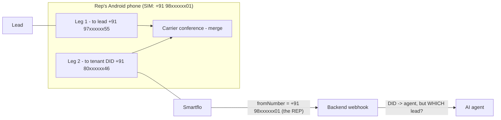

# 02. Lead Identification — Options Analysis

> **Covers:** why the AI agent can't identify the lead in a phone-merged conference, the hard constraints that rule options in or out, ten candidate approaches with trade-offs, and a scoring matrix.
> **Outcome:** feeds [ADR-001](03-adr-001-lead-identification.md).

---

## 1. The problem, precisely

Everything the backend receives on leg 2 is `callId`, `fromNumber` (the rep's SIM), `toNumber` (the DID), and a media stream. **Nothing on that leg carries the lead's identity.** Leg 1 never touches our infrastructure, so the backend can't see it at all.

What "identified" has to mean for us:

1. **Before the AI speaks:** the voice session is bound to a `campaign_call` so `{{name}}`-style placeholders and the "Lead Information" section are injected into the system prompt ([`agent_loader._inject_contact_data`](../../backend/src/voice/agent_loader.py:523)).
2. **After the call:** transcript, recording, summary and disposition are attributed to that lead and campaign.

## 2. Hard constraints (what rules options in or out)

| # | Constraint | Source |
|---|-----------|--------|
| C1 | A third-party Android app **can't capture or inject audio** into a carrier (GSM/VoLTE) call. `CAPTURE_AUDIO_OUTPUT` / `VOICE_CALL` capture is reserved for privileged system apps since Android 10. | [Android: Sharing audio input](https://developer.android.com/media/platform/sharing-audio-input), [Capturing audio in Android Q](https://android-developers.googleblog.com/2019/07/capturing-audio-in-android-q.html) |
| C2 | A carrier conference can only merge **carrier calls on the same SIM**. A VoIP/SIP call placed by an app can't be merged with a GSM call. | Android Telecom — conferencing is per `ConnectionService` |
| C3 | Programmatic hold / merge / DTMF and reliable call-state (`STATE_ACTIVE` on answer) require the app to hold `RoleManager.ROLE_DIALER` and implement `InCallService`, including incoming-call UI. | [Build a default phone app](https://developer.android.com/develop/connectivity/telecom/dialer-app), [InCallService](https://developer.android.com/reference/android/telecom/InCallService) |
| C4 | Smartflo's dynamic endpoint receives `callId`, `fromNumber`, `toNumber`, `status` (+ static custom fields) and **must reply within 2000 ms** with `{"success": true, "wss_url": …}`. | [Smartflo dynamic WebSocket](https://docs.smartflo.tatatelebusiness.com/docs/dynamic-and-static-websocket-options-in-the-voice-streaming-page) |
| C5 | Smartflo's bi-directional stream sends `dtmf` events `{"event":"dtmf","dtmf":{"digit":"1"}}` for keys pressed on the call. Twilio `<Connect><Stream>` does the same (inbound only). | [Smartflo streaming spec](https://docs.smartflo.tatatelebusiness.com/docs/bi-directional-audio-streaming-integration-document), [Twilio WebSocket messages](https://www.twilio.com/docs/voice/media-streams/websocket-messages) |
| C6 | Android dial strings support `,` (pause) and `;` (wait) for post-dial DTMF, and a default dialer can call `Call.playDtmfTone()` at any time. | [TelecomManager / dial string chars](https://developer.android.com/reference/android/telecom/TelecomManager) |
| C7 | Call setup on our side takes 5–27 s under load. | [12 §3.5](../current/12-voice-and-telephony.md#35-call-setup-and-the-ringback-trick) |
| C8 | Carrier conference support varies (VoLTE / VoWiFi restrictions, participant caps). | Carrier-dependent — must be measured (spike S3) |

## 3. Options

### Option A — Call intent registration + caller-number (CLI) match

**How it works.** The rep's device is verified once so the backend knows the **exact caller number Smartflo presents** for that SIM. Before dialing, the app calls `POST /mobile/call-attempts` with the lead's `campaign_call_id`. The backend stores an open attempt keyed on `(device_cli, did)` with a 120 s expiry. When Smartflo hits the webhook, the backend looks up an open attempt where `fromNumber = device_cli AND toNumber = did` and binds the session to it.

The existing code already has this shape. Strategy 2 in [`_handle_tata_start_event`](../../backend/src/voice/websocket_handler.py:1805) resumes a pending session by matching the number. We add one more strategy to the cascade.

**Why it's unambiguous.** A rep's phone can only be in one call-setup to the DID at a time, so `(device_cli, did)` is unique among open attempts. A new attempt supersedes any older open attempt for the same device.

| Pros | Cons |
|------|------|
| Zero extra cost, no carrier features beyond caller ID | Depends on CLI being delivered and stable (CLIR/"hide my number", enterprise SIMs with masked CLI, number-format variants) |
| Identification happens in the HTTP webhook, **before** the stream opens — fastest possible | Two devices sharing a SIM number (rare) are ambiguous |
| Almost all existing code reused | Needs a one-time device verification flow |
| Works identically for Twilio numbers | |

**Verification trick.** Don't try to read the SIM's own number on-device (`getLine1Number` is often empty and needs extra permissions). Have the app **call the DID once** during onboarding and send a 6-digit code as DTMF. The backend stores whatever `fromNumber` Smartflo actually presented. That captures the CLI exactly as it will appear on real calls, so normalization mismatches can't happen.

### Option B — DTMF token on the AI leg

**How it works.** The attempt response includes a short token, e.g. `*4821#`, unique among open attempts on that DID. Once the AI leg is `ACTIVE`, the app sends it with `Call.playDtmfTone()`. It can also use a dial string like `tel:+9180xxxxxx46,,*4821#`. The gateway handler collects the digits from `dtmf` events and binds the session to the matching attempt.

**Timing.** The token goes out on the AI leg **before** the merge, so the lead never hears the tones. The handler withholds audio from the model until identification is done, so the AI never "hears" the tones either.

| Pros | Cons |
|------|------|
| Deterministic; independent of CLI | Depends on DTMF surviving the path (VoLTE RFC 4733 → carrier interconnect → Smartflo). Must be measured (spike S2). |
| Resolves every CLI failure mode (withheld, masked, shared) | Adds ~1.5–2 s after AI-leg answer |
| Also confirms Option A (detects mis-binds) | Needs new DTMF handling in the handler (none exists today) |
| Supported by both Smartflo and Twilio streams | Only reliable programmatically as default dialer (C3) |

### Option C — Dedicated DID per rep

Each rep (device) gets their own DID assigned to the same agent, so `toNumber` identifies the rep regardless of CLI. The lead is then resolved through the rep's open attempt, as in A.

| Pros | Cons |
|------|------|
| Removes the CLI dependency entirely | One DID per rep: monthly rental × headcount, number-pool admin |
| Simple matching | Still needs the intent (A) to know *which lead* |

**Use:** only as a remedy for tenants whose SIMs don't present CLI and where DTMF fails.

### Option D — Dynamic DID per call (number pool rotation)

The backend hands the app a DID from a pool for each attempt, and the DID alone identifies the attempt ("dynamic number insertion", as used in call tracking).

| Pros | Cons |
|------|------|
| No CLI or DTMF dependency | Pool size ≥ peak concurrent attempts per company; expensive; release/cool-down logic; pool exhaustion blocks dialing |
| Identification in the webhook | Every DID must be provisioned + assigned to the agent in Smartflo |

**Use:** not recommended. It costs more than C and adds complexity for no gain over A+B.

### Option E — Post-call reconciliation only

Don't identify during the call. After the call, match the voice session to an app-reported attempt by rep CLI + timestamps.

| Pros | Cons |
|------|------|
| Trivial | **The AI talks to the lead without knowing who they are.** Fails FR-E4. |

**Use:** only as the safety net for calls that end up `unidentified`.

### Option F — Conversational identification

The AI asks "May I know who I'm speaking with?" and fuzzy-matches the answer against the campaign list.

| Pros | Cons |
|------|------|
| No infrastructure | Poor experience on an outbound sales call; ASR name errors in Indian names; privacy concerns; slow |

**Use:** last-resort confirmation inside the persona prompt only; never as the identification mechanism.

### Option G — App places the AI leg over VoIP/SIP with custom headers

The app joins the AI over SIP or WebRTC (e.g. to our existing `WS /stream/audio` `provider: "web"`), carrying `X-Lead-Id`.

| Pros | Cons |
|------|------|
| Perfect identification | **Not feasible:** can't merge a VoIP call into a carrier conference (C2), and the app can't bridge audio itself (C1). |

### Option H — Server-side bridge (inverted topology)

The app sends "call this lead" to the backend. Smartflo (click-to-call / conference APIs) dials the **rep**, then the **lead**, and bridges the AI stream. Caller ID is the tenant's number. Identification is the existing `custom_identifier` path.

| Pros | Cons |
|------|------|
| Identification solved by existing code; no default-dialer app, no carrier conference variance; works on iOS too | Lead sees the tenant number, not the rep's personal number (lower pickup rate, if that's the business reason for SIM calling) |
| Caller ID can be a **TRAI-compliant 140/1600-series** number (see [08 §1](08-risks-compliance-and-spikes.md#1-regulatory--compliance-india)) | Provider minutes on 2–3 legs instead of 1; rep leg costs money |
| All legs visible to backend → complete analytics | Needs Smartflo conference/bridge API capabilities (verify) |

**Use:** the **fallback architecture**. If spike S3 (carrier merge) or compliance review D1 fails, switch to this and keep the rest of the app (login, upload, analytics) unchanged.

### Option I — Audio watermark / voice fingerprint

Inject an inaudible signature into the AI leg, or identify the lead by voice.

**Not feasible:** the app can't inject audio into a carrier call (C1), and we have no enrolled voiceprint for a lead.

### Option J — Smartflo call-through IVR

The rep dials the DID. An IVR collects the lead's phone number (or lead code) by DTMF, then Smartflo dials the lead and bridges.

This is a variant of H with a DTMF front-end. It inherits H's caller-ID trade-off and adds IVR latency. Covered by H.

## 4. Scoring matrix

Scale: ●●● good · ●● acceptable · ● weak · ✗ disqualifying.

| Criterion | A: Intent + CLI | B: DTMF token | A + B | C: DID/rep | D: DID/call | E: Post-call | F: Ask | G: VoIP leg | H: Server bridge |
|-----------|:---:|:---:|:---:|:---:|:---:|:---:|:---:|:---:|:---:|
| Identified before AI speaks | ●●● | ●●● | ●●● | ●●● | ●●● | ✗ | ● | — | ●●● |
| Accuracy | ●● | ●●● | ●●● | ●●● | ●●● | ●● | ● | — | ●●● |
| Carrier dependency | CLI | DTMF | either suffices | none | none | none | none | ✗ | conference API |
| Added latency | ~0 | +1.5–2 s | ~0 (B confirms async) | ~0 | ~0 | 0 | +10 s+ | — | ~0 |
| Recurring cost | none | none | none | DID × reps | DID × concurrency | none | none | — | extra legs |
| Build effort on current code | S | M | M | S (+ops) | L | S | S | ✗ | M |
| Keeps rep SIM as caller ID | ✓ | ✓ | ✓ | ✓ | ✓ | ✓ | ✓ | — | ✗ |
| Failure mode | falls through to B | falls to unidentified | unidentified + E | — | pool exhaustion | — | wrong lead | — | — |

## 5. Conclusion

- **A + B layered** gives the best accuracy with no recurring cost and fits the existing session-resolution cascade. Either signal alone is enough, and when both are present they cross-check each other.
- **E** is the safety net for residual unidentified calls. It keeps analytics complete but gives no in-call context.
- **C** is an operational remedy for specific tenants, not the default.
- **H** is the documented fallback architecture if carrier merge or compliance blocks the SIM-conference model.
- **D, F, G, I, J** are rejected.

→ Recorded in [ADR-001](03-adr-001-lead-identification.md).
