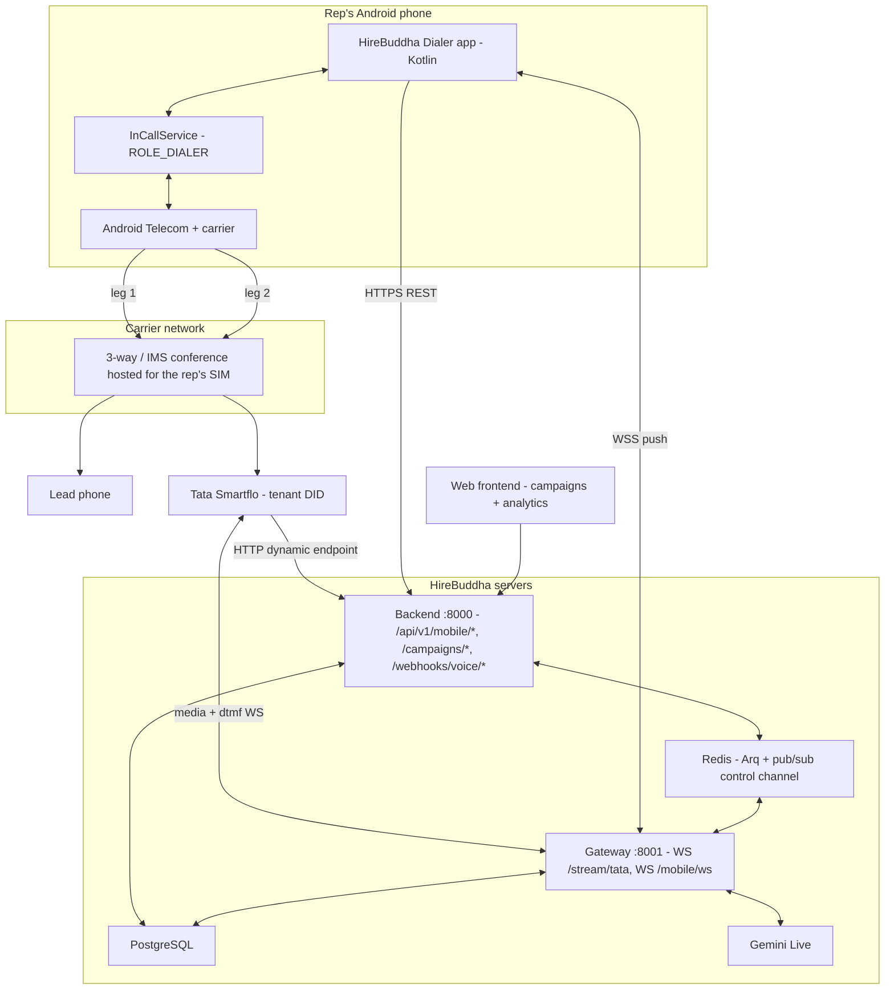
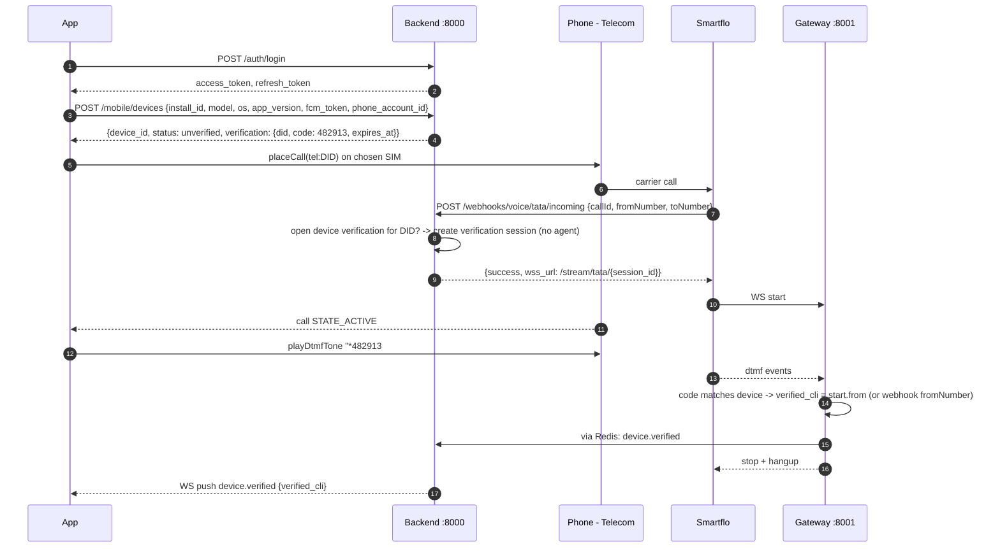
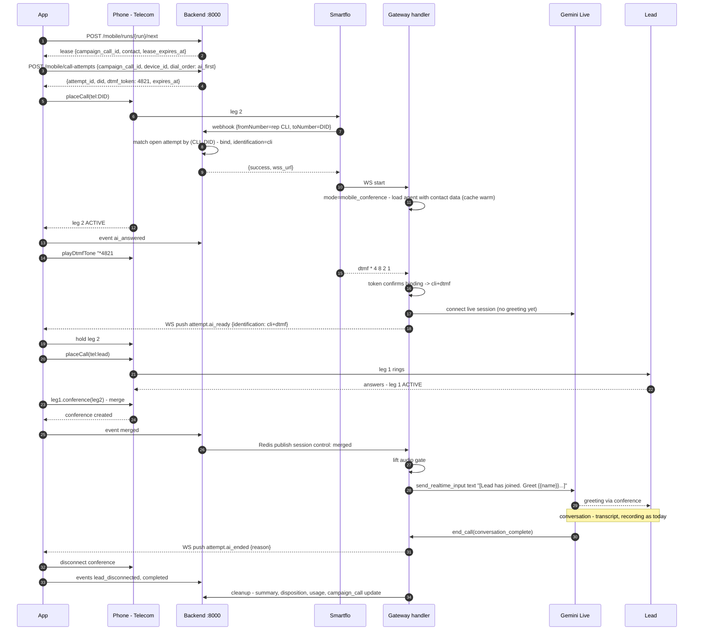
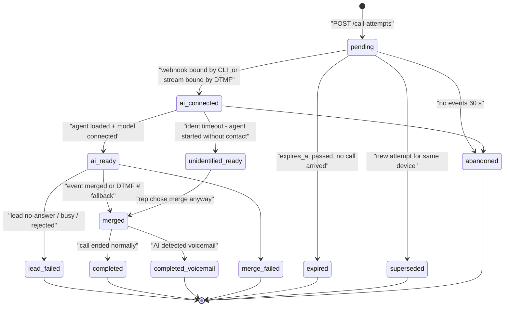
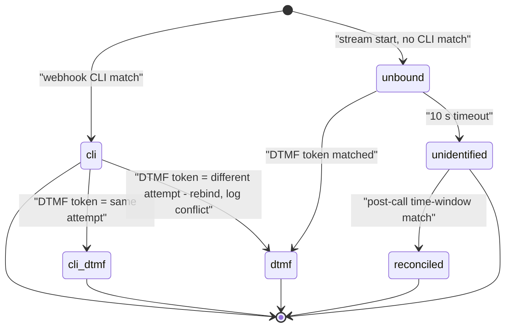
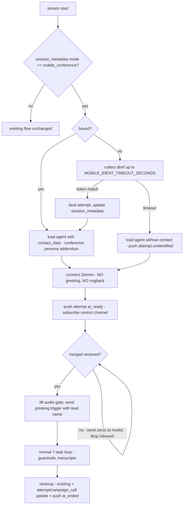

# 04. System Architecture & Call Flows

> **Covers:** components and how they connect, the end-to-end sequences (device verification, AI-first call, lead-first call, failure paths), the identification and attempt state machines, and the cross-process control channel.
> **Prereqs:** [ADR-001](03-adr-001-lead-identification.md), [12 — Voice](../current/12-voice-and-telephony.md) §2–3, §8, §16.

---

## 1. Component view



### What is new vs reused

| Component | Reused as-is | Changed | New |
|-----------|--------------|---------|-----|
| Auth (`/auth/login`, `/refresh`, `/me`) | ✓ | | |
| Campaigns API + models | | `execution_mode`, assignees, `.xlsx` upload, lease endpoints | |
| Arq campaign executor | | skips `mobile_conference` campaigns | |
| Tata/Twilio webhooks | | new resolution step (attempt by CLI) | |
| `BaseStreamHandler` | audio pipeline, transcripts, recording, summary, billing | `dtmf` events, mobile gate, control-channel subscriber | |
| `AgentContextLoader` | contact injection | conference persona addendum | |
| Devices, attempts, runs, events tables | | | ✓ |
| `/api/v1/mobile/*` router | | | ✓ |
| `WS /mobile/ws` on gateway | | | ✓ |
| Android app | | | ✓ |
| Web `CampaignDetailPage` | | mobile funnel + rep table | |

## 2. Device verification flow



**Verification session rule.** In the webhook, if there is an unexpired device verification for this DID, the call is treated as a verification call: no agent is loaded, no credits are checked, and the call lasts at most 20 s. It is matched by code. Several reps verifying at once on the same DID are fine because codes are unique.

## 3. AI-first call flow (default)



### Timing budget (target)

| Step | Budget |
|------|--------|
| Attempt create → leg 2 answered by Smartflo | 2–4 s (carrier) |
| Webhook resolution | < 100 ms (single indexed query) |
| DTMF token send + decode | ~1.5 s |
| Agent load (warm cache) + Gemini connect | 1–5 s — pre-warm on run start |
| Lead ring | up to 30 s |
| Merge after lead answer | < 1 s |
| Greeting first audio after `merged` | < 2 s (model already connected) |

## 4. Lead-first call flow (setting)

Same as §3, except the order: dial lead → on `ACTIVE`, hold lead (or keep active — carrier-dependent) → create attempt → dial DID → CLI/DTMF identification → `ai_ready` → merge → `merged` → greeting. The lead waits on hold for roughly the AI-leg setup (3–10 s with warm cache). The app plays nothing to the lead; carrier hold music may apply. Spike S5 compares both orders.

## 5. Failure paths

| Situation | Detected by | Handling |
|-----------|-------------|----------|
| Lead no-answer / busy / rejected | App: leg 1 `DISCONNECTED` with `DisconnectCause` before `ACTIVE` | App hangs up leg 2; event `lead_no_answer` / `lead_busy`; `campaign_call.status=failed`, disposition from cause; next lead |
| Lead reached voicemail (answered by VM) | AI: existing voicemail phrase / `end_call(voicemail)` | GW pushes `ai_ended{voicemail}` → app hangs up all → `completed-voicemail` |
| AI leg not answered by Smartflo in 15 s | App timer | Hang up, event `ai_leg_failed`, pause run and alert rep (likely config or account issue) |
| No identification within 10 s | GW timer | Start agent unidentified; push `attempt.unidentified`; app asks rep "Merge anyway?" (default: skip lead, retry later) |
| DTMF token matches a different attempt | GW | Rebind to DTMF match, log conflict, push `attempt.ai_ready` with corrected lead |
| Merge fails / not supported | App: `conference()` returns without `STATE_ACTIVE` conference in 3 s, or `CAPABILITY_MERGE_CONFERENCE` absent | Hang up leg 2; tell rep "Your network doesn't support merging"; event `merge_failed`; run paused |
| Rep hangs up | App | Everything ends (the rep's phone hosts the conference); event `rep_hangup` |
| Rep's app killed mid-call | Server: no events for 60 s + GW stream ended | Lease expires → lead returns to `pending` if never answered; attempt → `abandoned` |
| Network loss (data) mid-call | App queues events locally (Room); WS reconnects | Carrier call continues; `merged` event late → greeting delayed. After 5 s without `merged` post-`ai_ready`, GW accepts DTMF `#` sent by the app as a merge fallback signal. |
| Insufficient credits | API at attempt create | 402 → app pauses run and shows balance message |

> **Merge-signal fallback over DTMF.** The `merged` signal normally comes over HTTPS. If mobile data is poor, the app also sends a single `#` DTMF on the conference right after merging. The lead hears one short beep. The GW treats `#` as `merged` when it arrives while the session is in `ai_ready`. Enabled by `MOBILE_DTMF_MERGE_FALLBACK` (default on).

## 6. State machines

### 6.1 Call attempt



### 6.2 Identification (per voice session)



`cli` without DTMF confirmation is still accepted as bound. DTMF is best-effort confirmation.

## 7. Control channel between processes

The live handler runs in the gateway process; app events arrive at the backend API. Both already share Redis (Arq).

| Channel | Publisher | Subscriber | Messages |
|---------|-----------|------------|----------|
| `voice:session:{session_id}:control` | API (`POST /call-attempts/{id}/events`) | `BaseStreamHandler` (mobile mode) | `merged`, `rep_takeover` (drop AI), `abort` |
| `mobile:user:{user_id}:push` | GW handler, API | GW `/mobile/ws` connection for that user | `device.verified`, `attempt.ai_ready`, `attempt.unidentified`, `attempt.ai_ended`, `run.paused`, `lease.revoked` |

- Messages are JSON `{type, attempt_id, session_id, at, data}`.
- Pub/sub is fire-and-forget. **State lives in Postgres.** The app re-syncs with `GET /mobile/call-attempts/{id}` after a WS reconnect, and the handler checks the attempt row once on subscribe so it catches a `merged` that was published before it subscribed.
- If the app has no WS connection, `attempt.ai_ended` is also sent as an FCM high-priority data message.

## 8. Handler changes in detail (`BaseStreamHandler`)



Guardrail adjustments for `mobile_conference`:

| Guard | Change | Why |
|-------|--------|-----|
| Ringback tone | Disabled | The rep's phone holds the leg; the lead isn't on it yet |
| `VOICE_PIPELINE_STALL_SECONDS` | Clock starts at `merged`, not greeting | Pre-merge waiting is expected |
| Silence watchdog | Paused until `merged` | Lead ring time up to 30 s |
| Voicemail no-speech | Enabled after `merged` (treat like outbound) | Lead leg can hit voicemail |
| Outbound greeting protection | Applied after `merged` | Lead's "hello?" must not cancel the greeting |
| Max wait for `merged` after `ai_ready` | 60 s → terminate (`reason=merge_timeout`) | Don't burn minutes on an abandoned leg |
| `direction` | `inbound` (provider truth), `mode` distinguishes | Keeps provider/billing semantics correct |

Conference persona addendum (appended to the system prompt):

```
You are joining a live phone call that a sales representative ({{rep_name}}) from
{{company_name}} has placed to {{name}}. The representative may be listening and may
speak. Address the lead by name, introduce yourself as calling on behalf of
{{company_name}}, and let the representative take over if they start speaking to the lead.
```
