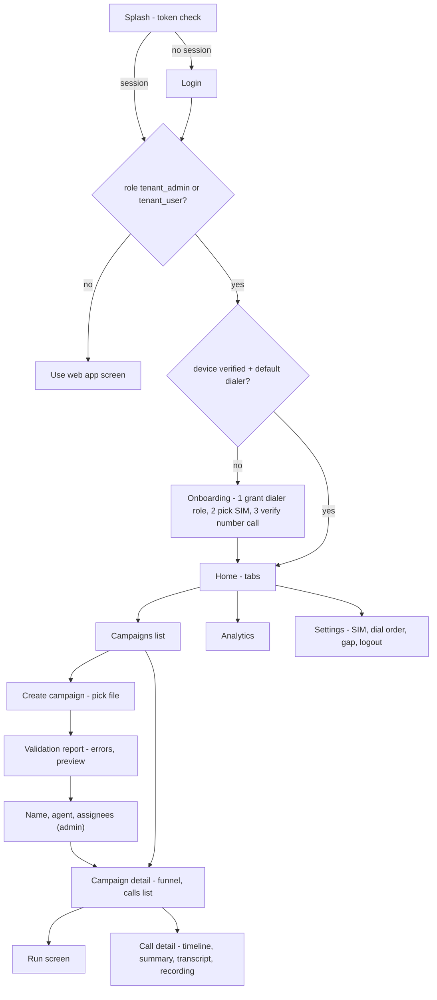
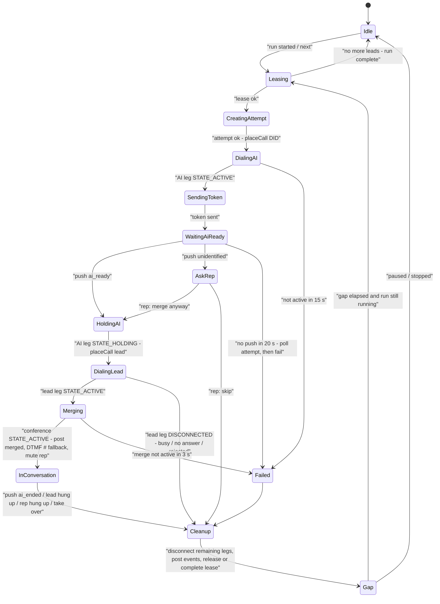
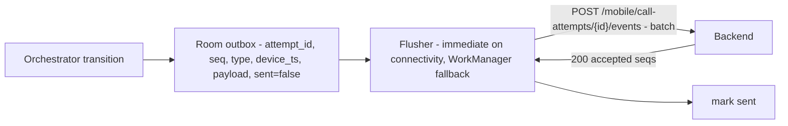

# 05. Android App Design

> **Covers:** tech stack, module layout, the default-dialer requirement, permissions and Play policy, screens and navigation, the call orchestrator state machine, event delivery, security, and testing.

---

## 1. Tech stack

| Concern | Choice | Notes |
|---------|--------|-------|
| Language | Kotlin 2.x | |
| UI | Jetpack Compose + Material 3 | |
| Architecture | MVVM + unidirectional state (`StateFlow`), clean-ish layers (`data` / `domain` / `ui`) | |
| DI | Hilt | |
| Networking | Retrofit + OkHttp + kotlinx.serialization | OkHttp `Authenticator` for refresh-token rotation |
| Realtime | OkHttp WebSocket → `wss://…/mobile/ws` | FCM as fallback push |
| Local storage | Room (event outbox, cached campaigns), DataStore (settings) | |
| Secrets | Android Keystore-backed encryption for refresh token | Don't store tokens in plain SharedPreferences |
| Background | Foreground service (`phoneCall` type) for the active run; WorkManager for outbox flush | |
| Telephony | `android.telecom` — `InCallService`, `TelecomManager.placeCall`, `Call.hold/unhold/conference/playDtmfTone` | Requires `ROLE_DIALER` |
| Push | Firebase Cloud Messaging | |
| Crash / analytics | Firebase Crashlytics | No PII in logs |
| Min / target SDK | minSdk 29 (Android 10, `RoleManager`) / targetSdk latest | |

## 2. Module layout

```
app/                    – Application, navigation, DI graph
core/network            – Retrofit services, auth interceptor, WS client
core/data               – Room DB, repositories, outbox
core/model              – DTOs + domain models
feature/auth            – login, session, role gate
feature/device          – registration, CLI verification, SIM selection
feature/campaigns       – list, detail, create, upload + validation report
feature/run             – run screen, CallOrchestrator, foreground service
feature/analytics       – dashboards
telecom/                – HbInCallService, CallRegistry, DialerActivity, IncomingCallActivity
```

## 3. Why the app must be the default dialer

| Capability needed | Without `ROLE_DIALER` | With `ROLE_DIALER` |
|-------------------|-----------------------|--------------------|
| Know when the lead **answers** | ✗ `TelephonyManager` shows `OFFHOOK` at dial time, not at answer | ✓ `Call.STATE_ACTIVE` |
| Hold / merge calls programmatically | ✗ user must tap Merge in the stock dialer | ✓ `Call.hold()`, `Call.conference()`, `Call.mergeConference()` |
| Send DTMF at the right moment | ~ only via dial-string pauses (`,`), which are timing-blind | ✓ `Call.playDtmfTone()` / `stopDtmfTone()` |
| Disconnect cause (busy / no answer / rejected) | ✗ | ✓ `Call.Details.getDisconnectCause()` |
| Mute the rep | ✗ | ✓ `InCallService.setMuted()` |

**Obligations that come with the role** ([Android docs](https://developer.android.com/develop/connectivity/telecom/dialer-app)):

- Handle `Intent.ACTION_DIAL`, which means shipping a dial pad.
- Fully implement `InCallService`, with **incoming-call UI** (full-screen intent notification) and ongoing-call UI.
- Emergency calls always go to the preloaded dialer.
- Stop using role-gated APIs as soon as the user switches the default dialer away. Detect this in `onResume` and on run start.

The dialer UI is deliberately minimal: dial pad, recent calls from our own records (not the system call log), incoming call screen, and in-call screen. It is **not** a full contacts/phone replacement.

### Assisted mode (fallback, no role)

If the rep refuses the role, the app offers **Assisted mode**. It places calls with `ACTION_CALL` and a dial string `tel:<DID>,,*<token>#` (commas = 2 s pause; `*` and `#` must be URI-encoded as `%2A` / `%23`). The rep taps Merge in their stock dialer and taps **Lead answered / Not answered** in our floating bubble. Identification still works (CLI + dial-string DTMF), but pickup detection and timing depend on the rep. Analytics mark these attempts `assisted = true`.

## 4. Permissions & Play policy

| Permission | Why | Policy notes |
|------------|-----|--------------|
| `CALL_PHONE` | place calls | Runtime permission; not in the restricted SMS/Call-Log group |
| `MANAGE_OWN_CALLS` | not needed | We don't use self-managed ConnectionService |
| `READ_PHONE_STATE` / `READ_PHONE_NUMBERS` | list SIMs (`PhoneAccountHandle`s) for SIM selection | Runtime permission |
| `POST_NOTIFICATIONS` | run + incoming-call notifications | Android 13+ |
| `FOREGROUND_SERVICE`, `FOREGROUND_SERVICE_PHONE_CALL` | keep the run alive | Android 14 FGS type |
| `USE_FULL_SCREEN_INTENT` | incoming-call UI | Android 14 restricts this to calling/alarm apps; a default dialer qualifies |
| `READ_CALL_LOG` | **Not requested** | Restricted group; we keep call history server-side. [Play policy](https://support.google.com/googleplay/android-developer/answer/10208820) no longer allows phone-call account verification as a use case. |

**Distribution (decision D3, 2026-09-17): private only, entirely outside the Play Store.** A release-signed APK is distributed directly (download link or tenant MDM); there is no public release and no Play Console declaration. Consequences:

- In-app update check: the app calls `GET /api/v1/mobile/app-version` on launch and prompts the rep to download a newer APK.
- Reps must allow "Install unknown apps" for the browser/file manager used to install it.
- Keep the release keystore safe: a lost key means reps must uninstall and reinstall.

## 5. Screens & navigation



### Run screen (key UX)

| Region | Content |
|--------|---------|
| Header | Campaign name, progress `37 / 250`, run state (Running / Paused), Pause / Stop |
| Current lead card | Name, phone (masked except last 4), key CSV fields |
| Live status stepper | Connecting AI → AI ready (identified ✓ via CLI+DTMF) → Calling lead → Merged → In conversation 01:23 |
| Controls | **Unmute / Mute me** (rep is auto-muted on merge — decision D4), Take over (drop AI), Hang up lead, Skip |
| Footer | Next lead in 5 s (cancel), last call outcome |

## 6. Call orchestrator

`CallOrchestrator` is a single state machine owned by the foreground `RunService`. `HbInCallService` publishes `Call` callbacks into a `CallRegistry`, which the orchestrator observes.



Implementation notes:

- **Every transition emits an event** into the Room outbox with a monotonic `seq` and device timestamp (see §7).
- **SIM selection:** pass `TelecomManager.EXTRA_PHONE_ACCOUNT_HANDLE` = the verified SIM's handle in `placeCall` extras. Refuse to run if that SIM is missing.
- **DTMF:** for each digit, `playDtmfTone(c)` → 150 ms → `stopDtmfTone()` → 100 ms gap. Validate timing in spike S2.
- **Merge:** prefer `leadCall.conference(aiCall)`; if `aiCall.details.can(CAPABILITY_MERGE_CONFERENCE)` on an existing conference, use `mergeConference()`. Check `conferenceableCalls` first.
- **Incoming call during a run:** pause the run after the current attempt, and show our incoming-call UI normally.
- **Process death:** on restart, `RunService` reads the last attempt from Room, queries `GET /mobile/call-attempts/{id}`, reconciles with live `Call`s in `CallRegistry`, and either resumes `InConversation` or goes to `Cleanup`.

## 7. Event outbox (at-least-once delivery)



- The server dedupes on `(attempt_id, seq)`.
- `merged` is sent **immediately and outside the batch timer** because the greeting waits on it.
- Include `device_ts` and `elapsed_realtime_ms` so the server can correct device clock skew using its own `received_at`.

Event types: `lease_acquired`, `attempt_created`, `ai_dialing`, `ai_answered`, `dtmf_sent`, `ai_ready_received`, `ai_held`, `lead_dialing`, `lead_ringing`, `lead_answered`, `lead_failed{cause}`, `merged`, `merge_failed{reason}`, `rep_muted`, `rep_unmuted`, `rep_takeover`, `lead_disconnected`, `ai_disconnected`, `rep_hangup`, `completed`, `skipped`.

## 8. Security & privacy

- Access token in memory; refresh token encrypted with a Keystore key; cleared on logout and on a 401 from refresh.
- Enable certificate pinning only if we control rotation. Otherwise rely on standard TLS and Network Security Config that disallows cleartext.
- Lead PII: only the **currently leased** contact plus the last 20 call summaries are cached. Campaign contact lists are never stored on device.
- Uploaded files are streamed to the server and not copied to app storage.
- Screenshots allowed (sales teams share them), but `FLAG_SECURE` can be toggled per tenant setting.
- Logs/Crashlytics: phone numbers hashed, never raw.

## 9. Testing

| Level | What | Tooling |
|-------|------|---------|
| Unit | `CallOrchestrator` transitions with a fake `CallRegistry` and fake API; outbox dedupe; DTMF sequencer timing | JUnit5, Turbine, MockK |
| Integration | Retrofit against a MockWebServer contract matching [06](06-backend-changes-and-api.md) | MockWebServer |
| UI | Login, upload, validation report, run screen states | Compose UI tests |
| Device lab | Real calls on Jio / Airtel / Vi SIMs × Samsung / Xiaomi / OnePlus / Pixel, Android 10–15 | Manual matrix from spike S3; later automated with a test DID and a "lead" phone running an auto-answer app |
