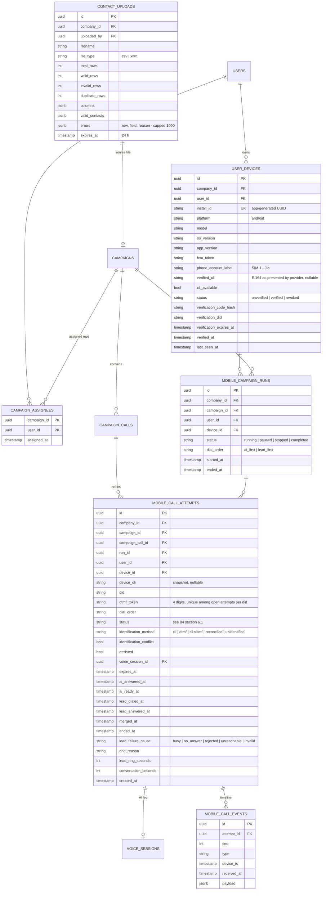
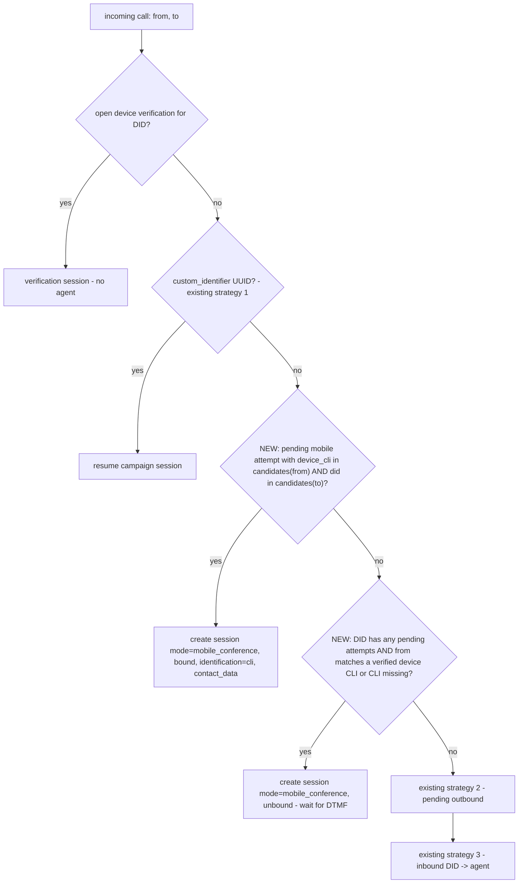

# 06. Backend Changes & API Contract

> **Covers:** data model changes (new tables + columns + migration notes), the `/api/v1/mobile` API contract the Android app codes against, changes to campaigns/upload, webhook resolution, gateway handler, WebSocket push protocol, and configuration.
> **Conventions:** follows existing FastAPI routers mounted under `/api/v1`, company scoping via `current_user.company_id` ([04](../current/04-auth-rbac-tenancy.md)), Alembic migrations in `backend/migrations`.

---

## 1. Data model



### Column changes on existing tables

| Table | Column | Type | Notes |
|-------|--------|------|-------|
| `campaigns` | `execution_mode` | `varchar(30) NOT NULL DEFAULT 'server_dialer'` | `server_dialer` \| `mobile_conference` |
| `campaigns` | `contact_upload_id` | `uuid NULL` | provenance |
| `campaign_calls` | `leased_by_user_id` | `uuid NULL` | |
| `campaign_calls` | `leased_by_device_id` | `uuid NULL` | |
| `campaign_calls` | `lease_expires_at` | `timestamp NULL` | |
| `campaign_calls` | `status` | existing varchar | add value `leased` |
| `voice_sessions` | `session_metadata` | existing jsonb | new keys: `mode`, `attempt_id`, `identification` |

### Indexes / constraints

```sql
-- One open attempt per device (supersede logic relies on this)
CREATE UNIQUE INDEX uq_attempt_open_per_device
  ON mobile_call_attempts (device_id)
  WHERE status IN ('pending', 'ai_connected', 'ai_ready', 'unidentified_ready', 'merged');

-- Webhook CLI lookup (must be < 100 ms; Smartflo gives us 2 s total)
CREATE INDEX ix_attempt_cli_lookup
  ON mobile_call_attempts (device_cli, did)
  WHERE status = 'pending';

-- DTMF token uniqueness among open attempts on a DID
CREATE UNIQUE INDEX uq_attempt_token_open
  ON mobile_call_attempts (did, dtmf_token)
  WHERE status IN ('pending', 'ai_connected');

CREATE UNIQUE INDEX uq_event_seq ON mobile_call_events (attempt_id, seq);
CREATE INDEX ix_campaign_calls_lease ON campaign_calls (campaign_id, status, lease_expires_at);
```

> **Test hygiene:** existing parity/cert suites have committed tenants and `t_*` schemas into the live `hirebuddha` database. New integration tests for these tables must run against a disposable database.

## 2. API contract — `/api/v1/mobile`

All endpoints need `Authorization: Bearer <access_token>`, are restricted to roles `tenant_admin` and `tenant_user` (`RoleChecker`), and are scoped to `current_user.company_id`. Errors use FastAPI's `{"detail": ...}`; mobile-specific errors add `{"detail": {"code": "...", "message": "..."}}`.

### 2.1 Devices

#### `POST /mobile/devices`

Registers or refreshes the device. It is idempotent on `install_id`.

```json
// request
{
  "install_id": "8c3f0e0a-...",
  "model": "SM-A546E",
  "os_version": "14",
  "app_version": "1.0.0 (12)",
  "fcm_token": "f9K...",
  "phone_account_label": "SIM 1 - Jio"
}
// 200
{
  "device_id": "uuid",
  "status": "unverified",
  "verification": {
    "did": "+918065251146",
    "code": "482913",
    "dtmf_sequence": "*482913#",
    "expires_at": "2026-09-17T10:05:00Z"
  }
}
```

The DID is the one assigned to any ACTIVE voice agent of the company ([`get_company_number`](../../backend/src/voice/number_router.py:225)). Returns `409 {code: "no_company_did"}` if none exists.

#### `GET /mobile/devices/{device_id}`

→ `{device_id, status, verified_cli, cli_available, verified_at}`. The app polls this during verification if the WS push is missed.

#### `POST /mobile/devices/{device_id}/verification`

Reissues the code (e.g. the SIM changed) → same `verification` object.

### 2.2 Contact upload (shared with web)

#### `POST /campaigns/upload-contacts` *(new, replaces `/upload-csv` for new clients; `/upload-csv` kept)*

Multipart `file` of `.csv` or `.xlsx`, max 10 MB / 50,000 rows.

```json
// 200
{
  "upload_id": "uuid",
  "file_type": "xlsx",
  "total_rows": 1204,
  "valid_rows": 1150,
  "invalid_rows": 41,
  "duplicate_rows": 13,
  "columns": ["name", "phone", "city", "budget"],
  "phone_column": "phone",
  "errors": [
    {"row": 17, "field": "phone", "value": "98765", "reason": "too_short"},
    {"row": 52, "field": "phone", "value": "+8149603309", "reason": "missing_country_code"}
  ],
  "preview": [{"name": "Asha", "phone": "+919812345678", "city": "Pune", "budget": "80L"}]
}
```

Parsing rules:

- `.xlsx` via `openpyxl` (`read_only=True`, first sheet, first non-empty row is the header, cell values stringified, dates as ISO). `.xls` → `415 {code: "xls_not_supported"}`.
- `.csv`: the existing `parse_csv` logic (utf-8-sig → latin-1, Sniffer).
- Phone column aliases: `phone, mobile, phone_number, mobile_number, contact, number` (case/space-insensitive).
- Normalize with the existing [`normalize_phone`](../../backend/src/ai/campaign_executor.py:262), then validate as E.164 (India: `+91` followed by 10 digits starting 6–9).
- Deduplicate on normalized phone; the first occurrence wins.
- Error reasons: `empty`, `non_numeric`, `too_short`, `too_long`, `missing_country_code`, `invalid_indian_mobile`, `duplicate`.
- Result stored in `contact_uploads` for 24 h, so the full list never round-trips through the phone.

### 2.3 Campaigns (extended)

#### `POST /campaigns`

New optional fields:

```json
{
  "name": "Pune Sept leads",
  "agent_id": "uuid",
  "contact_upload_id": "uuid",
  "execution_mode": "mobile_conference",
  "assignee_user_ids": ["uuid"],
  "provider": "tata_tele"
}
```

- `contact_upload_id` **or** the legacy `contacts` array is required.
- For `mobile_conference`: the agent must have an assigned, active DID. `tenant_user` can only assign themselves (defaults to self). `max_concurrent_calls` is ignored.
- `PATCH /campaigns/{id}/status?status=running` on a `mobile_conference` campaign **must not** enqueue `execute_campaign_task`. It returns `409 {code: "use_mobile_run"}`. Guard it in the Arq executor too.

#### `GET /mobile/campaigns?status=&assigned_to_me=true`

→ list of `{id, name, agent_name, did, status, total_contacts, pending, completed, interested, assignees, updated_at}`. Tenant users see only campaigns assigned to them; admins see all in the company.

#### `GET /mobile/campaigns/{id}` → campaign detail plus the funnel (see [07](07-analytics.md)).

### 2.4 Runs & leases

#### `POST /mobile/campaigns/{id}/runs`

```json
// request
{"device_id": "uuid", "dial_order": "ai_first"}
// 201
{"run_id": "uuid", "status": "running"}
```

Preconditions:

- Device `verified`, and belongs to the user.
- User assigned to the campaign (or is an admin).
- No other `running` run for this device.
- Company credits ≥ the pre-campaign threshold used today.

Side effect: warm the agent cache (`AgentContextLoader`) for the campaign agent.

#### `PATCH /mobile/runs/{run_id}` `{"status": "paused" | "running" | "stopped"}`

Stopping releases any active lease.

#### `POST /mobile/runs/{run_id}/next`

Leases the next lead atomically, using the same pattern as [`lead_queue_service.pick_next_lead`](../../backend/src/ai/lead_queue_service.py):

```sql
UPDATE campaign_calls
SET status = 'leased', leased_by_user_id = :uid, leased_by_device_id = :did,
    lease_expires_at = now() + interval '5 minutes'
WHERE id = (
  SELECT id FROM campaign_calls
  WHERE campaign_id = :cid
    AND (status = 'pending' OR (status = 'leased' AND lease_expires_at < now()))
  ORDER BY retry_count ASC, created_at ASC
  LIMIT 1
  FOR UPDATE SKIP LOCKED
)
RETURNING id, contact_data;
```

```json
// 200
{"campaign_call_id": "uuid", "contact": {"name": "Asha", "phone": "+919812345678", "city": "Pune"},
 "lease_expires_at": "...", "remaining": 212}
// 204 - nothing left -> run marked completed
```

### 2.5 Call attempts

#### `POST /mobile/call-attempts`

```json
// request
{"run_id": "uuid", "campaign_call_id": "uuid", "device_id": "uuid", "assisted": false}
// 201
{
  "attempt_id": "uuid",
  "did": "+918065251146",
  "dtmf_token": "4821",
  "dtmf_sequence": "*4821#",
  "expires_at": "2026-09-17T10:07:00Z",
  "ident_timeout_seconds": 10
}
```

In one transaction:

1. Verify the lease is held by this device.
2. Mark any open attempt of this device `superseded`.
3. Generate a token unique among open attempts on the DID (retry on unique violation).
4. Snapshot `device_cli`.
5. Credit check → `402 {code: "insufficient_credits"}`.

#### `GET /mobile/call-attempts/{id}`

→ full attempt row plus `voice_session_id`, `identification_method`, and summary/disposition once available. Used for re-sync after a WS reconnect or process death.

#### `POST /mobile/call-attempts/{id}/events`

```json
// request
{"events": [
  {"seq": 7, "type": "lead_answered", "device_ts": "2026-09-17T10:05:31.120Z", "elapsed_ms": 812345, "payload": {}},
  {"seq": 8, "type": "merged", "device_ts": "2026-09-17T10:05:31.870Z", "elapsed_ms": 813095, "payload": {}}
]}
// 200
{"accepted": [7, 8], "duplicates": []}
```

Server side effects by event type:

| Event | Effect |
|-------|--------|
| `ai_answered` | `attempts.ai_answered_at` |
| `lead_dialing` / `lead_answered` | timestamps; `lead_ring_seconds` |
| `lead_failed{cause}` | attempt `lead_failed`; `campaign_call.status=failed`, `disposition=cause`; lease released; publish `abort` to the session control channel (GW ends the AI leg if still up) |
| `merged` | attempt `merged`; **publish `merged` on `voice:session:{sid}:control`** |
| `merge_failed` | attempt `merge_failed`; `campaign_call` back to `pending`, `retry_count+1`; publish `abort` |
| `rep_takeover` | publish `rep_takeover` → GW ends the AI leg gracefully; `end_reason=rep_takeover` |
| `completed` / `rep_hangup` / `lead_disconnected` | `ended_at`; lease completed |
| `skipped` | `campaign_call.status=skipped` |

#### `POST /campaigns/{id}/calls/{campaign_call_id}/manual-outcome` *(admin/rep)*

Lets the rep record an outcome for `unidentified` or assisted calls: `{disposition, notes}`.

## 3. Webhook resolution change

In [`webhook_router.py`](../../backend/src/voice/webhook_router.py) Tata `POST /incoming`, the Twilio `/incoming`, and in `TataStreamHandler._handle_tata_start_event`, the cascade becomes:



- `MU` catches the "CLI withheld or unexpected" case without hijacking genuine inbound customer calls. A call from an unknown number to a DID with **no** pending attempts goes through the normal inbound path.
- All of this must finish well inside Smartflo's 2 s limit. Both queries are indexed.
- **Response key:** Smartflo docs require `"success"`; our code sends `"sucess"`. Spike S6 decides. If needed, send both keys while we confirm.
- **Fix while here:** the inbound credit gate's undefined `db` ([12 §14](../current/12-voice-and-telephony.md#14-voice-usage-and-billing)). Mobile attempts check credits at attempt creation, but the webhook should not stay broken.

## 4. Gateway handler changes

Spec lives in [04 §8](04-system-architecture.md#8-handler-changes-in-detail-basestreamhandler). Implementation checklist:

- [ ] `_receive_from_provider`: handle `event == "dtmf"` (Tata `dtmf.digit`; Twilio `dtmf.digit`) → `self._dtmf_buffer`.
- [ ] `DtmfCollector`: pure class (unit-testable like `call_guards.py`). Accepts digits, emits `token` on `*NNNN#`, `code` on `*NNNNNN#`, and `merge_signal` on a lone `#` in `ai_ready` state. Times out partial sequences after 3 s.
- [ ] `MobileConferenceGate`: pure decision object — `should_connect_model`, `should_forward_audio`, `should_greet`, timeouts.
- [ ] Redis subscriber task (8th task in `_setup_live_and_run`, mobile mode only) on `voice:session:{id}:control`; on subscribe, read the attempt row once for missed `merged`.
- [ ] Push helper `publish_user_push(user_id, message)` used for `ai_ready`, `unidentified`, `ai_ended`, `device.verified`.
- [ ] Cleanup: update `mobile_call_attempts` (status, `conversation_seconds`, `end_reason`) alongside the existing `CampaignCall` update. Use the conditional `UPDATE … WHERE status IN (…)` pattern to avoid racing app events.
- [ ] `AgentContextLoader`: append the conference persona addendum when `mode == mobile_conference`; add `rep_name`, `company_name` to the substitution map.
- [ ] Guardrail config per [04 §8](04-system-architecture.md#8-handler-changes-in-detail-basestreamhandler).
- [ ] Post-call reconciler (Arq cron, every 5 min): bind `unidentified` sessions per the ADR rule.

## 5. Mobile push WebSocket — `WS /mobile/ws`

Served by the gateway (:8001), next to the existing WS endpoints.

- **Auth:** first client message `{"type": "auth", "access_token": "...", "device_id": "uuid"}` within 5 s, else close `4001`. Don't put tokens in the query string, because Apache logs URLs.
- Server subscribes to `mobile:user:{user_id}:push` and forwards messages whose `device_id` is null or matches.
- Heartbeat: server `{"type": "ping"}` every 20 s; client replies `pong`; server closes after 60 s of silence.

Server → client messages:

```json
{"type": "device.verified", "device_id": "uuid", "verified_cli": "+919812300001", "cli_available": true}
{"type": "attempt.ai_ready", "attempt_id": "uuid", "session_id": "uuid", "identification": "cli+dtmf", "lead_name": "Asha"}
{"type": "attempt.unidentified", "attempt_id": "uuid", "session_id": "uuid"}
{"type": "attempt.ai_ended", "attempt_id": "uuid", "reason": "conversation_complete | voicemail | merge_timeout | error | rep_takeover"}
{"type": "run.paused", "run_id": "uuid", "reason": "insufficient_credits | admin_paused"}
{"type": "lease.revoked", "campaign_call_id": "uuid"}
```

`attempt.ai_ended` is also sent as an FCM data message if the user has no open socket.

## 6. Configuration (`backend/src/common/config.py`)

| Setting | Default | Meaning |
|---------|---------|---------|
| `MOBILE_ATTEMPT_TTL_SECONDS` | 120 | pending attempt expiry |
| `MOBILE_IDENT_TIMEOUT_SECONDS` | 10 | wait for CLI/DTMF binding after stream start |
| `MOBILE_MERGE_WAIT_SECONDS` | 60 | max wait for `merged` after `ai_ready` |
| `MOBILE_DTMF_MERGE_FALLBACK` | `True` | accept lone `#` as merge signal |
| `MOBILE_LEASE_SECONDS` | 300 | campaign-call lease |
| `MOBILE_VERIFICATION_TTL_SECONDS` | 300 | device verification code expiry |
| `MOBILE_VERIFICATION_MAX_CALL_SECONDS` | 20 | hard cap for verification calls |
| `MOBILE_RECONCILE_WINDOW_SECONDS` | 15 | post-call time-window match |

`backend/.env` has drifted from code defaults before and caused outages. Add these keys to `.env.example` and check the live `.env` explicitly on deploy.

## 7. Backend test plan

| Area | Tests |
|------|-------|
| Upload | xlsx/csv fixtures: BOM, semicolons, merged header cells, numeric phones stored as floats (`9.81E+09`), duplicates, 50k rows under 5 s |
| Leasing | concurrent `next` from 10 devices never returns the same row; expired lease reclaimed |
| Attempts | supersede; token uniqueness under concurrency; credit 402 |
| Webhook cascade | each branch; genuine inbound call to DID with no attempts is unaffected; < 100 ms p95 with 10k attempts rows |
| `DtmfCollector` / `MobileConferenceGate` | pure unit tests, table-driven (mirroring `test_call_guards.py`) |
| Handler integration | fake Tata WS client sends `start` → `dtmf` digits → publishes `merged` → asserts greeting trigger sent and audio forwarded only after `merged` |
| Events | idempotent on `(attempt_id, seq)`; out-of-order arrival |
| Reconciler | matches within window, never across companies or devices |
