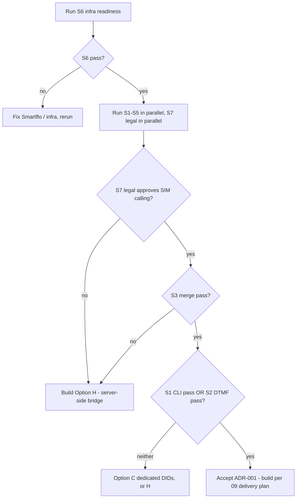

# 08. Risks, Compliance & Validation Spikes

> **Covers:** regulatory issues that could invalidate the calling model, platform and carrier risks, and the spikes that must pass **before** build starts, with procedures and go/no-go criteria.
> **Audience:** tech lead, product, legal. **Read this before committing engineering time.**

---

## 1. Regulatory & compliance (India)

> This section is engineering's reading of public sources, **not legal advice**. D1 needs a lawyer's sign-off.

### 1.1 TRAI TCCCPR — commercial calls from 10-digit numbers (🔴 blocking)

> **Resolved 2026-09-17 (D1):** product confirmed reps may call leads from personal SIMs. The engineering mitigations below stay in scope.

- TRAI's **12 February 2025** amendment to the Telecom Commercial Communications Customer Preference Regulations (TCCCPR 2018) **prohibits promotional/telemarketing calls from regular 10-digit numbers**. Promotional calls must use the **140-series**, and service/transactional calls from regulated entities (RBI/SEBI/IRDAI/PFRDA) and government use the **1600-series**. ([Securiti summary](https://securiti.ai/india-spam-rules-trai-latest-amendment/), [SCC Online, Jul 2026](https://www.scconline.com/blog/post/2026/07/18/trai-clarifies-1600-and-140-series-number-framework/), [MediaNama, Jul 2026](https://www.medianama.com/2026/07/223-trai-releases-clarification-designated-promotional-transactional-number-series/))
- Penalties reported for violators include suspension of outgoing services, **disconnection of all telecom resources** and block-listing (up to two years has been reported). Lakhs of numbers have been disconnected in enforcement drives. ([newsonair](https://www.newsonair.gov.in/trai-blacklists-over-800-entities-disconnects-1-8-million-mobile-numbers-to-curb-spam-calls-sms-fraud))
- Consumers can now report spam without first registering a DND preference, which raises the complaint risk for any rep who dials an uploaded list.

**Why it matters here.** The whole point of the SIM-conference model is that the lead sees the rep's personal 10-digit number. If a campaign is *promotional* (cold leads, bought lists), each rep's SIM is exposed to complaints and disconnection, and the tenant is exposed to penalties.

**Questions for legal (D1):**

1. Are calls to leads who **submitted an enquiry** (inbound interest, e.g. a property portal form) "promotional" or a response to a consumer request?
2. Does using an **AI agent** on the call change the classification?
3. Does the tenant's recorded consent (Digital Consent Acquisition, DCA) cover calls from employees' personal numbers?
4. What must the app enforce: consent-source column required? NCPR/DND scrubbing? Calling hours (e.g. 09:00–21:00)?

**Engineering mitigations regardless of the answer:**

| Mitigation | Where |
|-----------|-------|
| Required `lead_source` / consent attestation checkbox at campaign creation, stored on the campaign | Upload / create flow |
| Calling-hours window per tenant (default 09:30–19:30 IST), enforced server-side in `/runs/{id}/next` | Backend |
| Per-rep daily cap (default 150 attempts) to avoid spam-pattern flags on the SIM | Backend |
| DND/NCPR scrub hook (provider TBD) before leasing | Backend, phase 2 |
| "Do not call again" disposition that excludes the number company-wide | Backend + app |
| **Option H (server-side bridge with a 140-series tenant number)** as the compliant architecture if D1 says SIM calling isn't allowed | Architecture fallback |

### 1.2 DPDP Act 2023 — personal data (🟠)

- Lead lists are personal data. The tenant is the data fiduciary and HireBuddha is the processor. Needs: purpose limitation, retention (auto-delete `contact_uploads` after 24 h, already in the design), access controls, breach process.
- Recording + transcripts of the lead: **disclosure required**. Add to the conference persona: *"This call may be recorded, and I'm an AI assistant."* It's a tenant-configurable sentence but on by default.
- Minimize PII on device (see [05 §8](05-android-app-design.md#8-security--privacy)).

### 1.3 AI disclosure (🟡)

No India-specific AI-call statute is confirmed at the time of writing. Disclose anyway (above). Legal to confirm.

## 2. Technical & product risk register

| # | Risk | Likelihood | Impact | Mitigation | Owner |
|---|------|:---:|:---:|-----------|-------|
| R1 | Carrier merge unsupported or unreliable on VoLTE / VoWiFi for some carriers or OEMs | Med | **High** | Spike S3; detect `CAPABILITY_MERGE_CONFERENCE`; guide the rep to disable Wi-Fi calling; fallback to Option H | Android lead |
| R2 | CLI not presented / masked (enterprise SIMs, CLIR) | Low–Med | Med | DTMF signal (B); per-tenant dedicated DID (C) | Backend lead |
| R3 | DTMF not transported end-to-end (VoLTE RFC 4733 → Smartflo) | Low–Med | Med | CLI signal (A) still works; implement in-band Goertzel detection on the μ-law stream as a backup if S2 shows events missing but tones audible | Backend lead |
| R4 | Tata Smartflo account inactive (hangup API returns `success:false` today) | **Known** | **High** | Reactivate before any spike (S6) | Ops |
| R5 | Smartflo response key `"sucess"` vs documented `"success"` | Med | High | Verify in S6; send both keys | Backend lead |
| R6 | Play Store rejects the default-dialer declaration | Med | Med | Pilot via managed Google Play / MDM; ship a genuine minimal dialer | PM |
| R7 | Reps refuse to switch the default dialer | Med | Med | Assisted mode; role granted only during run hours (app prompts to restore the stock dialer after run) — validate that the role swap UX is acceptable in the pilot | PM |
| R8 | Conference audio: the AI hears the rep, echo, level mismatch → false barge-ins | Med | Med | Auto-mute rep after merge; tune `VOICE_BARGE_IN_RMS_THRESHOLD` for mobile mode; S5 audio review | Backend lead |
| R9 | Rep's phone is the conference host, so a rep hang-up or incoming call ends everything | High | Low | UX: clear warnings; incoming calls during run → auto-reject option | Android lead |
| R10 | Identification mis-bind → AI addresses the wrong lead by name | Low | **High** | Unique constraints; DTMF cross-check; conflict alerting (> 0.5 % pages on-call); persona instructs AI to confirm name politely in the first turn | Backend lead |
| R11 | AI-first idle minutes cost more than expected | Med | Low | Metric `idle_ai_minutes`; switch tenant to lead-first if cheaper per interested lead | PM |
| R12 | Gateway call-setup latency (5–27 s) under concurrency | Med | Med | Warm agent cache at run start; connect model before lead dial; load test with 50 concurrent mobile attempts | Backend lead |
| R13 | Existing voice bugs leak into mobile mode (recording lookup heuristic mis-attaches under concurrency; inbound credit gate `NameError`) | Known | Med | Fix recording lookup to use `session_id` only for mobile sessions; fix credit gate (in scope) | Backend lead |
| R14 | Apache `streaming.hirebuddha.com` still proxies WS to retired :8002 | Known | High | Confirm the DID's stream host routes to :8001 during S6 | Ops |

## 3. Validation spikes (must run before build)

**Timebox:** about 2 weeks total. Build a throwaway Android spike app with a default dialer, a hard-coded flow, and a log screen. Backend spike code sits behind a feature flag on a staging DID.

### S1 — CLI fidelity

| | |
|---|---|
| Goal | Confirm Smartflo presents a stable, correct `fromNumber` for rep SIMs |
| Setup | 8 SIMs: Jio ×2, Airtel ×2, Vi ×2, BSNL ×1, one corporate postpaid; staging DID with the dynamic endpoint logging the raw payload |
| Procedure | 10 calls per SIM at different times of day; record `fromNumber`, format, and presence |
| Pass | ≥ 95 % of calls present CLI; for each SIM, format identical across calls |
| Fail → | Rely on DTMF (needs S2 pass); consider Option C for affected tenants |

### S2 — DTMF pass-through

| | |
|---|---|
| Goal | `Call.playDtmfTone` digits arrive as Smartflo `dtmf` events |
| Setup | Spike app sends `*NNNN#` with 150 ms tone / 100 ms gap; handler logs raw `dtmf` events |
| Procedure | 50 tokens per carrier on VoLTE, 20 with VoLTE disabled (where the network allows); vary tone length 80/150/250 ms |
| Pass | ≥ 98 % exact token decode at some tone length; measure send-to-decode latency |
| Fail → | Try in-band detection on the recorded μ-law; if that fails too, CLI-only with stricter conflict rules |

### S3 — Programmatic merge

| | |
|---|---|
| Goal | Hold + dial + `conference()` works and audio is good for all parties |
| Matrix | 3 carriers × 4 OEMs (Samsung One UI, Xiaomi HyperOS, OnePlus/Oppo ColorOS, Pixel) × Android 12–15; Wi-Fi calling on/off |
| Procedure | AI-first sequence to a "lead" phone; after merge, run a 60 s scripted conversation; rate audio 1–5 from the lead side and check the AI transcript quality |
| Pass | ≥ 95 % merges succeed; median audio rating ≥ 4; AI transcript captures the lead's speech ≥ 90 % |
| Fail → | **Switch to Option H** for the affected carriers or for all |

### S4 — Pickup detection semantics

| | |
|---|---|
| Goal | `STATE_ACTIVE` fires on real answer, not on operator announcements ("the number you are calling is switched off") or early media / caller tunes |
| Procedure | Call switched-off, out-of-coverage, busy, rejected, and caller-tune (JioTunes / Hello Tunes) numbers; log states + `DisconnectCause` |
| Pass | No false `ACTIVE` in any scenario, or false actives distinguishable (e.g. by immediate disconnect) |
| Fail → | Delay merge until the AI detects human speech on the conference, or ask the rep to confirm in those scenarios |

### S5 — Dial order & latency

| | |
|---|---|
| Goal | Choose the default dial order with data |
| Procedure | 30 calls each AI-first vs lead-first; measure lead-answer → first AI audio, lead hang-ups during hold, AI-leg idle seconds |
| Pass | AI-first: p50 first AI word ≤ 3 s. Pick the order with the higher "conversation ≥ 30 s" rate unless its cost per conversation is more than 1.5× higher |

### S6 — Smartflo & infra readiness

| | |
|---|---|
| Checklist | Account reactivated; DID configured with the **dynamic** endpoint → `/webhooks/voice/tata/incoming`; response key accepted (`success` vs `sucess`); `customParameters` / extra fields behaviour noted; `dtmf` events seen on WS; stream host reaches gateway :8001; hangup API works with portal JWT |
| Pass | All items ✓ |

### S7 — Compliance sign-off

| | |
|---|---|
| Owner | Product + legal |
| Output | Written answer to the D1 questions in §1.1, the required in-app controls, and the disclosure script |
| Pass | Legal approves the SIM-conference model for at least the pilot tenant's lead type |
| Fail → | Option H with a 140-series number |

## 4. Go / no-go

