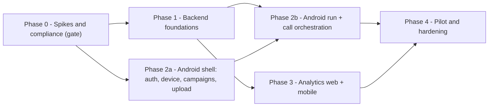

# 09. Delivery Plan, Epics & Acceptance Criteria

> **Covers:** phased plan, epics with stories, sizes and acceptance criteria, dependencies, the pilot plan, and the definition of done.
> **Sizes:** S ≈ ≤ 2 dev-days, M ≈ 3–5, L ≈ 6–10. Sizes are relative; estimate properly once the spikes are done.

---

## 1. Phases

| Phase | Exit criteria |
|-------|---------------|
| 0 | Go/no-go decided per [08 §4](08-risks-compliance-and-spikes.md#4-go--no-go); ADR-001 moved to Accepted (or superseded by an Option H ADR) |
| 1 | All `/mobile` APIs live on staging; handler mobile mode passes the integration test with a fake Tata WS client |
| 2a | Rep can log in, verify device, upload xlsx/csv, see the validation report, create a campaign |
| 2b | Rep can run a 20-lead campaign end-to-end on staging with ≥ 95 % correct identification |
| 3 | Web + app show identical funnel numbers for the same campaign |
| 4 | Pilot tenant: 2 weeks, ≥ 1,000 attempts, NFR targets met ([01 §3](01-requirements-and-scope.md#3-non-functional-requirements)) |

Phase 2a can start in parallel with Phase 1 against the API contract in [06](06-backend-changes-and-api.md) using MockWebServer.

## 2. Epics & stories

### E0 — Spikes (Phase 0)

| ID | Story | Size |
|----|-------|:---:|
| E0-1 | Reactivate Smartflo, configure staging DID dynamic endpoint, verify response key and stream routing (S6) | S |
| E0-2 | Spike Android app: default dialer role, place/hold/merge, DTMF sender, state log | M |
| E0-3 | Backend spike: log raw webhook + `dtmf` events on staging | S |
| E0-4 | Run S1–S5 device matrix, write results into `spike-results.md` in this folder | M |
| E0-5 | Legal review (S7) | — |

### E1 — Contact upload & campaign model (Phase 1)

| ID | Story | Size | Acceptance criteria |
|----|-------|:---:|---------------------|
| E1-1 | `.xlsx` + `.csv` parser with the alias, normalization and dedupe rules | M | Fixtures in [06 §7](06-backend-changes-and-api.md#7-backend-test-plan) pass; `9.81E+09`-style floats rejected with `non_numeric` or recovered when the value is an exact integer |
| E1-2 | `contact_uploads` table + `POST /campaigns/upload-contacts` | S | Returns report shape exactly as in 06 §2.2; row expires after 24 h |
| E1-3 | `execution_mode`, `contact_upload_id`, assignees on campaign create | S | Mobile campaign cannot be started via `PATCH status=running` (409); Arq executor skips it |
| E1-4 | Web `CampaignCreateModal` accepts xlsx + mode + assignees | M | Existing server-dialer campaign creation unchanged (regression test) |

### E2 — Devices & verification (Phase 1)

| ID | Story | Size | Acceptance criteria |
|----|-------|:---:|---------------------|
| E2-1 | `user_devices` + `POST/GET /mobile/devices`, reissue verification | S | Idempotent on `install_id`; code stored hashed |
| E2-2 | Webhook: verification-call branch | M | Verification call never loads an agent or deducts credits; capped at 20 s |
| E2-3 | `DtmfCollector` + `dtmf` event handling (Tata + Twilio) | M | Table-driven unit tests; partial sequences time out after 3 s |
| E2-4 | Verification completion → `verified_cli` + push `device.verified` | S | CLI stored exactly as presented; `cli_available=false` when absent |

### E3 — Runs, leases, attempts (Phase 1)

| ID | Story | Size | Acceptance criteria |
|----|-------|:---:|---------------------|
| E3-1 | Runs API + agent cache warm-up | S | One running run per device |
| E3-2 | Lease `next` with `SKIP LOCKED` + expiry reclaim | M | 10 concurrent devices × 1,000 leads: no duplicate lease |
| E3-3 | Attempts API (supersede, token, credits) | M | Unique indexes hold under concurrent creation |
| E3-4 | Events API with idempotent seq + side effects table | M | Duplicate + out-of-order batches handled |
| E3-5 | Calling-hours window, per-rep daily cap, do-not-call exclusion | S | `next` returns `423 {code: "outside_calling_hours"}` etc. |

### E4 — Identification & gated AI (Phase 1)

| ID | Story | Size | Acceptance criteria |
|----|-------|:---:|---------------------|
| E4-1 | Webhook cascade: CLI match + unbound mobile branch | M | Genuine inbound calls to the DID with no attempts behave exactly as before; p95 lookup < 100 ms |
| E4-2 | `MobileConferenceGate` in `BaseStreamHandler` (model connect, audio gate, greeting on `merged`, guardrail adjustments) | L | Integration test: no audio forwarded and no greeting before `merged`; greeting within 2 s after |
| E4-3 | Redis control channel (API → GW) + user push channel (GW → app) | M | `merged` published before the handler subscribes is still honoured |
| E4-4 | `WS /mobile/ws` endpoint on gateway, auth handshake, heartbeat; FCM fallback for `ai_ended` | M | Token never in URL; reconnect resumes pushes |
| E4-5 | Conference persona addendum + disclosure sentence | S | Placeholders `rep_name`, `company_name` substituted |
| E4-6 | Cleanup updates attempts; recording lookup by `session_id` only for mobile sessions | S | No time-proximity recording fallback in mobile mode |
| E4-7 | Post-call reconciler cron | S | Never binds across company or device |
| E4-8 | Fix inbound credit-gate `NameError` in `webhook_router.py` | S | Unit test proves gate fires |

### E5 — Android app shell (Phase 2a)

| ID | Story | Size | Acceptance criteria |
|----|-------|:---:|---------------------|
| E5-1 | Project setup: modules, Hilt, Retrofit, Room, CI (lint, unit tests, signed build) | M | CI green on PR |
| E5-2 | Login, token storage (Keystore), refresh authenticator, role gate | M | Non-tenant roles blocked; refresh rotation survives app restart |
| E5-3 | Onboarding: default dialer role request, SIM picker, verification call | L | Verified device status reflected; role loss detected on resume |
| E5-4 | Minimal dialer obligations: dial pad, incoming-call UI, in-call UI | L | Passes Android role requirements; incoming calls work while app is default |
| E5-5 | Campaign list/detail | M | Tenant user sees only assigned campaigns |
| E5-6 | Create campaign: file picker (SAF), upload, validation report, config | M | 10 MB xlsx uploads with progress; error rows listed with reasons |

### E6 — Android run & orchestration (Phase 2b)

| ID | Story | Size | Acceptance criteria |
|----|-------|:---:|---------------------|
| E6-1 | `HbInCallService` + `CallRegistry` | M | All `Call` callbacks observable as flows |
| E6-2 | `CallOrchestrator` state machine (AI-first + lead-first) | L | Unit tests cover every transition in [05 §6](05-android-app-design.md#6-call-orchestrator) |
| E6-3 | DTMF sequencer + merge + mute | M | Tone timing configurable remotely |
| E6-4 | `RunService` foreground service, run screen, controls (mute, takeover, skip, hang up) | L | Run survives screen off and backgrounding for 2 h |
| E6-5 | Event outbox + flusher; `merged` sent immediately; DTMF `#` merge fallback | M | Events delivered after airplane-mode toggle |
| E6-6 | WS client + FCM handling | M | `ai_ended` disconnects legs within 1 s with WS, within 5 s via FCM |
| E6-7 | Process-death recovery | M | Kill app mid-conversation → on relaunch the run screen reflects the live call |
| E6-8 | Assisted mode (no dialer role) | M | Dial-string DTMF works (`*`/`#` URI-encoded as `%2A`/`%23`) |

### E7 — Analytics (Phase 3)

| ID | Story | Size | Acceptance criteria |
|----|-------|:---:|---------------------|
| E7-1 | `GET /campaigns/{id}/mobile-analytics` + summary + paged calls + timeline | L | Metric definitions exactly per [07 §2](07-analytics.md#2-metric-definitions); p95 < 500 ms at 100k attempts |
| E7-2 | Web: CampaignDetailPage mobile section, mode badge, CallDetail timeline, mobile analytics page | L | Numbers match API; existing pages unchanged for server-dialer campaigns |
| E7-3 | Android: analytics tab, campaign funnel, call detail with recording playback | L | Same numbers as web for the same campaign |
| E7-4 | Excel export mobile columns | S | |
| E7-5 | Alerting: identification conflict rate > 0.5 %, merge success < 90 % per carrier | S | Alerts go to the existing ops channel |

### E8 — Pilot & hardening (Phase 4)

| ID | Story | Size |
|----|-------|:---:|
| E8-1 | Load test: 50 concurrent mobile attempts through gateway (fake Tata client) | M |
| E8-2 | Pilot tenant onboarding, rep training script, distribution via managed Google Play | M |
| E8-3 | Daily pilot review of funnel, conflicts, audio complaints; tune thresholds | M |
| E8-4 | ~~Play Console default-handler declaration~~ — not needed: private distribution only (D3) | — |
| E8-5 | Update [12 — Voice](../current/12-voice-and-telephony.md) and [17 — API reference](../current/17-api-reference.md) with mobile mode | S |

## 3. Dependencies

| Dependency | Needed by | Owner |
|-----------|-----------|-------|
| Smartflo account active + staging DID | E0, everything | Ops |
| Apache stream vhost → :8001 | E0-1 | Ops |
| Firebase project (FCM, Crashlytics) | E5-1 | Android lead |
| Test SIMs (8) + OEM devices (4) | E0-4, E6 | PM |
| Legal answer D1 | Phase 1 start | Product |
| Pilot tenant with an ACTIVE voice agent + DID + credits | Phase 4 | Product |

## 4. Definition of done (per story)

- Code reviewed; unit tests for new pure logic (gate, collector, orchestrator, parser).
- Company scoping verified by a test that tries cross-tenant access.
- No PII (raw phone numbers, names) in logs; hashed where needed.
- API changes reflected in [06](06-backend-changes-and-api.md); metric changes reflected in [07](07-analytics.md).
- New settings added to `.env.example` and checked in the live `.env` on deploy.
- Integration tests run against a disposable database, never the live `hirebuddha` DB.

## 5. Pilot success metrics (Phase 4 exit)

| Metric | Target |
|--------|--------|
| Identification rate | ≥ 99.5 % |
| Identification conflicts leading to a wrong-name greeting | 0 |
| Merge success rate | ≥ 95 % |
| p50 lead-answer → first AI word | ≤ 3 s |
| Crash-free sessions | ≥ 99.5 % |
| Rep satisfaction (survey) | ≥ 4 / 5 |
| Interested-lead rate vs tenant's server-dialer baseline | reported (no target; informs go-to-market) |
