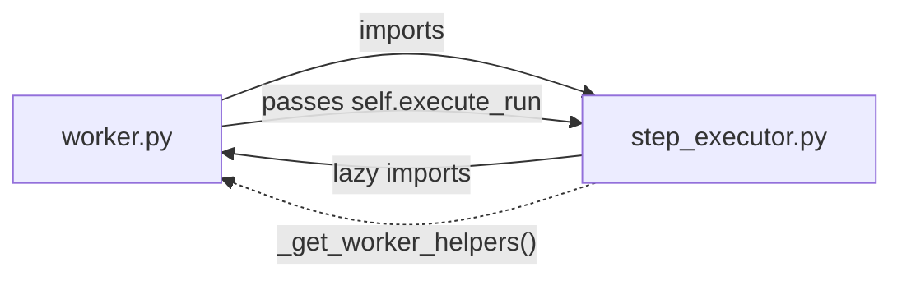
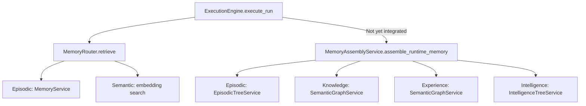

# Phase 10 — Structural Audit: File-by-File Analysis

> Companion to [01_executive_summary.md](./01_executive_summary.md)

---

## 1. File Inventory & Responsibility Map

### 1.1 The `ai/` Root — 57 Files, 3 Subdirectories

```
ai/
├── worker.py                  95 KB  ← MONOLITH: ExecutionEngine + RecursiveReasoningEngine + helpers + arq jobs
├── step_executor.py           74 KB  ← StepExecutorService (extracted from worker Phase 6)
├── service.py                 47 KB  ← Entity CRUD, template cloning, entity resolution
├── llm_router.py              40 KB  ← LLMRouter + 3 provider adapters (Gemini, Anthropic, Azure)
├── cortex_service.py          42 KB  ← CortexRouter: tree CRUD, navigation, viewport
├── schemas.py                 34 KB  ← Pydantic models, enums, prompt constants
├── cortex_bridge.py           26 KB  ← CortexBridge: viewport refresh, step writing, tool ingestion
├── planner_service.py         23 KB  ← PlannerService: plan reconciliation, re-planning
├── campaign_executor.py       23 KB  ← Voice campaign execution (separate domain)
├── dreaming_engine.py         22 KB  ← 3-phase learning pipeline
├── router.py                  22 KB  ← FastAPI routes for entities/runs
├── memory_service.py          18 KB  ← MemoryRouter: 3-tier memory retrieval
├── meta/                       —     ← Meta-agent template, schema compiler, registry search
├── tools/                      —     ← 20+ tool implementations
├── [29 other files]            —     ← Models, services, migrations, utilities
```

### 1.2 Severity-Coded File Categories

| Category | Files | Total KB | Status |
|----------|-------|----------|--------|
| 🔴 **Monoliths (>40KB)** | `worker.py`, `step_executor.py`, `service.py`, `llm_router.py`, `cortex_service.py` | **~298 KB** | Need decomposition |
| 🟠 **Large but focused (20-40KB)** | `schemas.py`, `cortex_bridge.py`, `planner_service.py`, `campaign_executor.py`, `dreaming_engine.py` | **~128 KB** | Acceptable; monitor growth |
| 🟢 **Well-scoped (<20KB)** | Everything else | ~180 KB | Good modular design |

---

## 2. Redundancy & Duplication Map

### 2.1 Cross-File Duplication

| Pattern | Location A | Location B | Lines Duplicated | Severity |
|---------|-----------|-----------|-----------------|----------|
| **JSON parsing (markdown fence stripping)** | `dreaming_engine.py:510–551` | Pattern repeated in `planner_service.py`, `goal_alignment.py:121–155` | ~40 lines × 3 | 🟠 |
| **REACT tool-execution loop** | `GeminiAdapter.generate_with_tools_react` (L348–455) | `AnthropicAdapter` (L572–657), `AzureOpenAIAdapter` (L785+) | ~100 lines × 3 | 🟠 |
| **Context sanitization** | `_sanitize_context_for_persistence` (worker.py:369–379) | `INTERNAL_CONTEXT_KEYS` (constants.py:31–53) | Conceptual overlap | 🟡 |
| **LLMRouter instantiation** | `dreaming_engine.py:152–154`, `dreaming_engine.py:245–247`, `dreaming_engine.py:336–338` | Same file, 3 times | 3 lines × 3 | 🟡 |
| **Step output storage** | `_store_step_output` (worker.py:79–98) | Referenced from `step_executor.py` via lazy import | Indirect coupling | 🟡 |

### 2.2 Re-Export / Pass-Through Delegation Waste

`ExecutionEngine` contains **12 methods** that are pure pass-through delegations to composed services:

```python
# worker.py:1277–1307 — All of these are one-liners:
async def _execute_step(...)       → self._step_executor._execute_step(...)
async def _execute_child_invocation(...) → self._step_executor._execute_child_invocation(...)
async def _execute_tool_call(...)  → self._step_executor._execute_tool_call(...)
async def _execute_thought(...)    → self._step_executor._execute_thought(...)
async def _log_usage(...)          → self._step_executor._log_usage(...)
async def _maybe_summarize_context(...) → self._step_executor._maybe_summarize_context(...)
async def _review_step_output(...) → self._step_executor._review_step_output(...)
def _should_exit(...)              → self._step_executor._should_exit(...)
def _build_task_description(...)   → self._cortex_bridge.build_task_description(...)
async def _write_step_to_cortex(...) → self._cortex_bridge.write_step(...)
async def _ingest_tool_result(...)  → self._cortex_bridge.ingest_tool_result(...)
async def _execute_cortex_step(...) → self._cortex_bridge.execute_cortex_step(...)
```

> **Recommendation:** Remove all 12. Callers should use the composed services directly.

---

## 3. Coupling Analysis

### 3.1 Circular Import: `worker.py` ↔ `step_executor.py`



**The Problem:**
- `step_executor.py` needs `parse_variables`, `build_sandwich_prompt`, `filter_context_for_step`, `UncertaintySignal`, `DEFAULT_REVIEW_PROMPT` from `worker.py`
- It uses a **lazy import hack** (`_get_worker_helpers()` at line 36) to avoid import-time circularity
- `ExecutionEngine` passes `self.execute_run` as a callback to `StepExecutorService.__init__`

**The Fix:**
1. Move `parse_variables`, `build_sandwich_prompt`, `filter_context_for_step` → `ai/core/prompt_utils.py`
2. Move `UncertaintySignal` → `ai/core/exceptions.py`
3. Move `DEFAULT_REVIEW_PROMPT` → already in `schemas.py`, just import from there
4. Use dependency injection for `execute_run_fn` (already done, just needs cleanup)

### 3.2 Dependency Heat Map

Files ranked by **number of internal imports** (high = high coupling risk):

| File | Imports From `ai/` | Imported By `ai/` | Coupling Score |
|------|--------------------|--------------------|----------------|
| `worker.py` | 12 modules | 2 (step_executor, arq) | **Critical** |
| `step_executor.py` | 8 modules | 1 (worker) | High |
| `schemas.py` | 0 modules | 10+ modules | Hub (healthy) |
| `models.py` | 1 (schemas) | 8+ modules | Hub (healthy) |
| `constants.py` | 0 modules | 3 modules | Hub (healthy) |
| `cortex_service.py` | 3 modules | 5 modules | Medium |
| `llm_router.py` | 0 modules | 6 modules | Hub (healthy) |

### 3.3 Domain Boundary Violations

| Violation | Description | Fix |
|-----------|-------------|-----|
| `worker.py` imports billing | `from src.billing.credit_service import CreditService` | Already delegated to `GovernanceService`; **remove direct import** |
| `worker.py` imports `CortexService` directly | Used alongside `CortexBridge` | Route all CORTEX access through `CortexBridge` |
| `step_executor.py` imports `CreditService` | Line 28 | Should go through `GovernanceService` |
| `dreaming_engine.py` instantiates `LLMRouter` 3× | Lines 152, 245, 336 | Accept `LLMRouter` via constructor DI |

---

## 4. `worker.py` Decomposition Analysis

### Current Structure (1,992 lines):

```
Lines    1–43    Imports (43 lines)
Lines   44–51    Prompt template aliases
Lines   59–76    UncertaintySignal exception class
Lines   79–98    _store_step_output helper
Lines  100–137   GoalNode dataclass
Lines  139–184   parse_variables function
Lines  187–290   build_sandwich_prompt function
Lines  293–353   filter_context_for_step function
Lines  362–379   _sanitize_context_for_persistence function
Lines  384–1307  ExecutionEngine class (924 lines)
Lines 1310–1877  Arq job functions + event handlers (567 lines)
Lines 1879–1951  RecursiveReasoningEngine class (73 lines)
Lines 1954–1992  WorkerSettings + cron registration
```

### Proposed Extraction:

| Block | Current Location | Target Module | Lines |
|-------|-----------------|---------------|-------|
| `UncertaintySignal` | worker.py:59–76 | `ai/core/exceptions.py` | 18 |
| `GoalNode` | worker.py:100–137 | `ai/schemas.py` | 38 |
| `parse_variables` | worker.py:139–184 | `ai/core/prompt_utils.py` | 46 |
| `build_sandwich_prompt` | worker.py:187–290 | `ai/core/prompt_utils.py` | 104 |
| `filter_context_for_step` | worker.py:293–353 | `ai/core/prompt_utils.py` | 61 |
| `_sanitize_context_for_persistence` | worker.py:362–379 | `ai/core/context_utils.py` | 18 |
| `_store_step_output` | worker.py:79–98 | `ai/core/context_utils.py` | 20 |
| `ExecutionEngine` | worker.py:384–1307 | `ai/core/execution_engine.py` | 924 |
| `RecursiveReasoningEngine` | worker.py:1879–1951 | `ai/core/recursive_engine.py` | 73 |
| Event handlers | worker.py:1310–1877 | `ai/core/arq_jobs.py` | 567 |
| `WorkerSettings` | worker.py:1954–1992 | Stays in `worker.py` (arq entrypoint) | 39 |

**Post-extraction `worker.py`:** ~80 lines (imports + `WorkerSettings` + cron registration).

---

## 5. `step_executor.py` Internal Structure

| Block | Lines | Responsibility |
|-------|-------|---------------|
| Lazy import helpers | 1–68 | Circular import workaround |
| `StepExecutorService.__init__` | 70–84 | DI constructor |
| `_dispatch_child_async` | 90–170 | Arq-based child entity dispatch |
| `_execute_child_invocation` | 170–450 | Child entity creation + execution |
| `_execute_tool_call` | 450–750 | Tool resolution + REACT loop |
| `_execute_thought` | 750–1050 | LLM reasoning with prompt building |
| `_execute_step` | 1050–1200 | Step type router |
| Review/logging/summarize | 1200–1475 | Cross-cutting utilities |

> **Assessment:** Well-extracted but still too large. Could be split into `tool_step_handler.py`, `thought_step_handler.py`, and `child_step_handler.py` in Phase 10B.

---

## 6. Conflicting Workflows

### 6.1 Memory Retrieval: Two Paths, No Clear Winner



**`MemoryRouter`** (currently active in `execute_run`, line 799):
- 3-tier: Working + Episodic + Semantic
- Simpler, battle-tested

**`MemoryAssemblyService`** (not integrated):
- 4-domain: Knowledge + Experience + Intelligence + Episodic  
- Richer, uses semantic graph
- Designed as replacement but never wired in

> **Resolution:** `MemoryAssemblyService` is the v2 design. Wire it into `execute_run` behind a feature flag, then deprecate `MemoryRouter`.

### 6.2 Goal Validation: Inline vs Dedicated

Goal alignment checking happens **twice** through different mechanisms:

1. **Inline in `_execute_step_wrapper`** (worker.py:635–682): Uses `GoalAlignmentVerifier`, triggers retry
2. **In the sequential loop** (worker.py:1111–1139): Uses `PlannerService.validate_goal_progress`, triggers re-planning

These are complementary but their interaction is undefined. A step could be retried for alignment AND trigger a re-plan simultaneously.

> **Resolution:** Unify under a `GoalGuard` middleware that runs post-step and coordinates both responses.

---

## 7. Configuration Drift

| Constant | `constants.py` Value | Hardcoded Elsewhere | Risk |
|----------|---------------------|---------------------|------|
| `MAX_REACT_TURNS` | 12 | `llm_router.py` default param: 10 | Medium — parameter default overrides constant |
| `DREAMING_*` thresholds | Defined | `DreamingEngine` has own class-level constants | Low — class constants override, by design |
| Embedding model | `text-embedding-005` | None found | ✅ Fixed |
| `DEFAULT_TIMEOUT_MS` | 60000 | `governance_service.py:590` also uses 60000 | ✅ Consistent |

---

> **Next:** See [03_agentic_loop_analysis.md](./03_agentic_loop_analysis.md) for the execution engine deep-dive.
