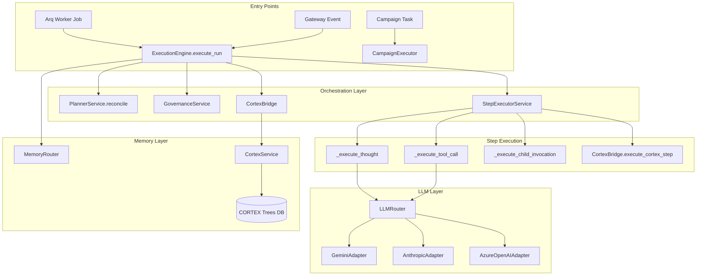
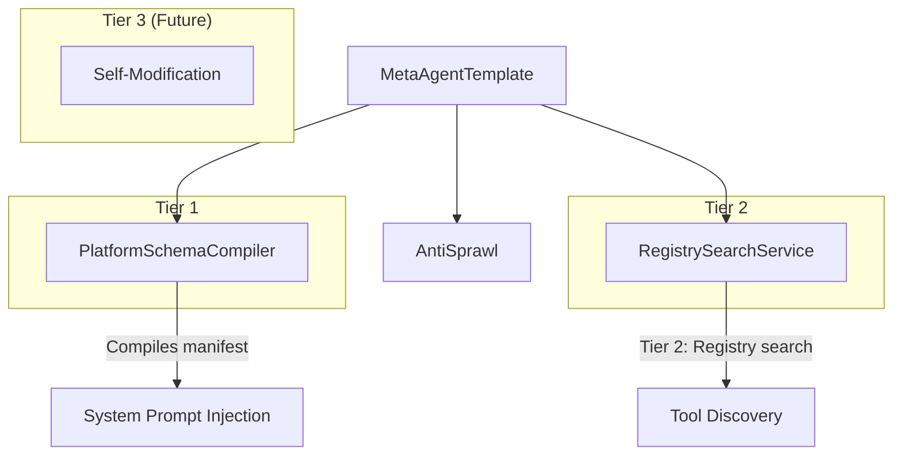

# Phase 10 — Agentic Loop Analysis: Execution Engine Deep-Dive

> Companion to [01_executive_summary.md](./01_executive_summary.md)

---

## 1. Execution Architecture Overview



---

## 2. `ExecutionEngine.execute_run()` — Control Flow Analysis

The main execution loop (worker.py:705–1216) follows this sequence:

### Phase 1: Initialization (Lines 705–745)
```
1. Fetch Run + Entity from DB
2. Initialize composed services (_ensure_services)
3. Configure logging level from entity.observability
4. Set status=RUNNING, generate trace_id
5. Publish RUNNING event to Redis
```

### Phase 2: Credit Gate (Lines 748–752)
```
6. GovernanceService.check_credit_gate()
   └─ Non-fatal: logs warning if DB fails, raises if insufficient
```

### Phase 3: CORTEX Tree Setup (Lines 757–845)
```
7. Determine tree mode:
   ├─ cortex_tree_id + subtree_root_id → Resume child (scoped subtree)
   ├─ cortex_tree_id only → Resume existing tree
   └─ None → Create fresh tree
8. Memory retrieval (MemoryRouter) — respects memory_scope:
   ├─ FULL / RUN_SCOPED → Full episodic + semantic
   ├─ INTELLIGENCE_ONLY → Only failure patterns
   └─ NONE → Skip
9. Inject CORTEX viewport + knowledge subtree into context_state
```

### Phase 4: Context Source Loading (Lines 848–968)
```
10. Load context_sources from entity.capabilities.context_engineering:
    ├─ CORTEX_TREE → Navigate and inject viewport
    ├─ KNOWLEDGE_BASE / DOCUMENT → Text extraction + injection
    └─ DB_RECORDS → Not implemented (logged warning)
11. Auto-ingest sources into CORTEX knowledge root
```

### Phase 5: Plan Reconciliation (Lines 970–976)
```
12. PlannerService.reconcile(run, entity, context_state)
    ├─ Static plan from entity.planning → validate + return
    └─ Dynamic plan → LLM generation + CHILD_ENTITY_INVOCATION injection
13. Store dynamic_plan on run record
```

### Phase 6: Step Execution (Lines 984–1142)
```
14. Two execution paths:
    ├─ DAG Mode (parallel steps detected):
    │   └─ _execute_steps_dag() → parallel batches with isolated sessions
    └─ Sequential Mode:
        └─ For each step:
            a. Skip if already in completed_steps set
            b. If autonomous + self_reflect → inject CORTEX knowledge
            c. Route by step type:
            │   ├─ NAVIGATE/READ/WRITE/RECURSE/AWAIT_CHILDREN → _execute_cortex_step
            │   └─ THOUGHT/ACTION/TOOL_CALL/CHILD_ENTITY_INVOCATION → _execute_step_wrapper
            d. On failure + autonomous → PlannerService.adapt_plan (re-plan)
            e. GovernanceService.consume_step_cost + circuit breaker
            f. Write step to CORTEX tree
            g. If autonomous + self_reflect → write reflection node
            h. Track completed_steps
            i. CortexBridge.refresh_viewport
            j. Auto-checkpoint every N steps
            k. Goal validation gate (autonomous mode)
            l. _should_exit check
```

### Phase 7: Finalization (Lines 1144–1216)
```
15. Set status=COMPLETED
16. Extract final output from last step result
17. Write to CORTEX output subtree
18. Write episodic memory
19. GovernanceService.settle_billing (TB formula)
20. Publish COMPLETED event
```

---

## 3. Critical Design Issues in the Loop

### 3.1 The 500-Line `execute_run` Problem

`execute_run` is **~500 lines** of inline procedural code with **7 phases**, **3 conditional branches**, and **~15 try/except blocks**. This violates the Single Responsibility Principle and makes the method:

- **Impossible to unit test** — you can't test Phase 5 without mocking Phases 1–4
- **Fragile to modify** — adding a new phase requires touching a 500-line method
- **Hard to reason about** — error handling for Phase 3 vs Phase 6 is interleaved

**Recommendation: Phase Pipeline Pattern**

```python
class ExecutionPipeline:
    """Each phase is a discrete, testable unit."""
    
    phases = [
        InitializationPhase,
        CreditGatePhase,
        CortexSetupPhase,
        ContextSourcePhase,
        PlanReconciliationPhase,
        StepExecutionPhase,
        FinalizationPhase,
    ]
    
    async def execute(self, run_id: UUID) -> dict:
        ctx = PipelineContext(run_id=run_id)
        for phase_cls in self.phases:
            phase = phase_cls(self.services)
            ctx = await phase.execute(ctx)
            if ctx.should_abort:
                break
        return ctx.result
```

### 3.2 DAG Execution: Session Isolation Complexity

The parallel step execution (`_execute_steps_dag`, lines 414–574) creates **a new `ExecutionEngine` instance per parallel step** with its own `AsyncSession`:

```python
async def _isolated_step(step_dict, frozen_ctx):
    async with AsyncSessionLocal() as isolated_db:
        isolated_engine = ExecutionEngine(isolated_db, self.redis, company_id=self.company_id)
        # ... execute step ...
        # Atomic cost/token increment (RACE-2 fix)
        await isolated_db.execute(
            update(ExecutionRun).where(...).values(
                total_cost_usd=ExecutionRun.total_cost_usd + step_cost,
            )
        )
```

**Issues:**
1. Each parallel step creates a **full `ExecutionEngine`** with all composed services — heavy instantiation
2. The `deep.copy(context_state)` for each parallel step is expensive for large contexts
3. Atomic DB increments for cost/tokens are correct but add N extra DB round-trips per batch
4. If one parallel step fails, `failures[0][1]` is raised — **discarding other failures' error details**

**Recommendation:**
- Create a lightweight `StepRunner` that only needs `StepExecutorService` + isolated session
- Use `asyncio.Semaphore` to limit parallelism
- Collect ALL failures into a `ParallelStepError` composite exception

### 3.3 The `_execute_step_wrapper` Responsibilities

This method (lines 576–689) handles **7 distinct concerns**:

1. HITL checkpoint evaluation (BEFORE)
2. Timeout enforcement
3. UncertaintySignal handling
4. HITL checkpoint evaluation (AFTER)
5. Review mechanism
6. Goal alignment verification + retry
7. Context storage

**Recommendation:** Convert to a middleware chain:

```python
step_middleware = [
    HITLBeforeMiddleware(governance),
    TimeoutMiddleware(timeout_ms),
    UncertaintyMiddleware(),
    HITLAfterMiddleware(governance),
    ReviewMiddleware(logic_gate),
    GoalAlignmentMiddleware(verifier),
    ContextStorageMiddleware(),
]
```

---

## 4. `RecursiveReasoningEngine` — Gap Analysis

### Current State (73 lines, worker.py:1879–1951)

The `RecursiveReasoningEngine` is an **experimental stub** that:
- Extends `ExecutionEngine`
- Implements DFS tree execution via `execute_tree(run, root_goal, context)`
- Expands goals via LLM decomposition (`_expand_goal`)
- Executes leaf goals as THOUGHT steps (`_execute_goal_leaf`)

### Critical Gaps

| Gap | Description | Impact |
|-----|-------------|--------|
| **No production entry point** | No arq job or API endpoint invokes `RecursiveReasoningEngine` | Cannot be used |
| **No depth limit** | Recursive expansion has no `max_depth` guard | Unbounded LLM calls |
| **No cost tracking** | `execute_tree` doesn't track/accumulate costs | Billing blind spot |
| **No CORTEX integration** | Doesn't write goals/results to CORTEX tree | Memory gap |
| **Hardcoded confidence=0.7** | Single threshold for all entity types | Inflexible |
| **No error handling** | If `_expand_goal` fails, goal silently becomes a leaf | Silent degradation |
| **`__init__` bug** | Calls `super().__init__(db, redis_pool)` but doesn't pass `company_id` to parent | Services not initialized |
| **Step naming** | Uses `leaf_{depth}` — not descriptive | Poor traceability |

### Production-Ready Design

```python
class RecursiveReasoningEngine:
    """
    Autonomous goal decomposition engine.
    
    Unlike the flat DAG executor, this engine:
    1. Takes a high-level goal
    2. Recursively decomposes it until sub-goals are atomic
    3. Executes leaves via StepExecutorService
    4. Synthesizes results bottom-up
    5. Writes the entire goal tree to CORTEX
    """
    
    MAX_DEPTH = 5
    MAX_TOTAL_EXPANSIONS = 20
    
    async def execute(self, run_id: UUID, goal: str) -> dict:
        root = GoalNode(goal=goal, depth=0)
        result = await self._execute_node(run, root, context)
        return {"output": result, "goal_tree": root.to_dict()}
    
    async def _execute_node(self, run, node, context) -> str:
        if node.depth >= self.MAX_DEPTH:
            return await self._execute_leaf(run, node, context)
        
        confidence = await self._assess_confidence(node, context)
        if confidence >= self._get_threshold(node):
            return await self._execute_leaf(run, node, context)
        
        children = await self._decompose(node, context)
        results = []
        for child in children:
            res = await self._execute_node(run, child, context)
            results.append(res)
            # Write to CORTEX after each child
            await self._write_goal_to_cortex(child, res)
        
        return await self._synthesize(node, results, context)
```

---

## 5. Meta-Agent Integration Analysis

### Current Meta-Agent Architecture



### Integration Gap: No Supervisory Loop

The Meta-Agent exists as an entity template that can be instantiated, but there is **no automatic supervisory invocation**. The execution engine doesn't:

1. Periodically invoke the Meta-Agent for efficacy review
2. Route "stuck" or low-confidence situations to the Meta-Agent
3. Use Meta-Agent recommendations to dynamically adjust execution parameters

**Recommended: Meta-Review Hooks**

```python
# In the sequential execution loop, after every N steps:
if step_idx > 0 and step_idx % meta_review_interval == 0:
    meta_review = await self._meta_agent.review_execution(
        goal=entity.goal,
        completed_steps=all_step_results,
        remaining_steps=steps[step_idx+1:],
        context_state=context_state,
    )
    if meta_review.recommendation == "REPLAN":
        steps = await self._planner.adapt_plan(...)
    elif meta_review.recommendation == "ABORT":
        raise MetaAgentAbort(meta_review.reason)
```

---

## 6. Step Type Coverage Matrix

| Step Type | Handler | CORTEX Integration | Billing | HITL Support | Tests |
|-----------|---------|-------------------|---------|-------------|-------|
| `THOUGHT` | `_execute_thought` | ✅ via step write | ✅ | ✅ | ❌ |
| `ACTION` | `_execute_thought` (same handler) | ✅ | ✅ | ✅ | ❌ |
| `TOOL_CALL` | `_execute_tool_call` | ✅ via ingestion | ✅ | ✅ | ❌ |
| `CHILD_ENTITY_INVOCATION` | `_execute_child_invocation` | ✅ | ✅ (child run) | ❌ | ❌ |
| `NAVIGATE` | `CortexBridge` | ✅ | ❌ | ❌ | ❌ |
| `READ` | `CortexBridge` | ✅ | ❌ | ❌ | ❌ |
| `WRITE` | `CortexBridge` | ✅ | ❌ | ❌ | ❌ |
| `RECURSE` | `CortexBridge` | ✅ | ❌ | ❌ | ❌ |
| `AWAIT_CHILDREN` | `CortexBridge` | ✅ | ❌ | ❌ | ❌ |

> **Key Finding:** Zero unit tests for any step type handler. This is a critical gap for a production agentic system.

---

> **Next:** See [04_refactoring_blueprint.md](./04_refactoring_blueprint.md) for the domain-driven restructuring plan.
