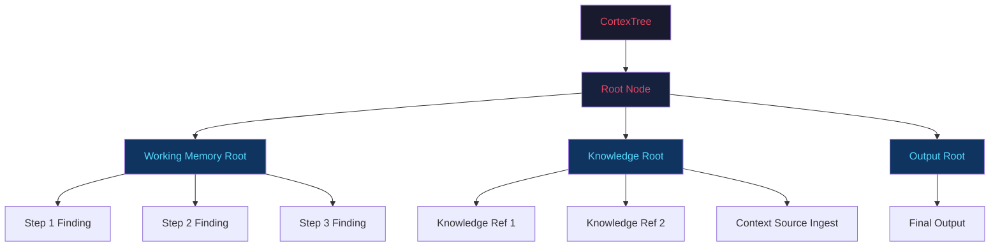

# Phase 10 — Memory Architecture: CORTEX & Cognitive Systems Deep-Dive

> Companion to [01_executive_summary.md](./01_executive_summary.md)

---

## 1. CORTEX Memory Architecture — Current State

### 1.1 Tree Hierarchy Model



### 1.2 Memory Domain Architecture

| Domain | Service | Tree Type | Purpose | Dreaming Phase |
|--------|---------|-----------|---------|---------------|
| **Episodic** | `EpisodicTreeService` | Per-entity | Raw execution records | Source data |
| **Knowledge** | `KnowledgeTreeService` | Per-entity | Persistent KB, documents | Reference only |
| **Experience** | `ExperienceTreeService` | Per-entity | Observations + patterns | Phase 1 + 2 |
| **Intelligence** | `IntelligenceTreeService` | Per-entity | Distilled rules | Phase 3 |

### 1.3 The Dreaming Pipeline


**Assessment:** The 3-phase dreaming pipeline is well-architected. The progression from raw episodes → observations → patterns → rules mirrors established cognitive science models.

---

## 2. Memory Retrieval: The Dual-System Problem

### 2.1 `MemoryRouter` (v1 — Currently Active)

```python
class MemoryRouter:
    """3-tier memory retrieval."""
    
    async def retrieve(entity_id, user_id, tree_id, ...) -> dict:
        # 1. Working: Recent context from CORTEX viewport
        # 2. Episodic: Interaction history from EpisodicTreeService
        # 3. Semantic: Embedding-based search across knowledge
        return {"working": ..., "episodic": ..., "semantic": ...}
```

**Used in:** `ExecutionEngine.execute_run()` (worker.py:799–805)

### 2.2 `MemoryAssemblyService` (v2 — Not Integrated)

```python
class MemoryAssemblyService:
    """4-domain memory assembly."""
    
    async def assemble_runtime_memory(entity_id, task_description, ...) -> MemoryAssemblyResult:
        # 1. Knowledge: SemanticGraphService search + runtime ref creation
        # 2. Experience: Pattern/observation retrieval
        # 3. Intelligence: Applicable rules retrieval
        # 4. Episodic: Recent + topic-relevant episodes
        return MemoryAssemblyResult(
            knowledge_refs=[...],
            experience_suggestions=[...],
            intelligence_rules=[...],
            episodic_context=[...],
            formatted_prompt="...",
        )
```

**Used in:** Nowhere (designed but not wired)

### 2.3 Comparison Matrix

| Feature | MemoryRouter (v1) | MemoryAssemblyService (v2) |
|---------|-------------------|---------------------------|
| **Knowledge retrieval** | Basic embedding search | SemanticGraphService with graph expansion |
| **Experience injection** | ❌ Not supported | ✅ Pattern + observation suggestions |
| **Intelligence rules** | ❌ Not supported | ✅ Applicable rules from Intelligence tree |
| **Episodic context** | ✅ Recent history | ✅ Recent + topic-relevant (semantic) |
| **CORTEX runtime refs** | ❌ | ✅ Creates reference nodes in runtime tree |
| **Prompt formatting** | `format_for_prompt()` — flat text | `_format_assembled_memory()` — structured sections |
| **Production status** | ✅ Active | ❌ Unused |

### 2.4 Resolution Plan

The `MemoryAssemblyService` is strictly superior. Migration path:

1. Add feature flag `memory_pipeline: "v2"` to entity config
2. Wire v2 into `execute_run` alongside v1
3. A/B validate that v2 produces equivalent or better context
4. Deprecate v1 in Phase 11

---

## 3. CortexBridge — Interface Analysis

### 3.1 Responsibilities

The `CortexBridge` (26 KB, 649 lines) serves as the **interface layer** between the execution engine and CORTEX:

| Method | Purpose | Called By |
|--------|---------|-----------|
| `build_task_description` | Entity → task description text | `ExecutionEngine` |
| `write_step` | Step result → CORTEX working memory node | `ExecutionEngine` |
| `ingest_tool_result` | Tool output → CORTEX knowledge node | `StepExecutorService` |
| `execute_cortex_step` | NAVIGATE/READ/WRITE/RECURSE handlers | `ExecutionEngine` |
| `refresh_viewport` | Update viewport in context_state | `ExecutionEngine` |
| `write_checkpoint` | Persist tree state for resumption | `ExecutionEngine` |
| `write_reflection` | Self-reflection node in CORTEX | `ExecutionEngine` |
| `get_relevant_knowledge` | Semantic search in CORTEX knowledge | `ExecutionEngine` |
| `resolve_node_id` | Step target → node UUID | `ExecutionEngine` |
| `update_context_size` | Track incremental context growth | `_store_step_output` |

### 3.2 Issues

| Issue | Description | Fix |
|-------|-------------|-----|
| `CortexBridge` does too much | Combines IO (write_step) + orchestration (execute_cortex_step) + query (get_relevant_knowledge) | Split into `CortexWriter`, `CortexReader`, `CortexStepHandler` |
| Direct CORTEX service usage in `execute_run` | Lines 763–793 use `CortexService` directly instead of bridge | Route all CORTEX ops through bridge |
| Context size tracking is side-effect | `update_context_size` mutates internal state from helper function | Make explicit via return value |

---

## 4. Semantic Graph Layer

### 4.1 `SemanticGraphService` Architecture

The semantic graph (14 KB) provides **associative, weighted navigation** across memory domains:

```python
class SemanticGraphService:
    async def semantic_graph_search(query, entity_id, domains, top_k, graph_expansion_depth):
        # 1. Embed query
        # 2. Vector similarity search within specified domains
        # 3. Graph expansion: follow CortexEdge relations
        # 4. Re-rank by combined score (embedding similarity + edge weight)
        return ranked_results
    
    async def auto_create_edges(node):
        # 1. Find semantically similar nodes (> GRAPH_SIMILARITY_THRESHOLD)
        # 2. Create weighted edges (max GRAPH_MAX_AUTO_EDGES_PER_NODE)
        # 3. Apply weight decay to existing edges
```

### 4.2 Configuration Constants (from `constants.py`)

```python
GRAPH_SIMILARITY_THRESHOLD = 0.85      # Min cosine similarity for auto-edge
GRAPH_MAX_AUTO_EDGES_PER_NODE = 5      # Prevent edge explosion
GRAPH_WEIGHT_DECAY_RATE = 0.95         # Temporal decay per access
GRAPH_MIN_EDGE_WEIGHT = 0.01           # Prune threshold
GRAPH_MAX_EXPANSION_DEPTH = 2          # BFS expansion depth
```

**Assessment:** Well-parameterized. The decay/prune mechanism prevents unbounded graph growth. Could benefit from **configurable thresholds per entity type** (agents need broader search; actions need precision).

---

## 5. Memory Scope Configurations

### 5.1 Current Scopes (from `execute_run`)

```python
memory_scope = memory_config.get("memory_scope", "FULL")

# FULL: All episodic + semantic + knowledge
# RUN_SCOPED: Same as FULL but filtered to current run's tree
# INTELLIGENCE_ONLY: Only distilled rules + failure patterns
# NONE: No memory injection
```

### 5.2 Missing Scope: `KNOWLEDGE_ONLY`

For entities that need reference knowledge but not past execution history (e.g., document generators, report writers), there's no `KNOWLEDGE_ONLY` scope. They must use either `FULL` (too much episodic noise) or `INTELLIGENCE_ONLY` (no knowledge refs).

**Recommendation:** Add `KNOWLEDGE_ONLY` scope:
```python
elif _memory_scope == "KNOWLEDGE_ONLY":
    # Knowledge + Intelligence, no episodic
    assembler = MemoryAssemblyService(self.db, entity.company_id)
    result = await assembler.assemble_runtime_memory(
        entity_id=entity.id,
        include_domains=["knowledge", "intelligence"],
    )
```

---

## 6. Context Integrity & State Management

### 6.1 Context State Evolution

The `context_state` dict evolves through the execution lifecycle:

```
Phase 1: input_data.copy()                    # User input
Phase 2: + __memory__                          # Episodic/semantic memory
Phase 3: + __cortex_viewport__                 # CORTEX tree viewport
         + __cortex_tree_id__                  # Tree reference
         + __cortex_knowledge__                # Knowledge subtree
Phase 4: + __context_sources__                 # Loaded documents/KBs
Phase 5: + step_1, step_2, ...                 # Step outputs
         + __completed_steps__                 # Resume tracking
         + __goal_check_counter__              # Goal validation counter
Phase 6: Sanitized for persistence             # Strip sensitive keys
```

### 6.2 Internal Key Management

Two overlapping mechanisms strip internal keys:

1. **`INTERNAL_CONTEXT_KEYS`** (constants.py:31–53): 21 keys, used for prompt filtering
2. **`_sanitize_context_for_persistence`** (worker.py:362–379): Strips sensitive keys before DB write

**Issue:** These serve different purposes but their naming suggests overlap. A developer might think `INTERNAL_CONTEXT_KEYS` is for sanitization.

**Recommendation:** Rename to clarify intent:
- `INTERNAL_CONTEXT_KEYS` → `PROMPT_EXCLUDED_KEYS` (keys to strip before sending to LLM)
- `_SENSITIVE_CONTEXT_KEYS` → keep as-is (keys to strip before DB persistence)
- Add `ALL_EXCLUDED_KEYS = PROMPT_EXCLUDED_KEYS | _SENSITIVE_CONTEXT_KEYS` for comprehensive filtering

---

## 7. Dreaming Engine — Production Readiness

### 7.1 Strengths
- Clean 3-phase pipeline with well-defined boundaries
- Configurable thresholds (`MIN_EPISODES`, `CONFIDENCE_THRESHOLD`, etc.)
- Embedding-based clustering for pattern recognition
- CortexEdge creation for graph traversal

### 7.2 Gaps

| Gap | Description | Impact |
|-----|-------------|--------|
| **No scheduling integration** | `_should_run` checks time but nothing triggers it | Dreaming never runs automatically |
| **LLMRouter instantiated 3×** | Lines 152, 245, 336 create new instances | Wasted initialization |
| **No deduplication** | Same observation can be extracted multiple times | Knowledge bloat |
| **Clustering is O(n²)** | Greedy pairwise comparison in `_cluster_observations` | Slow for large observation sets |
| **No quality gate** | Distilled rules are stored without validation | Low-quality rules pollute Intelligence tree |

### 7.3 Recommended Improvements

```python
class DreamingEngine:
    def __init__(self, db, company_id, llm_router=None):
        self.db = db
        self.company_id = company_id
        # Accept LLMRouter via DI — single instance
        self._llm = llm_router or LLMRouter(db=db, company_id=company_id)
    
    async def dream(self, entity_id, force=False):
        # 1. Deduplication check before extraction
        existing_obs = await self._get_existing_observation_hashes(entity_id)
        
        # 2. Quality gate: validate rules before writing
        for rule in rules:
            if await self._validate_rule(rule, entity_id):
                await self._write_rule(rule)
```

---

## 8. Memory Architecture Recommendations Summary

| # | Recommendation | Priority | Effort |
|---|---------------|----------|--------|
| 1 | Wire `MemoryAssemblyService` into execution loop behind feature flag | 🔴 P0 | Medium |
| 2 | Add `KNOWLEDGE_ONLY` memory scope | 🟠 P1 | Low |
| 3 | Split `CortexBridge` into Reader/Writer/StepHandler | 🟠 P1 | Medium |
| 4 | Rename internal key sets for clarity | 🟡 P2 | Low |
| 5 | Add dreaming schedule trigger (arq cron job) | 🟠 P1 | Low |
| 6 | DI for `LLMRouter` in `DreamingEngine` | 🟡 P2 | Low |
| 7 | Observation deduplication via content hashing | 🟡 P2 | Medium |
| 8 | Quality gate for Intelligence rule distillation | 🟡 P2 | Medium |
| 9 | Route all CORTEX operations through `CortexBridge` in `execute_run` | 🟠 P1 | Low |
| 10 | Configurable graph thresholds per entity type | 🟡 P2 | Medium |

---

## End of Phase 10 Architectural Review

### Document Index (Complete)

| # | File | Scope |
|---|------|-------|
| 01 | [01_executive_summary.md](./01_executive_summary.md) | Top-level findings, severity matrix, roadmap |
| 02 | [02_structural_audit.md](./02_structural_audit.md) | File-by-file audit, redundancy map, coupling analysis |
| 03 | [03_agentic_loop_analysis.md](./03_agentic_loop_analysis.md) | Execution engine, DAG, RecursiveReasoningEngine |
| 04 | [04_refactoring_blueprint.md](./04_refactoring_blueprint.md) | Domain-driven restructuring plan, migration steps |
| 05 | [05_memory_architecture.md](./05_memory_architecture.md) (this file) | CORTEX, memory silos, dreaming engine |
