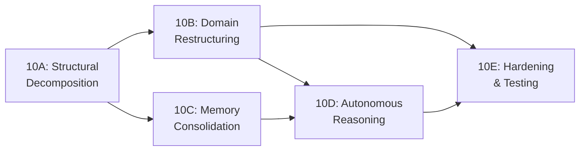

# Phase 10 — Implementation Plan: Master Overview

> **Status:** Draft | **Created:** 2026-05-19  
> **Based on:** Phase 10 Architectural Review (01–05)  
> **Estimated Duration:** 4–5 weeks across 5 phases

---

## Document Index

| Phase | File | Scope | Est. Effort | Risk |
|-------|------|-------|-------------|------|
| **Overview** | `impl_00_overview.md` (this) | Master plan, dependencies, risk management | — | — |
| **10A** | `impl_10A_structural_decomposition.md` | Extract from `worker.py`, break circular imports | 5–6 days | Medium |
| **10B** | `impl_10B_domain_restructuring.md` | Domain packages, LLM dedup, shared utils | 4–5 days | Medium |
| **10C** | `impl_10C_memory_consolidation.md` | Wire MemoryAssemblyService, CortexBridge cleanup | 3–4 days | Medium-High |
| **10D** | `impl_10D_autonomous_reasoning.md` | RecursiveReasoningEngine, Meta-Agent hooks, GoalGuard | 4–5 days | High |
| **10E** | `impl_10E_hardening_testing.md` | Error taxonomy, test scaffolding, observability | 3–4 days | Low |

---

## 1. Execution Order & Dependencies

**Critical path:** 10A → 10B → 10D → 10E

- **10A must complete first:** All subsequent phases depend on `worker.py` being decomposed.
- **10B and 10C can run in parallel** after 10A completes.
- **10D depends on both 10B and 10C:** Autonomous reasoning needs the clean domain packages AND the consolidated memory system.
- **10E is the final polish:** Error taxonomy, tests, and observability wrap everything up.

---

## 2. Pre-Execution Checklist

Before starting any phase:

- [ ] Create a Git branch `phase10/restructuring` from `main`
- [ ] Verify arq worker starts cleanly: `cd backend && python -m arq src.ai.worker.WorkerSettings`
- [ ] Verify all existing imports resolve: `python -c "from src.ai.worker import ExecutionEngine"`
- [ ] Take database backup (existing entities/runs should not be affected, but safety first)
- [ ] Confirm no in-flight execution runs: `SELECT count(*) FROM execution_runs WHERE status = 'RUNNING'`

---

## 3. External Consumer Inventory

Files **outside** `/ai/` that import from the AI package (must be updated during migration):

| Consumer File | Current Import | Phase Updated |
|--------------|----------------|---------------|
| `src/gateway/dispatcher.py:270` | `from src.ai.worker import ExecutionEngine` | 10A |
| `src/ai/cortex_bridge.py:25` | `from src.ai.worker import parse_variables` | 10A |
| `src/ai/step_executor.py:36–41` | `from src.ai.worker import parse_variables, build_sandwich_prompt, filter_context_for_step, UncertaintySignal, DEFAULT_REVIEW_PROMPT` | 10A |
| `src/ai/episodic_tree_service.py:163` | `from src.ai.memory_service import _summarize` | 10C |

---

## 4. Rollback Strategy

Each phase produces a self-contained commit. If a phase introduces regressions:

1. **Immediate:** Revert the phase commit, re-deploy `worker.py` in its pre-phase state.
2. **Backward-compat shims** (Phase 10A–10B) ensure old import paths continue to work for 1 release cycle.
3. **Feature flags** (Phase 10C–10D) allow toggling new behavior without code revert.

---

## 5. Validation Gates

Each phase must pass these gates before the next phase begins:

| Gate | Verification Method |
|------|-------------------|
| **arq worker starts** | `python -m arq src.ai.worker.WorkerSettings` exits cleanly |
| **Import resolution** | `python -c "from src.ai.worker import ExecutionEngine; from src.ai.step_executor import StepExecutorService"` |
| **Execution test** | Trigger a test entity execution via API and verify COMPLETED status |
| **No regressions** | All existing entity types (ACTION, SKILL, AGENT, PROCESS) execute correctly |
| **CORTEX integration** | Verify CORTEX tree creation, viewport, and checkpoint writing |

---

## 6. Files Inventory: What Moves Where

### Phase 10A: Extractions from `worker.py`

| Source (worker.py lines) | Target | Type |
|--------------------------|--------|------|
| 59–76 (`UncertaintySignal`) | `ai/core/exceptions.py` | [NEW] |
| 79–98 (`_store_step_output`) | `ai/core/context_utils.py` | [NEW] |
| 100–137 (`GoalNode`) | `ai/schemas.py` | [APPEND] |
| 139–184 (`parse_variables`) | `ai/core/prompt_utils.py` | [NEW] |
| 187–290 (`build_sandwich_prompt`) | `ai/core/prompt_utils.py` | [NEW] |
| 293–353 (`filter_context_for_step`) | `ai/core/prompt_utils.py` | [NEW] |
| 362–379 (`_sanitize_context_for_persistence`) | `ai/core/context_utils.py` | [NEW] |
| 384–1307 (`ExecutionEngine`) | `ai/core/execution_engine.py` | [NEW] |
| 1310–1877 (arq jobs + event handlers) | `ai/core/arq_jobs.py` | [NEW] |
| 1879–1951 (`RecursiveReasoningEngine`) | `ai/core/recursive_engine.py` | [NEW] (Phase 10D) |
| 1954–1992 (`WorkerSettings`) | Stays in `worker.py` | [KEEP] |

### Phase 10B: Domain Package Migrations

| Source (current location) | Target Package |
|---------------------------|---------------|
| `ai/cortex_service.py` | `ai/memory/cortex_service.py` |
| `ai/cortex_bridge.py` | `ai/memory/cortex_bridge.py` |
| `ai/cortex_models.py` | `ai/memory/cortex_models.py` |
| `ai/cortex_ingestion.py` | `ai/memory/cortex_ingestion.py` |
| `ai/memory_service.py` | `ai/memory/memory_service.py` |
| `ai/memory_assembly_service.py` | `ai/memory/memory_assembly.py` |
| `ai/episodic_tree_service.py` | `ai/memory/episodic_tree_service.py` |
| `ai/experience_tree_service.py` | `ai/memory/experience_tree_service.py` |
| `ai/intelligence_tree_service.py` | `ai/memory/intelligence_tree_service.py` |
| `ai/knowledge_tree_service.py` | `ai/memory/knowledge_tree_service.py` |
| `ai/embedding_service.py` | `ai/memory/embedding_service.py` |
| `ai/graph_service.py` | `ai/memory/graph_service.py` |
| `ai/dreaming_engine.py` | `ai/memory/dreaming_engine.py` |
| `ai/planner_service.py` | `ai/planning/planner_service.py` |
| `ai/goal_alignment.py` | `ai/planning/goal_alignment.py` |
| `ai/governance_service.py` | `ai/governance/governance_service.py` |
| `ai/rate_limiter.py` | `ai/governance/rate_limiter.py` |
| `ai/llm_router.py` | `ai/llm/router.py` |

---

## 7. Risk Register

| # | Risk | Probability | Impact | Mitigation | Owner |
|---|------|------------|--------|------------|-------|
| R1 | Circular import resurfaces in new structure | High | Medium | Forward-ref protocol + lazy imports where needed | 10A |
| R2 | arq `WorkerSettings.functions` list breaks | Medium | Critical | Keep arq entrypoint in `worker.py`; only move inner logic | 10A |
| R3 | `CreditService` direct import in `step_executor.py` bypasses GovernanceService | Low | Medium | Route through GovernanceService in 10B | 10B |
| R4 | `MemoryAssemblyService` produces different context than `MemoryRouter` | Medium | High | Feature flag + A/B comparison in 10C | 10C |
| R5 | `RecursiveReasoningEngine` runaway costs | Medium | Critical | `MAX_DEPTH=5`, `MAX_EXPANSIONS=20`, cost ceiling per goal | 10D |
| R6 | Import path changes break third-party integrations | Low | Low | Backward-compat shims in original file locations | 10B |

---

> **Next:** [impl_10A_structural_decomposition.md](./impl_10A_structural_decomposition.md) — Start here.
