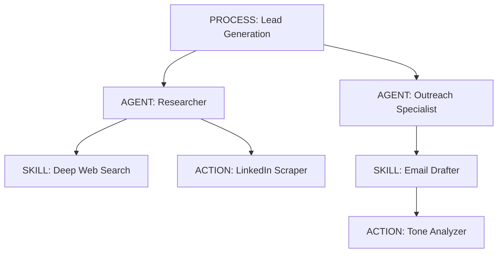

# AI Technical Overview

This document provides a comprehensive technical overview of the AI Module in Phase 3. The architecture transitions from simple agents to a **Hierarchical Recursive Agentic Framework**, enabling complex multi-step processes through nested entities.

---

## 1. Unified Entity Data Structure

The core of the AI module is the `HierarchicalEntity`. It uses a unified schema to represent all levels of AI logic: **Action, Skill, Agent, and Process**.

### Core Fields (`hierarchical_entities` Table)

| Field | Type | Description |
| :--- | :--- | :--- |
| `id` | UUID | Unique identifier (Primary Key). |
| `company_id` | UUID | FK to `companies`. Identifies the owner of the entity. |
| `parent_id` | UUID | FK to `hierarchical_entities`. Indicates the structural parent (optional). |
| `type` | Enum | `ACTION`, `SKILL`, `AGENT`, `PROCESS`. |
| `status` | Enum | `DRAFT`, `ACTIVE`, `DEPRECATED`, `ARCHIVED`. |
| `version` | String | SemVer format (e.g., `1.0.0`) for tracking logic iterations. |
| `name` | String | Internal slug/name used for referencing in code/plans. |
| `display_name` | String | User-friendly name displayed in the UI. |
| `description` | Text | High-level description of what the entity does. |
| `tags` | JSONB | List of strings for categorization. |
| `is_active` | Boolean | Legacy flag for quick enablement/disablement. |

---

### Detailed JSONB Modules

The power of the entity lies in its modular JSONB configuration blocks.

#### A. Identity (`identity`)
Defines the persona and behavioral boundaries.
- **`system_prompt`**: The primary instruction set for the LLM.
- **`examples`**: A list of `scenario` and `ideal_response` pairs for few-shot prompting.
- **`behavioral_constraints`**: Specific "Do's and Don'ts" (e.g., "Never mention competitors").

#### B. Hierarchy (`hierarchy`)
Defines structural relationships.
- **`parent_id`**: Reference to a higher-level entity.
- **`children`**: List of child objects containing:
  - `child_id`: UUID of the sub-entity.
  - `child_type`: Type of the child.
  - `relationship`: `SEQUENTIAL`, `PARALLEL`, or `CONDITIONAL`.
  - `condition`: Logical expression to determine if the child should be invoked.
- **`is_atomic`**: Boolean. If true, the entity has no internal sub-steps.
- **`composition_depth`**: Tracked depth of recursion.

#### C. Logic Gate (`logic_gate`)
Configures the reasoning and reliability of the entity.
- **`reasoning_config`**:
  - `model_provider`: e.g., `google`, `openai`.
  - `model_name`: e.g., `gemini-1.5-pro`.
  - `temperature`: Creativity control (0.0 to 1.0).
  - `reasoning_mode`: `REACT`, `CoT`, `REFLECTION`, `ToT`.
- **`retry_policy`**:
  - `max_retries`: Number of attempts on failure.
  - `backoff_strategy`: `EXPONENTIAL`, `LINEAR`, or `NONE`.
  - `retry_on`: Events that trigger retries (e.g., `TOOL_FAILURE`, `TIMEOUT`).
- **`review_mechanism`**:
  - `enabled`: Toggle for self-critique.
  - `review_prompt`: Instructions for the "Critic" LLM.
  - `success_criteria`: Nested list of `criterion` and `validation_type` (e.g., `REGEX`, `LLM_JUDGE`).

#### D. Planning (`planning`)
Defines how the entity executes tasks.
- **`static_plan`**: 
  - `enabled`: Boolean.
  - `steps`: List of `PlanStep` objects.
    - `step_id`: Unique ID for the step.
    - `order`: Execution sequence.
    - `type`: `THOUGHT`, `ACTION`, `TOOL_CALL`, `CHILD_ENTITY_INVOCATION`.
    - `target`: Mapping to a specific `tool_id`, `entity_id`, or `prompt_template`.
    - `exit_conditions`: Logic for jumping to steps or terminating early.
- **`dynamic_planning`**:
  - `enabled`: Allows LLM to generate or modify the plan at runtime.
  - `reconciliation_strategy`: `HYBRID` (uses static as base), `STRICT`, or `DYNAMIC_ONLY`.
- **`loop_control`**:
  - `max_iterations`: Cap for cyclic processes.
  - `convergence_criteria`: Conditions to stop a loop (e.g., "Similarity > 0.9").

#### E. Capabilities (`capabilities`)
Defines the "tools" and "senses" available.
- **`tools`**: List of `ToolReference` (IDs like `gmail_search`, `web_scraper`).
- **`memory`**:
  - `enabled`: Boolean.
  - `scope`: `SESSION`, `ENTITY`, or `GLOBAL`.
  - `storage_backend`: `POSTGRES_JSONB` or `VECTOR_DB`.
- **`context_engineering`**:
  - `max_context_tokens`: Limit on input size.
  - `context_priority`: Order of precedence for data (e.g., `[SYSTEM_PROMPT, STATIC_PLAN]`).

#### F. Governance (`governance`)
Compliance and safety barriers.
- **`max_cost_usd`**: Hard budget limit for a single execution run.
- **`timeout_ms`**: Maximum execution time before auto-termination.
- **`max_recursion_depth`**: Prevents infinite loops in hierarchical calls.
- **`hitl_checkpoints`**: List of triggers requiring human approval.

#### G. IO Contract (`io_contract`)
Ensures structural integrity of data flow.
- **`input_schema`**: JSON Schema defining expected input fields.
- **`output_schema`**: JSON Schema for the final result.

#### H. Observability (`observability`)
- **`log_level`**: `DEBUG`, `INFO`, `WARN`, `ERROR`.
- **`log_thoughts`**: If true, internal "REASONING" steps are persisted.
- **`track_cost`**: Enables granular usage logging.

---

## 2. Execution Logic & State Management

Execution is handled by the `ExecutionEngine` in `src/ai/worker.py`.

### The `ExecutionRun` Lifecycle
1.  **PENDING**: Job created and enqueued to Redis/Arq.
2.  **RUNNING**: Worker picks up job, initializes `context_state`.
3.  **PLANNING**: Engine reconciles `static_plan` with entity instructions.
4.  **STEP_EXECUTION**: Iterative processing of steps.
    - **Thought Step**: LLM call for reasoning.
    - **Tool Step**: Execution of a plugin (e.g., `Scraper`).
    - **Child Invocation**: **Recursive call** to another entity.
5.  **COMPLETED/FAILED**: Result persisted; status updated.

### Variable Resolution (`parse_variables`)
The engine dynamically replaces placeholders in prompts:
- `{{input}}`: Original task input.
- `{{step_name.output}}`: Result from a specific preceding step.
- `{{context.key}}`: Data from the shared internal state.

---

## 3. Recursive Architecture (Hierarchy)

A key differentiator of this module is its recursive nature.

When a **Process** invokes an **Agent**, the system creates a **Child Execution Run**. Metrics (tokens, cost) from the child are "rolled up" into the parent's total, providing a holistic view of the execution cost.

---

## 4. Tools and Plug-ins

Tools are modular and registered in `src/ai/tools/`.

| Tool Category | Key Tools |
| :--- | :--- |
| **Communication** | `gmail_tool`, `email_sender` |
| **Research** | `google_search`, `web_scraper` |
| **Data Processing** | `excel_processor`, `csv_parser` |
| **Compute** | `calculator`, `json_formatter` |
| **RAG** | `document_retriever` (via logic in `AIService`) |

---

## 5. Costing & SKU Pipeline

The `UsageService` ensures every token spent is tracked.

1.  **SKU Map**: Models are mapped to SKUs in `IntegrationRegistry` (e.g., `gemini-1.5-pro-in`).
2.  **Telemetry**: After every LLM response, the worker sends `prompt_tokens` and `completion_tokens` to `log_usage`.
3.  **Calculation**: `calculated_cost = (quantity * internal_cost) / unit`.
4.  **Log Persistence**: Data is saved to `usage_logs` table for billing and dashboard stats.

---

## 6. Significance of Backend Files

| File | Primary Responsibility |
| :--- | :--- |
| `models.py` | Data Persistence (SQLAlchemy). |
| `schemas.py` | Structure & Validation (Pydantic). The "Source of Truth" for Entity structure. |
| `worker.py` | **Core Runtime Engine**. Recursive logic, state management, and retry handling. |
| `service.py` | API Layer logic. CRUD, Search (RAG), and Job Initialization. |
| `tool_executor.py`| Parsing LLM text to extract and run tool commands. |
| `usage_service.py` | Billing and Token tracking calculations. |
| `router.py` | REST API Endpoints (`/entities`, `/executions`). |

---

## 7. RAG (Retrieval Augmented Generation)

The AI module supports document-level intelligence:
- **Embeddings**: Documents are chunked and embedded using `gemini-embedding-004`.
- **Vector Search**: Uses `pgvector` for cosine similarity searches within `AIService.search_documents`.
- **Context Injection**: Search results are passed as "External Knowledge" into the LLM context during execution.
