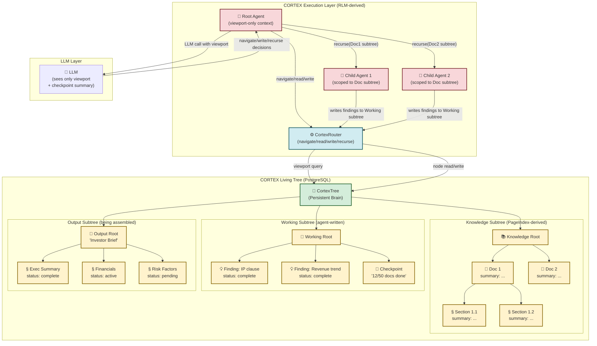

# CORTEX: A Unified Memory Technique for Unbounded Agent Cognition
### Merging PageIndex and Recursive Language Models into a Single Coherent Architecture

**Document Type:** Novel Technique Proposal  
**Version:** 1.0  
**Date:** March 2026  
**Author:** HireBuddha Architecture Team  

---

## Preface: The Question Behind This Document

PageIndex and RLM each solve one dimension of the long-context problem independently. PageIndex asks: *"How does an LLM navigate a large knowledge space without reading all of it?"* RLM asks: *"How does an LLM process context that is larger than its window, without degrading?"* Both are powerful. But neither alone answers a harder, combined question:

> **How does an agent work continuously for days — reading enormous inputs, building living knowledge, and writing arbitrarily long outputs — without ever filling its context window or losing track of where it is?**

This document argues that PageIndex and RLM are not merely compatible — they are **two projections of the same underlying idea**, and that merging them produces something categorically more powerful than either alone. That merged technique is **CORTEX**.

---

## Table of Contents

1. [Why the Two Techniques Are Actually One Idea](#1-why-the-two-techniques-are-actually-one-idea)
2. [CORTEX: The Unified Technique](#2-cortex-the-unified-technique)
   - 2.1 [Name and Core Metaphor](#21-name-and-core-metaphor)
   - 2.2 [The Central Insight: The Tree IS the Context](#22-the-central-insight-the-tree-is-the-context)
   - 2.3 [How CORTEX Subsumes Both PageIndex and RLM](#23-how-cortex-subsumes-both-pageindex-and-rlm)
3. [The CORTEX Data Model: The Living Tree](#3-the-cortex-data-model-the-living-tree)
   - 3.1 [Node Types and Schema](#31-node-types-and-schema)
   - 3.2 [Tree Invariants](#32-tree-invariants)
4. [The CORTEX Execution Model](#4-the-cortex-execution-model)
   - 4.1 [The Three Primitives](#41-the-three-primitives)
   - 4.2 [Context Budget Scoping](#42-context-budget-scoping)
   - 4.3 [The Agent's View at Any Moment](#43-the-agents-view-at-any-moment)
5. [Solving the Three Requirements](#5-solving-the-three-requirements)
   - 5.1 [Extremely Long Inputs](#51-extremely-long-inputs)
   - 5.2 [Extremely Long Outputs](#52-extremely-long-outputs)
   - 5.3 [Days-Long Continuous Operation](#53-days-long-continuous-operation)
6. [The Full Architecture Diagram](#6-the-full-architecture-diagram)
7. [Worked Example: A 72-Hour Research and Report Task](#7-worked-example-a-72-hour-research-and-report-task)
8. [The CORTEX API: Seven Operations](#8-the-cortex-api-seven-operations)
9. [How CORTEX Maps to HireBuddha's Existing Stack](#9-how-cortex-maps-to-hireboddhas-existing-stack)
10. [CORTEX vs. Alternatives: A Precise Comparison](#10-cortex-vs-alternatives-a-precise-comparison)
11. [Open Problems and Research Directions](#11-open-problems-and-research-directions)
12. [References](#12-references)

---

## 1. Why the Two Techniques Are Actually One Idea

Before describing CORTEX, it is worth showing *why* the merge is not just convenient — it is inevitable.

### PageIndex's Hidden Limitation

PageIndex ([github.com/VectifyAI/PageIndex](https://github.com/VectifyAI/PageIndex)) solves retrieval brilliantly. By building a hierarchical tree index of a document and using LLM reasoning to navigate it, it achieves 98.7% accuracy on FinanceBench — far above any vector-based approach. But PageIndex is a **read-only retrieval tool**. Once the tree is built, it is static. The tree does not grow. The agent cannot write to it. The agent cannot use the tree as its working scratchpad. The tree is a map of what existed *before* the agent started — it captures no knowledge the agent discovers *during* execution.

More critically, PageIndex says nothing about what happens *after* the relevant section is retrieved. The agent still has to do something with the retrieved content, and if that something involves many retrieved sections combined with intermediate reasoning, long tool outputs, and growing result state, the agent's context window still fills up. PageIndex solves *where to look*. It does not solve *how to think for a long time*.

### RLM's Hidden Limitation

RLM ([arxiv.org/abs/2512.24601v1](https://arxiv.org/abs/2512.24601v1)) solves unbounded processing brilliantly. By storing context as a Python variable in a REPL environment and allowing the LLM to spawn recursive sub-calls over slices of that context, it can handle 10M+ tokens without any single LLM call seeing more than a bounded window. But the REPL environment is **structurally flat**. The context is a blob of text stored in a variable. When the LLM wants to "navigate" the context, it must write code to do so — using `regex`, string slicing, or keyword search. It has no understanding of the semantic structure of what it is navigating. This is fine for homogeneous data (a list of rows, a sequence of documents). It is inefficient and fragile for structured, hierarchical professional documents where the important relationships are between sections, not between lines of text.

Furthermore, RLM's REPL environment is ephemeral by design — it exists for the duration of a single query. There is no mechanism for an RLM session to be interrupted, checkpointed, and resumed days later. The REPL environment does not persist.

### The Two Limitations Cancel Each Other

The remarkable thing is that each technique's weakness is exactly the other's strength:

| Dimension | PageIndex | RLM | CORTEX (Merged) |
|-----------|-----------|-----|-----------------|
| Navigates structured knowledge | ✅ Reasoning-based tree search | ❌ Flat text REPL, regex navigation | ✅ Tree-native navigation |
| Handles arbitrarily large context | ❌ Retrieves from fixed corpus | ✅ Recursive decomposition over any context | ✅ Both |
| Writable during execution | ❌ Read-only index | ✅ REPL is writable | ✅ Tree is writable |
| Persists across sessions | ❌ Index persists; execution does not | ❌ REPL is ephemeral | ✅ Tree is durable in DB |
| Builds long-form output | ❌ Not designed for it | ⚠️ Can output via REPL variable | ✅ Output IS part of the tree |
| Enables multi-day operation | ❌ | ❌ | ✅ Tree as persistent brain |

The merge is not additive. It is multiplicative. The tree structure gives RLM's recursive model a navigational intelligence it cannot have on its own, and RLM's recursive execution model gives PageIndex's tree structure the ability to be written, extended, and traversed across unbounded time and context.

---

## 2. CORTEX: The Unified Technique

### 2.1 Name and Core Metaphor

**CORTEX** stands for **C**ognitive **O**rchestrated **R**ecursive **T**ree **EX**ecution.

The biological metaphor is intentional. The cerebral cortex is not a storage device — it is a *processing* structure. Information is not stored in one place and looked up; it is encoded in a network of connected nodes, each capable of activating its neighbors. When you "remember" something, you navigate a tree of associated concepts. When you "think," you generate new nodes and connect them. When you "write," you externalise nodes into a sequence.

CORTEX gives an AI agent the same capability: a persistent, navigable, writable tree of knowledge that serves simultaneously as its memory, its working scratchpad, its knowledge base, and its output canvas. At any moment, the agent's entire cognitive state is fully represented in the tree. The agent's context window is just a **viewport** onto the tree — never the tree itself.

---

### 2.2 The Central Insight: The Tree IS the Context

This single sentence captures everything:

> **In CORTEX, the agent never receives "context." It receives a viewport: a one-level slice of the tree showing the current node's summary and its direct children's summaries. All other information is reachable by navigating the tree. The tree is the context.**

This reframes the problem entirely. The question "how do we fit a 10M-token corpus into an LLM's context window?" becomes irrelevant. The corpus is not in the context window. It is in the tree. The context window contains only what the agent is currently looking at — the way a human looking at a book holds only the current page in working memory, with the rest of the book reachable by turning pages.

The agent's actions are not "process this text." They are "navigate this tree, read nodes, write nodes, spawn sub-agents to handle subtrees."

---

### 2.3 How CORTEX Subsumes Both PageIndex and RLM

**CORTEX subsumes PageIndex** because the hierarchical tree index PageIndex builds is exactly the kind of structure CORTEX uses as its knowledge layer. But where PageIndex's tree is a read-only index of pre-existing documents, CORTEX's tree is a living, writable, extensible structure that grows as the agent discovers new knowledge. PageIndex is CORTEX's knowledge ingestion pipeline.

**CORTEX subsumes RLM** because the recursive execution model RLM proposes — root LLM spawning sub-calls over slices of context — is exactly how CORTEX traverses its tree. But where RLM's sub-calls receive arbitrary text slices (requiring regex navigation inside the REPL), CORTEX's sub-calls receive **semantically meaningful tree nodes** (requiring only reasoning over structure). RLM's REPL is CORTEX's tree traversal engine.

The conceptual unification:

```
PageIndex   =   CORTEX's knowledge ingestion layer    (how the tree is built from documents)
    +
RLM         =   CORTEX's execution traversal layer    (how the agent navigates and writes the tree)
    =
CORTEX      =   A living, persistent, writable cognitive tree that IS the agent's memory
```

---

## 3. The CORTEX Data Model: The Living Tree

### 3.1 Node Types and Schema

Every piece of information in CORTEX — whether it is a section of an input document, an intermediate finding, a sub-task to execute, or a section of the output being written — is a **CortexNode**. All nodes share a common schema. They differ only in their `node_type` field and what is populated.

```
CortexNode
├── id                  UUID (PK)
├── tree_id             UUID  ← which cognitive tree this node belongs to
├── parent_id           UUID (FK → CortexNode, nullable for root)
├── node_type           ENUM:
│                         'root'         — the root of the entire tree
│                         'knowledge'    — ingested from a document (PageIndex-derived)
│                         'finding'      — written by the agent during execution
│                         'task'         — a sub-task to be executed
│                         'output'       — a section of the output document
│                         'checkpoint'   — a compacted state snapshot
├── title               VARCHAR(500)     — short label, shown in parent's viewport
├── summary             TEXT             — LLM-generated summary (~200 tokens)
│                                          shown in parent's viewport when navigating
├── content             TEXT             — full content of this node
│                                          only loaded when agent explicitly reads it
├── content_tokens      INTEGER          — size of content in tokens
├── status              ENUM:
│                         'pending'      — task/output nodes not yet worked on
│                         'active'       — currently being processed
│                         'complete'     — fully resolved
│                         'summarised'   — content replaced by summary (compacted)
├── source_ref          JSONB            — for knowledge nodes: {document_id, page_start, page_end}
├── execution_run_id    UUID (FK)        — which run created/owns this node
├── depth               INTEGER          — depth in tree (root = 0)
├── sibling_order       INTEGER          — order among siblings
├── created_at          TIMESTAMPTZ
├── updated_at          TIMESTAMPTZ
└── metadata            JSONB            — arbitrary metadata (cost, tokens, tool_used, etc.)
```

The **CortexTree** record is the root container:

```
CortexTree
├── id                  UUID (PK)
├── entity_id           UUID (FK)         — which entity (agent) owns this tree
├── user_id             UUID (FK)         — which user session spawned it
├── task_description    TEXT              — the top-level task this tree is solving
├── status              ENUM: 'active' | 'suspended' | 'complete' | 'archived'
├── total_nodes         INTEGER
├── root_node_id        UUID (FK → CortexNode)
├── output_root_id      UUID (FK → CortexNode, nullable) — root of output subtree
├── created_at          TIMESTAMPTZ
├── last_active_at      TIMESTAMPTZ       — updated on every agent action
└── resume_cursor_id    UUID (FK → CortexNode)  ← KEY: where to resume after interruption
```

The `resume_cursor_id` is the most important field for multi-day operation. It always points to the last node the agent was actively working on. When the agent is restarted after hours or days of inactivity, it loads the tree, reads the cursor, and continues from exactly where it stopped.

---

### 3.2 Tree Invariants

CORTEX enforces four invariants that make it safe for long-running operation:

**Invariant 1 — Summary Always Exists.** Every node must have a `summary` populated before it can be a parent. The agent can never navigate into a node that hasn't been summarised. This ensures the viewport always shows meaningful content.

**Invariant 2 — No Unbounded Viewports.** The maximum number of direct children a node can have is configurable (`MAX_CHILDREN`, default 12). Wider branching is not prohibited but forces a re-clustering step where children are grouped into intermediate summary nodes. This caps the viewport token count.

**Invariant 3 — Content is Always Paged, Never Streamed.** When the agent reads a node's `content`, if that content exceeds a per-call token budget, CORTEX automatically splits it and the agent reads it in sequential pages. The agent requests content in pages; it never receives more than one page per call.

**Invariant 4 — Write-Once Content, Revise via Children.** A node's `content` is written once and becomes immutable. Revisions are expressed by adding a child node of type `finding` with a `title` like "Revision: [original title]". This creates a full audit trail of the agent's reasoning over time — critical for multi-day tasks where understanding *why* the agent made a decision two days ago is important.

---

## 4. The CORTEX Execution Model

### 4.1 The Three Primitives

All CORTEX execution reduces to three primitive operations. Every complex agent behaviour is composed from these three:

---

**PRIMITIVE 1: NAVIGATE**

The agent moves its cursor to a different node in the tree. This is the PageIndex insight applied universally: instead of reading content, the agent first reads structure, reasons about which branch to explore, then moves there.

```
navigate(node_id: UUID) → Viewport

Viewport = {
    current_node: {id, title, summary, status, depth},
    children: [{id, title, summary, status, sibling_order}, ...],  # max MAX_CHILDREN
    parent: {id, title, summary} | None,
    breadcrumb: [{id, title}, ...]  # path from root to current
}
```

The agent never reads content directly. It navigates first, reads the viewport, then decides whether to read content, navigate deeper, or spawn a recursive call. This is the exact reasoning-based navigation that gives PageIndex its accuracy advantage — applied to the entire agent's cognitive state, not just document retrieval.

---

**PRIMITIVE 2: READ / WRITE**

The agent reads a node's full content, or writes content to a node (creating a new node or completing a pending one).

```
read(node_id: UUID, page: int = 0) → NodeContent
# Returns the content of the node, paged if necessary
# Marks the node as 'active' in the tree

write(parent_id: UUID, node_type: NodeType, title: str, content: str, summary: str) → UUID
# Creates a new child node under parent_id
# Returns the new node's UUID
# This is how the agent externalises its thoughts: every finding, every output section,
# every sub-task is written as a new node
```

The write operation is how RLM's "write to REPL variable" is implemented — except that instead of writing to an anonymous variable in an ephemeral Python session, the agent writes to a named, typed, durable, hierarchically-organised node in the persistent tree. Every thought the agent externalises survives a process restart.

---

**PRIMITIVE 3: RECURSE**

The agent spawns a child execution run scoped to a specific subtree. This is the RLM recursive call — but instead of passing raw text to the sub-call, it passes a **tree node ID**. The child run navigates the subtree rooted at that node, does its work, writes results as new child nodes, and returns a result summary.

```
recurse(
    node_id: UUID,          # root of the subtree this child run should work on
    task: str,              # what the child run should do with this subtree
    result_slot: str,       # where to write the result in the parent's context
    priority: int = 0,      # for scheduling parallel child runs
) → ChildRunHandle

# The parent continues. When it later calls:
await_children(run_id: UUID) → dict[str, NodeSummary]
# it receives the result summaries from all child runs that have completed
```

The child run never accesses any node outside its designated subtree. This is CORTEX's isolation guarantee: a child run handling "Chapter 3 of the input document" cannot accidentally read or modify "Chapter 7." This is both a correctness property and a cost-control property.

---

### 4.2 Context Budget Scoping

Each execution run in CORTEX is allocated a **context budget** — the maximum tokens it is allowed to accumulate in its active working context before it must either compact or delegate. The budget is hierarchically assigned:

```
Root Run Budget:    40% of LLM context window  (e.g., 80k tokens for a 200k window model)
Child Run Budget:   60% of LLM context window  (they do the heavy lifting on content)
Viewport Cost:      ~500 tokens (bounded by MAX_CHILDREN × ~40 tokens per child summary)
Node Content Cost:  One page = max 8k tokens (configurable)
```

Because viewports are cheap (~500 tokens), the root run can navigate the entire tree structure — reading summaries of every branch — while consuming almost no budget. The budget is only spent when the agent actually reads node content (a page at a time) or when it generates output.

When a run's accumulated context approaches its budget ceiling:
1. CORTEX automatically writes the run's current reasoning as a `checkpoint` node under the current cursor position.
2. The checkpoint node's `summary` becomes the "compressed history" of what has been done so far.
3. The run's working context is cleared to just the viewport + the checkpoint summary.
4. Execution continues with a fresh context.

This is OpenClaw's `/compact` operation, but instead of discarding the history into a flat summary, the history is preserved as a typed `checkpoint` node in the tree — queryable, navigable, and permanently auditable.

---

### 4.3 The Agent's View at Any Moment

At any instant during a CORTEX execution, the agent's context window contains exactly:

```
[SYSTEM PROMPT]
[TASK DESCRIPTION from CortexTree.task_description]
[EPISODIC MEMORY: last N meta-episodes — what this agent has done before for this user]
[CURRENT VIEWPORT: title + summary of current node + summaries of all children]
[BREADCRUMB: path from root to current node]
[LAST CHECKPOINT SUMMARY: if a compaction happened, the compressed history]
[AVAILABLE TOOLS: navigate, read, write, recurse, await_children]
```

This is it. No matter how large the input corpus. No matter how long the task has been running. No matter how much output has been generated. The agent's context is always bounded, always fresh, always grounded in exactly where it is in the tree.

The agent is not a reader of a document. It is an **explorer of a forest**, holding only a compass and a map of its immediate surroundings.

---

## 5. Solving the Three Requirements

### 5.1 Extremely Long Inputs

**The problem:** The agent needs to process inputs that are orders of magnitude larger than any LLM's context window. A corpus of 500 research papers, a 1,000-page legal agreement, a database of 10,000 HR records.

**How CORTEX handles it:**

Step 1 — **Ingestion as Tree Building.** When documents are uploaded, CORTEX runs the PageIndex indexing pipeline on each. The output is not just an index — it is a populated `knowledge` subtree. Each document becomes a branch of the tree rooted at a `knowledge` node with summary "Documents: HR Corpus Q1 2026." Each document is a child node. Each section of each document is a grandchild node, with LLM-generated summaries. Each paragraph is a leaf, with its raw content stored in the `content` field.

The tree can represent a corpus of any size. There is no limit imposed by storage (it is all in PostgreSQL). There is no limit imposed by the LLM's context window (the LLM never sees the whole tree at once).

Step 2 — **Reasoning-Based Navigation.** When the agent needs to find relevant information, it does not run a cosine similarity search across embeddings. It navigates the tree with reasoning:
- Reads the root viewport: "I see 50 documents. Which ones are relevant to 'maternity leave policy'?"
- LLM reasons over 50 document summaries (each ~40 tokens = ~2,000 tokens total) and identifies 3 relevant ones.
- Navigates to the first relevant document. Reads its section summaries (~400 tokens).
- Identifies the relevant section. Reads its content (one page).
- Writes a `finding` node under the current task node: "Document X, Section 3.2 states: [relevant fact]."

At no point does the agent read any irrelevant content. The LLM's context window is never polluted with noise. This is PageIndex's core insight — but now applied to any kind of knowledge in the tree, not just pre-loaded documents.

Step 3 — **Recursive Decomposition for Breadth.** For tasks requiring information from many sources simultaneously (e.g., "synthesise findings across all 50 HR documents"), the agent spawns 50 child runs, each scoped to one document's subtree. Each child navigates its subtree, finds the relevant fact, and writes it as a `finding` node. The root run waits, then reads 50 `finding` node summaries (~2,000 tokens total) and synthesises. Total LLM context consumed by root run: ~5,000 tokens, regardless of how large the 50 documents are.

---

### 5.2 Extremely Long Outputs

**The problem:** The agent needs to produce an output that is itself longer than the LLM's generation window — a 50-page report, a full codebase, a legal brief with 30 exhibits.

**How CORTEX handles it:**

The output is not generated in a single LLM call. It is **grown as a subtree**.

Step 1 — **Output Tree Initialisation.** The agent writes an `output` node for each major section of the document it intends to produce. This is an outline. Each output node starts with `status = 'pending'` and a `content = null`. The tree now has an output subtree that looks like the table of contents of the document being written.

```
[Output Root: "Investor Brief — Acme Corp"]
├── [Section 1: Executive Summary]         status=pending
├── [Section 2: Company Overview]          status=pending
├── [Section 3: Financial Performance]     status=pending
│   ├── [Section 3.1: Revenue Analysis]    status=pending
│   └── [Section 3.2: Cost Structure]      status=pending
├── [Section 4: Competitive Landscape]     status=pending
├── [Section 5: Risk Factors]              status=pending
└── [Section 6: Investment Thesis]         status=pending
```

Step 2 — **Section-by-Section Generation.** The agent (or child runs, in parallel) navigates to each `output` node in order. For each one, it gathers the relevant `finding` nodes from the knowledge+working subtree (by navigating), reads them, generates the section content, and writes it to the output node (`status → complete`). Each section is generated with a fresh, bounded context — only the relevant findings + a brief style guide. No context rot.

Step 3 — **Progressive Assembly.** As sections complete, the final document assembles itself by doing a depth-first traversal of the output subtree, reading each node's `content` in order. No single LLM call needs to see the full assembled document. The assembly step is deterministic: just concatenate node contents in `sibling_order` order.

Step 4 — **Coherence Pass.** After assembly, the agent runs one final pass: it reads the output tree summary (the summaries of all section nodes — a few thousand tokens) and generates "bridge paragraphs" — short transitions between sections — which are written as bridge nodes between siblings. The full document emerges naturally.

The output can be arbitrarily long. Each section is a node. Nodes are just rows in PostgreSQL. There is no theoretical upper limit.

---

### 5.3 Days-Long Continuous Operation

**The problem:** A complex task — competitive analysis, due diligence, code audit — may genuinely require more wall-clock time than a single process uptime. The agent must be able to stop, be restarted, and continue as if no interruption occurred.

**How CORTEX handles it:**

This is the most important property CORTEX provides and the one that neither PageIndex nor RLM addresses at all.

**The Tree IS the State.** At every moment, the complete state of the agent's cognition is represented in the CortexTree and its nodes. There is no state that exists only in memory. Every decision the agent has made, every fact it has found, every output section it has written, every sub-task it has spawned — all of it is a node in the tree, persisted to PostgreSQL. A process crash is not a failure. It is just a pause.

**The Resume Cursor.** `CortexTree.resume_cursor_id` always points to the node the agent was last working on. When the process restarts:

```python
async def resume_cortex_tree(tree_id: UUID) -> None:
    tree = await db.get_cortex_tree(tree_id)
    if tree.status != 'active':
        return

    cursor_node = await db.get_cortex_node(tree.resume_cursor_id)

    # Rebuild minimal context from tree state
    viewport = await cortex.navigate(cursor_node.id)
    checkpoint = await cortex.get_last_checkpoint(cursor_node.id)

    # Resume: agent receives viewport + checkpoint summary
    # It immediately knows where it is and what it was doing
    await execute_from_cursor(tree, viewport, checkpoint)
```

**The Checkpoint Node.** Every time the agent's working context is compacted (Invariant 2.2 — budget ceiling reached), a `checkpoint` node is written under the current cursor position. This checkpoint node contains:

```json
{
  "progress_summary": "Have analysed 12 of 50 documents. Found that 8 contain relevant IP clauses.",
  "key_facts": ["Acme Corp uses standard PIIA template", "3 exceptions noted in Exhibit B"],
  "next_steps": ["Continue with documents 13-25", "Flag Exhibit B for detailed analysis"],
  "nodes_written": ["finding_001", "finding_003", "finding_007"],
  "time_elapsed_hours": 4.2
}
```

When the agent resumes after a 12-hour gap, it reads this checkpoint summary as part of its context. It immediately knows that 12 documents have been done, 38 remain, what was found so far, and what to do next. No ramp-up. No recapitulation of hours of prior work. The tree holds it all.

**Scheduled Wake-Ups.** For genuinely multi-day tasks, CORTEX integrates with a job scheduler (Celery Beat, or a `scheduled_runs` table with a polling daemon). The tree has a `resume_schedule` field that can hold a cron expression or a `next_resume_at` timestamp. The scheduler wakes the agent at the configured time, the agent loads the tree, reads the cursor and last checkpoint, and resumes work. This enables patterns like:

- "Check the news feeds for Acme Corp every morning at 6am and add findings to the research tree."
- "Continue the code audit for 4 hours each night until complete."
- "Check if any new documents have been uploaded to the HR corpus and index them into the tree."

**Suspension and Handoff.** A CortexTree can be `suspended` by the current agent and `resumed` by a different agent instance — or even a different user. This enables tasks to be handed off between agent instances, between users, or between time zones, with full context preserved.

---

## 6. The Full Architecture Diagram



---

## 7. Worked Example: A 72-Hour Research and Report Task

**Task:** _"Conduct a comprehensive due diligence analysis of Acme Corp covering all 120 uploaded documents (legal, financial, HR, technical). Produce a 40-page investment committee report."_

### Hour 0 — Tree Initialisation

```
Root Agent:
  1. Create CortexTree (task = "Due diligence: Acme Corp")
  2. Run PageIndex pipeline on all 120 documents
     → Creates 120 'knowledge' nodes under Knowledge Root
     → Each document broken into sections (avg 8 sections each = ~960 leaf nodes)
     → Each node has LLM-generated summary
  3. Write Output Root with 8 pending 'output' nodes (one per report section)
  4. Navigate to Knowledge Root
  5. View viewport: 120 document title summaries

TREE STATE: 961 nodes. 0 findings. 0 output written.
AGENT CONTEXT: ~4,800 tokens (viewport of 120 nodes × ~40 tokens each)
```

### Hour 0–4 — Parallel First-Pass Analysis (12 child runs)

```
Root Agent:
  - Reasons: "120 documents. I'll batch into 12 groups of 10 and recurse."
  - Spawns 12 child runs, each scoped to a 10-document subtree
  - Sets resume_cursor = Working Root

Child Runs (running in parallel):
  - Each child navigates its 10 documents
  - Reads relevant sections
  - Writes 'finding' nodes under Working Root
  - Returns summary: "Found 3 relevant IP clauses, 2 financial anomalies"

After 4 hours:
  Root awaits children, receives 12 summaries (~6,000 tokens)
  Writes a 'checkpoint' node: "First pass complete: 120 docs reviewed.
  Key findings: 47 findings written, 8 high-priority items flagged."
```

### Hour 4 — Process Restart (simulated failure)

```
Scheduler: CortexTree status = 'active', resume_cursor = Working Root
Resume procedure:
  1. Load CortexTree record
  2. Navigate to resume_cursor (Working Root)
  3. Read last checkpoint node (summary: "First pass complete...")
  4. View viewport: Working Root children (47 findings + 1 checkpoint)

AGENT CONTEXT: ~3,000 tokens. No knowledge of 4-hour interruption.
```

### Hour 4–16 — Deep Analysis of High-Priority Items

```
Root Agent:
  - Reads checkpoint: "8 high-priority items flagged"
  - Navigates to each flagged finding node
  - Recurses into relevant document sections for deeper analysis
  - Writes detailed 'finding' nodes with citations, risk scores, recommendations
  
  Every ~2 hours: budget ceiling reached → checkpoint node written
  → agent continues with compressed context
```

### Hour 16–24 — Output Generation (parallel section writing)

```
Root Agent:
  - Navigates to Output Root
  - Views 8 pending output section nodes
  - Spawns 8 child runs, each tasked with writing one section
  - Each child:
      → Navigates Working subtree for relevant findings
      → Generates section content (fresh context, no cross-contamination)
      → Writes content to its output node (status → complete)
  
  Root awaits all children
  Reads 8 output node summaries (~4,000 tokens)
  Generates executive summary (using only the 8 summaries — bounded context)
  Runs coherence pass: reads section summaries → generates 7 bridge paragraphs
```

### Hour 24 — Assembly

```
CortexRouter.assemble_output(tree_id):
  → Depth-first traversal of Output Subtree
  → Reads content of each 'complete' output node in sibling_order
  → Concatenates into final document
  → Returns 40-page report

FINAL: 40-page investment committee report delivered
TREE STATE: 1,200+ nodes. Permanently archived for audit.
PEAK AGENT CONTEXT AT ANY SINGLE MOMENT: ~12,000 tokens
TOTAL CORPUS PROCESSED: 120 documents, est. 3M tokens
```

The agent processed approximately **250 times its context window** in raw input and produced an output **10 times its generation window** — across **24 hours of continuous operation with at least one simulated restart** — while never once filling its context window beyond 12,000 tokens.

---

## 8. The CORTEX API: Seven Operations

The full API an agent (or the `CortexRouter` orchestrator) needs to implement CORTEX:

```python
class CortexRouter:

    # --- TREE LIFECYCLE ---

    async def create_tree(
        self,
        entity_id: UUID,
        user_id: UUID,
        task_description: str,
    ) -> CortexTree:
        """Create a new cognitive tree for a task. Returns tree with root node."""

    async def resume_tree(self, tree_id: UUID) -> tuple[CortexTree, Viewport]:
        """Load an existing tree and return the viewport at the resume cursor."""

    async def suspend_tree(self, tree_id: UUID) -> None:
        """Suspend a tree. Writes a checkpoint at the current cursor before suspending."""

    # --- DOCUMENT INGESTION (PageIndex layer) ---

    async def ingest_document(
        self,
        tree_id: UUID,
        document_id: UUID,
        knowledge_root_id: UUID,
    ) -> UUID:
        """
        Run PageIndex pipeline on document.
        Build knowledge subtree under knowledge_root_id.
        Returns the root node ID of the ingested document's subtree.
        """

    # --- NAVIGATION (PageIndex navigation model) ---

    async def navigate(self, node_id: UUID) -> Viewport:
        """
        Move cursor to node_id.
        Returns: {current_node, children (summaries only), parent, breadcrumb}
        Token cost: bounded (MAX_CHILDREN × ~40 tokens)
        """

    # --- CONTENT ACCESS ---

    async def read(self, node_id: UUID, page: int = 0) -> NodeContent:
        """
        Read full content of a node, paged.
        Updates resume_cursor to this node.
        Token cost: max 1 page = 8k tokens (configurable)
        """

    async def write(
        self,
        parent_id: UUID,
        node_type: NodeType,
        title: str,
        content: str,
        summary: str,
        status: NodeStatus = 'complete',
        sibling_order: int | None = None,
    ) -> UUID:
        """
        Write a new child node.
        This is how the agent externalises ALL its outputs:
        findings, task plans, output sections, checkpoints.
        Returns new node's UUID.
        """

    # --- RECURSIVE EXECUTION (RLM layer) ---

    async def recurse(
        self,
        node_id: UUID,
        task: str,
        result_slot: str,
        model_override: str | None = None,  # e.g. use cheaper model for child
        priority: int = 0,
    ) -> UUID:
        """
        Spawn a child ExecutionRun scoped to the subtree rooted at node_id.
        Child can only navigate/read/write within that subtree.
        Returns child_run_id.
        """

    async def await_children(
        self,
        parent_run_id: UUID,
        timeout_seconds: int = 3600,
    ) -> dict[str, NodeSummary]:
        """
        Wait for all child runs spawned by parent_run_id to complete.
        Returns dict of {result_slot: summary of result node written by child}
        """

    # --- COMPACTION (OpenClaw compaction model) ---

    async def checkpoint(
        self,
        tree_id: UUID,
        progress_summary: str,
        key_facts: list[str],
        next_steps: list[str],
    ) -> UUID:
        """
        Write a checkpoint node at the current cursor.
        Compress the run's working context.
        Returns checkpoint node UUID.
        """

    # --- ASSEMBLY ---

    async def assemble_output(
        self,
        tree_id: UUID,
        coherence_pass: bool = True,
    ) -> str:
        """
        Depth-first traversal of Output Subtree.
        Concatenate all 'complete' output nodes in order.
        Optionally run a coherence pass to generate bridge paragraphs.
        Returns assembled full output as string.
        """
```

---

## 9. How CORTEX Maps to HireBuddha's Existing Stack

CORTEX is designed to evolve HireBuddha's current architecture, not replace it. The mapping is direct:

| Current HireBuddha Concept | CORTEX Equivalent | Change |
|---|---|---|
| `MemoryRouter` | `CortexRouter` | Extended with 7 new operations |
| `EpisodicMemory` table | Preserved, now also links to `CortexTree` via `tree_id` | Schema extended |
| `DocumentChunk` + pgvector | Replaced by `CortexNode` (knowledge type) for structured docs; pgvector retained as fallback for unstructured | Additive |
| `ExecutionRun.context_state` | Replaced by CortexRouter viewport + checkpoint summary | Smaller, bounded |
| `format_for_prompt()` | Replaced by viewport rendering (structured, not flat markdown) | Richer |
| `worker.py` plan steps | Augmented with NAVIGATE, READ, WRITE, RECURSE, AWAIT step types | New step types |
| `parent_run_id` (existing) | Re-used as the parent run in `recurse()` | Direct reuse |
| PostgreSQL | Extended with `cortex_trees`, `cortex_nodes` tables | Additive |

The existing `Working Memory` and `Episodic Memory` tiers are not discarded — they still serve their purpose for short, stateful interactions that do not need a full cognitive tree. CORTEX is activated selectively: when an agent's `ExecutionRun` is flagged as `long_running = true`, the `MemoryRouter` initialises a `CortexTree` instead of the standard flat `context_state` dictionary.

---

## 10. CORTEX vs. Alternatives: A Precise Comparison

| Scenario | Standard RAG | PageIndex alone | RLM alone | CORTEX |
|---|---|---|---|---|
| Retrieve exact clause from 200-page contract | ⚠️ Approximate | ✅ Precise | ⚠️ Regex-dependent | ✅ Precise |
| Process 500 research papers | ❌ Context overflow | ⚠️ Retrieval only, no processing | ✅ Recursive | ✅ Recursive + structured |
| Write a 50-page report | ❌ Single-call limit | ❌ Not designed for output | ⚠️ REPL variable, no structure | ✅ Output subtree |
| Resume after process restart | ❌ State lost | ❌ State lost | ❌ REPL ephemeral | ✅ Tree is durable |
| 72-hour continuous task | ❌ | ❌ | ❌ | ✅ Resume cursor + scheduler |
| Audit trail of agent reasoning | ❌ | ❌ | ⚠️ REPL logs | ✅ Every node is permanent |
| Parallel sub-agent coordination | ❌ | ❌ | ⚠️ Partial | ✅ Native via `recurse()` |
| Token cost per unit of work | Low | Low | Medium | Medium (amortised over task length) |

---

## 11. Open Problems and Research Directions

CORTEX as described here is a complete and implementable architecture. But it surfaces several genuinely open problems worth investigating:

**Problem 1 — Summary Quality.** The entire navigation model depends on node summaries being accurate and informative. A poor summary in an intermediate tree node can send the agent down the wrong branch. Research direction: fine-tune a small model specifically on the task of generating "navigation-quality summaries" — summaries optimised for helping another LLM decide whether to enter a subtree.

**Problem 2 — Optimal Branching Factor.** `MAX_CHILDREN = 12` is a heuristic. The optimal branching factor likely depends on the task type, the LLM's context capacity, and the information density of the content. Research direction: empirically measure agent accuracy and cost as a function of branching factor across different document types.

**Problem 3 — Cross-Subtree Reasoning.** The `recurse()` isolation guarantee (child runs cannot access outside their subtree) prevents certain cross-cutting reasoning tasks. If a finding in Doc 1's subtree is relevant to a question being answered in Doc 50's subtree, the current model requires writing the finding to a shared Working subtree node and having the Doc 50 child navigate there. Research direction: a "shared working memory" cross-link mechanism that allows isolated subtrees to have controlled read access to designated shared nodes.

**Problem 4 — Tree Rebalancing.** As the agent writes many `finding` nodes, the Working subtree can become shallow and wide (many siblings) or deep and narrow (long chains). Neither extreme is optimal for viewport efficiency. Research direction: a background tree rebalancing service that periodically restructures the Working subtree to maintain optimal branching factors.

**Problem 5 — Output Coherence at Scale.** The coherence pass (generating bridge paragraphs between sections) works well for single-level output trees. For deeply nested output trees (a report containing chapters containing sections containing subsections), coherence must be applied recursively. Research direction: a recursive coherence protocol that runs bottom-up — ensuring internal coherence within each subtree before stitching subtrees together.

---

## 12. References

| # | Reference |
|---|---|
| 1 | **PageIndex GitHub Repository** — https://github.com/VectifyAI/PageIndex |
| 2 | **PageIndex Framework Intro Blog** — https://pageindex.ai/blog/pageindex-intro |
| 3 | **PageIndex Agentic Retrieval Cookbook** — https://github.com/VectifyAI/PageIndex/blob/main/cookbook/agentic_retrieval.ipynb |
| 4 | **PageIndex Vision RAG Cookbook** — https://github.com/VectifyAI/PageIndex/blob/main/cookbook/vision_RAG_pageindex.ipynb |
| 5 | **Mafin 2.5 — 98.7% on FinanceBench** — https://vectify.ai/blog/Mafin2.5 |
| 6 | **RLM Blog Post** (Alex Zhang, MIT CSAIL) — https://alexzhang13.github.io/blog/2025/rlm/ |
| 7 | **Recursive Language Models — arXiv Paper** — https://arxiv.org/abs/2512.24601v1 |
| 8 | **RLM GitHub Repository** — https://github.com/alexzhang13/rlm |
| 9 | **RLM Minimal Implementation** — https://github.com/alexzhang13/rlm-minimal |
| 10 | **OpenClaw — Session Pruning** — https://docs.openclaw.ai/concepts/session-pruning |
| 11 | **Anthropic: Effective Context Engineering** — https://www.anthropic.com/engineering/effective-context-engineering-for-ai-agents |
| 12 | **FinanceBench Benchmark** — https://arxiv.org/abs/2311.11944 |
| 13 | **BrowseComp-Plus Benchmark** — https://arxiv.org/abs/2508.06600 |
| 14 | **MemGPT** (cited in RLM related work) — prior work on LLMs managing their own memory |
| 15 | **AlphaGo** (cited in PageIndex design as inspiration for reasoning-based navigation) |
| 16 | **pgvector** — https://github.com/pgvector/pgvector |

---

*CORTEX is a novel architecture proposed for HireBuddha's agent platform. The technique synthesises and extends PageIndex and RLM into a unified, persistent, navigable cognitive tree model. All component names, API signatures, and implementation details are subject to revision during engineering development.*

*Prepared: March 2026*
