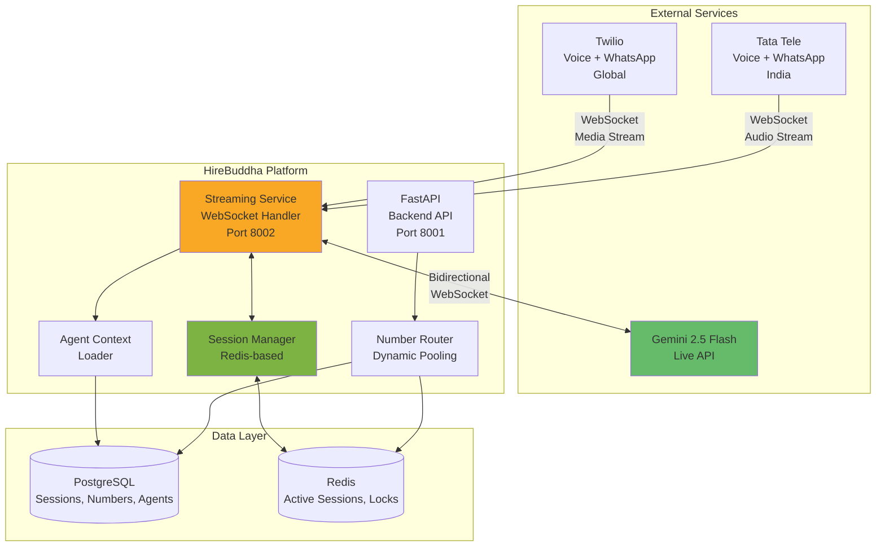
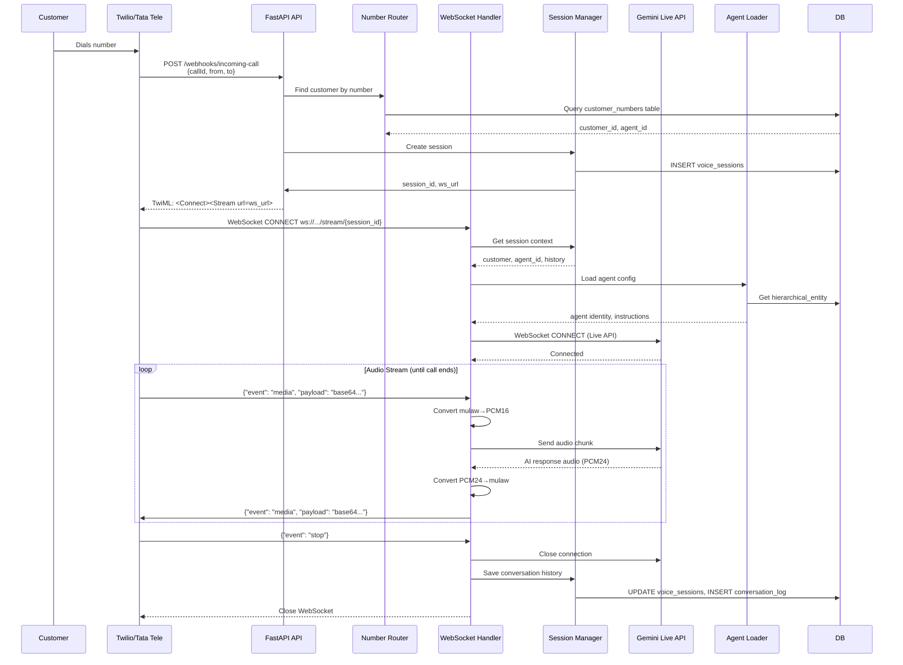

# Real-Time Voice & WhatsApp Streaming Integration - Architecture Design

> **Version**: 2.0  
> **Date**: 2026-02-06  
> **Purpose**: Complete redesign for real-time bidirectional voice/WhatsApp streaming with Gemini Live API

---

## Executive Summary

This document outlines a **WebSocket-based real-time streaming architecture** for voice calls and WhatsApp messaging, fundamentally different from the simple tool-based approach originally proposed. The system handles:

- **Bidirectional audio streaming** via WebSockets (Twilio & Tata Tele)
- **Real-time AI conversations** using Gemini 2.5 Flash Live API
- **Concurrent multi-channel streaming** (multiple simultaneous calls/chats)
- **Geographic routing** (Twilio for global, Tata Tele for India)
- **Dynamic number pooling** across customers
- **Session-based context preservation** across conversations

### Key Insight from Research

Both Twilio and Tata Tele use **near-identical WebSocket protocols** for audio streaming:
- Audio format: `audio/x-mulaw`, 8kHz, 8-bit
- Chunk delivery: Every 20-100ms
- Bidirectional: Receive audio from call + send AI-generated audio back
- Event-driven: Connected → Start → Media (loop) → Stop

---

## 1. Architecture Overview

### 1.1 High-Level Component Diagram



### 1.2 Request Flow - Voice Call



---

## 2. Core Components

### 2.1 Streaming Service (NEW)

**Purpose**: Dedicated WebSocket server handling real-time audio/message streams

**Technology Stack**:
- **Framework**: FastAPI with WebSocket support
- **Port**: 8002 (separate from main API)
- **Concurrency**: asyncio with connection pooling
- **Audio Processing**: pydub, numpy (format conversion)

**Key Responsibilities**:
1. Accept WebSocket connections from Twilio/Tata
2. Manage concurrent bidirectional streams
3. Interface with Gemini Live API
4. Handle audio format conversion (mulaw ↔ PCM16 ↔ PCM24)
5. Route messages to correct session/agent
6. Heartbeat monitoring and recovery

**File Structure**:
```
backend/src/streaming/
├── __init__.py
├── main.py                 # FastAPI app for streaming service
├── websocket_handler.py    # WebSocket connection management
├── audio_processor.py      # Audio format conversion
├── gemini_live.py          # Gemini Live API integration
├── session_bridge.py       # Bridge to SessionManager
└── models.py               # StreamSession, AudioChunk models
```

### 2.2 Session Manager (NEW)

**Purpose**: Manage active conversation sessions with state preservation

**Storage**: Redis (for active sessions) + PostgreSQL (for persistence)

**Session Schema**:
```python
class VoiceSession:
    session_id: UUID
    call_sid: str  # Twilio/Tata call ID
    stream_sid: str  # Twilio/Tata stream ID
    customer_id: UUID
    agent_id: UUID  # hierarchical_entity.id
    phone_number: str  # Assigned number
    provider: str  # "twilio" | "tata_tele"
    status: str  # "ringing" | "active" | "ended"
    started_at: datetime
    last_activity: datetime
    context_state: dict  # Conversation history
    gemini_session_id: str  # Gemini Live API session
    metadata: dict  # callSid, fromNumber, toNumber, etc.

class WhatsAppSession:
    session_id: UUID
    conversation_id: str  # WhatsApp conversation ID
    customer_id: UUID
    agent_id: UUID
    phone_number: str
    provider: str
    last_message_at: datetime
    session_window_expires: datetime  # 24-hour window
    context_state: dict
    gemini_session_id: str
```

**Redis Keys**:
```
# Active voice sessions
voice:session:{session_id} → VoiceSession (JSON, TTL 1 hour)
voice:call:{call_sid} → session_id (for reverse lookup)
voice:stream:{stream_sid} → session_id

# Active WhatsApp sessions
whatsapp:session:{session_id} → WhatsAppSession (JSON, TTL 25 hours)
whatsapp:conversation:{conversation_id} → session_id
whatsapp:customer:{customer_id} → session_id

# Number locks (for pooling)
number:lock:{phone_number} → customer_id (TTL based on call duration)

# Stream concurrency tracking
concurrent:streams → ZSET (score = timestamp)
```

### 2.3 Number Router (NEW)

**Purpose**: Dynamic allocation of phone numbers to customers

**Phase 1**: 1:1 Mapping (Simple)
```sql
CREATE TABLE customer_phone_numbers (
    id UUID PRIMARY KEY DEFAULT uuid_generate_v4(),
    company_id UUID REFERENCES companies(id),
    customer_id UUID NOT NULL,
    phone_number VARCHAR(20) NOT NULL,
    provider VARCHAR(20) NOT NULL, -- 'twilio' | 'tata_tele'
    agent_id UUID REFERENCES hierarchical_entities(id),
    assigned_at TIMESTAMP DEFAULT NOW(),
    is_active BOOLEAN DEFAULT TRUE,
    UNIQUE(phone_number)
);

CREATE INDEX idx_customer_numbers_phone ON customer_phone_numbers(phone_number);
CREATE INDEX idx_customer_numbers_customer ON customer_phone_numbers(customer_id);
```

**Phase 2**: Dynamic Pooling (Future)
```sql
CREATE TABLE phone_number_pool (
    id UUID PRIMARY KEY DEFAULT uuid_generate_v4(),
    company_id UUID REFERENCES companies(id),
    phone_number VARCHAR(20) NOT NULL,
    provider VARCHAR(20) NOT NULL,
    country_code VARCHAR(5),
    capabilities JSONB, -- {"voice": true, "sms": true, "whatsapp": true}
    is_available BOOLEAN DEFAULT TRUE,
    current_session_id UUID,
    last_used_at TIMESTAMP,
    total_usage_count INT DEFAULT 0,
    UNIQUE(phone_number)
);

-- Dynamic assignment logic (in Redis for speed)
-- 1. Check if customer has an active session
-- 2. If not, acquire lock on available number
-- 3. Assign number temporarily with TTL
-- 4. Release back to pool after call ends
```

### 2.4 Agent Context Loader (INTEGRATED)

**Purpose**: Load agent configuration and conversation history for each session

**Integration with Existing System**:
```python
class AgentContextLoader:
    async def load_agent_for_session(
        self, 
        agent_id: UUID, 
        customer_id: UUID,
        channel: str  # "voice" | "whatsapp"
    ) -> AgentContext:
        # 1. Load HierarchicalEntity from DB
        entity = await self.db.get(HierarchicalEntity, agent_id)
        
        # 2. Extract identity for Gemini
        identity = entity.identity or {}
        system_instruction = self._build_system_instruction(
            role=identity.get("role", "AI Assistant"),
            persona=identity.get("persona", ""),
            instructions=identity.get("instructions", "")
        )
        
        # 3. Load conversation history (last 10 interactions)
        history = await self._load_conversation_history(
            customer_id=customer_id,
            agent_id=agent_id,
            channel=channel,
            limit=10
        )
        
        # 4. Load tools if configured
        tools = await self._load_agent_tools(entity)
        
        return AgentContext(
            agent_id=agent_id,
            system_instruction=system_instruction,
            conversation_history=history,
            tools=tools,
            llm_config=entity.llm_config or {},
            capabilities=entity.capabilities or {}
        )
    
    def _build_system_instruction(self, role, persona, instructions):
        return f\"\"\"{role}
        
Persona: {persona}

Instructions:
{instructions}

You are assisting a customer in a real-time {self.channel} conversation. 
Be concise, helpful, and natural. Listen actively and respond appropriately.
\"\"\"
```

---

## 3. Database Schema Changes

### 3.1 New Tables

```sql
-- Voice call sessions (persistent log)
CREATE TABLE voice_sessions (
    id UUID PRIMARY KEY DEFAULT uuid_generate_v4(),
    company_id UUID REFERENCES companies(id) NOT NULL,
    customer_id UUID NOT NULL,
    agent_id UUID REFERENCES hierarchical_entities(id) NOT NULL,
    phone_number VARCHAR(20) NOT NULL,
    provider VARCHAR(20) NOT NULL,
    call_sid VARCHAR(100) NOT NULL,
    stream_sid VARCHAR(100),
    direction VARCHAR(20), -- 'inbound' | 'outbound'
    status VARCHAR(20) DEFAULT 'initiated',
    started_at TIMESTAMP DEFAULT NOW(),
    ended_at TIMESTAMP,
    duration_seconds INT,
    total_cost_usd NUMERIC(10, 4) DEFAULT 0,
    conversation_log JSONB, -- Full transcript
    metadata JSONB,
    created_at TIMESTAMP DEFAULT NOW(),
    UNIQUE(call_sid)
);

CREATE INDEX idx_voice_sessions_customer ON voice_sessions(customer_id);
CREATE INDEX idx_voice_sessions_agent ON voice_sessions(agent_id);
CREATE INDEX idx_voice_sessions_call_sid ON voice_sessions(call_sid);

-- WhatsApp message sessions
CREATE TABLE whatsapp_sessions (
    id UUID PRIMARY KEY DEFAULT uuid_generate_v4(),
    company_id UUID REFERENCES companies(id) NOT NULL,
    customer_id UUID NOT NULL,
    agent_id UUID REFERENCES hierarchical_entities(id) NOT NULL,
    phone_number VARCHAR(20) NOT NULL,
    provider VARCHAR(20) NOT NULL,
    conversation_id VARCHAR(100) NOT NULL,
    status VARCHAR(20) DEFAULT 'active',
    session_window_expires TIMESTAMP,
    started_at TIMESTAMP DEFAULT NOW(),
    last_message_at TIMESTAMP,
    message_count INT DEFAULT 0,
    total_cost_usd NUMERIC(10, 4) DEFAULT 0,
    conversation_log JSONB,
    metadata JSONB,
    created_at TIMESTAMP DEFAULT NOW(),
    UNIQUE(conversation_id)
);

CREATE INDEX idx_whatsapp_sessions_customer ON whatsapp_sessions(customer_id);
CREATE INDEX idx_whatsapp_sessions_conversation ON whatsapp_sessions(conversation_id);

-- Conversation history (unified across voice + WhatsApp)
CREATE TABLE conversation_history (
    id UUID PRIMARY KEY DEFAULT uuid_generate_v4(),
    company_id UUID REFERENCES companies(id) NOT NULL,
    customer_id UUID NOT NULL,
    agent_id UUID REFERENCES hierarchical_entities(id) NOT NULL,
    session_id UUID, -- voice_sessions.id or whatsapp_sessions.id
    channel VARCHAR(20) NOT NULL, -- 'voice' | 'whatsapp'
    turn_number INT NOT NULL,
    speaker VARCHAR(20) NOT NULL, -- 'customer' | 'agent'
    message_type VARCHAR(20), -- 'text' | 'audio' | 'image'
    content TEXT,
    audio_duration_ms INT,
    timestamp TIMESTAMP DEFAULT NOW(),
    metadata JSONB
);

CREATE INDEX idx_conversation_customer_agent ON conversation_history(customer_id, agent_id, timestamp DESC);
CREATE INDEX idx_conversation_session ON conversation_history(session_id);

-- Customer phone number assignments
CREATE TABLE customer_phone_numbers (
    id UUID PRIMARY KEY DEFAULT uuid_generate_v4(),
    company_id UUID REFERENCES companies(id) NOT NULL,
    customer_id UUID NOT NULL,
    customer_name VARCHAR(255),
    customer_metadata JSONB, --  Any additional customer info
    phone_number VARCHAR(20) NOT NULL,
    provider VARCHAR(20) NOT NULL,
    agent_id UUID REFERENCES hierarchical_entities(id) NOT NULL,
    assigned_at TIMESTAMP DEFAULT NOW(),
    is_active BOOLEAN DEFAULT TRUE,
    UNIQUE(phone_number)
);

CREATE INDEX idx_customer_numbers_phone ON customer_phone_numbers(phone_number);
CREATE INDEX idx_customer_numbers_customer ON customer_phone_numbers(customer_id);
```

### 3.2 Integration Registry Updates & Credential Storage

**Answer to Review Question**: Twilio and Tata Tele credentials are stored in the existing `integration_registry` table with additional metadata fields.

**Credential Structure**:
- **Twilio**: Account SID, Auth Token, From Number
- **Tata Tele**: API Key, Account ID, From Number
- All stored encrypted in `encrypted_api_key` field (JSON)

```sql
-- Add streaming-specific SKUs with credential structure
INSERT INTO integration_registry (
    company_id, provider_name, model_name, service_sku, 
    service_category, component_type, encrypted_api_key, internal_cost, cost_unit, status
) VALUES
-- Twilio Voice Streaming (company-specific)
('{company_id}', 'twilio', 'voice-stream', 'twilio-voice-stream', 
 'MESSAGING', 'BIDIRECTIONAL', 
 '{"account_sid": "ACXXXX", "auth_token": "encrypted_token", "from_number": "+1XXXXXXX"}',
 0.0085, 'per_minute', 'active'),

-- Tata Tele Voice Streaming (company-specific)
('{company_id}', 'tata-tele', 'voice-stream', 'tata-voice-stream', 
 'MESSAGING', 'BIDIRECTIONAL',
 '{"api_key": "encrypted_key", "account_id": "ACXXXX", "from_number": "+91XXXXXXX"}',
 0.005, 'per_minute', 'active'),

-- Gemini Live API (company-specific)
('{company_id}', 'google', 'gemini-2.5-flash-live', 'gemini-live-stream', 
 'LLM', 'BIDIRECTIONAL',
 '{"api_key": "encrypted_gemini_key"}',
 0.0001, 'per_second', 'active');
```

**Credential Access Pattern**:
```python
# Retrieve credentials from integration_registry
twilio_config = await config_service.get_integration_config(
    company_id=company_id,
    service_sku="twilio-voice-stream"
)
# Returns: {"account_sid": "...", "auth_token": "...", "from_number": "..."}
```

---

## 4. Session Management - Simplified Approach

**Answer to Review Question**: Full Redis-based session management is **optional for Phase 1**. Here's a simplified approach:

### 4.1 Minimal Session Management (Phase 1)

**Use PostgreSQL Only** - No Redis requirement initially:
- Store active sessions in `voice_sessions` table with `status='active'`
- Query by `call_sid` for session lookup (indexed)
- Conversation context stored in `context_state` JSONB field
- Acceptable for <50 concurrent calls

**When to Add Redis** (Phase 2):
- When concurrent calls exceed 50+
- When session lookup latency becomes a bottleneck
- For distributed deployment across multiple servers

### 4.2 Simplified Session Flow

```python
class SimplifiedSessionManager:
    """PostgreSQL-only session management for Phase 1."""
    
    async def create_voice_session(self, **kwargs) -> VoiceSession:
        # Create in DB only
        session = VoiceSession(**kwargs, status="active")
        self.db.add(session)
        await self.db.commit()
        return session
    
    async def get_session_by_call_sid(self, call_sid: str) -> VoiceSession:
        # Single query with index
        result = await self.db.execute(
            select(VoiceSession).where(
                VoiceSession.call_sid == call_sid,
                VoiceSession.status == "active"
            )
        )
        return result.scalar_one_or_none()
    
    async def update_context(self, session_id: UUID, context: dict):
        # Update JSONB field
        await self.db.execute(
            update(VoiceSession)
            .where(VoiceSession.id == session_id)
            .values(context_state=context)
        )
        await self.db.commit()
```

**Migration Path**: If Redis becomes necessary later, the session data structure remains the same—just add caching layer.

---

## 5. API Endpoints

### 5.1 Webhook Endpoints (FastAPI Main API - Port 8001)

```python
# backend/src/streaming/webhook_router.py

from fastapi import APIRouter, Request, Response
from twilio.twiml.voice_response import VoiceResponse, Connect, Stream

router = APIRouter(prefix="/webhooks/voice", tags=["Voice Webhooks"])

@router.post("/twilio/incoming")
async def twilio_incoming_call(request: Request):
    \"""
    Called by Twilio when inbound call arrives.
    Must return TwiML to establish Media Stream.
    \"""
    form_data = await request.form()
    call_sid = form_data.get("CallSid")
    from_number = form_data.get("From")
    to_number = form_data.get("To")
    
    # 1. Find customer by phone number
    customer = await number_router.find_customer_by_number(to_number)
    if not customer:
        return Response(content=\"<Response><Say>Invalid number</Say></Response>\", 
                       media_type="application/xml")
    
    # 2. Create session
    session = await session_manager.create_voice_session(
        customer_id=customer.customer_id,
        agent_id=customer.agent_id,
        phone_number=to_number,
        provider="twilio",
        call_sid=call_sid,
        direction="inbound",
        metadata={
            "from": from_number,
            "to": to_number
        }
    )
    
    # 3. Generate WebSocket URL
    ws_url = f"wss://{STREAMING_HOST}/stream/twilio/{session.id}"
    
    # 4. Return TwiML to connect stream
    response = VoiceResponse()
    connect = Connect()
    connect.stream(url=ws_url)
    response.append(connect)
    
    return Response(content=str(response), media_type="application/xml")


@router.post("/tata/incoming")
async def tata_incoming_call(request: Request):
    \"""
    Called by Tata Tele when inbound call arrives.
    Must return JSON with WebSocket URL (Dynamic Endpoint).
    \"""
    data = await request.json()
    call_id = data.get("callId")
    from_number = data.get("fromNumber")
    to_number = data.get("toNumber")
    
    # Similar logic to Twilio
    customer = await number_router.find_customer_by_number(to_number)
    if not customer:
        return {"sucess": False, "error": "Invalid number"}
    
    session = await session_manager.create_voice_session(
        customer_id=customer.customer_id,
        agent_id=customer.agent_id,
        phone_number=to_number,
        provider="tata_tele",
        call_sid=call_id,
        direction="inbound",
        metadata=data
    )
    
    ws_url = f"wss://{STREAMING_HOST}/stream/tata/{session.id}"
    
    # IMPORTANT: Tata Tele requires "sucess" (typo in their API!)
    return {
        "sucess": True,
        "wss_url": ws_url
    }

@router.post("/whatsapp/incoming")
async def whatsapp_incoming_message(request: Request):
    \"""
    Called by Twilio/Tata when WhatsApp message arrives.
    Process message and respond via Gemini.
    \"""
    form_data = await request.form()
    from_number = form_data.get("From").replace("whatsapp:", "")
    to_number = form_data.get("To").replace("whatsapp:", "")
    message_body = form_data.get("Body", "")
    message_sid = form_data.get("MessageSid")
    
    # Find or create WhatsApp session
    session = await session_manager.get_or_create_whatsapp_session(
        customer_phone=from_number,
        business_number=to_number
    )
    
    # Process message with Gemini (non-streaming for WhatsApp)
    response_text = await whatsapp_processor.process_message(
        session_id=session.id,
        message=message_body
    )
    
    # Send response via Twilio/Tata
    await whatsapp_sender.send_message(
        to=from_number,
        from_=to_number,
        body=response_text,
        provider=session.provider
    )
    
    return Response(status_code=200)
```

### 5.2 WebSocket Endpoints (Streaming Service - Port 8002)

```python
# backend/src/streaming/main.py

from fastapi import FastAPI, WebSocket, WebSocketDisconnect
import asyncio

app = FastAPI(title="HB Streaming Service")

@app.websocket("/stream/twilio/{session_id}")
async def twilio_websocket(websocket: WebSocket, session_id: str):
    \"""
    WebSocket endpoint for Twilio Media Streams.
    Handles bidirectional audio streaming with Gemini Live API.
    \"""
    await websocket.accept()
    
    try:
        # Initialize handler
        handler = TwilioStreamHandler(session_id, websocket)
        await handler.initialize()
        
        # Start bidirectional streaming
        await handler.start_streaming()
        
    except WebSocketDisconnect:
        await handler.cleanup()
    except Exception as e:
        logger.error(f"Stream error: {e}")
        await handler.cleanup()


@app.websocket("/stream/tata/{session_id}")
async def tata_websocket(websocket: WebSocket, session_id: str):
    \"""
    WebSocket endpoint for Tata Tele audio streams.
    Protocol is nearly identical to Twilio.
    \"""
    await websocket.accept()
    
    try:
        handler = TataStreamHandler(session_id, websocket)
        await handler.initialize()
        await handler.start_streaming()
        
    except WebSocketDisconnect:
        await handler.cleanup()
    except Exception as e:
        logger.error(f"Stream error: {e}")
        await handler.cleanup()
```

---

## 6. Core Implementation - Stream Handler

### 6.1 TwilioStreamHandler

```python
# backend/src/streaming/websocket_handler.py

import asyncio
import base64
import json
from google import genai
from google.genai import types

class TwilioStreamHandler:
    def __init__(self, session_id: str, websocket: WebSocket):
        self.session_id = session_id
        self.websocket = websocket
        self.gemini_client = None
        self.gemini_session = None
        self.session_data = None
        self.agent_context = None
        self.audio_queue_in = asyncio.Queue()  # From Twilio → Gemini
        self.audio_queue_out = asyncio.Queue()  # From Gemini → Twilio
        self.is_active = False
        
    async def initialize(self):
        \"""Load session and agent, establish Gemini connection.\"""
        # 1. Load session from Redis
        self.session_data = await session_manager.get_session(self.session_id)
        if not self.session_data:
            raise ValueError("Session not found")
        
        # 2. Load agent context
        self.agent_context = await agent_loader.load_agent_for_session(
            agent_id=self.session_data.agent_id,
            customer_id=self.session_data.customer_id,
            channel="voice"
        )
        
        # 3. Get Gemini API key
        api_key = await config_service.get_api_key_by_sku(
            self.session_data.company_id,
            "gemini-live-stream"
        )
        
        # 4. Initialize Gemini Live API client
        self.gemini_client = genai.Client(api_key=api_key)
        
        logger.info(f"Handler initialized for session {self.session_id}")
    
    async def start_streaming(self):
        \"""Main streaming loop - bidirectional audio.\"""
        self.is_active = True
        
        # Connect to Gemini Live API
        config = types.LiveConnectConfig(
            response_modalities=["AUDIO"],
            system_instruction=self.agent_context.system_instruction,
            tools=self.agent_context.tools if self.agent_context.tools else None
        )
        
        async with self.gemini_client.aio.live.connect(
            model="gemini-2.5-flash-live",
            config=config
        ) as gemini_session:
            self.gemini_session = gemini_session
            
            # Start concurrent tasks
            async with asyncio.TaskGroup() as tg:
                tg.create_task(self._receive_from_twilio())
                tg.create_task(self._send_to_gemini())
                tg.create_task(self._receive_from_gemini())
                tg.create_task(self._send_to_twilio())
    
    async def _receive_from_twilio(self):
        \"""Receive audio chunks from Twilio WebSocket.\"""
        while self.is_active:
            try:
                message = await self.websocket.receive_text()
                data = json.loads(message)
                
                event = data.get("event")
                
                if event == "connected":
                    logger.info("Twilio stream connected")
                    
                elif event == "start":
                    stream_sid = data.get("start", {}).get("streamSid")
                    await session_manager.update_session(
                        self.session_id,
                        {"stream_sid": stream_sid, "status": "active"}
                    )
                    logger.info(f"Stream started: {stream_sid}")
                    
                elif event == "media":
                    # Extract audio payload (base64 encoded mulaw)
                    payload = data.get("media", {}).get("payload")
                    timestamp = data.get("media", {}).get("timestamp")
                    
                    # Decode and convert
                    mulaw_audio = base64.b64decode(payload)
                    pcm_audio = audio_processor.mulaw_to_pcm16(mulaw_audio)
                    
                    # Queue for Gemini
                    await self.audio_queue_in.put({
                        "data": pcm_audio,
                        "mime_type": "audio/pcm",
                        "timestamp": timestamp
                    })
                    
                elif event == "stop":
                    logger.info("Stream stopped by Twilio")
                    self.is_active = False
                    break
                    
            except WebSocketDisconnect:
                logger.info("Twilio disconnected")
                self.is_active = False
                break
            except Exception as e:
                logger.error(f"Receive error: {e}")
    
    async def _send_to_gemini(self):
        \"""Send audio from Twilio to Gemini Live API.\"""
        while self.is_active:
            try:
                audio_chunk = await self.audio_queue_in.get()
                
                # Send to Gemini (uses send_realtime_input)
                await self.gemini_session.send_realtime_input(
                    audio=audio_chunk
                )
                
            except Exception as e:
                logger.error(f"Gemini send error: {e}")
    
    async def _receive_from_gemini(self):
        \"""Receive AI responses from Gemini Live API.\"""
        while self.is_active:
            try:
                async for response in self.gemini_session.receive():
                    if response.server_content and response.server_content.model_turn:
                        for part in response.server_content.model_turn.parts:
                            # Check for audio output
                            if part.inline_data and isinstance(part.inline_data.data, bytes):
                                pcm24_audio = part.inline_data.data
                                
                                # Convert PCM24 (Gemini) → mulaw (Twilio)
                                mulaw_audio = audio_processor.pcm24_to_mulaw(pcm24_audio)
                                
                                # Queue for Twilio
                                await self.audio_queue_out.put(mulaw_audio)
                            
                            # Check for text (for transcription logging)
                            if part.text:
                                await self._log_conversation_turn(
                                    speaker="agent",
                                    content=part.text
                                )
                                
            except Exception as e:
                logger.error(f"Gemini receive error: {e}")
    
    async def _send_to_twilio(self):
        \"""Send AI-generated audio back to Twilio.\"""
        chunk_counter = 0
        while self.is_active:
            try:
                mulaw_audio = await self.audio_queue_out.get()
                
                # Encode to base64
                payload = base64.b64encode(mulaw_audio).decode("utf-8")
                
                # Send media event to Twilio
                message = {
                    "event": "media",
                    "streamSid": self.session_data.stream_sid,
                    "media": {
                        "payload": payload,
                        "chunk": str(chunk_counter)
                    }
                }
                
                await self.websocket.send_text(json.dumps(message))
                chunk_counter += 1
                
            except Exception as e:
                logger.error(f"Twilio send error: {e}")
    
    async def _log_conversation_turn(self, speaker: str, content: str):
        \"""Log conversation to database.\"""
        await conversation_logger.log_turn(
            session_id=self.session_id,
            customer_id=self.session_data.customer_id,
            agent_id=self.session_data.agent_id,
            channel="voice",
            speaker=speaker,
            content=content
        )
    
    async def cleanup(self):
        \"""Clean up resources and save session.\"""
        self.is_active = False
        
        # Update session status
        await session_manager.update_session(
            self.session_id,
            {"status": "ended", "ended_at": datetime.now()}
        )
        
        # Close Gemini connection (handled by context manager)
        
        logger.info(f"Session {self.session_id} cleaned up")
```

### 6.2 Audio Processor

```python
# backend/src/streaming/audio_processor.py

import numpy as np
import audioop

class AudioProcessor:
    \"""Audio format conversion utilities.\"""
    
    @staticmethod
    def mulaw_to_pcm16(mulaw_bytes: bytes) -> bytes:
        \"""
        Convert mulaw (8kHz, 8-bit) to PCM16 (16kHz, 16-bit).
        Twilio/Tata use mulaw, Gemini expects PCM16.
        \"""
        # Decode mulaw to linear PCM
        pcm_8khz = audioop.ulaw2lin(mulaw_bytes, 2)  # 2 bytes per sample (16-bit)
        
        # Resample 8kHz → 16kHz
        pcm_16khz, _ = audioop.ratecv(
            pcm_8khz,
            2,  # sample width
            1,  # channels (mono)
            8000,  # input rate
            16000,  # output rate
            None
        )
        
        return pcm_16khz
    
    @staticmethod
    def pcm24_to_mulaw(pcm24_bytes: bytes) -> bytes:
        \"""
        Convert PCM24 (24kHz, 16-bit) to mulaw (8kHz, 8-bit).
        Gemini outputs PCM24, Twilio/Tata expect mulaw.
        \"""
        # Resample 24kHz → 8kHz
        pcm_8khz, _ = audioop.ratecv(
            pcm24_bytes,
            2,  # sample width
            1,  # channels
            24000,  # input rate
            8000,  # output rate
            None
        )
        
        # Encode to mulaw
        mulaw = audioop.lin2ulaw(pcm_8khz, 2)
        
        return mulaw
    
    @staticmethod
    def ensure_chunk_size(audio_bytes: bytes, target_size: int = 160) -> list[bytes]:
        \"""
        Tata Tele requires chunks in multiples of 160 bytes.
        Split/pad audio to meet requirement.
        \"""
        chunks = []
        for i in range(0, len(audio_bytes), target_size):
            chunk = audio_bytes[i:i+target_size]
            
            # Pad if necessary
            if len(chunk) < target_size:
                chunk += b'\\x00' * (target_size - len(chunk))
            
            chunks.append(chunk)
        
        return chunks
```

---

## 7. Hierarchical Entity Extensions for Voice

**Answer to Review Question**: Minimal changes needed. The existing entity structure already supports voice capabilities.

### 7.1 Required Entity Modifications

**No schema changes needed!** Use existing JSON fields:

```json
{
  "type": "AGENT",
  "name": "emi_collection_agent",
  "identity": {
    "role": "EMI Collection Agent",
    "persona": "Professional, empathetic debt collector",
    "instructions": "Call customers with overdue EMI payments. Be polite but firm. Offer payment options."
  },
  "capabilities": {
    "tools": [],
    "child_entities": [],
    "channels": ["voice", "whatsapp"]  // NEW: Specify supported channels
  },
  "metadata_extensions": {
    "voice_config": {  // NEW: Voice-specific settings
      "enabled": true,
      "voice_type": "conversational",  // or "ivr", "announcement"
      "language": "en-IN",
      "accent": "indian",
      "speaking_rate": 1.0,
      "pitch": 0.0,
      "call_script_template": "Hello {customer_name}, this is {agent_name} calling about your EMI payment..."
    },
    "whatsapp_config": {
      "enabled": true,
      "message_templates": ["payment_reminder", "payment_confirmation"]
    }
  },
  "io_contract": {
    "input": {
      "customer_name": {"type": "string", "required": true},
      "customer_phone": {"type": "string", "required": true},
      "emi_amount": {"type": "number", "required": true},
      "overdue_days": {"type": "number", "required": true},
      "loan_id": {"type": "string", "required": true}
    },
    "output": {
      "call_outcome": {"type": "string"},  // "promised_payment", "no_answer", "refused", etc.
      "payment_date_promised": {"type": "string"},
      "notes": {"type": "string"}
    }
  },
  "llm_config": {
    "model_name": "gemini-2.5-flash-live",  // Use Live API model
    "temperature": 0.7,
    "max_tokens": 500
  }
}
```

### 7.2 Campaign Entity (NEW Type - Optional)

For bulk call campaigns, consider adding a new entity type:

```sql
-- Add new entity type enum value (if using strict enums)
ALTER TYPE entity_type ADD VALUE 'CAMPAIGN';

-- Or keep flexible with VARCHAR and just use "CAMPAIGN" as type
```

**Campaign Entity Structure**:
```json
{
  "type": "CAMPAIGN",
  "name": "emi_collection_campaign_jan_2026",
  "identity": {
    "role": "Campaign Orchestrator",
    "instructions": "Execute bulk voice call campaign to collect overdue EMI payments"
  },
  "hierarchy": {
    "parent_id": null,
    "child_entity_id": "{emi_collection_agent_id}"  // Agent to use for each call
  },
  "planning": {
    "static_plan": {
      "steps": [
        {
          "step_id": "load_contacts",
          "type": "ACTION",
          "target": {
            "tool": "process_excel",
            "prompt_template": "Load contacts from uploaded file"
          }
        },
        {
          "step_id": "initiate_calls",
          "type": "CHILD_ENTITY_INVOCATION",
          "target": {
            "entity_id": "{emi_collection_agent_id}",
            "invocation_mode": "parallel",  // NEW: Call multiple customers simultaneously
            "max_concurrent": 10,
            "retry_on_failure": true,
            "retry_delay_minutes": 60
          }
        },
        {
          "step_id": "generate_report",
          "type": "ACTION",
          "target": {
            "tool": "file_writer",
            "prompt_template": "Generate campaign results report"
          }
        }
      ]
    }
  },
  "metadata_extensions": {
    "campaign_config": {
      "type": "voice_outbound",
      "contact_source": "csv_upload",
      "schedule": {
        "start_time": "09:00",
        "end_time": "18:00",
        "timezone": "Asia/Kolkata",
        "days_of_week": ["monday", "tuesday", "wednesday", "thursday", "friday"]
      },
      "throttling": {
        "max_calls_per_hour": 100,
        "max_concurrent_calls": 10
      }
    }
  }
}
```

---

## 8. Frontend UI Changes

**Answer to Review Question**: Significant frontend additions needed for call campaign management and monitoring.

### 8.1 New UI Components

#### A. Campaign Builder Page

**Route**: `/campaigns/create`

**Features**:
1. **Campaign Configuration**
   - Campaign name and description
   - Select voice agent from dropdown
   - Upload CSV/Excel with contact list
   - Map CSV columns to agent input fields
   - Set calling hours and throttling

2. **Contact List Management**
   - Preview uploaded contacts (first 10 rows)
   - Column mapping: `phone_number`, `customer_name`, `emi_amount`, etc.
   - Validate phone numbers (format, duplicates)
   - Filter by criteria (overdue > 30 days, etc.)

3. **Script Customization**
   - Use agent's default script or override
   - Insert variables: `{{customer_name}}`, `{{emi_amount}}`
   - Preview personalized script for sample contact

**UI Mockup** (React Component):
```tsx
// frontend/src/pages/CampaignBuilder.tsx

import React, { useState } from 'react';
import { Upload, Phone, Calendar, Users } from 'lucide-react';

const CampaignBuilder = () => {
  const [campaignData, setCampaignData] = useState({
    name: '',
    agentId: '',
    contactFile: null,
    schedule: { startTime: '09:00', endTime: '18:00' },
    maxConcurrent: 10
  });
  
  const [contacts, setContacts] = useState([]);
  const [columnMapping, setColumnMapping] = useState({});
  
  return (
    <div className="campaign-builder">
      <h1>Create Voice Call Campaign</h1>
      
      {/* Step 1: Basic Info */}
      <section className="glass-card">
        <h2><Phone /> Campaign Details</h2>
        <input 
          placeholder="Campaign Name (e.g., EMI Collection - Jan 2026)"
          value={campaignData.name}
          onChange={(e) => setCampaignData({...campaignData, name: e.target.value})}
        />
        
        <select 
          value={campaignData.agentId}
          onChange={(e) => setCampaignData({...campaignData, agentId: e.target.value})}
        >
          <option value="">Select Voice Agent</option>
          {/* Populate from hierarchical_entities where voice_config.enabled = true */}
        </select>
      </section>
      
      {/* Step 2: Upload Contacts */}
      <section className="glass-card">
        <h2><Upload /> Upload Contact List</h2>
        <input 
          type="file" 
          accept=".csv,.xlsx"
          onChange={handleFileUpload}
        />
        
        {contacts.length > 0 && (
          <>
            <p>{contacts.length} contacts loaded</p>
            
            {/* Column Mapping */}
            <div className="column-mapper">
              <h3>Map Columns</h3>
              <div className="mapping-row">
                <label>Phone Number:</label>
                <select onChange={(e) => setColumnMapping({...columnMapping, phone: e.target.value})}>
                  {Object.keys(contacts[0]).map(col => <option key={col}>{col}</option>)}
                </select>
              </div>
              <div className="mapping-row">
                <label>Customer Name:</label>
                <select onChange={(e) => setColumnMapping({...columnMapping, name: e.target.value})}>
                  {Object.keys(contacts[0]).map(col => <option key={col}>{col}</option>)}
                </select>
              </div>
              {/* More mappings based on agent's io_contract.input */}
            </div>
            
            {/* Preview Table */}
            <table className="contacts-preview">
              <thead>
                <tr>
                  <th>Phone</th>
                  <th>Name</th>
                  <th>EMI Amount</th>
                  <th>Overdue Days</th>
                </tr>
              </thead>
              <tbody>
                {contacts.slice(0, 10).map((contact, idx) => (
                  <tr key={idx}>
                    <td>{contact[columnMapping.phone]}</td>
                    <td>{contact[columnMapping.name]}</td>
                    <td>₹{contact[columnMapping.emi_amount]}</td>
                    <td>{contact[columnMapping.overdue_days]}</td>
                  </tr>
                ))}
              </tbody>
            </table>
          </>
        )}
      </section>
      
      {/* Step 3: Schedule */}
      <section className="glass-card">
        <h2><Calendar /> Calling Schedule</h2>
        <div className="time-picker">
          <label>Start Time:</label>
          <input 
            type="time" 
            value={campaignData.schedule.startTime}
            onChange={(e) => setCampaignData({
              ...campaignData, 
              schedule: {...campaignData.schedule, startTime: e.target.value}
            })}
          />
          <label>End Time:</label>
          <input 
            type="time" 
            value={campaignData.schedule.endTime}
            onChange={(e) => setCampaignData({
              ...campaignData,
              schedule: {...campaignData.schedule, endTime: e.target.value}
            })}
          />
        </div>
        
        <div className="concurrency">
          <label>Max Concurrent Calls:</label>
          <input 
            type="number" 
            min="1" 
            max="50"
            value={campaignData.maxConcurrent}
            onChange={(e) => setCampaignData({...campaignData, maxConcurrent: e.target.value})}
          />
        </div>
      </section>
      
      {/* Submit */}
      <button className="btn-primary" onClick={handleLaunchCampaign}>
        Launch Campaign
      </button>
    </div>
  );
};
```

#### B. Campaign Monitoring Dashboard

**Route**: `/campaigns/{campaign_id}/monitor`

**Real-Time Metrics**:
- Total contacts: 1,250
- Calls completed: 487
- Calls in progress: 12 (live indicator)
- Calls pending: 751
- Success rate: 62%
- Average call duration: 2m 34s

**Live Call Feed**:
```tsx
<div className="live-calls">
  <h3>Active Calls ({activeCallsCount})</h3>
  {activeCalls.map(call => (
    <div key={call.id} className="call-card">
      <div className="call-status pulsing">🔴 LIVE</div>
      <div className="call-info">
        <strong>{call.customer_name}</strong>
        <span>{call.phone_number}</span>
        <span>Duration: {formatDuration(call.duration)}</span>
      </div>
      <button onClick={() => listenToCall(call.id)}>Listen</button>
    </div>
  ))}
</div>
```

**Outcome Distribution** (Chart):
- Promised Payment: 45%
- No Answer: 30%
- Refused: 15%
- Callback Requested: 10%

#### C. Call History & Transcripts

**Route**: `/campaigns/{campaign_id}/calls`

**Features**:
- Searchable/filterable call log
- Play call recording (if enabled)
- View AI transcript
- Download results as CSV

```tsx
<table className="call-history">
  <thead>
    <tr>
      <th>Timestamp</th>
      <th>Customer</th>
      <th>Phone</th>
      <th>Duration</th>
      <th>Outcome</th>
      <th>Actions</th>
    </tr>
  </thead>
  <tbody>
    {calls.map(call => (
      <tr key={call.id}>
        <td>{formatTime(call.started_at)}</td>
        <td>{call.customer_name}</td>
        <td>{call.phone_number}</td>
        <td>{formatDuration(call.duration_seconds)}</td>
        <td><span className={`badge ${call.outcome}`}>{call.outcome}</span></td>
        <td>
          <button onClick={() => viewTranscript(call.id)}>📄 Transcript</button>
          <button onClick={() => downloadRecording(call.id)}>🎧 Recording</button>
        </td>
      </tr>
    ))}
  </tbody>
</table>
```

#### D. Agent Configuration Enhancement

**Add to Entity Builder** (`/entities/{id}/edit`):

**New Section**: "Voice & Messaging Settings"

```tsx
<section className="voice-settings">
  <h3>Voice Calling</h3>
  
  <label>
    <input 
      type="checkbox" 
      checked={entity.metadata_extensions.voice_config?.enabled}
      onChange={(e) => updateVoiceConfig('enabled', e.target.checked)}
    />
    Enable Voice Calling
  </label>
  
  {entity.metadata_extensions.voice_config?.enabled && (
    <>
      <div className="form-group">
        <label>Call Script Template:</label>
        <textarea 
          rows={5}
          placeholder="Hello {{customer_name}}, I'm calling about..."
          value={entity.metadata_extensions.voice_config.call_script_template}
          onChange={(e) => updateVoiceConfig('call_script_template', e.target.value)}
        />
        <small>Use {{variable_name}} for dynamic values</small>
      </div>
      
      <div className="form-group">
        <label>Language:</label>
        <select value={entity.metadata_extensions.voice_config.language}>
          <option value="en-IN">English (India)</option>
          <option value="hi-IN">Hindi (India)</option>
          <option value="en-US">English (US)</option>
        </select>
      </div>
    </>
  )}
</section>
```

### 8.2 API Endpoints for Frontend

```python
# backend/src/ai/router.py

@router.post("/campaigns")
async def create_campaign(
    campaign_data: CampaignCreate,
    file: UploadFile,
    current_user: User = Depends(get_current_user),
    db: AsyncSession = Depends(get_db)
):
    """
    Create new voice call campaign.
    Accepts CSV/Excel file with contacts.
    """
    # 1. Parse uploaded file
    contacts = await parse_contact_file(file)
    
    # 2. Create campaign entity
    campaign_entity = await campaign_service.create_campaign(
        name=campaign_data.name,
        agent_id=campaign_data.agent_id,
        contacts=contacts,
        schedule=campaign_data.schedule,
        company_id=current_user.company_id
    )
    
    # 3. Schedule campaign execution
    await campaign_scheduler.schedule(
        campaign_id=campaign_entity.id,
        start_time=campaign_data.schedule.start_time
    )
    
    return campaign_entity


@router.get("/campaigns/{campaign_id}/status")
async def get_campaign_status(
    campaign_id: UUID,
    db: AsyncSession = Depends(get_db)
):
    """
    Get real-time campaign status and metrics.
    """
    # Query voice_sessions for this campaign
    stats = await db.execute(
        select(
            func.count(VoiceSession.id).label('total'),
            func.count(case((VoiceSession.status == 'completed', 1))).label('completed'),
            func.count(case((VoiceSession.status == 'active', 1))).label('in_progress'),
            func.avg(VoiceSession.duration_seconds).label('avg_duration')
        )
        .where(VoiceSession.metadata['campaign_id'].astext == str(campaign_id))
    )
    
    return stats.first()._asdict()


@router.get("/campaigns/{campaign_id}/active-calls")
async def get_active_calls(
    campaign_id: UUID,
    db: AsyncSession = Depends(get_db)
):
    """
    Get currently active calls for live monitoring.
    WebSocket alternative: /ws/campaigns/{campaign_id}/live
    """
    active = await db.execute(
        select(VoiceSession)
        .where(
            VoiceSession.metadata['campaign_id'].astext == str(campaign_id),
            VoiceSession.status == 'active'
        )
        .order_by(VoiceSession.started_at.desc())
    )
    
    return active.scalars().all()


@router.get("/calls/{call_id}/transcript")
async def get_call_transcript(
    call_id: UUID,
    db: AsyncSession = Depends(get_db)
):
    """
    Get conversation transcript for a specific call.
    """
    transcript = await db.execute(
        select(ConversationHistory)
        .where(ConversationHistory.session_id == call_id)
        .order_by(ConversationHistory.turn_number)
    )
    
    return transcript.scalars().all()
```

---

## 9. Architecture Impact Assessment

**Answer to Review Question**: This is a **moderate architectural extension**, not a complete rewrite.

### 9.1 What Stays the Same ✅

1. **Database**: PostgreSQL with same schema structure
2. **Entity System**: Hierarchical entities (ACTION/SKILL/AGENT/PROCESS) unchanged
3. **Execution Engine**: Worker pattern remains (used for campaigns, not live calls)
4. **LLM Integration**: Same config_service and integration_registry
5. **Authentication**: Existing JWT and multi-tenant architecture
6. **Frontend**: React app, add new pages (no restructuring)

### 9.2 What's New 🆕

1. **Streaming Service**: New FastAPI app (Port 8002) for WebSockets
2. **WebSocket Handlers**: New module `backend/src/streaming/`
3. **Database Tables**: 4 new tables (voice_sessions, whatsapp_sessions, conversation_history, customer_phone_numbers)
4. **Frontend Pages**: 3 new pages (Campaign Builder, Monitor, Call History)
5. **Webhook Endpoints**: New routes under `/webhooks/voice/`

### 9.3 Complexity Matrix

| Component | Complexity | Effort | Risk |
|-----------|------------|--------|------|
| Database Schema | Low | 1 day | Low |
| WebSocket Handlers | High | 2 weeks | Medium |
| Audio Processing | Medium | 1 week | Medium |
| Gemini Live Integration | Medium | 1 week | Low |
| Frontend Pages | Medium | 1.5 weeks | Low |
| Campaign Scheduler | Low | 3 days | Low |
| Testing | High | 1 week | - |
| **Total** | **Medium** | **6-7 weeks** | **Medium** |

### 9.4 Deployment Impact

**Before**:
```
┌──────────────┐
│ Nginx :443   │
└──────┬───────┘
       │
┌──────▼───────┐     ┌─────────┐
│ FastAPI:8001 │────▶│ Postgres│
└──────────────┘     └─────────┘
```

**After**:
```
┌──────────────┐
│ Nginx :443   │
└──────┬───────┘
       │
       ├─────────────────────┐
       │                     │
┌──────▼───────┐     ┌───────▼──────────┐
│ FastAPI:8001 │     │ Streaming:8002   │
│ (REST APIs)  │     │ (WebSockets)     │
└──────┬───────┘     └───────┬──────────┘
       │                     │
       └──────────┬───────────┘
                  │
          ┌───────▼────────┐
          │   Postgres     │
          └────────────────┘
```

**Minimal Infrastructure Change**: Just one additional service (can run on same server initially).

---

## 10

### 6.1 SessionManager

```python
# backend/src/streaming/session_manager.py

import json
import redis.asyncio as redis
from datetime import datetime, timedelta

class SessionManager:
    def __init__(self, redis_client: redis.Redis, db: AsyncSession):
        self.redis = redis_client
        self.db = db
    
    async def create_voice_session(
        self,
        customer_id: UUID,
        agent_id: UUID,
        phone_number: str,
        provider: str,
        call_sid: str,
        direction: str,
        metadata: dict
    ) -> VoiceSession:
        \"""Create new voice session in Redis + DB.\"""
        session_id = uuid4()
        
        # Create in PostgreSQL
        db_session = VoiceSession(
            id=session_id,
            company_id=metadata.get("company_id"),
            customer_id=customer_id,
            agent_id=agent_id,
            phone_number=phone_number,
            provider=provider,
            call_sid=call_sid,
            direction=direction,
            status="initiated",
            metadata=metadata
        )
        self.db.add(db_session)
        await self.db.commit()
        
        # Cache in Redis (active sessions)
        session_data = {
            "session_id": str(session_id),
            "customer_id": str(customer_id),
            "agent_id": str(agent_id),
            "phone_number": phone_number,
            "provider": provider,
            "call_sid": call_sid,
            "status": "initiated",
            "started_at": datetime.now().isoformat(),
            "metadata": metadata
        }
        
        # Set with 1-hour TTL
        await self.redis.setex(
            f"voice:session:{session_id}",
            3600,
            json.dumps(session_data)
        )
        
        # Reverse lookup
        await self.redis.setex(
            f"voice:call:{call_sid}",
            3600,
            str(session_id)
        )
        
        return db_session
    
    async def get_session(self, session_id: str) -> dict:
        \"""Get active session from Redis.\"""
        data = await self.redis.get(f"voice:session:{session_id}")
        if data:
            return json.loads(data)
        return None
    
    async def update_session(self, session_id: str, updates: dict):
        \"""Update session in Redis and DB.\"""
        # Update Redis
        session_data = await self.get_session(session_id)
        if session_data:
            session_data.update(updates)
            await self.redis.setex(
                f"voice:session:{session_id}",
                3600,
                json.dumps(session_data)
            )
        
        # Update DB
        await self.db.execute(
            update(VoiceSession)
            .where(VoiceSession.id == UUID(session_id))
            .values(**updates)
        )
        await self.db.commit()
    
    async def get_active_sessions_count(self) -> int:
        \"""Get concurrent stream count.\"""
        keys = await self.redis.keys("voice:session:*")
        return len(keys)
    
    async def acquire_number_lock(self, phone_number: str, customer_id: UUID, ttl: int = 3600) -> bool:
        \"""Try to acquire lock on phone number for customer.\"""
        lock_key = f"number:lock:{phone_number}"
        success = await self.redis.set(lock_key, str(customer_id), nx=True, ex=ttl)
        return success
    
    async def release_number_lock(self, phone_number: str):
        \"""Release number back to pool.\"""
        await self.redis.delete(f"number:lock:{phone_number}")
```

---

## 7. Number Routing & Geographic Logic

### 7.1 NumberRouter

```python
# backend/src/streaming/number_router.py

class NumberRouter:
    async def find_customer_by_number(self, phone_number: str):
        \"""Find customer assigned to this number.\"""
        result = await self.db.execute(
            select(CustomerPhoneNumber)
            .where(
                CustomerPhoneNumber.phone_number == phone_number,
                CustomerPhoneNumber.is_active == True
            )
        )
        return result.scalar_one_or_none()
    
    async def assign_number_to_customer(
        self,
        customer_id: UUID,
        customer_name: str,
        agent_id: UUID,
        country_code: str = "+91"  # Default to India
    ) -> CustomerPhoneNumber:
        \"""
        Assign a phone number to customer based on geography.
        India → Tata Tele
        Global → Twilio
        \"""
        # Determine provider
        provider = "tata_tele" if country_code == "+91" else "twilio"
        
        # Get available number from pool (or provision new one)
        phone_number = await self._get_or_provision_number(provider, country_code)
        
        # Assign
        assignment = CustomerPhoneNumber(
            company_id=self.company_id,
            customer_id=customer_id,
            customer_name=customer_name,
            phone_number=phone_number,
            provider=provider,
            agent_id=agent_id
        )
        self.db.add(assignment)
        await self.db.commit()
        
        return assignment
    
    async def _get_or_provision_number(self, provider: str, country_code: str) -> str:
        \"""
        Phase 1: Return from pre-configured pool
        Phase 2: Dynamically provision via Twilio/Tata API
        \"""
        # Placeholder - return next available number
        # In production, call Twilio/Tata APIs to purchase number
        return f"{country_code}XXXXXXXXXX"
```

---

## 8. WhatsApp Integration

### 8.1 WhatsApp Message Processor

```python
# backend/src/streaming/whatsapp_processor.py

class WhatsAppProcessor:
    \"""
    Process WhatsApp messages with Gemini (non-streaming).
    Uses standard Gemini API, not Live API (WhatsApp is text-based).
    \"""
    
    async def process_message(self, session_id: UUID, message: str) -> str:
        \"""Process incoming WhatsApp message and generate response.\"""
        # 1. Get session
        session = await session_manager.get_whatsapp_session(session_id)
        
        # 2. Load agent context
        agent_context = await agent_loader.load_agent_for_session(
            agent_id=session.agent_id,
            customer_id=session.customer_id,
            channel="whatsapp"
        )
        
        # 3. Build conversation history
        history = agent_context.conversation_history or []
        history.append({
            "role": "user",
            "parts": [{"text": message}]
        })
        
        # 4. Call Gemini (standard API)
        api_key = await config_service.get_api_key_for_agent(session.agent_id)
        client = genai.Client(api_key=api_key)
        
        response = client.models.generate_content(
            model=agent_context.llm_config.get("model_name", "gemini-2.0-flash-exp"),
            contents=history,
            config=types.GenerateContentConfig(
                system_instruction=agent_context.system_instruction,
                temperature=agent_context.llm_config.get("temperature", 0.7),
                max_output_tokens=agent_context.llm_config.get("max_tokens", 500)
            )
        )
        
        response_text = response.text
        
        # 5. Log conversation
        await conversation_logger.log_turns(
            session_id=session_id,
            customer_id=session.customer_id,
            agent_id=session.agent_id,
            channel="whatsapp",
            turns=[
                {"speaker": "customer", "content": message},
                {"speaker": "agent", "content": response_text}
            ]
        )
        
        # 6. Update session
        await session_manager.update_whatsapp_session(
            session_id,
            {
                "last_message_at": datetime.now(),
                "message_count": session.message_count + 2
            }
        )
        
        return response_text
```

---

## 9. Deployment Architecture

### 9.1 Service Structure

```yaml
# docker-compose.streaming.yml

version: '3.8'

services:
  backend_api:
    # Existing FastAPI service (Port 8001)
    # Handles webhooks, REST APIs
    
  streaming_service:
    build: ./backend
    command: uvicorn src.streaming.main:app --host 0.0.0.0 --port 8002 --workers 4
    ports:
      - "8002:8002"
    environment:
      - REDIS_URL=redis://redis:6379
      - DATABASE_URL=postgresql+asyncpg://...
      - GEMINI_API_KEY=${GEMINI_API_KEY}
    depends_on:
      - redis
      - postgres
    deploy:
      resources:
        limits:
          cpus: '2.0'
          memory: 4G
    # WebSocket connections are long-lived, need more resources
    
  redis:
    image: redis:7-alpine
    ports:
      - "6379:6379"
    volumes:
      - redis_data:/data
    
  postgres:
    # Existing PostgreSQL service
```

### 9.2 Reverse Proxy (Nginx)

```nginx
# /etc/nginx/sites-available/hirebuddha

upstream backend_api {
    server localhost:8001;
}

upstream streaming_service {
    server localhost:8002;
}

server {
    listen 443 ssl;
    server_name api.hirebuddha.com;
    
    # REST API endpoints
    location /api/ {
        proxy_pass http://backend_api;
        proxy_set_header Host $host;
        proxy_set_header X-Real-IP $remote_addr;
    }
    
    # Webhook endpoints
    location /webhooks/ {
        proxy_pass http://backend_api;
        proxy_set_header Host $host;
        proxy_set_header X-Real-IP $remote_addr;
    }
    
    # WebSocket streaming
    location /stream/ {
        proxy_pass http://streaming_service;
        proxy_http_version 1.1;
        proxy_set_header Upgrade $http_upgrade;
        proxy_set_header Connection "upgrade";
        proxy_set_header Host $host;
        proxy_set_header X-Real-IP $remote_addr;
        proxy_read_timeout 3600s;  # 1 hour timeout for long calls
        proxy_send_timeout 3600s;
    }
}
```

---

## 10. Implementation Roadmap

### Phase 1: Foundation (Week 1-2)
- [ ] Create database schema (new tables)
- [ ] Implement SessionManager with Redis
- [ ] Implement NumberRouter (static 1:1 mapping)
- [ ] Create basic webhook endpoints
- [ ] Set up streaming service skeleton (FastAPI)

### Phase 2: Voice Streaming - Twilio (Week 3-4)
- [ ] Implement TwilioStreamHandler
- [ ] Implement AudioProcessor
- [ ] Integrate Gemini Live API
- [ ] Test end-to-end voice call flow
- [ ] Add conversation logging

### Phase 3: Voice Streaming - Tata Tele (Week 5)
- [ ] Implement TataStreamHandler (reuse most of Twilio code)
- [ ] Handle Tata-specific requirements (dynamic endpoint, "sucess" typo)
- [ ] Test with Tata Tele sandbox

### Phase 4: WhatsApp Integration (Week 6)
- [ ] Implement WhatsAppProcessor
- [ ] Set up WhatsApp webhooks (Twilio + Tata)
- [ ] Test message threading and 24-hour windows
- [ ] Add media support (images, PDFs)

### Phase 5: Production Hardening (Week 7-8)
- [ ] Auto-scaling for concurrent streams
- [ ] Error recovery and reconnection logic
- [ ] Monitoring and alerting (Prometheus metrics)
- [ ] Load testing (100 concurrent calls)
- [ ] Cost tracking and billing

### Phase 6: Advanced Features (Week 9-10)
- [ ] Dynamic number pooling
- [ ] Multi-language support
- [ ] Call recording and playback
- [ ] Real-time transcription UI
- [ ] Agent handoff (human-in-the-loop)

---

## 11. Key Differences from Original Design

| Aspect | Original (Incorrect) | New (Correct) |
|--------|---------------------|----------------|
| **Architecture** | Tool-based (synchronous API calls) | WebSocket-based streaming |
| **LLM Integration** | Standard Gemini API | Gemini 2.5 Flash **Live API** |
| **Communication** | Request-response | Bidirectional streaming |
| **Latency** | High (batch processing) | Low (real-time, <100ms chunks) |
| **Session Management** | Not required | Critical (Redis-based) |
| **Concurrency** | Sequential execution | Async, concurrent streams |
| **Number Assignment** | Not addressed | Geographic routing + pooling |
| **Conversation Context** | Stored in execution_runs | Real-time session state |
| **Service Structure** | Single FastAPI app | Separate streaming service |

---

## 12. Cost Estimation

### Per-Call Breakdown (30-minute call)

**Twilio (Global)**:
- Voice streaming: $0.0085/min × 30 = $0.255
- Total: **$0.255 per call**

**Tata Tele (India)**:
- Voice streaming: $0.005/min × 30 = $0.15
- Total: **$0.15 per call**

**Gemini Live API**:
- Estimated: $0.0001/sec × 1800 sec = $0.18
- Total: **$0.18 per call**

**Grand Total**: $0.255 + $0.18 = **$0.435 per 30-min call (Twilio + Gemini)**

**WhatsApp**:
- Conversation-based pricing (24-hour window)
- Estimated: $0.005 - $0.01 per message
- Session cost: ~$0.10 for typical conversation

---

## 13. Security Considerations

1. **WebSocket Authentication**
   - Session ID validation
   - JWT tokens in WebSocket URL query params
   - IP whitelisting for Twilio/Tata webhooks

2. **Data Privacy**
   - End-to-end encryption (TLS)
   - Audio data never stored (only transcripts)
   - GDPR-compliant conversation logging

3. **Rate Limiting**
   - Max concurrent streams per company
   - Webhook request validation
   - DDoS protection

4. **API Key Security**
   - Gemini keys stored encrypted
   - Provider credentials in integration_registry
   - Rotation policies

---

## 14. Monitoring & Observability

### Metrics to Track

```python
# Prometheus metrics

# Concurrent streams
streaming_active_sessions = Gauge(
    "streaming_active_sessions",
    "Number of active voice/WhatsApp sessions"
)

# Latency
audio_processing_latency = Histogram(
    "audio_processing_latency_seconds",
    "Time to process audio chunk"
)

# Errors
streaming_errors_total = Counter(
    "streaming_errors_total",
    "Total streaming errors",
    ["error_type", "provider"]
)

# Cost tracking
streaming_cost_total = Counter(
    "streaming_cost_usd_total",
    "Total streaming costs in USD",
    ["provider", "company_id"]
)
```

### Health Checks

```python
@app.get("/health")
async def health_check():
    \"""Streaming service health check.\"""
    return {
        "status": "healthy",
        "active_sessions": await session_manager.get_active_sessions_count(),
        "redis_connected": await redis_client.ping(),
        "db_connected": await db_health_check()
    }
```

---

## 15. Testing Strategy

### Unit Tests
- Audio format conversion (mulaw ↔ PCM16 ↔ PCM24)
- Session state management
- Number routing logic

### Integration Tests
- Twilio webhook → WebSocket flow
- Tata Tele dynamic endpoint flow
- Gemini Live API connection
- WhatsApp message processing

### Load Tests
- 100 concurrent voice calls
- 1000 concurrent WhatsApp sessions
- Latency under load
- Resource usage (CPU, memory, network)

### End-to-End Tests
- Full call flow (inbound → AI response → hangup)
- Error scenarios (connection drop, timeout, invalid audio)
- Context preservation across multiple calls

---

## Conclusion

This architecture provides a **production-ready, scalable solution** for real-time voice and WhatsApp AI agents. Key achievements:

✅ **True bidirectional streaming** (not request-response)  
✅ **Gemini Live API integration** for natural conversations  
✅ **Geographic routing** (Twilio global + Tata Tele India)  
✅ **Concurrent stream handling** with session management  
✅ **Context preservation** across conversations  
✅ **Extensible design** (easy to add new providers)  

Next steps: Begin Phase 1 implementation with database schema and SessionManager.
