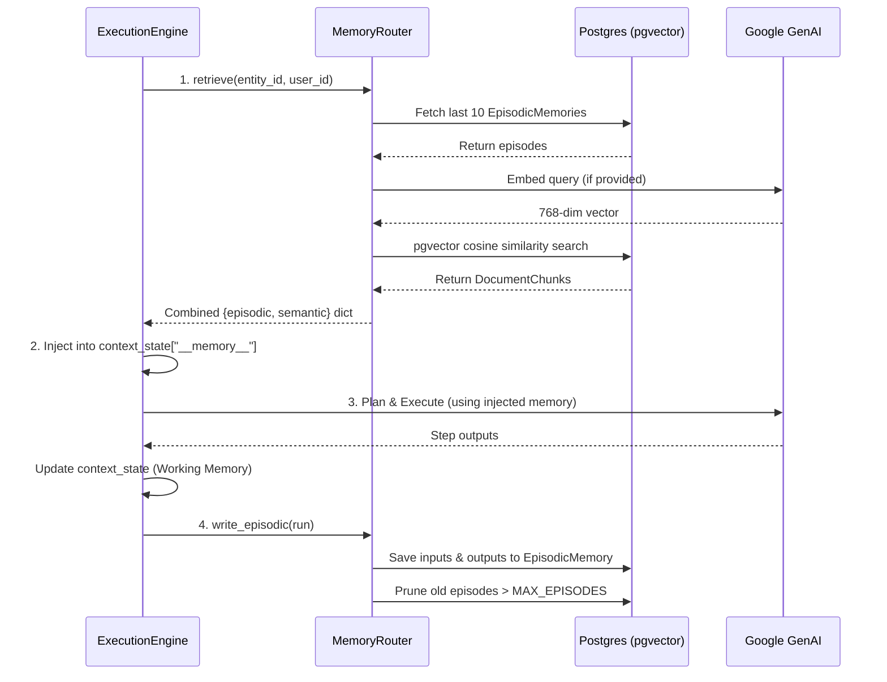

# Memory System Architecture Report

## 1. Introduction and Overview
The HireBuddha platform implements a sophisticated, three-tier memory architecture to provide AI agents with immediate context, short-term conversational history, and long-term knowledge retrieval. This document outlines the functional data flow and technical implementation details of this memory system.

The core component orchestrating these interactions is the `MemoryRouter`, which sits between the execution engine (`worker.py`) and the persistence layer (PostgreSQL database).

## 2. The Three Memory Tiers

The memory system is divided into three distinct tiers, each serving a specific purpose in the agent's cognitive loop:

### 2.1 Working Memory (In-Process)
- **Purpose**: Current execution context state.
- **Scope**: Exists only for the duration of a single `ExecutionRun`.
- **Persistence**: Maintained in memory during execution and eventually saved as JSON in `ExecutionRun.context_state`.
- **Retrieval (When)**: Implicitly loaded at the start of an `ExecutionRun` (often initialized via the user `input_data`) and passed sequentially from step to step during the plan execution.
- **Retrieval (How)**: Extracted directly from memory structures (`run.context_state`) or filtered via an entity's `ContextPolicy` before being passed to an LLM tool or generation step.
- **Cost**: No additional persistence costs or database hits during active step execution.

### 2.2 Episodic Memory (Short-Term History)
- **Purpose**: Short-term interaction records to track what the agent has recently done or discussed with a specific user/entity.
- **Persistence**: Saved in the `episodic_memories` table in PostgreSQL.
- **Retention**: Pruned to maintain only the last `N` episodes (by default, `MAX_EPISODES = 10`) per entity/user pair.
- **Retrieval (When)**: Explicitly queried _before_ the agent begins its dynamic plan generation, at the very start of `Worker.execute_run()`.
- **Retrieval (How)**: The `MemoryRouter.retrieve(entity_id, user_id)` interface executes a SQL `SELECT` to fetch the most recent records, ordered by creation date. These records are then serialized into a markdown block via `format_for_prompt()` and injected into the Working Memory.
- **Content**: Contains concise summaries of the run's input/output, execution cost, token usage, tool invocation metadata, and status.

### 2.3 Semantic Memory (Long-Term Knowledge)
- **Purpose**: Long-term vectorized knowledge base, capable of retrieving relevant document snippets based on contextual meaning.
- **Persistence**: Stored in the `document_chunks` table, which relies on the `pgvector` PostgreSQL extension.
- **Technology**: Uses Google's `text-embedding-004` model to generate 768-dimensional vectors. Retrieval relies on cosine similarity (`<=>`) vector operators.
- **Retrieval (When)**: Queried simultaneously with Episodic Memory _before_ plan execution, provided there is a specific `query` context passed to `MemoryRouter.retrieve()`.
- **Retrieval (How)**: The `search_semantic` method calls the embedding API to convert the text query into a vector. It then executes a nearest-neighbor SQL query (`ORDER BY embedding <=> CAST(:vec AS vector) LIMIT :top_k`) to fetch the most semantically relevant chunks. These chunks are appended to the markdown block generated by `format_for_prompt()`.

## 3. Architecture and Technical Implementation

### 3.1 Core Components

1. **`src.ai.memory_service.MemoryRouter`**: The central service class.
    * `retrieve(entity_id, user_id, query)`: Loads both Episodic (latest `N` interactions) and Semantic (Top `K` embeddings) memories into a unified dictionary.
    * `format_for_prompt(memory)`: Converts the structured memory payload into a flat text format suitable for prompt injection.
    * `write_episodic(run)`: Summarizes an `ExecutionRun` (using a 400-char summarization constraint) and stores it in the database. Also handles automatic pruning of old episodes.
    * `search_semantic(entity_id, query)`: Embeds the query and runs a pgvector text query (`SELECT ... FROM document_chunks ORDER BY embedding <=> CAST(:vec AS vector)`).

2. **Database Models (`src.ai.models`)**:
    * `EpisodicMemory`: Tracks `run_id`, `input_summary`, `output_summary`, `metadata_info` (for used tools).
    * `Document` & `DocumentChunk`: Stores uploaded files. `DocumentChunk` holds the raw `content` and the 768-dimensional `embedding`.

### 3.2 Diagram: Tiered Architecture

```mermaid
graph TD
    classDef memoryTier fill:#f9f,stroke:#333,stroke-width:2px;
    classDef router fill:#bbf,stroke:#333,stroke-width:2px;
    classDef pgdb fill:#dfd,stroke:#333,stroke-width:2px;

    WM[Working Memory<br/>In-Process Dict]:::memoryTier
    EM[Episodic Memory<br/>Recent Interactions]:::memoryTier
    SM[Semantic Memory<br/>Vectorized Knowledge]:::memoryTier
    
    MR(MemoryRouter) :::router
    Worker(worker.py - ExecutionEngine)
    PG[(PostgreSQL DB)]:::pgdb

    Worker -->|1. Context State| WM
    Worker -->|2. retrieve & write| MR
    
    MR -->|Queries/Prunes| EM
    MR -->|Cosine Similarity| SM
    
    EM -.-> PG
    SM -.->|pgvector| PG
```

## 4. Functional Data Flow

The lifecycle of memory during an agent's execution is handled entirely within `ExecutionEngine.execute_run` (in `worker.py`).

### Step-by-Step Flow:
1. **Pre-Execution Retrieval**: Before plan generation or tool execution, the worker instantiates `MemoryRouter`. It calls `memory_router.retrieve(...)` to fetch up to 10 recent episodes and up to 5 relevant semantic chunks.
2. **Context Injection**: The retrieved arrays are formatted into a single markdown string using `format_for_prompt(...)`. This string is injected into the current `ExecutionRun`'s context dictionary under the special key `__memory__`.
3. **Execution (Working Memory)**: The agent dynamically plans and executes steps. Outputs from intermediate steps (e.g., tool outputs, child invocations) are written directly into `context_state` (Working Memory).
4. **Post-Execution Persistence**: Once all steps complete successfully (or fail), the final `ExecutionRun` summary is generated. For top-level runs (where `parent_run_id` is null), `memory_router.write_episodic(run)` is called to save the interaction pattern into the `EpisodicMemory` table.

### 4.1 Diagram: Execution Data Flow



## 5. Explicit Data Injection Example

To understand how memory manifests for the AI model, here is the output generated by `format_for_prompt` that gets injected into the `__memory__` context key:

```markdown
## Recent Interaction History
  [2026-03-05T10:00:00Z] User asked: "What is my PTO balance?" → Agent replied: "You have 120 hours of PTO remaining."
  [2026-03-05T10:05:00Z] User asked: "Request 8 hours off for tomorrow." → Agent replied: "Your request for 8 hours on March 6th has been submitted."

## Relevant Knowledge
  (score 0.89) PTO requests require manager approval if the duration exceeds 5 consecutive business days. Employees must hold a positive balance prior to submission...
```

This text is provided passively to the agent model, ensuring that it remains grounded in past interactions and relevant semantic documents during dynamic plan generation and execution.
