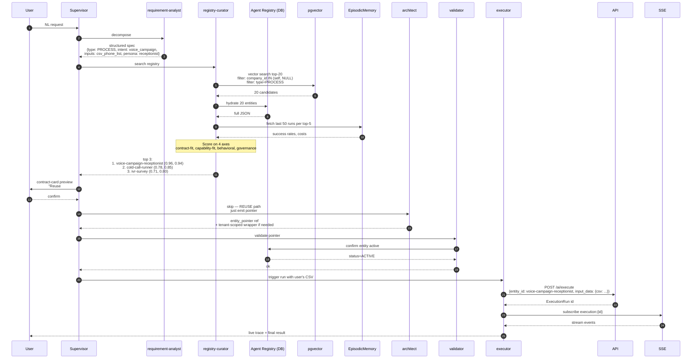
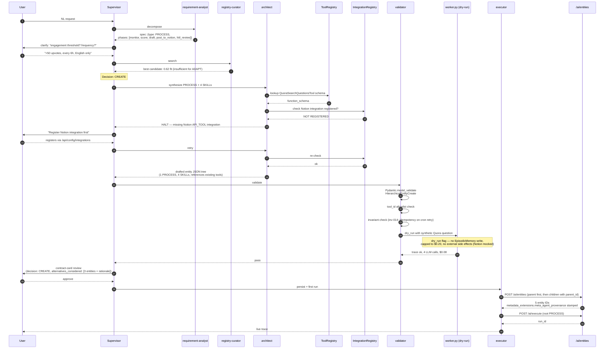

# Meta-Agent on HireBuddha — Architectural Brainstorm

**Author:** Architect (working session)
**Date:** 2026-05-10
**Status:** Brainstorm / pre-design (not a build spec)
**Audience:** Senior engineers familiar with `backend/src/ai/*`

---

## 0. Stance (read this first)

Before any options analysis: a few opinions that shape every section below. Disagree explicitly if you want to redirect.

1. **The Meta-Agent must live inside the same `HierarchicalEntity` system it is generating into.** It is a `PROCESS` entity, with sub-`AGENT`s, persisted in `hierarchical_entities` (`company_id = NULL`, `is_template = True`). It eats its own dog food. This is non-negotiable for two reasons: (a) it inherits HITL, billing, observability, idempotency, CORTEX memory for free; (b) every "should the Meta-Agent be able to do X?" question reduces to "does the platform allow a Process to do X?" — a question we already have answers for.

2. **Knowledge representation must split structural from behavioral.** Structural knowledge (Pydantic schemas in `backend/src/ai/schemas.py`, the 8 JSON columns on `HierarchicalEntity`, the `ToolRegistry`, `IntegrationRegistry`, `ModelTaskDefaults`, `task_type` enum) is *deterministic* — it should be a build-time manifest, not a RAG corpus. Behavioral knowledge (what an existing agent actually *does* under load, what a tool's edge cases are) is *empirical* — it should come from `EpisodicMemory` and `LLMInteractionLog`, not from re-reading the code.

3. **Reuse is not a binary.** A four-tier decision (`REUSE` → `ADAPT` → `COMPOSE` → `CREATE`) maps cleanly to the platform's existing primitives:
   - `REUSE` = pointer to existing `entity_id`
   - `ADAPT` = generate a thin `SKILL` wrapper that handles `io_contract` bridging, parent points to the existing AGENT
   - `COMPOSE` = generate a `PROCESS` whose `hierarchy.children` are existing entities
   - `CREATE` = full `entity` synthesis with new tools/prompts
   The architecture should make `ADAPT` and `COMPOSE` cheap, because they are the anti-sprawl path.

4. **Code understanding ≠ code reading.** The Meta-Agent should not RAG over `service.py` to figure out how execution works. It should read the *contract surface* (Pydantic schemas, OpenAPI doc, registered tool function-schemas via `Tool.get_function_schema()`). Reading implementation invites it to hallucinate semantics that aren't actually in the schema.

5. **Migration churn is 2–3/week.** Any cached/static artifact must be invalidated on `alembic` head change. Treat platform manifest like a generated client SDK: it has a version, it's regenerated on schema change, and stale clients fail loudly.

---

## A. Knowledge Representation

### Options

**Option A1 — Static ingestion (RAG over codebase + vector index over agent registry).**
Embed every Python file in `backend/src/ai/*`, plus every entity in `hierarchical_entities`, into pgvector (the platform already runs `pgvector/pgvector:pg15`). Retrieve at query time.

- **Pros:** Mechanical to build. Reuses existing vector infrastructure. Catches comments and docstrings.
- **Cons:** Drift is silent (code at chunk N may contradict code at chunk M). LLM gets noise — implementation details (`session.execute(...)`) that don't bear on agent design. Code semantics are not localised: the *contract* of `HierarchicalEntity` is split across `models.py:44-85`, `schemas.py:8-12`, `schemas.py:476-481` and the JSON column shape — naive chunking shreds it.
- **When wrong:** It will confidently propose an entity with `governance.hitl_checkpoints[].trigger_type = "ON_FAILURE"` because it pattern-matched against an unrelated string. There is no such enum value (the actual values per `schemas.py` are `BEFORE_STEP, AFTER_STEP, COST_THRESHOLD, TOOL_CALL, CUSTOM`).

**Option A2 — Dynamic reflection (live introspection at every query).**
Each Meta-Agent invocation queries `GET /ai/entities`, the `ToolRegistry` (via a new `GET /ai/tools` endpoint), `IntegrationRegistry`, `ModelTaskDefaults`, and the OpenAPI schema (`/openapi.json`).

- **Pros:** Always fresh. No drift. Truthful by construction.
- **Cons:** Latency per request (5–10 round trips). Embeddings still needed for semantic agent search. Doesn't capture *behavior* — only declared shape.
- **When wrong:** Tells the user "this tool exists" because it's registered, but the tool's last 50 invocations all errored — declared ≠ working.

**Option A3 — Hybrid with a compiled platform manifest + live registry queries + behavioral telemetry.** *(Recommended.)*

Three layers, each with a clear role:

| Layer | Substrate | Refresh trigger | Used for |
|---|---|---|---|
| **Structural** | `platform_manifest.json` build artifact extracted from Pydantic schemas, ToolRegistry, OpenAPI, alembic head | CI step on every commit touching `schemas.py`, `models.py`, `tools/*`, or migrations | "What is a valid HITL checkpoint?" "What tool IDs exist?" "What `task_type` values are accepted by `ModelTaskDefaults`?" |
| **Registry (live)** | Direct DB read of `hierarchical_entities`, `IntegrationRegistry`, `ModelTaskDefaults`, `ToolRegistryEntry` | Every Meta-Agent run | "What agents does this tenant already have?" "What LLM creds are configured for this `company_id`?" |
| **Behavioral** | pgvector index over `(name, description, goal, io_contract.input_schema, io_contract.output_schema)` of entities + summary embeddings of `EpisodicMemory` records | Incremental: trigger on `entities.updated_at`, append-only on new `EpisodicMemory` row | "Find me agents semantically similar to 'cold-email an enriched lead list'" "How did similar agents perform on similar inputs?" |

**Why this split is right for HireBuddha:**
- The platform manifest can be *generated* by walking `EntityType`, `EntityStatus`, `ReasoningMode`, `HITLCheckpoint`, `ToolReference`, `task_type` — all already Pydantic models in `schemas.py:8-490`. There is nothing to RAG; the schemas *are* the contract.
- The 60-second cache in `ConfigService.resolve_api_key` (`backend/src/config/service.py:42-90`) means live integration lookups are essentially free.
- The pgvector instance is already running — no new infra.
- `EpisodicMemory` (`backend/src/ai/models.py:17-42`) already records `input_summary, output_summary, total_cost_usd, status` per top-level run — that's a behavioral corpus we get for free.

**Drift handling:** The manifest carries an `alembic_head` hash and a `schemas.py` SHA. If either changes, the Meta-Agent's first action on next invocation is to refuse to operate and emit a `manifest_stale` error. This is loud-fail by design — the alternative is silent agent corruption.

**The hidden complexity that nobody talks about:** *execution semantics* are not in the schema. "What does it mean for a `PROCESS` to call a child `AGENT` whose `governance.max_recursion_depth` is exceeded?" The answer lives in `worker.py`, not `schemas.py`. For these questions, the manifest must include a curated set of **invariant statements** — short, hand-authored claims like:

> `inv-001`: A child entity inheriting a parent's `context_state` does so by reference; mutations are visible upward.
> `inv-014`: `consume_incremental` is called *after* step completion; mid-step crashes do not bill.
> `inv-022`: HITL `auto_approve_on_timeout=False` blocks indefinitely if no reviewer responds.

These are tested with a snapshot test: when `worker.py` changes, an LLM-graded test asks "does invariant `inv-014` still hold given this diff?" If the Meta-Agent acts on stale invariants, executions misbehave invisibly. This is where the system can quietly break.

---

## B. Reuse vs. Create Decision Engine

### The actual problem

A naive embedding-cosine retrieval will collapse "send emails to leads" and "draft emails to leads" into the same bucket — but they bind to different tools (`EmailSendTool` vs `EmailDraftTool`) and have completely different governance profiles (one mutates outside world; one doesn't). So the decision engine must score on **multiple axes** and fail loudly when they disagree.

### Recommended pipeline (5-stage funnel)

```
NL request
   │
   ▼
[1] Intent classifier (cheap Haiku call)
   ├─ predicts entity_type ∈ {ACTION, SKILL, AGENT, PROCESS}
   ├─ extracts atomic verbs + objects
   └─ predicts probable tool_categories
   │
   ▼
[2] Vector retrieval (top-20 candidates)
   ├─ Query: NL + structured intent
   ├─ Index: (name, description, goal, io_contract) of entities w/ status=ACTIVE
   └─ Filter: entity_type matches predicted, company_id IN {self, NULL}
   │
   ▼
[3] Contract-fit scoring (deterministic)
   ├─ JSON schema compatibility: input_schema ⊇ user's described inputs?
   ├─ JSON schema compatibility: output_schema ⊆ user's described outputs?
   └─ Score = 0..1, with a "bridging cost" estimate (count of fields needing transform)
   │
   ▼
[4] Capability-fit scoring (deterministic)
   ├─ Tool overlap: (required_tools ∩ entity.capabilities.tools) / required_tools
   ├─ Model fit: does the tenant's ModelTaskDefaults cover this entity's reasoning_config?
   └─ Governance fit: does entity's max_cost_usd / hitl_checkpoints satisfy user's risk profile?
   │
   ▼
[5] LLM judge (Sonnet, top-5 only, structured rubric)
   ├─ Outputs: {decision: REUSE|ADAPT|COMPOSE|CREATE, target_entity_ids: [...], rationale}
   └─ Calibrated against thresholds (see below)
```

### Decision rubric

| Decision | Trigger | Output |
|---|---|---|
| **REUSE** | One candidate with contract-fit ≥ 0.95 AND capability-fit ≥ 0.9 | Pointer to `entity_id` + `parent_id` for orchestration |
| **ADAPT** | One candidate with contract-fit ≥ 0.7 AND capability-fit ≥ 0.85, and bridging is *purely schema* (no new tools, no new LLM logic) | New `SKILL` whose body is "transform input → call existing AGENT → transform output". Existing entity unchanged. |
| **COMPOSE** | ≥ 2 candidates each with capability-fit ≥ 0.7 covering disjoint phases of the request | New `PROCESS` whose `hierarchy.children` references existing AGENTs in sequence. No new logic; only a planner/router skill if needed. |
| **CREATE** | All else | New entity (most expensive path, highest sprawl risk) |

### The "near-miss" problem

The 80% case is the hardest. Two principled answers:

- **Default to ADAPT, not fork.** Forking duplicates maintenance burden — the existing agent will get bug fixes the fork won't. An adapter `SKILL` is cheap and the existing entity remains the source of truth.
- **Reject ADAPT if the divergence is in `governance` or `reasoning_config`.** Schema bridging is fine. Different cost ceilings, different model preferences, different HITL checkpoints — these are *behavioral* differences the user should be forced to commit to. Push to CREATE with a warning.

### Anti-sprawl mechanisms

1. **`metadata_extensions.meta_agent_provenance`** — every entity created by the Meta-Agent stamps `{generated_by: "meta-agent", session_id, decision: REUSE|ADAPT|COMPOSE|CREATE, candidates_considered: [entity_ids], rationale}`. This makes "did the Meta-Agent skip an obvious reuse?" answerable by SQL.
2. **Sprawl detector cron** — periodic job: for each Meta-Agent-generated entity within 30 days, recompute the reuse score against the registry *as it exists now*. If a generated entity now scores REUSE against an older entity, flag it. Closed loop on "the registry filled in around me".
3. **Meta-Agent asks "are you sure?" before CREATE.** UX: the user has to actively reject the top reuse candidate. Friction is the feature.

---

## C. Meta-Agent's Own Architecture

### Options

**Option C1 — Single monolithic `AGENT` with many tools.**
One entity, one prompt, tools = `[search_registry, embed, validate_schema, write_entity, dry_run_entity]`.

- **Pros:** Trivial to build. Inherits HITL/billing automatically.
- **Cons:** The prompt becomes a multi-thousand-token kitchen sink. No state separation between "I'm analyzing requirements" and "I'm validating output". One bad reasoning chain corrupts everything.

**Option C2 — Recursive self-modifier.**
Meta-Agent that writes its own sub-agents on demand and invokes them. Pure beauty, infinite mess.

- **Pros:** None that justify the cost.
- **Cons:** Verification is undecidable in general. Audit becomes archaeology. Loud-fail on infinite regress is harder than not allowing it.

**Option C3 — Supervisor `PROCESS` with five typed sub-`AGENT`s.** *(Recommended.)*

```
PROCESS: meta-agent
├── AGENT: requirement-analyst    (decompose NL → structured spec)
├── AGENT: registry-curator       (search, score, decide REUSE/ADAPT/COMPOSE/CREATE)
├── AGENT: architect              (synthesize HierarchicalEntity JSON)
├── AGENT: validator              (Pydantic + invariant checks + dry-run)
└── AGENT: executor               (live run, observe, self-correct)
```

Each is itself a `HierarchicalEntity` with the right `governance.max_cost_usd`, the right narrow tool list, the right CORTEX subtree.

**Why this is right for HireBuddha specifically:**
- Each sub-agent's `governance.hitl_checkpoints` can fire independently. `architect` can require human approval before write; `executor` can require approval before invoking any tool with `access_level = WRITE`. (See `schemas.py:398-399`.)
- Each sub-agent's `EpisodicMemory` rows are queryable separately — you can ask "how often does the validator reject the architect's output?" That's a quality signal.
- `governance.max_recursion_depth` limits the supervisor's ability to call itself. Set it to 1 for safety; the meta-agent does not call meta-agents.

### Memory model

- **Per-session CortexTree** rooted on the supervisor run. Branches:
  - `requirements/` — user-provided spec, clarifications
  - `candidates/` — registry search results, scoring
  - `design/` — synthesized entity JSON, alternatives considered
  - `validation/` — Pydantic errors, dry-run traces
  - `decisions/` — finalized REUSE/ADAPT/COMPOSE/CREATE choices with rationale
- **Cross-session memory: design rationale corpus.** A new table `meta_agent_decisions` (or just `metadata_extensions.meta_agent_provenance` aggregated): for every CREATE, store the rationale and what was rejected. Future runs retrieve this — "last time someone asked for a 'lead enrichment + outreach' agent, we created X; here's why we didn't reuse Y."
- **No external memory graph.** CORTEX already gives us tree memory with paging and resume cursors (`CortexTree.resume_cursor_id`, `cortex_models.py:65-99`). Building a parallel graph DB is unjustified.

### Tool inventory for the supervisor

| Sub-agent | Tools (existing or new) |
|---|---|
| requirement-analyst | None. Pure reasoning over NL + clarification turns. |
| registry-curator | `entity_registry_search` (new — wraps pgvector), `entity_get` (wraps `GET /ai/entities/{id}`), `episodic_memory_search` (new), `tool_registry_list` (new) |
| architect | `platform_manifest_read` (new — local file), `entity_draft_validate` (new — Pydantic dry-validate without persisting), `tool_function_schema_lookup` |
| validator | `entity_dry_run` (new — execute against `worker.py` with a synthetic input + `dry_run=True` flag added to `ExecutionRunCreate`), `pydantic_validate`, `governance_check` |
| executor | `entity_create` (`POST /ai/entities`), `entity_execute` (`POST /ai/execute`), `execution_stream` (SSE consumer over Redis pubsub `execution:{id}`) |

Most of these tools are thin wrappers over endpoints that already exist (`backend/src/ai/router.py:19-199`). The genuinely new ones are `entity_draft_validate` (validate Pydantic without persisting) and `entity_dry_run` (execute without writing to `EpisodicMemory` and without consuming credits beyond a sandbox cap).

---

## D. Code Understanding Depth

The platform's complexity is concentrated in three places:
1. `worker.py` — the execution loop, recursion, context propagation.
2. `governance_service.py` — HITL checkpoint evaluation.
3. `tool_executor.py` — tool dispatch, rate limits, idempotency.

Trying to make the Meta-Agent "understand" these via LLM-comprehension is the wrong investment.

### Tiered approach

**Tier 1 — Structural (deterministic, build-time).**
- Walk `schemas.py` with `pydantic.fields` to extract every Pydantic model, every enum, every constraint.
- Walk `tools/__init__.py` — invoke `ToolRegistry.list_tools()` to dump all tool function-schemas (`Tool.get_function_schema()`).
- Walk `IntegrationRegistry` — list all `service_category` × `task_type` cells.
- Emit a single `platform_manifest.json` (~50–200KB).

**Tier 2 — Behavioral (LLM-comprehended, refresh on demand).**
- For each tool, take its source file and run a one-shot Sonnet pass: "summarize the failure modes, side effects, idempotency, and rate-limit behavior of this tool in ≤80 words." Cache by file SHA.
- For each invariant in the curated list (Section A), run a snapshot check on commit.
- Cost: bounded — one pass per file change, not per query.

**Tier 3 — Empirical (query-time).**
- For any candidate entity in REUSE/ADAPT/COMPOSE consideration, fetch its last N `EpisodicMemory` records. Look at `status` distribution, average `total_cost_usd`, average `execution_time_ms`. Feed into the LLM judge.
- This is the *only* place where the Meta-Agent looks at runtime data, and it's exactly where declared ≠ actual matters.

### What I would *not* do

- AST parsing of `worker.py` to model execution semantics. The semantics are not local; they involve Arq queues, Redis state, DB rows. Static analysis will miss the parts that matter.
- Runtime instrumentation. We already have `LLMInteractionLog`, `ToolInteractionLog`, `EpisodicMemory`. That's enough.
- LLM verification by test execution at every Meta-Agent run. Reserve test execution for the validator's dry-run, and only on CREATE/ADAPT.

---

## E. User Interaction Model

### Conversational refinement, capped at three rounds

One-shot specification fails because users don't know what they don't know about `governance` and `io_contract`. But unbounded clarification annoys.

**Round 1 — Intent + reuse offer.**
Meta-Agent presents:
- Restated intent (1 paragraph)
- Top 3 reuse candidates with contract-fit and capability-fit scores
- A "create new" option
- Asks one clarifying question max

User picks a path or refines the intent.

**Round 2 — Schema + governance.**
Meta-Agent presents the proposed entity's *contract card* (see below), with everything the user didn't specify filled in with defaults:
- `io_contract.input_schema`, `output_schema` — drafted from the request
- `governance.max_cost_usd`, `max_recursion_depth`, `timeout_ms`
- `governance.hitl_checkpoints` — proposed checkpoints based on tool risk
- `capabilities.tools` — explicit list

User edits inline.

**Round 3 — Dry-run review.**
Meta-Agent runs `entity_dry_run` with a synthetic input. Shows the trace. User signs off.

### Contract card (the artifact the Meta-Agent presents)

```yaml
agent_contract_card:
  decision: ADAPT
  base_entity: "9f3e2c-existing-lead-enrichment-agent"
  new_entity:
    type: SKILL
    name: "lead_enrichment_for_b2b_saas"
    io_contract:
      input_schema:  {company_domain: str, employee_min: int}
      output_schema: {firmographics: dict, decision_makers: list[Contact]}
    capabilities.tools: [entity_invoke[id=9f3e2c-...], company_data_normaliser]
    governance:
      max_cost_usd: 0.40
      hitl_checkpoints:
        - trigger_type: COST_THRESHOLD
          threshold: 0.30
  guarantees:
    - Will not call any tool with access_level=WRITE without HITL approval.
    - Bounded cost: $0.40 per invocation.
    - Idempotent on retry by company_domain.
  limitations:
    - Does NOT enrich personal email addresses (base entity excludes them).
    - English-only company descriptions.
  observability:
    sse_channel: "execution:{run_id}"
    cost_breakdown: per-step in ToolInteractionLog
```

This is the user's primary deliverable. They sign on this, not on the prompt.

### Presentation discipline

- Reuse offers shown as a *table*, not prose. Three rows max.
- Scores are shown numerically (0.92, 0.84) — users learn to read them.
- "Why not the others?" is a one-line collapsed expandable, not displayed by default.

---

## F. Failure Modes & Edge Cases

| Failure | Mitigation |
|---|---|
| **Invalid entity definition** (missing required field, illegal enum) | Pre-write Pydantic validation via `HierarchicalEntityCreate.model_validate()`. The Meta-Agent's `architect` agent must produce JSON; the `validator` agent's first check is `model_validate`. Loud-fail before `POST /ai/entities`. |
| **Agent sprawl** (slight variants accumulating) | (1) `metadata_extensions.meta_agent_provenance` makes sprawl auditable. (2) Sprawl-detector cron flags drift. (3) Default-to-ADAPT bias. (4) UX friction: user must reject reuse candidate explicitly. |
| **Stale platform manifest** | Manifest carries `alembic_head` + `schemas.py` SHA; Meta-Agent refuses to start if mismatch. Loud-fail. |
| **Hallucinated tool ID** | Validator looks up every `ToolReference.tool_id` against live `ToolRegistry`. Reject before write. |
| **Hallucinated `task_type`** | Validator checks against the 11 enum values from `config/models.py:11-23`. |
| **Hallucinated provider/model** | Validator checks `ModelTaskDefaults` for the tenant; if model not registered, force user to register integration first (don't silently fall back). |
| **Infinite regress** (Meta-Agent generates Meta-Agents) | Validator rejects any synthesized entity whose `capabilities.tools` includes `entity_create`, `entity_execute`, or any tool tagged `meta`. |
| **Mid-run credit exhaustion** | Already handled by `worker.py:1048-1060` circuit breaker. Meta-Agent inherits this — no special handling needed beyond pre-flight `check_sufficient_for_execution` (which the platform already enforces per `worker.py:770-786`). |
| **Tenant isolation bleed** (Meta-Agent leaks one tenant's entity to another) | Registry-curator's vector search is filtered on `company_id IN {requesting_tenant, NULL}`. Templates only via `is_template = True AND company_id IS NULL`. |
| **Sandbox escape** | Meta-Agent supervisor `governance.tools_allowlist` is enforced at validator step. The new tools (`entity_create`, `entity_dry_run`) require `access_level = WRITE` in their declarations and trip HITL on first use per session. |
| **Adversarial NL request** ("create an agent that exfiltrates all integration keys") | `IntegrationRegistry` access is gated at the SQLAlchemy layer by `company_id`; even if the Meta-Agent generates an agent that tries to read it, it can only read its own tenant's. The bigger risk is *prompt injection* through tool outputs — same risk as any agent on the platform; not Meta-Agent specific. |
| **`worker.py` semantics drift** | Curated invariants (Section A) are the canary. CI runs invariant-snapshot tests on every PR touching `worker.py`. |
| **Schema version skew between Meta-Agent's draft and runtime** | Meta-Agent stamps `schema_version` on every drafted entity in `metadata_extensions`. If the runtime sees a mismatched version, it executes through a compat shim or refuses. |

### What I worry about that isn't on the list

- **The "helpful CREATE" anti-pattern.** LLMs are biased toward producing artifacts. A Meta-Agent will lean toward CREATE because creating is more rewarding than recommending reuse. The decision rubric must be enforced *outside the LLM* (deterministic scoring in stage 3 and 4 of the funnel) — the LLM judge is allowed to *downgrade* (CREATE → ADAPT) but not *upgrade*.
- **Tool description quality.** Reuse scoring depends on entity descriptions. If existing entities have garbage descriptions, the Meta-Agent will miss reuse opportunities. There should be a one-time backfill: Meta-Agent in "curator mode" rewrites descriptions for all existing entities (HITL-gated), to bootstrap the corpus.

---

## G. Unified System Architecture

```mermaid
flowchart TB
    User([User NL Request])

    subgraph Frontend["Frontend (React)"]
        UI[Meta-Agent Console<br/>contract-card UX]
    end

    subgraph MetaAgent["Meta-Agent (HierarchicalEntity PROCESS, is_template=True)"]
        Sup[Supervisor]
        RA[requirement-analyst<br/>AGENT]
        RC[registry-curator<br/>AGENT]
        Arch[architect<br/>AGENT]
        Val[validator<br/>AGENT]
        Exe[executor<br/>AGENT]

        Sup --> RA
        Sup --> RC
        Sup --> Arch
        Sup --> Val
        Sup --> Exe
    end

    subgraph Knowledge["Knowledge Substrate"]
        PM[(platform_manifest.json<br/>build artifact<br/>alembic_head + schemas SHA)]
        Inv[(curated invariants<br/>inv-001..N)]
        TBeh[(tool behavioral summaries<br/>cached by file SHA)]
    end

    subgraph LiveData["Live Platform State"]
        AR[(hierarchical_entities)]
        AE[(pgvector embeddings<br/>name+desc+goal+io_contract)]
        TR[(ToolRegistry runtime)]
        IR[(IntegrationRegistry)]
        MTD[(ModelTaskDefaults)]
        EM[(EpisodicMemory<br/>behavioral telemetry)]
        CT[(CortexTree per session)]
    end

    subgraph Runtime["Existing Runtime (unchanged)"]
        API[/ai/entities, /ai/execute<br/>FastAPI router/]
        Worker[Arq worker<br/>execute_run]
        Gov[GovernanceService<br/>HITL]
        LLMR[LLMRouter]
        Bill[CreditService<br/>circuit breaker]
        SSE[SSE stream<br/>Redis pubsub<br/>execution:&#123;id&#125;]
    end

    User --> UI
    UI <--> Sup

    RA -.reads.-> PM
    RC -.reads.-> AE
    RC -.reads.-> AR
    RC -.reads.-> EM
    Arch -.reads.-> PM
    Arch -.reads.-> TR
    Arch -.reads.-> IR
    Arch -.reads.-> MTD
    Val -.reads.-> PM
    Val -.reads.-> Inv
    Val -.dry-run.-> Worker

    Exe --> API
    API --> Worker
    Worker --> Gov
    Worker --> LLMR
    Worker --> Bill
    Worker --> SSE
    SSE --> Exe
    Exe -.observes.-> EM

    Sup <--> CT

    classDef new fill:#fde68a,stroke:#92400e
    classDef live fill:#bfdbfe,stroke:#1e40af
    classDef existing fill:#d1fae5,stroke:#065f46
    class MetaAgent,Knowledge new
    class LiveData live
    class Runtime existing
```



**Color coding:**
- Yellow = new components introduced by this design
- Blue = existing data the Meta-Agent reads
- Green = existing runtime, *unchanged*

The whole point: **green is unchanged**. The Meta-Agent is a citizen of the existing platform, not a parallel system.

---

## H. Data Flow — Reuse Case

User: *"Build me an agent that takes a CSV of phone numbers and triggers a voice campaign with a friendly receptionist persona, using our existing voice setup."*



**Key property:** no new entity is written. The Meta-Agent's output is `{decision: REUSE, entity_id: existing}`. The user's CSV runs against an existing, already-tested agent. No sprawl, no maintenance, no schema drift.

---

## I. Data Flow — Create-from-Scratch Case

User: *"I need an agent that monitors my Quora questions for ones with high engagement, drafts answer outlines, and posts them to Notion for me to review before publishing."*

No existing entity covers this composition; tools needed include `QuoraSearchQuestionsTool` (exists), Notion integration (does not exist yet).



**Key properties:**
- The architect *halted* on missing Notion integration rather than synthesize a broken entity. This is the validator catching configuration drift before it becomes a runtime failure.
- The validator dry-run uses a `dry_run=True` flag (new) on `ExecutionRunCreate` that suppresses `EpisodicMemory` writes and caps cost. This needs platform support — see open questions.
- Every persisted entity has `metadata_extensions.meta_agent_provenance` stamped, including the rejected alternatives. This is the audit trail.
- Persistence order matters: children need `parent_id` of an already-created parent. The `architect` must topologically sort and the `executor` must POST in that order. (`HierarchicalEntity.parent_id` FK constraint, `models.py:80-81`.)

---

## J. Critical Unanswered Questions

These are blockers I need resolved before I'd write a build spec.

1. **Does the platform support a `dry_run=True` flag on `ExecutionRunCreate`?** It does not today. `worker.py:execute_run` always writes to `EpisodicMemory` and consumes credits. Adding dry-run requires: (a) schema flag, (b) skip `consume_incremental` calls, (c) skip `EpisodicMemory` writes, (d) sandbox external-side-effect tools (a tool-level `is_dry_run` context). This is a non-trivial platform change — is it acceptable to land before Meta-Agent work?

2. **Is `metadata_extensions` allowed to grow unboundedly, or do we need a sibling `entity_provenance` table?** Storing provenance + alternatives_considered + design rationale could push large payloads (several KB per entity). JSON column is fine for ≤16KB; beyond that, indexing and query cost suffer. Likely answer: separate table, with FK to `hierarchical_entities.id`.

3. **What is the embedding model for the agent registry?** Current platform uses Gemini text embeddings for RAG (per README). Should the Meta-Agent's reuse vector index use the same model, or a higher-fidelity one (e.g., `text-embedding-3-large`)? Latency is fine either way; quality matters more here than for document RAG. Probably needs a tenant-blind dedicated index.

4. **Cross-tenant template surfacing.** A REUSE candidate might be a public template (`company_id = NULL, is_template = True`) authored by a different tenant. Today templates are public per the recent migration (`v1w2x3y4z5a6_make_templates_public.py`). Are partners ok with their templates being recommended to other tenants by an automated agent? Legal/policy question, not technical.

5. **Who pays for the Meta-Agent's runs?** It consumes credits like any other entity. But its work serves the tenant before any production agent runs. Plausible models: (a) charge tenant normally, (b) charge a separate "design" SKU at a flat rate, (c) free for App Admin tenant only. Pricing impacts adoption.

6. **HITL fatigue.** If every CREATE/ADAPT requires user approval at multiple checkpoints (Round 1, Round 2, Round 3, validator dry-run), the UX collapses. Need a calibrated trust ladder: first 5 Meta-Agent uses per tenant are heavily HITL'd; afterward, only governance-relevant changes (cost ceilings, write-tools, new integrations) require approval. Implementation: per-tenant `meta_agent_trust_level` setting.

7. **Schema version evolution policy.** When `schemas.py` adds a new required field to `governance`, all existing Meta-Agent-generated entities break their validation but still run via legacy paths. What's the migration story for the Meta-Agent's understanding of "valid"? Likely: every Meta-Agent session pins to the current `schema_version`; older drafts get migrated automatically when re-edited.

8. **Voice/streaming agents.** The platform has rich voice/WhatsApp campaign support (`backend/src/voice/*`, `backend/src/ai/campaign_*`). Voice agents have peculiar lifecycle (DID assignment, stream_sid management, campaign throttling). Does the Meta-Agent treat these as a special class with extra synthesis rules, or is the existing `HierarchicalEntity.identity.voice` enough? My read is the latter, but it should be confirmed by walking a voice agent end-to-end through the architect.

9. **Tool tenant-scoping for Meta-Agent's own tools.** New tools (`entity_create`, `entity_dry_run`, `entity_registry_search`) — are they registered globally (`ToolRegistry._tools`) or as App Admin tenant-scoped (`_tenant_tools`)? If global, every tenant's agents can call them, which is wrong. If App-scoped, the Meta-Agent runs as App tenant and crosses tenant boundaries on every call. Suggest: a *new* third scope — "platform-internal" — with explicit allowlist of which entities (Meta-Agent supervisor and its 5 sub-agents only) can bind them.

10. **Bootstrapping the description corpus.** The reuse engine's quality is a function of how good entity `description` and `goal` fields are. Today there's no enforcement that they be informative. Before Meta-Agent ships, do we run a one-time backfill ("curator mode" rewriting descriptions on existing entities) and add a lint at create-time? This is a soft prerequisite; Meta-Agent ships earlier with worse reuse without it.

---

## K. What This Doc Is Not

- A build spec. There are no acceptance criteria, no API contracts, no estimates.
- An exhaustive enumeration. I focused on the parts where I think the design has real degrees of freedom; I skipped commodity decisions (logging format, retry counts).
- A commitment. Section 0 stances are my opinions to be argued with, not decisions made.

The unresolved items in Section J are the things I'd want to talk through before writing the build spec. Of those, **(1) `dry_run` support** and **(9) tool scoping** are platform-level changes that drive the Meta-Agent's blast-radius story; everything else can be sequenced after.
