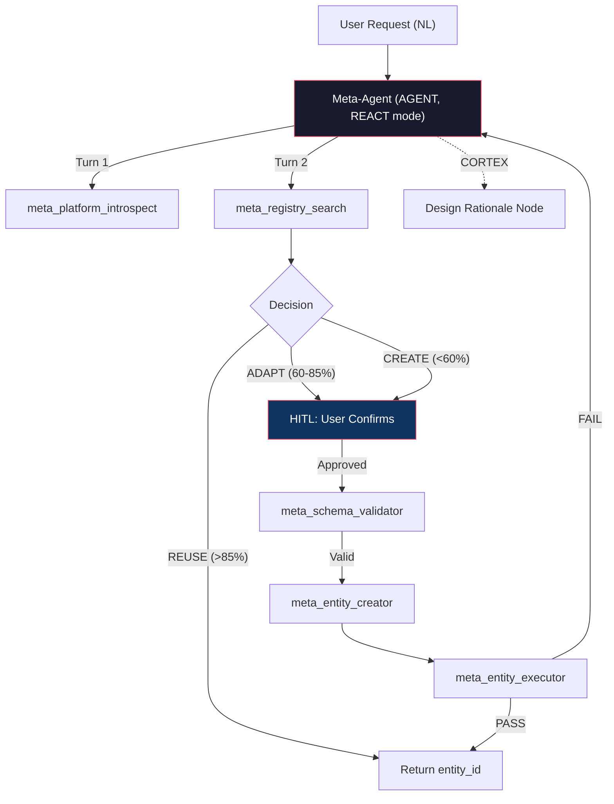

# Meta-Agent Architecture Brainstorm

> **Grounded in codebase audit** of `backend/src/ai/meta/`, `worker.py`, `step_executor.py`, `cortex_service.py`, `schemas.py`, `models.py`, and all 5 meta-tools.

---

## Current State Assessment

You've already built a solid V1 foundation:

| Component | Status | Quality |
|---|---|---|
| `PlatformSchemaCompiler` | ✅ Working | Good — covers entity types, step types, tools, models, constraints, composition rules |
| `RegistrySearchService` | ✅ Working | Good — two-phase structural+semantic scoring with REUSE/ADAPT/COMPOSE/CREATE classification |
| `AntiSprawlGuard` | ✅ Working | Minimal — daily creation limit + consolidation detection only |
| `meta_agent_template.py` | ✅ Working | Solid — 4-child PROCESS (RequirementAnalyst → RegistryCurator → AgentArchitect → ExecutionValidator) |
| 5 Meta-Tools | ✅ Working | Good — introspect, registry_search, schema_validator, entity_creator, entity_executor |
| `seed_meta_agent.py` | ✅ Working | Bootstrapping script for Meta-Agent hierarchy |

### What's Actually Missing (not obvious from the spec)

1. **No ADAPT/COMPOSE execution path** — `RegistrySearchService` classifies candidates but `AgentArchitect` has no tooling to clone+modify or compose multiple entities into a new PROCESS
2. **No design rationale persistence** — decisions (why REUSE vs CREATE) are ephemeral in LLM context, never written to CORTEX or DB
3. **No execution trace analysis in reuse scoring** — `get_execution_traces()` exists but is never called by `search()` or `recommend()`
4. **Static plan only** — Meta-Agent PROCESS uses STANDARD execution with a rigid 6-step pipeline; no conditional branching (step_4/5 marked `required=False` but the engine doesn't actually skip them based on step_3's decision)
5. **No schema bridging** — when ADAPT is chosen, there's no IO contract migration between the existing entity and the requirement

---

## A. KNOWLEDGE REPRESENTATION

**Core question:** How does the Meta-Agent maintain a semantic model of the platform that survives code changes?

### Option 1: Static Compilation (Current — `PlatformSchemaCompiler`)

**How it works:** Build-time extraction of enums, tool registrations, and constraints into a JSON schema blob injected via `meta_platform_introspect`.

**What's good:**
- Already working; deterministic; fast
- Hash-based drift detection (`schema_version`)
- Tenant-scoped tool/model resolution

**What's broken:**
- **Semantic gap**: Compiles *syntax* (tool names, step types) but not *execution semantics*. Example: The compiler knows `CHILD_ENTITY_INVOCATION` exists but doesn't encode that context flows parent→child via `input_data`, that `step_id` keys are stripped from child context (Fix F in `step_executor.py`), or that CORTEX tree IDs propagate via `__cortex_tree_id__`.
- **Staleness**: The compiled schema is a point-in-time snapshot. When you add a new tool or change a constraint, the Meta-Agent's "firmware" is stale until recompilation.
- **No behavioral knowledge**: Doesn't capture that `scraper_tool` results auto-ingest into CORTEX knowledge nodes, or that `AUTONOMOUS` mode requires `goal` + `self_reflection_enabled`.

**Verdict:** Necessary but insufficient as the sole knowledge layer.

### Option 2: Dynamic Reflection via Introspection Queries

**How it works:** The Meta-Agent queries the running system at execution time — live tool registry, live model endpoints, live entity schemas.

**Architecture:**
```
MetaAgent
  ├── meta_platform_introspect (already exists)
  ├── NEW: meta_tool_probe       → execute a tool with synthetic input, observe schema
  ├── NEW: meta_entity_inspect   → load any entity, extract its full config
  └── NEW: meta_constraint_check → query governance limits for a specific entity type
```

**Tradeoffs:**
- ✅ Always fresh — no drift
- ✅ Can discover tenant-specific tools dynamically
- ❌ Expensive — every Meta-Agent invocation requires N introspection calls
- ❌ Can't capture *why* things work the way they do (code comments, architectural intent)
- ❌ Latency: each introspection is a DB query + potentially an LLM call

### Option 3: Hybrid — Compiled Knowledge Graph + Event-Driven Refresh (Recommended)

**How it works:**
1. `PlatformSchemaCompiler` produces the base schema at deploy time (keep current implementation)
2. Add a **Behavioral Annotations Layer** — hand-curated semantic annotations that encode execution semantics the compiler can't extract:

```python
# In platform_schema_compiler.py — new method
def _compile_behavioral_annotations(self) -> List[Dict[str, str]]:
    return [
        {
            "rule": "CORTEX_TREE_PROPAGATION",
            "description": "When a PROCESS invokes a child via CHILD_ENTITY_INVOCATION, "
                          "the __cortex_tree_id__ from parent context is automatically "
                          "propagated to the child's input_data. All entities in a "
                          "hierarchy share one CORTEX tree.",
            "affects": ["CHILD_ENTITY_INVOCATION", "CORTEX"],
        },
        {
            "rule": "AUTONOMOUS_REQUIRES_GOAL",
            "description": "execution_mode=AUTONOMOUS requires: entity.goal is set, "
                          "logic_gate.reasoning_config.self_reflection_enabled=true, "
                          "goal_validation_interval > 0. Without these, the engine "
                          "falls back to STANDARD mode silently.",
            "affects": ["AUTONOMOUS", "goal_validation"],
        },
        {
            "rule": "SCRAPER_AUTO_INGEST",
            "description": "When scraper_tool or headless_browser executes during a "
                          "CORTEX-enabled run, the output is automatically written as "
                          "a knowledge node under the tree's Knowledge Root.",
            "affects": ["scraper_tool", "headless_browser", "CORTEX"],
        },
        # ... 10-15 more rules covering the non-obvious execution semantics
    ]
```

3. **Event-driven refresh**: Hook into `ToolRegistry.register()` and entity creation to invalidate/refresh the cached schema. Your `refresh()` method already exists — wire it to lifecycle events.

**Why this wins:**
- The compiled schema handles the 80% (structure, types, tools)
- Behavioral annotations handle the 20% (execution semantics that LLM code comprehension would otherwise hallucinate about)
- Event-driven refresh solves drift without the cost of per-request introspection
- Annotations are version-controlled alongside code — they evolve together

> [!IMPORTANT]
> **Hidden complexity: Code drift is not the real problem.** Your platform changes maybe 2-3 times per sprint. The *real* drift problem is **tenant-scoped tool registrations** — custom tools added via the Tool Management API at runtime. Your `refresh()` handles this, but only if called. Wire it to a Redis event or TTL cache.

---

## B. REUSE vs. CREATE DECISION ENGINE

### Current Implementation Critique

Your `RegistrySearchService` is well-designed structurally but has three blind spots:

1. **Tool overlap scoring is binary** — `len(overlap) / len(required)` doesn't weight tools by importance. `web_search` for a research agent is critical; `calculator` is nice-to-have. All tools contribute equally to the score.

2. **Execution trace data is unused** — `get_execution_traces()` is defined but never called. This is your most valuable signal: an agent that has been executed 50 times with 95% success rate on similar inputs is a *far* better REUSE candidate than one with matching tools but zero executions.

3. **IO contract compatibility is absent** — The search checks tool overlap and type match but never validates whether the existing agent's `io_contract.input_schema` can accept the required input shape, or whether its `output_schema` produces what the user needs.

### Option 1: Capability Embedding Space

**How it works:** Embed each entity's capability signature (tools + description + goal + system_prompt) into a vector space. At query time, embed the requirement and do ANN search.

```python
# Capability signature for embedding
def build_capability_signature(entity) -> str:
    tools = ", ".join(extract_tools(entity))
    return f"TYPE:{entity.type} TOOLS:[{tools}] GOAL:{entity.goal} DESC:{entity.description}"
```

**Tradeoffs:**
- ✅ Sub-linear search time (pgvector ANN)
- ✅ Captures semantic similarity that keyword matching misses
- ❌ Embeddings collapse nuance — two agents with identical tools but different system prompts (one is aggressive, one is conservative) embed similarly
- ❌ Requires maintaining an embedding index alongside entity mutations
- ❌ You already have `DocumentChunk.embedding` on pgvector — adding entity embeddings is straightforward infrastructure-wise

### Option 2: Contract-Based Matching with Execution Trace Weighting (Recommended)

**How it works:** Extend your current two-phase approach with two additional signals:

**Phase 1.5: IO Contract Compatibility** (between structural and semantic)
```python
def _score_io_compatibility(self, entity, request: SearchRequest) -> float:
    if not request.io_schema:
        return 0.5  # Neutral

    entity_io = entity.io_contract or {}
    entity_input = entity_io.get("input_schema", {}).get("properties", {})
    entity_output = entity_io.get("output_schema", {}).get("properties", {})

    required_input = request.io_schema.get("input", {}).get("properties", {})
    required_output = request.io_schema.get("output", {}).get("properties", {})

    # Check if entity can accept the required input fields
    input_coverage = len(set(required_input.keys()) & set(entity_input.keys())) / max(len(required_input), 1)
    # Check if entity produces the required output fields
    output_coverage = len(set(required_output.keys()) & set(entity_output.keys())) / max(len(required_output), 1)

    return (input_coverage + output_coverage) / 2
```

**Phase 2.5: Execution Trace Analysis** (after semantic scoring)
```python
async def _score_execution_history(self, candidate: MatchCandidate) -> float:
    traces = await self.get_execution_traces(candidate.entity_id, limit=10)
    if not traces:
        return 0.5  # No data — neutral

    success_rate = sum(1 for t in traces if t["status"] == "COMPLETED") / len(traces)
    avg_cost = sum(t["cost_usd"] for t in traces) / len(traces)
    recency = ...  # Weight recent executions higher

    # High success rate + reasonable cost + recent usage = strong reuse signal
    return success_rate * 0.6 + (1 - min(avg_cost / 2.0, 1.0)) * 0.2 + recency * 0.2
```

**Updated weighting:**
```python
STRUCTURAL_WEIGHT = 0.25   # Tool overlap, type match, tags
IO_CONTRACT_WEIGHT = 0.15  # Schema compatibility
SEMANTIC_WEIGHT = 0.35     # LLM intent matching
EXECUTION_WEIGHT = 0.25    # Historical success rate
```

### The "Near-Miss" Problem: ADAPT vs. Fork

> [!WARNING]
> **This is your hardest architectural decision.** When an agent scores 70% (ADAPT range), you have two options:
>
> 1. **Clone + Modify** (VERSION mode in `entity_creator.py`) — creates a new entity with `template_source_id` pointing to the original. Clean lineage tracking, but leads to sprawl.
> 2. **Compose with Adapter** — wrap the existing agent in a new PROCESS that adds a pre-processing step (schema transformation) and/or post-processing step (output formatting). No duplication, but adds orchestration complexity.

**My recommendation:** Default to **Compose with Adapter** for near-misses, and reserve **Clone + Modify** for cases where the system prompt or reasoning mode needs fundamental changes. Your `AntiSprawlGuard.check_consolidation_needed()` already detects when cloning has gone too far — make it a hard gate, not just a warning.

Concretely, the AgentArchitect should generate a PROCESS like:
```
AdapterProcess (PROCESS)
  ├── step_1: InputTransformer (ACTION) — maps user's IO schema to existing agent's input_schema
  ├── step_2: CHILD_ENTITY_INVOCATION → existing_agent_id
  └── step_3: OutputTransformer (ACTION) — maps existing agent's output to user's expected output
```

This is cheaper than cloning, preserves the original agent, and the adapter itself is lightweight enough that sprawl is acceptable.

---

## C. META-AGENT'S OWN ARCHITECTURE

### Current: Supervisor Multi-Agent System (4-child PROCESS)

Your `meta_agent_template.py` defines a PROCESS with 4 child AGENTs:
```
MetaAgent (PROCESS, STANDARD mode)
  ├── step_1: RequirementAnalyst (CHILD_ENTITY_INVOCATION)
  ├── step_2: RegistryCurator (CHILD_ENTITY_INVOCATION)
  ├── step_3: Decision Gate (ACTION — LLM decides REUSE/ADAPT/CREATE)
  ├── step_4: AgentArchitect (CHILD_ENTITY_INVOCATION, required=False)
  ├── step_5: ExecutionValidator (CHILD_ENTITY_INVOCATION, required=False)
  └── step_6: Respond to User (ACTION)
```

### Critique of Current Architecture

1. **The Decision Gate is a phantom** — Step 3 is an ACTION step that "decides" REUSE/ADAPT/CREATE, but the execution engine has **no conditional branching**. Steps 4 and 5 are `required=False`, but the engine doesn't skip them based on step_3's output. They execute regardless, wasting cost.

2. **No feedback loop** — If the `ExecutionValidator` returns FAIL, the pipeline ends. There's no retry path back to `AgentArchitect`.

3. **Context propagation is fragile** — Step 3's output (`{{step_3_decide}}`) must contain the exact entity_id for step_4 to parse. If the LLM formats it differently, the chain breaks.

### Option 1: Keep PROCESS but Switch to AUTONOMOUS Mode

**Architecture change:** Keep the same 4-child structure but set `execution_mode: AUTONOMOUS` on the MetaAgent PROCESS with `goal_validation_interval: 2`.

**Why this helps:**
- The autonomous loop in `worker.py` already supports goal validation and re-planning
- If step_3 decides REUSE, the goal validation after step_3 can detect "goal achieved" and early-exit (skipping steps 4-5)
- If `ExecutionValidator` returns FAIL, the autonomous loop can trigger `PlannerService.adapt_plan()` to re-route back to `AgentArchitect`

**Why this is risky:**
- AUTONOMOUS mode has only been battle-tested for single-entity agents, not PROCESS hierarchies
- The `max_replanning_attempts: 3` guard exists but hasn't been tested with CHILD_ENTITY_INVOCATION re-execution
- Cost can spiral — each re-plan + re-execution of AgentArchitect + ExecutionValidator is ~$2-4

### Option 2: Single Monolithic Agent with REACT Tool Use (Recommended for V2)

**Architecture change:** Collapse the 4-child hierarchy into a **single AGENT entity** with all 5 meta-tools and a REACT reasoning loop:

```python
meta_agent_v2 = {
    "type": "AGENT",
    "execution_mode": "STANDARD",
    "logic_gate": {
        "reasoning_config": {
            "reasoning_mode": "REACT",
            "max_react_turns": 10,  # Enough for: introspect → search → decide → validate → create → test
        }
    },
    "capabilities": {
        "tools": [
            {"tool_id": "meta_platform_introspect"},
            {"tool_id": "meta_registry_search"},
            {"tool_id": "meta_schema_validator"},
            {"tool_id": "meta_entity_creator"},
            {"tool_id": "meta_entity_executor"},
        ],
    },
    "identity": {
        "system_prompt": "You are the Meta-Agent for HireBuddha. Your workflow:\n"
                        "1. Call meta_platform_introspect to understand available tools\n"
                        "2. Decompose the user's requirement into tools + entity type\n"
                        "3. Call meta_registry_search to find existing agents\n"
                        "4. IF match found (REUSE): return the entity_id\n"
                        "5. IF near-match (ADAPT): call meta_entity_creator in VERSION mode\n"
                        "6. IF no match (CREATE): design entity, validate with meta_schema_validator, create with meta_entity_creator\n"
                        "7. Call meta_entity_executor to test the result\n"
                        "8. Report back to user\n\n"
                        "RULES: Always search before creating. Prefer REUSE > ADAPT > CREATE.\n"
                        "Never create entities with 'meta_agent' tag."
    },
}
```

**Why this wins over the PROCESS hierarchy:**

| Dimension | PROCESS (current) | REACT Agent (proposed) |
|---|---|---|
| Conditional branching | ❌ Engine doesn't skip steps | ✅ LLM naturally skips tool calls |
| Retry on failure | ❌ No feedback loop | ✅ REACT loop retries within max_turns |
| Context coherence | ❌ Each child gets stripped context | ✅ Single context window, full visibility |
| Cost | ~$3-5 (4 child runs + orchestrator) | ~$1-2 (single REACT loop) |
| Latency | High (sequential child executions) | Lower (no child run overhead) |
| Debuggability | Hard (5 separate ExecutionRuns) | Easy (1 run with tool logs) |

**The tradeoff:** You lose the clean separation of concerns. The RequirementAnalyst's analytical prompt is now part of the Meta-Agent's reasoning chain rather than a dedicated sub-agent. But given that the "analysis" is a 200-token JSON extraction, this is fine.

### Memory Model for the Meta-Agent

**Use CORTEX** (you already configure this in the template). The Meta-Agent should:
1. Write its **design rationale** as a CORTEX `finding` node after each decision
2. Write the **capability signature** of every created entity as a `knowledge` node
3. Use checkpoint/resume for long-running creation sessions

This gives you a persistent "design rationale memory" that survives across invocations and can be queried by future Meta-Agent runs.

---

## D. CODE UNDERSTANDING DEPTH

### The Real Question

The Meta-Agent doesn't need to understand your *code*. It needs to understand your *data model's invariants and execution engine's behavior*. These are different things.

**What the Meta-Agent actually needs to know:**

1. **Entity schema shape** — what fields are required, what combinations are valid (e.g., PROCESS + hierarchy.children + CHILD_ENTITY_INVOCATION steps)
2. **Step execution semantics** — how TOOL_CALL resolves tool_id, how ACTION uses prompt_template, how CHILD_ENTITY_INVOCATION creates child runs
3. **Context flow rules** — what gets propagated to children, what gets stripped, how `{{variable}}` resolution works
4. **Governance constraints** — max_cost_usd enforcement, credit gates, HITL checkpoint behavior

### Recommendation: Curated Behavioral Annotations (not AST parsing)

Your `PlatformSchemaCompiler` already extracts the structural schema. Add a `_compile_behavioral_annotations()` method (shown in section A) that encodes the 15-20 critical execution semantics as structured rules.

**Why NOT LLM-based code comprehension:**
- Your `worker.py` is 1,768 lines with deep nesting and multiple fix annotations (Fix B, Fix D, Fix E, Fix F, Fix G, Fix H). An LLM reading this would hallucinate connections between fixes that don't exist.
- The execution semantics are subtle (e.g., `step_id` keys stripped from child context is a 10-line block that fundamentally changes behavior). LLM summarization would miss this.
- You'd spend more tokens on code comprehension per Meta-Agent call than on the actual agent creation.

**Why NOT AST parsing:**
- Overkill. You're not building a general-purpose code understanding system. You have ~20 rules that change maybe quarterly.
- AST parsing would require maintaining a separate extraction pipeline that breaks when you refactor.

---

## E. USER INTERACTION MODEL

### Recommendation: Conversational Refinement with Contract Preview

**Phase 1: One-shot with confirmation gate**
```
User: "I need an agent that researches competitors and generates a PDF report"

Meta-Agent:
  1. [INTERNAL] Introspect platform → tools available
  2. [INTERNAL] Search registry → found "Deep Research" (78% match, ADAPT)
  3. [TO USER] Present contract:

  ┌─────────────────────────────────────────────┐
  │ RECOMMENDATION: ADAPT existing agent        │
  │                                             │
  │ Base: "Deep Research" (78% match)           │
  │ Adaptation needed:                          │
  │   + Add pdf_generator tool                  │
  │   + Modify output to PDF format             │
  │                                             │
  │ Estimated cost: $0.15/execution             │
  │ Capabilities: web_search, scraper, PDF gen  │
  │ Limitations: No real-time data, max 20 pages│
  │                                             │
  │ [Approve] [Modify] [Create from scratch]    │
  └─────────────────────────────────────────────┘
```

**Implementation:** Add a HITL checkpoint *after* step_3 (Decision Gate) in the Meta-Agent's plan. The `meta_entity_creator` should not fire until the user confirms the approach.

```python
# In meta_agent_template governance:
"hitl_checkpoints": [
    {
        "trigger_type": "AFTER_STEP",
        "step_ref": "step_3_decide",  # Or "Decision Gate" for the REACT variant
        "message": "Review the Meta-Agent's recommendation before proceeding",
        "auto_approve_on_timeout": False,
        "timeout_ms": 600000,  # 10 min
    }
]
```

**Phase 2: Iterative refinement (future)**
If the user says "Modify", re-enter the REACT loop with updated constraints. This works naturally with Option 2 (single REACT agent) since the LLM maintains context.

---

## F. FAILURE MODES & EDGE CASES

### F1: Invalid Agent Definition Generation

**Current safeguard:** `meta_schema_validator` validates Pydantic schema, tool existence, step types, child refs, governance limits, and meta-recursion.

**What's missing:**
- **Semantic validation** — the validator checks *structure* but not *sense*. An entity with a TOOL_CALL step targeting `web_search` but a system_prompt saying "you are a PDF formatter" would pass validation.
- **Execution dry-run** — `meta_entity_executor` runs the full entity, but failures during test execution don't feed back into the AgentArchitect for correction in the current pipeline.

**Fix:** Add a `_validate_semantic_coherence()` method to `MetaSchemaValidatorTool` that does a lightweight LLM check:
```python
async def _validate_semantic_coherence(self, payload, warnings):
    """Check that tools, steps, and system_prompt are semantically aligned."""
    # Cheap LLM call (~100 tokens): "Does this entity's system_prompt
    # align with its tool selection and step sequence?"
```

### F2: Agent Sprawl

**Current safeguard:** `AntiSprawlGuard` has a daily creation limit (10) and consolidation detection (3 adaptations of the same source).

**What's missing:**
- **No enforcement** — `check_consolidation_needed()` returns a dict but nobody blocks creation based on it
- **No deduplication** — the Meta-Agent could create "competitor-research-v1", "competitor-researcher", and "research-competitors" as three separate entities that do the same thing

**Fix:** Make the anti-sprawl check a **hard gate** in `meta_entity_creator`:
```python
# In MetaEntityCreatorTool._create_entity():
anti_sprawl = AntiSprawlGuard(db, company_id)
creation_check = await anti_sprawl.check_creation_allowed(user_id)
if not creation_check["allowed"]:
    return json.dumps({"success": False, "error": creation_check["message"]})

# NEW: Semantic deduplication — before creating, search for entities with >85% similarity
search_svc = RegistrySearchService(db, company_id)
existing = await search_svc.search(SearchRequest(
    intent=payload.get("description", ""),
    required_tools=[t["tool_id"] for t in payload.get("capabilities", {}).get("tools", [])],
    preferred_type=payload.get("type"),
), top_k=1)
if existing and existing[0].combined_score > 0.85:
    return json.dumps({
        "success": False,
        "error": f"Near-duplicate detected: '{existing[0].entity_name}' "
                f"(score: {existing[0].combined_score:.0%}). Use VERSION mode instead.",
        "existing_entity_id": str(existing[0].entity_id),
    })
```

### F3: Infinite Regress (Meta-Agent creates Meta-Agents)

**Current safeguard:** `_validate_no_meta_recursion()` in the schema validator blocks:
- Entities with `meta_agent` tag
- Steps referencing `meta_` tools

**This is solid.** The only gap is that a sufficiently creative LLM could create an entity that *doesn't* use meta-tools but whose system_prompt instructs it to "call the Meta-Agent API endpoint directly." This is an edge case not worth solving with static analysis — your governance cost caps ($5 max on Meta-Agent, $2 max on created entities) provide the ultimate circuit breaker.

### F4: Security — Meta-Agent Reading All Code

**Your actual risk surface:**
- The Meta-Agent can **read all entities** in a company via `meta_registry_search` → `RegistrySearchService` → SQL query filtered by `company_id`
- It can **execute any entity** via `meta_entity_executor`
- It can **create entities** via `meta_entity_creator`

**What's already safe:**
- All meta-tools use `context.get("company_id")` for tenant isolation
- `MetaEntityExecutorTool` caps test execution cost at $1.00
- Entity creation goes through `AIService.create_entity()` which enforces company scoping

**What needs hardening:**
- The Meta-Agent's own entity should have a **dedicated service account** user_id (not the requesting user's ID) so its creations are auditable
- Add a `created_by_meta_agent: bool` flag to `HierarchicalEntity` metadata for audit trails
- Rate-limit Meta-Agent invocations per company (not just entity creation)

---

## Summary: Recommended Architecture for V2



### Key Changes from V1

1. **Collapse PROCESS → single REACT AGENT** (eliminates 4 child entity overhead)
2. **Wire execution traces into reuse scoring** (use the data you're already collecting)
3. **Add IO contract compatibility** to Phase 1.5 of search
4. **Add behavioral annotations** to schema compiler (encode execution semantics)
5. **Make anti-sprawl a hard gate** with semantic deduplication
6. **Add HITL checkpoint** after decision for user confirmation
7. **Write design rationale** to CORTEX for persistence
8. **Implement ADAPT as Compose-with-Adapter** instead of clone-and-modify

> [!TIP]
> **Biggest bang-for-buck change:** Converting the Meta-Agent from PROCESS to single REACT AGENT. This eliminates the conditional branching problem, the context propagation fragility, and cuts cost by ~60%. Everything else is incremental improvement on a solid foundation.
