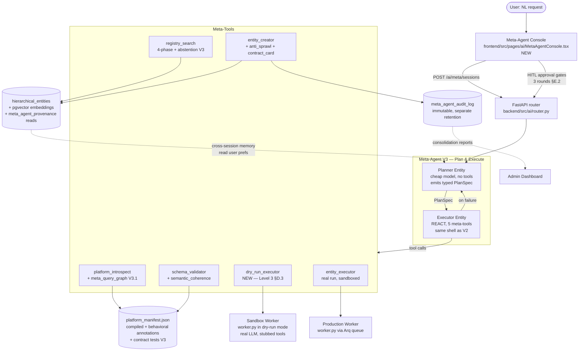

# Meta-Agent V3 — Architectural Brainstorm

**Status:** Forward-looking design synthesis
**Companion docs (read first):**
- `docs/meta_agent_architecture_brainstorm.md` — V1→V2 reasoning
- `docs/meta_agent_v2_implementation_plan.md` — what's already shipped
- `docs/phase6/architecture_review_v2.md` — concurrent execution + data integrity issues
- `docs/Meta_Agent_Architecture_Claude.md` — original Claude-authored spec

This document is **not** a re-pitch of V2. V2 is in code (`backend/src/ai/meta/`, `backend/src/ai/tools/meta/`). This document interrogates V2's architectural assumptions, surfaces the hidden complexity I see in the next 6–12 months, and proposes options for V3 with explicit tradeoffs. Read this **adversarially** — every proposal here should be challenged before implementation.

---

## 0. Ground Truth: What HireBuddha Actually Is

Before architectural opinions, the platform-shaped constraints that anchor this document. All file refs are absolute within the repo.

**The unit of agency is `HierarchicalEntity`** (`backend/src/ai/models.py:44`). One row, eight JSON columns (`identity`, `hierarchy`, `logic_gate`, `planning`, `capabilities`, `governance`, `io_contract`, `metadata_extensions`), four entity types (ACTION → SKILL → AGENT → PROCESS) with sharply different execution semantics enforced in `platform_schema_compiler.py:117`. This is not a LangGraph clone — it is a **typed, hierarchical, governance-bearing entity model with a single execution worker**.

**The execution engine is one worker** (`backend/src/ai/worker.py`, ~1.7K LOC) that reconciles a static plan + dynamic plan, then steps through it. Steps include `THOUGHT`, `ACTION`, `TOOL_CALL`, `CHILD_ENTITY_INVOCATION`, plus CORTEX-native ops (`NAVIGATE`, `READ`, `WRITE`, `RECURSE`, `AWAIT_CHILDREN`). REACT loops live **inside** `TOOL_CALL` steps — they are not the outer loop. There is no graph engine; the "graph" is the parent/child entity tree and per-step `input_dependencies` for DAG fan-out.

**The Meta-Agent V2 is itself one of these entities** — a single AGENT in REACT mode with five meta-tools (`platform_introspect`, `registry_search`, `schema_validator`, `entity_creator`, `entity_executor`). Code lives at `backend/src/ai/meta/meta_agent_template.py:33` (system prompt) and `backend/src/ai/tools/meta/*.py`. The 4-phase reuse decision engine (`registry_search_service.py:118`) and anti-sprawl guard (`anti_sprawl.py:26`) are operational. Daily creation cap is 10/company; near-duplicate (>0.85 combined score) is hard-gated.

**The platform manifest is build-time compiled** with hash-based drift detection (`platform_schema_compiler.py:70-72`) and 18 hand-curated **behavioral annotations** that capture execution semantics enums can't express (CORTEX tree propagation, child context stripping, REACT tool injection rules, etc.). This hybrid — compiled structure + curated semantics — is the V2 answer to "code drift."

**Known structural problems V3 inherits** (per `architecture_review_v2.md`):
- `RACE-1` / `RACE-2`: DAG parallel steps mutate shared `context_state`; the run ORM object crosses async sessions.
- `DATA-1`: `context_state` grows unbounded; step outputs duplicated by `step_id` and step `name`.
- `DATA-3`: `EpisodicMemory` writes use wrong field name (`metadata` vs `metadata_info`) — silent data loss.
- `SEC-1`: full document contents and internal keys persisted to `execution_runs.context_state`.

Every architectural proposal below must be safe under these — V3 inherits a leaky substrate.

---

## A. Knowledge Representation — How the Meta-Agent "Knows" the Platform

### A.1 What V2 already does

A four-layer hybrid, partially built:

| Layer | Source | Mode | Drift handling |
|---|---|---|---|
| Structural | Pydantic enums + tool registry | Build-time compile (`PlatformSchemaCompiler.compile`) | SHA-256 hash on whole manifest |
| Behavioral annotations | Hand-curated | Build-time, version-controlled | Manual; PR-gated |
| Live registry | `hierarchical_entities` + `tool_registry` + `integration_registry` | Per-request DB query | Implicit (always fresh) |
| Empirical | `episodic_memories` + `llm_interaction_logs` + pgvector | Per-request DB query | Implicit |

V2 stitches these together at request time via `meta_platform_introspect`. The hash gives you "did the schema change since this run started" but **not** "did the *meaning* of a tool change."

### A.2 The real risk: semantic drift, not syntactic drift

Hashing the manifest catches `add a new tool`, `remove an enum value`, `change a default`. It does not catch:

1. **Tool behavior change** — `web_search` starts returning Markdown instead of HTML; the schema is unchanged, the contract is broken. Every Meta-Agent-generated entity that uses `web_search` is silently degraded.
2. **Entity-level invariant violations** — somebody edits a popular AGENT and removes `voice` from its persona; downstream PROCESSes still invoke it expecting voice output.
3. **Annotation rot** — the 18 behavioral annotations live in `platform_schema_compiler.py`. Rule #7 about CORTEX tree propagation can become wrong when CORTEX evolves; nothing flags it.

### A.3 Three options for V3

**Option α — Static manifest + contract tests (incremental, ~2 weeks)**
Keep the current PlatformSchemaCompiler. Add a `meta_contract_tests/` suite: for every tool, a golden input → golden output assertion that runs in CI. Tool authors must update goldens when behavior changes; this becomes the de facto contract. Behavioral annotations get version pins (`since_version: "2.3"`).
- **Pro:** Cheap, deterministic, no infra.
- **Con:** Doesn't catch entity-level drift (tools owned by users); manifest stays large/verbose in the system prompt.

**Option β — Live introspection over a typed graph (medium, ~6 weeks)**
Replace the JSON manifest with a queryable knowledge graph (PostgreSQL recursive CTE or NetworkX in-memory). Meta-Agent gets a new tool `meta_query_graph(query)` instead of dumping the manifest into context. Queries: `tools where category='crm' and supports_streaming=true`, `entities reachable from <intent embedding> within score 0.6`. Reduces context bloat dramatically and lets the Meta-Agent **explore** rather than scan.
- **Pro:** Scales to 10K+ entities; matches how a senior engineer actually reads a codebase.
- **Con:** New query DSL is a UX hit on the LLM; one bad query = one wrong decision.

**Option γ — Compiled manifest + LSP-style live diagnostics (long-term, ~3 months)**
Treat the platform like a codebase. Run a long-lived "platform language server" that watches the entity registry, tool registry, and the codebase. Pushes diff events ("tool X changed signature", "entity Y was deprecated") into a `platform_diagnostics` table. Meta-Agent pulls fresh diagnostics on every session start, plus the static manifest. Allows surfacing warnings to the user: "the agent you're cloning depends on a deprecated tool."
- **Pro:** Best long-term answer; mirrors how humans operate in IDEs.
- **Con:** Significant infra; needs a daemon and a diff protocol.

### A.4 Recommendation

**Start with α**, design `meta_query_graph` from option β as the v3.1 endpoint. Defer γ until you cross 1K user-defined entities (currently you have ~tens). The 90/10 win is contract tests for the 14 platform tools — they catch the silent breakage that hash-based drift never will.

### A.5 Hidden complexity

- **Tenant-scoped tool drift.** `ToolRegistry` has `_tenant_tools` per company. Meta-Agent operating for tenant T sees tools tenant T+1 can't see. This means the manifest's `schema_version` is **tenant-scoped**, not global. V2 doesn't enforce this. Two consequences: (1) caching the manifest globally is wrong; (2) a manifest hash mismatch between Meta-Agent runs may be benign if it crossed tenants.
- **Behavioral annotations are duct tape.** They encode tribal knowledge ("CHILD_CONTEXT_STRIPPING removes `step_N` keys but preserves named keys"). When the worker changes, who updates the annotation? Make this a CI check: parse `worker.py` for the actual stripping regex and assert it matches the annotation string.

---

## B. Reuse vs. Create Decision Engine — The Real Hard Problem

### B.1 What V2 does and where it's brittle

The 4-phase pipeline (`registry_search_service.py:118`) blends:

- 25% structural (tool overlap, type, complexity)
- 15% IO contract overlap
- 35% LLM semantic intent
- 25% execution history (success rate × cost × recency)

Decision thresholds: REUSE ≥0.85, ADAPT ≥0.60, COMPOSE ≥0.40, CREATE <0.40.

Three brittle assumptions in this design:

1. **Linear weighting hides veto cases.** An entity with semantic_score=0.95 but missing 3 of 4 required tools still scores ~0.6 (passes ADAPT). It cannot do the job. Tool overlap should be a **hard filter**, not a weighted dimension.
2. **Execution history is biased toward popularity.** A 6-month-old agent that ran 200 times beats a 2-week-old agent that ran twice but is a perfect fit. Recency weighting (1.0/0.8/0.3 step function in `_phase25_execution_traces`) is too coarse — use exponential decay with a half-life of, say, 30 days.
3. **No abstention.** The system always returns a top candidate. There is no "I don't know — ask the user a clarifying question" output. Forcing a CREATE when the intent is ambiguous causes sprawl; forcing a REUSE when intent is ambiguous causes silent wrong-agent execution.

### B.2 Three architectural options

**Option α — Funnel with hard filters + weighted soft scoring (incremental fix, ~3 days)**
Keep the 4 phases but add hard gates between them:
1. Phase 1 hard gate: `tool_coverage >= 0.7` OR candidate eliminated. Coverage = `|required_tools ∩ entity_tools| / |required_tools|`.
2. Phase 1.5 hard gate: required input fields must be a subset of entity input schema (not weighted). Output coverage stays soft.
3. Phase 2.5: replace step-function recency with `exp(-days_ago / 30)`.
4. New Phase 3: **abstention check** — if top candidate < 0.85 AND second candidate within 0.05 of top, return `CLARIFY` (not REUSE/ADAPT) and surface a disambiguation question.
- **Pro:** Targeted, fast to ship, addresses the three failure modes above.
- **Con:** Still a single-shot scoring function; no learning from outcome.

**Option β — Capability embedding space + contract bridging (medium, ~3 weeks)**
Drop the phased scoring. Embed every entity's `(intent, io_contract, tool set)` into a typed vector space using an embedding model with separate heads for intent, IO, and tools. ANN search returns top-k. For each top candidate, run a **contract bridge generator**: an LLM call that produces a typed adapter SKILL that maps user input → entity input and entity output → user output. A candidate with a feasible 1-step adapter is REUSE; needing a 2-step adapter is ADAPT; needing >2 steps or chaining multiple entities is COMPOSE; no feasible bridge is CREATE.
- **Pro:** Naturally handles "near-miss" agents — the adapter IS the modification spec. Replaces the magic 0.85/0.60/0.40 thresholds with a structural answer ("does an adapter exist?").
- **Con:** Embedding training is non-trivial; needs a real corpus before it works; adapter generation is itself an LLM call that can hallucinate.

**Option γ — Bandit-driven decision policy (long-term, ~6 weeks + months of data)**
Treat REUSE/ADAPT/COMPOSE/CREATE as actions of a contextual bandit. Reward = `(user_acceptance × execution_success) / (cost + latency)`. Train offline from the existing `execution_runs` and the new `meta_agent_provenance` records. Online: the policy outputs a probability over the four actions; the Meta-Agent must justify deviating from the highest-probability action.
- **Pro:** Self-correcting; the bandit learns that *this user* always rejects ADAPT and prefers CREATE for marketing intents.
- **Con:** Cold-start problem; needs telemetry plumbing you don't have yet (`meta_agent_provenance.user_acceptance`).

### B.3 Recommendation

**Ship α this sprint.** It addresses concrete bugs. **Plan β as v3.1** — the contract-bridge framing is what unifies ADAPT and COMPOSE into one mechanism (an adapter chain of length 1 or N). **Defer γ** until you have ≥3 months of meta_agent_provenance data with explicit user accept/reject signals.

### B.4 The "near-miss agent" question explicitly

User asked: 80% fit — compose with adapters or fork? **Compose.** Forking creates ownership ambiguity (who patches the source bug — the original entity or the fork?). An adapter SKILL is an explicit, named artifact with its own provenance. The fork pattern works in code because git tracks lineage; in HireBuddha, `template_source_id` is the only lineage signal and it doesn't track which fields diverged. Adapters dodge that problem.

### B.5 Hidden complexity

- **Reuse rewards adversarial agent design.** If reuse is heavily weighted, users (and Meta-Agent itself) will write maximally-generic agent descriptions to "win" reuse votes. This degrades discoverability over time. Counter: penalize entities with high abstraction in their description (LLM-judge of "specificity score" at creation time, stored on entity).
- **Tool overlap is asymmetric.** An entity that has tools `{web_search, email_send}` is a fine candidate for an intent needing only `{web_search}`. The reverse (entity has `{web_search}`, intent needs both) is not. V2's `tool_overlap` in `_phase1_structural` doesn't enforce this direction — verify in code (it currently uses Jaccard, which is symmetric).
- **Embedding model coupling.** `architecture_review_v2.md` flags `DATA-4`: `gemini-embedding-004` vs `text-embedding-004` mismatch between the worker and memory_service. Whatever you pick for V3 reuse scoring, **align it with whatever the worker writes** or every embedding lookup is a cosine of unrelated spaces.

---

## C. Meta-Agent's Own Architecture

### C.1 V2 chose monolith — was it right?

V2 collapsed V1's 4-child PROCESS to a single REACT AGENT. The justification (`meta_agent_template.py:18-23`): conditional branching was fragile, context propagation lossy, costs ~3× higher. **I agree with the collapse**, but I think V2 stopped halfway. A pure single-agent REACT is brittle in a different way: when the LLM gets confused mid-loop, you have no checkpoint to resume from.

### C.2 Three options

**Option α — Single REACT agent (V2, current)**
One AGENT, five tools, ≤10 REACT turns, $5 cap, one HITL gate after the decision step.
- **Pro:** Simple. Cheap. The LLM owns the workflow; new meta-tools just become callable.
- **Con:** Failure recovery is "rerun from scratch." No structured memory of *what was tried*. Mid-loop user interruption is awkward (the next REACT turn doesn't know about the user's edit).

**Option β — Plan-and-execute supervisor (recommended for V3)**
Two-tier: a **Planner** entity (cheap model, no tools) emits a structured plan as a typed object: `{candidate_search_spec, decision_intent, generation_spec_if_create}`. The **Executor** is the V2 REACT agent, but it now has a *target* — it executes the plan and may amend it. If a step fails, the Planner gets the failure as input and emits a corrective plan. This is the LangChain "plan-and-execute" pattern, adapted to HireBuddha's entity model.
- **Pro:** Inspection point between planning and execution (great UI surface — show the plan to the user before tools fire). Failure recovery is "rerun the failed phase," not "rerun everything." Planner can use a cheaper model.
- **Con:** Two entities to maintain; planner→executor handoff is a context-passing decision (preserve everything? Just the plan?).

**Option γ — Recursive Meta-Agent over a working memory graph (research-grade)**
Meta-Agent writes its working state into a CORTEX tree (`requirements/`, `candidates/`, `design/`, `validation/`, `decisions/` — V2 mentions this but doesn't implement). Each REACT turn the agent **reads from and writes to** the tree, never the LLM context. The context window holds only the current turn's reasoning + a viewport into the tree. Allows arbitrarily long sessions, multi-day deliberation, and cross-session resume.
- **Pro:** Solves the long-horizon problem natively using infrastructure you already have (CORTEX). Aligns with how Claude Code uses persistent memory.
- **Con:** CORTEX read/write tools must be stable for meta-use; right now they're scoped for user-data knowledge graphs.

### C.3 Recommendation

**β for V3.** The Planner gives you the contract card (see §E.3) for free — it's literally the planner's output. γ is the right v4 direction once CORTEX has been hardened against meta-agent write patterns.

### C.4 Memory model — what does the Meta-Agent actually remember?

Three memory horizons with different requirements:

| Horizon | Purpose | Storage | V2 status |
|---|---|---|---|
| In-session | Current REACT turn context | LLM context window | ✓ Implicit |
| Cross-session, per-user | "Last week we agreed X for marketing agents" | `episodic_memories` filtered by `created_by=meta_agent` | ✗ Not implemented |
| Cross-session, platform-wide | "Reuse patterns observed", "common failure modes" | New table or pgvector index | ✗ Not implemented |

V2's `metadata_extensions.meta_agent_provenance` is a write-only audit log; nothing reads it. **V3 needs a reader.** Concretely: at decision time, Meta-Agent should query "have I made similar decisions for this user before? What did they prefer?" This is the highest-leverage memory addition — it's the difference between a stateless tool and an assistant that learns the user's taste.

### C.5 Hidden complexity

- **Recursion safety.** V2 blocks meta-tools in generated entities (`schema_validator.py` rule 6) and tags `meta_agent`. This is necessary but not sufficient. A user agent could call `meta_entity_creator` *transitively* by invoking a child PROCESS that invokes the Meta-Agent. **Add transitive check**: walk the hierarchy.children graph at validation time and reject if any descendant is the Meta-Agent.
- **Sandbox cost cap.** `meta_entity_executor` caps at $1 sandbox cost (`entity_executor.py`). This isn't airtight — a generated entity with `max_recursion_depth=5` and `child_entity_invocation` can fan out to dozens of LLM calls before the $1 trips. Cap by **count of LLM calls**, not just dollars.

---

## D. Code Understanding Depth

### D.1 The honest answer

The Meta-Agent does **not need to understand the codebase** the way Claude Code does. It needs to understand the **agent definition language** (the 8 JSON columns + their constraints). The codebase is just the runtime that interprets that language.

This is the V2 insight that the user's framing under-emphasizes. The platform manifest is the IR; everything else is implementation detail.

### D.2 Three depth levels

**Level 1 — Manifest only (V2 baseline)**
Meta-Agent sees the compiled `platform_manifest.json`. Doesn't know `worker.py` exists.
- Sufficient for: generating well-typed entities that the worker can execute.
- Insufficient for: explaining failures rooted in worker bugs (e.g., DAG race conditions).

**Level 2 — Manifest + behavioral annotations (V2 actual)**
Adds the 18 hand-curated semantic rules.
- Sufficient for: avoiding known footguns at generation time.
- Insufficient for: novel patterns the annotations don't cover.

**Level 3 — AST+test execution (proposed for V3)**
Add a tool `meta_validate_via_dry_run(entity_payload, test_input)` that runs the entity in a fully-sandboxed in-memory worker (no DB writes, no LLM calls — replaced with deterministic stubs). Verifies the *graph* of execution (what tools fire in what order) matches the LLM's design intent.
- Sufficient for: catching wrong-step-type errors, broken `{{variable}}` references, fan-out explosion before real execution.

### D.3 Recommendation

**Add Level 3 as a new meta-tool.** This is much more valuable than deeper code introspection. The dry-run worker is non-trivial (~1 week of work) but is also useful for the existing CI pipeline.

**Do NOT** give the Meta-Agent grep access over `worker.py`. It will rationalize the wrong things from worker comments.

### D.4 Hidden complexity

- **Stubbed LLM calls give false confidence.** If you stub `llm_router.call_llm` to return a fixed string, the dry-run won't catch prompt-template variable-resolution bugs whose impact only shows up in real LLM output. Stub the **dispatch**, not the **content**: real call to `gemini-flash` (cheap), short max_tokens.
- **Side-effect stubs.** Tools like `email_send` need stubs that record "would have sent X to Y." Build this as a `sandbox_mode` flag on the tool base class, not as a wrapper layer.

---

## E. User Interaction Model

### E.1 What V2 has

A single HITL checkpoint after the decision gate (`meta_agent_template.py` HITL spec). One round of confirmation. No frontend.

This is fine for technical users. It will fail the moment a non-technical user says "build me an agent that books meetings." The Meta-Agent will pick a top candidate, ask "approve?", and the user has no idea what they're approving.

### E.2 Three interaction patterns

**Option α — One-shot with confidence-gated escalation**
If `combined_score > 0.85` for top candidate → propose REUSE silently with single-click confirm. If `0.40 < score < 0.85` → enter clarification dialog. If `score < 0.40` → ask the user three structured clarification questions before generation.
- **Pro:** Fast path for unambiguous requests. Minimum friction.
- **Con:** The 0.85 cutoff is a magic number; users who *meant* something different from the high-confidence match get burned silently.

**Option β — Mandatory three-round contract refinement (recommended)**
Round 1: User intent → Meta-Agent presents *3 options* (top REUSE candidate + top ADAPT candidate + a CREATE sketch). User picks one.
Round 2: User picks → Meta-Agent shows the **contract card** (intent restatement, IO schema, tools, governance, est. cost per run, known limitations). User edits inline.
Round 3: Dry-run trace shown → User approves activation.
- **Pro:** Three checkpoints = three places to catch a wrong direction cheap. Contract card is documentation-as-byproduct.
- **Con:** Three rounds of friction for a user who just wants the agent to ship.

**Option γ — Conversational refinement with "fast path" override**
Default to β (three rounds). Power users can append `--fast` or `--trust` to skip rounds 1 and 3. Track which users use the fast path and auto-recommend it for them.
- **Pro:** Pareto-optimal — slow for novices, fast for experts.
- **Con:** The fast path becomes an attractive nuisance — engineering will use it, then complain when an agent ships wrong.

### E.3 The contract card — what's actually on it?

This is the critical UI artifact. Proposal:

```
┌──────────────────────────────────────────────────────────────┐
│ Decision: ADAPT  (from "lead-research-skill" v1.4)           │
│ ─────────────────────────────────────────────────────────── │
│ Intent:    "Find decision-makers at SaaS companies that       │
│             raised Series B in last 90 days, return CSV"     │
│ Type:      AGENT (5 steps)   Mode: STANDARD                   │
│ Tools:     web_search, scraper_tool, email_draft, file_writer │
│              + apollo_mixed_people_search   ← NEW            │
│ IO:        in:{industry, raise_window} → out:{csv_path, count}│
│ Governance:max_cost=$0.40/run  timeout=120s  hitl=none        │
│ Memory:    episodic + semantic (CORTEX tree per run)          │
│ ─────────────────────────────────────────────────────────── │
│ Diff from base:                                                │
│   + tool: apollo_mixed_people_search                          │
│   ~ system_prompt: added "filter by Series B funding stage"   │
│   = governance: unchanged                                      │
│ ─────────────────────────────────────────────────────────── │
│ Guarantees:    Schema-validated. Dry-run passed. Cost capped. │
│ Limitations:   Apollo data freshness ~7d. No retry on rate-   │
│                limit. Output schema may add fields in v2.0.   │
│ Provenance:    candidates considered: 3 (lead-research v1.4,  │
│                prospect-finder v0.9, sales-research-skill v2)  │
│                Why ADAPT: lead-research-skill v1.4 missed     │
│                Apollo integration; semantic_score=0.78.       │
└──────────────────────────────────────────────────────────────┘
```

This card is **also the audit record**. Persist it as `metadata_extensions.contract_card` on the created entity. When V2's anti-sprawl finds 3 versions of the same source, it can diff their contract cards to surface "you have three lead-research agents with overlapping intent — consolidate?"

### E.4 Hidden complexity

- **Reuse recommendations break trust when wrong.** Show the user the runner-up candidate's name and score even if you recommend REUSE. They need to see "we considered prospect-finder v0.9 (score 0.81) and chose lead-research v1.4 (score 0.92)" to trust the verdict. Hide-and-pray UX = silent CREATE-after-rejection sprawl.
- **The "third round" problem.** Dry-run output is potentially noisy (long traces, partial outputs). Render only the *deltas from expected*: which step ran, what the LLM decided, which tools fired. Not the full LLM transcript.

---

## F. Failure Modes & Edge Cases

### F.1 Catalogue (concrete, with mitigations)

| # | Failure mode | Probability | Severity | V3 mitigation |
|---|---|---|---|---|
| F1 | Generated entity passes schema_validator but fails worker execution | High | Med | Level-3 dry-run (§D.3) before real execution |
| F2 | Meta-Agent silently slightly-modifies an existing entity instead of REUSE | High | High | Hard tool-coverage gate (§B.3); contract card shows diff (§E.3) |
| F3 | Meta-Agent hits 10 REACT turns without converging | Med | Med | β plan-and-execute (§C.2) — planner emits corrective plan, doesn't restart |
| F4 | LLM hallucinates tool name not in registry | Med | High | V2 already validates allowlist; add **at-generation** type-ahead in prompt: include tool names in the planner's output schema as enum |
| F5 | Generated PROCESS has cycle in hierarchy.children | Low | Critical | DFS cycle check at validation; V2 may not have this — verify |
| F6 | Two concurrent Meta-Agent runs create the same entity (race) | Low | Med | Unique constraint on `(company_id, name, version)`; on collision, return existing |
| F7 | User's intent description leaks PII into stored CORTEX tree | Med | High (compliance) | PII scrubber on intent strings before write — shared with `SEC-1` work |
| F8 | Meta-Agent runs in tenant T using a tool definition from tenant T+1 (registry race) | Low | Critical | Snapshot tool registry at run-start; pin within run |
| F9 | Anti-sprawl daily cap blocks legitimate creation, user re-prompts repeatedly | Med | Low | Surface remaining quota in error; cap should reset on time, not on retry |
| F10 | Generated entity invokes another generated entity → infinite chain | Low | Critical | Transitive recursion check (§C.5) + max-depth at runtime |
| F11 | Meta-Agent succeeds but user immediately edits the entity, drifting from contract | High | Low | On entity edit, recompute contract_card hash; flag drift in audit log |
| F12 | Embedding model swap breaks all reuse scores overnight | Low | Critical | Store `embedding_model_version` on entities; recompute lazily on mismatch |

### F.2 Sandboxing — the security perimeter for V3

The Meta-Agent has **read access to all platform code** (via introspect) and **write access to the entity table** (via creator). This is the same trust level as a senior engineer with prod DB access. Treat it accordingly:

1. **Authorization.** The Meta-Agent runs as a service principal *delegated by* the requesting user. Generated entities inherit the user's RBAC, not the service principal's. V2 doesn't enforce this — verify and fix.
2. **Audit.** Every meta-tool call appends to an immutable `meta_agent_audit_log` (separate table from `llm_interaction_logs` — different retention, different access controls).
3. **Egress.** A generated entity can chain tools to exfiltrate data (read CRM → send email). The Meta-Agent should refuse to generate any entity combining a *read tool* and an *egress tool* without an explicit HITL checkpoint between them. Encode this as a **negative** behavioral annotation.
4. **Replay.** Every generation must be reproducible from `(intent, platform_manifest_hash, registry_snapshot_hash, llm_model, llm_seed)`. If you can't replay it, you can't audit it.

### F.3 The "agent sprawl" attack pattern

V2 has daily cap (10) + semantic dedup (>0.85). This catches accidental sprawl. It doesn't catch **adversarial sprawl**:

- A user makes 10 agents/day for 30 days, each just below the 0.85 dedup threshold. After a quarter, they have 900 near-duplicate "lead-research" agents. None individually flag as duplicate.
- **Mitigation:** Cluster-level metric. Run weekly: cluster all entities by embedding (HDBSCAN), report clusters with >5 entities, propose consolidation. Add to admin dashboard.

---

## G. Unified System Architecture (V3)



**Key V3 deltas from V2:**

1. Planner/Executor split (was: monolithic REACT).
2. New `dry_run_executor` meta-tool (was: optional execution after creation).
3. Contract card persisted to `metadata_extensions.contract_card` (was: ephemeral).
4. Three-round UI surface (was: spec only, no UI).
5. Cross-session memory reads in Planner (was: write-only provenance).
6. `meta_agent_audit_log` table separate from interaction logs.
7. Cluster-level sprawl detection (was: pairwise only).

---

## H. Data Flow — REUSE Path

User: *"Find SaaS companies that raised Series B in last 90 days and email me a CSV."*

```
1. UI → POST /ai/meta/sessions {intent, user_id, company_id}
2. Router → spawn ExecutionRun for Planner entity
3. Planner LLM call (gemini-flash, 200 tokens):
     PlanSpec {
       intent_normalized: "lead-discovery filtered by funding stage and recency",
       required_tools: ["web_search", "apollo_mixed_people_search", "file_writer", "email_send"],
       preferred_type: "AGENT",
       complexity: "MEDIUM",
       io_schema: {in: {industry: "string", raise_window_days: "int"}, out: {csv_path: "string"}}
     }
4. Executor receives PlanSpec, invokes meta_platform_introspect → manifest cached
5. Executor invokes meta_registry_search(PlanSpec) →
     Phase 1 (structural):    8 candidates pass tool_coverage >= 0.7 hard gate
     Phase 1.5 (IO contract): 5 candidates pass input subset check
     Phase 2 (semantic LLM):  rank 5 candidates, top: lead-research-skill v1.4 (semantic=0.91)
     Phase 2.5 (execution):   lead-research-skill: 47 runs, 94% success, $0.38 avg, 2d ago
     Combined: 0.89 → REUSE; runner-up: prospect-finder v0.9 at 0.71
6. Executor cross-session memory check:
     "Last 90 days, this user accepted 3 REUSE recs and rejected 1 ADAPT."
     → confidence boost; no reformulation needed.
7. UI ROUND 1: present REUSE recommendation + runner-up + decline option
   User: approves
8. UI ROUND 2: contract card displayed, no edits
   User: approves
9. UI ROUND 3 (skipped — REUSE path, dry-run unnecessary for unmodified existing entity)
10. Executor returns {decision: REUSE, entity_id: <lead-research-skill v1.4>,
    estimated_cost: $0.38, ready_to_run: true}
11. UI offers "Run now" button → POST /ai/execute with the entity_id
12. Provenance written: {decision: REUSE, candidates_considered: 5, rationale: "..."}
13. Audit log entry: {tool: registry_search, manifest_hash: ab12cd, ...}
```

**Total cost:** ~$0.02 (one Planner call + one semantic-scoring call). **Total latency:** ~3s.
**Why this is good:** No entity created. Existing agent reused. Audit trail. Runner-up shown. User saw the *why*.

---

## I. Data Flow — CREATE Path

User: *"Build me an agent that monitors HackerNews for posts about my product, summarizes sentiment per week, and posts the summary to Slack #marketing."*

```
1. UI → POST /ai/meta/sessions {intent, ...}
2. Planner LLM call:
     PlanSpec {
       intent_normalized: "scheduled social-monitoring + sentiment-aggregation + slack-egress",
       required_tools: ["scraper_tool", "llm_summarize" (NB: not a real tool — caught later),
                        "slack_send"],
       preferred_type: "AGENT",
       complexity: "MEDIUM",
       io_schema: {in: {product_name: "string", week_offset: "int"},
                   out: {summary: "string", slack_message_id: "string"}}
     }
3. Executor invokes meta_platform_introspect → discovers `llm_summarize` doesn't exist;
   amends required_tools to ["scraper_tool", "slack_send"] + ACTION step for summarization.
4. Executor invokes meta_registry_search →
     Phase 1: 4 candidates pass tool_coverage filter (none have slack_send)
     Phase 1.5: 1 candidate passes input subset (social-listening-skill v0.3)
     Phase 2: top semantic = 0.62
     Phase 2.5: social-listening-skill: 6 runs, 50% success — execution_score=0.4
     Combined: 0.55 → COMPOSE; second candidate at 0.41 → CLARIFY trigger? No, gap is 0.14.
5. Executor proposes COMPOSE:
     - Reuse social-listening-skill for HN scraping
     - New SKILL "weekly-sentiment-aggregator" (3 steps: dedupe, sentiment, summarize)
     - New ACTION "slack-post-marketing" wrapping slack_send
     - Wrap as new PROCESS "hn-product-pulse"
6. UI ROUND 1: present three options:
   (a) COMPOSE recommendation
   (b) Pure CREATE alternative (one self-contained AGENT)
   (c) Clarify question: "should sentiment use any historical baseline?"
   User: picks (b) — "I want one agent, simpler"
7. Executor pivots to CREATE:
     - Designs HierarchicalEntity payload (AGENT, 4 steps)
     - Invokes meta_schema_validator → 1 warning ("scraper_tool may rate-limit on HN")
       no errors → pass
     - Invokes meta_dry_run_executor with synthetic input {product_name: "TestProduct",
       week_offset: 0}:
         step 1 (scraper_tool) returns stub
         step 2 (LLM summarize) returns stub
         step 3 (slack_send) returns stub
         All step types valid, all variable refs resolve → pass
8. UI ROUND 2: contract card for new agent shown
   User: edits — adds HITL checkpoint before slack_send "always confirm before posting"
   Contract card updated; schema re-validated.
9. UI ROUND 3: dry-run trace re-run with edited governance → all green
   User: approves
10. Executor invokes meta_entity_creator:
      anti_sprawl.check_creation_allowed → 4/10 today → ok
      anti_sprawl.check_semantic_duplicate → top match 0.43, far below 0.85 → ok
      AIService.create_entity → returns entity_id
      Stamps metadata_extensions.contract_card + meta_agent_provenance
11. Optional: meta_entity_executor with real input → real run with $1 cap
12. Audit log: {decision: CREATE, candidates_considered: [...], dry_run_passed: true,
                user_edits: ["added hitl_before_slack"]}
```

**Total cost:** ~$0.40 (planner + semantic scoring + dry-run LLM + validator + optional test execution).
**Total latency:** ~25s end-to-end (with user think time, ~2 min wall clock).
**Why this is good:** User saw the COMPOSE alternative. Dry-run caught nothing serious but validated structure. Contract card became the audit record. Anti-sprawl ran but didn't block.

---

## J. Critical Unanswered Questions

The following must be resolved **before** V3 implementation begins. Each has a forced choice — punting any of them creates rework.

### J.1 Planner/Executor split — same entity table or separate?
**Choice:** Are Planner and Executor two `HierarchicalEntity` rows (clean, eats into your 1-template-per-meta-agent assumption) or hardcoded singletons (special-case but simpler)? **Recommendation:** two rows — but flag them in `metadata_extensions.is_meta_internal = true` so users can't see/clone them in the agent registry UI.

### J.2 Where does the cross-session memory live?
**Choice:** A new `meta_agent_memory` table, or repurpose `episodic_memories` filtered by `created_by = meta_agent_user_id`? **Tradeoff:** new table = clean but one more migration; reuse = piggyback on existing infra but query patterns leak (`select * from episodic_memories where ...` everywhere). **Recommendation:** new table — meta-agent decisions have different retention requirements (compliance) and different access controls (admin-only writes).

### J.3 Who owns the contract card?
**Choice:** Stored on the entity (`metadata_extensions.contract_card`), or as a separate `entity_contracts` table with versioning? If on entity, edits to the entity invalidate the contract silently; if separate, you have a JOIN every time you load the entity. **Recommendation:** separate table, FK to entity, with `entity_version_at_contract_time` snapshot. This catches §F.11 (post-creation drift).

### J.4 Dry-run worker — fork or shared codepath?
**Choice:** Add `dry_run: bool` flag throughout `worker.py` (invasive, risk of forgetting a branch), or implement a parallel `dry_run_worker.py` (duplication, drift risk). **Recommendation:** flag-based with a feature-flag rollout — all writes wrapped in `if not dry_run:`. Easier to keep in sync; failure mode (missed branch) is "dry run accidentally writes," which is recoverable in dev. The duplication option is recoverable from never.

### J.5 Embedding model commitment
**Choice:** Pin to one embedding model (`gemini-embedding-004`) across worker/memory/meta. Fix `DATA-4` first or V3 reuse scoring is unreliable. **Recommendation:** make this a **prerequisite** — V3 cannot ship before `DATA-4` is fixed. Add `embedding_model` column to `hierarchical_entities` and refuse to score across mismatched models.

### J.6 RBAC for meta-tools
**Choice:** Should `meta_entity_creator` run as the requesting user or as a service principal? **Recommendation:** service principal with delegated authority — record both in audit log. The created entity's `created_by` is the user; the action's `actor` is the meta-agent. Two columns. This matters for compliance and for "who can edit this entity later."

### J.7 What gets shipped to the user-facing prompt?
**Choice:** The full `platform_manifest.json` is ~50–200KB. Currently V2 stuffs it into context on every introspect call. Will V3 use `meta_query_graph` (option β in §A.3) or shrink the manifest to just IDs + names + load detail on-demand? **Recommendation:** ship V3 with a **summarized** manifest (~10KB: tool names + 1-line descriptions, entity types, constraints), and add `meta_query_graph` as v3.1 for detail lookups. Reduces every Meta-Agent run's token cost by ~80%.

### J.8 The fast-path UX (§E.2 option γ)
**Choice:** Allow power users to skip rounds 2 and 3? **Recommendation:** No, in V3. Adding it later is easy; removing it after engineering teams adopt it as the default is impossible. The contract card is too important to make skippable.

### J.9 Tenant isolation for the manifest
**Choice:** Cache the manifest globally (one hash, simple) or per-tenant (correct, more memory)? **Recommendation:** per-tenant. Already required for tool registry; manifest depends on tool registry; therefore manifest is per-tenant. Hidden today by sparse tool customization.

### J.10 What happens to V2 in production while V3 is built?
**Choice:** V2 is deployed (per `seed_meta_agent.py`). V3 is a substantial rebuild. Run both in parallel via feature flag, or deprecate V2 on V3 launch? **Recommendation:** parallel, with V3 in opt-in beta for 4 weeks. The cross-session memory writes from V2 are V3's training data; you cannot afford a clean break.

---

## Appendix — V3 Implementation Sequence (suggested)

If you greenlight V3, the order that minimizes rework:

1. **Week 1:** Fix `DATA-4` (embedding model alignment) — prerequisite for all reuse work.
2. **Week 1:** Add `embedding_model` column + backfill; add `meta_agent_audit_log` table; add `entity_contracts` table.
3. **Week 2:** Phase B.3 hard gates in `registry_search_service.py` (tool coverage, IO subset, exponential recency, abstention).
4. **Week 2:** Cross-session memory reader for Planner (J.2 decision).
5. **Week 3:** Planner entity + PlanSpec schema + Planner→Executor handoff.
6. **Week 3–4:** Dry-run worker mode (J.4 decision) + `meta_dry_run_executor` tool.
7. **Week 4:** Contract card generator + persistence (J.3 decision).
8. **Week 5:** Three-round UI in `MetaAgentConsole.tsx`.
9. **Week 5:** Transitive recursion check + cluster-level sprawl detection.
10. **Week 6:** Beta rollout (J.10), telemetry plumbing, parallel-run with V2.

**Bus factor warning:** the platform_schema_compiler's behavioral annotations (`platform_schema_compiler.py:404+`) are tribal knowledge today. Before V3 ships, write a CI test that parses `worker.py` and asserts each annotation matches actual code behavior. Otherwise V3 will rot the same way V1 did.
