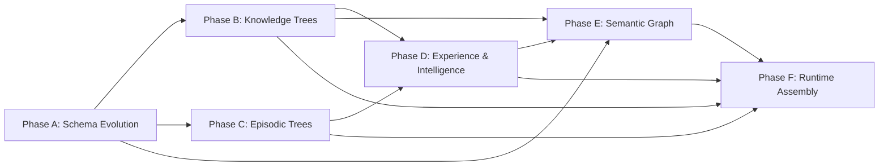

# Unified CORTEX Memory v2.0 — Implementation Roadmap

**Project**: HireBuddha CORTEX Memory Architecture Migration  
**Version**: v1.0 → v2.0  
**Created**: 2026-05-16  
**Estimated Timeline**: 12 weeks (6 phases)

---

## 1. Overview

This document is the master implementation roadmap for migrating the CORTEX memory system from v1.0 (three-tier flat architecture) to v2.0 (unified four-domain tree architecture). It synthesizes the requirements from:

- [Current Architecture](../CurrentArchitecture/cortex-memory-architecture.md) (3 parts + 2 deep analysis)
- [Proposed Architecture](../unified-cortex-memory-architecture-part1.md) (3 parts)

---

## 2. Current vs Target Architecture

| Aspect | v1.0 (Current) | v2.0 (Target) |
|---|---|---|
| **Memory Model** | 3-tier: Working → Episodic → Semantic | 4-domain: Knowledge + Experience + Intelligence + Episodic |
| **Episodic Storage** | Flat `episodic_memories` table, 10-row cap | Hierarchical Episodic Trees (Month → Day → Episode), unlimited |
| **Knowledge Storage** | `document_chunks` + flat CORTEX nodes | Hierarchical Knowledge Trees (Document → Section → Chunk) |
| **Learning** | None | Automated "Dreaming" pipeline (Extract → Pattern → Distill) |
| **Semantic Search** | pgvector on `document_chunks.embedding` | Hybrid semantic + graph search across all domains |
| **Graph Layer** | None | `cortex_edges` table with typed, weighted edges |
| **Scoping** | Entity-level only | 6-level hierarchy (App → Partner → Tenant → User → Entity → Runtime) |
| **Knowledge Access** | Full content copy into runtime trees | Reference-not-copy (pointer nodes) |

---

## 3. Phase Dependency Graph



---

## 4. Phase Summary

| Phase | Title | Timeline | Risk | New Files | Modified Files |
|---|---|---|---|---|---|
| **A** | [Schema Evolution](phase-A-schema-evolution.md) | Week 1–2 | LOW | 1 migration | 2 (models, constants) |
| **B** | [Knowledge Trees](phase-B-knowledge-trees.md) | Week 3–4 | MEDIUM | 3 (kb_service, embedding_service, migration) | 5 (ingestion, service, bridge, worker, memory) |
| **C** | [Episodic Trees](phase-C-episodic-trees.md) | Week 5 | LOW-MED | 2 (episodic_service, migration) | 2 (memory_service, worker) |
| **D** | [Experience & Intelligence](phase-D-experience-intelligence.md) | Week 6–8 | HIGH | 4 (exp_service, int_service, dreaming, prompts) | 2 (worker, models) |
| **E** | [Semantic Graph](phase-E-semantic-graph.md) | Week 9–10 | MEDIUM | 1 (graph_service) | 3 (embedding, memory, worker) |
| **F** | [Runtime Assembly](phase-F-runtime-assembly.md) | Week 11–12 | HIGH | 1 (assembly_service) | 4 (worker, planner, bridge, memory) |

---

## 5. Critical Bugs Fixed (Phase A/B)

These bugs must be fixed before or during the early phases:

### BUG-1: Embedding Model 404 (CRITICAL)

- **File**: `backend/src/ai/constants.py`
- **Current**: `EMBEDDING_MODEL = "gemini-embedding-004"` (returns 404)
- **Fix**: Update to `"text-embedding-005"` or verified model name
- **Impact**: Blocks ALL semantic search, document embedding, and future graph search
- **Fixed in**: Phase B, Step B.3.1

### BUG-2: Silent Embedding Failure

- **File**: `backend/src/ai/worker.py` (`process_document`)
- **Current**: Sets `upload_status = "completed"` even when ALL chunks fail embedding
- **Fix**: Set `"failed"` when all fail, `"partial"` when some fail
- **Fixed in**: Phase B, Step B.3.1

### BUG-3: Internal Context Key Leakage

- **File**: `backend/src/ai/constants.py`
- **Current**: `INTERNAL_CONTEXT_KEYS` missing v2 keys
- **Fix**: Add `__intelligence__`, `__experience__`, `__episodic__`, `__knowledge_refs__`
- **Fixed in**: Phase A, Step A.4.3

---

## 6. New Files Created (All Phases)

| File | Phase | Lines (est.) | Purpose |
|---|---|---|---|
| `migration_unified_cortex_v2.py` | A | ~250 | Alembic database migration |
| `knowledge_tree_service.py` | B | ~200 | Knowledge Tree lifecycle management |
| `embedding_service.py` | B | ~150 | Centralized embedding with batching |
| `migrate_kb_to_trees.py` | B | ~200 | Data migration: documents → Knowledge Trees |
| `episodic_tree_service.py` | C | ~300 | Episodic Tree management, temporal queries |
| `migrate_episodic_to_trees.py` | C | ~150 | Data migration: episodic_memories → Trees |
| `experience_tree_service.py` | D | ~200 | Experience Tree management |
| `intelligence_tree_service.py` | D | ~250 | Intelligence Tree management, rule queries |
| `dreaming_engine.py` | D | ~400 | Three-phase learning pipeline |
| `dreaming_prompts.py` | D | ~100 | LLM prompt templates for dreaming |
| `graph_service.py` | E | ~350 | Semantic graph traversal and search |
| `memory_assembly_service.py` | F | ~300 | Unified memory assembly pipeline |

**Total new code**: ~2,850 lines across 12 new files

---

## 7. Database Schema Changes

### New Tables

| Table | Phase | Columns | Purpose |
|---|---|---|---|
| `cortex_edges` | A | 10 | Weighted graph edges between nodes |

### Extended Tables

| Table | Phase | New Columns | Purpose |
|---|---|---|---|
| `cortex_trees` | A | 11 columns | Domain, scope, scheduling, consolidation |
| `cortex_nodes` | A | 6 columns | Embedding, access tracking, importance |

### New Enum Values

| Enum | Phase | Values Added |
|---|---|---|
| `memory_domain` | A | 4 (new type) |
| `scope_level` | A | 6 (new type) |
| `cortex_node_type` | A | 12 new values |

### New Indexes

| Index | Phase | Purpose |
|---|---|---|
| `ix_cortex_trees_domain_scope` | A | Domain + scope queries |
| `ix_cortex_nodes_embedding` | A | HNSW vector similarity |
| `ix_cortex_nodes_importance` | A | Importance-based ranking |
| `ix_cortex_edges_source/target` | A | Graph traversal |

---

## 8. Backward Compatibility Strategy

The migration follows a **dual-write/dual-read** pattern:

| Phase | New Path | Old Path | Strategy |
|---|---|---|---|
| B | Knowledge Trees | document_chunks | Dual-write; read new first, fallback to old |
| C | Episodic Trees | episodic_memories | Dual-write; read new first, fallback to old |
| D | Experience/Intelligence Trees | (none) | New functionality only |
| E | Semantic Graph Search | document_chunks search | New first, fallback to old |
| F | MemoryAssemblyService | MemoryRouter | Feature flag toggle |

### Feature Flag

```bash
# Enable v2 memory (default: true after Phase F deployment)
export USE_V2_MEMORY=true

# Disable to revert to v1
export USE_V2_MEMORY=false
```

---

## 9. Risk Matrix

| Risk | Phase | Severity | Probability | Mitigation |
|---|---|---|---|---|
| ALTER TYPE requires AUTOCOMMIT | A | Medium | High | Split migration into two operations |
| Embedding model still 404 | B | Critical | Low | Verify model name before deployment |
| LLM hallucinations in Dreaming | D | High | Medium | Confidence thresholds, generation tracking |
| Graph query performance | E | Medium | Medium | Max depth caps, HNSW index, query timeouts |
| Memory assembly latency | F | Medium | Medium | Parallel domain queries, caching |
| Data migration data loss | B, C | High | Low | Dry-run on staging, backup verification |

---

## 10. Testing Strategy

### Unit Tests (Per Phase)

| Phase | Test Focus |
|---|---|
| A | Migration up/down, model import, existing tree load |
| B | Ingestion pipeline, embedding generation, reference resolution |
| C | Episodic tree creation, temporal queries, dual-write |
| D | Dreaming pipeline (mock LLM), pattern recognition, rule distillation |
| E | Graph traversal, hybrid search, edge lifecycle |
| F | Assembly pipeline, intelligence injection, feature flag |

### Integration Tests

- **End-to-end execution**: Create agent → Execute task → Verify episodic + experience writebacks
- **Dreaming pipeline**: Execute 5+ runs → Trigger dreaming → Verify observations + patterns
- **Cross-domain search**: Query returns results from Knowledge, Episodic, and Intelligence
- **Reference resolution**: Runtime tree READ resolves cross-tree references

### Performance Tests

- **Memory assembly**: < 500ms total (all domains)
- **Semantic graph search**: < 200ms per query
- **Graph expansion**: < 100ms for depth-2 BFS
- **Dreaming cycle**: < 30s per entity (batch of 20 episodes)

---

## 11. Deployment Order

```
1. Phase A: Deploy migration (off-hours, with DB backup)
2. Phase B: Deploy with USE_V2_KNOWLEDGE=true (dual-write)
3. Phase C: Deploy with USE_V2_EPISODIC=true (dual-write)
4. Phase D: Deploy dreaming_worker (background only, no user impact)
5. Phase E: Deploy graph service (enhances search, no breaking changes)
6. Phase F: Deploy with USE_V2_MEMORY=true (the big switch)
7. Stabilize: Monitor for 2 weeks, fix issues
8. Cleanup: Remove dual-writes, deprecate MemoryRouter
```

---

## 12. Success Metrics

| Metric | Current (v1) | Target (v2) | Measurement |
|---|---|---|---|
| Episodic memory per entity | 10 episodes max | Unlimited | COUNT(*) query |
| Semantic search accuracy | 0% (broken) | >80% relevance | Manual eval on 20 queries |
| Knowledge access pattern | Full copy | Reference-only | Storage delta check |
| Cross-domain search | Not possible | Working | Functional test |
| Agent learning | None | Observable rules | Inspect Intelligence Tree |
| Memory assembly time | ~50ms (broken semantic) | <500ms (4 domains) | P95 latency monitoring |
