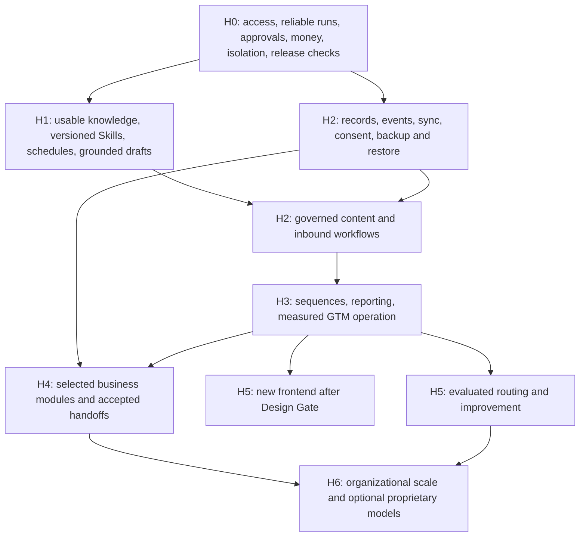

# Delivery sequence and release evidence

This is a dependency-based proposal, not a dated plan or effort estimate. Staffing, budget, initial jurisdictions, provider choices and commercial targets are not supplied. Owner decision D01 establishes GTM as the foundation for the rebuilt whole-business product; it does not justify inventing a delivery date.

## Proposed increments

| Gate | Usable increment | Included capability slices | Exit evidence |
|---|---|---|---|
| **H0 — Trustworthy foundation** | Operators can safely author/test work and trust its outcome/cost | E01 access/session repair; E02 validation/outcomes/recovery; E03 inspectable durable approval and stop; E04 billing/ledger/reservations; E08 isolated execution; E12 local setup/CI/UI errors; E36 relational tenant boundary and control-plane split | Actual-path tests of tenant denial, payment replay, exhausted budgets, failed approvals, crash/retry, misleading completion, disabled tools and forbidden cross-tenant access; no unrestricted real-world actions enabled merely because tools exist |
| **H1 — Grounded internal work** | HireBuddha can use research, reviewed drafts and reusable document Skills internally | E05 Cortex transition; E07 basic schedules/signals; E08 Skill versions/runtime/registry/document pilot; E09 approved connections and MCP; E10 discovery; E13 research; E14 drafts; E17 preparation/RFP drafts; E36 GTM data migration; E38 guided source acquisition | A scheduled run uses permitted tenant knowledge and an exact Skill version; originals and provenance are retained; output/cost/source are inspectable; migrated campaign/lead/call records reconcile; restart preserves capability availability; drafts remain internal |
| **H2 — Business state and governed inbound** | Operators manage contacts/deals and respond to permitted inquiries, with controlled pilot publication | E06 core records/native workspace/import; E07 events/delays/recovery; E09 reference CRM and chosen connectors; E10 blueprint/preview/operate; E11 channel policy and consent; E14 reviewed publishing; E15 capture/qualify/book; E17 quotes/notes; E18 funnel/activity; E12 backup/restore; E31 policy/reliability; E37 runtime/storage; E38 legacy RAG cutover; E39 ad hoc intake/stop | Tenant-zero uses real owned records and declared mastering; replay does not duplicate business effects; opt-out blocks queued actions; an inquiry becomes an owned record and confirmed meeting under D03; tenant isolation, storage quotas and legacy-path removal pass evidence; restore drill succeeds |
| **H3 — Repeatable GTM operation** | A measured GTM function runs with controlled outbound and understandable economics | E16 sequences/senders/replies; E18 attribution/cost/outcomes; E07 business overview; E03 evidence-based autonomy; E08 social pilot; E11 channel fallback; E31 async media; E32 feedback/evaluation; E34 package validation | Real tenant-zero operation covers replies, suppression, bounces, ambiguous provider status, failure recovery and human review; outcomes reconcile to records and costs; each customer-enabled channel passes its own acceptance |
| **H4 — Business modules** | Selected additional business functions operate on the same foundation | E19–E30 chosen modules; E06 schema/native depth; E09 integrations/mastering migration; E12 data-plane fleet operations; E34 partner delegation; E37 internal apps and websites | Each selected module completes its domain stories and relevant cross-functional journeys; domain owners approve rules/scope; app/site preview, permissions, publication and rollback pass evidence; local-master and external-master modes are clearly supported/tested as applicable |
| **H5 — Designed experience and evaluated optimization** | New GenUI and controlled learning improve an already usable product | E33 design gate then new frontend; E31 dynamic routing/model admission; E32 promotion/canary/code improvement; E39 collaborative solution design; E40 hierarchy/digital twin | Design accepted before frontend build; editable Pragya blueprint precedes deployment; essential workflow parity; independently evaluated improvements, bounded canary exposure and rollback; no promoted change solely on self-generated tests |
| **H6 — Organizational scale and optional model research** | Multiple business units and/or in-house models are justified by need and evidence | E34 organizational scope/residency/rollups; E35 BabyBuddha/OmniBuddha research; E40 optional Graph/Loop operations | Isolation and regional processing proven; actual fleet economics/recovery measured; explicit training opt-in; hierarchy changes are idempotent and reversible; model candidates outperform or meet agreed incumbent tradeoffs before admission |

**Increment granularity:** an epic can span several gates. For example, E03's trustworthy approval lifecycle is H0, its broad business authority matrix H2, and evidence-based autonomy H3. An H2 workflow depends on the specific required capabilities, not every future feature in E03. H4 modules can launch independently and discovery may run alongside GTM; none may bypass foundational controls.

**H1 scheduling:** research can recur and store cited artifacts before the full business record store exists. It must not be advertised as queryable market-history, CRM, funnel or revenue reporting. Those depend on H2 records and sufficient source data. E17's internal preparation and RFP drafting are pulled forward because their value does not depend on sending outbound sequences first.

## Dependency map

The arrows describe the proposed rollout and shared prerequisites. An early support/collections discovery project can precede the end of H3; enabling it still requires its own record, policy, connector and recovery capabilities.

## Hard dependency examples

| Cannot enable | Until |
|---|---|
| A1 “approve then publish” | E03-S01/S02 show the exact immutable action and wait durably; E11-S01 verifies policy; E14-S04 verifies provider completion |
| Any automated send/dial or external tool effect | E01 permissions; E03 action approval/stop; E04 reservations/commitments as applicable; E11 consent and conduct; stable effect idempotency; required provider verification |
| Live voice | Approved D03 session behavior, consent/recording choices, authenticated streaming, metered tools, pre-funded safe closure and an owned human fallback |
| Revenue/funnel reports | E06 business records, configured stage definitions and actual source data; platform execution statistics do not suffice |
| Multi-day sequences | Durable schedules/enrollment, sender limits, consent/suppression, idempotent dispatch, replies and cancellation recheck |
| MCP-connected writes | Persisted tenant registration, authenticated transport, explicit operation policy, target ownership, metering and controlled effects; server annotations do not suffice |
| Broader tool-to-Skill migration | Version pinning, isolated execution, sandbox metering/cost cap, reference pilot non-regression and operation-level policy parity |
| Full standalone finance/HR module | Domain records, deterministic invariants, approved rules, qualified review, reports and recovery; generated documents alone do not suffice |
| Self-modifying code | Isolation, independent tests, human promotion, separate promoter, pinned versions, canary and rollback; tests written only by the modifier do not suffice |
| New frontend development | E33-S01/S02 Design Gate deliverables and explicit acceptance |
| Exotel outbound/inbound telephony | E11-S07–S10 provider adapter, consent/recording policy, callback reconciliation, idempotent call effects and human fallback |
| Custom tenant app or website deployment | E36 isolation and storage limits; E37-S01/S03–S06 sandbox, tenant API, preview, publication and rollback evidence |
| Cortex retrieval for an agent | E38-S01–S04 source provenance, sync scope, traceable graph/procedure and permission-aware retrieval |
| Removing legacy RAG tables and jobs | E38-S05/S06 migration comparison, orphan scan and verified cutover with no production legacy path |
| One-off financial model, research or presentation | E39-S01/S02 bounded ad hoc plan, cited inputs, editable artifacts, cost and review trace |
| Deploying a new tenant solution | E39-S03/S04 editable Pragya/Meta Agent blueprint and required approvals before activation |
| Optional Graph/Loop digital twin | E40-S01–S06 hierarchy validation, versioned visual edits, analytics links, idempotency and flat-workflow fallback |

## Pilot and paid-release gates

Tenant zero is the proposed first operating customer from the GTM design. Internal use is not permission to bypass contact policy, real-money controls or confidentiality. Mock recipients/providers and synthetic data can prove failure paths before any live pilot; production-like failure tests must not use real customers as test fixtures.

Before a live pilot, choose O01/O02/O03/O05/O06: supported use cases and jurisdictions, named reviewers/operators, selected connectors, sample workloads, review/response targets, authority and contact policies, backup/recovery expectations. Resolve the remaining D02 connector/mastering choices and O05 policy thresholds before enabling dependent storage/sync or external autonomy decisions; the control-plane boundary and one-time workflow-policy approach are already confirmed.

Before a paying release:

1. Re-verify and close the current-register T0 issues relevant to the enabled deployment. Cross-cutting access, billing, approval, sandbox and required release-check failures are blockers. A defective unused capability may remain disabled with explicit scope rather than pretending it is fixed.
2. Demonstrate the customer-enabled workflow end to end on tenant zero, including required failure/recovery scenarios and human operations. Each workflow has a named business owner and a support owner.
3. Approve commercial packaging and entitlement under O04 using measured delivery, model, storage and human-review costs. No inherited $5 free allowance, markup, currency or authority band becomes policy by repetition.
4. Provide documented native/connected scope, supported integrations, retention/export, operating limits, service targets and recovery procedure.

## Acceptance scenarios that matter

| Scenario | Required result | Primary stories |
|---|---|---|
| Operator attempts another tenant's record/tool/approval | Denied at every relevant entry point, with no data disclosure or effect | E01-S01/S02, E08-S04 |
| Payment callback is replayed or has a tampered amount | No duplicate or fabricated entitlement | E04-S01 |
| Several workflows compete for the same wallet | Atomic holds prevent oversubscription; rejected work creates no spend | E04-S03/S04 |
| Reviewer is away; approval service or worker restarts | Action remains waiting/blocked; exact reviewed version executes once after valid approval | E03-S01/S02, E02-S04 |
| A send succeeds but its acknowledgement is lost | Unknown outcome is reconciled; no blind repeated send | E02-S04, E16-S04 |
| Recipient opts out or replies just before a due follow-up | Latest policy/enrollment state wins before dispatch | E11-S01/S02, E16-S02/S05 |
| External master and local operator edit concurrently | No silent merge or optimistic false success; owner sees confirmed state and conflict | E06-S03, E09-S03 |
| Business write succeeds while event relay is unavailable | Local outbox retains the event; recovery dispatches once with traceable acknowledgement | E07-S04 |
| Knowledge is restricted, removed or unavailable | No unauthorized/stale retrieval; answer admits missing evidence | E05-S02/S03/S06 |
| All required steps fail | Run is not marked completed successfully | E02-S03 |
| Skill/connector is disabled while another worker has cached it | Execution gate rejects the disabled capability before an effect | E08-S04 |
| Stored tenant data is restored into a clean environment | Record relations, knowledge/configuration and artifact references reconcile against the backup manifest | E12-S04 |
| Generated change passes only its own tests | Promotion remains blocked | E32-S02/S05/S06 |
| Cross-functional handoff is replayed | Downstream owner receives one accepted task/record/effect, with original evidence intact | E17-S06, E20–E30 domain stories |
| Exotel call callback is duplicated or delayed | Call state and recording reference reconcile once; consent and opt-out remain authoritative; unknown provider outcome is surfaced for review | E11-S07–S10, E02-S04, E36-S04 |
| Tenant requests an app using another tenant's data | Request is denied before planning/execution and no generated code or artifact crosses the boundary | E36-S02/S05, E37-S01/S03 |
| New solution is proposed without a reviewed design | Deployment remains blocked; Pragya shows editable assumptions, risks, permissions, budget and acceptance criteria | E39-S03/S04 |
| User stops a running autonomous workflow | Queued effects are revoked, in-flight state is settled truthfully and the stop is visible even if voice/model services are down | E03-S04, E07-S06, E39-S06 |
| Graph/Loop is disabled for a tenant | Existing flat workflows continue with equivalent policy, audit and stop behavior; no duplicate subscriptions are created | E40-S05/S06 |

These are future product acceptance requirements. They were not executed during this documentation task, because the environment is not set up and no implementation was requested.

## Measurement without invented promises

| Outcome | Definition / evidence | Target-setting responsibility |
|---|---|---|
| Reliable completion | Confirmed business outcomes / eligible attempted workflows, with partial/failure/waiting reported separately | Workflow owner before pilot |
| Time saved | Measured human effort before/after, including review and exception time | Product owner with actual operators |
| Review quality | Unedited/edited/rejected rates, reviewer agreement and adverse outcomes, by version and task cohort | Quality owner before autonomy promotion |
| Response timeliness | Capture to first permitted useful response; separately show approval wait, queue and execution time | Channel/service owner |
| Revenue impact | Qualified opportunities, confirmed meetings, won/paid outcomes and explicit attribution assumptions | Revenue owner |
| Economic viability | Fully attributed variable and idle costs per completed outcome, plus human support/review cost | Commercial/service owner |
| Data quality | Duplicate/conflict rate, required-field completeness, freshness and reconciliation exceptions | Data steward |
| Business continuity | Observed backup recovery point/time, stale schedules, unreconciled effects, exception age | Service owner |
| Domain success | Support resolution, delivery acceptance, collection/reconciliation, purchasing accuracy, close readiness, HR checklist completion | Corresponding domain owner |

Do not adopt readiness percentages, fixed-week improvement promises or illustrative KPI values from the rough documents as targets. Establish a baseline, choose a sample/window and pass thresholds before each evaluation; retain evidence for unsuccessful as well as successful runs.

## Definition of done for a functional story

A demonstrated user/administrator journey satisfies the stated acceptance criteria, including permissions and relevant failure paths. API, UI and runtime behavior agree. Effects, versions, evidence and cost are traceable. Required automated checks actually ran, with necessary infrastructure. The named operator can recover or escalate failures. Enabled capability metadata and help text are accurate. Migration stories remove the superseded live path after verified cutover and agreed rollback retention. No unresolved blocker is hidden behind a seed, inert flag or passing isolated unit test.
