# HireBuddha — End-State Functional Roadmap & Specification

> **Document Type:** Pure Functional Product Roadmap & Feature Specification
> **Target Platform:** HireBuddha Autonomous Digital Enterprise (End-State Vision)
> **Version:** 2.0 — supersedes v1.0
> **Status:** Approved Target-State Reference Manual
> **Scope:** End-state functional capabilities, user experiences, workforce hierarchy, operational business loops, and platform services. **Contains zero technical implementation code or framework-specific internals.**
> **Companion:** [ROADMAP_AUDIT_REGISTER.md](./ROADMAP_AUDIT_REGISTER.md) — the 42-finding audit that produced this revision, with full traceability from every finding to the feature that closes it.
> **Derived from:** `rough-outline/product_functional_documentation.md` (v3.0.3) · `rough-outline/product_technical_documentation.md` (v3.0.6) · `rough-outline/Unified Business Process & Agent Template Blueprint v2.md` (v2.3) · `rough-outline/skill-first-capability-model.md` (v0.1) · `../marketing-sales-automation.md` · the owner's 2026-09-08 end-state directive.

---

## Table of Contents

* [Executive Summary & Product Vision](#executive-summary--product-vision)
* [How to Read This Document](#how-to-read-this-document)
* [Roadmap Epic Overview](#roadmap-epic-overview)
* [Epic 1 — Pragya: Universal Interface, Control Plane & Digital Chief of Staff](#epic-1--pragya-universal-interface-control-plane--digital-chief-of-staff)
* [Epic 2 — Generative UI, Interactive 3D Digital Twin & Operational Transparency](#epic-2--generative-ui-interactive-3d-digital-twin--operational-transparency)
* [Epic 3 — Hierarchical Autonomous Workforce & the Skill-First Capability Model](#epic-3--hierarchical-autonomous-workforce--the-skill-first-capability-model)
* [Epic 4 — Unified Business Engine (Sheel), Packs & Canonical Processes](#epic-4--unified-business-engine-sheel-packs--canonical-processes)
* [Epic 5 — Isolated Tenant Data Plane, Business Schema & Container Workspaces](#epic-5--isolated-tenant-data-plane-business-schema--container-workspaces)
* [Epic 6 — Integrations, Connector Fabric & Systems of Record](#epic-6--integrations-connector-fabric--systems-of-record)
* [Epic 7 — Multi-Model Intelligence Engine, Proprietary Models & Routing](#epic-7--multi-model-intelligence-engine-proprietary-models--routing)
* [Epic 8 — Omnichannel Communications, the Karuna Membrane & Compliant Outbound](#epic-8--omnichannel-communications-the-karuna-membrane--compliant-outbound)
* [Epic 9 — Signal Bus, Trigger Registry & Scheduling Fabric](#epic-9--signal-bus-trigger-registry--scheduling-fabric)
* [Epic 10 — Document, Content & Creative Production Factory](#epic-10--document-content--creative-production-factory)
* [Epic 11 — Tenant Knowledge Graph, CORTEX Memory & Procedural Intelligence](#epic-11--tenant-knowledge-graph-cortex-memory--procedural-intelligence)
* [Epic 12 — Compounding Learning, Meta Agent & Self-Evolving Code](#epic-12--compounding-learning-meta-agent--self-evolving-code)
* [Epic 13 — Human Operating Model, Resilience & Continuity](#epic-13--human-operating-model-resilience--continuity)
* [Epic 14 — Governance, Trust, Compliance & Economics](#epic-14--governance-trust-compliance--economics)
* [Epic 15 — Platform Administration, Tenancy & Partner Ecosystem](#epic-15--platform-administration-tenancy--partner-ecosystem)
* [Complete End-State Feature Matrix](#complete-end-state-feature-matrix)
* [Non-Goals & Explicit Boundaries](#non-goals--explicit-boundaries)
* [Open Decisions Carried Forward](#open-decisions-carried-forward)
* [Glossary](#glossary)

---

## Executive Summary & Product Vision

**HireBuddha** replaces traditional human headcount scaling with the **Autonomous Digital Workforce**. Instead of hiring, onboarding, and managing human departments over months, companies deploy specialized, context-trained digital employees in minutes.

In its end state, HireBuddha dissolves artificial corporate boundaries. Rather than running disconnected software tools with humans passing spreadsheets between them, an enterprise on HireBuddha functions as **one continuous, self-optimizing cognitive loop**:

* **One Inward Face:** The business owner or executive interacts solely with **Pragya**, an autonomous Chief of Staff and Account Manager, over natural conversation.
* **One Outward Face:** All external counterparties (prospects, customers, suppliers, candidates, regulators) interact with the company through **Karuna**, an empathetic, governed communication membrane.
* **One Continuous Engine:** The enterprise is powered by **Sheel**, a perpetual business loop executing 19 canonical business processes spanning demand, revenue, fulfillment, finance, talent, risk, and strategy.
* **One Shared Object Graph:** Every function reads and writes the *same* 27 canonical business objects in the tenant's own relational database — which is what makes "no seams" mechanical rather than rhetorical.
* **One Compounding Memory:** Institutional knowledge, procedural habits, and domain context compound over time — making the enterprise measurably smarter, faster, and more cost-effective every week.

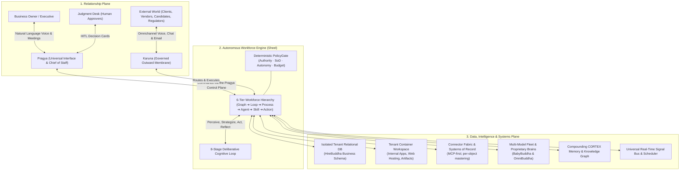

---

## How to Read This Document

* **Epics** are numbered `Epic N`; **features** carry stable identifiers `FN.n`. Downstream design documents, tickets, and test suites should cite these identifiers so coverage can be diffed mechanically at the next audit.
* This is a **functional** specification. It states *what* the product does and *what guarantees it makes*, never how it is built. Where a source document settled an architectural decision that is externally observable (e.g. where data physically lives, or that a run never drops a live call mid-sentence), that guarantee is stated here as a functional property.
* **Every numeric threshold in this document is a default, not a constant.** Authority bands, budget percentages, retention windows, and quotas are tenant-configurable unless explicitly marked *platform-mandatory*.
* Terms of art (Pragya, Sheel, Karuna, Loop, Graph, arc, bundle, pack, envelope, hold, viewport, domain) are defined in the [Glossary](#glossary).

---

## Roadmap Epic Overview

| Epic | Name | Strategic Focus | Primary Source |
| :--- | :--- | :--- | :--- |
| **1** | **Pragya — Universal Interface & Chief of Staff** | Voice-first natural language console, the Pragya Control Plane, co-creation studio, 9-stage engagement lifecycle, inward authentication. | Functional §4; Technical §11 |
| **2** | **Generative UI, 3D Digital Twin & Transparency** | Live isometric enterprise twin (live + design modes), six-level semantic zoom, conversational analytics, HITL decision cards, review queues, activity feed. | Functional §11; Owner directive |
| **3** | **Hierarchical Autonomous Workforce & Skill-First Model** | Graph→Loop→Process→Agent→Skill→Action hierarchy, 8-stage AgentLoop, skill-first capability model, no-code skill studio, sandbox metering. | Functional §2, §7; Skill-First doc |
| **4** | **Unified Business Engine (Sheel), Packs & Processes** | Solo/MSME/Startup/Enterprise packs, 7 starter bundles, 19 canonical processes, entity registry, ad-hoc initiatives. | Blueprint §5, §7, §14 |
| **5** | **Tenant Data Plane, Business Schema & Workspaces** | 27 canonical objects, HireBuddha Business Schema, dedicated relational DB, single write path, container workspaces, data placement contract. | Blueprint §3.2; Technical §10, §19, §23 |
| **6** | **Integrations, Connector Fabric & Systems of Record** | MCP-first connector strategy, the integration catalog, per-object mastering, mirror/write-back, conflict handling, ownership migration. | Functional §6.6; Technical §21 |
| **7** | **Multi-Model Intelligence Engine & Routing** | BabyBuddha & OmniBuddha, frontier text/image/video/voice fleet, step-level routing, failover, compliance pinning, model admission gate. | Functional §3; Technical §3, §22.4 |
| **8** | **Omnichannel, Karuna Membrane & Compliant Outbound** | Exotel/Twilio/Smartflo telephony, the Karuna Profile & gateways, consent & suppression, deliverability, deterministic sequence engine. | Functional §8; Blueprint §2.3, §9.5 |
| **9** | **Signal Bus, Trigger Registry & Scheduling** | Standard signal envelope, dotted taxonomy, single-owner dispatch, delivery semantics, trust attribution, Chronos scheduling. | Blueprint §3.3; Technical §17, §18 |
| **10** | **Document, Content & Creative Production Factory** | Document/spreadsheet/deck pipelines, brand system & brand critic, image and video generation, artifact lifecycle. | Functional §6.3, §6.4 |
| **11** | **Knowledge Graph, CORTEX Memory & Procedural Intelligence** | Editable tenant knowledge graph, four CORTEX domains with scoping, need-to-know viewports, hybrid retrieval, procedural playbooks. | Functional §9; Technical §24 |
| **12** | **Compounding Learning, Meta Agent & Self-Evolving Code** | Instruction tuning, Dreaming consolidation, Meta Agent architecture board, runtime synthesis, independent-suite promotion, canary rollout. | Functional §5, §10, §12; Technical §22 |
| **13** | **Human Operating Model, Resilience & Continuity** | Five residual human roles, Judgment Desk, RACI, degradation ladder, kill switch, backup/DR, exit & portability. | Blueprint §11, §12 |
| **14** | **Governance, Trust, Compliance & Economics** | A0–A4 autonomy ladder, authority matrix, SoD, 18 HITL checkpoints, threat model, regulatory map, privacy/DSAR, wallets & KPI tree. | Blueprint §9, §10; Technical §20, §23.3 |
| **15** | **Platform Administration, Tenancy & Partner Ecosystem** | Four-level tenancy, tenant users & roles, partner white-label & commissions, platform registries, tenant configuration. | Functional §15 |

---

## Epic 1 — Pragya: Universal Interface, Control Plane & Digital Chief of Staff

Pragya is the tenant's single point of contact. Rather than learning complex software dashboards or managing dozens of fragmented bots, business owners interact solely with Pragya through natural conversation.

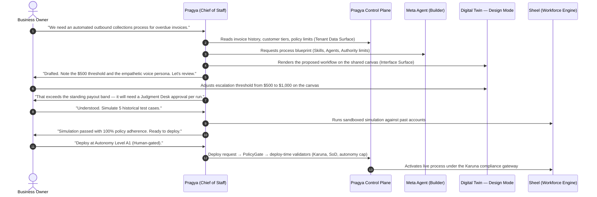

### F1.1 — Voice-First Omnichannel Communication
* **Universal Conversational Reach:** Pragya is accessible via interactive live voice meetings (web/desktop console), direct telephone calls, WhatsApp, Slack, Microsoft Teams, and email.
* **Full Natural Language System Command:** Every platform capability — hiring digital employees, adjusting financial budgets, triggering marketing campaigns, provisioning websites, pausing processes, retrieving business metrics — is reachable through conversation. This is enforced by the completeness rule in F1.2.
* **Persistent Counterparty Continuity:** Conversations persist seamlessly across channels. A dialogue initiated during a phone call continues on WhatsApp or in a web meeting without losing context or requiring repetition.
* **Proactive Initiative:** Pragya is not purely reactive. She opens conversations to surface anomalies, recovered revenue, approvals aging past their SLA, budget thresholds crossed, and optimization proposals.

### F1.2 — The Pragya Control Plane
Pragya's ability to run the platform is a **declared, governed capability surface**, not an implicit privilege. Three control surfaces are exposed to her, each capability-scoped, individually auditable, and revocable:

| Surface | What it reaches | Representative capabilities |
| :--- | :--- | :--- |
| **Platform Control Surface** | The workforce and its configuration | Create/modify/pause entities at any tier · bind channels · set autonomy levels and authority bands · assign work · read run traces and KPIs · manage budgets and envelopes · trigger simulations and deployments |
| **Tenant Data & Workspace Surface** | The tenant's own business data and container | Query and write business objects through the single write path (F5.4) · manage documents and artifacts · manage connectors and system-of-record declarations · deploy internal apps and websites · inspect storage and quotas |
| **Interface Control Surface** | What the human sees | Materialize and update generative-UI components · drive the digital twin's camera, level and selection · open, populate and resolve decision cards and review queues · present analytics and drill-downs |

**Functional guarantees:**
* **Everything Pragya does is an ordinary governed run.** Control-plane calls pass through the same deterministic PolicyGate (F14.2), autonomy ladder (F14.1), SoD rules (F14.4), budget envelopes (F14.8) and audit ledger as any other agent's actions. Pragya has the widest scope, never a bypass.
* **Capability completeness rule:** no platform capability may ship without a corresponding control-plane verb. If a human can do it in the interface, Pragya can do it in conversation. This rule is the acceptance criterion for "one interface".
* **Tenant confinement:** every surface is scoped to a single tenant. Pragya cannot cross tenant boundaries, and cannot reach platform-administration functions (Epic 15).
* **Transport is an implementation choice.** Whether these surfaces are realized as MCP servers (Backend API MCP, Tenant API MCP, UI MCP), as first-class internal tool families, or as a hybrid, is a technical design decision. The *functional* requirement is the three scopes, the governance passthrough, and the completeness rule.

### F1.3 — Real-Time Collaborative Co-Creation Studio
* **Pre-Deployment Co-Creation:** Before any new workflow, agent, process, or integration is deployed, Pragya and the tenant hold an interactive brainstorming and strategy session. Deployment without a co-creation session is not a supported path.
* **The Studio *is* the Digital Twin in Design Mode.** The co-creation canvas is not a separate artifact: it is the same isometric twin described in F2.1, switched into **Design Mode**, showing the proposed organization alongside the live one. The same six levels of traversal apply.
* **Interactive Co-Editing:** Both the tenant and Pragya manipulate the same canvas simultaneously — re-wiring dependencies, adjusting personas, setting authority bands and escalation thresholds, adding or removing agents and skills. Changes are attributed to their author and are reversible.
* **Live Policy Feedback:** When an edit would breach an authority band, an SoD rule, or a compliance obligation, Pragya says so *on the canvas at the moment of the edit* — not after deployment fails.
* **Predictive Scenario Simulation:** Pragya replays historical data and synthetic edge cases through the proposed design, showing exactly how the system would have responded, at what cost, with which approvals raised.
* **Promotion to Live:** An approved design is promoted from Design Mode to Live Mode as an explicit, recorded act, carrying its simulation evidence into the deployment record.

### F1.4 — Nine-Stage Autonomous Lifecycle Engagement Flow
* **Stage 1 — Autonomous Baseline Discovery:** Pragya crawls public registries, corporate websites, product catalogs, and market news to establish business context before asking the tenant a single question she could have answered herself.
* **Stage 2 — Working Assumptions Formulation:** Constructs an explicit, reviewable model of the tenant's operating reality, revenue streams, customer personas, and workflow bottlenecks — tentatively mapped onto the 19 canonical processes. Assumptions are always labelled as assumptions.
* **Stage 3 — Deep Knowledge & System Ingestion:** Orchestrates secure ingestion of internal documents, spreadsheets, drive repositories, and databases into the tenant knowledge base, seeding the business schema.
* **Stage 4 — Evidence-Based Process Correction:** Validates working hypotheses against ingested internal data, exposing hidden inefficiencies and blind spots; surfaces open questions rather than guessing.
* **Stage 5 — Collaborative Solution Engineering:** The co-creation session of F1.3 — priorities, pains, KPIs, constraints, budget envelope, and desired autonomy levels. Pragya proposes; the owner decides.
* **Stage 6 — Workforce Blueprint Finalization:** Generates the complete organizational configuration (Graph, Loops, Processes, Agents, Skills, Actions, Tools, Connectors), starting from the Solo Pack or a starter bundle and handing anything missing to the Meta Agent.
* **Stage 7 — Systems of Record & Integration Binding:** Authenticates external software and **declares the system of record per business object** (Epic 6). No blanket setup — only what the finalized blueprint demands.
* **Stage 8 — Stress Testing, Simulation & Staged Deployment:** Validates performance against synthetic, historical and hostile cases before enabling live operations, with every agent starting at its designated baseline autonomy.
* **Stage 9 — Autonomous Operations & Proactive Reporting:** Monitoring, proactive alerting, HITL surfacing, and ad-hoc change requests — with stages 4–6 revisited continuously as the business evolves.

### F1.5 — Inward Authentication & Impact-Tiered Command Authorization
Channel identity is a **routing hint, never proof**. The higher a command's blast radius, the stronger the verification required — the inward mirror of Karuna's counterparty verification (F14.5).

* **Identity Binding:** Each tenant user enrols their channel identities (phone number, WhatsApp, email address) through a verified handshake. An inbound contact resolves to a bound user, or is treated as unauthenticated — receiving a polite refusal of anything tenant-specific plus an enrolment path.
* **The four command tiers:**

| Tier | Commands | Verification |
| :--- | :--- | :--- |
| **T0 — Informational** | General questions touching no tenant data | None |
| **T1 — Operational reads** | Business metric reporting, routine work delegation | Bound channel identity + session continuity |
| **T2 — Sensitive operations** | Payment approvals, autonomy raises, pausing/resuming processes, bank-detail changes, bulk data operations, process/agent configuration changes | Step-up: passkey/biometric push to the registered device (OTP fallback) → time-limited elevated session |
| **T3 — Critical / irreversible** | Loop kill-switch, above-band payouts, regulatory filings, bulk deletion | Step-up **plus** out-of-band confirmation on a second registered channel |

* **One taxonomy, two enforcement points:** command intents are classified against the same authority-matrix categories the PolicyGate evaluates (F14.2), so the inward and runtime gates can never disagree.
* **Pragya can never satisfy her own checkpoint.** Approvals raised by the PolicyGate route to the Judgment Desk (F13.1) through decision cards — never back as a spoken confirmation on the same, possibly compromised, channel.
* **Anti-spoof posture:** caller ID, message sender and email `From` are hints only; voice-print matching may add signal but is never a sole factor. Repeated failed step-ups lock T2+ commands for that user and alert **every** registered channel.

---

## Epic 2 — Generative UI, Interactive 3D Digital Twin & Operational Transparency

HireBuddha replaces rigid, static software dashboards with an interface that renders what the user needs in real time, centred on an interactive 3D digital twin of the business.

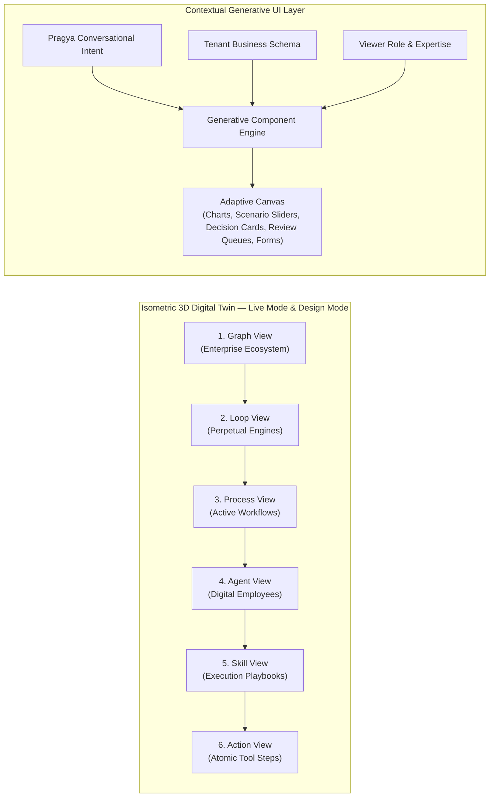

> **Design Gate:** the generative interface is a ground-up new front end, hard-gated behind a dedicated deep design phase that must produce a detailed, unique visual and interaction design before development begins. The existing operating surface remains in service until that gate is passed.

### F2.1 — Isometric 3D Enterprise Digital Twin
* **Living Business Visualization:** Represents the enterprise as a 3D isometric organizational landscape, displaying active processes, live communications, data flows, queues and blockages.
* **Two Modes, One Twin:**
  * *Live Mode* — the operating reality: what is running right now, with real telemetry.
  * *Design Mode* — a proposed or draft organization, editable by both Pragya and the tenant, simulatable before promotion (F1.3).
* **Six-Level Semantic Zoom & Traversal:**
  * *Graph Level:* the ecosystem of business units, subsidiaries, brands, regions and partner networks.
  * *Loop Level:* standing perpetual engines and their goals, budgets, schedules and health.
  * *Process Level:* active workflows, dependency graphs and parallel execution paths.
  * *Agent Level:* individual digital employees — current dialogues, working memory, queue depth, SLOs.
  * *Skill Level:* procedural playbooks and their execution logic in progress, with the active version stamped.
  * *Action Level:* micro-level tool invocations, data lookups, and API transactions.
* **Visual Status Semantics:** distinct, consistent visual states for active processing, waiting on a human, blocked by policy, degraded, over budget, and failed.
* **Selection Follows Conversation:** asking Pragya about something moves and focuses the twin; selecting something in the twin gives Pragya that context. The canvas and the conversation share one cursor.

### F2.2 — Generative Analytics & Conversational Materialization
* **Dynamic Interface Assembly:** As the user speaks with Pragya, the interface generates the relevant components — kanban boards, comparison grids, cashflow waterfalls, funnel charts, approval cards.
* **Conversational Financial Modeling:** Complex questions (*"What happens to our runway if sales drop 15% but we delay inventory purchases?"*) instantly render interactive scenario sliders and sensitivity charts that recompute live.
* **Interactive Drill-Down & Source Provenance:** Any visual element can be opened to inspect the underlying source document, call recording, message thread, or transaction record that produced it.
* **Adaptive Form Generation:** Data entry forms adapt to the tenant's business schema, including fields added by schema evolution, respecting field lifecycle states (F5.2).
* **Adaptation Axes:** the surface adapts per role and expertise, per task, per data shape, and per individual working habits learned over time.

### F2.3 — Human-in-the-Loop Decision Cards
* **Context-Rich Approvals:** When human intervention is required, a card surfaces with the full background, the policy or threshold that triggered it, the risk evaluation, the recommended action, and the cost of delay.
* **Omnichannel Decision Execution:** Review and approve inside the web canvas, on mobile, in Slack, in Microsoft Teams, or over WhatsApp — the same card, the same audit record.
* **Ageing & Escalation:** unanswered cards age visibly, escalate on a configured timer through the Judgment Desk to the owner, and contribute to the loop-health KPI (F14.9).

### F2.4 — Review Queues with Edit
* **Approve / Edit / Reject:** For content-bearing and communication-bearing work, human review is not a binary gate. Reviewers can modify a draft in place and ship the edited version.
* **Batched Review:** queues support batch operation — reviewing twenty outbound messages or ten social posts in one pass, rather than one interruption per item.
* **Edits Are Training Signal:** every human edit is captured as a learning signal (F12.1) and counts toward the entity's HITL edit rate SLO, which is what gates autonomy promotion.

### F2.5 — Operational Transparency & Activity Feed
* **"What did my digital workforce do today":** a plain-language activity feed of what each digital employee did, what it produced, what it spent, and what it is waiting on — written for the business owner, not for operators.
* **Step-Level Run Traces:** every run is inspectable end to end: each of the eight cognitive stages, the model selected for it, the tools and skills invoked with their versions, the critic verdicts, the policy decisions, and the cost of each step.
* **Live Streaming:** runs stream as they execute; the twin, the trace and the feed reflect the same moment.
* **Exportable Audit View:** any trace, decision card, or policy verdict can be exported as evidence.

---

## Epic 3 — Hierarchical Autonomous Workforce & the Skill-First Capability Model

HireBuddha organizes digital labour into a six-tier hierarchy, ensuring modularity, clear accountability, and bounded cognitive load per reasoning step.

```mermaid
graph TD
    subgraph WORKFORCE_TIERS ["6-Tier Workforce Hierarchy"]
        G["GRAPH: Multi-Loop Enterprise & Ecosystem Orchestration"]
        L["LOOP: Sheel (Perpetual, Self-Running Business Engine)"]
        P["PROCESS: Coordinated Macro Workflows (e.g. Lead Acquisition, Books Close)"]
        A["AGENT: Functional Roles & Department Operators (e.g. SDR, AR Specialist)"]
        S["SKILL: Reusable Procedural Competencies (e.g. 3-Way Match, Contract Redline)"]
        ACT["ACTION: Atomic Tool Wrappers (e.g. Query DB, Send Email, Generate PDF)"]
    end

    G --> L --> P --> A --> S --> ACT

    subgraph COGNITIVE_CYCLE ["8-Stage Cognitive Deliberation Loop (AgentLoop)"]
        P1["1. Perceive"] --> P2["2. Strategize"]
        P2 --> PG{"PolicyGate<br/>Deterministic"}
        PG -- BLOCK/HITL --> P2
        PG -- PASS --> P3{"3. Pre-Critic<br/>Safety Gate"}
        P3 -- PASS --> P4["4. Act (Execute Tool)"]
        P3 -- BLOCK --> P2
        P4 --> P5["5. Observe (Results)"]
        P5 --> P6{"6. Post-Critic<br/>Quality Audit"}
        P6 -- PASS --> P7["7. Reflect (Learn)"]
        P6 -- FAIL --> P2
        P7 --> P8["8. Decide (Next Step)"]
    end
```

### F3.1 — Hierarchical Entity Engine
* **Graph Tier:** Orchestrates multi-entity holding companies, international subsidiaries, brands and partner ecosystems (F3.2).
* **Loop Tier:** Perpetual operational engines — such as Sheel — that own high-level business goals, budgets, KPIs and schedules, and never terminate. A Loop is a **scheduler and aggregator**: it dispatches due schedules, sweeps parked signals, rolls up child cost and KPI data, and dispatches all of its own cognition as ordinary Process or Agent work. A Loop therefore never spends money directly; every dollar it causes is spent in a child run under that child's governance.
* **Process Tier:** Goal-oriented business workflows. Executors: dynamic directed acyclic graphs, parallel execution tracks, or multi-agent debate.
* **Agent Tier:** Autonomous operational roles owning a channel or domain with a distinct persona, charter, memory scope and tool access. Executors: continuous dialogue or single-step.
* **Skill Tier:** Reusable procedural playbooks composed of deterministic scripts and contextual judgment. Executor: tool-burst or single-step.
* **Action Tier:** Atomic, IO-contracted execution units, each a thin wrapper around exactly one registered tool.
* **Composition rule:** Actions compose into Skills, Skills into Agents, Agents into Processes, Processes into Loops, Loops into a Graph.

### F3.2 — The Graph Tier & Enterprise Topologies
The Graph tier is a **first-class entity**, not a reporting view. It owns one or more Loops and carries the rules that govern their relationship.

| Topology | When | Shape |
| :--- | :--- | :--- |
| **Single Loop** | One company, one P&L (the default) | A Graph containing one root Loop (Sheel) owning all 19 processes |
| **Federated** | Business units, brands or regions with separate P&Ls or regulatory regimes | A Graph containing a parent Loop and child Loops; each child runs its own processes; the parent runs consolidated financial, guardrail, capital and strategy processes |
| **Holding** | Portfolio or holding companies | A Graph whose parent Loop runs only capital/stakeholder and sense-decide-optimize processes; each subsidiary is a full Loop |

**Federation rules (functional guarantees):**
* Exactly one **root** Loop per Graph. Only a Loop may parent a Loop.
* **Memory and policy flow down** (group policy, brand voice, standards); **KPIs and risk aggregate up**; **nothing flows sideways** by default — business-unit-to-business-unit visibility is an explicit policy choice, never a side effect.
* Model allow-lists, data-residency constraints, jurisdiction packs and budget envelopes are set **per Loop**, which is how an EU subsidiary and an Indian subsidiary coexist under one parent.
* Every Loop — root or child — has its own heartbeat, its own trigger subscriptions, and its own budget envelope.

### F3.3 — 8-Stage Deliberative Cognitive Loop (AgentLoop)
Every digital worker executes through an eight-stage deliberative reasoning cycle:
1. **Perceive** — gathers context, active memory viewport, external inputs, and system signals.
2. **Strategize** — evaluates goals and formulates the next step or sub-agent dispatch.
3. **Pre-Critic (Safety Gate)** — audits the planned action against safety policies, authority bands and budgets *before* execution. Preceded by the deterministic PolicyGate (F14.2), which an LLM cannot be talked out of. Three consecutive blocks trip a circuit breaker.
4. **Act** — executes the external call, message, calculation, or query.
5. **Observe** — parses tool outputs, catches exceptions, and measures real-world responses.
6. **Post-Critic (Quality Audit)** — evaluates whether outputs satisfy acceptance criteria and alignment standards.
7. **Reflect** — synthesizes lessons learned and commits operational insight into persistent memory.
8. **Decide** — sets the next state: `CONTINUE`, `REPLAN`, `DONE`, or `ABORT`.

**Circuit-breaker scoping (functional guarantee):** a tripped breaker quarantines the offending Process or Agent run and raises a governance incident. It **never halts the Loop** — sibling processes keep running, and protected processes are never affected.

### F3.4 — Dynamic Reasoning Modes & Personality Matrix
* **Adaptive Reasoning Selection:**
  * *ReAct (Reason-then-Act)* — rapid, linear operational tasks and database interactions.
  * *Chain-of-Thought* — step-by-step deliberative reasoning for analytical, legal and financial drafting.
  * *Multi-Agent Debate* — competing solutions synthesized by a supervisor, reserved for high-stakes Process- and Loop-tier decisions.
* **Personality Matrix Calibration:** independent adjustment of Tone (Professional → Assertive), Verbosity (Concise → Elaborate), Empathy (0.0–1.0), Humour (0.0–1.0), Formality, and Decision Confidence (how readily the employee commits versus hedging or escalating).
* **Custom Behavioural Rules:** explicit named constraints per entity (*"never discuss competitor pricing"*, *"always direct billing queries to the AR agent"*).
* **Karuna floors override downward calibration.** Any world-facing agent's empathy and tone are floored by the Karuna Profile (F8.5) regardless of the tenant's slider settings.

### F3.5 — Skill-First Capability Architecture & Tool Primitive Pruning
* **Primitives vs. Skills (two-tier model):** the tool registry is pruned to a compact core of roughly **20 foundational primitives** — web search, scrape, headless browser, calculator, file I/O, sandbox code, terminal, LLM call, and one unified authenticated caller per integration family rather than one tool per verb. All complex, multi-step, workflow-shaped capabilities become first-class `SKILL` entities.
* **Progressive Context Disclosure:** prompts carry only lightweight one-line manifests (name + description) for eligible skills. Full instructions, constraints and IO contracts load only when a skill is selected. Tool count degrades a model as it grows; skill count under progressive disclosure does not.
* **Database-Backed Skill Entities (no code deploys):** skills are queryable, tenant-scoped records — not filesystem folders or static classes. Tenant-specific skills are created, edited and activated at runtime without restarting services or shipping code.

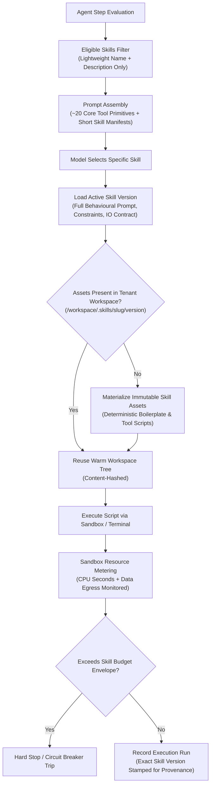

### F3.6 — The Tool-versus-Skill Decision Rule
A new capability becomes a **tool primitive**, not a skill, when *any* of the following hold:
* **Money or metered side effects are involved.** Cost lookup, usage logging, budgets and rate limits key off tool identity; a capability that shells out through the sandbox is otherwise a billing blind spot.
* **Credentials must not reach the model.** OAuth tokens, mailbox credentials and system keys stay behind a tool boundary, never inside a sandbox a prompt can steer.
* **Latency is the point.** A tool call is one hop; a skill is a sub-agent loop.
* **The contract is narrow and stable.** A calculator does not need prose.

Everything else — workflow-shaped, variable, tenant-specific, judgment-bearing — becomes a Skill. **Governance caveat carried forward:** a tool either ran or did not; a skill's prose constraints can be *partially* followed. Wherever a compliance guarantee depends on it, the hard tool boundary is retained, and skill-based paths carry stronger critics than the tool-based paths they replace.

### F3.7 — No-Code Visual Skill Studio & Versioned Assets
* **Visual Skill Authoring Studio:** a visual editor allowing tenants and operators to author, configure and refine custom skills without engineering involvement — natural-language behavioural charters and negative constraints (*"never use unicode bullets"*, *"always set page margins explicitly"*), structured input/output schemas, and attached deterministic script files (Python, Node.js, Shell).
* **Interactive Sandbox Test-Run Canvas:** validate a newly authored skill against representative inputs inside an isolated test container with live output inspection before publishing.
* **Immutable Version Snapshots & Provenance:** every change produces an append-only version snapshot. Execution runs record the exact skill version used, enabling auditable diffs, regression analysis and one-click rollback.
* **Publication is governed:** publishing a skill routes through the same approval flow as any other capability change, and tenant-authored skills carry a stricter workspace-isolation posture than first-party ones.

### F3.8 — Deterministic Script Separation, Workspace Materialization & Runtimes
* **Boilerplate vs. Judgment Separation:** deterministic setup code is stored as reusable script assets so prompts carry judgment, not retyped boilerplate — removing both token waste and a per-run opportunity to introduce typos.
* **On-Demand Workspace Materialization:** a selected skill's script assets materialize into the tenant's container workspace at `/workspace/.skills/<slug>/<version>/`. Warm containers reuse existing content-hashed trees for zero cold-start delay.
* **Code Security Invariant:** skill script source executes solely inside the tenant's sandboxed container; it never crosses into the central control plane.
* **Pre-Baked Curated Runtimes:** immutable runtime environments tailored to skill categories (a document runtime with document compilers pre-installed; a data runtime with analysis libraries). A skill declares which runtime it needs.
* **Run-Time Package Installation Ban — scoped:** **skill execution** may not install packages at run time. This eliminates cold-start latency, closes a supply-chain and egress hole, and guarantees reproducible runs. A skill needing a new dependency is a runtime-image change: rare, reviewed, versioned. **This ban does not apply to tenant-owned application and website builds (F5.7)**, which have their own build-time dependency management, isolated build step, and egress policy.

### F3.9 — Skill-Level Resource Metering & Governance
* **Direct Sandbox Metering:** CPU execution seconds and outbound network egress bytes are tracked and billed during sandbox execution, so work performed inside terminal scripts is metered even when no paid external API was called.
* **Enforceable Per-Skill Cost Envelopes:** hard spending ceilings per skill execution, enforced as a stop rather than as advice.
* **Granular Unit Economics:** real-time cost per completed skill execution, attributed by skill version and parent agent.

### F3.10 — Autonomous Skill Promotion Loop
* **Tool Burst Pattern Mining:** the learning engine observes live runs to detect recurring, successful chains of atomic executions.
* **Autonomous Skill Synthesis Proposal:** when an agent repeatedly executes the same multi-step pattern, the system drafts, packages and tests a unified skill entity.
* **Promotion & Sharing Gates:** proposals route through the Meta Agent's architecture board and human review before promotion into the tenant's private skill library or, separately approved, the global catalogue.

---

## Epic 4 — Unified Business Engine (Sheel), Packs & Canonical Processes

Sheel provides a unified, continuous business loop that eliminates traditional corporate friction across marketing, sales, delivery, finance, talent, risk and strategy.

```mermaid
graph TD
    subgraph COMMERCIAL ["Commercial Packs (what a tenant buys)"]
        SoloPack["Solo Pack (Day 1)<br/>Pragya + 12 Foundational Agents"]
        MSMEPack["MSME Pack<br/>Procurement, Inventory, Books, Onboarding"]
        StartupPack["Startup Pack<br/>Multi-Channel Growth, Tech Pre-Sales, IR"]
        EnterprisePack["Enterprise Pack<br/>Federation, Complex SoD, Compliance, ERP"]
    end

    subgraph BUNDLES ["7 Starter Bundles (functional activation units)"]
        B1["Growth & Customer Acquisition"]
        B2["Customer Success & Support"]
        B3["Operational Fulfillment"]
        B4["Continuous Fiscal & Asset Optimizer"]
        B5["Regulatory & Compliance Engine"]
        B6["Talent Vitality & Resource Alignment"]
        B7["Self-Optimizing Intelligence Engine"]
    end

    subgraph CANONICAL_PROCESSES ["19 Canonical End-to-End Processes"]
        P_Demand["Demand & Market<br/>• P01 Signal-to-Insight<br/>• P02 Awareness-to-Demand"]
        P_Revenue["Revenue & Customer<br/>• P03 Cold-to-Closed<br/>• P04 Partner-to-Revenue<br/>• P06 Resolve-to-Retain<br/>• P07 Renew-and-Expand"]
        P_Fulfillment["Operational Fulfillment<br/>• P05 Order-to-Fulfilled<br/>• P15 Provision-and-Maintain"]
        P_Finance["Fiscal & Financial Control<br/>• P08 Order-to-Cash<br/>• P09 Source-to-Pay<br/>• P10 Record-to-Report<br/>• P11 Plan-Budget-Forecast<br/>• P18 Capital-and-Stakeholders"]
        P_Talent["People & Organization<br/>• P12 Hire-to-Retire"]
        P_Governance["Legal, Risk & Trust<br/>• P13 Draft-Review-Sign<br/>• P14 Continuous Guardrails<br/>• P17 Incident-to-Resolution"]
        P_Strategy["Intelligence & Strategy<br/>• P16 Idea-to-Launch<br/>• P19 Sense-Decide-Optimize"]
    end

    COMMERCIAL --> BUNDLES --> CANONICAL_PROCESSES
```

### F4.1 — One Loop, Not Seven Silos
* **A single root Loop per company.** Sheel is the one perpetual engine scoping the whole business; it owns all 19 processes, holds company-level goals, KPIs and budget, and never terminates. The "seven loops" of earlier drafts are **bundles**, not sibling engines (F4.2).
* **Six operating arcs:** Perceive · Engage · Orchestrate · Fulfill · Sustain · Evolve. Arcs are how work is *read*; the Process is the entity that is *deployed*.
* **The axle/arc separation:** the axle decides *how the system thinks* (model routing, memory assembly, learning, entity construction, governance enforcement) and belongs to no arc. Arcs decide *what the business does* (prioritization, allocation, coordination, dispatch) and are performed by agents inside the loop.
* **Seamlessness is mechanical, not rhetorical:** shared objects (F5.1) plus a standard signal contract (Epic 9) mean there is nothing to hand off — only state changing in one fabric.

### F4.2 — Deployment Packs and Starter Bundles
Two distinct concepts, deliberately kept separate:

**Commercial packs — what a tenant buys.**
* **The Solo Pack (instant day-1 solopreneur core):** the smallest sellable Sheel — **Pragya plus 12 agents**: voice, email and messaging gateways; inbound deal closing; proposal & quote; omnichannel care; appointment concierge; accounts receivable; bookkeeping & reconciliation; cashflow forecasting; regulatory watchdog; scheduling. It is a **cross-functional slice** — thin slices of many processes rather than the whole of one — activating P03, P06, P08, P10, P14 and P19 at baseline autonomy.
* **MSME Pack:** adds structured purchase-order workflows, inventory tracking, vendor management, employee onboarding and statutory tax reporting.
* **Startup Pack:** outbound demand generation, technical pre-sales, investor update preparation, and agile delivery tracking.
* **Enterprise Pack:** multi-entity federation under the Graph tier, complex segregation-of-duties enforcement, internal audit suites, and deep enterprise-system synchronization.

**Starter bundles — the functional activation units.** Bundles are named packaging views over Sheel's 19 processes, used for onboarding, expansion and reporting. Together they cover all 19 processes **exactly once**, which is the completeness check on the whole engine:

| Starter bundle | Processes |
| :--- | :--- |
| Growth & Customer Acquisition | P01 · P02 · P03 · P04 |
| Customer Success & Support | P06 · P07 |
| Operational Fulfillment | P05 · P15 |
| Continuous Fiscal & Asset Optimizer | P08 · P09 · P10 · P11 · P18 |
| Regulatory & Compliance Engine | P13 · P14 · P17 |
| Talent Vitality & Resource Alignment | P12 |
| Self-Optimizing Intelligence Engine | P16 · P19 |

A tenant starts with the Solo Pack and expands **one bundle at a time**; commercial packs are convenience assemblies of bundles plus configuration.

### F4.3 — The 19 Canonical Business Processes
Each process is a deployed entity parented by a Loop, with declared trigger subscriptions, declared read/write objects, a starting autonomy level, and a budget envelope.

| ID | Process | Arcs | Reads / writes (key objects) | Start autonomy |
| :--- | :--- | :--- | :--- | :--- |
| P01 | **Signal-to-Insight** | I | Signal, Lead, Risk | A3 |
| P02 | **Awareness-to-Demand** | I→II | Campaign, Signal, Lead | A2 |
| P03 | **Cold-to-Closed Acquisition** | I→II→III | Lead, Opportunity, Quote, Contract | A2 |
| P04 | **Partner-to-Revenue** | II→V | Account, Contract, Invoice | A1 |
| P05 | **Order-to-Fulfilled** | III→IV | Order, Project, Deliverable, Asset | A2 |
| P06 | **Resolve-to-Retain** | II | Ticket, Account, Signal | A2→A3 |
| P07 | **Renew-and-Expand** | I→II→V | Account, Opportunity, Contract, Invoice | A2 |
| P08 | **Order-to-Cash** | V→II | Invoice, Payment, Ledger Entry | A2 |
| P09 | **Source-to-Pay** | IV→V | Vendor, Purchase Order, Bill, Payment, Asset | A1 |
| P10 | **Record-to-Report** | V | Ledger Entry, Bill, Invoice, Budget | A2 |
| P11 | **Plan-Budget-Forecast** | V→VI | Budget, Ledger Entry, Signal | A1 |
| P12 | **Hire-to-Retire** | II→V | Candidate, Employee, Policy | A1→A2 |
| P13 | **Draft-Review-Sign** | V | Contract, Risk | A1 |
| P14 | **Continuous Guardrails** | V | Policy, Risk, Incident, Evidence | A2 |
| P15 | **Provision-and-Maintain** | IV→V | Asset, Ticket, Employee | A2→A3 |
| P16 | **Idea-to-Launch** | VI→III | Signal, Product/SKU, Campaign | A1 |
| P17 | **Incident-to-Resolution** | cross-cutting | Incident, Risk, Ticket | A1 declare / A3 contain |
| P18 | **Capital-and-Stakeholders** | II·V·VI | Budget, Contract, Signal | A0→A1 |
| P19 | **Sense-Decide-Optimize** | III→VI | all (read); Budget, Policy (write) | A2 |

**Process-stage note:** Hire-to-Retire is the umbrella for Source-to-Hire → Hire-to-Onboard → Develop-and-Retain → Offboard. Verify-and-Sign-off and Pick-Pack-Ship are *stages* of Order-to-Fulfilled, not separate processes.

**Cross-cutting rule for P17:** any agent, any arc, any Karuna gateway, or the platform's own critics may raise an incident. At critical urgency P17 preempts normal routing, may invoke the degradation ladder (F13.3), and always raises human approval for public statements, regulator notifications and legal holds.

### F4.4 — On-Demand Ad-Hoc Initiatives
Beyond the standing processes, the tenant can hand Pragya open-ended assignments and have them executed to completion:
* **Raw Data to Financial Models:** transform raw transaction logs or spreadsheets into multi-year forecasts, sensitivity analyses and valuation models, with stated assumptions and traceable source data.
* **Autonomous Market Research & Deliverables:** conduct deep web research, evaluate competitor positioning, synthesize customer feedback, and produce a complete presentation deck with speaking notes.
* **Ad-Hoc Special Projects:** *"Analyze our supplier pricing variance over the last 9 months and highlight renegotiation targets."*
* **Functional guarantees for ad-hoc work:** every initiative gets a stated scope and acceptance criteria agreed with the tenant, an explicit cost estimate and budget cap before it starts, a visible progress surface in the twin, and a delivered artifact stored in the tenant workspace with full provenance. An initiative that repeats becomes a candidate for promotion into a standing process or skill (F3.10).

### F4.5 — The Entity Template Registry
The end state ships a complete, stable, ID-addressed template registry — the direct input to tenant provisioning and to the Meta Agent's reuse-before-build search:

| Tier | Count | Notes |
| :--- | :--- | :--- |
| Graph | topology-defined | Instantiated per tenant from F3.2 |
| Loop | 1 root per Graph | Sheel; child Loops for federated topologies |
| Process | 19 | P01–P19 (F4.3) |
| Agent | 100 | 1 hub (Pragya) + 5 Karuna channel gateways + 94 workforce agents, each with a parent process, charter, persona, bindings and reasoning mode |
| Skill | 62 | Grouped by arc; reusable across agents |
| Action | 37 | Each a thin IO-contracted wrapper around exactly one registered tool |

**Registry guarantees:** every agent, skill and action named anywhere in the product documentation resolves to a registered template with a stable ID; every template binding resolves to a registered action; every action resolves to a registered tool. Coverage of the 39 traditional business functions is verifiable from the registry, not asserted. The Meta Agent extends the registry at runtime under governance (F12.2).

---

## Epic 5 — Isolated Tenant Data Plane, Business Schema & Container Workspaces

Every business operates within its own dedicated execution and data plane, guaranteeing complete isolation, dynamic data structuring, and sovereign portability.

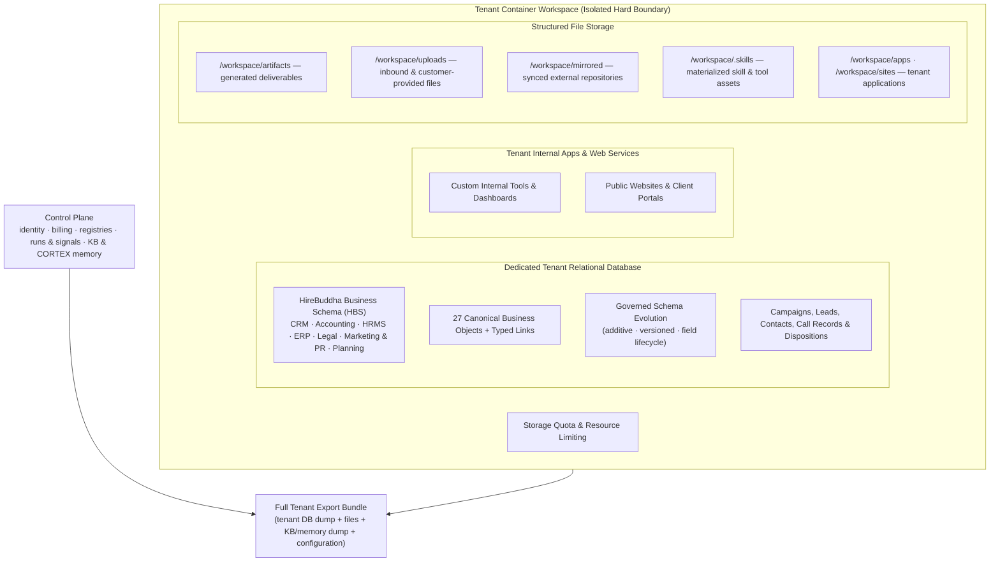

### F5.1 — The Canonical Business Object Model
"One memory" is only real if every function reads and writes the **same objects**. Twenty-seven canonical objects seed every tenant's schema:

| Domain | Canonical Objects |
| :--- | :--- |
| Market & Demand | Signal · Campaign · Lead |
| Revenue | Account · Contact · Opportunity · Quote · Contract |
| Delivery | Order · Project/Engagement · Deliverable · Ticket |
| Money | Invoice · Payment · Bill · Ledger Entry · Budget |
| Supply | Vendor · Purchase Order · Asset/Inventory Item |
| People | Candidate · Employee |
| Product | Product/SKU |
| Trust | Risk · Incident · Policy/Obligation · Evidence |

**The lifecycle chain is a first-class, typed graph:**
`Signal → Lead → Opportunity → Quote → Contract → Order → Project → Invoice → Payment → Ledger Entry`, with `Ticket`, `Risk` and `Incident` attachable to any node.

* **Typed relationships, not dangling references.** Links between records are explicit and typed (converted-to, belongs-to, attached-to, fulfilled-by, billed-by, paid-by, derived-from), traversable in both directions, and cannot dangle.
* **Every process declares which objects it reads and writes** (F4.3). *That declaration is the integration.* The support conversation and the invoice dispute are the same object graph, which is why a dispute resolves without leaving the loop.

### F5.2 — The HireBuddha Business Schema & Governed Evolution
* **Full Relational Schema:** every tenant receives a dedicated **relational** database with structured tables, explicit foreign keys, indexes and full relational query capability — not a document store or a JSON blob per record.
* **Predefined HireBuddha Business Schema (HBS):** initialized on day one with a turnkey enterprise schema. Each canonical object expands into a full functional module:

| HBS module | Coverage |
| :--- | :--- |
| CRM | Accounts, contacts, leads, opportunities, quotes, activities, pipeline |
| Accounting | Chart of accounts, journals, ledger entries, invoices/bills, payments, tax, reconciliation |
| HRMS | Employees, contracts, payroll inputs, leave & attendance, appraisals |
| ERP / Operations | Orders, projects, deliverables, inventory, procurement, vendors |
| Legal | Contracts, obligations, disputes, corporate records, policies |
| Marketing & PR | Campaigns, content, channels, audiences, media contacts |
| Planning | Budgets, targets, forecasts, KPIs |

* **Zero-SaaS Standalone Capability:** the standalone case is the **norm, not the fallback**. A tenant with no external systems runs their entire business on HireBuddha alone.
* **Governed Dynamic Evolution:** the schema expands as new operational entities, fields and relationships appear in live work — under rules, not silently:
  * Evolution is **additive**. Field types are never mutated in place; a type change is a new field plus a backfill plus deprecation of the old one.
  * Fields carry a lifecycle: **active → deprecated → hidden**. Deprecated fields still validate but warn; hidden fields disappear from generated interfaces and retrieval while retained in stored data.
  * Renames are **aliases**, never destructive rewrites.
  * Every definition change increments a version and is audited; records stamp the definition version they were written against and upgrade lazily on their next write. There are no mass migrations.
  * Changes are applied automatically or routed for human approval according to tenant policy and the impact of the change.

### F5.3 — The Data Placement Contract
Where each class of data lives is a stated, externally observable guarantee — not an implementation detail — because it determines isolation, portability and residency.

| Control Plane (platform) | Tenant Data Plane (tenant container) |
| :--- | :--- |
| Identity & tenancy: companies, users, roles, partner hierarchy | **Business objects:** all HBS records, dynamic extensions and typed links |
| Billing: wallets, cost ledger, SKUs, subscriptions, payments | **Operational records:** campaigns, leads, contacts, call records, dispositions, campaign analytics |
| Registries: models, tools, integrations (credentials in the key vault), entity templates, checkpoint definitions | **Artifacts and generated files;** uploaded and mirrored documents |
| Governance configuration, feature flags, entity definitions (configuration, not business data) | **Tenant-built applications and websites** |
| Execution fabric: runs, traces, routing decisions, signals | **Tenant-specific reports and exports** |
| **Knowledge base & CORTEX memory:** documents, chunks, semantic index, cognitive trees, episodic history, conversation logs | |

**Why memory stays control-plane:** the knowledge base and CORTEX memory sit on the hot path of every run stage, every heartbeat and every consolidation cycle. Placing them in the tenant container would keep it perpetually warm, add a network hop to every memory read, and put memory-hungry vector indexes inside small-footprint tenant containers. Data residency is served by **regional control planes**, not by relocating memory.

**Why signals stay control-plane:** billing attribution and the single-owner dispatcher need one operational store. Tenant portability of business events is served by the export bundle.

**The rule of thumb:** the control plane knows *about* the business and remembers it for the platform's machinery; the tenant database holds the business's records — and **the export bundle reunites the two** (F13.5).

### F5.4 — Single Write Path, Object Ownership & Conflict Handling
* **One owning process per object type.** Every business object type declares an owner, set at schema initialization from the canonical process map (Invoices belong to Order-to-Cash; Vendors to Source-to-Pay).
* **Owner writes, others propose.** Agents of the owning process write directly. Any other agent emits a **change proposal**, which the owning process applies, amends or rejects — with the rejection notified back to the proposer. At low autonomy the application step is itself human-visible.
* **Segregation of duties falls out structurally.** The accounts-receivable agent cannot quietly edit a vendor record; it can only propose, and that proposal is an auditable event.
* **All writes go through one record service.** There is no direct write path, including for connectors, so validation, versioning, link materialization and audit cannot be bypassed.
* **Compare-and-set versioning.** A write carries the version it read. A stale write triggers one bounded re-read-and-retry, then raises a write-conflict event rather than blindly overwriting.
* **Emergency escape hatch:** a direct cross-owner write requires an explicit human approval. It is never silent.
* **Soft deletion by default,** so links never dangle. Hard deletion exists only on the privacy-erasure path, cascading links and leaving an audit tombstone.

### F5.5 — Tenant Data API
* **Secure programmatic access** to the tenant's own business data for custom reporting, external analytics, bi-directional synchronization and tenant-built applications.
* **Reads and writes are governed identically to agent access:** writes go through the single write path (F5.4), reads respect need-to-know scoping, and every call is attributed and audited.
* **Schema-aware and self-describing:** the API reflects the tenant's current schema including evolved fields, and exposes field lifecycle state so consumers can migrate deliberately.
* **Rate-limited and quota-bounded** per tenant, with usage visible in the economics ledger.

### F5.6 — Runtime-Generated Capability Persistence
Capabilities the platform generates for a tenant at runtime — synthesized tools, promoted skills, extracted scripts, custom connectors — are **durable tenant assets**, not per-run scratch:
* Stored as versioned, tenant-scoped records with immutable version snapshots and full provenance.
* **Re-materialized on demand** into the container workspace by content hash; a recycled or rebuilt container loses nothing.
* Discoverable in the skill/tool library, editable in the visual studio (F3.7), and subject to the same approval, rollback and metering rules as first-party capabilities.
* **Included in the export bundle** — a tenant's generated capabilities leave with them.

### F5.7 — Dedicated Container Workspaces per Tenant
* **Hard Compute & Process Isolation:** code execution, tool generation and data processing run inside a dedicated container environment per tenant.
* **Custom Internal Application Development & Hosting:** develop, deploy and host private business applications, administrative portals and approval dashboards inside the tenant environment. Applications read and write tenant data through the Tenant Data API (F5.5), never by reaching around it.
* **Website Development & Hosting:** build, deploy and host public marketing websites, landing pages and client portals from within the tenant container, with custom domains and certificates.
* **Build-time versus run-time dependencies:** tenant applications and websites have a governed **build step** in which dependencies are resolved, reviewed against the egress policy, and pinned into an immutable deployable. The run-time installation ban of F3.8 applies to skill execution, not to these builds.
* **Storage & Resource Quota Controls:** configurable storage quotas, execution timeouts, memory and CPU limits per tier, with proactive utilization alerts before a limit is reached and graceful degradation rather than abrupt failure when one is.

### F5.8 — Structured Document & Artifact Management
* **Hierarchical Workspace Storage** with a defined, stable structure:

| Path | Contents |
| :--- | :--- |
| `/workspace/artifacts/` | Generated deliverables — decks, PDFs, spreadsheets, reports, media |
| `/workspace/uploads/` | Files provided by the tenant, by counterparties, or captured from channels |
| `/workspace/mirrored/` | Synchronized copies of external repositories, namespaced per source |
| `/workspace/.skills/` | Materialized skill and generated-tool assets, by slug and version |
| `/workspace/apps/`, `/workspace/sites/` | Tenant-built applications and websites |

* **Every file has a record.** Artifacts, uploads and mirrored documents are indexed as business objects with provenance — which run produced them, which counterparty supplied them, which source they mirror — so the knowledge graph can link to them and the twin can drill into them.
* **Bi-Directional External Source Sync:** synchronization with external repositories (drive services, document platforms, knowledge bases), with conflict handling per Epic 6.
* **Retention and lifecycle:** artifacts and uploads carry retention policy, and honour legal holds and erasure requests (F14.7).

---

## Epic 6 — Integrations, Connector Fabric & Systems of Record

The autonomous workforce is only as useful as its reach into the systems a business already runs — and only as trustworthy as its answer to *"which copy is the truth?"*

### F6.1 — Connector Fabric & Strategy
* **A protocol-first connector layer.** External tool servers connect through a standard model-context protocol adapter rather than through bespoke per-vendor integrations wherever the vendor supports it. Hand-built connectors are reserved for the small number of deep, two-way, business-critical integrations that justify them.
* **One authenticated caller per integration family,** not one tool per verb — consistent with the primitive-pruning rule of F3.5.
* **Credentials never reach a model.** Every credential lives in the encrypted key vault behind a tool boundary.
* **Connector health is monitored,** and a broken integration raises a signal, degrades the affected skills rather than failing silently, and enters the self-healing pipeline (F12.4).

### F6.2 — The Integration Catalog
The end state covers these integration domains, each backed by a registered action:

| Domain | Capability |
| :--- | :--- |
| Banking & Payments | Bank feed synchronization and reconciliation; multi-currency payouts and contractor clearing |
| Tax & Compliance | Jurisdictional sales tax, VAT/GST, withholding computation |
| Legal | Cryptographic e-signature routing with anchor placement and status callbacks |
| Identity & Risk | Business registration checks, KYB, AML and sanctions screening |
| Human Orchestration | Rich interactive cards into corporate messaging spaces; engineering ticket routing |
| Sales & Marketing | Contact and company enrichment, buyer-intent signals; social publishing and listening; ad platforms |
| Scheduling | Multi-stakeholder calendar coordination and meeting links |
| People | HRIS directory, org hierarchy, time-off and benefits |
| Supply Chain | Inventory allocation, ledger updates, fulfillment and shipping |
| Knowledge | Document store and database connectors feeding the knowledge base |
| Business Systems | Authenticated read/write bridges into CRM, ERP, accounting, HRMS and invoicing systems |
| Platform | Scheduling daemon, tenant data query, document extraction & OCR, translation & localization, evidence store, alerting & notification |

### F6.3 — Systems of Record & Per-Object Mastering
Each canonical object declares its master at onboarding. There is never a second master.

* **Declaration:** for each object type, either HireBuddha is the master, or a named connected system is — decided in engagement Stage 7 with Pragya proposing and the tenant confirming.
* **External master (mirror semantics):** HireBuddha mirrors the object, reads serve the mirror with staleness bounded by the connector's sync cadence, and **writes go through the connector first** — the local mirror updates only on confirmation. A failed write-back changes nothing locally and retries.
* **Master wins conflicts:** a divergent external edit overwrites the mirror and raises a conflict event carrying the losing delta for the owning process or a human to review. **There is no silent merging.**
* **HireBuddha master:** normal records under F5.4. Optional downstream export to tenant systems is one-way and labelled as such.
* **One graph, two masters:** typed links may point at mirrored records, so a lifecycle chain can span both masters. The one-memory doctrine constrains the *graph*, not the mastering.
* **Ownership migration:** flipping an object's master — retiring a CRM, or adopting one later — is an explicit, human-approved migration with backfill and link rewrite. Never implicit.

---

## Epic 7 — Multi-Model Intelligence Engine, Proprietary Models & Routing

Intelligence is treated as a dynamic utility. The platform leverages a curated fleet of frontier models alongside proprietary models tuned for agentic execution.

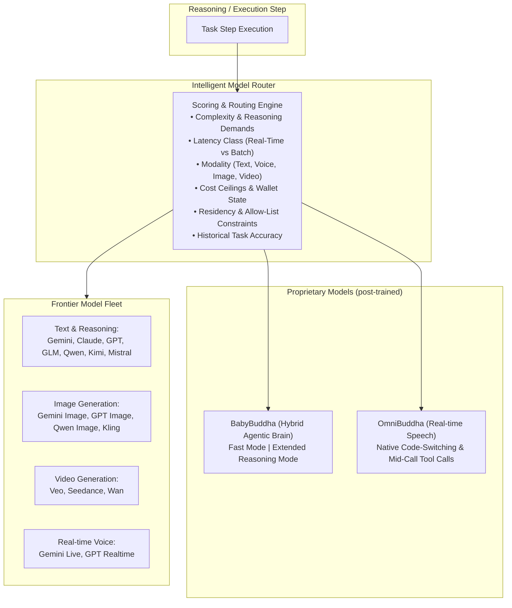

### F7.1 — Comprehensive Frontier Model Fleet
* **Reasoning Models:** Gemini, Claude, OpenAI GPT, GLM, Qwen, Kimi and Mistral.
* **Image Generation:** Gemini Image, GPT Image, Qwen Image and Kling — for marketing graphics, social cards, product mockups and creative assets.
* **Video Generation:** Veo, Seedance and Wan — for product demos, promotional clips and short-form marketing video.
* **Real-Time Conversational Audio:** Gemini Live and GPT Realtime.
* **No vendor lock-in:** any digital employee may be pinned to a preferred model or left on automatic routing.

### F7.2 — Proprietary Models: BabyBuddha & OmniBuddha
Both are **post-trained open-weight models** — built on leading open-weight bases and post-trained on the platform's own agent traces under an explicit tenant data-usage policy. The differentiation is the agentic post-training and the tight integration with the cognitive loop, not a from-scratch pretraining claim.

* **BabyBuddha (hybrid agentic brain):**
  * Tuned for agentic execution: long-horizon multi-step plans, schema-faithful and parallel tool calling with low malformed-call rates, plan adaptation and self-auditing.
  * **Dual-mode operation:** a fast, low-cost mode for routine extraction, classification and formatting, shifting into extended deliberative reasoning for planning and critic stages — without leaving the model family.
* **OmniBuddha (real-time speech):**
  * Speech-to-speech model designed for natural, low-latency human conversation.
  * Multilingual with native code-switching, including Indian regional languages and accents.
  * Mid-call tool triggers — checking an order status while speaking, without dead air.
* **Admission gate (functional guarantee):** neither model is routed production traffic until it demonstrates **non-inferiority within cost budget** against the incumbent models on the platform evaluation harness for the affected task classes (F12.6). Router preference learning can never override a failed admission. Until admitted, the default brains are the frontier vendor models.

### F7.3 — Intelligent Complexity- & Cost-Aware Model Router
* **Dynamic Step-Level Routing:** every cognitive step is scored and routed on required reasoning complexity, latency constraints, modality, tenant cost ceiling and remaining balance, residency and allow-list constraints, and each model's historical success on that task shape.
* **Routing policy:** cheap by default for routine work; escalate on complexity for planning, multi-constraint reasoning, legal and financial drafting, and critic stages; match the modality; respect the wallet by downshifting gracefully rather than failing; learn from outcomes.
* **Transparent Vendor Failover:** automatic fallback to the next eligible model on provider outage, rate limiting or degradation, with the substitution recorded on the run.
* **Compliance Pinning & Allow-Lists:** model choice can be restricted to specific vendors or regional endpoints, set **per Loop**, to satisfy data-residency and sector mandates.
* **Full Attribution:** every step's chosen model, token count and cost are recorded and visible in run traces — routing is never a black box.

---

## Epic 8 — Omnichannel Communications, the Karuna Membrane & Compliant Outbound

Digital employees connect directly to global communication channels to interact with customers, partners, candidates and regulators — always through one governed membrane.

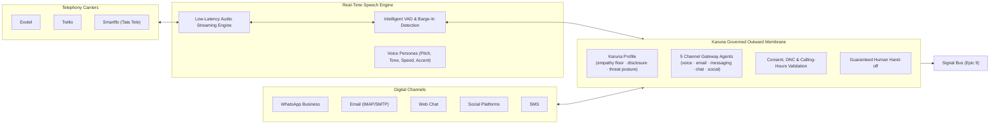

### F8.1 — High-Fidelity Voice Communications
* **Natural Conversational Telephony:** ultra-low-latency speech-to-speech conversation with natural pacing and inflection.
* **Multi-Carrier Telephony Support:** direct carrier connectivity across **Exotel**, **Twilio** and **Smartflo (Tata Tele)** for domestic and international calling, with per-tenant number provisioning and inbound routing.
* **Intelligent Voice Activity Detection:** handles interruptions, natural pauses and speech overlap without cutting callers off — sensitive to the start of speech, patient at the end of it.
* **Custom Voice Personas:** configurable voice profiles matching brand identity across languages, accents, speaking rates and pitch.
* **Mid-Call Capability:** tool calls, data lookups and warm transfers happen mid-conversation without dead air.
* **Recording, transcription and consent:** calls are recorded and transcribed where consent permits; consent capture is enforced at the gateway, and recordings are retained under tenant retention policy.

### F8.2 — Inbound & Multi-Channel Presence
* **Omnichannel Messaging Hub:** native support for WhatsApp Business, email (IMAP/SMTP), SMS, Slack, Microsoft Teams and web chat widgets.
* **Social Media Operations:** publishing, comment moderation, brand-mention listening, and inbound inquiry routing across the major professional, social and video platforms.
* **One counterparty, one history:** every channel writes into the same counterparty episodic record, so a call, an email thread and a WhatsApp exchange with the same person are one conversation (F11.3).

### F8.3 — Compliant Outbound Engine
* **Consent & Suppression Service:** a single authoritative consent and suppression record per counterparty per channel, enforced at the tool boundary. Nothing sends without passing it — this is not advisory and it is not prompt-level.
* **Deterministic Sequence & Enrollment Engine:** multi-step, multi-channel sequences run as a **deterministic state machine**. Timing, suppression checks, deduplication, routing rules and enrollment transitions are code. Models write content, classify replies and exercise judgment — they never decide whether it is time for step three.
* **Send Windows & Rate Limits:** per channel, per tenant, per sender — respecting calling hours, local time zones and courtesy limits as well as carrier and platform limits.
* **Outbound Idempotency:** every side-effecting outbound action carries an idempotency key, so the platform's own retries can never double-send.
* **List Validation & Identity Resolution:** number and address formatting and validation, plus **identity resolution and deduplication** so two lists containing the same person do not become two conversations.
* **Dry-Run / Preview Mode:** render an entire sequence end-to-end against real data and send nothing — the trust-building step before go-live.
* **Real-Time Campaign Analytics:** connection and conversion rates, cost per call and per outcome, sentiment scoring and disposition tags, written to the tenant's own database.

### F8.4 — Deliverability & Sender Identity Management
Deliverability is treated as a product surface, not a setting:
* **Sender identity management:** which mailbox, which domain or subdomain, which number, for which purpose.
* **Domain authentication posture** and subdomain strategy separating transactional, lifecycle and prospecting traffic.
* **Warmup and volume ramps** per sender, with staged daily caps.
* **Bounce, complaint and reputation thresholds** that automatically throttle or pause a sender before it damages the tenant's domain.
* **Visibility:** sender health is surfaced to the tenant, because an unreachable inbox makes everything downstream worthless.

### F8.5 — The Karuna Profile & Channel Gateways
Karuna is two enforceable constructs, not a metaphor.

**(a) The Karuna Profile — a mandatory governance-and-persona overlay** attached to every agent that communicates with any external party. It enforces:
* **Empathy floor and tone bounds** for world-facing conversation, overriding downward persona calibration.
* **AI identity disclosure** wherever law or policy requires it — courteous, automatic, unskippable.
* **Language and channel courtesy:** respond in the counterparty's language (translation auto-invoked), respect contact-time windows and channel preferences.
* **Outbound compliance gates:** consent and do-not-call checks before dialling or messaging, consent-to-record prompts on calls, unsubscribe honoured across channels.
* **World-facing threat posture** (F14.5) active by default.
* **Escalation courtesy:** a guaranteed, always-available path to a human on counterparty request.

> **Deploy-time rule (platform-mandatory):** *no agent without the Karuna Profile may hold a world-facing channel binding.* This is validated at deployment and fails closed.

**(b) Karuna Gateway Agents — the channel front door.** Five standing, registered gateway agents (voice, email, messaging, chat, social) authenticate or identify the counterparty, classify intent, apply the threat posture, and route into the owning process through the standard signal contract — so an inbound call, a support email and a vendor message all enter the loop through one governed membrane, with one audit trail and one compliance surface.

---

## Epic 9 — Signal Bus, Trigger Registry & Scheduling Fabric

The business operates as an event-driven system in which any internal or external occurrence is captured and routed without cross-department friction.

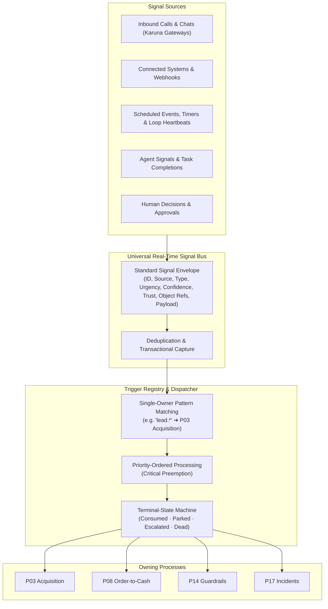

### F9.1 — Universal Business Signal Bus
* **Standardized Event Envelope:** inbound interactions, payment webhooks, data changes, telemetry anomalies, scheduled heartbeats, agent completions and human decisions all enter as one standard envelope carrying identity, source, type, urgency, confidence, trust level, referenced business objects and payload.
* **Dotted Event Namespace:** a clean, extensible taxonomy across the company — `lead.inbound`, `payment.failed`, `ticket.escalated`, `incident.security`, `object.change_proposed`, `sync.conflict`, `schedule.due`.
* **Source Trust Attribution:** every signal is stamped with a trust level — counterparty, externally verified, internal, or platform. **High-impact action categories can be refused on runs whose triggering signal carries counterparty trust**, which is the structural defence against instruction-injection reaching money.
* **Objects, not payloads, are the truth.** Signals are triggers; business object state is the source of truth.

### F9.2 — Trigger Registry, Single-Owner Routing & Delivery Semantics
* **Deterministic Process Ownership:** processes subscribe to signal type patterns; **exactly one process owns each signal**, with contention resolved by declared priority and a deterministic tiebreak.
* **Terminal-state guarantee — no dropped signals.** Every signal ends in a visible terminal state: consumed by a run, parked with a review timer, escalated to a human, or dead-lettered with an incident raised and operations alerted. Stalled signals age visibly and alert.
* **Delivery semantics:** at-least-once delivery with idempotent consumption — a re-delivered signal cannot spawn a second run. Deduplication keys are set from the originating external event so a replayed webhook is absorbed silently.
* **Ordering:** best-effort chronological ordering per tenant; **no global ordering guarantee is offered or relied upon.**
* **Critical preemption:** critical-urgency signals — incidents, security events — are claimed ahead of the queue.
* **Completion & coverage:** every consumption emits a completion signal, which makes **signal coverage** a directly measurable loop-health KPI (F14.9) rather than an assertion.
* **Immutable replay & audit ledger:** signals are immutable; replay creates a linked clone. The full history is auditable and replayable for testing and incident reconstruction.

### F9.3 — Scheduling Fabric
* **Entity Schedules:** any process, agent or skill can be scheduled — *"every Monday at 09:00 in the tenant's time zone"*, *"the third business day of each month"*, *"48 hours after this event"* — expressed in business terms, not cron syntax.
* **Loop Heartbeats:** each Loop runs a standing heartbeat that dispatches due schedules, re-evaluates parked signals whose review timers expired, rolls up child costs and KPIs, and refreshes budget envelopes on cycle.
* **Deferred Callbacks:** an agent can suspend itself with a wake-up condition (*"wait 48 hours, then check for a reply"*) without occupying a worker.
* **Missed-beat supervision:** a Loop whose heartbeat lapses raises a platform incident and alerts operations; recovery is automatic and safe, because schedule dispatch deduplicates — a double-fired heartbeat cannot double-run a process.

---

## Epic 10 — Document, Content & Creative Production Factory

A large share of business output is a document, a deck, a spreadsheet, a page, or a piece of media. The production of those artifacts is a first-class capability family, not a side effect.

### F10.1 — Document & Data Production
* **Formatted document generation** — proposals, contracts, reports, statements and letters — from structured inputs with explicit layout control.
* **Spreadsheet generation and manipulation** — formulas, formatting, pivot and chart tabs — for models, schedules, reconciliations and analyses.
* **Presentation generation** with speaker notes, applied brand styling and consistent layout systems.
* **Document extraction & OCR** — structured text, tables and fields recovered from scans, images and PDFs, feeding the object model and the knowledge base.
* **Deterministic boilerplate, model judgment.** Formatting and setup live in stored scripts (F3.8); the model contributes content and judgment, never retyped scaffolding.

### F10.2 — Brand System & Brand Critic
* **Brand brain:** a tenant-scoped store of voice, tone, messaging pillars, proof points, banned claims, visual identity and terminology, built during onboarding from existing material and maintained thereafter.
* **A domain brand critic wired into the critic pipeline:** every outward-facing artifact — a page, a post, an email, a deck — is evaluated against the brand brain before it reaches a human reviewer or a counterparty. This is the highest-leverage single quality control on generated output.
* **Reusable asset library:** templates, layouts, approved imagery and boilerplate clauses, versioned and traceable.

### F10.3 — Creative Media Generation
* **Image generation** for marketing graphics, social cards, product mockups and creative assets, routed across providers by style, fidelity, speed and cost.
* **Video generation** for product demos and promotional clips, routed by duration, motion complexity and fidelity.
* **Provider failover** and cost attribution identical to text generation (F7.3).

### F10.4 — Artifact Lifecycle
* Every produced artifact is stored in the tenant workspace with a business-object record, provenance back to the run and the source data, a version history, and a review state.
* **Repurposing** — turning one asset into many derivatives — is a first-class operation, and one of the highest-value-per-unit-cost operations on the platform.
* Artifacts inherit retention, legal hold and erasure behaviour from F14.7.

---

## Epic 11 — Tenant Knowledge Graph, CORTEX Memory & Procedural Intelligence

HireBuddha retains and compounds deep institutional memory that stays with the company even as human personnel transition.

```mermaid
graph TD
    subgraph KNOWLEDGE_GRAPH ["Tenant Knowledge Graph & Explorer"]
        Entities["Business Graph Entities<br/>(Accounts, Contacts, Orders, Invoices, Contracts, Risks)"]
        Explorer["Visual Knowledge & Asset Explorer<br/>(Interactive Traversal & Relationship Visualizer)"]
        Provenance["Traceable Document Grounding<br/>(Links to Exact Source PDFs, Emails, Call Transcripts)"]
    end

    subgraph CORTEX_MEMORY ["CORTEX Memory — Four Typed Domains"]
        Knowledge["Knowledge — facts, KB, business context<br/>(tenant-shared)"]
        Episodic["Episodic — cross-channel counterparty history<br/>(tenant-shared, keyed by counterparty)"]
        Experience["Experience — what worked and failed in runs<br/>(per entity, promotable)"]
        Intelligence["Intelligence — distilled operating rules<br/>(per entity, inherited downward)"]
    end

    subgraph MEMORY_GOVERNANCE ["Memory Governance"]
        Viewports["Need-to-Know Domain Viewports<br/>(Support cannot see Payroll; Sales cannot see HR files)"]
        Promotion["Dreaming Consolidation & Upward Promotion"]
    end

    Entities <--> CORTEX_MEMORY
    CORTEX_MEMORY <--> Viewports
    CORTEX_MEMORY <--> Promotion
```

### F11.1 — Editable Tenant Knowledge Graph
* **Semantic Enterprise Graph:** relationships between accounts, contacts, contracts, invoices, deliverables, tickets, risks and people — layered over, and consistent with, the canonical object graph of F5.1.
* **Traceable Grounding & Document Provenance:** every graph node and memory fact links back to its source document, email thread, or recorded call with exact timestamps and passage-level references. A claim with no traceable source is marked as such.
* **Direct Human Curation:** authorized operators can inspect, edit, annotate, merge or prune entities and relationships — with every curation recorded and attributed.
* **Confidence and freshness:** nodes carry confidence and recency; stale or low-confidence facts are visibly degraded rather than silently trusted.

### F11.2 — Visual Knowledge, Memory & Asset Explorer
A single interactive browser for everything the tenant's business knows and holds: the knowledge graph, CORTEX memory nodes, the document corpus, generated artifacts, uploaded and mirrored files, and the relationships among them. Owners and operators can traverse, search, filter by domain, open provenance, and act — reprocess a document, correct a fact, retire a stale policy — from the same surface.

### F11.3 — CORTEX Memory: Four Typed Domains with Explicit Scope
The governing principle: **share what the business knows; keep how each agent works private until it proves out.**

| Domain | Contents | Scope | Written by | Read by |
| :--- | :--- | :--- | :--- | :--- |
| **Knowledge** | Facts, policies, product and domain context, ingested documents | Tenant-shared | Ingestion and agents via the knowledge service | All agents, through viewports |
| **Episodic** | Conversations and interactions, **keyed by counterparty**, unified across every channel | Tenant-shared | Channel handlers and gateways | All agents, viewport-filtered |
| **Experience** | What worked and failed in runs | Per entity | The Reflect stage | The owning entity; promotable upward |
| **Intelligence** | Distilled operating rules and habits | Per entity, **inherited downward** | Reflection and the consolidation engine | The entity and its descendants |

Alongside these, each run holds **working memory** — a transient scratchpad for the current iteration — and long-horizon workflows are carried by a **hierarchical cognitive tree** with automatic checkpoint summarization, so a months-long process does not exhaust its context.

* **One counterparty, one history.** Episodic memory is keyed by counterparty, not by agent — a customer's phone call and their email thread are one history, retrieved by relevance and recency under tenant retention policy.
* **Lessons travel with the reusable unit.** At reflection, a durable lesson lands on the **executing entity** — a skill's lesson lands on the skill, not on whichever agent happened to invoke it.
* **Upward promotion is earned.** The consolidation engine promotes rules that prove out across siblings up the hierarchy, and to the Loop when they hold company-wide. Federated child Loops keep isolated trees; a parent sees only promoted and aggregated material.

### F11.4 — Need-to-Know Domain Viewports
* Knowledge and episodic nodes carry **domain tags** stamped at ingestion from the business-schema module they came from — payroll, legal, financial, customer, general.
* Every entity declares which memory domains it may see. **A support agent's context cannot contain payroll nodes** — exfiltration is prevented by construction at viewport-assembly time, not by an instruction in a prompt that a counterparty might talk around.
* Viewport composition is auditable: for any run, it is possible to show exactly what the agent could and could not see.

### F11.5 — Retrieval Quality
* **Hybrid retrieval:** lexical and semantic search fused, rather than vector similarity alone — because exact names, invoice numbers and clause references are precisely what pure embeddings lose.
* **Structure-aware chunking:** documents split on their own structure, carrying heading context, with chunk sizing tuned per source type.
* **Schema-aware filtering:** retrieval accepts business-schema predicates — object type, counterparty, date range — so *"invoices for Acme since March"* filters before it ranks.
* **Optional reranking** for higher tiers on the fused candidate set.
* **Evaluated, not assumed:** retrieval quality is regression-gated by golden sets in the evaluation harness, like any other behaviour.

### F11.6 — Procedural Intelligence & Institutional Playbooks
* **Distilled Operational Playbooks:** successful execution patterns are synthesized into procedural playbooks capturing company-specific workflows and unwritten operational habits.
* **Editable and traceable:** playbooks are human-readable, human-editable, versioned, and linked to the runs and documents that produced them.
* **Permanent Retention:** institutional memory compounds continuously and remains the tenant's asset — exportable in full (F13.5). This is the structural inverse of human attrition risk.

---

## Epic 12 — Compounding Learning, Meta Agent & Self-Evolving Code

HireBuddha gets measurably smarter over time — Week 12 operates with greater accuracy, speed and cost efficiency than Week 1, with no manual retraining.

```mermaid
graph TD
    subgraph LEARNING_INPUTS ["Continuous Signal Capture"]
        ReflectSignals["Agent Cognitive Reflections"]
        KPISignals["Real-World Outcome KPIs"]
        CriticSignals["Pre/Post-Critic & PolicyGate Interventions"]
        HITLSignals["Human Edits, Approvals & Rejections"]
        RouterSignals["Model Performance by Task Shape"]
    end

    subgraph LEARNING_ENGINE ["Continuous Learning Engine"]
        DreamingEngine["Dreaming & Pattern Consolidation Engine"]
        InstructionTuner["Self-Optimizing Instruction & Charter Tuner"]
    end

    subgraph META_AGENT_BOARD ["Meta Agent Architecture Board"]
        Req["1. Requirement Intake"]
        Curator["2. Curator (Reuse Before Build)"]
        Architect["3. Architect (Design Entity / Capability)"]
        Critic["4. Board Critic (Safety & Boundary Audit)"]
        Validator["5. Deterministic Validator (Karuna · SoD · Autonomy)"]
        TestDriver["6. TestDriver (Smoke, Regression, Boundary, Hostile)"]
        Promoter["7. Promoter (HITL Sign-Off Gate)"]
    end

    subgraph CODE_EVOLUTION ["Self-Evolving & Self-Healing Code"]
        Synthesize["Runtime Capability Synthesis"]
        SelfHeal["Self-Healing Broken Integrations"]
        Optimize["Cost & Speed Optimization"]
        Gates["Independent-Suite Promotion · Red Team · Canary · Instant Rollback"]
    end

    LEARNING_INPUTS --> LEARNING_ENGINE
    LEARNING_ENGINE --> META_AGENT_BOARD
    META_AGENT_BOARD --> CODE_EVOLUTION
```

### F12.1 — Autonomous Performance Optimization
* **Continuous Multi-Source Feedback Harvesting** from agent reflections, real-world KPI outcomes (win rates, recovery rates, resolution times), safety and quality critic interventions, deterministic policy verdicts, human approval edits and rejections, and model performance by task shape.
* **Autonomous Instruction & Charter Tuning:** agent instructions, operational guidelines and routing preferences are updated from measured performance rather than from opinion.
* **Dreaming & Memory Consolidation:** background consolidation identifies recurring patterns across runs and distils them into durable operating rules, promoted upward as they prove out (F11.3).
* **The compounding timeline:** week 1 follows instructions accurately but generically; week 4 recognizes returning counterparties and recurring situations; week 8 anticipates — pre-drafting, flagging anomalies, suggesting actions; week 12 shows measurable KPI improvement from tuned instructions, routing, capabilities and schema, without human intervention. **This is a measured claim:** the evaluation methodology and per-tenant baselines ship with the learning system, not after it.

### F12.2 — Meta Agent & Autonomous Workforce Assembly
* **Natural Language Workforce Generation:** describe a business outcome to Pragya, and the Meta Agent plans, structures and provisions the necessary processes, agents, skills and capabilities.
* **A multi-role architecture board** rather than a single generator:
  * *Requirement Intake* — clarifies the goal, constraints, channels and acceptance criteria.
  * *Curator* — searches the registry and prioritizes **reuse over creation**, with explicit anti-sprawl guarding.
  * *Architect* — designs the entity hierarchy, charters, personas and IO contracts.
  * *Board Critic* — audits the design against safety guidelines, tool availability and operational boundaries.
  * *Deterministic Validator* — fails closed on Karuna-profile, segregation-of-duties and autonomy-cap violations.
  * *TestDriver* — executes smoke, regression, boundary and hostile suites under a shared budget, capturing golden outputs.
  * *Promoter* — manages promotion gates and requests human sign-off for high-impact capabilities.
* **Everything it produces is editable by hand.** The Meta Agent gives a correct, working starting point — never a black box.

### F12.3 — Runtime Capability Synthesis
* When an agent needs a capability that does not exist, the platform generates, tests and registers it — as a **skill by default**, and as a tool primitive only where the F3.6 rule requires it.
* Synthesized capabilities are **durable, versioned tenant assets** (F5.6), discoverable and editable afterwards.
* Source code executes only inside the tenant's sandbox and never enters the control plane.
* Synthesis is subject to the same cost envelopes, metering and approval gates as any other capability.

### F12.4 — Self-Healing & Self-Optimizing
* **Self-Healing Integrations:** third-party API changes, authentication failures and script breakages are diagnosed and patched, with the affected capability marked degraded and dependent work queued rather than failed.
* **Performance & Cost Optimization:** slow or expensive routines are identified and refactored, with the improvement measured rather than assumed.
* **Under-performing capabilities are rewritten** when the learning system flags them against their SLOs.

### F12.5 — Promotion Safety: The Independent-Suite Rule
Self-modification is only defensible if the exam predates the student. **A self-modified artifact — tool, skill, charter or prompt — may never be promoted on self-generated tests alone.** Promotion requires, in order:

1. **The incumbent's golden suite** — captured from the *current* version's behaviour **before** modification.
2. **Platform curated suites** for that artifact category — seeded and maintained by humans.
3. **Self-generated tests** — admitted as *additional* coverage, never as the gate.
4. **An adversarial red-team step** — mandatory, not best-effort.

Beyond the suites:
* **Canary rollout:** a promoted version serves a limited slice first, with **automatic rollback on SLO regression**; full rollout only after a clean canary window.
* **Instant rollback:** every version is retained and restorable in one action.
* **Self-modification quarantine:** no entity may promote a change to itself. Promotion flows through the sandbox pipeline and a *different* approving entity, plus human approval where impact is high (F14.4).
* **Autonomy predicate:** only entities at the self-modify autonomy level (A4) may accept self-evolved changes affecting themselves at all (F14.1).

### F12.6 — Model & Fleet Change Safety
* Any fleet change — a new model, a version bump, a provider deprecation, or admission of a proprietary model — runs the evaluation harness against the incumbent on the affected task classes.
* **Admission requires non-inferiority within cost budget.** Router preference learning can never override a failed admission.
* Model changes are announced in the run traces they affect, so a behavioural shift is attributable rather than mysterious.

---

## Epic 13 — Human Operating Model, Resilience & Continuity

Automating a company does not remove humans; it moves them up the stack. That has to be designed, not assumed — and the system has to degrade gracefully when parts of it fail.

### F13.1 — The Residual Human Organization
Five roles, which one person may hold several of in a small business:

| Role | Owns | Interacts through |
| :--- | :--- | :--- |
| **Goal-Setter (Owner / CEO)** | Business goals, KPI targets, budget envelopes, autonomy ratification | Conversation with Pragya |
| **Judgment Desk** | The approval queue: every HITL checkpoint, every exception decision | Decision cards and review queues (F2.3, F2.4) |
| **Relationship Principals** | High-trust human moments — key accounts, final-round interviews, investor meetings, crisis calls | Briefed by agents before and after |
| **Quality & Ethics Steward** | Output sampling, complaint review, conduct audits, autonomy-promotion sign-off | Evolve-arc dashboards and traces |
| **Domain Experts (fractional)** | Legal counsel, accountant, security — engaged at named checkpoints | Checkpoint-routed |

* **Accountability model:** humans are accountable everywhere and responsible at checkpoints and relationship moments; agents are responsible for execution; Pragya consults and informs by default.
* **Escalation path:** an approval unanswered past its SLA escalates from the Judgment Desk to the owner through Pragya, and contributes to loop health.
* **Trust transition:** every role newly covered by automation runs a shadow period — human does, agent drafts → agent does, human reviews → agent does, human samples. That is the autonomy ladder applied to people's trust, not just to risk.

### F13.2 — Autonomy in Practice: Blast-Radius Sequencing
Work is sequenced by **blast radius**, not by function:
* **Inside the walls** — research, enrichment, scoring, list building, competitive intelligence, reporting, data hygiene, meeting preparation, proposal drafting, forecasting. Read-mostly, reversible, no brand or legal exposure. These can reach high autonomy quickly.
* **Outside the walls** — sending, posting, calling, spending, signing, paying. Irreversible, brand-bearing, legally regulated. These start human-gated and earn autonomy slowly on evidence.

### F13.3 — Degradation Ladder & Kill Switch
When components fail, the business downshifts rather than stops:
1. **Model or provider outage** → router failover to the next eligible model.
2. **Tool or integration failure** → self-healing pipeline; the affected capability is marked degraded and dependent work queues rather than failing.
3. **Channel outage** → gateways reroute, including promising a callback on an alternative channel.
4. **Budget exhaustion** → cheaper routing, deferred batch work, then pausing non-critical processes — never the protected ones.
5. **Systemic anomaly** → **loop-level kill switch**: any process, or the whole loop, can be paused by the owner in one sentence to Pragya, with a T3 confirmation.

**Invariant:** the guardrails process and the incident process keep running in every degradation state, funded from their protected reserve (F14.8).

### F13.4 — Business Continuity
* **Everything that matters is backed up** — the tenant business database, the workspace and its artifacts, the knowledge base and memory, and the execution ledger — on a scheduled cadence, encrypted.
* **A restored tenant resumes with institutional memory intact.**
* **Interrupted work recovers rather than restarts:** runs suspend and resume, so a crash, a provider timeout or a container recycle costs progress measured in a step, not in a workflow.

### F13.5 — Exit & Portability
* **One-click full export bundle** spanning both planes: the tenant relational database, all workspace files and artifacts, the knowledge base and memory dump, the knowledge graph, generated capabilities, entity configurations and charters, and the cost and execution ledger.
* **Agents are configuration; memory is the asset.** Both leave with the tenant.
* **Zero platform lock-in is a stated product guarantee**, testable by performing the export.

---

## Epic 14 — Governance, Trust, Compliance & Economics

Enterprise-grade governance, mathematical spending bounds and strict segregation of duties keep the autonomous workforce secure, auditable and financially disciplined.

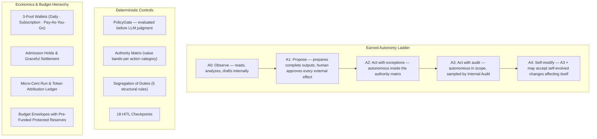

### F14.1 — The Autonomy Ladder (A0–A4)
Autonomy is earned on evidence, raised per entity, never globally.

| Level | Name | Meaning |
| :--- | :--- | :--- |
| **A0** | **Observe** | Reads, analyzes and drafts internally. Nothing leaves the loop. |
| **A1** | **Propose** | Prepares complete outputs; a human approves every external effect. |
| **A2** | **Act with exceptions** | Acts autonomously inside the authority matrix; approvals fire on threshold breaches and anomalies. |
| **A3** | **Act with audit** | Fully autonomous within scope; every act logged and sampled by internal audit; humans review dashboards, not queues. |
| **A4** | **Self-modify** | A3, **plus** may accept self-evolved code, capability or instruction changes affecting itself — still test-gated per F12.5 and human-approved for high impact. |

* **Evidence-based promotion:** an entity sustaining a defined volume of approvals at a high unedited-acceptance rate over a rolling window causes Pragya to *propose* a raise. **A human always ratifies.**
* **Automatic demotion proposal** on SLO breach, through the same checkpoint.
* **Autonomy caps at deploy time:** a new entity cannot exceed its tier's default ceiling; raises route only through the promotion checkpoint.

### F14.2 — Deterministic Authority Matrix & the PolicyGate
The authority matrix is **data, evaluated deterministically before any model judgment**. An LLM cannot be talked out of a block.

| Action category | Autonomous up to | Human approval required above | Hard block above |
| :--- | :--- | :--- | :--- |
| Outbound payment / payout | $500 | $500 | $10,000 (dual human approval) |
| Refund / credit note | $200 | $200 | $5,000 |
| Discount on quote | 10% | 10% | 30% |
| Contract execution | Standard templates, ≤ $2,000 TCV | Any non-standard clause, or > $2,000 | High-liability clauses (always human) |
| Employment offer | — | All offers | Compensation outside approved band |
| Public statement / PR | — | All | Crisis and regulatory statements (named human only) |
| Regulatory filing | Draft only | All submissions | — |
| Vendor creation | KYB-passed, ≤ $1,000 exposure | Above band, or KYB flags | Sanctions-list hit (block + incident) |
| Data deletion | Single-subject, verified | Bulk or ambiguous | Legal-hold conflict |
| Price change | Experiments ≤ 5% on ≤ 10% of traffic | Beyond | Contractual prices |

*All values are tenant-tunable defaults.* The gate resolves each intent to **pass**, **raise approval**, or **block**, and every verdict is recorded and feeds critic calibration and learning.

### F14.3 — The HITL Checkpoint Catalog (18)
A seeded, extensible registry. Tenants tune thresholds per entity; checkpoints marked **platform-mandatory** cannot be removed.

| # | Checkpoint | # | Checkpoint |
| :--- | :--- | :--- | :--- |
| 1 | Before high-value email dispatch | 10 | Before bulk data deletion **(mandatory)** |
| 2 | Before contract e-signature routing | 11 | Before bank-detail change acceptance **(mandatory)** |
| 3 | Before outbound payout above band **(mandatory)** | 12 | Before vendor activation on KYB flags **(mandatory)** |
| 4 | Before high-liability clause acceptance | 13 | Before refund above band |
| 5 | Before self-evolving code promotion **(mandatory)** | 14 | Before discount above band |
| 6 | Before public statement | 15 | Before incident public disclosure **(mandatory)** |
| 7 | Before regulatory filing **(mandatory)** | 16 | Before autonomy level promotion **(mandatory)** |
| 8 | Before employment offer | 17 | Before new channel binding **(mandatory)** |
| 9 | Before termination or offboarding action | 18 | Before cross-owner data write **(mandatory)** |

### F14.4 — Segregation of Duties
Five structural rules, validated at deployment and enforced at runtime:
* **Maker ≠ checker.** The entity that initiates a financial effect may not approve or reconcile it — payment, verification and audit sit with three distinct entities that never share the skills that cross those lines.
* **Vendor creation ≠ vendor payment.** Onboarding, screening and payment are separate entities with the identity gate between them.
* **Access granter ≠ access user.** The entity that provisions access does not consume it; revocation is dual-entity by design.
* **Auditor independence.** Audit entities run with read-only capabilities, a separate budget, and report through Pragya to the owner — never parented by a process they audit.
* **Self-modification quarantine.** No entity may promote a change to itself; promotion routes through the sandbox pipeline and a different approving entity.

Ownership-based write mediation (F5.4) makes these structural rather than advisory: a non-owner cannot write, only propose.

### F14.5 — World-Facing Threat Model & Counterparty Verification
World-facing agents are attack surface. The Karuna Profile (F8.5) activates:
* **Instruction-injection defence:** counterparty content — emails, documents, web pages, call transcripts — is treated as **data, never instruction**. Injected directives are flagged and raise a security incident on pattern match. Signal trust attribution (F9.1) prevents counterparty-triggered runs from reaching high-impact action categories.
* **Social-engineering resistance:** payment-detail changes, urgent payout requests, credential requests and executive-impersonation patterns trigger **out-of-band counterparty verification and human approval regardless of autonomy level**.
* **Impersonation & fraud gates:** identity and sanctions screening on new counterparties; bank-detail changes always verified out of band.
* **Information-boundary enforcement:** need-to-know viewports mean a support conversation *cannot contain* payroll data — exfiltration is impossible by construction, not discouraged by instruction (F11.4).
* **Abuse & jailbreak handling:** scripted disengagement and escalation to a human; an abusive counterparty never degrades the agent's conduct.

The inward mirror of this posture is F1.5.

### F14.6 — Regulatory Compliance Map & Jurisdiction Packs
Baseline obligations are wired into named processes and enforced at named points; jurisdiction packs configure the specifics.

| Domain | Obligation | Enforced at |
| :--- | :--- | :--- |
| AI disclosure | The agent identifies as AI where required | Karuna Profile |
| Outbound calling | Do-not-call and consent regimes, calling windows, consent-to-record | Voice gateway + campaign engine |
| Email & messaging | Anti-spam and consent regimes, unsubscribe honouring, platform business policies | Email/messaging gateways + demand process |
| Data protection | Lawful basis, subject access, retention, breach notification | Privacy capability + guardrails process |
| Financial | Segregation of duties, audit trail, e-invoicing and indirect-tax rules | Finance processes |
| Employment | Offer and termination compliance, statutory payroll | Talent process (approval-heavy) |
| Sector packs | Health, lending and other regulated-sector rules | Regulatory watchdog configuration |

* **Jurisdiction packs** are selectable per Loop, which is how a federated group operates under several regimes at once.
* **A regulatory watchdog capability tracks changes** to the obligations a tenant is subject to and raises them as signals rather than waiting for an audit.

### F14.7 — Privacy, Consent, Retention, Evidence & Erasure
* **Consent registry:** per counterparty, per channel, per purpose, with lawful basis recorded and enforced at the tool boundary.
* **Retention policy:** per data class — conversations, recordings, transcripts, documents, prospect data — configurable, enforced automatically, and visible to the tenant.
* **Data-subject requests:** access, correction, portability and erasure are supported end-to-end. Single-subject verified erasure can be autonomous; bulk or ambiguous erasure requires human approval; erasure conflicting with a legal hold is hard-blocked.
* **Erasure is real:** hard deletion cascades typed links and leaves an audit tombstone, and reaches the knowledge base and memory as well as the business records.
* **Immutable evidence store:** compliance evidence is captured with an audit trail and retained independently of the records it evidences, so guardrail and audit work is defensible.
* **Third-party data flow disclosure:** which model providers process which classes of data is stated, restrictable through allow-lists and residency pinning (F7.3), and auditable per run.
* **Breach notification** paths are pre-defined and run through the incident process with mandatory human approval before any external notification.

### F14.8 — Granular Usage Economics, Wallets & Budget Hierarchy
* **Three-pool wallet with defined consumption priority:**
  1. **Daily free credits** — reset daily, do not roll over; consumed first.
  2. **Pay-as-you-go balance** — topped up, time-bounded validity; consumed next.
  3. **Subscription pool** — monthly recurring credits under a plan.
* **Micro-cent ledger attribution:** the exact cost of every conversation, model token, voice minute, generated image, sandbox CPU-second and egress byte, attributed to the specific step, agent, process and business outcome.
* **Transparent pricing composition:** the billed amount composes a base cost, a category multiplier, and platform and partner fees less any discount — so a white-label partner's margin and the tenant's true cost are both explicit (Epic 15).
* **Admission holds and graceful settlement:**
  * A run begins by placing a **hold** against available balance, so concurrent runs cannot oversubscribe the same money.
  * The hold tops up as it is consumed, or the budget envelope downshifts the run.
  * **On mid-run exhaustion the run completes its current step cleanly — a live call is never dropped mid-sentence** — then suspends and notifies the owner. Overage is capped at a small bounded amount and settled from the next top-up before any new spending.
  * Settlement on completion releases the residual hold and writes actuals to the ledger.
* **Budget hierarchy:** envelopes cascade Graph → Loop → Process → Agent → run, refreshed on cycle. At a configured threshold the owner is notified; at exhaustion the process downshifts (cheaper routing, deferred batch work) before any pausing.
* **Protected reserves:** the guardrails and incident processes hold a **pre-funded carve-out** of each cycle's envelope. "Never paused" means pre-funded, not exempt — if the tenant's wallet is genuinely empty, everything stops, an emergency approval and dunning path triggers, and a degraded read-only mode applies. **No free execution exists.**

### F14.9 — The KPI Tree & Agent SLOs
Three levels, because autonomy promotion, canary rollback and budget decisions all need measured evidence.

* **Loop level (the owner's dashboard):** revenue growth, gross margin, net revenue retention, customer acquisition cost and payback, days sales outstanding, runway, customer satisfaction, compliance status — plus **loop health**: signal coverage percentage, approval-queue backlog age, autonomy distribution, and cost-per-outcome trend.
* **Process level:** each process carries primary KPIs — pipeline value and win rate for acquisition; first-contact resolution and containment for support; days sales outstanding and collection rate for cash; match-exception rate for procurement; days-to-close for reporting; time-to-hire for talent; obligations-met and open risks for guardrails; optimization acceptance and KPI lift for strategy.
* **Agent level (every agent, always):** task success rate · escalation rate · human-edit rate · complaint and correction rate · channel-appropriate latency · cost per completed task · critic-block rate.

**Cost per outcome, not cost per token,** is the reported economic unit — cost per qualified lead, per resolved ticket, per collected invoice, per booked meeting.

---

## Epic 15 — Platform Administration, Tenancy & Partner Ecosystem

The platform is operated by more than one kind of actor, and the commercial model depends on it.

### F15.1 — Four-Level Tenancy & the Partner Ecosystem

| Level | Capabilities |
| :--- | :--- |
| **Platform Administrators** | Platform dashboards; the global model fleet and router policy; the global tool, skill and entity-template registries; baseline SKU costs; checkpoint definitions; feature flags; partner commissions |
| **Partners** | Manage a portfolio of tenants; configure pricing multipliers and margins; white-label the product surface; track earnings, commissions and portfolio health |
| **Tenants** | Their workspace, users, digital employees, integrations, data, autonomy policy and wallets |
| **Users** | Role-scoped access to features, run history, approval queues and the workspace |

* **Isolation is a hard boundary.** No actor at any level can cross a tenant boundary without an explicit, audited grant.
* **White-labelling** covers branding, domain, and the partner fee component of the billing formula.

### F15.2 — Tenant Users, Roles & Permissions
* **Multiple named users per tenant**, each with enrolled channel identities for inward authentication (F1.5).
* **Role-scoped permissions** governing which processes, data domains, approval checkpoints and administrative functions each user reaches. The Judgment Desk, the Quality Steward and the Owner are roles with materially different surfaces.
* **Every human action is attributed** — approvals, edits, curation, configuration changes and exports.

### F15.3 — Tenant Configuration
First-class, tenant-level configuration that many other features depend on:
* **Time zone and working hours** — the basis for scheduling, send windows, calling-hour compliance and "business day" arithmetic. Never inferred, never hardcoded.
* **Locale, currency and fiscal calendar.**
* **Jurisdiction packs** and residency constraints.
* **Retention and consent defaults.**
* **Autonomy policy defaults** and escalation SLAs.
* **Brand system** pointers (Epic 10).

### F15.4 — Platform Operations & Onboarding
* **Self-service tenant provisioning** producing a fully initialized business schema, container workspace, wallet and Solo Pack.
* **Plan and packaging management** — tiers, quotas, included credits, hibernation policy, feature availability.
* **Platform observability** over fleet health, connector health, model provider health and cost — control-plane only, with **no cross-tenant analytics by construction**. Any future benchmarking across tenants requires explicit per-tenant opt-in with disclosure.

---

## Complete End-State Feature Matrix

| Domain | Key End-State Features | Target Business Value |
| :--- | :--- | :--- |
| **Pragya & Interface** | Natural-language chief of staff; the three-surface Pragya Control Plane with a capability-completeness rule; co-creation studio bound to the twin's design mode; 9-stage engagement lifecycle; cross-channel continuity; impact-tiered inward authentication. | Replaces complex software dashboards with one trusted conversational relationship that can actually operate the whole platform. |
| **Interface & Transparency** | Isometric 3D twin in live and design modes with six-level traversal; generative analytics with provenance drill-down; decision cards; approve/edit/reject review queues; step-level run traces and a plain-language activity feed. | The owner can see, understand, steer and trust an autonomous business without learning software. |
| **Workforce Engine** | Graph→Loop→Process→Agent→Skill→Action hierarchy with federation rules; 8-stage AgentLoop with a deterministic policy gate; skill-first model (~20 primitives, progressive disclosure, DB-backed skills, immutable versions); no-code skill studio; pre-baked runtimes; skill metering; autonomous skill promotion. | Eliminates prompt fragility and token bloat; enables no-deploy capability authoring with a rigorous organizational hierarchy. |
| **Business Operations** | Solo/MSME/Startup/Enterprise packs over 7 starter bundles; 19 canonical processes with declared triggers, objects and autonomy; a 100-agent / 62-skill / 37-action registry; on-demand ad-hoc initiatives. | A solopreneur or an enterprise can deploy an entire operating company across marketing, sales, delivery, finance, talent and legal in minutes. |
| **Data & Workspaces** | 27 canonical objects with a typed lifecycle graph; the HireBuddha Business Schema; a dedicated relational database per tenant; governed schema evolution; single write path with ownership and conflict handling; tenant data API; container workspaces hosting internal apps and websites; the data placement contract. | Standalone operation with hard isolation, a real business database, and total data portability. |
| **Integrations** | MCP-first connector fabric; a full integration catalog; per-object system-of-record declaration with mirror, write-back, conflict handling and migration. | Works with the systems a business already runs — with one unambiguous answer to which copy is the truth. |
| **Intelligence Fleet** | BabyBuddha and OmniBuddha as post-trained models behind an admission gate; Gemini, Claude, GPT, GLM, Qwen, Kimi, Mistral; Veo, Seedance, Wan; Gemini/GPT/Qwen Image and Kling; step-level routing, failover and residency pinning. | Frontier-grade capability at routine-task cost, with no vendor lock-in and provable model governance. |
| **Communications** | Exotel, Twilio and Smartflo telephony with barge-in and personas; the Karuna Profile enforced at deploy time; five channel gateways; consent and suppression; deterministic sequence engine; deliverability and sender-identity management; dry-run preview. | Human-quality conversation at scale that actually reaches people and stays inside the law. |
| **Event Fabric** | Standard signal envelope with trust attribution; single-owner dispatch; terminal-state guarantees; at-least-once idempotent delivery; immutable replay; business-language scheduling and loop heartbeats. | A seamless, event-driven enterprise where no event is dropped and every one is accounted for. |
| **Production** | Document, spreadsheet and deck pipelines; OCR and extraction; brand system with a brand critic in the pipeline; image and video generation; artifact lifecycle with provenance. | The company's actual output — documents, decks, campaigns, media — produced on brand and on demand. |
| **Memory & Knowledge** | Editable knowledge graph with document-level provenance; four typed CORTEX domains with explicit scoping and upward promotion; need-to-know viewports; hybrid schema-aware retrieval; editable procedural playbooks. | Institutional knowledge compounds permanently and cannot leak across need-to-know boundaries. |
| **Learning & Evolution** | Multi-source feedback harvesting; instruction and charter tuning; Dreaming consolidation; the Meta Agent architecture board; runtime capability synthesis; independent-suite promotion, red team, canary rollout and instant rollback. | The workforce repairs, optimizes and extends itself — under gates that make self-modification defensible. |
| **Humans & Resilience** | Five residual human roles with a Judgment Desk and escalation SLAs; blast-radius sequencing; five-rung degradation ladder; one-sentence kill switch; backup, restore and resume; a complete two-plane export bundle. | Autonomy without abdication, and a business that degrades gracefully instead of stopping. |
| **Governance & Economics** | A0–A4 ladder with A4 as the self-modification gate; deterministic authority matrix; five SoD rules; 18 HITL checkpoints; world-facing threat model; regulatory map and jurisdiction packs; privacy, retention, DSAR and evidence store; three-pool wallets with holds and graceful settlement; protected reserves; the three-level KPI tree. | Bulletproof risk control, mathematical financial guardrails, and transparent economics measured in cost per outcome. |
| **Platform & Ecosystem** | Four-level tenancy; tenant users and roles; partner white-label, pricing multipliers and commissions; platform registries; tenant time zone, locale and jurisdiction configuration; no cross-tenant analytics by construction. | A commercially operable platform, not just a product. |

---

## Non-Goals & Explicit Boundaries

Stated so that omission is never mistaken for oversight:

1. **This document specifies no implementation.** No schemas, no service boundaries, no framework choices, no table designs. Those belong in the technical specification derived from this document.
2. **No build sequencing or dates.** Epic order here is thematic, not chronological. Increment planning is a separate artifact.
3. **HireBuddha does not become a general-purpose PaaS.** Tenant-built applications and websites are business tools operating on the tenant's own business data — not an arbitrary hosting product, and not a path around the platform's governance.
4. **No cross-tenant data use.** No pooled analytics, no cross-tenant model training on tenant business data without explicit per-tenant opt-in and disclosure.
5. **The platform does not replace licensed human judgment.** Legal, tax, medical and regulatory sign-off remain human at named checkpoints regardless of autonomy level.
6. **Autonomy is never granted by default.** No entity ships above its tier ceiling, and no ceiling is raised without human ratification.
7. **The proprietary models are not claimed as from-scratch pretrained frontier models,** and are not routed production traffic before passing admission.

---

## Open Decisions Carried Forward

These remain genuinely open and must be resolved during detailed design. They are recorded here so they are not silently assumed away.

| # | Open question | Why it matters |
| :--- | :--- | :--- |
| 1 | **Skill selection accuracy at scale.** Progressive disclosure fixes context cost, not selection accuracy. Does selection need retrieval and ranking, and at what skill count does it begin to matter? | Determines whether the skill-first model scales past a few hundred skills per tenant. |
| 2 | **Sandbox cost model.** Metering may reveal that skill-based paths cost materially more per task than tool-based ones. | Could change the primitive/skill boundary of F3.6. |
| 3 | **Tenant container hibernation thresholds** per tier, and the resulting idle-cost economics of the free tier. | Directly sets whether a free tier is viable. |
| 4 | **Buyer-facing pricing model.** Metering platform cost is right for the platform and wrong for the buyer, who expects per-seat or per-outcome pricing. | Affects packaging, the wallet model and partner economics. |
| 5 | **Depth of trust taint tracking.** Signal-level trust attribution is the first step; full end-to-end taint propagation through memory and derived artifacts is not yet specified. | Bounds the strength of the injection defence. |
| 6 | **Tenant-authored skill isolation.** Tenant-authored skills materialized into a shared workspace widen what a compromised prompt can touch. | Gates when tenant skill authoring can ship. |
| 7 | **Autonomy demotion criteria.** Promotion is specified; the precise, non-gameable demotion triggers are not. | Without it, "reversible autonomy" is a promise with no mechanism. |
| 8 | **Multi-touch attribution honesty.** Directional first/last-touch plus self-reported attribution, versus a modelled approach. | Determines what the platform is willing to claim about marketing ROI. |

---

## Glossary

| Term | Meaning |
| :--- | :--- |
| **Pragya** | The inward face. The tenant's single conversational point of contact and chief of staff; the only interface a human needs. |
| **Sheel** | The unified business engine — the single perpetual Loop per company that owns all 19 canonical processes. |
| **Karuna** | The outward face. A mandatory governance-and-persona profile plus five channel gateway agents through which every external interaction passes. |
| **Graph** | The top hierarchy tier. Owns one or more Loops; carries federation, residency and consolidation rules. |
| **Loop** | A perpetual, non-terminating business engine. A scheduler and aggregator that owns goals, KPIs, budget and schedules, and dispatches all its cognition as child runs. |
| **Process** | A goal-oriented macro workflow, parented by a Loop, with declared triggers, objects, autonomy and budget. |
| **Agent** | A digital employee — an operational role owning a channel or domain, with a persona, charter, memory scope and bindings. |
| **Skill** | A reusable procedural competency: instructions, constraints, an IO contract and deterministic scripts, stored as versioned data. |
| **Action** | An atomic, IO-contracted wrapper around exactly one registered tool. |
| **Arc** | One of six operating phases — Perceive, Engage, Orchestrate, Fulfill, Sustain, Evolve — used to read the business, not to deploy it. |
| **Pack** | A commercial assembly a tenant buys (Solo, MSME, Startup, Enterprise). |
| **Bundle** | A functional activation unit — a named group of processes. The seven bundles cover all 19 processes exactly once. |
| **AgentLoop** | The eight-stage cognitive cycle every digital worker executes per step. |
| **PolicyGate** | The deterministic governance evaluation that runs before model judgment and cannot be argued with. |
| **Autonomy level (A0–A4)** | The earned, per-entity, human-ratified permission band, from observe-only to self-modify. |
| **Authority matrix** | Value bands per action category defining what is autonomous, what needs approval, and what is hard-blocked. |
| **HITL checkpoint** | A named point at which execution pauses for human decision; some are platform-mandatory. |
| **Judgment Desk** | The human role that owns the approval queue. |
| **Envelope** | A cycle-refreshed budget allocation at Graph, Loop, Process or Agent level, with protected reserves for guardrails and incidents. |
| **Hold** | Money reserved from the wallet at run admission and settled at completion, preventing concurrent oversubscription. |
| **Signal** | The standard event envelope through which everything enters the loop, carrying source, type, urgency, trust and object references. |
| **Trust level** | The provenance stamp on a signal — counterparty, externally verified, internal, or platform — which constrains what the resulting run may do. |
| **CORTEX** | The memory system: four typed domains (knowledge, episodic, experience, intelligence) plus working memory and a hierarchical cognitive tree. |
| **Domain / viewport** | The need-to-know partitioning of memory: nodes are domain-tagged, entities declare which domains they may see. |
| **HBS** | The HireBuddha Business Schema — the predefined, complete business data model every tenant starts from. |
| **System of record** | The declared master for each business object type — HireBuddha or a named connected system. Never two. |
| **Control plane / data plane** | The platform-side store (identity, billing, registries, runs, signals, knowledge and memory) versus the tenant-side store (business records, artifacts, apps). |
| **Digital twin** | The isometric 3D representation of the business, in Live Mode or Design Mode, traversable across six levels. |
| **BabyBuddha / OmniBuddha** | The proprietary post-trained open-weight models for agentic reasoning and real-time speech respectively. |

---

*This document supersedes v1.0. All 42 findings from [ROADMAP_AUDIT_REGISTER.md](./ROADMAP_AUDIT_REGISTER.md) are closed here. It is the functional base for the technical specification, the data model, the entity registry seeds, and the increment plan that follow.*
