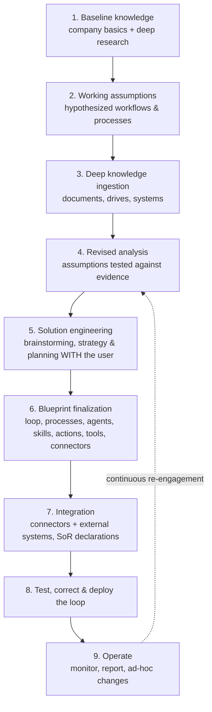

# HireBuddha — Product Functional Documentation

> **Target Platform Version:** 3.0.0 (road-map target state)
> **Author:** Buddha Cognitive Lab
> **Last Updated:** July 2026 — v3.0.3 (v3.0.1 errata + maturity re-labeling; v3.0.2 Solo Pack + episodic re-scope; v3.0.3 owner directives: standalone predefined tenant schema in the sandbox DB, the nine-stage Pragya engagement flow, GenUI as a ground-up new frontend)
> **Status:** Road-Map Reference Manual — this document describes the **target** state of the platform, not the shipped state. Each major section carries a maturity tag (legend in §0.1). The shipped state is documented in `docs/current/` (2.0.0) and [codebase_current_state_analysis.md](./codebase_current_state_analysis.md); open findings live in [roadmap_gap_register.md](./roadmap_gap_register.md).
> **Revision:** Phase 2 — supersedes Phase 1 (2.0.0). Adds the Intelligence Engine (BabyBuddha + frontier models + intelligent router), multimodal generation, the Meta Agent, Pragya (account manager), the Learning System, Generative UI, self-evolving code, dynamic per-tenant schema, and the **Loop** tier of the workforce hierarchy.

---

## 0. What Changed in Phase 2 (Reader's Map)

Phase 1 described HireBuddha as a no-code builder for autonomous AI Employees with a 4-tier hierarchy, a 4-tier memory system, omnichannel presence, and usage-based billing. **All of that remains true and is fully retained in this document.** Phase 2 documents the parts of the live product that the earlier reference manual under-described or omitted:

| # | Capability | Where it lives now | Maturity (v3.0.1) |
|---|---|---|---|
| 1 | **The Intelligence Engine** — flagship hybrid LLM **BabyBuddha** + frontier models | §3 | ◐ — 3 vendor adapters shipped (Gemini, Claude via Vertex, Azure GPT-4o); BabyBuddha ⬜ |
| 2 | **Intelligent Model Router** — complexity- and cost-aware routing | §3.3 | ⬜ — today: static per-task-type model defaults |
| 3 | **Image generation** | §3.5 / §6.4 | ◐ — Imagen 4 shipped; other providers ⬜ |
| 4 | **Video generation** | §3.5 / §6.4 | ◐ — Veo 3.1 + edit/add-sound tools shipped |
| 5 | **Realtime audio** — **OmniBuddha** + Gemini Live + GPT Realtime | §3.5 / §8.1 | ◐ — Gemini Live + Azure Realtime shipped; OmniBuddha ⬜ |
| 6 | **The Learning System** — continuous, autonomous improvement | §10 | ◐ — see §10 maturity note |
| 7 | **The Meta Agent** — goal-driven agent that builds AI Employees and tools | §5 | 🚩 — Architecture Board shipped (richer than this doc); tool synthesis flag-OFF |
| 8 | **Generative & Adaptive UI** — interfaces that assemble themselves per user | §11 | ⬜ road map |
| 9 | **Self-Evolving Code** — agents that rewrite and optimize their own logic | §12 | 🚩◐ — tool synthesis flag-gated; self-heal ⬜ |
| 10 | **Dynamic Per-Tenant Schema** — a data model that grows as the tenant works | §13 | ⬜ road map |
| 11 | **The Loop tier** — the top entity of the workforce hierarchy | §2 | ⬜ road map (4 of 5 tiers shipped) |
| 12 | **Pragya** — the account-manager agent and single point of contact | §4 | ⬜ road map |

### 0.1 Maturity Legend (added v3.0.1)

Every major section is tagged with its implementation maturity, verified against the codebase on 2026-07-18 ([codebase_current_state_analysis.md](./codebase_current_state_analysis.md)):

* ✅ **Shipped** — implemented and live in the platform.
* 🚩 **Built, flag-gated** — code-complete behind a default-OFF feature flag; not yet GA.
* ◐ **Partial** — a meaningful subset is shipped; the rest is road map.
* ⬜ **Road map** — design target; not yet started in code.

---

## 1. Product Paradigm: The Autonomous Digital Workforce

### 1.1 The Business Thesis: "Stop Hiring, Start Deploying"
HireBuddha is built to solve the resource scaling limits of solopreneurs and Small & Medium Enterprises (SMEs). In a traditional organization, expanding operations (e.g., entering new sales territories, scaling customer service, launching multi-channel marketing campaigns) requires a linear increase in human headcount. Human hiring introduces significant frictions:
*   **Recruiting Overhead**: Sourcing, screening, and interviewing candidates.
*   **Training and Onboarding Delay**: A typical employee requires 30 to 90 days to achieve full productivity on company-specific context.
*   **Fixed Salary Commitments**: Payroll, payroll taxes, health insurance, PF contributions, paid leaves, and severance commitments.
*   **Attrition Risk**: Institutional knowledge leaves the company when the employee resigns.
*   **Performance Variance**: Human execution varies based on fatigue, mood, training, and individual capabilities.

HireBuddha replaces the human salary model with the **AI Employee Deployment Model**. Companies do not hire departments; they deploy pre-built, context-trained AI Employees in under 10 minutes — and increasingly, they simply *describe what they need to Pragya* (§4) and the platform builds the workforce for them.

| Dimension | Human Workforce | AI Workforce (HireBuddha) |
|---|---|---|
| **Compensation Model** | Fixed monthly salaries + benefits + overhead. | SKU-based, pay-for-performance cost models (tokens/minutes). |
| **Availability** | 8 hours/day, 5 days/week, excluding holidays. | 24/7/365 continuous operation with no ramp-up time. |
| **Scaling Velocity** | 30 to 90 days of recruitment and onboarding. | Instantaneous duplication (cloning) in <10 seconds. |
| **Operational Consistency** | Subject to human error, cognitive fatigue, and churn. | Consistent adherence to guidelines and prompt parameters, enforced by pre/post-critic gates (§7) — within normal model variance. |
| **Context Retention** | Lost upon resignation or role transition. | Shared, permanent memory (CORTEX) saved in the tenant DB. |
| **Improvement Over Time** | Plateaus; requires retraining and management. | **Compounds autonomously** via the Learning System (§10). |

### 1.2 The Core 3-Step Lifecycle: Design, Deploy, Employ

```mermaid
graph TD
    subgraph 1. DESIGN STAGE
        A[Define Persona Name & Role] --> B[Assign System Prompt Charter]
        B --> C[Configure Personality Sliders]
        C --> D[Bind Built-in/Custom Tools]
        D --> E[Upload Knowledge Base Docs]
    end

    subgraph 2. DEPLOY STAGE
        F[Assign Inbound/Outbound Phone Lines] --> G[Register WhatsApp Business API]
        G --> H[Authenticate SMTP/IMAP Email Accounts]
        H --> I[Link Social Accounts via OAuth 2.0]
    end

    subgraph 3. EMPLOY STAGE
        J[Trigger Outbound Campaigns] --> K[Auto-Answer Inbound Calls/Messages]
        K --> L[Run Background Processes]
        L --> M[Monitor real-time Cost/Run Traces]
    end

    1. DESIGN STAGE --> 2. DEPLOY STAGE
    2. DEPLOY STAGE --> 3. EMPLOY STAGE
```

#### Step 1: Design
Using the **No-Code AI Architect** — or by simply talking to **Pragya** and the **Meta Agent** (§4, §5) — operators design their digital employee:
*   **Name & Title**: Define identities (e.g., "Sarah - Outbound BDR").
*   **System Prompt Charter**: The "job description" defining boundaries, guidelines, logic gates, and explicit behavior parameters.
*   **Personality Matrix**: Precision tuning sliders for Tone, Verbosity, Empathy, Humor, Formality, and Decision Confidence.
*   **Tool Bindings**: Activating tools from the registry (e.g., Web Search, PDF Generator, Sandbox Code Executor).
*   **Knowledge Base Injection**: Uploading business documents to populate semantic vector tables.

> **Phase 2 addition:** Design is no longer strictly manual. A tenant can describe an outcome in natural language ("I need someone to chase overdue invoices in INR and escalate after 14 days"), and the **Meta Agent** iterates an agentic build-loop until it produces a fully-configured AI Employee or tool that satisfies the goal. The No-Code AI Architect remains available for hands-on editing of everything the Meta Agent generates.

#### Step 2: Deploy
Connecting the virtual employee to communication networks:
*   **Voice Integration**: Purchasing Twilio, smartflo (Tata Tele), or Exotel lines.
*   **Messaging**: Authorizing Twilio WhatsApp Business APIs.
*   **Email**: Providing SMTP/IMAP credentials with secure app-specific passwords.
*   **Social & Ad Channels**: Authorizing OAuth connections to LinkedIn, Facebook, Google Ads, and YouTube.

#### Step 3: Employ
Activating the AI:
*   Inbound channels answer automatically and process messages.
*   Outbound engines dial contact campaigns, run lead qualifiers, and draft proposals.
*   The system updates credit wallets and streams real-time execution logs (SSE traces).

---

## 2. The AI Workforce Hierarchy

HireBuddha structures autonomous agents into an organizational hierarchy. This hierarchy avoids monolithic prompt sprawl, separating macro strategy from micro tool invocation.

> **Maturity:** ◐ — four tiers (Action, Skill, Agent, Process) are ✅ shipped; the **Loop** tier is ⬜ road map (the shipped entity `type` enum has no LOOP value yet).
>
> **Phase 2 correction (amended v3.0.1):** Phase 1 documented **four** tiers. The target hierarchy has **five** — the top entity, **Loop**, is the road-map addition. A Loop is the highest organizational unit: a self-perpetuating business engine made of Processes. **Per tenant there is exactly one *root* Loop — Sheel, the unified business engine** (Blueprint v2 §2.1; multi-BU tenants may federate child Loops beneath it — Blueprint §13, technical doc §17.6). The "seven business Loops" of earlier drafts are *not* separate Loop entities: they are the **seven starter bundles** — named packaging views over Sheel's 19 canonical Processes (see §2.1).

```
┌────────────────────────────────────────────────────────┐
│                          LOOP                          │
│  - Scope: An entire self-running business function     │
│  - The single instance per tenant: "Sheel"             │
│  - Composed of: multiple Processes                     │
├────────────────────────────────────────────────────────┤
│                        PROCESS                         │
│  - Goal: "Reactivate stale Q1 leads"                   │
│  - Executor: DAG / Parallel Steps / Debate             │
├────────────────────────────────────────────────────────┤
│                         AGENT                          │
│  - Role: Outbound Telephony SDR                        │
│  - Executor: Dialog / SingleStep                       │
├────────────────────────────────────────────────────────┤
│                         SKILL                          │
│  - Objective: Draft customized proposals              │
│  - Executor: ToolBurst / SingleStep                    │
├────────────────────────────────────────────────────────┤
│                         ACTION                         │
│  - Task: "Compute loan ROI case"                       │
│  - Executor: Built-in Tool Call (thin wrapper on a Tool)│
└────────────────────────────────────────────────────────┘
```

**The composition rule, bottom-up:**
> An **Action** is a thin wrapper around a **Tool**. A combination of Actions becomes a **Skill**. A few Skills together form an **Agent**. A few Agents together form a **Process**. A few Processes together form a **Loop**.

### 2.1 The Five Organizational Tiers

#### 1. Loop (The Whole Business as One Standing Entity) — ⬜ road map
A **Loop** is a continuously-running business engine — the largest unit of work in the platform. Where a Process completes and ends, a Loop *persists*: it owns goals, KPIs, schedules, and a portfolio of Processes that fire on triggers, timers, and events.
*   *The one instance*: **Sheel** — each tenant deploys exactly one Loop scoping their entire business (Blueprint v2 §2.1). It owns the 19 canonical Processes and never terminates.
*   *Behavior*: Maintains long-horizon objectives and memory across all its Processes, schedules and re-triggers Processes (via the Chronos Daemon), aggregates cost and outcome metrics for the whole business, and is the unit Pragya reasons about when she tells a tenant "your Growth function closed 14 deals this week."
*   *The 7 starter bundles* (amended v3.0.1 — formerly described as "the 7 shipped Loops"): named packaging views over Sheel's Processes, used for onboarding, pricing, and reporting — **not** separate Loop entities:

| Starter bundle | Sheel Processes (Blueprint v2 §5) |
|---|---|
| Growth & Customer Acquisition | P01 Signal-to-Insight · P02 Awareness-to-Demand · P03 Cold-to-Closed Acquisition · P04 Partner-to-Revenue |
| Customer Success & Support | P06 Resolve-to-Retain · P07 Renew-&-Expand |
| Operational Fulfillment | P05 Order-to-Fulfilled · P15 Provision-&-Maintain |
| Continuous Fiscal & Asset Optimizer | P08 Order-to-Cash · P09 Source-to-Pay · P10 Record-to-Report · P11 Plan-Budget-Forecast · P18 Capital-&-Stakeholders |
| Regulatory & Compliance Engine | P13 Draft-Review-Sign · P14 Continuous Guardrails · P17 Incident-to-Resolution |
| Talent Vitality & Resource Alignment | P12 Hire-to-Retire |
| Self-Optimizing Intelligence Engine | P16 Idea-to-Launch · P19 Sense-Decide-Optimize |

A tenant can activate one bundle, several, or all of Sheel — the bundles are the adoption on-ramp, and together they cover all 19 Processes exactly once.

**The Solo Pack — the default first deployment** *(v3.0.2, closes gap C7)*: the smallest sellable Sheel for a solopreneur/SME is **not** one bundle but a cross-functional slice: **Pragya + 12 agents** covering lead capture, quoting, support, scheduling, collections, bookkeeping, cashflow, and guardrails — a thin slice of every critical function rather than all of one. The full roster and process mapping live in Blueprint §14 (Wave 0); starter bundles are the expansion units from there.

#### 2. Process (C-Suite Orchestrator)
A **Process** represents a macro business workflow. It coordinates multiple departments (Agents) or operations (Skills).
*   *Example*: "Quarterly Lead Nurture and Activation Campaign".
*   *Behavior*: Receives target inputs (e.g., CSV lists), creates a dynamic dependency graph, schedules child runs, handles parallel branches, and summarizes final business outcomes.

#### 3. Agent (Manager / Department Head)
An **Agent** manages a specific communication channel or domain, maintaining conversational state and applying domain guidelines.
*   *Example*: "Sarah - Lead Qualification Phone Rep".
*   *Behavior*: Answers phone calls, maintains a running dialog, reads user intent, searches KB documents, and routes complex requests to specialists.

#### 4. Skill (Specialist / Task Executor)
A **Skill** is an optimized block of logic focused on a single technical task.
*   *Example*: "Contract Generation & E-Signature Routing".
*   *Behavior*: Takes raw customer variables, parses templates, runs math calculations, creates documents, and delivers them via email or API.

#### 5. Action (Individual Worker)
An **Action** is an atomic, tool-assisted execution — a thin wrapper around a single registered **Tool**. It represents the interface between the AI Engine and external systems.
*   *Example*: "Query Salesforce for Company ID".
*   *Behavior*: Calls a registered tool, validates formats, handles timeouts, and reports outputs.

### 2.2 Execution Reasoning Modes
The hierarchy matches reasoning strategies to step complexity:
*   **ReAct (Reason-then-Act)**: The engine decides which tool to call, runs the tool, observes the results, and loops until complete. Best for linear tasks and database operations.
*   **Chain-of-Thought (CoT)**: The model writes out its step-by-step logic explicitly before generating final outputs. Best for document drafting and legal review.
*   **Debate / Multi-Path**: Multiple candidate reasoning paths are generated and a critic selects or synthesizes the best — used at Process and Loop tiers for high-stakes decisions.

Every reasoning step is executed by a model chosen at runtime by the **Intelligent Model Router** (§3.3 — ⬜ road map; today the model comes from per-task-type configuration), not a single hardcoded LLM.

---

## 3. The Intelligence Engine

> **Maturity:** ◐ — shipped today: three provider adapters (Gemini via Vertex, Claude via Vertex, Azure OpenAI GPT-4o) with per-task-type model defaults, per-tenant integration config, and full per-call cost/model tracing. ⬜ Road map: BabyBuddha (§3.1), the complexity-scoring Intelligent Model Router (§3.3), the extended fleet (GLM/Qwen/Mistral), and per-step routing attribution.
>
> **Phase 2 — major addition.** Phase 1 treated "the LLM" as a single, mostly-implicit dependency (Gemini). In the target product, intelligence is a *first-class subsystem*: a fleet of models — led by our flagship **BabyBuddha** — fronted by an **Intelligent Model Router** that picks the right model for every single step based on task complexity and cost.

### 3.1 BabyBuddha — The Flagship Hybrid Model Family — ⬜ road map
**BabyBuddha** is Buddha Cognitive Lab's flagship model family: a **post-trained, open-weight-based** hybrid LLM — built on a leading open-weight base model and post-trained on the platform's own agent traces — and the planned default brain of the platform. It is *not* trained from scratch; the differentiation is the agentic post-training and its tight integration with the AgentLoop. It is purpose-built for the work HireBuddha actually does:
*   **Agentic task execution**: long-horizon, multi-step plans that call tools, wait on results, and adapt.
*   **Tool calling**: reliable, schema-faithful function calling with low malformed-call rates, including parallel tool calls.
*   **Reasoning**: deliberative, step-by-step problem solving tuned for the 8-stage AgentLoop (§7).

"Hybrid" refers to BabyBuddha's dual-mode operation: it runs in a **fast/low-cost mode** for routine, well-structured steps and switches to an **extended-reasoning mode** for hard planning and critic stages — without leaving the model family. BabyBuddha handles the majority of platform volume; frontier models are called in when the router decides the task warrants them.

> **Build path (v3.0.1):** BabyBuddha ships as post-trained profiles over an open-weight base already in the target fleet (Qwen/Mistral-class), trained on platform agent traces under an explicit tenant data-usage policy, and must beat the incumbent vendor models on the platform eval harness before the router admits it. Until then, the default brains are the shipped vendor models (Gemini, Claude, GPT).

### 3.2 The Frontier Model Fleet
BabyBuddha is complemented by a curated fleet of best-in-class frontier models, each available to any AI Employee:
*   **Claude Opus** (Anthropic) — deep reasoning, long-context analysis, careful drafting and review.
*   **ChatGPT / GPT** (OpenAI) — broad general capability and strong tool use.
*   **Gemini** (Google) — multimodal grounding, fast inference, native Live voice.
*   **GLM** (Zhipu) — strong cost-performance for high-volume tasks.
*   **Qwen** (Alibaba) — multilingual strength and efficient open-weight options.
*   **Mistral** — lightweight, low-latency models for cheap, high-throughput steps.

Tenants are never locked to one vendor. An Agent can be *pinned* to a preferred model, or — by default — left on **Auto**, where the router decides per step.

> *Shipped today:* Claude (Vertex AI), GPT (Azure OpenAI), Gemini (Vertex AI). *Road map:* GLM, Qwen, Mistral — plus the open-weight base BabyBuddha adopts (§3.1).

### 3.3 The Intelligent Model Router — ⬜ road map

> **Current state (v3.0.1):** model selection today is *static configuration* — per-task-type defaults plus per-tenant integration settings; the critic pipeline can already run on a different model than the actor. The dynamic per-step router described below is the road-map target.

The **Intelligent Model Router** sits in front of every reasoning call. For each step it scores the task and routes it to the model that best balances **capability, cost, and latency**.

```
            ┌──────────────────────────────────────────────┐
   Step ───►│           INTELLIGENT MODEL ROUTER           │
            │  Signals:                                    │
            │   • Task complexity (planning vs. extraction)│
            │   • Tier (Action…Loop) & reasoning mode      │
            │   • Required context length / multimodality  │
            │   • Tool-calling demands                      │
            │   • Tenant cost ceiling & wallet state        │
            │   • Latency budget (e.g. live voice = strict)│
            │   • Historical model performance on this task│
            └───────────────────┬──────────────────────────┘
                                │ selects
   ┌──────────┬──────────┬──────┴─────┬──────────┬──────────┬──────────┐
   ▼          ▼          ▼            ▼          ▼          ▼          ▼
BabyBuddha  Claude     ChatGPT     Gemini      GLM        Qwen     Mistral
(fast/      Opus        /GPT                                       (cheap,
 extended)                                                          fast)
```

**How routing decisions are made:**
*   **Cheap by default**: routine extraction, classification, formatting, and simple tool calls go to low-cost models (Mistral, GLM, BabyBuddha-fast).
*   **Escalate on complexity**: planning, multi-constraint reasoning, legal/financial drafting, and critic stages escalate to BabyBuddha-extended or a frontier model (often Claude Opus).
*   **Match the modality**: multimodal grounding routes to Gemini; ultra-low-latency conversational turns route to models with realtime profiles.
*   **Respect the wallet**: when a tenant's cost ceiling or remaining balance is tight, the router prefers cheaper models and downshifts gracefully rather than failing.
*   **Learn from outcomes**: the Learning System (§10) feeds back which models actually succeeded on which task shapes, so routing improves over time.

**Why it matters to the tenant:** the same workflow that would cost a flat "always-GPT-4-class" price elsewhere is, on HireBuddha, executed at a fraction of the cost — because 80–90% of steps don't need a frontier model, and the router knows which ones do. Tenants get frontier-grade quality *only where it counts*, billed transparently per the cost formula in §14.

### 3.4 Model Governance & Fallbacks
*   **Pinning & allow-lists**: tenants and partners can restrict which models are eligible (e.g., data-residency or compliance requirements may exclude certain providers).
*   **Automatic fallback**: if a provider is rate-limited or unavailable, the router transparently fails over to the next-best eligible model.
*   **Full attribution**: every step's chosen model, token count, and cost are recorded in the execution ledger and visible in run traces.

### 3.5 Multimodal Generation (Overview)

> **Shipped today (v3.0.1):** image generation = Google **Imagen 4** (standard/fast/ultra tiers, per-image billing); video generation = Google **Veo 3.1** plus edit/add-sound tools. Realtime audio = **Gemini Live** and **Azure OpenAI Realtime**. The additional providers named below (Nano Banana, ChatGPT Image, Kling, SeeDance) and **OmniBuddha** are road map.

Beyond text reasoning, the Intelligence Engine brokers **image, video, and realtime-audio** generation through the same router-and-fallback philosophy. These are summarized here and detailed in §6.4 (Creative Studio) and §8.1 (Voice):

*   **Image Generation** — Google **Gemini Nano Banana**, **ChatGPT Image**, **Kling**, among others. Routed by style, fidelity, speed, and cost.
*   **Video Generation** — Google **Veo** and **SeeDance**. Routed by duration, fidelity, and motion complexity.
*   **Realtime Audio** — our proprietary **OmniBuddha** model alongside **Gemini Live** and **ChatGPT Realtime**. Routed by latency budget, language, and voice persona.

---

## 4. Pragya — The Account Manager & Single Point of Contact

> **Maturity:** ⬜ road map — not yet started in code; no Pragya runtime, sessions, or channel adapters exist.
>
> **Phase 2 — major addition.** Phase 1 documented Pragya only as a website demo widget. In the target product, **Pragya is the tenant's account manager**: a single, always-on, real-time conversational agent who is the one relationship a tenant has to maintain. The tenant talks to Pragya exactly as they would talk to a remote employee — and Pragya marshals the entire platform on their behalf.

### 4.1 What Pragya Is
Pragya is the **single point of contact** for the tenant. A business owner does not learn the platform's internals, click through builders, or manage a roster of bots. They simply *talk to Pragya* — by voice, text, or phone — and she runs the rest of HireBuddha for them: onboarding, integrations, building employees (via the Meta Agent), assigning work, and reporting back.

She is a real-time conversational AI Employee (Agent tier) with the highest level of platform access among tenant-facing agents, scoped strictly to that tenant.

### 4.2 How the Tenant Reaches Her — Like a Remote Worker
A tenant interacts with Pragya through the same channels they'd use with a human remote employee:
*   **Meetings (our frontend)** — a live, face-to-face style console with voice and screen context (the primary experience).
*   **A normal phone call** — call Pragya's number and talk to her like any colleague.
*   **WhatsApp, Slack, Microsoft Teams**, and email — message her where the tenant already works.

Pragya holds continuous context across all of these channels (episodic + CORTEX memory), so a conversation started on a call can continue on WhatsApp without repeating anything.

### 4.3 What Pragya Does — The Nine-Stage Engagement Flow

> *(v3.0.3, owner directive — expands the earlier 5-step lifecycle into a full consulting-grade engagement. Stages 1–5 are the as-is discovery protocol the platform previously lacked — closing register gap C8 at the protocol level; per-stage scripts land with Pragya v1.)*



**1. Baseline knowledge.** Pragya ingests the basics about the company (website, provided intro, public filings) and runs **deep research** via the Web Intelligence Suite (§6.1) where the public record can fill gaps — before asking the tenant a single question she could have answered herself.

**2. Working assumptions.** From that research she forms an explicit, *reviewable* hypothesis of the tenant's business model, workflows, and processes — tentatively mapped onto the 19 canonical Processes. Assumptions are stated as assumptions, never silently treated as facts.

**3. Deep knowledge ingestion.** The full knowledge-base build: file uploads (PDF, DOCX, spreadsheets) and connected sources (**SharePoint, Notion, Google Drive, databases**) ingested, chunked, and indexed into Semantic + CORTEX memory (§9), seeding the tenant schema (§13).

**4. Revised analysis.** Stage-2 assumptions are tested against the ingested evidence; the process map is corrected and open questions are surfaced for the tenant rather than guessed at.

**5. Solution engineering.** A structured **brainstorming, strategy, and planning session *with* the user**: priorities, pains, KPIs, constraints, and the budget envelope. This is the stage where human judgment shapes the design — Pragya proposes, the owner decides.

**6. Blueprint finalization.** Pragya finalizes the Loop configuration: which Processes activate, which Agents, Skills, Actions, tools, and connectors are required — starting from the Solo Pack or starter bundles (§2.1) and handing anything missing to the **Meta Agent** (§5) to build.

**7. Integration.** Connect the external systems the finalized blueprint actually demands — **CRM, ERP, Accounting, HRMS, Invoicing** via OAuth and the tool registry (§6) — declaring the per-object system of record for each (technical doc §21). No blanket setup.

**8. Test, correct, deploy.** The configured loop is simulated against representative cases (the Board's TestDriver suites), corrected, and deployed — every agent starting at A1 autonomy.

**9. Operate.** Monitoring, proactive reporting ("Your invoice-chaser recovered ₹2.4L this week; 3 accounts need your sign-off"), HITL surfacing (§15), and ad-hoc changes — with stages 4–6 revisited continuously as the business evolves.

### 4.4 Why This Matters
Pragya collapses the entire operating surface of a powerful platform into **one relationship**. The tenant manages their AI workforce the way they'd manage a trusted chief-of-staff: by conversation. Everything in this document — the hierarchy, the Intelligence Engine, the Meta Agent, the tools, the loops — is reachable through Pragya without the tenant ever needing to touch it directly.

---

## 5. The Meta Agent — The Agent That Builds Agents

> **Maturity:** 🚩 — shipped *richer* than this section describes. The implemented Meta-Agent is the **Architecture Board**: seven roles (RequirementChat → Curator → Architect → Critic → Validator → TestDriver → Promoter) with anti-sprawl guarding, registry search for reuse-before-create, hostile/boundary test suites, and golden-output regression capture. Board routing is ON; **tool synthesis** (step 3 of §5.2) is code-complete behind a default-OFF flag. This section should be revised to match the shipped board design in the next pass.
>
> **Phase 2 — major addition.** Phase 1 mentioned a "no-code architect" but did not explain the autonomous builder behind it. The **Meta Agent** is the system that understands a tenant's goal and *constructs* the AI Employee or tool to achieve it.

### 5.1 What It Does
The Meta Agent takes a **goal in natural language** (usually relayed by Pragya, §4) and runs its own agentic loop to design, assemble, test, and refine a working AI Employee — or a brand-new tool — until the result actually satisfies the goal.

It does not produce a one-shot guess. It **iterates**:

```
GOAL ──► Draft entity (charter, personality, tools, hierarchy, IO contract)
   ▲                          │
   │                          ▼
   │                   Dry-run / simulate against the goal
   │                          │
   │                          ▼
   └──── Critique & revise ◄── Did the output satisfy the goal?
                              │  (gaps, missing tools, wrong tier,
                              │   bad routing, failed test cases)
                              ▼
                        YES → Publish entity (or tool) to the tenant workspace
```

### 5.2 The Build Loop
1.  **Understand the goal** — decompose the desired outcome into required capabilities, data, channels, and constraints.
2.  **Choose the structure** — decide the right tier(s): a single Skill, a full Agent, a multi-agent Process, or a whole Loop. Apply the composition rule from §2.
3.  **Assemble** — write the system-prompt charter, set the Personality Matrix, bind existing tools, and **generate new tools/code where none exist** (see Self-Evolving Code, §12).
4.  **Wire intelligence** — set reasoning modes and router preferences for each step.
5.  **Simulate & test** — run the candidate against representative inputs and self-generated test cases.
6.  **Critique & iterate** — identify gaps and loop back to step 2/3 until the acceptance criteria are met.
7.  **Publish** — register the finished, versioned entity into the tenant's workspace, ready to employ.

### 5.3 Where It Fits
The Meta Agent is the engine behind both the conversational build path (Pragya → "build me an X") and the No-Code AI Architect's "generate" actions. Whatever it produces is fully editable by hand afterward — the Meta Agent gives tenants a correct, working starting point, not a black box.

---

## 6. The Built-In Talent Stack (Tools)

HireBuddha provides virtual employees with **20+ built-in tools** out of the box, organized by capability. Tools are the substrate that Actions wrap (§2). The registry is extensible — the Meta Agent can add new tools on demand (§12).

> **Maturity:** ◐ — §6.1–6.5 are ✅ shipped (with the provider realities noted in §3.5). The §6.6 third-party catalog is ⬜ road map except basic CRM tools. Additionally shipped but previously undocumented: an **MCP adapter** (Model Context Protocol) — the substrate for connecting external tool servers without writing bespoke integrations, which is the preferred implementation path for much of §6.6.

### 6.1 Web Intelligence Suite

#### Web Search
*   *Functional Purpose*: Real-time internet search to fetch updated data (e.g., company news, market capitalization, competitor pricing).
*   *Providers*: DuckDuckGo API (default), Google Custom Search API.
*   *Inputs*: Raw text search query.
*   *Outputs*: Markdown-formatted search result snippets with titles and source URLs.

#### Web Scraper
*   *Functional Purpose*: Downloads the text contents of a target webpage.
*   *Backend*: Beautiful Soup and Firecrawl API.
*   *Inputs*: Target URL.
*   *Outputs*: Cleaned, markdown-rendered text of the webpage, filtering out headers, footers, and scripts.

#### Headless Browser
*   *Functional Purpose*: Interacts with dynamic, JavaScript-rendered websites.
*   *Backend*: Playwright.
*   *Capabilities*: Click elements, fill forms, scroll pages, wait for network idle, capture screenshots, and download files.
*   *Inputs*: JSON-structured action block (e.g., `{"actions": [{"type": "navigate", "url": "..."}, {"type": "click", "selector": "#submit-btn"}]}`).
*   *Outputs*: Target text, HTML source, or binary image of the page view.

### 6.2 Email Operations Suite

```
  [ INCOMING EMAIL ] ──► IMAP Ingest ──► Classify ──► KB Lookup ──► Draft ──► SMTP Send
```

*   **Email Ingest**: Connects to the user's Gmail/Outlook via IMAP, fetching unread messages.
*   **Email Classify**: Analyzes incoming subject lines and body copy for:
    *   *Sentiment*: Positive, Neutral, Negative, Angry.
    *   *Urgency*: Low, Medium, High, Immediate.
    *   *Intent Category*: Support, Sales Pitch, Billing Query, Spam, General.
*   **Email Draft**: Generates contextual, brand-aligned email drafts based on semantic KB documentation.
*   **Email Send**: Transmits messages via SMTP.

### 6.3 Document & Data Factory

#### Excel Tool
*   *Functional Purpose*: Modifies, parses, and creates spreadsheet files.
*   *Backend*: `openpyxl`.
*   *Capabilities*: Auto-injects formulas, applies font weights, formats tables, and creates chart tabs.
*   *Inputs*: JSON matrix of rows and cell properties.

#### PDF Generator
*   *Functional Purpose*: Creates formatted corporate PDFs.
*   *Backend*: `WeasyPrint` (HTML-to-PDF rendering engine).
*   *Input*: HTML/CSS templates containing dynamic context variables (e.g., `{{client_name}}`).

#### Word (DOCX) Generator
*   *Functional Purpose*: Generates Microsoft Word document templates.
*   *Backend*: `python-docx`.
*   *Input*: JSON structure describing paragraphs, tables, lists, and formatting.

#### PowerPoint (PPTX) Generator
*   *Functional Purpose*: Compiles presentations.
*   *Backend*: `python-pptx` (Python) and `pptxgenjs` (Frontend export).
*   *Input*: Slide definitions, titles, body lists, and style properties (colors, fonts).

#### File Writer
*   *Functional Purpose*: Writes arbitrary text, CSV data, or code to local tenant workspaces.

### 6.4 Creative Studio

> **Phase 2 update:** Creative generation is multi-provider and router-brokered (§3.5), not single-vendor.

*   **Image Generation**: Generates marketing banners, social cards, product mockups, and creative assets. **Providers: Google Gemini Nano Banana, ChatGPT Image, Kling**, among others. The router selects per request by desired style, fidelity, speed, and cost; providers fail over automatically.
*   **Video Generation**: Generates high-fidelity short marketing videos and animations from prompt briefs. **Providers: Google Veo and SeeDance.** Routed by clip duration, motion complexity, and fidelity target.
*   **(Realtime audio** is documented under Omnichannel Voice, §8.1.)

### 6.5 Precision & Dev Tools
*   **Calculator**: Evaluates complex mathematical formulas safely (e.g., compound interest, ROI splits), avoiding model math errors.
*   **Sandbox Code Executor**: Runs arbitrary Python code inside a secure, isolated container/subprocess sandbox. Ideal for data scrubbing, complex calculations, or regex processing.
*   **Terminal Tool**: Runs shell commands inside a sandbox to run scripts, CLI commands, or interface with external servers.

### 6.6 Other Tools — ⬜ road map

> This table is the integration build-out backlog; none of these are shipped except basic CRM tools. The shipped **MCP adapter** (§6 maturity note) is the preferred implementation path for most rows. *(v3.0.1)* The last six rows are new: platform tools added to back Blueprint Skills that previously had no underlying tool (gap A5).

| Target Domain / Re-Engineered Loop | Other Tool / Action Name | Functional Technical Capability | Primary Industry API / Standard Protocol | Cross-Functional Workflow Dependency |
| :--- | :--- | :--- | :--- | :--- |
| **Finance & Accounting** | **Bank Feed Synchronizer** | Pulls real-time bank statement lines, checks wire settlement status, and reconciles balances against open ledger invoices. | Plaid API, Yodlee API | Reconciles accounts instantly when *Customer Success* flags a payment or *Sales* closes a contract. |
| **Finance & Accounting** | **Global Payout Rails** | Executes programmatic vendor distributions, payouts, and multi-currency contractor clearings. | Stripe Payouts, Wise API, PayPal Developer API | Triggers cash disbursements automatically when *Operations* validates a supplier invoice. |
| **Finance & Accounting** | **Automated Tax Matrix** | Dynamically calculates global localized sales tax, VAT, corporate withholding, and compliance percentages per jurisdiction. | Avalara AvaTax API, TaxJar API | Feeds verified financial variables directly into the **PDF Generator** for real-time invoice creation. |
| **Legal & Compliance** | **Cryptographic E-Signature Handler** | Generates contract templates with dynamic parameters, sets coordinate-based sign anchors, routes bundles, and listens for status updates. | DocuSign REST API, HelloSign (Dropbox Sign) API | Connects to the **Word (DOCX) Generator** to finalize contracts after legal approvals. |
| **Legal & Compliance** | **Entity Identity Verification Gateway** | Autonomously checks business registrations, validates state filings, runs anti-money laundering (AML) lists, and performs deep KYB screens. | Middesk API, Persona API | Pauses B2B client activation loops at a **Human-in-the-Loop (HITL) Checkpoint** if verification parameters fail. |
| **Human Orchestration** | **Rich Communication Broker** | Bypasses simple email queues to post interactive diagnostic cards with buttons directly into corporate communication spaces. | Slack Block Kit API, Microsoft Teams Adaptive Cards | Acts as the primary interactive mechanism for triggering, managing, and clearing **HITL Checkpoints**. |
| **Human Orchestration** | **Internal Helpdesk Route-and-Lock** | Maps system operational exceptions or engineering dependencies discovered during process runs to software engineering tracking systems. | Jira Service Management API, Linear API | Connects *Customer Success* triage agents to technical *Operations* branches automatically. |
| **Sales & Marketing** | **Enrichment & Signal Harvester** | Queries cold domains or raw email inputs to extract company headcount, current engineering tech stacks, and active buyer intent signals. | Apollo.io API, Clearbit Enrichment, ZoomInfo API | Feeds rich demographic data into the **Email Operations Suite** to draft hyper-personalized prospecting sequences. |
| **Sales & Marketing** | **Calendar Matrix Orchestrator** | Coordinates meeting links, scans complex internal availability grids for multiple stakeholders, and locks down calendar events. | Google Calendar API, Microsoft Graph API (Outlook) | Bridges *Sales Qualification Phone Reps* to face-to-face video demos inside outbound voice campaigns. |
| **Operations & HR** | **HRIS Core Accessor** | Syncs internal company directories, maps organizational hierarchies, updates time-off rosters, and manages benefit tracking data. | Gusto API, Rippling API, BambooHR API | Used by *HR* onboarding processes to initialize application accounts or assign hardware assets. |
| **Operations & Supply Chain**| **Warehousing & Inventory Oracle** | Checks physical stock allocations, updates inventory ledgers, and generates fulfillment shipping tags. | ShipStation API, Shopify Inventory API | Syncs directly with *Sales* processing agents to prevent the platform from selling out-of-stock items. |
| **Knowledge & Onboarding** | **Knowledge Source Connectors** | Ingests and continuously syncs tenant knowledge from document stores and databases into Semantic + CORTEX memory. | SharePoint, Notion, Google Drive, SQL/NoSQL DB connectors | Used by **Pragya** (§4) during onboarding to build the tenant's institutional knowledge base. |
| **Business Systems** | **Enterprise System Connectors** | Authenticated read/write bridges into the tenant's operational software of record. | CRM, ERP, Accounting, HRMS, Invoicing APIs | Connected by **Pragya** based on captured requirements; consumed by Loop/Process runs. |
| **Platform Primitives** | **Chronos Daemon** | Schedules future tool callbacks or execution wake-ups without blocking runtime background worker threads. | Arq / Redis Delayed Jobs Engine, Celery Beat | Enables delayed follow-ups (e.g., "Wait 48 hours and check email ingest") and powers Loop scheduling without locking process nodes. |
| **Platform Primitives** | **Tenant Data Query** *(new v3.0.1)* | Read-only SQL/analytics access over the tenant's business data and execution ledger. | Internal (PostgreSQL, company-scoped) | Backs Blueprint ACT-32; used by Deal Desk, FP&A, Pricing, and audit Agents. |
| **Platform Primitives** | **Document Extraction & OCR** *(new v3.0.1)* | Extracts structured text, tables, and fields from scans, images, and PDFs. | OCR engine (e.g., Google Document AI, Tesseract) | Backs Blueprint SKL-F08 / ACT-33 in fulfillment and finance document pipelines. |
| **Platform Primitives** | **Translation & Localization** *(new v3.0.1)* | Translates counterparty content and agent replies; auto-invoked by the Karuna Profile. | LLM / translation API | Backs Blueprint SKL-E12 / ACT-34 for all world-facing Agents. |
| **Platform Primitives** | **Evidence Store** *(new v3.0.1)* | Immutable capture and archival of compliance evidence with audit trail. | Object storage + platform audit log | Backs Blueprint SKL-X03 / ACT-35; used by Guardrails and Internal Audit. |
| **Sales & Marketing** | **Social Publishing & Listening** *(new v3.0.1)* | Posts to and monitors social platforms and ad accounts. | 15 platform integrations (**EXPERIMENTAL in code**, not yet wired to production entities) | Backs Blueprint ACT-36; Karuna Social Gateway, Social Listener, Community Manager. |
| **Platform Primitives** | **Alerting & Notification** *(new v3.0.1)* | Emits alerts to configured channels on threshold breaches and anomalies. | Internal + Rich Communication Broker | Backs Blueprint ACT-37; InfoSec Sentinel, SLA trackers, budget monitors. |

---

## 7. Deliberative Cognition: The 8-Stage AgentLoop

> **Maturity:** ✅ shipped — implemented verbatim as the platform's *sole* execution engine (including the 3-block pre-critic circuit breaker and async suspend/resume for child runs). The router reference below is road map (§3.3).

Every AI Employee runs through an **8-stage cognitive loop** on every execution step. The loop isn't "prompt → response" — it's a full reasoning cycle with built-in quality control. Each stage's reasoning call is routed through the Intelligent Model Router (§3.3).

```
Perceive → Strategize → Pre-Critic → Act → Observe → Post-Critic → Reflect → Decide
```

1.  **Perceive** — load inputs, semantic chunks, and updates; build the active context for this step.
2.  **Strategize** — select the next action; evaluate retry queues; decide which tool to call or which sub-agent to dispatch.
3.  **Pre-Critic** *(Safety Gate)* — audit the selected action *before* execution. If the Pre-Critic blocks 3 consecutive actions, a circuit breaker trips and execution halts.
4.  **Act** — execute the step: call the tool, make the call, send the email, run the code.
5.  **Observe** — process results; check for errors, unexpected outputs, or runtime blocks.
6.  **Post-Critic** *(Quality Check)* — the supervisor verifies alignment with the goal, logs token usage, and schedules retries if needed.
7.  **Reflect** — write a logical reflection back to CORTEX tree memory (what worked, what didn't, what to change). This is a key feed into the Learning System (§10).
8.  **Decide** — set the next state: **CONTINUE**, **REPLAN**, **DONE**, or **ABORT**.

> *Your AI workforce audits its own decisions before AND after execution. The Pre-Critic catches mistakes before they happen; the Post-Critic catches drift before it compounds; CORTEX stores the lessons.*

---

## 8. Omnichannel Presence & Outbound Campaigns

HireBuddha integrates agents into standard communications systems, enabling outbound call routing and messaging.

> **Maturity:** ◐ — the voice stack, outbound campaigns (with disposition analytics), WhatsApp (Twilio + Tata Tele), and the email suite are ✅ shipped. OmniBuddha and Exotel are ⬜ road map.

### 8.1 Real-Time Voice Calls (Speech-to-Speech)
HireBuddha voice agents can communicate via telephone with low latency.

```
 [ Carrier / Twilio ] ◄── SIP / WS ──► [ Unified Gateway ] ◄── PCM Stream ──► [ Realtime Audio Engine ]
                                                                                   │
                                                                                   ▼
                                                                           [ Voice Persona ]
```

*   **Bidirectional PCM Streaming**: Audio streams over secure WebSockets in 20ms chunks, avoiding the delay of text-to-speech.
*   **Supported Realtime Audio Engines** *(Phase 2 update)*:
    1.  **OmniBuddha (Buddha Cognitive Lab)** — ⬜ road map: our flagship realtime speech-to-speech engine, planned as a **post-trained open-weight speech model** (same build philosophy as BabyBuddha, §3.1) tuned for natural, low-latency conversation, multilingual (including Indian languages and code-switching), and tightly integrated with the AgentLoop and tool calls mid-conversation.
    2.  **Google Gemini Live (Vertex AI)** — low-latency voice calling across 18 unique voices.
    3.  **OpenAI / ChatGPT Realtime** — high-fidelity realtime voice using GPT voice presets (available via Azure OpenAI Realtime).
*   The realtime audio engine for a given call is selected by the router (§3.3) based on **latency budget, language, voice persona, and cost** — and fails over automatically. *(Shipped today: Gemini Live and Azure OpenAI Realtime, selected per tenant configuration; per-call router selection is road map.)*
*   **Telephony Integrations**: Twilio ✅, Smartflo (Tata Tele) ✅; Exotel ⬜ road map.
*   **Voice Personas**: Custom voice profiles allow operators to adjust speaking rates (0.5x to 2.0x) and pitch shifts.
*   **Voice Activity Detection (VAD)**:
    *   *Start of Speech Sensitivity*: Set to `HIGH` for fast barge-in detection when a user interrupts.
    *   *End of Speech Sensitivity*: Set to `LOW` to prevent cutting off the speaker during natural pauses.
    *   *Silence Duration*: 1000ms threshold before the agent starts its response.

> Pragya (§4) uses this same realtime audio stack — which is why a tenant can simply *phone their account manager*.

### 8.2 Outbound Campaigns
The Outbound Campaign Engine automates call outreach.
*   **CSV Import & Validation**: Automatically parses numbers, checks formatting, and matches country codes.
*   **Concurrency Throttling**: Limits concurrent dial channels (e.g., maximum 15 parallel calls) to stay within carrier limits.
*   **Real-time Campaign Dashboard**: Monitors contact list completion, conversion rates, cost-per-minute, and overall sentiment.

---

## 9. The AI Mind: Memory & Personality Design

> **Maturity:** ✅ shipped — and the implementation *exceeds* this spec: CORTEX v2 provides four typed memory domains (knowledge / episodic / experience / intelligence), a Dreaming consolidation engine, provenance trust scores, and scope policies, and has been extracted to the `hb-cortex-memory` package. This section will be upgraded to describe the shipped design in the next pass.

### 9.1 The 4-Tier Memory System

```
  ┌────────────────────────────────────────────────────────┐
  │ 1. Working Memory (Temporary Run context)             │
  ├────────────────────────────────────────────────────────┤
  │ 2. Episodic Memory (10 latest user-agent conversations) │
  ├────────────────────────────────────────────────────────┤
  │ 3. Semantic Memory (Vector search over company files)  │
  ├────────────────────────────────────────────────────────┤
  │ 4. CORTEX Tree Memory (Hierarchical cognitive context) │
  └────────────────────────────────────────────────────────┘
```

#### 1. Working Memory
Temporary scratchpad context used during a single run iteration. Contains template inputs, loop iteration metrics, and current step calculations.

#### 2. Episodic Memory
Stores conversational history **per counterparty** (customer, vendor, candidate), shared across every agent and channel — a customer's phone call and their email thread are one history, as the one-memory doctrine requires. Retrieval is relevance- and recency-weighted (the shipped EpisodicTree already retrieves on semantic/recency/user-match weights), with retention governed by tenant policy.

> *(v3.0.2, closes gap A7 — formerly "the last 10 interactions per contact/agent", which siloed memory per agent and contradicted cross-channel continuity. Unifying the scope per counterparty is the road-map change; the weighted-retrieval substrate is shipped.)*

#### 3. Semantic Memory (Knowledge Base)
Supports PDF, DOCX, TXT, and CSV file uploads — plus connected sources (SharePoint, Notion, Drive, databases) ingested by Pragya.
*   **Chunking & Embedding**: Documents are chunked into 500-character segments with 10% overlap, converted to 768-dimension vectors using Gemini's `text-embedding-004`, and stored in a PostgreSQL database via `pgvector`.
*   **Context Retrieval**: When a query occurs, the system runs a cosine similarity vector search, ranking relevant document chunks.

#### 4. CORTEX Memory (Cognitive Tree)
A hierarchical tree memory structure that manages context windows for long-running workflows.
*   **Nodes Hierarchy**: Organizes information into nodes: `root`, `knowledge`, `finding`, `task`, `output`, and `checkpoint`.
*   **Viewport Slicing**: The perceiver selects relevant path segments from the tree, avoiding LLM context limit issues.
*   **Auto-Checkpointing**: Generates summary nodes when the context reaches the threshold (default: 8,000 tokens), preserving historical progress.

### 9.2 Personality Design Matrix
Every virtual employee is configured via a sliding-scale Personality Matrix:
*   **Tone**: Slider ranges between Professional, Friendly, Empathetic, and Assertive.
*   **Verbosity**: Controls response brevity (Concise, Moderate, or Verbose).
*   **Empathy**: Scales emotional response matching (0.0 to 1.0).
*   **Humor**: Scales wit and playfulness (0.0 to 1.0).
*   **Formality**: Configures casual vs. formal language styles.
*   **Decision Confidence**: Governs how readily the employee commits to an answer versus hedging or escalating (0.0 to 1.0). *(added v3.0.1 — was referenced in §1.2 but missing here)*
*   **Custom Rules**: Specific behavioral parameters (e.g., "Never discuss competitor pricing; always direct to support").

---

## 10. The Learning System — Intelligence That Compounds

> **Maturity:** ◐ — shipped: reflection→Intelligence-rule promotion, the Dreaming consolidation engine, critic calibration, the plan-style bandit, provenance trust learning, skill-library promotion, and Meta-Agent prompt evolution. Road map: KPI-driven charter tuning, a unified learning-signal store, and router-performance feedback (requires §3.3).
>
> **Phase 2 — major emphasis.** Phase 1's tech doc mentioned learning only in passing. Continuous learning is the platform's signature advantage and is treated here as a flagship capability: **Week 12 is measurably smarter than Week 1 — with no human intervention.** *(Target metric — the measurement methodology, eval-harness baselines per tenant cohort, ships with Learning System GA.)*

### 10.1 The Core Promise
Most AI tools are stateless: they forget everything after each conversation and never improve. HireBuddha's workforce does the opposite — it **compounds intelligence over time**. Every run leaves the system smarter than it found it.

### 10.2 What Drives the Learning
The Learning System continuously harvests signal from across the platform and folds it back into how the workforce behaves:
*   **Reflections from the AgentLoop** — the Reflect stage (§7.7) writes "what worked / what didn't" into CORTEX after every step.
*   **Outcome data** — which Processes hit their KPIs, which calls converted, which emails got replies, which reconciliations were clean.
*   **Critic verdicts** — patterns in what the Pre-/Post-Critics block or correct.
*   **Router performance** — which models succeeded or failed on which task shapes (feeds back into §3.3).
*   **Human feedback** — HITL approvals, edits, and rejections become training signal.

### 10.3 How It Improves the Workforce
*   **Compounding memory (CORTEX)** — accumulated domain knowledge, cross-run patterns, and decision reflections make agents *anticipate* rather than merely react.
*   **Self-Optimizing Intelligence Engine** — analyzes cross-process KPIs and **tunes agent instructions/charters** based on real performance data, automatically.
*   **Smarter routing** — the model router gets better at sending each task to the model that will actually succeed cheapest.
*   **Self-evolving code** — under-performing tools and logic are rewritten and optimized (§12).
*   **Schema growth** — the data model adapts to capture the entities the tenant actually works with (§13).

### 10.4 The Compounding Timeline
*   **Week 1** — Follows instructions. Basic execution. Learning your documents. Accurate but generic.
*   **Week 4** — Episodic memory captures patterns; agents recognize returning contacts, common issues, seasonal trends. Responses become contextual.
*   **Week 8** — CORTEX builds deep domain context; agents anticipate needs — pre-drafting responses, flagging anomalies, suggesting actions before being asked.
*   **Week 12** — The Self-Optimizing Intelligence Engine tunes instructions from KPI data; routing, tools, and schema have all adapted to the tenant. Measurable improvement, no human intervention.

> *Your competitors are still onboarding their next hires. You're running a self-optimizing machine that knows your market better than any human analyst. The gap doesn't close — it widens.*

---

## 11. Generative & Adaptive UI

> **Maturity:** ⬜ road map — not started; all current screens are hand-built React.
>
> **Owner directive (v3.0.3):** Generative UI will be a **completely new frontend built from scratch** — not an extension of the current React app. It is hard-gated behind a dedicated, deep **design and brainstorming phase** ("the Design Gate") that must produce a detailed, unique design before any development begins (build road map, Increment 6). The shipped frontend remains the operating surface until then.
>
> **Phase 2 — major addition.** The interface a user sees is not statically designed for everyone; it is **generated and adapted per user, per context.**

### 11.1 The Idea
Rather than ship one fixed dashboard, HireBuddha assembles the **right interface for the moment** — the right controls, views, forms, and summaries — based on who the user is, what they're trying to do, the data at hand, and their past behavior. The UI is an output of the intelligence layer, not a fixed asset.

### 11.2 What Adapts
*   **Per role & expertise** — a solopreneur sees a simple, conversational surface; an enterprise admin sees governance, audit, and multi-tenant controls.
*   **Per task** — when reviewing invoices, the UI surfaces an approvals view; when designing an employee, it surfaces the build canvas; when a HITL checkpoint fires, an actionable card appears in context.
*   **Per data** — forms, tables, and charts are generated to fit the actual shape of the tenant's (dynamic) schema (§13) — new fields appear as the schema grows.
*   **Per preference & history** — layouts, defaults, and shortcuts tune to how the individual actually works, informed by the Learning System (§10).

### 11.3 Why It Matters
Users never outgrow or get lost in the product. Novices get guided, generated simplicity; power users get density and control — from the same platform, without anyone configuring screens by hand. Combined with Pragya (§4), most users can run their entire workforce through a conversational surface that materializes the exact controls they need, when they need them.

---

## 12. Self-Evolving Code

> **Maturity:** 🚩◐ — tool *synthesis* (creating new tools: AST validation → sandbox tests → red-team → DRAFT registration) is code-complete behind a default-OFF flag, and tool-resilience fallback chains are shipped. Self-*healing* and self-*optimizing* rewrites of existing tools, and the versioned promote/rollback ledger, are road map.
>
> **Phase 2 — major addition.** HireBuddha's tools and agent logic are not frozen at build time. The platform can **rewrite, optimize, and improve its own code.**

### 12.1 What It Means
When the Meta Agent (§5) needs a capability that doesn't exist, it **generates a new tool** (code) and registers it. Beyond creation, the platform continuously **mutates and optimizes** existing tools and agent logic:
*   **Self-healing** — when a tool errors or an integration's API changes, the system diagnoses the failure and patches the code.
*   **Self-optimizing** — slow or costly logic is refactored for speed and lower token/compute cost.
*   **Self-improving** — under-performing Skills/tools (flagged by the Learning System, §10) are rewritten to raise their success rate.

### 12.2 How It Stays Safe
Self-modification runs inside guardrails, not in the wild:
*   **Sandboxed generation & testing** — new and modified code is generated and executed in the isolated Sandbox/Terminal environment (§6.5), never directly against production.
*   **Test-gated promotion** — changes must pass self-generated test cases (and the Pre-/Post-Critics) before they're promoted.
*   **Versioning & rollback** — every entity and tool is versioned; a regression can be rolled back to a known-good version.
*   **HITL for sensitive changes** — high-impact modifications can require human approval (§15) before going live.

### 12.3 Why It Matters
The workforce maintains and upgrades itself. Integrations that break get fixed without a support ticket; expensive workflows get cheaper on their own; capabilities the tenant lacks get built when they're needed — not in the next release cycle.

---

## 13. Dynamic Per-Tenant Schema

> **Maturity:** ⬜ road map — no dynamic-schema storage exists yet.
>
> **Phase 2 — major addition.** Each tenant's data model is **not fixed**. It starts minimal and **evolves as the tenant uses the system.**

### 13.1 The Idea
Traditional SaaS forces every customer into the same rigid database schema. HireBuddha gives **each tenant their own evolving schema**: the entities, fields, and relationships that describe *their* business emerge from how they actually work. A logistics tenant grows shipment and route entities; a clinic grows patient and appointment entities — automatically, without a migration project.

**The Standalone-System Guarantee** *(v3.0.3, owner directive)*: dynamic does **not** mean empty. Every tenant starts from the predefined **HireBuddha Business Schema (HBS)** — a complete baseline deep enough to capture every detail of the business: CRM, Accounting, HRMS, ERP/Operations, Legal, PR & Marketing, and Planning. A tenant with **no external systems runs their entire business on HireBuddha alone** — the platform is their one and only system, not a layer that presumes other software exists. Per-tenant evolution extends and specializes this baseline; it never starts from a blank page. (Schema modules: technical doc §10.3.)

**Where it lives** *(v3.0.3, owner directive)*: the tenant's schema and business data reside in a **tenant-scoped database hosted on the tenant's docker-backed persistent sandbox** — hard physical isolation per tenant, and the §12 exit/portability promise becomes literal: the tenant's business is a portable volume. What stays in the shared platform DB vs the tenant DB is defined in technical doc §10.4–§10.5.

### 13.2 How It Grows
*   **Initialized with the HBS, configured at onboarding** — every tenant DB starts from the full predefined HireBuddha Business Schema (§13.1); Pragya's ingestion of the knowledge base and connected systems (§4.3) then configures and populates it for this tenant.
*   **Extended in use** — as agents encounter new kinds of data (a new field in a CRM, a new document type, a recurring entity in conversations), the schema extends to capture it.
*   **Learning-driven** — the Learning System (§10) promotes frequently-seen patterns into first-class schema elements.
*   **Tenant-isolated** — one tenant's schema growth never affects another's; isolation guarantees from §16 hold.

### 13.3 Why It Matters
The system models the tenant's real business more faithfully over time, which makes memory retrieval sharper, generated UIs (§11) more relevant, and reporting more precise. The product fits the customer instead of forcing the customer to fit the product.

---

## 14. Economics & Cost Attribution

> **Maturity:** ✅ shipped — the wallet buckets, minimum thresholds, and TB billing formula are implemented exactly as specified (Razorpay for top-ups and subscription auto-debit), with per-run/tool/sandbox cost attribution. The router note in §14.2 is road map.

### 14.1 Wallet Pools
HireBuddha uses a 3-tier wallet priority system:
1.  **Daily Credits**: Every tenant gets $5.00 of free daily credits. These expire at midnight and do not roll over.
2.  **PAYG Wallet Balance**: Pay-as-you-go funds topped up via Razorpay, valid for 365 days.
3.  **Subscription Credits**: Monthly recurring credits issued under active plans (Starter, Growth, Enterprise) with up to 40% bonus credits.

### 14.2 The Billing Cost Formula
Every run, tool call, voice minute, and token consumption — **including which model the router selected** — is recorded in a centralized ledger. The billable amount is computed using:

$$\text{Billed Amount} = (\text{Base Cost} \times \text{Multiplier}) \times (1 + \text{Platform Fee \%} + \text{Partner Fee \%} - \text{Discount \%})$$

This enables:
*   **Partners** to white-label the platform and add their own service markup margins.
*   **Tenants** to track costs down to the micro-cent for every single task execution.
*   **Users** to see direct ROI (e.g., comparing the cost of an AI call to a human call center rep).

> The Intelligent Model Router (§3.3 — ⬜ road map) will be the single biggest lever on the **Base Cost**: routing routine steps to cheap models keeps real-world bills far below a flat frontier-model price while preserving quality where it matters.

### 14.3 Minimum Wallet Balance Thresholds
To prevent overspend, the credit service enforces minimum thresholds before execution runs start:

*   **Process Execution**: Requires minimum wallet balance of **$0.50** (covers plan generation and agent spawns).
*   **Agent Run**: Requires minimum wallet balance of **$0.05** (covers initial conversational turns).
*   **Skill Run**: Requires minimum wallet balance of **$0.02** (covers single template rendering).
*   **Action Run**: Requires minimum wallet balance of **$0.01** (covers single tool call).
*   **Loop**: no minimum — by design, a Loop never creates runs of its own (it is a scheduler/aggregator; technical doc §17.4). All Loop-caused spend occurs in child runs gated at the thresholds above.

Runs are blocked with an `InsufficientCreditsError` if the wallet balance falls below the target threshold.

---

## 15. Enterprise Governance & Security

> **Maturity:** ✅ largely shipped — key vault (AES-256-GCM), JWT auth, suspension middleware, HITL checkpoints, credit circuit breaker, and rate limiting are live. Model/data governance is ◐: per-tenant integration config exists; the allow-list policy engine and routing audit are road map (§3.4).

### 15.1 Multi-Tenant Hierarchy
The platform isolation model utilizes a 4-level structure:

*   **App Admins (Buddha Cognitive Lab)**: View platform dashboards, modify integration settings, set baseline SKU costs, manage the global tool registry and **model fleet/router policy**, and handle partner commissions.
*   **Partners**: Manage portfolios of Tenants, configure pricing multipliers, track earnings and commissions.
*   **Tenants**: Manage their specific workspace, users, AI employees, integrations, and wallets.
*   **Users**: Access designated AI features, monitor execution histories, and interact with the workspace.

### 15.2 Security Gates
*   **Key Vault**: External API keys and OAuth tokens are stored in the database encrypted via AES-256-GCM using a master key stored outside the database.
*   **Access Handshake**: Stateless JWT authentication handles API calls, using short-lived tokens (30 minutes) and HTTP-only cookie-refresh tokens (7 days). *(v3.0.1: corrected to match the shipped configuration.)*
*   **Company Suspension Middleware**: Instantly blocks API access for any Tenant marked as suspended in the DB, immediately terminating running campaigns and phone lines.
*   **Human-in-the-Loop (HITL) Checkpoints**: Pauses execution runs at designated checkpoints (e.g., before sending high-value emails, executing sensitive tools, or **promoting self-evolved code, §12**), alerting administrators — often surfaced to the tenant *through Pragya* — for verification before resuming.
*   **Credit Circuit Breaker**: Evaluates accumulated run cost against the tenant's wallet balance after every step execution, raising an `InsufficientCreditsError` if the balance is depleted.
*   **Model & Data Governance**: Tenants/partners can restrict which models in the fleet are eligible (§3.4) for data-residency or compliance reasons; all routing and model usage is fully auditable.
