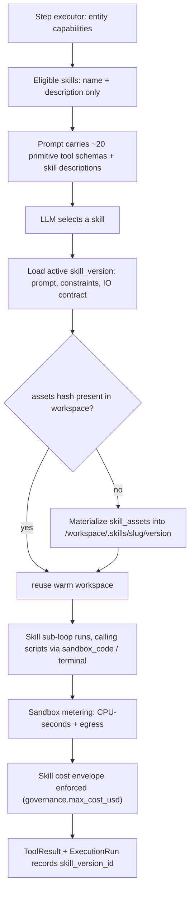

# Skill-First Capability Model

> **Target Platform Version:** road-map design (post-2.0.0)
> **Author:** Buddha Cognitive Lab
> **Last Updated:** August 2026 — v0.1 (initial design)
> **Status:** ⬜ Road map — design only, nothing in this document is shipped. Shipped tool architecture is documented in [09 — Tools & the Tool Registry](../../current/09-tools.md).
> **Decision framing:** should HireBuddha keep growing its built-in tool stack, or make the `SKILL` entity the primary unit of capability? This document argues for the latter, and specifies a **database-backed** skill model — explicitly *not* the filesystem/folder packaging used by Claude Code skills.

---

## Table of contents

1. [Summary and recommendation](#1-summary-and-recommendation)
2. [Where we are today](#2-where-we-are-today)
3. [Why the tool stack is the wrong place to keep growing](#3-why-the-tool-stack-is-the-wrong-place-to-keep-growing)
4. [What stays a tool](#4-what-stays-a-tool)
5. [The two-tier target model](#5-the-two-tier-target-model)
6. [Storage: DB-backed skills, not folders](#6-storage-db-backed-skills-not-folders)
7. [Scripts and assets](#7-scripts-and-assets)
8. [Runtime images and dependencies](#8-runtime-images-and-dependencies)
9. [Execution flow](#9-execution-flow)
10. [Billing and governance](#10-billing-and-governance)
11. [Skill promotion — closing the SkillLibrary loop](#11-skill-promotion--closing-the-skilllibrary-loop)
12. [Migration sequencing](#12-migration-sequencing)
13. [Risks and open questions](#13-risks-and-open-questions)

---

## 1. Summary and recommendation

**Adopt a skill-first capability model — but as the default *authoring* path, not as a
replacement for tools.** Starve the tool layer down to a small set of primitives where
money, credentials, latency and guarantees live; move all workflow-shaped variability
into `SKILL` entities.

**Store skills in the database, not in versioned folders.** The folder layout used by
Claude Code is a packaging choice for a filesystem-based CLI runtime. The three
properties that actually matter — skills are *data not code*, *progressively
disclosed*, and *versioned* — are all achievable on `hierarchical_entities` plus an
append-only version table, and the DB gives us tenant isolation and queryability that
folders cannot.

**Scripts are rows, materialized into the sandbox at run time.** The execution model
already exists in [`SandboxedSynthesizedTool`](../../../backend/src/ai/tools/sandbox/synthesized_tool.py):
source lives in the database, is never imported in-process, and executes only inside
the per-tenant container. Skill scripts reuse that invariant verbatim.

---

## 2. Where we are today

Three relevant facts about the shipped system:

| Fact | Where | Consequence |
|---|---|---|
| 98 tools register into a process-local dict at import time | [`tools/__init__.py`](../../../backend/src/ai/tools/__init__.py), [`ToolRegistry`](../../../backend/src/ai/tools/base.py:149) | Every new capability is a Python class and a deploy |
| 64 of the 98 are per-verb social platform wrappers | [09 §10](../../current/09-tools.md) | Schema bloat in the sandwich prompt on every LLM turn |
| `tool_registry_entries` rows are metadata only — nothing turns a row into an executable | [09 §19](../../current/09-tools.md) | "Custom tools" are not actually customer-authorable |

And two that are more encouraging:

- **The `SKILL` entity tier already has the right shape.** A Document Factory SKILL
  ([`skills.py`](../../../backend/scripts/seeds/default_entities/SeedDocumentFactory/skills.py))
  is a name, description, system prompt, behavioral constraints, an IO contract, and
  `capabilities.tools = [sandbox_code, terminal]`. That is structurally a Claude skill —
  instructions plus a sandbox — differing only in packaging and in that selection is
  fixed by declared children rather than decided at run time.
- **The DB-backed dynamic-code execution path is already built and tested.**
  `SandboxedSynthesizedTool` stores source in the DB, replays it through the sandbox
  harness, and lets only stdout cross back. `TenantSandboxManager` maintains one
  long-lived container per company with a persistent bind-mounted workspace.

The gap is that these two have never been connected.

### 2.1 A concrete defect in the current Doc Factory

Doc Factory ACTIONs have **no scripts at all** — the docx-js / PptxGenJS boilerplate is
inlined as fenced code blocks inside `identity.system_prompt`
(see [`actions_docx.py`](../../../backend/scripts/seeds/default_entities/SeedDocumentFactory/actions_docx.py)).
The model retypes deterministic setup code on every single run: tokens spent, and a
fresh opportunity to typo, per execution.

The correct split is **deterministic boilerplate → a stored script the model calls**;
**judgment → prose in the prompt** ("always set page size explicitly", "never use
unicode bullets"). This cleanup is worth doing on its own merits, independent of
everything else in this document.

---

## 3. Why the tool stack is the wrong place to keep growing

1. **Context cost scales with tools, not skills.** Every declared tool becomes a JSON
   function declaration in the sandwich prompt on *every* turn. Sixty-four social tools
   is a lot of schema for a model that needed one. Skills invert this: one line of
   description in context, full instructions loaded only on selection. Tool count makes
   the model worse as it grows; skill count, done with progressive disclosure, does not.
2. **Every tool is a deploy.** Because the registry is code, a capability means a Python
   class, a merge and a release. For a multi-tenant product where customers want *their*
   workflow, that ceiling is the binding constraint.
3. **Per-tool defensive parsing.** The tool interface is stringly typed and "a large
   fraction of tool code is defensive JSON parsing" ([09 §1](../../current/09-tools.md)).
   That is ~98 copies of one problem. Skills push variability into prose, which the model
   handles natively.

---

## 4. What stays a tool

Skills are not universally better. A **tool** remains correct when:

- **Money or metered side effects are involved.** Cost lookup, `UsageLog`, budgets and
  rate limits all key off tool identity. A skill that shells out through `sandbox_code`
  is a billing black hole — see §10, which is the single biggest blocker to a naive
  migration.
- **Credentials must not reach the model.** OAuth tokens, SMTP credentials and CRM keys
  belong behind a tool boundary, never inside a sandbox a prompt can steer.
- **Latency matters.** A tool call is one API hop; a skill is a sub-agent loop.
  `search` should stay a tool permanently.
- **The contract is narrow and stable.** `calculate` does not need prose.

---

## 5. The two-tier target model

**Tier 1 — primitives (target ~20–25 tools).** `search`, `scrape`, `calculate`,
`sandbox_code`, `terminal`, `browser`, file IO, LLM call, plus **one generic
authenticated caller per integration family** rather than one tool per verb.

> The 64 social tools collapse to ~16 `social_call(platform, operation, payload)` tools,
> or plausibly one, with per-platform knowledge moving into skills. This single change is
> the highest-leverage item in this document.

**Tier 2 — skills as the authoring surface.** `SKILL` entities carry the workflow
knowledge, the scripts, and the IO contract. Authored through an admin UI, versioned,
tenant-scoped, HITL-approved — never a code deploy.

---

## 6. Storage: DB-backed skills, not folders

### 6.1 Why not folders

A versioned folder gives us git diffs and PR review, and costs us:

- **Multi-tenancy** — no row-level isolation; tenant skills would need a parallel bucket
  mechanism with its own access control.
- **Queryability** — no way to ask "which skills target the pptx runtime" or "which
  skills has this tenant modified".
- **Deploy coupling** — first-party skill changes become releases or bucket syncs.

None of the three essential properties requires a filesystem.

### 6.2 What we add instead

`hierarchical_entities` stays the source of truth for a skill's identity. Two additions:

| Table | Purpose |
|---|---|
| `skill_versions` | **Append-only** immutable snapshots of a skill's prompt, constraints, IO contract, runtime image ref, and asset manifest. The entity holds `active_version_id`. |
| `skill_assets` | `(skill_version_id, path, content_hash, language, body)` — the scripts and small text assets belonging to one version. Large binaries (templates, fonts, reference documents) live in object storage, addressed by hash. |

This buys what the current mutable `version: "1.0.0"` string does not: rollback, diffs,
and **provenance on `ExecutionRun`** — recording which exact skill version produced a
given run.

### 6.3 Authoring

A skill editor in the admin panel replaces the seed scripts: prompt, constraints, IO
contract, attached scripts, a **test run** button, and *publish* → new immutable version
→ existing HITL approval flow. The Python seed files
([`SeedDocumentFactory/`](../../../backend/scripts/seeds/default_entities/SeedDocumentFactory/))
remain only as a bootstrap loader for first-party defaults.

---

## 7. Scripts and assets

**A script is a row, not a file.** Lifecycle:

1. Authored or uploaded in the skill editor; stored in `skill_assets` against a version.
2. On skill selection, the version's assets are materialized into the tenant workspace at
   `/workspace/.skills/<slug>/<version>/`. `TenantSandboxManager` already bind-mounts
   `/tmp/sandbox/<company_id>` persistently, so this survives container recreation.
3. The tree is content-hashed; a repeat run against a warm container is a no-op. This is
   why the long-lived per-tenant container design pays off here.
4. The model is handed the *path*, and calls the script via `sandbox_code` / `terminal`.
   Source still never enters the API process — the `SandboxedSynthesizedTool` invariant.

---

## 8. Runtime images and dependencies

**Dependencies belong to the image, not the skill.** A skill declares
`runtime: doc-runtime@3`; the image bakes in `docx-js`, `PptxGenJS`, `pandoc`,
`markitdown`, etc.

Skills **must not** `npm install` or `pip install` at run time:

- it is slow on every cold run;
- it is an egress and supply-chain hole through the very
  [`egress_proxy`](../../../backend/src/ai/tools/sandbox/egress_proxy.py) built to
  control egress;
- it makes runs non-reproducible, defeating the provenance in §6.2.

A skill needing a new dependency is a runtime-image PR — rare, reviewed, and correctly a
deploy. Expect a small number of named images (`doc-runtime`, `data-runtime`, …), each
independently versioned.

---

## 9. Execution flow



Progressive disclosure is the load-bearing property: only `name + description` per skill
sits in context until selection.

---

## 10. Billing and governance

**This is the gate on migrating anything revenue-bearing.** Today, cost attribution keys
off tool identity; work performed inside `terminal` inside a skill is invisible to it.

Required before any billed capability moves from a tool to a skill:

1. **Meter the sandbox itself** — CPU-seconds and egress bytes, via
   [`metering.py`](../../../backend/src/ai/tools/sandbox/metering.py) — so sandbox work has
   a cost even when no priced tool was called.
2. **Cost envelope per skill** — `governance.max_cost_usd` (Doc Factory already sets
   `0.50`) enforced as a hard stop, not advice.
3. **Attribute to the skill version**, so per-skill unit economics are visible.

Governance caveat: a tool either ran or did not; a skill's prose constraints can be
*partially* followed. Prose is not enforcement. Anywhere a compliance story depends on a
guarantee, keep the hard tool boundary — and expect skill-based paths to need stronger
critics than the tool-based paths they replace.

---

## 11. Skill promotion — closing the SkillLibrary loop

[`SkillLibrary`](../../../backend/src/ai/meta/skill_library.py:41) already detects repeated
tool chains as skill candidates and feeds the meta-intelligence tree; `SkillExecutor`
remains a stub ([`executors/stubs.py`](../../../backend/src/ai/core/executors/stubs.py:50)).

Once skills are data with immutable versions and an approval flow, promotion becomes
real and mostly plumbing:

```
detected repeated chain  →  drafted skill version (prompt + extracted script)
                         →  HITL approval  →  ACTIVE skill
```

That is a genuinely differentiated product story — the platform observing its own runs and
proposing new capabilities — and it is unreachable while capabilities are Python classes.

---

## 12. Migration sequencing

Prove the model on one family before touching anything else.

| Phase | Scope | Exit criterion |
|---|---|---|
| 0 | Doc Factory boilerplate split (§2.1): extract inlined code into `skill_assets`, keep judgment in prompts | Token-per-run down, task success flat or better |
| 1 | `skill_versions` + `skill_assets` schema, materialization, `ExecutionRun.skill_version_id` | Doc Factory runs reproducibly from a pinned version |
| 2 | Sandbox metering + per-skill cost envelope (§10) | A skill run's cost is attributable without any priced tool call |
| 3 | **Social pilot** — collapse 64 tools to a primitive + platform skills | Prompt tokens/run and task success measured against the current path |
| 4 | Skill authoring UI + HITL publish | A tenant ships a skill with no deploy |
| 5 | Decide on email / CRM / media families on the pilot's evidence | — |

Doc Factory stays as the reference implementation throughout. **Nothing else migrates
until phase 3 has measurements.**

---

## 13. Risks and open questions

- **Determinism regression.** Skills trade guaranteed execution for flexibility. Mitigation:
  hard tool boundaries wherever governance, HITL or audit depends on it; stronger critics
  on skill paths.
- **Prompt-injection reach.** A skill materialized from a *tenant-authored* row and executed
  in a shared workspace widens what a compromised prompt can touch. Requires a review of
  workspace isolation between skills before tenant authoring ships (phase 4).
- **Skill sprawl.** Progressive disclosure fixes context cost, not *selection* accuracy at
  high skill counts. Open question: does selection need retrieval/ranking, and at what count
  does it start to matter?
- **Loss of `git diff`.** Immutable version rows plus a diff view cover most of it. If
  first-party skills later want real git review, export-to-repo is a one-way sync that does
  not change the runtime.
- **Sandbox cost model unknown.** §10's metering may reveal that skill-based paths are
  materially more expensive per task than tool-based ones. Phase 2 exists to find out before
  phase 3 commits.

---

## Related documents

- [09 — Tools & the Tool Registry](../../current/09-tools.md) — shipped tool architecture
- [05 — Agent kernel](../../current/05-agent-kernel.md) — the loop that decides *when*
- [11 — Meta-intelligence](../../current/11-meta-intelligence.md) — `SkillLibrary`, Architecture Board
- [14 — Billing and credits](../../current/14-billing-and-credits.md) — cost attribution today
